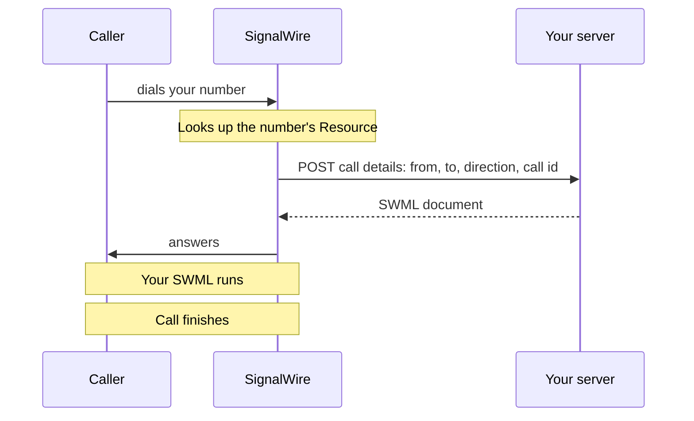
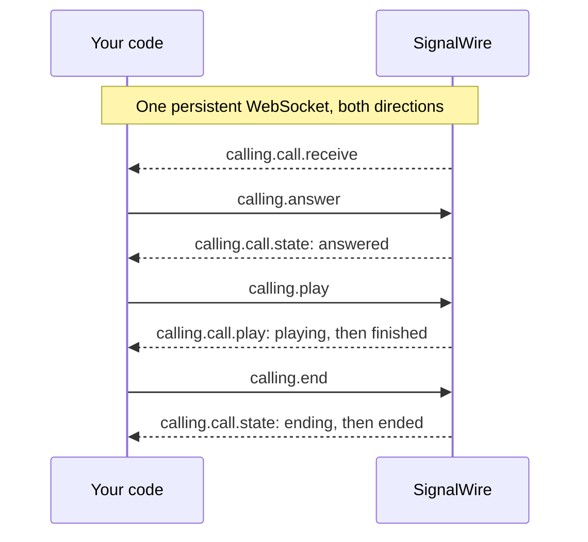

[trial-mode]: /docs/platform/trial-mode
[api-credentials]: /docs/platform/your-signalwire-api-space
[phone-numbers]: /docs/platform/phone-numbers
[resources]: /docs/platform/resources
[addresses]: /docs/platform/addresses
[subscribers]: /docs/platform/subscribers
[webhooks]: /docs/platform/webhooks
[ai-best-practices]: /docs/platform/ai/best-practices
[swml-quickstart]: /docs/swml/guides
[swml-webhook-security]: /docs/swml/guides/webhook-security
[swml-ivr]: /docs/swml/guides/ivr
[swml-call-whisper]: /docs/swml/guides/call-whisper
[swml-webhook-payload]: /docs/swml/reference/calling#webhook-payload
[swml-variables]: /docs/swml/reference/variables
[swml-ai]: /docs/swml/reference/calling/ai
[swml-prompt]: /docs/swml/reference/calling/prompt
[swml-switch]: /docs/swml/reference/calling/switch
[swml-connect]: /docs/swml/reference/calling/connect
[swml-enter-queue]: /docs/swml/reference/calling/enter-queue
[swml-request]: /docs/swml/reference/calling/request
[swml-record]: /docs/swml/reference/calling/record
[swml-record-call]: /docs/swml/reference/calling/record-call
[swml-stream]: /docs/swml/reference/calling/stream
[py-relay-call]: /docs/server-sdks/reference/python/relay/call
[py-relay-events]: /docs/server-sdks/reference/python/relay/events
[py-swml-service]: /docs/server-sdks/reference/python/agents/swml-service
[py-swml-builder]: /docs/server-sdks/reference/python/agents/swml-builder
[ts-swml-builder]: /docs/server-sdks/reference/typescript/agents/swml-builder
[py-relay-client]: /docs/server-sdks/reference/python/relay/client
[ts-relay-client]: /docs/server-sdks/reference/typescript/relay/client
[py-set-swml-webhook]: /docs/server-sdks/reference/python/rest/phone-numbers/set-swml-webhook
[ts-set-swml-webhook]: /docs/server-sdks/reference/typescript/rest/phone-numbers/set-swml-webhook
[py-set-relay-topic]: /docs/server-sdks/reference/python/rest/phone-numbers/set-relay-topic
[ts-set-relay-topic]: /docs/server-sdks/reference/typescript/rest/phone-numbers/set-relay-topic
[rest-update-number]: /docs/apis/rest/phone-numbers/update-phone-number
[rest-list-numbers]: /docs/apis/rest/phone-numbers/list-phone-numbers
[py-create-swml-webhooks]: /docs/server-sdks/reference/python/rest/fabric/swml-webhooks/create
[ts-create-swml-webhooks]: /docs/server-sdks/reference/typescript/rest/fabric/swml-webhooks/create
[py-create-relay-applications]: /docs/server-sdks/reference/python/rest/fabric/relay-applications/create
[ts-create-relay-applications]: /docs/server-sdks/reference/typescript/rest/fabric/relay-applications/create
[py-create-swml-scripts]: /docs/server-sdks/reference/python/rest/fabric/swml-scripts/create
[ts-create-swml-scripts]: /docs/server-sdks/reference/typescript/rest/fabric/swml-scripts/create
[py-create-subscribers]: /docs/server-sdks/reference/python/rest/fabric/subscribers/create
[ts-create-subscribers]: /docs/server-sdks/reference/typescript/rest/fabric/subscribers/create
[rest-create-script]: /docs/apis/rest/swml-scripts/create-swml-script
[rest-create-webhook]: /docs/apis/rest/swml-webhook/create-swml-webhook
[rest-create-relay-app]: /docs/apis/rest/relay-application/create-relay-application
[rest-create-subscriber]: /docs/apis/rest/subscribers/create-subscriber
[rest-create-sip]: /docs/apis/rest/sip-addresses/create-sip-address
[rest-create-alias]: /docs/apis/rest/alias-addresses/create-alias-address
[outbound-calling]: /docs/platform/voice/outbound-calling
[rest-link-number]: /docs/apis/rest/phone-number-addresses/create-phone-number-address
[subscriber-token]: /docs/apis/rest/subscribers/tokens/create-subscriber-token
[browser-auth]: /docs/browser-sdk/v4/guides/authentication
[browser-inbound]: /docs/browser-sdk/v4/guides/inbound-calls
[browser-call-controls]: /docs/browser-sdk/v4/guides/call-controls
[browser-device-management]: /docs/browser-sdk/v4/guides/device-management
[browser-register]: /docs/browser-sdk/v4/reference/signalwire/register
[browser-session-state]: /docs/browser-sdk/v4/reference/interfaces/session-state
[browser-call]: /docs/browser-sdk/v4/reference/interfaces/call
[browser-transfer]: /docs/browser-sdk/v4/reference/webrtc-call/transfer

Answer an inbound call with SignalWire and choose what happens when someone calls you.
Start by calling your SignalWire number and playing a short announcement, then find out who's
calling, run an AI agent, forward to a person, or let users answer from your web app.
You can also receive calls through a SIP address or an alias.

## Prepare for your first call

Have these values ready:

- A voice-capable [phone number in your Space][phone-numbers] and a phone to call it from.
  If you're testing with SIP or another SignalWire client, you can use an address instead.
- For the Server SDK examples, your Space URL, Project ID, and API token from the Dashboard's
  [API credentials][api-credentials] page. Enable the token's **Voice** permission, and
  **Numbers** if you assign a phone number through the API.
- For browser answering, a [Subscriber][subscribers] and a [Subscriber token][subscriber-token]
  issued by your backend for that Subscriber.

<Warning title="Trial projects only receive phone calls from verified numbers">
A [trial project][trial-mode] receives calls to its phone numbers only from phone numbers it has
verified. Verify the phone you'll call from, or upgrade the project, before you dial.
</Warning>

## Answer your first call

Create a call handler, give it an address, and call that address to test it. The SWML and Relay
examples play a short announcement; the browser example lets you answer and speak on the call.

<Steps>

### Choose how to handle your call

Choose how your application handles the incoming call. The person who eventually speaks to
the caller can answer on a phone, a SIP device, or in a browser.

For example, a customer calls your company number, a SWML or Relay handler plays a greeting
and routes the call, and an agent answers at the destination. The company number stays assigned
to the routing handler. If the agent uses your web app, the Browser SDK receives the call as
that agent's Subscriber. These approaches can work together in the same call flow.

| Approach | Useful when | How the call reaches your logic or user |
|---|---|---|
| [Server SDK — HTTP (SWML)](#create-your-call-handler) | Your server chooses instructions for each incoming call | SignalWire requests a document from your public HTTPS endpoint and runs the SWML it returns. |
| [Server SDK — WebSocket (Relay)](#create-your-call-handler) | Your server makes decisions as call events arrive | A running Relay client receives calls for its topic and controls them over a persistent connection. |
| [Browser SDK](#create-your-call-handler) | An agent receives and handles calls in your web app | A browser client authenticated as the agent's Subscriber receives the call, provides media and in-call controls, and updates the page as its status changes. |
| [Hosted SWML](#create-your-call-handler) | You want SignalWire to host and run the call instructions | The assigned script runs in your Space, using call variables, branches, and HTTP requests as the flow needs them. |

If you just want to hear your first call work, choose **Hosted SWML**. SWML is the document of
call instructions SignalWire runs, whether you host it in your Space or return it from a server.
Both SWML approaches can look up data with [`request`][swml-request], branch with
[`switch`][swml-switch], and [forward the call to a person or place it in a queue](#route-the-call-to-a-person-or-queue).
Relay can bridge the caller to a person's phone or SIP device with `connect()`.

In SignalWire, your call handler is a [Resource][resources]. You'll create a SWML Script for
either SWML approach, a Relay Application for Relay, or use a Subscriber for the Browser SDK.
An [address][addresses] tells SignalWire which Resource should receive the call.

### Set your credentials

Replace the values used by your chosen example. Hosted SWML needs no credentials in the document.

| Value | Replace with |
|---|---|
| `<YOUR_SPACE>` | Your Space's subdomain in `<YOUR_SPACE>.signalwire.com` |
| `<YOUR_PROJECT_ID>` | Your Project ID |
| `<YOUR_API_TOKEN>` | Your API token, used only in server code |
| `<YOUR_SUBSCRIBER_ACCESS_TOKEN>` | A [Subscriber token][subscriber-token] created by your backend, for the Browser SDK example |

The HTTP example also needs a public HTTPS URL for your server. Its Python sample uses
`<YOUR_BASIC_AUTH_PASSWORD>` for a password you choose and `<YOUR_PUBLIC_HOST>` for your
server or tunnel's hostname.

### Choose how callers reach you

For this walkthrough, use your SignalWire phone number and call it from your own phone.
If you're testing from a SIP client or another SignalWire application, choose its address type
instead. Each works with the handlers above.

| Address | Who can call it | What to use for your test |
|---|---|---|
| Phone number | Anyone on the phone network, subject to trial restrictions | Your SignalWire number in E.164 format, such as `+12025550123` |
| SIP address | SIP softphones, PBXs, and carriers | The SIP URI assigned when you add the address |
| Alias | SignalWire clients and Resources with access to its context | The Resource's alias, such as `/private/inbound-welcome` |

You'll attach or find this address after creating the handler.

### Create your call handler

Open the tab for your approach. Complete its setup, then continue to **Give the Resource an address**.

<Tabs groupId="inbound-api">
<Tab title="HTTP (SWML)">

SignalWire requests a SWML document from your server when a call arrives. These examples return
instructions to play "Hello, welcome to SignalWire!" and end the call.

Run either server below, then expose port 3000 at a public HTTPS URL. A tunnel such as
[ngrok](https://ngrok.com/) works for development.

<CodeBlocks>
<CodeBlock title="Python — SWML server">
```python
# Install: python -m pip install signalwire-sdk==3.4.1
# Save as inbound_call.py and run: python inbound_call.py
from signalwire import SWMLBuilder, SWMLService

service = SWMLService(
    name="inbound-call",
    route="/swml",
    port=3000,
    basic_auth=("signalwire", "<YOUR_BASIC_AUTH_PASSWORD>"),
)
SWMLBuilder(service).say("Hello, welcome to SignalWire!")

# Serves the document at /swml. Put the credentials in the URL you give
# SignalWire: https://signalwire:<YOUR_BASIC_AUTH_PASSWORD>@<YOUR_PUBLIC_HOST>/swml
service.serve()
```
</CodeBlock>
<CodeBlock title="TypeScript — SWML server">
```typescript
// Install: npm install @signalwire/sdk@2.0.5
// This sample also runs as JavaScript: save as inbound-call.mjs,
// then run: node inbound-call.mjs
import { createServer } from "node:http";
import { SwmlBuilder } from "@signalwire/sdk";

const swml = new SwmlBuilder()
  .say("Hello, welcome to SignalWire!")
  .build();

// Serves the document at every path on port 3000.
createServer((request, response) => {
  response.setHeader("Content-Type", "application/json");
  response.end(JSON.stringify(swml));
}).listen(3000);
```
</CodeBlock>
</CodeBlocks>

The Python example uses [`SWMLBuilder`][py-swml-builder] to add instructions to the
[`SWMLService`][py-swml-service] that serves them. It requires the basic-auth credentials
in its URL: `https://signalwire:<YOUR_BASIC_AUTH_PASSWORD>@<YOUR_PUBLIC_HOST>/swml`.
The TypeScript server uses [`SwmlBuilder`][ts-swml-builder] and serves the document at every
path on port 3000. See [webhook security][swml-webhook-security] to verify incoming requests.

Once your server is reachable, create its Resource in the Dashboard:

1. Open **My Resources**, select **+ Add**, then **Script**, then **SWML Script**.
2. Name it **Inbound welcome** and leave **Used For** set to **Calling**.
3. Under **Handle Calls Using**, choose **External URL** and enter your server's public URL in
   **Primary Script URL**. Include the basic-auth credentials if you used the Python example.
4. Select **Create** and keep the server running.

To create it in code, use the [Python][py-create-swml-webhooks] or
[TypeScript][ts-create-swml-webhooks] SDK. The [SWML webhook REST endpoint][rest-create-webhook]
is also available.

</Tab>
<Tab title="WebSocket (Relay)">

Run either handler below and leave it running while you test. It receives calls on the
`inbound-calling` topic, answers, plays the announcement, and hangs up. The client holds a
WebSocket connection open, so you don't need a public HTTP endpoint.

<CodeBlocks>
<CodeBlock title="Python — Relay client">
```python
# Install: python -m pip install signalwire-sdk==3.4.1
# Save as inbound_call.py and run: python inbound_call.py
from signalwire.relay import RelayClient

client = RelayClient(
    project="<YOUR_PROJECT_ID>",
    token="<YOUR_API_TOKEN>",
    contexts=["inbound-calling"],
)

@client.on_call
async def handle_call(call):
    await call.answer()
    playback = await call.play([{
        "type": "tts",
        "params": {"text": "Hello, welcome to SignalWire!"},
    }])
    await playback.wait()
    await call.hangup()

client.run()
```
</CodeBlock>
<CodeBlock title="TypeScript — Relay client">
```typescript
// Install: npm install @signalwire/sdk@2.0.5
// This sample also runs as JavaScript: save as inbound-call.mjs,
// then run: node inbound-call.mjs
import { RelayClient } from "@signalwire/sdk";

const client = new RelayClient({
  project: "<YOUR_PROJECT_ID>",
  token: "<YOUR_API_TOKEN>",
  contexts: ["inbound-calling"],
});

client.onCall(async (call) => {
  await call.answer();
  const playback = await call.play([
    { type: "tts", text: "Hello, welcome to SignalWire!" },
  ]);
  await playback.wait();
  await call.hangup();
});

await client.run();
```
</CodeBlock>
</CodeBlocks>

Connect this handler to a Resource in the Dashboard:

1. Open **My Resources**, select **+ Add**, then **Relay Application**.
2. Name it **Inbound welcome** and enter `inbound-calling` as the **Topic**. It must match the
   `contexts` value in your code.
3. Select **Create**.

To create it in code, use the [Python][py-create-relay-applications] or
[TypeScript][ts-create-relay-applications] SDK. The [Relay Application REST endpoint][rest-create-relay-app]
is also available.
See the [Python][py-relay-client] or [TypeScript][ts-relay-client] Relay client reference for
more configuration options.

</Tab>
<Tab title="Browser SDK">

Use a [Subscriber][subscribers] as the Resource. Create one with the
[Python][py-create-subscribers] or [TypeScript][ts-create-subscribers] SDK, or the
[Subscribers REST endpoint][rest-create-subscriber], then issue a [Subscriber token][subscriber-token] with that Subscriber's
`reference`. Use the token in the example below and find the same Subscriber under **My Resources**
when you attach an address in the next step.

<Warning title="Receiving calls in the browser requires a Subscriber token">
Guest and embed tokens are outbound-only. The browser must authenticate as the Subscriber
receiving the call. A number can ring that Subscriber directly, or a call handler can route
the call to the Subscriber's address.
</Warning>

Run this example on a web page served over HTTPS or `localhost`, with the elements listed in
its comments. The page shows who is calling and lets you answer, decline, or hang up.

```javascript
// Install: npm install @signalwire/js@4.0.0-rc.2 rxjs@7.8.2
// Run on HTTPS or localhost with these elements in your page:
// <p id="status">Offline</p>
// <p id="caller"></p>
// <audio id="remote-audio" autoplay></audio>
// <button id="answer" type="button" disabled>Answer</button>
// <button id="decline" type="button" disabled>Decline</button>
// <button id="hangup" type="button" disabled>Hang up</button>
// Use a Subscriber Access Token issued by your backend for the Subscriber
// that the phone number rings.
import { SignalWire, StaticCredentialProvider } from "@signalwire/js";

const client = new SignalWire(new StaticCredentialProvider({
  token: "<YOUR_SUBSCRIBER_ACCESS_TOKEN>",
}));
const statusLine = document.querySelector("#status");
const callerLine = document.querySelector("#caller");
const remoteAudio = document.querySelector("#remote-audio");
const answerButton = document.querySelector("#answer");
const declineButton = document.querySelector("#decline");
const hangupButton = document.querySelector("#hangup");
const finalStatuses = new Set(["disconnected", "failed", "destroyed"]);

let currentCall = null;

await client.register();
statusLine.textContent = "Online";

client.session.incomingCalls$.subscribe((calls) => {
  const ringing = calls.find((call) => call.status === "ringing");
  if (!ringing || ringing === currentCall) return;
  currentCall = ringing;
  callerLine.textContent = `Incoming call from ${ringing.from}`;
  answerButton.disabled = false;
  declineButton.disabled = false;

  ringing.remoteStream$.subscribe((stream) => (remoteAudio.srcObject = stream));
  ringing.status$.subscribe((status) => {
    statusLine.textContent = status;
    if (status !== "ringing") {
      answerButton.disabled = true;
      declineButton.disabled = true;
    }
    if (status === "connected") hangupButton.disabled = false;
    if (finalStatuses.has(status)) {
      remoteAudio.srcObject = null;
      hangupButton.disabled = true;
      callerLine.textContent = "";
      if (currentCall === ringing) currentCall = null;
    }
  });
});

answerButton.onclick = () => {
  void currentCall?.answer({ audio: true, video: false });
};
declineButton.onclick = () => {
  void currentCall?.reject();
};
hangupButton.onclick = () => {
  void currentCall?.hangup().catch(console.error);
};
```

Awaiting [`register()`][browser-register] confirms the client is online. Keep the page open
while you test. The [complete browser example](#answer-in-the-browser) includes the HTML page
and fetches the token from your backend.

</Tab>
<Tab title="Hosted SWML">

Create a SWML Script in the Dashboard. SignalWire hosts and runs the document, so you don't
need to start a server.

1. Open **My Resources**, select **+ Add**, then **Script**, then **SWML Script**.
2. Name it **Inbound welcome** and leave **Used For** set to **Calling**.
3. Under **Handle Calls Using**, choose **Hosted Script** and paste the document below into
   **Primary Script**.
4. Select **Create**.

This document plays "Hello, welcome to SignalWire!" and ends the call:

<CodeBlocks>
<CodeBlock title="YAML">
```yaml
version: 1.0.0
sections:
  main:
    - play:
        url: 'say:Hello, welcome to SignalWire!'
```
</CodeBlock>
<CodeBlock title="JSON">
```json
{
  "version": "1.0.0",
  "sections": {
    "main": [
      { "play": { "url": "say:Hello, welcome to SignalWire!" } }
    ]
  }
}
```
</CodeBlock>
</CodeBlocks>

<Accordion title="Create the hosted script with a Server SDK or cURL">

Use the [Python][py-create-swml-scripts] or [TypeScript][ts-create-swml-scripts] SDK to build the
SWML and create its hosted Resource in one program. This replaces the Dashboard creation steps.
Both programs print the Resource ID; use that Resource when you assign the number next.

<CodeBlocks>
<CodeBlock title="Python — REST client">
```python
# Install: python -m pip install signalwire-sdk==3.4.1
# Save as inbound_script.py and run: python inbound_script.py
import json

from signalwire import SWMLBuilder, SWMLService
from signalwire.rest import RestClient

client = RestClient(
    project="<YOUR_PROJECT_ID>",
    token="<YOUR_API_TOKEN>",
    host="<YOUR_SPACE>.signalwire.com",
)

swml = (
    SWMLBuilder(SWMLService(name="inbound-welcome"))
    .say("Hello, welcome to SignalWire!")
    .build()
)

script = client.fabric.swml_scripts.create(
    name="Inbound welcome",
    contents=json.dumps(swml),
)
print(script["id"])
```
</CodeBlock>
<CodeBlock title="TypeScript — REST client">
```typescript
// Install: npm install @signalwire/sdk@2.0.5
// This sample also runs as JavaScript: save as inbound-script.mjs,
// then run: node inbound-script.mjs
import { RestClient, SwmlBuilder } from "@signalwire/sdk";

const client = new RestClient({
  project: "<YOUR_PROJECT_ID>",
  token: "<YOUR_API_TOKEN>",
  host: "<YOUR_SPACE>.signalwire.com",
});

const swml = new SwmlBuilder()
  .say("Hello, welcome to SignalWire!")
  .build();

const script = await client.fabric.swmlScripts.create({
  name: "Inbound welcome",
  contents: JSON.stringify(swml),
});
console.log(script.id);
```
</CodeBlock>
<CodeBlock title="cURL — REST API">
```bash
curl -X POST "https://<YOUR_SPACE>.signalwire.com/api/fabric/resources/swml_scripts" \
  -u "<YOUR_PROJECT_ID>:<YOUR_API_TOKEN>" \
  -H "Content-Type: application/json" \
  -d '{
    "name": "Inbound welcome",
    "contents": {
      "version": "1.0.0",
      "sections": {
        "main": [
          { "play": { "url": "say:Hello, welcome to SignalWire!" } }
        ]
      }
    }
  }'
```
</CodeBlock>
</CodeBlocks>

The SDKs send `contents` as a JSON string; the cURL alternative sends a JSON object. The
[SWML Script REST endpoint][rest-create-script] accepts both.

</Accordion>

See the [SWML quickstart][swml-quickstart] for more on hosted scripts.

</Tab>
</Tabs>

### Give the Resource an address

Use the Resource you just created as the address's **call handler**. For a phone number, the
call handler is separate from its message handler.

<Tabs groupId="inbound-address">
<Tab title="Phone number">

<Markdown src="/snippets/common/dashboard/_assign-resource-to-number.mdx" />

<Accordion title="Assign a phone number with a Server SDK or cURL">

For an HTTP SWML server or a Relay handler, the Server SDK can create and assign the Resource
in one request. Use this instead of the separate Resource creation and Dashboard assignment
steps above. Choose the example for your handler; assigning another handler replaces the
number's current call route.

Replace `<YOUR_PHONE_NUMBER_ID>` with the number's ID from its Dashboard page or
[List phone numbers][rest-list-numbers]. For HTTP SWML, replace `<YOUR_SWML_URL>` with your
server's public URL, including the basic-auth credentials for the Python server.

For an HTTP SWML handler, use [`set_swml_webhook`][py-set-swml-webhook] in Python or
[`setSwmlWebhook`][ts-set-swml-webhook] in TypeScript.

<CodeBlocks>
<CodeBlock title="Python — REST client">
```python
# Install: python -m pip install signalwire-sdk==3.4.1
# Save as assign_number.py and run: python assign_number.py
from signalwire.rest import RestClient

client = RestClient(
    project="<YOUR_PROJECT_ID>",
    token="<YOUR_API_TOKEN>",
    host="<YOUR_SPACE>.signalwire.com",
)

client.phone_numbers.set_swml_webhook("<YOUR_PHONE_NUMBER_ID>", "<YOUR_SWML_URL>")
```
</CodeBlock>
<CodeBlock title="TypeScript — REST client">
```typescript
// Install: npm install @signalwire/sdk@2.0.5
// This sample also runs as JavaScript: save as assign-number.mjs,
// then run: node assign-number.mjs
import { RestClient } from "@signalwire/sdk";

const client = new RestClient({
  project: "<YOUR_PROJECT_ID>",
  token: "<YOUR_API_TOKEN>",
  host: "<YOUR_SPACE>.signalwire.com",
});

await client.phoneNumbers.setSwmlWebhook("<YOUR_PHONE_NUMBER_ID>", "<YOUR_SWML_URL>");
```
</CodeBlock>
<CodeBlock title="cURL — Phone Numbers API">
```bash
curl -X PUT "https://<YOUR_SPACE>.signalwire.com/api/relay/rest/phone_numbers/<YOUR_PHONE_NUMBER_ID>" \
  -u "<YOUR_PROJECT_ID>:<YOUR_API_TOKEN>" \
  -H "Content-Type: application/json" \
  -d '{
    "call_handler": "relay_script",
    "call_relay_script_url": "<YOUR_SWML_URL>"
  }'
```
</CodeBlock>
</CodeBlocks>

For a Relay handler, use [`set_relay_topic`][py-set-relay-topic] in Python or
[`setRelayTopic`][ts-set-relay-topic] in TypeScript.

<CodeBlocks>
<CodeBlock title="Python — REST client">
```python
# Install: python -m pip install signalwire-sdk==3.4.1
# Save as assign_number.py and run: python assign_number.py
from signalwire.rest import RestClient

client = RestClient(
    project="<YOUR_PROJECT_ID>",
    token="<YOUR_API_TOKEN>",
    host="<YOUR_SPACE>.signalwire.com",
)

client.phone_numbers.set_relay_topic("<YOUR_PHONE_NUMBER_ID>", "inbound-calling")
```
</CodeBlock>
<CodeBlock title="TypeScript — REST client">
```typescript
// Install: npm install @signalwire/sdk@2.0.5
// This sample also runs as JavaScript: save as assign-number.mjs,
// then run: node assign-number.mjs
import { RestClient } from "@signalwire/sdk";

const client = new RestClient({
  project: "<YOUR_PROJECT_ID>",
  token: "<YOUR_API_TOKEN>",
  host: "<YOUR_SPACE>.signalwire.com",
});

await client.phoneNumbers.setRelayTopic("<YOUR_PHONE_NUMBER_ID>", { topic: "inbound-calling" });
```
</CodeBlock>
<CodeBlock title="cURL — Phone Numbers API">
```bash
curl -X PUT "https://<YOUR_SPACE>.signalwire.com/api/relay/rest/phone_numbers/<YOUR_PHONE_NUMBER_ID>" \
  -u "<YOUR_PROJECT_ID>:<YOUR_API_TOKEN>" \
  -H "Content-Type: application/json" \
  -d '{
    "call_handler": "relay_topic",
    "call_relay_topic": "inbound-calling"
  }'
```
</CodeBlock>
</CodeBlocks>

The cURL examples call [Update phone number][rest-update-number] directly.

To attach an existing Resource by ID, use [Create a phone number address][rest-link-number]
with the phone number, the Resource's ID, and `handler_type: "calling"`. This endpoint is in
beta and requires the number's calling channel to have no Resource assigned yet.

</Accordion>

</Tab>
<Tab title="SIP address">

1. Open the Resource from **My Resources**, then its **Addresses & Phone Numbers** tab.
2. Select **+ Add**, then **SIP Address**.
3. Leave **User** as `*`, pick a **Domain**, give the address a **Name**, and select **Create**.
4. Copy the assigned URI. With **User** set to `*`, you can dial it with any username, such as
   `sip:test@<YOUR_SPACE>-<domain>.dapp.signalwire.com`.

A password and IP allowlist are optional. If you configure either, your test client must meet
those requirements. To add the address through the API, use [Create a SIP address][rest-create-sip]
with your Resource's ID as `calling_handler_resource_id`.

</Tab>
<Tab title="Alias">

Open the Resource's **Addresses & Phone Numbers** tab and copy its automatically created alias.
Use the full address, including its context, such as `/private/inbound-welcome`.

A `private` alias is reachable by authenticated Subscribers and your project's own dials.
A guest token needs a `public` alias. To add one, select **+ Add**, then **Alias**, and fill in
**Name**, **Display Name**, **Context**, and **Channels**. Choose `public` as the context and
enable the calling channel you need.

To add an alias through the API, use [Create an alias address][rest-create-alias] with a `name`,
your `resource_id`, and a `context`. See the [Addresses guide][addresses] for access rules.

</Tab>
</Tabs>

### Place your test call

Call the address you assigned:

| Address | How to test |
|---|---|
| Phone number | Dial your SignalWire number from your phone. In a trial project, use a verified caller number. |
| SIP address | Dial the assigned URI from a SIP softphone or PBX. Supply the password if you configured one. |
| Alias | Use the [outbound browser example][outbound-calling] with the full alias as its destination. Use a Subscriber token for a private alias. |

With either SWML approach or Relay, you hear "Hello, welcome to SignalWire!" and the call ends.
With the browser handler, the page shows the incoming call. Select **Answer**, allow microphone
access, and select **Hang up** when you finish.

<Accordion title="If your test call doesn't connect">

Check assignment and execution separately. A number can have the right Resource assigned while
its HTTP server, Relay client, or browser is offline.

- Check that the address lists your Resource as its call handler. An unassigned phone number
  takes no action.
- In a trial project, call your SignalWire phone number from a verified number.
- For HTTP SWML, check that the server is running and SignalWire can reach its URL. Check the
  call in the Dashboard's **Logs** for request errors.
- For Relay, keep the client running and match the Resource's **Topic** to `contexts` in your code.
- For browser answering, keep the page open and use a Subscriber token for the Subscriber
  receiving the call. Check that the page says **Online** and that the number's handler or
  forwarding logic routes to that Subscriber.

</Accordion>

</Steps>

## Track the call's progress

Read the caller's details, then follow what happens after the call arrives. Use HTTP callbacks
with SWML or event subscriptions with Relay and the Browser SDK. Follow the section for the
approach you used for your first call.

### Read the call details via SWML

When your Server SDK app serves SWML over HTTP, SignalWire sends it a POST request whose `call`
object carries the `from` and `to` addresses, the `direction`, and the `call_id`, so your code
can decide the document per caller. `from` is a phone number, a SIP URI, or an alias, depending on how the
caller reached you. See the [webhook payload reference][swml-webhook-payload] for every field.

The same fields are available inside the document as [variables][swml-variables], so a hosted
document can use them too. The SDK examples below build a document that reads the caller's
address back to them. Run a builder example to print the document, then return it from your
HTTP handler or paste it into a hosted SWML Script. YAML and JSON show the same instructions.

<CodeBlocks>
<CodeBlock title="Python — SWML builder">
```python
# Install: python -m pip install signalwire-sdk==3.4.1
# Save as build_inbound.py and run: python build_inbound.py
import json
from signalwire import SWMLBuilder, SWMLService

swml = (
    SWMLBuilder(SWMLService(name="inbound-example-1"))
    .say("Thanks for calling from ${call.from}.")
    .build()
)
print(json.dumps(swml, indent=2))
```
</CodeBlock>
<CodeBlock title="TypeScript — SWML builder">
```typescript
// Install: npm install @signalwire/sdk@2.0.5
// This sample also runs as JavaScript: save as build-inbound.mjs,
// then run: node build-inbound.mjs
import { SwmlBuilder } from "@signalwire/sdk";

const swml = new SwmlBuilder()
  .say("Thanks for calling from ${call.from}.")
  .build();
console.log(JSON.stringify(swml, null, 2));
```
</CodeBlock>
<CodeBlock title="YAML">
```yaml
version: 1.0.0
sections:
  main:
    - play:
        url: 'say:Thanks for calling from ${call.from}.'
```
</CodeBlock>
<CodeBlock title="JSON">
```json
{
  "version": "1.0.0",
  "sections": {
    "main": [
      { "play": { "url": "say:Thanks for calling from ${call.from}." } }
    ]
  }
}
```
</CodeBlock>
</CodeBlocks>

Both hosted and HTTP-served SWML can fetch data with [`request`][swml-request] and branch on
the result with [`switch`][swml-switch], for example to look up the caller before routing them.

Individual methods report their own progress. Set `status_url` on [`record`][swml-record],
[`connect`][swml-connect], or [`stream`][swml-stream] to receive HTTP callbacks as that step
runs. The [webhooks guide][webhooks] covers endpoint setup and callback reliability.

This flow shows an inbound call handled by a SWML Script that fetches the document from your
server:

<llms-ignore>


</llms-ignore>

<llms-only>



</llms-only>

### Follow the call via WebSocket (Relay)

The [`Call`][py-relay-call] object your handler receives carries the caller in `device`,
together with `direction`, `context`, and `call_id`. Register a `calling.call.state` listener
to see `answered`, `ending`, and `ended` as they happen, and wait for the call to end before your
handler returns. The sample extends the first-run Relay handler; the highlighted lines are new.

<CodeBlocks>
<CodeBlock title="Python — Relay client">
```python {4,14-15,17-18,20,29}
# Install: python -m pip install signalwire-sdk==3.4.1
# Save as inbound_call.py and run: python inbound_call.py
from signalwire.relay import RelayClient
from signalwire.relay.event import CallStateEvent

client = RelayClient(
    project="<YOUR_PROJECT_ID>",
    token="<YOUR_API_TOKEN>",
    contexts=["inbound-calling"],
)

@client.on_call
async def handle_call(call):
    caller = call.device.get("params", {}).get("from_number", "unknown")
    print(f"Call {call.call_id} from {caller} on topic {call.context}")

    def handle_state(event: CallStateEvent):
        print(f"State: {event.call_state}, reason: {event.end_reason}")

    call.on("calling.call.state", handle_state)

    await call.answer()
    playback = await call.play([{
        "type": "tts",
        "params": {"text": "Hello, welcome to SignalWire!"},
    }])
    await playback.wait()
    await call.hangup()
    await call.wait_for_ended()

client.run()
```
</CodeBlock>
<CodeBlock title="TypeScript — Relay client">
```typescript {13-14,16-18,26}
// Install: npm install @signalwire/sdk@2.0.5
// This sample also runs as JavaScript: save as inbound-call.mjs,
// then run: node inbound-call.mjs
import { RelayClient } from "@signalwire/sdk";

const client = new RelayClient({
  project: "<YOUR_PROJECT_ID>",
  token: "<YOUR_API_TOKEN>",
  contexts: ["inbound-calling"],
});

client.onCall(async (call) => {
  const caller = call.device?.params?.from_number ?? "unknown";
  console.log(`Call ${call.callId} from ${caller} on topic ${call.context}`);

  call.on("calling.call.state", (event) => {
    console.log(`State: ${event.params.call_state}, reason: ${event.params.end_reason ?? ""}`);
  });

  await call.answer();
  const playback = await call.play([
    { type: "tts", text: "Hello, welcome to SignalWire!" },
  ]);
  await playback.wait();
  await call.hangup();
  await call.waitForEnded();
});

await client.run();
```
</CodeBlock>
</CodeBlocks>

For more event handlers, see
[Event listeners in the Relay client guide](/docs/server-sdks/guides/relay-client#event-listeners)
and the [events reference][py-relay-events].

This flow shows the events SignalWire sends and the commands your code returns over the same
persistent connection:

<llms-ignore>


</llms-ignore>

<llms-only>



</llms-only>

### Follow the call in the browser

Each entry in [`incomingCalls$`][browser-session-state] is a [`Call`][browser-call] with
`direction` set to `inbound`. Read `from` for the caller's address, `fromName` for a display
name when the caller supplied one, and `to` for the address that was dialed. SignalWire sends
`_undef_` as the display name when the calling leg didn't supply one, so fall back to `from`.

After the user answers, `status$` moves through `connecting` and `connected`, then
`disconnecting`, `disconnected`, and `destroyed` once the call ends. A call that leaves
`ringing` without reaching `connected` was declined or abandoned by the caller, so one
`status$` subscription can dismiss the ringing UI for every outcome.

## Examples

Keep the Resource and address from your first call. Change its behavior using one of the examples
below:

- **SWML:** start with the Python or TypeScript builder example. Each runs on its own and prints
  the document. Use its builder code in your HTTP handler, or paste the generated document into
  your hosted script. YAML and JSON follow the SDK examples.
- **Relay:** replace your server handler with the example and keep the `inbound-calling` topic.
- **Browser SDK:** use [Answer in the browser](#answer-in-the-browser) for a complete page.

| What you want to do | Example |
|---|---|
| Let an AI agent greet callers and answer questions | [Run an AI agent](#run-an-ai-agent) |
| Send callers to an agent or let them wait in a queue | [Route the call to a person or queue](#route-the-call-to-a-person-or-queue) |
| Route callers based on a keypad choice | [Build a phone menu](#build-a-phone-menu) |
| Connect the caller to a person and play that person a private introduction | [Forward the call with a whisper](#forward-the-call-with-a-whisper) |
| Save a message from the caller | [Take a voicemail](#take-a-voicemail) |
| Record a conversation | [Record the call](#record-the-call) |
| Send live audio to your service | [Stream the call audio](#stream-the-call-audio) |
| Let a user answer from your web app | [Answer in the browser](#answer-in-the-browser) |

### Run an AI agent

Start an AI agent that welcomes the caller and answers basic questions about SignalWire.

<Note title="Tell callers when they're talking to an AI">
Open with a greeting that says the call uses an artificial voice, and follow the
[AI best practices][ai-best-practices].
</Note>

#### Run an AI agent via SWML

Put an [`ai`][swml-ai] method in the document. SignalWire answers the call and hands it to the
agent, which runs until the caller hangs up.

<CodeBlocks>
<CodeBlock title="Python — SWML builder">
```python
# Install: python -m pip install signalwire-sdk==3.4.1
# Save as build_inbound.py and run: python build_inbound.py
import json
from signalwire import SWMLBuilder, SWMLService

swml = (
    SWMLBuilder(SWMLService(name="inbound-example-2"))
    .ai(
        params={"static_greeting": "Hello, welcome to SignalWire! This call uses an artificial voice.", "static_greeting_no_barge": True},
        prompt_text="Welcome the caller to SignalWire. Briefly explain that SignalWire provides APIs and SDKs for voice, messaging, video, and AI. Answer basic follow-up questions. If you are unsure, direct the caller to signalwire.com.",
    )
    .build()
)
print(json.dumps(swml, indent=2))
```
</CodeBlock>
<CodeBlock title="TypeScript — SWML builder">
```typescript
// Install: npm install @signalwire/sdk@2.0.5
// This sample also runs as JavaScript: save as build-inbound.mjs,
// then run: node build-inbound.mjs
import { SwmlBuilder } from "@signalwire/sdk";

const swml = new SwmlBuilder()
  .ai({
    params: {"static_greeting": "Hello, welcome to SignalWire! This call uses an artificial voice.", "static_greeting_no_barge": true},
    // @ts-expect-error SDK 2.0.5 types omit SWML's { text } prompt form.
    prompt: { text: "Welcome the caller to SignalWire. Briefly explain that SignalWire provides APIs and SDKs for voice, messaging, video, and AI. Answer basic follow-up questions. If you are unsure, direct the caller to signalwire.com." },
  })
  .build();
console.log(JSON.stringify(swml, null, 2));
```
</CodeBlock>
<CodeBlock title="YAML">
```yaml
version: 1.0.0
sections:
  main:
    - ai:
        params:
          static_greeting: Hello, welcome to SignalWire! This call uses an artificial voice.
          static_greeting_no_barge: true
        prompt:
          text: >-
            Welcome the caller to SignalWire. Briefly explain that SignalWire provides
            APIs and SDKs for voice, messaging, video, and AI. Answer basic follow-up
            questions. If you are unsure, direct the caller to signalwire.com.
```
</CodeBlock>
<CodeBlock title="JSON">
```json
{
  "version": "1.0.0",
  "sections": {
    "main": [
      {
        "ai": {
          "params": {
            "static_greeting": "Hello, welcome to SignalWire! This call uses an artificial voice.",
            "static_greeting_no_barge": true
          },
          "prompt": {
            "text": "Welcome the caller to SignalWire. Briefly explain that SignalWire provides APIs and SDKs for voice, messaging, video, and AI. Answer basic follow-up questions. If you are unsure, direct the caller to signalwire.com."
          }
        }
      }
    ]
  }
}
```
</CodeBlock>
</CodeBlocks>

#### Run an AI agent via WebSocket (Relay)

Answer the call, start the agent with `call.ai()`, and keep the handler alive until the call ends.

<CodeBlocks>
<CodeBlock title="Python — Relay client">
```python
# Install: python -m pip install signalwire-sdk==3.4.1
# Save as inbound_call.py and run: python inbound_call.py
from signalwire.relay import RelayClient

client = RelayClient(
    project="<YOUR_PROJECT_ID>",
    token="<YOUR_API_TOKEN>",
    contexts=["inbound-calling"],
)

@client.on_call
async def handle_call(call):
    await call.answer()
    await call.ai(
        ai_params={
            "static_greeting": "Hello, welcome to SignalWire! This call uses an artificial voice.",
            "static_greeting_no_barge": True,
        },
        prompt={
            "text": """Welcome the caller to SignalWire. Briefly explain that SignalWire
provides APIs and SDKs for voice, messaging, video, and AI. Answer basic
follow-up questions. If you are unsure, direct the caller to signalwire.com."""
        },
    )
    # Keep the handler alive until the caller hangs up.
    await call.wait_for_ended()

client.run()
```
</CodeBlock>
<CodeBlock title="TypeScript — Relay client">
```typescript
// Install: npm install @signalwire/sdk@2.0.5
// This sample also runs as JavaScript: save as inbound-call.mjs,
// then run: node inbound-call.mjs
import { RelayClient } from "@signalwire/sdk";

const client = new RelayClient({
  project: "<YOUR_PROJECT_ID>",
  token: "<YOUR_API_TOKEN>",
  contexts: ["inbound-calling"],
});

client.onCall(async (call) => {
  await call.answer();
  await call.ai({
    aiParams: {
      static_greeting: "Hello, welcome to SignalWire! This call uses an artificial voice.",
      static_greeting_no_barge: true,
    },
    prompt: {
      text: `Welcome the caller to SignalWire. Briefly explain that SignalWire
  provides APIs and SDKs for voice, messaging, video, and AI. Answer basic
  follow-up questions. If you are unsure, direct the caller to signalwire.com.`,
    },
  });
  // Keep the handler alive until the caller hangs up.
  await call.waitForEnded();
});

await client.run();
```
</CodeBlock>
</CodeBlocks>

### Build a phone menu

Offer the caller a choice, then connect them to the matching destination. Replace
`<YOUR_SALES_DESTINATION>` and `<YOUR_SUPPORT_DESTINATION>` with phone numbers in E.164 format.
SWML `connect` also accepts SIP URIs and Resource addresses.

#### Build a phone menu via SWML

Use [`prompt`][swml-prompt] to collect a digit and [`switch`][swml-switch] on `prompt_value` to
pick the destination. See the [IVR guide][swml-ivr] for a fuller menu with speech input.

<CodeBlocks>
<CodeBlock title="Python — SWML builder">
```python
# Install: python -m pip install signalwire-sdk==3.4.1
# Save as build_inbound.py and run: python build_inbound.py
import json
from signalwire import SWMLBuilder, SWMLService

sales = (
    SWMLBuilder(SWMLService(name="inbound-example-3-sales"))
    .connect(
        to="<YOUR_SALES_DESTINATION>",
    )
    .build()["sections"]["main"]
)

support = (
    SWMLBuilder(SWMLService(name="inbound-example-3-support"))
    .connect(
        to="<YOUR_SUPPORT_DESTINATION>",
    )
    .build()["sections"]["main"]
)

invalid = (
    SWMLBuilder(SWMLService(name="inbound-example-3-invalid"))
    .say("Sorry, that is not a valid choice. Goodbye.")
    .hangup()
    .build()["sections"]["main"]
)

swml = (
    SWMLBuilder(SWMLService(name="inbound-example-3"))
    .prompt(
        play=["say:Thanks for calling SignalWire. Press 1 for sales or 2 for support."],
        max_digits=1,
    )
    .switch(
        variable="prompt_value",
        case={"1": sales, "2": support},
        default=invalid,
    )
    .build()
)
print(json.dumps(swml, indent=2))
```
</CodeBlock>
<CodeBlock title="TypeScript — SWML builder">
```typescript
// Install: npm install @signalwire/sdk@2.0.5
// This sample also runs as JavaScript: save as build-inbound.mjs,
// then run: node build-inbound.mjs
import { SwmlBuilder } from "@signalwire/sdk";

const sales = new SwmlBuilder()
  .connect({
    to: "<YOUR_SALES_DESTINATION>",
  })
  .document.sections.main;

const support = new SwmlBuilder()
  .connect({
    to: "<YOUR_SUPPORT_DESTINATION>",
  })
  .document.sections.main;

const invalid = new SwmlBuilder()
  .say("Sorry, that is not a valid choice. Goodbye.")
  .hangup()
  .document.sections.main;

const swml = new SwmlBuilder()
  .prompt({
    play: ["say:Thanks for calling SignalWire. Press 1 for sales or 2 for support."],
    max_digits: 1,
  })
  .switch({
    variable: "prompt_value",
    case: {"1": sales, "2": support},
    default: invalid,
  })
  .build();
console.log(JSON.stringify(swml, null, 2));
```
</CodeBlock>
<CodeBlock title="YAML">
```yaml
version: 1.0.0
sections:
  main:
    - prompt:
        play:
          - 'say:Thanks for calling SignalWire. Press 1 for sales or 2 for support.'
        max_digits: 1
    - switch:
        variable: prompt_value
        case:
          '1':
            - connect:
                to: '<YOUR_SALES_DESTINATION>'
          '2':
            - connect:
                to: '<YOUR_SUPPORT_DESTINATION>'
        default:
          - play:
              url: 'say:Sorry, that is not a valid choice. Goodbye.'
          - hangup: {}
```
</CodeBlock>
<CodeBlock title="JSON">
```json
{
  "version": "1.0.0",
  "sections": {
    "main": [
      {
        "prompt": {
          "play": ["say:Thanks for calling SignalWire. Press 1 for sales or 2 for support."],
          "max_digits": 1
        }
      },
      {
        "switch": {
          "variable": "prompt_value",
          "case": {
            "1": [{ "connect": { "to": "<YOUR_SALES_DESTINATION>" } }],
            "2": [{ "connect": { "to": "<YOUR_SUPPORT_DESTINATION>" } }]
          },
          "default": [
            { "play": { "url": "say:Sorry, that is not a valid choice. Goodbye." } },
            { "hangup": {} }
          ]
        }
      }
    ]
  }
}
```
</CodeBlock>
</CodeBlocks>

#### Build a phone menu via WebSocket (Relay)

Use `play_and_collect()` to play the prompt and wait for a digit, then bridge the call with
`connect()`.

<CodeBlocks>
<CodeBlock title="Python — Relay client">
```python
# Install: python -m pip install signalwire-sdk==3.4.1
# Save as inbound_call.py and run: python inbound_call.py
from signalwire.relay import RelayClient

DESTINATIONS = {
    "1": "<YOUR_SALES_DESTINATION>",
    "2": "<YOUR_SUPPORT_DESTINATION>",
}

client = RelayClient(
    project="<YOUR_PROJECT_ID>",
    token="<YOUR_API_TOKEN>",
    contexts=["inbound-calling"],
)

@client.on_call
async def handle_call(call):
    await call.answer()
    menu = await call.play_and_collect(
        media=[{
            "type": "tts",
            "params": {"text": "Thanks for calling SignalWire. Press 1 for sales or 2 for support."},
        }],
        collect={"digits": {"max": 1, "digit_timeout": 5}},
    )
    result = await menu.wait()
    digit = result.params.get("result", {}).get("digits", "")

    destination = DESTINATIONS.get(digit)
    if destination:
        await call.connect([[{"type": "phone", "params": {"to_number": destination}}]])
    else:
        goodbye = await call.play([{
            "type": "tts",
            "params": {"text": "Sorry, that is not a valid choice. Goodbye."},
        }])
        await goodbye.wait()
        await call.hangup()

client.run()
```
</CodeBlock>
<CodeBlock title="TypeScript — Relay client">
```typescript
// Install: npm install @signalwire/sdk@2.0.5
// Save as inbound-call.mts and run: npx tsx inbound-call.mts
import { RelayClient } from "@signalwire/sdk";

const DESTINATIONS: Record<string, string> = {
  "1": "<YOUR_SALES_DESTINATION>",
  "2": "<YOUR_SUPPORT_DESTINATION>",
};

const client = new RelayClient({
  project: "<YOUR_PROJECT_ID>",
  token: "<YOUR_API_TOKEN>",
  contexts: ["inbound-calling"],
});

client.onCall(async (call) => {
  await call.answer();
  const menu = await call.playAndCollect(
    [{ type: "tts", text: "Thanks for calling SignalWire. Press 1 for sales or 2 for support." }],
    { digits: { max: 1, digit_timeout: 5 } },
  );
  const result = await menu.wait();
  const digit = result.params?.result?.digits ?? "";

  const destination = DESTINATIONS[digit];
  if (destination) {
    await call.connect([[{ type: "phone", params: { to_number: destination } }]]);
  } else {
    const goodbye = await call.play([
      { type: "tts", text: "Sorry, that is not a valid choice. Goodbye." },
    ]);
    await goodbye.wait();
    await call.hangup();
  }
});

await client.run();
```
</CodeBlock>
</CodeBlocks>

### Route the call to a person or queue

Your company number can stay assigned to a SWML Script or Relay Application while an agent
answers the forwarded call. Choose the destination based on where the agent works:

| Where the agent answers | How to route the call |
|---|---|
| Phone | Use SWML `connect` with the agent's phone number, or Relay `connect()` with a phone device. |
| SIP device or PBX | Use SWML `connect` with a SIP URI, or Relay `connect()` with a SIP device. |
| Your web app | Use SWML `connect` with the agent's Subscriber address. The agent's Browser SDK client receives the call. |

For example, this document answers the company call, plays a greeting, and connects the caller
to an agent. Host it in your Space or return it from your HTTP server. Replace
`<YOUR_AGENT_DESTINATION>` with a phone number in E.164 format, a SIP URI, or a Subscriber
address such as `/private/support-agent`.

<CodeBlocks>
<CodeBlock title="Python — SWML builder">
```python
# Install: python -m pip install signalwire-sdk==3.4.1
# Save as build_inbound.py and run: python build_inbound.py
import json
from signalwire import SWMLBuilder, SWMLService

swml = (
    SWMLBuilder(SWMLService(name="inbound-example-4"))
    .answer()
    .say("Thanks for calling. Connecting you to our team.")
    .connect(
        to="<YOUR_AGENT_DESTINATION>",
    )
    .build()
)
print(json.dumps(swml, indent=2))
```
</CodeBlock>
<CodeBlock title="TypeScript — SWML builder">
```typescript
// Install: npm install @signalwire/sdk@2.0.5
// This sample also runs as JavaScript: save as build-inbound.mjs,
// then run: node build-inbound.mjs
import { SwmlBuilder } from "@signalwire/sdk";

const swml = new SwmlBuilder()
  .answer()
  .say("Thanks for calling. Connecting you to our team.")
  .connect({
    to: "<YOUR_AGENT_DESTINATION>",
  })
  .build();
console.log(JSON.stringify(swml, null, 2));
```
</CodeBlock>
<CodeBlock title="YAML">
```yaml
version: 1.0.0
sections:
  main:
    - answer: {}
    - play:
        url: 'say:Thanks for calling. Connecting you to our team.'
    - connect:
        to: '<YOUR_AGENT_DESTINATION>'
```
</CodeBlock>
<CodeBlock title="JSON">
```json
{
  "version": "1.0.0",
  "sections": {
    "main": [
      {
        "answer": {}
      },
      {
        "play": {
          "url": "say:Thanks for calling. Connecting you to our team."
        }
      },
      {
        "connect": {
          "to": "<YOUR_AGENT_DESTINATION>"
        }
      }
    ]
  }
}
```
</CodeBlock>
</CodeBlocks>

To let callers wait for an agent, use [`enter_queue`][swml-enter-queue] in the caller's SWML
document. The agent's call uses [`connect`][swml-connect] with `to: "queue:support"` to take a
caller from the `support` queue. Both queue operations require `transfer_after_bridge` to
specify the SWML to run after the conversation ends. See the method references for complete
queue examples.

### Forward the call with a whisper

Ring `<YOUR_AGENT_DESTINATION>`, play a private message to whoever answers, then connect them
to the caller.

#### Forward the call via SWML

Use `connect.confirm` to play the [whisper][swml-call-whisper] to the agent before bridging the
two legs.

<CodeBlocks>
<CodeBlock title="Python — SWML builder">
```python
# Install: python -m pip install signalwire-sdk==3.4.1
# Save as build_inbound.py and run: python build_inbound.py
import json
from signalwire import SWMLBuilder, SWMLService

whisper = (
    SWMLBuilder(SWMLService(name="inbound-example-5-whisper"))
    .say("You are about to be connected to a caller from ${call.from}.")
    .build()["sections"]["main"]
)

swml = (
    SWMLBuilder(SWMLService(name="inbound-example-5"))
    .say("Thanks for calling SignalWire. Connecting you now.")
    .connect(
        to="<YOUR_AGENT_DESTINATION>",
        confirm=whisper,
        confirm_timeout=20,
    )
    .build()
)
print(json.dumps(swml, indent=2))
```
</CodeBlock>
<CodeBlock title="TypeScript — SWML builder">
```typescript
// Install: npm install @signalwire/sdk@2.0.5
// This sample also runs as JavaScript: save as build-inbound.mjs,
// then run: node build-inbound.mjs
import { SwmlBuilder } from "@signalwire/sdk";

const whisper = new SwmlBuilder()
  .say("You are about to be connected to a caller from ${call.from}.")
  .document.sections.main;

const swml = new SwmlBuilder()
  .say("Thanks for calling SignalWire. Connecting you now.")
  .connect({
    to: "<YOUR_AGENT_DESTINATION>",
    confirm: whisper,
    confirm_timeout: 20,
  })
  .build();
console.log(JSON.stringify(swml, null, 2));
```
</CodeBlock>
<CodeBlock title="YAML">
```yaml
version: 1.0.0
sections:
  main:
    - play:
        url: 'say:Thanks for calling SignalWire. Connecting you now.'
    - connect:
        to: '<YOUR_AGENT_DESTINATION>'
        confirm:
          - play:
              url: 'say:You are about to be connected to a caller from ${call.from}.'
        confirm_timeout: 20
```
</CodeBlock>
<CodeBlock title="JSON">
```json
{
  "version": "1.0.0",
  "sections": {
    "main": [
      { "play": { "url": "say:Thanks for calling SignalWire. Connecting you now." } },
      {
        "connect": {
          "to": "<YOUR_AGENT_DESTINATION>",
          "confirm": [
            { "play": { "url": "say:You are about to be connected to a caller from ${call.from}." } }
          ],
          "confirm_timeout": 20
        }
      }
    ]
  }
}
```
</CodeBlock>
</CodeBlocks>

#### Forward the call via WebSocket (Relay)

Answer, tell the caller what's happening, then bridge with `connect()`. Pass `ringback` so the
caller hears ringing while the agent's phone rings.

<CodeBlocks>
<CodeBlock title="Python — Relay client">
```python
# Install: python -m pip install signalwire-sdk==3.4.1
# Save as inbound_call.py and run: python inbound_call.py
from signalwire.relay import RelayClient

client = RelayClient(
    project="<YOUR_PROJECT_ID>",
    token="<YOUR_API_TOKEN>",
    contexts=["inbound-calling"],
)

@client.on_call
async def handle_call(call):
    await call.answer()
    intro = await call.play([{
        "type": "tts",
        "params": {"text": "Thanks for calling SignalWire. Connecting you now."},
    }])
    await intro.wait()
    await call.connect(
        devices=[[{
            "type": "phone",
            "params": {"to_number": "<YOUR_AGENT_DESTINATION>", "timeout": 30},
        }]],
        ringback=[{"type": "ringtone", "params": {"name": "us"}}],
    )
    await call.wait_for_ended()

client.run()
```
</CodeBlock>
<CodeBlock title="TypeScript — Relay client">
```typescript
// Install: npm install @signalwire/sdk@2.0.5
// This sample also runs as JavaScript: save as inbound-call.mjs,
// then run: node inbound-call.mjs
import { RelayClient } from "@signalwire/sdk";

const client = new RelayClient({
  project: "<YOUR_PROJECT_ID>",
  token: "<YOUR_API_TOKEN>",
  contexts: ["inbound-calling"],
});

client.onCall(async (call) => {
  await call.answer();
  const intro = await call.play([
    { type: "tts", text: "Thanks for calling SignalWire. Connecting you now." },
  ]);
  await intro.wait();
  await call.connect(
    [[{ type: "phone", params: { to_number: "<YOUR_AGENT_DESTINATION>", timeout: 30 } }]],
    { ringback: [{ type: "ringtone", name: "us" }] },
  );
  await call.waitForEnded();
});

await client.run();
```
</CodeBlock>
</CodeBlocks>

### Take a voicemail

Play a greeting, record the caller after a beep, and stop when they go quiet or press the pound
key.

<Warning title="Recording consent is your responsibility">
Confirm which parties must consent and announce the recording when required.
</Warning>

#### Take a voicemail via SWML

[`record`][swml-record] runs in the foreground, so the document waits until the recording ends.
SignalWire posts the result to `status_url`, and `record_url` holds the recording's URL for
the rest of the document.

<CodeBlocks>
<CodeBlock title="Python — SWML builder">
```python
# Install: python -m pip install signalwire-sdk==3.4.1
# Save as build_inbound.py and run: python build_inbound.py
import json
from signalwire import SWMLBuilder, SWMLService

swml = (
    SWMLBuilder(SWMLService(name="inbound-example-6"))
    .say("Thanks for calling SignalWire. Leave a message after the beep, then press pound.")
    .record(
        format="mp3",
        beep=True,
        end_silence_timeout=3,
        terminators="#",
        status_url="<YOUR_RECORDING_STATUS_URL>",
    )
    .say("Thanks, goodbye.")
    .hangup()
    .build()
)
print(json.dumps(swml, indent=2))
```
</CodeBlock>
<CodeBlock title="TypeScript — SWML builder">
```typescript
// Install: npm install @signalwire/sdk@2.0.5
// This sample also runs as JavaScript: save as build-inbound.mjs,
// then run: node build-inbound.mjs
import { SwmlBuilder } from "@signalwire/sdk";

const swml = new SwmlBuilder()
  .say("Thanks for calling SignalWire. Leave a message after the beep, then press pound.")
  .record({
    format: "mp3",
    beep: true,
    end_silence_timeout: 3,
    terminators: "#",
    status_url: "<YOUR_RECORDING_STATUS_URL>",
  })
  .say("Thanks, goodbye.")
  .hangup()
  .build();
console.log(JSON.stringify(swml, null, 2));
```
</CodeBlock>
<CodeBlock title="YAML">
```yaml
version: 1.0.0
sections:
  main:
    - play:
        url: 'say:Thanks for calling SignalWire. Leave a message after the beep, then press pound.'
    - record:
        format: mp3
        beep: true
        end_silence_timeout: 3
        terminators: '#'
        status_url: '<YOUR_RECORDING_STATUS_URL>'
    - play:
        url: 'say:Thanks, goodbye.'
    - hangup: {}
```
</CodeBlock>
<CodeBlock title="JSON">
```json
{
  "version": "1.0.0",
  "sections": {
    "main": [
      { "play": { "url": "say:Thanks for calling SignalWire. Leave a message after the beep, then press pound." } },
      {
        "record": {
          "format": "mp3",
          "beep": true,
          "end_silence_timeout": 3,
          "terminators": "#",
          "status_url": "<YOUR_RECORDING_STATUS_URL>"
        }
      },
      { "play": { "url": "say:Thanks, goodbye." } },
      { "hangup": {} }
    ]
  }
}
```
</CodeBlock>
</CodeBlocks>

#### Take a voicemail via WebSocket (Relay)

Start `call.record()` after the greeting and read the recording URL from its `finished` event.

<CodeBlocks>
<CodeBlock title="Python — Relay client">
```python
# Install: python -m pip install signalwire-sdk==3.4.1
# Save as inbound_call.py and run: python inbound_call.py
from signalwire.relay import RelayClient

client = RelayClient(
    project="<YOUR_PROJECT_ID>",
    token="<YOUR_API_TOKEN>",
    contexts=["inbound-calling"],
)

@client.on_call
async def handle_call(call):
    await call.answer()
    greeting = await call.play([{
        "type": "tts",
        "params": {"text": "Thanks for calling SignalWire. Leave a message after the beep, then press pound."},
    }])
    await greeting.wait()

    recording = await call.record(
        audio={
            "format": "mp3",
            "beep": True,
            "end_silence_timeout": 3,
            "terminators": "#",
        },
    )
    finished = await recording.wait()
    print(f"Recording: {finished.url}")

    goodbye = await call.play([{"type": "tts", "params": {"text": "Thanks, goodbye."}}])
    await goodbye.wait()
    await call.hangup()

client.run()
```
</CodeBlock>
<CodeBlock title="TypeScript — Relay client">
```typescript
// Install: npm install @signalwire/sdk@2.0.5
// Save as inbound-call.mts and run: npx tsx inbound-call.mts
import { RelayClient, RecordEvent } from "@signalwire/sdk";

const client = new RelayClient({
  project: "<YOUR_PROJECT_ID>",
  token: "<YOUR_API_TOKEN>",
  contexts: ["inbound-calling"],
});

client.onCall(async (call) => {
  await call.answer();
  const greeting = await call.play([
    { type: "tts", text: "Thanks for calling SignalWire. Leave a message after the beep, then press pound." },
  ]);
  await greeting.wait();

  const recording = await call.record({
    format: "mp3",
    beep: true,
    end_silence_timeout: 3,
    terminators: "#",
  });
  const finished = await recording.wait();
  console.log(`Recording: ${(finished as RecordEvent).url}`);

  const goodbye = await call.play([{ type: "tts", text: "Thanks, goodbye." }]);
  await goodbye.wait();
  await call.hangup();
});

await client.run();
```
</CodeBlock>
</CodeBlocks>

### Record the call

Record both sides of an inbound call in the background while it's forwarded to
`<YOUR_AGENT_DESTINATION>`, and retrieve the finished recording URL.

Announce the recording where consent rules require it, as in the voicemail example above.

#### Record the call via SWML

Start [`record_call`][swml-record-call] before [`connect`][swml-connect]. Recording continues
while the two legs talk, and SignalWire posts the result to `status_url` when the recording
finishes.

<CodeBlocks>
<CodeBlock title="Python — SWML builder">
```python
# Install: python -m pip install signalwire-sdk==3.4.1
# Save as build_inbound.py and run: python build_inbound.py
import json
from signalwire import SWMLBuilder, SWMLService

swml = (
    SWMLBuilder(SWMLService(name="inbound-example-7"))
    .say("This call may be recorded. Connecting you now.")
    .record_call(
        format="mp3",
        direction="both",
        stereo=True,
        status_url="<YOUR_RECORDING_STATUS_URL>",
    )
    .connect(
        to="<YOUR_AGENT_DESTINATION>",
    )
    .build()
)
print(json.dumps(swml, indent=2))
```
</CodeBlock>
<CodeBlock title="TypeScript — SWML builder">
```typescript
// Install: npm install @signalwire/sdk@2.0.5
// This sample also runs as JavaScript: save as build-inbound.mjs,
// then run: node build-inbound.mjs
import { SwmlBuilder } from "@signalwire/sdk";

const swml = new SwmlBuilder()
  .say("This call may be recorded. Connecting you now.")
  .record_call({
    format: "mp3",
    direction: "both",
    stereo: true,
    status_url: "<YOUR_RECORDING_STATUS_URL>",
  })
  .connect({
    to: "<YOUR_AGENT_DESTINATION>",
  })
  .build();
console.log(JSON.stringify(swml, null, 2));
```
</CodeBlock>
<CodeBlock title="YAML">
```yaml
version: 1.0.0
sections:
  main:
    - play:
        url: 'say:This call may be recorded. Connecting you now.'
    - record_call:
        format: mp3
        direction: both
        stereo: true
        status_url: '<YOUR_RECORDING_STATUS_URL>'
    - connect:
        to: '<YOUR_AGENT_DESTINATION>'
```
</CodeBlock>
<CodeBlock title="JSON">
```json
{
  "version": "1.0.0",
  "sections": {
    "main": [
      { "play": { "url": "say:This call may be recorded. Connecting you now." } },
      {
        "record_call": {
          "format": "mp3",
          "direction": "both",
          "stereo": true,
          "status_url": "<YOUR_RECORDING_STATUS_URL>"
        }
      },
      { "connect": { "to": "<YOUR_AGENT_DESTINATION>" } }
    ]
  }
}
```
</CodeBlock>
</CodeBlocks>

#### Record the call via WebSocket (Relay)

Start `call.record()` with both directions, bridge the call, and read the URL after the call
ends.

<CodeBlocks>
<CodeBlock title="Python — Relay client">
```python
# Install: python -m pip install signalwire-sdk==3.4.1
# Save as inbound_call.py and run: python inbound_call.py
from signalwire.relay import RelayClient

client = RelayClient(
    project="<YOUR_PROJECT_ID>",
    token="<YOUR_API_TOKEN>",
    contexts=["inbound-calling"],
)

@client.on_call
async def handle_call(call):
    await call.answer()
    notice = await call.play([{
        "type": "tts",
        "params": {"text": "This call may be recorded. Connecting you now."},
    }])
    await notice.wait()

    recording = await call.record(
        audio={
            "format": "mp3",
            "direction": "both",
            "stereo": True,
            "initial_timeout": 0,
            "end_silence_timeout": 0,
        },
    )
    await call.connect([[{
        "type": "phone",
        "params": {"to_number": "<YOUR_AGENT_DESTINATION>", "timeout": 30},
    }]])
    await call.wait_for_ended()
    finished = await recording.wait()
    print(f"Recording: {finished.url}")

client.run()
```
</CodeBlock>
<CodeBlock title="TypeScript — Relay client">
```typescript
// Install: npm install @signalwire/sdk@2.0.5
// Save as inbound-call.mts and run: npx tsx inbound-call.mts
import { RelayClient, RecordEvent } from "@signalwire/sdk";

const client = new RelayClient({
  project: "<YOUR_PROJECT_ID>",
  token: "<YOUR_API_TOKEN>",
  contexts: ["inbound-calling"],
});

client.onCall(async (call) => {
  await call.answer();
  const notice = await call.play([
    { type: "tts", text: "This call may be recorded. Connecting you now." },
  ]);
  await notice.wait();

  const recording = await call.record({
    format: "mp3",
    direction: "both",
    stereo: true,
    initial_timeout: 0,
    end_silence_timeout: 0,
  });
  await call.connect([[
    { type: "phone", params: { to_number: "<YOUR_AGENT_DESTINATION>", timeout: 30 } },
  ]]);
  await call.waitForEnded();
  const finished = await recording.wait();
  console.log(`Recording: ${(finished as RecordEvent).url}`);
});

await client.run();
```
</CodeBlock>
</CodeBlocks>

### Stream the call audio

Stream both sides of a live inbound call to your secure WebSocket endpoint for real-time
processing.

#### Stream call audio via SWML

Start [`stream`][swml-stream] in the background and send its status events to your webhook.
The stream runs for as long as the rest of the document does, so follow it with the methods
that hold the call, such as `ai` or `connect`.

<CodeBlocks>
<CodeBlock title="Python — SWML builder">
```python
# Install: python -m pip install signalwire-sdk==3.4.1
# Save as build_inbound.py and run: python build_inbound.py
import json
from signalwire import SWMLBuilder, SWMLService

# signalwire-sdk==3.4.1 has no stream() builder method.
builder = SWMLBuilder(SWMLService(name="inbound-example-8", schema_validation=False))
builder.service.add_verb("stream", {"url": "<YOUR_AUDIO_STREAM_URL>", "track": "both_tracks", "codec": "PCMU", "status_url": "<YOUR_STREAM_STATUS_URL>"})
swml = (
    builder
    .say("Thanks for calling SignalWire. Connecting you now.")
    .connect(
        to="<YOUR_AGENT_DESTINATION>",
    )
    .build()
)
print(json.dumps(swml, indent=2))
```
</CodeBlock>
<CodeBlock title="TypeScript — SWML builder">
```typescript
// Install: npm install @signalwire/sdk@2.0.5
// This sample also runs as JavaScript: save as build-inbound.mjs,
// then run: node build-inbound.mjs
import { SwmlBuilder } from "@signalwire/sdk";

// @signalwire/sdk@2.0.5 has no stream() builder method.
const builder = new SwmlBuilder();
builder.setValidation(false);
builder.addVerb("stream", {"url": "<YOUR_AUDIO_STREAM_URL>", "track": "both_tracks", "codec": "PCMU", "status_url": "<YOUR_STREAM_STATUS_URL>"});
builder.setValidation(true);
const swml = builder
  .say("Thanks for calling SignalWire. Connecting you now.")
  .connect({
    to: "<YOUR_AGENT_DESTINATION>",
  })
  .build();
console.log(JSON.stringify(swml, null, 2));
```
</CodeBlock>
<CodeBlock title="YAML">
```yaml
version: 1.0.0
sections:
  main:
    - stream:
        url: '<YOUR_AUDIO_STREAM_URL>'
        track: both_tracks
        codec: PCMU
        status_url: '<YOUR_STREAM_STATUS_URL>'
    - play:
        url: 'say:Thanks for calling SignalWire. Connecting you now.'
    - connect:
        to: '<YOUR_AGENT_DESTINATION>'
```
</CodeBlock>
<CodeBlock title="JSON">
```json
{
  "version": "1.0.0",
  "sections": {
    "main": [
      {
        "stream": {
          "url": "<YOUR_AUDIO_STREAM_URL>",
          "track": "both_tracks",
          "codec": "PCMU",
          "status_url": "<YOUR_STREAM_STATUS_URL>"
        }
      },
      { "play": { "url": "say:Thanks for calling SignalWire. Connecting you now." } },
      { "connect": { "to": "<YOUR_AGENT_DESTINATION>" } }
    ]
  }
}
```
</CodeBlock>
</CodeBlocks>

#### Stream call audio via WebSocket (Relay)

Start `call.stream()` right after answering and keep it running until the call ends.

<CodeBlocks>
<CodeBlock title="Python — Relay client">
```python
# Install: python -m pip install signalwire-sdk==3.4.1
# Save as inbound_call.py and run: python inbound_call.py
from signalwire.relay import RelayClient

client = RelayClient(
    project="<YOUR_PROJECT_ID>",
    token="<YOUR_API_TOKEN>",
    contexts=["inbound-calling"],
)

@client.on_call
async def handle_call(call):
    await call.answer()
    stream = await call.stream(
        url="<YOUR_AUDIO_STREAM_URL>",
        track="both_tracks",
        codec="PCMU",
        custom_parameters={"session_id": "<YOUR_SESSION_ID>"},
    )
    print(f"Streaming audio, control ID {stream.control_id}")

    intro = await call.play([{
        "type": "tts",
        "params": {"text": "Thanks for calling SignalWire. Connecting you now."},
    }])
    await intro.wait()
    await call.connect([[{
        "type": "phone",
        "params": {"to_number": "<YOUR_AGENT_DESTINATION>", "timeout": 30},
    }]])
    await call.wait_for_ended()

client.run()
```
</CodeBlock>
<CodeBlock title="TypeScript — Relay client">
```typescript
// Install: npm install @signalwire/sdk@2.0.5
// This sample also runs as JavaScript: save as inbound-call.mjs,
// then run: node inbound-call.mjs
import { RelayClient } from "@signalwire/sdk";

const client = new RelayClient({
  project: "<YOUR_PROJECT_ID>",
  token: "<YOUR_API_TOKEN>",
  contexts: ["inbound-calling"],
});

client.onCall(async (call) => {
  await call.answer();
  const stream = await call.stream("<YOUR_AUDIO_STREAM_URL>", {
    track: "both_tracks",
    codec: "PCMU",
    customParameters: { session_id: "<YOUR_SESSION_ID>" },
  });
  console.log(`Streaming audio, control ID ${stream.controlId}`);

  const intro = await call.play([
    { type: "tts", text: "Thanks for calling SignalWire. Connecting you now." },
  ]);
  await intro.wait();
  await call.connect([[
    { type: "phone", params: { to_number: "<YOUR_AGENT_DESTINATION>", timeout: 30 } },
  ]]);
  await call.waitForEnded();
});

await client.run();
```
</CodeBlock>
</CodeBlocks>

### Answer in the browser

Receive the call on a web page as the agent's Subscriber. The company number can ring this
Subscriber directly or use a SWML handler that connects to the Subscriber's address, as shown
in [Route the call to a person or queue](#route-the-call-to-a-person-or-queue). The page fetches a
[Subscriber token][subscriber-token] from your backend, comes online, and shows a ringing state
until the user answers or declines. Serve the page over HTTPS or `localhost` so the browser can
access the microphone.

<CodeBlocks>
<CodeBlock title="index.html">
```html
<!doctype html>
<html lang="en">
  <head>
    <meta charset="utf-8" />
    <title>Answer with SignalWire</title>
  </head>
  <body>
    <p id="status">Offline</p>
    <p id="caller"></p>
    <button id="answer" type="button" disabled>Answer</button>
    <button id="decline" type="button" disabled>Decline</button>
    <button id="hangup" type="button" disabled>Hang up</button>
    <audio id="remote-audio" autoplay></audio>
    <script type="module" src="./answer.js"></script>
  </body>
</html>
```
</CodeBlock>
<CodeBlock title="answer.js">
```javascript
// Install: npm install @signalwire/js@4.0.0-rc.2 rxjs@7.8.2
// Save as answer.js next to the page above.
// GET /api/subscriber-token is your own endpoint: it creates a Subscriber
// token for the signed-in user with your Project API token and returns it
// as {"token": "..."}.
import { SignalWire, StaticCredentialProvider } from "@signalwire/js";

const statusLine = document.querySelector("#status");
const callerLine = document.querySelector("#caller");
const remoteAudio = document.querySelector("#remote-audio");
const answerButton = document.querySelector("#answer");
const declineButton = document.querySelector("#decline");
const hangupButton = document.querySelector("#hangup");
const finalStatuses = new Set(["disconnected", "failed", "destroyed"]);

let currentCall = null;

function reset() {
  remoteAudio.srcObject = null;
  callerLine.textContent = "";
  answerButton.disabled = true;
  declineButton.disabled = true;
  hangupButton.disabled = true;
}

async function comeOnline() {
  const response = await fetch("/api/subscriber-token");
  if (!response.ok) throw new Error(`Token request failed: ${response.status}`);
  const { token } = await response.json();
  if (!token) throw new Error("Token response did not include a token");

  const client = new SignalWire(new StaticCredentialProvider({ token }));
  await client.register();
  statusLine.textContent = "Online";

  client.session.incomingCalls$.subscribe((calls) => {
    const ringing = calls.find((call) => call.status === "ringing");
    if (!ringing || ringing === currentCall) return;
    currentCall = ringing;

    const callerName =
      ringing.fromName && ringing.fromName !== "_undef_" ? ringing.fromName : ringing.from;
    callerLine.textContent = `Incoming call from ${callerName}`;
    answerButton.disabled = false;
    declineButton.disabled = false;

    ringing.remoteStream$.subscribe((stream) => (remoteAudio.srcObject = stream));
    ringing.status$.subscribe((status) => {
      statusLine.textContent = status;
      if (status !== "ringing") {
        answerButton.disabled = true;
        declineButton.disabled = true;
      }
      if (status === "connected") hangupButton.disabled = false;
      if (finalStatuses.has(status)) {
        if (currentCall === ringing) currentCall = null;
        reset();
        statusLine.textContent = "Online";
      }
    });
  });
}

answerButton.onclick = () => {
  void currentCall?.answer({ audio: true, video: false });
};
declineButton.onclick = () => {
  void currentCall?.reject();
};
hangupButton.onclick = () => {
  void currentCall?.hangup().catch(console.error);
};

comeOnline().catch((error) => {
  statusLine.textContent = "Failed to come online";
  console.error(error);
});
```
</CodeBlock>
</CodeBlocks>

Once connected, the user can also [transfer the call][browser-transfer] to a SIP URI or another
Resource address if the call has the `transfer` capability.

#### Choose what the user sends back

`answer()` takes the same `audio` and `video` options as an outbound `dial()`. With no options
it mirrors the media the caller offered, so pass both explicitly to pin the call's shape.

<Tabs>
<Tab title="Audio only">

```javascript
currentCall.answer({ audio: true, video: false });
```

A phone-style call, with no camera permission prompt. Bind `remoteStream$` to an `<audio>`
element, as the sample does.

</Tab>
<Tab title="Audio + video">

```javascript
currentCall.answer({ audio: true, video: true });
```

A standard video call. Bind `localStream$` to a muted `<video>` element and `remoteStream$` to
an unmuted one, and give both `playsinline` for mobile Safari.

</Tab>
<Tab title="Video, microphone off">

```javascript
currentCall.answer({ audio: false, video: true });
```

Joins on camera with the microphone muted, for a kiosk or a viewer who watches without speaking.

</Tab>
</Tabs>

To pin the microphone, camera, or speaker across every call, use the
[device management APIs][browser-device-management].

If the page comes online but never rings, check that the number's handler or forwarding logic
reaches the Subscriber the token was issued for. Guest and embed tokens never receive calls.
If `register()` rejects, the credentials themselves were refused. See the
[authentication guide][browser-auth] for the token lifecycle.

`hangup()` ends the call for everyone. To hand the caller to another destination and drop out
yourself, use [`transfer()`][browser-transfer] with a `destination`. For the full receiver walkthrough, two callers
ringing at once, and a test dial from the REST API, see the [inbound calls guide][browser-inbound];
for mute, hold, and other in-call controls, see [call controls][browser-call-controls].
