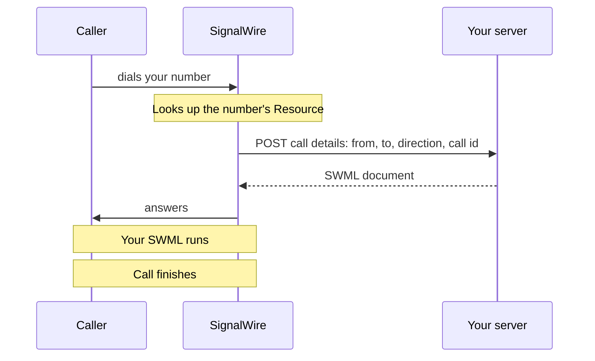
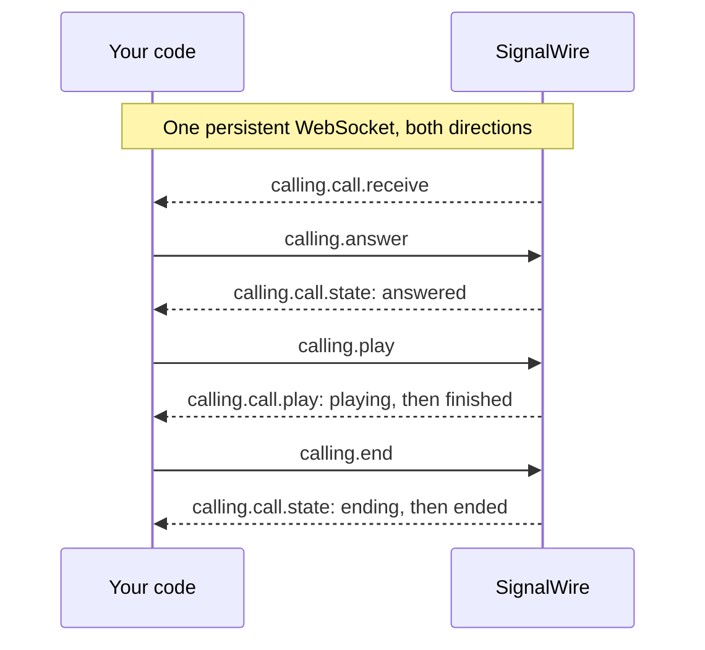

[trial-mode]: /docs/platform/trial-mode
[api-credentials]: /docs/platform/your-signalwire-api-space
[phone-numbers]: /docs/platform/phone-numbers
[resources]: /docs/platform/resources
[addresses]: /docs/platform/addresses
[subscribers]: /docs/platform/subscribers
[webhooks]: /docs/platform/webhooks
[ai-best-practices]: /docs/platform/ai/best-practices
[sip-credentials]: /docs/platform/voice/sip/sip-credentials
[swml-quickstart]: /docs/swml/guides
[swml-webhook-security]: /docs/swml/guides/webhook-security
[swml-ivr]: /docs/swml/guides/ivr
[swml-call-whisper]: /docs/swml/guides/call-whisper
[swml-webhook-payload]: /docs/swml/reference/calling#webhook-payload
[swml-variables]: /docs/swml/reference/variables
[swml-ai]: /docs/swml/reference/calling/ai
[swml-prompt]: /docs/swml/reference/calling/prompt
[swml-switch]: /docs/swml/reference/calling/switch
[swml-connect]: /docs/swml/reference/calling/connect
[swml-record]: /docs/swml/reference/calling/record
[swml-record-call]: /docs/swml/reference/calling/record-call
[swml-stream]: /docs/swml/reference/calling/stream
[py-relay-call]: /docs/server-sdks/reference/python/relay/call
[py-relay-events]: /docs/server-sdks/reference/python/relay/events
[py-swml-service]: /docs/server-sdks/reference/python/agents/swml-service
[ts-swml-builder]: /docs/server-sdks/reference/typescript/agents/swml-builder
[py-relay-client]: /docs/server-sdks/reference/python/relay/client
[ts-relay-client]: /docs/server-sdks/reference/typescript/relay/client
[py-set-swml-webhook]: /docs/server-sdks/reference/python/rest/phone-numbers/set-swml-webhook
[ts-set-swml-webhook]: /docs/server-sdks/reference/typescript/rest/phone-numbers/set-swml-webhook
[py-set-relay-topic]: /docs/server-sdks/reference/python/rest/phone-numbers/set-relay-topic
[ts-set-relay-topic]: /docs/server-sdks/reference/typescript/rest/phone-numbers/set-relay-topic
[rest-update-number]: /docs/apis/rest/phone-numbers/update-phone-number
[rest-list-numbers]: /docs/apis/rest/phone-numbers/list-phone-numbers
[rest-create-script]: /docs/apis/rest/swml-scripts/create-swml-script
[rest-link-number]: /docs/apis/rest/phone-number-addresses/create-phone-number-address
[subscriber-token]: /docs/apis/rest/subscribers/tokens/create-subscriber-token
[browser-auth]: /docs/browser-sdk/v4/guides/authentication
[browser-inbound]: /docs/browser-sdk/v4/guides/inbound-calls
[browser-call-controls]: /docs/browser-sdk/v4/guides/call-controls
[browser-device-management]: /docs/browser-sdk/v4/guides/device-management
[browser-register]: /docs/browser-sdk/v4/reference/signalwire/register
[browser-session-state]: /docs/browser-sdk/v4/reference/interfaces/session-state
[browser-call]: /docs/browser-sdk/v4/reference/interfaces/call
[browser-transfer]: /docs/browser-sdk/v4/reference/webrtc-call/transfer

Answer a call to your SignalWire phone number and choose what happens when it rings. Start by
playing a short announcement to yourself, then find out who is calling, run an AI agent, build a
phone menu, or let a signed-in user answer from your web app.

## Prepare for your first call

Have these values ready:

- Your Space URL, such as `<YOUR_SPACE>.signalwire.com`.
- Your Project ID and API token from the Dashboard's [API credentials][api-credentials] page.
  Enable the token's **Voice** permission, and its **Numbers** permission if you assign the
  handler with the REST API rather than the Dashboard.
- A voice-capable [phone number purchased in your Space][phone-numbers].
- If answering in the browser, a [Subscriber token][subscriber-token] for the [Subscriber][subscribers]
  the number rings. Guest and embed tokens can't receive calls.
- A phone you can call from.

<Warning title="Trial projects only receive calls from verified numbers">
A [trial project][trial-mode] receives calls only from phone numbers it has verified. Verify the
phone you'll call from, or upgrade the project, before you dial.
</Warning>

## How a call reaches your code

Everything that can handle a call in your Space is a [Resource][resources]: a SWML Script, a
Relay Application, a Subscriber, an AI Agent. Callers never dial the Resource itself. They dial
one of its [addresses][addresses], and SignalWire hands the call to the Resource behind it. A
Resource can have several addresses, and you can move an address to a different Resource later
without changing any code.

| Address type | Looks like | Who can reach it |
|---|---|---|
| Phone number | `+12025550123` | Anyone on the phone network. Each number has one call handler and one message handler, assigned separately. |
| SIP address | `sip:<user>@<YOUR_SPACE>-<context>.dapp.signalwire.com` | SIP callers outside SignalWire. You choose the user and context parts, and can require a password or an IP allowlist. |
| Alias | `/public/support` or `/private/john-doe` | Your own SWML, Browser SDK clients, and REST dials. A `public` alias is reachable by anyone, a `private` one only by authenticated users. |

SignalWire creates one alias from the Resource's name when you create it. Add more to expose the
Resource under other names, or to limit an alias to the audio, video, or messaging channels.

In the Dashboard, a Resource's **Addresses & Phone Numbers** tab lists its addresses and adds new
ones, and the Space-wide **Addresses** page lists every address with its context, type, call
handler, and message handler. An unassigned phone number appears there with no call handler,
and nothing happens on an inbound call until you assign one.

The Resource type decides how you control the call:

| Resource | What SignalWire does with the call |
|---|---|
| SWML Script | Runs a SignalWire Markup Language (SWML) document that it fetches from your server on every call, or that you host in your Space |
| Relay Application | Delivers the call over a persistent WebSocket to your Server SDK client subscribed to the application's topic |
| Subscriber | Rings that user's registered devices, including a Browser SDK client and any SIP endpoints |
| AI Agent, Call Flow | Runs the agent or flow you built in the Dashboard |

The rest of this page covers the first three. Because the Resource is what handles the call, the
same handler runs whether the caller dialed your phone number, its [SIP address][sip-credentials],
or one of its aliases.

## Answer your first call

Play a short announcement to anyone who dials your number.

<Steps>

### Choose how to handle the call

Choose the approach that fits how you want to control the call.

| What you want to do | Where to start |
|---|---|
| Return call instructions from your server as a document, built with a Server SDK on every call | [SWML](#create-your-call-handler), served by a Server SDK |
| Control the call in real time, receiving events and sending commands over a persistent WebSocket connection | [WebSocket (Relay)](#create-your-call-handler), using a Server SDK |
| Let someone answer and speak on the call from your web app | [Browser SDK](#create-your-call-handler) |

Each approach answers the same call, but they differ in how you follow and control it afterward.

| Function | SWML | WebSocket (Relay) | Browser SDK |
|---|---|---|---|
| Return call instructions from your Server SDK app without holding a connection open | <Icon icon="regular circle-check" color="var(--status-success)" /> | <Icon icon="regular circle-xmark" color="var(--status-error)" /> | <Icon icon="regular circle-xmark" color="var(--status-error)" /> |
| Command a call already in progress from any process, by its call ID | <Icon icon="regular circle-check" color="var(--status-success)" /> | <Icon icon="regular circle-check" color="var(--status-success)" /> | <Icon icon="regular circle-xmark" color="var(--status-error)" /> |
| React to events in your own code while the call is live, with no public URL | <Icon icon="regular circle-xmark" color="var(--status-error)" /> | <Icon icon="regular circle-check" color="var(--status-success)" /> | <Icon icon="regular circle-check" color="var(--status-success)" /> |
| Answer from a web page, with the user speaking on the call | <Icon icon="regular circle-xmark" color="var(--status-error)" /> | <Icon icon="regular circle-xmark" color="var(--status-error)" /> | <Icon icon="regular circle-check" color="var(--status-success)" /> |
| Start an AI agent, record, stream, or bridge the call from code | <Icon icon="regular circle-check" color="var(--status-success)" /> | <Icon icon="regular circle-check" color="var(--status-success)" /> | <Icon icon="regular circle-xmark" color="var(--status-error)" /> |

The REST Calling API places calls; it doesn't answer them. To act on an inbound call from REST
later, use the call ID that SWML or Relay gives you.

### Set your credentials

Replace these values in the code sample you choose:

| Value | Replace with |
|---|---|
| `<YOUR_SPACE>` | Your Space's subdomain in `<YOUR_SPACE>.signalwire.com` |
| `<YOUR_PROJECT_ID>` | Your Project ID |
| `<YOUR_API_TOKEN>` | Your API token |
| `<YOUR_PHONE_NUMBER_ID>` | The ID shown on the phone number's page in the Dashboard, or returned by [List phone numbers][rest-list-numbers] |
| `<YOUR_SWML_URL>` | The public URL where your server serves the SWML document, including the basic-auth credentials for the Python example |
| `<YOUR_SUBSCRIBER_ACCESS_TOKEN>` | A [Subscriber token][subscriber-token] created by your backend, for the Browser SDK examples |

### Create your call handler

Write the code SignalWire runs, or connects to, when the number rings.

<Tabs groupId="inbound-api">
<Tab title="SWML">

A SWML document tells SignalWire what to do with the call. When the number rings, SignalWire
requests the document from your server and runs it. Build and serve it with a Server SDK,
[`SWMLService`][py-swml-service] in Python or [`SwmlBuilder`][ts-swml-builder] behind an HTTP
server in TypeScript, then expose the port on a public HTTPS URL. A tunnel such as [ngrok](https://ngrok.com/) works for
development.

<CodeBlocks>
<CodeBlock title="Python — SWMLService">
```python
# Install: python -m pip install signalwire-sdk==3.4.1
# Save as inbound_call.py and run: python inbound_call.py
from signalwire import SWMLService

service = SWMLService(
    name="inbound-call",
    route="/swml",
    port=3000,
    basic_auth=("signalwire", "<YOUR_BASIC_AUTH_PASSWORD>"),
)
service.add_verb("play", {"url": "say:Hello, welcome to SignalWire!"})

# Serves the document at /swml. Put the credentials in the URL you give
# SignalWire: https://signalwire:<YOUR_BASIC_AUTH_PASSWORD>@<YOUR_PUBLIC_HOST>/swml
service.serve()
```
</CodeBlock>
<CodeBlock title="TypeScript — SwmlBuilder">
```typescript
// Install: npm install @signalwire/sdk@2.0.5
// This sample also runs as JavaScript: save as inbound-call.mjs,
// then run: node inbound-call.mjs
import { createServer } from "node:http";
import { SwmlBuilder } from "@signalwire/sdk";

const swml = new SwmlBuilder()
  .say("Hello, welcome to SignalWire!")
  .build();

// Serves the document at every path on port 3000.
createServer((request, response) => {
  response.setHeader("Content-Type", "application/json");
  response.end(JSON.stringify(swml));
}).listen(3000);
```
</CodeBlock>
</CodeBlocks>

Anyone who learns the URL can fetch your document, so [verify the request signature][swml-webhook-security]
before you serve anything sensitive.

Both servers return this document. It plays the announcement, then hangs up when the document
ends. If you'd rather not run a server yet, you can paste it into a hosted SWML Script in the
next step instead, and the [SWML quickstart][swml-quickstart] covers that path.

<CodeBlocks>
<CodeBlock title="YAML">
```yaml
version: 1.0.0
sections:
  main:
    - play:
        url: 'say:Hello, welcome to SignalWire!'
```
</CodeBlock>
<CodeBlock title="JSON">
```json
{
  "version": "1.0.0",
  "sections": {
    "main": [
      { "play": { "url": "say:Hello, welcome to SignalWire!" } }
    ]
  }
}
```
</CodeBlock>
</CodeBlocks>

</Tab>
<Tab title="WebSocket (Relay)">

A [`RelayClient`][py-relay-client] subscribes to a topic and receives every call routed to it.
The handler answers, plays the announcement, and hangs up. Keep the process running; it holds the connection open.

<CodeBlocks>
<CodeBlock title="Python — Relay client">
```python
# Install: python -m pip install signalwire-sdk==3.4.1
# Save as inbound_call.py and run: python inbound_call.py
from signalwire.relay import RelayClient

client = RelayClient(
    project="<YOUR_PROJECT_ID>",
    token="<YOUR_API_TOKEN>",
    contexts=["inbound-calling"],
)

@client.on_call
async def handle_call(call):
    await call.answer()
    playback = await call.play([{
        "type": "tts",
        "params": {"text": "Hello, welcome to SignalWire!"},
    }])
    await playback.wait()
    await call.hangup()

client.run()
```
</CodeBlock>
<CodeBlock title="TypeScript — Relay client">
```typescript
// Install: npm install @signalwire/sdk@2.0.5
// This sample also runs as JavaScript: save as inbound-call.mjs,
// then run: node inbound-call.mjs
import { RelayClient } from "@signalwire/sdk";

const client = new RelayClient({
  project: "<YOUR_PROJECT_ID>",
  token: "<YOUR_API_TOKEN>",
  contexts: ["inbound-calling"],
});

client.onCall(async (call) => {
  await call.answer();
  const playback = await call.play([
    { type: "tts", text: "Hello, welcome to SignalWire!" },
  ]);
  await playback.wait();
  await call.hangup();
});

await client.run();
```
</CodeBlock>
</CodeBlocks>

The `contexts` value is the topic. You'll give the same name to the Relay Application in the
next step, and only a client subscribed to it receives the call.

</Tab>
<Tab title="Browser SDK">

A Browser SDK client registers as a Subscriber and receives the call in the page. Show the
caller, then let the user answer or decline.

```javascript
// Install: npm install @signalwire/js@latest rxjs
// Run on HTTPS or localhost with these elements in your page:
// <p id="status">Offline</p>
// <p id="caller"></p>
// <audio id="remote-audio" autoplay></audio>
// <button id="answer" type="button" disabled>Answer</button>
// <button id="decline" type="button" disabled>Decline</button>
// <button id="hangup" type="button" disabled>Hang up</button>
// Use a Subscriber Access Token issued by your backend for the Subscriber
// that the phone number rings.
import { SignalWire, StaticCredentialProvider } from "@signalwire/js";

const client = new SignalWire(new StaticCredentialProvider({
  token: "<YOUR_SUBSCRIBER_ACCESS_TOKEN>",
}));
const statusLine = document.querySelector("#status");
const callerLine = document.querySelector("#caller");
const remoteAudio = document.querySelector("#remote-audio");
const answerButton = document.querySelector("#answer");
const declineButton = document.querySelector("#decline");
const hangupButton = document.querySelector("#hangup");
const finalStatuses = new Set(["disconnected", "failed", "destroyed"]);

let currentCall = null;

await client.register();
statusLine.textContent = "Online";

client.session.incomingCalls$.subscribe((calls) => {
  const ringing = calls.find((call) => call.status === "ringing");
  if (!ringing || ringing === currentCall) return;
  currentCall = ringing;
  callerLine.textContent = `Incoming call from ${ringing.from}`;
  answerButton.disabled = false;
  declineButton.disabled = false;

  ringing.remoteStream$.subscribe((stream) => (remoteAudio.srcObject = stream));
  ringing.status$.subscribe((status) => {
    statusLine.textContent = status;
    if (status !== "ringing") {
      answerButton.disabled = true;
      declineButton.disabled = true;
    }
    if (status === "connected") hangupButton.disabled = false;
    if (finalStatuses.has(status)) {
      remoteAudio.srcObject = null;
      hangupButton.disabled = true;
      callerLine.textContent = "";
      if (currentCall === ringing) currentCall = null;
    }
  });
});

answerButton.onclick = () => {
  void currentCall?.answer({ audio: true, video: false });
};
declineButton.onclick = () => {
  void currentCall?.reject();
};
hangupButton.onclick = () => {
  void currentCall?.hangup().catch(console.error);
};
```

Constructing the client authenticates the user, and [`register()`][browser-register] brings them
online so calls can reach them. Leave the page open while you test.

</Tab>
</Tabs>

### Point your number at the handler

Assign a Resource as the number's call handler. Create the Resource first if your handler needs
one. You can assign from either side: from the number's **Edit Settings** page as shown below,
or from the Resource by opening its **Addresses & Phone Numbers** tab, selecting **+ Add**, then
**Phone Number**, and choosing a number you own. The same menu adds a **SIP Address** or an
**Alias** to the Resource.

<Tabs groupId="inbound-api">
<Tab title="SWML">

In the Dashboard, open **My Resources**, select **+ Add**, then **Script**, then **SWML Script**.
Give it a name and leave **Used For** set to **Calling**. Under **Handle Calls Using**, choose
**External URL** and enter your server's URL in **Primary Script URL**. To use the hosted
document instead, choose **Hosted Script** and paste it into **Primary Script**. Select
**Create**.

<llms-ignore>

<Frame caption="A SWML Script Resource configured to fetch SWML from an external URL">


</Frame>

</llms-ignore>

Then open **Phone Numbers**, select your number, and select **Edit Settings**. Under **Inbound
Call Settings**, select **Assign Resource**, choose the SWML Script you created, and save.

<llms-ignore>

<Frame caption="Assigning a Resource to a phone number's inbound call settings">


</Frame>

</llms-ignore>

You can do the same with the REST API. [Update the phone number][rest-update-number] with the
`relay_script` handler. This creates the SWML Script Resource for the URL and assigns it in one
call; the Server SDKs wrap it as [`set_swml_webhook`][py-set-swml-webhook] and
[`setSwmlWebhook`][ts-set-swml-webhook]. Find the number's ID on its Dashboard page or with
[List phone numbers][rest-list-numbers].

<CodeBlocks>
<CodeBlock title="cURL — Phone Numbers API">
```bash
curl -X PUT "https://<YOUR_SPACE>.signalwire.com/api/relay/rest/phone_numbers/<YOUR_PHONE_NUMBER_ID>" \
  -u "<YOUR_PROJECT_ID>:<YOUR_API_TOKEN>" \
  -H "Content-Type: application/json" \
  -d '{
    "call_handler": "relay_script",
    "call_relay_script_url": "<YOUR_SWML_URL>"
  }'
```
</CodeBlock>
<CodeBlock title="Python — REST client">
```python
# Install: python -m pip install signalwire-sdk==3.4.1
from signalwire.rest import RestClient

client = RestClient(
    project="<YOUR_PROJECT_ID>",
    token="<YOUR_API_TOKEN>",
    host="<YOUR_SPACE>.signalwire.com",
)

client.phone_numbers.set_swml_webhook("<YOUR_PHONE_NUMBER_ID>", "<YOUR_SWML_URL>")
```
</CodeBlock>
<CodeBlock title="TypeScript — REST client">
```typescript
// Install: npm install @signalwire/sdk@2.0.5
import { RestClient } from "@signalwire/sdk";

const client = new RestClient({
  project: "<YOUR_PROJECT_ID>",
  token: "<YOUR_API_TOKEN>",
  host: "<YOUR_SPACE>.signalwire.com",
});

await client.phoneNumbers.setSwmlWebhook("<YOUR_PHONE_NUMBER_ID>", "<YOUR_SWML_URL>");
```
</CodeBlock>
</CodeBlocks>

<Accordion title="Assign a hosted script with the REST API">

[Create the SWML Script][rest-create-script] with the document as `contents`, then
[link it to the number][rest-link-number]. The link endpoint is in beta and requires the
number's calling channel to have no Resource assigned yet.

```bash
curl -X POST "https://<YOUR_SPACE>.signalwire.com/api/fabric/resources/swml_scripts" \
  -u "<YOUR_PROJECT_ID>:<YOUR_API_TOKEN>" \
  -H "Content-Type: application/json" \
  -d '{
    "name": "Inbound welcome",
    "contents": {
      "version": "1.0.0",
      "sections": {
        "main": [
          { "play": { "url": "say:Hello, welcome to SignalWire!" } }
        ]
      }
    }
  }'

# Use the "id" from the response as the resource_id.
curl -X POST "https://<YOUR_SPACE>.signalwire.com/api/fabric/phone_number_addresses" \
  -u "<YOUR_PROJECT_ID>:<YOUR_API_TOKEN>" \
  -H "Content-Type: application/json" \
  -d '{
    "number": "<YOUR_PHONE_NUMBER>",
    "resource_id": "<YOUR_SWML_SCRIPT_ID>",
    "handler_type": "calling"
  }'
```

</Accordion>

</Tab>
<Tab title="WebSocket (Relay)">

In the Dashboard, open **My Resources**, select **+ Add**, then **Relay Application**. Give it
a name, enter `inbound-calling` as the **Topic** to match the `contexts` value in your code, and
select **Create**.

Then open **Phone Numbers**, select your number, and select **Edit Settings**. Under **Inbound
Call Settings**, select **Assign Resource**, choose the Relay Application, and save.

<llms-ignore>

<Frame caption="Assigning a Resource to a phone number's inbound call settings">


</Frame>

</llms-ignore>

To assign with the REST API instead, [update the phone number][rest-update-number] with the
`relay_topic` handler and the topic name, or use the [`set_relay_topic`][py-set-relay-topic] and
[`setRelayTopic`][ts-set-relay-topic] wrappers.

<CodeBlocks>
<CodeBlock title="cURL — Phone Numbers API">
```bash
curl -X PUT "https://<YOUR_SPACE>.signalwire.com/api/relay/rest/phone_numbers/<YOUR_PHONE_NUMBER_ID>" \
  -u "<YOUR_PROJECT_ID>:<YOUR_API_TOKEN>" \
  -H "Content-Type: application/json" \
  -d '{
    "call_handler": "relay_topic",
    "call_relay_topic": "inbound-calling"
  }'
```
</CodeBlock>
<CodeBlock title="Python — REST client">
```python
# Install: python -m pip install signalwire-sdk==3.4.1
from signalwire.rest import RestClient

client = RestClient(
    project="<YOUR_PROJECT_ID>",
    token="<YOUR_API_TOKEN>",
    host="<YOUR_SPACE>.signalwire.com",
)

client.phone_numbers.set_relay_topic("<YOUR_PHONE_NUMBER_ID>", "inbound-calling")
```
</CodeBlock>
<CodeBlock title="TypeScript — REST client">
```typescript
// Install: npm install @signalwire/sdk@2.0.5
import { RestClient } from "@signalwire/sdk";

const client = new RestClient({
  project: "<YOUR_PROJECT_ID>",
  token: "<YOUR_API_TOKEN>",
  host: "<YOUR_SPACE>.signalwire.com",
});

await client.phoneNumbers.setRelayTopic("<YOUR_PHONE_NUMBER_ID>", { topic: "inbound-calling" });
```
</CodeBlock>
</CodeBlocks>

</Tab>
<Tab title="Browser SDK">

Assign the number to the Subscriber your token was issued for. In the Dashboard, open
**Phone Numbers**, select your number, and select **Edit Settings**. Under **Inbound Call
Settings**, select **Assign Resource**, choose the Subscriber, and save.

<llms-ignore>

<Frame caption="Assigning a Resource to a phone number's inbound call settings">


</Frame>

</llms-ignore>

To assign with the REST API instead, [link the Subscriber to the number][rest-link-number]. This
endpoint is in beta and requires the number's calling channel to have no Resource assigned yet.

```bash
curl -X POST "https://<YOUR_SPACE>.signalwire.com/api/fabric/phone_number_addresses" \
  -u "<YOUR_PROJECT_ID>:<YOUR_API_TOKEN>" \
  -H "Content-Type: application/json" \
  -d '{
    "number": "<YOUR_PHONE_NUMBER>",
    "resource_id": "<YOUR_SUBSCRIBER_ID>",
    "handler_type": "calling"
  }'
```

The Subscriber also keeps its `/private/<name>` address, so another app or Resource in your
Space can call the same browser client without a phone number.

</Tab>
</Tabs>

### Call your number

Dial your SignalWire number from your phone. With SWML or Relay, you hear "Hello, welcome to
SignalWire!" and the call ends. With the browser example, the page shows the incoming call.
Select **Answer**, allow microphone access, and select **Hang up** when you finish.

If the call rings without an answer or fails, check these first:

- The number's **Inbound Call Settings** show your Resource. An unassigned number takes no action.
- You're calling from a verified number if the project is in trial mode.
- For Relay, the Relay Application's **Topic** matches your client's `contexts` value and the client is running.
- For SWML served from your server, SignalWire could reach the URL and got a valid document. Check the
  call in the Dashboard's **Logs**.

</Steps>

## Know who's calling and follow the call

Each approach gives you the caller's details and the call's progress in its own way. Follow the
section for the approach you used for your first call.

### Read the call details via SWML

When SignalWire fetches your document, it sends your server a POST request whose `call` object
carries the `from` and `to` addresses, the `direction`, and the `call_id`. See the
[webhook payload reference][swml-webhook-payload] for every field.

The same fields are available inside the document as [variables][swml-variables], so the
document itself can use them, whether your server built it or you hosted it. This document reads
the caller's number back to them:

<CodeBlocks>
<CodeBlock title="YAML">
```yaml
version: 1.0.0
sections:
  main:
    - play:
        url: 'say:Thanks for calling from ${call.from}.'
```
</CodeBlock>
<CodeBlock title="JSON">
```json
{
  "version": "1.0.0",
  "sections": {
    "main": [
      { "play": { "url": "say:Thanks for calling from ${call.from}." } }
    ]
  }
}
```
</CodeBlock>
</CodeBlocks>

Individual methods report their own progress. Set `status_url` on [`record`][swml-record],
[`connect`][swml-connect], or [`stream`][swml-stream] to receive HTTP callbacks as that step
runs. The [webhooks guide][webhooks] covers endpoint setup and callback reliability.

This flow shows an inbound call handled by a SWML Script that fetches the document from your
server:

<llms-ignore>


</llms-ignore>

<llms-only>



</llms-only>

### Follow the call via WebSocket (Relay)

The [`Call`][py-relay-call] object your handler receives carries the caller in `device`,
together with `direction`, `context`, and `call_id`. Register a `calling.call.state` listener
to see `answered`, `ending`, and `ended` as they happen, and wait for the call to end before your
handler returns.

<CodeBlocks>
<CodeBlock title="Python — Relay client">
```python
# Install: python -m pip install signalwire-sdk==3.4.1
# Save as inbound_call.py and run: python inbound_call.py
from signalwire.relay import RelayClient
from signalwire.relay.event import CallStateEvent

client = RelayClient(
    project="<YOUR_PROJECT_ID>",
    token="<YOUR_API_TOKEN>",
    contexts=["inbound-calling"],
)

@client.on_call
async def handle_call(call):
    caller = call.device.get("params", {}).get("from_number", "unknown")
    print(f"Call {call.call_id} from {caller} on topic {call.context}")

    def handle_state(event: CallStateEvent):
        print(f"State: {event.call_state}, reason: {event.end_reason}")

    call.on("calling.call.state", handle_state)

    await call.answer()
    playback = await call.play([{
        "type": "tts",
        "params": {"text": "Hello, welcome to SignalWire!"},
    }])
    await playback.wait()
    await call.hangup()
    await call.wait_for_ended()

client.run()
```
</CodeBlock>
<CodeBlock title="TypeScript — Relay client">
```typescript
// Install: npm install @signalwire/sdk@2.0.5
// This sample also runs as JavaScript: save as inbound-call.mjs,
// then run: node inbound-call.mjs
import { RelayClient } from "@signalwire/sdk";

const client = new RelayClient({
  project: "<YOUR_PROJECT_ID>",
  token: "<YOUR_API_TOKEN>",
  contexts: ["inbound-calling"],
});

client.onCall(async (call) => {
  const caller = call.device?.params?.from_number ?? "unknown";
  console.log(`Call ${call.callId} from ${caller} on topic ${call.context}`);

  call.on("calling.call.state", (event) => {
    console.log(`State: ${event.params.call_state}, reason: ${event.params.end_reason ?? ""}`);
  });

  await call.answer();
  const playback = await call.play([
    { type: "tts", text: "Hello, welcome to SignalWire!" },
  ]);
  await playback.wait();
  await call.hangup();
  await call.waitForEnded();
});

await client.run();
```
</CodeBlock>
</CodeBlocks>

For more event handlers, see
[Event listeners in the Relay client guide](/docs/server-sdks/guides/relay-client#event-listeners)
and the [events reference][py-relay-events].

This flow shows the events SignalWire sends and the commands your code returns over the same
persistent connection:

<llms-ignore>


</llms-ignore>

<llms-only>



</llms-only>

### Follow the call in the browser

Each entry in [`incomingCalls$`][browser-session-state] is a [`Call`][browser-call] with
`direction` set to `inbound`. Read `from` for the caller's address, `fromName` for a display
name when the caller supplied one, and `to` for the address that was dialed. SignalWire sends
`_undef_` as the display name when the calling leg didn't supply one, so fall back to `from`.

After the user answers, `status$` moves through `connecting` and `connected`, then
`disconnecting`, `disconnected`, and `destroyed` once the call ends. A call that leaves
`ringing` without reaching `connected` was declined or abandoned by the caller, so one
`status$` subscription can dismiss the ringing UI for every outcome.

## Examples

### Run an AI agent

Start an AI agent that welcomes the caller and answers basic questions about SignalWire.

<Note title="Tell callers when they're talking to an AI">
Open with a greeting that says the call uses an artificial voice, and follow the
[AI best practices][ai-best-practices].
</Note>

#### Run an AI agent via SWML

Put an [`ai`][swml-ai] method in the document. SignalWire answers the call and hands it to the
agent, which runs until the caller hangs up.

<CodeBlocks>
<CodeBlock title="YAML">
```yaml
version: 1.0.0
sections:
  main:
    - ai:
        params:
          static_greeting: Hello, welcome to SignalWire! This call uses an artificial voice.
          static_greeting_no_barge: true
        prompt:
          text: >-
            Welcome the caller to SignalWire. Briefly explain that SignalWire provides
            APIs and SDKs for voice, messaging, video, and AI. Answer basic follow-up
            questions. If you are unsure, direct the caller to signalwire.com.
```
</CodeBlock>
<CodeBlock title="JSON">
```json
{
  "version": "1.0.0",
  "sections": {
    "main": [
      {
        "ai": {
          "params": {
            "static_greeting": "Hello, welcome to SignalWire! This call uses an artificial voice.",
            "static_greeting_no_barge": true
          },
          "prompt": {
            "text": "Welcome the caller to SignalWire. Briefly explain that SignalWire provides APIs and SDKs for voice, messaging, video, and AI. Answer basic follow-up questions. If you are unsure, direct the caller to signalwire.com."
          }
        }
      }
    ]
  }
}
```
</CodeBlock>
</CodeBlocks>

#### Run an AI agent via WebSocket (Relay)

Answer the call, start the agent with `call.ai()`, and keep the handler alive until the call ends.

<CodeBlocks>
<CodeBlock title="Python — Relay client">
```python
# Install: python -m pip install signalwire-sdk==3.4.1
# Save as inbound_call.py and run: python inbound_call.py
from signalwire.relay import RelayClient

client = RelayClient(
    project="<YOUR_PROJECT_ID>",
    token="<YOUR_API_TOKEN>",
    contexts=["inbound-calling"],
)

@client.on_call
async def handle_call(call):
    await call.answer()
    await call.ai(
        ai_params={
            "static_greeting": "Hello, welcome to SignalWire! This call uses an artificial voice.",
            "static_greeting_no_barge": True,
        },
        prompt={
            "text": """Welcome the caller to SignalWire. Briefly explain that SignalWire
provides APIs and SDKs for voice, messaging, video, and AI. Answer basic
follow-up questions. If you are unsure, direct the caller to signalwire.com."""
        },
    )
    # Keep the handler alive until the caller hangs up.
    await call.wait_for_ended()

client.run()
```
</CodeBlock>
<CodeBlock title="TypeScript — Relay client">
```typescript
// Install: npm install @signalwire/sdk@2.0.5
// This sample also runs as JavaScript: save as inbound-call.mjs,
// then run: node inbound-call.mjs
import { RelayClient } from "@signalwire/sdk";

const client = new RelayClient({
  project: "<YOUR_PROJECT_ID>",
  token: "<YOUR_API_TOKEN>",
  contexts: ["inbound-calling"],
});

client.onCall(async (call) => {
  await call.answer();
  await call.ai({
    aiParams: {
      static_greeting: "Hello, welcome to SignalWire! This call uses an artificial voice.",
      static_greeting_no_barge: true,
    },
    prompt: {
      text: `Welcome the caller to SignalWire. Briefly explain that SignalWire
  provides APIs and SDKs for voice, messaging, video, and AI. Answer basic
  follow-up questions. If you are unsure, direct the caller to signalwire.com.`,
    },
  });
  // Keep the handler alive until the caller hangs up.
  await call.waitForEnded();
});

await client.run();
```
</CodeBlock>
</CodeBlocks>

### Build a phone menu

Offer the caller a choice, then connect them to the matching destination. Replace
`<YOUR_SALES_DESTINATION>` and `<YOUR_SUPPORT_DESTINATION>` with phone numbers, SIP URIs, or
Resource addresses.

#### Build a phone menu via SWML

Use [`prompt`][swml-prompt] to collect a digit and [`switch`][swml-switch] on `prompt_value` to
pick the destination. See the [IVR guide][swml-ivr] for a fuller menu with speech input.

<CodeBlocks>
<CodeBlock title="YAML">
```yaml
version: 1.0.0
sections:
  main:
    - prompt:
        play: 'say:Thanks for calling SignalWire. Press 1 for sales or 2 for support.'
        max_digits: 1
    - switch:
        variable: prompt_value
        case:
          '1':
            - connect:
                to: '<YOUR_SALES_DESTINATION>'
          '2':
            - connect:
                to: '<YOUR_SUPPORT_DESTINATION>'
        default:
          - play:
              url: 'say:Sorry, that is not a valid choice. Goodbye.'
          - hangup: {}
```
</CodeBlock>
<CodeBlock title="JSON">
```json
{
  "version": "1.0.0",
  "sections": {
    "main": [
      {
        "prompt": {
          "play": "say:Thanks for calling SignalWire. Press 1 for sales or 2 for support.",
          "max_digits": 1
        }
      },
      {
        "switch": {
          "variable": "prompt_value",
          "case": {
            "1": [{ "connect": { "to": "<YOUR_SALES_DESTINATION>" } }],
            "2": [{ "connect": { "to": "<YOUR_SUPPORT_DESTINATION>" } }]
          },
          "default": [
            { "play": { "url": "say:Sorry, that is not a valid choice. Goodbye." } },
            { "hangup": {} }
          ]
        }
      }
    ]
  }
}
```
</CodeBlock>
</CodeBlocks>

#### Build a phone menu via WebSocket (Relay)

Use `play_and_collect()` to play the prompt and wait for a digit, then bridge the call with
`connect()`.

<CodeBlocks>
<CodeBlock title="Python — Relay client">
```python
# Install: python -m pip install signalwire-sdk==3.4.1
# Save as inbound_call.py and run: python inbound_call.py
from signalwire.relay import RelayClient

DESTINATIONS = {
    "1": "<YOUR_SALES_DESTINATION>",
    "2": "<YOUR_SUPPORT_DESTINATION>",
}

client = RelayClient(
    project="<YOUR_PROJECT_ID>",
    token="<YOUR_API_TOKEN>",
    contexts=["inbound-calling"],
)

@client.on_call
async def handle_call(call):
    await call.answer()
    menu = await call.play_and_collect(
        media=[{
            "type": "tts",
            "params": {"text": "Thanks for calling SignalWire. Press 1 for sales or 2 for support."},
        }],
        collect={"digits": {"max": 1, "digit_timeout": 5}},
    )
    result = await menu.wait()
    digit = result.params.get("result", {}).get("digits", "")

    destination = DESTINATIONS.get(digit)
    if destination:
        await call.connect([[{"type": "phone", "params": {"to_number": destination}}]])
    else:
        goodbye = await call.play([{
            "type": "tts",
            "params": {"text": "Sorry, that is not a valid choice. Goodbye."},
        }])
        await goodbye.wait()
        await call.hangup()

client.run()
```
</CodeBlock>
<CodeBlock title="TypeScript — Relay client">
```typescript
// Install: npm install @signalwire/sdk@2.0.5
// This sample also runs as JavaScript: save as inbound-call.mjs,
// then run: node inbound-call.mjs
import { RelayClient } from "@signalwire/sdk";

const DESTINATIONS = {
  "1": "<YOUR_SALES_DESTINATION>",
  "2": "<YOUR_SUPPORT_DESTINATION>",
};

const client = new RelayClient({
  project: "<YOUR_PROJECT_ID>",
  token: "<YOUR_API_TOKEN>",
  contexts: ["inbound-calling"],
});

client.onCall(async (call) => {
  await call.answer();
  const menu = await call.playAndCollect(
    [{ type: "tts", text: "Thanks for calling SignalWire. Press 1 for sales or 2 for support." }],
    { digits: { max: 1, digit_timeout: 5 } },
  );
  const result = await menu.wait();
  const digit = result.params?.result?.digits ?? "";

  const destination = DESTINATIONS[digit];
  if (destination) {
    await call.connect([[{ type: "phone", params: { to_number: destination } }]]);
  } else {
    const goodbye = await call.play([
      { type: "tts", text: "Sorry, that is not a valid choice. Goodbye." },
    ]);
    await goodbye.wait();
    await call.hangup();
  }
});

await client.run();
```
</CodeBlock>
</CodeBlocks>

### Forward the call with a whisper

Ring `<YOUR_AGENT_DESTINATION>`, play a private message to whoever answers, then connect them
to the caller.

#### Forward the call via SWML

Use `connect.confirm` to play the [whisper][swml-call-whisper] to the agent before bridging the
two legs. The caller keeps hearing ringing until the agent is connected.

<CodeBlocks>
<CodeBlock title="YAML">
```yaml
version: 1.0.0
sections:
  main:
    - play:
        url: 'say:Thanks for calling SignalWire. Connecting you now.'
    - connect:
        to: '<YOUR_AGENT_DESTINATION>'
        confirm:
          - play:
              url: 'say:You are about to be connected to a caller from ${call.from}.'
        confirm_timeout: 20
```
</CodeBlock>
<CodeBlock title="JSON">
```json
{
  "version": "1.0.0",
  "sections": {
    "main": [
      { "play": { "url": "say:Thanks for calling SignalWire. Connecting you now." } },
      {
        "connect": {
          "to": "<YOUR_AGENT_DESTINATION>",
          "confirm": [
            { "play": { "url": "say:You are about to be connected to a caller from ${call.from}." } }
          ],
          "confirm_timeout": 20
        }
      }
    ]
  }
}
```
</CodeBlock>
</CodeBlocks>

#### Forward the call via WebSocket (Relay)

Answer, tell the caller what's happening, then bridge with `connect()`. Pass `ringback` so the
caller hears ringing while the agent's phone rings.

<CodeBlocks>
<CodeBlock title="Python — Relay client">
```python
# Install: python -m pip install signalwire-sdk==3.4.1
# Save as inbound_call.py and run: python inbound_call.py
from signalwire.relay import RelayClient

client = RelayClient(
    project="<YOUR_PROJECT_ID>",
    token="<YOUR_API_TOKEN>",
    contexts=["inbound-calling"],
)

@client.on_call
async def handle_call(call):
    await call.answer()
    intro = await call.play([{
        "type": "tts",
        "params": {"text": "Thanks for calling SignalWire. Connecting you now."},
    }])
    await intro.wait()
    await call.connect(
        devices=[[{
            "type": "phone",
            "params": {"to_number": "<YOUR_AGENT_DESTINATION>", "timeout": 30},
        }]],
        ringback=[{"type": "ringtone", "params": {"name": "us"}}],
    )
    await call.wait_for_ended()

client.run()
```
</CodeBlock>
<CodeBlock title="TypeScript — Relay client">
```typescript
// Install: npm install @signalwire/sdk@2.0.5
// This sample also runs as JavaScript: save as inbound-call.mjs,
// then run: node inbound-call.mjs
import { RelayClient } from "@signalwire/sdk";

const client = new RelayClient({
  project: "<YOUR_PROJECT_ID>",
  token: "<YOUR_API_TOKEN>",
  contexts: ["inbound-calling"],
});

client.onCall(async (call) => {
  await call.answer();
  const intro = await call.play([
    { type: "tts", text: "Thanks for calling SignalWire. Connecting you now." },
  ]);
  await intro.wait();
  await call.connect(
    [[{ type: "phone", params: { to_number: "<YOUR_AGENT_DESTINATION>", timeout: 30 } }]],
    { ringback: [{ type: "ringtone", name: "us" }] },
  );
  await call.waitForEnded();
});

await client.run();
```
</CodeBlock>
</CodeBlocks>

### Take a voicemail

Play a greeting, record the caller after a beep, and stop when they go quiet or press the pound
key.

<Warning title="Recording consent is your responsibility">
Confirm which parties must consent and announce the recording when required.
</Warning>

#### Take a voicemail via SWML

[`record`][swml-record] runs in the foreground, so the document waits until the recording ends.
SignalWire posts the result to `status_url`, and `record_url` holds the recording's URL for
the rest of the document.

<CodeBlocks>
<CodeBlock title="YAML">
```yaml
version: 1.0.0
sections:
  main:
    - play:
        url: 'say:Thanks for calling SignalWire. Leave a message after the beep, then press pound.'
    - record:
        format: mp3
        beep: true
        end_silence_timeout: 3
        terminators: '#'
        status_url: '<YOUR_RECORDING_STATUS_URL>'
    - play:
        url: 'say:Thanks, goodbye.'
    - hangup: {}
```
</CodeBlock>
<CodeBlock title="JSON">
```json
{
  "version": "1.0.0",
  "sections": {
    "main": [
      { "play": { "url": "say:Thanks for calling SignalWire. Leave a message after the beep, then press pound." } },
      {
        "record": {
          "format": "mp3",
          "beep": true,
          "end_silence_timeout": 3,
          "terminators": "#",
          "status_url": "<YOUR_RECORDING_STATUS_URL>"
        }
      },
      { "play": { "url": "say:Thanks, goodbye." } },
      { "hangup": {} }
    ]
  }
}
```
</CodeBlock>
</CodeBlocks>

#### Take a voicemail via WebSocket (Relay)

Start `call.record()` after the greeting and read the recording URL from its `finished` event.

<CodeBlocks>
<CodeBlock title="Python — Relay client">
```python
# Install: python -m pip install signalwire-sdk==3.4.1
# Save as inbound_call.py and run: python inbound_call.py
from signalwire.relay import RelayClient

client = RelayClient(
    project="<YOUR_PROJECT_ID>",
    token="<YOUR_API_TOKEN>",
    contexts=["inbound-calling"],
)

@client.on_call
async def handle_call(call):
    await call.answer()
    greeting = await call.play([{
        "type": "tts",
        "params": {"text": "Thanks for calling SignalWire. Leave a message after the beep, then press pound."},
    }])
    await greeting.wait()

    recording = await call.record(
        audio={
            "format": "mp3",
            "beep": True,
            "end_silence_timeout": 3,
            "terminators": "#",
        },
    )
    finished = await recording.wait()
    print(f"Recording: {finished.url}")

    goodbye = await call.play([{"type": "tts", "params": {"text": "Thanks, goodbye."}}])
    await goodbye.wait()
    await call.hangup()

client.run()
```
</CodeBlock>
<CodeBlock title="TypeScript — Relay client">
```typescript
// Install: npm install @signalwire/sdk@2.0.5
// Save as inbound-call.mts and run: npx tsx inbound-call.mts
import { RelayClient, RecordEvent } from "@signalwire/sdk";

const client = new RelayClient({
  project: "<YOUR_PROJECT_ID>",
  token: "<YOUR_API_TOKEN>",
  contexts: ["inbound-calling"],
});

client.onCall(async (call) => {
  await call.answer();
  const greeting = await call.play([
    { type: "tts", text: "Thanks for calling SignalWire. Leave a message after the beep, then press pound." },
  ]);
  await greeting.wait();

  const recording = await call.record({
    format: "mp3",
    beep: true,
    end_silence_timeout: 3,
    terminators: "#",
  });
  const finished = await recording.wait();
  console.log(`Recording: ${(finished as RecordEvent).url}`);

  const goodbye = await call.play([{ type: "tts", text: "Thanks, goodbye." }]);
  await goodbye.wait();
  await call.hangup();
});

await client.run();
```
</CodeBlock>
</CodeBlocks>

### Record the call

Record both sides of an inbound call in the background while it's forwarded to
`<YOUR_AGENT_DESTINATION>`, and retrieve the finished recording URL.

Announce the recording where consent rules require it, as in the voicemail example above.

#### Record the call via SWML

Start [`record_call`][swml-record-call] before [`connect`][swml-connect]. Recording continues
while the two legs talk, and SignalWire posts the result to `status_url` when the call ends.

<CodeBlocks>
<CodeBlock title="YAML">
```yaml
version: 1.0.0
sections:
  main:
    - play:
        url: 'say:This call may be recorded. Connecting you now.'
    - record_call:
        format: mp3
        direction: both
        stereo: true
        status_url: '<YOUR_RECORDING_STATUS_URL>'
    - connect:
        to: '<YOUR_AGENT_DESTINATION>'
```
</CodeBlock>
<CodeBlock title="JSON">
```json
{
  "version": "1.0.0",
  "sections": {
    "main": [
      { "play": { "url": "say:This call may be recorded. Connecting you now." } },
      {
        "record_call": {
          "format": "mp3",
          "direction": "both",
          "stereo": true,
          "status_url": "<YOUR_RECORDING_STATUS_URL>"
        }
      },
      { "connect": { "to": "<YOUR_AGENT_DESTINATION>" } }
    ]
  }
}
```
</CodeBlock>
</CodeBlocks>

#### Record the call via WebSocket (Relay)

Start `call.record()` with both directions, bridge the call, and read the URL after the call
ends.

<CodeBlocks>
<CodeBlock title="Python — Relay client">
```python
# Install: python -m pip install signalwire-sdk==3.4.1
# Save as inbound_call.py and run: python inbound_call.py
from signalwire.relay import RelayClient

client = RelayClient(
    project="<YOUR_PROJECT_ID>",
    token="<YOUR_API_TOKEN>",
    contexts=["inbound-calling"],
)

@client.on_call
async def handle_call(call):
    await call.answer()
    notice = await call.play([{
        "type": "tts",
        "params": {"text": "This call may be recorded. Connecting you now."},
    }])
    await notice.wait()

    recording = await call.record(
        audio={
            "format": "mp3",
            "direction": "both",
            "stereo": True,
            "initial_timeout": 0,
            "end_silence_timeout": 0,
        },
    )
    await call.connect([[{
        "type": "phone",
        "params": {"to_number": "<YOUR_AGENT_DESTINATION>", "timeout": 30},
    }]])
    await call.wait_for_ended()
    finished = await recording.wait()
    print(f"Recording: {finished.url}")

client.run()
```
</CodeBlock>
<CodeBlock title="TypeScript — Relay client">
```typescript
// Install: npm install @signalwire/sdk@2.0.5
// Save as inbound-call.mts and run: npx tsx inbound-call.mts
import { RelayClient, RecordEvent } from "@signalwire/sdk";

const client = new RelayClient({
  project: "<YOUR_PROJECT_ID>",
  token: "<YOUR_API_TOKEN>",
  contexts: ["inbound-calling"],
});

client.onCall(async (call) => {
  await call.answer();
  const notice = await call.play([
    { type: "tts", text: "This call may be recorded. Connecting you now." },
  ]);
  await notice.wait();

  const recording = await call.record({
    format: "mp3",
    direction: "both",
    stereo: true,
    initial_timeout: 0,
    end_silence_timeout: 0,
  });
  await call.connect([[
    { type: "phone", params: { to_number: "<YOUR_AGENT_DESTINATION>", timeout: 30 } },
  ]]);
  await call.waitForEnded();
  const finished = await recording.wait();
  console.log(`Recording: ${(finished as RecordEvent).url}`);
});

await client.run();
```
</CodeBlock>
</CodeBlocks>

### Stream the call audio

Stream both sides of a live inbound call to your secure WebSocket endpoint for real-time
processing.

#### Stream call audio via SWML

Start [`stream`][swml-stream] in the background and send its status events to your webhook.
The stream runs for as long as the rest of the document does, so follow it with the methods
that hold the call, such as `ai` or `connect`.

<CodeBlocks>
<CodeBlock title="YAML">
```yaml
version: 1.0.0
sections:
  main:
    - stream:
        url: '<YOUR_AUDIO_STREAM_URL>'
        track: both_tracks
        codec: PCMU
        status_url: '<YOUR_STREAM_STATUS_URL>'
    - play:
        url: 'say:Thanks for calling SignalWire. Connecting you now.'
    - connect:
        to: '<YOUR_AGENT_DESTINATION>'
```
</CodeBlock>
<CodeBlock title="JSON">
```json
{
  "version": "1.0.0",
  "sections": {
    "main": [
      {
        "stream": {
          "url": "<YOUR_AUDIO_STREAM_URL>",
          "track": "both_tracks",
          "codec": "PCMU",
          "status_url": "<YOUR_STREAM_STATUS_URL>"
        }
      },
      { "play": { "url": "say:Thanks for calling SignalWire. Connecting you now." } },
      { "connect": { "to": "<YOUR_AGENT_DESTINATION>" } }
    ]
  }
}
```
</CodeBlock>
</CodeBlocks>

#### Stream call audio via WebSocket (Relay)

Start `call.stream()` right after answering and keep it running until the call ends.

<CodeBlocks>
<CodeBlock title="Python — Relay client">
```python
# Install: python -m pip install signalwire-sdk==3.4.1
# Save as inbound_call.py and run: python inbound_call.py
from signalwire.relay import RelayClient

client = RelayClient(
    project="<YOUR_PROJECT_ID>",
    token="<YOUR_API_TOKEN>",
    contexts=["inbound-calling"],
)

@client.on_call
async def handle_call(call):
    await call.answer()
    stream = await call.stream(
        url="<YOUR_AUDIO_STREAM_URL>",
        track="both_tracks",
        codec="PCMU",
        custom_parameters={"session_id": "<YOUR_SESSION_ID>"},
    )
    print(f"Streaming audio, control ID {stream.control_id}")

    intro = await call.play([{
        "type": "tts",
        "params": {"text": "Thanks for calling SignalWire. Connecting you now."},
    }])
    await intro.wait()
    await call.connect([[{
        "type": "phone",
        "params": {"to_number": "<YOUR_AGENT_DESTINATION>", "timeout": 30},
    }]])
    await call.wait_for_ended()

client.run()
```
</CodeBlock>
<CodeBlock title="TypeScript — Relay client">
```typescript
// Install: npm install @signalwire/sdk@2.0.5
// This sample also runs as JavaScript: save as inbound-call.mjs,
// then run: node inbound-call.mjs
import { RelayClient } from "@signalwire/sdk";

const client = new RelayClient({
  project: "<YOUR_PROJECT_ID>",
  token: "<YOUR_API_TOKEN>",
  contexts: ["inbound-calling"],
});

client.onCall(async (call) => {
  await call.answer();
  const stream = await call.stream("<YOUR_AUDIO_STREAM_URL>", {
    track: "both_tracks",
    codec: "PCMU",
    customParameters: { session_id: "<YOUR_SESSION_ID>" },
  });
  console.log(`Streaming audio, control ID ${stream.controlId}`);

  const intro = await call.play([
    { type: "tts", text: "Thanks for calling SignalWire. Connecting you now." },
  ]);
  await intro.wait();
  await call.connect([[
    { type: "phone", params: { to_number: "<YOUR_AGENT_DESTINATION>", timeout: 30 } },
  ]]);
  await call.waitForEnded();
});

await client.run();
```
</CodeBlock>
</CodeBlocks>

### Answer in the browser

Receive the call on a web page as the Subscriber the number is assigned to. The page fetches a
[Subscriber token][subscriber-token] from your backend, comes online, and shows a ringing state
until the user answers or declines. Serve the page over HTTPS or `localhost` so the browser can
access the microphone.

<CodeBlocks>
<CodeBlock title="index.html">
```html
<!doctype html>
<html lang="en">
  <head>
    <meta charset="utf-8" />
    <title>Answer with SignalWire</title>
  </head>
  <body>
    <p id="status">Offline</p>
    <p id="caller"></p>
    <button id="answer" type="button" disabled>Answer</button>
    <button id="decline" type="button" disabled>Decline</button>
    <button id="hangup" type="button" disabled>Hang up</button>
    <audio id="remote-audio" autoplay></audio>
    <script type="module" src="./answer.js"></script>
  </body>
</html>
```
</CodeBlock>
<CodeBlock title="answer.js">
```javascript
// Install: npm install @signalwire/js@latest rxjs
// Save as answer.js next to the page above.
// GET /api/subscriber-token is your own endpoint: it creates a Subscriber
// token for the signed-in user with your Project API token and returns it
// as {"token": "..."}.
import { SignalWire, StaticCredentialProvider } from "@signalwire/js";

const statusLine = document.querySelector("#status");
const callerLine = document.querySelector("#caller");
const remoteAudio = document.querySelector("#remote-audio");
const answerButton = document.querySelector("#answer");
const declineButton = document.querySelector("#decline");
const hangupButton = document.querySelector("#hangup");
const finalStatuses = new Set(["disconnected", "failed", "destroyed"]);

let currentCall = null;

function reset() {
  remoteAudio.srcObject = null;
  callerLine.textContent = "";
  answerButton.disabled = true;
  declineButton.disabled = true;
  hangupButton.disabled = true;
}

async function comeOnline() {
  const response = await fetch("/api/subscriber-token");
  if (!response.ok) throw new Error(`Token request failed: ${response.status}`);
  const { token } = await response.json();
  if (!token) throw new Error("Token response did not include a token");

  const client = new SignalWire(new StaticCredentialProvider({ token }));
  await client.register();
  statusLine.textContent = "Online";

  client.session.incomingCalls$.subscribe((calls) => {
    const ringing = calls.find((call) => call.status === "ringing");
    if (!ringing || ringing === currentCall) return;
    currentCall = ringing;

    const callerName =
      ringing.fromName && ringing.fromName !== "_undef_" ? ringing.fromName : ringing.from;
    callerLine.textContent = `Incoming call from ${callerName}`;
    answerButton.disabled = false;
    declineButton.disabled = false;

    ringing.remoteStream$.subscribe((stream) => (remoteAudio.srcObject = stream));
    ringing.status$.subscribe((status) => {
      statusLine.textContent = status;
      if (status !== "ringing") {
        answerButton.disabled = true;
        declineButton.disabled = true;
      }
      if (status === "connected") hangupButton.disabled = false;
      if (finalStatuses.has(status)) {
        if (currentCall === ringing) currentCall = null;
        reset();
        statusLine.textContent = "Online";
      }
    });
  });
}

answerButton.onclick = () => {
  void currentCall?.answer({ audio: true, video: false });
};
declineButton.onclick = () => {
  void currentCall?.reject();
};
hangupButton.onclick = () => {
  void currentCall?.hangup().catch(console.error);
};

comeOnline().catch((error) => {
  statusLine.textContent = "Failed to come online";
  console.error(error);
});
```
</CodeBlock>
</CodeBlocks>

#### Choose what the user sends back

`answer()` takes the same `audio` and `video` options as an outbound `dial()`. Audio defaults
to on and video to off, so `answer()` with no options is a phone-style call.

<Tabs>
<Tab title="Audio only">

```javascript
currentCall.answer({ audio: true, video: false });
```

A phone-style call, with no camera permission prompt. Bind `remoteStream$` to an `<audio>`
element, as the sample does.

</Tab>
<Tab title="Audio + video">

```javascript
currentCall.answer({ audio: true, video: true });
```

A standard video call. Bind `localStream$` to a muted `<video>` element and `remoteStream$` to
an unmuted one, and give both `playsinline` for mobile Safari.

</Tab>
<Tab title="Video, microphone off">

```javascript
currentCall.answer({ audio: false, video: true });
```

Joins on camera with the microphone muted, for a kiosk or a viewer who watches without speaking.

</Tab>
</Tabs>

To pin the microphone, camera, or speaker across every call, use the
[device management APIs][browser-device-management].

Watch the browser console as the call arrives: the call is `ringing` until the user acts, then
moves through `connecting` to `connected`, and through `disconnecting`, `disconnected`, and
`destroyed` once it ends. If the page comes online but never rings, the number is assigned to a
different Subscriber than the one the token was issued for. If `register()` rejects, the token
is a guest or embed token, which can't receive calls. See the [authentication guide][browser-auth]
for the token lifecycle.

`hangup()` ends the call for everyone. To leave the page but keep the call alive on the platform,
use [`transfer()`][browser-transfer] instead. For the full receiver walkthrough, two callers
ringing at once, and a test dial from the REST API, see the [inbound calls guide][browser-inbound];
for mute, hold, and other in-call controls, see [call controls][browser-call-controls].

## Next steps

<CardGroup cols={2}>
  <Card title="Outbound calling" icon="regular phone-arrow-up-right" href="/docs/platform/voice/outbound-calling">
    Place calls from your backend or the browser, and choose what runs when someone answers.
  </Card>
  <Card title="Handle incoming calls from code" icon="regular server" href="/docs/swml/guides/remote-server">
    Serve a different SWML document for every call and read the caller's details on your server.
  </Card>
  <Card title="Relay client guide" icon="regular plug" href="/docs/server-sdks/guides/relay-client">
    Contexts, actions, events, and every call-control method in the Server SDKs.
  </Card>
  <Card title="Webhooks and status callbacks" icon="regular webhook" href="/docs/platform/webhooks">
    Configure webhooks for phone numbers and understand callback reliability.
  </Card>
</CardGroup>
