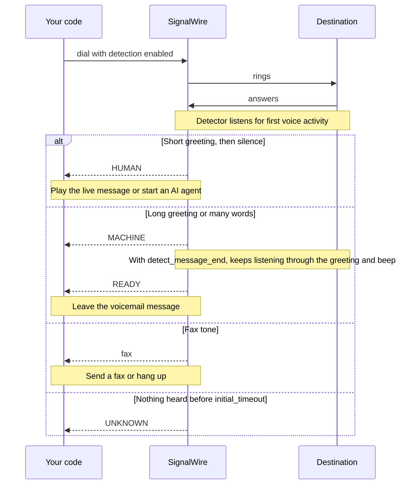

[outbound-calling]: /docs/platform/voice/outbound-calling
[api-credentials]: /docs/platform/your-signalwire-api-space
[caller-id]: /docs/platform/voice/how-to-set-caller-id-or-cnam
[trial-mode]: /docs/platform/trial-mode
[tcpa]: /docs/platform/compliance/tcpa
[webhooks]: /docs/platform/webhooks
[fax]: /docs/platform/fax
[inbound-voicemail]: /docs/swml/guides/voicemail
[swml-detect-machine]: /docs/swml/reference/calling/detect-machine
[swml-switch]: /docs/swml/reference/calling/switch
[swml-cond]: /docs/swml/reference/calling/cond
[swml-ai]: /docs/swml/reference/calling/ai
[swml-send-fax]: /docs/swml/reference/calling/send-fax
[swml-receive-fax]: /docs/swml/reference/calling/receive-fax
[swml-answer]: /docs/swml/reference/calling/answer
[swml-webhook-security]: /docs/swml/guides/webhook-security
[make-and-receive-calls]: /docs/swml/guides/make-and-receive-calls
[py-swml-service]: /docs/server-sdks/reference/python/agents/swml-service
[ts-swml-service]: /docs/server-sdks/reference/typescript/agents/swml-service
[py-swml-builder]: /docs/server-sdks/reference/python/agents/swml-builder
[ts-swml-builder]: /docs/server-sdks/reference/typescript/agents/swml-builder
[ts-dial]: /docs/server-sdks/reference/typescript/rest/calling/dial
[py-relay-receive-fax]: /docs/server-sdks/reference/python/relay/call/receive-fax
[ts-relay-receive-fax]: /docs/server-sdks/reference/typescript/relay/call/receive-fax
[ai-best-practices]: /docs/platform/ai/best-practices
[call-commands]: /docs/apis/rest/calls/call-commands
[py-rest-detect]: /docs/server-sdks/reference/python/rest/calling/detect
[ts-rest-detect]: /docs/server-sdks/reference/typescript/rest/calling/detect
[py-relay-detect]: /docs/server-sdks/reference/python/relay/call/detect
[ts-relay-detect]: /docs/server-sdks/reference/typescript/relay/call/detect
[py-relay-amd]: /docs/server-sdks/reference/python/relay/call/detect-answering-machine
[py-relay-fax]: /docs/server-sdks/reference/python/relay/call/detect-fax
[py-relay-send-fax]: /docs/server-sdks/reference/python/relay/call/send-fax
[ts-relay-send-fax]: /docs/server-sdks/reference/typescript/relay/call/send-fax
[py-detect-action]: /docs/server-sdks/reference/python/relay/actions/detect-action
[ts-detect-action]: /docs/server-sdks/reference/typescript/relay/actions/detect-action
[py-relay-events]: /docs/server-sdks/reference/python/relay/events
[ts-relay-events]: /docs/server-sdks/reference/typescript/relay/events

Find out whether a person, an answering machine, or a fax machine is on the other end of a call,
and choose what the call does next. Start by calling your own phone and hanging up on your
voicemail, then track detection events, tune the detector, and extend the flow to leave a message
after the beep, hand a live answer to an AI agent, send or receive a fax, or screen the calls
your number receives.

## Prepare for detection

Have these values ready:

- Your Space URL, such as `<YOUR_SPACE>.signalwire.com`.
- Your Project ID and API token from the Dashboard's [API credentials][api-credentials] page.
  Enable the token's **Voice** permission.
- A voice-capable phone number in your Space or a [verified caller ID][caller-id].
- A destination phone you can answer *and* send to voicemail. Declining the call is the quickest
  way to reach the greeting.
- For the inbound examples, a phone number in your Space that reaches your SWML server or Relay
  client. The [make and receive calls guide][make-and-receive-calls] shows both setups.

The tracking section and the examples later on this page use these additional values:

| Value | Replace with |
|---|---|
| `<YOUR_STATUS_WEBHOOK_URL>` | Your public HTTPS endpoint for detection and fax callbacks |
| `<YOUR_CALL_ID>` | The `id` of an answered call, returned when you place it or sent in its webhooks |
| `<YOUR_FAX_DOCUMENT_URL>` | The public URL of a PDF that SignalWire can fetch and fax |
| `<YOUR_BASIC_AUTH_PASSWORD>` | The password your SWML server requires, for the inbound SWML examples |
| `<YOUR_PUBLIC_HOST>` | The public HTTPS host that reaches your SWML server on port 3000 |

This guide adds detection to an outbound call. If you haven't placed one with SignalWire yet,
start with the [outbound calling guide][outbound-calling].

<Warning title="Trial projects can only dial verified numbers">
A [trial project][trial-mode] can dial only numbers it has purchased or verified, and can't call
internationally. Verify the phone you'll test with, or upgrade the project, before you dial.
</Warning>

<Warning title="Messages left by artificial voices are regulated">
Prerecorded and synthesized voicemail messages fall under consent, do-not-call, and calling-hour
rules. Read the [TCPA guide][tcpa] before you dial anyone but yourself.
</Warning>

This guide detects who is on a call. To record messages that callers leave on *your* number, see
the [voicemail recipe][inbound-voicemail].

## How detection works

Detection starts when the destination answers. SignalWire listens for the first voice activity,
then classifies what it hears:

- **Human.** A short greeting followed by silence, the way a person says "Hello?" and waits.
- **Machine.** Continuous speech longer than a threshold, or a single utterance with more words
  than a person's greeting usually has. Voicemail greetings and IVR menus both land here.
- **Fax.** A fax tone instead of speech.
- **Unknown.** Nothing heard before the initial timeout, or the overall timeout expired first.

The result is available as soon as the classification is made. With `detect_message_end`
enabled, detection keeps listening after a machine result until the greeting ends and the beep
sounds, then reports `READY`. That is the moment to start a voicemail message.

<llms-ignore>


</llms-ignore>

<llms-only>



</llms-only>

Each outcome surfaces in two forms: a lowercase value in the SWML `detect_result` variable, and an
uppercase event in status callbacks and Relay events.

| `detect_result` | Event | What SignalWire heard | Typical action |
|---|---|---|---|
| `human` | `HUMAN` | A short greeting, then silence | Play your message, start an AI agent, or connect an agent |
| `machine` | `MACHINE` | Speech longer than the voice threshold, or more words than the words threshold | Hang up, or wait for `READY` and leave a message |
| `machine` | `READY` | The greeting ended and the beep sounded (only with `detect_message_end`) | Play the voicemail message |
| `fax` | (fax event) | A fax tone | Send a fax, or hang up |
| `unknown` | `UNKNOWN` | No voice before `initial_timeout` | Treat as a person, or retry later |
| `detecting` | `NOT_READY` | Detection is still running | Wait |
| `error` | `finished` with no result | The detector stopped without a classification | Log it and choose a default |

`READY`, `NOT_READY`, and `finished` are lifecycle markers. They appear in callbacks and Relay
events but are never assigned to `detect_result`. Fax results report `detect.type` as `fax`; the
[`detect_machine` reference][swml-detect-machine] lists every field.

### Outbound and inbound calls

The detector is the same in both directions. What changes is who it listens to, when it starts,
and which fax tone to expect.

| | Outbound call you place | Inbound call your number receives |
|---|---|---|
| Who is classified | The party that answered | The caller |
| When detection starts | After the destination answers | After you answer, with SWML [`answer`][swml-answer] or Relay `answer()` |
| Where the instructions live | The SWML your Server SDK sends in the `dial` request, or your Relay code after `dial()` | The SWML your server returns for the number, or your Relay call handler |
| Fax tone to detect | `CED`, which the answering fax machine sends (the default `tone`) | `CNG`, which the calling fax machine sends; set `tone: "CNG"` |
| What silence means | The greeting hasn't started; let `initial_timeout` run | A person waiting for your greeting; keep `initial_timeout` short and treat `unknown` as a person |
| `detect_message_end` | Waits for the greeting and beep before you leave a message | Rarely useful; callers don't play greetings |
| Typical next step | Leave a message, start an AI agent, or send a fax | Receive a fax, turn away automated callers, or greet the person |

The REST `calling.detect` command behaves the same in both directions: once the call is
`answered`, send the command by call ID and read the result at `status_url`.

## Detect who answered

Call a phone you can answer, greet the person, and hang up on the voicemail.

<Steps>

### Choose how to detect

Choose where the detection logic runs and how your application receives the result. Detection
runs in server-side call logic, so a web app that needs it asks your backend to place the call.

| Approach | Useful when | How you start detection and receive the result |
|---|---|---|
| [Server SDK — REST](#start-detection) | A backend request or background job places the call | Send `detect_machine` in the SWML of the `dial` request. SignalWire branches on `detect_result` during the call, and `status_url` reports each result to your webhook. |
| [Server SDK — WebSocket (Relay)](#start-detection) | Your server decides what happens as results arrive | Start detection once `dial()` returns an answered call. Results arrive as events in your running client, so you don't need a public URL. |
| [REST `calling.detect` command](#detect-on-a-call-already-in-progress) | A call is already answered, and any process that knows its ID should start detection | Send the command by call ID from a Server SDK or cURL. Results go to `status_url`, and `calling.detect.stop` ends detection early. |
| [SWML server or Relay handler](#screen-an-inbound-call) | Your number receives the call | Answer first, then detect in the SWML your server returns or in your Relay call handler. |

### Set your credentials and destination

Replace these values in the code sample you choose:

| Value | Replace with |
|---|---|
| `<YOUR_SPACE>` | Your Space's subdomain in `<YOUR_SPACE>.signalwire.com` |
| `<YOUR_PROJECT_ID>` | Your Project ID |
| `<YOUR_API_TOKEN>` | Your API token |
| `<YOUR_CALLER_ID>` | Your caller ID number |
| `<YOUR_DESTINATION>` | The phone number you'll answer, in E.164 format |

### Start detection

Open the tab for the approach you chose. The examples show Python and TypeScript first, followed
by cURL for direct HTTP access.

<Tabs groupId="outbound-api">
<Tab title="REST">

The `dial` request carries a SignalWire Markup Language (SWML) document that SignalWire runs when
the destination answers. Its first instruction, [`detect_machine`][swml-detect-machine], blocks
until a result is ready. Then [`switch`][swml-switch] reads `detect_result` and picks a branch.
Only the `amd` detector runs here; the fax example below adds the second one.

The Server SDK examples build the document with the SDK's SWML builder
([`SWMLBuilder`][py-swml-builder], [`SwmlBuilder`][ts-swml-builder]). Each branch of `switch` is
a list of instructions, so the examples build each branch's message with `say()` and pass its
`main` section to `switch`.

<CodeBlocks>
<CodeBlock title="Python — REST client">
```python
# Install: python -m pip install signalwire-sdk==3.4.1
# Save as detect_machine.py and run: python detect_machine.py
from signalwire import SWMLBuilder, SWMLService
from signalwire.rest import RestClient

client = RestClient(
    project="<YOUR_PROJECT_ID>",
    token="<YOUR_API_TOKEN>",
    host="<YOUR_SPACE>.signalwire.com",
)

live = (
    SWMLBuilder(SWMLService(name="live-message"))
    .say("Hello! Your Bayview Taxi ride is confirmed for 8 AM tomorrow.")
    .build()["sections"]["main"]
)
hang_up = (
    SWMLBuilder(SWMLService(name="hang-up"))
    .hangup()
    .build()["sections"]["main"]
)

swml = (
    SWMLBuilder(SWMLService(name="detect-machine"))
    .detect_machine(detectors="amd", timeout=30)
    .switch(
        variable="detect_result",
        case={
            "human": live,
            "machine": hang_up,
        },
        default=live,
    )
    .hangup()
    .build()
)

call = client.calling.dial(
    from_="<YOUR_CALLER_ID>",
    to="<YOUR_DESTINATION>",
    swml=swml,
)
print(call["id"])
```
</CodeBlock>
<CodeBlock title="TypeScript — REST client">
```typescript
// Install: npm install @signalwire/sdk@2.0.5
// This sample also runs as JavaScript: save as detect-machine.mjs,
// then run: node detect-machine.mjs
import { RestClient, SwmlBuilder } from "@signalwire/sdk";

const client = new RestClient({
  project: "<YOUR_PROJECT_ID>",
  token: "<YOUR_API_TOKEN>",
  host: "<YOUR_SPACE>.signalwire.com",
});

const live = new SwmlBuilder()
  .say("Hello! Your Bayview Taxi ride is confirmed for 8 AM tomorrow.")
  .document.sections.main;
const hangUp = new SwmlBuilder()
  .hangup()
  .document.sections.main;

const swml = new SwmlBuilder()
  .detect_machine({ detectors: "amd", timeout: 30 })
  .switch({
    variable: "detect_result",
    case: {
      human: live,
      machine: hangUp,
    },
    default: live,
  })
  .hangup()
  .build();

const call = await client.calling.dial({
  from: "<YOUR_CALLER_ID>",
  to: "<YOUR_DESTINATION>",
  swml,
});
console.log(call.id);
```
</CodeBlock>
<CodeBlock title="cURL — REST Calling API">
```bash
curl -X POST "https://<YOUR_SPACE>.signalwire.com/api/calling/calls" \
  -u "<YOUR_PROJECT_ID>:<YOUR_API_TOKEN>" \
  -H "Content-Type: application/json" \
  -d '{
    "command": "dial",
    "params": {
      "from": "<YOUR_CALLER_ID>",
      "to": "<YOUR_DESTINATION>",
      "swml": {
        "version": "1.0.0",
        "sections": {
          "main": [
            {
              "detect_machine": {
                "detectors": "amd",
                "timeout": 30
              }
            },
            {
              "switch": {
                "variable": "detect_result",
                "case": {
                  "human": [
                    { "play": {"url": "say:Hello! Your Bayview Taxi ride is confirmed for 8 AM tomorrow."} }
                  ],
                  "machine": [
                    { "hangup": {} }
                  ]
                },
                "default": [
                  { "play": {"url": "say:Hello! Your Bayview Taxi ride is confirmed for 8 AM tomorrow."} }
                ]
              }
            },
            { "hangup": {} }
          ]
        }
      }
    }
  }'
```
</CodeBlock>
</CodeBlocks>

<Note title="TypeScript `dial()` signature depends on the SDK version">
The TypeScript samples on this page pin `@signalwire/sdk@2.0.5`, whose `dial()` takes a single
options object. The [TypeScript `dial` reference][ts-dial] documents the positional
`dial(from, to, options)` form of a newer release. Match the form to the version you install.
</Note>

The REST API returns a call `id` and status `queued`. This confirms that SignalWire accepted the
request; the call hasn't necessarily rung or been answered yet. Save the `id` to identify this call.

<EndpointResponseSnippet endpoint="POST /api/calling/calls" />

The `default` branch catches `unknown` and `error`, so a quiet person still hears the message.
Prefer [`cond`][swml-cond] when a branch needs a compound condition, such as checking
`detect_machine_beep` as well.

</Tab>
<Tab title="WebSocket (Relay)">

Relay's `dial()` has no detection option, so detection is a separate step once the call is
answered. In Python, [`detect_answering_machine()`][py-relay-amd] wraps the `machine` detector.
In TypeScript, pass the detector to [`detect()`][ts-relay-detect] directly. Both return a
`DetectAction` ([Python][py-detect-action], [TypeScript][ts-detect-action]) whose `wait()`
resolves on the first result.

<CodeBlocks>
<CodeBlock title="Python — Relay client">
```python
# Install: python -m pip install signalwire-sdk==3.4.1
# Save as detect_machine_relay.py and run: python detect_machine_relay.py
import asyncio
from signalwire.relay import RelayClient

LIVE = "Hello! Your Bayview Taxi ride is confirmed for 8 AM tomorrow."

client = RelayClient(
    project="<YOUR_PROJECT_ID>",
    token="<YOUR_API_TOKEN>",
    host="<YOUR_SPACE>.signalwire.com",
    contexts=["default"],
)

def outcome(event) -> str:
    return event.params.get("detect", {}).get("params", {}).get("event", "")

async def main():
    async with client:
        call = await client.dial(
            devices=[[{
                "type": "phone",
                "params": {
                    "from_number": "<YOUR_CALLER_ID>",
                    "to_number": "<YOUR_DESTINATION>",
                    "timeout": 30,
                },
            }]],
        )
        action = await call.detect_answering_machine(timeout=30)
        result = outcome(await action.wait())
        print(f"Detected: {result}")

        if result == "MACHINE":
            await call.hangup()
            return

        # HUMAN, or UNKNOWN when nobody spoke in time.
        async def hang_up_after_playback(_event):
            if call.state != "ended":
                await call.hangup()

        await call.play(
            [{"type": "tts", "params": {"text": LIVE}}],
            on_completed=hang_up_after_playback,
        )
        await call.wait_for_ended()

asyncio.run(main())
```
</CodeBlock>
<CodeBlock title="TypeScript — Relay client">
```typescript
// Install: npm install @signalwire/sdk@2.0.5
// Save as detect-machine-relay.mts and run: npx tsx detect-machine-relay.mts
import { RelayClient, RelayEvent } from "@signalwire/sdk";

const LIVE = "Hello! Your Bayview Taxi ride is confirmed for 8 AM tomorrow.";

const client = new RelayClient({
  project: "<YOUR_PROJECT_ID>",
  token: "<YOUR_API_TOKEN>",
  host: "<YOUR_SPACE>.signalwire.com",
  contexts: ["default"],
});

function outcome(event: RelayEvent): string {
  const detect = event.params.detect as { params?: { event?: string } } | undefined;
  return detect?.params?.event ?? "";
}

await client.connect();

try {
  const call = await client.dial([[{
    type: "phone",
    params: {
      from_number: "<YOUR_CALLER_ID>",
      to_number: "<YOUR_DESTINATION>",
      timeout: 30,
    },
  }]]);
  const action = await call.detect({ type: "machine", params: {} }, { timeout: 30 });
  const result = outcome(await action.wait());
  console.log(`Detected: ${result}`);

  if (result === "MACHINE") {
    await call.hangup();
  } else {
    // HUMAN, or UNKNOWN when nobody spoke in time.
    await call.play([{ type: "tts", text: LIVE }], {
      onCompleted: async () => {
        if (call.state !== "ended") await call.hangup();
      },
    });
    await call.waitForEnded();
  }
} finally {
  await client.disconnect();
}
```
</CodeBlock>
</CodeBlocks>

In Python, the raw [`detect()`][py-relay-detect] method takes the same parameters inside a
`{"type": "machine", "params": {...}}` object. Both SDKs use that shape for the `fax` and `digit`
detectors.

</Tab>
</Tabs>

### Answer the call, then decline it

Answer the call and say "Hello?". After a short pause you hear the ride confirmation, then the
call ends. Run the sample again and decline the call so it reaches voicemail: the call ends a few
seconds into your greeting and leaves no message. With Relay, the console prints `Detected: MACHINE`.

If the second run plays the message into your voicemail, the greeting was classified as `human`
or `unknown`. A greeting that pauses after "Hi, you've reached…" looks like a person, and one that
opens with silence longer than `initial_timeout` returns `unknown`. If the first run hangs up on
you, you spoke past the voice threshold without pausing. The
[tuning table](#tune-detection-timeouts-thresholds-and-message-end) maps each symptom to its
setting.

</Steps>

## Track detection events

Every detection result is also an event named `calling.call.detect`. Receive it as an HTTP
callback from SWML or the REST `calling.detect` command, or as a Relay event in your own process.

### Track detection events via SWML

Add `status_url` to `detect_machine` and SignalWire posts each detector event to that URL as
JSON. The `params.detect.params.event` field carries the value, and `beep` appears only when a
beep was heard. Point `<YOUR_STATUS_WEBHOOK_URL>` at an endpoint you control that SignalWire can
reach; the [webhooks guide][webhooks] covers setup and local testing.

```json
{
  "event_type": "calling.call.detect",
  "event_channel": "swml:be38xxxx-8xxx-4xxxx-9fxx-bxxxxxxxxx",
  "timestamp": 1745332535.668522,
  "project_id": "xxxxx-xxxx-xxxx-xxxx-xxxxxxxxxxxx",
  "space_id": "xxxxx-xxxx-xxxx-xxxx-xxxxxxxxxxxx",
  "params": {
    "control_id": "xxxxx-xxxx-xxxx-xxxx-xxxxxxxxxxxx",
    "detect": {
      "type": "machine",
      "params": {
        "event": "MACHINE",
        "beep": true
      }
    },
    "call_id": "xxxxx-xxxx-xxxx-xxxx-xxxxxxxxxxxx",
    "node_id": "xxxxx-xxxx-xxxx-xxxx-xxxxxxxxxxxx",
    "segment_id": "xxxxx-xxxx-xxxx-xxxx-xxxxxxxxxxxx"
  }
}
```

By default `detect_machine` waits for a result before the next SWML instruction runs. Set
`wait: false` to keep the document moving while detection runs in the background, and handle
the outcome at `status_url` instead. Asynchronous detection requires `status_url`. The examples
below place another call that plays the confirmation right away and reports the result to your
webhook.

<CodeBlocks>
<CodeBlock title="Python — REST client">
```python
# Install: python -m pip install signalwire-sdk==3.4.1
# Save as detect_async.py and run: python detect_async.py
from signalwire import SWMLBuilder, SWMLService
from signalwire.rest import RestClient

client = RestClient(
    project="<YOUR_PROJECT_ID>",
    token="<YOUR_API_TOKEN>",
    host="<YOUR_SPACE>.signalwire.com",
)

swml = (
    SWMLBuilder(SWMLService(name="detect-async"))
    .detect_machine(
        detectors="amd",
        wait=False,
        status_url="<YOUR_STATUS_WEBHOOK_URL>",
    )
    .say("Hello! Your Bayview Taxi ride is confirmed for 8 AM tomorrow.")
    .build()
)

call = client.calling.dial(
    from_="<YOUR_CALLER_ID>",
    to="<YOUR_DESTINATION>",
    swml=swml,
)
print(call["id"])
```
</CodeBlock>
<CodeBlock title="TypeScript — REST client">
```typescript
// Install: npm install @signalwire/sdk@2.0.5
// This sample also runs as JavaScript: save as detect-async.mjs,
// then run: node detect-async.mjs
import { RestClient, SwmlBuilder } from "@signalwire/sdk";

const client = new RestClient({
  project: "<YOUR_PROJECT_ID>",
  token: "<YOUR_API_TOKEN>",
  host: "<YOUR_SPACE>.signalwire.com",
});

const swml = new SwmlBuilder()
  .detect_machine({
    detectors: "amd",
    wait: false,
    status_url: "<YOUR_STATUS_WEBHOOK_URL>",
  })
  .say("Hello! Your Bayview Taxi ride is confirmed for 8 AM tomorrow.")
  .build();

const call = await client.calling.dial({
  from: "<YOUR_CALLER_ID>",
  to: "<YOUR_DESTINATION>",
  swml,
});
console.log(call.id);
```
</CodeBlock>
<CodeBlock title="cURL — REST Calling API">
```bash
curl -X POST "https://<YOUR_SPACE>.signalwire.com/api/calling/calls" \
  -u "<YOUR_PROJECT_ID>:<YOUR_API_TOKEN>" \
  -H "Content-Type: application/json" \
  -d '{
    "command": "dial",
    "params": {
      "from": "<YOUR_CALLER_ID>",
      "to": "<YOUR_DESTINATION>",
      "swml": {
        "version": "1.0.0",
        "sections": {
          "main": [
            {
              "detect_machine": {
                "detectors": "amd",
                "wait": false,
                "status_url": "<YOUR_STATUS_WEBHOOK_URL>"
              }
            },
            { "play": {"url": "say:Hello! Your Bayview Taxi ride is confirmed for 8 AM tomorrow."} }
          ]
        }
      }
    }
  }'
```
</CodeBlock>
</CodeBlocks>

The REST [`calling.detect`](#detect-on-a-call-already-in-progress) command delivers its results
the same way, through its own `status_url`.

### Track detection events via Relay

Register a handler for `calling.call.detect` before starting detection. Each event arrives as a
`DetectEvent` ([Python][py-relay-events], [TypeScript][ts-relay-events]) whose `detect` property
holds the same `type` and `params` object as the callback payload. Unlike `wait()`, which returns
once, the handler sees every event: `MACHINE` while the greeting is still playing, `READY` after
the beep, and `finished` when the detector stops.

<CodeBlocks>
<CodeBlock title="Python — Relay client">
```python
# Install: python -m pip install signalwire-sdk==3.4.1
# Save as detect_events.py and run: python detect_events.py
import asyncio
from signalwire.relay import RelayClient
from signalwire.relay.event import DetectEvent

client = RelayClient(
    project="<YOUR_PROJECT_ID>",
    token="<YOUR_API_TOKEN>",
    host="<YOUR_SPACE>.signalwire.com",
    contexts=["default"],
)

async def main():
    async with client:
        call = await client.dial(
            devices=[[{
                "type": "phone",
                "params": {
                    "from_number": "<YOUR_CALLER_ID>",
                    "to_number": "<YOUR_DESTINATION>",
                    "timeout": 30,
                },
            }]],
        )
        def log_detect(event: DetectEvent):
            params = event.detect.get("params", {})
            print(f"{event.detect.get('type')}: {params.get('event')} beep={params.get('beep', False)}")

        call.on("calling.call.detect", log_detect)
        action = await call.detect_answering_machine(detect_message_end=True, timeout=30)
        await action.wait()
        await asyncio.sleep(20)  # Keep listening for READY and finished.
        await call.hangup()

asyncio.run(main())
```
</CodeBlock>
<CodeBlock title="TypeScript — Relay client">
```typescript
// Install: npm install @signalwire/sdk@2.0.5
// Save as detect-events.mts and run: npx tsx detect-events.mts
import { RelayClient, DetectEvent } from "@signalwire/sdk";

const client = new RelayClient({
  project: "<YOUR_PROJECT_ID>",
  token: "<YOUR_API_TOKEN>",
  host: "<YOUR_SPACE>.signalwire.com",
  contexts: ["default"],
});

await client.connect();

try {
  const call = await client.dial([[{
    type: "phone",
    params: {
      from_number: "<YOUR_CALLER_ID>",
      to_number: "<YOUR_DESTINATION>",
      timeout: 30,
    },
  }]]);
  call.on("calling.call.detect", (event) => {
    const detect = (event as DetectEvent).detect as {
      type?: string;
      params?: { event?: string; beep?: boolean };
    };
    console.log(`${detect.type}: ${detect.params?.event} beep=${detect.params?.beep ?? false}`);
  });
  const action = await call.detect(
    { type: "machine", params: { detect_message_end: true } },
    { timeout: 30 },
  );
  await action.wait();
  await new Promise((resolve) => setTimeout(resolve, 20_000)); // Keep listening for READY and finished.
  await call.hangup();
} finally {
  await client.disconnect();
}
```
</CodeBlock>
</CodeBlocks>

### Compare the surfaces

SWML, the REST command, and Relay share one detector but expose it differently.

| Setting | SWML `detect_machine` | REST `calling.detect` | Relay `detect()` |
|---|---|---|---|
| `detect_message_end` default | `false` | `true` | Not sent unless you set it |
| Which detectors run | `detectors`, a comma-separated list of `amd` and `fax` (default both) | One `detect.type` per command: `machine`, `fax`, or `digit` | One `detect.type` per call; Python adds `detect_answering_machine()`, `detect_fax()`, and `detect_digit()` helpers |
| Blocking behavior | `wait` (default `true`) pauses the document | Returns immediately; results go to `status_url` | `wait()` resolves on the first result; events continue |
| `control_id` | None | Required, and the only way to stop it | Optional; the action's `stop()` uses it |
| Fax `tone` values | `CED` or `CNG` | `CED`, `CNG`, `ced`, or `cng`; omit for either | `CED` or `CNG` |
| `machine_ready_timeout` | Yes | Yes | Not on the Python helper; pass it to `detect()` |
| `detect_interruptions` | No | Yes | Yes |

## Tune detection: timeouts, thresholds, and message end

The defaults suit most residential voicemail. Adjust them when a run misclassifies, and change
one setting at a time so you can see its effect. Every setting below is a `detect_machine`
property, a `detect.params` field in REST, and a keyword argument on the Python Relay helper.

| Symptom | Setting | Default | Change |
|---|---|---|---|
| Greeting begins with silence and comes back `unknown` | `initial_timeout` | 4.5 s | Raise it |
| A person who talks for a while is classified `machine` | `machine_voice_threshold` | 1.25 s | Raise it |
| A short, scripted greeting is classified `human` | `machine_words_threshold` | 6 words | Lower it |
| A person's pause after "Hello?" is too short to count as silence | `end_silence_timeout` | 1.0 s | Lower it |
| The voicemail message starts before the beep | `machine_ready_timeout` | Same as `end_silence_timeout` | Raise it |
| Long IVR menus never reach a result | `timeout` | 30 s | Raise it, or hang up on `machine` without waiting for `READY` |
| Detection stops on the first thing it hears | `detect_message_end` | `false` in SWML, `true` in REST | Set it explicitly |
| Callers to your number wait in silence, then come back `unknown` | `initial_timeout` | 4.5 s | Lower it on inbound calls, and greet `unknown` as a person |

A greeting from a business often runs past the defaults. These examples extend
[Leave a message after the beep](#leave-a-message-after-the-beep) and give the greeting more room;
the highlighted lines are the changes.

<CodeBlocks>
<CodeBlock title="Python — REST client">
```python {31-34}
# Install: python -m pip install signalwire-sdk==3.4.1
# Save as tune_detection.py and run: python tune_detection.py
from signalwire import SWMLBuilder, SWMLService
from signalwire.rest import RestClient

client = RestClient(
    project="<YOUR_PROJECT_ID>",
    token="<YOUR_API_TOKEN>",
    host="<YOUR_SPACE>.signalwire.com",
)

live = (
    SWMLBuilder(SWMLService(name="live-message"))
    .say("Hello! Your Bayview Taxi ride is confirmed for 8 AM tomorrow.")
    .build()["sections"]["main"]
)
voicemail = (
    SWMLBuilder(SWMLService(name="voicemail-message"))
    .say(
        "This is Bayview Taxi. Your ride is confirmed for 8 AM tomorrow. "
        "Reply to our text message if you need to change it."
    )
    .build()["sections"]["main"]
)

swml = (
    SWMLBuilder(SWMLService(name="tune-detection"))
    .detect_machine(
        detectors="amd",
        detect_message_end=True,
        initial_timeout=6,
        machine_voice_threshold=2,
        machine_ready_timeout=2,
        timeout=60,
    )
    .switch(
        variable="detect_result",
        case={
            "human": live,
            "machine": voicemail,
        },
        default=live,
    )
    .hangup()
    .build()
)

call = client.calling.dial(
    from_="<YOUR_CALLER_ID>",
    to="<YOUR_DESTINATION>",
    swml=swml,
)
print(call["id"])
```
</CodeBlock>
<CodeBlock title="TypeScript — REST client">
```typescript {26-29}
// Install: npm install @signalwire/sdk@2.0.5
// This sample also runs as JavaScript: save as tune-detection.mjs,
// then run: node tune-detection.mjs
import { RestClient, SwmlBuilder } from "@signalwire/sdk";

const client = new RestClient({
  project: "<YOUR_PROJECT_ID>",
  token: "<YOUR_API_TOKEN>",
  host: "<YOUR_SPACE>.signalwire.com",
});

const live = new SwmlBuilder()
  .say("Hello! Your Bayview Taxi ride is confirmed for 8 AM tomorrow.")
  .document.sections.main;
const voicemail = new SwmlBuilder()
  .say(
    "This is Bayview Taxi. Your ride is confirmed for 8 AM tomorrow. " +
      "Reply to our text message if you need to change it.",
  )
  .document.sections.main;

const swml = new SwmlBuilder()
  .detect_machine({
    detectors: "amd",
    detect_message_end: true,
    initial_timeout: 6,
    machine_voice_threshold: 2,
    machine_ready_timeout: 2,
    timeout: 60,
  })
  .switch({
    variable: "detect_result",
    case: {
      human: live,
      machine: voicemail,
    },
    default: live,
  })
  .hangup()
  .build();

const call = await client.calling.dial({
  from: "<YOUR_CALLER_ID>",
  to: "<YOUR_DESTINATION>",
  swml,
});
console.log(call.id);
```
</CodeBlock>
<CodeBlock title="cURL — REST Calling API">
```bash {17-20}
curl -X POST "https://<YOUR_SPACE>.signalwire.com/api/calling/calls" \
  -u "<YOUR_PROJECT_ID>:<YOUR_API_TOKEN>" \
  -H "Content-Type: application/json" \
  -d '{
    "command": "dial",
    "params": {
      "from": "<YOUR_CALLER_ID>",
      "to": "<YOUR_DESTINATION>",
      "swml": {
        "version": "1.0.0",
        "sections": {
          "main": [
            {
              "detect_machine": {
                "detectors": "amd",
                "detect_message_end": true,
                "initial_timeout": 6,
                "machine_voice_threshold": 2,
                "machine_ready_timeout": 2,
                "timeout": 60
              }
            },
            {
              "switch": {
                "variable": "detect_result",
                "case": {
                  "human": [
                    { "play": {"url": "say:Hello! Your Bayview Taxi ride is confirmed for 8 AM tomorrow."} }
                  ],
                  "machine": [
                    { "play": {"url": "say:This is Bayview Taxi. Your ride is confirmed for 8 AM tomorrow. Reply to our text message if you need to change it."} }
                  ]
                },
                "default": [
                  { "play": {"url": "say:Hello! Your Bayview Taxi ride is confirmed for 8 AM tomorrow."} }
                ]
              }
            },
            { "hangup": {} }
          ]
        }
      }
    }
  }'
```
</CodeBlock>
</CodeBlocks>

Test against the destinations you'll dial in production, not only your own phone. Carrier
voicemail, office phone systems, and mobile greetings each pause and speak differently.

## Examples

The outbound examples extend your first run: keep the same credentials and placeholders, and run
the SWML or Relay example in its place. The inbound examples replace the handler behind your
phone number.

| What you want to do | Example |
|---|---|
| Wait for the beep, then leave a voicemail | [Leave a message after the beep](#leave-a-message-after-the-beep) |
| Start an AI agent only when a person answers | [Hand a live answer to an AI agent](#hand-a-live-answer-to-an-ai-agent) |
| Deliver a document when a fax machine answers | [Send a fax when a fax machine answers](#send-a-fax-when-a-fax-machine-answers) |
| Detect on a call your server already answered or connected | [Detect on a call already in progress](#detect-on-a-call-already-in-progress) |
| Turn away automated callers to your number | [Screen an inbound call](#screen-an-inbound-call) |
| Take faxes and voice calls on the same number | [Receive a fax on an inbound call](#receive-a-fax-on-an-inbound-call) |

### Leave a message after the beep

Wait for the voicemail greeting and beep to finish, then leave a message. Without
`detect_message_end`, a `machine` result arrives while the greeting is still playing, and anything
you say then is lost. The [outbound calling guide][outbound-calling] has a shorter version of this flow.

#### Leave a message via SWML

Set `detect_message_end` so `detect_machine` returns after the beep. The `machine` branch then
plays into the recording. `detect_machine_beep` records whether a beep was heard, and
`detect_ms` how long detection took.

<CodeBlocks>
<CodeBlock title="Python — REST client">
```python
# Install: python -m pip install signalwire-sdk==3.4.1
# Save as leave_message.py and run: python leave_message.py
from signalwire import SWMLBuilder, SWMLService
from signalwire.rest import RestClient

client = RestClient(
    project="<YOUR_PROJECT_ID>",
    token="<YOUR_API_TOKEN>",
    host="<YOUR_SPACE>.signalwire.com",
)

live = (
    SWMLBuilder(SWMLService(name="live-message"))
    .say("Hello! Your Bayview Taxi ride is confirmed for 8 AM tomorrow.")
    .build()["sections"]["main"]
)
voicemail = (
    SWMLBuilder(SWMLService(name="voicemail-message"))
    .say(
        "This is Bayview Taxi. Your ride is confirmed for 8 AM tomorrow. "
        "Reply to our text message if you need to change it."
    )
    .build()["sections"]["main"]
)

swml = (
    SWMLBuilder(SWMLService(name="leave-a-message"))
    .detect_machine(detectors="amd", detect_message_end=True, timeout=45)
    .switch(
        variable="detect_result",
        case={
            "human": live,
            "machine": voicemail,
        },
        default=live,
    )
    .hangup()
    .build()
)

call = client.calling.dial(
    from_="<YOUR_CALLER_ID>",
    to="<YOUR_DESTINATION>",
    swml=swml,
)
print(call["id"])
```
</CodeBlock>
<CodeBlock title="TypeScript — REST client">
```typescript
// Install: npm install @signalwire/sdk@2.0.5
// This sample also runs as JavaScript: save as leave-message.mjs,
// then run: node leave-message.mjs
import { RestClient, SwmlBuilder } from "@signalwire/sdk";

const client = new RestClient({
  project: "<YOUR_PROJECT_ID>",
  token: "<YOUR_API_TOKEN>",
  host: "<YOUR_SPACE>.signalwire.com",
});

const live = new SwmlBuilder()
  .say("Hello! Your Bayview Taxi ride is confirmed for 8 AM tomorrow.")
  .document.sections.main;
const voicemail = new SwmlBuilder()
  .say(
    "This is Bayview Taxi. Your ride is confirmed for 8 AM tomorrow. " +
      "Reply to our text message if you need to change it.",
  )
  .document.sections.main;

const swml = new SwmlBuilder()
  .detect_machine({ detectors: "amd", detect_message_end: true, timeout: 45 })
  .switch({
    variable: "detect_result",
    case: {
      human: live,
      machine: voicemail,
    },
    default: live,
  })
  .hangup()
  .build();

const call = await client.calling.dial({
  from: "<YOUR_CALLER_ID>",
  to: "<YOUR_DESTINATION>",
  swml,
});
console.log(call.id);
```
</CodeBlock>
<CodeBlock title="cURL — REST Calling API">
```bash
curl -X POST "https://<YOUR_SPACE>.signalwire.com/api/calling/calls" \
  -u "<YOUR_PROJECT_ID>:<YOUR_API_TOKEN>" \
  -H "Content-Type: application/json" \
  -d '{
    "command": "dial",
    "params": {
      "from": "<YOUR_CALLER_ID>",
      "to": "<YOUR_DESTINATION>",
      "swml": {
        "version": "1.0.0",
        "sections": {
          "main": [
            {
              "detect_machine": {
                "detectors": "amd",
                "detect_message_end": true,
                "timeout": 45
              }
            },
            {
              "switch": {
                "variable": "detect_result",
                "case": {
                  "human": [
                    { "play": {"url": "say:Hello! Your Bayview Taxi ride is confirmed for 8 AM tomorrow."} }
                  ],
                  "machine": [
                    { "play": {"url": "say:This is Bayview Taxi. Your ride is confirmed for 8 AM tomorrow. Reply to our text message if you need to change it."} }
                  ]
                },
                "default": [
                  { "play": {"url": "say:Hello! Your Bayview Taxi ride is confirmed for 8 AM tomorrow."} }
                ]
              }
            },
            { "hangup": {} }
          ]
        }
      }
    }
  }'
```
</CodeBlock>
</CodeBlocks>

The `timeout` is longer here because it now covers the whole greeting. `machine_ready_timeout`
sets how much silence after the greeting counts as "ready"; it defaults to
`end_silence_timeout`. Raise it for greetings that pause before the beep.

#### Leave a message via Relay

Use the event handler rather than `wait()`. With `detect_message_end` on, a `MACHINE` event
arrives first, while the greeting is still playing; `READY` follows after the beep. Play the
voicemail on `READY`, and the live message on `HUMAN` or `UNKNOWN`.

<CodeBlocks>
<CodeBlock title="Python — Relay client">
```python
# Install: python -m pip install signalwire-sdk==3.4.1
# Save as leave_message_relay.py and run: python leave_message_relay.py
import asyncio
from signalwire.relay import RelayClient
from signalwire.relay.event import DetectEvent

LIVE = "Hello! Your Bayview Taxi ride is confirmed for 8 AM tomorrow."
VOICEMAIL = (
    "This is Bayview Taxi. Your ride is confirmed for 8 AM tomorrow. "
    "Reply to our text message if you need to change it."
)

client = RelayClient(
    project="<YOUR_PROJECT_ID>",
    token="<YOUR_API_TOKEN>",
    host="<YOUR_SPACE>.signalwire.com",
    contexts=["default"],
)

async def main():
    async with client:
        call = await client.dial(
            devices=[[{
                "type": "phone",
                "params": {
                    "from_number": "<YOUR_CALLER_ID>",
                    "to_number": "<YOUR_DESTINATION>",
                    "timeout": 30,
                },
            }]],
        )
        announced = False

        async def hang_up_after_playback(_event):
            if call.state != "ended":
                await call.hangup()

        async def speak(text: str):
            nonlocal announced
            announced = True
            await call.play(
                [{"type": "tts", "params": {"text": text}}],
                on_completed=hang_up_after_playback,
            )

        async def on_detect(event: DetectEvent):
            if announced or call.state == "ended":
                return
            result = event.detect.get("params", {}).get("event", "")
            if result == "READY":
                # The greeting and its beep have finished.
                await speak(VOICEMAIL)
            elif result in ("HUMAN", "UNKNOWN"):
                await speak(LIVE)
            elif result == "finished":
                # Detection timed out without a usable result.
                await call.hangup()

        call.on("calling.call.detect", on_detect)
        await call.detect_answering_machine(detect_message_end=True, timeout=45)
        await call.wait_for_ended()

asyncio.run(main())
```
</CodeBlock>
<CodeBlock title="TypeScript — Relay client">
```typescript
// Install: npm install @signalwire/sdk@2.0.5
// Save as leave-message-relay.mts and run: npx tsx leave-message-relay.mts
import { RelayClient, DetectEvent } from "@signalwire/sdk";

const LIVE = "Hello! Your Bayview Taxi ride is confirmed for 8 AM tomorrow.";
const VOICEMAIL =
  "This is Bayview Taxi. Your ride is confirmed for 8 AM tomorrow. " +
  "Reply to our text message if you need to change it.";

const client = new RelayClient({
  project: "<YOUR_PROJECT_ID>",
  token: "<YOUR_API_TOKEN>",
  host: "<YOUR_SPACE>.signalwire.com",
  contexts: ["default"],
});

await client.connect();

try {
  const call = await client.dial([[{
    type: "phone",
    params: {
      from_number: "<YOUR_CALLER_ID>",
      to_number: "<YOUR_DESTINATION>",
      timeout: 30,
    },
  }]]);
  let announced = false;

  const speak = async (text: string) => {
    announced = true;
    await call.play([{ type: "tts", text }], {
      onCompleted: async () => {
        if (call.state !== "ended") await call.hangup();
      },
    });
  };

  call.on("calling.call.detect", async (event) => {
    if (announced || call.state === "ended") return;
    const detect = (event as DetectEvent).detect as { params?: { event?: string } };
    const result = detect.params?.event ?? "";
    if (result === "READY") {
      // The greeting and its beep have finished.
      await speak(VOICEMAIL);
    } else if (result === "HUMAN" || result === "UNKNOWN") {
      await speak(LIVE);
    } else if (result === "finished") {
      // Detection timed out without a usable result.
      await call.hangup();
    }
  });

  await call.detect({ type: "machine", params: { detect_message_end: true } }, { timeout: 45 });
  await call.waitForEnded();
} finally {
  await client.disconnect();
}
```
</CodeBlock>
</CodeBlocks>

### Hand a live answer to an AI agent

Start an AI agent when a person answers, and leave a voicemail otherwise.

<Warning title="Outbound AI calls are regulated">
Before dialing, follow consent, do-not-call, and calling-hour requirements for artificial voices.
See the [TCPA guide][tcpa] and [AI best practices][ai-best-practices].
</Warning>

#### Hand off to an AI agent via SWML

Put the [`ai`][swml-ai] instruction in the `human` branch and the voicemail message in the
`machine` branch. The Python builder's `ai()` takes the prompt as `prompt_text`; the TypeScript
types in `@signalwire/sdk@2.0.5` omit the `{ text }` prompt form, so that line carries a
`@ts-expect-error` comment.

<CodeBlocks>
<CodeBlock title="Python — REST client">
```python
# Install: python -m pip install signalwire-sdk==3.4.1
# Save as detect_then_ai.py and run: python detect_then_ai.py
from signalwire import SWMLBuilder, SWMLService
from signalwire.rest import RestClient

client = RestClient(
    project="<YOUR_PROJECT_ID>",
    token="<YOUR_API_TOKEN>",
    host="<YOUR_SPACE>.signalwire.com",
)

agent = (
    SWMLBuilder(SWMLService(name="ada"))
    .ai(
        params={
            "static_greeting": "Hi, this is Ada from Bayview Taxi calling about your ride tomorrow. This call uses an artificial voice.",
            "static_greeting_no_barge": True,
        },
        prompt_text=(
            "You are Ada, a dispatcher for Bayview Taxi. Confirm the rider still wants "
            "their 8 AM pickup tomorrow. If they want to change the time, take the new "
            "time and repeat it back. Keep answers short."
        ),
    )
    .build()["sections"]["main"]
)
voicemail = (
    SWMLBuilder(SWMLService(name="voicemail-message"))
    .say("This is Bayview Taxi confirming your 8 AM ride tomorrow. Call us back if anything changes.")
    .hangup()
    .build()["sections"]["main"]
)

swml = (
    SWMLBuilder(SWMLService(name="detect-then-ai"))
    .detect_machine(detectors="amd", detect_message_end=True, timeout=45)
    .switch(
        variable="detect_result",
        case={
            "human": agent,
            "machine": voicemail,
        },
        default=voicemail,
    )
    .build()
)

call = client.calling.dial(
    from_="<YOUR_CALLER_ID>",
    to="<YOUR_DESTINATION>",
    swml=swml,
)
print(call["id"])
```
</CodeBlock>
<CodeBlock title="TypeScript — REST client">
```typescript
// Install: npm install @signalwire/sdk@2.0.5
// This sample also runs as JavaScript: save as detect-then-ai.mjs,
// then run: node detect-then-ai.mjs
import { RestClient, SwmlBuilder } from "@signalwire/sdk";

const client = new RestClient({
  project: "<YOUR_PROJECT_ID>",
  token: "<YOUR_API_TOKEN>",
  host: "<YOUR_SPACE>.signalwire.com",
});

const prompt =
  "You are Ada, a dispatcher for Bayview Taxi. Confirm the rider still wants " +
  "their 8 AM pickup tomorrow. If they want to change the time, take the new " +
  "time and repeat it back. Keep answers short.";

const agent = new SwmlBuilder()
  .ai({
    params: {
      static_greeting: "Hi, this is Ada from Bayview Taxi calling about your ride tomorrow. This call uses an artificial voice.",
      static_greeting_no_barge: true,
    },
    // @ts-expect-error SDK 2.0.5 types omit SWML's { text } prompt form.
    prompt: { text: prompt },
  })
  .document.sections.main;
const voicemail = new SwmlBuilder()
  .say("This is Bayview Taxi confirming your 8 AM ride tomorrow. Call us back if anything changes.")
  .hangup()
  .document.sections.main;

const swml = new SwmlBuilder()
  .detect_machine({ detectors: "amd", detect_message_end: true, timeout: 45 })
  .switch({
    variable: "detect_result",
    case: {
      human: agent,
      machine: voicemail,
    },
    default: voicemail,
  })
  .build();

const call = await client.calling.dial({
  from: "<YOUR_CALLER_ID>",
  to: "<YOUR_DESTINATION>",
  swml,
});
console.log(call.id);
```
</CodeBlock>
<CodeBlock title="cURL — REST Calling API">
```bash
curl -X POST "https://<YOUR_SPACE>.signalwire.com/api/calling/calls" \
  -u "<YOUR_PROJECT_ID>:<YOUR_API_TOKEN>" \
  -H "Content-Type: application/json" \
  -d '{
    "command": "dial",
    "params": {
      "from": "<YOUR_CALLER_ID>",
      "to": "<YOUR_DESTINATION>",
      "swml": {
        "version": "1.0.0",
        "sections": {
          "main": [
            {
              "detect_machine": {
                "detectors": "amd",
                "detect_message_end": true,
                "timeout": 45
              }
            },
            {
              "switch": {
                "variable": "detect_result",
                "case": {
                  "human": [
                    {
                      "ai": {
                        "params": {
                          "static_greeting": "Hi, this is Ada from Bayview Taxi calling about your ride tomorrow. This call uses an artificial voice.",
                          "static_greeting_no_barge": true
                        },
                        "prompt": {
                          "text": "You are Ada, a dispatcher for Bayview Taxi. Confirm the rider still wants their 8 AM pickup tomorrow. If they want to change the time, take the new time and repeat it back. Keep answers short."
                        }
                      }
                    }
                  ],
                  "machine": [
                    { "play": {"url": "say:This is Bayview Taxi confirming your 8 AM ride tomorrow. Call us back if anything changes."} },
                    { "hangup": {} }
                  ]
                },
                "default": [
                  { "play": {"url": "say:This is Bayview Taxi confirming your 8 AM ride tomorrow. Call us back if anything changes."} },
                  { "hangup": {} }
                ]
              }
            }
          ]
        }
      }
    }
  }'
```
</CodeBlock>
</CodeBlocks>

#### Hand off to an AI agent via Relay

Start the agent with `call.ai()` on `HUMAN`, and play the voicemail on `READY`.

<CodeBlocks>
<CodeBlock title="Python — Relay client">
```python
# Install: python -m pip install signalwire-sdk==3.4.1
# Save as detect_then_ai_relay.py and run: python detect_then_ai_relay.py
import asyncio
from signalwire.relay import RelayClient
from signalwire.relay.event import DetectEvent

VOICEMAIL = "This is Bayview Taxi confirming your 8 AM ride tomorrow. Call us back if anything changes."

client = RelayClient(
    project="<YOUR_PROJECT_ID>",
    token="<YOUR_API_TOKEN>",
    host="<YOUR_SPACE>.signalwire.com",
    contexts=["default"],
)

async def main():
    async with client:
        call = await client.dial(
            devices=[[{
                "type": "phone",
                "params": {
                    "from_number": "<YOUR_CALLER_ID>",
                    "to_number": "<YOUR_DESTINATION>",
                    "timeout": 30,
                },
            }]],
        )
        handled = False

        async def hang_up_after_playback(_event):
            if call.state != "ended":
                await call.hangup()

        async def on_detect(event: DetectEvent):
            nonlocal handled
            if handled or call.state == "ended":
                return
            result = event.detect.get("params", {}).get("event", "")
            if result in ("HUMAN", "UNKNOWN"):
                handled = True
                await call.ai(
                    ai_params={
                        "static_greeting": "Hi, this is Ada from Bayview Taxi calling about your ride tomorrow. This call uses an artificial voice.",
                        "static_greeting_no_barge": True,
                    },
                    prompt={
                        "text": (
                            "You are Ada, a dispatcher for Bayview Taxi. Confirm the rider still wants "
                            "their 8 AM pickup tomorrow. If they want to change the time, take the new "
                            "time and repeat it back. Keep answers short."
                        )
                    },
                )
            elif result == "READY":
                handled = True
                await call.play(
                    [{"type": "tts", "params": {"text": VOICEMAIL}}],
                    on_completed=hang_up_after_playback,
                )
            elif result == "finished":
                await call.hangup()

        call.on("calling.call.detect", on_detect)
        await call.detect_answering_machine(detect_message_end=True, timeout=45)
        await call.wait_for_ended()

asyncio.run(main())
```
</CodeBlock>
<CodeBlock title="TypeScript — Relay client">
```typescript
// Install: npm install @signalwire/sdk@2.0.5
// Save as detect-then-ai-relay.mts and run: npx tsx detect-then-ai-relay.mts
import { RelayClient, DetectEvent } from "@signalwire/sdk";

const VOICEMAIL = "This is Bayview Taxi confirming your 8 AM ride tomorrow. Call us back if anything changes.";

const client = new RelayClient({
  project: "<YOUR_PROJECT_ID>",
  token: "<YOUR_API_TOKEN>",
  host: "<YOUR_SPACE>.signalwire.com",
  contexts: ["default"],
});

await client.connect();

try {
  const call = await client.dial([[{
    type: "phone",
    params: {
      from_number: "<YOUR_CALLER_ID>",
      to_number: "<YOUR_DESTINATION>",
      timeout: 30,
    },
  }]]);
  let handled = false;

  call.on("calling.call.detect", async (event) => {
    if (handled || call.state === "ended") return;
    const detect = (event as DetectEvent).detect as { params?: { event?: string } };
    const result = detect.params?.event ?? "";
    if (result === "HUMAN" || result === "UNKNOWN") {
      handled = true;
      await call.ai({
        aiParams: {
          static_greeting: "Hi, this is Ada from Bayview Taxi calling about your ride tomorrow. This call uses an artificial voice.",
          static_greeting_no_barge: true,
        },
        prompt: {
          text:
            "You are Ada, a dispatcher for Bayview Taxi. Confirm the rider still wants " +
            "their 8 AM pickup tomorrow. If they want to change the time, take the new " +
            "time and repeat it back. Keep answers short.",
        },
      });
    } else if (result === "READY") {
      handled = true;
      await call.play([{ type: "tts", text: VOICEMAIL }], {
        onCompleted: async () => {
          if (call.state !== "ended") await call.hangup();
        },
      });
    } else if (result === "finished") {
      await call.hangup();
    }
  });

  await call.detect({ type: "machine", params: { detect_message_end: true } }, { timeout: 45 });
  await call.waitForEnded();
} finally {
  await client.disconnect();
}
```
</CodeBlock>
</CodeBlocks>

### Send a fax when a fax machine answers

Detect a fax machine on the other end and send it a document, or speak to the person who
answered instead. A fax machine that answers a call sends a `CED` tone, which is the detector's
default `tone`; a fax machine that calls you sends `CNG` instead, covered in
[Receive a fax on an inbound call](#receive-a-fax-on-an-inbound-call). `<YOUR_FAX_DOCUMENT_URL>`
must point at a PDF that SignalWire can fetch.

#### Send a fax via SWML

Enable both detectors with `detectors: "amd,fax"` and add a `fax` branch that runs
[`send_fax`][swml-send-fax].

<CodeBlocks>
<CodeBlock title="Python — REST client">
```python
# Install: python -m pip install signalwire-sdk==3.4.1
# Save as detect_fax.py and run: python detect_fax.py
from signalwire import SWMLBuilder, SWMLService
from signalwire.rest import RestClient

client = RestClient(
    project="<YOUR_PROJECT_ID>",
    token="<YOUR_API_TOKEN>",
    host="<YOUR_SPACE>.signalwire.com",
)

send_receipt = (
    SWMLBuilder(SWMLService(name="send-receipt"))
    .send_fax(document="<YOUR_FAX_DOCUMENT_URL>", header_info="Bayview Taxi receipt")
    .build()["sections"]["main"]
)
not_a_fax = (
    SWMLBuilder(SWMLService(name="not-a-fax"))
    .say("Hello, this is Bayview Taxi. We tried to fax your receipt. We will email it instead.")
    .build()["sections"]["main"]
)
hang_up = (
    SWMLBuilder(SWMLService(name="hang-up"))
    .hangup()
    .build()["sections"]["main"]
)

swml = (
    SWMLBuilder(SWMLService(name="detect-fax"))
    .detect_machine(detectors="amd,fax", timeout=30)
    .switch(
        variable="detect_result",
        case={
            "fax": send_receipt,
            "human": not_a_fax,
        },
        default=hang_up,
    )
    .hangup()
    .build()
)

call = client.calling.dial(
    from_="<YOUR_CALLER_ID>",
    to="<YOUR_DESTINATION>",
    swml=swml,
)
print(call["id"])
```
</CodeBlock>
<CodeBlock title="TypeScript — REST client">
```typescript
// Install: npm install @signalwire/sdk@2.0.5
// This sample also runs as JavaScript: save as detect-fax.mjs,
// then run: node detect-fax.mjs
import { RestClient, SwmlBuilder } from "@signalwire/sdk";

const client = new RestClient({
  project: "<YOUR_PROJECT_ID>",
  token: "<YOUR_API_TOKEN>",
  host: "<YOUR_SPACE>.signalwire.com",
});

const sendReceipt = new SwmlBuilder()
  .send_fax({ document: "<YOUR_FAX_DOCUMENT_URL>", header_info: "Bayview Taxi receipt" })
  .document.sections.main;
const notAFax = new SwmlBuilder()
  .say("Hello, this is Bayview Taxi. We tried to fax your receipt. We will email it instead.")
  .document.sections.main;
const hangUp = new SwmlBuilder()
  .hangup()
  .document.sections.main;

const swml = new SwmlBuilder()
  .detect_machine({ detectors: "amd,fax", timeout: 30 })
  .switch({
    variable: "detect_result",
    case: {
      fax: sendReceipt,
      human: notAFax,
    },
    default: hangUp,
  })
  .hangup()
  .build();

const call = await client.calling.dial({
  from: "<YOUR_CALLER_ID>",
  to: "<YOUR_DESTINATION>",
  swml,
});
console.log(call.id);
```
</CodeBlock>
<CodeBlock title="cURL — REST Calling API">
```bash
curl -X POST "https://<YOUR_SPACE>.signalwire.com/api/calling/calls" \
  -u "<YOUR_PROJECT_ID>:<YOUR_API_TOKEN>" \
  -H "Content-Type: application/json" \
  -d '{
    "command": "dial",
    "params": {
      "from": "<YOUR_CALLER_ID>",
      "to": "<YOUR_DESTINATION>",
      "swml": {
        "version": "1.0.0",
        "sections": {
          "main": [
            {
              "detect_machine": {
                "detectors": "amd,fax",
                "timeout": 30
              }
            },
            {
              "switch": {
                "variable": "detect_result",
                "case": {
                  "fax": [
                    {
                      "send_fax": {
                        "document": "<YOUR_FAX_DOCUMENT_URL>",
                        "header_info": "Bayview Taxi receipt"
                      }
                    }
                  ],
                  "human": [
                    { "play": {"url": "say:Hello, this is Bayview Taxi. We tried to fax your receipt. We will email it instead."} }
                  ]
                },
                "default": [
                  { "hangup": {} }
                ]
              }
            },
            { "hangup": {} }
          ]
        }
      }
    }
  }'
```
</CodeBlock>
</CodeBlocks>

#### Send a fax via Relay

Relay runs one detector per operation. The `fax` detector ([`detect_fax()`][py-relay-fax] in
Python, `detect()` with `type: "fax"` in TypeScript) listens only for a fax tone, so give it a
short timeout: a fax machine answers with its tone within a second or two, and a person doesn't.
When the action resolves with a `fax` result, send the document with `send_fax()`
([Python][py-relay-send-fax], [TypeScript][ts-relay-send-fax]); otherwise treat the answer as a
person.

<CodeBlocks>
<CodeBlock title="Python — Relay client">
```python
# Install: python -m pip install signalwire-sdk==3.4.1
# Save as detect_fax_relay.py and run: python detect_fax_relay.py
import asyncio
from signalwire.relay import RelayClient

NOT_A_FAX = "Hello, this is Bayview Taxi. We tried to fax your receipt. We will email it instead."

client = RelayClient(
    project="<YOUR_PROJECT_ID>",
    token="<YOUR_API_TOKEN>",
    host="<YOUR_SPACE>.signalwire.com",
    contexts=["default"],
)

def is_fax(event) -> bool:
    detect = event.params.get("detect", {})
    outcome = detect.get("params", {}).get("event", "")
    return detect.get("type") == "fax" and outcome not in ("finished", "error", "")

async def main():
    async with client:
        call = await client.dial(
            devices=[[{
                "type": "phone",
                "params": {
                    "from_number": "<YOUR_CALLER_ID>",
                    "to_number": "<YOUR_DESTINATION>",
                    "timeout": 30,
                },
            }]],
        )
        action = await call.detect_fax(tone="CED", timeout=8)
        event = await action.wait()

        if is_fax(event):
            fax = await call.send_fax(
                document="<YOUR_FAX_DOCUMENT_URL>",
                header_info="Bayview Taxi receipt",
            )
            result = await fax.wait()
            print(f"Fax sent: {result.params.get('fax', {}).get('pages', 0)} pages")
            await call.hangup()
            return

        async def hang_up_after_playback(_event):
            if call.state != "ended":
                await call.hangup()

        await call.play(
            [{"type": "tts", "params": {"text": NOT_A_FAX}}],
            on_completed=hang_up_after_playback,
        )
        await call.wait_for_ended()

asyncio.run(main())
```
</CodeBlock>
<CodeBlock title="TypeScript — Relay client">
```typescript
// Install: npm install @signalwire/sdk@2.0.5
// Save as detect-fax-relay.mts and run: npx tsx detect-fax-relay.mts
import { RelayClient, RelayEvent } from "@signalwire/sdk";

const NOT_A_FAX = "Hello, this is Bayview Taxi. We tried to fax your receipt. We will email it instead.";

const client = new RelayClient({
  project: "<YOUR_PROJECT_ID>",
  token: "<YOUR_API_TOKEN>",
  host: "<YOUR_SPACE>.signalwire.com",
  contexts: ["default"],
});

function isFax(event: RelayEvent): boolean {
  const detect = event.params.detect as { type?: string; params?: { event?: string } } | undefined;
  const outcome = detect?.params?.event ?? "";
  return detect?.type === "fax" && !["finished", "error", ""].includes(outcome);
}

await client.connect();

try {
  const call = await client.dial([[{
    type: "phone",
    params: {
      from_number: "<YOUR_CALLER_ID>",
      to_number: "<YOUR_DESTINATION>",
      timeout: 30,
    },
  }]]);
  const action = await call.detect({ type: "fax", params: { tone: "CED" } }, { timeout: 8 });
  const event = await action.wait();

  if (isFax(event)) {
    const fax = await call.sendFax("<YOUR_FAX_DOCUMENT_URL>", {
      headerInfo: "Bayview Taxi receipt",
    });
    const result = await fax.wait();
    const pages = (result.params.fax as { pages?: number } | undefined)?.pages ?? 0;
    console.log(`Fax sent: ${pages} pages`);
    await call.hangup();
  } else {
    await call.play([{ type: "tts", text: NOT_A_FAX }], {
      onCompleted: async () => {
        if (call.state !== "ended") await call.hangup();
      },
    });
    await call.waitForEnded();
  }
} finally {
  await client.disconnect();
}
```
</CodeBlock>
</CodeBlocks>

### Detect on a call already in progress

Start detection on a call that is already answered, from any process that knows the call ID. This
suits calls placed with a `url` that your server answered, calls that changed hands, such as a leg
you connected to a customer, and inbound calls your server is handling over HTTP.

#### Start detection on a live call via the REST Calling API

Call the REST client's `detect()` method ([Python][py-rest-detect], [TypeScript][ts-rest-detect]),
or send the [`calling.detect` command][call-commands] with the call's `id`. The command returns at
once; the result arrives at `status_url` as the same `calling.call.detect` payload shown in
[Track detection events via SWML](#track-detection-events-via-swml). `control_id` is required,
and it's the only handle for stopping the detector early with `calling.detect.stop`. This command
defaults `detect_message_end` to `true`.

<CodeBlocks>
<CodeBlock title="Python — REST client">
```python
# Install: python -m pip install signalwire-sdk==3.4.1
# Save as detect_in_progress.py and run: python detect_in_progress.py
from signalwire.rest import RestClient

client = RestClient(
    project="<YOUR_PROJECT_ID>",
    token="<YOUR_API_TOKEN>",
    host="<YOUR_SPACE>.signalwire.com",
)

# status_url has no keyword argument yet; extras passes it through as-is.
client.calling.detect(
    call_id="<YOUR_CALL_ID>",
    control_id="amd-1",
    detect={"type": "machine", "params": {"detect_message_end": True}},
    timeout=30,
    extras={"status_url": "<YOUR_STATUS_WEBHOOK_URL>"},
)

# Later, if the result no longer matters:
client.calling.detect_stop(call_id="<YOUR_CALL_ID>", control_id="amd-1")
```
</CodeBlock>
<CodeBlock title="TypeScript — REST client">
```typescript
// Install: npm install @signalwire/sdk@2.0.5
// This sample also runs as JavaScript: save as detect-in-progress.mjs,
// then run: node detect-in-progress.mjs
import { RestClient } from "@signalwire/sdk";

const client = new RestClient({
  project: "<YOUR_PROJECT_ID>",
  token: "<YOUR_API_TOKEN>",
  host: "<YOUR_SPACE>.signalwire.com",
});

await client.calling.detect("<YOUR_CALL_ID>", {
  control_id: "amd-1",
  detect: { type: "machine", params: { detect_message_end: true } },
  timeout: 30,
  status_url: "<YOUR_STATUS_WEBHOOK_URL>",
});

// Later, if the result no longer matters:
await client.calling.detectStop("<YOUR_CALL_ID>", { control_id: "amd-1" });
```
</CodeBlock>
<CodeBlock title="cURL — REST Calling API">
```bash
curl -X POST "https://<YOUR_SPACE>.signalwire.com/api/calling/calls" \
  -u "<YOUR_PROJECT_ID>:<YOUR_API_TOKEN>" \
  -H "Content-Type: application/json" \
  -d '{
    "id": "<YOUR_CALL_ID>",
    "command": "calling.detect",
    "params": {
      "control_id": "amd-1",
      "detect": {
        "type": "machine",
        "params": {
          "detect_message_end": true
        }
      },
      "timeout": 30,
      "status_url": "<YOUR_STATUS_WEBHOOK_URL>"
    }
  }'
```
</CodeBlock>
</CodeBlocks>

The call must be in the `answered` state. Sending the command to a call that is still ringing
fails. To act on the result, have your webhook handler send another call command by the same
`id`, such as `calling.play` for a voicemail message.

### Screen an inbound call

Run detection on calls your number receives. Two things differ from the outbound flow: you answer
first, and a person who calls you waits for your greeting instead of speaking. Silence from a
person becomes `unknown` once `initial_timeout` expires, so keep that timeout short and treat
`unknown` as a person.

#### Screen an inbound call via SWML

Run one of the servers below in place of the SWML server behind your number. Each serves the
document at `/swml` with the SDK's `SWMLService` ([Python][py-swml-service],
[TypeScript][ts-swml-service]), and requires basic-auth credentials in the URL you give
SignalWire: `https://signalwire:<YOUR_BASIC_AUTH_PASSWORD>@<YOUR_PUBLIC_HOST>/swml`. Expose port
3000 at that public HTTPS host; the [make and receive calls guide][make-and-receive-calls] covers
assigning the URL to your number, and [webhook security][swml-webhook-security] covers verifying
requests. For a hosted SWML Script, paste the YAML or JSON instead.

[`answer`][swml-answer] runs first, then `detect_machine` listens for two seconds before the
greeting plays.

<CodeBlocks>
<CodeBlock title="Python — SWML server">
```python
# Install: python -m pip install signalwire-sdk==3.4.1
# Save as inbound_screen.py and run: python inbound_screen.py
from signalwire import SWMLBuilder, SWMLService

reject = (
    SWMLBuilder(SWMLService(name="reject"))
    .say("This line doesn't accept automated calls. Goodbye.")
    .hangup()
    .build()["sections"]["main"]
)
greeting = (
    SWMLBuilder(SWMLService(name="greeting"))
    .say("Thanks for calling Bayview Taxi. A dispatcher will be with you shortly.")
    .build()["sections"]["main"]
)

service = SWMLService(
    name="inbound-screen",
    route="/swml",
    port=3000,
    basic_auth=("signalwire", "<YOUR_BASIC_AUTH_PASSWORD>"),
)
(
    SWMLBuilder(service)
    .answer()
    .detect_machine(detectors="amd", initial_timeout=2, timeout=10)
    .switch(
        variable="detect_result",
        case={"machine": reject},
        default=greeting,
    )
    .hangup()
)
service.serve()
```
</CodeBlock>
<CodeBlock title="TypeScript — SWML server">
```typescript
// Install: npm install @signalwire/sdk@2.0.5
// This sample also runs as JavaScript: save as inbound-screen.mjs,
// then run: node inbound-screen.mjs
import { SWMLService, SwmlBuilder } from "@signalwire/sdk";

const reject = new SwmlBuilder()
  .say("This line doesn't accept automated calls. Goodbye.")
  .hangup()
  .document.sections.main;
const greeting = new SwmlBuilder()
  .say("Thanks for calling Bayview Taxi. A dispatcher will be with you shortly.")
  .document.sections.main;

const service = new SWMLService({
  name: "inbound-screen",
  route: "/swml",
  port: 3000,
  basicAuth: ["signalwire", "<YOUR_BASIC_AUTH_PASSWORD>"],
});
service.getBuilder()
  .answer()
  .detect_machine({ detectors: "amd", initial_timeout: 2, timeout: 10 })
  .switch({
    variable: "detect_result",
    case: { machine: reject },
    default: greeting,
  })
  .hangup();

await service.serve();
```
</CodeBlock>
<CodeBlock title="YAML">
```yaml
version: 1.0.0
sections:
  main:
    - answer: {}
    - detect_machine:
        detectors: amd
        initial_timeout: 2
        timeout: 10
    - switch:
        variable: detect_result
        case:
          machine:
            - play:
                url: "say:This line doesn't accept automated calls. Goodbye."
            - hangup: {}
        default:
          - play:
              url: "say:Thanks for calling Bayview Taxi. A dispatcher will be with you shortly."
    - hangup: {}
```
</CodeBlock>
<CodeBlock title="JSON">
```json
{
  "version": "1.0.0",
  "sections": {
    "main": [
      { "answer": {} },
      {
        "detect_machine": {
          "detectors": "amd",
          "initial_timeout": 2,
          "timeout": 10
        }
      },
      {
        "switch": {
          "variable": "detect_result",
          "case": {
            "machine": [
              { "play": {"url": "say:This line doesn't accept automated calls. Goodbye."} },
              { "hangup": {} }
            ]
          },
          "default": [
            { "play": {"url": "say:Thanks for calling Bayview Taxi. A dispatcher will be with you shortly."} }
          ]
        }
      },
      { "hangup": {} }
    ]
  }
}
```
</CodeBlock>
</CodeBlocks>

The `default` branch greets both `human` and `unknown`, so a quiet caller hears the greeting after
a two-second pause. Add `status_url` to `detect_machine` to log each result.

#### Screen an inbound call via Relay

Handle the call in `on_call` (Python) or `onCall` (TypeScript), answer it, then detect exactly as
you would after a dial. These examples listen on the `inbound-calling` topic; use the topic your
number routes to.

<CodeBlocks>
<CodeBlock title="Python — Relay client">
```python
# Install: python -m pip install signalwire-sdk==3.4.1
# Save as inbound_screen_relay.py and run: python inbound_screen_relay.py
from signalwire.relay import RelayClient

GREETING = "Thanks for calling Bayview Taxi. A dispatcher will be with you shortly."
REJECT = "This line doesn't accept automated calls. Goodbye."

client = RelayClient(
    project="<YOUR_PROJECT_ID>",
    token="<YOUR_API_TOKEN>",
    host="<YOUR_SPACE>.signalwire.com",
    contexts=["inbound-calling"],
)

def outcome(event) -> str:
    return event.params.get("detect", {}).get("params", {}).get("event", "")

@client.on_call
async def handle_call(call):
    await call.answer()
    action = await call.detect_answering_machine(initial_timeout=2, timeout=10)
    result = outcome(await action.wait())
    print(f"Detected: {result}")
    # HUMAN, or UNKNOWN when the caller waited for you to speak.
    text = REJECT if result == "MACHINE" else GREETING
    playback = await call.play([{"type": "tts", "params": {"text": text}}])
    await playback.wait()
    await call.hangup()

client.run()
```
</CodeBlock>
<CodeBlock title="TypeScript — Relay client">
```typescript
// Install: npm install @signalwire/sdk@2.0.5
// Save as inbound-screen-relay.mts and run: npx tsx inbound-screen-relay.mts
import { RelayClient, RelayEvent } from "@signalwire/sdk";

const GREETING = "Thanks for calling Bayview Taxi. A dispatcher will be with you shortly.";
const REJECT = "This line doesn't accept automated calls. Goodbye.";

const client = new RelayClient({
  project: "<YOUR_PROJECT_ID>",
  token: "<YOUR_API_TOKEN>",
  host: "<YOUR_SPACE>.signalwire.com",
  contexts: ["inbound-calling"],
});

function outcome(event: RelayEvent): string {
  const detect = event.params.detect as { params?: { event?: string } } | undefined;
  return detect?.params?.event ?? "";
}

client.onCall(async (call) => {
  await call.answer();
  const action = await call.detect(
    { type: "machine", params: { initial_timeout: 2 } },
    { timeout: 10 },
  );
  const result = outcome(await action.wait());
  console.log(`Detected: ${result}`);
  // HUMAN, or UNKNOWN when the caller waited for you to speak.
  const text = result === "MACHINE" ? REJECT : GREETING;
  const playback = await call.play([{ type: "tts", text }]);
  await playback.wait();
  await call.hangup();
});

await client.run();
```
</CodeBlock>
</CodeBlocks>

Call the number from your phone and stay quiet: after two seconds you hear the greeting. Call it
again and hold the phone up to a speaker playing a long recording, and the call ends with the
rejection message.

### Receive a fax on an inbound call

Let one number take both voice calls and faxes. A fax machine that dials you sends a `CNG` tone as
soon as you answer, so listen for that tone and hand the call to `receive_fax` when it appears.
Keep the timeout short so voice callers aren't left in silence.

#### Receive a fax via SWML

Set `detectors` to `fax` and `tone` to `CNG`. A `fax` result runs
[`receive_fax`][swml-receive-fax]; anything else greets the caller. Run the server the same way
as in [Screen an inbound call via SWML](#screen-an-inbound-call-via-swml).

<CodeBlocks>
<CodeBlock title="Python — SWML server">
```python
# Install: python -m pip install signalwire-sdk==3.4.1
# Save as inbound_fax.py and run: python inbound_fax.py
from signalwire import SWMLBuilder, SWMLService

take_fax = (
    SWMLBuilder(SWMLService(name="take-fax"))
    .receive_fax(status_url="<YOUR_STATUS_WEBHOOK_URL>")
    .build()["sections"]["main"]
)
greeting = (
    SWMLBuilder(SWMLService(name="greeting"))
    .say("Thanks for calling Bayview Taxi. A dispatcher will be with you shortly.")
    .build()["sections"]["main"]
)

service = SWMLService(
    name="inbound-fax",
    route="/swml",
    port=3000,
    basic_auth=("signalwire", "<YOUR_BASIC_AUTH_PASSWORD>"),
)
(
    SWMLBuilder(service)
    .answer()
    .detect_machine(detectors="fax", tone="CNG", timeout=5)
    .switch(
        variable="detect_result",
        case={"fax": take_fax},
        default=greeting,
    )
    .hangup()
)
service.serve()
```
</CodeBlock>
<CodeBlock title="TypeScript — SWML server">
```typescript
// Install: npm install @signalwire/sdk@2.0.5
// This sample also runs as JavaScript: save as inbound-fax.mjs,
// then run: node inbound-fax.mjs
import { SWMLService, SwmlBuilder } from "@signalwire/sdk";

const takeFax = new SwmlBuilder()
  .receive_fax({ status_url: "<YOUR_STATUS_WEBHOOK_URL>" })
  .document.sections.main;
const greeting = new SwmlBuilder()
  .say("Thanks for calling Bayview Taxi. A dispatcher will be with you shortly.")
  .document.sections.main;

const service = new SWMLService({
  name: "inbound-fax",
  route: "/swml",
  port: 3000,
  basicAuth: ["signalwire", "<YOUR_BASIC_AUTH_PASSWORD>"],
});
service.getBuilder()
  .answer()
  .detect_machine({ detectors: "fax", tone: "CNG", timeout: 5 })
  .switch({
    variable: "detect_result",
    case: { fax: takeFax },
    default: greeting,
  })
  .hangup();

await service.serve();
```
</CodeBlock>
<CodeBlock title="YAML">
```yaml
version: 1.0.0
sections:
  main:
    - answer: {}
    - detect_machine:
        detectors: fax
        tone: CNG
        timeout: 5
    - switch:
        variable: detect_result
        case:
          fax:
            - receive_fax:
                status_url: "<YOUR_STATUS_WEBHOOK_URL>"
        default:
          - play:
              url: "say:Thanks for calling Bayview Taxi. A dispatcher will be with you shortly."
    - hangup: {}
```
</CodeBlock>
<CodeBlock title="JSON">
```json
{
  "version": "1.0.0",
  "sections": {
    "main": [
      { "answer": {} },
      {
        "detect_machine": {
          "detectors": "fax",
          "tone": "CNG",
          "timeout": 5
        }
      },
      {
        "switch": {
          "variable": "detect_result",
          "case": {
            "fax": [
              { "receive_fax": {"status_url": "<YOUR_STATUS_WEBHOOK_URL>"} }
            ]
          },
          "default": [
            { "play": {"url": "say:Thanks for calling Bayview Taxi. A dispatcher will be with you shortly."} }
          ]
        }
      },
      { "hangup": {} }
    ]
  }
}
```
</CodeBlock>
</CodeBlocks>

`receive_fax` posts the finished document's details to its own `status_url`.

#### Receive a fax via Relay

Detect the `CNG` tone with the `fax` detector, then call `receive_fax()`
([Python][py-relay-receive-fax], [TypeScript][ts-relay-receive-fax]) and wait for the document.

<CodeBlocks>
<CodeBlock title="Python — Relay client">
```python
# Install: python -m pip install signalwire-sdk==3.4.1
# Save as inbound_fax_relay.py and run: python inbound_fax_relay.py
from signalwire.relay import RelayClient

GREETING = "Thanks for calling Bayview Taxi. A dispatcher will be with you shortly."

client = RelayClient(
    project="<YOUR_PROJECT_ID>",
    token="<YOUR_API_TOKEN>",
    host="<YOUR_SPACE>.signalwire.com",
    contexts=["inbound-calling"],
)

def is_fax(event) -> bool:
    detect = event.params.get("detect", {})
    outcome = detect.get("params", {}).get("event", "")
    return detect.get("type") == "fax" and outcome not in ("finished", "error", "")

@client.on_call
async def handle_call(call):
    await call.answer()
    action = await call.detect_fax(tone="CNG", timeout=5)
    event = await action.wait()

    if is_fax(event):
        fax = await call.receive_fax()
        result = await fax.wait()
        fax_result = result.params.get("fax", {})
        print(f"Received {fax_result.get('pages', 0)} pages: {fax_result.get('document', '')}")
        await call.hangup()
        return

    playback = await call.play([{"type": "tts", "params": {"text": GREETING}}])
    await playback.wait()
    await call.hangup()

client.run()
```
</CodeBlock>
<CodeBlock title="TypeScript — Relay client">
```typescript
// Install: npm install @signalwire/sdk@2.0.5
// Save as inbound-fax-relay.mts and run: npx tsx inbound-fax-relay.mts
import { RelayClient, RelayEvent } from "@signalwire/sdk";

const GREETING = "Thanks for calling Bayview Taxi. A dispatcher will be with you shortly.";

const client = new RelayClient({
  project: "<YOUR_PROJECT_ID>",
  token: "<YOUR_API_TOKEN>",
  host: "<YOUR_SPACE>.signalwire.com",
  contexts: ["inbound-calling"],
});

function isFax(event: RelayEvent): boolean {
  const detect = event.params.detect as { type?: string; params?: { event?: string } } | undefined;
  const outcome = detect?.params?.event ?? "";
  return detect?.type === "fax" && !["finished", "error", ""].includes(outcome);
}

client.onCall(async (call) => {
  await call.answer();
  const action = await call.detect({ type: "fax", params: { tone: "CNG" } }, { timeout: 5 });
  const event = await action.wait();

  if (isFax(event)) {
    const fax = await call.receiveFax();
    const result = await fax.wait();
    const faxResult = result.params.fax as { pages?: number; document?: string } | undefined;
    console.log(`Received ${faxResult?.pages ?? 0} pages: ${faxResult?.document ?? ""}`);
    await call.hangup();
    return;
  }

  const playback = await call.play([{ type: "tts", text: GREETING }]);
  await playback.wait();
  await call.hangup();
});

await client.run();
```
</CodeBlock>
</CodeBlocks>

## Next steps

<CardGroup cols={2}>

<Card title="detect_machine reference" href="/docs/swml/reference/calling/detect-machine" icon="regular file-code">
  Every detector property, the variables it sets, and the status callback payload.
</Card>

<Card title="Relay detect() reference" href="/docs/server-sdks/reference/python/relay/call/detect" icon="regular server">
  Run the machine, fax, and digit detectors from a Relay client and handle their events.
</Card>

<Card title="Call commands reference" href="/docs/apis/rest/calls/call-commands" icon="regular code">
  Send `calling.detect` and the other in-call commands to a live call by ID.
</Card>

<Card title="Fax" href="/docs/platform/fax" icon="regular fax">
  Send and receive faxes once detection finds a fax machine on the line.
</Card>

</CardGroup>
