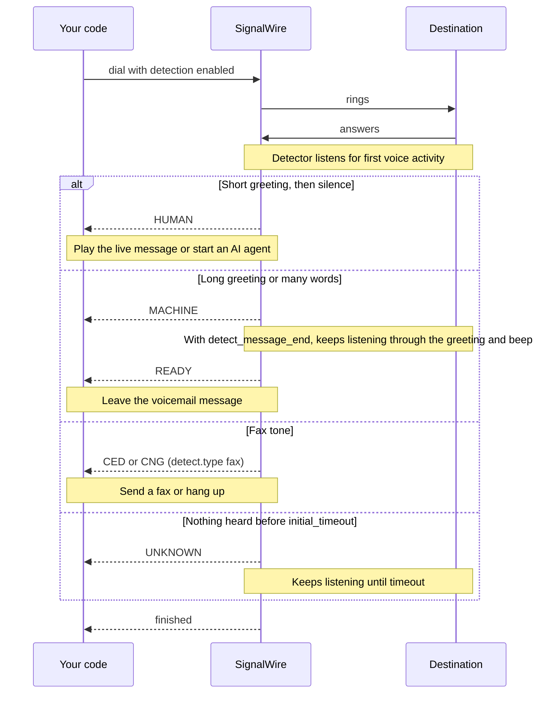

[make-and-receive-calls]: /docs/platform/voice/make-and-receive-calls
[prepare-calls]: /docs/platform/voice/make-and-receive-calls#prepare-for-your-first-call
[place-swml]: /docs/platform/voice/make-and-receive-calls#place-a-call-via-swml
[answer-swml]: /docs/platform/voice/make-and-receive-calls#answer-a-call-via-swml
[place-relay]: /docs/platform/voice/make-and-receive-calls#place-a-call-via-websocket-relay
[answer-relay]: /docs/platform/voice/make-and-receive-calls#answer-a-call-via-websocket-relay
[caller-id]: /docs/platform/voice/how-to-set-caller-id-or-cnam
[trial-mode]: /docs/platform/trial-mode
[tcpa]: /docs/platform/compliance/tcpa
[webhooks]: /docs/platform/webhooks
[server-sdks]: /docs/server-sdks
[relay-guide]: /docs/server-sdks/guides/relay-client
[swml-detect-machine]: /docs/swml/reference/calling/detect-machine
[swml-switch]: /docs/swml/reference/calling/switch
[swml-cond]: /docs/swml/reference/calling/cond
[swml-ai]: /docs/swml/reference/calling/ai
[swml-send-fax]: /docs/swml/reference/calling/send-fax
[swml-receive-fax]: /docs/swml/reference/calling/receive-fax
[swml-answer]: /docs/swml/reference/calling/answer
[ai-best-practices]: /docs/platform/ai/best-practices
[call-commands]: /docs/apis/rest/calls/call-commands
[compat-create-call]: /docs/compatibility-api/rest/calls/create-a-call

Find out whether a person, an answering machine, or a fax machine is on a call, and choose what
the call does next. Each approach below starts by calling your own phone and hanging up on your
voicemail, then screens the calls your number receives and tracks each result. The examples
leave a message after the beep, hand a live answer to an AI agent, and send or receive a fax.

## Choose an approach

Detection runs inside the call logic you already use to place and answer calls, so pick the
approach your app uses and follow only its section. The sections don't build on each other.

- [SWML][swml-detect-machine] adds a `detect_machine` instruction to the document that runs the
  call. SignalWire branches on the result during the call and can post each result to your
  webhook. Choose it when you place calls with a REST `dial` request or answer them with a SWML
  Script.
- [WebSocket (Relay)][relay-guide] starts detection from your Relay client once the call is
  answered. Each result arrives as an event in your code, so you don't need a public URL.
- The [REST Calling API][call-commands] starts detection with the `calling.detect` command, by
  call ID, on a call that's already answered, from any process. Choose it when detection is
  decided after the call starts; see
  [Detect on a call already in progress via REST](#detect-on-a-call-already-in-progress-via-rest).

Detection runs in server-side call logic, so a Browser SDK page that needs it asks your backend to
place the call. A Compatibility API app turns on detection with `MachineDetection` when it
[creates a call][compat-create-call], and reads the result in `AnsweredBy`; this guide doesn't
cover that API.

## Prepare for detection

This guide adds detection to calls you already place and answer. If you haven't done that yet,
start with [Make and receive calls][make-and-receive-calls]: it covers credentials, placing a
call, and pointing your number at a SWML server or Relay client.

Have these values ready:

- The Space URL, Project ID, API token, and phone number from
  [Prepare for your first call][prepare-calls].
- A destination phone you can answer *and* send to voicemail. Declining the call is the quickest
  way to reach the greeting.
- To screen the calls your number receives, a number whose calls already reach your SWML server or
  Relay client.

<Warning title="Trial projects only call and receive calls from verified numbers">
A [trial project][trial-mode] only places calls to and receives calls from numbers you've
purchased or verified. [Prepare for your first call][prepare-calls] shows how to verify the phone
you'll test with.
</Warning>

<Warning title="Messages left by artificial voices are regulated">
Prerecorded and synthesized voicemail messages fall under consent, do-not-call, and calling-hour
rules. Read the [TCPA guide][tcpa] before you dial anyone but yourself.
</Warning>

Replace these values in the samples you run:

| Value | Replace with |
|---|---|
| `<YOUR_SPACE>` | Your Space's subdomain in `<YOUR_SPACE>.signalwire.com` |
| `<YOUR_PROJECT_ID>` | Your Project ID |
| `<YOUR_API_TOKEN>` | Your API token, used only in server code |
| `<YOUR_CALLER_ID>` | Your SignalWire phone number, or a [verified caller ID][caller-id], in E.164 format |
| `<YOUR_DESTINATION>` | The phone you'll answer and send to voicemail, in E.164 format |
| `<YOUR_BASIC_AUTH_PASSWORD>` | The password your SWML server requires, as set up in [Answer a call via SWML][answer-swml] |
| `<YOUR_PUBLIC_HOST>` | The public hostname of your SWML server or tunnel, from [Answer a call via SWML][answer-swml] |
| `<YOUR_STATUS_WEBHOOK_URL>` | An HTTPS endpoint you control that receives detection and fax results |
| `<YOUR_CALL_ID>` | The `id` of an answered call, returned when you place it or sent in its webhooks |
| `<YOUR_FAX_DOCUMENT_URL>` | The public URL of a PDF that SignalWire can fetch and fax |

## How detection works

Detection starts when the call is answered. SignalWire listens for the first voice activity,
then classifies what it hears:

- **Human.** A short greeting followed by silence, the way a person says "Hello?" and waits.
- **Machine.** Continuous speech longer than a threshold, or a single utterance with more words
  than a person's greeting usually has. Voicemail greetings and IVR menus both land here.
- **Fax.** A fax tone instead of speech. This takes the `fax` detector, which listens for one
  tone, separately from the `amd` detector that classifies speech.
- **Unknown.** No decision yet. An `UNKNOWN` event means nothing was heard before
  `initial_timeout`, but it doesn't end detection, which keeps listening until it reaches a
  decision or the overall `timeout` expires. Only then is the result `unknown`.

A `HUMAN` result ends detection. A `MACHINE` result ends it too, unless `detect_message_end` is
on. Then detection keeps listening until the greeting ends, either with a beep or with a pause of
`machine_ready_timeout`, and reports `READY`. That is the moment to start a voicemail message.
`READY` also fires whenever the detector hears a beep, even with `detect_message_end` off.

<llms-ignore>


</llms-ignore>

<llms-only>


```mermaid
sequenceDiagram
    participant App as Your code
    participant SW as SignalWire
    participant Dest as Destination

    App->>SW: dial with detection enabled
    SW->>Dest: rings
    Dest->>SW: answers
    Note over SW,Dest: Detector listens for first voice activity
    alt Short greeting, then silence
        SW-->>App: HUMAN
        Note over App,SW: Play the live message or start an AI agent
    else Long greeting or many words
        SW-->>App: MACHINE
        Note over SW,Dest: With detect_message_end, keeps listening through the greeting and beep
        SW-->>App: READY
        Note over App,SW: Leave the voicemail message
    else Fax tone
        SW-->>App: CED or CNG (detect.type fax)
        Note over App,SW: Send a fax or hang up
    else Nothing heard before initial_timeout
        SW-->>App: UNKNOWN
        Note over SW,Dest: Keeps listening until timeout
    end
    SW-->>App: finished
```

</llms-only>

Each outcome surfaces in two forms: a lowercase value in the SWML `detect_result` variable, and an
uppercase event in status callbacks and Relay events.

| `detect_result` | Event | What SignalWire heard | Typical action |
|---|---|---|---|
| `human` | `HUMAN` | A short greeting, then silence | Play your message, start an AI agent, or connect an agent |
| `machine` | `MACHINE` | Speech longer than the voice threshold, or more words than the words threshold | Hang up, or wait for `READY` and leave a message |
| `machine` | `READY` | A beep, or the end of the greeting when `detect_message_end` is on | Play the voicemail message |
| (none) | `NOT_READY` | The greeting started again after `READY` (REST and Relay, with `detect_interruptions`) | Wait for the next `READY` |
| `fax` | `CED` or `CNG` | The fax tone you set in `tone` | Send or receive a fax, or hang up |
| `unknown` | `UNKNOWN` | No decision before `timeout`; the event fires earlier, at `initial_timeout` | Treat as a person, or retry later |
| `detecting` | (none) | `wait: false` is set, so detection is still running in the background | Handle the result at `status_url` |
| `failed` | (none) | Detection couldn't start, such as a misspelled property, `wait: false` without `status_url`, or another detection already running on the call | Log it and choose a default |

Machine events report `detect.type` as `machine`, and fax events report it as `fax`, with the tone
as the event. Every detection ends with a `finished` event. `READY`, `NOT_READY`, and `finished`
appear in callbacks and Relay events but are never assigned to `detect_result`. The
[`detect_machine` reference][swml-detect-machine] lists every field.

REST and Relay also offer a `digit` detector. It reports each key the caller presses, not who
answered, so this guide doesn't cover it.

### Outbound and inbound calls

The detector is the same in both directions. What changes is who it listens to, when it starts,
and which fax tone to expect.

| | Outbound call you place | Inbound call your number receives |
|---|---|---|
| Who is classified | The party that answered | The caller |
| When detection starts | After the destination answers | After you answer, with SWML [`answer`][swml-answer] or Relay `answer()`. `detect_machine` answers the call itself if you haven't |
| Fax tone to detect | `CED`, which the answering fax machine sends (the default `tone`) | `CNG`, which the calling fax machine sends; set `tone: "CNG"` |
| What silence means | The greeting hasn't started; let `initial_timeout` run | A person waiting for your greeting; keep `initial_timeout` and `timeout` short, and treat `unknown` as a person |
| `detect_message_end` | Waits for the greeting and beep before you leave a message | Rarely useful; callers don't play greetings |
| Typical next step | Leave a message, start an AI agent, or send a fax | Receive a fax, turn away automated callers, or greet the person |

## Detect machines via SWML

[`detect_machine`][swml-detect-machine] listens once the call is answered and, by default, holds
the document until it has a result. The next instruction, usually [`switch`][swml-switch], reads
`detect_result` and picks a branch. The document reaches the call the same way any SWML does, so
this section changes only the document.

### Detect who answers a call you place via SWML

Send the document in the REST `dial` request, as in [Place a call via SWML][place-swml]. Only the
`amd` detector runs here; [Send a fax when a fax machine answers](#send-a-fax-when-a-fax-machine-answers)
adds the second one.

<Steps>

<Step title="Place the call with detection" id="place-the-call-with-detection-via-swml">

The [Server SDKs][server-sdks] build each branch of `switch` as its own list of instructions: the
samples build a branch's message with `say()` and pass its `main` section to `switch`.

<CodeBlocks>
<CodeBlock title="Python — REST client">
```python
# Install: python -m pip install signalwire-sdk==3.4.1
# Save as detect_machine.py and run: python detect_machine.py
from signalwire import SWMLBuilder, SWMLService
from signalwire.rest import RestClient

client = RestClient(
    project="<YOUR_PROJECT_ID>",
    token="<YOUR_API_TOKEN>",
    host="<YOUR_SPACE>.signalwire.com",
)

live = (
    SWMLBuilder(SWMLService(name="live-message"))
    .say("Hello! Your Bayview Taxi ride is confirmed for 8 AM tomorrow.")
    .build()["sections"]["main"]
)
hang_up = (
    SWMLBuilder(SWMLService(name="hang-up"))
    .hangup()
    .build()["sections"]["main"]
)

swml = (
    SWMLBuilder(SWMLService(name="detect-machine"))
    .detect_machine(detectors="amd", timeout=30)
    .switch(
        variable="detect_result",
        case={
            "human": live,
            "machine": hang_up,
        },
        default=live,
    )
    .hangup()
    .build()
)

call = client.calling.dial(
    from_="<YOUR_CALLER_ID>",
    to="<YOUR_DESTINATION>",
    swml=swml,
)
print(call["id"])
```
</CodeBlock>
<CodeBlock title="TypeScript — REST client">
```typescript
// Install: npm install @signalwire/sdk@2.0.5
// This sample also runs as JavaScript: save as detect-machine.mjs,
// then run: node detect-machine.mjs
import { RestClient, SwmlBuilder } from "@signalwire/sdk";

const client = new RestClient({
  project: "<YOUR_PROJECT_ID>",
  token: "<YOUR_API_TOKEN>",
  host: "<YOUR_SPACE>.signalwire.com",
});

const live = new SwmlBuilder()
  .say("Hello! Your Bayview Taxi ride is confirmed for 8 AM tomorrow.")
  .document.sections.main;
const hangUp = new SwmlBuilder()
  .hangup()
  .document.sections.main;

const swml = new SwmlBuilder()
  .detect_machine({ detectors: "amd", timeout: 30 })
  .switch({
    variable: "detect_result",
    case: {
      human: live,
      machine: hangUp,
    },
    default: live,
  })
  .hangup()
  .build();

const call = await client.calling.dial({
  from: "<YOUR_CALLER_ID>",
  to: "<YOUR_DESTINATION>",
  swml,
});
console.log(call.id);
```
</CodeBlock>
<CodeBlock title="cURL — Calling API">
```bash
curl -X POST "https://<YOUR_SPACE>.signalwire.com/api/calling/calls" \
  -u "<YOUR_PROJECT_ID>:<YOUR_API_TOKEN>" \
  -H "Content-Type: application/json" \
  -d '{
    "command": "dial",
    "params": {
      "from": "<YOUR_CALLER_ID>",
      "to": "<YOUR_DESTINATION>",
      "swml": {
        "version": "1.0.0",
        "sections": {
          "main": [
            {
              "detect_machine": {
                "detectors": "amd",
                "timeout": 30
              }
            },
            {
              "switch": {
                "variable": "detect_result",
                "case": {
                  "human": [
                    { "play": {"url": "say:Hello! Your Bayview Taxi ride is confirmed for 8 AM tomorrow."} }
                  ],
                  "machine": [
                    { "hangup": {} }
                  ]
                },
                "default": [
                  { "play": {"url": "say:Hello! Your Bayview Taxi ride is confirmed for 8 AM tomorrow."} }
                ]
              }
            },
            { "hangup": {} }
          ]
        }
      }
    }
  }'
```
</CodeBlock>
</CodeBlocks>

The `default` branch catches `unknown` and `failed`, so a quiet person still hears the message.
Prefer [`cond`][swml-cond] when a branch needs a compound condition, such as checking
`detect_machine_beep` as well.

Everything outside `detect_machine` and `switch` places the call exactly as in
[Place a call via SWML][place-swml], which also covers the `dial()` response and the signature
change in newer SDK releases.

</Step>

<Step title="Answer, then send it to voicemail" id="answer-then-send-to-voicemail-via-swml">

Answer the call and say "Hello?". After a short pause you hear the ride confirmation, then the
call ends. Run the sample again and decline the call so it reaches voicemail: the call ends a few
seconds into your greeting and leaves no message.

If it doesn't work, check the symptom:

- **The second run plays the message into your voicemail.** The greeting was classified as
  `human` or `unknown`. A greeting that pauses after "Hi, you've reached…" looks like a person,
  and one that opens with silence longer than `initial_timeout` returns `unknown`.
- **The first run hangs up on you.** You spoke past the voice threshold without pausing.
- **The phone never rings.** The call itself didn't go out; see
  [Place a call via SWML][place-swml].

The [tuning table](#tune-detection-timeouts-thresholds-and-message-end) maps each misclassification
to its setting.

</Step>

</Steps>

### Screen a call to your number via SWML

Turn away automated callers and greet everyone else. Two things differ from a call you place: you
[`answer`][swml-answer] first, and a person who calls you waits for your greeting instead of
speaking. Silence from a person becomes `unknown` once `initial_timeout` expires, so keep that
timeout short and treat `unknown` as a person.

<Steps>

<Step title="Serve the screening document" id="serve-the-screening-document">

Run either server below in place of the one from [Answer a call via SWML][answer-swml]. It serves
the same `/swml` route with the same credentials, so the number's SWML Script doesn't change. For
a hosted SWML Script, paste the YAML or JSON into the script instead.

`answer` runs first, then `detect_machine` listens for up to five seconds before the greeting
plays. In SWML, a caller who stays silent comes back `unknown` only when `timeout` expires, so
`timeout` sets how long a quiet caller waits.

<CodeBlocks>
<CodeBlock title="Python — SWML builder">
```python
# Install: python -m pip install signalwire-sdk==3.4.1
# Save as inbound_screen.py and run: python inbound_screen.py
from signalwire import SWMLBuilder, SWMLService

reject = (
    SWMLBuilder(SWMLService(name="reject"))
    .say("This line doesn't accept automated calls. Goodbye.")
    .hangup()
    .build()["sections"]["main"]
)
greeting = (
    SWMLBuilder(SWMLService(name="greeting"))
    .say("Thanks for calling Bayview Taxi. A dispatcher will be with you shortly.")
    .build()["sections"]["main"]
)

service = SWMLService(
    name="inbound-screen",
    route="/swml",
    port=3000,
    basic_auth=("signalwire", "<YOUR_BASIC_AUTH_PASSWORD>"),
)
(
    SWMLBuilder(service)
    .answer()
    .detect_machine(detectors="amd", initial_timeout=2, timeout=5)
    .switch(
        variable="detect_result",
        case={"machine": reject},
        default=greeting,
    )
    .hangup()
)
service.serve()
```
</CodeBlock>
<CodeBlock title="TypeScript — SWML builder">
```typescript
// Install: npm install @signalwire/sdk@2.0.5
// This sample also runs as JavaScript: save as inbound-screen.mjs,
// then run: node inbound-screen.mjs
import { SWMLService, SwmlBuilder } from "@signalwire/sdk";

const reject = new SwmlBuilder()
  .say("This line doesn't accept automated calls. Goodbye.")
  .hangup()
  .document.sections.main;
const greeting = new SwmlBuilder()
  .say("Thanks for calling Bayview Taxi. A dispatcher will be with you shortly.")
  .document.sections.main;

const service = new SWMLService({
  name: "inbound-screen",
  route: "/swml",
  port: 3000,
  basicAuth: ["signalwire", "<YOUR_BASIC_AUTH_PASSWORD>"],
});
service.getBuilder()
  .answer()
  .detect_machine({ detectors: "amd", initial_timeout: 2, timeout: 5 })
  .switch({
    variable: "detect_result",
    case: { machine: reject },
    default: greeting,
  })
  .hangup();

await service.serve();
```
</CodeBlock>
<CodeBlock title="YAML">
```yaml
version: 1.0.0
sections:
  main:
    - answer: {}
    - detect_machine:
        detectors: amd
        initial_timeout: 2
        timeout: 5
    - switch:
        variable: detect_result
        case:
          machine:
            - play:
                url: "say:This line doesn't accept automated calls. Goodbye."
            - hangup: {}
        default:
          - play:
              url: "say:Thanks for calling Bayview Taxi. A dispatcher will be with you shortly."
    - hangup: {}
```
</CodeBlock>
<CodeBlock title="JSON">
```json
{
  "version": "1.0.0",
  "sections": {
    "main": [
      { "answer": {} },
      {
        "detect_machine": {
          "detectors": "amd",
          "initial_timeout": 2,
          "timeout": 5
        }
      },
      {
        "switch": {
          "variable": "detect_result",
          "case": {
            "machine": [
              { "play": { "url": "say:This line doesn't accept automated calls. Goodbye." } },
              { "hangup": {} }
            ]
          },
          "default": [
            { "play": { "url": "say:Thanks for calling Bayview Taxi. A dispatcher will be with you shortly." } }
          ]
        }
      },
      { "hangup": {} }
    ]
  }
}
```
</CodeBlock>
</CodeBlocks>

</Step>

<Step title="Call your number" id="call-your-number-to-screen">

Call your number from your phone and stay quiet: after five seconds you hear the greeting. The
`default` branch greets both `human` and `unknown`, so a quiet caller isn't turned away. Call
again and hold the phone up to a speaker playing a long recording, and the call ends with the
rejection message.

If you hear your old greeting instead, the number still reaches the previous document: restart the
server, or update the hosted script. If the call doesn't reach your document at all, see the
checks in [Answer a call via SWML][answer-swml].

</Step>

</Steps>

### Track detection results via SWML

Add `status_url` to `detect_machine`, and SignalWire posts each detector event to that URL as
JSON. Change the `detect_machine` instruction in
[Detect who answers a call you place via SWML](#detect-who-answers-a-call-you-place-via-swml):

<CodeBlocks>
<CodeBlock title="Python — SWML builder">
```python {4}
    .detect_machine(
        detectors="amd",
        timeout=30,
        status_url="<YOUR_STATUS_WEBHOOK_URL>",
    )
```
</CodeBlock>
<CodeBlock title="TypeScript — SWML builder">
```typescript {4}
  .detect_machine({
    detectors: "amd",
    timeout: 30,
    status_url: "<YOUR_STATUS_WEBHOOK_URL>",
  })
```
</CodeBlock>
<CodeBlock title="YAML">
```yaml {4}
- detect_machine:
    detectors: amd
    timeout: 30
    status_url: "<YOUR_STATUS_WEBHOOK_URL>"
```
</CodeBlock>
<CodeBlock title="JSON">
```json {5}
{
  "detect_machine": {
    "detectors": "amd",
    "timeout": 30,
    "status_url": "<YOUR_STATUS_WEBHOOK_URL>"
  }
}
```
</CodeBlock>
</CodeBlocks>

Each callback is a `calling.call.detect` event. The `params.detect.params.event` field carries the
result. Once a beep is heard, `beep: true` appears on that event and every later machine event;
fax events never carry it. The [webhooks guide][webhooks] covers endpoint setup and local
testing.

```json
{
  "event_type": "calling.call.detect",
  "event_channel": "swml:be38xxxx-8xxx-4xxxx-9fxx-bxxxxxxxxx",
  "timestamp": 1745332535.668522,
  "project_id": "xxxxx-xxxx-xxxx-xxxx-xxxxxxxxxxxx",
  "space_id": "xxxxx-xxxx-xxxx-xxxx-xxxxxxxxxxxx",
  "params": {
    "control_id": "xxxxx-xxxx-xxxx-xxxx-xxxxxxxxxxxx",
    "detect": {
      "type": "machine",
      "params": {
        "event": "MACHINE",
        "beep": true
      }
    },
    "call_id": "xxxxx-xxxx-xxxx-xxxx-xxxxxxxxxxxx",
    "node_id": "xxxxx-xxxx-xxxx-xxxx-xxxxxxxxxxxx",
    "segment_id": "xxxxx-xxxx-xxxx-xxxx-xxxxxxxxxxxx"
  }
}
```

Callbacks arrive in the order the detector reaches each state, and every run ends with
`finished`:

| Outcome | Callbacks, in order |
|---|---|
| A person answers | `HUMAN`, `finished` |
| A machine answers, `detect_message_end` off | `MACHINE`, `finished`, with `READY` between them if the line is already silent |
| A machine answers, `detect_message_end` on | `MACHINE`, `READY` once the greeting ends, `finished` |
| The detector hears a beep | `MACHINE` if it hasn't been sent yet, then `READY`, then `finished` |
| No decision | `UNKNOWN` at `initial_timeout`, then `finished` when `timeout` expires |
| A fax machine answers | `CED` or `CNG` with `detect.type` `fax`, then `finished` |

If the call hangs up while detection is running, the final `finished` callback isn't sent, so
don't wait for it before you clean up.

By default `detect_machine` waits for a result before the next instruction runs. Set
`wait: false` to keep the document moving while detection runs in the background, and handle
the outcome at `status_url` instead; asynchronous detection requires `status_url`. This document
plays the confirmation right away and reports the result to your webhook:

<CodeBlocks>
<CodeBlock title="Python — SWML builder">
```python
swml = (
    SWMLBuilder(SWMLService(name="detect-async"))
    .detect_machine(
        detectors="amd",
        wait=False,
        status_url="<YOUR_STATUS_WEBHOOK_URL>",
    )
    .say("Hello! Your Bayview Taxi ride is confirmed for 8 AM tomorrow.")
    .build()
)
```
</CodeBlock>
<CodeBlock title="TypeScript — SWML builder">
```typescript
const swml = new SwmlBuilder()
  .detect_machine({
    detectors: "amd",
    wait: false,
    status_url: "<YOUR_STATUS_WEBHOOK_URL>",
  })
  .say("Hello! Your Bayview Taxi ride is confirmed for 8 AM tomorrow.")
  .build();
```
</CodeBlock>
<CodeBlock title="YAML">
```yaml
version: 1.0.0
sections:
  main:
    - detect_machine:
        detectors: amd
        wait: false
        status_url: "<YOUR_STATUS_WEBHOOK_URL>"
    - play:
        url: "say:Hello! Your Bayview Taxi ride is confirmed for 8 AM tomorrow."
```
</CodeBlock>
<CodeBlock title="JSON">
```json
{
  "version": "1.0.0",
  "sections": {
    "main": [
      {
        "detect_machine": {
          "detectors": "amd",
          "wait": false,
          "status_url": "<YOUR_STATUS_WEBHOOK_URL>"
        }
      },
      { "play": { "url": "say:Hello! Your Bayview Taxi ride is confirmed for 8 AM tomorrow." } }
    ]
  }
}
```
</CodeBlock>
</CodeBlocks>

Inside the document, `detect_machine` sets three variables you can branch on:

- `detect_result` holds the outcome from the table in [How detection works](#how-detection-works).
  With `wait: false` it is `detecting`.
- `detect_machine_beep` is `true` when the result is `machine` and a beep was heard, and `false`
  otherwise.
- `detect_ms` is how long detection took in milliseconds, or `-1` with `wait: false`.

## Detect machines via WebSocket (Relay)

A Relay client's `dial()` has no detection option, so detection is its own command once the call
is answered: `detect()` with the `machine` detector. It returns an action whose `wait()` resolves
on the first result. On a call your number receives, answer first, then detect the same way.

### Detect who answers a call you place via WebSocket (Relay)

The program dials as in [Place a call via WebSocket (Relay)][place-relay], then starts detection.

<Steps>

<Step title="Place the call and start detection" id="place-the-call-with-detection-via-relay">

<CodeBlocks>
<CodeBlock title="Python — Relay client">
```python
# Install: python -m pip install signalwire-sdk==3.4.1
# Save as detect_machine_relay.py and run: python detect_machine_relay.py
import asyncio
from signalwire.relay import RelayClient

LIVE = "Hello! Your Bayview Taxi ride is confirmed for 8 AM tomorrow."

client = RelayClient(
    project="<YOUR_PROJECT_ID>",
    token="<YOUR_API_TOKEN>",
    contexts=["default"],
)

def outcome(event) -> str:
    return event.params.get("detect", {}).get("params", {}).get("event", "")

async def main():
    async with client:
        call = await client.dial(
            devices=[[{
                "type": "phone",
                "params": {
                    "from_number": "<YOUR_CALLER_ID>",
                    "to_number": "<YOUR_DESTINATION>",
                    "timeout": 30,
                },
            }]],
        )
        # detect_answering_machine() runs detect() with the machine detector.
        action = await call.detect_answering_machine(timeout=30)
        result = outcome(await action.wait())
        print(f"Detected: {result}")

        if result == "MACHINE":
            await call.hangup()
            return

        # HUMAN, or UNKNOWN when nobody spoke in time.
        async def hang_up_after_playback(_event):
            if call.state != "ended":
                await call.hangup()

        await call.play(
            [{"type": "tts", "params": {"text": LIVE}}],
            on_completed=hang_up_after_playback,
        )
        await call.wait_for_ended()

asyncio.run(main())
```
</CodeBlock>
<CodeBlock title="TypeScript — Relay client">
```typescript
// Install: npm install @signalwire/sdk@2.0.5
// Save as detect-machine-relay.mts and run: npx tsx detect-machine-relay.mts
import { RelayClient, RelayEvent } from "@signalwire/sdk";

const LIVE = "Hello! Your Bayview Taxi ride is confirmed for 8 AM tomorrow.";

const client = new RelayClient({
  project: "<YOUR_PROJECT_ID>",
  token: "<YOUR_API_TOKEN>",
  contexts: ["default"],
});

function outcome(event: RelayEvent): string {
  const detect = event.params.detect as { params?: { event?: string } } | undefined;
  return detect?.params?.event ?? "";
}

await client.connect();

try {
  const call = await client.dial([[{
    type: "phone",
    params: {
      from_number: "<YOUR_CALLER_ID>",
      to_number: "<YOUR_DESTINATION>",
      timeout: 30,
    },
  }]]);
  const action = await call.detect({ type: "machine", params: {} }, { timeout: 30 });
  const result = outcome(await action.wait());
  console.log(`Detected: ${result}`);

  if (result === "MACHINE") {
    await call.hangup();
  } else {
    // HUMAN, or UNKNOWN when nobody spoke in time.
    await call.play([{ type: "tts", text: LIVE }], {
      onCompleted: async () => {
        if (call.state !== "ended") await call.hangup();
      },
    });
    await call.waitForEnded();
  }
} finally {
  await client.disconnect();
}
```
</CodeBlock>
</CodeBlocks>

The `fax` and `digit` detectors take the same `{"type": ..., "params": {...}}` shape in
`detect()`.

</Step>

<Step title="Answer, then send it to voicemail" id="answer-then-send-to-voicemail-via-relay">

Answer the call and say "Hello?". After a short pause you hear the ride confirmation, and the
console prints `Detected: HUMAN`. Run the program again and decline the call: it ends a few
seconds into your greeting, and the console prints `Detected: MACHINE`.

If it doesn't work, check the symptom:

- **The second run plays the message into your voicemail.** The console prints `HUMAN` or
  `UNKNOWN`: the greeting paused like a person, or opened with silence longer than
  `initial_timeout`.
- **The first run hangs up on you.** You spoke past the voice threshold without pausing.
- **The program logs connection errors, or the phone never rings.** The call itself didn't go
  out; see [Place a call via WebSocket (Relay)][place-relay].

The [tuning table](#tune-detection-timeouts-thresholds-and-message-end) maps each misclassification
to its setting.

</Step>

</Steps>

### Screen a call to your number via WebSocket (Relay)

Turn away automated callers and greet everyone else. Answer the call in your handler, then detect
with a short `initial_timeout`: a person who calls you waits for your greeting, so silence
returns `UNKNOWN`, and the handler greets it as a person.

<Steps>

<Step title="Run the screening handler" id="run-the-screening-handler">

Stop the handler from [Answer a call via WebSocket (Relay)][answer-relay] and run either one below
in its place. It subscribes to the same `inbound-calling` topic, so the number's Relay Application
doesn't change.

<CodeBlocks>
<CodeBlock title="Python — Relay client">
```python
# Install: python -m pip install signalwire-sdk==3.4.1
# Save as inbound_screen_relay.py and run: python inbound_screen_relay.py
from signalwire.relay import RelayClient

GREETING = "Thanks for calling Bayview Taxi. A dispatcher will be with you shortly."
REJECT = "This line doesn't accept automated calls. Goodbye."

client = RelayClient(
    project="<YOUR_PROJECT_ID>",
    token="<YOUR_API_TOKEN>",
    contexts=["inbound-calling"],
)

def outcome(event) -> str:
    return event.params.get("detect", {}).get("params", {}).get("event", "")

@client.on_call
async def handle_call(call):
    await call.answer()
    action = await call.detect_answering_machine(initial_timeout=2, timeout=5)
    result = outcome(await action.wait())
    print(f"Detected: {result}")
    # HUMAN, or UNKNOWN when the caller waited for you to speak.
    text = REJECT if result == "MACHINE" else GREETING

    async def hang_up_after_playback(_event):
        if call.state != "ended":
            await call.hangup()

    await call.play(
        [{"type": "tts", "params": {"text": text}}],
        on_completed=hang_up_after_playback,
    )
    await call.wait_for_ended()

client.run()
```
</CodeBlock>
<CodeBlock title="TypeScript — Relay client">
```typescript
// Install: npm install @signalwire/sdk@2.0.5
// Save as inbound-screen-relay.mts and run: npx tsx inbound-screen-relay.mts
import { RelayClient, RelayEvent } from "@signalwire/sdk";

const GREETING = "Thanks for calling Bayview Taxi. A dispatcher will be with you shortly.";
const REJECT = "This line doesn't accept automated calls. Goodbye.";

const client = new RelayClient({
  project: "<YOUR_PROJECT_ID>",
  token: "<YOUR_API_TOKEN>",
  contexts: ["inbound-calling"],
});

function outcome(event: RelayEvent): string {
  const detect = event.params.detect as { params?: { event?: string } } | undefined;
  return detect?.params?.event ?? "";
}

client.onCall(async (call) => {
  await call.answer();
  const action = await call.detect(
    { type: "machine", params: { initial_timeout: 2 } },
    { timeout: 5 },
  );
  const result = outcome(await action.wait());
  console.log(`Detected: ${result}`);
  // HUMAN, or UNKNOWN when the caller waited for you to speak.
  const text = result === "MACHINE" ? REJECT : GREETING;
  await call.play([{ type: "tts", text }], {
    onCompleted: async () => {
      if (call.state !== "ended") await call.hangup();
    },
  });
  await call.waitForEnded();
});

await client.run();
```
</CodeBlock>
</CodeBlocks>

</Step>

<Step title="Call your number" id="call-your-number-to-screen-via-relay">

Call your number from your phone and stay quiet: after two seconds you hear the greeting, and the
console prints `Detected: UNKNOWN`. Call again and hold the phone up to a speaker playing a long
recording, and the call ends with the rejection message.

If the handler never prints a result, the call isn't reaching it; see the checks in
[Answer a call via WebSocket (Relay)][answer-relay].

</Step>

</Steps>

### Track detection results via WebSocket (Relay)

`wait()` returns once, on the first result. To see every event, register a `calling.call.detect`
handler on the call before you start detection. Add these lines to either program above, right
after it gets the `call`:

<CodeBlocks>
<CodeBlock title="Python — Relay client">
```python
from signalwire.relay.event import DetectEvent

def log_detect(event: DetectEvent):
    params = event.detect.get("params", {})
    print(f"{event.detect.get('type')}: {params.get('event')} beep={params.get('beep', False)}")

call.on("calling.call.detect", log_detect)
```
</CodeBlock>
<CodeBlock title="TypeScript — Relay client">
```typescript
call.on("calling.call.detect", (event) => {
  const detect = event.params.detect as
    | { type?: string; params?: { event?: string; beep?: boolean } }
    | undefined;
  console.log(`${detect?.type}: ${detect?.params?.event} beep=${detect?.params?.beep ?? false}`);
});
```
</CodeBlock>
</CodeBlocks>

Each event holds the same `type` and `params` object as the SWML callback payload. The handler
sees `MACHINE` while the greeting is still playing, `READY` after the beep when detection runs
with `detect_message_end`, and `finished` when the detector stops. The programs above hang up on
the first `MACHINE` result, so to watch the full sequence, follow
[Leave a message via WebSocket (Relay)](#leave-a-message-via-websocket-relay), which acts on
`READY`.

## Detect on a call already in progress via REST

Start detection on a call that is already answered, from any process that knows the call ID. This
suits calls placed with a `url` that your server answered, calls that changed hands, such as a leg
you connected to a customer, and inbound calls your server is handling over HTTP.

Call the REST client's `detect()` method in the [Server SDKs][server-sdks], or send the
[`calling.detect` command][call-commands] with the call's `id`. The command returns at once; the
result arrives at `status_url` as the same `calling.call.detect` payload shown in
[Track detection results via SWML](#track-detection-results-via-swml). `control_id` is required,
and it's the only handle for stopping the detector early with `calling.detect.stop`. This command
defaults `detect_message_end` to `true`.

<CodeBlocks>
<CodeBlock title="Python — REST client">
```python
# Install: python -m pip install signalwire-sdk==3.4.1
# Save as detect_in_progress.py and run: python detect_in_progress.py
from signalwire.rest import RestClient

client = RestClient(
    project="<YOUR_PROJECT_ID>",
    token="<YOUR_API_TOKEN>",
    host="<YOUR_SPACE>.signalwire.com",
)

# status_url has no keyword argument yet; extras passes it through as-is.
client.calling.detect(
    call_id="<YOUR_CALL_ID>",
    control_id="amd-1",
    detect={"type": "machine", "params": {"detect_message_end": True}},
    timeout=30,
    extras={"status_url": "<YOUR_STATUS_WEBHOOK_URL>"},
)

# To stop the detector early, send the same control_id:
# client.calling.detect_stop(call_id="<YOUR_CALL_ID>", control_id="amd-1")
```
</CodeBlock>
<CodeBlock title="TypeScript — REST client">
```typescript
// Install: npm install @signalwire/sdk@2.0.5
// This sample also runs as JavaScript: save as detect-in-progress.mjs,
// then run: node detect-in-progress.mjs
import { RestClient } from "@signalwire/sdk";

const client = new RestClient({
  project: "<YOUR_PROJECT_ID>",
  token: "<YOUR_API_TOKEN>",
  host: "<YOUR_SPACE>.signalwire.com",
});

await client.calling.detect("<YOUR_CALL_ID>", {
  control_id: "amd-1",
  detect: { type: "machine", params: { detect_message_end: true } },
  timeout: 30,
  status_url: "<YOUR_STATUS_WEBHOOK_URL>",
});

// To stop the detector early, send the same control_id:
// await client.calling.detectStop("<YOUR_CALL_ID>", { control_id: "amd-1" });
```
</CodeBlock>
<CodeBlock title="cURL — Calling API">
```bash
curl -X POST "https://<YOUR_SPACE>.signalwire.com/api/calling/calls" \
  -u "<YOUR_PROJECT_ID>:<YOUR_API_TOKEN>" \
  -H "Content-Type: application/json" \
  -d '{
    "id": "<YOUR_CALL_ID>",
    "command": "calling.detect",
    "params": {
      "control_id": "amd-1",
      "detect": {
        "type": "machine",
        "params": {
          "detect_message_end": true
        }
      },
      "timeout": 30,
      "status_url": "<YOUR_STATUS_WEBHOOK_URL>"
    }
  }'
```
</CodeBlock>
</CodeBlocks>

<Note title="`detect()` signature depends on the SDK version">
`@signalwire/sdk@2.0.5` takes the call ID, then every field in one options object, for both
`detect()` and `detectStop()`. Newer releases take positional arguments.
</Note>

Send the command once the call is answered, since detection listens to the call's audio. A call
runs one detector of each type at a time, so a second `machine` detection on the same call fails
until the first finishes or you stop it. To act on the result, have your webhook handler send
another call command by the same `id`, such as `calling.play` for a voicemail message.

## Tune detection: timeouts, thresholds, and message end

The defaults suit most residential voicemail. Adjust them when a run misclassifies, and change
one setting at a time so you can see its effect. Every setting below is a `detect_machine`
property in SWML. In REST and Relay, `timeout` is its own argument and the rest go in the
detector's `params`.

| Symptom | Setting | Default | Change |
|---|---|---|---|
| Greeting begins with silence and comes back `unknown` | `initial_timeout` | 4.5 s | Raise it |
| A person who talks for a while is classified `machine` | `machine_voice_threshold` | 1.25 s | Raise it |
| A short, scripted greeting is classified `human` | `machine_words_threshold` | 6 words | Lower it |
| A person's pause after "Hello?" is too short to count as silence | `end_silence_timeout` | 1.0 s | Lower it |
| The voicemail message starts before the beep | `machine_ready_timeout` | Same as `end_silence_timeout` | Raise it |
| Long IVR menus never reach a result | `timeout` | 30 s | Raise it, or hang up on `machine` without waiting for `READY` |
| Detection stops on the first thing it hears | `detect_message_end` | `false` in SWML, `true` in REST and Relay | Set it explicitly |
| The greeting pauses, `READY` fires, then the greeting continues over your message | `detect_interruptions` (REST and Relay only) | `false` | Set it to `true`, and wait for the next `READY` after a `NOT_READY` event |
| Callers to your number wait in silence, then come back `unknown` | `timeout` and `initial_timeout` | 30 s and 4.5 s | Lower both on inbound calls, and greet `unknown` as a person. In SWML, `timeout` sets how long a silent caller waits |

A greeting from a business often runs past the defaults. To give it more room, change the
`detect_machine` instruction in
[Leave a message via SWML](#leave-a-message-via-swml); the highlighted lines are the changes.

<CodeBlocks>
<CodeBlock title="Python — SWML builder">
```python {4-7}
    .detect_machine(
        detectors="amd",
        detect_message_end=True,
        initial_timeout=6,
        machine_voice_threshold=2,
        machine_ready_timeout=2,
        timeout=60,
    )
```
</CodeBlock>
<CodeBlock title="TypeScript — SWML builder">
```typescript {4-7}
  .detect_machine({
    detectors: "amd",
    detect_message_end: true,
    initial_timeout: 6,
    machine_voice_threshold: 2,
    machine_ready_timeout: 2,
    timeout: 60,
  })
```
</CodeBlock>
<CodeBlock title="YAML">
```yaml {4-7}
- detect_machine:
    detectors: amd
    detect_message_end: true
    initial_timeout: 6
    machine_voice_threshold: 2
    machine_ready_timeout: 2
    timeout: 60
```
</CodeBlock>
<CodeBlock title="JSON">
```json {5-8}
{
  "detect_machine": {
    "detectors": "amd",
    "detect_message_end": true,
    "initial_timeout": 6,
    "machine_voice_threshold": 2,
    "machine_ready_timeout": 2,
    "timeout": 60
  }
}
```
</CodeBlock>
</CodeBlocks>

Test against the destinations you'll dial in production, not only your own phone. Carrier
voicemail, office phone systems, and mobile greetings each pause and speak differently.

### Compare the surfaces

SWML, the REST command, and Relay share one detector but expose it differently.

| Setting | SWML `detect_machine` | REST `calling.detect` | Relay `detect()` |
|---|---|---|---|
| `detect_message_end` default | `false` | `true` | `true` |
| Which detectors run | `detectors`, a comma-separated list of `amd` and `fax` with no spaces (default both) | One `detect.type` per command: `machine`, `fax`, or `digit` | One `detect.type` per `detect()` call; Python also has `detect_answering_machine()` and `detect_fax()` shortcuts |
| When both find something | A fax tone wins, so the result is `fax` | Not applicable | Not applicable |
| Blocking behavior | `wait` (default `true`) pauses the document | Returns immediately; results go to `status_url` | `wait()` resolves on the first result; events continue |
| `control_id` | None | Required, and the only way to stop it | Optional; the action's `stop()` uses it |
| Fax `tone` values | `CED` (default) or `CNG`, in either case | `CED` (default) or `CNG`, in either case | `CED` (default) or `CNG`, in either case |
| `machine_ready_timeout` | Yes | Yes | Yes, through `detect()`; the Python shortcut doesn't take it |
| `detect_interruptions` | No; setting it makes `detect_machine` fail | Yes | Yes |

## Examples

Each example is a complete program that uses the placeholders above. The outbound examples place
the call the same way the first runs do, and the inbound examples replace your screening handler.

| What you want to do | Example |
|---|---|
| Wait for the beep, then leave a voicemail | [Leave a message after the beep](#leave-a-message-after-the-beep) |
| Start an AI agent only when a person answers | [Hand a live answer to an AI agent](#hand-a-live-answer-to-an-ai-agent) |
| Deliver a document when a fax machine answers | [Send a fax when a fax machine answers](#send-a-fax-when-a-fax-machine-answers) |
| Take faxes and voice calls on the same number | [Receive a fax on an inbound call](#receive-a-fax-on-an-inbound-call) |

### Leave a message after the beep

Wait for the voicemail greeting and beep to finish, then leave a message. Without
`detect_message_end`, a `machine` result arrives while the greeting is still playing, and anything
you say then is lost.

#### Leave a message via SWML

Set `detect_message_end` so `detect_machine` returns after the beep. The `machine` branch then
plays into the recording.

<CodeBlocks>
<CodeBlock title="Python — REST client">
```python
# Install: python -m pip install signalwire-sdk==3.4.1
# Save as leave_message.py and run: python leave_message.py
from signalwire import SWMLBuilder, SWMLService
from signalwire.rest import RestClient

client = RestClient(
    project="<YOUR_PROJECT_ID>",
    token="<YOUR_API_TOKEN>",
    host="<YOUR_SPACE>.signalwire.com",
)

live = (
    SWMLBuilder(SWMLService(name="live-message"))
    .say("Hello! Your Bayview Taxi ride is confirmed for 8 AM tomorrow.")
    .build()["sections"]["main"]
)
voicemail = (
    SWMLBuilder(SWMLService(name="voicemail-message"))
    .say(
        "This is Bayview Taxi. Your ride is confirmed for 8 AM tomorrow. "
        "Reply to our text message if you need to change it."
    )
    .build()["sections"]["main"]
)

swml = (
    SWMLBuilder(SWMLService(name="leave-a-message"))
    .detect_machine(detectors="amd", detect_message_end=True, timeout=45)
    .switch(
        variable="detect_result",
        case={
            "human": live,
            "machine": voicemail,
        },
        default=live,
    )
    .hangup()
    .build()
)

call = client.calling.dial(
    from_="<YOUR_CALLER_ID>",
    to="<YOUR_DESTINATION>",
    swml=swml,
)
print(call["id"])
```
</CodeBlock>
<CodeBlock title="TypeScript — REST client">
```typescript
// Install: npm install @signalwire/sdk@2.0.5
// This sample also runs as JavaScript: save as leave-message.mjs,
// then run: node leave-message.mjs
import { RestClient, SwmlBuilder } from "@signalwire/sdk";

const client = new RestClient({
  project: "<YOUR_PROJECT_ID>",
  token: "<YOUR_API_TOKEN>",
  host: "<YOUR_SPACE>.signalwire.com",
});

const live = new SwmlBuilder()
  .say("Hello! Your Bayview Taxi ride is confirmed for 8 AM tomorrow.")
  .document.sections.main;
const voicemail = new SwmlBuilder()
  .say(
    "This is Bayview Taxi. Your ride is confirmed for 8 AM tomorrow. " +
      "Reply to our text message if you need to change it.",
  )
  .document.sections.main;

const swml = new SwmlBuilder()
  .detect_machine({ detectors: "amd", detect_message_end: true, timeout: 45 })
  .switch({
    variable: "detect_result",
    case: {
      human: live,
      machine: voicemail,
    },
    default: live,
  })
  .hangup()
  .build();

const call = await client.calling.dial({
  from: "<YOUR_CALLER_ID>",
  to: "<YOUR_DESTINATION>",
  swml,
});
console.log(call.id);
```
</CodeBlock>
<CodeBlock title="cURL — Calling API">
```bash
curl -X POST "https://<YOUR_SPACE>.signalwire.com/api/calling/calls" \
  -u "<YOUR_PROJECT_ID>:<YOUR_API_TOKEN>" \
  -H "Content-Type: application/json" \
  -d '{
    "command": "dial",
    "params": {
      "from": "<YOUR_CALLER_ID>",
      "to": "<YOUR_DESTINATION>",
      "swml": {
        "version": "1.0.0",
        "sections": {
          "main": [
            {
              "detect_machine": {
                "detectors": "amd",
                "detect_message_end": true,
                "timeout": 45
              }
            },
            {
              "switch": {
                "variable": "detect_result",
                "case": {
                  "human": [
                    { "play": {"url": "say:Hello! Your Bayview Taxi ride is confirmed for 8 AM tomorrow."} }
                  ],
                  "machine": [
                    { "play": {"url": "say:This is Bayview Taxi. Your ride is confirmed for 8 AM tomorrow. Reply to our text message if you need to change it."} }
                  ]
                },
                "default": [
                  { "play": {"url": "say:Hello! Your Bayview Taxi ride is confirmed for 8 AM tomorrow."} }
                ]
              }
            },
            { "hangup": {} }
          ]
        }
      }
    }
  }'
```
</CodeBlock>
</CodeBlocks>

The `timeout` is longer here because it now covers the whole greeting. `machine_ready_timeout`
sets how much silence after the greeting counts as "ready"; it defaults to
`end_silence_timeout`. Raise it for greetings that pause before the beep.

#### Leave a message via WebSocket (Relay)

Use the event handler rather than `wait()`. With `detect_message_end` on, a `MACHINE` event
arrives first, while the greeting is still playing; `READY` follows after the beep. Play the
voicemail on `READY`, and the live message on `HUMAN` or `UNKNOWN`.

<CodeBlocks>
<CodeBlock title="Python — Relay client">
```python
# Install: python -m pip install signalwire-sdk==3.4.1
# Save as leave_message_relay.py and run: python leave_message_relay.py
import asyncio
from signalwire.relay import RelayClient
from signalwire.relay.event import DetectEvent

LIVE = "Hello! Your Bayview Taxi ride is confirmed for 8 AM tomorrow."
VOICEMAIL = (
    "This is Bayview Taxi. Your ride is confirmed for 8 AM tomorrow. "
    "Reply to our text message if you need to change it."
)

client = RelayClient(
    project="<YOUR_PROJECT_ID>",
    token="<YOUR_API_TOKEN>",
    contexts=["default"],
)

async def main():
    async with client:
        call = await client.dial(
            devices=[[{
                "type": "phone",
                "params": {
                    "from_number": "<YOUR_CALLER_ID>",
                    "to_number": "<YOUR_DESTINATION>",
                    "timeout": 30,
                },
            }]],
        )
        announced = False

        async def hang_up_after_playback(_event):
            if call.state != "ended":
                await call.hangup()

        async def speak(text: str):
            nonlocal announced
            announced = True
            await call.play(
                [{"type": "tts", "params": {"text": text}}],
                on_completed=hang_up_after_playback,
            )

        async def on_detect(event: DetectEvent):
            if announced or call.state == "ended":
                return
            result = event.detect.get("params", {}).get("event", "")
            if result == "READY":
                # The greeting and its beep have finished.
                await speak(VOICEMAIL)
            elif result in ("HUMAN", "UNKNOWN"):
                await speak(LIVE)
            elif result == "finished":
                # Detection timed out without a usable result.
                await call.hangup()

        call.on("calling.call.detect", on_detect)
        await call.detect_answering_machine(detect_message_end=True, timeout=45)
        await call.wait_for_ended()

asyncio.run(main())
```
</CodeBlock>
<CodeBlock title="TypeScript — Relay client">
```typescript
// Install: npm install @signalwire/sdk@2.0.5
// Save as leave-message-relay.mts and run: npx tsx leave-message-relay.mts
import { RelayClient, DetectEvent } from "@signalwire/sdk";

const LIVE = "Hello! Your Bayview Taxi ride is confirmed for 8 AM tomorrow.";
const VOICEMAIL =
  "This is Bayview Taxi. Your ride is confirmed for 8 AM tomorrow. " +
  "Reply to our text message if you need to change it.";

const client = new RelayClient({
  project: "<YOUR_PROJECT_ID>",
  token: "<YOUR_API_TOKEN>",
  contexts: ["default"],
});

await client.connect();

try {
  const call = await client.dial([[{
    type: "phone",
    params: {
      from_number: "<YOUR_CALLER_ID>",
      to_number: "<YOUR_DESTINATION>",
      timeout: 30,
    },
  }]]);
  let announced = false;

  const speak = async (text: string) => {
    announced = true;
    await call.play([{ type: "tts", text }], {
      onCompleted: async () => {
        if (call.state !== "ended") await call.hangup();
      },
    });
  };

  call.on("calling.call.detect", async (event) => {
    if (announced || call.state === "ended") return;
    const detect = (event as DetectEvent).detect as { params?: { event?: string } };
    const result = detect.params?.event ?? "";
    if (result === "READY") {
      // The greeting and its beep have finished.
      await speak(VOICEMAIL);
    } else if (result === "HUMAN" || result === "UNKNOWN") {
      await speak(LIVE);
    } else if (result === "finished") {
      // Detection timed out without a usable result.
      await call.hangup();
    }
  });

  await call.detect({ type: "machine", params: { detect_message_end: true } }, { timeout: 45 });
  await call.waitForEnded();
} finally {
  await client.disconnect();
}
```
</CodeBlock>
</CodeBlocks>

### Hand a live answer to an AI agent

Start an AI agent when a person answers, and leave a voicemail otherwise.

<Warning title="Outbound AI calls are regulated">
Before dialing, follow consent, do-not-call, and calling-hour requirements for artificial voices.
See the [TCPA guide][tcpa] and [AI best practices][ai-best-practices].
</Warning>

#### Hand off to an AI agent via SWML

Put the [`ai`][swml-ai] instruction in the `human` branch and the voicemail message in the
`machine` branch. The SWML builder in `@signalwire/sdk@2.0.5` types the prompt without SWML's
`{ text }` form, so that line carries a `@ts-expect-error` comment.

<CodeBlocks>
<CodeBlock title="Python — REST client">
```python
# Install: python -m pip install signalwire-sdk==3.4.1
# Save as detect_then_ai.py and run: python detect_then_ai.py
from signalwire import SWMLBuilder, SWMLService
from signalwire.rest import RestClient

client = RestClient(
    project="<YOUR_PROJECT_ID>",
    token="<YOUR_API_TOKEN>",
    host="<YOUR_SPACE>.signalwire.com",
)

agent = (
    SWMLBuilder(SWMLService(name="ada"))
    .ai(
        params={
            "static_greeting": "Hi, this is Ada from Bayview Taxi calling about your ride tomorrow. This call uses an artificial voice.",
            "static_greeting_no_barge": True,
        },
        prompt_text=(
            "You are Ada, a dispatcher for Bayview Taxi. Confirm the rider still wants "
            "their 8 AM pickup tomorrow. If they want to change the time, take the new "
            "time and repeat it back. Keep answers short."
        ),
    )
    .build()["sections"]["main"]
)
voicemail = (
    SWMLBuilder(SWMLService(name="voicemail-message"))
    .say("This is Bayview Taxi confirming your 8 AM ride tomorrow. Call us back if anything changes.")
    .hangup()
    .build()["sections"]["main"]
)

swml = (
    SWMLBuilder(SWMLService(name="detect-then-ai"))
    .detect_machine(detectors="amd", detect_message_end=True, timeout=45)
    .switch(
        variable="detect_result",
        case={
            "human": agent,
            "machine": voicemail,
        },
        default=voicemail,
    )
    .build()
)

call = client.calling.dial(
    from_="<YOUR_CALLER_ID>",
    to="<YOUR_DESTINATION>",
    swml=swml,
)
print(call["id"])
```
</CodeBlock>
<CodeBlock title="TypeScript — REST client">
```typescript
// Install: npm install @signalwire/sdk@2.0.5
// This sample also runs as JavaScript: save as detect-then-ai.mjs,
// then run: node detect-then-ai.mjs
import { RestClient, SwmlBuilder } from "@signalwire/sdk";

const client = new RestClient({
  project: "<YOUR_PROJECT_ID>",
  token: "<YOUR_API_TOKEN>",
  host: "<YOUR_SPACE>.signalwire.com",
});

const prompt =
  "You are Ada, a dispatcher for Bayview Taxi. Confirm the rider still wants " +
  "their 8 AM pickup tomorrow. If they want to change the time, take the new " +
  "time and repeat it back. Keep answers short.";

const agent = new SwmlBuilder()
  .ai({
    params: {
      static_greeting: "Hi, this is Ada from Bayview Taxi calling about your ride tomorrow. This call uses an artificial voice.",
      static_greeting_no_barge: true,
    },
    // @ts-expect-error SDK 2.0.5 types omit SWML's { text } prompt form.
    prompt: { text: prompt },
  })
  .document.sections.main;
const voicemail = new SwmlBuilder()
  .say("This is Bayview Taxi confirming your 8 AM ride tomorrow. Call us back if anything changes.")
  .hangup()
  .document.sections.main;

const swml = new SwmlBuilder()
  .detect_machine({ detectors: "amd", detect_message_end: true, timeout: 45 })
  .switch({
    variable: "detect_result",
    case: {
      human: agent,
      machine: voicemail,
    },
    default: voicemail,
  })
  .build();

const call = await client.calling.dial({
  from: "<YOUR_CALLER_ID>",
  to: "<YOUR_DESTINATION>",
  swml,
});
console.log(call.id);
```
</CodeBlock>
<CodeBlock title="cURL — Calling API">
```bash
curl -X POST "https://<YOUR_SPACE>.signalwire.com/api/calling/calls" \
  -u "<YOUR_PROJECT_ID>:<YOUR_API_TOKEN>" \
  -H "Content-Type: application/json" \
  -d '{
    "command": "dial",
    "params": {
      "from": "<YOUR_CALLER_ID>",
      "to": "<YOUR_DESTINATION>",
      "swml": {
        "version": "1.0.0",
        "sections": {
          "main": [
            {
              "detect_machine": {
                "detectors": "amd",
                "detect_message_end": true,
                "timeout": 45
              }
            },
            {
              "switch": {
                "variable": "detect_result",
                "case": {
                  "human": [
                    {
                      "ai": {
                        "params": {
                          "static_greeting": "Hi, this is Ada from Bayview Taxi calling about your ride tomorrow. This call uses an artificial voice.",
                          "static_greeting_no_barge": true
                        },
                        "prompt": {
                          "text": "You are Ada, a dispatcher for Bayview Taxi. Confirm the rider still wants their 8 AM pickup tomorrow. If they want to change the time, take the new time and repeat it back. Keep answers short."
                        }
                      }
                    }
                  ],
                  "machine": [
                    { "play": {"url": "say:This is Bayview Taxi confirming your 8 AM ride tomorrow. Call us back if anything changes."} },
                    { "hangup": {} }
                  ]
                },
                "default": [
                  { "play": {"url": "say:This is Bayview Taxi confirming your 8 AM ride tomorrow. Call us back if anything changes."} },
                  { "hangup": {} }
                ]
              }
            }
          ]
        }
      }
    }
  }'
```
</CodeBlock>
</CodeBlocks>

#### Hand off to an AI agent via WebSocket (Relay)

Start the agent with `call.ai()` on `HUMAN`, and play the voicemail on `READY`.

<CodeBlocks>
<CodeBlock title="Python — Relay client">
```python
# Install: python -m pip install signalwire-sdk==3.4.1
# Save as detect_then_ai_relay.py and run: python detect_then_ai_relay.py
import asyncio
from signalwire.relay import RelayClient
from signalwire.relay.event import DetectEvent

VOICEMAIL = "This is Bayview Taxi confirming your 8 AM ride tomorrow. Call us back if anything changes."

client = RelayClient(
    project="<YOUR_PROJECT_ID>",
    token="<YOUR_API_TOKEN>",
    contexts=["default"],
)

async def main():
    async with client:
        call = await client.dial(
            devices=[[{
                "type": "phone",
                "params": {
                    "from_number": "<YOUR_CALLER_ID>",
                    "to_number": "<YOUR_DESTINATION>",
                    "timeout": 30,
                },
            }]],
        )
        handled = False

        async def hang_up_after_playback(_event):
            if call.state != "ended":
                await call.hangup()

        async def on_detect(event: DetectEvent):
            nonlocal handled
            if handled or call.state == "ended":
                return
            result = event.detect.get("params", {}).get("event", "")
            if result in ("HUMAN", "UNKNOWN"):
                handled = True
                await call.ai(
                    ai_params={
                        "static_greeting": "Hi, this is Ada from Bayview Taxi calling about your ride tomorrow. This call uses an artificial voice.",
                        "static_greeting_no_barge": True,
                    },
                    prompt={
                        "text": (
                            "You are Ada, a dispatcher for Bayview Taxi. Confirm the rider still wants "
                            "their 8 AM pickup tomorrow. If they want to change the time, take the new "
                            "time and repeat it back. Keep answers short."
                        )
                    },
                )
            elif result == "READY":
                handled = True
                await call.play(
                    [{"type": "tts", "params": {"text": VOICEMAIL}}],
                    on_completed=hang_up_after_playback,
                )
            elif result == "finished":
                await call.hangup()

        call.on("calling.call.detect", on_detect)
        await call.detect_answering_machine(detect_message_end=True, timeout=45)
        await call.wait_for_ended()

asyncio.run(main())
```
</CodeBlock>
<CodeBlock title="TypeScript — Relay client">
```typescript
// Install: npm install @signalwire/sdk@2.0.5
// Save as detect-then-ai-relay.mts and run: npx tsx detect-then-ai-relay.mts
import { RelayClient, DetectEvent } from "@signalwire/sdk";

const VOICEMAIL = "This is Bayview Taxi confirming your 8 AM ride tomorrow. Call us back if anything changes.";

const client = new RelayClient({
  project: "<YOUR_PROJECT_ID>",
  token: "<YOUR_API_TOKEN>",
  contexts: ["default"],
});

await client.connect();

try {
  const call = await client.dial([[{
    type: "phone",
    params: {
      from_number: "<YOUR_CALLER_ID>",
      to_number: "<YOUR_DESTINATION>",
      timeout: 30,
    },
  }]]);
  let handled = false;

  call.on("calling.call.detect", async (event) => {
    if (handled || call.state === "ended") return;
    const detect = (event as DetectEvent).detect as { params?: { event?: string } };
    const result = detect.params?.event ?? "";
    if (result === "HUMAN" || result === "UNKNOWN") {
      handled = true;
      await call.ai({
        aiParams: {
          static_greeting: "Hi, this is Ada from Bayview Taxi calling about your ride tomorrow. This call uses an artificial voice.",
          static_greeting_no_barge: true,
        },
        prompt: {
          text:
            "You are Ada, a dispatcher for Bayview Taxi. Confirm the rider still wants " +
            "their 8 AM pickup tomorrow. If they want to change the time, take the new " +
            "time and repeat it back. Keep answers short.",
        },
      });
    } else if (result === "READY") {
      handled = true;
      await call.play([{ type: "tts", text: VOICEMAIL }], {
        onCompleted: async () => {
          if (call.state !== "ended") await call.hangup();
        },
      });
    } else if (result === "finished") {
      await call.hangup();
    }
  });

  await call.detect({ type: "machine", params: { detect_message_end: true } }, { timeout: 45 });
  await call.waitForEnded();
} finally {
  await client.disconnect();
}
```
</CodeBlock>
</CodeBlocks>

### Send a fax when a fax machine answers

Detect a fax machine on the other end and send it a document, or speak to the person who
answered instead. A fax machine that answers a call sends a `CED` tone, which is the detector's
default `tone`; a fax machine that calls you sends `CNG` instead, covered in
[Receive a fax on an inbound call](#receive-a-fax-on-an-inbound-call). `<YOUR_FAX_DOCUMENT_URL>`
must point at a PDF that SignalWire can fetch.

#### Send a fax via SWML

Enable both detectors with `detectors: "amd,fax"` and add a `fax` branch that runs
[`send_fax`][swml-send-fax]. A fax tone can sound like a beep to the `amd` detector, so when it
decides first, SignalWire waits a moment longer for the `fax` detector. If that detector hears
its tone, the result is `fax`.

<CodeBlocks>
<CodeBlock title="Python — REST client">
```python
# Install: python -m pip install signalwire-sdk==3.4.1
# Save as detect_fax.py and run: python detect_fax.py
from signalwire import SWMLBuilder, SWMLService
from signalwire.rest import RestClient

client = RestClient(
    project="<YOUR_PROJECT_ID>",
    token="<YOUR_API_TOKEN>",
    host="<YOUR_SPACE>.signalwire.com",
)

send_receipt = (
    SWMLBuilder(SWMLService(name="send-receipt"))
    .send_fax(document="<YOUR_FAX_DOCUMENT_URL>", header_info="Bayview Taxi receipt")
    .build()["sections"]["main"]
)
not_a_fax = (
    SWMLBuilder(SWMLService(name="not-a-fax"))
    .say("Hello, this is Bayview Taxi. We tried to fax your receipt. We will email it instead.")
    .build()["sections"]["main"]
)
hang_up = (
    SWMLBuilder(SWMLService(name="hang-up"))
    .hangup()
    .build()["sections"]["main"]
)

swml = (
    SWMLBuilder(SWMLService(name="detect-fax"))
    .detect_machine(detectors="amd,fax", timeout=30)
    .switch(
        variable="detect_result",
        case={
            "fax": send_receipt,
            "human": not_a_fax,
        },
        default=hang_up,
    )
    .hangup()
    .build()
)

call = client.calling.dial(
    from_="<YOUR_CALLER_ID>",
    to="<YOUR_DESTINATION>",
    swml=swml,
)
print(call["id"])
```
</CodeBlock>
<CodeBlock title="TypeScript — REST client">
```typescript
// Install: npm install @signalwire/sdk@2.0.5
// This sample also runs as JavaScript: save as detect-fax.mjs,
// then run: node detect-fax.mjs
import { RestClient, SwmlBuilder } from "@signalwire/sdk";

const client = new RestClient({
  project: "<YOUR_PROJECT_ID>",
  token: "<YOUR_API_TOKEN>",
  host: "<YOUR_SPACE>.signalwire.com",
});

const sendReceipt = new SwmlBuilder()
  .send_fax({ document: "<YOUR_FAX_DOCUMENT_URL>", header_info: "Bayview Taxi receipt" })
  .document.sections.main;
const notAFax = new SwmlBuilder()
  .say("Hello, this is Bayview Taxi. We tried to fax your receipt. We will email it instead.")
  .document.sections.main;
const hangUp = new SwmlBuilder()
  .hangup()
  .document.sections.main;

const swml = new SwmlBuilder()
  .detect_machine({ detectors: "amd,fax", timeout: 30 })
  .switch({
    variable: "detect_result",
    case: {
      fax: sendReceipt,
      human: notAFax,
    },
    default: hangUp,
  })
  .hangup()
  .build();

const call = await client.calling.dial({
  from: "<YOUR_CALLER_ID>",
  to: "<YOUR_DESTINATION>",
  swml,
});
console.log(call.id);
```
</CodeBlock>
<CodeBlock title="cURL — Calling API">
```bash
curl -X POST "https://<YOUR_SPACE>.signalwire.com/api/calling/calls" \
  -u "<YOUR_PROJECT_ID>:<YOUR_API_TOKEN>" \
  -H "Content-Type: application/json" \
  -d '{
    "command": "dial",
    "params": {
      "from": "<YOUR_CALLER_ID>",
      "to": "<YOUR_DESTINATION>",
      "swml": {
        "version": "1.0.0",
        "sections": {
          "main": [
            {
              "detect_machine": {
                "detectors": "amd,fax",
                "timeout": 30
              }
            },
            {
              "switch": {
                "variable": "detect_result",
                "case": {
                  "fax": [
                    {
                      "send_fax": {
                        "document": "<YOUR_FAX_DOCUMENT_URL>",
                        "header_info": "Bayview Taxi receipt"
                      }
                    }
                  ],
                  "human": [
                    { "play": {"url": "say:Hello, this is Bayview Taxi. We tried to fax your receipt. We will email it instead."} }
                  ]
                },
                "default": [
                  { "hangup": {} }
                ]
              }
            },
            { "hangup": {} }
          ]
        }
      }
    }
  }'
```
</CodeBlock>
</CodeBlocks>

#### Send a fax via WebSocket (Relay)

Relay runs one detector per operation. The `fax` detector listens only for a fax tone, so give it
a short timeout: a fax machine answers with its tone within a second or two, and a person doesn't.
When the action resolves with a `CED` event, send the document with `send_fax()` and read the
outcome from the `calling.call.fax` event whose `fax.type` is `finished`. Any other result means a
person answered.

<CodeBlocks>
<CodeBlock title="Python — Relay client">
```python
# Install: python -m pip install signalwire-sdk==3.4.1
# Save as detect_fax_relay.py and run: python detect_fax_relay.py
import asyncio
from signalwire.relay import RelayClient
from signalwire.relay.event import FaxEvent

NOT_A_FAX = "Hello, this is Bayview Taxi. We tried to fax your receipt. We will email it instead."

client = RelayClient(
    project="<YOUR_PROJECT_ID>",
    token="<YOUR_API_TOKEN>",
    contexts=["default"],
)

def is_fax(event) -> bool:
    detect = event.params.get("detect", {})
    return detect.get("params", {}).get("event") in ("CED", "CNG")

async def main():
    async with client:
        call = await client.dial(
            devices=[[{
                "type": "phone",
                "params": {
                    "from_number": "<YOUR_CALLER_ID>",
                    "to_number": "<YOUR_DESTINATION>",
                    "timeout": 30,
                },
            }]],
        )
        action = await call.detect_fax(tone="CED", timeout=8)
        event = await action.wait()

        if is_fax(event):
            async def on_fax(fax_event: FaxEvent):
                if fax_event.fax.get("type") != "finished":
                    return
                result = fax_event.fax.get("params", {})
                print(f"Fax sent: {result.get('success')}, {result.get('pages', 0)} pages")
                if call.state != "ended":
                    await call.hangup()

            call.on("calling.call.fax", on_fax)
            await call.send_fax(
                document="<YOUR_FAX_DOCUMENT_URL>",
                header_info="Bayview Taxi receipt",
            )
            await call.wait_for_ended()
            return

        async def hang_up_after_playback(_event):
            if call.state != "ended":
                await call.hangup()

        await call.play(
            [{"type": "tts", "params": {"text": NOT_A_FAX}}],
            on_completed=hang_up_after_playback,
        )
        await call.wait_for_ended()

asyncio.run(main())
```
</CodeBlock>
<CodeBlock title="TypeScript — Relay client">
```typescript
// Install: npm install @signalwire/sdk@2.0.5
// Save as detect-fax-relay.mts and run: npx tsx detect-fax-relay.mts
import { RelayClient, RelayEvent, FaxEvent } from "@signalwire/sdk";

const NOT_A_FAX = "Hello, this is Bayview Taxi. We tried to fax your receipt. We will email it instead.";

const client = new RelayClient({
  project: "<YOUR_PROJECT_ID>",
  token: "<YOUR_API_TOKEN>",
  contexts: ["default"],
});

function isFax(event: RelayEvent): boolean {
  const detect = event.params.detect as { params?: { event?: string } } | undefined;
  return ["CED", "CNG"].includes(detect?.params?.event ?? "");
}

await client.connect();

try {
  const call = await client.dial([[{
    type: "phone",
    params: {
      from_number: "<YOUR_CALLER_ID>",
      to_number: "<YOUR_DESTINATION>",
      timeout: 30,
    },
  }]]);
  const action = await call.detect({ type: "fax", params: { tone: "CED" } }, { timeout: 8 });
  const event = await action.wait();

  if (isFax(event)) {
    call.on("calling.call.fax", async (faxEvent) => {
      const fax = (faxEvent as FaxEvent).fax as {
        type?: string;
        params?: { success?: boolean; pages?: number };
      };
      if (fax.type !== "finished") return;
      console.log(`Fax sent: ${fax.params?.success}, ${fax.params?.pages ?? 0} pages`);
      if (call.state !== "ended") await call.hangup();
    });
    await call.sendFax("<YOUR_FAX_DOCUMENT_URL>", {
      headerInfo: "Bayview Taxi receipt",
    });
    await call.waitForEnded();
  } else {
    await call.play([{ type: "tts", text: NOT_A_FAX }], {
      onCompleted: async () => {
        if (call.state !== "ended") await call.hangup();
      },
    });
    await call.waitForEnded();
  }
} finally {
  await client.disconnect();
}
```
</CodeBlock>
</CodeBlocks>

### Receive a fax on an inbound call

Let one number take both voice calls and faxes. A fax machine that dials you sends a `CNG` tone as
soon as you answer, so listen for that tone and hand the call to `receive_fax` when it appears.
Keep the timeout short so voice callers aren't left in silence.

#### Receive a fax via SWML

Set `detectors` to `fax` and `tone` to `CNG`. A `fax` result runs
[`receive_fax`][swml-receive-fax]; anything else greets the caller. Serve it the same way as in
[Screen a call to your number via SWML](#screen-a-call-to-your-number-via-swml).

<CodeBlocks>
<CodeBlock title="Python — SWML builder">
```python
# Install: python -m pip install signalwire-sdk==3.4.1
# Save as inbound_fax.py and run: python inbound_fax.py
from signalwire import SWMLBuilder, SWMLService

take_fax = (
    SWMLBuilder(SWMLService(name="take-fax"))
    .receive_fax(status_url="<YOUR_STATUS_WEBHOOK_URL>")
    .build()["sections"]["main"]
)
greeting = (
    SWMLBuilder(SWMLService(name="greeting"))
    .say("Thanks for calling Bayview Taxi. A dispatcher will be with you shortly.")
    .build()["sections"]["main"]
)

service = SWMLService(
    name="inbound-fax",
    route="/swml",
    port=3000,
    basic_auth=("signalwire", "<YOUR_BASIC_AUTH_PASSWORD>"),
)
(
    SWMLBuilder(service)
    .answer()
    .detect_machine(detectors="fax", tone="CNG", timeout=5)
    .switch(
        variable="detect_result",
        case={"fax": take_fax},
        default=greeting,
    )
    .hangup()
)
service.serve()
```
</CodeBlock>
<CodeBlock title="TypeScript — SWML builder">
```typescript
// Install: npm install @signalwire/sdk@2.0.5
// This sample also runs as JavaScript: save as inbound-fax.mjs,
// then run: node inbound-fax.mjs
import { SWMLService, SwmlBuilder } from "@signalwire/sdk";

const takeFax = new SwmlBuilder()
  .receive_fax({ status_url: "<YOUR_STATUS_WEBHOOK_URL>" })
  .document.sections.main;
const greeting = new SwmlBuilder()
  .say("Thanks for calling Bayview Taxi. A dispatcher will be with you shortly.")
  .document.sections.main;

const service = new SWMLService({
  name: "inbound-fax",
  route: "/swml",
  port: 3000,
  basicAuth: ["signalwire", "<YOUR_BASIC_AUTH_PASSWORD>"],
});
service.getBuilder()
  .answer()
  .detect_machine({ detectors: "fax", tone: "CNG", timeout: 5 })
  .switch({
    variable: "detect_result",
    case: { fax: takeFax },
    default: greeting,
  })
  .hangup();

await service.serve();
```
</CodeBlock>
<CodeBlock title="YAML">
```yaml
version: 1.0.0
sections:
  main:
    - answer: {}
    - detect_machine:
        detectors: fax
        tone: CNG
        timeout: 5
    - switch:
        variable: detect_result
        case:
          fax:
            - receive_fax:
                status_url: "<YOUR_STATUS_WEBHOOK_URL>"
        default:
          - play:
              url: "say:Thanks for calling Bayview Taxi. A dispatcher will be with you shortly."
    - hangup: {}
```
</CodeBlock>
<CodeBlock title="JSON">
```json
{
  "version": "1.0.0",
  "sections": {
    "main": [
      { "answer": {} },
      {
        "detect_machine": {
          "detectors": "fax",
          "tone": "CNG",
          "timeout": 5
        }
      },
      {
        "switch": {
          "variable": "detect_result",
          "case": {
            "fax": [
              { "receive_fax": { "status_url": "<YOUR_STATUS_WEBHOOK_URL>" } }
            ]
          },
          "default": [
            { "play": { "url": "say:Thanks for calling Bayview Taxi. A dispatcher will be with you shortly." } }
          ]
        }
      },
      { "hangup": {} }
    ]
  }
}
```
</CodeBlock>
</CodeBlocks>

`receive_fax` posts the finished document's details to its own `status_url`.

#### Receive a fax via WebSocket (Relay)

Detect the `CNG` tone with the `fax` detector, then call `receive_fax()`. The fax reports its
result in a `calling.call.fax` event whose `fax.type` is `finished`; `fax.params` holds the page
count, `success`, and the stored `document` URL. Run it in place of your handler, as in
[Screen a call to your number via WebSocket (Relay)](#screen-a-call-to-your-number-via-websocket-relay).

<CodeBlocks>
<CodeBlock title="Python — Relay client">
```python
# Install: python -m pip install signalwire-sdk==3.4.1
# Save as inbound_fax_relay.py and run: python inbound_fax_relay.py
from signalwire.relay import RelayClient
from signalwire.relay.event import FaxEvent

GREETING = "Thanks for calling Bayview Taxi. A dispatcher will be with you shortly."

client = RelayClient(
    project="<YOUR_PROJECT_ID>",
    token="<YOUR_API_TOKEN>",
    contexts=["inbound-calling"],
)

def is_fax(event) -> bool:
    detect = event.params.get("detect", {})
    return detect.get("params", {}).get("event") in ("CED", "CNG")

@client.on_call
async def handle_call(call):
    await call.answer()
    action = await call.detect_fax(tone="CNG", timeout=5)
    event = await action.wait()

    async def hang_up(_event=None):
        if call.state != "ended":
            await call.hangup()

    if is_fax(event):
        async def on_fax(fax_event: FaxEvent):
            if fax_event.fax.get("type") != "finished":
                return
            result = fax_event.fax.get("params", {})
            print(f"Received {result.get('pages', 0)} pages: {result.get('document', '')}")
            await hang_up()

        call.on("calling.call.fax", on_fax)
        await call.receive_fax()
    else:
        await call.play(
            [{"type": "tts", "params": {"text": GREETING}}],
            on_completed=hang_up,
        )
    await call.wait_for_ended()

client.run()
```
</CodeBlock>
<CodeBlock title="TypeScript — Relay client">
```typescript
// Install: npm install @signalwire/sdk@2.0.5
// Save as inbound-fax-relay.mts and run: npx tsx inbound-fax-relay.mts
import { RelayClient, RelayEvent, FaxEvent } from "@signalwire/sdk";

const GREETING = "Thanks for calling Bayview Taxi. A dispatcher will be with you shortly.";

const client = new RelayClient({
  project: "<YOUR_PROJECT_ID>",
  token: "<YOUR_API_TOKEN>",
  contexts: ["inbound-calling"],
});

function isFax(event: RelayEvent): boolean {
  const detect = event.params.detect as { params?: { event?: string } } | undefined;
  return ["CED", "CNG"].includes(detect?.params?.event ?? "");
}

client.onCall(async (call) => {
  await call.answer();
  const action = await call.detect({ type: "fax", params: { tone: "CNG" } }, { timeout: 5 });
  const event = await action.wait();

  const hangUp = async () => {
    if (call.state !== "ended") await call.hangup();
  };

  if (isFax(event)) {
    call.on("calling.call.fax", async (faxEvent) => {
      const fax = (faxEvent as FaxEvent).fax as {
        type?: string;
        params?: { pages?: number; document?: string };
      };
      if (fax.type !== "finished") return;
      console.log(`Received ${fax.params?.pages ?? 0} pages: ${fax.params?.document ?? ""}`);
      await hangUp();
    });
    await call.receiveFax();
  } else {
    await call.play([{ type: "tts", text: GREETING }], { onCompleted: hangUp });
  }
  await call.waitForEnded();
});

await client.run();
```
</CodeBlock>
</CodeBlocks>

## Next steps

<CardGroup cols={2}>

<Card title="detect_machine reference" href="/docs/swml/reference/calling/detect-machine" icon="regular file-code">
  Every detector property, the variables it sets, and the status callback payload.
</Card>

<Card title="Server SDKs" href="/docs/server-sdks" icon="regular server">
  Relay and REST clients, including `detect()`, its detectors, and their events.
</Card>

<Card title="Call commands reference" href="/docs/apis/rest/calls/call-commands" icon="regular code">
  Send `calling.detect` and the other in-call commands to a live call by ID.
</Card>

<Card title="Fax" href="/docs/platform/fax" icon="regular fax">
  Send and receive faxes once detection finds a fax machine on the line.
</Card>

</CardGroup>
