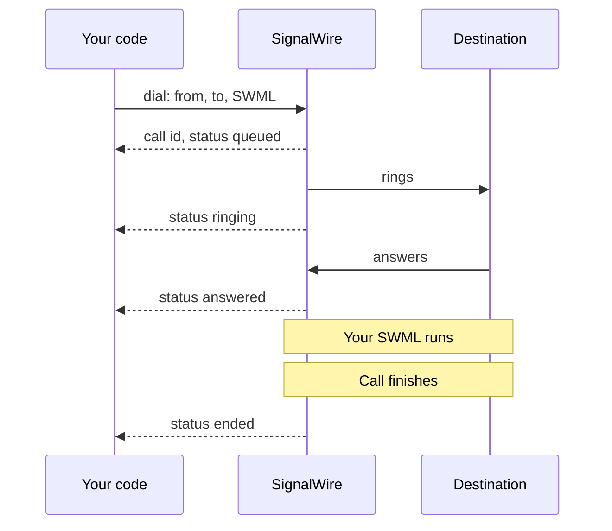
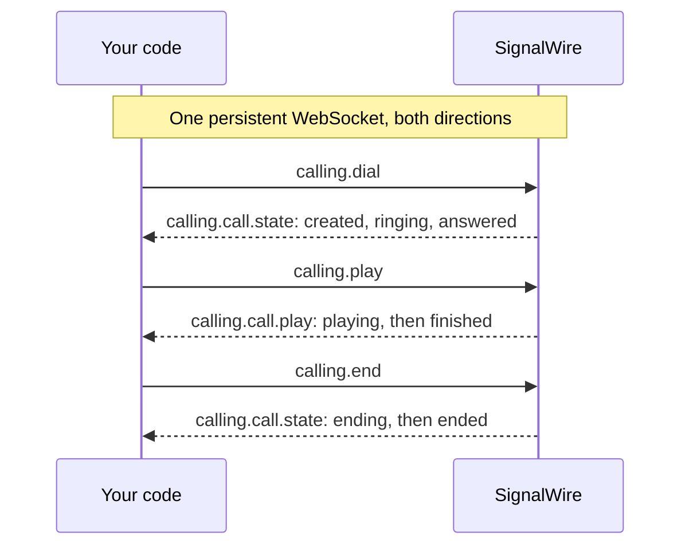
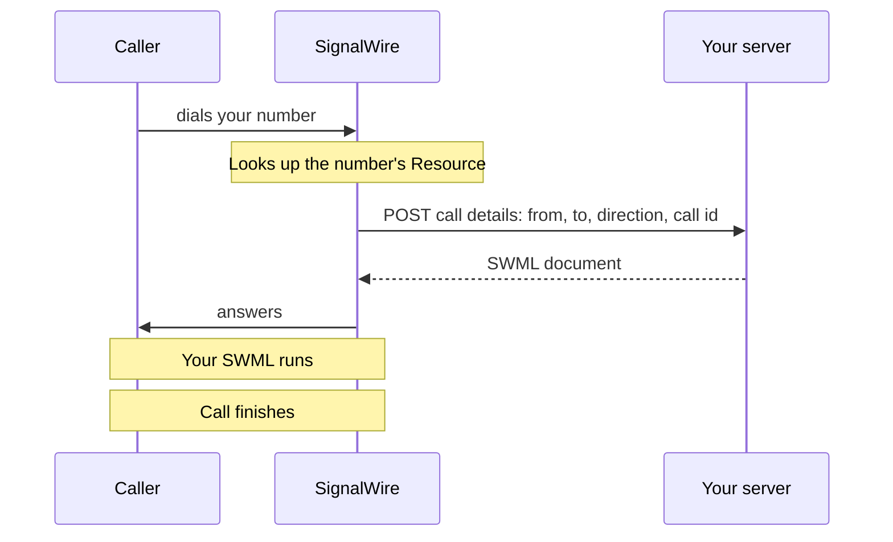
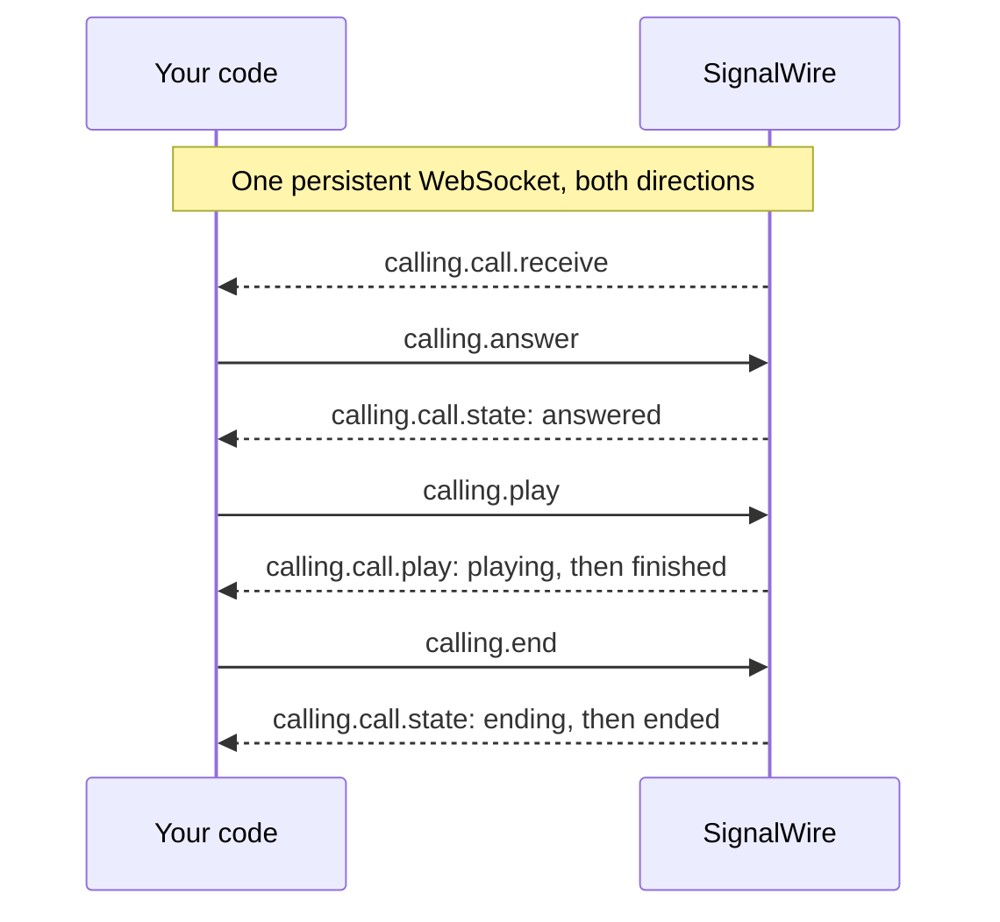

[caller-id]: /docs/platform/voice/how-to-set-caller-id-or-cnam
[trial-mode]: /docs/platform/trial-mode
[international]: /docs/platform/how-to-enable-international-services
[api-credentials]: /docs/platform/your-signalwire-api-space
[phone-numbers]: /docs/platform/phone-numbers
[tcpa]: /docs/platform/compliance/tcpa
[webhooks]: /docs/platform/webhooks
[swml-detect-machine]: /docs/swml/reference/calling/detect-machine
[swml-stream]: /docs/swml/reference/calling/stream
[subscriber-token]: /docs/apis/rest/subscribers/tokens/create-subscriber-token
[guest-token]: /docs/apis/rest/subscribers/tokens/create-subscriber-guest-token
[resources]: /docs/platform/resources
[sip-credentials]: /docs/platform/voice/sip/sip-credentials
[subscribers]: /docs/platform/subscribers
[dial-options]: /docs/browser-sdk/v4/reference/interfaces/dial-options
[call-create-error]: /docs/browser-sdk/v4/reference/errors/call-create-error
[browser-inbound]: /docs/browser-sdk/v4/guides/inbound-calls
[ts-dial]: /docs/server-sdks/reference/typescript/rest/calling/dial
[addresses]: /docs/platform/addresses
[swml-quickstart]: /docs/swml/guides
[swml-webhook-security]: /docs/swml/guides/webhook-security
[swml-webhook-payload]: /docs/swml/reference/calling#webhook-payload
[swml-variables]: /docs/swml/reference/variables
[swml-switch]: /docs/swml/reference/calling/switch
[swml-connect]: /docs/swml/reference/calling/connect
[swml-request]: /docs/swml/reference/calling/request
[swml-record]: /docs/swml/reference/calling/record
[py-relay-call]: /docs/server-sdks/reference/python/relay/call
[py-relay-events]: /docs/server-sdks/reference/python/relay/events
[py-swml-service]: /docs/server-sdks/reference/python/agents/swml-service
[py-swml-builder]: /docs/server-sdks/reference/python/agents/swml-builder
[ts-swml-builder]: /docs/server-sdks/reference/typescript/agents/swml-builder
[ts-swml-service]: /docs/server-sdks/reference/typescript/agents/swml-service
[py-relay-client]: /docs/server-sdks/reference/python/relay/client
[ts-relay-client]: /docs/server-sdks/reference/typescript/relay/client
[py-set-swml-webhook]: /docs/server-sdks/reference/python/rest/phone-numbers/set-swml-webhook
[ts-set-swml-webhook]: /docs/server-sdks/reference/typescript/rest/phone-numbers/set-swml-webhook
[py-set-relay-topic]: /docs/server-sdks/reference/python/rest/phone-numbers/set-relay-topic
[ts-set-relay-topic]: /docs/server-sdks/reference/typescript/rest/phone-numbers/set-relay-topic
[rest-update-number]: /docs/apis/rest/phone-numbers/update-phone-number
[rest-list-numbers]: /docs/apis/rest/phone-numbers/list-phone-numbers
[py-create-swml-webhooks]: /docs/server-sdks/reference/python/rest/fabric/swml-webhooks/create
[ts-create-swml-webhooks]: /docs/server-sdks/reference/typescript/rest/fabric/swml-webhooks/create
[py-create-relay-applications]: /docs/server-sdks/reference/python/rest/fabric/relay-applications/create
[ts-create-relay-applications]: /docs/server-sdks/reference/typescript/rest/fabric/relay-applications/create
[py-create-swml-scripts]: /docs/server-sdks/reference/python/rest/fabric/swml-scripts/create
[ts-create-swml-scripts]: /docs/server-sdks/reference/typescript/rest/fabric/swml-scripts/create
[py-create-subscribers]: /docs/server-sdks/reference/python/rest/fabric/subscribers/create
[ts-create-subscribers]: /docs/server-sdks/reference/typescript/rest/fabric/subscribers/create
[rest-create-script]: /docs/apis/rest/swml-scripts/create-swml-script
[rest-create-webhook]: /docs/apis/rest/swml-webhook/create-swml-webhook
[rest-create-relay-app]: /docs/apis/rest/relay-application/create-relay-application
[rest-create-subscriber]: /docs/apis/rest/subscribers/create-subscriber
[rest-create-sip]: /docs/apis/rest/sip-addresses/create-sip-address
[rest-create-alias]: /docs/apis/rest/alias-addresses/create-alias-address
[rest-link-number]: /docs/apis/rest/phone-number-addresses/create-phone-number-address
[browser-auth]: /docs/browser-sdk/v4/guides/authentication
[browser-register]: /docs/browser-sdk/v4/reference/signalwire/register
[browser-session-state]: /docs/browser-sdk/v4/reference/interfaces/session-state
[browser-call]: /docs/browser-sdk/v4/reference/interfaces/call

Place and answer voice calls with SignalWire, and choose what happens once the call connects.
Start by dialing your own phone from your code, or by calling your SignalWire number, and hearing
a short announcement. Then track call progress, and build one practical call in each direction:
a [reminder that leaves a voicemail](#example-send-a-reminder-call-that-leaves-a-voicemail) and a
[business line that forwards callers or takes a message](#example-forward-callers-to-a-dispatcher-or-take-a-voicemail).

## Prepare for your first call

Have these values ready:

- Your Space URL, such as `<YOUR_SPACE>.signalwire.com`.
- Your Project ID and API token from the Dashboard's [API credentials][api-credentials] page.
  Enable the token's **Voice** permission, and **Numbers** if you assign a phone number to a
  call handler through the API.
- To place calls to a phone, a voice-capable [phone number purchased in your Space][phone-numbers]
  or a [verified caller ID][caller-id], and a destination device you can answer.
- To receive calls from the phone network, a voice-capable [phone number in your Space][phone-numbers]
  and a phone to call it from. If you're testing with SIP or another SignalWire client, you can
  use an address instead.
- To call or answer from the browser, a [Subscriber][subscribers] and a
  [Subscriber token][subscriber-token] issued by your backend for that Subscriber. A page that
  only places calls can use a [guest token][guest-token] instead.

<Warning title="Trial projects and international calls are restricted">
A [trial project][trial-mode] can dial only numbers it has purchased or verified, cannot call
internationally, and receives calls to its phone numbers only from phone numbers it has verified.
Verify the phone you'll test with, or upgrade the project, before you dial. Any other project can
dial any number, but needs [international dialing enabled][international] before it reaches
another country.
</Warning>

## Outbound calling

Your code starts an outbound call: it dials a phone, SIP endpoint, Subscriber, or Resource, and
chooses what happens when someone answers.

### Make an outbound call

Dial a phone you can answer from your code and play a short announcement. To receive calls
instead, start with [Answer an inbound call](#answer-an-inbound-call).

<Steps>

<Step title="Choose how to place your call" id="choose-how-to-place-your-call">

Choose where the call starts and how your application follows it. Server call logic and browser
participation can work together in the same flow.

| Approach | Useful when | How you control and follow the call |
|---|---|---|
| [Server SDK — REST](#place-the-call) | A backend request or background job starts a call | Send a request with SWML instructions, receive progress at a webhook, and use the call ID for later commands. |
| [Server SDK — WebSocket (Relay)](#place-the-call) | Your server makes decisions as call events arrive | Keep a Relay client running to receive events and send commands over its persistent connection. |
| [Browser SDK](#place-the-call) | A user calls a person or Resource from your web app | Use the browser client for dialing, microphone and camera access, in-call controls, and live status updates in the page. |

</Step>

<Step title="Set your credentials and caller ID" id="set-your-credentials-and-caller-id">

Replace these values in the code sample you choose:

| Value | Replace with |
|---|---|
| `<YOUR_SPACE>` | Your Space's subdomain in `<YOUR_SPACE>.signalwire.com` |
| `<YOUR_PROJECT_ID>` | Your Project ID |
| `<YOUR_API_TOKEN>` | Your API token |
| `<YOUR_CALLER_ID>` | Your caller ID number |
| `<YOUR_SUBSCRIBER_ACCESS_TOKEN>` | A [Subscriber token][subscriber-token] created by your backend, for the Browser SDK examples |

</Step>

<Step title="Choose a destination" id="choose-a-destination">

A call can reach a phone, a [SIP destination][sip-credentials], a [Subscriber][subscribers], or
another [Resource][resources] in your SignalWire Space.

| Destination | Dial | Example |
|---|---|---|
| Phone | Its number in [E.164 format](/docs/platform/what-is-e164) | `+12025550123` |
| SIP destination | Its SIP URI | `sip:support@example.com` |
| Subscriber | Its resource address | `/private/support-rep` |
| Application | Its resource address | `/public/support-agent` |
| Conference | Its resource address | `/public/team-standup` |

For this walkthrough, choose a device you can answer and replace
`<YOUR_DESTINATION>` with its address.

</Step>

<Step title="Place the call" id="place-the-call">

Open the tab for the approach you chose. The server examples show Python and TypeScript first,
followed by cURL for direct HTTP access.

<Tabs groupId="outbound-api">
<Tab title="REST">

The request includes a SignalWire Markup Language (SWML) document in `swml`. SignalWire runs
it when the destination answers, playing the announcement below.

<CodeBlocks>
<CodeBlock title="Python — REST client">
```python
# Install: python -m pip install signalwire-sdk==3.4.1
# Save as outbound_call.py and run: python outbound_call.py
from signalwire import SWMLBuilder, SWMLService
from signalwire.rest import RestClient

client = RestClient(
    project="<YOUR_PROJECT_ID>",
    token="<YOUR_API_TOKEN>",
    host="<YOUR_SPACE>.signalwire.com",
)

swml = (
    SWMLBuilder(SWMLService(name="outbound-call"))
    .say("Hello, welcome to SignalWire!")
    .build()
)

call = client.calling.dial(
    from_="<YOUR_CALLER_ID>",
    to="<YOUR_DESTINATION>",
    swml=swml,
)
print(call["id"])
```
</CodeBlock>
<CodeBlock title="TypeScript — REST client">
```typescript
// Install: npm install @signalwire/sdk@2.0.5
// This sample also runs as JavaScript: save as outbound-call.mjs,
// then run: node outbound-call.mjs
import { RestClient, SwmlBuilder } from "@signalwire/sdk";

const client = new RestClient({
  project: "<YOUR_PROJECT_ID>",
  token: "<YOUR_API_TOKEN>",
  host: "<YOUR_SPACE>.signalwire.com",
});

const swml = new SwmlBuilder()
  .say("Hello, welcome to SignalWire!")
  .build();

const call = await client.calling.dial({
  from: "<YOUR_CALLER_ID>",
  to: "<YOUR_DESTINATION>",
  swml,
});
console.log(call.id);
```
</CodeBlock>
<CodeBlock title="cURL — REST Calling API">
```bash
curl -X POST "https://<YOUR_SPACE>.signalwire.com/api/calling/calls" \
  -u "<YOUR_PROJECT_ID>:<YOUR_API_TOKEN>" \
  -H "Content-Type: application/json" \
  -d '{
    "command": "dial",
    "params": {
      "from": "<YOUR_CALLER_ID>",
      "to": "<YOUR_DESTINATION>",
      "swml": {
        "version": "1.0.0",
        "sections": {
          "main": [
            { "play": {"url": "say:Hello, welcome to SignalWire!"} }
          ]
        }
      }
    }
  }'
```
</CodeBlock>
</CodeBlocks>

<Note title="TypeScript `dial()` signature depends on the SDK version">
The TypeScript samples on this page pin `@signalwire/sdk@2.0.5`, whose `dial()` takes a single
options object. The [TypeScript `dial` reference][ts-dial] documents the positional
`dial(from, to, options)` form of a newer release. Match the form to the version you install.
</Note>

The REST API returns a call `id` and status `queued`. This confirms that SignalWire accepted the
request; the call hasn't necessarily rung or been answered yet. Save the `id` to identify this call.

<EndpointResponseSnippet endpoint="POST /api/calling/calls" />

</Tab>
<Tab title="WebSocket (Relay)">

Use a Relay client to control the call flow from your server.

<CodeBlocks>
<CodeBlock title="Python — Relay client">
```python
# Install: python -m pip install signalwire-sdk==3.4.1
# Save as outbound_relay.py and run: python outbound_relay.py
import asyncio
from signalwire.relay import RelayClient

client = RelayClient(
    project="<YOUR_PROJECT_ID>",
    token="<YOUR_API_TOKEN>",
    host="<YOUR_SPACE>.signalwire.com",
    contexts=["default"],
)

async def main():
    async with client:
        call = await client.dial(
            devices=[[{
                "type": "phone",
                "params": {
                    "from_number": "<YOUR_CALLER_ID>",
                    "to_number": "<YOUR_DESTINATION>",
                    "timeout": 30,
                },
            }]],
        )
        async def hang_up_after_playback(_event):
            if call.state != "ended":
                await call.hangup()

        await call.play([{
            "type": "tts",
            "params": {"text": "Hello, welcome to SignalWire!"},
        }], on_completed=hang_up_after_playback)
        await call.wait_for_ended()

asyncio.run(main())
```
</CodeBlock>
<CodeBlock title="TypeScript — Relay client">
```typescript
// Install: npm install @signalwire/sdk@2.0.5
// This sample also runs as JavaScript: save as outbound-relay.mjs,
// then run: node outbound-relay.mjs
import { RelayClient } from "@signalwire/sdk";

const client = new RelayClient({
  project: "<YOUR_PROJECT_ID>",
  token: "<YOUR_API_TOKEN>",
  host: "<YOUR_SPACE>.signalwire.com",
  contexts: ["default"],
});

await client.connect();

try {
  const call = await client.dial([[{
    type: "phone",
    params: {
      from_number: "<YOUR_CALLER_ID>",
      to_number: "<YOUR_DESTINATION>",
      timeout: 30,
    },
  }]]);
  await call.play([
    { type: "tts", text: "Hello, welcome to SignalWire!" },
  ], {
    onCompleted: async () => {
      if (call.state !== "ended") await call.hangup();
    },
  });
  await call.waitForEnded();
} finally {
  await client.disconnect();
}
```
</CodeBlock>
</CodeBlocks>

</Tab>
<Tab title="Browser SDK">

Use the Browser SDK to place a call and participate from your web app. Pass `video: true` to
add the camera; [`DialOptions`][dial-options] lists every media option. In production, fetch the
token from your backend, as the [authentication guide][browser-auth] shows.

<CodeBlocks>
<CodeBlock title="JavaScript — Browser SDK">
```javascript
// Install: npm install @signalwire/js@4.0.0-rc.2 rxjs@7.8.2
// Load as a module script on an HTTPS or localhost page with these elements:
// <audio id="remote-audio" autoplay></audio>
// <button id="call" type="button">Call</button>
// <button id="hangup" type="button" disabled>Hang up</button>
// Use a Subscriber Access Token issued by your backend.
import { SignalWire, StaticCredentialProvider } from "@signalwire/js";

const client = new SignalWire(new StaticCredentialProvider({
  token: "<YOUR_SUBSCRIBER_ACCESS_TOKEN>",
}));
const remoteAudio = document.querySelector("#remote-audio");
const callButton = document.querySelector("#call");
const hangupButton = document.querySelector("#hangup");

callButton.onclick = async () => {
  callButton.disabled = true;
  try {
    const call = await client.dial("<YOUR_DESTINATION>", { audio: true, video: false });
    call.remoteStream$.subscribe((stream) => (remoteAudio.srcObject = stream));
    hangupButton.disabled = false;
    hangupButton.onclick = () => {
      void call.hangup().catch(console.error);
    };
    call.status$.subscribe((status) => {
      if (status === "disconnected" || status === "failed" || status === "destroyed") {
        remoteAudio.srcObject = null;
        hangupButton.disabled = true;
        callButton.disabled = false;
      }
    });
  } catch (error) {
    callButton.disabled = false;
    console.error(error);
  }
};
```
</CodeBlock>
</CodeBlocks>

</Tab>
</Tabs>

</Step>

<Step title="Answer your test call" id="answer-your-test-call">

Answer the destination phone. With a server example, you should hear "Hello, welcome to
SignalWire!", then the call ends. With the browser example, allow
microphone access to speak on the call and select **Hang up** when you finish.

If the phone never rings, check that `<YOUR_CALLER_ID>` is a number in your Space or a verified
caller ID, and that a trial project has verified the destination. If the browser's `dial()`
rejects with [`CallCreateError`][call-create-error], the token's scope doesn't reach the
destination.

Continue with [tracking the call](#track-an-outbound-call) or the [outbound example](#example-send-a-reminder-call-that-leaves-a-voicemail).

</Step>

</Steps>

### Track an outbound call

A REST `dial` reports progress to a webhook you name in the request. Relay and the Browser SDK
deliver call state as events on their connection. Follow the section for the approach you used
for your first call.

#### Track an outbound call via the REST Calling API

Add `status_url` and `status_events` to your first request to receive call progress callbacks.
Keep the inline `swml` announcement. The examples below place another call with notifications
for `ringing`, `answered`, and `ended`.

Before running the request, replace `<YOUR_STATUS_WEBHOOK_URL>` with a webhook endpoint
you control that SignalWire can reach. Your endpoint receives HTTP POST requests as the call
reaches the selected states. See the [webhooks guide][webhooks] for endpoint setup and local testing.
`status_events` accepts `created`, `ringing`, `answered`, and `ended`; if omitted, it defaults
to `ended`.

<CodeBlocks>
<CodeBlock title="Python — REST client">
```python
# Install: python -m pip install signalwire-sdk==3.4.1
# Save as outbound_call.py and run: python outbound_call.py
from signalwire import SWMLBuilder, SWMLService
from signalwire.rest import RestClient

client = RestClient(
    project="<YOUR_PROJECT_ID>",
    token="<YOUR_API_TOKEN>",
    host="<YOUR_SPACE>.signalwire.com",
)

swml = (
    SWMLBuilder(SWMLService(name="outbound-call"))
    .say("Hello, welcome to SignalWire!")
    .build()
)

call = client.calling.dial(
    from_="<YOUR_CALLER_ID>",
    to="<YOUR_DESTINATION>",
    swml=swml,
    status_url="<YOUR_STATUS_WEBHOOK_URL>",
    status_events=["ringing", "answered", "ended"],
)
print(call["id"])
```
</CodeBlock>
<CodeBlock title="TypeScript — REST client">
```typescript
// Install: npm install @signalwire/sdk@2.0.5
// This sample also runs as JavaScript: save as outbound-call.mjs,
// then run: node outbound-call.mjs
import { RestClient, SwmlBuilder } from "@signalwire/sdk";

const client = new RestClient({
  project: "<YOUR_PROJECT_ID>",
  token: "<YOUR_API_TOKEN>",
  host: "<YOUR_SPACE>.signalwire.com",
});

const swml = new SwmlBuilder()
  .say("Hello, welcome to SignalWire!")
  .build();

const call = await client.calling.dial({
  from: "<YOUR_CALLER_ID>",
  to: "<YOUR_DESTINATION>",
  swml,
  status_url: "<YOUR_STATUS_WEBHOOK_URL>",
  status_events: ["ringing", "answered", "ended"],
});
console.log(call.id);
```
</CodeBlock>
<CodeBlock title="cURL — REST Calling API">
```bash
curl -X POST "https://<YOUR_SPACE>.signalwire.com/api/calling/calls" \
  -u "<YOUR_PROJECT_ID>:<YOUR_API_TOKEN>" \
  -H "Content-Type: application/json" \
  -d '{
    "command": "dial",
    "params": {
      "from": "<YOUR_CALLER_ID>",
      "to": "<YOUR_DESTINATION>",
      "swml": {
        "version": "1.0.0",
        "sections": {
          "main": [
            { "play": {"url": "say:Hello, welcome to SignalWire!"} }
          ]
        }
      },
      "status_url": "<YOUR_STATUS_WEBHOOK_URL>",
      "status_events": ["ringing", "answered", "ended"]
    }
  }'
```
</CodeBlock>
</CodeBlocks>

This flow shows a call with `ringing`, `answered`, and `ended` status events enabled:

<llms-ignore>


</llms-ignore>

<llms-only>



</llms-only>

#### Track an outbound call via Relay

Relay exposes call state through `call.on()`. Register a `calling.call.state` listener to see
states such as `answered`, `ending`, and `ended` as they happen, with the `end_reason` once the
call finishes. Because `dial()` returns after the destination answers, the listener on an
outbound call observes the later states, `ending` and `ended`. The sample extends the first-run
Relay example.

<CodeBlocks>
<CodeBlock title="Python — Relay client">
```python
# Install: python -m pip install signalwire-sdk==3.4.1
# Save as outbound_relay.py and run: python outbound_relay.py
import asyncio
from signalwire.relay import RelayClient
from signalwire.relay.event import CallStateEvent

client = RelayClient(
    project="<YOUR_PROJECT_ID>",
    token="<YOUR_API_TOKEN>",
    host="<YOUR_SPACE>.signalwire.com",
    contexts=["default"],
)

async def main():
    async with client:
        call = await client.dial(
            devices=[[{
                "type": "phone",
                "params": {
                    "from_number": "<YOUR_CALLER_ID>",
                    "to_number": "<YOUR_DESTINATION>",
                    "timeout": 30,
                },
            }]],
        )
        def handle_state(event: CallStateEvent):
            print(f"State: {event.call_state}, reason: {event.end_reason}")

        call.on("calling.call.state", handle_state)
        async def hang_up_after_playback(_event):
            if call.state != "ended":
                await call.hangup()

        await call.play([{
            "type": "tts",
            "params": {"text": "Hello, welcome to SignalWire!"},
        }], on_completed=hang_up_after_playback)
        await call.wait_for_ended()

asyncio.run(main())
```
</CodeBlock>
<CodeBlock title="TypeScript — Relay client">
```typescript
// Install: npm install @signalwire/sdk@2.0.5
// This sample also runs as JavaScript: save as outbound-relay.mjs,
// then run: node outbound-relay.mjs
import { RelayClient } from "@signalwire/sdk";

const client = new RelayClient({
  project: "<YOUR_PROJECT_ID>",
  token: "<YOUR_API_TOKEN>",
  host: "<YOUR_SPACE>.signalwire.com",
  contexts: ["default"],
});

await client.connect();

try {
  const call = await client.dial([[{
    type: "phone",
    params: {
      from_number: "<YOUR_CALLER_ID>",
      to_number: "<YOUR_DESTINATION>",
      timeout: 30,
    },
  }]]);
  call.on("calling.call.state", (event) => {
    console.log(`State: ${event.params.call_state}, reason: ${event.params.end_reason ?? ""}`);
  });
  await call.play([
    { type: "tts", text: "Hello, welcome to SignalWire!" },
  ], {
    onCompleted: async () => {
      if (call.state !== "ended") await call.hangup();
    },
  });
  await call.waitForEnded();
} finally {
  await client.disconnect();
}
```
</CodeBlock>
</CodeBlocks>

This flow shows the commands your code sends and the events SignalWire returns over the same
persistent connection:

<llms-ignore>


</llms-ignore>

<llms-only>



</llms-only>

#### Track an outbound call in the browser

The Browser SDK exposes each call's status on `status$`. An outbound `dial()` returns a WebRTC
`Call` while it is `ringing`. The call then moves through `connecting` and `connected`, and
through `disconnecting`, `disconnected`, and `destroyed` once it ends. With `disconnected`,
`failed`, and `destroyed` treated as final, one subscription can update the page for every
outcome.

To show the status on the page, add `<p id="status">Idle</p>` to the first-run browser example's
page. Then add the lookup below and replace the example's `status$` subscription:

```javascript title="JavaScript — Browser SDK"
const statusLine = document.querySelector("#status");

// Inside callButton.onclick, after dial() resolves:
call.status$.subscribe((status) => {
  statusLine.textContent = `Call: ${status}`;
  if (status === "disconnected" || status === "failed" || status === "destroyed") {
    remoteAudio.srcObject = null;
    hangupButton.disabled = true;
    callButton.disabled = false;
  }
});
```

### Example: send a reminder call that leaves a voicemail

Call a customer with a reminder, and let answering machine detection (AMD) decide what they
hear. A person hears the reminder as soon as they answer. A voicemail system gets a message
after its greeting and beep. Here, Bayview Taxi confirms a rider's pickup at
`<YOUR_DESTINATION>`. The example builds on your first outbound call and keeps its credentials.

<Warning title="Prerecorded and artificial-voice calls are regulated">
Follow the consent and calling-hour requirements in the [TCPA guide][tcpa].
</Warning>

#### Send the reminder via SWML

Send a REST `dial` whose SWML runs [`detect_machine`][swml-detect-machine], then `switch`es on
`detect_result` to play the live or voicemail message. Build each message with `say()` and pass
its `main` section to `switch`, which takes lists of instructions for its branches.

<CodeBlocks>
<CodeBlock title="Python — REST client">
```python
# Install: python -m pip install signalwire-sdk==3.4.1
# Save as outbound_reminder.py and run: python outbound_reminder.py
from signalwire import SWMLBuilder, SWMLService
from signalwire.rest import RestClient

client = RestClient(
    project="<YOUR_PROJECT_ID>",
    token="<YOUR_API_TOKEN>",
    host="<YOUR_SPACE>.signalwire.com",
)

voicemail = (
    SWMLBuilder(SWMLService(name="voicemail-message"))
    .say("Hi, this is Bayview Taxi with a reminder that your ride is booked for 5:30 PM today. Call us back if you need to change it.")
    .build()["sections"]["main"]
)
live = (
    SWMLBuilder(SWMLService(name="live-message"))
    .say("Hi, this is Bayview Taxi. Your ride is booked for 5:30 PM today. See you soon!")
    .build()["sections"]["main"]
)

swml = (
    SWMLBuilder(SWMLService(name="outbound-reminder"))
    .detect_machine(
        detectors="amd",
        detect_message_end=True,
        timeout=30,
    )
    .switch(
        variable="detect_result",
        case={
            "machine": voicemail,
            "human": live,
        },
        default=live,
    )
    .hangup()
    .build()
)

call = client.calling.dial(
    from_="<YOUR_CALLER_ID>",
    to="<YOUR_DESTINATION>",
    swml=swml,
)
print(call["id"])
```
</CodeBlock>
<CodeBlock title="TypeScript — REST client">
```typescript
// Install: npm install @signalwire/sdk@2.0.5
// This sample also runs as JavaScript: save as outbound-reminder.mjs,
// then run: node outbound-reminder.mjs
import { RestClient, SwmlBuilder } from "@signalwire/sdk";

const client = new RestClient({
  project: "<YOUR_PROJECT_ID>",
  token: "<YOUR_API_TOKEN>",
  host: "<YOUR_SPACE>.signalwire.com",
});

const voicemail = new SwmlBuilder()
  .say("Hi, this is Bayview Taxi with a reminder that your ride is booked for 5:30 PM today. Call us back if you need to change it.")
  .document.sections.main;
const live = new SwmlBuilder()
  .say("Hi, this is Bayview Taxi. Your ride is booked for 5:30 PM today. See you soon!")
  .document.sections.main;

const swml = new SwmlBuilder()
  .detect_machine({
    detectors: "amd",
    detect_message_end: true,
    timeout: 30,
  })
  .switch({
    variable: "detect_result",
    case: {
      machine: voicemail,
      human: live,
    },
    default: live,
  })
  .hangup()
  .build();

const call = await client.calling.dial({
  from: "<YOUR_CALLER_ID>",
  to: "<YOUR_DESTINATION>",
  swml,
});
console.log(call.id);
```
</CodeBlock>
<CodeBlock title="cURL — REST Calling API">
```bash
curl -X POST "https://<YOUR_SPACE>.signalwire.com/api/calling/calls" \
  -u "<YOUR_PROJECT_ID>:<YOUR_API_TOKEN>" \
  -H "Content-Type: application/json" \
  -d '{
    "command": "dial",
    "params": {
      "from": "<YOUR_CALLER_ID>",
      "to": "<YOUR_DESTINATION>",
      "swml": {
        "version": "1.0.0",
        "sections": {
          "main": [
            {
              "detect_machine": {
                "detectors": "amd",
                "detect_message_end": true,
                "timeout": 30
              }
            },
            {
              "switch": {
                "variable": "detect_result",
                "case": {
                  "machine": [
                    { "play": {"url": "say:Hi, this is Bayview Taxi with a reminder that your ride is booked for 5:30 PM today. Call us back if you need to change it."} }
                  ],
                  "human": [
                    { "play": {"url": "say:Hi, this is Bayview Taxi. Your ride is booked for 5:30 PM today. See you soon!"} }
                  ]
                },
                "default": [
                  { "play": {"url": "say:Hi, this is Bayview Taxi. Your ride is booked for 5:30 PM today. See you soon!"} }
                ]
              }
            },
            { "hangup": {} }
          ]
        }
      }
    }
  }'
```
</CodeBlock>
</CodeBlocks>

#### Send the reminder via Relay

Dial the customer, then start `call.detect()`. Play the live message after `HUMAN` or
`UNKNOWN`, or wait for `READY`, which arrives after a machine's greeting and beep.

<CodeBlocks>
<CodeBlock title="Python — Relay client">
```python
# Install: python -m pip install signalwire-sdk==3.4.1
# Save as outbound_reminder_relay.py and run: python outbound_reminder_relay.py
import asyncio
from signalwire.relay import RelayClient
from signalwire.relay.event import DetectEvent

VOICEMAIL = "Hi, this is Bayview Taxi with a reminder that your ride is booked for 5:30 PM today. Call us back if you need to change it."
LIVE = "Hi, this is Bayview Taxi. Your ride is booked for 5:30 PM today. See you soon!"

client = RelayClient(
    project="<YOUR_PROJECT_ID>",
    token="<YOUR_API_TOKEN>",
    host="<YOUR_SPACE>.signalwire.com",
    contexts=["default"],
)

def outcome(event: DetectEvent) -> str:
    return event.detect.get("params", {}).get("event", "")

async def main():
    async with client:
        call = await client.dial(
            devices=[[{
                "type": "phone",
                "params": {
                    "from_number": "<YOUR_CALLER_ID>",
                    "to_number": "<YOUR_DESTINATION>",
                    "timeout": 30,
                },
            }]],
        )
        async def hang_up_after_playback(_event):
            if call.state != "ended":
                await call.hangup()

        announced = False

        async def announce(event: DetectEvent):
            nonlocal announced
            if announced or call.state == "ended":
                return
            result = outcome(event)
            if result == "READY":
                # The voicemail greeting and its beep have finished.
                announced = True
                await call.play(
                    [{"type": "tts", "params": {"text": VOICEMAIL}}],
                    on_completed=hang_up_after_playback,
                )
            elif result in ("HUMAN", "UNKNOWN"):
                announced = True
                await call.play(
                    [{"type": "tts", "params": {"text": LIVE}}],
                    on_completed=hang_up_after_playback,
                )
            elif result == "finished":
                await call.hangup()

        call.on("calling.call.detect", announce)
        await call.detect({"type": "machine", "params": {"detect_message_end": True}}, timeout=30)
        await call.wait_for_ended()

asyncio.run(main())
```
</CodeBlock>
<CodeBlock title="TypeScript — Relay client">
```typescript
// Install: npm install @signalwire/sdk@2.0.5
// Save as outbound-reminder-relay.mts and run: npx tsx outbound-reminder-relay.mts
import { RelayClient, DetectEvent, RelayEvent } from "@signalwire/sdk";

const VOICEMAIL = "Hi, this is Bayview Taxi with a reminder that your ride is booked for 5:30 PM today. Call us back if you need to change it.";
const LIVE = "Hi, this is Bayview Taxi. Your ride is booked for 5:30 PM today. See you soon!";

const client = new RelayClient({
  project: "<YOUR_PROJECT_ID>",
  token: "<YOUR_API_TOKEN>",
  host: "<YOUR_SPACE>.signalwire.com",
  contexts: ["default"],
});

function outcome(event: RelayEvent): string {
  const detect = (event as DetectEvent).detect?.params as { event?: string } | undefined;
  return detect?.event ?? "";
}

await client.connect();

try {
  const call = await client.dial([[{
    type: "phone",
    params: {
      from_number: "<YOUR_CALLER_ID>",
      to_number: "<YOUR_DESTINATION>",
      timeout: 30,
    },
  }]]);
  const hangUpAfterPlayback = async () => {
    if (call.state !== "ended") await call.hangup();
  };
  let announced = false;

  call.on("calling.call.detect", async (event) => {
    if (announced || call.state === "ended") return;
    const result = outcome(event);
    if (result === "READY") {
      // The voicemail greeting and its beep have finished.
      announced = true;
      await call.play([{ type: "tts", text: VOICEMAIL }], { onCompleted: hangUpAfterPlayback });
    } else if (result === "HUMAN" || result === "UNKNOWN") {
      announced = true;
      await call.play([{ type: "tts", text: LIVE }], { onCompleted: hangUpAfterPlayback });
    } else if (result === "finished") {
      await call.hangup();
    }
  });

  await call.detect({ type: "machine", params: { detect_message_end: true } }, { timeout: 30 });
  await call.waitForEnded();
} finally {
  await client.disconnect();
}
```
</CodeBlock>
</CodeBlocks>

## Inbound calling

SignalWire receives an inbound call at one of your addresses and hands it to the Resource you
assigned, which decides what the caller hears.

### Answer an inbound call

Create a call handler, give it an address, and call that address to test it. The SWML and Relay
examples play a short announcement; the browser example lets you answer and speak on the call.

<Steps>

<Step title="Choose how to handle your call" id="choose-how-to-handle-your-call">

Choose where the instructions for an incoming call run. The approaches work together: a SWML
or Relay handler on your company number can greet the caller and forward the call to an agent
who answers on a phone, a SIP device, or in your web app.

| Approach | Useful when | How the call reaches your logic or user |
|---|---|---|
| [Server SDK — HTTP (SWML)](#create-your-call-handler) | Your server chooses instructions for each incoming call | SignalWire requests a document from your public HTTPS endpoint and runs the SWML it returns. |
| [Server SDK — WebSocket (Relay)](#create-your-call-handler) | Your server makes decisions as call events arrive | A running Relay client receives calls for its topic and controls them over a persistent connection. |
| [Browser SDK](#create-your-call-handler) | An agent receives and handles calls in your web app | A browser client authenticated as the agent's Subscriber receives the call, provides media and in-call controls, and updates the page as its status changes. |
| [Hosted SWML](#create-your-call-handler) | You want SignalWire to host and run the call instructions | The assigned script runs in your Space, using call variables, branches, and HTTP requests as the flow needs them. |

The HTTP (SWML) and Relay examples run on your server with a Server SDK. To hear a first call
without running a server, use Hosted SWML. Whichever you choose, the handler is a
[Resource][resources]: a SWML Script for either SWML approach, a Relay Application for Relay,
or a Subscriber for the Browser SDK. An [address][addresses] tells SignalWire which Resource
receives the call.

</Step>

<Step title="Set your credentials" id="set-your-credentials">

Replace the values used by your chosen example. Hosted SWML needs no credentials in the document.

| Value | Replace with |
|---|---|
| `<YOUR_SPACE>` | Your Space's subdomain in `<YOUR_SPACE>.signalwire.com` |
| `<YOUR_PROJECT_ID>` | Your Project ID |
| `<YOUR_API_TOKEN>` | Your API token, used only in server code |
| `<YOUR_SUBSCRIBER_ACCESS_TOKEN>` | A [Subscriber token][subscriber-token] created by your backend, for the Browser SDK example |
| `<YOUR_BASIC_AUTH_PASSWORD>` | A password you choose for your HTTP server's basic auth |
| `<YOUR_PUBLIC_HOST>` | The public hostname of your HTTP server or tunnel |
| `<YOUR_SWML_URL>` | Your HTTP server's public URL, including its basic-auth credentials, when you assign the number in code |
| `<YOUR_PHONE_NUMBER_ID>` | The number's ID from its Dashboard page or [List phone numbers][rest-list-numbers], when you assign the number in code |

</Step>

<Step title="Choose how callers reach you" id="choose-how-callers-reach-you">

For this walkthrough, use your SignalWire phone number and call it from your own phone.
If you're testing from a SIP client or another SignalWire application, choose its address type
instead. Each works with the handlers above.

| Address | Who can call it | What to use for your test |
|---|---|---|
| Phone number | Anyone on the phone network, subject to trial restrictions | Your SignalWire number in E.164 format, such as `+12025550123` |
| SIP address | SIP softphones, PBXs, and carriers | The SIP URI assigned when you add the address |
| Alias | SignalWire clients and Resources with access to its context | The Resource's alias, such as `/private/inbound-welcome` |

You'll attach or find this address after creating the handler.

</Step>

<Step title="Create your call handler" id="create-your-call-handler">

Open the tab for your approach. Complete its setup, then continue to **Give the Resource an address**.

<Tabs groupId="inbound-api">
<Tab title="HTTP (SWML)">

SignalWire requests a SWML document from your server when a call arrives. These examples return
instructions to play "Hello, welcome to SignalWire!" and end the call.

Run either server below, then expose port 3000 at a public HTTPS URL. A tunnel such as
[ngrok](https://ngrok.com/) works for development.

<CodeBlocks>
<CodeBlock title="Python — SWML server">
```python
# Install: python -m pip install signalwire-sdk==3.4.1
# Save as inbound_swml_server.py and run: python inbound_swml_server.py
from signalwire import SWMLBuilder, SWMLService

service = SWMLService(
    name="inbound-swml-server",
    route="/swml",
    port=3000,
    basic_auth=("signalwire", "<YOUR_BASIC_AUTH_PASSWORD>"),
)
SWMLBuilder(service).say("Hello, welcome to SignalWire!")

# Serves the document at /swml. Put the credentials in the URL you give
# SignalWire: https://signalwire:<YOUR_BASIC_AUTH_PASSWORD>@<YOUR_PUBLIC_HOST>/swml
service.serve()
```
</CodeBlock>
<CodeBlock title="TypeScript — SWML server">
```typescript
// Install: npm install @signalwire/sdk@2.0.5
// This sample also runs as JavaScript: save as inbound-swml-server.mjs,
// then run: node inbound-swml-server.mjs
import { SWMLService } from "@signalwire/sdk";

const service = new SWMLService({
  name: "inbound-swml-server",
  route: "/swml",
  port: 3000,
  basicAuth: ["signalwire", "<YOUR_BASIC_AUTH_PASSWORD>"],
});
service.getBuilder().say("Hello, welcome to SignalWire!");

// Serves the document at /swml. Put the credentials in the URL you give
// SignalWire: https://signalwire:<YOUR_BASIC_AUTH_PASSWORD>@<YOUR_PUBLIC_HOST>/swml
await service.serve();
```
</CodeBlock>
</CodeBlocks>

Both examples serve the document with the SDK's `SWMLService` ([Python][py-swml-service],
[TypeScript][ts-swml-service]) and add instructions through its builder
([`SWMLBuilder`][py-swml-builder], [`SwmlBuilder`][ts-swml-builder]). The service requires the
basic-auth credentials in its URL: `https://signalwire:<YOUR_BASIC_AUTH_PASSWORD>@<YOUR_PUBLIC_HOST>/swml`.
See [webhook security][swml-webhook-security] to verify incoming requests.

Once your server is reachable, create its Resource in the Dashboard:

1. Open **My Resources**, select **+ Add**, then **Script**, then **SWML Script**.
2. Name it **Inbound welcome** and leave **Used For** set to **Calling**.
3. Under **Handle Calls Using**, choose **External URL** and enter your server's public URL in
   **Primary Script URL**, including the basic-auth credentials.
4. Select **Create** and keep the server running.

To create it in code, use the [Python][py-create-swml-webhooks] or
[TypeScript][ts-create-swml-webhooks] SDK. The [SWML webhook REST endpoint][rest-create-webhook]
is also available.

</Tab>
<Tab title="WebSocket (Relay)">

Run either handler below and leave it running while you test. It receives calls on the
`inbound-calling` topic, answers, plays the announcement, and hangs up. The client holds a
WebSocket connection open, so you don't need a public HTTP endpoint.

<CodeBlocks>
<CodeBlock title="Python — Relay client">
```python
# Install: python -m pip install signalwire-sdk==3.4.1
# Save as inbound_relay.py and run: python inbound_relay.py
from signalwire.relay import RelayClient

client = RelayClient(
    project="<YOUR_PROJECT_ID>",
    token="<YOUR_API_TOKEN>",
    host="<YOUR_SPACE>.signalwire.com",
    contexts=["inbound-calling"],
)

@client.on_call
async def handle_call(call):
    await call.answer()

    async def hang_up_after_playback(_event):
        if call.state != "ended":
            await call.hangup()

    await call.play([{
        "type": "tts",
        "params": {"text": "Hello, welcome to SignalWire!"},
    }], on_completed=hang_up_after_playback)
    await call.wait_for_ended()

client.run()
```
</CodeBlock>
<CodeBlock title="TypeScript — Relay client">
```typescript
// Install: npm install @signalwire/sdk@2.0.5
// This sample also runs as JavaScript: save as inbound-relay.mjs,
// then run: node inbound-relay.mjs
import { RelayClient } from "@signalwire/sdk";

const client = new RelayClient({
  project: "<YOUR_PROJECT_ID>",
  token: "<YOUR_API_TOKEN>",
  host: "<YOUR_SPACE>.signalwire.com",
  contexts: ["inbound-calling"],
});

client.onCall(async (call) => {
  await call.answer();
  await call.play([
    { type: "tts", text: "Hello, welcome to SignalWire!" },
  ], {
    onCompleted: async () => {
      if (call.state !== "ended") await call.hangup();
    },
  });
  await call.waitForEnded();
});

await client.run();
```
</CodeBlock>
</CodeBlocks>

Connect this handler to a Resource in the Dashboard:

1. Open **My Resources**, select **+ Add**, then **Relay Application**.
2. Name it **Inbound welcome** and enter `inbound-calling` as the **Topic**. It must match the
   `contexts` value in your code.
3. Select **Create**.

To create it in code, use the [Python][py-create-relay-applications] or
[TypeScript][ts-create-relay-applications] SDK. The [Relay Application REST endpoint][rest-create-relay-app]
is also available.
See the [Python][py-relay-client] or [TypeScript][ts-relay-client] Relay client reference for
more configuration options.

</Tab>
<Tab title="Browser SDK">

Use a [Subscriber][subscribers] as the Resource. Create one with the
[Python][py-create-subscribers] or [TypeScript][ts-create-subscribers] SDK, or the
[Subscribers REST endpoint][rest-create-subscriber], then issue a [Subscriber token][subscriber-token] with that Subscriber's
`reference`. Use the token in the example below and find the same Subscriber under **My Resources**
when you attach an address in the next step.

<Warning title="Receiving calls in the browser requires a Subscriber token">
Guest and embed tokens are outbound-only. The browser must authenticate as the Subscriber
receiving the call. A number can ring that Subscriber directly, or a call handler can route
the call to the Subscriber's address.
</Warning>

Run this example on a web page served over HTTPS or `localhost`, with the elements listed in
its comments. The page shows who is calling and lets you answer, decline, or hang up.

```javascript
// Install: npm install @signalwire/js@4.0.0-rc.2 rxjs@7.8.2
// Load as a module script on an HTTPS or localhost page with these elements:
// <p id="status">Offline</p>
// <p id="caller"></p>
// <audio id="remote-audio" autoplay></audio>
// <button id="answer" type="button" disabled>Answer</button>
// <button id="decline" type="button" disabled>Decline</button>
// <button id="hangup" type="button" disabled>Hang up</button>
// Use a Subscriber Access Token issued by your backend for the Subscriber
// that the phone number rings.
import { SignalWire, StaticCredentialProvider } from "@signalwire/js";

const client = new SignalWire(new StaticCredentialProvider({
  token: "<YOUR_SUBSCRIBER_ACCESS_TOKEN>",
}));
const statusLine = document.querySelector("#status");
const callerLine = document.querySelector("#caller");
const remoteAudio = document.querySelector("#remote-audio");
const answerButton = document.querySelector("#answer");
const declineButton = document.querySelector("#decline");
const hangupButton = document.querySelector("#hangup");
const finalStatuses = new Set(["disconnected", "failed", "destroyed"]);

let currentCall = null;

await client.register();
statusLine.textContent = "Online";

client.session.incomingCalls$.subscribe((calls) => {
  const ringing = calls.find((call) => call.status === "ringing");
  if (!ringing || ringing === currentCall) return;
  currentCall = ringing;
  callerLine.textContent = `Incoming call from ${ringing.from}`;
  answerButton.disabled = false;
  declineButton.disabled = false;

  ringing.remoteStream$.subscribe((stream) => (remoteAudio.srcObject = stream));
  ringing.status$.subscribe((status) => {
    statusLine.textContent = status;
    if (status !== "ringing") {
      answerButton.disabled = true;
      declineButton.disabled = true;
    }
    if (status === "connected") hangupButton.disabled = false;
    if (finalStatuses.has(status)) {
      remoteAudio.srcObject = null;
      hangupButton.disabled = true;
      callerLine.textContent = "";
      if (currentCall === ringing) currentCall = null;
    }
  });
});

answerButton.onclick = () => {
  void currentCall?.answer({ audio: true, video: false });
};
declineButton.onclick = () => {
  void currentCall?.reject();
};
hangupButton.onclick = () => {
  void currentCall?.hangup().catch(console.error);
};
```

Awaiting [`register()`][browser-register] confirms the client is online. Keep the page open
while you test. The Browser SDK [inbound calls guide][browser-inbound] builds a complete receiver
page, including two callers ringing at once.

</Tab>
<Tab title="Hosted SWML">

Create a SWML Script in the Dashboard. SignalWire hosts and runs the document, so you don't
need to start a server.

1. Open **My Resources**, select **+ Add**, then **Script**, then **SWML Script**.
2. Name it **Inbound welcome** and leave **Used For** set to **Calling**.
3. Under **Handle Calls Using**, choose **Hosted Script** and paste the document below into
   **Primary Script**.
4. Select **Create**.

This document plays "Hello, welcome to SignalWire!" and ends the call:

<CodeBlocks>
<CodeBlock title="YAML">
```yaml
version: 1.0.0
sections:
  main:
    - play:
        url: 'say:Hello, welcome to SignalWire!'
```
</CodeBlock>
<CodeBlock title="JSON">
```json
{
  "version": "1.0.0",
  "sections": {
    "main": [
      { "play": { "url": "say:Hello, welcome to SignalWire!" } }
    ]
  }
}
```
</CodeBlock>
</CodeBlocks>

<Accordion title="Create the hosted script with a Server SDK or cURL">

Use the [Python][py-create-swml-scripts] or [TypeScript][ts-create-swml-scripts] SDK to build the
SWML and create its hosted Resource in one program. This replaces the Dashboard creation steps.
Both programs print the Resource ID; use that Resource when you assign the number next.

<CodeBlocks>
<CodeBlock title="Python — REST client">
```python
# Install: python -m pip install signalwire-sdk==3.4.1
# Save as inbound_script.py and run: python inbound_script.py
from signalwire import SWMLBuilder, SWMLService
from signalwire.rest import RestClient

client = RestClient(
    project="<YOUR_PROJECT_ID>",
    token="<YOUR_API_TOKEN>",
    host="<YOUR_SPACE>.signalwire.com",
)

swml = (
    SWMLBuilder(SWMLService(name="inbound-welcome"))
    .say("Hello, welcome to SignalWire!")
    .build()
)

script = client.fabric.swml_scripts.create(
    name="Inbound welcome",
    contents=swml,
)
print(script["id"])
```
</CodeBlock>
<CodeBlock title="TypeScript — REST client">
```typescript
// Install: npm install @signalwire/sdk@2.0.5
// This sample also runs as JavaScript: save as inbound-script.mjs,
// then run: node inbound-script.mjs
import { RestClient, SwmlBuilder } from "@signalwire/sdk";

const client = new RestClient({
  project: "<YOUR_PROJECT_ID>",
  token: "<YOUR_API_TOKEN>",
  host: "<YOUR_SPACE>.signalwire.com",
});

const swml = new SwmlBuilder()
  .say("Hello, welcome to SignalWire!")
  .build();

const script = await client.fabric.swmlScripts.create({
  name: "Inbound welcome",
  contents: swml,
});
console.log(script.id);
```
</CodeBlock>
<CodeBlock title="cURL — SWML Scripts API">
```bash
curl -X POST "https://<YOUR_SPACE>.signalwire.com/api/fabric/resources/swml_scripts" \
  -u "<YOUR_PROJECT_ID>:<YOUR_API_TOKEN>" \
  -H "Content-Type: application/json" \
  -d '{
    "name": "Inbound welcome",
    "contents": {
      "version": "1.0.0",
      "sections": {
        "main": [
          { "play": { "url": "say:Hello, welcome to SignalWire!" } }
        ]
      }
    }
  }'
```
</CodeBlock>
</CodeBlocks>

The SDK and cURL examples all send `contents` as a JSON object to the
[SWML Script REST endpoint][rest-create-script].

</Accordion>

See the [SWML quickstart][swml-quickstart] for more on hosted scripts.

</Tab>
</Tabs>

</Step>

<Step title="Give the Resource an address" id="give-the-resource-an-address">

Use the Resource you just created as the address's **call handler**. For a phone number, the
call handler is separate from its message handler.

<Tabs groupId="inbound-address">
<Tab title="Phone number">

<Markdown src="/snippets/common/dashboard/_assign-resource-to-number.mdx" />

<Accordion title="Assign a phone number with a Server SDK or cURL">

For an HTTP SWML server or a Relay handler, the Server SDK can create and assign the Resource
in one request. Use this instead of the separate Resource creation and Dashboard assignment
steps above. Choose the example for your handler; assigning another handler replaces the
number's current call route.

For an HTTP SWML handler, use [`set_swml_webhook`][py-set-swml-webhook] in Python or
[`setSwmlWebhook`][ts-set-swml-webhook] in TypeScript.

<CodeBlocks>
<CodeBlock title="Python — REST client">
```python
# Install: python -m pip install signalwire-sdk==3.4.1
# Save as assign_swml_webhook.py and run: python assign_swml_webhook.py
from signalwire.rest import RestClient

client = RestClient(
    project="<YOUR_PROJECT_ID>",
    token="<YOUR_API_TOKEN>",
    host="<YOUR_SPACE>.signalwire.com",
)

client.phone_numbers.set_swml_webhook("<YOUR_PHONE_NUMBER_ID>", "<YOUR_SWML_URL>")
```
</CodeBlock>
<CodeBlock title="TypeScript — REST client">
```typescript
// Install: npm install @signalwire/sdk@2.0.5
// This sample also runs as JavaScript: save as assign-swml-webhook.mjs,
// then run: node assign-swml-webhook.mjs
import { RestClient } from "@signalwire/sdk";

const client = new RestClient({
  project: "<YOUR_PROJECT_ID>",
  token: "<YOUR_API_TOKEN>",
  host: "<YOUR_SPACE>.signalwire.com",
});

await client.phoneNumbers.setSwmlWebhook("<YOUR_PHONE_NUMBER_ID>", "<YOUR_SWML_URL>");
```
</CodeBlock>
<CodeBlock title="cURL — Phone Numbers API">
```bash
curl -X PUT "https://<YOUR_SPACE>.signalwire.com/api/relay/rest/phone_numbers/<YOUR_PHONE_NUMBER_ID>" \
  -u "<YOUR_PROJECT_ID>:<YOUR_API_TOKEN>" \
  -H "Content-Type: application/json" \
  -d '{
    "call_handler": "relay_script",
    "call_relay_script_url": "<YOUR_SWML_URL>"
  }'
```
</CodeBlock>
</CodeBlocks>

For a Relay handler, use [`set_relay_topic`][py-set-relay-topic] in Python or
[`setRelayTopic`][ts-set-relay-topic] in TypeScript.

<CodeBlocks>
<CodeBlock title="Python — REST client">
```python
# Install: python -m pip install signalwire-sdk==3.4.1
# Save as assign_relay_topic.py and run: python assign_relay_topic.py
from signalwire.rest import RestClient

client = RestClient(
    project="<YOUR_PROJECT_ID>",
    token="<YOUR_API_TOKEN>",
    host="<YOUR_SPACE>.signalwire.com",
)

client.phone_numbers.set_relay_topic("<YOUR_PHONE_NUMBER_ID>", "inbound-calling")
```
</CodeBlock>
<CodeBlock title="TypeScript — REST client">
```typescript
// Install: npm install @signalwire/sdk@2.0.5
// This sample also runs as JavaScript: save as assign-relay-topic.mjs,
// then run: node assign-relay-topic.mjs
import { RestClient } from "@signalwire/sdk";

const client = new RestClient({
  project: "<YOUR_PROJECT_ID>",
  token: "<YOUR_API_TOKEN>",
  host: "<YOUR_SPACE>.signalwire.com",
});

await client.phoneNumbers.setRelayTopic("<YOUR_PHONE_NUMBER_ID>", { topic: "inbound-calling" });
```
</CodeBlock>
<CodeBlock title="cURL — Phone Numbers API">
```bash
curl -X PUT "https://<YOUR_SPACE>.signalwire.com/api/relay/rest/phone_numbers/<YOUR_PHONE_NUMBER_ID>" \
  -u "<YOUR_PROJECT_ID>:<YOUR_API_TOKEN>" \
  -H "Content-Type: application/json" \
  -d '{
    "call_handler": "relay_topic",
    "call_relay_topic": "inbound-calling"
  }'
```
</CodeBlock>
</CodeBlocks>

The cURL examples call [Update phone number][rest-update-number] directly.

To attach an existing Resource by ID, use [Create a phone number address][rest-link-number]
with the phone number, the Resource's ID, and `handler_type: "calling"`. This endpoint is in
beta and requires the number's calling channel to have no Resource assigned yet.

</Accordion>

</Tab>
<Tab title="SIP address">

1. Open the Resource from **My Resources**, then its **Addresses & Phone Numbers** tab.
2. Select **+ Add**, then **SIP Address**.
3. Leave **User** as `*`, pick a **Domain**, give the address a **Name**, and select **Create**.
4. Copy the assigned URI. With **User** set to `*`, you can dial it with any username, such as
   `sip:test@<YOUR_SPACE>-<domain>.dapp.signalwire.com`.

A password and IP allowlist are optional. If you configure either, your test client must meet
those requirements. To add the address through the API, use [Create a SIP address][rest-create-sip]
with a `name` and your Resource's ID as `calling_handler_resource_id`.

</Tab>
<Tab title="Alias">

Open the Resource's **Addresses & Phone Numbers** tab and copy its automatically created alias.
Use the full address, including its context, such as `/private/inbound-welcome`.

A `private` alias is reachable by authenticated Subscribers and your project's own dials.
A guest token needs a `public` alias. To add one, select **+ Add**, then **Alias**, and fill in
**Name**, **Display Name**, **Context**, and **Channels**. Choose `public` as the context and
enable the calling channel you need.

To add an alias through the API, use [Create an alias address][rest-create-alias] with a `name`,
your `resource_id`, and a `context`. See the [Addresses guide][addresses] for access rules.

</Tab>
</Tabs>

</Step>

<Step title="Place your test call" id="place-your-test-call">

Call the address you assigned:

| Address | How to test |
|---|---|
| Phone number | Dial your SignalWire number from your phone. In a trial project, use a verified caller number. |
| SIP address | Dial the assigned URI from a SIP softphone or PBX. Supply the password if you configured one. |
| Alias | Use the Browser SDK example in [Place the call](#place-the-call) with the full alias as its destination. Use a Subscriber token for a private alias. |

With either SWML approach or Relay, you hear "Hello, welcome to SignalWire!" and the call ends.
With the browser handler, the page shows the incoming call. Select **Answer**, allow microphone
access, and select **Hang up** when you finish.

If you don't hear the announcement, SignalWire couldn't run your handler. For HTTP SWML, check
that your server is reachable at the URL you entered, including any basic-auth credentials. For
Relay, check that the client is running and its `contexts` value matches the Relay
Application's topic. If the browser page never rings, check that the address reaches the
Subscriber the token was issued for.

Continue with [tracking the call](#track-an-inbound-call) or the [inbound example](#example-forward-callers-to-a-dispatcher-or-take-a-voicemail).

</Step>

</Steps>

### Track an inbound call

An inbound call served over HTTP starts with a request that carries the caller's details. Relay
and the Browser SDK deliver call state as events on their connection. Follow the section for the
handler you used for your first call.

#### Track an inbound call via SWML

When SignalWire requests SWML from your server, the POST body's `call` object carries the
`from` and `to` addresses, the `direction`, and the `call_id`. `from` is a phone number, a SIP
URI, or an alias, depending on how the caller reached you. See the
[webhook payload reference][swml-webhook-payload] for every field.

The same fields are available inside the document as [variables][swml-variables]. These
examples read the caller's address back with `${call.from}`. Each server example replaces your
first-run server on the same URL. For a hosted SWML Script, paste the YAML or JSON instead.

<CodeBlocks>
<CodeBlock title="Python — SWML server">
```python
# Install: python -m pip install signalwire-sdk==3.4.1
# Save as inbound_caller_details.py and run: python inbound_caller_details.py
from signalwire import SWMLBuilder, SWMLService

service = SWMLService(
    name="inbound-caller-details",
    route="/swml",
    port=3000,
    basic_auth=("signalwire", "<YOUR_BASIC_AUTH_PASSWORD>"),
)
(
    SWMLBuilder(service)
    .say("Thanks for calling from ${call.from}.")
)
service.serve()
```
</CodeBlock>
<CodeBlock title="TypeScript — SWML server">
```typescript
// Install: npm install @signalwire/sdk@2.0.5
// This sample also runs as JavaScript: save as inbound-caller-details.mjs,
// then run: node inbound-caller-details.mjs
import { SWMLService } from "@signalwire/sdk";

const service = new SWMLService({
  name: "inbound-caller-details",
  route: "/swml",
  port: 3000,
  basicAuth: ["signalwire", "<YOUR_BASIC_AUTH_PASSWORD>"],
});
service.getBuilder()
  .say("Thanks for calling from ${call.from}.");

await service.serve();
```
</CodeBlock>
<CodeBlock title="YAML">
```yaml
version: 1.0.0
sections:
  main:
    - play:
        url: 'say:Thanks for calling from ${call.from}.'
```
</CodeBlock>
<CodeBlock title="JSON">
```json
{
  "version": "1.0.0",
  "sections": {
    "main": [
      { "play": { "url": "say:Thanks for calling from ${call.from}." } }
    ]
  }
}
```
</CodeBlock>
</CodeBlocks>

Both hosted and HTTP-served SWML can fetch data with [`request`][swml-request] and branch on
the result with [`switch`][swml-switch], for example to look up the caller before routing them.

Individual methods report their own progress. Set `status_url` on [`record`][swml-record],
[`connect`][swml-connect], or [`stream`][swml-stream] to receive HTTP callbacks as that step
runs. The [webhooks guide][webhooks] covers endpoint setup and callback reliability.

This flow shows an inbound call handled by a SWML Script that fetches the document from your
server:

<llms-ignore>


</llms-ignore>

<llms-only>



</llms-only>

#### Track an inbound call via Relay

Register the same `calling.call.state` listener as for an outbound call. The
[`Call`][py-relay-call] object your handler receives carries the caller in `device`, together
with `direction` and `call_id`. The listener sees `answered`, `ending`, and `ended` as they
happen. The sample extends the first-run Relay handler; the highlighted lines are new.

<CodeBlocks>
<CodeBlock title="Python — Relay client">
```python {4,15-16,18-19,21}
# Install: python -m pip install signalwire-sdk==3.4.1
# Save as inbound_relay.py and run: python inbound_relay.py
from signalwire.relay import RelayClient
from signalwire.relay.event import CallStateEvent

client = RelayClient(
    project="<YOUR_PROJECT_ID>",
    token="<YOUR_API_TOKEN>",
    host="<YOUR_SPACE>.signalwire.com",
    contexts=["inbound-calling"],
)

@client.on_call
async def handle_call(call):
    caller = call.device.get("params", {}).get("from_number", "unknown")
    print(f"Call {call.call_id} from {caller}")

    def handle_state(event: CallStateEvent):
        print(f"State: {event.call_state}, reason: {event.end_reason}")

    call.on("calling.call.state", handle_state)

    await call.answer()

    async def hang_up_after_playback(_event):
        if call.state != "ended":
            await call.hangup()

    await call.play([{
        "type": "tts",
        "params": {"text": "Hello, welcome to SignalWire!"},
    }], on_completed=hang_up_after_playback)
    await call.wait_for_ended()

client.run()
```
</CodeBlock>
<CodeBlock title="TypeScript — Relay client">
```typescript {14-15,17-19}
// Install: npm install @signalwire/sdk@2.0.5
// This sample also runs as JavaScript: save as inbound-relay.mjs,
// then run: node inbound-relay.mjs
import { RelayClient } from "@signalwire/sdk";

const client = new RelayClient({
  project: "<YOUR_PROJECT_ID>",
  token: "<YOUR_API_TOKEN>",
  host: "<YOUR_SPACE>.signalwire.com",
  contexts: ["inbound-calling"],
});

client.onCall(async (call) => {
  const caller = call.device?.params?.from_number ?? "unknown";
  console.log(`Call ${call.callId} from ${caller}`);

  call.on("calling.call.state", (event) => {
    console.log(`State: ${event.params.call_state}, reason: ${event.params.end_reason ?? ""}`);
  });

  await call.answer();
  await call.play([
    { type: "tts", text: "Hello, welcome to SignalWire!" },
  ], {
    onCompleted: async () => {
      if (call.state !== "ended") await call.hangup();
    },
  });
  await call.waitForEnded();
});

await client.run();
```
</CodeBlock>
</CodeBlocks>

This flow shows the events SignalWire sends and the commands your code returns over the same
persistent connection:

<llms-ignore>


</llms-ignore>

<llms-only>



</llms-only>

For more event handlers, see
[Event listeners in the Relay client guide](/docs/server-sdks/guides/relay-client#event-listeners)
and the [events reference][py-relay-events].

#### Track an inbound call in the browser

Each entry in [`incomingCalls$`][browser-session-state] is a [`Call`][browser-call] with
`direction` set to `inbound`. Read `from` for the caller's address, `fromName` for a display
name when the caller supplied one, and `to` for the address that was dialed. SignalWire sends
`_undef_` as the display name when the calling leg didn't supply one, so fall back to `from`.

After the user answers, `status$` follows the same path as an outbound call. A call that leaves
`ringing` without reaching `connected` was declined or abandoned by the caller, so the same
subscription can dismiss the ringing UI.

### Example: forward callers to a dispatcher, or take a voicemail

Greet callers on your business number, ring a person, and record a message if nobody picks up.
The example replaces your first-run handler and keeps its Resource and address. For a hosted
SWML Script, paste its YAML or JSON.
Here, Bayview Taxi forwards callers to a dispatcher. Keep the ring timeout shorter than the
dispatcher phone's own voicemail, or its voicemail answers first.

| Value | Replace with |
|---|---|
| `<YOUR_AGENT_DESTINATION>` | The dispatcher's phone number, in E.164 format |
| `<YOUR_RECORDING_STATUS_URL>` | Your public HTTPS endpoint that receives the voicemail recording |

<Warning title="Recording consent is your responsibility">
Confirm which parties must consent and announce the recording when required.
</Warning>

#### Forward the call via SWML

[`connect`][swml-connect] rings the dispatcher for up to 20 seconds and sets `connect_result` to
`connected` or `failed`. When nobody answers, `switch` runs the voicemail branch:
[`record`][swml-record] waits for the message and posts the recording to `status_url`. SWML
`connect` also accepts a SIP URI or a Subscriber address as the destination.

<CodeBlocks>
<CodeBlock title="Python — SWML server">
```python
# Install: python -m pip install signalwire-sdk==3.4.1
# Save as inbound_forward.py and run: python inbound_forward.py
from signalwire import SWMLBuilder, SWMLService

voicemail = (
    SWMLBuilder(SWMLService(name="inbound-forward-voicemail"))
    .say("Our dispatcher is busy. Leave your name and pickup address after the beep, then press pound.")
    .record(
        format="mp3",
        beep=True,
        end_silence_timeout=3,
        terminators="#",
        status_url="<YOUR_RECORDING_STATUS_URL>",
    )
    .say("Thanks. We will call you back shortly.")
    .build()["sections"]["main"]
)

service = SWMLService(
    name="inbound-forward",
    route="/swml",
    port=3000,
    basic_auth=("signalwire", "<YOUR_BASIC_AUTH_PASSWORD>"),
)
(
    SWMLBuilder(service)
    .say("Thanks for calling Bayview Taxi. Connecting you to a dispatcher.")
    .connect(
        to="<YOUR_AGENT_DESTINATION>",
        timeout=20,
    )
    .switch(
        variable="connect_result",
        case={"failed": voicemail},
    )
    .hangup()
)
service.serve()
```
</CodeBlock>
<CodeBlock title="TypeScript — SWML server">
```typescript
// Install: npm install @signalwire/sdk@2.0.5
// This sample also runs as JavaScript: save as inbound-forward.mjs,
// then run: node inbound-forward.mjs
import { SWMLService, SwmlBuilder } from "@signalwire/sdk";

const voicemail = new SwmlBuilder()
  .say("Our dispatcher is busy. Leave your name and pickup address after the beep, then press pound.")
  .record({
    format: "mp3",
    beep: true,
    end_silence_timeout: 3,
    terminators: "#",
    status_url: "<YOUR_RECORDING_STATUS_URL>",
  })
  .say("Thanks. We will call you back shortly.")
  .document.sections.main;

const service = new SWMLService({
  name: "inbound-forward",
  route: "/swml",
  port: 3000,
  basicAuth: ["signalwire", "<YOUR_BASIC_AUTH_PASSWORD>"],
});
service.getBuilder()
  .say("Thanks for calling Bayview Taxi. Connecting you to a dispatcher.")
  .connect({
    to: "<YOUR_AGENT_DESTINATION>",
    timeout: 20,
  })
  .switch({
    variable: "connect_result",
    case: { failed: voicemail },
  })
  .hangup();

await service.serve();
```
</CodeBlock>
<CodeBlock title="YAML">
```yaml
version: 1.0.0
sections:
  main:
    - play:
        url: 'say:Thanks for calling Bayview Taxi. Connecting you to a dispatcher.'
    - connect:
        to: '<YOUR_AGENT_DESTINATION>'
        timeout: 20
    - switch:
        variable: connect_result
        case:
          failed:
            - play:
                url: 'say:Our dispatcher is busy. Leave your name and pickup address after the beep, then press pound.'
            - record:
                format: mp3
                beep: true
                end_silence_timeout: 3
                terminators: '#'
                status_url: '<YOUR_RECORDING_STATUS_URL>'
            - play:
                url: 'say:Thanks. We will call you back shortly.'
    - hangup: {}
```
</CodeBlock>
<CodeBlock title="JSON">
```json
{
  "version": "1.0.0",
  "sections": {
    "main": [
      { "play": { "url": "say:Thanks for calling Bayview Taxi. Connecting you to a dispatcher." } },
      { "connect": { "to": "<YOUR_AGENT_DESTINATION>", "timeout": 20 } },
      {
        "switch": {
          "variable": "connect_result",
          "case": {
            "failed": [
              { "play": { "url": "say:Our dispatcher is busy. Leave your name and pickup address after the beep, then press pound." } },
              {
                "record": {
                  "format": "mp3",
                  "beep": true,
                  "end_silence_timeout": 3,
                  "terminators": "#",
                  "status_url": "<YOUR_RECORDING_STATUS_URL>"
                }
              },
              { "play": { "url": "say:Thanks. We will call you back shortly." } }
            ]
          }
        }
      },
      { "hangup": {} }
    ]
  }
}
```
</CodeBlock>
</CodeBlocks>

#### Forward the call via Relay

Listen for `calling.call.connect` before you bridge. A `failed` state means nobody answered, so
the handler plays the voicemail prompt and records the caller. A `disconnected` state means the
dispatcher hung up after the conversation, so the handler ends the call. The recording's
completion callback prints its URL and plays a goodbye.

<CodeBlocks>
<CodeBlock title="Python — Relay client">
```python
# Install: python -m pip install signalwire-sdk==3.4.1
# Save as inbound_forward_relay.py and run: python inbound_forward_relay.py
from signalwire.relay import RelayClient
from signalwire.relay.event import ConnectEvent, RecordEvent

client = RelayClient(
    project="<YOUR_PROJECT_ID>",
    token="<YOUR_API_TOKEN>",
    host="<YOUR_SPACE>.signalwire.com",
    contexts=["inbound-calling"],
)

@client.on_call
async def handle_call(call):
    async def hang_up_after_playback(_event):
        if call.state != "ended":
            await call.hangup()

    async def say_goodbye(event: RecordEvent):
        print(f"Voicemail: {event.url}")
        await call.play(
            [{"type": "tts", "params": {"text": "Thanks. We will call you back shortly."}}],
            on_completed=hang_up_after_playback,
        )

    async def record_voicemail(_event):
        if call.state != "ended":
            await call.record(
                audio={"format": "mp3", "beep": True, "end_silence_timeout": 3, "terminators": "#"},
                on_completed=say_goodbye,
            )

    async def handle_connect(event: ConnectEvent):
        if call.state == "ended":
            return
        if event.connect_state == "failed":
            # Nobody answered: take a voicemail instead.
            await call.play(
                [{"type": "tts", "params": {"text": "Our dispatcher is busy. Leave your name and pickup address after the beep, then press pound."}}],
                on_completed=record_voicemail,
            )
        elif event.connect_state == "disconnected":
            # The dispatcher hung up after the conversation.
            await call.hangup()

    call.on("calling.call.connect", handle_connect)

    await call.answer()
    greeting = await call.play([{
        "type": "tts",
        "params": {"text": "Thanks for calling Bayview Taxi. Connecting you to a dispatcher."},
    }])
    await greeting.wait()
    await call.connect(
        devices=[[{
            "type": "phone",
            "params": {"to_number": "<YOUR_AGENT_DESTINATION>", "timeout": 20},
        }]],
        ringback=[{"type": "ringtone", "params": {"name": "us"}}],
    )
    await call.wait_for_ended()

client.run()
```
</CodeBlock>
<CodeBlock title="TypeScript — Relay client">
```typescript
// Install: npm install @signalwire/sdk@2.0.5
// Save as inbound-forward-relay.mts and run: npx tsx inbound-forward-relay.mts
import { ConnectEvent, RecordEvent, RelayClient, RelayEvent } from "@signalwire/sdk";

const client = new RelayClient({
  project: "<YOUR_PROJECT_ID>",
  token: "<YOUR_API_TOKEN>",
  host: "<YOUR_SPACE>.signalwire.com",
  contexts: ["inbound-calling"],
});

client.onCall(async (call) => {
  const hangUpAfterPlayback = async () => {
    if (call.state !== "ended") await call.hangup();
  };
  const sayGoodbye = async (event: RelayEvent) => {
    console.log(`Voicemail: ${(event as RecordEvent).url}`);
    await call.play(
      [{ type: "tts", text: "Thanks. We will call you back shortly." }],
      { onCompleted: hangUpAfterPlayback },
    );
  };
  const recordVoicemail = async () => {
    if (call.state === "ended") return;
    await call.record(
      { format: "mp3", beep: true, end_silence_timeout: 3, terminators: "#" },
      { onCompleted: sayGoodbye },
    );
  };

  call.on("calling.call.connect", async (event) => {
    if (call.state === "ended") return;
    const { connectState } = event as ConnectEvent;
    if (connectState === "failed") {
      // Nobody answered: take a voicemail instead.
      await call.play(
        [{ type: "tts", text: "Our dispatcher is busy. Leave your name and pickup address after the beep, then press pound." }],
        { onCompleted: recordVoicemail },
      );
    } else if (connectState === "disconnected") {
      // The dispatcher hung up after the conversation.
      await call.hangup();
    }
  });

  await call.answer();
  const greeting = await call.play([
    { type: "tts", text: "Thanks for calling Bayview Taxi. Connecting you to a dispatcher." },
  ]);
  await greeting.wait();
  await call.connect(
    [[{ type: "phone", params: { to_number: "<YOUR_AGENT_DESTINATION>", timeout: 20 } }]],
    { ringback: [{ type: "ringtone", name: "us" }] },
  );
  await call.waitForEnded();
});

await client.run();
```
</CodeBlock>
</CodeBlocks>

## Next steps

<CardGroup cols={2}>

<Card title="SWML calling reference" href="/docs/swml/reference/calling" icon="regular file-code">
  Document structure, webhook payload, variables, and every calling method.
</Card>

<Card title="Relay client guide" href="/docs/server-sdks/guides/relay-client" icon="regular server">
  Authentication, contexts, inbound and outbound calls, and call control methods.
</Card>

<Card title="Browser SDK inbound calls" href="/docs/browser-sdk/v4/guides/inbound-calls" icon="regular browser">
  Build a full receiver, handle two callers ringing at once, and test from the REST API.
</Card>

<Card title="Resource addresses" href="/docs/platform/addresses" icon="regular address-book">
  Address types, contexts, and how SignalWire routes a call to the right Resource.
</Card>

</CardGroup>
