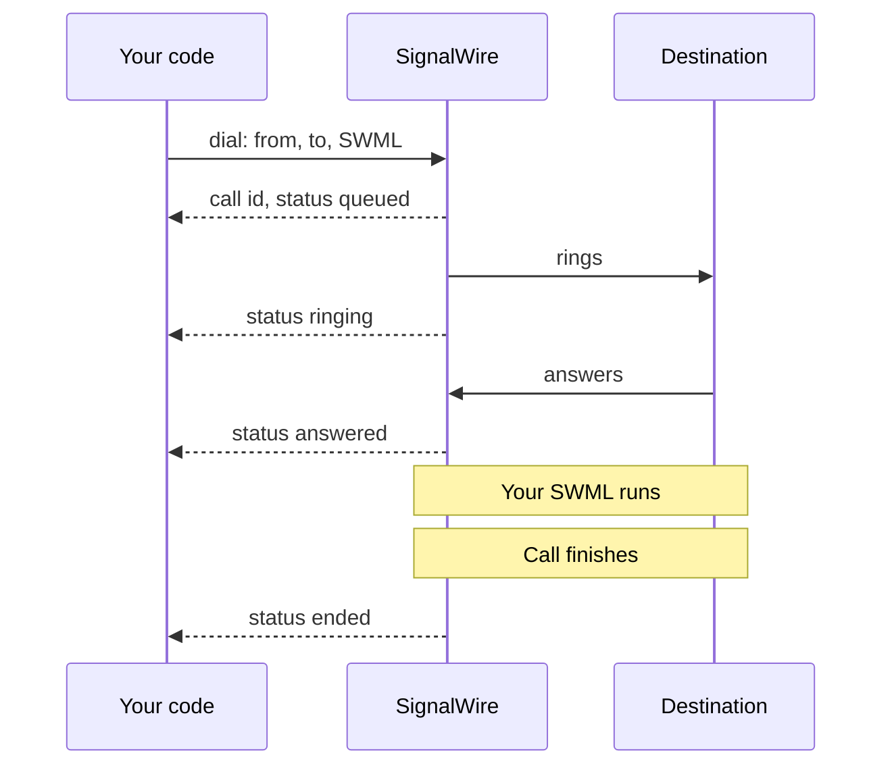
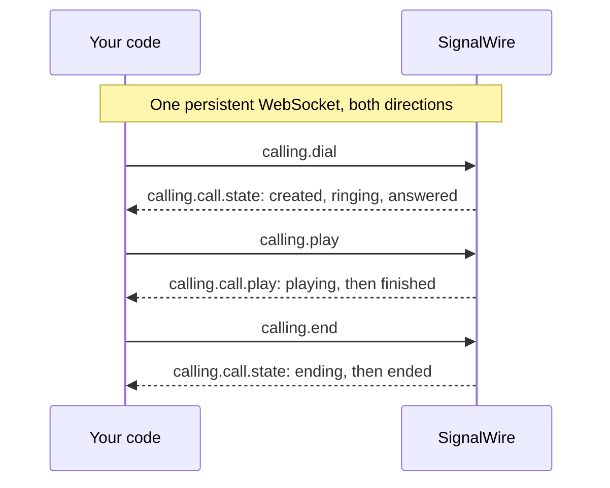

[caller-id]: /docs/platform/voice/how-to-set-caller-id-or-cnam
[verify-caller-id]: /docs/platform/voice/how-to-set-caller-id-or-cnam#verified-caller-id
[trial-mode]: /docs/platform/trial-mode
[international]: /docs/platform/how-to-enable-international-services
[api-credentials]: /docs/platform/your-signalwire-api-space
[phone-numbers]: /docs/platform/phone-numbers
[webhooks]: /docs/platform/webhooks
[swml-intro]: /docs/swml
[swml-stream]: /docs/swml/reference/calling/stream
[swml-webhook-security]: /docs/swml/guides/webhook-security
[swml-webhook-payload]: /docs/swml/reference/calling#webhook-payload
[swml-variables]: /docs/swml/reference/variables
[swml-switch]: /docs/swml/reference/calling/switch
[swml-connect]: /docs/swml/reference/calling/connect
[swml-request]: /docs/swml/reference/calling/request
[swml-record]: /docs/swml/reference/calling/record
[relay-guide]: /docs/server-sdks/guides/relay-client
[browser-sdk]: /docs/browser-sdk/v4/guides/build-voice-video
[subscriber-token]: /docs/apis/rest/subscribers/tokens/create-subscriber-token
[guest-token]: /docs/apis/rest/subscribers/tokens/create-subscriber-guest-token
[resources]: /docs/platform/resources
[subscribers]: /docs/platform/subscribers
[sip-addresses]: /docs/platform/addresses#sip-addresses
[aliases]: /docs/platform/addresses#aliases
[dial-options]: /docs/browser-sdk/v4/reference/interfaces/dial-options
[call-create-error]: /docs/browser-sdk/v4/reference/errors/call-create-error
[browser-auth]: /docs/browser-sdk/v4/guides/authentication
[browser-inbound]: /docs/browser-sdk/v4/guides/inbound-calls
[browser-register]: /docs/browser-sdk/v4/reference/signalwire/register
[browser-session-state]: /docs/browser-sdk/v4/reference/interfaces/session-state
[browser-call]: /docs/browser-sdk/v4/reference/interfaces/call
[ts-dial]: /docs/server-sdks/reference/typescript/rest/calling/dial
[py-relay-call]: /docs/server-sdks/reference/python/relay/call
[py-relay-events]: /docs/server-sdks/reference/python/relay/events
[py-swml-service]: /docs/server-sdks/reference/python/agents/swml-service
[ts-swml-service]: /docs/server-sdks/reference/typescript/agents/swml-service
[py-swml-builder]: /docs/server-sdks/reference/python/agents/swml-builder
[ts-swml-builder]: /docs/server-sdks/reference/typescript/agents/swml-builder
[py-relay-client]: /docs/server-sdks/reference/python/relay/client
[ts-relay-client]: /docs/server-sdks/reference/typescript/relay/client
[py-set-swml-webhook]: /docs/server-sdks/reference/python/rest/phone-numbers/set-swml-webhook
[ts-set-swml-webhook]: /docs/server-sdks/reference/typescript/rest/phone-numbers/set-swml-webhook
[py-set-relay-topic]: /docs/server-sdks/reference/python/rest/phone-numbers/set-relay-topic
[ts-set-relay-topic]: /docs/server-sdks/reference/typescript/rest/phone-numbers/set-relay-topic
[rest-update-number]: /docs/apis/rest/phone-numbers/update-phone-number
[rest-list-numbers]: /docs/apis/rest/phone-numbers/list-phone-numbers
[rest-link-number]: /docs/apis/rest/phone-number-addresses/create-phone-number-address
[py-create-swml-scripts]: /docs/server-sdks/reference/python/rest/fabric/swml-scripts/create
[ts-create-swml-scripts]: /docs/server-sdks/reference/typescript/rest/fabric/swml-scripts/create
[py-create-relay-applications]: /docs/server-sdks/reference/python/rest/fabric/relay-applications/create
[ts-create-relay-applications]: /docs/server-sdks/reference/typescript/rest/fabric/relay-applications/create
[py-create-subscribers]: /docs/server-sdks/reference/python/rest/fabric/subscribers/create
[ts-create-subscribers]: /docs/server-sdks/reference/typescript/rest/fabric/subscribers/create
[rest-create-subscriber]: /docs/apis/rest/subscribers/create-subscriber

Call a phone from your code, or answer when someone calls your SignalWire number. Start by picking
one of three approaches, then follow its section to call your own phone, answer a call to your
number, and track both calls.

## Pick the right product for calling

SWML, Relay, and the Browser SDK are three separate ways to build a calling app. Each has its own
code and its own kind of [Resource][resources] on your phone number, so pick one and follow only its
section: the sections don't build on each other, and code from one doesn't carry over to another.

| Function | SWML | WebSocket (Relay) | Browser SDK |
|---|---|---|---|
| Place a call from your server or a background job | <Icon icon="regular circle-check" color="var(--status-success)" /> | <Icon icon="regular circle-check" color="var(--status-success)" /> | <Icon icon="regular circle-xmark" color="var(--status-error)" /> |
| Place a call from a web page and talk on it | <Icon icon="regular circle-xmark" color="var(--status-error)" /> | <Icon icon="regular circle-xmark" color="var(--status-error)" /> | <Icon icon="regular circle-check" color="var(--status-success)" /> |
| Answer calls to your phone number | <Icon icon="regular circle-check" color="var(--status-success)" /> | <Icon icon="regular circle-check" color="var(--status-success)" /> | <Icon icon="regular circle-check" color="var(--status-success)" /> |
| Answer calls with none of your code running | <Icon icon="regular circle-check" color="var(--status-success)" /> | <Icon icon="regular circle-xmark" color="var(--status-error)" /> | <Icon icon="regular circle-xmark" color="var(--status-error)" /> |

- [SWML][swml-intro] is a document of call instructions that SignalWire runs. You build it with
  the Server SDKs, send it in a REST request to place a call, and serve it from your server or host
  it in SignalWire to answer one.
- [WebSocket (Relay)][relay-guide] is a Relay client in the Server SDKs. It holds a WebSocket open
  from your server, receives calls and events as they happen, and controls each call from your code.
- The [Browser SDK][browser-sdk] puts a person on the call from a web page, with their microphone,
  camera, and in-call controls.

## Prepare for your first call

Have these values ready:

- Your Space URL, such as `<YOUR_SPACE>.signalwire.com`.
- Your Project ID and API token from the Dashboard's [API credentials][api-credentials] page.
  Enable the token's **Voice** permission, and **Numbers** if you assign a phone number in code.
- A voice-capable [phone number in your Space][phone-numbers], and a phone you can call it from
  and answer.
- For the Browser SDK, a [Subscriber][subscribers] and a [Subscriber token][subscriber-token]
  issued by your backend for it.

<Warning title="Trial projects only call and receive calls from verified numbers">
A [trial project][trial-mode] can't call international numbers, and it only places calls to and
receives calls from numbers you've purchased or verified. To test with your own phone, verify it:
in the Dashboard, open **Phone Numbers**, then the **Verified** tab, select **+ New**, and follow
[Verified caller ID][verify-caller-id]. To remove the trial restrictions, add a payment method and
fund the account with at least $5, as [Trial mode][trial-mode] describes. Outside a trial,
[enable international dialing][international] before you call another country.
</Warning>

Replace these values in the samples you run:

| Value | Replace with |
|---|---|
| `<YOUR_SPACE>` | Your Space's subdomain in `<YOUR_SPACE>.signalwire.com` |
| `<YOUR_PROJECT_ID>` | Your Project ID |
| `<YOUR_API_TOKEN>` | Your API token, used only in server code |
| `<YOUR_CALLER_ID>` | Your SignalWire phone number, or a [verified caller ID][caller-id], in E.164 format |
| `<YOUR_DESTINATION>` | Where to call: a phone number in E.164 format such as `+12025550123`, a SIP URI such as `sip:support@example.com`, or a Resource Address such as `/private/support-rep` |
| `<YOUR_PHONE_NUMBER_ID>` | Your phone number's ID from its Dashboard page or [List phone numbers][rest-list-numbers], when you assign it in code |
| `<YOUR_BASIC_AUTH_PASSWORD>` | A password you choose for your SWML server |
| `<YOUR_PUBLIC_HOST>` | The public hostname of your SWML server or tunnel |
| `<YOUR_STATUS_WEBHOOK_URL>` | An HTTPS endpoint you control that receives call progress |
| `<YOUR_SUBSCRIBER_ACCESS_TOKEN>` | A Subscriber token issued by your backend |

## Make and receive calls via SWML

A SWML document lists what happens on the call, such as playing a message, forwarding the caller,
or recording. SignalWire runs it; your code supplies it.

### Place a call via SWML

Send a REST `dial` request with a SWML document in `swml`. SignalWire runs the document when the
destination answers.

<Steps>

<Step title="Place the call" id="place-the-call-via-swml">

<CodeBlocks>
<CodeBlock title="Python — REST client">
```python
# Install: python -m pip install signalwire-sdk==3.4.1
# Save as outbound_call.py and run: python outbound_call.py
from signalwire import SWMLBuilder, SWMLService
from signalwire.rest import RestClient

client = RestClient(
    project="<YOUR_PROJECT_ID>",
    token="<YOUR_API_TOKEN>",
    host="<YOUR_SPACE>.signalwire.com",
)

swml = (
    SWMLBuilder(SWMLService(name="outbound-call"))
    .say("Hello, welcome to SignalWire!")
    .build()
)

call = client.calling.dial(
    from_="<YOUR_CALLER_ID>",
    to="<YOUR_DESTINATION>",
    swml=swml,
)
print(call["id"])
```
</CodeBlock>
<CodeBlock title="TypeScript — REST client">
```typescript
// Install: npm install @signalwire/sdk@2.0.5
// This sample also runs as JavaScript: save as outbound-call.mjs,
// then run: node outbound-call.mjs
import { RestClient, SwmlBuilder } from "@signalwire/sdk";

const client = new RestClient({
  project: "<YOUR_PROJECT_ID>",
  token: "<YOUR_API_TOKEN>",
  host: "<YOUR_SPACE>.signalwire.com",
});

const swml = new SwmlBuilder()
  .say("Hello, welcome to SignalWire!")
  .build();

const call = await client.calling.dial({
  from: "<YOUR_CALLER_ID>",
  to: "<YOUR_DESTINATION>",
  swml,
});
console.log(call.id);
```
</CodeBlock>
<CodeBlock title="cURL — Calling API">
```bash
curl -X POST "https://<YOUR_SPACE>.signalwire.com/api/calling/calls" \
  -u "<YOUR_PROJECT_ID>:<YOUR_API_TOKEN>" \
  -H "Content-Type: application/json" \
  -d '{
    "command": "dial",
    "params": {
      "from": "<YOUR_CALLER_ID>",
      "to": "<YOUR_DESTINATION>",
      "swml": {
        "version": "1.0.0",
        "sections": {
          "main": [
            { "play": {"url": "say:Hello, welcome to SignalWire!"} }
          ]
        }
      }
    }
  }'
```
</CodeBlock>
</CodeBlocks>

<Note title="TypeScript `dial()` signature depends on the SDK version">
`@signalwire/sdk@2.0.5` takes a single options object. The [TypeScript `dial` reference][ts-dial]
documents the positional `dial(from, to, options)` form of a newer release.
</Note>

The REST API returns a call `id` and status `queued`. This confirms that SignalWire accepted the
request; the call hasn't necessarily rung or been answered yet. Save the `id` to identify this call.

<EndpointResponseSnippet endpoint="POST /api/calling/calls" />

</Step>

<Step title="Answer your phone" id="answer-your-phone-via-swml">

Answer the destination phone. You hear "Hello, welcome to SignalWire!", then the call ends.

If the phone never rings, check that `<YOUR_CALLER_ID>` is a number in your Space or a verified
caller ID, and that a trial project has verified the destination.

</Step>

</Steps>

### Answer a call via SWML

When someone calls your number, SignalWire runs the SWML Script assigned to it. The script either
fetches the document from your server on each call, or holds the document itself.

<Steps>

<Step title="Create the SWML Script" id="create-the-swml-script">

<Tabs groupId="swml-delivery">
<Tab title="From your server">

Run either server below, then expose port 3000 at a public HTTPS URL. A tunnel such as
[ngrok](https://ngrok.com/) works for development.

<CodeBlocks>
<CodeBlock title="Python — SWML builder">
```python
# Install: python -m pip install signalwire-sdk==3.4.1
# Save as inbound_swml_server.py and run: python inbound_swml_server.py
from signalwire import SWMLBuilder, SWMLService

service = SWMLService(
    name="inbound-swml-server",
    route="/swml",
    port=3000,
    basic_auth=("signalwire", "<YOUR_BASIC_AUTH_PASSWORD>"),
)
SWMLBuilder(service).say("Hello, welcome to SignalWire!")

# Serves the document at /swml. Put the credentials in the URL you give
# SignalWire: https://signalwire:<YOUR_BASIC_AUTH_PASSWORD>@<YOUR_PUBLIC_HOST>/swml
service.serve()
```
</CodeBlock>
<CodeBlock title="TypeScript — SWML builder">
```typescript
// Install: npm install @signalwire/sdk@2.0.5
// This sample also runs as JavaScript: save as inbound-swml-server.mjs,
// then run: node inbound-swml-server.mjs
import { SWMLService } from "@signalwire/sdk";

const service = new SWMLService({
  name: "inbound-swml-server",
  route: "/swml",
  port: 3000,
  basicAuth: ["signalwire", "<YOUR_BASIC_AUTH_PASSWORD>"],
});
service.getBuilder().say("Hello, welcome to SignalWire!");

// Serves the document at /swml. Put the credentials in the URL you give
// SignalWire: https://signalwire:<YOUR_BASIC_AUTH_PASSWORD>@<YOUR_PUBLIC_HOST>/swml
await service.serve();
```
</CodeBlock>
</CodeBlocks>

`SWMLService` ([Python][py-swml-service], [TypeScript][ts-swml-service]) serves the document, and
its builder ([`SWMLBuilder`][py-swml-builder], [`SwmlBuilder`][ts-swml-builder]) adds the
instructions. See [webhook security][swml-webhook-security] to verify incoming requests.

Then create the script in the Dashboard:

1. Open **My Resources**, select **+ Add**, then **Script**, then **SWML Script**.
2. Name it **Inbound welcome** and leave **Used For** set to **Calling**.
3. Under **Handle Calls Using**, choose **External URL** and enter
   `https://signalwire:<YOUR_BASIC_AUTH_PASSWORD>@<YOUR_PUBLIC_HOST>/swml` in **Primary Script URL**.
4. Select **Create** and keep the server running.

To skip these steps, assign the number in code in the next step; that creates the script too.

</Tab>
<Tab title="Hosted in SignalWire">

SignalWire stores and runs the document, so you don't start a server.

1. Open **My Resources**, select **+ Add**, then **Script**, then **SWML Script**.
2. Name it **Inbound welcome** and leave **Used For** set to **Calling**.
3. Under **Handle Calls Using**, choose **Hosted Script** and paste this document into
   **Primary Script**.
4. Select **Create**.

<CodeBlocks>
<CodeBlock title="YAML">
```yaml
version: 1.0.0
sections:
  main:
    - play:
        url: 'say:Hello, welcome to SignalWire!'
```
</CodeBlock>
<CodeBlock title="JSON">
```json
{
  "version": "1.0.0",
  "sections": {
    "main": [
      { "play": { "url": "say:Hello, welcome to SignalWire!" } }
    ]
  }
}
```
</CodeBlock>
</CodeBlocks>

To create a hosted script in code, use `fabric.swml_scripts.create` in [Python][py-create-swml-scripts]
or `fabric.swmlScripts.create` in [TypeScript][ts-create-swml-scripts].

</Tab>
</Tabs>

</Step>

<Step title="Assign the script to your phone number" id="assign-the-swml-script-to-your-number">

<Markdown src="/snippets/common/dashboard/_assign-resource-to-number.mdx" />

<Accordion title="Assign the number in code">

For a script served from your server, [`set_swml_webhook`][py-set-swml-webhook] in Python or
[`setSwmlWebhook`][ts-set-swml-webhook] in TypeScript creates the script and assigns it in one
request, replacing the number's current call handler.

<CodeBlocks>
<CodeBlock title="Python — REST client">
```python
# Install: python -m pip install signalwire-sdk==3.4.1
# Save as assign_swml_webhook.py and run: python assign_swml_webhook.py
from signalwire.rest import RestClient

client = RestClient(
    project="<YOUR_PROJECT_ID>",
    token="<YOUR_API_TOKEN>",
    host="<YOUR_SPACE>.signalwire.com",
)

client.phone_numbers.set_swml_webhook(
    "<YOUR_PHONE_NUMBER_ID>",
    "https://signalwire:<YOUR_BASIC_AUTH_PASSWORD>@<YOUR_PUBLIC_HOST>/swml",
)
```
</CodeBlock>
<CodeBlock title="TypeScript — REST client">
```typescript
// Install: npm install @signalwire/sdk@2.0.5
// This sample also runs as JavaScript: save as assign-swml-webhook.mjs,
// then run: node assign-swml-webhook.mjs
import { RestClient } from "@signalwire/sdk";

const client = new RestClient({
  project: "<YOUR_PROJECT_ID>",
  token: "<YOUR_API_TOKEN>",
  host: "<YOUR_SPACE>.signalwire.com",
});

await client.phoneNumbers.setSwmlWebhook(
  "<YOUR_PHONE_NUMBER_ID>",
  "https://signalwire:<YOUR_BASIC_AUTH_PASSWORD>@<YOUR_PUBLIC_HOST>/swml",
);
```
</CodeBlock>
<CodeBlock title="cURL — Phone Numbers API">
```bash
curl -X PUT "https://<YOUR_SPACE>.signalwire.com/api/relay/rest/phone_numbers/<YOUR_PHONE_NUMBER_ID>" \
  -u "<YOUR_PROJECT_ID>:<YOUR_API_TOKEN>" \
  -H "Content-Type: application/json" \
  -d '{
    "call_handler": "relay_script",
    "call_relay_script_url": "https://signalwire:<YOUR_BASIC_AUTH_PASSWORD>@<YOUR_PUBLIC_HOST>/swml"
  }'
```
</CodeBlock>
</CodeBlocks>

The cURL example calls [Update phone number][rest-update-number]. To attach an existing hosted
script by its ID, use [Create a phone number address][rest-link-number] with
`handler_type: "calling"`; this endpoint is in beta and requires the number to have no call
handler yet.

</Accordion>

To reach the script from a SIP client or another SignalWire app instead, give it a
[SIP Address][sip-addresses] or use its [Alias][aliases].

</Step>

<Step title="Call your number" id="call-your-number-via-swml">

Call your SignalWire number from your phone. You hear "Hello, welcome to SignalWire!", then the
call ends.

If you hear an error or silence, SignalWire couldn't run the script. For a script served from your
server, check that the server is reachable at the URL you entered, including its basic-auth
credentials. In a trial project, call from a verified number.

</Step>

</Steps>

### Track a call via SWML

To follow an outbound call, add `status_url` and `status_events` to the `dial` request in
[Place a call via SWML](#place-a-call-via-swml). SignalWire sends an HTTP POST to `status_url` as
the call reaches each state you list: `created`, `ringing`, `answered`, or `ended`. Without
`status_events`, you get `ended` only. The [webhooks guide][webhooks] covers endpoint setup and
local testing.

<CodeBlocks>
<CodeBlock title="Python — REST client">
```python {5-6}
call = client.calling.dial(
    from_="<YOUR_CALLER_ID>",
    to="<YOUR_DESTINATION>",
    swml=swml,
    status_url="<YOUR_STATUS_WEBHOOK_URL>",
    status_events=["ringing", "answered", "ended"],
)
```
</CodeBlock>
<CodeBlock title="TypeScript — REST client">
```typescript {5-6}
const call = await client.calling.dial({
  from: "<YOUR_CALLER_ID>",
  to: "<YOUR_DESTINATION>",
  swml,
  status_url: "<YOUR_STATUS_WEBHOOK_URL>",
  status_events: ["ringing", "answered", "ended"],
});
```
</CodeBlock>
<CodeBlock title="cURL — Calling API">
```bash {15-16}
curl -X POST "https://<YOUR_SPACE>.signalwire.com/api/calling/calls" \
  -u "<YOUR_PROJECT_ID>:<YOUR_API_TOKEN>" \
  -H "Content-Type: application/json" \
  -d '{
    "command": "dial",
    "params": {
      "from": "<YOUR_CALLER_ID>",
      "to": "<YOUR_DESTINATION>",
      "swml": {
        "version": "1.0.0",
        "sections": {
          "main": [{ "play": {"url": "say:Hello, welcome to SignalWire!"} }]
        }
      },
      "status_url": "<YOUR_STATUS_WEBHOOK_URL>",
      "status_events": ["ringing", "answered", "ended"]
    }
  }'
```
</CodeBlock>
</CodeBlocks>

<llms-ignore>


</llms-ignore>

<llms-only>


```mermaid
sequenceDiagram
    participant App as Your code
    participant SW as SignalWire
    participant Dest as Destination

    App->>SW: dial: from, to, SWML
    SW-->>App: call id, status queued
    SW->>Dest: rings
    SW-->>App: status ringing
    Dest->>SW: answers
    SW-->>App: status answered
    Note over SW,Dest: Your SWML runs
    Note over SW,Dest: Call finishes
    SW-->>App: status ended
```

</llms-only>

For an inbound call, the request SignalWire sends your server carries the call in its `call`
object: `from`, `to`, `direction`, and `call_id` (see the
[webhook payload reference][swml-webhook-payload]). The same fields are available inside any SWML
document as [variables][swml-variables]. To read the caller's number back, replace the greeting
with this one:

<CodeBlocks>
<CodeBlock title="Python — SWML builder">
```python
SWMLBuilder(service).say("Thanks for calling from ${call.from}.")
```
</CodeBlock>
<CodeBlock title="TypeScript — SWML builder">
```typescript
service.getBuilder().say("Thanks for calling from ${call.from}.");
```
</CodeBlock>
<CodeBlock title="YAML">
```yaml
version: 1.0.0
sections:
  main:
    - play:
        url: 'say:Thanks for calling from ${call.from}.'
```
</CodeBlock>
<CodeBlock title="JSON">
```json
{
  "version": "1.0.0",
  "sections": {
    "main": [
      { "play": { "url": "say:Thanks for calling from ${call.from}." } }
    ]
  }
}
```
</CodeBlock>
</CodeBlocks>

A SWML document can also fetch data mid-call with [`request`][swml-request] and branch on the
result with [`switch`][swml-switch]. Methods such as [`record`][swml-record],
[`connect`][swml-connect], and [`stream`][swml-stream] take their own `status_url` to report
their progress.

## Make and receive calls via WebSocket (Relay)

A Relay client runs on your server and holds a WebSocket connection to SignalWire. It receives
calls and events on that connection and sends commands back, so it needs no public HTTP endpoint.

### Place a call via WebSocket (Relay)

<Steps>

<Step title="Place the call" id="place-the-call-via-relay">

Run either program below. It dials the destination, plays a message once the call is answered, and
hangs up.

<CodeBlocks>
<CodeBlock title="Python — Relay client">
```python
# Install: python -m pip install signalwire-sdk==3.4.1
# Save as outbound_relay.py and run: python outbound_relay.py
import asyncio
from signalwire.relay import RelayClient

client = RelayClient(
    project="<YOUR_PROJECT_ID>",
    token="<YOUR_API_TOKEN>",
    contexts=["default"],
)

async def main():
    async with client:
        call = await client.dial(
            devices=[[{
                "type": "phone",
                "params": {
                    "from_number": "<YOUR_CALLER_ID>",
                    "to_number": "<YOUR_DESTINATION>",
                    "timeout": 30,
                },
            }]],
        )
        async def hang_up_after_playback(_event):
            if call.state != "ended":
                await call.hangup()

        await call.play([{
            "type": "tts",
            "params": {"text": "Hello, welcome to SignalWire!"},
        }], on_completed=hang_up_after_playback)
        await call.wait_for_ended()

asyncio.run(main())
```
</CodeBlock>
<CodeBlock title="TypeScript — Relay client">
```typescript
// Install: npm install @signalwire/sdk@2.0.5
// This sample also runs as JavaScript: save as outbound-relay.mjs,
// then run: node outbound-relay.mjs
import { RelayClient } from "@signalwire/sdk";

const client = new RelayClient({
  project: "<YOUR_PROJECT_ID>",
  token: "<YOUR_API_TOKEN>",
  contexts: ["default"],
});

await client.connect();

try {
  const call = await client.dial([[{
    type: "phone",
    params: {
      from_number: "<YOUR_CALLER_ID>",
      to_number: "<YOUR_DESTINATION>",
      timeout: 30,
    },
  }]]);
  await call.play([
    { type: "tts", text: "Hello, welcome to SignalWire!" },
  ], {
    onCompleted: async () => {
      if (call.state !== "ended") await call.hangup();
    },
  });
  await call.waitForEnded();
} finally {
  await client.disconnect();
}
```
</CodeBlock>
</CodeBlocks>

</Step>

<Step title="Answer your phone" id="answer-your-phone-via-relay">

Answer the destination phone. You hear "Hello, welcome to SignalWire!", then the call ends.

If the phone never rings, check that `<YOUR_CALLER_ID>` is a number in your Space or a verified
caller ID, and that a trial project has verified the destination.

</Step>

</Steps>

### Answer a call via WebSocket (Relay)

A Relay client receives calls for the topics in its `contexts`. A Relay Application Resource on
your phone number sends the number's calls to one topic.

<Steps>

<Step title="Run the call handler" id="run-the-relay-call-handler">

Run either handler below and leave it running while you test. It receives calls on the
`inbound-calling` topic, answers, plays the message, and hangs up.

<CodeBlocks>
<CodeBlock title="Python — Relay client">
```python
# Install: python -m pip install signalwire-sdk==3.4.1
# Save as inbound_relay.py and run: python inbound_relay.py
from signalwire.relay import RelayClient

client = RelayClient(
    project="<YOUR_PROJECT_ID>",
    token="<YOUR_API_TOKEN>",
    contexts=["inbound-calling"],
)

@client.on_call
async def handle_call(call):
    await call.answer()

    async def hang_up_after_playback(_event):
        if call.state != "ended":
            await call.hangup()

    await call.play([{
        "type": "tts",
        "params": {"text": "Hello, welcome to SignalWire!"},
    }], on_completed=hang_up_after_playback)
    await call.wait_for_ended()

client.run()
```
</CodeBlock>
<CodeBlock title="TypeScript — Relay client">
```typescript
// Install: npm install @signalwire/sdk@2.0.5
// This sample also runs as JavaScript: save as inbound-relay.mjs,
// then run: node inbound-relay.mjs
import { RelayClient } from "@signalwire/sdk";

const client = new RelayClient({
  project: "<YOUR_PROJECT_ID>",
  token: "<YOUR_API_TOKEN>",
  contexts: ["inbound-calling"],
});

client.onCall(async (call) => {
  await call.answer();
  await call.play([
    { type: "tts", text: "Hello, welcome to SignalWire!" },
  ], {
    onCompleted: async () => {
      if (call.state !== "ended") await call.hangup();
    },
  });
  await call.waitForEnded();
});

await client.run();
```
</CodeBlock>
</CodeBlocks>

See the [Python][py-relay-client] or [TypeScript][ts-relay-client] Relay client reference for more
configuration options.

</Step>

<Step title="Assign the topic to your phone number" id="assign-the-relay-topic-to-your-number">

Create a Relay Application for the topic:

1. Open **My Resources**, select **+ Add**, then **Relay Application**.
2. Name it **Inbound welcome** and enter `inbound-calling` as the **Topic**. It must match the
   `contexts` value in your code.
3. Select **Create**.

<Markdown src="/snippets/common/dashboard/_assign-resource-to-number.mdx" />

<Accordion title="Assign the number in code">

[`set_relay_topic`][py-set-relay-topic] in Python or [`setRelayTopic`][ts-set-relay-topic] in
TypeScript creates the Relay Application and assigns it in one request, replacing the number's
current call handler. To create the Relay Application on its own, use the
[Python][py-create-relay-applications] or [TypeScript][ts-create-relay-applications] SDK.

<CodeBlocks>
<CodeBlock title="Python — REST client">
```python
# Install: python -m pip install signalwire-sdk==3.4.1
# Save as assign_relay_topic.py and run: python assign_relay_topic.py
from signalwire.rest import RestClient

client = RestClient(
    project="<YOUR_PROJECT_ID>",
    token="<YOUR_API_TOKEN>",
    host="<YOUR_SPACE>.signalwire.com",
)

client.phone_numbers.set_relay_topic("<YOUR_PHONE_NUMBER_ID>", "inbound-calling")
```
</CodeBlock>
<CodeBlock title="TypeScript — REST client">
```typescript
// Install: npm install @signalwire/sdk@2.0.5
// This sample also runs as JavaScript: save as assign-relay-topic.mjs,
// then run: node assign-relay-topic.mjs
import { RestClient } from "@signalwire/sdk";

const client = new RestClient({
  project: "<YOUR_PROJECT_ID>",
  token: "<YOUR_API_TOKEN>",
  host: "<YOUR_SPACE>.signalwire.com",
});

await client.phoneNumbers.setRelayTopic("<YOUR_PHONE_NUMBER_ID>", { topic: "inbound-calling" });
```
</CodeBlock>
<CodeBlock title="cURL — Phone Numbers API">
```bash
curl -X PUT "https://<YOUR_SPACE>.signalwire.com/api/relay/rest/phone_numbers/<YOUR_PHONE_NUMBER_ID>" \
  -u "<YOUR_PROJECT_ID>:<YOUR_API_TOKEN>" \
  -H "Content-Type: application/json" \
  -d '{
    "call_handler": "relay_topic",
    "call_relay_topic": "inbound-calling"
  }'
```
</CodeBlock>
</CodeBlocks>

</Accordion>

To reach the handler from a SIP client or another SignalWire app instead, give the Relay
Application a [SIP Address][sip-addresses] or use its [Alias][aliases].

</Step>

<Step title="Call your number" id="call-your-number-via-relay">

Call your SignalWire number from your phone. You hear "Hello, welcome to SignalWire!", then the
call ends.

If the call fails or never reaches your code, check that the client is still running and that its
`contexts` value matches the Relay Application's topic. In a trial project, call from a verified
number.

</Step>

</Steps>

### Track a call via WebSocket (Relay)

Relay reports call state through `call.on()`. Add a `calling.call.state` listener to either
first-run program, right after it gets the `call`, to see states such as `answered`, `ending`, and
`ended`, with the `end_reason` once the call finishes. An outbound `dial()` returns after the
destination answers, so there the listener sees `ending` and `ended`.

<CodeBlocks>
<CodeBlock title="Python — Relay client">
```python
from signalwire.relay.event import CallStateEvent

def handle_state(event: CallStateEvent):
    print(f"State: {event.call_state}, reason: {event.end_reason}")

call.on("calling.call.state", handle_state)
```
</CodeBlock>
<CodeBlock title="TypeScript — Relay client">
```typescript
call.on("calling.call.state", (event) => {
  console.log(`State: ${event.params.call_state}, reason: ${event.params.end_reason ?? ""}`);
});
```
</CodeBlock>
</CodeBlocks>

On an inbound call, the [`Call`][py-relay-call] object also carries the caller in `device`, with
`direction` and `call_id`: in Python, `call.device.get("params", {}).get("from_number")`; in
TypeScript, `call.device?.params?.from_number`.

This flow shows an outbound call's commands and events on the shared connection:

<llms-ignore>


</llms-ignore>

<llms-only>


```mermaid
sequenceDiagram
    participant App as Your code
    participant SW as SignalWire

    Note over App,SW: One persistent WebSocket, both directions
    App->>SW: calling.dial
    SW-->>App: calling.call.state: created, ringing, answered
    App->>SW: calling.play
    SW-->>App: calling.call.play: playing, then finished
    App->>SW: calling.end
    SW-->>App: calling.call.state: ending, then ended
```

</llms-only>

For more handlers, see
[Event listeners in the Relay client guide](/docs/server-sdks/guides/relay-client#event-listeners)
and the [events reference][py-relay-events].

## Make and receive calls in the browser

The Browser SDK signs a web page in as a [Subscriber][subscribers], so a person places and answers
calls from the page with their own microphone and speakers. The page authenticates with a
[Subscriber token][subscriber-token] from your backend, never your API token; the
[authentication guide][browser-auth] shows how to fetch one.

### Place a call from a browser

<Steps>

<Step title="Run the page" id="run-the-calling-page">

Load this script on a page served over HTTPS or `localhost`, with the elements listed in its
comments. A page that only places calls can use a [guest token][guest-token] instead of a
Subscriber token. To add the camera, pass `video: true`; [`DialOptions`][dial-options] lists every
media option.

```javascript title="JavaScript — Browser SDK"
// Install: npm install @signalwire/js@4.0.0-rc.2 rxjs@7.8.2
// Load as a module script on an HTTPS or localhost page with these elements:
// <audio id="remote-audio" autoplay></audio>
// <button id="call" type="button">Call</button>
// <button id="hangup" type="button" disabled>Hang up</button>
// Use a Subscriber Access Token issued by your backend.
import { SignalWire, StaticCredentialProvider } from "@signalwire/js";

const client = new SignalWire(new StaticCredentialProvider({
  token: "<YOUR_SUBSCRIBER_ACCESS_TOKEN>",
}));
const remoteAudio = document.querySelector("#remote-audio");
const callButton = document.querySelector("#call");
const hangupButton = document.querySelector("#hangup");

callButton.onclick = async () => {
  callButton.disabled = true;
  try {
    const call = await client.dial("<YOUR_DESTINATION>", { audio: true, video: false });
    call.remoteStream$.subscribe((stream) => (remoteAudio.srcObject = stream));
    hangupButton.disabled = false;
    hangupButton.onclick = () => {
      void call.hangup().catch(console.error);
    };
    call.status$.subscribe((status) => {
      if (status === "disconnected" || status === "failed" || status === "destroyed") {
        remoteAudio.srcObject = null;
        hangupButton.disabled = true;
        callButton.disabled = false;
      }
    });
  } catch (error) {
    callButton.disabled = false;
    console.error(error);
  }
};
```

</Step>

<Step title="Call and talk" id="call-and-talk-from-the-browser">

Select **Call**, allow microphone access, and answer the destination phone. You hear each other.
Select **Hang up** when you finish.

If `dial()` rejects with [`CallCreateError`][call-create-error], the token's scope doesn't reach
the destination.

</Step>

</Steps>

### Answer a call in a browser

Assign the Subscriber to your phone number, and calls to the number ring the page signed in as
that Subscriber.

<Steps>

<Step title="Run the page" id="run-the-answering-page">

Create a Subscriber with the [Python][py-create-subscribers] or
[TypeScript][ts-create-subscribers] SDK, or the [Subscribers REST endpoint][rest-create-subscriber],
then issue a Subscriber token with that Subscriber's `reference`.

<Warning title="Receiving calls in the browser requires a Subscriber token">
Guest and embed tokens only place calls. The page must sign in as the Subscriber that receives
the call.
</Warning>

Load this script on a page served over HTTPS or `localhost`, with the elements listed in its
comments. The page shows who is calling and lets you answer, decline, or hang up.

```javascript title="JavaScript — Browser SDK"
// Install: npm install @signalwire/js@4.0.0-rc.2 rxjs@7.8.2
// Load as a module script on an HTTPS or localhost page with these elements:
// <p id="status">Offline</p>
// <p id="caller"></p>
// <audio id="remote-audio" autoplay></audio>
// <button id="answer" type="button" disabled>Answer</button>
// <button id="decline" type="button" disabled>Decline</button>
// <button id="hangup" type="button" disabled>Hang up</button>
// Use a Subscriber Access Token issued by your backend for the Subscriber
// that the phone number rings.
import { SignalWire, StaticCredentialProvider } from "@signalwire/js";

const client = new SignalWire(new StaticCredentialProvider({
  token: "<YOUR_SUBSCRIBER_ACCESS_TOKEN>",
}));
const statusLine = document.querySelector("#status");
const callerLine = document.querySelector("#caller");
const remoteAudio = document.querySelector("#remote-audio");
const answerButton = document.querySelector("#answer");
const declineButton = document.querySelector("#decline");
const hangupButton = document.querySelector("#hangup");
const finalStatuses = new Set(["disconnected", "failed", "destroyed"]);

let currentCall = null;

await client.register();
statusLine.textContent = "Online";

client.session.incomingCalls$.subscribe((calls) => {
  const ringing = calls.find((call) => call.status === "ringing");
  if (!ringing || ringing === currentCall) return;
  currentCall = ringing;
  callerLine.textContent = `Incoming call from ${ringing.from}`;
  answerButton.disabled = false;
  declineButton.disabled = false;

  ringing.remoteStream$.subscribe((stream) => (remoteAudio.srcObject = stream));
  ringing.status$.subscribe((status) => {
    statusLine.textContent = status;
    if (status !== "ringing") {
      answerButton.disabled = true;
      declineButton.disabled = true;
    }
    if (status === "connected") hangupButton.disabled = false;
    if (finalStatuses.has(status)) {
      remoteAudio.srcObject = null;
      hangupButton.disabled = true;
      callerLine.textContent = "";
      if (currentCall === ringing) currentCall = null;
    }
  });
});

answerButton.onclick = () => {
  void currentCall?.answer({ audio: true, video: false });
};
declineButton.onclick = () => {
  void currentCall?.reject();
};
hangupButton.onclick = () => {
  void currentCall?.hangup().catch(console.error);
};
```

Awaiting [`register()`][browser-register] puts the page online. Keep it open while you test.

</Step>

<Step title="Assign the Subscriber to your phone number" id="assign-the-subscriber-to-your-number">

<Markdown src="/snippets/common/dashboard/_assign-resource-to-number.mdx" />

</Step>

<Step title="Call your number and answer" id="call-your-number-and-answer-in-the-browser">

Call your SignalWire number from your phone. The page shows the incoming call. Select **Answer**,
allow microphone access, and select **Hang up** when you finish.

If the page never rings, check that the number is assigned to the Subscriber the token was issued
for, and that the page still shows **Online**.

</Step>

</Steps>

The Browser SDK [inbound calls guide][browser-inbound] builds a complete receiver page, including
two callers ringing at once.

### Track a call in a browser

Each call exposes its status on `status$`. An outbound `dial()` returns the call while it is
`ringing`; it then moves through `connecting` and `connected`, and through `disconnecting`,
`disconnected`, and `destroyed` once it ends. Treat `disconnected`, `failed`, and `destroyed` as
final, as both pages above do, and one subscription updates the page for every outcome. An inbound
call that leaves `ringing` without reaching `connected` was declined, or the caller hung up.

Each entry in [`incomingCalls$`][browser-session-state] is a [`Call`][browser-call] with
`direction` set to `inbound`. Read `from` for the caller's number or Address, `to` for the number
or Address they dialed, and `fromName` for a display name. SignalWire sends `_undef_` as
`fromName` when the caller supplied none, so fall back to `from`.

## Next steps

<CardGroup cols={2}>

<Card title="Send reminder calls" href="/docs/platform/voice/send-reminder-calls" icon="regular voicemail">
  Detect voicemail and leave a message, or speak to the person who answers.
</Card>

<Card title="Forward calls" href="/docs/platform/voice/forward-calls" icon="regular phone-arrow-right">
  Ring a dispatcher from your business number and take a voicemail if nobody answers.
</Card>

<Card title="SWML calling reference" href="/docs/swml/reference/calling" icon="regular file-code">
  Document structure, webhook payload, variables, and every calling method.
</Card>

<Card title="Relay client guide" href="/docs/server-sdks/guides/relay-client" icon="regular server">
  Authentication, contexts, inbound and outbound calls, and call control methods.
</Card>

<Card title="Browser SDK inbound calls" href="/docs/browser-sdk/v4/guides/inbound-calls" icon="regular browser">
  Build a full receiver, handle two callers ringing at once, and test from the REST API.
</Card>

<Card title="Resource Addresses" href="/docs/platform/addresses" icon="regular address-book">
  Address types, contexts, and how SignalWire routes a call to the right Resource.
</Card>

</CardGroup>
