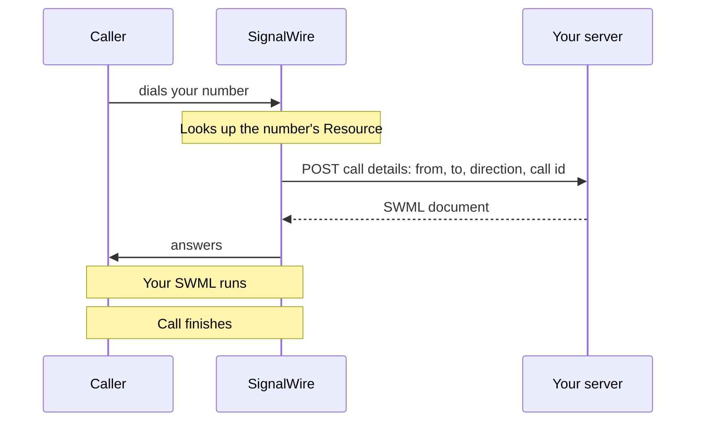
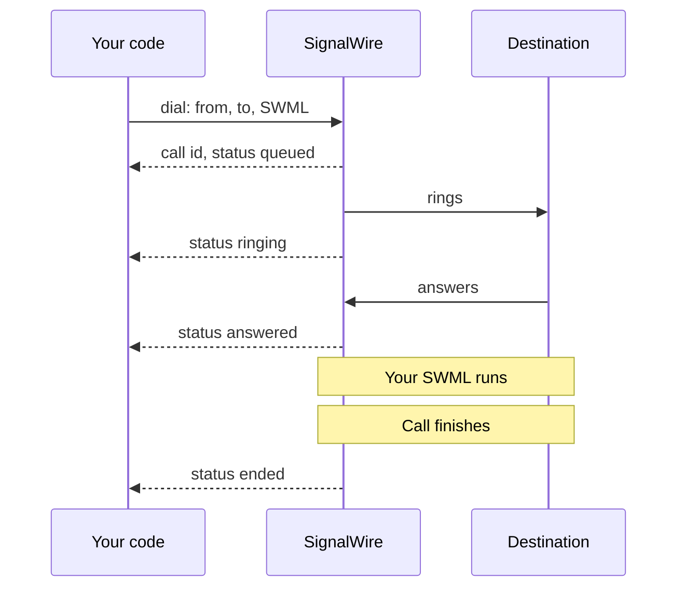
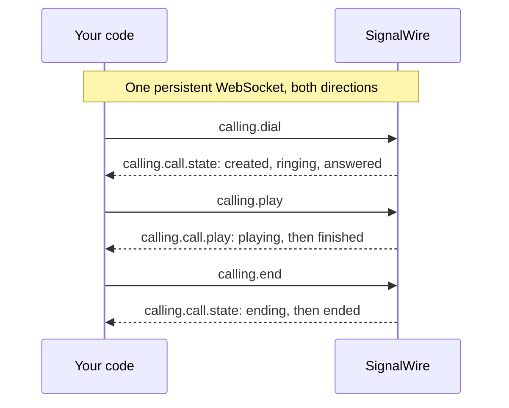

[caller-id]: /docs/platform/voice/how-to-set-caller-id-or-cnam
[verify-caller-id]: /docs/platform/voice/how-to-set-caller-id-or-cnam#verified-caller-id
[trial-mode]: /docs/platform/trial-mode
[international]: /docs/platform/how-to-enable-international-services
[api-credentials]: /docs/platform/your-signalwire-api-space
[phone-numbers]: /docs/platform/phone-numbers
[webhooks]: /docs/platform/webhooks
[swml-intro]: /docs/swml
[swml-stream]: /docs/swml/reference/calling/stream
[swml-webhook-security]: /docs/swml/guides/webhook-security
[swml-webhook-payload]: /docs/swml/reference/calling#webhook-payload
[swml-variables]: /docs/swml/reference/variables
[swml-switch]: /docs/swml/reference/calling/switch
[swml-connect]: /docs/swml/reference/calling/connect
[swml-request]: /docs/swml/reference/calling/request
[swml-record]: /docs/swml/reference/calling/record
[relay-guide]: /docs/server-sdks/guides/relay-client
[server-sdks]: /docs/server-sdks
[browser-sdk]: /docs/browser-sdk/v4/guides/build-voice-video
[subscriber-token]: /docs/apis/rest/subscribers/tokens/create-subscriber-token
[guest-token]: /docs/apis/rest/subscribers/tokens/create-subscriber-guest-token
[resources]: /docs/platform/resources
[subscribers]: /docs/platform/subscribers
[sip-addresses]: /docs/platform/addresses#sip-addresses
[aliases]: /docs/platform/addresses#aliases
[dial-options]: /docs/browser-sdk/v4/reference/interfaces/dial-options
[call-create-error]: /docs/browser-sdk/v4/reference/errors/call-create-error
[browser-auth]: /docs/browser-sdk/v4/guides/authentication
[browser-inbound]: /docs/browser-sdk/v4/guides/inbound-calls
[browser-register]: /docs/browser-sdk/v4/reference/signalwire/register
[browser-session-state]: /docs/browser-sdk/v4/reference/interfaces/session-state
[browser-call]: /docs/browser-sdk/v4/reference/interfaces/call
[rest-update-number]: /docs/apis/rest/phone-numbers/update-phone-number
[rest-call-commands]: /docs/apis/rest/calls/call-commands
[rest-list-numbers]: /docs/apis/rest/phone-numbers/list-phone-numbers
[rest-link-number]: /docs/apis/rest/phone-number-addresses/create-phone-number-address
[rest-create-subscriber]: /docs/apis/rest/subscribers/create-subscriber

Place calls to phones and answer calls to your SignalWire number with SWML, Relay, or the Browser
SDK. Each section below takes one of them from a first test call on your own phone through
tracking the call's progress.

## Choose an approach

Each approach has its own code and its own kind of [Resource][resources] on your phone number, so
pick one and follow only its section. The sections don't build on each other, and code from one
doesn't carry over to another.

- [SWML][swml-intro] is a document of call instructions that SignalWire runs. You build it with the
  Server SDKs and send it in a REST request to place a call. To answer one, serve it from your
  server or host it in SignalWire, which needs none of your code running.
- [WebSocket (Relay)][relay-guide] is a Relay client in the Server SDKs. It holds a WebSocket open
  from your server, receives calls and events as they happen, and controls each call from your code.
- The [Browser SDK][browser-sdk] puts a person on the call from a web page, with their microphone,
  camera, and in-call controls.

## Prepare for your first call

Have these values ready:

- Your Space URL, such as `<YOUR_SPACE>.signalwire.com`.
- Your Project ID and API token from the Dashboard's [API credentials][api-credentials] page.
  Enable the token's **Voice** permission, and **Numbers** if you assign a phone number in code.
- A voice-capable [phone number in your Space][phone-numbers], and a phone you can call it from
  and answer.
- For the Browser SDK, a web page you can serve over HTTPS or `localhost`. The guide creates the
  [Subscriber][subscribers] and its token for you.

<Warning title="Trial projects only call and receive calls from verified numbers">
A [trial project][trial-mode] can't call international numbers, and it only places calls to and
receives calls from numbers you've purchased or verified. To test with your own phone, verify it:
in the Dashboard, open **Phone Numbers**, then the **Verified** tab, select **+ New**, and follow
[Verified caller ID][verify-caller-id]. To remove the trial restrictions, add a payment method and
fund the account with at least $5, as [Trial mode][trial-mode] describes. Outside a trial,
[enable international dialing][international] before you call another country.
</Warning>

Replace these values in the samples you run:

| Value | Replace with |
|---|---|
| `<YOUR_SPACE>` | Your Space's subdomain in `<YOUR_SPACE>.signalwire.com` |
| `<YOUR_PROJECT_ID>` | Your Project ID |
| `<YOUR_API_TOKEN>` | Your API token, used only in server code |
| `<YOUR_CALLER_ID>` | Your SignalWire phone number, or a [verified caller ID][caller-id], in E.164 format |
| `<YOUR_DESTINATION>` | Where to call: a phone number in E.164 format such as `+12025550123`, a SIP URI such as `sip:support@example.com`, or a Resource Address such as `/private/support-rep` |
| `<YOUR_PHONE_NUMBER_ID>` | Your phone number's ID from its Dashboard page or [List phone numbers][rest-list-numbers], when you assign it in code |
| `<YOUR_BASIC_AUTH_PASSWORD>` | A password you choose for your SWML server |
| `<YOUR_PUBLIC_HOST>` | The public hostname of your SWML server or tunnel |
| `<YOUR_STATUS_WEBHOOK_URL>` | An HTTPS endpoint you control that receives call progress |
| `<YOUR_SUBSCRIBER_EMAIL>` | An email address to identify your test Subscriber |
| `<YOUR_SUBSCRIBER_ACCESS_TOKEN>` | The Subscriber token from [Get a Subscriber token](#get-a-subscriber-token) |

## How an incoming call reaches your code

Placing a call only takes a request from your code. Answering one takes a little setup first,
because SignalWire has to know where to send the call. Every phone number has one call handler: a
[Resource][resources] you assign under the number's **Inbound Call Settings**. When someone dials
the number, SignalWire hands the call to that Resource, and the Resource type decides what happens
next:

| Approach | Resource on the number | What happens when a call arrives |
|---|---|---|
| SWML | SWML Script | SignalWire runs the script's document, first fetching it from your server when the script points at a URL |
| WebSocket (Relay) | Relay Application | SignalWire hands the call to the Relay client connected on the application's topic |
| Browser SDK | Subscriber | SignalWire rings the Subscriber's signed-in clients, such as your web page |

So each answering walkthrough below has the same three parts: build the handler, assign it to your
number, and call the number to test it. If the number has no call handler, or still points at a
different Resource, the call never reaches your code.

## Make and receive calls via SWML

A SWML document lists what happens on the call, such as playing a message, forwarding the caller,
or recording. SignalWire runs it; your code supplies it.

### Place a call via SWML

Send a REST `dial` request with a SWML document in `swml`. SignalWire runs the document when the
destination answers.

<Steps>

<Step title="Place the call" id="place-the-call-via-swml">

<CodeBlocks>
<CodeBlock title="Python — REST client">
```python
# Install: python -m pip install signalwire-sdk==3.4.1
# Save as outbound_call.py and run: python outbound_call.py
from signalwire import SWMLBuilder, SWMLService
from signalwire.rest import RestClient

client = RestClient(
    project="<YOUR_PROJECT_ID>",
    token="<YOUR_API_TOKEN>",
    host="<YOUR_SPACE>.signalwire.com",
)

swml = (
    SWMLBuilder(SWMLService(name="outbound-call"))
    .say("Hello, welcome to SignalWire!")
    .build()
)

call = client.calling.dial(
    from_="<YOUR_CALLER_ID>",
    to="<YOUR_DESTINATION>",
    swml=swml,
)
print(call["id"])
```
</CodeBlock>
<CodeBlock title="TypeScript — REST client">
```typescript
// Install: npm install @signalwire/sdk@2.0.5
// This sample also runs as JavaScript: save as outbound-call.mjs,
// then run: node outbound-call.mjs
import { RestClient, SwmlBuilder } from "@signalwire/sdk";

const client = new RestClient({
  project: "<YOUR_PROJECT_ID>",
  token: "<YOUR_API_TOKEN>",
  host: "<YOUR_SPACE>.signalwire.com",
});

const swml = new SwmlBuilder()
  .say("Hello, welcome to SignalWire!")
  .build();

const call = await client.calling.dial({
  from: "<YOUR_CALLER_ID>",
  to: "<YOUR_DESTINATION>",
  swml,
});
console.log(call.id);
```
</CodeBlock>
<CodeBlock title="cURL — Calling API">
```bash
curl -X POST "https://<YOUR_SPACE>.signalwire.com/api/calling/calls" \
  -u "<YOUR_PROJECT_ID>:<YOUR_API_TOKEN>" \
  -H "Content-Type: application/json" \
  -d '{
    "command": "dial",
    "params": {
      "from": "<YOUR_CALLER_ID>",
      "to": "<YOUR_DESTINATION>",
      "swml": {
        "version": "1.0.0",
        "sections": {
          "main": [
            { "play": {"url": "say:Hello, welcome to SignalWire!"} }
          ]
        }
      }
    }
  }'
```
</CodeBlock>
</CodeBlocks>

<Note title="`dial()` signature depends on the SDK version">
`@signalwire/sdk@2.0.5` takes a single options object. Newer releases take the positional
`dial(from, to, options)` form.
</Note>

The cURL example sends the `dial` command to [Call commands][rest-call-commands].

The REST API returns a call `id` and status `queued`. This confirms that SignalWire accepted the
request; the call hasn't necessarily rung or been answered yet. Save the `id` to identify this call.

<EndpointResponseSnippet endpoint="POST /api/calling/calls" />

</Step>

<Step title="Answer your phone" id="answer-your-phone-via-swml">

Answer the destination phone. You hear "Hello, welcome to SignalWire!", then the call ends.

If the phone never rings, check that `<YOUR_CALLER_ID>` is a number in your Space or a verified
caller ID, and that a trial project has verified the destination.

</Step>

</Steps>

### Answer a call via SWML

When someone calls your number, SignalWire runs the SWML Script assigned to it. The script either
fetches the document from your server on each call, or holds the document itself. Hosting it in
SignalWire is the quickest way to hear your first call; serving it from your server lets your code
build a different document for each caller.

This flow shows a call handled by a script that fetches its document from your server:

<llms-ignore>


</llms-ignore>

<llms-only>


```mermaid
sequenceDiagram
    participant Caller
    participant SW as SignalWire
    participant Server as Your server

    Caller->>SW: dials your number
    Note over SW: Looks up the number's Resource
    SW->>Server: POST call details: from, to, direction, call id
    Server-->>SW: SWML document
    SW->>Caller: answers
    Note over Caller,SW: Your SWML runs
    Note over Caller,SW: Call finishes
```

</llms-only>

<Steps>

<Step title="Create the SWML Script" id="create-the-swml-script">

<Tabs groupId="swml-delivery">
<Tab title="From your server">

SignalWire must reach your server over the internet, so this tab has four parts: run the
server, give it a public URL, check the URL, then create the script that points at it.

Run either server below. It answers requests on port 3000 at `/swml`, but only when they carry
the username `signalwire` and the password you set. SignalWire sends those credentials from the
URL you give it, so no one else can fetch your call instructions.

<CodeBlocks>
<CodeBlock title="Python — SWML builder">
```python
# Install: python -m pip install signalwire-sdk==3.4.1
# Save as inbound_swml_server.py and run: python inbound_swml_server.py
from signalwire import SWMLBuilder, SWMLService

service = SWMLService(
    name="inbound-swml-server",
    route="/swml",
    port=3000,
    basic_auth=("signalwire", "<YOUR_BASIC_AUTH_PASSWORD>"),
)
SWMLBuilder(service).say("Hello, welcome to SignalWire!")

# Serves the document at /swml. Put the credentials in the URL you give
# SignalWire: https://signalwire:<YOUR_BASIC_AUTH_PASSWORD>@<YOUR_PUBLIC_HOST>/swml
service.serve()
```
</CodeBlock>
<CodeBlock title="TypeScript — SWML builder">
```typescript
// Install: npm install @signalwire/sdk@2.0.5
// This sample also runs as JavaScript: save as inbound-swml-server.mjs,
// then run: node inbound-swml-server.mjs
import { SWMLService } from "@signalwire/sdk";

const service = new SWMLService({
  name: "inbound-swml-server",
  route: "/swml",
  port: 3000,
  basicAuth: ["signalwire", "<YOUR_BASIC_AUTH_PASSWORD>"],
});
service.getBuilder().say("Hello, welcome to SignalWire!");

// Serves the document at /swml. Put the credentials in the URL you give
// SignalWire: https://signalwire:<YOUR_BASIC_AUTH_PASSWORD>@<YOUR_PUBLIC_HOST>/swml
await service.serve();
```
</CodeBlock>
</CodeBlocks>

The [Server SDKs][server-sdks] serve the document with `SWMLService` and add the instructions
through its SWML builder.

While you develop, give the server a public HTTPS URL with a tunnel such as
[ngrok](https://ngrok.com/). In a second terminal, run:

```bash
ngrok http 3000
```

ngrok prints an `https://` **Forwarding** URL. Its hostname is your `<YOUR_PUBLIC_HOST>`. Keep
both the server and ngrok running while you test. A new tunnel usually means a new hostname, so
update the script's URL whenever it changes.

Check that the document is reachable before you point a number at it:

```bash
curl -u "signalwire:<YOUR_BASIC_AUTH_PASSWORD>" "https://<YOUR_PUBLIC_HOST>/swml"
```

The response is the SWML document, starting with `{"version": "1.0.0"`. A `401` means the password
doesn't match the one in your server. See [webhook security][swml-webhook-security] to also verify
that requests come from SignalWire.

Then create the script in the Dashboard:

1. Open **My Resources**, select **+ Add**, then **Script**, then **SWML Script**.
2. Name it **Inbound welcome** and leave **Used For** set to **Calling**.
3. Under **Handle Calls Using**, choose **External URL** and enter
   `https://signalwire:<YOUR_BASIC_AUTH_PASSWORD>@<YOUR_PUBLIC_HOST>/swml` in **Primary Script URL**.
4. Select **Create** and keep the server running.

You can skip the Dashboard steps: **Assign the number in code** in the next step creates the
script and assigns it in one request.

</Tab>
<Tab title="Hosted in SignalWire">

SignalWire stores and runs the document, so you don't start a server.

1. Open **My Resources**, select **+ Add**, then **Script**, then **SWML Script**.
2. Name it **Inbound welcome** and leave **Used For** set to **Calling**.
3. Under **Handle Calls Using**, choose **Hosted Script** and paste this document into
   **Primary Script**.
4. Select **Create**.

<CodeBlocks>
<CodeBlock title="YAML">
```yaml
version: 1.0.0
sections:
  main:
    - play:
        url: 'say:Hello, welcome to SignalWire!'
```
</CodeBlock>
<CodeBlock title="JSON">
```json
{
  "version": "1.0.0",
  "sections": {
    "main": [
      { "play": { "url": "say:Hello, welcome to SignalWire!" } }
    ]
  }
}
```
</CodeBlock>
</CodeBlocks>

To create a hosted script in code instead, use the [Server SDKs][server-sdks].

</Tab>
</Tabs>

</Step>

<Step title="Assign the script to your phone number" id="assign-the-swml-script-to-your-number">

<Markdown src="/snippets/common/dashboard/_assign-resource-to-number.mdx" />

<Accordion title="Assign the number in code">

For a script served from your server, the [Server SDKs][server-sdks] create the script and assign
it in one request, replacing the number's current call handler.

<CodeBlocks>
<CodeBlock title="Python — REST client">
```python
# Install: python -m pip install signalwire-sdk==3.4.1
# Save as assign_swml_webhook.py and run: python assign_swml_webhook.py
from signalwire.rest import RestClient

client = RestClient(
    project="<YOUR_PROJECT_ID>",
    token="<YOUR_API_TOKEN>",
    host="<YOUR_SPACE>.signalwire.com",
)

client.phone_numbers.set_swml_webhook(
    "<YOUR_PHONE_NUMBER_ID>",
    "https://signalwire:<YOUR_BASIC_AUTH_PASSWORD>@<YOUR_PUBLIC_HOST>/swml",
)
```
</CodeBlock>
<CodeBlock title="TypeScript — REST client">
```typescript
// Install: npm install @signalwire/sdk@2.0.5
// This sample also runs as JavaScript: save as assign-swml-webhook.mjs,
// then run: node assign-swml-webhook.mjs
import { RestClient } from "@signalwire/sdk";

const client = new RestClient({
  project: "<YOUR_PROJECT_ID>",
  token: "<YOUR_API_TOKEN>",
  host: "<YOUR_SPACE>.signalwire.com",
});

await client.phoneNumbers.setSwmlWebhook(
  "<YOUR_PHONE_NUMBER_ID>",
  "https://signalwire:<YOUR_BASIC_AUTH_PASSWORD>@<YOUR_PUBLIC_HOST>/swml",
);
```
</CodeBlock>
<CodeBlock title="cURL — Phone Numbers API">
```bash
curl -X PUT "https://<YOUR_SPACE>.signalwire.com/api/relay/rest/phone_numbers/<YOUR_PHONE_NUMBER_ID>" \
  -u "<YOUR_PROJECT_ID>:<YOUR_API_TOKEN>" \
  -H "Content-Type: application/json" \
  -d '{
    "call_handler": "relay_script",
    "call_relay_script_url": "https://signalwire:<YOUR_BASIC_AUTH_PASSWORD>@<YOUR_PUBLIC_HOST>/swml"
  }'
```
</CodeBlock>
</CodeBlocks>

The cURL example calls [Update phone number][rest-update-number].

To attach an existing hosted script by its ID, use [Create a phone number address][rest-link-number] with
`handler_type: "calling"`; this endpoint is in beta and requires the number to have no call
handler yet.

</Accordion>

To reach the script from a SIP client or another SignalWire app instead, give it a
[SIP Address][sip-addresses] or use its [Alias][aliases].

</Step>

<Step title="Call your number" id="call-your-number-via-swml">

Call your SignalWire number from your phone. You hear "Hello, welcome to SignalWire!", then the
call ends.

If it doesn't work, check the symptom:

- **You hear an error or silence.** SignalWire reached your number but couldn't run the script. For
  a script served from your server, rerun the `curl` check with the exact URL in the script, and
  confirm the server and ngrok are still running.
- **You hear a different greeting, or the number's old behavior.** The number still points at
  another Resource. Open it under **Phone Numbers** and check **Inbound Call Settings**.
- **The call doesn't connect at all.** In a trial project, call from a verified number.

</Step>

</Steps>

### Track a call via SWML

To follow an outbound call, add `status_url` and `status_events` to the `dial` request in
[Place a call via SWML](#place-a-call-via-swml). SignalWire sends an HTTP POST to `status_url` as
the call reaches each state you list: `created`, `ringing`, `answered`, or `ended`. Without
`status_events`, you get `ended` only. The [webhooks guide][webhooks] covers endpoint setup and
local testing.

<CodeBlocks>
<CodeBlock title="Python — REST client">
```python {5-6}
call = client.calling.dial(
    from_="<YOUR_CALLER_ID>",
    to="<YOUR_DESTINATION>",
    swml=swml,
    status_url="<YOUR_STATUS_WEBHOOK_URL>",
    status_events=["ringing", "answered", "ended"],
)
```
</CodeBlock>
<CodeBlock title="TypeScript — REST client">
```typescript {5-6}
const call = await client.calling.dial({
  from: "<YOUR_CALLER_ID>",
  to: "<YOUR_DESTINATION>",
  swml,
  status_url: "<YOUR_STATUS_WEBHOOK_URL>",
  status_events: ["ringing", "answered", "ended"],
});
```
</CodeBlock>
<CodeBlock title="cURL — Calling API">
```bash {15-16}
curl -X POST "https://<YOUR_SPACE>.signalwire.com/api/calling/calls" \
  -u "<YOUR_PROJECT_ID>:<YOUR_API_TOKEN>" \
  -H "Content-Type: application/json" \
  -d '{
    "command": "dial",
    "params": {
      "from": "<YOUR_CALLER_ID>",
      "to": "<YOUR_DESTINATION>",
      "swml": {
        "version": "1.0.0",
        "sections": {
          "main": [{ "play": {"url": "say:Hello, welcome to SignalWire!"} }]
        }
      },
      "status_url": "<YOUR_STATUS_WEBHOOK_URL>",
      "status_events": ["ringing", "answered", "ended"]
    }
  }'
```
</CodeBlock>
</CodeBlocks>

<llms-ignore>


</llms-ignore>

<llms-only>


```mermaid
sequenceDiagram
    participant App as Your code
    participant SW as SignalWire
    participant Dest as Destination

    App->>SW: dial: from, to, SWML
    SW-->>App: call id, status queued
    SW->>Dest: rings
    SW-->>App: status ringing
    Dest->>SW: answers
    SW-->>App: status answered
    Note over SW,Dest: Your SWML runs
    Note over SW,Dest: Call finishes
    SW-->>App: status ended
```

</llms-only>

For an inbound call, the request SignalWire sends your server carries the call in its `call`
object: `from`, `to`, `direction`, and `call_id` (see the
[webhook payload reference][swml-webhook-payload]). The same fields are available inside any SWML
document as [variables][swml-variables]. To read the caller's number back, replace the greeting
with this one:

<CodeBlocks>
<CodeBlock title="Python — SWML builder">
```python
SWMLBuilder(service).say("Thanks for calling from ${call.from}.")
```
</CodeBlock>
<CodeBlock title="TypeScript — SWML builder">
```typescript
service.getBuilder().say("Thanks for calling from ${call.from}.");
```
</CodeBlock>
<CodeBlock title="YAML">
```yaml
version: 1.0.0
sections:
  main:
    - play:
        url: 'say:Thanks for calling from ${call.from}.'
```
</CodeBlock>
<CodeBlock title="JSON">
```json
{
  "version": "1.0.0",
  "sections": {
    "main": [
      { "play": { "url": "say:Thanks for calling from ${call.from}." } }
    ]
  }
}
```
</CodeBlock>
</CodeBlocks>

A SWML document can also fetch data mid-call with [`request`][swml-request] and branch on the
result with [`switch`][swml-switch]. Methods such as [`record`][swml-record],
[`connect`][swml-connect], and [`stream`][swml-stream] take their own `status_url` to report
their progress.

## Make and receive calls via WebSocket (Relay)

A Relay client runs on your server and holds a WebSocket connection to SignalWire. It receives
calls and events on that connection and sends commands back, so it needs no public HTTP endpoint.

### Place a call via WebSocket (Relay)

<Steps>

<Step title="Place the call" id="place-the-call-via-relay">

Run either program below. It dials the destination, plays a message once the call is answered, and
hangs up.

<CodeBlocks>
<CodeBlock title="Python — Relay client">
```python
# Install: python -m pip install signalwire-sdk==3.4.1
# Save as outbound_relay.py and run: python outbound_relay.py
import asyncio
from signalwire.relay import RelayClient

client = RelayClient(
    project="<YOUR_PROJECT_ID>",
    token="<YOUR_API_TOKEN>",
    contexts=["default"],
)

async def main():
    async with client:
        call = await client.dial(
            devices=[[{
                "type": "phone",
                "params": {
                    "from_number": "<YOUR_CALLER_ID>",
                    "to_number": "<YOUR_DESTINATION>",
                    "timeout": 30,
                },
            }]],
        )
        async def hang_up_after_playback(_event):
            if call.state != "ended":
                await call.hangup()

        await call.play([{
            "type": "tts",
            "params": {"text": "Hello, welcome to SignalWire!"},
        }], on_completed=hang_up_after_playback)
        await call.wait_for_ended()

asyncio.run(main())
```
</CodeBlock>
<CodeBlock title="TypeScript — Relay client">
```typescript
// Install: npm install @signalwire/sdk@2.0.5
// This sample also runs as JavaScript: save as outbound-relay.mjs,
// then run: node outbound-relay.mjs
import { RelayClient } from "@signalwire/sdk";

const client = new RelayClient({
  project: "<YOUR_PROJECT_ID>",
  token: "<YOUR_API_TOKEN>",
  contexts: ["default"],
});

await client.connect();

try {
  const call = await client.dial([[{
    type: "phone",
    params: {
      from_number: "<YOUR_CALLER_ID>",
      to_number: "<YOUR_DESTINATION>",
      timeout: 30,
    },
  }]]);
  await call.play([
    { type: "tts", text: "Hello, welcome to SignalWire!" },
  ], {
    onCompleted: async () => {
      if (call.state !== "ended") await call.hangup();
    },
  });
  await call.waitForEnded();
} finally {
  await client.disconnect();
}
```
</CodeBlock>
</CodeBlocks>

</Step>

<Step title="Answer your phone" id="answer-your-phone-via-relay">

Answer the destination phone. You hear "Hello, welcome to SignalWire!", then the call ends.

If the phone never rings, check that `<YOUR_CALLER_ID>` is a number in your Space or a verified
caller ID, and that a trial project has verified the destination.

</Step>

</Steps>

### Answer a call via WebSocket (Relay)

A Relay handler is a program on your server that stays connected to SignalWire, so it needs no
public URL. It subscribes to one or more topics, names you choose and list in `contexts`. A Relay
Application is the Resource that ties your phone number to one topic: calls to the number go to
whichever Relay client is subscribed to that topic.

<Steps>

<Step title="Run the call handler" id="run-the-relay-call-handler">

Run either handler below and leave it running while you test. It subscribes to the
`inbound-calling` topic, then waits. When a call arrives, it answers, plays the message, and hangs
up, and goes back to waiting for the next call.

<CodeBlocks>
<CodeBlock title="Python — Relay client">
```python
# Install: python -m pip install signalwire-sdk==3.4.1
# Save as inbound_relay.py and run: python inbound_relay.py
from signalwire.relay import RelayClient

client = RelayClient(
    project="<YOUR_PROJECT_ID>",
    token="<YOUR_API_TOKEN>",
    contexts=["inbound-calling"],
)

@client.on_call
async def handle_call(call):
    await call.answer()

    async def hang_up_after_playback(_event):
        if call.state != "ended":
            await call.hangup()

    await call.play([{
        "type": "tts",
        "params": {"text": "Hello, welcome to SignalWire!"},
    }], on_completed=hang_up_after_playback)
    await call.wait_for_ended()

client.run()
```
</CodeBlock>
<CodeBlock title="TypeScript — Relay client">
```typescript
// Install: npm install @signalwire/sdk@2.0.5
// This sample also runs as JavaScript: save as inbound-relay.mjs,
// then run: node inbound-relay.mjs
import { RelayClient } from "@signalwire/sdk";

const client = new RelayClient({
  project: "<YOUR_PROJECT_ID>",
  token: "<YOUR_API_TOKEN>",
  contexts: ["inbound-calling"],
});

client.onCall(async (call) => {
  await call.answer();
  await call.play([
    { type: "tts", text: "Hello, welcome to SignalWire!" },
  ], {
    onCompleted: async () => {
      if (call.state !== "ended") await call.hangup();
    },
  });
  await call.waitForEnded();
});

await client.run();
```
</CodeBlock>
</CodeBlocks>

The [Server SDKs][server-sdks] document every Relay client configuration option.

</Step>

<Step title="Assign the topic to your phone number" id="assign-the-relay-topic-to-your-number">

Create a Relay Application for the topic:

1. Open **My Resources**, select **+ Add**, then **Relay Application**.
2. Name it **Inbound welcome** and enter `inbound-calling` as the **Topic**. It must match the
   `contexts` value in your code.
3. Select **Create**.

<Markdown src="/snippets/common/dashboard/_assign-resource-to-number.mdx" />

<Accordion title="Assign the number in code">

The [Server SDKs][server-sdks] create the Relay Application and assign it in one request,
replacing the number's current call handler. They can also create the Relay Application on its own.

<CodeBlocks>
<CodeBlock title="Python — REST client">
```python
# Install: python -m pip install signalwire-sdk==3.4.1
# Save as assign_relay_topic.py and run: python assign_relay_topic.py
from signalwire.rest import RestClient

client = RestClient(
    project="<YOUR_PROJECT_ID>",
    token="<YOUR_API_TOKEN>",
    host="<YOUR_SPACE>.signalwire.com",
)

client.phone_numbers.set_relay_topic("<YOUR_PHONE_NUMBER_ID>", "inbound-calling")
```
</CodeBlock>
<CodeBlock title="TypeScript — REST client">
```typescript
// Install: npm install @signalwire/sdk@2.0.5
// This sample also runs as JavaScript: save as assign-relay-topic.mjs,
// then run: node assign-relay-topic.mjs
import { RestClient } from "@signalwire/sdk";

const client = new RestClient({
  project: "<YOUR_PROJECT_ID>",
  token: "<YOUR_API_TOKEN>",
  host: "<YOUR_SPACE>.signalwire.com",
});

await client.phoneNumbers.setRelayTopic("<YOUR_PHONE_NUMBER_ID>", { topic: "inbound-calling" });
```
</CodeBlock>
<CodeBlock title="cURL — Phone Numbers API">
```bash
curl -X PUT "https://<YOUR_SPACE>.signalwire.com/api/relay/rest/phone_numbers/<YOUR_PHONE_NUMBER_ID>" \
  -u "<YOUR_PROJECT_ID>:<YOUR_API_TOKEN>" \
  -H "Content-Type: application/json" \
  -d '{
    "call_handler": "relay_topic",
    "call_relay_topic": "inbound-calling"
  }'
```
</CodeBlock>
</CodeBlocks>

The cURL example calls [Update phone number][rest-update-number].

</Accordion>

To reach the handler from a SIP client or another SignalWire app instead, give the Relay
Application a [SIP Address][sip-addresses] or use its [Alias][aliases].

</Step>

<Step title="Call your number" id="call-your-number-via-relay">

Call your SignalWire number from your phone. You hear "Hello, welcome to SignalWire!", then the
call ends.

If it doesn't work, check the symptom:

- **The handler logs connection errors and keeps retrying.** It can't sign in. Check the Project
  ID and API token, and that the token has the **Voice** permission.
- **The call never reaches your handler.** Check that the handler is still running, that its
  `contexts` value matches the Relay Application's **Topic** exactly, and that the number's
  **Inbound Call Settings** point at that Relay Application.
- **The call doesn't connect at all.** In a trial project, call from a verified number.

</Step>

</Steps>

### Track a call via WebSocket (Relay)

Relay reports call state through `call.on()`. Add a `calling.call.state` listener to either
first-run program, right after it gets the `call`, to see states such as `answered`, `ending`, and
`ended`, with the `end_reason` once the call finishes. An outbound `dial()` returns after the
destination answers, so there the listener sees `ending` and `ended`.

<CodeBlocks>
<CodeBlock title="Python — Relay client">
```python
from signalwire.relay.event import CallStateEvent

def handle_state(event: CallStateEvent):
    print(f"State: {event.call_state}, reason: {event.end_reason}")

call.on("calling.call.state", handle_state)
```
</CodeBlock>
<CodeBlock title="TypeScript — Relay client">
```typescript
call.on("calling.call.state", (event) => {
  console.log(`State: ${event.params.call_state}, reason: ${event.params.end_reason ?? ""}`);
});
```
</CodeBlock>
</CodeBlocks>

On an inbound call, the `Call` object also carries the caller's number in `device.params.from_number`,
with `direction` and `call_id`.

This flow shows an outbound call's commands and events on the shared connection:

<llms-ignore>


</llms-ignore>

<llms-only>


```mermaid
sequenceDiagram
    participant App as Your code
    participant SW as SignalWire

    Note over App,SW: One persistent WebSocket, both directions
    App->>SW: calling.dial
    SW-->>App: calling.call.state: created, ringing, answered
    App->>SW: calling.play
    SW-->>App: calling.call.play: playing, then finished
    App->>SW: calling.end
    SW-->>App: calling.call.state: ending, then ended
```

</llms-only>

For more handlers, see
[Event listeners in the Relay client guide](/docs/server-sdks/guides/relay-client#event-listeners).

## Make and receive calls in the browser

The Browser SDK signs a web page in as a [Subscriber][subscribers], so a person places and answers
calls from the page with their own microphone and speakers. The page authenticates with a
[Subscriber token][subscriber-token] from your backend, never your API token.

### Get a Subscriber token

A Subscriber is the Resource for one person in your app, identified by a `reference` such as their
email. Run this program on your server once to create a test Subscriber and print a token for it.
Paste the token in place of `<YOUR_SUBSCRIBER_ACCESS_TOKEN>` in the pages below.

<CodeBlocks>
<CodeBlock title="Python — REST client">
```python
# Install: python -m pip install signalwire-sdk==3.4.1
# Save as subscriber_token.py and run: python subscriber_token.py
from signalwire.rest import RestClient

client = RestClient(
    project="<YOUR_PROJECT_ID>",
    token="<YOUR_API_TOKEN>",
    host="<YOUR_SPACE>.signalwire.com",
)

# Create the Subscriber once. Later, run only the token request for a fresh token.
client.fabric.subscribers.create(email="<YOUR_SUBSCRIBER_EMAIL>")

sat = client.fabric.tokens.create_subscriber_token(reference="<YOUR_SUBSCRIBER_EMAIL>")
print(sat["token"])
```
</CodeBlock>
<CodeBlock title="TypeScript — REST client">
```typescript
// Install: npm install @signalwire/sdk@2.0.5
// This sample also runs as JavaScript: save as subscriber-token.mjs,
// then run: node subscriber-token.mjs
import { RestClient } from "@signalwire/sdk";

const client = new RestClient({
  project: "<YOUR_PROJECT_ID>",
  token: "<YOUR_API_TOKEN>",
  host: "<YOUR_SPACE>.signalwire.com",
});

// Create the Subscriber once. Later, run only the token request for a fresh token.
await client.fabric.subscribers.create({ email: "<YOUR_SUBSCRIBER_EMAIL>" });

const sat = await client.fabric.tokens.createSubscriberToken({
  reference: "<YOUR_SUBSCRIBER_EMAIL>",
});
console.log(sat.token);
```
</CodeBlock>
<CodeBlock title="cURL — Subscribers API">
```bash
# Create the Subscriber once.
curl -X POST "https://<YOUR_SPACE>.signalwire.com/api/fabric/resources/subscribers" \
  -u "<YOUR_PROJECT_ID>:<YOUR_API_TOKEN>" \
  -H "Content-Type: application/json" \
  -d '{ "email": "<YOUR_SUBSCRIBER_EMAIL>" }'

# Issue a token for it. The response's "token" is the Subscriber token.
curl -X POST "https://<YOUR_SPACE>.signalwire.com/api/fabric/subscribers/tokens" \
  -u "<YOUR_PROJECT_ID>:<YOUR_API_TOKEN>" \
  -H "Content-Type: application/json" \
  -d '{ "reference": "<YOUR_SUBSCRIBER_EMAIL>" }'
```
</CodeBlock>
</CodeBlocks>

The cURL requests call [Create Subscriber][rest-create-subscriber], then
[Create Subscriber token][subscriber-token] with the Subscriber's email as `reference`.

A token lasts two hours by default, so run the token request again when the page stops signing in. In production, your backend issues a token each time
a user signs in, as the [authentication guide][browser-auth] shows.

### Place a call from a browser

<Steps>

<Step title="Run the page" id="run-the-calling-page">

Load this script on a page served over HTTPS or `localhost`, with the elements listed in its
comments. A page that only places calls can use a [guest token][guest-token] instead of a
Subscriber token. To add the camera, pass `video: true`; [`DialOptions`][dial-options] lists every
media option.

```javascript title="JavaScript — Browser SDK"
// Install: npm install @signalwire/js@4.0.0-rc.2 rxjs@7.8.2
// Load as a module script on an HTTPS or localhost page with these elements:
// <audio id="remote-audio" autoplay></audio>
// <button id="call" type="button">Call</button>
// <button id="hangup" type="button" disabled>Hang up</button>
// Use a Subscriber Access Token issued by your backend.
import { SignalWire, StaticCredentialProvider } from "@signalwire/js";

const client = new SignalWire(new StaticCredentialProvider({
  token: "<YOUR_SUBSCRIBER_ACCESS_TOKEN>",
}));
const remoteAudio = document.querySelector("#remote-audio");
const callButton = document.querySelector("#call");
const hangupButton = document.querySelector("#hangup");

callButton.onclick = async () => {
  callButton.disabled = true;
  try {
    const call = await client.dial("<YOUR_DESTINATION>", { audio: true, video: false });
    call.remoteStream$.subscribe((stream) => (remoteAudio.srcObject = stream));
    hangupButton.disabled = false;
    hangupButton.onclick = () => {
      void call.hangup().catch(console.error);
    };
    call.status$.subscribe((status) => {
      if (status === "disconnected" || status === "failed" || status === "destroyed") {
        remoteAudio.srcObject = null;
        hangupButton.disabled = true;
        callButton.disabled = false;
      }
    });
  } catch (error) {
    callButton.disabled = false;
    console.error(error);
  }
};
```

</Step>

<Step title="Call and talk" id="call-and-talk-from-the-browser">

Select **Call**, allow microphone access, and answer the destination phone. You hear each other.
Select **Hang up** when you finish.

If `dial()` rejects with [`CallCreateError`][call-create-error], the token's scope doesn't reach
the destination.

</Step>

</Steps>

### Answer a call in a browser

Assign the Subscriber to your phone number, and calls to the number ring the page signed in as
that Subscriber.

<Steps>

<Step title="Run the page" id="run-the-answering-page">

Use the token from [Get a Subscriber token](#get-a-subscriber-token).

<Warning title="Receiving calls in the browser requires a Subscriber token">
Guest and embed tokens only place calls. The page must sign in as the Subscriber that receives
the call.
</Warning>

Load this script on a page served over HTTPS or `localhost`, with the elements listed in its
comments. The page shows who is calling and lets you answer, decline, or hang up.

```javascript title="JavaScript — Browser SDK"
// Install: npm install @signalwire/js@4.0.0-rc.2 rxjs@7.8.2
// Load as a module script on an HTTPS or localhost page with these elements:
// <p id="status">Offline</p>
// <p id="caller"></p>
// <audio id="remote-audio" autoplay></audio>
// <button id="answer" type="button" disabled>Answer</button>
// <button id="decline" type="button" disabled>Decline</button>
// <button id="hangup" type="button" disabled>Hang up</button>
// Use a Subscriber Access Token issued by your backend for the Subscriber
// that the phone number rings.
import { SignalWire, StaticCredentialProvider } from "@signalwire/js";

const client = new SignalWire(new StaticCredentialProvider({
  token: "<YOUR_SUBSCRIBER_ACCESS_TOKEN>",
}));
const statusLine = document.querySelector("#status");
const callerLine = document.querySelector("#caller");
const remoteAudio = document.querySelector("#remote-audio");
const answerButton = document.querySelector("#answer");
const declineButton = document.querySelector("#decline");
const hangupButton = document.querySelector("#hangup");
const finalStatuses = new Set(["disconnected", "failed", "destroyed"]);

let currentCall = null;

await client.register();
statusLine.textContent = "Online";

client.session.incomingCalls$.subscribe((calls) => {
  const ringing = calls.find((call) => call.status === "ringing");
  if (!ringing || ringing === currentCall) return;
  currentCall = ringing;
  callerLine.textContent = `Incoming call from ${ringing.from}`;
  answerButton.disabled = false;
  declineButton.disabled = false;

  ringing.remoteStream$.subscribe((stream) => (remoteAudio.srcObject = stream));
  ringing.status$.subscribe((status) => {
    statusLine.textContent = status;
    if (status !== "ringing") {
      answerButton.disabled = true;
      declineButton.disabled = true;
    }
    if (status === "connected") hangupButton.disabled = false;
    if (finalStatuses.has(status)) {
      remoteAudio.srcObject = null;
      hangupButton.disabled = true;
      callerLine.textContent = "";
      if (currentCall === ringing) currentCall = null;
    }
  });
});

answerButton.onclick = () => {
  void currentCall?.answer({ audio: true, video: false });
};
declineButton.onclick = () => {
  void currentCall?.reject();
};
hangupButton.onclick = () => {
  void currentCall?.hangup().catch(console.error);
};
```

Awaiting [`register()`][browser-register] signs the page in and marks the Subscriber online, so
the page shows **Online**. Keep it open while you test: calls ring only while it's online.

</Step>

<Step title="Assign the Subscriber to your phone number" id="assign-the-subscriber-to-your-number">

The Subscriber you created is listed under **My Resources**, so you can pick it like any other Resource.

<Markdown src="/snippets/common/dashboard/_assign-resource-to-number.mdx" />

</Step>

<Step title="Call your number and answer" id="call-your-number-and-answer-in-the-browser">

Call your SignalWire number from your phone. The page shows the incoming call. Select **Answer**,
allow microphone access, and select **Hang up** when you finish.

If it doesn't work, check the symptom:

- **The page never shows Online.** `register()` failed, most often because the token expired.
  Issue a new token and reload the page.
- **The page is Online but never rings.** Check that the number's **Inbound Call Settings** point
  at the same Subscriber the token was issued for.
- **The call connects but you can't hear each other.** Allow microphone access, and serve the page
  over HTTPS or `localhost`.
- **The call doesn't connect at all.** In a trial project, call from a verified number.

</Step>

</Steps>

The Browser SDK [inbound calls guide][browser-inbound] builds a complete receiver page, including
two callers ringing at once.

### Track a call in a browser

The Browser SDK is the client-side counterpart of the Relay client: the page holds a WebSocket
connection to SignalWire, and call state arrives as events on it rather than as HTTP callbacks. As
in [Track a call via WebSocket (Relay)](#track-a-call-via-websocket-relay), you subscribe to a
call's events, here through the call's `status$` observable instead of `call.on()`.

An outbound `dial()` returns the call while it is `ringing`. The call then moves through
`connecting` and `connected`, and through `disconnecting`, `disconnected`, and `destroyed` once it
ends. With `disconnected`, `failed`, and `destroyed` treated as final, one subscription updates the
page for every outcome. To show the status on the calling page, add `<p id="status">Idle</p>` to
[Place a call from a browser](#place-a-call-from-a-browser), then add the lookup below and replace
that page's `status$` subscription:

```javascript title="JavaScript — Browser SDK"
const statusLine = document.querySelector("#status");

// Inside callButton.onclick, after dial() resolves:
call.status$.subscribe((status) => {
  statusLine.textContent = `Call: ${status}`;
  if (status === "disconnected" || status === "failed" || status === "destroyed") {
    remoteAudio.srcObject = null;
    hangupButton.disabled = true;
    callButton.disabled = false;
  }
});
```

The answering page in [Answer a call in a browser](#answer-a-call-in-a-browser) already writes each
status to `#status`. An inbound call follows the same path once it's answered; one that leaves
`ringing` without reaching `connected` was declined, or the caller hung up.

Each entry in [`incomingCalls$`][browser-session-state] is a [`Call`][browser-call] with
`direction` set to `inbound`, the browser's equivalent of the Relay `Call` a server handler
receives. Read `from` for the caller's number or Address, `to` for the number or Address they
dialed, and `fromName` for a display name. SignalWire sends `_undef_` as `fromName` when the
caller supplied none, so fall back to `from`.

## Next steps

<CardGroup cols={2}>

<Card title="SWML calling reference" href="/docs/swml/reference/calling" icon="regular file-code">
  Document structure, webhook payload, variables, and every calling method.
</Card>

<Card title="Relay client guide" href="/docs/server-sdks/guides/relay-client" icon="regular server">
  Authentication, contexts, inbound and outbound calls, and call control methods.
</Card>

<Card title="Browser SDK inbound calls" href="/docs/browser-sdk/v4/guides/inbound-calls" icon="regular browser">
  Build a full receiver, handle two callers ringing at once, and test from the REST API.
</Card>

<Card title="Resource Addresses" href="/docs/platform/addresses" icon="regular address-book">
  Address types, contexts, and how SignalWire routes a call to the right Resource.
</Card>

</CardGroup>
