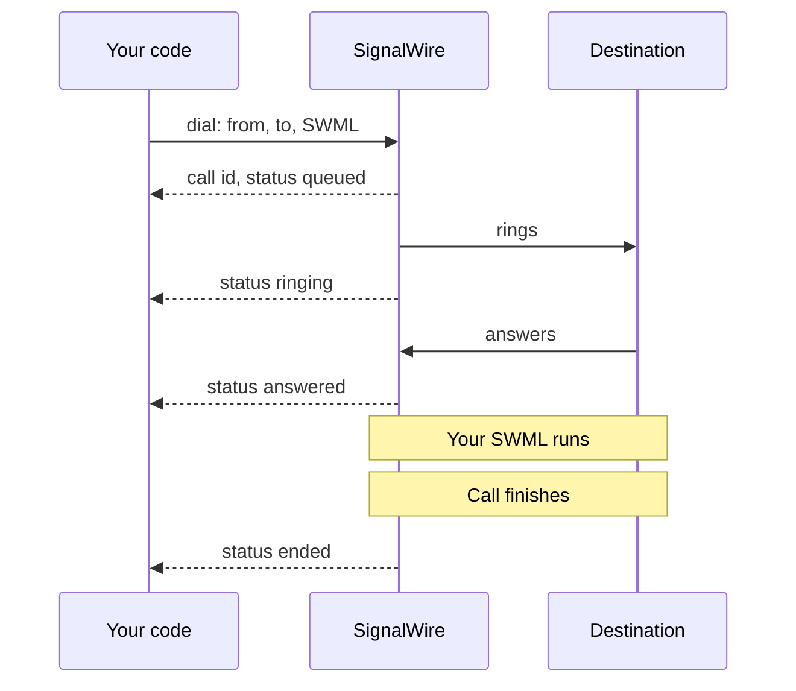
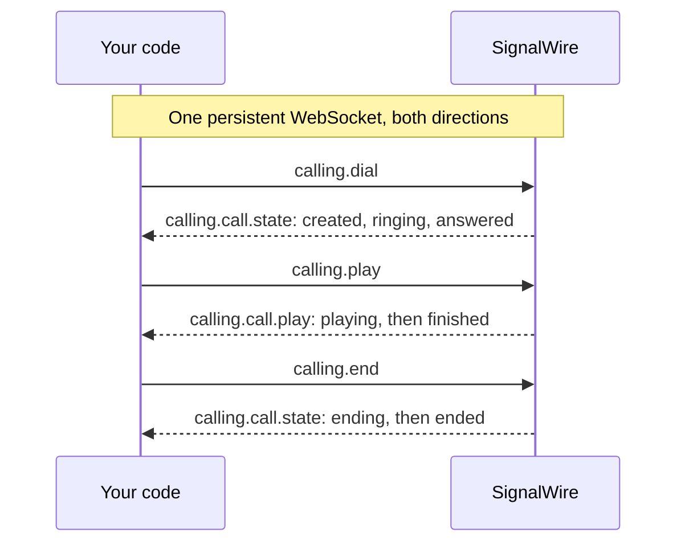

[caller-id]: /docs/platform/voice/how-to-set-caller-id-or-cnam
[trial-mode]: /docs/platform/trial-mode
[international]: /docs/platform/how-to-enable-international-services
[api-credentials]: /docs/platform/your-signalwire-api-space
[phone-numbers]: /docs/platform/phone-numbers
[swml-ai]: /docs/swml/reference/calling/ai
[ai-best-practices]: /docs/platform/ai/best-practices
[tcpa]: /docs/platform/compliance/tcpa
[sdk-install]: /docs/server-sdks/guides/installation
[webhooks]: /docs/platform/webhooks
[swml-detect-machine]: /docs/swml/reference/calling/detect-machine
[swml-record-call]: /docs/swml/reference/calling/record-call
[swml-stream]: /docs/swml/reference/calling/stream
[call-whisper]: /docs/swml/guides/call-whisper
[guest-token]: /docs/apis/rest/subscribers/tokens/create-subscriber-guest-token
[resource-addresses]: /docs/platform/addresses
[resources]: /docs/platform/resources

Place an outbound phone call with SignalWire and choose what happens when the destination answers.
Start by calling your own phone and playing a short announcement, then track the call's progress,
run an AI agent, or let users call from your web app.

## Choose how to place your call

If you're adding outbound calling to an existing application, choose the approach that fits how you want to control the call.

| What you want to do | Where to start |
|---|---|
| Have your server start a call with instructions to run when it's answered | [REST Calling API](#place-the-call), using cURL or a Server SDK |
| Send commands and receive call events over a persistent connection | [WebSocket (Relay)](#place-the-call), using a Server SDK |
| Let someone place and speak on a call from your web app | [Browser SDK](#place-the-call) |

## Prepare for your first call

For the server walkthrough, have these values ready:

- Your Space URL, such as `<YOUR_SPACE>.signalwire.com`.
- Your Project ID and API token from the Dashboard's [API credentials][api-credentials] page.
  Enable the token's **Voice** permission for the Calling API.
- A caller ID: a voice-capable [number in your project][phone-numbers] or a
  [verified caller ID][caller-id].
- A destination phone you can answer.

Use cURL in your terminal to make the first REST request. If you choose Python or TypeScript,
follow the setup comments in that sample; the [Server SDK installation guide][sdk-install]
covers runtime requirements and environment setup. The server examples use Python
`signalwire-sdk` 3.4.1 and TypeScript `@signalwire/sdk` 2.0.5.

<Warning title="Trial projects and international calls are restricted">
A [trial project][trial-mode] can dial only numbers it has purchased or verified, and cannot call
internationally at all. Any other project can dial any number, but needs
[international dialing enabled][international] before it reaches another country.
</Warning>

## Make your first call

Call a phone you can answer and play a short announcement.

<Steps>

### Set your credentials and caller ID

Replace these values in the code sample you choose:

| Value | Replace with |
|---|---|
| `<YOUR_SPACE>` | Your Space's subdomain in `<YOUR_SPACE>.signalwire.com` |
| `<YOUR_PROJECT_ID>` | Your Project ID |
| `<YOUR_API_TOKEN>` | Your API token |
| `<YOUR_CALLER_ID>` | Your caller ID number |

### Choose a destination

A call can reach a phone, a SIP endpoint, or a Resource in your SignalWire Space.

| Destination | Dial | Example |
|---|---|---|
| Phone | Its number in E.164 format | `<YOUR_DESTINATION>` |
| SIP endpoint | Its SIP URI | `sip:support@example.com` |
| Web client | Its subscriber resource address | `/private/support-rep` |
| Application | Its resource address | `/public/support-agent` |
| Conference | Its resource address | `/public/team-standup` |

Web clients connect through Subscriber resources. Subscribers, applications such as AI agents,
SWML scripts, or Call Flows, and conferences are [Resources][resources]. Each has a
[resource address][resource-addresses] in the form `/context/name`, where the context is `public`
or `private`.

For this walkthrough, choose a phone number you can answer and replace
`<YOUR_DESTINATION>` with it.

### Place the call

REST requests run on your server. For WebSocket calling, choose a Server SDK or the Browser SDK.

<Tabs groupId="outbound-api">
<Tab title="REST">

The request includes a SignalWire Markup Language (SWML) document in `swml`. SignalWire runs
it when the destination answers, playing the announcement below.

<CodeBlocks>
<CodeBlock title="cURL — Calling API">
```bash
curl -X POST "https://<YOUR_SPACE>.signalwire.com/api/calling/calls" \
  -u "<YOUR_PROJECT_ID>:<YOUR_API_TOKEN>" \
  -H "Content-Type: application/json" \
  -d '{
    "command": "dial",
    "params": {
      "from": "<YOUR_CALLER_ID>",
      "to": "<YOUR_DESTINATION>",
      "swml": {
        "version": "1.0.0",
        "sections": {
          "main": [
            { "play": {"url": "say:Hi, this is Bayview Taxi. Your driver is on the way and will arrive in about five minutes."} }
          ]
        }
      }
    }
  }'
```
</CodeBlock>
<CodeBlock title="Python — REST client">
```python
# Install: python -m pip install signalwire-sdk==3.4.1
# Save as outbound_call.py and run: python outbound_call.py
from signalwire.rest import RestClient

client = RestClient(
    project="<YOUR_PROJECT_ID>",
    token="<YOUR_API_TOKEN>",
    host="<YOUR_SPACE>.signalwire.com",
)

call = client.calling.dial(
    from_="<YOUR_CALLER_ID>",
    to="<YOUR_DESTINATION>",
    swml={
        "version": "1.0.0",
        "sections": {
            "main": [
                {"play": {"url": "say:Hi, this is Bayview Taxi. Your driver is on the way and will arrive in about five minutes."}}
            ]
        },
    },
)
print(call["id"])
```
</CodeBlock>
<CodeBlock title="TypeScript — REST client">
```typescript
// Install: npm install @signalwire/sdk@2.0.5
// This sample also runs as JavaScript: save as outbound-call.mjs,
// then run: node outbound-call.mjs
import { RestClient } from "@signalwire/sdk";

const client = new RestClient({
  project: "<YOUR_PROJECT_ID>",
  token: "<YOUR_API_TOKEN>",
  host: "<YOUR_SPACE>.signalwire.com",
});

const call = await client.calling.dial({
  from: "<YOUR_CALLER_ID>",
  to: "<YOUR_DESTINATION>",
  swml: {
    version: "1.0.0",
    sections: {
      main: [
        { play: { url: "say:Hi, this is Bayview Taxi. Your driver is on the way and will arrive in about five minutes." } },
      ],
    },
  },
});
console.log(call.id);
```
</CodeBlock>
</CodeBlocks>

The REST API returns a call `id` and status `queued`. This confirms that SignalWire accepted the
request; the call hasn't necessarily rung or been answered yet. Save the `id` to identify this call.
This response excerpt shows the fields used in the walkthrough.

```json
{
  "id": "0e9c80d7-a149-4917-892d-420043709f45",
  "from": "<YOUR_CALLER_ID>",
  "to": "<YOUR_DESTINATION>",
  "direction": "outbound-api",
  "status": "queued",
  "created_at": "2026-09-04T15:20:00Z"
}
```

</Tab>
<Tab title="WebSocket (Relay)">

Use a Server SDK to play the announcement, or the Browser SDK to let a user speak on the call
from your web app.

<CodeBlocks>
<CodeBlock title="Python — Relay client">
```python
# Install: python -m pip install signalwire-sdk==3.4.1
# Save as outbound_call.py and run: python outbound_call.py
import asyncio
from signalwire.relay import RelayClient

client = RelayClient(
    project="<YOUR_PROJECT_ID>",
    token="<YOUR_API_TOKEN>",
    host="<YOUR_SPACE>.signalwire.com",
    contexts=["default"],
)

async def main():
    async with client:
        call = await client.dial(
            devices=[[{
                "type": "phone",
                "params": {
                    "from_number": "<YOUR_CALLER_ID>",
                    "to_number": "<YOUR_DESTINATION>",
                    "timeout": 30,
                },
            }]],
        )
        async def hang_up_after_playback(_event):
            if call.state != "ended":
                await call.hangup()

        await call.play([{
            "type": "tts",
            "params": {"text": "Hi, this is Bayview Taxi. Your driver is on the way and will arrive in about five minutes."},
        }], on_completed=hang_up_after_playback)
        await call.wait_for_ended()

asyncio.run(main())
```
</CodeBlock>
<CodeBlock title="TypeScript — Relay client">
```typescript
// Install: npm install @signalwire/sdk@2.0.5
// This sample also runs as JavaScript: save as outbound-call.mjs,
// then run: node outbound-call.mjs
import { RelayClient } from "@signalwire/sdk";

const client = new RelayClient({
  project: "<YOUR_PROJECT_ID>",
  token: "<YOUR_API_TOKEN>",
  host: "<YOUR_SPACE>.signalwire.com",
  contexts: ["default"],
});

await client.connect();

try {
  const call = await client.dial([[{
    type: "phone",
    params: {
      from_number: "<YOUR_CALLER_ID>",
      to_number: "<YOUR_DESTINATION>",
      timeout: 30,
    },
  }]]);
  await call.play([
    { type: "tts", text: "Hi, this is Bayview Taxi. Your driver is on the way and will arrive in about five minutes." },
  ], {
    onCompleted: async () => {
      if (call.state !== "ended") await call.hangup();
    },
  });
  await call.waitForEnded();
} finally {
  await client.disconnect();
}
```
</CodeBlock>
<CodeBlock title="JavaScript — Browser SDK">
```javascript
// Install: npm install @signalwire/js@4.0.0-rc.2 rxjs@7.8.2
// Run on HTTPS or localhost with these elements in your page:
// <audio id="remote-audio" autoplay></audio>
// <button id="call" type="button">Call</button>
// <button id="hangup" type="button" disabled>Hang up</button>
// Use a Subscriber Access Token issued by your backend.
import { SignalWire, StaticCredentialProvider } from "@signalwire/js";

const client = new SignalWire(new StaticCredentialProvider({
  token: "<YOUR_SUBSCRIBER_ACCESS_TOKEN>",
}));
const remoteAudio = document.querySelector("#remote-audio");
const callButton = document.querySelector("#call");
const hangupButton = document.querySelector("#hangup");

callButton.onclick = async () => {
  callButton.disabled = true;
  try {
    const call = await client.dial("<YOUR_DESTINATION>", { audio: true, video: false });
    call.remoteStream$.subscribe((stream) => (remoteAudio.srcObject = stream));
    hangupButton.disabled = false;
    hangupButton.onclick = () => {
      void call.hangup().catch(console.error);
    };
    call.status$.subscribe((status) => {
      if (status === "disconnected" || status === "failed" || status === "destroyed") {
        remoteAudio.srcObject = null;
        hangupButton.disabled = true;
        callButton.disabled = false;
      }
    });
  } catch (error) {
    callButton.disabled = false;
    console.error(error);
  }
};
```
</CodeBlock>
</CodeBlocks>

For browser setup and a complete web page, see the
[Browser SDK outbound calls guide](/docs/browser-sdk/v4/guides/outbound-calls).
For server dialing options, see the
[Python dial reference](/docs/server-sdks/reference/python/relay/client/dial) or
[TypeScript dial reference](/docs/server-sdks/reference/typescript/relay/client/dial).

</Tab>
</Tabs>

### Answer the call

Answer the destination phone. With a server example, you should hear “Hi, this is Bayview Taxi”
followed by the driver arrival message, then the call ends. With the browser example, allow
microphone access to speak on the call and select **Hang up** when you finish.

</Steps>

## Track the call's progress

Use callbacks with REST or event handlers with Relay to follow what happens after you dial.
Follow the section for the approach you used for your first call.

### REST

Add `status_url` and `status_events` to your first request to receive call progress callbacks.
Keep the inline `swml` announcement. The examples below place another call with notifications
for `ringing`, `answered`, and `ended`.

Before running the request, replace `<YOUR_STATUS_WEBHOOK_URL>` with a webhook endpoint
you control that SignalWire can reach. Your endpoint receives HTTP POST requests as the call
reaches the selected states. See the [webhooks guide][webhooks] for endpoint setup and local testing.
For the SDK snippets, keep the imports and `client` setup from your first REST example, and
replace its `dial` call with the code below.

`status_events` accepts `created`, `ringing`, `answered`, and `ended`; if omitted, it defaults
to `ended`. The `ended` payload includes an `end_reason` so you can tell how the call finished.

<CodeBlocks>
<CodeBlock title="cURL — Calling API">
```bash
curl -X POST "https://<YOUR_SPACE>.signalwire.com/api/calling/calls" \
  -u "<YOUR_PROJECT_ID>:<YOUR_API_TOKEN>" \
  -H "Content-Type: application/json" \
  -d '{
    "command": "dial",
    "params": {
      "from": "<YOUR_CALLER_ID>",
      "to": "<YOUR_DESTINATION>",
      "swml": {
        "version": "1.0.0",
        "sections": {
          "main": [
            { "play": {"url": "say:Hi, this is Bayview Taxi. Your driver is on the way and will arrive in about five minutes."} }
          ]
        }
      },
      "status_url": "<YOUR_STATUS_WEBHOOK_URL>",
      "status_events": ["ringing", "answered", "ended"]
    }
  }'
```
</CodeBlock>
<CodeBlock title="Python — REST client">
```python
call = client.calling.dial(
    from_="<YOUR_CALLER_ID>",
    to="<YOUR_DESTINATION>",
    swml={
        "version": "1.0.0",
        "sections": {
            "main": [
                {"play": {"url": "say:Hi, this is Bayview Taxi. Your driver is on the way and will arrive in about five minutes."}}
            ]
        },
    },
    status_url="<YOUR_STATUS_WEBHOOK_URL>",
    status_events=["ringing", "answered", "ended"],
)
```
</CodeBlock>
<CodeBlock title="TypeScript — REST client">
```typescript
const call = await client.calling.dial({
  from: "<YOUR_CALLER_ID>",
  to: "<YOUR_DESTINATION>",
  swml: {
    version: "1.0.0",
    sections: {
      main: [
        { play: { url: "say:Hi, this is Bayview Taxi. Your driver is on the way and will arrive in about five minutes." } },
      ],
    },
  },
  status_url: "<YOUR_STATUS_WEBHOOK_URL>",
  status_events: ["ringing", "answered", "ended"],
});
```
</CodeBlock>
</CodeBlocks>

This flow shows a call with `ringing`, `answered`, and `ended` status events enabled:

<llms-ignore>


</llms-ignore>

<llms-only>



</llms-only>

### WebSocket

Relay exposes call state events through `call.on()`. Because `dial()` returns after the destination
answers, the handler observes later states such as `ending` and `ended`.

The Browser SDK returns a WebRTC `Call` while it is `ringing`. Subscribe to `call.status$` to follow
it through `connecting`, `connected`, and the final states.

<CodeBlocks>
<CodeBlock title="Python — Relay client">
```python
# Install: python -m pip install signalwire-sdk==3.4.1
# Save as outbound_call.py and run: python outbound_call.py
import asyncio
from signalwire.relay import RelayClient
from signalwire.relay.event import CallStateEvent

client = RelayClient(
    project="<YOUR_PROJECT_ID>",
    token="<YOUR_API_TOKEN>",
    host="<YOUR_SPACE>.signalwire.com",
    contexts=["default"],
)

async def main():
    async with client:
        call = await client.dial(
            devices=[[{
                "type": "phone",
                "params": {
                    "from_number": "<YOUR_CALLER_ID>",
                    "to_number": "<YOUR_DESTINATION>",
                    "timeout": 30,
                },
            }]],
        )
        def handle_state(event: CallStateEvent):
            print(f"State: {event.call_state}, reason: {event.end_reason}")

        call.on("calling.call.state", handle_state)
        async def hang_up_after_playback(_event):
            if call.state != "ended":
                await call.hangup()

        await call.play([{
            "type": "tts",
            "params": {"text": "Hi, this is Bayview Taxi. Your driver is on the way and will arrive in about five minutes."},
        }], on_completed=hang_up_after_playback)
        await call.wait_for_ended()

asyncio.run(main())
```
</CodeBlock>
<CodeBlock title="TypeScript — Relay client">
```typescript
// Install: npm install @signalwire/sdk@2.0.5
// This sample also runs as JavaScript: save as outbound-call.mjs,
// then run: node outbound-call.mjs
import { RelayClient } from "@signalwire/sdk";

const client = new RelayClient({
  project: "<YOUR_PROJECT_ID>",
  token: "<YOUR_API_TOKEN>",
  host: "<YOUR_SPACE>.signalwire.com",
  contexts: ["default"],
});

await client.connect();

try {
  const call = await client.dial([[{
    type: "phone",
    params: {
      from_number: "<YOUR_CALLER_ID>",
      to_number: "<YOUR_DESTINATION>",
      timeout: 30,
    },
  }]]);
  call.on("calling.call.state", (event) => {
    console.log(`State: ${event.params.call_state}, reason: ${event.params.end_reason ?? ""}`);
  });
  await call.play([
    { type: "tts", text: "Hi, this is Bayview Taxi. Your driver is on the way and will arrive in about five minutes." },
  ], {
    onCompleted: async () => {
      if (call.state !== "ended") await call.hangup();
    },
  });
  await call.waitForEnded();
} finally {
  await client.disconnect();
}
```
</CodeBlock>
<CodeBlock title="JavaScript — Browser SDK">
```javascript
// Install: npm install @signalwire/js@4.0.0-rc.2 rxjs@7.8.2
// Run on HTTPS or localhost with these elements in your page:
// <p id="status">Idle</p>
// <audio id="remote-audio" autoplay></audio>
// <button id="call" type="button">Call</button>
// <button id="hangup" type="button" disabled>Hang up</button>
import { SignalWire, StaticCredentialProvider } from "@signalwire/js";

const client = new SignalWire(new StaticCredentialProvider({
  token: "<YOUR_SUBSCRIBER_ACCESS_TOKEN>",
}));
const statusLine = document.querySelector("#status");
const remoteAudio = document.querySelector("#remote-audio");
const callButton = document.querySelector("#call");
const hangupButton = document.querySelector("#hangup");
const finalStatuses = new Set(["disconnected", "failed", "destroyed"]);

callButton.onclick = async () => {
  callButton.disabled = true;
  try {
    const call = await client.dial("<YOUR_DESTINATION>", { audio: true, video: false });
    call.remoteStream$.subscribe((stream) => (remoteAudio.srcObject = stream));
    call.status$.subscribe((status) => {
      statusLine.textContent = `Call: ${status}`;
      console.log(`Call: ${status}`);

      if (finalStatuses.has(status)) {
        remoteAudio.srcObject = null;
        hangupButton.disabled = true;
        callButton.disabled = false;
      }
    });

    hangupButton.disabled = false;
    hangupButton.onclick = () => {
      void call.hangup().catch(console.error);
    };
  } catch (error) {
    statusLine.textContent = "Call failed";
    callButton.disabled = false;
    console.error(error);
  }
};
```
</CodeBlock>
</CodeBlocks>

For more Relay event handlers, see the
[Python events reference](/docs/server-sdks/reference/python/relay/events) or
[TypeScript events reference](/docs/server-sdks/reference/typescript/relay/events).
For Browser SDK call states, see the
[outbound calls guide](/docs/browser-sdk/v4/guides/outbound-calls).

For Relay, this flow shows the commands your code sends and the events SignalWire returns over the
same persistent connection:

<llms-ignore>


</llms-ignore>

<llms-only>



</llms-only>

## Examples

### Run an AI agent

Call a rider with an AI agent that shares their arrival time and answers follow-up questions.

<Warning title="Outbound AI calls are regulated">
Before dialing, follow consent, do-not-call, and calling-hour requirements for artificial voices.
See the [TCPA guide][tcpa] and [AI best practices][ai-best-practices].
</Warning>

#### REST

Send a `dial` request with an inline SWML [`ai` instruction][swml-ai] that starts when the call is answered.

<CodeBlocks>
<CodeBlock title="cURL — Calling API">
```bash
curl -X POST "https://<YOUR_SPACE>.signalwire.com/api/calling/calls" \
  -u "<YOUR_PROJECT_ID>:<YOUR_API_TOKEN>" \
  -H "Content-Type: application/json" \
  -d '{
    "command": "dial",
    "params": {
      "from": "<YOUR_CALLER_ID>",
      "to": "<YOUR_DESTINATION>",
      "swml": {
        "version": "1.0.0",
        "sections": {
          "main": [
            {
              "ai": {
                "params": {
                  "static_greeting": "Hello, this is an automated assistant calling from Bayview Taxi about your pickup. This call uses an artificial voice.",
                  "static_greeting_no_barge": true
                },
                "prompt": {
                  "text": "You are calling to tell the rider their driver is about five minutes away. Answer questions using that estimate. You cannot change bookings or contact preferences. If asked, explain that the rider needs to contact Bayview Taxi to make those changes. Do not claim to have made a change."
                }
              }
            }
          ]
        }
      }
    }
  }'
```
</CodeBlock>
<CodeBlock title="Python — REST client">
```python
# Install: python -m pip install signalwire-sdk==3.4.1
# Save as outbound_call.py and run: python outbound_call.py
from signalwire.rest import RestClient

client = RestClient(
    project="<YOUR_PROJECT_ID>",
    token="<YOUR_API_TOKEN>",
    host="<YOUR_SPACE>.signalwire.com",
)

call = client.calling.dial(
    from_="<YOUR_CALLER_ID>",
    to="<YOUR_DESTINATION>",
    swml={
        "version": "1.0.0",
        "sections": {
            "main": [
                {
                    "ai": {
                        "params": {
                            "static_greeting": "Hello, this is an automated assistant calling from Bayview Taxi about your pickup. This call uses an artificial voice.",
                            "static_greeting_no_barge": True
                        },
                        "prompt": {
                            "text": "You are calling to tell the rider their driver is about five minutes away. Answer questions using that estimate. You cannot change bookings or contact preferences. If asked, explain that the rider needs to contact Bayview Taxi to make those changes. Do not claim to have made a change."
                        }
                    }
                }
            ]
        }
    },
)
print(call["id"])
```
</CodeBlock>
<CodeBlock title="TypeScript — REST client">
```typescript
// Install: npm install @signalwire/sdk@2.0.5
// This sample also runs as JavaScript: save as outbound-call.mjs,
// then run: node outbound-call.mjs
import { RestClient } from "@signalwire/sdk";

const client = new RestClient({
  project: "<YOUR_PROJECT_ID>",
  token: "<YOUR_API_TOKEN>",
  host: "<YOUR_SPACE>.signalwire.com",
});

const call = await client.calling.dial({
  from: "<YOUR_CALLER_ID>",
  to: "<YOUR_DESTINATION>",
  swml: {
    "version": "1.0.0",
    "sections": {
      "main": [
        {
          "ai": {
            "params": {
              "static_greeting": "Hello, this is an automated assistant calling from Bayview Taxi about your pickup. This call uses an artificial voice.",
              "static_greeting_no_barge": true
            },
            "prompt": {
              "text": "You are calling to tell the rider their driver is about five minutes away. Answer questions using that estimate. You cannot change bookings or contact preferences. If asked, explain that the rider needs to contact Bayview Taxi to make those changes. Do not claim to have made a change."
            }
          }
        }
      ]
    }
  },
});
console.log(call.id);
```
</CodeBlock>
</CodeBlocks>

#### WebSocket (Relay)

Dial with Relay, start the agent with `call.ai()`, and keep the connection open until the call ends.

<CodeBlocks>
<CodeBlock title="Python — Relay client">
```python
# Install: python -m pip install signalwire-sdk==3.4.1
# Save as outbound_call.py and run: python outbound_call.py
import asyncio
from signalwire.relay import RelayClient

client = RelayClient(
    project="<YOUR_PROJECT_ID>",
    token="<YOUR_API_TOKEN>",
    host="<YOUR_SPACE>.signalwire.com",
    contexts=["default"],
)

async def main():
    async with client:
        call = await client.dial(
            devices=[[{
                "type": "phone",
                "params": {
                    "from_number": "<YOUR_CALLER_ID>",
                    "to_number": "<YOUR_DESTINATION>",
                    "timeout": 30,
                },
            }]],
        )
        await call.ai(
            ai_params={
                "static_greeting": "Hello, this is an automated assistant calling from Bayview Taxi about your pickup. This call uses an artificial voice.",
                "static_greeting_no_barge": True,
            },
            prompt={
                "text": """You are calling to tell the rider their driver is about five minutes away.
Answer questions using that estimate. You cannot change bookings or
contact preferences. If asked, explain that the rider needs to contact
Bayview Taxi to make those changes. Do not claim to have made a change."""
            },
        )
        # Keep the connection open until the destination hangs up.
        await call.wait_for_ended()

asyncio.run(main())
```
</CodeBlock>
<CodeBlock title="TypeScript — Relay client">
```typescript
// Install: npm install @signalwire/sdk@2.0.5
// This sample also runs as JavaScript: save as outbound-call.mjs,
// then run: node outbound-call.mjs
import { RelayClient } from "@signalwire/sdk";

const client = new RelayClient({
  project: "<YOUR_PROJECT_ID>",
  token: "<YOUR_API_TOKEN>",
  host: "<YOUR_SPACE>.signalwire.com",
  contexts: ["default"],
});

await client.connect();

try {
  const call = await client.dial([[{
    type: "phone",
    params: {
      from_number: "<YOUR_CALLER_ID>",
      to_number: "<YOUR_DESTINATION>",
      timeout: 30,
    },
  }]]);
  await call.ai({
    aiParams: {
      static_greeting: "Hello, this is an automated assistant calling from Bayview Taxi about your pickup. This call uses an artificial voice.",
      static_greeting_no_barge: true,
    },
    prompt: {
      text: `You are calling to tell the rider their driver is about five minutes away.
  Answer questions using that estimate. You cannot change bookings or
  contact preferences. If asked, explain that the rider needs to contact
  Bayview Taxi to make those changes. Do not claim to have made a change.`,
    },
  });
  // Keep the connection open until the destination hangs up.
  await call.waitForEnded();
} finally {
  await client.disconnect();
}
```
</CodeBlock>
</CodeBlocks>

### Leave a voicemail

Use answering machine detection (AMD) to speak to a person immediately or leave a message after a
voicemail greeting and beep.

Follow the consent and calling-hour requirements in the [TCPA guide][tcpa].

#### REST

Use [`detect_machine`][swml-detect-machine] and `switch` to choose the live or voicemail message.

<CodeBlocks>
<CodeBlock title="cURL — Calling API">
```bash
curl -X POST "https://<YOUR_SPACE>.signalwire.com/api/calling/calls" \
  -u "<YOUR_PROJECT_ID>:<YOUR_API_TOKEN>" \
  -H "Content-Type: application/json" \
  -d '{
    "command": "dial",
    "params": {
      "from": "<YOUR_CALLER_ID>",
      "to": "<YOUR_DESTINATION>",
      "swml": {
        "version": "1.0.0",
        "sections": {
          "main": [
            {
              "detect_machine": {
                "detectors": "amd",
                "detect_message_end": true,
                "timeout": 30
              }
            },
            {
              "switch": {
                "variable": "detect_result",
                "case": {
                  "machine": [
                    { "play": {"url": "say:This is Bayview Taxi. Your driver is on the way and will arrive in about five minutes. There is no need to call back."} }
                  ],
                  "human": [
                    { "play": {"url": "say:Hi, this is Bayview Taxi. Your driver is on the way and will arrive in about five minutes."} }
                  ]
                },
                "default": [
                  { "play": {"url": "say:Hi, this is Bayview Taxi. Your driver will arrive in about five minutes."} }
                ]
              }
            },
            { "hangup": {} }
          ]
        }
      }
    }
  }'
```
</CodeBlock>
<CodeBlock title="Python — REST client">
```python
voicemail = "say:This is Bayview Taxi. Your driver is on the way and will arrive in about five minutes. There is no need to call back."
live = "say:Hi, this is Bayview Taxi. Your driver is on the way and will arrive in about five minutes."

call = client.calling.dial(
    from_="<YOUR_CALLER_ID>",
    to="<YOUR_DESTINATION>",
    swml={
        "version": "1.0.0",
        "sections": {
            "main": [
                {"detect_machine": {"detectors": "amd", "detect_message_end": True, "timeout": 30}},
                {
                    "switch": {
                        "variable": "detect_result",
                        "case": {
                            "machine": [{"play": {"url": voicemail}}],
                            "human": [{"play": {"url": live}}],
                        },
                        "default": [{"play": {"url": "say:Hi, this is Bayview Taxi. Your driver will arrive in about five minutes."}}],
                    }
                },
                {"hangup": {}},
            ]
        },
    },
)
print(call["id"])
```
</CodeBlock>
<CodeBlock title="TypeScript — REST client">
```typescript
const voicemail = "say:This is Bayview Taxi. Your driver is on the way and will arrive in about five minutes. There is no need to call back.";
const live = "say:Hi, this is Bayview Taxi. Your driver is on the way and will arrive in about five minutes.";

const call = await client.calling.dial({
  from: "<YOUR_CALLER_ID>",
  to: "<YOUR_DESTINATION>",
  swml: {
    version: "1.0.0",
    sections: {
      main: [
        { detect_machine: { detectors: "amd", detect_message_end: true, timeout: 30 } },
        {
          switch: {
            variable: "detect_result",
            case: {
              machine: [{ play: { url: voicemail } }],
              human: [{ play: { url: live } }],
            },
            default: [{ play: { url: "say:Hi, this is Bayview Taxi. Your driver will arrive in about five minutes." } }],
          },
        },
        { hangup: {} },
      ],
    },
  },
});
console.log(call.id);
```
</CodeBlock>
</CodeBlocks>

#### WebSocket (Relay)

Use `call.detect()` to play the live message after `HUMAN` or `UNKNOWN`, or wait for `READY` after a
machine greeting.

<CodeBlocks>
<CodeBlock title="Python — Relay client">
```python
# Install: python -m pip install signalwire-sdk==3.4.1
# Save as outbound_call.py and run: python outbound_call.py
import asyncio
from signalwire.relay import RelayClient
from signalwire.relay.event import DetectEvent

VOICEMAIL = "This is Bayview Taxi. Your driver is on the way and will arrive in about five minutes. There is no need to call back."
LIVE = "Hi, this is Bayview Taxi. Your driver is on the way and will arrive in about five minutes."

client = RelayClient(
    project="<YOUR_PROJECT_ID>",
    token="<YOUR_API_TOKEN>",
    host="<YOUR_SPACE>.signalwire.com",
    contexts=["default"],
)

def outcome(event: DetectEvent) -> str:
    return event.detect.get("params", {}).get("event", "")

async def main():
    async with client:
        call = await client.dial(
            devices=[[{
                "type": "phone",
                "params": {
                    "from_number": "<YOUR_CALLER_ID>",
                    "to_number": "<YOUR_DESTINATION>",
                    "timeout": 30,
                },
            }]],
        )
        async def hang_up_after_playback(_event):
            if call.state != "ended":
                await call.hangup()

        announced = False

        async def announce(event: DetectEvent):
            nonlocal announced
            if announced or call.state == "ended":
                return
            result = outcome(event)
            if result == "READY":
                # The voicemail greeting and its beep have finished.
                announced = True
                await call.play(
                    [{"type": "tts", "params": {"text": VOICEMAIL}}],
                    on_completed=hang_up_after_playback,
                )
            elif result in ("HUMAN", "UNKNOWN"):
                announced = True
                await call.play(
                    [{"type": "tts", "params": {"text": LIVE}}],
                    on_completed=hang_up_after_playback,
                )
            elif result == "finished":
                await call.hangup()

        call.on("calling.call.detect", announce)
        await call.detect({"type": "machine", "params": {"detect_message_end": True}}, timeout=30)
        await call.wait_for_ended()

asyncio.run(main())
```
</CodeBlock>
<CodeBlock title="TypeScript — Relay client">
```typescript
// Install: npm install @signalwire/sdk@2.0.5
// Save as outbound-call.mts and run: npx tsx outbound-call.mts
import { RelayClient, DetectEvent, RelayEvent } from "@signalwire/sdk";

const VOICEMAIL = "This is Bayview Taxi. Your driver is on the way and will arrive in about five minutes. There is no need to call back.";
const LIVE = "Hi, this is Bayview Taxi. Your driver is on the way and will arrive in about five minutes.";

const client = new RelayClient({
  project: "<YOUR_PROJECT_ID>",
  token: "<YOUR_API_TOKEN>",
  host: "<YOUR_SPACE>.signalwire.com",
  contexts: ["default"],
});

function outcome(event: RelayEvent): string {
  const detect = (event as DetectEvent).detect?.params as { event?: string } | undefined;
  return detect?.event ?? "";
}

await client.connect();

try {
  const call = await client.dial([[{
    type: "phone",
    params: {
      from_number: "<YOUR_CALLER_ID>",
      to_number: "<YOUR_DESTINATION>",
      timeout: 30,
    },
  }]]);
  const hangUpAfterPlayback = async () => {
    if (call.state !== "ended") await call.hangup();
  };
  let announced = false;

  call.on("calling.call.detect", async (event) => {
    if (announced || call.state === "ended") return;
    const result = outcome(event);
    if (result === "READY") {
      // The voicemail greeting and its beep have finished.
      announced = true;
      await call.play([{ type: "tts", text: VOICEMAIL }], { onCompleted: hangUpAfterPlayback });
    } else if (result === "HUMAN" || result === "UNKNOWN") {
      announced = true;
      await call.play([{ type: "tts", text: LIVE }], { onCompleted: hangUpAfterPlayback });
    } else if (result === "finished") {
      await call.hangup();
    }
  });

  await call.detect({ type: "machine", params: { detect_message_end: true } }, { timeout: 30 });
  await call.waitForEnded();
} finally {
  await client.disconnect();
}
```
</CodeBlock>
</CodeBlocks>

### Whisper before connecting two people

Play pickup details privately to `<YOUR_DRIVER_NUMBER>`, then connect that call to
`<YOUR_DESTINATION>`.

#### REST

Use `connect.confirm` to play the [whisper][call-whisper] to the driver before bridging the calls.

<CodeBlocks>
<CodeBlock title="cURL — Calling API">
```bash
curl -X POST "https://<YOUR_SPACE>.signalwire.com/api/calling/calls" \
  -u "<YOUR_PROJECT_ID>:<YOUR_API_TOKEN>" \
  -H "Content-Type: application/json" \
  -d '{
    "command": "dial",
    "params": {
      "from": "<YOUR_CALLER_ID>",
      "to": "<YOUR_DESTINATION>",
      "swml": {
        "version": "1.0.0",
        "sections": {
          "main": [
            { "play": {"url": "say:Bayview Taxi here. Connecting you to your driver now."} },
            {
              "connect": {
                "from": "<YOUR_CALLER_ID>",
                "to": "<YOUR_DRIVER_NUMBER>",
                "confirm": [
                  { "play": {"url": "say:Bayview Taxi dispatch. Pickup for Alex at 5 Main Street. Connecting the rider now."} }
                ],
                "confirm_timeout": 20
              }
            }
          ]
        }
      }
    }
  }'
```
</CodeBlock>
<CodeBlock title="Python — REST client">
```python
whisper = "say:Bayview Taxi dispatch. Pickup for Alex at 5 Main Street. Connecting the rider now."

call = client.calling.dial(
    from_="<YOUR_CALLER_ID>",
    to="<YOUR_DESTINATION>",
    swml={
        "version": "1.0.0",
        "sections": {
            "main": [
                {"play": {"url": "say:Bayview Taxi here. Connecting you to your driver now."}},
                {
                    "connect": {
                        "from": "<YOUR_CALLER_ID>",
                        "to": "<YOUR_DRIVER_NUMBER>",
                        "confirm": [{"play": {"url": whisper}}],
                        "confirm_timeout": 20,
                    }
                },
            ]
        },
    },
)
print(call["id"])
```
</CodeBlock>
<CodeBlock title="TypeScript — REST client">
```typescript
const whisper = "say:Bayview Taxi dispatch. Pickup for Alex at 5 Main Street. Connecting the rider now.";

const call = await client.calling.dial({
  from: "<YOUR_CALLER_ID>",
  to: "<YOUR_DESTINATION>",
  swml: {
    version: "1.0.0",
    sections: {
      main: [
        { play: { url: "say:Bayview Taxi here. Connecting you to your driver now." } },
        {
          connect: {
            from: "<YOUR_CALLER_ID>",
            to: "<YOUR_DRIVER_NUMBER>",
            confirm: [{ play: { url: whisper } }],
            confirm_timeout: 20,
          },
        },
      ],
    },
  },
});
console.log(call.id);
```
</CodeBlock>
</CodeBlocks>

#### WebSocket (Relay)

Dial the driver first, play the whisper, then connect the rider after playback finishes.

<CodeBlocks>
<CodeBlock title="Python — Relay client">
```python
# Install: python -m pip install signalwire-sdk==3.4.1
# Save as outbound_call.py and run: python outbound_call.py
import asyncio
from signalwire.relay import RelayClient

client = RelayClient(
    project="<YOUR_PROJECT_ID>",
    token="<YOUR_API_TOKEN>",
    host="<YOUR_SPACE>.signalwire.com",
    contexts=["default"],
)

async def main():
    async with client:
        # Call the driver first: only this leg hears the whisper.
        call = await client.dial(
            devices=[[{
                "type": "phone",
                "params": {
                    "from_number": "<YOUR_CALLER_ID>",
                    "to_number": "<YOUR_DRIVER_NUMBER>",
                    "timeout": 30,
                },
            }]],
        )
        async def connect_the_rider(_event):
            if call.state != "ended":
                await call.connect([[{
                    "type": "phone",
                    "params": {
                        "from_number": "<YOUR_CALLER_ID>",
                        "to_number": "<YOUR_DESTINATION>",
                        "timeout": 30,
                    },
                }]])

        await call.play(
            [{"type": "tts", "params": {"text": "Bayview Taxi dispatch. Pickup for Alex at 5 Main Street. Connecting the rider now."}}],
            on_completed=connect_the_rider,
        )
        await call.wait_for_ended()

asyncio.run(main())
```
</CodeBlock>
<CodeBlock title="TypeScript — Relay client">
```typescript
// Install: npm install @signalwire/sdk@2.0.5
// This sample also runs as JavaScript: save as outbound-call.mjs,
// then run: node outbound-call.mjs
import { RelayClient } from "@signalwire/sdk";

const client = new RelayClient({
  project: "<YOUR_PROJECT_ID>",
  token: "<YOUR_API_TOKEN>",
  host: "<YOUR_SPACE>.signalwire.com",
  contexts: ["default"],
});

await client.connect();

try {
  // Call the driver first: only this leg hears the whisper.
  const call = await client.dial([[{
    type: "phone",
    params: {
      from_number: "<YOUR_CALLER_ID>",
      to_number: "<YOUR_DRIVER_NUMBER>",
      timeout: 30,
    },
  }]]);
  await call.play(
    [{ type: "tts", text: "Bayview Taxi dispatch. Pickup for Alex at 5 Main Street. Connecting the rider now." }],
    {
      onCompleted: async () => {
        if (call.state === "ended") return;
        await call.connect([[{
          type: "phone",
          params: {
            from_number: "<YOUR_CALLER_ID>",
            to_number: "<YOUR_DESTINATION>",
            timeout: 30,
          },
        }]]);
      },
    },
  );
  await call.waitForEnded();
} finally {
  await client.disconnect();
}
```
</CodeBlock>
</CodeBlocks>

### Record the call

Record both sides of an outbound call and retrieve the finished recording URL.

<Warning title="Recording consent is your responsibility">
Confirm which parties must consent and announce the recording when required.
</Warning>

#### REST

Start [`record_call`][swml-record-call] in the background and receive the result at `status_url`.

<CodeBlocks>
<CodeBlock title="cURL — Calling API">
```bash
curl -X POST "https://<YOUR_SPACE>.signalwire.com/api/calling/calls" \
  -u "<YOUR_PROJECT_ID>:<YOUR_API_TOKEN>" \
  -H "Content-Type: application/json" \
  -d '{
    "command": "dial",
    "params": {
      "from": "<YOUR_CALLER_ID>",
      "to": "<YOUR_DESTINATION>",
      "swml": {
        "version": "1.0.0",
        "sections": {
          "main": [
            {
              "record_call": {
                "format": "mp3",
                "direction": "both",
                "stereo": true,
                "beep": true,
                "status_url": "<YOUR_RECORDING_STATUS_URL>"
              }
            },
            { "play": {"url": "say:Hi, this is Bayview Taxi. Your driver is on the way and will arrive in about five minutes."} }
          ]
        }
      }
    }
  }'
```
</CodeBlock>
<CodeBlock title="Python — REST client">
```python
call = client.calling.dial(
    from_="<YOUR_CALLER_ID>",
    to="<YOUR_DESTINATION>",
    swml={
        "version": "1.0.0",
        "sections": {
            "main": [
                {
                    "record_call": {
                        "format": "mp3",
                        "direction": "both",
                        "stereo": True,
                        "beep": True,
                        "status_url": "<YOUR_RECORDING_STATUS_URL>",
                    }
                },
                {"play": {"url": "say:Hi, this is Bayview Taxi. Your driver is on the way and will arrive in about five minutes."}},
            ]
        },
    },
)
print(call["id"])
```
</CodeBlock>
<CodeBlock title="TypeScript — REST client">
```typescript
const call = await client.calling.dial({
  from: "<YOUR_CALLER_ID>",
  to: "<YOUR_DESTINATION>",
  swml: {
    version: "1.0.0",
    sections: {
      main: [
        {
          record_call: {
            format: "mp3",
            direction: "both",
            stereo: true,
            beep: true,
            status_url: "<YOUR_RECORDING_STATUS_URL>",
          },
        },
        { play: { url: "say:Hi, this is Bayview Taxi. Your driver is on the way and will arrive in about five minutes." } },
      ],
    },
  },
});
console.log(call.id);
```
</CodeBlock>
</CodeBlocks>

#### WebSocket (Relay)

Start `call.record()` and read the recording URL from its `finished` event.

<CodeBlocks>
<CodeBlock title="Python — Relay client">
```python
# Install: python -m pip install signalwire-sdk==3.4.1
# Save as outbound_call.py and run: python outbound_call.py
import asyncio
from signalwire.relay import RelayClient

client = RelayClient(
    project="<YOUR_PROJECT_ID>",
    token="<YOUR_API_TOKEN>",
    host="<YOUR_SPACE>.signalwire.com",
    contexts=["default"],
)

async def main():
    async with client:
        call = await client.dial(
            devices=[[{
                "type": "phone",
                "params": {
                    "from_number": "<YOUR_CALLER_ID>",
                    "to_number": "<YOUR_DESTINATION>",
                    "timeout": 30,
                },
            }]],
        )
        recording = await call.record(
            audio={
                "format": "mp3",
                "direction": "both",
                "stereo": True,
                "beep": True,
                "initial_timeout": 0,
                "end_silence_timeout": 0,
            },
        )
        async def hang_up_after_playback(_event):
            if call.state != "ended":
                await call.hangup()

        await call.play(
            [{"type": "tts", "params": {"text": "Hi, this is Bayview Taxi. Your driver is on the way and will arrive in about five minutes."}}],
            on_completed=hang_up_after_playback,
        )
        await call.wait_for_ended()
        finished = await recording.wait()
        print(f"Recording: {finished.url}")

asyncio.run(main())
```
</CodeBlock>
<CodeBlock title="TypeScript — Relay client">
```typescript
// Install: npm install @signalwire/sdk@2.0.5
// Save as outbound-call.mts and run: npx tsx outbound-call.mts
import { RelayClient, RecordEvent } from "@signalwire/sdk";

const client = new RelayClient({
  project: "<YOUR_PROJECT_ID>",
  token: "<YOUR_API_TOKEN>",
  host: "<YOUR_SPACE>.signalwire.com",
  contexts: ["default"],
});

await client.connect();

try {
  const call = await client.dial([[{
    type: "phone",
    params: {
      from_number: "<YOUR_CALLER_ID>",
      to_number: "<YOUR_DESTINATION>",
      timeout: 30,
    },
  }]]);
  const recording = await call.record({
    format: "mp3",
    direction: "both",
    stereo: true,
    beep: true,
    initial_timeout: 0,
    end_silence_timeout: 0,
  });
  await call.play(
    [{ type: "tts", text: "Hi, this is Bayview Taxi. Your driver is on the way and will arrive in about five minutes." }],
    {
      onCompleted: async () => {
        if (call.state !== "ended") await call.hangup();
      },
    },
  );
  await call.waitForEnded();
  const finished = await recording.wait();
  console.log(`Recording: ${(finished as RecordEvent).url}`);
} finally {
  await client.disconnect();
}
```
</CodeBlock>
</CodeBlocks>

### Stream the call audio

Stream both sides of a live call to your secure WebSocket endpoint for real-time processing.

#### REST

Start [`stream`][swml-stream] in the background and send status events to your webhook.

<CodeBlocks>
<CodeBlock title="cURL — Calling API">
```bash
curl -X POST "https://<YOUR_SPACE>.signalwire.com/api/calling/calls" \
  -u "<YOUR_PROJECT_ID>:<YOUR_API_TOKEN>" \
  -H "Content-Type: application/json" \
  -d '{
    "command": "dial",
    "params": {
      "from": "<YOUR_CALLER_ID>",
      "to": "<YOUR_DESTINATION>",
      "swml": {
        "version": "1.0.0",
        "sections": {
          "main": [
            {
              "stream": {
                "url": "<YOUR_AUDIO_STREAM_URL>",
                "track": "both_tracks",
                "codec": "PCMU",
                "status_url": "<YOUR_STREAM_STATUS_URL>"
              }
            },
            { "play": {"url": "say:Hi, this is Bayview Taxi. Your driver is on the way and will arrive in about five minutes."} }
          ]
        }
      }
    }
  }'
```
</CodeBlock>
<CodeBlock title="Python — REST client">
```python
call = client.calling.dial(
    from_="<YOUR_CALLER_ID>",
    to="<YOUR_DESTINATION>",
    swml={
        "version": "1.0.0",
        "sections": {
            "main": [
                {
                    "stream": {
                        "url": "<YOUR_AUDIO_STREAM_URL>",
                        "track": "both_tracks",
                        "codec": "PCMU",
                        "status_url": "<YOUR_STREAM_STATUS_URL>",
                    }
                },
                {"play": {"url": "say:Hi, this is Bayview Taxi. Your driver is on the way and will arrive in about five minutes."}},
            ]
        },
    },
)
print(call["id"])
```
</CodeBlock>
<CodeBlock title="TypeScript — REST client">
```typescript
const call = await client.calling.dial({
  from: "<YOUR_CALLER_ID>",
  to: "<YOUR_DESTINATION>",
  swml: {
    version: "1.0.0",
    sections: {
      main: [
        {
          stream: {
            url: "<YOUR_AUDIO_STREAM_URL>",
            track: "both_tracks",
            codec: "PCMU",
            status_url: "<YOUR_STREAM_STATUS_URL>",
          },
        },
        { play: { url: "say:Hi, this is Bayview Taxi. Your driver is on the way and will arrive in about five minutes." } },
      ],
    },
  },
});
console.log(call.id);
```
</CodeBlock>
</CodeBlocks>

#### WebSocket (Relay)

Start `call.stream()` over the Relay connection and keep it running until the call ends.

<CodeBlocks>
<CodeBlock title="Python — Relay client">
```python
# Install: python -m pip install signalwire-sdk==3.4.1
# Save as outbound_call.py and run: python outbound_call.py
import asyncio
from signalwire.relay import RelayClient

client = RelayClient(
    project="<YOUR_PROJECT_ID>",
    token="<YOUR_API_TOKEN>",
    host="<YOUR_SPACE>.signalwire.com",
    contexts=["default"],
)

async def main():
    async with client:
        call = await client.dial(
            devices=[[{
                "type": "phone",
                "params": {
                    "from_number": "<YOUR_CALLER_ID>",
                    "to_number": "<YOUR_DESTINATION>",
                    "timeout": 30,
                },
            }]],
        )
        stream = await call.stream(
            url="<YOUR_AUDIO_STREAM_URL>",
            track="both_tracks",
            codec="PCMU",
            custom_parameters={"ride_id": "ride-4821"},
        )
        print(f"Streaming audio, control ID {stream.control_id}")

        async def hang_up_after_playback(_event):
            if call.state != "ended":
                await call.hangup()

        await call.play(
            [{"type": "tts", "params": {"text": "Hi, this is Bayview Taxi. Your driver is on the way and will arrive in about five minutes."}}],
            on_completed=hang_up_after_playback,
        )
        await call.wait_for_ended()

asyncio.run(main())
```
</CodeBlock>
<CodeBlock title="TypeScript — Relay client">
```typescript
// Install: npm install @signalwire/sdk@2.0.5
// This sample also runs as JavaScript: save as outbound-call.mjs,
// then run: node outbound-call.mjs
import { RelayClient } from "@signalwire/sdk";

const client = new RelayClient({
  project: "<YOUR_PROJECT_ID>",
  token: "<YOUR_API_TOKEN>",
  host: "<YOUR_SPACE>.signalwire.com",
  contexts: ["default"],
});

await client.connect();

try {
  const call = await client.dial([[{
    type: "phone",
    params: {
      from_number: "<YOUR_CALLER_ID>",
      to_number: "<YOUR_DESTINATION>",
      timeout: 30,
    },
  }]]);
  const stream = await call.stream("<YOUR_AUDIO_STREAM_URL>", {
    track: "both_tracks",
    codec: "PCMU",
    customParameters: { ride_id: "ride-4821" },
  });
  console.log(`Streaming audio, control ID ${stream.controlId}`);
  await call.play(
    [{ type: "tts", text: "Hi, this is Bayview Taxi. Your driver is on the way and will arrive in about five minutes." }],
    {
      onCompleted: async () => {
        if (call.state !== "ended") await call.hangup();
      },
    },
  );
  await call.waitForEnded();
} finally {
  await client.disconnect();
}
```
</CodeBlock>
</CodeBlocks>

### Call from the browser

Place a WebRTC call from a web page using a restricted [guest token][guest-token] from your backend.
Serve the page over HTTPS or `localhost` so the browser can access the microphone.

<CodeBlocks>
<CodeBlock title="HTML — page">
```html
<!doctype html>
<html lang="en">
  <head>
    <meta charset="utf-8" />
    <title>Call Bayview Taxi</title>
  </head>
  <body>
    <p id="status">Idle</p>
    <button id="call" type="button">Call dispatch</button>
    <button id="hangup" type="button" disabled>Hang up</button>
    <audio id="remote-audio" autoplay></audio>
    <script type="module" src="./call.js"></script>
  </body>
</html>
```
</CodeBlock>
<CodeBlock title="JavaScript — Browser SDK">
```javascript
// Install: npm install @signalwire/js@4.0.0-rc.2 rxjs@7.8.2
// Save as call.js next to the page above.
// GET /api/guest-token is your own endpoint: it creates a guest SAT with your
// Project API token and returns it as {"token": "..."}.
import { SignalWire, StaticCredentialProvider } from "@signalwire/js";

const statusLine = document.querySelector("#status");
const remoteAudio = document.querySelector("#remote-audio");
const callButton = document.querySelector("#call");
const hangupButton = document.querySelector("#hangup");

let clientPromise;

function getClient() {
  clientPromise ??= (async () => {
    const response = await fetch("/api/guest-token");
    if (!response.ok) throw new Error(`Token request failed: ${response.status}`);
    const { token } = await response.json();
    if (!token) throw new Error("Token response did not include a token");
    return new SignalWire(new StaticCredentialProvider({ token }));
  })().catch((error) => {
    clientPromise = undefined;
    throw error;
  });
  return clientPromise;
}

function reset() {
  remoteAudio.srcObject = null;
  callButton.disabled = false;
  hangupButton.disabled = true;
}

callButton.onclick = async () => {
  callButton.disabled = true;
  statusLine.textContent = "Connecting";
  try {
    const client = await getClient();
    const call = await client.dial("<YOUR_DESTINATION>", { audio: true, video: false });
    call.remoteStream$.subscribe((stream) => (remoteAudio.srcObject = stream));
    hangupButton.disabled = false;
    hangupButton.onclick = () => {
      void call.hangup().catch(console.error);
    };
    call.status$.subscribe((status) => {
      statusLine.textContent = status;
      if (status === "disconnected" || status === "failed" || status === "destroyed") {
        reset();
      }
    });
  } catch (error) {
    statusLine.textContent = "Call failed";
    console.error(error);
    reset();
  }
};
```
</CodeBlock>
</CodeBlocks>

See the [Browser SDK outbound calls guide](/docs/browser-sdk/v4/guides/outbound-calls) for more.
