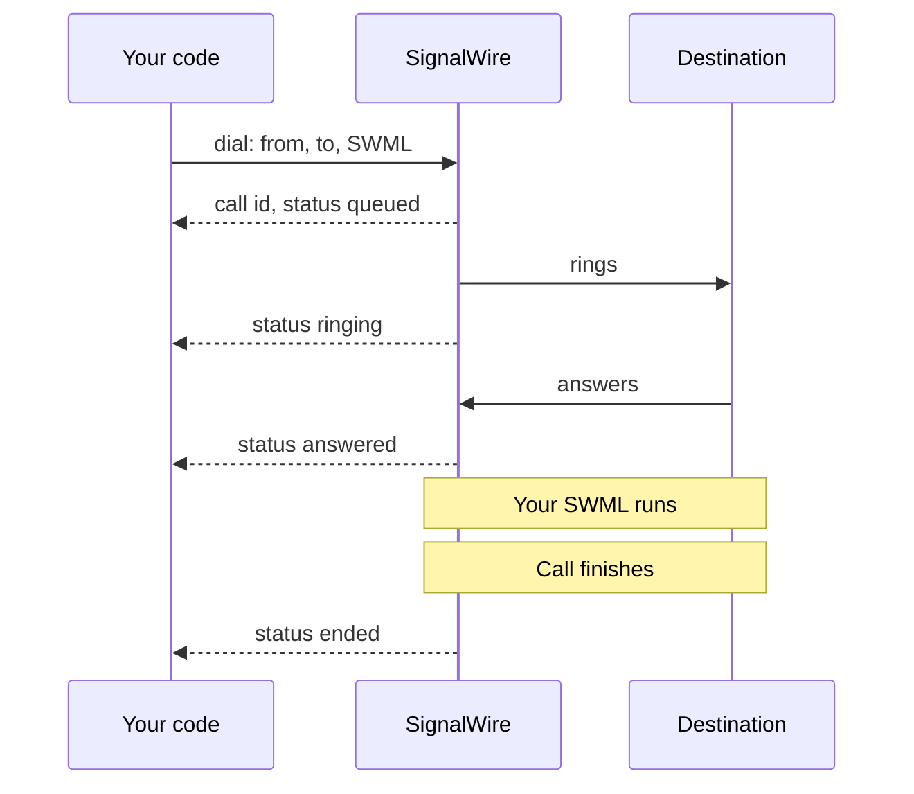
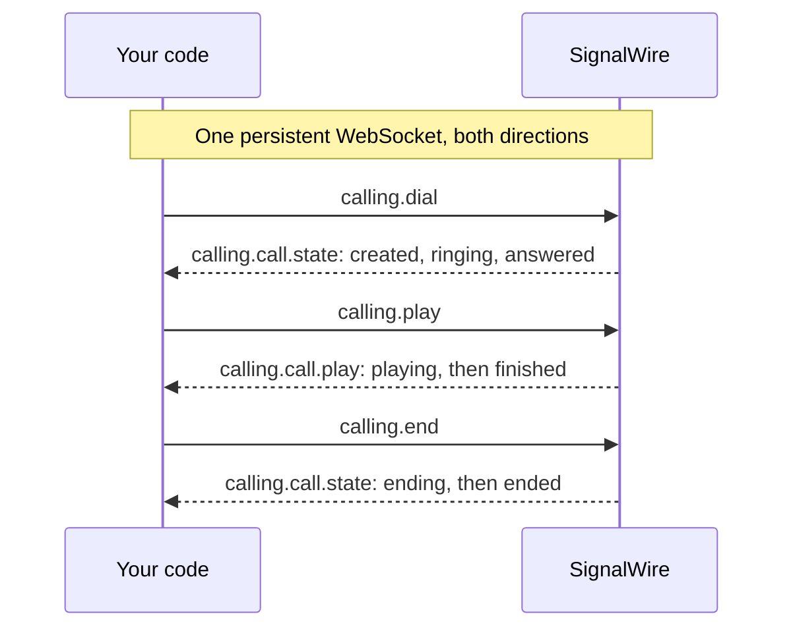

[caller-id]: /docs/platform/voice/how-to-set-caller-id-or-cnam
[trial-mode]: /docs/platform/trial-mode
[international]: /docs/platform/how-to-enable-international-services
[api-credentials]: /docs/platform/your-signalwire-api-space
[phone-numbers]: /docs/platform/phone-numbers
[swml-ai]: /docs/swml/reference/calling/ai
[ai-best-practices]: /docs/platform/ai/best-practices
[tcpa]: /docs/platform/compliance/tcpa
[sdk-install]: /docs/server-sdks/guides/installation
[webhooks]: /docs/platform/webhooks

Place an outbound phone call with SignalWire and choose what happens when the destination answers.
Start by calling your own phone and playing a short announcement, then track the call's progress,
run an AI agent, or let users call from your web app.

## Choose how to place your call

For your first call, start with the REST cURL example below. If you're adding outbound calling to
an existing application, choose the approach that fits how you want to control the call.

| What you want to do | Where to start |
|---|---|
| Have your server start a call with instructions to run when it's answered | [REST Calling API](#place-the-call), using cURL or a Server SDK |
| Send commands and receive call events over a persistent connection | [WebSocket (Relay)](#place-the-call), using a Server SDK |
| Let someone place and speak on a call from your web app | [Browser SDK](#place-the-call) |

## Prepare for your first call

For the server walkthrough, have these values ready:

- Your Space URL, such as `YOUR_SPACE.signalwire.com`.
- Your Project ID and API token from the Dashboard's [API credentials][api-credentials] page.
  Enable the token's **Voice** permission for the Calling API.
- A caller ID: a voice-capable [number in your project][phone-numbers] or a
  [verified caller ID][caller-id].
- A destination phone you can answer.

Use cURL in your terminal to make the first REST request. If you choose Python or TypeScript,
follow the setup comments in that sample; the [Server SDK installation guide][sdk-install]
covers runtime requirements and environment setup. The server examples use Python
`signalwire-sdk` 3.4.1 and TypeScript `@signalwire/sdk` 2.0.5.

<Warning title="Trial projects and international calls are restricted">
A [trial project][trial-mode] can dial only numbers it has purchased or verified, and cannot call
internationally at all. Any other project can dial any number, but needs
[international dialing enabled][international] before it reaches another country.
</Warning>

## Make your first call

Call a phone you can answer and play a short announcement.

<Steps>

### Set your credentials and phone numbers

Replace these values in the code sample you choose:

| Value | Replace with |
|---|---|
| `YOUR_SPACE` | Your Space's subdomain in `YOUR_SPACE.signalwire.com` |
| `YOUR_PROJECT_ID` | Your Project ID |
| `YOUR_API_TOKEN` | Your API token |
| `+15551234567` | Your caller ID number |
| `+15557654321` | A phone number you can answer |

Use E.164 format for both numbers, including `+` and the country code.

### Place the call

REST requests run on your server. For WebSocket calling, choose a Server SDK or the Browser SDK.

For your first call, run the **cURL — Calling API** request in the REST section below.

#### REST

The request includes a SignalWire Markup Language (SWML) document in `swml`. SignalWire runs
it when the destination answers, playing the announcement below.

<CodeBlocks>
<CodeBlock title="cURL — Calling API">
```bash
curl -X POST "https://YOUR_SPACE.signalwire.com/api/calling/calls" \
  -u "YOUR_PROJECT_ID:YOUR_API_TOKEN" \
  -H "Content-Type: application/json" \
  -d '{
    "command": "dial",
    "params": {
      "from": "+15551234567",
      "to": "+15557654321",
      "swml": {
        "version": "1.0.0",
        "sections": {
          "main": [
            { "play": {"url": "say:Hi, this is Bayview Taxi. Your driver is on the way and will arrive in about five minutes."} }
          ]
        }
      }
    }
  }'
```
</CodeBlock>
<CodeBlock title="Python — REST client">
```python
# Install: python -m pip install signalwire-sdk==3.4.1
# Save as outbound_call.py and run: python outbound_call.py
from signalwire.rest import RestClient

client = RestClient(
    project="YOUR_PROJECT_ID",
    token="YOUR_API_TOKEN",
    host="YOUR_SPACE.signalwire.com",
)

call = client.calling.dial(
    from_="+15551234567",
    to="+15557654321",
    swml={
        "version": "1.0.0",
        "sections": {
            "main": [
                {"play": {"url": "say:Hi, this is Bayview Taxi. Your driver is on the way and will arrive in about five minutes."}}
            ]
        },
    },
)
print(call["id"])
```
</CodeBlock>
<CodeBlock title="TypeScript — REST client">
```typescript
// Install: npm install @signalwire/sdk@2.0.5
// This sample also runs as JavaScript: save as outbound-call.mjs,
// then run: node outbound-call.mjs
import { RestClient } from "@signalwire/sdk";

const client = new RestClient({
  project: "YOUR_PROJECT_ID",
  token: "YOUR_API_TOKEN",
  host: "YOUR_SPACE.signalwire.com",
});

const call = await client.calling.dial({
  from: "+15551234567",
  to: "+15557654321",
  swml: {
    version: "1.0.0",
    sections: {
      main: [
        { play: { url: "say:Hi, this is Bayview Taxi. Your driver is on the way and will arrive in about five minutes." } },
      ],
    },
  },
});
console.log(call.id);
```
</CodeBlock>
</CodeBlocks>

The REST API returns a call `id` and status `queued`. This confirms that SignalWire accepted the
request; the call hasn't necessarily rung or been answered yet. Save the `id` to identify this call.
This response excerpt shows the fields used in the walkthrough.

```json
{
  "id": "0e9c80d7-a149-4917-892d-420043709f45",
  "from": "+15551234567",
  "to": "+15557654321",
  "direction": "outbound-api",
  "status": "queued",
  "created_at": "2026-09-04T15:20:00Z"
}
```

#### WebSocket (Relay)

Use a Server SDK to play the announcement, or the Browser SDK to let a user speak on the call
from your web app.

<CodeBlocks>
<CodeBlock title="Python — Relay client">
```python
# Install: python -m pip install signalwire-sdk==3.4.1
# Save as outbound_call.py and run: python outbound_call.py
import asyncio
from signalwire.relay import RelayClient

client = RelayClient(
    project="YOUR_PROJECT_ID",
    token="YOUR_API_TOKEN",
    host="YOUR_SPACE.signalwire.com",
    contexts=["default"],
)

async def main():
    async with client:
        call = await client.dial(
            devices=[[{
                "type": "phone",
                "params": {
                    "from_number": "+15551234567",
                    "to_number": "+15557654321",
                    "timeout": 30,
                },
            }]],
        )
        async def hang_up_after_playback(_event):
            if call.state != "ended":
                await call.hangup()

        await call.play([{
            "type": "tts",
            "params": {"text": "Hi, this is Bayview Taxi. Your driver is on the way and will arrive in about five minutes."},
        }], on_completed=hang_up_after_playback)
        await call.wait_for_ended()

asyncio.run(main())
```
</CodeBlock>
<CodeBlock title="TypeScript — Relay client">
```typescript
// Install: npm install @signalwire/sdk@2.0.5
// This sample also runs as JavaScript: save as outbound-call.mjs,
// then run: node outbound-call.mjs
import { RelayClient } from "@signalwire/sdk";

const client = new RelayClient({
  project: "YOUR_PROJECT_ID",
  token: "YOUR_API_TOKEN",
  host: "YOUR_SPACE.signalwire.com",
  contexts: ["default"],
});

await client.connect();

try {
  const call = await client.dial([[{
    type: "phone",
    params: {
      from_number: "+15551234567",
      to_number: "+15557654321",
      timeout: 30,
    },
  }]]);
  await call.play([
    { type: "tts", text: "Hi, this is Bayview Taxi. Your driver is on the way and will arrive in about five minutes." },
  ], {
    onCompleted: async () => {
      if (call.state !== "ended") await call.hangup();
    },
  });
  await call.waitForEnded();
} finally {
  await client.disconnect();
}
```
</CodeBlock>
<CodeBlock title="JavaScript — Browser SDK">
```javascript
// Install: npm install @signalwire/js@4.0.0-rc.2 rxjs@7.8.2
// Run on HTTPS or localhost with these elements in your page:
// <audio id="remote-audio" autoplay></audio>
// <button id="call" type="button">Call</button>
// <button id="hangup" type="button" disabled>Hang up</button>
// Use a Subscriber Access Token issued by your backend.
import { SignalWire, StaticCredentialProvider } from "@signalwire/js";

const client = new SignalWire(new StaticCredentialProvider({
  token: "YOUR_SUBSCRIBER_ACCESS_TOKEN",
}));
const remoteAudio = document.querySelector("#remote-audio");
const callButton = document.querySelector("#call");
const hangupButton = document.querySelector("#hangup");

callButton.onclick = async () => {
  callButton.disabled = true;
  try {
    const call = await client.dial("+15557654321", { audio: true, video: false });
    call.remoteStream$.subscribe((stream) => (remoteAudio.srcObject = stream));
    hangupButton.disabled = false;
    hangupButton.onclick = () => {
      void call.hangup().catch(console.error);
    };
    call.status$.subscribe((status) => {
      if (status === "disconnected" || status === "destroyed") {
        remoteAudio.srcObject = null;
        hangupButton.disabled = true;
        callButton.disabled = false;
      }
    });
  } catch (error) {
    callButton.disabled = false;
    console.error(error);
  }
};
```
</CodeBlock>
</CodeBlocks>

For browser setup and a complete web page, see the
[Browser SDK outbound calls guide](/docs/browser-sdk/v4/guides/outbound-calls).
For server dialing options, see the
[Python dial reference](/docs/server-sdks/reference/python/relay/client/dial) or
[TypeScript dial reference](/docs/server-sdks/reference/typescript/relay/client/dial).

### Answer the call

Answer the destination phone. With a server example, you should hear “Hi, this is Bayview Taxi”
followed by the driver arrival message, then the call ends. With the browser example, allow
microphone access to speak on the call and select **Hang up** when you finish.

</Steps>

## Track the call's progress

Use callbacks with REST or event handlers with Relay to follow what happens after you dial.
Follow the section for the approach you used for your first call.

### REST

Add `status_url` and `status_events` to your first request to receive call progress callbacks.
Keep the inline `swml` announcement. The examples below place another call with notifications
for `ringing`, `answered`, and `ended`.

Before running the request, replace `https://example.com/call-status` with a webhook endpoint
you control that SignalWire can reach. Your endpoint receives HTTP POST requests as the call
reaches the selected states. See the [webhooks guide][webhooks] for endpoint setup and local testing.
For the SDK snippets, keep the imports and `client` setup from your first REST example, and
replace its `dial` call with the code below.

`status_events` accepts `created`, `ringing`, `answered`, and `ended`; if omitted, it defaults
to `ended`. The `ended` payload includes an `end_reason` so you can tell how the call finished.

<CodeBlocks>
<CodeBlock title="cURL — Calling API">
```bash
curl -X POST "https://YOUR_SPACE.signalwire.com/api/calling/calls" \
  -u "YOUR_PROJECT_ID:YOUR_API_TOKEN" \
  -H "Content-Type: application/json" \
  -d '{
    "command": "dial",
    "params": {
      "from": "+15551234567",
      "to": "+15557654321",
      "swml": {
        "version": "1.0.0",
        "sections": {
          "main": [
            { "play": {"url": "say:Hi, this is Bayview Taxi. Your driver is on the way and will arrive in about five minutes."} }
          ]
        }
      },
      "status_url": "https://example.com/call-status",
      "status_events": ["ringing", "answered", "ended"]
    }
  }'
```
</CodeBlock>
<CodeBlock title="Python — REST client">
```python
call = client.calling.dial(
    from_="+15551234567",
    to="+15557654321",
    swml={
        "version": "1.0.0",
        "sections": {
            "main": [
                {"play": {"url": "say:Hi, this is Bayview Taxi. Your driver is on the way and will arrive in about five minutes."}}
            ]
        },
    },
    status_url="https://example.com/call-status",
    status_events=["ringing", "answered", "ended"],
)
```
</CodeBlock>
<CodeBlock title="TypeScript — REST client">
```typescript
const call = await client.calling.dial({
  from: "+15551234567",
  to: "+15557654321",
  swml: {
    version: "1.0.0",
    sections: {
      main: [
        { play: { url: "say:Hi, this is Bayview Taxi. Your driver is on the way and will arrive in about five minutes." } },
      ],
    },
  },
  status_url: "https://example.com/call-status",
  status_events: ["ringing", "answered", "ended"],
});
```
</CodeBlock>
</CodeBlocks>

This flow shows a call with `ringing`, `answered`, and `ended` status events enabled:

<llms-ignore>


</llms-ignore>

<llms-only>



</llms-only>

### WebSocket (Relay)

The Relay SDK lets you follow the call in your code: `dial()` returns when the destination
answers, and a playback completion callback ends the call after the announcement. Register a
handler with `call.on` to observe later state changes, then wait for the call-ended event before
closing the connection.

Replace your first Relay script with the version below. It registers a state handler immediately
after `dial()` returns, before playback starts, and keeps the same announcement and connection setup.

<CodeBlocks>
<CodeBlock title="Python — Relay client">
```python
# Install: python -m pip install signalwire-sdk==3.4.1
# Save as outbound_call.py and run: python outbound_call.py
import asyncio
from signalwire.relay import RelayClient
from signalwire.relay.event import CallStateEvent

client = RelayClient(
    project="YOUR_PROJECT_ID",
    token="YOUR_API_TOKEN",
    host="YOUR_SPACE.signalwire.com",
    contexts=["default"],
)

async def main():
    async with client:
        call = await client.dial(
            devices=[[{
                "type": "phone",
                "params": {
                    "from_number": "+15551234567",
                    "to_number": "+15557654321",
                    "timeout": 30,
                },
            }]],
        )
        def handle_state(event: CallStateEvent):
            print(f"State: {event.call_state}, reason: {event.end_reason}")

        call.on("calling.call.state", handle_state)
        async def hang_up_after_playback(_event):
            if call.state != "ended":
                await call.hangup()

        await call.play([{
            "type": "tts",
            "params": {"text": "Hi, this is Bayview Taxi. Your driver is on the way and will arrive in about five minutes."},
        }], on_completed=hang_up_after_playback)
        await call.wait_for_ended()

asyncio.run(main())
```
</CodeBlock>
<CodeBlock title="TypeScript — Relay client">
```typescript
// Install: npm install @signalwire/sdk@2.0.5
// This sample also runs as JavaScript: save as outbound-call.mjs,
// then run: node outbound-call.mjs
import { RelayClient } from "@signalwire/sdk";

const client = new RelayClient({
  project: "YOUR_PROJECT_ID",
  token: "YOUR_API_TOKEN",
  host: "YOUR_SPACE.signalwire.com",
  contexts: ["default"],
});

await client.connect();

try {
  const call = await client.dial([[{
    type: "phone",
    params: {
      from_number: "+15551234567",
      to_number: "+15557654321",
      timeout: 30,
    },
  }]]);
  call.on("calling.call.state", (event) => {
    console.log(`State: ${event.params.call_state}, reason: ${event.params.end_reason ?? ""}`);
  });
  await call.play([
    { type: "tts", text: "Hi, this is Bayview Taxi. Your driver is on the way and will arrive in about five minutes." },
  ], {
    onCompleted: async () => {
      if (call.state !== "ended") await call.hangup();
    },
  });
  await call.waitForEnded();
} finally {
  await client.disconnect();
}
```
</CodeBlock>
</CodeBlocks>

Because you attach the handler after `dial()` returns, it observes later states such as `ending`
and `ended`. For more event handlers, see the
[Python events reference](/docs/server-sdks/reference/python/relay/events) or
[TypeScript events reference](/docs/server-sdks/reference/typescript/relay/events).

This flow shows the commands your code sends and the events SignalWire returns over the same
persistent connection:

<llms-ignore>


</llms-ignore>

<llms-only>



</llms-only>

## Examples

### Run an AI agent

Replace the announcement from [your first call](#place-the-call) with an AI agent that tells the
rider when their taxi will arrive and answers follow-up questions. Keep the same credentials,
caller ID, and destination number.

<Warning title="Outbound AI calls are regulated">
An AI voice counts as an artificial voice under the Telephone Consumer Protection Act (TCPA).
Check consent, your do-not-call list, and the local calling hours in your code before you send the
`dial` request. The [TCPA guide][tcpa] and
the compliance section of [AI best practices][ai-best-practices] cover each obligation. This is
technical guidance, not legal advice.
</Warning>

Replace the credentials and phone numbers as you did for your first call, then choose REST or
WebSocket (Relay).

#### REST

Send a `dial` request with an inline SWML `ai` instruction. SignalWire calls the destination
and starts the agent when the call is answered. Run one of these complete examples:

<CodeBlocks>
<CodeBlock title="cURL — Calling API">
```bash
curl -X POST "https://YOUR_SPACE.signalwire.com/api/calling/calls" \
  -u "YOUR_PROJECT_ID:YOUR_API_TOKEN" \
  -H "Content-Type: application/json" \
  -d '{
    "command": "dial",
    "params": {
      "from": "+15551234567",
      "to": "+15557654321",
      "swml": {
        "version": "1.0.0",
        "sections": {
          "main": [
            {
              "ai": {
                "params": {
                  "static_greeting": "Hello, this is an automated assistant calling from Bayview Taxi about your pickup. This call uses an artificial voice.",
                  "static_greeting_no_barge": true
                },
                "prompt": {
                  "text": "You are calling to tell the rider their driver is about five minutes away. Answer questions using that estimate. You cannot change bookings or contact preferences. If asked, explain that the rider needs to contact Bayview Taxi to make those changes. Do not claim to have made a change."
                }
              }
            }
          ]
        }
      }
    }
  }'
```
</CodeBlock>
<CodeBlock title="Python — REST client">
```python
# Install: python -m pip install signalwire-sdk==3.4.1
# Save as outbound_call.py and run: python outbound_call.py
from signalwire.rest import RestClient

client = RestClient(
    project="YOUR_PROJECT_ID",
    token="YOUR_API_TOKEN",
    host="YOUR_SPACE.signalwire.com",
)

call = client.calling.dial(
    from_="+15551234567",
    to="+15557654321",
    swml={
        "version": "1.0.0",
        "sections": {
            "main": [
                {
                    "ai": {
                        "params": {
                            "static_greeting": "Hello, this is an automated assistant calling from Bayview Taxi about your pickup. This call uses an artificial voice.",
                            "static_greeting_no_barge": True
                        },
                        "prompt": {
                            "text": "You are calling to tell the rider their driver is about five minutes away. Answer questions using that estimate. You cannot change bookings or contact preferences. If asked, explain that the rider needs to contact Bayview Taxi to make those changes. Do not claim to have made a change."
                        }
                    }
                }
            ]
        }
    },
)
print(call["id"])
```
</CodeBlock>
<CodeBlock title="TypeScript — REST client">
```typescript
// Install: npm install @signalwire/sdk@2.0.5
// This sample also runs as JavaScript: save as outbound-call.mjs,
// then run: node outbound-call.mjs
import { RestClient } from "@signalwire/sdk";

const client = new RestClient({
  project: "YOUR_PROJECT_ID",
  token: "YOUR_API_TOKEN",
  host: "YOUR_SPACE.signalwire.com",
});

const call = await client.calling.dial({
  from: "+15551234567",
  to: "+15557654321",
  swml: {
    "version": "1.0.0",
    "sections": {
      "main": [
        {
          "ai": {
            "params": {
              "static_greeting": "Hello, this is an automated assistant calling from Bayview Taxi about your pickup. This call uses an artificial voice.",
              "static_greeting_no_barge": true
            },
            "prompt": {
              "text": "You are calling to tell the rider their driver is about five minutes away. Answer questions using that estimate. You cannot change bookings or contact preferences. If asked, explain that the rider needs to contact Bayview Taxi to make those changes. Do not claim to have made a change."
            }
          }
        }
      ]
    }
  },
});
console.log(call.id);
```
</CodeBlock>
</CodeBlocks>

The response returns a call `id`; the conversation runs on SignalWire. To reuse a hosted SWML
document, pass its URL as `url` in place of `swml`, as described in the
[Calling API reference](/docs/apis/rest/calls/call-commands).

#### WebSocket (Relay)

Connect a Relay client, dial the destination, then start the agent with `call.ai()` on the
answered call. Python uses `ai_params`; TypeScript uses `aiParams` for the same AI settings.
These scripts keep the WebSocket open until the destination hangs up, then disconnect.

<CodeBlocks>
<CodeBlock title="Python — Relay client">
```python
# Install: python -m pip install signalwire-sdk==3.4.1
# Save as outbound_call.py and run: python outbound_call.py
import asyncio
from signalwire.relay import RelayClient

client = RelayClient(
    project="YOUR_PROJECT_ID",
    token="YOUR_API_TOKEN",
    host="YOUR_SPACE.signalwire.com",
    contexts=["default"],
)

async def main():
    async with client:
        call = await client.dial(
            devices=[[{
                "type": "phone",
                "params": {
                    "from_number": "+15551234567",
                    "to_number": "+15557654321",
                    "timeout": 30,
                },
            }]],
        )
        await call.ai(
            ai_params={
                "static_greeting": "Hello, this is an automated assistant calling from Bayview Taxi about your pickup. This call uses an artificial voice.",
                "static_greeting_no_barge": True,
            },
            prompt={
                "text": """You are calling to tell the rider their driver is about five minutes away.
Answer questions using that estimate. You cannot change bookings or
contact preferences. If asked, explain that the rider needs to contact
Bayview Taxi to make those changes. Do not claim to have made a change."""
            },
        )
        # Keep the connection open until the destination hangs up.
        await call.wait_for_ended()

asyncio.run(main())
```
</CodeBlock>
<CodeBlock title="TypeScript — Relay client">
```typescript
// Install: npm install @signalwire/sdk@2.0.5
// This sample also runs as JavaScript: save as outbound-call.mjs,
// then run: node outbound-call.mjs
import { RelayClient } from "@signalwire/sdk";

const client = new RelayClient({
  project: "YOUR_PROJECT_ID",
  token: "YOUR_API_TOKEN",
  host: "YOUR_SPACE.signalwire.com",
  contexts: ["default"],
});

await client.connect();

try {
  const call = await client.dial([[{
    type: "phone",
    params: {
      from_number: "+15551234567",
      to_number: "+15557654321",
      timeout: 30,
    },
  }]]);
  await call.ai({
    aiParams: {
      static_greeting: "Hello, this is an automated assistant calling from Bayview Taxi about your pickup. This call uses an artificial voice.",
      static_greeting_no_barge: true,
    },
    prompt: {
      text: `You are calling to tell the rider their driver is about five minutes away.
  Answer questions using that estimate. You cannot change bookings or
  contact preferences. If asked, explain that the rider needs to contact
  Bayview Taxi to make those changes. Do not claim to have made a change.`,
    },
  });
  // Keep the connection open until the destination hangs up.
  await call.waitForEnded();
} finally {
  await client.disconnect();
}
```
</CodeBlock>
</CodeBlocks>

Use [Python `call.wait_for_ended()`](/docs/server-sdks/reference/python/relay/call/wait-for-ended)
or [TypeScript `call.waitForEnded()`](/docs/server-sdks/reference/typescript/relay/call/wait-for-ended)
to wait for the call to end. The AI action's `wait()` method waits for an AI action completion
event, which is separate from the call-ended event.

Answer the call to hear the automated greeting, then ask when your driver will arrive.
The agent should respond using the five-minute estimate. Hang up the destination phone when
you finish; the Relay script then exits.

`static_greeting_no_barge` lets the greeting finish before the conversation begins. The SWML
[`ai` method][swml-ai] reference covers every parameter, as does the Relay `ai` reference for
[Python](/docs/server-sdks/reference/python/relay/call/ai),
[TypeScript](/docs/server-sdks/reference/typescript/relay/call/ai), or your language's SDK.
