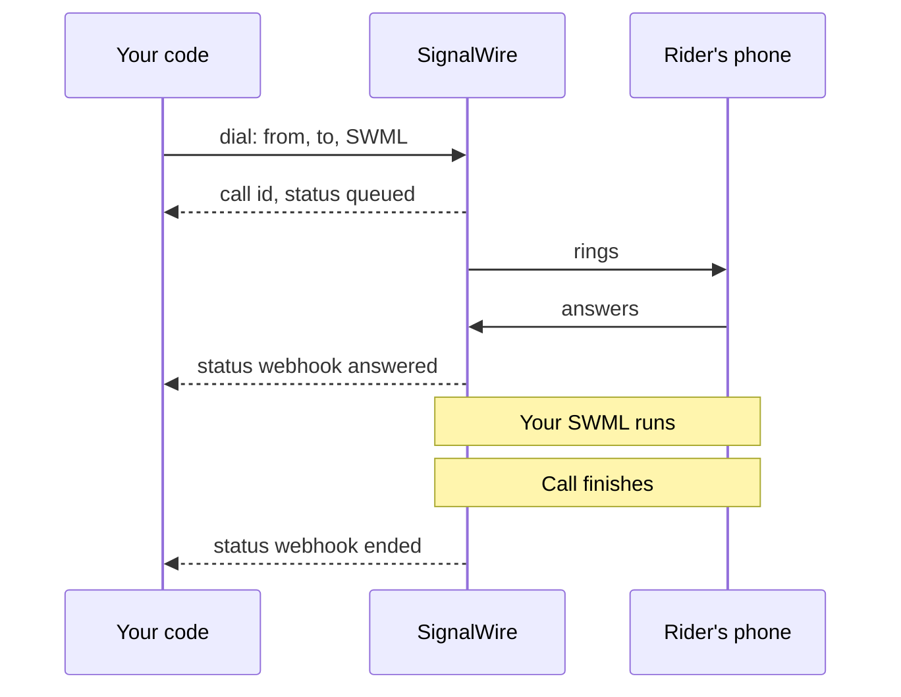
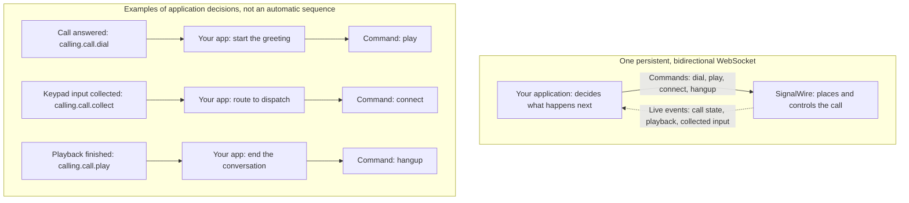

[calling-api]: /docs/apis/rest/calls/call-commands
[sdk-rest-dial-python]: /docs/server-sdks/reference/python/rest/calling/dial
[sdk-rest-dial-ts]: /docs/server-sdks/reference/typescript/rest/calling/dial
[relay-dial-python]: /docs/server-sdks/reference/python/relay/client/dial
[relay-dial-ts]: /docs/server-sdks/reference/typescript/relay/client/dial
[relay-guide]: /docs/server-sdks/guides/relay-client
[browser-outbound]: /docs/browser-sdk/v4/guides/outbound-calls
[browser-auth]: /docs/browser-sdk/v4/guides/authentication
[sip-credentials]: /docs/platform/voice/sip/sip-credentials
[caller-id]: /docs/platform/voice/how-to-set-caller-id-or-cnam
[stir-shaken]: /docs/platform/voice/stir-shaken
[spam-labels]: /docs/platform/voice/resolving-spam-labels
[trial-mode]: /docs/platform/trial-mode
[international]: /docs/platform/how-to-enable-international-services
[api-credentials]: /docs/platform/your-signalwire-api-space
[phone-numbers]: /docs/platform/phone-numbers
[error-codes]: /docs/apis/error-codes
[swml-ai]: /docs/swml/reference/calling/ai
[swml-webhook-security]: /docs/swml/guides/webhook-security
[swml-expressions]: /docs/swml/reference/expressions
[ai-quickstart]: /docs/platform/ai/quickstart
[tool-calling]: /docs/platform/ai/tool-calling
[ai-best-practices]: /docs/platform/ai/best-practices
[tcpa]: /docs/platform/compliance/tcpa
[swml-connect]: /docs/swml/reference/calling/connect
[forward-calls]: /docs/swml/guides/forward-calls
[forward-node]: /docs/call-flow-builder/reference/forward-to-phone
[resource-addresses]: /docs/platform/addresses
[resources]: /docs/platform/resources

Outbound calls let your app reach a customer, connect a caller to a dispatcher, or start an AI
conversation. You choose the destination and what happens on the call.

Jump to the [examples](#examples) for working code or
[troubleshooting](#troubleshoot-outbound-calls) to diagnose a failed call.

## How outbound calls start

Your **server** can send a REST request to the [Calling API][calling-api] or dial over a
persistent Relay WebSocket connection. The Server SDK provides a client for each approach.

**Forwarding an inbound call** places an outbound call to a second destination and connects the
two callers. Configure it with [SWML call instructions][swml-connect] or Call Flow Builder's
[Forward to Phone node][forward-node].

The **Browser SDK** lets a person dial and speak through your web app's microphone and speaker.
A button that starts an automated call instead sends the request to your backend.

Registered SIP phones and phone systems can also dial through SignalWire using
[SIP credentials][sip-credentials].

## Destinations you can call

A destination can be a phone on the public switched telephone network (PSTN), a SIP endpoint, or a
resource in your SignalWire Space.

| Destination | Address format | What you reach |
|---|---|---|
| Phone number | E.164, such as `+15557654321` | A mobile or landline phone over the PSTN. |
| SIP endpoint | SIP URI, such as `sip:dispatcher@example.com` | A SIP phone, PBX, or another provider's SIP service. |
| Call Fabric application or room | Resource address, such as `/public/dispatch-agent` | An AI agent, SWML application, or room in your Space. |
| Call Fabric user | Resource address, such as `/private/dispatcher` | A registered user (Subscriber) in your Space. |

Applications, rooms, and Subscribers are [Resources][resources]. Dial their configured
[address][resource-addresses], including the `public` or `private` context, to reach them directly.

### Support by API and SDK

<Tabs>
<Tab title="REST">

The Calling API and Server SDK REST clients accept all four destination types above in `to`.
Set the calling address in `from`. See the [Calling API reference][calling-api] for all fields.

</Tab>
<Tab title="Relay (WebSocket)">

The Relay client accepts phone and SIP devices in a nested `devices` list:

- **Phone:** `type: "phone"`, with `params.to_number` and `params.from_number`.
- **SIP:** `type: "sip"`, with `params.to` and `params.from`.

Each inner list rings together; the outer list sets the order of attempts. The
[Python][relay-dial-python] and [TypeScript][relay-dial-ts] references cover device options.

</Tab>
</Tabs>

The **Browser SDK** and **SWML `connect`** accept all four types above. Call Flow Builder's
**Forward to Phone** node supports phone numbers and SIP endpoints.

<Accordion title="Additional destination options">

The [Calling API][calling-api] also accepts `sips:` URIs and full, registered Verto addresses
such as `verto:dispatcher@YOUR_SPACE.verto.signalwire.com`.

Use `to_script` to run SWML at the destination, supplying an inline document or its URL.
The request still needs `from` and call-handling instructions in `url` or `swml`; `to` can be omitted.

SWML `connect` also supports [queues](/docs/swml/reference/calling/connect#connect-to-a-queue-with-transfer-after-bridge)
(`queue:support`, with the required `transfer_after_bridge`) and
[WebSocket media streams](/docs/swml/reference/calling/connect#connect-to-a-websocket-stream)
(`stream:wss://example.com/audio`). Follow the linked examples for their connection settings.

</Accordion>

## How the call runs

With REST, SignalWire runs the instructions you supply. With Relay, your running application
controls the call through commands and events.

<Tabs>
<Tab title="REST">

A `dial` request supplies a SignalWire Markup Language (SWML) document in `swml` or at `url`.
SignalWire places the call and runs the document after answer. The document can play audio,
run an AI agent, or connect another destination. Progress arrives at your webhook endpoint.

This flow uses `answered` and `ended` webhooks:

<llms-ignore>


</llms-ignore>

<llms-only>



</llms-only>

</Tab>
<Tab title="Relay (WebSocket)">

Relay keeps a bidirectional WebSocket open between your server and SignalWire. Your app sends
commands such as `dial`, `play`, and `connect`; SignalWire sends live events back. Your code
uses those events to decide what the call does next.

<llms-ignore>


</llms-ignore>

<llms-only>



</llms-only>

</Tab>
</Tabs>

## Before you dial

### Calling number

For server calls to phone numbers, use a [purchased number][phone-numbers] or
[verified caller ID][caller-id]. Pass it as `from` in REST or `params.from_number` for a Relay
phone device. SIP caller ID settings are covered in the [Calling API reference][calling-api].

<Note title="Trial mode and international calling">
[Trial projects][trial-mode] can call only purchased and verified numbers, with no international
calling. Other projects need [international dialing enabled][international] to call other countries.
</Note>

### Credentials

Server calls use your Project ID and an API token with voice permissions from the Dashboard's
[API credentials][api-credentials] page. Keep the API token on your backend.

Browser calls use a [Subscriber Access Token (SAT)][browser-auth] that your backend issues for
the user. Its permissions determine which destinations the user can call.

## Track the call's progress

<Tabs>
<Tab title="REST">

A `200` response with a call `id` means SignalWire accepted the request. Listen for `answered`
to confirm pickup and `ended` to know the call finished.

Set `status_url` to your webhook endpoint and choose `status_events`: `created`, `ringing`,
`answered`, or `ended`. If you omit `status_events`, you receive `ended` only.

</Tab>
<Tab title="Relay (WebSocket)">

The SDK's `dial` returns a call object after answer or raises `RelayError` on failure.
Use `call.on` for state and action events, and `action.wait()` to wait for an action such as
playback to finish. See the [Python](/docs/server-sdks/reference/python/relay/call/on) or
[TypeScript](/docs/server-sdks/reference/typescript/relay/call/on) event reference.

<Accordion title="Using the Relay protocol directly">
The initial `calling.dial` response acknowledges the request. A later `calling.call.dial`
event carries the dial outcome. The Server SDK waits for this event before returning a call object.
</Accordion>

</Tab>
</Tabs>

## Troubleshoot outbound calls

Start with the error returned by your API or SDK, then check the relevant case below.
Browser token setup is covered in [authentication][browser-auth].

<AccordionGroup>
<Accordion title="The REST request is rejected before the call is placed">

A `422` response includes an [error code][error-codes]. Check the field it identifies:
`not_purchased_or_verified` means that number is not purchased or verified for your project.
Also check the destination (`to`), call instructions (`url` or `swml`), and account balance.

</Accordion>
<Accordion title="The Relay dial fails">

Check the `RelayError`, confirm the client is connected, and review the device parameters.
Phone devices use `to_number` and `from_number`; SIP devices use `to` and `from`.
The [Relay guide][relay-guide] covers connection setup.

</Accordion>
<Accordion title="The call ends without being answered">

Check the ring `timeout`, [trial limits][trial-mode], and [international dialing settings][international].
For REST calls, a `max_price_per_minute` below the route's price rejects the call before it rings.

</Accordion>
<Accordion title="The person you call sees a spam warning or the wrong caller ID">

Review the calling number and any caller ID override in your request or forwarding flow.
The [Caller ID and CNAM][caller-id] guide covers display settings. For reputation issues, see
[spam labels][spam-labels] and [STIR/SHAKEN][stir-shaken].

</Accordion>
<Accordion title="The call connects but your SWML doesn't run">

Your `url` endpoint must return SWML and accept `POST` by default. Use `url_method` to change
the method or `fallback_url` to provide backup instructions. Send inline `swml` as a JSON object.
See [SWML webhook security][swml-webhook-security] for securing the endpoint.

</Accordion>
</AccordionGroup>

## Examples

Bayview Taxi uses outbound calls to notify riders and connect them with dispatchers.

### Place a call from a server

Tell a rider their driver is on the way, using REST or Relay.

<Tabs>
<Tab title="REST">

#### Place a call with REST

Host this SWML at a URL SignalWire can reach:

```yaml
version: 1.0.0
sections:
  main:
    - play: "say:Hi, this is Bayview Taxi. Your driver is on the way and will arrive in about five minutes."
```

Run one of these equivalent requests from your terminal or backend. Replace the credentials,
phone numbers, SWML URL, and status webhook URL with your own values.

<CodeBlocks>
<CodeBlock title="Calling API">
```bash
curl -X POST "https://YOUR_SPACE.signalwire.com/api/calling/calls" \
  -u "YOUR_PROJECT_ID:YOUR_API_TOKEN" \
  -H "Content-Type: application/json" \
  -d '{
    "command": "dial",
    "params": {
      "from": "+15551234567",
      "to": "+15557654321",
      "url": "https://example.com/swml/driver-on-the-way",
      "status_url": "https://example.com/call-status",
      "status_events": ["answered", "ended"]
    }
  }'
```
</CodeBlock>
<CodeBlock title="Server SDK (Python)">
```python
from signalwire.rest import RestClient

client = RestClient(
    project="YOUR_PROJECT_ID",
    token="YOUR_API_TOKEN",
    host="YOUR_SPACE.signalwire.com",
)

call = client.calling.dial(
    from_="+15551234567",
    to="+15557654321",
    url="https://example.com/swml/driver-on-the-way",
    status_url="https://example.com/call-status",
    status_events=["answered", "ended"],
)
print(call["id"])
```
</CodeBlock>
<CodeBlock title="Server SDK (TypeScript)">
```typescript
import { RestClient } from "@signalwire/sdk";

const client = new RestClient({
  project: "YOUR_PROJECT_ID",
  token: "YOUR_API_TOKEN",
  host: "YOUR_SPACE.signalwire.com",
});

const call = await client.calling.dial({
  from: "+15551234567",
  to: "+15557654321",
  url: "https://example.com/swml/driver-on-the-way",
  status_url: "https://example.com/call-status",
  status_events: ["answered", "ended"],
});
console.log(call.id);
```
</CodeBlock>
</CodeBlocks>

The response identifies the queued call:

```json
{
  "id": "0e9c80d7-a149-4917-892d-420043709f45",
  "from": "+15551234567",
  "to": "+15557654321",
  "direction": "outbound-api",
  "status": "queued",
  "created_at": "2026-09-04T15:20:00Z"
}
```

Keep the `id` for later call commands. Your `status_url` receives the requested `answered` and
`ended` webhooks. See the REST client reference for [Python][sdk-rest-dial-python] or
[TypeScript][sdk-rest-dial-ts] for the full request schema.

<Accordion title="Send the SWML inline and personalize each call">

Send the document as a JSON object in `swml` instead of hosting it at `url`.
Pass per-call values in `custom_variables` and read them with [SWML expressions][swml-expressions]
such as `${envs.driver_name}`:

```bash
curl -X POST "https://YOUR_SPACE.signalwire.com/api/calling/calls" \
  -u "YOUR_PROJECT_ID:YOUR_API_TOKEN" \
  -H "Content-Type: application/json" \
  -d '{
    "command": "dial",
    "params": {
      "from": "+15551234567",
      "to": "+15557654321",
      "custom_variables": { "driver_name": "Sam", "eta_minutes": "5" },
      "swml": {
        "version": "1.0.0",
        "sections": {
          "main": [
            { "play": "say:Hi, this is Bayview Taxi. ${envs.driver_name} is on the way and will arrive in about ${envs.eta_minutes} minutes." }
          ]
        }
      }
    }
  }'
```

`custom_variables` also works with SWML served from `url`.

</Accordion>

</Tab>
<Tab title="Relay (WebSocket)">

#### Place a call with the Server SDK Relay client

Run this on your server with your credentials and phone numbers. It dials the rider, plays
the announcement after answer, waits for playback to finish, and hangs up.

<CodeBlocks>
<CodeBlock title="Server SDK Relay (Python)">
```python
import asyncio
from signalwire.relay import RelayClient

client = RelayClient(
    project="YOUR_PROJECT_ID",
    token="YOUR_API_TOKEN",
    host="YOUR_SPACE.signalwire.com",
    contexts=["default"],
)

async def main():
    async with client:
        call = await client.dial(
            devices=[[{
                "type": "phone",
                "params": {
                    "from_number": "+15551234567",
                    "to_number": "+15557654321",
                    "timeout": 30,
                },
            }]],
        )
        action = await call.play([{
            "type": "tts",
            "params": {"text": "Hi, this is Bayview Taxi. Your driver is on the way."},
        }])
        await action.wait()
        await call.hangup()

asyncio.run(main())
```
</CodeBlock>
<CodeBlock title="Server SDK Relay (TypeScript)">
```typescript
import { RelayClient } from "@signalwire/sdk";

const client = new RelayClient({
  project: "YOUR_PROJECT_ID",
  token: "YOUR_API_TOKEN",
  host: "YOUR_SPACE.signalwire.com",
  contexts: ["default"],
});

await client.connect();

const call = await client.dial([[{
  type: "phone",
  params: {
    from_number: "+15551234567",
    to_number: "+15557654321",
    timeout: 30,
  },
}]]);
const action = await call.play([
  { type: "tts", text: "Hi, this is Bayview Taxi. Your driver is on the way." },
]);
await action.wait();
await call.hangup();

await client.disconnect();
```
</CodeBlock>
</CodeBlocks>

See the [Relay guide][relay-guide] for connection management and more call controls.

</Tab>
</Tabs>

### Forward an inbound call

Assign this SWML script to the SignalWire number that riders call. When a rider calls in,
SignalWire dials the dispatcher's phone and connects them:

```yaml
version: 1.0.0
sections:
  main:
    - connect:
        from: "+15551234567"
        to: "+15557654321"
```

Set `from` to your SignalWire number and `to` to the dispatcher's number. The
[forwarding guide][forward-calls] covers assigning the script and preserving the original caller ID.
Use `connect`'s `call_state_url` and `call_state_events` to track the outbound call.

### Place a call with the Browser SDK

Let the dispatcher speak to the rider through your web app. Supply a
[Subscriber Access Token][browser-auth] as `SAT`, with permission to call phone numbers.

Use an HTTPS page with `<audio id="remote-audio" autoplay></audio>` and
`<button id="hangup">Hang up</button>`. Run the dialing code from a user action, such as a
**Call rider** button.

```typescript
import { SignalWire, StaticCredentialProvider } from "@signalwire/js";

// SAT is a Subscriber Access Token your backend issued for this user.
const client = new SignalWire(new StaticCredentialProvider({ token: SAT }));
const remoteAudio = document.querySelector<HTMLAudioElement>("#remote-audio")!;
const hangupButton = document.querySelector<HTMLButtonElement>("#hangup")!;

// Audio only, the default for a phone-style call.
const call = await client.dial("+15557654321");
call.remoteStream$.subscribe((stream) => (remoteAudio.srcObject = stream));

hangupButton.onclick = () => call.hangup();
```

Watch for `status$` to reach `connected`. The [Browser SDK outbound guide][browser-outbound]
includes a complete page with media and call controls.

### Run an AI agent with SWML

Use this SWML in the [REST example](#place-a-call-with-rest) to replace the announcement with
an AI conversation. The [`ai` method][swml-ai] supplies the agent's greeting and instructions:

```yaml
version: 1.0.0
sections:
  main:
    - ai:
        params:
          static_greeting: "Hello, this is an automated assistant calling from Bayview Taxi about your pickup. This call uses an artificial voice."
          static_greeting_no_barge: true
        prompt:
          text: |
            You are calling to tell the rider their driver is about five minutes away.
            Answer questions using that estimate. You cannot change bookings or
            contact preferences. If asked, explain that the rider needs to contact
            Bayview Taxi to make those changes. Do not claim to have made a change.
```

`static_greeting_no_barge` lets the greeting finish before the conversation begins. Add
[tool calling][tool-calling] to let the agent take actions, such as updating a booking.
The [AI quickstart][ai-quickstart] covers serving an agent from your code.

<Warning title="Outbound AI calls are regulated">
An AI voice counts as an artificial voice under the Telephone Consumer Protection Act (TCPA).
Check consent, your do-not-call list, and the local calling hours in your code before you send the
`dial` request. The [TCPA guide][tcpa] and
the compliance section of [AI best practices][ai-best-practices] cover each obligation. This is
technical guidance, not legal advice.
</Warning>
