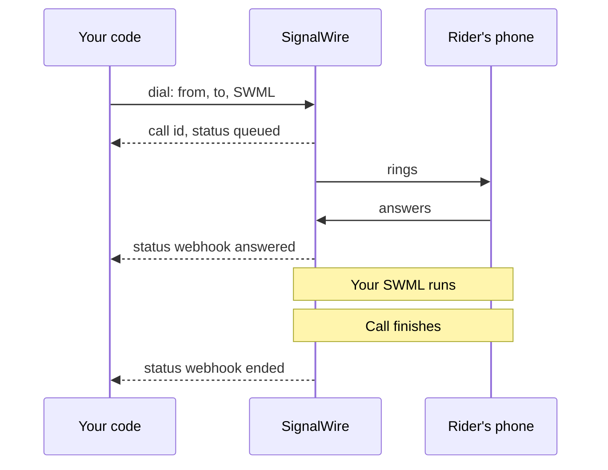

[calling-api]: /docs/apis/rest/calls/call-commands
[sdk-rest-dial-python]: /docs/server-sdks/reference/python/rest/calling/dial
[sdk-rest-dial-ts]: /docs/server-sdks/reference/typescript/rest/calling/dial
[relay-dial-python]: /docs/server-sdks/reference/python/relay/client/dial
[relay-dial-ts]: /docs/server-sdks/reference/typescript/relay/client/dial
[relay-guide]: /docs/server-sdks/guides/relay-client
[browser-outbound]: /docs/browser-sdk/v4/guides/outbound-calls
[browser-auth]: /docs/browser-sdk/v4/guides/authentication
[sip-credentials]: /docs/platform/voice/sip/sip-credentials
[caller-id]: /docs/platform/voice/how-to-set-caller-id-or-cnam
[stir-shaken]: /docs/platform/voice/stir-shaken
[spam-labels]: /docs/platform/voice/resolving-spam-labels
[trial-mode]: /docs/platform/trial-mode
[international]: /docs/platform/how-to-enable-international-services
[api-credentials]: /docs/platform/your-signalwire-api-space
[phone-numbers]: /docs/platform/phone-numbers
[error-codes]: /docs/apis/error-codes
[swml-ai]: /docs/swml/reference/calling/ai
[swml-webhook-security]: /docs/swml/guides/webhook-security
[swml-expressions]: /docs/swml/reference/expressions
[ai-quickstart]: /docs/platform/ai/quickstart
[tool-calling]: /docs/platform/ai/tool-calling
[ai-best-practices]: /docs/platform/ai/best-practices
[tcpa]: /docs/platform/compliance/tcpa

An outbound call is a call your application places to someone else's phone. Bayview Taxi might
send an automated driver-arrival announcement or let a dispatcher speak to the rider from a web app.

## Choose server-side or client-side calling

Start with what your application needs to do:

| You want to… | Where your calling code runs | Start here |
|---|---|---|
| Play an announcement, run an AI agent, or automate a call | Your backend, using the Calling API or Server SDK | [Call from a server](#call-from-a-server) |
| Let a person talk through a web app's microphone and speaker | The user's browser, using the Browser SDK | [Call from a browser](#call-from-a-browser) |

A button in a web app can also ask your backend to start an automated call. That uses the
server-side path; use the Browser SDK when the person in the browser will participate in the call.

A registered SIP phone or phone system can also dial out through SignalWire. The
[SIP credentials][sip-credentials] page covers that setup.

## Before you dial

You need a [phone number][phone-numbers] purchased in your project, or a
[verified caller ID][caller-id], to call from. Any number you pass as `from` or `caller_id` on a
call to the public telephone network must be one of those, in E.164 format such as `+15551234567`.

<Note title="Trial mode and international calling">
A project in [trial mode][trial-mode] can only call purchased and verified numbers, and can't call
internationally at all. Outside trial mode, calls to other countries still need
[international dialing enabled][international] for your Space.
</Note>

## Call from a server

Run these examples on your backend. You need your Project ID and an API token with voice
permissions from the [API credentials][api-credentials] page of your Dashboard. Keep the API
token on the server.

There are two ways to control a server-initiated call:

- **Calling API or Server SDK REST client:** Send SignalWire a SignalWire Markup Language (SWML)
  document to run when the rider answers. Start here for an announcement or AI agent.
- **Server SDK Relay client:** Keep a WebSocket connection open and control the call from your
  Python or TypeScript code. See [Control the call with Relay](#control-the-call-with-relay).

### Let SignalWire run the call

Your server sends the dial request. SignalWire queues the call, runs your SWML when someone
answers, and sends progress to your server's webhook endpoint. This diagram shows the flow with
`answered` and `ended` webhooks enabled.

<llms-ignore>


</llms-ignore>

<llms-only>



</llms-only>

Serve a SWML document at a URL SignalWire can reach. This one plays the announcement:

```yaml
version: 1.0.0
sections:
  main:
    - play: "say:Hi, this is Bayview Taxi. Your driver is on the way and will arrive in about five minutes."
```

Then point a `dial` request at that URL. These three examples send the same request, each asking
for an update when the call is answered and when it ends.

<CodeBlocks>
<CodeBlock title="Calling API">
```bash
curl -X POST "https://YOUR_SPACE.signalwire.com/api/calling/calls" \
  -u "YOUR_PROJECT_ID:YOUR_API_TOKEN" \
  -H "Content-Type: application/json" \
  -d '{
    "command": "dial",
    "params": {
      "from": "+15551234567",
      "to": "+15557654321",
      "url": "https://example.com/swml/driver-on-the-way",
      "status_url": "https://example.com/call-status",
      "status_events": ["answered", "ended"]
    }
  }'
```
</CodeBlock>
<CodeBlock title="Server SDK (Python)">
```python
from signalwire.rest import RestClient

client = RestClient(
    project="YOUR_PROJECT_ID",
    token="YOUR_API_TOKEN",
    host="YOUR_SPACE.signalwire.com",
)

call = client.calling.dial(
    from_="+15551234567",
    to="+15557654321",
    url="https://example.com/swml/driver-on-the-way",
    status_url="https://example.com/call-status",
    status_events=["answered", "ended"],
)
print(call["id"])
```
</CodeBlock>
<CodeBlock title="Server SDK (TypeScript)">
```typescript
import { RestClient } from "@signalwire/sdk";

const client = new RestClient({
  project: "YOUR_PROJECT_ID",
  token: "YOUR_API_TOKEN",
  host: "YOUR_SPACE.signalwire.com",
});

const call = await client.calling.dial({
  from: "+15551234567",
  to: "+15557654321",
  url: "https://example.com/swml/driver-on-the-way",
  status_url: "https://example.com/call-status",
  status_events: ["answered", "ended"],
});
console.log(call.id);
```
</CodeBlock>
</CodeBlocks>

The Calling API and Server SDK REST clients ([Python][sdk-rest-dial-python] or
[TypeScript][sdk-rest-dial-ts]) send the same `dial` command, so their parameters match.
The response returns the new call before anyone answers:

```json
{
  "id": "0e9c80d7-a149-4917-892d-420043709f45",
  "from": "+15551234567",
  "to": "+15557654321",
  "direction": "outbound-api",
  "status": "queued",
  "created_at": "2026-09-04T15:20:00Z"
}
```

A `200` response with a call `id` means SignalWire accepted the request. It does not mean the
rider answered. Keep the `id` to end or transfer the call with other Calling API commands.

Progress arrives at `status_url` as webhooks for the events you list in `status_events`: `created`,
`ringing`, `answered`, and `ended`. Omit `status_events` and you get `ended` only. The full
parameter list is on the [Calling API reference][calling-api]. Listen for `answered` to confirm
the rider picked up and `ended` to know the call finished.

<Accordion title="Send the SWML inline and personalize each call">

You don't have to host the document. Send it in the `swml` field instead of `url`, as a JSON
object rather than a string of escaped JSON. To make the logic specific to one call, attach your
own values in `custom_variables` and read them in the SWML as `${envs.<key>}` using
[SWML expressions][swml-expressions].

```bash
curl -X POST "https://YOUR_SPACE.signalwire.com/api/calling/calls" \
  -u "YOUR_PROJECT_ID:YOUR_API_TOKEN" \
  -H "Content-Type: application/json" \
  -d '{
    "command": "dial",
    "params": {
      "from": "+15551234567",
      "to": "+15557654321",
      "custom_variables": { "driver_name": "Sam", "eta_minutes": "5" },
      "swml": {
        "version": "1.0.0",
        "sections": {
          "main": [
            { "play": "say:Hi, this is Bayview Taxi. ${envs.driver_name} is on the way and will arrive in about ${envs.eta_minutes} minutes." }
          ]
        }
      }
    }
  }'
```

The same variables are available when you serve SWML from `url`, so one document can personalize
many calls.

</Accordion>

### Run an AI agent with SWML

On calls where SignalWire runs the logic, swapping the SWML document changes what the rider hears
without changing how you dial. Replace the `play` method with the [`ai` method][swml-ai] to turn
the announcement into a conversation:

```yaml
version: 1.0.0
sections:
  main:
    - ai:
        params:
          static_greeting: "Hello, this is an automated assistant calling from Bayview Taxi about your pickup. This call uses an artificial voice."
          static_greeting_no_barge: true
        prompt:
          text: |
            You are calling to tell the rider their driver is about five minutes away.
            Answer questions using that estimate. You cannot change bookings or
            contact preferences. If asked, explain that the rider needs to contact
            Bayview Taxi to make those changes. Do not claim to have made a change.
```

This agent only answers questions about the arrival estimate. With `static_greeting_no_barge`
enabled, the greeting plays in full before the agent's first turn, even if the rider starts talking.

To let the agent change a booking or record a request to stop future calls, connect it to your
backend with [tool calling][tool-calling]. Treat those as separate actions: stopping future calls
doesn't cancel the current ride. The [AI quickstart][ai-quickstart] shows how to serve an agent
from your own code.

<Warning title="Outbound AI calls are regulated">
An AI voice counts as an artificial voice under the Telephone Consumer Protection Act (TCPA).
Check consent, your do-not-call list, and the local calling hours in your code before you send the
`dial` request, because once the call is placed it has already happened. The [TCPA guide][tcpa] and
the compliance section of [AI best practices][ai-best-practices] cover each obligation. This is
technical guidance, not legal advice.
</Warning>

### Control the call with Relay

These Relay examples play the announcement directly from your server. Your code waits for the
rider to answer, speaks the message, and ends the call.

<CodeBlocks>
<CodeBlock title="Server SDK Relay (Python)">
```python
import asyncio
from signalwire.relay import RelayClient

client = RelayClient(
    project="YOUR_PROJECT_ID",
    token="YOUR_API_TOKEN",
    host="YOUR_SPACE.signalwire.com",
    contexts=["default"],
)

async def main():
    async with client:
        call = await client.dial(
            devices=[[{
                "type": "phone",
                "params": {
                    "from_number": "+15551234567",
                    "to_number": "+15557654321",
                    "timeout": 30,
                },
            }]],
        )
        action = await call.play([{
            "type": "tts",
            "params": {"text": "Hi, this is Bayview Taxi. Your driver is on the way."},
        }])
        await action.wait()
        await call.hangup()

asyncio.run(main())
```
</CodeBlock>
<CodeBlock title="Server SDK Relay (TypeScript)">
```typescript
import { RelayClient } from "@signalwire/sdk";

const client = new RelayClient({
  project: "YOUR_PROJECT_ID",
  token: "YOUR_API_TOKEN",
  host: "YOUR_SPACE.signalwire.com",
  contexts: ["default"],
});

await client.connect();

const call = await client.dial([[{
  type: "phone",
  params: {
    from_number: "+15551234567",
    to_number: "+15557654321",
    timeout: 30,
  },
}]]);
const action = await call.play([
  { type: "tts", text: "Hi, this is Bayview Taxi. Your driver is on the way." },
]);
await action.wait();
await call.hangup();

await client.disconnect();
```
</CodeBlock>
</CodeBlocks>

With Relay, `dial` returns a call object when the rider answers, or raises `RelayError` if dialing
fails. Then `play` speaks the announcement and `hangup` ends the call.
The [Python][relay-dial-python] and [TypeScript][relay-dial-ts] references cover timeouts and
ringing several destinations.

## Call from a browser

Run the Browser SDK in your frontend so the dispatcher can speak to the rider using the device's
microphone and speaker. This path has two parts:

1. **Backend:** Authenticate the user and issue a [Subscriber Access Token (SAT)][browser-auth]
   that allows them to call phone numbers. Your Project API Token stays on the backend.
2. **Browser:** Use that SAT with `@signalwire/js` to dial the rider and handle live audio and
   call controls. The example below runs here.

Use an HTTPS page with `<audio id="remote-audio" autoplay></audio>` and
`<button id="hangup">Hang up</button>`. Run the dialing code from a user action, such as a
**Call rider** button.

```typescript
import { SignalWire, StaticCredentialProvider } from "@signalwire/js";

// SAT is a Subscriber Access Token your backend issued for this user.
const client = new SignalWire(new StaticCredentialProvider({ token: SAT }));
const remoteAudio = document.querySelector<HTMLAudioElement>("#remote-audio")!;
const hangupButton = document.querySelector<HTMLButtonElement>("#hangup")!;

// Audio only, the default for a phone-style call.
const call = await client.dial("+15557654321");
call.remoteStream$.subscribe((stream) => (remoteAudio.srcObject = stream));

hangupButton.onclick = () => call.hangup();
```

Watch for `status$` to reach `connected` to confirm the browser call connected. If `dial()`
rejects, check that the token is allowed to reach the destination. The
[Browser SDK outbound guide][browser-outbound] includes a complete page with media and call controls.

## Troubleshoot outbound calls

For Calling API and Server SDK REST requests, a `422` means the call was rejected before it was
placed. Check the error code first. For browser setup and token issues, see
[Browser SDK authentication][browser-auth].

<AccordionGroup>
<Accordion title="The request is rejected before the call is placed">

A `422` response carries an [error code][error-codes] that names the problem. `not_purchased_or_verified`
means the `from` number isn't yours. `not_valid_for_caller_id` means `from` or `caller_id` isn't an
E.164 number, caller ID string, or SIP URI. `invalid_destination_number` and
`destination_number_not_supported` point at `to`. `insufficient_balance` means the project can't pay
for the call. A `dial` request that has neither `url` nor `swml` is also rejected.

</Accordion>
<Accordion title="The call ends without being answered">

Check the account limits first. A project in [trial mode][trial-mode] can only reach purchased and
verified numbers. International destinations fail until you [enable international
dialing][international]. If those are fine, a `timeout` shorter than the destination's ring time
ends the call early, and a `max_price_per_minute` below the route's price rejects it before it
rings.

</Accordion>
<Accordion title="The person you call sees a spam warning or the wrong caller ID">

The displayed number is `from`, or `caller_id` when you set it, and both must be numbers you own.
Set the caller name with the [Caller ID and CNAM][caller-id] guide. A "Spam likely" label on your
number is a reputation problem rather than a configuration one. Start with the
[spam labels][spam-labels] guide and confirm your calls carry [STIR/SHAKEN][stir-shaken]
attestation.

</Accordion>
<Accordion title="The call connects but your SWML doesn't run">

SignalWire requests `url` with `POST` unless you set `url_method`, and the endpoint has to return a
SWML document. Set `fallback_url` so a failed fetch still gets instructions, and secure the endpoint
as described in [SWML webhook security][swml-webhook-security]. An inline `swml` value must be a
JSON object, not a string of escaped JSON.

</Accordion>
</AccordionGroup>

## Next steps

<CardGroup cols={2}>
  <Card title="Calling API reference" icon="regular code" href="/docs/apis/rest/calls/call-commands">
    Every `dial` parameter, plus the commands that control a call after it's placed.
  </Card>
  <Card title="Relay client" icon="regular server" href="/docs/server-sdks/guides/relay-client">
    Stay on the call from your server and react to events as they happen.
  </Card>
  <Card title="Outbound calls from the browser" icon="regular browser" href="/docs/browser-sdk/v4/guides/outbound-calls">
    Destinations, media options, and call controls for click-to-call pages.
  </Card>
  <Card title="Make and receive calls with SWML" icon="regular phone" href="/docs/swml/guides/make-and-receive-calls">
    Handle the inbound side and build the SWML your outbound calls run.
  </Card>
</CardGroup>
