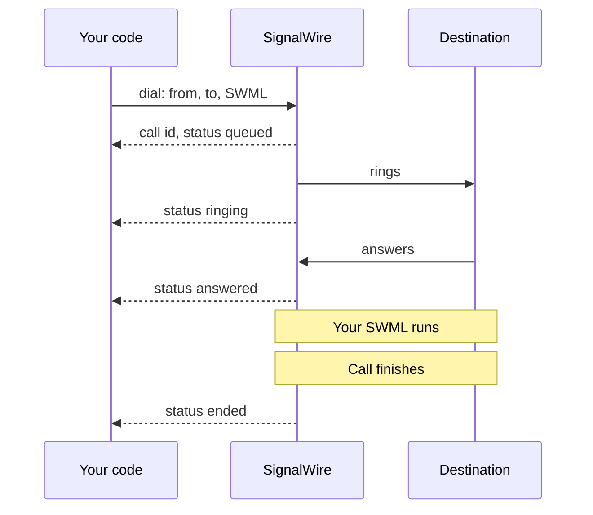
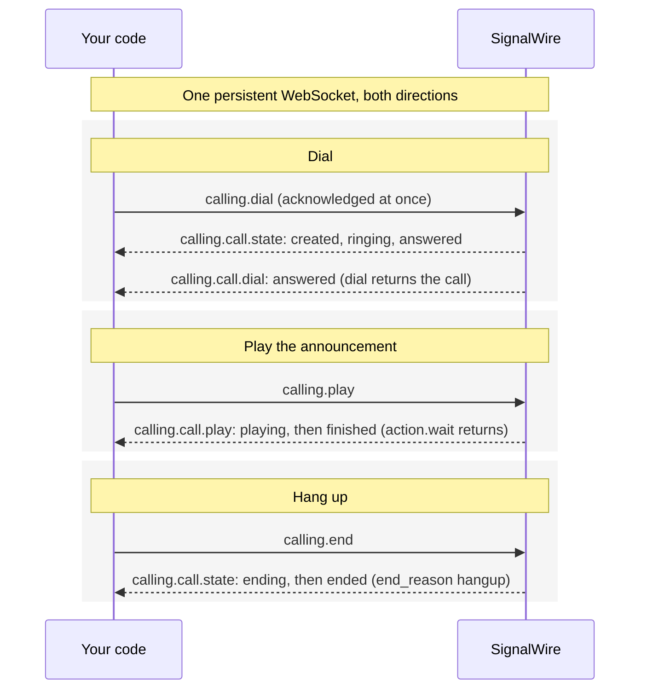

[browser-auth]: /docs/browser-sdk/v4/guides/authentication
[caller-id]: /docs/platform/voice/how-to-set-caller-id-or-cnam
[trial-mode]: /docs/platform/trial-mode
[international]: /docs/platform/how-to-enable-international-services
[api-credentials]: /docs/platform/your-signalwire-api-space
[phone-numbers]: /docs/platform/phone-numbers
[swml-ai]: /docs/swml/reference/calling/ai
[ai-best-practices]: /docs/platform/ai/best-practices
[tcpa]: /docs/platform/compliance/tcpa
[resources]: /docs/platform/resources
[sdk-install]: /docs/server-sdks/guides/installation
[browser-sdk]: /docs/browser-sdk/v4/guides/overview

SignalWire lets your application place outbound calls to phone numbers, SIP endpoints,
web clients, and [SignalWire Resources][resources]. Use outbound calls to play an announcement,
start a conversation with an AI agent, or connect someone to another destination.

## Choose an API

- **REST:** Send a request with instructions for SignalWire to run when the call is answered.
- **WebSocket (Relay):** Control the call by sending commands and receiving events over a
  persistent connection.

## Prerequisites

- **Credentials:** Get your Project ID and API token from the Dashboard's
  [API credentials][api-credentials] page. For browser calls, use them on your backend to create a
  [Subscriber Access Token (SAT)][browser-auth].
- **Tools:** Use cURL for REST requests, or install the [Server SDK][sdk-install] or
  [Browser SDK][browser-sdk].
- **Caller ID for phone calls:** Use a voice-capable [number in your project][phone-numbers] or a
  [verified caller ID][caller-id].

<Warning title="Trial projects and international calls are restricted">
A [trial project][trial-mode] can dial only numbers it has purchased or verified, and cannot call
internationally at all. Any other project can dial any number, but needs
[international dialing enabled][international] before it reaches another country.
</Warning>

## Make your first call

Call a phone you can answer and play a short announcement from your server.

<Steps>

### Set your credentials and phone numbers

Replace these values in the code sample you choose:

| Value | Replace with |
|---|---|
| `YOUR_SPACE` | Your Space's subdomain in `YOUR_SPACE.signalwire.com` |
| `YOUR_PROJECT_ID` | Your Project ID |
| `YOUR_API_TOKEN` | Your API token |
| `+15551234567` | Your caller ID number |
| `+15557654321` | A phone number you can answer |

Use E.164 format for both numbers, including `+` and the country code.

### Place a call from a server

Choose REST or WebSocket, then select a code sample. Run the cURL request in your terminal or
the SDK code in your server environment.

<Tabs groupId="outbound-api">
<Tab title="REST">

The request includes a SignalWire Markup Language (SWML) document in `swml`. SignalWire runs
it when the destination answers, playing the announcement below.

<CodeBlocks>
<CodeBlock title="cURL — Calling API">
```bash
curl -X POST "https://YOUR_SPACE.signalwire.com/api/calling/calls" \
  -u "YOUR_PROJECT_ID:YOUR_API_TOKEN" \
  -H "Content-Type: application/json" \
  -d '{
    "command": "dial",
    "params": {
      "from": "+15551234567",
      "to": "+15557654321",
      "swml": {
        "version": "1.0.0",
        "sections": {
          "main": [
            { "play": "say:Hi, this is Bayview Taxi. Your driver is on the way and will arrive in about five minutes." }
          ]
        }
      }
    }
  }'
```
</CodeBlock>
<CodeBlock title="Python — REST client">
```python
from signalwire.rest import RestClient

client = RestClient(
    project="YOUR_PROJECT_ID",
    token="YOUR_API_TOKEN",
    host="YOUR_SPACE.signalwire.com",
)

call = client.calling.dial(
    from_="+15551234567",
    to="+15557654321",
    swml={
        "version": "1.0.0",
        "sections": {
            "main": [
                {"play": "say:Hi, this is Bayview Taxi. Your driver is on the way and will arrive in about five minutes."}
            ]
        },
    },
)
print(call["id"])
```
</CodeBlock>
<CodeBlock title="TypeScript — REST client">
```typescript
import { RestClient } from "@signalwire/sdk";

const client = new RestClient({
  project: "YOUR_PROJECT_ID",
  token: "YOUR_API_TOKEN",
  host: "YOUR_SPACE.signalwire.com",
});

const call = await client.calling.dial({
  from: "+15551234567",
  to: "+15557654321",
  swml: {
    version: "1.0.0",
    sections: {
      main: [
        { play: "say:Hi, this is Bayview Taxi. Your driver is on the way and will arrive in about five minutes." },
      ],
    },
  },
});
console.log(call.id);
```
</CodeBlock>
</CodeBlocks>

The REST API returns a call `id` and status `queued`, confirming that it accepted the request:

```json
{
  "id": "0e9c80d7-a149-4917-892d-420043709f45",
  "from": "+15551234567",
  "to": "+15557654321",
  "direction": "outbound-api",
  "status": "queued",
  "created_at": "2026-09-04T15:20:00Z"
}
```

</Tab>
<Tab title="WebSocket (Relay)">

The SDK opens a WebSocket connection, dials the destination, and plays the announcement after
answer. It waits for playback to finish, then hangs up and closes the connection.

<CodeBlocks>
<CodeBlock title="Python — Relay client">
```python
import asyncio
from signalwire.relay import RelayClient

client = RelayClient(
    project="YOUR_PROJECT_ID",
    token="YOUR_API_TOKEN",
    host="YOUR_SPACE.signalwire.com",
    contexts=["default"],
)

async def main():
    async with client:
        call = await client.dial(
            devices=[[{
                "type": "phone",
                "params": {
                    "from_number": "+15551234567",
                    "to_number": "+15557654321",
                    "timeout": 30,
                },
            }]],
        )
        action = await call.play([{
            "type": "tts",
            "params": {"text": "Hi, this is Bayview Taxi. Your driver is on the way and will arrive in about five minutes."},
        }])
        await action.wait()
        await call.hangup()

asyncio.run(main())
```
</CodeBlock>
<CodeBlock title="TypeScript — Relay client">
```typescript
import { RelayClient } from "@signalwire/sdk";

const client = new RelayClient({
  project: "YOUR_PROJECT_ID",
  token: "YOUR_API_TOKEN",
  host: "YOUR_SPACE.signalwire.com",
  contexts: ["default"],
});

await client.connect();

const call = await client.dial([[{
  type: "phone",
  params: {
    from_number: "+15551234567",
    to_number: "+15557654321",
    timeout: 30,
  },
}]]);
const action = await call.play([
  { type: "tts", text: "Hi, this is Bayview Taxi. Your driver is on the way and will arrive in about five minutes." },
]);
await action.wait();
await call.hangup();

await client.disconnect();
```
</CodeBlock>
</CodeBlocks>

</Tab>
</Tabs>

### Answer the call

Answer the destination phone. You should hear “Hi, this is Bayview Taxi” followed by the driver
arrival message. The call ends when the announcement finishes.

</Steps>

## Track the call's progress

<Tabs groupId="outbound-api">
<Tab title="REST">

Once you create a call, SignalWire tracks its status through the lifecycle: `queued`, `created`,
`ringing`, `answered`, and `ended`. To follow that lifecycle from your application, add a
`status_url` to the `dial` request. SignalWire sends a POST to that URL each time the call reaches
a status you asked about.

The `dial` response itself gives you the first status. It returns the call `id` with status
`queued`, meaning SignalWire accepted the request and is about to place the call. Everything after
that arrives at your `status_url`.

Choose which statuses to receive with `status_events`: any of `created`, `ringing`, `answered`,
and `ended`. If you omit it, you receive `ended` only. Most applications ask for `answered`, to
confirm someone picked up, and `ended`, to know the call is over. The `ended` payload includes an
`end_reason`, such as `hangup`, `busy`, or `noAnswer`, so you can tell how it ended.

<CodeBlocks>
<CodeBlock title="cURL — Calling API">
```bash
curl -X POST "https://YOUR_SPACE.signalwire.com/api/calling/calls" \
  -u "YOUR_PROJECT_ID:YOUR_API_TOKEN" \
  -H "Content-Type: application/json" \
  -d '{
    "command": "dial",
    "params": {
      "from": "+15551234567",
      "to": "+15557654321",
      "url": "https://example.com/swml",
      "status_url": "https://example.com/call-status",
      "status_events": ["ringing", "answered", "ended"]
    }
  }'
```
</CodeBlock>
<CodeBlock title="Python — REST client">
```python
call = client.calling.dial(
    from_="+15551234567",
    to="+15557654321",
    url="https://example.com/swml",
    status_url="https://example.com/call-status",
    status_events=["ringing", "answered", "ended"],
)
```
</CodeBlock>
<CodeBlock title="TypeScript — REST client">
```typescript
const call = await client.calling.dial({
  from: "+15551234567",
  to: "+15557654321",
  url: "https://example.com/swml",
  status_url: "https://example.com/call-status",
  status_events: ["ringing", "answered", "ended"],
});
```
</CodeBlock>
</CodeBlocks>

This flow shows a call with `ringing`, `answered`, and `ended` status events enabled:

<llms-ignore>


</llms-ignore>

<llms-only>



</llms-only>

</Tab>
<Tab title="WebSocket (Relay)">

Relay keeps one WebSocket open between your application and SignalWire. Your application sends
commands over it, such as `calling.dial`, `calling.play`, and `calling.end`. SignalWire acknowledges
each command at once, then sends events back over the same connection as the call progresses.

Some events are the direct result of a command: `calling.dial` produces the `created` state,
`calling.play` produces `playing`, and `calling.end` produces `ending`. Others report what happened
on the call: `ringing` and `answered` as the destination responds, `finished` when playback
completes, and `ended` with an `end_reason` once the call is over.

The SDK turns this exchange into ordinary calls. `dial()` returns the call once the
`calling.call.dial` event reports `answered`, and `action.wait()` returns when the play event
reports `finished`. Use `call.on` to handle any event yourself, as described in the
[Python](/docs/server-sdks/reference/python/relay/events) or
[TypeScript](/docs/server-sdks/reference/typescript/relay/events) event reference, or the
equivalent for your language.

Because `dial()` returns once the call is answered, handlers you attach to the returned call see
the states that follow, such as `ending` and `ended`:

<CodeBlocks>
<CodeBlock title="Python — Relay client">
```python
from signalwire.relay.event import CallStateEvent

def handle_state(event: CallStateEvent):
    print(f"State: {event.call_state}, reason: {event.end_reason}")

call.on("calling.call.state", handle_state)
```
</CodeBlock>
<CodeBlock title="TypeScript — Relay client">
```typescript
import { CallStateEvent } from "@signalwire/sdk";

call.on("calling.call.state", (event: CallStateEvent) => {
  console.log(`State: ${event.callState}, reason: ${event.endReason}`);
});
```
</CodeBlock>
</CodeBlocks>

This flow follows your first call: dial, play the announcement, hang up.

<llms-ignore>


</llms-ignore>

<llms-only>



</llms-only>

</Tab>
</Tabs>

## Examples

### Place a call with the Browser SDK

Let someone place and speak on a call from your web app. Supply a
[Subscriber Access Token][browser-auth] as `SAT`, with permission to call phone numbers.

Use an HTTPS page with `<audio id="remote-audio" autoplay></audio>` and
`<button id="hangup">Hang up</button>`. Run the dialing code from a user action, such as a
**Call** button.

```typescript
import { SignalWire, StaticCredentialProvider } from "@signalwire/js";

// SAT is a Subscriber Access Token your backend issued for this user.
const client = new SignalWire(new StaticCredentialProvider({ token: SAT }));
const remoteAudio = document.querySelector<HTMLAudioElement>("#remote-audio")!;
const hangupButton = document.querySelector<HTMLButtonElement>("#hangup")!;

const call = await client.dial("+15557654321");
call.remoteStream$.subscribe((stream) => (remoteAudio.srcObject = stream));

hangupButton.onclick = () => call.hangup();
```

### Run an AI agent

Replace the announcement in the [server example](#place-a-call-from-a-server) with an AI agent:

- **SWML:** Host the document below and pass its `url` in place of the inline `swml`.
- **Relay:** Replace the playback and hangup steps with the Relay snippet below.
  Here, `call` is the answered call returned by `dial`.

<Warning title="Outbound AI calls are regulated">
An AI voice counts as an artificial voice under the Telephone Consumer Protection Act (TCPA).
Check consent, your do-not-call list, and the local calling hours in your code before you send the
`dial` request. The [TCPA guide][tcpa] and
the compliance section of [AI best practices][ai-best-practices] cover each obligation. This is
technical guidance, not legal advice.
</Warning>

<CodeBlocks>
<CodeBlock title="SWML">
```yaml
version: 1.0.0
sections:
  main:
    - ai:
        params:
          static_greeting: "Hello, this is an automated assistant calling from Bayview Taxi about your pickup. This call uses an artificial voice."
          static_greeting_no_barge: true
        prompt:
          text: |
            You are calling to tell the rider their driver is about five minutes away.
            Answer questions using that estimate. You cannot change bookings or
            contact preferences. If asked, explain that the rider needs to contact
            Bayview Taxi to make those changes. Do not claim to have made a change.
```
</CodeBlock>
<CodeBlock title="Python — Relay client">
```python
# After dialing, start the agent on the answered call.
action = await call.ai(
    ai_params={
        "static_greeting": "Hello, this is an automated assistant calling from Bayview Taxi about your pickup. This call uses an artificial voice.",
        "static_greeting_no_barge": True,
    },
    prompt={
        "text": """You are calling to tell the rider their driver is about five minutes away.
Answer questions using that estimate. You cannot change bookings or
contact preferences. If asked, explain that the rider needs to contact
Bayview Taxi to make those changes. Do not claim to have made a change."""
    },
)
await action.wait()
await call.hangup()
```
</CodeBlock>
<CodeBlock title="TypeScript — Relay client">
```typescript
// After dialing, start the agent on the answered call.
const action = await call.ai({
  aiParams: {
    static_greeting: "Hello, this is an automated assistant calling from Bayview Taxi about your pickup. This call uses an artificial voice.",
    static_greeting_no_barge: true,
  },
  prompt: {
    text: `You are calling to tell the rider their driver is about five minutes away.
Answer questions using that estimate. You cannot change bookings or
contact preferences. If asked, explain that the rider needs to contact
Bayview Taxi to make those changes. Do not claim to have made a change.`,
  },
});
await action.wait();
await call.hangup();
```
</CodeBlock>
</CodeBlocks>

`static_greeting_no_barge` lets the greeting finish before the conversation begins. The SWML
[`ai` method][swml-ai] reference covers every parameter, as does the Relay `ai` reference for
[Python](/docs/server-sdks/reference/python/relay/call/ai),
[TypeScript](/docs/server-sdks/reference/typescript/relay/call/ai), or your language's SDK.

## Next steps

<CardGroup cols={2}>
  <Card title="Calling API reference" icon="regular rectangle-api" href="/docs/apis/rest/calls/call-commands">
    Every `dial` field, plus the commands that control a call already in progress.
  </Card>
  <Card title="Relay client guide" icon="regular server" href="/docs/server-sdks/guides/relay-client">
    Connection management and event-driven call control from your backend.
  </Card>
  <Card title="Browser SDK outbound calls" icon="regular browser" href="/docs/browser-sdk/v4/guides/outbound-calls">
    A complete web page with media handling and call controls.
  </Card>
  <Card title="AI agent quickstart" icon="regular robot" href="/docs/platform/ai/quickstart">
    Build the agent that holds the conversation once someone answers.
  </Card>
</CardGroup>
