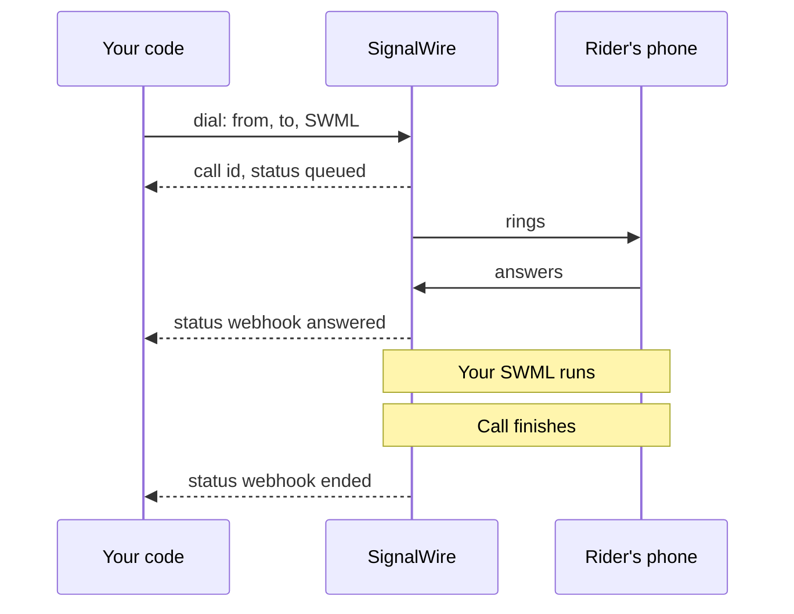
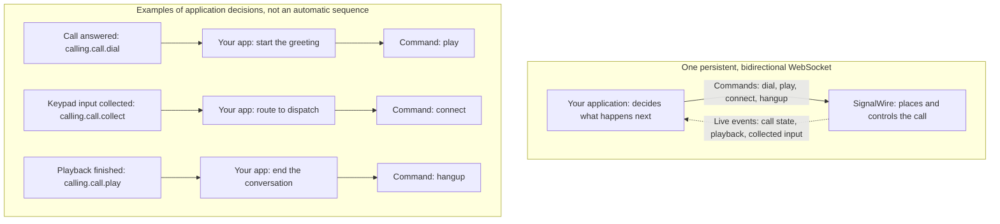

[calling-api]: /docs/apis/rest/calls/call-commands
[sdk-rest-dial-python]: /docs/server-sdks/reference/python/rest/calling/dial
[sdk-rest-dial-ts]: /docs/server-sdks/reference/typescript/rest/calling/dial
[relay-dial-python]: /docs/server-sdks/reference/python/relay/client/dial
[relay-dial-ts]: /docs/server-sdks/reference/typescript/relay/client/dial
[relay-guide]: /docs/server-sdks/guides/relay-client
[browser-outbound]: /docs/browser-sdk/v4/guides/outbound-calls
[browser-auth]: /docs/browser-sdk/v4/guides/authentication
[sip-credentials]: /docs/platform/voice/sip/sip-credentials
[caller-id]: /docs/platform/voice/how-to-set-caller-id-or-cnam
[stir-shaken]: /docs/platform/voice/stir-shaken
[spam-labels]: /docs/platform/voice/resolving-spam-labels
[trial-mode]: /docs/platform/trial-mode
[international]: /docs/platform/how-to-enable-international-services
[api-credentials]: /docs/platform/your-signalwire-api-space
[phone-numbers]: /docs/platform/phone-numbers
[error-codes]: /docs/apis/error-codes
[swml-ai]: /docs/swml/reference/calling/ai
[swml-webhook-security]: /docs/swml/guides/webhook-security
[swml-expressions]: /docs/swml/reference/expressions
[ai-quickstart]: /docs/platform/ai/quickstart
[tool-calling]: /docs/platform/ai/tool-calling
[ai-best-practices]: /docs/platform/ai/best-practices
[tcpa]: /docs/platform/compliance/tcpa
[swml-connect]: /docs/swml/reference/calling/connect
[forward-calls]: /docs/swml/guides/forward-calls
[forward-node]: /docs/call-flow-builder/reference/forward-to-phone
[resource-addresses]: /docs/platform/addresses
[resources]: /docs/platform/resources

An outbound call is a call your application or call flow places to a destination: a phone number,
SIP endpoint, or a user or application in SignalWire. It can start with a REST API request,
an inbound call being forwarded, or a request from an SDK.

## How outbound calls start

### Server API or SDK request

Your backend can start a call with an HTTP request to the [Calling API][calling-api] or a
request over a persistent Relay WebSocket connection. The Server SDK provides both a REST
client and a [Relay client][relay-guide]. Use either approach for notifications or other automation;
the tabs below explain how dialing and call control differ.

### Forwarding an inbound call

Someone calls your SignalWire number, and its call flow dials another destination and connects
the two calls. The call to the second destination is the outbound part of that conversation.

Configure this with SWML's [`connect` method][swml-connect] or Call Flow Builder's
[Forward to Phone node][forward-node]. The incoming call triggers the outbound call through that
configuration. See the [forwarding example](#forward-an-inbound-call).

### Browser SDK request

Your frontend uses the [Browser SDK][browser-outbound] to dial from the user's device and
connect its microphone and speaker to the call. Use this when a person will speak through your web app.

A button in a web app can also ask your backend to start an automated call. In that case, the
backend makes the Calling API or Server SDK request. The Browser SDK is for participating in the
call from the browser.

A registered SIP phone or phone system can also dial out through SignalWire. See
[SIP credentials][sip-credentials] for that setup.

## Destinations you can call

The destination identifies who or what you want to reach. A call can leave SignalWire over the
public telephone network (PSTN) or SIP, or connect directly to a resource in your Space.

| Destination | Address format | What you reach |
|---|---|---|
| Phone number | E.164, such as `+15557654321` | A mobile or landline phone over the PSTN. |
| SIP endpoint | SIP URI, such as `sip:dispatcher@example.com` | A SIP phone, PBX, or another provider's SIP service. |
| Call Fabric application or room | Resource address, such as `/public/dispatch-agent` | An AI agent, SWML application, or room in your Space. |
| Call Fabric user | Resource address, such as `/private/dispatcher` | A registered user (Subscriber) in your Space. |

Applications, rooms, and Subscribers are all [Resources][resources]. Use the actual
[address][resource-addresses] configured for the resource, including its `public` or `private`
context. Calling that address directly does not require a destination phone number.

### Support by API and SDK

<Tabs>
<Tab title="REST">

The Calling API and Server SDK REST clients accept phone numbers, SIP URIs, and Call Fabric
addresses in `to`. Use `from` for the calling address. The [Calling API reference][calling-api]
covers the request fields.

</Tab>
<Tab title="Relay (WebSocket)">

The Server SDK Relay client takes a nested `devices` list. Each device has a `type` and `params`:

- **Phone:** `type: "phone"`, with `params.to_number` and `params.from_number`.
- **SIP:** `type: "sip"`, with `params.to` and `params.from`.

Each inner list contains devices to ring together. The outer list gives the order in which to
try those groups. See the [Python][relay-dial-python] and [TypeScript][relay-dial-ts] dial references.

</Tab>
</Tabs>

The **Browser SDK** accepts phone numbers, SIP URIs, and Call Fabric addresses in `client.dial()`;
the user's token must allow access to the destination. For **inbound forwarding**, SWML's
[`connect`][swml-connect] accepts those addresses in `to`, while Call Flow Builder's
[Forward to Phone node][forward-node] supports phone numbers and SIP endpoints.

<Accordion title="Additional Calling API and SWML destination options">

The [Calling API][calling-api] also accepts secure SIP URIs such as
`sips:dispatcher@example.com`. For an existing Verto registration, use its full address, such as
`verto:dispatcher@YOUR_SPACE.verto.signalwire.com`; the destination must be registered.

For a destination handled by a SWML script, use `to_script` with an inline document or a URL that
returns one; `to` can then be omitted. The request still requires `from` and either `url` or
`swml` for the call-handling instructions. `to_script` supplies the destination's instructions.

SWML's [`connect` method][swml-connect] also supports queues (`queue:support`) and WebSocket
media streams (`stream:wss://example.com/audio`). A queue connection also requires
`transfer_after_bridge`, pointing to SWML to run after the bridge ends. See the complete
[queue example](/docs/swml/reference/calling/connect#connect-to-a-queue-with-transfer-after-bridge).
For media streams, use a WebSocket endpoint that handles the streamed audio; see the
[stream example](/docs/swml/reference/calling/connect#connect-to-a-websocket-stream) for codec
and callback settings.

</Accordion>

## How the call runs

Both server approaches ask SignalWire to place the call. The difference is how your backend
supplies the call logic and receives progress. The diagrams show how each approach controls a call.

<Tabs>
<Tab title="REST">

Send a `dial` request with a SignalWire Markup Language (SWML) document, either inline in `swml`
or hosted at `url`. The response returns a call ID before the rider answers. SignalWire runs the
SWML after answer and sends progress to your webhook endpoint. The document can play an
announcement, run an AI agent, or connect the recipient to another destination.

This diagram shows `answered` and `ended` webhooks enabled.

<llms-ignore>


</llms-ignore>

<llms-only>



</llms-only>

</Tab>
<Tab title="Relay (WebSocket)">

Connect your Server SDK Relay client, then call `dial` with the devices to ring. The SDK waits
for the dial outcome and returns a call object when the rider answers. Your running code then
controls the call with methods such as `play`, `connect`, and `hangup`.

The WebSocket is a persistent, bidirectional channel: your app sends commands to control the
call, and SignalWire sends live events as its state, playback, or collected input changes.
Your code uses those events to decide what to do next.

The diagram shows examples of that feedback: start a greeting after answer, choose a destination
from collected keypad input, or hang up after playback finishes. Input collection must first be
started with a method such as [play and collect](/docs/server-sdks/reference/python/relay/call/play-and-collect).
Your app makes each decision using event listeners or the SDK's action results.

<llms-ignore>


</llms-ignore>

<llms-only>



</llms-only>

</Tab>
</Tabs>

For **inbound forwarding**, the recipient connects to the original caller. For **Browser SDK
calls**, the browser user exchanges live audio with the destination.

## Before you dial

### Phone numbers and caller ID

Use E.164 format for phone numbers, such as `+15551234567`. For server calls to the PSTN,
use a [phone number][phone-numbers] purchased in your project or a [verified caller ID][caller-id]
as the calling number: `from` in REST, or `params.from_number` for a Relay phone device. SIP
destinations can use a SIP URI as the calling address; see the [Calling API reference][calling-api]
for `from` and `caller_id`.

Forwarding has its own caller ID configuration; the [forwarding guide][forward-calls] shows how
to preserve the original caller's number.

For inbound forwarding, assign your SWML script or Call Flow Builder flow to the SignalWire
number receiving the call. The [forwarding guide][forward-calls] walks through this setup.

<Note title="Trial mode and international calling">
A project in [trial mode][trial-mode] can only call purchased and verified numbers, and can't call
internationally at all. Outside trial mode, calls to other countries still need
[international dialing enabled][international] for your Space.
</Note>

### Server and browser credentials

For Calling API and Server SDK requests, use your Project ID and an API token with voice
permissions from the Dashboard's [API credentials][api-credentials] page. Keep the API token on
your backend.

For Browser SDK calls, your backend authenticates the user and issues a
[Subscriber Access Token (SAT)][browser-auth] that allows them to call the destination. Your
frontend uses that SAT with `@signalwire/js`. The Project API Token stays on the backend.

## Track the call's progress

<Tabs>
<Tab title="REST">

A `200` response with a call `id` means SignalWire accepted the request. Listen for `answered`
to confirm pickup and `ended` to know the call finished.

Set `status_url` to your webhook endpoint and choose `status_events`: `created`, `ringing`,
`answered`, or `ended`. If you omit `status_events`, you receive `ended` only.

</Tab>
<Tab title="Relay (WebSocket)">

The Server SDK's `dial` waits for the dial outcome. It returns a call object after answer or
raises `RelayError` if dialing fails. At the protocol level, the initial `calling.dial` response
only acknowledges the request; the SDK waits for a `calling.call.dial` event before returning.

Register call listeners with `call.on` to receive state and action events over the WebSocket.
For an action such as playback, `action.wait()` waits for it to finish before your next step.
See the [Python](/docs/server-sdks/reference/python/relay/call/on) or
[TypeScript](/docs/server-sdks/reference/typescript/relay/call/on) event reference.

</Tab>
</Tabs>

For **SWML forwarding**, use `connect`'s `call_state_url` and `call_state_events`, or the callback
settings of your Call Flow Builder node. For **Browser SDK calls**, watch for `status$` to reach
`connected`; if `dial()` rejects, check the destination and token permissions.

## Troubleshoot outbound calls

For Calling API and Server SDK REST requests, a `422` means the call was rejected before it was
placed. Check the error code first. For browser setup and token issues, see
[Browser SDK authentication][browser-auth].

<AccordionGroup>
<Accordion title="The REST request is rejected before the call is placed">

A `422` response carries an [error code][error-codes] that names the problem. `not_purchased_or_verified`
means the `from` number is not purchased or verified for your project. `not_valid_for_caller_id`
means `from` or `caller_id` isn't an E.164 number, caller ID string, or SIP URI. `invalid_destination_number` and
`destination_number_not_supported` point at `to`. `insufficient_balance` means the project can't pay
for the call. A `dial` request that has neither `url` nor `swml` is also rejected.

</Accordion>
<Accordion title="The Relay dial fails">

Confirm the Relay client connected with your Project ID, API token, and Space hostname before
calling `dial`. Check the `RelayError` and the device parameters: phone devices use `to_number`
and `from_number`, while SIP devices use `to` and `from`. Set a device `timeout` long enough for
the destination to answer. The [Relay guide][relay-guide] covers connection setup.

</Accordion>
<Accordion title="The call ends without being answered">

Check the account limits first. A project in [trial mode][trial-mode] can only reach purchased and
verified numbers. International destinations fail until you [enable international
dialing][international]. If those are fine, a `timeout` shorter than the destination's ring time
ends the call early, and a `max_price_per_minute` below the route's price rejects it before it
rings.

</Accordion>
<Accordion title="The person you call sees a spam warning or the wrong caller ID">

For Calling API requests to phone numbers, check `from` and any `caller_id` override against your
purchased or verified numbers. For forwarded calls, check the caller ID configured in your forwarding flow.
Set the caller name with the [Caller ID and CNAM][caller-id] guide. A "Spam likely" label on your
number is a reputation problem rather than a configuration one. Start with the
[spam labels][spam-labels] guide and confirm your calls carry [STIR/SHAKEN][stir-shaken]
attestation.

</Accordion>
<Accordion title="The call connects but your SWML doesn't run">

SignalWire requests `url` with `POST` unless you set `url_method`, and the endpoint has to return a
SWML document. Set `fallback_url` so a failed fetch still gets instructions, and secure the endpoint
as described in [SWML webhook security][swml-webhook-security]. An inline `swml` value must be a
JSON object, not a string of escaped JSON.

</Accordion>
</AccordionGroup>

## Examples

These examples use Bayview Taxi: an automated driver-arrival announcement, an incoming call
forwarded to a dispatcher, and a dispatcher speaking to a rider from the browser.

### Place a call from a server

Both approaches tell the rider their driver is on the way. Choose the client your backend uses.

<Tabs>
<Tab title="REST">

#### Place a call with REST

Run the curl command from a terminal or the SDK code on your backend, using your Project ID,
API token, and Space hostname. This flow uses SWML for the announcement and requests `answered`
and `ended` webhooks.

Serve a SWML document at a URL SignalWire can reach. This one plays the announcement:

```yaml
version: 1.0.0
sections:
  main:
    - play: "say:Hi, this is Bayview Taxi. Your driver is on the way and will arrive in about five minutes."
```

Then point a `dial` request at that URL. These three examples send the same request, each asking
for an update when the call is answered and when it ends.

<CodeBlocks>
<CodeBlock title="Calling API">
```bash
curl -X POST "https://YOUR_SPACE.signalwire.com/api/calling/calls" \
  -u "YOUR_PROJECT_ID:YOUR_API_TOKEN" \
  -H "Content-Type: application/json" \
  -d '{
    "command": "dial",
    "params": {
      "from": "+15551234567",
      "to": "+15557654321",
      "url": "https://example.com/swml/driver-on-the-way",
      "status_url": "https://example.com/call-status",
      "status_events": ["answered", "ended"]
    }
  }'
```
</CodeBlock>
<CodeBlock title="Server SDK (Python)">
```python
from signalwire.rest import RestClient

client = RestClient(
    project="YOUR_PROJECT_ID",
    token="YOUR_API_TOKEN",
    host="YOUR_SPACE.signalwire.com",
)

call = client.calling.dial(
    from_="+15551234567",
    to="+15557654321",
    url="https://example.com/swml/driver-on-the-way",
    status_url="https://example.com/call-status",
    status_events=["answered", "ended"],
)
print(call["id"])
```
</CodeBlock>
<CodeBlock title="Server SDK (TypeScript)">
```typescript
import { RestClient } from "@signalwire/sdk";

const client = new RestClient({
  project: "YOUR_PROJECT_ID",
  token: "YOUR_API_TOKEN",
  host: "YOUR_SPACE.signalwire.com",
});

const call = await client.calling.dial({
  from: "+15551234567",
  to: "+15557654321",
  url: "https://example.com/swml/driver-on-the-way",
  status_url: "https://example.com/call-status",
  status_events: ["answered", "ended"],
});
console.log(call.id);
```
</CodeBlock>
</CodeBlocks>

The Calling API and Server SDK REST clients ([Python][sdk-rest-dial-python] or
[TypeScript][sdk-rest-dial-ts]) send the same `dial` command, so their parameters match.
The response returns the new call before anyone answers:

```json
{
  "id": "0e9c80d7-a149-4917-892d-420043709f45",
  "from": "+15551234567",
  "to": "+15557654321",
  "direction": "outbound-api",
  "status": "queued",
  "created_at": "2026-09-04T15:20:00Z"
}
```

Keep the `id` to end or transfer the call with other Calling API commands. The `status_url`
endpoint receives the `answered` and `ended` webhooks requested above.

<Accordion title="Send the SWML inline and personalize each call">

You don't have to host the document. Send it in the `swml` field instead of `url`, as a JSON
object rather than a string of escaped JSON. To make the logic specific to one call, attach your
own values in `custom_variables` and read them in the SWML as `${envs.<key>}` using
[SWML expressions][swml-expressions].

```bash
curl -X POST "https://YOUR_SPACE.signalwire.com/api/calling/calls" \
  -u "YOUR_PROJECT_ID:YOUR_API_TOKEN" \
  -H "Content-Type: application/json" \
  -d '{
    "command": "dial",
    "params": {
      "from": "+15551234567",
      "to": "+15557654321",
      "custom_variables": { "driver_name": "Sam", "eta_minutes": "5" },
      "swml": {
        "version": "1.0.0",
        "sections": {
          "main": [
            { "play": "say:Hi, this is Bayview Taxi. ${envs.driver_name} is on the way and will arrive in about ${envs.eta_minutes} minutes." }
          ]
        }
      }
    }
  }'
```

The same variables are available when you serve SWML from `url`, so one document can personalize
many calls.

</Accordion>

</Tab>
<Tab title="Relay (WebSocket)">

#### Place a call with the Server SDK Relay client

Run these Relay examples on your server to play the announcement. Your code waits for the
rider to answer, speaks the message, and ends the call.

<CodeBlocks>
<CodeBlock title="Server SDK Relay (Python)">
```python
import asyncio
from signalwire.relay import RelayClient

client = RelayClient(
    project="YOUR_PROJECT_ID",
    token="YOUR_API_TOKEN",
    host="YOUR_SPACE.signalwire.com",
    contexts=["default"],
)

async def main():
    async with client:
        call = await client.dial(
            devices=[[{
                "type": "phone",
                "params": {
                    "from_number": "+15551234567",
                    "to_number": "+15557654321",
                    "timeout": 30,
                },
            }]],
        )
        action = await call.play([{
            "type": "tts",
            "params": {"text": "Hi, this is Bayview Taxi. Your driver is on the way."},
        }])
        await action.wait()
        await call.hangup()

asyncio.run(main())
```
</CodeBlock>
<CodeBlock title="Server SDK Relay (TypeScript)">
```typescript
import { RelayClient } from "@signalwire/sdk";

const client = new RelayClient({
  project: "YOUR_PROJECT_ID",
  token: "YOUR_API_TOKEN",
  host: "YOUR_SPACE.signalwire.com",
  contexts: ["default"],
});

await client.connect();

const call = await client.dial([[{
  type: "phone",
  params: {
    from_number: "+15551234567",
    to_number: "+15557654321",
    timeout: 30,
  },
}]]);
const action = await call.play([
  { type: "tts", text: "Hi, this is Bayview Taxi. Your driver is on the way." },
]);
await action.wait();
await call.hangup();

await client.disconnect();
```
</CodeBlock>
</CodeBlocks>

With Relay, `dial` returns a call object when the rider answers, or raises `RelayError` if dialing
fails. Then `play` speaks the announcement and `hangup` ends the call.
The [Python][relay-dial-python] and [TypeScript][relay-dial-ts] references cover timeouts and
ringing several destinations.

</Tab>
</Tabs>

### Forward an inbound call

Assign this SWML script to the SignalWire number that riders call. When a rider calls in,
SignalWire dials the dispatcher's phone and connects them:

```yaml
version: 1.0.0
sections:
  main:
    - connect:
        from: "+15551234567"
        to: "+15557654321"
```

Replace `from` with your SignalWire number and `to` with the dispatcher's number. The dispatcher
sees your SignalWire number as caller ID. See the [forwarding guide][forward-calls] for assigning
the script and preserving the original caller's number instead.

### Place a call with the Browser SDK

The dispatcher speaks to the rider through your web app. First have your backend issue a
[Subscriber Access Token][browser-auth] for the dispatcher with permission to dial phone numbers.
Pass that token to the frontend as `SAT`; the following code runs in the browser.

Use an HTTPS page with `<audio id="remote-audio" autoplay></audio>` and
`<button id="hangup">Hang up</button>`. Run the dialing code from a user action, such as a
**Call rider** button.

```typescript
import { SignalWire, StaticCredentialProvider } from "@signalwire/js";

// SAT is a Subscriber Access Token your backend issued for this user.
const client = new SignalWire(new StaticCredentialProvider({ token: SAT }));
const remoteAudio = document.querySelector<HTMLAudioElement>("#remote-audio")!;
const hangupButton = document.querySelector<HTMLButtonElement>("#hangup")!;

// Audio only, the default for a phone-style call.
const call = await client.dial("+15557654321");
call.remoteStream$.subscribe((stream) => (remoteAudio.srcObject = stream));

hangupButton.onclick = () => call.hangup();
```

Watch for `status$` to reach `connected` to confirm the browser call connected. If `dial()`
rejects, check that the token is allowed to reach the destination. The
[Browser SDK outbound guide][browser-outbound] includes a complete page with media and call controls.

### Run an AI agent with SWML

To turn the [REST announcement example](#place-a-call-with-rest) into an AI conversation,
serve this SWML at the URL used in that request. It replaces `play` with the [`ai` method][swml-ai];
the dial request stays the same:

```yaml
version: 1.0.0
sections:
  main:
    - ai:
        params:
          static_greeting: "Hello, this is an automated assistant calling from Bayview Taxi about your pickup. This call uses an artificial voice."
          static_greeting_no_barge: true
        prompt:
          text: |
            You are calling to tell the rider their driver is about five minutes away.
            Answer questions using that estimate. You cannot change bookings or
            contact preferences. If asked, explain that the rider needs to contact
            Bayview Taxi to make those changes. Do not claim to have made a change.
```

This agent only answers questions about the arrival estimate. With `static_greeting_no_barge`
enabled, the greeting plays in full before the agent's first turn, even if the rider starts talking.

To let the agent change a booking or record a request to stop future calls, connect it to your
backend with [tool calling][tool-calling]. Treat those as separate actions: stopping future calls
doesn't cancel the current ride. The [AI quickstart][ai-quickstart] shows how to serve an agent
from your own code.

<Warning title="Outbound AI calls are regulated">
An AI voice counts as an artificial voice under the Telephone Consumer Protection Act (TCPA).
Check consent, your do-not-call list, and the local calling hours in your code before you send the
`dial` request, because once the call is placed it has already happened. The [TCPA guide][tcpa] and
the compliance section of [AI best practices][ai-best-practices] cover each obligation. This is
technical guidance, not legal advice.
</Warning>
