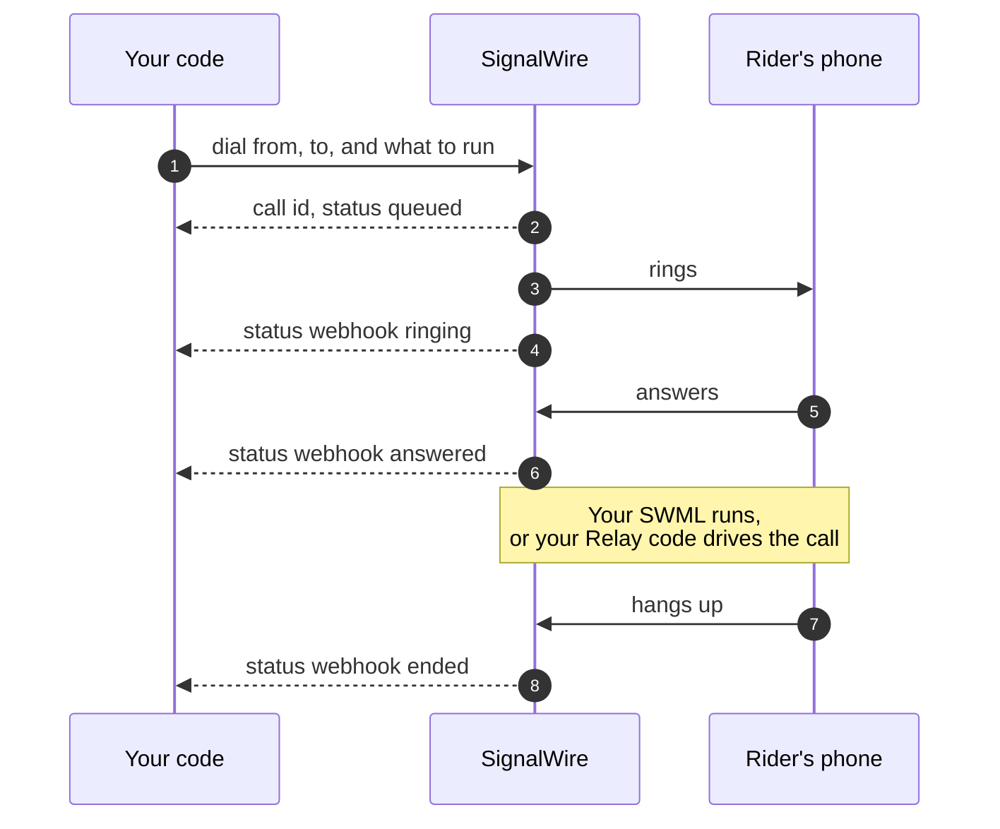

[calling-api]: /docs/apis/rest/calls/call-commands
[sdk-rest-dial-python]: /docs/server-sdks/reference/python/rest/calling/dial
[sdk-rest-dial-ts]: /docs/server-sdks/reference/typescript/rest/calling/dial
[relay-dial-python]: /docs/server-sdks/reference/python/relay/client/dial
[relay-dial-ts]: /docs/server-sdks/reference/typescript/relay/client/dial
[relay-guide]: /docs/server-sdks/guides/relay-client
[browser-outbound]: /docs/browser-sdk/v4/guides/outbound-calls
[browser-auth]: /docs/browser-sdk/v4/guides/authentication
[sip-credentials]: /docs/platform/voice/sip/sip-credentials
[caller-id]: /docs/platform/voice/how-to-set-caller-id-or-cnam
[stir-shaken]: /docs/platform/voice/stir-shaken
[spam-labels]: /docs/platform/voice/resolving-spam-labels
[trial-mode]: /docs/platform/trial-mode
[international]: /docs/platform/how-to-enable-international-services
[api-credentials]: /docs/platform/your-signalwire-api-space
[phone-numbers]: /docs/platform/phone-numbers
[error-codes]: /docs/apis/error-codes
[swml-ai]: /docs/swml/reference/calling/ai
[swml-webhook-security]: /docs/swml/guides/webhook-security
[swml-expressions]: /docs/swml/reference/expressions
[ai-quickstart]: /docs/platform/ai/quickstart
[ai-best-practices]: /docs/platform/ai/best-practices
[tcpa]: /docs/platform/compliance/tcpa

An outbound call takes one request: the number to call, the SignalWire number it comes from, and
what should happen when someone answers. SignalWire rings the destination and, when the call
connects, either runs the call logic you supplied or hands the live call back to your code.

Every example on this page places the same call. Bayview Taxi phones a rider to say their driver is
on the way, first as a spoken announcement and then as a conversation with an AI agent.

## How an outbound call works

There are two ways to control a call you place, and every SignalWire surface uses one of them.

**Hand SignalWire the call logic.** Your request names a SWML document that SignalWire runs when
the call is answered, through the [Calling API][calling-api] or the Server SDK's REST client. The
request returns as soon as the call is queued, and progress arrives later as status webhooks.
Nothing of yours has to stay running.

**Keep your code on the call.** The Server SDK's Relay client holds a WebSocket open, so `dial`
waits for the answer and returns a call object you drive directly. The Browser SDK does the same
from the user's device, where `dial` returns a call whose media you attach to the page.

The sequence below follows the hand-off flow. Solid arrows are actions on the call, and dashed
arrows are what comes back to your code.

<llms-ignore>


</llms-ignore>

<llms-only>



</llms-only>

| Surface | Control style | What runs the call |
|---|---|---|
| [Calling API][calling-api] | Hand off | SWML fetched from your URL or sent inline |
| Server SDK, REST client | Hand off | The same SWML, from [Python][sdk-rest-dial-python] or [TypeScript][sdk-rest-dial-ts] |
| Server SDK, [Relay client][relay-guide] | Stay on the call | Your Python or TypeScript code over a WebSocket |
| [Browser SDK][browser-outbound] | Stay on the call | Your browser code |
| SIP device | Hand off | The call handler on its [SIP credential][sip-credentials] |

A registered SIP phone or PBX dials out through SignalWire without any code of yours. The
[SIP credentials][sip-credentials] page covers that setup, and the rest of this guide covers the
programmatic surfaces.

## Before you dial

You need a [phone number][phone-numbers] purchased in your project, or a
[verified caller ID][caller-id], to call from. Any number you pass as `from` or `caller_id` on a
call to the public telephone network must be one of those, in E.164 format such as `+15551234567`.

You also need your Project ID and an API token with voice permissions from the
[API credentials][api-credentials] page of your Dashboard. Browser calls use a
[Subscriber Access Token][browser-auth] your backend issues for the user instead.

Two account settings decide whether the call is allowed at all. A project in
[trial mode][trial-mode] can only call purchased and verified numbers and can't call
internationally. Outside trial mode, calls to other countries still need
[international dialing enabled][international] for your Space.

## Place the call

Each tab below places the announcement call with a different surface. They all point at the same
SWML URL and ask for the same two status events, so the [call logic](#choose-what-runs-on-the-call)
and the [confirmation](#confirm-the-call-connected) that follow apply to every one of them.

### Hand SignalWire the call logic

<CodeBlocks>
<CodeBlock title="Calling API">
```bash
curl -X POST "https://YOUR_SPACE.signalwire.com/api/calling/calls" \
  -u "YOUR_PROJECT_ID:YOUR_API_TOKEN" \
  -H "Content-Type: application/json" \
  -d '{
    "command": "dial",
    "params": {
      "from": "+15551234567",
      "to": "+15557654321",
      "url": "https://example.com/swml/driver-on-the-way",
      "status_url": "https://example.com/call-status",
      "status_events": ["answered", "ended"]
    }
  }'
```
</CodeBlock>
<CodeBlock title="Server SDK (Python)">
```python
from signalwire.rest import RestClient

client = RestClient(
    project="YOUR_PROJECT_ID",
    token="YOUR_API_TOKEN",
    host="YOUR_SPACE.signalwire.com",
)

call = client.calling.dial(
    from_="+15551234567",
    to="+15557654321",
    url="https://example.com/swml/driver-on-the-way",
    status_url="https://example.com/call-status",
    status_events=["answered", "ended"],
)
print(call["id"])
```
</CodeBlock>
<CodeBlock title="Server SDK (TypeScript)">
```typescript
import { RestClient } from "@signalwire/sdk";

const client = new RestClient({
  project: "YOUR_PROJECT_ID",
  token: "YOUR_API_TOKEN",
  host: "YOUR_SPACE.signalwire.com",
});

const call = await client.calling.dial({
  from: "+15551234567",
  to: "+15557654321",
  url: "https://example.com/swml/driver-on-the-way",
  status_url: "https://example.com/call-status",
  status_events: ["answered", "ended"],
});
console.log(call.id);
```
</CodeBlock>
</CodeBlocks>

All three send the same `dial` command, so their parameters match. The response returns the new
call before anyone answers:

```json
{
  "id": "0e9c80d7-a149-4917-892d-420043709f45",
  "from": "+15551234567",
  "to": "+15557654321",
  "direction": "outbound-api",
  "status": "queued",
  "created_at": "2026-09-04T15:20:00Z"
}
```

Keep the `id`. Every other Calling API command, such as ending or transferring the call, takes it.
Progress arrives at `status_url` as webhooks for the events you list in `status_events`: `created`,
`ringing`, `answered`, and `ended`. If you omit `status_events`, you get `ended` only. The full
parameter list is on the [Calling API reference][calling-api].

### Keep your code on the call

<CodeBlocks>
<CodeBlock title="Server SDK Relay (Python)">
```python
import asyncio
from signalwire.relay import RelayClient

client = RelayClient(
    project="YOUR_PROJECT_ID",
    token="YOUR_API_TOKEN",
    host="YOUR_SPACE.signalwire.com",
    contexts=["default"],
)

async def main():
    async with client:
        call = await client.dial(
            devices=[[{
                "type": "phone",
                "params": {
                    "from_number": "+15551234567",
                    "to_number": "+15557654321",
                    "timeout": 30,
                },
            }]],
        )
        action = await call.play([{
            "type": "tts",
            "params": {"text": "Hi, this is Bayview Taxi. Your driver is on the way."},
        }])
        await action.wait()
        await call.hangup()

asyncio.run(main())
```
</CodeBlock>
<CodeBlock title="Server SDK Relay (TypeScript)">
```typescript
import { RelayClient } from "@signalwire/sdk";

const client = new RelayClient({
  project: "YOUR_PROJECT_ID",
  token: "YOUR_API_TOKEN",
  host: "YOUR_SPACE.signalwire.com",
  contexts: ["default"],
});

await client.connect();

const call = await client.dial([[{
  type: "phone",
  params: {
    from_number: "+15551234567",
    to_number: "+15557654321",
    timeout: 30,
  },
}]]);
const action = await call.play([
  { type: "tts", text: "Hi, this is Bayview Taxi. Your driver is on the way." },
]);
await action.wait();
await call.hangup();

await client.disconnect();
```
</CodeBlock>
<CodeBlock title="Browser SDK">
```typescript
import { SignalWire, StaticCredentialProvider } from "@signalwire/js";

// SAT is a Subscriber Access Token your backend issued for this user.
const client = new SignalWire(new StaticCredentialProvider({ token: SAT }));

// Audio only, the default for a phone-style call.
const call = await client.dial("+15557654321");
call.remoteStream$.subscribe((stream) => (remoteAudio.srcObject = stream));

hangupButton.onclick = () => call.hangup();
```
</CodeBlock>
</CodeBlocks>

With Relay there is no document to write. [`dial`][relay-dial-python] waits for the answer and
returns a call object, so the announcement is a `play` on that object and the hangup is your call
to make. The `devices` list also takes several numbers to ring in turn or at once. If nobody answers
within `dial_timeout`, which defaults to 120 seconds, `dial` raises `RelayError`. The
[TypeScript client][relay-dial-ts] behaves the same way.

A [Browser SDK][browser-outbound] call is placed from the user's device with the token your backend
issued, so the token has to be allowed to reach phone numbers. The same `dial` reaches rooms, other
users, and SIP endpoints by changing the destination string.

## Choose what runs on the call

On the hand-off surfaces, the SWML behind `url` is what the person you call hears. SignalWire
requests it when the call is created, with `POST` unless you set `url_method`, and runs whatever it
returns. Serve a spoken announcement, or an AI agent that can hold a conversation.

<CodeBlocks>
<CodeBlock title="Announcement">
```yaml
version: 1.0.0
sections:
  main:
    - play: "say:Hi, this is Bayview Taxi. Your driver is on the way and will arrive in about five minutes."
```
</CodeBlock>
<CodeBlock title="AI agent">
```yaml
version: 1.0.0
sections:
  main:
    - ai:
        params:
          static_greeting: "Hello, this is an automated assistant calling from Bayview Taxi about your pickup. This call uses an artificial voice."
          static_greeting_no_barge: true
        prompt:
          text: |
            You are calling to tell the rider their driver is about five minutes away.
            Answer questions about the pickup. If the rider says they no longer need the
            ride, or asks not to be contacted again, call cancel_pickup before saying
            anything else.
        SWAIG:
          functions:
            - function: cancel_pickup
              description: Cancel the pickup and record that the rider does not want further calls
              parameters:
                type: object
                properties: {}
              web_hook_url: https://example.com/swaig/cancel-pickup
```
</CodeBlock>
</CodeBlocks>

An AI agent is an outbound call whose SWML runs the [`ai` method][swml-ai]. The rider can ask how
far away the driver is or say they no longer need the ride, and the agent answers or acts. The
`static_greeting` plays in full before the agent's first turn, so the AI disclosure is heard even
if the rider starts talking. The `cancel_pickup` function calls your server, which cancels the ride
in your dispatch system and records the opt-out before the agent confirms anything aloud. To serve
the agent from your own code instead of a static document, point `url` at a Server SDK agent as in
the [AI quickstart][ai-quickstart].

<Warning title="Outbound AI calls are regulated">
An AI voice counts as an artificial voice under the Telephone Consumer Protection Act (TCPA).
Check consent, your do-not-call list, and the local calling hours in your code before you send the
`dial` request, because once the call is placed it has already happened. The [TCPA guide][tcpa] and
the compliance section of [AI best practices][ai-best-practices] cover each obligation. This is
technical guidance, not legal advice.
</Warning>

### Send the logic inline and carry data onto the call

You don't have to host the document. Send it in the `swml` field instead of `url`, as a JSON
object rather than a string of escaped JSON. To make the logic specific to one call, attach your
own values in `custom_variables` and read them in the SWML as `${envs.<key>}` using
[SWML expressions][swml-expressions].

```bash
curl -X POST "https://YOUR_SPACE.signalwire.com/api/calling/calls" \
  -u "YOUR_PROJECT_ID:YOUR_API_TOKEN" \
  -H "Content-Type: application/json" \
  -d '{
    "command": "dial",
    "params": {
      "from": "+15551234567",
      "to": "+15557654321",
      "custom_variables": { "driver_name": "Sam", "eta_minutes": "5" },
      "swml": {
        "version": "1.0.0",
        "sections": {
          "main": [
            { "play": "say:Hi, this is Bayview Taxi. ${envs.driver_name} is on the way and will arrive in about ${envs.eta_minutes} minutes." }
          ]
        }
      }
    }
  }'
```

`custom_variables` takes up to 20 string pairs, and the same pairs are sent to your endpoint when
SignalWire fetches SWML from `url`. Two more parameters shape most other calls. `caller_id` shows a
different number of yours to the person you call. `timeout` sets how many seconds to ring, from 1
to 600.

## Confirm the call connected

On the hand-off surfaces, a `200` response with a call `id` means SignalWire accepted the request,
not that anyone answered. The `answered` event at your `status_url` is the confirmation, followed by
`ended` when the call finishes. If `ended` arrives without `answered`, the destination didn't pick
up or rejected the call. With Relay, a returned call object is the confirmation and `RelayError` is
the failure. In the browser, `status$` reaching `connected` is the confirmation, and a `dial()` that
rejects with `CallCreateError` means the token isn't allowed to reach that destination.

The likeliest failure is a `422` before the call is placed, with an error code such as
`not_purchased_or_verified`. That means the `from` or `caller_id` number isn't purchased in this
project or verified as a caller ID. The next section covers the other common causes.

## Troubleshoot outbound calls

<AccordionGroup>
<Accordion title="The request is rejected before the call is placed">

A `422` response carries an [error code][error-codes] that names the problem. `not_purchased_or_verified`
means the `from` number isn't yours. `not_valid_for_caller_id` means `from` or `caller_id` isn't an
E.164 number, caller ID string, or SIP URI. `invalid_destination_number` and
`destination_number_not_supported` point at `to`. `insufficient_balance` means the project can't pay
for the call. A `dial` request that has neither `url` nor `swml` is also rejected.

</Accordion>
<Accordion title="The call ends without being answered">

Check the account limits first. A project in [trial mode][trial-mode] can only reach purchased and
verified numbers. International destinations fail until you [enable international
dialing][international]. If those are fine, a `timeout` shorter than the destination's ring time
ends the call early, and a `max_price_per_minute` below the route's price rejects it before it
rings.

</Accordion>
<Accordion title="The person you call sees a spam warning or the wrong caller ID">

The displayed number is `from`, or `caller_id` when you set it, and both must be numbers you own.
Set the caller name with the [Caller ID and CNAM][caller-id] guide. A "Spam likely" label on your
number is a reputation problem rather than a configuration one. Start with the
[spam labels][spam-labels] guide and confirm your calls carry [STIR/SHAKEN][stir-shaken]
attestation.

</Accordion>
<Accordion title="The call connects but your SWML doesn't run">

SignalWire requests `url` with `POST` unless you set `url_method`, and the endpoint has to return a
SWML document. Set `fallback_url` so a failed fetch still gets instructions, and secure the endpoint
as described in [SWML webhook security][swml-webhook-security]. An inline `swml` value must be a
JSON object, not a string of escaped JSON.

</Accordion>
</AccordionGroup>

## Next steps

<CardGroup cols={2}>
  <Card title="Calling API reference" icon="regular code" href="/docs/apis/rest/calls/call-commands">
    Every `dial` parameter, plus the commands that control a call after it's placed.
  </Card>
  <Card title="Relay client" icon="regular server" href="/docs/server-sdks/guides/relay-client">
    Stay on the call from your server and react to events as they happen.
  </Card>
  <Card title="Outbound calls from the browser" icon="regular browser" href="/docs/browser-sdk/v4/guides/outbound-calls">
    Destinations, media options, and call controls for click-to-call pages.
  </Card>
  <Card title="Make and receive calls with SWML" icon="regular phone" href="/docs/swml/guides/make-and-receive-calls">
    Handle the inbound side and build the SWML your outbound calls run.
  </Card>
</CardGroup>
