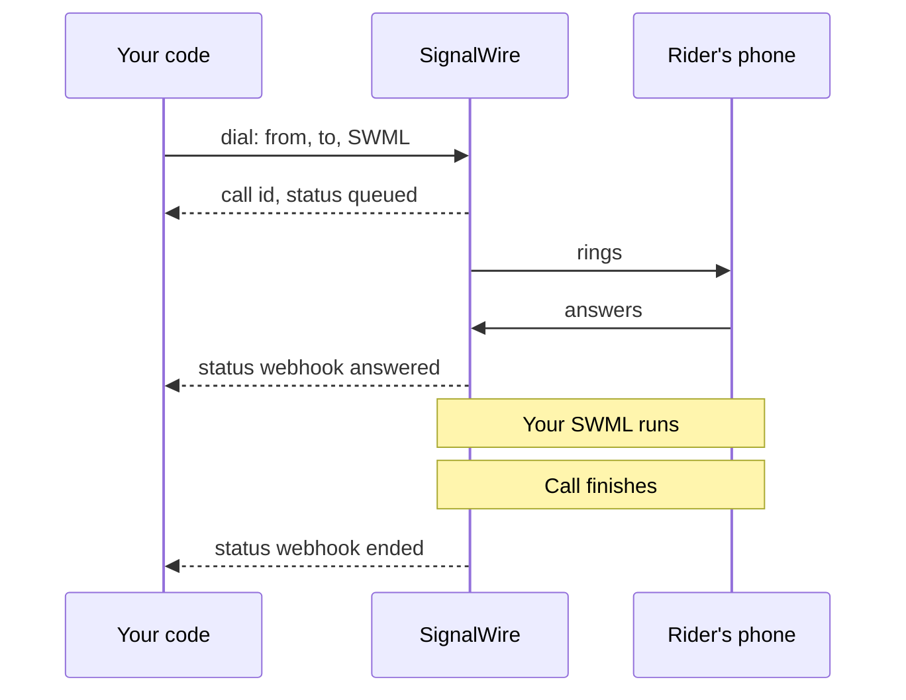
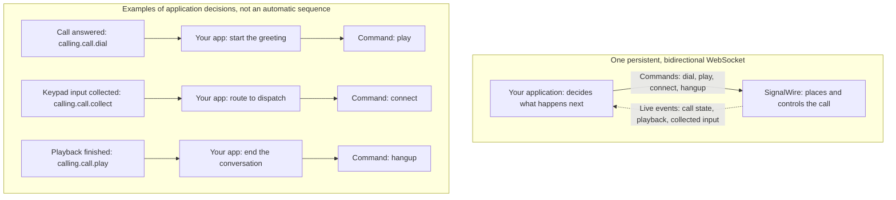

[calling-api]: /docs/apis/rest/calls/call-commands
[sdk-rest-dial-python]: /docs/server-sdks/reference/python/rest/calling/dial
[sdk-rest-dial-ts]: /docs/server-sdks/reference/typescript/rest/calling/dial
[relay-dial-python]: /docs/server-sdks/reference/python/relay/client/dial
[relay-dial-ts]: /docs/server-sdks/reference/typescript/relay/client/dial
[relay-guide]: /docs/server-sdks/guides/relay-client
[browser-outbound]: /docs/browser-sdk/v4/guides/outbound-calls
[browser-auth]: /docs/browser-sdk/v4/guides/authentication
[sip-credentials]: /docs/platform/voice/sip/sip-credentials
[caller-id]: /docs/platform/voice/how-to-set-caller-id-or-cnam
[stir-shaken]: /docs/platform/voice/stir-shaken
[spam-labels]: /docs/platform/voice/resolving-spam-labels
[trial-mode]: /docs/platform/trial-mode
[international]: /docs/platform/how-to-enable-international-services
[api-credentials]: /docs/platform/your-signalwire-api-space
[phone-numbers]: /docs/platform/phone-numbers
[swml-ai]: /docs/swml/reference/calling/ai
[ai-quickstart]: /docs/platform/ai/quickstart
[tool-calling]: /docs/platform/ai/tool-calling
[ai-best-practices]: /docs/platform/ai/best-practices
[tcpa]: /docs/platform/compliance/tcpa
[swml-connect]: /docs/swml/reference/calling/connect
[forward-calls]: /docs/swml/guides/forward-calls
[forward-node]: /docs/call-flow-builder/reference/forward-to-phone
[resource-addresses]: /docs/platform/addresses
[resources]: /docs/platform/resources

Outbound calls let your app reach a customer, connect a caller to a dispatcher, or start an AI
conversation. You choose the destination and what happens on the call.

Jump to the [examples](#examples) for working code.

## How outbound calls start

Most outbound calls start on your server: send a REST request to the [Calling API][calling-api], or
dial over a persistent Relay WebSocket connection. The Server SDK provides a client for each
approach.

Forwarding an inbound call also places an outbound call, dialing a second destination and
connecting the two callers. Configure it with [SWML call instructions][swml-connect] or Call Flow
Builder's [Forward to Phone node][forward-node].

Calls can start on a device instead. The [Browser SDK][browser-outbound] dials from your web app so
a person speaks through their own microphone and speaker, and registered SIP phones and phone
systems dial through SignalWire using [SIP credentials][sip-credentials]. A browser button that
starts an automated call is a server call: it sends the request to your backend.

## Destinations you can call

A destination is a phone on the public switched telephone network (PSTN), a SIP endpoint, or a
Resource in your SignalWire Space.

| Destination | Address format | What you reach |
|---|---|---|
| Phone number | E.164, such as `+15557654321` | A mobile or landline phone over the PSTN. |
| SIP endpoint | SIP URI, such as `sip:dispatcher@example.com` | A SIP phone, PBX, or another provider's SIP service. |
| Resource | Resource address, such as `/public/dispatch-agent` | An AI agent, SWML or cXML application, Call Flow, Subscriber, or conference room in your Space. |

Every [Resource][resources] is reachable the same way, whatever its type. Dial its configured
[resource address][resource-addresses], including the `public` or `private` context.

### Support by API and SDK

<Tabs>
<Tab title="REST">

The Calling API and Server SDK REST clients accept all three destination types above in `to`.
Set the calling address in `from`. See the [Calling API reference][calling-api] for all fields.

</Tab>
<Tab title="Relay (WebSocket)">

The Relay client accepts phone and SIP devices in a nested `devices` list:

- **Phone:** `type: "phone"`, with `params.to_number` and `params.from_number`.
- **SIP:** `type: "sip"`, with `params.to` and `params.from`.

Each inner list rings together; the outer list sets the order of attempts. The
[Python][relay-dial-python] and [TypeScript][relay-dial-ts] references cover device options.

</Tab>
</Tabs>

The **Browser SDK** and **SWML `connect`** accept all three types above. Call Flow Builder's
**Forward to Phone** node supports phone numbers and SIP endpoints.

## How the call runs

With REST, SignalWire runs the instructions you supply. With Relay, your running application
controls the call through commands and events.

<Tabs>
<Tab title="REST">

A `dial` request supplies a SignalWire Markup Language (SWML) document in `swml` or at `url`.
SignalWire places the call and runs the document after answer. The document can play audio,
run an AI agent, or connect another destination. Progress arrives at your webhook endpoint.

This flow uses `answered` and `ended` webhooks:

<llms-ignore>


</llms-ignore>

<llms-only>



</llms-only>

</Tab>
<Tab title="Relay (WebSocket)">

Relay keeps a bidirectional WebSocket open between your server and SignalWire. Your app sends
commands such as `dial`, `play`, and `connect`; SignalWire sends live events back. Your code
uses those events to decide what the call does next.

<llms-ignore>


</llms-ignore>

<llms-only>



</llms-only>

</Tab>
</Tabs>

## Before you dial

### Calling number

For server calls to phone numbers, use a [purchased number][phone-numbers] or
[verified caller ID][caller-id]. Pass it as `from` in REST or `params.from_number` for a Relay
phone device. SIP caller ID settings are covered in the [Calling API reference][calling-api].

How that number is labeled decides whether people answer. The [spam labels][spam-labels] and
[STIR/SHAKEN][stir-shaken] guides cover call reputation and attestation.

<Note title="Trial mode and international calling">
[Trial projects][trial-mode] can call only purchased and verified numbers, with no international
calling. Other projects need [international dialing enabled][international] to call other countries.
</Note>

### Credentials

Server calls use your Project ID and an API token with voice permissions from the Dashboard's
[API credentials][api-credentials] page. Keep the API token on your backend.

Browser calls use a [Subscriber Access Token (SAT)][browser-auth] that your backend issues for
the user. Its permissions determine which destinations the user can call.

## Examples

Bayview Taxi uses outbound calls to notify riders and connect them with dispatchers.

### Place a call from a server

Tell a rider their driver is on the way, using REST or Relay.

<Tabs>
<Tab title="REST">

This request includes the SWML announcement. Replace the credentials and phone numbers,
then run it from your terminal or backend.

<CodeBlocks>
<CodeBlock title="cURL — Calling API">
```bash
curl -X POST "https://YOUR_SPACE.signalwire.com/api/calling/calls" \
  -u "YOUR_PROJECT_ID:YOUR_API_TOKEN" \
  -H "Content-Type: application/json" \
  -d '{
    "command": "dial",
    "params": {
      "from": "+15551234567",
      "to": "+15557654321",
      "swml": {
        "version": "1.0.0",
        "sections": {
          "main": [
            { "play": "say:Hi, this is Bayview Taxi. Your driver is on the way and will arrive in about five minutes." }
          ]
        }
      }
    }
  }'
```
</CodeBlock>
<CodeBlock title="Python — REST client">
```python
from signalwire.rest import RestClient

client = RestClient(
    project="YOUR_PROJECT_ID",
    token="YOUR_API_TOKEN",
    host="YOUR_SPACE.signalwire.com",
)

call = client.calling.dial(
    from_="+15551234567",
    to="+15557654321",
    swml={
        "version": "1.0.0",
        "sections": {
            "main": [
                {"play": "say:Hi, this is Bayview Taxi. Your driver is on the way and will arrive in about five minutes."}
            ]
        },
    },
)
print(call["id"])
```
</CodeBlock>
<CodeBlock title="TypeScript — REST client">
```typescript
import { RestClient } from "@signalwire/sdk";

const client = new RestClient({
  project: "YOUR_PROJECT_ID",
  token: "YOUR_API_TOKEN",
  host: "YOUR_SPACE.signalwire.com",
});

const call = await client.calling.dial({
  from: "+15551234567",
  to: "+15557654321",
  swml: {
    version: "1.0.0",
    sections: {
      main: [
        { play: "say:Hi, this is Bayview Taxi. Your driver is on the way and will arrive in about five minutes." },
      ],
    },
  },
});
console.log(call.id);
```
</CodeBlock>
</CodeBlocks>

The response identifies the queued call:

```json
{
  "id": "0e9c80d7-a149-4917-892d-420043709f45",
  "from": "+15551234567",
  "to": "+15557654321",
  "direction": "outbound-api",
  "status": "queued",
  "created_at": "2026-09-04T15:20:00Z"
}
```

`queued` means SignalWire accepted the call but has not placed it yet, so no webhook has fired.
The first event you can subscribe to is `created`. Keep the `id` for later call commands, and add
`status_url` and `status_events` as described in
[Track the call's progress](#track-the-calls-progress).
The REST client references for [Python][sdk-rest-dial-python] and [TypeScript][sdk-rest-dial-ts]
cover all request fields.

</Tab>
<Tab title="Relay (WebSocket)">

Run this on your server with your credentials and phone numbers. It dials the rider, plays
the announcement after answer, waits for playback to finish, and hangs up.

<CodeBlocks>
<CodeBlock title="Python — Relay client">
```python
import asyncio
from signalwire.relay import RelayClient

client = RelayClient(
    project="YOUR_PROJECT_ID",
    token="YOUR_API_TOKEN",
    host="YOUR_SPACE.signalwire.com",
    contexts=["default"],
)

async def main():
    async with client:
        call = await client.dial(
            devices=[[{
                "type": "phone",
                "params": {
                    "from_number": "+15551234567",
                    "to_number": "+15557654321",
                    "timeout": 30,
                },
            }]],
        )
        action = await call.play([{
            "type": "tts",
            "params": {"text": "Hi, this is Bayview Taxi. Your driver is on the way and will arrive in about five minutes."},
        }])
        await action.wait()
        await call.hangup()

asyncio.run(main())
```
</CodeBlock>
<CodeBlock title="TypeScript — Relay client">
```typescript
import { RelayClient } from "@signalwire/sdk";

const client = new RelayClient({
  project: "YOUR_PROJECT_ID",
  token: "YOUR_API_TOKEN",
  host: "YOUR_SPACE.signalwire.com",
  contexts: ["default"],
});

await client.connect();

const call = await client.dial([[{
  type: "phone",
  params: {
    from_number: "+15551234567",
    to_number: "+15557654321",
    timeout: 30,
  },
}]]);
const action = await call.play([
  { type: "tts", text: "Hi, this is Bayview Taxi. Your driver is on the way and will arrive in about five minutes." },
]);
await action.wait();
await call.hangup();

await client.disconnect();
```
</CodeBlock>
</CodeBlocks>

See the [Relay guide][relay-guide] for connection management and more call controls.

</Tab>
</Tabs>

### Forward an inbound call

Connect an incoming rider call to a dispatcher. Set the calling number to your SignalWire
number and the destination to the dispatcher's number.

With SWML, assign the script below to the number riders call, following the
[forwarding guide][forward-calls]. With the Server SDK, route that number's inbound calls to the
Relay `dispatch` context and run the handler on your backend, as the [Relay guide][relay-guide]
describes.

<CodeBlocks>
<CodeBlock title="SWML">
```yaml
version: 1.0.0
sections:
  main:
    - connect:
        from: "+15551234567"
        to: "+15557654321"
```
</CodeBlock>
<CodeBlock title="Python — Relay client">
```python
from signalwire.relay import RelayClient

client = RelayClient(
    project="YOUR_PROJECT_ID",
    token="YOUR_API_TOKEN",
    host="YOUR_SPACE.signalwire.com",
    contexts=["dispatch"],
)

@client.on_call
async def handle_call(call):
    await call.answer()
    await call.connect([[{
        "type": "phone",
        "params": {
            "from_number": "+15551234567",
            "to_number": "+15557654321",
        },
    }]])

client.run()
```
</CodeBlock>
<CodeBlock title="TypeScript — Relay client">
```typescript
import { RelayClient } from "@signalwire/sdk";

const client = new RelayClient({
  project: "YOUR_PROJECT_ID",
  token: "YOUR_API_TOKEN",
  host: "YOUR_SPACE.signalwire.com",
  contexts: ["dispatch"],
});

client.onCall(async (call) => {
  await call.answer();
  await call.connect([[{
    type: "phone",
    params: {
      from_number: "+15551234567",
      to_number: "+15557654321",
    },
  }]]);
});

await client.run();
```
</CodeBlock>
</CodeBlocks>

The connect references for [Python](/docs/server-sdks/reference/python/relay/call/connect) and
[TypeScript](/docs/server-sdks/reference/typescript/relay/call/connect) cover additional Relay options. For SWML progress webhooks, use `call_state_url` and `call_state_events`.

### Place a call with the Browser SDK

Let the dispatcher speak to the rider through your web app. Supply a
[Subscriber Access Token][browser-auth] as `SAT`, with permission to call phone numbers.

Use an HTTPS page with `<audio id="remote-audio" autoplay></audio>` and
`<button id="hangup">Hang up</button>`. Run the dialing code from a user action, such as a
**Call rider** button.

```typescript
import { SignalWire, StaticCredentialProvider } from "@signalwire/js";

// SAT is a Subscriber Access Token your backend issued for this user.
const client = new SignalWire(new StaticCredentialProvider({ token: SAT }));
const remoteAudio = document.querySelector<HTMLAudioElement>("#remote-audio")!;
const hangupButton = document.querySelector<HTMLButtonElement>("#hangup")!;

// Audio only, the default for a phone-style call.
const call = await client.dial("+15557654321");
call.remoteStream$.subscribe((stream) => (remoteAudio.srcObject = stream));

hangupButton.onclick = () => call.hangup();
```

Watch for `status$` to reach `connected`. The [Browser SDK outbound guide][browser-outbound]
includes a complete page with media and call controls.

### Run an AI agent

Replace the announcement with an AI conversation about the rider's pickup. Both versions build on
[Place a call from a server](#place-a-call-from-a-server). With SWML, host the document below and
pass its `url` in place of the inline `swml`. With the Server SDK, replace the playback and hangup
steps with the snippet below, where `call` is the answered call returned by `dial`.

<Warning title="Outbound AI calls are regulated">
An AI voice counts as an artificial voice under the Telephone Consumer Protection Act (TCPA).
Check consent, your do-not-call list, and the local calling hours in your code before you send the
`dial` request. The [TCPA guide][tcpa] and
the compliance section of [AI best practices][ai-best-practices] cover each obligation. This is
technical guidance, not legal advice.
</Warning>

<CodeBlocks>
<CodeBlock title="SWML">
```yaml
version: 1.0.0
sections:
  main:
    - ai:
        params:
          static_greeting: "Hello, this is an automated assistant calling from Bayview Taxi about your pickup. This call uses an artificial voice."
          static_greeting_no_barge: true
        prompt:
          text: |
            You are calling to tell the rider their driver is about five minutes away.
            Answer questions using that estimate. You cannot change bookings or
            contact preferences. If asked, explain that the rider needs to contact
            Bayview Taxi to make those changes. Do not claim to have made a change.
```
</CodeBlock>
<CodeBlock title="Python — Relay client">
```python
# After dialing, start the agent on the answered call.
action = await call.ai(
    ai_params={
        "static_greeting": "Hello, this is an automated assistant calling from Bayview Taxi about your pickup. This call uses an artificial voice.",
        "static_greeting_no_barge": True,
    },
    prompt={
        "text": """You are calling to tell the rider their driver is about five minutes away.
Answer questions using that estimate. You cannot change bookings or
contact preferences. If asked, explain that the rider needs to contact
Bayview Taxi to make those changes. Do not claim to have made a change."""
    },
)
await action.wait()
await call.hangup()
```
</CodeBlock>
<CodeBlock title="TypeScript — Relay client">
```typescript
// After dialing, start the agent on the answered call.
const action = await call.ai({
  aiParams: {
    static_greeting: "Hello, this is an automated assistant calling from Bayview Taxi about your pickup. This call uses an artificial voice.",
    static_greeting_no_barge: true,
  },
  prompt: {
    text: `You are calling to tell the rider their driver is about five minutes away.
Answer questions using that estimate. You cannot change bookings or
contact preferences. If asked, explain that the rider needs to contact
Bayview Taxi to make those changes. Do not claim to have made a change.`,
  },
});
await action.wait();
await call.hangup();
```
</CodeBlock>
</CodeBlocks>

The [`ai` method][swml-ai] uses the same greeting and prompt in each version.
`static_greeting_no_barge` lets the greeting finish before the conversation begins. Add
[tool calling][tool-calling] to let the agent take actions, such as updating a booking.
See the [AI quickstart][ai-quickstart] or the Relay AI references for
[Python](/docs/server-sdks/reference/python/relay/call/ai) and
[TypeScript](/docs/server-sdks/reference/typescript/relay/call/ai).

## Track the call's progress

Confirm SignalWire accepted the request, then follow the call to answer and hangup.

<Tabs>
<Tab title="REST">

A `200` response with a call `id` means SignalWire accepted the request. Listen for `answered`
to confirm pickup and `ended` to know the call finished.

Set `status_url` to your webhook endpoint and choose `status_events`: `created`, `ringing`,
`answered`, or `ended`. If you omit `status_events`, you receive `ended` only.

Each event name is also a `status` the call reports, so a webhook arrives when the call enters the
state you subscribed to. A call passes through more states than there are events:

| `status` | Fires a webhook |
|---|---|
| `queued` | No — accepted, not yet placed |
| `initiated` | No — handed off to be placed |
| `created` | Yes, as `created` |
| `ringing` | Yes, as `ringing` |
| `answered` | Yes, as `answered` |
| `ending` | No |
| `ended` | Yes, as `ended` |
| `busy`, `no-answer`, `failed`, `canceled` | No |

<Warning title="A call that never connects sends no status callback">
`busy`, `no-answer`, `failed`, and `canceled` are not `status_events` values, so none of them
delivers a callback — not even under the default `status_events` of `["ended"]`. Subscribe to
`answered` and pair it with the ring `timeout` you set, so a call that never connects shows up as
an `answered` webhook that never arrives. To confirm what happened, read the call's
[voice log](/docs/apis/rest/voice-logs/list-voice-logs).
</Warning>

</Tab>
<Tab title="Relay (WebSocket)">

The SDK's `dial` returns a call object after answer or raises `RelayError` on failure.
Use `call.on` for state and action events, and `action.wait()` to wait for an action such as
playback to finish. See the [Python](/docs/server-sdks/reference/python/relay/call/on) or
[TypeScript](/docs/server-sdks/reference/typescript/relay/call/on) event reference.

<Accordion title="Using the Relay protocol directly">
The initial `calling.dial` response acknowledges the request. A later `calling.call.dial`
event carries the dial outcome. The Server SDK waits for this event before returning a call object.
</Accordion>

</Tab>
</Tabs>

## Next steps

<CardGroup cols={2}>
  <Card title="Calling API reference" icon="regular rectangle-api" href="/docs/apis/rest/calls/call-commands">
    Every `dial` field, plus the commands that control a call already in progress.
  </Card>
  <Card title="Relay client guide" icon="regular server" href="/docs/server-sdks/guides/relay-client">
    Connection management and event-driven call control from your backend.
  </Card>
  <Card title="Browser SDK outbound calls" icon="regular browser" href="/docs/browser-sdk/v4/guides/outbound-calls">
    A complete web page with media handling and call controls.
  </Card>
  <Card title="AI agent quickstart" icon="regular robot" href="/docs/platform/ai/quickstart">
    Build the agent that holds the conversation once someone answers.
  </Card>
</CardGroup>
