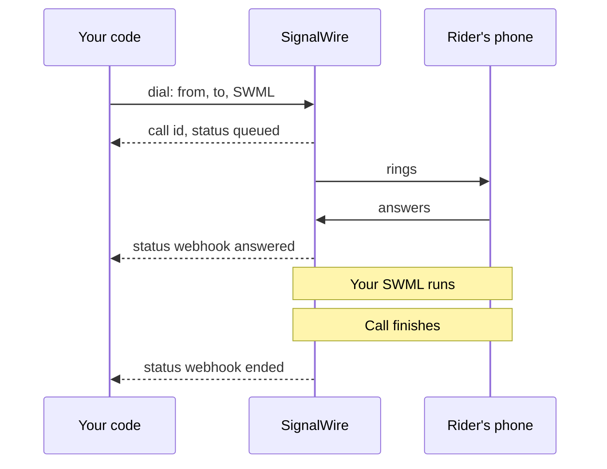

[calling-api]: /docs/apis/rest/calls/call-commands
[sdk-rest-dial-python]: /docs/server-sdks/reference/python/rest/calling/dial
[sdk-rest-dial-ts]: /docs/server-sdks/reference/typescript/rest/calling/dial
[relay-dial-python]: /docs/server-sdks/reference/python/relay/client/dial
[relay-dial-ts]: /docs/server-sdks/reference/typescript/relay/client/dial
[relay-guide]: /docs/server-sdks/guides/relay-client
[browser-outbound]: /docs/browser-sdk/v4/guides/outbound-calls
[browser-auth]: /docs/browser-sdk/v4/guides/authentication
[sip-credentials]: /docs/platform/voice/sip/sip-credentials
[caller-id]: /docs/platform/voice/how-to-set-caller-id-or-cnam
[stir-shaken]: /docs/platform/voice/stir-shaken
[spam-labels]: /docs/platform/voice/resolving-spam-labels
[trial-mode]: /docs/platform/trial-mode
[international]: /docs/platform/how-to-enable-international-services
[api-credentials]: /docs/platform/your-signalwire-api-space
[phone-numbers]: /docs/platform/phone-numbers
[error-codes]: /docs/apis/error-codes
[swml-ai]: /docs/swml/reference/calling/ai
[swml-webhook-security]: /docs/swml/guides/webhook-security
[swml-expressions]: /docs/swml/reference/expressions
[ai-quickstart]: /docs/platform/ai/quickstart
[tool-calling]: /docs/platform/ai/tool-calling
[ai-best-practices]: /docs/platform/ai/best-practices
[tcpa]: /docs/platform/compliance/tcpa

An outbound call takes one request: the number to call, the SignalWire number it comes from, and
what should happen when someone answers. SignalWire rings the destination and, when the call
connects, either runs the call logic you supplied or hands the live call back to your code.

Bayview Taxi needs to tell a rider their driver is on the way. The examples show an automated
announcement, an AI conversation, and a dispatcher calling from a browser.

## How an outbound call works

Your application can supply instructions for SignalWire to run or control the call as it happens.

**Hand SignalWire the call logic.** Use the [Calling API][calling-api] or the Server SDK's REST
client to supply a SignalWire Markup Language (SWML) document. It describes what happens when
someone answers, such as playing an announcement or starting an AI conversation. The request
returns as soon as the call is queued. SignalWire runs the call logic and sends progress updates
to your configured webhook endpoint.

**Keep your code on the call.** The Server SDK's Relay client holds a WebSocket open, so `dial`
waits for the answer and returns a call object you drive directly. For a dispatcher speaking to
the rider from a web app, the Browser SDK connects the device's microphone and speaker to the call.

This sequence shows a Calling API or Server SDK REST call with `answered` and `ended` webhooks
enabled, as in the examples below. Solid arrows show the request and phone activity; dashed
arrows show the response and webhooks sent to your code.

<llms-ignore>


</llms-ignore>

<llms-only>



</llms-only>

| API or SDK | Control style | What runs the call |
|---|---|---|
| [Calling API][calling-api] | Hand off | SWML fetched from your URL or sent inline |
| Server SDK, REST client | Hand off | The same SWML, from [Python][sdk-rest-dial-python] or [TypeScript][sdk-rest-dial-ts] |
| Server SDK, [Relay client][relay-guide] | Stay on the call | Your Python or TypeScript code over a WebSocket |
| [Browser SDK][browser-outbound] | Stay on the call | Your browser code |

A registered SIP phone or phone system can also dial out through SignalWire. The
[SIP credentials][sip-credentials] page covers that setup.

## Before you dial

You need a [phone number][phone-numbers] purchased in your project, or a
[verified caller ID][caller-id], to call from. Any number you pass as `from` or `caller_id` on a
call to the public telephone network must be one of those, in E.164 format such as `+15551234567`.

You also need your Project ID and an API token with voice permissions from the
[API credentials][api-credentials] page of your Dashboard. Browser calls use a
[Subscriber Access Token][browser-auth] your backend issues for the user instead.

Two account settings decide whether the call is allowed at all. A project in
[trial mode][trial-mode] can only call purchased and verified numbers and can't call
internationally. Outside trial mode, calls to other countries still need
[international dialing enabled][international] for your Space.

## Call from a server

From your backend, use the Calling API or the Server SDK's REST client to supply call logic,
or the Server SDK's Relay client to control the live call. Both approaches can deliver the
announcement to the rider.

### Hand SignalWire the call logic

These three examples send the same request. Replace `url` with an endpoint serving the
[announcement or AI agent SWML](#choose-what-runs-on-the-call), and `status_url` with your webhook
endpoint. Each asks for an update when the call is answered and when it ends.

<CodeBlocks>
<CodeBlock title="Calling API">
```bash
curl -X POST "https://YOUR_SPACE.signalwire.com/api/calling/calls" \
  -u "YOUR_PROJECT_ID:YOUR_API_TOKEN" \
  -H "Content-Type: application/json" \
  -d '{
    "command": "dial",
    "params": {
      "from": "+15551234567",
      "to": "+15557654321",
      "url": "https://example.com/swml/driver-on-the-way",
      "status_url": "https://example.com/call-status",
      "status_events": ["answered", "ended"]
    }
  }'
```
</CodeBlock>
<CodeBlock title="Server SDK (Python)">
```python
from signalwire.rest import RestClient

client = RestClient(
    project="YOUR_PROJECT_ID",
    token="YOUR_API_TOKEN",
    host="YOUR_SPACE.signalwire.com",
)

call = client.calling.dial(
    from_="+15551234567",
    to="+15557654321",
    url="https://example.com/swml/driver-on-the-way",
    status_url="https://example.com/call-status",
    status_events=["answered", "ended"],
)
print(call["id"])
```
</CodeBlock>
<CodeBlock title="Server SDK (TypeScript)">
```typescript
import { RestClient } from "@signalwire/sdk";

const client = new RestClient({
  project: "YOUR_PROJECT_ID",
  token: "YOUR_API_TOKEN",
  host: "YOUR_SPACE.signalwire.com",
});

const call = await client.calling.dial({
  from: "+15551234567",
  to: "+15557654321",
  url: "https://example.com/swml/driver-on-the-way",
  status_url: "https://example.com/call-status",
  status_events: ["answered", "ended"],
});
console.log(call.id);
```
</CodeBlock>
</CodeBlocks>

All three send the same `dial` command, so their parameters match. The response returns the new
call before anyone answers:

```json
{
  "id": "0e9c80d7-a149-4917-892d-420043709f45",
  "from": "+15551234567",
  "to": "+15557654321",
  "direction": "outbound-api",
  "status": "queued",
  "created_at": "2026-09-04T15:20:00Z"
}
```

Keep the `id`. Every other Calling API command, such as ending or transferring the call, takes it.
Progress arrives at `status_url` as webhooks for the events you list in `status_events`: `created`,
`ringing`, `answered`, and `ended`. If you omit `status_events`, you get `ended` only. The full
parameter list is on the [Calling API reference][calling-api].

### Keep your code on the call

These Relay examples play the announcement directly from your server. Your code waits for the
rider to answer, speaks the message, and ends the call.

<CodeBlocks>
<CodeBlock title="Server SDK Relay (Python)">
```python
import asyncio
from signalwire.relay import RelayClient

client = RelayClient(
    project="YOUR_PROJECT_ID",
    token="YOUR_API_TOKEN",
    host="YOUR_SPACE.signalwire.com",
    contexts=["default"],
)

async def main():
    async with client:
        call = await client.dial(
            devices=[[{
                "type": "phone",
                "params": {
                    "from_number": "+15551234567",
                    "to_number": "+15557654321",
                    "timeout": 30,
                },
            }]],
        )
        action = await call.play([{
            "type": "tts",
            "params": {"text": "Hi, this is Bayview Taxi. Your driver is on the way."},
        }])
        await action.wait()
        await call.hangup()

asyncio.run(main())
```
</CodeBlock>
<CodeBlock title="Server SDK Relay (TypeScript)">
```typescript
import { RelayClient } from "@signalwire/sdk";

const client = new RelayClient({
  project: "YOUR_PROJECT_ID",
  token: "YOUR_API_TOKEN",
  host: "YOUR_SPACE.signalwire.com",
  contexts: ["default"],
});

await client.connect();

const call = await client.dial([[{
  type: "phone",
  params: {
    from_number: "+15551234567",
    to_number: "+15557654321",
    timeout: 30,
  },
}]]);
const action = await call.play([
  { type: "tts", text: "Hi, this is Bayview Taxi. Your driver is on the way." },
]);
await action.wait();
await call.hangup();

await client.disconnect();
```
</CodeBlock>
</CodeBlocks>

With Relay, `dial` waits for the answer, `play` speaks the announcement, and `hangup` ends the call.
The [Python][relay-dial-python] and [TypeScript][relay-dial-ts] references cover timeouts and
ringing several destinations.

## Call from a browser

The Browser SDK opens a live audio call so the dispatcher can speak to the rider from a web app.
It uses a Subscriber Access Token issued by your backend and connects the device's microphone
and speaker to the call.

Use an HTTPS page with `<audio id="remote-audio" autoplay></audio>` and
`<button id="hangup">Hang up</button>`. Run the dialing code from a user action, such as a
**Call rider** button, and use a token allowed to reach phone numbers.

```typescript
import { SignalWire, StaticCredentialProvider } from "@signalwire/js";

// SAT is a Subscriber Access Token your backend issued for this user.
const client = new SignalWire(new StaticCredentialProvider({ token: SAT }));
const remoteAudio = document.querySelector<HTMLAudioElement>("#remote-audio")!;
const hangupButton = document.querySelector<HTMLButtonElement>("#hangup")!;

// Audio only, the default for a phone-style call.
const call = await client.dial("+15557654321");
call.remoteStream$.subscribe((stream) => (remoteAudio.srcObject = stream));

hangupButton.onclick = () => call.hangup();
```

The [Browser SDK outbound guide][browser-outbound] includes a complete page with media and call
controls.

## Choose what runs on the call

For the Calling API and Server SDK's REST client, the SWML behind `url` controls what the rider
hears after answering. Serve one of these documents at that URL to choose between a spoken
announcement and an AI conversation. You can change the call logic without changing how you dial.

<CodeBlocks>
<CodeBlock title="Announcement">
```yaml
version: 1.0.0
sections:
  main:
    - play: "say:Hi, this is Bayview Taxi. Your driver is on the way and will arrive in about five minutes."
```
</CodeBlock>
<CodeBlock title="AI agent">
```yaml
version: 1.0.0
sections:
  main:
    - ai:
        params:
          static_greeting: "Hello, this is an automated assistant calling from Bayview Taxi about your pickup. This call uses an artificial voice."
          static_greeting_no_barge: true
        prompt:
          text: |
            You are calling to tell the rider their driver is about five minutes away.
            Answer questions using that estimate. You cannot change bookings or
            contact preferences. If asked, explain that the rider needs to contact
            Bayview Taxi to make those changes. Do not claim to have made a change.
```
</CodeBlock>
</CodeBlocks>

The [`ai` method][swml-ai] turns the announcement into a conversation. This example only answers
questions about the arrival estimate. With `static_greeting_no_barge` enabled, the greeting plays
in full before the agent's first turn, even if the rider starts talking.

To let the agent change a booking or record a request to stop future calls, connect it to your
backend with [tool calling][tool-calling]. Treat those as separate actions: stopping future calls
doesn't cancel the current ride. The [AI quickstart][ai-quickstart] shows how to serve an agent
from your own code.

<Warning title="Outbound AI calls are regulated">
An AI voice counts as an artificial voice under the Telephone Consumer Protection Act (TCPA).
Check consent, your do-not-call list, and the local calling hours in your code before you send the
`dial` request, because once the call is placed it has already happened. The [TCPA guide][tcpa] and
the compliance section of [AI best practices][ai-best-practices] cover each obligation. This is
technical guidance, not legal advice.
</Warning>

### Send the logic inline and carry data onto the call

You don't have to host the document. Send it in the `swml` field instead of `url`, as a JSON
object rather than a string of escaped JSON. To make the logic specific to one call, attach your
own values in `custom_variables` and read them in the SWML as `${envs.<key>}` using
[SWML expressions][swml-expressions].

```bash
curl -X POST "https://YOUR_SPACE.signalwire.com/api/calling/calls" \
  -u "YOUR_PROJECT_ID:YOUR_API_TOKEN" \
  -H "Content-Type: application/json" \
  -d '{
    "command": "dial",
    "params": {
      "from": "+15551234567",
      "to": "+15557654321",
      "custom_variables": { "driver_name": "Sam", "eta_minutes": "5" },
      "swml": {
        "version": "1.0.0",
        "sections": {
          "main": [
            { "play": "say:Hi, this is Bayview Taxi. ${envs.driver_name} is on the way and will arrive in about ${envs.eta_minutes} minutes." }
          ]
        }
      }
    }
  }'
```

The same variables are available when you serve SWML from `url`, so one document can personalize
many calls. The [Calling API reference][calling-api] covers variable limits and options such as
caller ID and ring time.

## Confirm the call connected

For REST calls, a `200` response with a call `id` means SignalWire accepted the request. Listen
for `answered` at your `status_url` to confirm the destination picked up, and `ended` to know
the call finished.

With Relay, `dial` returns a call object once the destination answers, or raises `RelayError` if
the dial fails. In the browser, watch for `status$` to reach `connected`. If `dial()` rejects,
check that the token is allowed to reach the destination.

The likeliest failure is a `422` before the call is placed, with an error code such as
`not_purchased_or_verified`. That means the `from` or `caller_id` number isn't purchased in this
project or verified as a caller ID. The next section covers the other common causes.

## Troubleshoot outbound calls

<AccordionGroup>
<Accordion title="The request is rejected before the call is placed">

A `422` response carries an [error code][error-codes] that names the problem. `not_purchased_or_verified`
means the `from` number isn't yours. `not_valid_for_caller_id` means `from` or `caller_id` isn't an
E.164 number, caller ID string, or SIP URI. `invalid_destination_number` and
`destination_number_not_supported` point at `to`. `insufficient_balance` means the project can't pay
for the call. A `dial` request that has neither `url` nor `swml` is also rejected.

</Accordion>
<Accordion title="The call ends without being answered">

Check the account limits first. A project in [trial mode][trial-mode] can only reach purchased and
verified numbers. International destinations fail until you [enable international
dialing][international]. If those are fine, a `timeout` shorter than the destination's ring time
ends the call early, and a `max_price_per_minute` below the route's price rejects it before it
rings.

</Accordion>
<Accordion title="The person you call sees a spam warning or the wrong caller ID">

The displayed number is `from`, or `caller_id` when you set it, and both must be numbers you own.
Set the caller name with the [Caller ID and CNAM][caller-id] guide. A "Spam likely" label on your
number is a reputation problem rather than a configuration one. Start with the
[spam labels][spam-labels] guide and confirm your calls carry [STIR/SHAKEN][stir-shaken]
attestation.

</Accordion>
<Accordion title="The call connects but your SWML doesn't run">

SignalWire requests `url` with `POST` unless you set `url_method`, and the endpoint has to return a
SWML document. Set `fallback_url` so a failed fetch still gets instructions, and secure the endpoint
as described in [SWML webhook security][swml-webhook-security]. An inline `swml` value must be a
JSON object, not a string of escaped JSON.

</Accordion>
</AccordionGroup>

## Next steps

<CardGroup cols={2}>
  <Card title="Calling API reference" icon="regular code" href="/docs/apis/rest/calls/call-commands">
    Every `dial` parameter, plus the commands that control a call after it's placed.
  </Card>
  <Card title="Relay client" icon="regular server" href="/docs/server-sdks/guides/relay-client">
    Stay on the call from your server and react to events as they happen.
  </Card>
  <Card title="Outbound calls from the browser" icon="regular browser" href="/docs/browser-sdk/v4/guides/outbound-calls">
    Destinations, media options, and call controls for click-to-call pages.
  </Card>
  <Card title="Make and receive calls with SWML" icon="regular phone" href="/docs/swml/guides/make-and-receive-calls">
    Handle the inbound side and build the SWML your outbound calls run.
  </Card>
</CardGroup>
