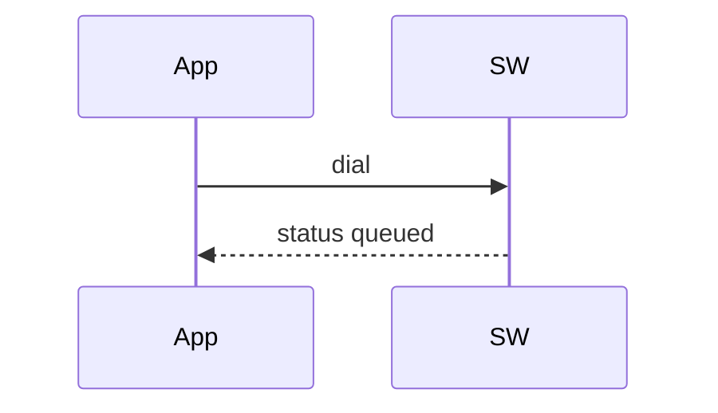

[google-style]: https://developers.google.com/style
[diataxis]: https://diataxis.fr
[ms-style]: https://learn.microsoft.com/en-us/style-guide/welcome/
[record-calls]: /docs/platform/calling/record-calls
[ai-chat]: /docs/platform/ai/chat
[webhooks]: /docs/platform/webhooks
[rest-list]: /docs/apis/rest/recordings/list-call-recordings
[call-commands]: /docs/apis/rest/calls/call-commands
[swml-intro]: /docs/swml
[relay-ns]: /docs/server-sdks/reference/python/relay
[browser-sdk]: /docs/browser-sdk
[cfb]: /docs/call-flow-builder

Most guides on this site should answer the same question in the same order: 
which product should I use, 
how to get started, 
how to do the thing, 
how do I know it worked,
and further resources.

<Warning title="Do not publish">
This is a template; not meant to me merged to main, or published.
</Warning>

## Pick the right product and technology

The first job of the guide is to transparently present what tools have what capabilities, and what nuances, so the reader can make an informed choice right away.

| Function | SWML | Relay | Calling API | Browser SDK | Call Flow Builder |
|---|---|---|---|---|---|
| Record a call | <Icon icon="regular circle-check" color="var(--status-success)" /> | <Icon icon="regular circle-check" color="var(--status-success)" /> | <Icon icon="regular circle-check" color="var(--status-success)" /> | <Icon icon="regular clock" color="var(--status-neutral)" /> | <Icon icon="regular circle-check" color="var(--status-success)" /> |
| Run an AI agent | <Icon icon="regular circle-check" color="var(--status-success)" /> | <Icon icon="regular circle-check" color="var(--status-success)" /> | <Icon icon="regular circle-check" color="var(--status-success)" /> | <Icon icon="regular circle-xmark" color="var(--status-error)" /> | <Icon icon="regular circle-check" color="var(--status-success)" /> |
| Attach an AI sidecar to a human call | <Icon icon="regular circle-check" color="var(--status-success)" /> | <Icon icon="regular circle-xmark" color="var(--status-error)" /> | <Icon icon="regular circle-check" color="var(--status-success)" /> | <Icon icon="regular circle-xmark" color="var(--status-error)" /> | <Icon icon="regular circle-xmark" color="var(--status-error)" /> |
| Transcribe a call as it happens | <Icon icon="regular circle-check" color="var(--status-success)" /> | <Icon icon="regular circle-check" color="var(--status-success)" /> | <Icon icon="regular circle-check" color="var(--status-success)" /> | <Icon icon="regular circle-xmark" color="var(--status-error)" /> | <Icon icon="regular circle-xmark" color="var(--status-error)" /> |
| Join a video room | <Icon icon="regular circle-check" color="var(--status-success)" /> | <Icon icon="regular circle-check" color="var(--status-success)" /> | <Icon icon="regular circle-xmark" color="var(--status-error)" /> | <Icon icon="regular circle-check" color="var(--status-success)" /> | <Icon icon="regular circle-xmark" color="var(--status-error)" /> |

<Icon icon="regular clock" color="var(--status-neutral)" /> means planned, not shipped.

- Take [SWML][swml-intro] to mean the Agents namespace generated SWML, and don't encourage hand-writing SWML.
- [Relay][relay-ns] holds a live websocket connection to a call in progress. This enables building calls proceudrally and sending async commands on an ongoing calls.
- The [REST Calling API][call-commands] sends Relay commands one at a time over HTTP, by a call ID. Useful to send one-off commands without having a whole Relay server running.
- The [Browser SDK][browser-sdk] runs in the webpage, and allows calls and messages to other channels like PSTN, AI Agents or another browser.
- [Call Flow Builder][cfb] is the no-code canvas.

## Prepare to write a guide

A prerequisites section lists what the reader must already have. 

## Write your first section

A `<Steps>` walkthrough is for a reader starting from zero. Use it for a first call, a first request,
a first deployment — and leave it out of a guide that picks up mid-stream.

<Steps>

### Choose the task, not the feature

Name the section after what the reader wants ("Record the whole call"), not after the API surface
that happens to provide it ("The record_call verb").

### Set your credentials

A walkthrough that uses placeholders explains them once, in a table, before the first code block.

| Value | Replace with |
|---|---|
| `<YOUR_SPACE>` | Your Space's subdomain in `<YOUR_SPACE>.signalwire.com` |
| `<YOUR_PROJECT_ID>` | Your Project ID |
| `<YOUR_API_TOKEN>` | An API token with the right scope enabled |
| `<YOUR_DESTINATION>` | The number or address you are reaching |

### Show the smallest thing that works

One code block, no options, no error handling. Options come later, under their own heading.

```python title="Python — Relay client"
from signalwire.relay import RelayClient

client = RelayClient(
    project="<YOUR_PROJECT_ID>",
    token="<YOUR_API_TOKEN>",
    host="<YOUR_SPACE>.signalwire.com",
    contexts=["default"],
)

client.run()
```

### Tell the reader what they should see

End the walkthrough on an observable result, not on the last line of code.

</Steps>

## Show a task on every surface that supports it

This is the body of most guides. One `##` per task, one
`###` per surface underneath it, and the surface name in the heading.

**Never use tabs for this.** Use subheadings.

### Show a task via SWML

Always start with the Server SDK code. Don't encourage hand-writing SWML.

<CodeBlocks>

```python title="Python — Agents" {6-11}
from signalwire import AgentBase, FunctionResult

agent = AgentBase(name="filler-agent", route="/agent")


@agent.tool(name="do_the_thing", description="Filler tool, for formatting only")
def do_the_thing(args, raw_data):
    return FunctionResult("Done.").execute_swml({
        "version": "1.0.0",
        "sections": {"main": [{"play": {"url": "say:This code is filler."}}]},
    })


if __name__ == "__main__":
    agent.run()
```

```typescript title="TypeScript — Agents" {5-14}
import { AgentBase, FunctionResult } from '@signalwire/sdk';

const agent = new AgentBase({ name: 'filler-agent', route: '/agent' });

agent.defineTool({
  name: 'do_the_thing',
  description: 'Filler tool, for formatting only',
  parameters: { type: 'object', properties: {} },
  handler: () =>
    new FunctionResult('Done.').executeSwml({
      version: '1.0.0',
      sections: { main: [{ play: { url: 'say:This code is filler.' } }] },
    }),
});

await agent.run();
```

```yaml title="YAML"
version: 1.0.0
sections:
  main:
    - answer: {}
    - play:
        url: 'say:This code is filler.'
```

```json title="JSON"
{
  "version": "1.0.0",
  "sections": {
    "main": [
      {
        "answer": {}
      },
      {
        "play": {
          "url": "say:This code is filler."
        }
      }
    ]
  }
}
```

</CodeBlocks>

### Show a task via Relay

Relay and the REST Calling API are the same commands over two transports. Merge them into one
`<CodeBlocks>` when only the transport differs, and split them into separate headings when the flow
genuinely differs — placing a call over HTTP is not the same flow as dialing over a live socket, but
pausing a recording is the same command either way.

<CodeBlocks>

```python title="Python — Relay client" {4}
@client.on_call
async def handle_call(call):
    await call.answer()
    await call.play([{"type": "tts", "params": {"text": "This code is filler."}}])
```

```typescript title="TypeScript — Relay client" {3}
client.onCall(async (call) => {
  await call.answer();
  await call.play([{ type: 'tts', text: 'This code is filler.' }]);
});
```

```bash title="cURL — REST Calling API"
curl -X POST https://<YOUR_SPACE>.signalwire.com/api/calling/calls \
  -u "<YOUR_PROJECT_ID>:<YOUR_API_TOKEN>" \
  -H 'Content-Type: application/json' \
  -d '{
    "command": "calling.play",
    "id": "<YOUR_CALL_ID>",
    "params": { "control_id": "main" }
  }'
```

</CodeBlocks>

Reference the underlying methods in a closing line rather than restating their parameters: the
[call commands][call-commands] carry the full list.

## Group variations under Examples

The feature being discussed in the guide can be mixed and matched with other capabilities to create necessary behaviors. 
If those behaviors are necessary to the core argument of the guide, they should be subheaders and have proper explanations. 
If those behaviors are shallow tangential branches, then they can go into the Examples section.

```markdown
## Examples

### Leave a voicemail

#### Leave a voicemail via SWML

#### Leave a voicemail via Relay
```

The test is whether you can delete any one of them and still have a guide. If you can, it is an
example. If removing it leaves a hole in the main path, it is a task section and belongs above,
before this heading.

## Use mermaid or a themed SVG to communicate diagrams

A fenced ```` ```mermaid ```` block renders natively and is easy to edit.
A hand-authored themed SVG can be used for the cases mermaid is insufficient. 

````mdx
<llms-ignore>


</llms-ignore>

<llms-only>



</llms-only>
````

## Pull REST examples from the API reference

Don't rewrite a documented REST API request if you can help it. The snippet components stay up to date so should be preferred.

<EndpointRequestSnippet endpoint="GET /api/relay/rest/recordings" />

<EndpointResponseSnippet endpoint="GET /api/relay/rest/recordings" />

Pair the snippet with a link to the reference page, and describe only the fields the reader needs
for the task at hand — [List call recordings][rest-list] has the complete list.

## Write headers that stand on their own

Assume every heading will be read alone, in a search result, with no page title above it. 

| Instead of | Write |
|---|---|
| Recording options | Recording options: format, stereo, and direction |
| Get the recording | Get recordings with the Recordings API |
| Status callback | Receive recording status callbacks |
| Secure the media | Secure recording media URLs |
| Basic example | Make your first AI chat request |

Two heading shapes: Use `<task> via <surface>` when the surface is a transport, as in
"Stop recording the call via Relay". Use `<task> from <place>` when it is a caller context, as in
"Hold an AI chat conversation from a browser". Both stand alone; neither needs the page title.

## Use each product's canonical name

Each product should have a single name.

| Use | Not | What it is |
|---|---|---|
| SWML | "the SWML API", "SWML markup language" | The call control script; often generated with the Agents namespace but can be hand rolled |
| Agents | "the Agents SDK", "AI SDK" | The Server SDK namespace that generates SWML. Never its own matrix column, because it can express anything SWML can |
| Relay | "the Realtime SDK", "the WebSocket API" | The Server SDK namespace holding a live connection to a call |
| REST Calling API | "the REST API" | The Relay commands, one at a time over HTTP |
| Server SDKs | "the Agents SDK" | The SDKs as a whole, all languages included|
| Browser SDK | "the JS SDK", "the client SDK" | The in-page SDK for calling from a web app |
| Call Flow Builder | "CFB", "the flow builder" | The no-code canvas |


## Give the reader a way to check their work

Tell the reader the many ways of checking whether tutorial had the effect it should have had. Also list possible failure modes and troubleshooting, or point to a proper troubleshooting section.

## Next steps

Close every guide with a card group that deepens *this* topic. 

<CardGroup cols={2}>

<Card title="Google developer documentation style guide" href="https://developers.google.com/style" icon="regular book-open">
  The big one. Voice, tone, formatting, accessibility, and word list. When our rules and your instinct disagree, this is usually why.
</Card>

<Card title="Microsoft Writing Style Guide" href="https://learn.microsoft.com/en-us/style-guide/welcome/" icon="regular pen-nib">
  Stronger than Google's on bias-free language and on the mechanics of second person.
</Card>

</CardGroup>
