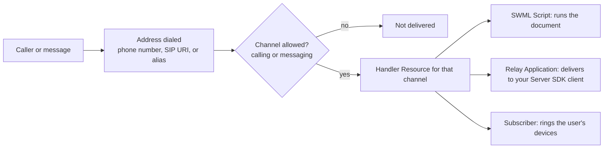

[resources]: /docs/platform/resources
[subscribers]: /docs/platform/subscribers
[phone-numbers]: /docs/platform/phone-numbers
[inbound-calling]: /docs/platform/voice/make-and-receive-calls#answer-an-inbound-call
[outbound-calling]: /docs/platform/voice/make-and-receive-calls#make-an-outbound-call
[sip-credentials]: /docs/platform/voice/sip/sip-credentials
[sip-gateways]: /docs/platform/voice/sip#sip-gateways
[byoc]: /docs/platform/voice/sip/bring-your-own-carrier
[swml-connect]: /docs/swml/reference/calling/connect
[browser-address-book]: /docs/browser-sdk/v4/guides/address-book
[browser-default-channel]: /docs/browser-sdk/v4/reference/address/default-channel
[rest-update-number]: /docs/apis/rest/phone-numbers/update-phone-number
[rest-phone-route]: /docs/apis/rest/phone-routes/assign-resource-phone-route
[rest-number-addresses]: /docs/apis/rest/phone-number-addresses/list-phone-number-addresses
[rest-link-number]: /docs/apis/rest/phone-number-addresses/create-phone-number-address
[rest-create-alias]: /docs/apis/rest/alias-addresses/create-alias-address
[rest-update-alias]: /docs/apis/rest/alias-addresses/update-alias-address
[rest-delete-alias]: /docs/apis/rest/alias-addresses/delete-alias-address
[rest-create-sip]: /docs/apis/rest/sip-addresses/create-sip-address
[rest-update-sip]: /docs/apis/rest/sip-addresses/update-sip-address
[rest-list-addresses]: /docs/apis/rest/addresses/list-resource-addresses
[rest-list-addresses-client]: /docs/apis/rest/addresses/list-resource-addresses-client
[subscriber-token]: /docs/apis/rest/subscribers/tokens/create-subscriber-token
[whatsapp-onboarding]: /docs/platform/messaging/whatsapp/onboarding

A [Resource][resources] is what handles a call or message. An address is how anyone reaches it.
Callers never dial a Resource directly: they dial a phone number, a SIP URI, or a name such as
`/public/support`, and SignalWire hands the call to the Resource assigned to that address. That
assigned Resource is the address's **handler**.

Every Resource gets one address when you create it, and most end up with several. The same
addresses are what your own code uses to name things: the `to` of a REST dial, the destination
of [`connect`][swml-connect] in SWML, or the argument to `dial()` in the Browser SDK.

## Address types

| Type | Looks like | Who dials it |
|---|---|---|
| [Phone number](#phone-numbers) | `+12025550123` | Anyone on the phone network |
| [SIP address](#sip-addresses) | `sip:*@acme-public.dapp.signalwire.com` | SIP devices, PBXs, and carriers outside SignalWire |
| [Alias](#aliases) | `/public/support`, `/private/john-doe` | Your scripts, Browser SDK clients, REST dials, and other Resources |
| [WhatsApp number](#whatsapp-numbers) | A WhatsApp business number connected to your Space | WhatsApp users |

A few rules hold for every type. An address points at exactly one Resource, and a Resource can
carry any number of addresses. Alias names are unique within a context, so `/public/support` and
`/private/support` can point at different Resources. A phone number is two addresses, one for
calling and one for messaging, each with its own handler.

### Phone numbers

A [phone number you've bought or ported][phone-numbers] is an address in the `external` context.
It has two handlers, assigned independently: a call handler for inbound calls and a message
handler for inbound messages. The Dashboard shows them as **Inbound Call Settings** and **Inbound
Message Settings** on the number's **Edit Settings** page. A number with no call handler rings
nobody; nothing happens on an inbound call until you assign a Resource.

Any Resource that can take a call can be a number's call handler, such as a SWML Script, an AI
Agent, a Call Flow, a Relay Application, a Subscriber, or a SIP Credential. Only messaging-capable
Resources can be its message handler.

### SIP addresses

A SIP address gives a Resource its own SIP URI so devices and systems outside SignalWire, such as
a PBX or your own carrier, can send it calls. SignalWire builds the host for you:

```text
sip:<user>@<YOUR_SPACE>-<domain>.dapp.signalwire.com
```

You choose the user and the domain. The user defaults to `*`, which accepts any username, so
`sip:anything@acme-public.dapp.signalwire.com` reaches the same Resource. The domain groups
addresses and is one of your Space's contexts, `public` by default. You can also require a
registration password, restrict callers to an IP allowlist, and set the encryption, codecs, and
ciphers offered on the call.

A SIP address routes inbound SIP only. It's different from a [SIP Credential][sip-credentials],
which is a Resource your own SIP devices register to and place calls from, and from a
[SIP gateway][sip-gateways], which forwards calls out to an external SIP destination. To bring
calls in from your own carrier, give the handling Resource a SIP address and point the carrier
at it; the [bring your own carrier][byoc] guide covers the full flow.

### Aliases

An alias is a name in the form `/<context>/<name>`. SignalWire creates one from the Resource's
name when you create the Resource, so a Subscriber named `john.doe` is reachable at
`/private/john-doe` and an AI Agent named `Support Agent` at `/private/support-agent`. Names are
lowercase letters, numbers, underscores, and dashes.

The context of that first alias depends on the Resource type:

| First alias context | Resource types |
|---|---|
| `private` | AI Agents, hosted SWML Scripts, Call Flows, Relay Applications, Subscribers |
| `public` | SWML Scripts served from an **External URL**, cXML Scripts, Video Rooms, SIP Credentials, SIP Gateways, FreeSWITCH Connectors |

A new AI Agent is therefore unreachable from a public click-to-call widget until you add a
`public` alias for it.

Add more aliases to expose the same Resource under other names, or to shape how it's reached.
Each alias has these properties, which the REST API returns on the alias object:

- **Name** is the URL-safe part of the address; **Display Name** is the label client applications
  show and defaults to the name.
- **Context** is `public` or `private`. See [Contexts](#contexts).
- **Channels** limit an alias to `audio`, `video`, `messaging`, or any combination. A
  messaging-only public alias gives a chat entry point to an agent that also takes voice calls
  through a private one.
- **Codecs** restrict the audio and video codecs offered on calls to the alias. Empty means no
  restriction.
- **Display As** controls how the alias appears to client applications that browse the
  directory: as an app, a room, a call, or a subscriber. A script that dispatches callers to
  your staff can present itself as a subscriber so callers feel they're dialing a person. The
  REST API derives it from the Resource type and returns it as `display_type`.

An alias can't be moved to a different Resource in place, in the Dashboard or with the REST API.
To swap the handler behind a name, [delete the alias][rest-delete-alias] and
[create a new one][rest-create-alias] with the same `name` and `context` and the new
`resource_id`. Nothing that dials the alias has to change.

### WhatsApp numbers

The Dashboard can attach a WhatsApp business number to a Resource so it handles inbound WhatsApp
calls and messages. It appears alongside the other types in the Add an Address menu. Connecting
the number itself is covered in [WhatsApp onboarding][whatsapp-onboarding].

## Contexts

An alias lives in a context, and the context's access type decides who can reach it. `public` and
`private` are built in and can't be changed:

- **`public`** addresses are reachable by anyone, including unauthenticated callers. Use them for
  entry points such as a support agent behind a click-to-call button.
- **`private`** addresses are reachable only by authenticated users, which makes them the home of
  [Subscribers][subscribers] and anything only your own users should dial.

A SIP address's domain is a context too, and phone numbers sit in the `external` context. Your
Space may show additional contexts in the Dashboard.

<Tip>
Only a call placed by an authenticated Subscriber can omit the context: a Subscriber in `private`
reaches `/private/bob` as `/bob`. REST dials and SWML [`connect`][swml-connect] need the full
`/<context>/<name>`.
</Tip>

## How SignalWire resolves an address

When a call or message arrives, SignalWire looks up the address it was sent to, checks that the
address accepts that channel, and hands the call to the Resource assigned as the handler for
that channel. The Resource type decides what happens next: a SWML Script runs its document, a
Relay Application delivers the call to your connected Server SDK client, and a Subscriber rings
that user's devices.



Because the Resource is what handles the call, the same logic runs whether the caller dialed
the phone number, the SIP address, or an alias. See [inbound calling][inbound-calling] for the
handler code itself.

## One Resource, many addresses

Give one Resource every address its callers need rather than duplicating the Resource per
channel. A support agent might carry:

| Address | Purpose |
|---|---|
| `+12025550123` | Customers calling from the phone network |
| `sip:*@acme-public.dapp.signalwire.com` | Your PBX or carrier sending SIP calls |
| `/public/support` | The click-to-call widget on your website |
| `/private/support` | Staff dialing from the Browser SDK or a SIP phone |

When you ship a new version of the agent, assign the phone number to the new Resource and
re-create the aliases on it. Every caller moves over, and nothing that dials `/public/support`
changes.

## Manage addresses

### In the Dashboard

**From the Resource.** Open the Resource from **My Resources** and select its **Addresses &
Phone Numbers** tab. It lists the Resource's addresses with their channels and type. Select
**+ Add** and choose **Phone Number**, **SIP Address**, or **Alias**. Phone Number lists the
numbers you own and offers to buy one; SIP Address and Alias open the forms described above.

<llms-ignore>

<Frame caption="The Add an Address menu on a Resource's Addresses & Phone Numbers tab">


</Frame>

</llms-ignore>

**From the phone number.** When you're starting from a number rather than a Resource, assign the
handler from the number's settings.

<Markdown src="/snippets/common/dashboard/_assign-resource-to-number.mdx" />

**Across the Space.** The **Addresses** page in the left sidebar lists every address in the
project with its context, type, call handler, and message handler. It's the quickest way to find
a number with no handler or to see which Resource an alias points at.

**Removing.** Deleting an address removes only that way in: the Resource stays, and calls already
in progress continue. Removing a phone number's handler leaves the number in your Space,
unassigned, until you assign another Resource.

### With the REST API

| Task | Endpoint |
|---|---|
| Route a number to a handler by type, for example a SWML URL or a Relay topic | [Update phone number][rest-update-number] |
| Route a number to an existing Resource, from the Resource's side | [Assign Resource to phone route][rest-phone-route] |
| List a number's calling and messaging addresses, link a Resource to one, or re-point it | [Phone number addresses][rest-number-addresses] (beta) |
| Create, rename, re-scope, or delete an alias | [Create][rest-create-alias], [update][rest-update-alias], and [delete][rest-delete-alias] alias address |
| Create or change a SIP address | [Create][rest-create-sip] and [update][rest-update-sip] SIP address |
| List every address a project can reach | [List Resource Addresses][rest-list-addresses] |
| List the addresses one Subscriber can reach, with a Subscriber token | [List Resource Addresses from a Client][rest-list-addresses-client] |

### In the Browser SDK

A client authenticated with a [Subscriber token][subscriber-token] sees the addresses its user is
allowed to reach through the `client.directory$` observable. Each entry exposes a ready-to-dial
URI per channel, so the client dials what the directory returns instead of building
`/context/name` strings by hand. See the [address book guide][browser-address-book] and [`defaultChannel`][browser-default-channel].

## Next steps

<CardGroup cols={2}>
  <Card title="Resources" icon="regular cubes" href="/docs/platform/resources">
    The handler types an address can point at, and how to create and manage them.
  </Card>
  <Card title="Inbound calling" icon="regular phone-arrow-down-left" href="/docs/platform/voice/make-and-receive-calls#answer-an-inbound-call">
    Assign a number and write the code that answers when it rings.
  </Card>
  <Card title="Subscribers" icon="regular users" href="/docs/platform/subscribers">
    Users with private addresses that ring their browser, mobile, or SIP devices.
  </Card>
  <Card title="Phone numbers" icon="regular hashtag" href="/docs/platform/phone-numbers">
    Buy, port, verify, and manage the numbers you assign to Resources.
  </Card>
</CardGroup>
