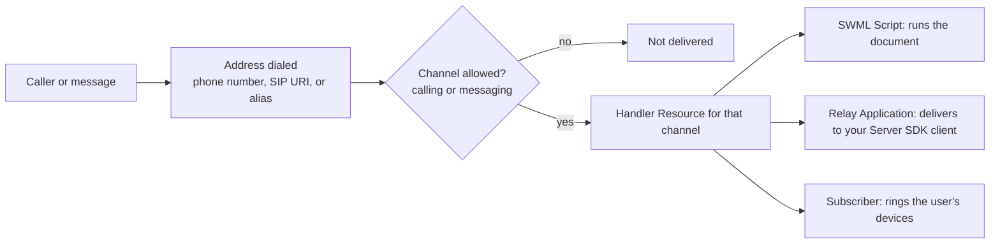

[resources]: /docs/platform/resources
[subscribers]: /docs/platform/subscribers
[phone-numbers]: /docs/platform/phone-numbers
[inbound-calling]: /docs/platform/voice/make-and-receive-calls
[sip-credentials]: /docs/platform/voice/sip/sip-credentials
[sip-gateways]: /docs/platform/voice/sip#sip-gateways
[byoc]: /docs/platform/voice/sip/bring-your-own-carrier
[swml-connect]: /docs/swml/reference/calling/connect
[browser-address-book]: /docs/browser-sdk/v4/guides/address-book
[browser-default-channel]: /docs/browser-sdk/v4/reference/address/default-channel
[rest-update-number]: /docs/apis/rest/phone-numbers/update-phone-number
[rest-phone-route]: /docs/apis/rest/phone-routes/assign-resource-phone-route
[rest-whatsapp-route]: /docs/apis/rest/whatsapp-routes/assign-resource-whatsapp-number
[rest-list-number-addresses]: /docs/apis/rest/phone-number-addresses/list-phone-number-addresses
[rest-link-number]: /docs/apis/rest/phone-number-addresses/create-phone-number-address
[rest-repoint-number]: /docs/apis/rest/phone-number-addresses/update-phone-number-address
[rest-unlink-number]: /docs/apis/rest/phone-number-addresses/delete-phone-number-address
[rest-list-aliases]: /docs/apis/rest/alias-addresses/list-alias-addresses
[rest-create-alias]: /docs/apis/rest/alias-addresses/create-alias-address
[rest-update-alias]: /docs/apis/rest/alias-addresses/update-alias-address
[rest-delete-alias]: /docs/apis/rest/alias-addresses/delete-alias-address
[rest-list-sip]: /docs/apis/rest/sip-addresses/list-sip-addresses
[rest-create-sip]: /docs/apis/rest/sip-addresses/create-sip-address
[rest-update-sip]: /docs/apis/rest/sip-addresses/update-sip-address
[rest-delete-sip]: /docs/apis/rest/sip-addresses/delete-sip-address
[rest-list-addresses]: /docs/apis/rest/addresses/list-resource-addresses
[rest-list-addresses-client]: /docs/apis/rest/addresses/list-resource-addresses-client
[subscriber-token]: /docs/apis/rest/subscribers/tokens/create-subscriber-token
[whatsapp-onboarding]: /docs/platform/messaging/whatsapp/onboarding

A [Resource][resources] is what handles a call or message. An Address is how anyone reaches it.
Callers dial a phone number, a SIP URI, or a name such as `/public/support`, and SignalWire hands
the call to the Resource assigned to that Address. That Resource is the Address's **handler**.

The same Addresses are what your own code uses to name a destination: the `to` of a REST dial, the
destination of [`connect`][swml-connect] in SWML, or the argument to `dial()` in the Browser SDK.

## How Addresses and Resources fit together

An Address and its Resource are separate objects, and you can create an Address from either side:

- On the Resource's **Addresses & Phone Numbers** tab, where the new Address goes to that Resource.
- On the **Addresses** page in the Dashboard's left sidebar, which lists every Address in your
  project. You create the Address there and pick its Resource in the same form.

Either way, an alias or SIP Address is assigned to a Resource when you create it. Phone numbers
work the other way around: a number you buy is an Address from the start, and it waits without a
handler until you assign one.

A few rules hold for every type:

- An Address hands its calls to one Resource. A phone number is the exception, with one handler for
  calls and another for messages.
- A Resource can carry any number of Addresses. SignalWire creates the first one, an
  [alias](#aliases), when you create the Resource.
- Phone numbers and SIP Addresses can be moved to a different Resource at any time. An alias stays
  with the Resource it was created on.
- Deleting an Address never deletes its Resource, and deleting a Resource deletes its aliases.

## Address types

| Type | Looks like | Who dials it |
|---|---|---|
| [Phone number](#phone-numbers) | `+12025550123` | Anyone on the phone network |
| [SIP Address](#sip-addresses) | `sip:*@acme-public.dapp.signalwire.com` | SIP devices, PBXs, and carriers outside SignalWire |
| [Alias](#aliases) | `/public/support`, `/private/john-doe` | Your scripts, Browser SDK clients, REST dials, and other Resources |
| [WhatsApp number](#whatsapp-numbers) | A WhatsApp business number connected to your Space | WhatsApp users |

### Phone numbers

A [phone number you've bought or ported][phone-numbers] is an Address with two handlers, assigned
independently: a call handler for inbound calls and a message handler for inbound messages. The
Dashboard shows them as **Inbound Call Settings** and **Inbound Message Settings** on the number's
**Edit Settings** page, and as the **Call Handler** and **Message Handler** columns on the
**Addresses** page.

A number rings nobody until you assign a call handler. Any Resource that can take a call can be
one, such as a SWML Script, an AI Agent, a Call Flow, a Relay Application, a Subscriber, or a SIP
Credential. A message handler is a Resource that runs messaging logic, such as a SWML Script or a
Relay Application. AI Agents and Call Flows handle calls only.

### SIP Addresses

A SIP Address gives a Resource its own SIP URI so devices and systems outside SignalWire, such as
a PBX or your own carrier, can send it calls. SignalWire builds the host for you:

```text
sip:<user>@<YOUR_SPACE>-<domain>.dapp.signalwire.com
```

You choose the user and the domain. The user defaults to `*`, which accepts any username, so
`sip:anything@acme-public.dapp.signalwire.com` reaches the same Resource. The domain is one of your
project's [contexts](#contexts), `public` by default. The same user can appear only once on a
domain.

A SIP Address also carries its own call settings:

- **Password**, which callers supply to authenticate their calls. It's optional.
- **IP Whitelisting**, which accepts calls only from the IP addresses or CIDR ranges you list, up
  to 256 entries.
- **Encryption**, set to required, optional, or forbidden. The default is optional.
- **Supported Codecs** and **Supported Ciphers**, which limit what calls to the address can
  negotiate.

A SIP Address carries calls only, so it has a call handler and no message handler. You can move it
to a different Resource later, and its URI, the one your PBX or carrier sends to, stays the same.

A SIP Address routes inbound SIP only. It's different from a [SIP Credential][sip-credentials],
which is a Resource your own SIP devices register to and place calls from, and from a
[SIP Gateway][sip-gateways], which sends calls out to an external SIP destination. To bring calls
in from your own carrier, give the handling Resource a SIP Address and point the carrier at it.
The [bring your own carrier][byoc] guide covers the full flow.

### Aliases

An alias is a name in the form `/<context>/<name>`. SignalWire creates one from the Resource's
name when you create the Resource, so a Subscriber named `john.doe` is reachable at
`/private/john-doe` and an AI Agent named `Support Agent` at `/private/support-agent`. Names use
lowercase letters, numbers, underscores, and dashes, and each name is unique within its context.

The context of that first alias depends on the Resource type:

| First alias context | Resource types |
|---|---|
| `private` | AI Agents, SWML Scripts stored in your Space, Call Flows, Relay Applications, Subscribers |
| `public` | SWML Scripts served from your own URL, Video Rooms, SIP Credentials, SIP Gateways, FreeSWITCH Connectors |

A new AI Agent is therefore unreachable from a public click-to-call widget until you add a
`public` alias for it.

Add more aliases to expose the same Resource under other names, or to shape how it's reached.
Each alias has these properties:

- **Name** is the URL-safe part of the Address. **Display Name** is the label client applications
  show, and it defaults to the name.
- **Context** is the context the alias lives in, such as `public` or `private`. See
  [Contexts](#contexts).
- **Channels** limit an alias to `audio`, `video`, `messaging`, or any combination. A
  messaging-only public alias gives a chat entry point to an agent that also takes voice calls
  through a private one.
- **Codecs** restrict the audio and video codecs offered on calls to the alias. Leave them empty to
  use the platform defaults.
- **Display As** controls how the alias appears to client applications that browse the
  directory: as an app, a room, a call, or a subscriber. A script that dispatches callers to your
  staff can present itself as a subscriber so callers feel they're dialing a person. The REST API
  returns it as `display_type`.

You can rename an alias, move it to another context, or change its channels and codecs at any
time. Its Resource stays fixed, so to put a different Resource behind a name,
[delete the alias](#remove-an-address) and create a new one with the same name and context on the
new Resource. Nothing that dials the alias has to change.

### WhatsApp numbers

A WhatsApp business number connected to your Space can be assigned to a Resource so it handles
inbound WhatsApp calls or messages. The number holds one Address at a time, for either calls or
messages. Assign it from the Resource's **Addresses & Phone Numbers** tab or with
[Assign Resource to WhatsApp number][rest-whatsapp-route]. [WhatsApp onboarding][whatsapp-onboarding]
covers connecting the number to your Space.

## Contexts

Every alias and SIP Address lives in a context, and the context's access type decides who can
reach it. Every project has two built-in contexts, `public` and `private`, which can't be changed:

- **`public`** Addresses are reachable by anyone, including unauthenticated callers. Use them for
  entry points such as a support agent behind a click-to-call button.
- **`private`** Addresses are reachable only by authenticated users, which makes them the home of
  [Subscribers][subscribers] and anything only your own users should dial.

You can add your own contexts from **Addresses** > **Contexts** in the Dashboard. A new context
takes a **Domain**, made of letters, numbers, and dashes, and inherits its access type from either
`public` or `private`. The domain becomes part of the host of every SIP Address you create in the
context. Deleting a context deletes every Address in it.

Phone numbers don't belong to a context you choose. The **Addresses** page lists them in the
`External` context.

<Tip>
Only a call placed by an authenticated Subscriber can omit the context: a Subscriber in `private`
reaches `/private/bob` as `/bob`. REST dials and SWML [`connect`][swml-connect] need the full
`/<context>/<name>`.
</Tip>

## How SignalWire resolves an Address

When a call or message arrives, SignalWire looks up the Address it was sent to, checks that the
Address accepts that channel, and hands the call to the Resource assigned as the handler for that
channel. The Resource type decides what happens next: a SWML Script runs its document, a Relay
Application delivers the call to your connected Server SDK client, and a Subscriber rings that
user's devices.


```mermaid
flowchart LR
    caller["Caller or message"] --> address["Address dialed<br/>phone number, SIP URI, or alias"]
    address --> channel{"Channel allowed?<br/>calling or messaging"}
    channel -- no --> rejected["Not delivered"]
    channel -- yes --> handler["Handler Resource for that channel"]
    handler --> swml["SWML Script: runs the document"]
    handler --> relay["Relay Application: delivers to your Server SDK client"]
    handler --> subscriber["Subscriber: rings the user's devices"]
```

Because the Resource is what handles the call, the same logic runs whether the caller dialed the
phone number, the SIP Address, or an alias. See [inbound calling][inbound-calling] for the handler
code itself.

## One Resource, many Addresses

Give one Resource every Address its callers need rather than duplicating the Resource per channel.
A support agent might carry:

| Address | Purpose |
|---|---|
| `+12025550123` | Customers calling from the phone network |
| `sip:*@acme-public.dapp.signalwire.com` | Your PBX or carrier sending SIP calls |
| `/public/support` | The click-to-call widget on your website |
| `/private/support` | Staff dialing from the Browser SDK or a SIP phone |

To move every caller to a new version of the agent, assign the phone number and the SIP Address
to the new Resource, then re-create the two aliases on it. The number, the SIP URI, and
`/public/support` all stay the same, so nothing that dials them changes.

## Manage Addresses

### In the Dashboard

#### From a Resource

Open the Resource from **My Resources** and select its **Addresses & Phone Numbers** tab. It lists
the Resource's Addresses with their channels and type. Select <kbd>+ Add</kbd> and choose one of
these:

- **Assign a Phone Number** lists the numbers you own that don't yet have a handler for that
  channel. Select **Buy A Number** to buy a new one.
- **Assign a SIP Address** opens the form for a new SIP Address on this Resource.
- **Add an Alias** opens the form for a new alias on this Resource.

<llms-ignore>

<Frame caption="The Add an Address menu on a Resource's Addresses & Phone Numbers tab">


</Frame>

</llms-ignore>

#### From the Addresses page

The **Addresses** page in the left sidebar lists every Address in your project with its
**Name**, **Context**, **Type**, **Call Handler**, and **Message Handler**. Search it by name or
context, or filter it by type, to find a number with no handler or to see which Resource an alias
points at.

To create an alias or SIP Address from this page:

<Steps>
<Step title="Open the Add an Address menu">

On the **Addresses** page, select <kbd>+ Add</kbd>, then choose **Add an Alias** or
**Assign a SIP Address**.

</Step>
<Step title="Fill in the Address">

Enter the fields for the type. An alias takes a name, a display name, a context, channels, and
codecs. A SIP Address takes a user, a domain, a display name, and its optional password, IP, and
encryption settings.

</Step>
<Step title="Assign the Resource">

In the **Assign to** row, select **Assign Resource** and pick the Resource that handles the
Address. Every alias and SIP Address needs one. If you skip this row, the form reports that a
Resource is required to create an address.

</Step>
<Step title="Create and check it">

Select <kbd>Create</kbd>. The new Address appears on the **Addresses** page with its Resource in
the **Call Handler** column, and on that Resource's **Addresses & Phone Numbers** tab.

</Step>
</Steps>

Choosing **Assign a Phone Number** on this page buys a new number. A phone number channel with no
handler shows **Assign** in its **Call Handler** or **Message Handler** column. Select it to open
the number's settings and pick a Resource.

#### Move an Address to another Resource

How you move an Address depends on its type:

- **Phone number.** Assign a different Resource from the number's settings, as shown below. The new
  Resource takes over from the old one on that channel.
- **SIP Address.** Open the SIP Address from the **Addresses** page or from its Resource's
  **Addresses & Phone Numbers** tab. In the **Assigned Resource** row, select
  **Change Resource**, pick the new Resource, and select **Save**. The SIP Address moves to that
  Resource and keeps its URI.
- **Alias.** Delete the alias and create a new one with the same name and context on the new
  Resource.

<Markdown src="/snippets/common/dashboard/_assign-resource-to-number.mdx" />

#### Remove an Address

Deleting an Address removes only that way in. The Resource stays, calls already in progress
continue, and new calls to the Address stop reaching it.

- To delete an alias, open it from the **Addresses** page and select **Delete**, or select
  **Delete Address** next to it on its Resource's **Addresses & Phone Numbers** tab.
- To remove a phone number or SIP Address from a Resource, select **Delete Address** next to it on
  the Resource's **Addresses & Phone Numbers** tab and confirm. A phone number stays in your
  project, unassigned, until you assign another Resource.

### With the REST API

Every create call takes the ID of the Resource that handles the Address, the same way the
Dashboard asks for one in the **Assign to** row.

| Task | Endpoint |
|---|---|
| List, create, rename, re-scope, or delete an alias | [List][rest-list-aliases], [create][rest-create-alias], [update][rest-update-alias], and [delete][rest-delete-alias] alias address |
| List, create, change, or delete a SIP Address | [List][rest-list-sip], [create][rest-create-sip], [update][rest-update-sip], and [delete][rest-delete-sip] SIP address |
| List a number's calling and messaging Addresses, link a Resource to one, re-point it, or remove the Resource | [List][rest-list-number-addresses], [link][rest-link-number], [update][rest-repoint-number], and [remove][rest-unlink-number] phone number address (beta) |
| Route a number to a handler by type, for example a SWML URL or a Relay topic | [Update phone number][rest-update-number] |
| Assign a number or WhatsApp number to a Resource, from the Resource's side | [Assign Resource to phone route][rest-phone-route], [Assign Resource to WhatsApp number][rest-whatsapp-route] |
| List the Addresses assigned to one Resource, by its ID | [List Resource Addresses][rest-list-addresses] |
| List the Addresses one Subscriber can reach, with a Subscriber token | [List Resource Addresses from a Client][rest-list-addresses-client] |

A SIP Address moves to a different Resource from the Dashboard, as described in
[Move an Address to another Resource](#move-an-address-to-another-resource). The update endpoint
changes its other settings.

### In the Browser SDK

A client authenticated with a [Subscriber token][subscriber-token] sees the Addresses its user is
allowed to reach through the `client.directory$` observable. Each entry exposes a ready-to-dial
URI per channel, so the client dials what the directory returns instead of building
`/context/name` strings by hand. See the [address book guide][browser-address-book] and
[`defaultChannel`][browser-default-channel].

## Next steps

<CardGroup cols={2}>
  <Card title="Resources" icon="regular cubes" href="/docs/platform/resources">
    The handler types an Address can point at, and how to create and manage them.
  </Card>
  <Card title="Inbound calling" icon="regular phone-arrow-down-left" href="/docs/platform/voice/make-and-receive-calls">
    Assign a number and write the code that answers when it rings.
  </Card>
  <Card title="Subscribers" icon="regular users" href="/docs/platform/subscribers">
    Users with private Addresses that ring their browser, mobile, or SIP devices.
  </Card>
  <Card title="Phone numbers" icon="regular hashtag" href="/docs/platform/phone-numbers">
    Buy, port, verify, and manage the numbers you assign to Resources.
  </Card>
</CardGroup>
