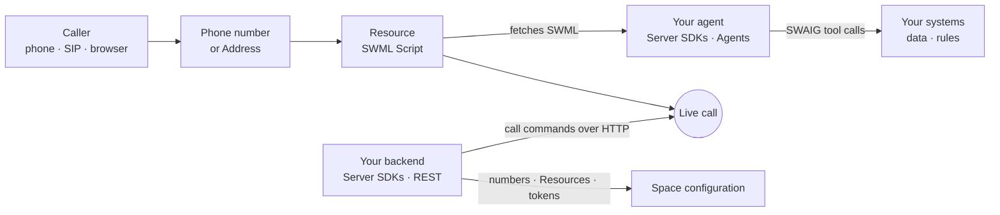

[swml]: /docs/swml
[swml-messaging]: /docs/swml/reference/messaging
[swml-send-sms]: /docs/swml/reference/calling/send-sms
[swml-user-event]: /docs/swml/reference/calling/user-event
[swml-transfer]: /docs/swml/reference/calling/transfer
[server-sdks]: /docs/server-sdks
[sdk-quickstart]: /docs/server-sdks/guides/quickstart
[agent-base]: /docs/server-sdks/guides/agent-base
[result-actions]: /docs/server-sdks/guides/result-actions
[function-result]: /docs/server-sdks/reference/python/agents/function-result
[fr-send-sms]: /docs/server-sdks/reference/python/agents/function-result/send-sms
[fr-user-event]: /docs/server-sdks/reference/python/agents/function-result/swml-user-event
[fr-rpc-ai-message]: /docs/server-sdks/reference/python/agents/function-result/rpc-ai-message
[swml-service]: /docs/server-sdks/reference/python/agents/swml-service
[datasphere-skill]: /docs/server-sdks/reference/python/agents/skills/datasphere
[mapping-numbers]: /docs/server-sdks/guides/mapping-numbers
[rest-client]: /docs/server-sdks/guides/rest-client
[py-rest-calling]: /docs/server-sdks/reference/python/rest/calling
[ts-rest-calling]: /docs/server-sdks/reference/typescript/rest/calling
[py-rest-datasphere]: /docs/server-sdks/reference/python/rest/datasphere
[relay-client]: /docs/server-sdks/guides/relay-client
[rest-api]: /docs/apis
[call-commands]: /docs/apis/rest/calls/call-commands
[create-message]: /docs/apis/rest/messages/create-message
[purchase-number]: /docs/apis/rest/phone-numbers/purchase-phone-number
[create-subscriber]: /docs/apis/rest/subscribers/create-subscriber
[subscriber-token]: /docs/apis/rest/subscribers/tokens/create-subscriber-token
[list-recordings]: /docs/apis/rest/recordings/list-call-recordings
[ai-chat-api]: /docs/apis/rest/ai-chat/chat-methods
[browser-sdk]: /docs/browser-sdk/v4/guides/overview
[browser-auth]: /docs/browser-sdk/v4/guides/authentication
[browser-inbound]: /docs/browser-sdk/v4/guides/inbound-calls
[click-to-call]: /docs/browser-sdk/v4/guides/click-to-call-widget
[cfb]: /docs/call-flow-builder
[resources]: /docs/platform/resources
[resources-dashboard]: /docs/platform/resources#in-the-dashboard
[addresses]: /docs/platform/addresses
[subscribers]: /docs/platform/subscribers
[phone-numbers]: /docs/platform/phone-numbers
[webhooks]: /docs/platform/webhooks
[api-credentials]: /docs/platform/your-signalwire-api-space
[ai-overview]: /docs/platform/ai
[tool-calling]: /docs/platform/ai/tool-calling
[record-calls]: /docs/platform/voice/record-calls
[outbound-calling]: /docs/platform/voice/outbound-calling
[messaging]: /docs/platform/messaging

SignalWire helps you create powerful and flexible communication apps that span across channels from PSTN and fax 
to the web browser. SignalWire lets you wire in state-of-the-art conversational agents, use AI for 


SignalWire runs every call, message, and media session itself. Its products are the ways your code
tells it what to do, and they differ in who holds control of the call, and when.
Most applications need two of them at most: the Server SDKs' Agents namespace, which writes
[SWML][swml] for your calls, and the REST APIs for everything around those calls. Add the Browser
SDK when people talk to you from a web page or app.

## The recommended path

Start with a call that is described up front and then adjusted from outside. Your agent tells
SignalWire how to handle a call, and SignalWire runs it. When something changes in your own
systems, your backend sends the live call a command over HTTP. Nothing in your stack holds a
connection open, so each piece scales like an ordinary web service.



1. A phone number or [Address][addresses] points at a [Resource][resources]. For a call you build
   in code, that Resource is a SWML Script whose URL is your agent.
2. When a call arrives, SignalWire requests a SWML document from your agent and runs it: answering,
   speaking, listening, recording, and running the AI conversation.
3. When the AI needs data or permission, it calls a tool on your server through SWAIG (the
   SignalWire AI Gateway). The reply can steer the conversation and trigger actions on the call.
4. At any point, your backend can send the call a command through the REST APIs: inject a message
   into the conversation, start a recording, play audio, or transfer the call.

## The products

| Product | What you write | Where it runs | Connection | Reach for it when |
|---|---|---|---|---|
| SWML, via the Server SDKs' Agents namespace | A description of the whole call, generated by an `AgentBase` class | Your HTTP server, or hosted by SignalWire as a SWML Script | SignalWire requests the document over HTTP | You're handling a call or an AI conversation. Start here. |
| REST APIs, via the Server SDKs' REST namespace | One request per action | Anywhere that can send HTTPS | None held open | You're provisioning your Space, starting calls and messages, or acting on a live call |
| Browser SDK | A client that places, receives, and displays calls and chat | The user's browser | A session authenticated with a Subscriber token | A person talks to you from a web page or app |
| WebSocket (Relay) | Procedural code that answers and drives each call | Your long-running process | A persistent WebSocket you keep open | Your code must own the call step by step and react to every event as it arrives |

### SWML, written with the Agents namespace

[SWML][swml] (SignalWire Markup Language) is a JSON or YAML document that describes how a call
should go: answer, play a greeting, run an AI agent, record, transfer. You rarely write it by hand.
The Agents namespace of the [Server SDKs][server-sdks] generates it from Python or TypeScript: you
subclass [`AgentBase`][agent-base], give it a prompt and tools, and run it as a web server.
SignalWire requests the document when a call arrives and executes it for the rest of the call.

Use it for any call your code handles, with or without AI. [`SWMLService`][swml-service] builds
non-AI flows, such as a phone menu or call forwarding, the same way. For a fixed flow with no
server of your own, paste the document into a SWML Script in your Dashboard, and SignalWire hosts it.

The call runs on SignalWire, so your server only answers short HTTP requests: one for the document
and one for each tool call. That makes it stateless and deployable anywhere that serves HTTPS, and
it leaves your code with only the parts you alone can write: prompts, tools, and business rules. The [Server SDKs quickstart][sdk-quickstart] builds your
first agent.

### REST APIs

The [REST APIs][rest-api] cover everything that isn't the call flow itself. You buy phone numbers,
create Resources and Subscribers, issue client tokens, send messages, fetch recordings and logs,
and upload documents to Datasphere. From code, the [REST namespace][rest-client] of the Server
SDKs wraps each endpoint in a method.

The Calling API is the part that reaches live calls. Its `dial` command starts a new call, and its
[call commands][call-commands] act on a call already in progress: `calling.play`, `calling.record`,
`calling.transfer`, `calling.ai_message`, `calling.ai_hold`, `calling.end`, and more than thirty
others. These are the same commands the Relay namespace sends over its WebSocket, delivered over
HTTP instead. A call running SWML accepts them, so the recommended path gets most of Relay's
real-time control without a connection to keep open.

### Browser SDK

The [Browser SDK][browser-sdk] (`@signalwire/js`) puts voice, video, and chat in a web page. A
signed-in user can dial an Address, such as the one your agent answers, and
[receive calls][browser-inbound] addressed to them. Your backend creates each user a short-lived
[Subscriber token][browser-auth] with the REST APIs, since an API token never belongs in a browser.
For a public "call us" button, the [click-to-call widget][click-to-call] needs no sign-in at all.

The Browser SDK is a participant in the call, not its controller. When a browser user calls your
agent, the flow they hear still comes from SWML, and your backend still steers it with REST commands.

### WebSocket (Relay)

The [Relay namespace][relay-client] of the Server SDKs holds a persistent WebSocket to SignalWire.
Your process subscribes to contexts, receives each inbound call as it arrives, and drives it with
procedural code: answer, play, collect digits, bridge. Every event on the call reaches your code
the moment it happens.

That control comes with a process you keep running and connected, and your code owns every call
from answer to hangup. Most applications don't need it. If you can describe the flow up front and
adjust it with commands, SWML and the REST APIs do the same work with less to operate.

<Accordion title="No-code options: Call Flow Builder and Dashboard AI Agents">

[Call Flow Builder][cfb] draws a voice application on a canvas in your Dashboard, one node per
step. An [AI Agent Resource][resources-dashboard] configures an agent's prompt, voice, and tools in
the Dashboard. Both produce Resources that you point a phone number at, with no code at all. Move
to the Agents namespace when the flow needs your own data, logic, or version control.

</Accordion>

## What each product can do

The table shows where each capability lives. A capability-specific guide, such as
[Record calls][record-calls], breaks its own capability down further.

| Function | SWML | REST | Browser SDK | WebSocket (Relay) |
|---|---|---|---|---|
| Handle an inbound call to a phone number or Address | <Icon icon="regular circle-check" color="var(--status-success)" /> | <Icon icon="regular circle-xmark" color="var(--status-error)" /> | <Icon icon="regular circle-check" color="var(--status-success)" /> | <Icon icon="regular circle-check" color="var(--status-success)" /> |
| Start a new outbound call | <Icon icon="regular circle-xmark" color="var(--status-error)" /> | <Icon icon="regular circle-check" color="var(--status-success)" /> | <Icon icon="regular circle-check" color="var(--status-success)" /> | <Icon icon="regular circle-check" color="var(--status-success)" /> |
| Run an AI agent on a call | <Icon icon="regular circle-check" color="var(--status-success)" /> | <Icon icon="regular circle-xmark" color="var(--status-error)" /> | <Icon icon="regular circle-xmark" color="var(--status-error)" /> | <Icon icon="regular circle-check" color="var(--status-success)" /> |
| Play audio, collect input, record, or stream a live call | <Icon icon="regular circle-check" color="var(--status-success)" /> | <Icon icon="regular circle-check" color="var(--status-success)" /> | <Icon icon="regular circle-xmark" color="var(--status-error)" /> | <Icon icon="regular circle-check" color="var(--status-success)" /> |
| Change a live AI conversation from outside it | <Icon icon="regular circle-xmark" color="var(--status-error)" /> | <Icon icon="regular circle-check" color="var(--status-success)" /> | <Icon icon="regular circle-xmark" color="var(--status-error)" /> | <Icon icon="regular circle-check" color="var(--status-success)" /> |
| Send an SMS or MMS | <Icon icon="regular circle-check" color="var(--status-success)" /> | <Icon icon="regular circle-check" color="var(--status-success)" /> | <Icon icon="regular circle-xmark" color="var(--status-error)" /> | <Icon icon="regular circle-check" color="var(--status-success)" /> |
| Handle an inbound SMS or MMS | <Icon icon="regular circle-check" color="var(--status-success)" /> | <Icon icon="regular circle-xmark" color="var(--status-error)" /> | <Icon icon="regular circle-xmark" color="var(--status-error)" /> | <Icon icon="regular circle-check" color="var(--status-success)" /> |
| Talk from a web page, with audio, video, or chat | <Icon icon="regular circle-xmark" color="var(--status-error)" /> | <Icon icon="regular circle-xmark" color="var(--status-error)" /> | <Icon icon="regular circle-check" color="var(--status-success)" /> | <Icon icon="regular circle-xmark" color="var(--status-error)" /> |
| Buy numbers, create Resources and Subscribers, issue tokens | <Icon icon="regular circle-xmark" color="var(--status-error)" /> | <Icon icon="regular circle-check" color="var(--status-success)" /> | <Icon icon="regular circle-xmark" color="var(--status-error)" /> | <Icon icon="regular circle-xmark" color="var(--status-error)" /> |
| Find recordings and logs after the call | <Icon icon="regular circle-xmark" color="var(--status-error)" /> | <Icon icon="regular circle-check" color="var(--status-success)" /> | <Icon icon="regular circle-xmark" color="var(--status-error)" /> | <Icon icon="regular circle-xmark" color="var(--status-error)" /> |

- **SWML** runs on a call that already exists. To start one, send a REST `dial` whose `url`
  points at your agent, and SWML takes over once the call is answered. Inbound SMS uses its own
  document type, [Messaging SWML][swml-messaging].
- **REST** acts on calls, but a call has to reach a Resource first. SignalWire routes an inbound
  call to the Resource behind the number, never to a REST client.
- **Agents** is not a separate column. It generates SWML, so it can do anything the SWML column
  can, and its tools can also act on the call from inside the conversation.

## Match your use case to a product

| You're building | Start with | Add |
|---|---|---|
| An AI agent that answers your phone number | The Agents namespace | A phone number pointed at the agent's SWML Script Resource ([Mapping numbers][mapping-numbers]) |
| A phone menu or call forwarding, without AI | [`SWMLService`][swml-service], or a hosted SWML Script | A phone number pointed at it |
| Outbound reminder or survey calls | A REST `dial` whose `url` is your agent ([Outbound calling][outbound-calling]) | Status callbacks to track each call |
| Buttons that act on live calls, such as record, transfer, or hold the AI | [REST call commands][call-commands] | The `call_id` your agent receives on every tool call |
| A "call us" button on a public web page | The [click-to-call widget][click-to-call] | An agent at the Address the widget dials |
| Voice or video calling between your own users | The [Browser SDK][browser-sdk] | [Subscribers][subscribers], and Subscriber tokens from your backend |
| Text notifications and confirmations | [REST messages][create-message] | A messaging-enabled [phone number][messaging] |
| Automatic replies to inbound texts | [Messaging SWML][swml-messaging] | A phone number whose message handler is that document |
| The same agent over text as well as voice | The [AI Chat API][ai-chat-api] | Nothing new: the agent's prompt and tools carry over ([AI overview][ai-overview]) |
| An agent that answers from your documents | The Agents namespace with the [`datasphere` skill][datasphere-skill] | Documents uploaded through the [REST namespace][py-rest-datasphere] |

## The building blocks every product shares

These pieces aren't products you build with. They're the platform objects every product reads and writes, so a
number bought with REST can route to an agent written with the Agents namespace, and a browser can
dial it.

| Building block | What it is | Where you work with it |
|---|---|---|
| [Phone numbers][phone-numbers] | Numbers on your Space that receive and place calls and messages | Buy and assign them in the Dashboard or with [REST][purchase-number]. Each one points at a Resource. |
| [Resources][resources] and [Addresses][addresses] | Anything that handles a call (SWML Script, AI Agent, Subscriber, Video Room, Call Flow), and the paths that reach it, such as `/public/bayview-dispatch` | Create them in the Dashboard or with REST. SWML, the Browser SDK, and Relay all dial Addresses. |
| [Subscribers][subscribers] and tokens | The people who sign in to your app, and the short-lived tokens their browsers use | [Create Subscribers][create-subscriber] and [tokens][subscriber-token] with REST, then use them in the Browser SDK |
| SWAIG tools | Functions on your server that an AI agent calls mid-conversation | Declare them on the agent. Their replies can carry [actions][result-actions] on the call. See [Tool calling][tool-calling]. |
| Datasphere | Document storage with semantic search, for agents that answer from your content | Upload documents with the [REST namespace][py-rest-datasphere], then give the agent the [`datasphere` skill][datasphere-skill] |
| [Webhooks and status callbacks][webhooks] | HTTP requests SignalWire sends your server when a call or message changes state | Set a `status_url` on REST commands, or a callback on a SWML method |
| Recordings | Audio files from recorded calls | Start them from any product, then [list, fetch, and delete][list-recordings] them with REST |

## How the pieces work together

Each pattern below combines a product with a building block or with another product. The running
example is Bayview Taxi, whose AI dispatcher Ada answers the phone.

### Steer a running agent from your backend with REST commands

Ada books a ride, and the call stays up while the dispatch system finds a driver. When a driver
accepts, the dispatch system needs to tell Ada, and through her the caller. The call is SWML, run
by SignalWire, and your dispatch system never held a connection to it. It needs only the call's ID
and one HTTP request.

Every SWAIG request carries the call's `call_id`. Store it with the booking:

<CodeBlocks>

```python title="Python — Agents"
# Install: python -m pip install signalwire-sdk==3.4.1
# Save as dispatch_agent.py and run: python dispatch_agent.py
from signalwire import AgentBase, FunctionResult

bookings = {}

agent = AgentBase(name="dispatch-agent", route="/agent")
agent.add_language("English", "en-US", "rime.spore")
agent.prompt_add_section(
    "Role",
    body="You are Ada, the dispatcher for Bayview Taxi. Book the ride with book_ride, "
    "then tell the caller you'll confirm their driver in a moment.",
)


def book_ride(args, raw_data):
    booking_id = f"BT-{len(bookings) + 1:04d}"
    bookings[booking_id] = {"pickup": args.get("pickup"), "call_id": raw_data.get("call_id")}
    return FunctionResult(f"Booked as {booking_id}. A driver is being assigned.")


agent.define_tool(
    name="book_ride",
    description="Book a pickup at the address the caller gave",
    parameters={
        "type": "object",
        "properties": {"pickup": {"type": "string", "description": "The pickup address"}},
        "required": ["pickup"],
    },
    handler=book_ride,
)

if __name__ == "__main__":
    agent.run()
```

```typescript title="TypeScript — Agents"
// Install: npm install @signalwire/sdk@2.0.5
// This sample also runs as JavaScript: save as dispatch-agent.mjs,
// then run: node dispatch-agent.mjs
import { AgentBase, FunctionResult } from '@signalwire/sdk';

const bookings = new Map();

const agent = new AgentBase({ name: 'dispatch-agent', route: '/agent' });
agent.addLanguage({ name: 'English', code: 'en-US', voice: 'rime.spore' });
agent.promptAddSection('Role', {
  body:
    "You are Ada, the dispatcher for Bayview Taxi. Book the ride with book_ride, " +
    "then tell the caller you'll confirm their driver in a moment.",
});

agent.defineTool({
  name: 'book_ride',
  description: 'Book a pickup at the address the caller gave',
  parameters: {
    type: 'object',
    properties: { pickup: { type: 'string', description: 'The pickup address' } },
    required: ['pickup'],
  },
  handler: (args, rawData) => {
    const bookingId = `BT-${String(bookings.size + 1).padStart(4, '0')}`;
    bookings.set(bookingId, { pickup: args.pickup, callId: rawData.call_id });
    return new FunctionResult(`Booked as ${bookingId}. A driver is being assigned.`);
  },
});

await agent.run();
```

</CodeBlocks>

The `bookings` map stands in for your dispatch system's database. When a driver accepts, the
dispatch system sends [`calling.ai_message`][call-commands] to that call. The message joins Ada's
conversation as a system instruction, which the caller doesn't hear:

<CodeBlocks>

```python title="Python — REST client"
# Install: python -m pip install signalwire-sdk==3.4.1
# Save as driver_assigned.py and run: python driver_assigned.py
from signalwire.rest import RestClient

client = RestClient(
    project="<YOUR_PROJECT_ID>",
    token="<YOUR_API_TOKEN>",
    host="<YOUR_SPACE>.signalwire.com",
)

client.calling.ai_message(
    "<YOUR_CALL_ID>",
    role="system",
    message_text="Driver Sam accepted booking BT-0001 and arrives in 6 minutes "
    "in a white Prius. Tell the caller.",
)
```

```typescript title="TypeScript — REST client"
// Install: npm install @signalwire/sdk@2.0.5
// This sample also runs as JavaScript: save as driver-assigned.mjs,
// then run: node driver-assigned.mjs
import { RestClient } from '@signalwire/sdk';

const client = new RestClient({
  project: '<YOUR_PROJECT_ID>',
  token: '<YOUR_API_TOKEN>',
  host: '<YOUR_SPACE>.signalwire.com',
});

await client.calling.aiMessage('<YOUR_CALL_ID>', {
  role: 'system',
  message_text:
    'Driver Sam accepted booking BT-0001 and arrives in 6 minutes ' +
    'in a white Prius. Tell the caller.',
});
```

```bash title="cURL — Calling API"
curl -X POST "https://<YOUR_SPACE>.signalwire.com/api/calling/calls" \
  -u "<YOUR_PROJECT_ID>:<YOUR_API_TOKEN>" \
  -H "Content-Type: application/json" \
  -d '{
    "id": "<YOUR_CALL_ID>",
    "command": "calling.ai_message",
    "params": {
      "role": "system",
      "message_text": "Driver Sam accepted booking BT-0001 and arrives in 6 minutes in a white Prius. Tell the caller."
    }
  }'
```

</CodeBlocks>

Replace `<YOUR_SPACE>`, `<YOUR_PROJECT_ID>`, and `<YOUR_API_TOKEN>` with the values from your
[API credentials][api-credentials] page, and `<YOUR_CALL_ID>` with the `call_id` stored with the
booking. The token needs the **Voice** permission.

The same request shape carries every other call command. A supervisor's dashboard can hold the AI
with `calling.ai_hold`, start a recording with `calling.record`, or hand the call to a person with
`calling.transfer`, each one a single HTTP request against the `call_id`. See the
[Python][py-rest-calling] and [TypeScript][ts-rest-calling] REST client references for every
command.

### Let a tool act on the call

A SWAIG tool can do more than return text. Its [`FunctionResult`][function-result] can also carry
actions that SignalWire performs on the call as soon as the reply arrives. Ada's `book_ride` could
[text the caller a confirmation][fr-send-sms], start a recording, or transfer the call to a person.
It can even [send a message to the agent on a different call][fr-rpc-ai-message], which is how one
caller's agent can update another's. The same capabilities exist as SWML methods, such as
[`send_sms`][swml-send-sms] and [`transfer`][swml-transfer]; the SDK writes them for you.

Use tool actions when the conversation itself decides what happens next. Use REST commands when
something outside the conversation does, like the driver accepting.

### Point a phone number, or a browser, at the same agent

An agent is reachable at an Address once it's behind a Resource. Create a SWML Script Resource
whose URL is your agent, then give it the Addresses callers use: a phone number for the phone
network, and an alias such as `/public/bayview-dispatch` for everything else. The
[Mapping numbers guide][mapping-numbers] walks through it.

A Browser SDK user dials that alias and talks to Ada from a web page, with no phone number
involved. The agent doesn't change: the Browser SDK is one more way to reach the same Address.

### Update a browser from inside the call

When the caller is in a browser, the call can push data to the page. The SWML
[`user_event`][swml-user-event] method, the [`swml_user_event`][fr-user-event] tool action, and the
`calling.user_event` REST command each fire a custom JSON event on the call, and the Browser SDK
receives it on the call object. Ada can put the driver's name and plate on screen while she says
them.

### Answer from your own documents

Datasphere stores documents with vector embeddings and searches them in natural language. Upload a
rate card or a service-area FAQ with the [REST namespace][py-rest-datasphere], then add the
[`datasphere` skill][datasphere-skill] to the agent. The skill gives Ada a `search_knowledge` tool,
so she can look up an answer without a tool handler of your own.

## Next steps

<CardGroup cols={2}>
  <Card title="Build your first agent" icon="regular robot" href="/docs/server-sdks/guides/quickstart">
    Write an agent with the Agents namespace and answer a call with it.
  </Card>
  <Card title="Tool calling" icon="regular screwdriver-wrench" href="/docs/platform/ai/tool-calling">
    Connect an agent to your systems with SWAIG functions, state, and actions.
  </Card>
  <Card title="Send call commands" icon="regular terminal" href="/docs/apis/rest/calls/call-commands">
    Every command the Calling API sends to a live call.
  </Card>
  <Card title="Browser SDK" icon="regular browser" href="/docs/browser-sdk/v4/guides/overview">
    Place and receive calls from a web page.
  </Card>
</CardGroup>
