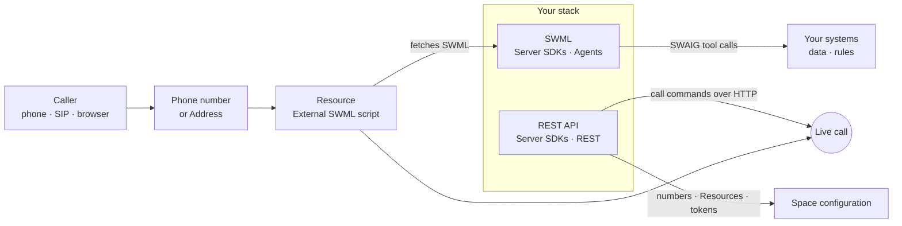

[swml]: /docs/swml
[swml-send-sms]: /docs/swml/reference/calling/send-sms
[swml-user-event]: /docs/swml/reference/calling/user-event
[swml-transfer]: /docs/swml/reference/calling/transfer
[server-sdks]: /docs/server-sdks
[sdk-quickstart]: /docs/server-sdks/guides/quickstart
[agent-base]: /docs/server-sdks/guides/agent-base
[result-actions]: /docs/server-sdks/guides/result-actions
[function-result]: /docs/server-sdks/reference/python/agents/function-result
[fr-send-sms]: /docs/server-sdks/reference/python/agents/function-result/send-sms
[fr-user-event]: /docs/server-sdks/reference/python/agents/function-result/swml-user-event
[fr-rpc-ai-message]: /docs/server-sdks/reference/python/agents/function-result/rpc-ai-message
[datasphere-skill]: /docs/server-sdks/reference/python/agents/skills/datasphere
[mapping-numbers]: /docs/server-sdks/guides/mapping-numbers
[rest-client]: /docs/server-sdks/guides/rest-client
[py-rest-calling]: /docs/server-sdks/reference/python/rest/calling
[ts-rest-calling]: /docs/server-sdks/reference/typescript/rest/calling
[py-rest-datasphere]: /docs/server-sdks/reference/python/rest/datasphere
[relay-client]: /docs/server-sdks/guides/relay-client
[rest-api]: /docs/apis
[call-commands]: /docs/apis/rest/calls/call-commands
[create-message]: /docs/apis/rest/messages/create-message
[purchase-number]: /docs/apis/rest/phone-numbers/purchase-phone-number
[create-subscriber]: /docs/apis/rest/subscribers/create-subscriber
[subscriber-token]: /docs/apis/rest/subscribers/tokens/create-subscriber-token
[list-recordings]: /docs/apis/rest/recordings/list-call-recordings
[browser-sdk]: /docs/browser-sdk/v4/guides/overview
[browser-auth]: /docs/browser-sdk/v4/guides/authentication
[browser-inbound]: /docs/browser-sdk/v4/guides/inbound-calls
[click-to-call]: /docs/browser-sdk/v4/guides/click-to-call-widget
[cfb]: /docs/call-flow-builder
[resources]: /docs/platform/resources
[resources-dashboard]: /docs/platform/resources#in-the-dashboard
[addresses]: /docs/platform/addresses
[subscribers]: /docs/platform/subscribers
[phone-numbers]: /docs/platform/phone-numbers
[webhooks]: /docs/platform/webhooks
[api-credentials]: /docs/platform/your-signalwire-api-space
[tool-calling]: /docs/platform/ai/tool-calling

SignalWire helps you create powerful and flexible communication apps that span channels from the PSTN
to the web browser, and integrate AI agents, payments, and backend hooks. You can build them with several
products and SDK surfaces. This page walks you through each one and helps you pick the right one for your
use case.

## The recommended path

The recommended path uses the Server SDKs' Agents namespace to create a SWML dialplan.
A dialplan is a set of rules that describes how you want the call to proceed. This can include forwarding the
call, recording a voicemail, or running a full IVR system.

SWML is SignalWire's native dialplan script. It is a JSON or YAML document, but you should compose it with the
Server SDKs' Agents namespace for easier maintenance and better validation. SWML has deep AI integrations
and webhook support, so you can keep track of the call while it happens.

For example, this dialplan for Bayview Taxi asks the caller to press 1 for Ada, the AI dispatcher, or 2
for a person, then routes the call. The Python code and the SWML it generates are shown below.

<CodeBlocks>

```python title="Python — Agents"
from signalwire import SWMLService

bayview = SWMLService(name="bayview-taxi", route="/bayview")

bayview.answer()
bayview.prompt(
    play="say:Thanks for calling Bayview Taxi. Press 1 to book with Ada, our AI dispatcher, or 2 to speak with a person.",
    max_digits=1,
)
bayview.switch(
    variable="prompt_value",
    case={
        "1": [{"execute": {"dest": "ada"}}],
        "2": [{"execute": {"dest": "person"}}],
    },
    default=[{"play": {"url": "say:Sorry, I didn't get that. Goodbye."}}, {"hangup": {}}],
)

bayview.add_section("ada")
bayview.add_verb_to_section("ada", "ai", {
    "prompt": {"text": "You are Ada, the dispatcher for Bayview Taxi. Help the caller book a ride."},
})

bayview.add_section("person")
bayview.add_verb_to_section("person", "connect", {"to": "+15551234567"})

bayview.serve()
```

```yaml title="YAML"
version: 1.0.0
sections:
  main:
  - answer: {}
  - prompt:
      play: say:Thanks for calling Bayview Taxi. Press 1 to book with Ada, our AI
        dispatcher, or 2 to speak with a person.
      max_digits: 1
  - switch:
      variable: prompt_value
      case:
        '1':
        - execute:
            dest: ada
        '2':
        - execute:
            dest: person
      default:
      - play:
          url: say:Sorry, I didn't get that. Goodbye.
      - hangup: {}
  ada:
  - ai:
      prompt:
        text: You are Ada, the dispatcher for Bayview Taxi. Help the caller book a
          ride.
  person:
  - connect:
      to: '+15551234567'
```

</CodeBlocks>

When the call ends, the SWML can send a call summary to your server through a webhook. The Server SDKs
also send REST commands and receive webhooks from the same codebase, so in practice a single backend
manages your entire call flow.

<llms-ignore>


</llms-ignore>

<llms-only>



</llms-only>

1. A phone number or [Address][addresses] points at a [Resource][resources]. For a call you build
   in code, that Resource is an External SWML script whose URL is your server.
2. When a call arrives, SignalWire sends your server a POST request with the call context, and
   runs the SWML document your server returns: answering,
   speaking, listening, recording, and running the AI conversation.
3. When the AI needs data or permission, it calls a tool on your server through SWAIG (the
   SignalWire AI Gateway). The reply can steer the conversation and trigger actions on the call.
4. At any point, your backend can send the call a command through the REST APIs: inject a message
   into the conversation, start a recording, play audio, or transfer the call.

## The products

| Product | What you write | Runs on | Use it for |
|---|---|---|---|
| SWML | The call flow, as a document | Your web server, or hosted by SignalWire | Handling calls and AI agents. Start here. |
| REST APIs | One request per action | Anywhere | Setup, outbound calls and messages, live call commands |
| Browser SDK | A calling client | The user's browser | Calls and chat from a web page |
| WebSocket (Relay) | Code that drives each call | Your always-on process | Step-by-step, event-driven call control |

### SWML

[SWML][swml] (SignalWire Markup Language) describes how a call should go: answer, play a greeting,
run an AI agent, record, transfer. With the Agents namespace of the [Server SDKs][server-sdks], you
subclass [`AgentBase`][agent-base] in Python or TypeScript, give it a prompt and tools, and run it as
a web server.

Use it for any call your code handles, with or without AI. For a fixed flow with no server of your
own, you can paste the document into a SWML Script in your Dashboard, and SignalWire hosts it.

The call runs on SignalWire, so your server only answers short HTTP requests: one for the document
and one for each tool call. Nothing holds a connection open, so your server stays stateless and
deploys anywhere that serves HTTPS. The [Server SDKs quickstart][sdk-quickstart] builds your first
agent. This one gives Ada a tool that looks up a ride:

```python title="Python — Agents"
from signalwire import AgentBase, FunctionResult


class Ada(AgentBase):
    def __init__(self):
        super().__init__(name="ada", route="/ada")
        self.prompt_add_section("Role", body="You are Ada, the dispatcher for Bayview Taxi. Help callers check on their ride.")

    @AgentBase.tool(
        name="check_ride",
        description="Look up a ride by its booking ID",
        parameters={"booking_id": {"type": "string", "description": "The booking ID"}},
    )
    def check_ride(self, args, raw_data):
        ride = rides.lookup(args["booking_id"])
        return FunctionResult(f"The driver arrives in {ride.eta} minutes.")


Ada().run()
```

### REST APIs

The [REST APIs][rest-api] cover everything that isn't the call flow itself. You buy phone numbers,
create Resources and Subscribers, issue client tokens, send messages, fetch recordings and logs,
and upload documents to Datasphere. From code, the [REST namespace][rest-client] of the Server
SDKs wraps each endpoint in a method.

The Calling API controls live calls. Its `dial` command starts a new call, and its
[call commands][call-commands] act on a call in progress: `calling.play`, `calling.record`,
`calling.transfer`, `calling.ai_message`, `calling.ai_hold`, `calling.end`, and more than thirty
others. These are the same commands the Relay namespace sends over its WebSocket, delivered over
HTTP instead.

```python title="Python — REST client"
from signalwire.rest import RestClient

client = RestClient(project="<YOUR_PROJECT_ID>", token="<YOUR_API_TOKEN>", host="<YOUR_SPACE>.signalwire.com")

client.phone_numbers.set_swml_webhook("<YOUR_PHONE_NUMBER_ID>", url="https://example.com/bayview")
client.calling.dial(from_="<YOUR_CALLER_ID>", to="<YOUR_DESTINATION>", url="https://example.com/bayview")
client.calling.ai_message("<YOUR_CALL_ID>", role="system", message_text="Driver Sam has arrived.")
client.messages.create(from_="<YOUR_CALLER_ID>", to="<YOUR_DESTINATION>", body="Your Bayview Taxi driver is outside.")
```

### Browser SDK

The [Browser SDK][browser-sdk] (`@signalwire/js`) puts voice, video, and chat in a web page. A
signed-in user can dial an Address, such as the one your agent answers, and
[receive calls][browser-inbound] addressed to them. Your backend creates each user a short-lived
[Subscriber token][browser-auth] with the REST APIs, since an API token never belongs in a browser.
For a public "call us" button, the [click-to-call widget][click-to-call] needs no sign-in at all.

The Browser SDK is a participant in the call, not its controller. When a browser user calls your
agent, the flow they hear still comes from SWML, and your backend still steers it with REST commands.

```javascript title="JavaScript — Browser SDK"
import { SignalWire, StaticCredentialProvider } from "@signalwire/js";

const client = new SignalWire(
  new StaticCredentialProvider({ token: "<SUBSCRIBER_TOKEN_FROM_YOUR_BACKEND>" })
);

client.ready$.subscribe(async (ready) => {
  if (!ready) return;

  const call = await client.dial("/public/bayview-dispatch", { audio: true });
  call.status$.subscribe((status) => console.log("status:", status));
});
```

### WebSocket (Relay)

The [Relay namespace][relay-client] of the Server SDKs holds a persistent WebSocket connection to SignalWire.
Your process subscribes to contexts, receives each inbound call as it arrives, and drives it with
procedural code: answer, play, collect digits, bridge. Your code receives every call event as it
happens and reacts to it directly, without the webhook layer.

<Accordion title="No-code options: Call Flow Builder and Dashboard AI Agents">

[Call Flow Builder][cfb] lets you draw a dialplan, one node per
step. An [AI Agent Resource][resources-dashboard] configures an agent's prompt, voice, and tools in
the Dashboard. Both produce Resources that you point a phone number at, with no code at all.
The click to test button helps you test the call straight from the Space dashboard.

</Accordion>

## Match your use case to a product

| You're building | Use |
|---|---|
| An AI agent that answers your phone number | Server SDK (Agents namespace) |
| A phone menu or call forwarding | Server SDK (Agents namespace) |
| An agent that answers from your documents | Server SDK (Agents namespace) with the [`datasphere` skill][datasphere-skill] |
| Outbound reminder or survey calls | REST `dial`, running your Server SDK (Agents namespace) flow |
| Buttons that record, transfer, or hold a live call | [REST call commands][call-commands] |
| Text notifications and confirmations | [REST messages][create-message] |
| A "call us" button on a web page | [Click-to-call widget][click-to-call] |
| Voice or video calling between your users | [Browser SDK][browser-sdk] |

## The building blocks every product shares

| Building block | What it is | Where you work with it |
|---|---|---|
| [Phone numbers][phone-numbers] | Numbers on your Space that receive and place calls and messages | Buy and assign them in the Dashboard or with [REST][purchase-number]. Each one points at a Resource. |
| [Resources][resources] and [Addresses][addresses] | Anything that handles a call (SWML Script, AI Agent, Subscriber, Video Room, Call Flow), and the paths that reach it, such as `/public/bayview-dispatch` | Create them in the Dashboard or with REST. SWML, the Browser SDK, and Relay all dial Addresses. |
| [Subscribers][subscribers] and tokens | The people who sign in to your app, and the short-lived tokens their browsers use | [Create Subscribers][create-subscriber] and [tokens][subscriber-token] with REST, then use them in the Browser SDK |
| SWAIG tools | Functions on your server that an AI agent calls mid-conversation | Declare them on the agent. Their replies can carry [actions][result-actions] on the call. See [Tool calling][tool-calling]. |
| Datasphere | Document storage with semantic search, for agents that answer from your content | Upload documents with the [REST namespace][py-rest-datasphere], then give the agent the [`datasphere` skill][datasphere-skill] |
| [Webhooks and status callbacks][webhooks] | HTTP requests SignalWire sends your server when a call or message changes state | Set a `status_url` on REST commands, or a callback on a SWML method |
| Recordings | Audio files from recorded calls | Start them from any product, then [list, fetch, and delete][list-recordings] them with REST |

## How the pieces work together

Each pattern below combines a product with a building block or with another product. The running
example is Bayview Taxi, whose AI dispatcher Ada answers the phone.

### Steer a running agent from your backend with REST commands

Ada books a ride, and the call stays up while the dispatch system finds a driver. When a driver
accepts, the dispatch system needs to tell Ada, and through her the caller. The call is SWML, run
by SignalWire, and your dispatch system never held a connection to it. It needs only the call's ID
and one HTTP request.

Every SWAIG request carries the call's `call_id`. Store it with the booking:

<CodeBlocks>

```python title="Python — Agents"
# Install: python -m pip install signalwire-sdk==3.4.1
# Save as dispatch_agent.py and run: python dispatch_agent.py
from signalwire import AgentBase, FunctionResult

bookings = {}

agent = AgentBase(name="dispatch-agent", route="/agent")
agent.add_language("English", "en-US", "rime.spore")
agent.prompt_add_section(
    "Role",
    body="You are Ada, the dispatcher for Bayview Taxi. Book the ride with book_ride, "
    "then tell the caller you'll confirm their driver in a moment.",
)


def book_ride(args, raw_data):
    booking_id = f"BT-{len(bookings) + 1:04d}"
    bookings[booking_id] = {"pickup": args.get("pickup"), "call_id": raw_data.get("call_id")}
    return FunctionResult(f"Booked as {booking_id}. A driver is being assigned.")


agent.define_tool(
    name="book_ride",
    description="Book a pickup at the address the caller gave",
    parameters={
        "type": "object",
        "properties": {"pickup": {"type": "string", "description": "The pickup address"}},
        "required": ["pickup"],
    },
    handler=book_ride,
)

if __name__ == "__main__":
    agent.run()
```

```typescript title="TypeScript — Agents"
// Install: npm install @signalwire/sdk@2.0.5
// This sample also runs as JavaScript: save as dispatch-agent.mjs,
// then run: node dispatch-agent.mjs
import { AgentBase, FunctionResult } from '@signalwire/sdk';

const bookings = new Map();

const agent = new AgentBase({ name: 'dispatch-agent', route: '/agent' });
agent.addLanguage({ name: 'English', code: 'en-US', voice: 'rime.spore' });
agent.promptAddSection('Role', {
  body:
    "You are Ada, the dispatcher for Bayview Taxi. Book the ride with book_ride, " +
    "then tell the caller you'll confirm their driver in a moment.",
});

agent.defineTool({
  name: 'book_ride',
  description: 'Book a pickup at the address the caller gave',
  parameters: {
    type: 'object',
    properties: { pickup: { type: 'string', description: 'The pickup address' } },
    required: ['pickup'],
  },
  handler: (args, rawData) => {
    const bookingId = `BT-${String(bookings.size + 1).padStart(4, '0')}`;
    bookings.set(bookingId, { pickup: args.pickup, callId: rawData.call_id });
    return new FunctionResult(`Booked as ${bookingId}. A driver is being assigned.`);
  },
});

await agent.run();
```

</CodeBlocks>

The `bookings` map stands in for your dispatch system's database. When a driver accepts, the
dispatch system sends [`calling.ai_message`][call-commands] to that call. The message joins Ada's
conversation as a system instruction, which the caller doesn't hear:

<CodeBlocks>

```python title="Python — REST client"
# Install: python -m pip install signalwire-sdk==3.4.1
# Save as driver_assigned.py and run: python driver_assigned.py
from signalwire.rest import RestClient

client = RestClient(
    project="<YOUR_PROJECT_ID>",
    token="<YOUR_API_TOKEN>",
    host="<YOUR_SPACE>.signalwire.com",
)

client.calling.ai_message(
    "<YOUR_CALL_ID>",
    role="system",
    message_text="Driver Sam accepted booking BT-0001 and arrives in 6 minutes "
    "in a white Prius. Tell the caller.",
)
```

```typescript title="TypeScript — REST client"
// Install: npm install @signalwire/sdk@2.0.5
// This sample also runs as JavaScript: save as driver-assigned.mjs,
// then run: node driver-assigned.mjs
import { RestClient } from '@signalwire/sdk';

const client = new RestClient({
  project: '<YOUR_PROJECT_ID>',
  token: '<YOUR_API_TOKEN>',
  host: '<YOUR_SPACE>.signalwire.com',
});

await client.calling.aiMessage('<YOUR_CALL_ID>', {
  role: 'system',
  message_text:
    'Driver Sam accepted booking BT-0001 and arrives in 6 minutes ' +
    'in a white Prius. Tell the caller.',
});
```

```bash title="cURL — Calling API"
curl -X POST "https://<YOUR_SPACE>.signalwire.com/api/calling/calls" \
  -u "<YOUR_PROJECT_ID>:<YOUR_API_TOKEN>" \
  -H "Content-Type: application/json" \
  -d '{
    "id": "<YOUR_CALL_ID>",
    "command": "calling.ai_message",
    "params": {
      "role": "system",
      "message_text": "Driver Sam accepted booking BT-0001 and arrives in 6 minutes in a white Prius. Tell the caller."
    }
  }'
```

</CodeBlocks>

Replace `<YOUR_SPACE>`, `<YOUR_PROJECT_ID>`, and `<YOUR_API_TOKEN>` with the values from your
[API credentials][api-credentials] page, and `<YOUR_CALL_ID>` with the `call_id` stored with the
booking. The token needs the **Voice** permission.

The same request shape carries every other call command, each one a single HTTP request against the
`call_id`. See the
[Python][py-rest-calling] and [TypeScript][ts-rest-calling] REST client references for every
command.

### Let a tool act on the call

A SWAIG tool can do more than return text. Its [`FunctionResult`][function-result] can also carry
actions that SignalWire performs on the call as soon as the reply arrives. Ada's `book_ride` could
[text the caller a confirmation][fr-send-sms], start a recording, or transfer the call to a person.
It can even [send a message to the agent on a different call][fr-rpc-ai-message], which is how one
caller's agent can update another's. The same capabilities exist as SWML methods, such as
[`send_sms`][swml-send-sms] and [`transfer`][swml-transfer]; the SDK writes them for you.

Use tool actions when the conversation itself decides what happens next. Use REST commands when
something outside the conversation does, like the driver accepting.

### Point a phone number, or a browser, at the same agent

An agent is reachable at an Address once it's behind a Resource. Create an External SWML script Resource
whose URL is your agent, then give it the Addresses callers use: a phone number for the phone
network, and an alias such as `/public/bayview-dispatch` for everything else. The
[Mapping numbers guide][mapping-numbers] walks through it.

A Browser SDK user dials that alias and talks to Ada from a web page, with no phone number
involved.

### Update a browser from inside the call

When the caller is in a browser, the call can push data to the page. The SWML
[`user_event`][swml-user-event] method, the [`swml_user_event`][fr-user-event] tool action, and the
`calling.user_event` REST command each fire a custom JSON event on the call, and the Browser SDK
receives it on the call object. Ada can put the driver's name and plate on screen while she says
them.

## Next steps

<CardGroup cols={2}>
  <Card title="Build your first agent" icon="regular robot" href="/docs/server-sdks/guides/quickstart">
    Write an agent with the Agents namespace and answer a call with it.
  </Card>
  <Card title="Tool calling" icon="regular screwdriver-wrench" href="/docs/platform/ai/tool-calling">
    Connect an agent to your systems with SWAIG functions, state, and actions.
  </Card>
  <Card title="Send call commands" icon="regular terminal" href="/docs/apis/rest/calls/call-commands">
    Every command the Calling API sends to a live call.
  </Card>
  <Card title="Browser SDK" icon="regular browser" href="/docs/browser-sdk/v4/guides/overview">
    Place and receive calls from a web page.
  </Card>
</CardGroup>
