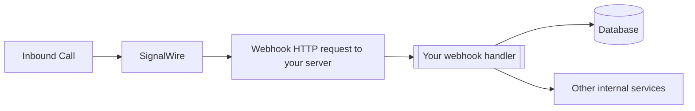
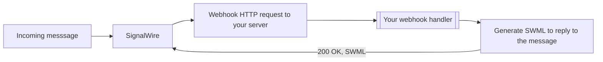

<Note>
Looking for TwiML™ compatible webhooks? Please refer to the [Compatibility API webhooks](/docs/compatibility-api/guides/webhooks) documentation.
</Note>

[Webhooks](https://en.wikipedia.org/wiki/Webhook) are HTTP requests sent to your server from SignalWire when an event occurs. They help receive information about events like inbound calls to your phone numbers, or messages. 

In addition to getting information about events, some webhooks also allow you to tell SignalWire how an event should be handled (via [SWML](/docs/swml)). 
 
During development, you can use localhost tunneling applications like [ngrok](https://ngrok.com) to test your webhook handlers running on your development machine..

To learn how to use ngrok for local testing, visit [the ngrok quickstart guide](https://ngrok.com/docs/getting-started).

## Status callbacks to keep track of events

You can configure SignalWire to send status callbacks to your webhook handler when certain events occur. The setting
for webhooks can be found in the **Phone Number Settings** page in the SignalWire Dashboard, and they are assigned per phone number.



You can also set status callback URLs programmatically when creating a resource or a phone number from the API.

<Cards cols={2}>
<Card
  title="10DLC status callback"
  href="/docs/apis/relay-rest/campaign-registry/webhooks/ten-dlc-status-callback"
>
  Learn how to receive 10DLC campaign registration status updates via webhooks.
</Card>
</Cards>

## Handle events with SWML

You can configure a phone number to handle incoming calls by using a [SWML script](/docs/swml). SWML is a JSON or YAML format that tells SignalWire how to handle a phone call. You can return SWML from your webhook handler to SignalWire to handle the call.



<Card
  title="Handling calls from code"
  href="/docs/swml/guides/remote-server"
>
  Learn how to handle incoming calls and messages from code.
</Card>

## Configure webhooks for phone numbers

To access the number settings and configure the webhooks in the SignalWire Space, click on **Phone Numbers** and find the number to set up.

<Frame caption="Purchased Phone Number List page in SignalWire Dashboard">


</Frame>

Click on the phone number to be set up and then click to **Edit Settings**. In phone number settings you can set webhooks to handle events with SWML, or cXML. You can also set status callback URLs for events.

## Verify webhook signature

To verify webhooks that originated from SignalWire, SignalWire signs its requests with a digital HMAC security key. You can verify that the security key matches the key documented in your Dashboard's [API Credentials](https://my.signalwire.com?page=credentials) with the `validateRequest` method.

<Frame caption="The Signing Key on the API Credentials page">


</Frame>

<Warning title="This step is not optional!">
For production applications, it is extremely important to verify the webhook signature to ensure the requests are coming from SignalWire and not a malicious third party. 
</Warning>

```js
import { validateRequest } from "@signalwire/js";

// prepare raw body for validation
app.use(express.json({
  verify: (req: any, _res, buf) => {
    req.rawBody = buf.toString();
  }
}));

app.post("/mywebhook", (req: any, res) => {
  const valid = validateRequest(
    "<SIGNING_KEY_FROM_Dashboard>",
    req.headers["x-signalwire-signature"] as string,
    "https://example.ngrok.io/mywebhook", //this should be the public-facing URL of your webhook handler
    req.rawBody
  );

  if (!valid) return res.status(401).send("Invalid signature");

  res.sendStatus(200);
});
```

This ensures that if a malicious third party tries to spoof a webhook request, it will be rejected.