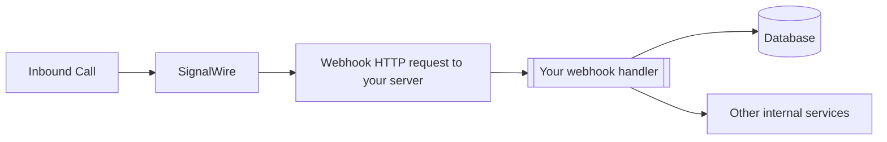
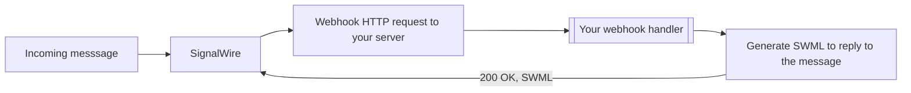

## What is a Webhook?

<Note>
draft
</Note>

<Note>
Looking for TwiML(tm) compatible webhooks? Please refer to the [Compatibility API](/docs/compatibility-api/guides/webhooks) documentation.
</Note>

[Webhooks](https://en.wikipedia.org/wiki/Webhook) are HTTP requests sent to your server from SignalWire when an event occurs. They help receive information about events like inbound calls to your phone numbers, or messages. 

SignalWire notifies your server of key events by sending an HTTP request to the webhook URL you have configured. Some common webhooks include:

- Inbound calls and messages to your phone numbers
- Campaign Registry events
- AI agent conversation summaries



In addition to getting information about events, some webhooks also allow you to tell SignalWire how an event should be handled. 
 


For example, you might use a webhook to handle an inbound call by reading the instructions in your webhook to play an IVR, route the customer to the right department, and connect them with an agent. You could also use a webhook as a status callback where each status change of a message is sent to your web application which might store some instructions for handling emergent errors.

To learn how to use ngrok for local testing, visit [ngrok.com](https://ngrok.com).

<Info>

Some webhooks require `<Response>` from your web application. In this instance, your web application **MUST** send valid XML to the webhook request, **EVEN** if the XML response is just an empty `<Response>` tag. 

... swml ...

Other webhooks do not require a response, such as the status callback example above. This webhook request only requires an HTTP status code of 200 OK, meaning that the request was successful.

</Info>


### Status Callback

When one of your SignalWire phone numbers receives a call or is used to place an outgoing call, you can have asynchronous HTTP requests sent to your server that tell you about the status changes and the call details. You can do this by setting the `StatusCallback` parameter when [placing an outbound call](/docs/apis/calling/calls/call-commands) through the API.

SignalWire will send you a status callback when the call is completed unless directed otherwise; you can use the events `initiated`, `ringing`, `answered`, and `completed` in the `StatusCallbackEvent` parameter in order to get updates when each of those statuses is reached.

<Cards>
<Card
  title="Incoming call status callback"
  href="/docs/compatibility-api/rest/incoming-phone-numbers/webhooks/incoming-call-status-callback"
>
  Learn how to track incoming call status changes via webhooks.
</Card>
<Card
  title="Recording status callback"
  href="/docs/compatibility-api/rest/recordings/webhooks/recording-status-callback"
>
  Learn how to receive recording status updates via webhooks.
</Card>
</Cards>


<Info>

SignalWire doesn't show a message as Delivered unless we can 100% confirm delivery to the end network by getting a Delivery Receipt (DLR) from the receiving carrier. A status of **Sent** means that the message left SignalWire successfully and reached our downstream peer. Once we receive the Delivery Receipt indicating that the message entered the end carrier's network, it switches to **Delivered**.

If you see a message with a status of **Delivered** that did not reach the end handset, feel free to open a support ticket with the [message SID](/docs/platform/what-is-a-sid) for us to escalate the example to our carrier partners to find out why the MNOs (Verizon, AT&T, T-Mobile, etc) marked it as **Delivered**.

Some carriers may send delayed DLRs, and others may not send DLRs at all. Providers do not currently allow for any DLRs for MMS, so you will only ever see the status **Sent**.

</Info>

## How to Configure Your Webhook to a SignalWire Number

To access the number settings and configure the webhooks in the SignalWire Space, click on **Phone Numbers** and find the number to set up.

<Frame caption="Purchased Phone Number List page in SignalWire Dashboard">


</Frame>

Click on the phone number to be set up and then click to **Edit Settings**.

In the Edit Settings page, the number can be given a name and set up **Voice/Fax & Messaging** settings.

Navigate to either the **Voice & Fax** section or the **Messaging** section depending on your use case, as you will have to set different webhooks for each.

For detailed instructions on how to configure your webhook to a SignalWire number, see the [Making and Receiving Phone Calls](/docs/swml/guides/make-and-receive-calls) guide.

<Warning title="Voice vs Fax">
If you set your phone number to handle incoming calls using Fax, you will **NOT** be able to also use it for voice. The reverse is also true! You can only use a phone number for voice **OR** fax, not both.
</Warning>

Select **SWML Script** for **When a Call Comes In** to use a SWML script. If you are using the [RELAY Realtime API](/docs/server-sdk/node), select **RELAY** for **When a Call Comes In**. The other options are all third-party integrations you can choose to use for different use cases!

GET and POST are two different types of HTTP methods. GET is used for requesting something from a resource, whereas POST is used to send data to a server. If you were using a webhook that pointed towards your web application for handling inbound calls, you would use a POST request. If you were using an XML Bin to `<Say>` (text to speech) a quick message for your customers to listen to when calling your number, you would use GET.

## How to Verify Webhooks

To verify webhooks that originated from SignalWire, SignalWire signs its requests with a digital HMAC security key. You can verify that the security key matches the key documented in your Dashboard's [API Credentials](https://my.signalwire.com?page=credentials) with the `validateRequest` method:

```js
import { verifyWebhook } from "@signalwire/signalwire-js";

app.post("/mywebhook", (req, res) => {
  const valid = verifyWebhook(
    "<--Signing Key copied from your credentials page-->",
    req.headers["x-signalwire-signature"],
    "https://example.ngrok.io/mywebhook",
    req.body
  );
});
```

This method responds with a boolean value. You can continue your application's logic in the truth case and return unauthorized for the false case.
