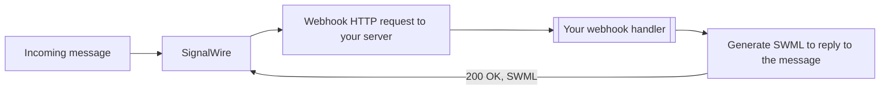
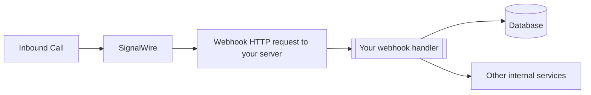

[Webhooks](https://en.wikipedia.org/wiki/Webhook) are HTTP requests sent to your server from SignalWire when an event occurs. 
They help receive information about events like inbound calls to your phone numbers, or messages.

In addition to getting information about events, some webhooks also allow you to tell SignalWire how an event should be handled.

During development, you can use localhost tunneling applications like [ngrok](https://ngrok.com) to test your webhook handlers locally. 
See [the ngrok quickstart guide](https://ngrok.com/docs/getting-started) to get started.

## Configure webhooks for phone numbers

To handle an inbound call or message, you point your phone number at a [Resource](/docs/platform/resources) that holds your webhook URL. 
When an event arrives, SignalWire requests that URL and your server responds with [SWML](/docs/swml), the SignalWire Markup Language that tells SignalWire how to handle the call.



<Markdown src="/snippets/common/dashboard/_resource-admonition.mdx" />

<Steps>

### Create a Resource for your webhook URL

In the SignalWire Dashboard, open the **My Resources** tab and click **+ Add**, then choose **SWML Script**.

<Frame caption="The Resource selection menu">


</Frame>

Give the script a name, set **Handle Calls Using** to **External URL**, and enter your webhook URL in the **Primary Script URL** field. Click **Create** to save the Resource.

<Frame caption="A SWML Script Resource configured to fetch SWML from an external webhook URL">


</Frame>

### Assign the Resource to your phone number

Open the **Phone Numbers** tab and select the number you want to configure.

<Frame caption="The purchased phone number list in the SignalWire Dashboard">


</Frame>

Click **Edit Settings**. Under **Inbound Call Settings** (or **Inbound Message Settings** for messaging), choose **Assign Resource**, select the Resource you created, and click **Save**.

<Frame caption="Assigning a Resource to a phone number's inbound call settings">


</Frame>

</Steps>

<CardGroup cols={3}>
<Card title="Mapping numbers" href="/docs/server-sdks/guides/mapping-numbers">
  A full walkthrough of connecting a phone number to your application.
</Card>
<Card title="Phone numbers" href="/docs/platform/phone-numbers">
  How to purchase and manage phone numbers in your SignalWire Space.
</Card>
<Card title="Handling calls from code" href="/docs/swml/guides/remote-server">
  Learn how to handle incoming calls and messages from code.
</Card>
</CardGroup>

## Status callbacks to keep track of events

Status callbacks are asynchronous HTTP requests SignalWire sends to your server as a call, 
message, or recording moves through its lifecycle, so your application can react to each state change as it happens.



You subscribe to a status callback **programmatically**: when you create the call or message, provide a callback URL on the relevant SWML method, 
and SignalWire posts to it each time the state changes. 
What you set and the states you receive depend on what you're tracking:

| To track | Provide a callback URL on | States you'll receive |
| :--- | :--- | :--- |
| **Voice calls** | `call_state_url` on [`connect`](/docs/swml/reference/calling/connect) | `created`, `ringing`, `answered`, `ended` |
| **Messages** | `status_callback` on [`send_sms`](/docs/swml/reference/calling/send-sms), or `status_url` on [`reply`](/docs/swml/reference/messaging/reply) | `queued`, `initiated`, `sent`, `delivered`, `undelivered`, `failed`, `read` |
| **Recordings** | `status_url` on [`record_call`](/docs/swml/reference/calling/record-call) | `recording`, `paused`, `finished`, `no_input`, `error` |

<Note>
For voice calls, `call_state_events` defaults to `['ended']` — set it explicitly to also receive `created`, `ringing`, and `answered`.
</Note>

<Info>
SignalWire only marks a message **Delivered** once it receives a Delivery Receipt (DLR) confirming the message reached the end carrier's network. 
A status of **Sent** means the message left SignalWire successfully. 
MMS messages do not support DLRs, so they only ever show **Sent**.
</Info>

<CardGroup cols={2}>
<Card
  title="Message status callback"
  href="/docs/apis/rest/messages/webhooks/message-status-callback"
>
  The full field reference and status values for outbound message status callbacks.
</Card>
<Card
  title="10DLC status callback"
  href="/docs/apis/rest/campaign-registry/webhooks/ten-dlc-status-callback"
>
  Receive 10DLC campaign registration status updates via webhooks.
</Card>
</CardGroup>

## Verify webhook signature

To verify webhooks that originated from SignalWire, SignalWire signs its requests with a digital HMAC security key. 
You can verify that the security key matches the key documented in your Dashboard's [API Credentials](https://my.signalwire.com?page=credentials) with the `validateRequest` method.

<Frame caption="The Signing Key on the API Credentials page">


</Frame>

<Warning title="This step is not optional!">
For production applications, it is extremely important to verify the webhook signature to ensure the requests are coming from SignalWire and not a malicious third party.
</Warning>

```js
import { validateRequest } from "@signalwire/js";

// prepare raw body for validation
app.use(express.json({
  verify: (req: any, _res, buf) => {
    req.rawBody = buf.toString();
  }
}));

app.post("/mywebhook", (req: any, res) => {
  const valid = validateRequest(
    "<SIGNING_KEY_FROM_Dashboard>",
    req.headers["x-signalwire-signature"] as string,
    "https://example.ngrok.io/mywebhook", //this should be the public-facing URL of your webhook handler
    req.rawBody
  );

  if (!valid) return res.status(401).send("Invalid signature");

  res.sendStatus(200);
});
```
