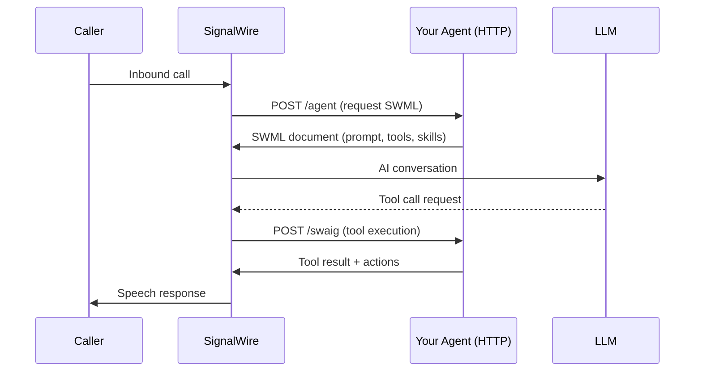
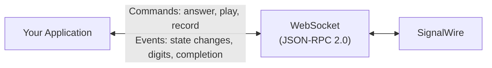
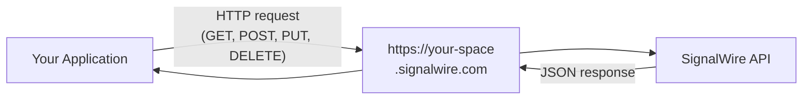

[swml]: /docs/swml/reference/ai

The SignalWire SDK provides three namespaces, each designed for a different
interaction pattern with the SignalWire platform. You can use one or combine all
three in a single application.

| Namespace | Description |
|-----------|-------------|
| **Agents** | AI voice agents (SWML) |
| **RELAY** | Real-time call control (WebSocket) |
| **REST** | Resource management (HTTP) |

<Note>
See the namespace pages for your selected SDK language variant for import examples and usage.
</Note>

## Namespaces

| | Agents | RELAY | REST |
|---|---|---|---|
| **Purpose** | AI-driven voice conversations | Programmatic call and message control | Resource provisioning and queries |
| **Protocol** | HTTP/HTTPS (FastAPI server) | WebSocket (JSON-RPC 2.0 over `wss://`) | HTTP/HTTPS (synchronous) |
| **Pattern** | Declarative -- return a SWML document describing the call flow | Imperative -- issue async commands and react to events | Request/response -- standard CRUD operations |
| **Best for** | Voice bots, AI assistants, multi-step workflows | IVR systems, call routing, recording pipelines, custom media flows | Purchasing numbers, managing fabric resources, querying logs |

### Agents

The Agents namespace generates [SWML][swml] documents that
describe AI-powered call flows. SignalWire handles the entire conversation
lifecycle -- your agent just defines the behavior.



When a call arrives, SignalWire sends a request to your agent's HTTP endpoint.
The agent returns a SWML document containing the AI prompt, tools, skills, and
call handling instructions. SignalWire then executes the document -- managing
speech recognition, LLM interaction, and tool calling automatically.

Use Agents when you want AI-driven conversations without managing low-level
call events yourself.

### RELAY

The RELAY namespace opens a persistent WebSocket connection to SignalWire using
the JSON-RPC 2.0 protocol. Unlike the declarative Agents approach, RELAY gives
you imperative, event-driven control over every step of a call or message.



Your code subscribes to **contexts** (routing labels) that determine which
inbound calls and messages are delivered to your application. When an event
arrives, you react with async commands -- answering, playing audio, collecting
input, recording, transferring, or bridging calls. Long-running operations
return action handles that let you pause, resume, stop, or wait for completion.

Use RELAY when you need programmatic call control -- IVR menus, call center
routing, conditional recording, or anything that requires reacting to call
events in real time.

### REST

The REST namespace provides a synchronous HTTP client for the SignalWire platform
APIs. It organizes endpoints into namespaced resource objects with standard CRUD
operations.



Use REST for administrative tasks -- purchasing numbers, provisioning fabric
resources, querying call logs, managing video rooms, or any operation that
doesn't require real-time event handling.

---

## Authentication

All three namespaces authenticate with the same core credentials:

| Environment Variable | Description |
|---------------------|-------------|
| `SIGNALWIRE_PROJECT_ID` | Your SignalWire project identifier |
| `SIGNALWIRE_API_TOKEN` | API token for your project |
| `SIGNALWIRE_SPACE` | Your SignalWire space hostname (e.g., `your-space.signalwire.com`) |

Set these once and all three clients can authenticate without explicit arguments.
You can also pass credentials explicitly when constructing each client.
See the namespace overview pages for language-specific examples.

### Namespace-specific authentication

Each namespace adds its own authentication layer on top of the shared credentials:

**Agents** -- HTTP Basic Auth protects the agent's webhook endpoints. Credentials
are set via `SWML_BASIC_AUTH_USER` and `SWML_BASIC_AUTH_PASSWORD` environment
variables, or auto-generated on startup if not provided. SignalWire includes these
credentials when sending requests to your agent.

**RELAY** -- Authenticates over WebSocket using project + token, or alternatively
a JWT token via `SIGNALWIRE_JWT_TOKEN`. JWT authentication embeds the project ID
inside the token, so `SIGNALWIRE_PROJECT_ID` is not required when using JWT.

**REST** -- Uses HTTP Basic Auth with project ID as the username and API token as
the password. All requests go over HTTPS to `https://{SIGNALWIRE_SPACE}`.

---

## Installation

Installation instructions vary by language. See the namespace overview pages for your selected SDK variant.

---

## Choosing a Namespace

```
Do you need AI-driven conversations?
├── Yes → Agents (AgentBase)
│         └── Need real-time call control too? → Combine with RELAY
└── No
    ├── Need real-time call/message events? → RELAY (RelayClient)
    └── Need to manage resources or query data? → REST (RestClient)
```

All three namespaces can coexist in the same application. A common pattern is to
use AgentBase for AI conversations, RELAY for call routing logic, and RestClient
for provisioning numbers and querying logs.

Use the sidebar navigation to browse the Agents, RELAY, and REST namespace references
for your selected SDK language variant.
