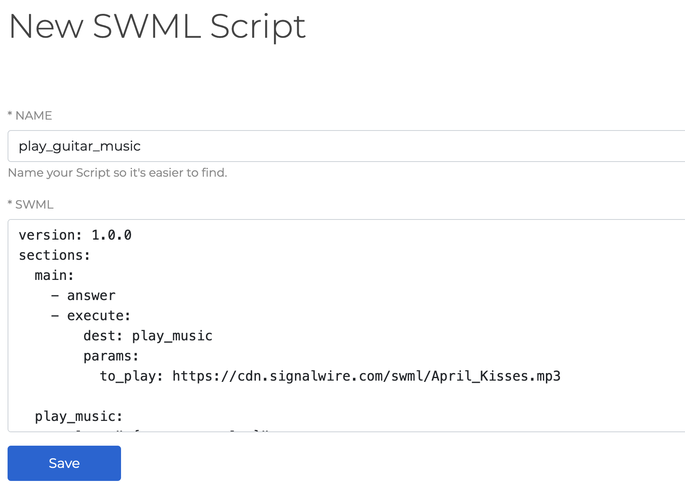
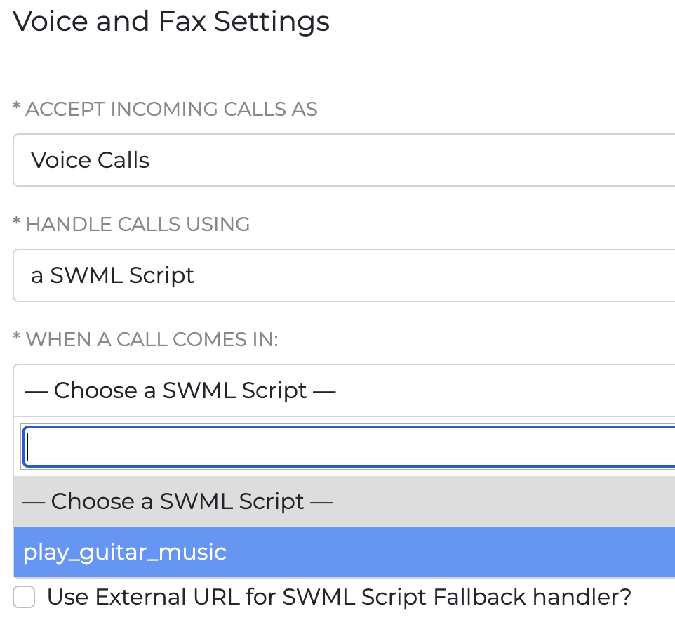

# Quickstart

**Deploy your first SWML script in 5 minutes**

This guide will walk you through deploying your first SWML script to handle incoming calls. By the end of this quickstart, you'll have a working phone number that runs your SWML application.

## Prerequisites

Before you begin, make sure you have:
- A [SignalWire account](https://signalwire.com/signups/new)
- A SWML script ready for deployment

## Deploy your SWML script

<Steps>

### Create new script

From your [SignalWire Dashboard](https://my.signalwire.com),
click **Script**, then **SWML script**.
This will open the New SWML Script dialog box. 

Paste your SWML Script into the Primary Script field, then select **Create**.

If necessary, copy and paste the below example script:

<CodeBlocks>
<CodeBlock title="YAML">
```yaml
version: 1.0.0
sections:
  main:
    - answer: {}
    - play:
        url: "say:Hello World!"
    - play:
        url: "say:Congratulations on successfully deploying your script!"
    - hangup: {}
```
</CodeBlock>
<CodeBlock title="JSON">
```json
{
  "version": "1.0.0",
  "sections": {
    "main": [
      {
        "answer": {}
      },
      {
        "play": {
          "url": "say:Hello World!"
        }
      },
      {
        "play": {
          "url": "say:Congratulations on successfully deploying your script!"
        }
      },
      {
        "hangup": {}
      }
    ]
  }
}
```
</CodeBlock>
</CodeBlocks>

Your script will be saved in the "My Resources" section under "Scripts". 

It will remain housed here under the name you provide for easy reference.

### Assign a phone number
- Navigate to **Phone Numbers** in your Dashboard.
- Purchase a phone number if needed by clicking the "+ New" button in the top right hand corner of the page.
- Click on your phone number, then click "Edit Settings".
- Click on "+ Assign Resource", then assign your SWML Script.

### Test your application
Call your assigned phone number to test your SWML application.

</Steps>

<Accordion title="In the Legacy Dashboard">

You can write and save new SWML scripts from the "RELAY/SWML" section of your Dashboard.
In that section, switch to the tab named [SWML Scripts](https://my.signalwire.com/relay-bins).
Once there, you can create a new SWML script:



After you save the SWML, navigate to the [Phone Numbers](https://my.signalwire.com/phone_numbers) page.
Open the settings for a phone number you own (you may have to buy a new one),
and configure it to handle incoming calls using the SWML script you just saved.



</Accordion>

## Next steps

Now that you've deployed your first SWML script, explore these resources:

  <Cards>
    <Card title="Methods reference" href="/swml/methods">
      Explore all available SWML methods
    </Card>
    <Card title="SWML AI guides" href="/swml/guides/ai">
      Learn how AI methods are used in SWML
    </Card>
    <Card title="Deployment" href="/swml/guides/deployment">
      Learn about deploying SWML via your own web server
    </Card>
    <Card title="Agents SDK quickstart" href="/sdks/agents-sdk/quickstart">
      Get started with the AI Agents SDK
    </Card>
    <Card title="Add funds to account" href="/platform/dashboard/billing#trial-mode">
      Learn how to add funds to your SignalWire account
    </Card>
  </Cards>
