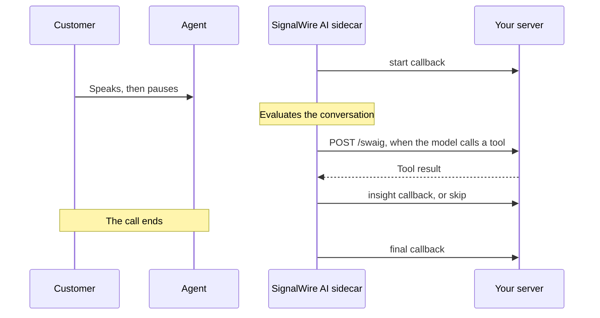

[ai-sidecar]: /docs/swml/reference/calling/ai-sidecar
[ai-sidecar-params]: /docs/swml/reference/calling/ai-sidecar/params
[ai-sidecar-prompt]: /docs/swml/reference/calling/ai-sidecar/prompt
[ai-sidecar-swaig]: /docs/swml/reference/calling/ai-sidecar/swaig
[callback-types]: /docs/swml/reference/calling/ai-sidecar#callback-types
[supported-actions]: /docs/swml/reference/calling/ai-sidecar#supported-swaig-actions
[sidecar-callback]: /docs/apis/rest/webhooks/ai-sidecar-callback
[sidecar-tool-webhook]: /docs/apis/rest/webhooks/ai-sidecar-swaig-tool-webhook
[call-commands]: /docs/apis/rest/calls/call-commands
[ai-method]: /docs/swml/reference/calling/ai
[connect]: /docs/swml/reference/calling/connect
[swml-intro]: /docs/swml
[swaig-guide]: /docs/swml/guides/swaig
[server-sdks]: /docs/server-sdks
[relay-guide]: /docs/server-sdks/guides/relay-client
[make-and-receive-calls]: /docs/platform/voice/make-and-receive-calls
[prepare-calls]: /docs/platform/voice/make-and-receive-calls#prepare-for-your-first-call
[answer-swml]: /docs/platform/voice/make-and-receive-calls#answer-a-call-via-swml
[api-credentials]: /docs/platform/your-signalwire-api-space
[caller-id]: /docs/platform/voice/how-to-set-caller-id-or-cnam
[trial-mode]: /docs/platform/trial-mode

An AI sidecar listens to a live call between a customer and your agent, and after each customer
turn it sends your server one line of advice for the agent. It never speaks on the call, so the
customer hears only your agent. Start by coaching a call between two phones you own, then give the
sidecar tools, handle its callbacks, ask it questions mid-call, stop it, and tune when it speaks up.

## Pick the right product for AI sidecar

You attach a sidecar with SWML, or send commands to a call that's already in progress with the
REST Calling API.

| Function | SWML | REST |
|---|---|---|
| Attach a sidecar as your SWML handles a call | <Icon icon="regular circle-check" color="var(--status-success)" /> | <Icon icon="regular circle-xmark" color="var(--status-error)" /> |
| Attach a sidecar to a call that's already in progress | <Icon icon="regular circle-xmark" color="var(--status-error)" /> | <Icon icon="regular circle-check" color="var(--status-success)" /> |
| Give the sidecar tools that run on your server | <Icon icon="regular circle-check" color="var(--status-success)" /> | <Icon icon="regular circle-check" color="var(--status-success)" /> |
| Receive advice and other callbacks at a webhook | <Icon icon="regular circle-check" color="var(--status-success)" /> | <Icon icon="regular circle-check" color="var(--status-success)" /> |
| Ask the sidecar a question mid-call | <Icon icon="regular circle-xmark" color="var(--status-error)" /> | <Icon icon="regular circle-check" color="var(--status-success)" /> |
| Have the sidecar evaluate the call right away | <Icon icon="regular circle-xmark" color="var(--status-error)" /> | <Icon icon="regular circle-check" color="var(--status-success)" /> |
| Stop the sidecar while the call continues | <Icon icon="regular circle-xmark" color="var(--status-error)" /> | <Icon icon="regular circle-check" color="var(--status-success)" /> |

- [SWML][swml-intro] is the document that describes how a call should flow. The
  [`ai_sidecar`][ai-sidecar] method attaches the sidecar and the document moves straight on, usually
  to a [`connect`][connect] that bridges the customer to your agent.
- The [REST Calling API][call-commands] sends commands to a call by its ID from any process. A
  [Relay app][relay-guide] that controls the call uses these same REST commands.

## Prepare for AI sidecar

Start with working call setup from [Make and receive calls][make-and-receive-calls]. Have these
values ready:

- Your Space URL, such as `<YOUR_SPACE>.signalwire.com`.
- Your Project ID and an API token with the **Voice** permission, from the Dashboard's
  [API credentials][api-credentials] page.
- A phone number in your Space.
- Two phones you can answer: one plays the customer and one plays the agent.
- A machine that can run a small server, and a tunnel such as [ngrok](https://ngrok.com/) that
  gives it a public HTTPS URL.

<Warning title="Trial projects only call and receive calls from verified numbers">
A [trial project][trial-mode] only places calls to and receives calls from numbers you've
purchased or verified, and can't call internationally. Verify both phones before you start, as
[Prepare for your first call][prepare-calls] shows.
</Warning>

Replace these values in the samples you run:

| Value | Replace with |
|---|---|
| `<YOUR_SPACE>` | Your Space's subdomain in `<YOUR_SPACE>.signalwire.com` |
| `<YOUR_PROJECT_ID>` | Your Project ID |
| `<YOUR_API_TOKEN>` | Your API token with the Voice permission, used only in server code |
| `<YOUR_PUBLIC_HOST>` | The public hostname of your server's tunnel, such as `abc123.ngrok.app` |
| `<YOUR_BASIC_AUTH_PASSWORD>` | A password you choose for your server, letters and digits only, because it appears inside URLs |
| `<YOUR_CALLER_ID>` | Your SignalWire phone number, or a [verified caller ID][caller-id], in E.164 format |
| `<YOUR_DESTINATION>` | The phone that plays the agent, in E.164 format |
| `<YOUR_CALL_ID>` | The ID of a live call, which your server prints when the sidecar starts |

## How the sidecar works

The sidecar hears both sides of the call and never speaks. Your `customer_role` setting tells it
which side is the customer. It treats the other side as your agent.

Each time the customer finishes speaking, the sidecar evaluates the conversation. A turn ends after
the customer's last words and a short silence (200 ms by default), or as soon as the agent starts
to talk. The sidecar sends the transcript so far to the model, together with your prompt and your
tools. The model then does one of three things:

- Writes one line of advice for the agent, which reaches you as an `insight` callback.
- Calls one of your tools first, such as a booking lookup, and then writes its advice.
- Calls the built-in `sidecar_skip` tool to stay quiet, which reaches you as a `skip` callback.

The sidecar also runs one evaluation as soon as it attaches, before anyone speaks, so your first
advice or skip can arrive while the agent's phone is still ringing. It keeps running until the call
ends or you stop it, and then sends a `final` callback with a full record of the session. A call
runs one sidecar at a time.



## Coach your first call

This walkthrough coaches a dispatcher at Bayview Taxi, a fictional cab company. A customer calls
your number, the sidecar attaches, and the call is bridged to the phone that plays the dispatcher.
When the customer reads out a booking code, the sidecar looks the booking up on your server and
tells the dispatcher what it found.

<Steps>

<Step title="Run the coaching server" id="run-the-coaching-server">

This server does three jobs on one port. It serves the call's SWML document at its root URL,
answers the sidecar's tool calls at `/swaig`, and prints the sidecar's callbacks as they arrive at
`/events`. Every route requires the username `signalwire` and the password you set, and the
document passes the same credentials inside the URLs it gives the sidecar.

<CodeBlocks>
<CodeBlock title="Python — SWML builder">
```python
# Install: python -m pip install signalwire-sdk==3.4.1
# Save as dispatch_coach.py and run: python dispatch_coach.py
from signalwire import FunctionResult, SWMLBuilder, SWMLService

PASSWORD = "<YOUR_BASIC_AUTH_PASSWORD>"
BASE_URL = f"https://signalwire:{PASSWORD}@<YOUR_PUBLIC_HOST>"

# Stands in for Bayview Taxi's booking system.
BOOKINGS = {
    "BT1042": "Pickup 4:15 PM at 200 Harbor Avenue. Driver Sam, silver Prius, 6 minutes away.",
    "BT2087": "Pickup 9:30 AM tomorrow at Bayview Station. No driver assigned yet.",
}

PROMPT = (
    "You coach a Bayview Taxi dispatcher during a live call with a customer. "
    "Speak to the dispatcher, never to the customer, in one short sentence. "
    "When the customer gives a booking confirmation code, call lookup_booking "
    "and pass on what it returns. If the dispatcher needs no help right now, "
    "call sidecar_skip with a one-line reason instead of giving advice."
)

LOOKUP_DESCRIPTION = "Look up a ride booking by its confirmation code."
LOOKUP_PARAMETERS = {
    "type": "object",
    "properties": {
        "confirmation": {
            "type": "string",
            "description": "The booking confirmation code, such as BT1042, with no spaces.",
        },
    },
    "required": ["confirmation"],
}

service = SWMLService(name="dispatch-coach", basic_auth=("signalwire", PASSWORD))
swml = SWMLBuilder(service)
swml.answer()
swml.ai_sidecar(
    prompt=PROMPT,
    lang="en-US",
    url=f"{BASE_URL}/events",
    hints=["Bayview Taxi", "Harbor Avenue", "Bayview Station"],
    SWAIG={
        "defaults": {"web_hook_url": f"{BASE_URL}/swaig"},
        "functions": [
            {
                "function": "lookup_booking",
                "description": LOOKUP_DESCRIPTION,
                "parameters": LOOKUP_PARAMETERS,
            },
        ],
    },
)
# "from" is a Python keyword, so it's passed in a dictionary.
swml.connect(to="<YOUR_DESTINATION>", **{"from": "<YOUR_CALLER_ID>"})


# The sidecar calls this tool on your server's /swaig route.
def lookup_booking(args, raw_data):
    code = args["confirmation"].replace(" ", "").upper()
    booking = BOOKINGS.get(code)
    if booking is None:
        return FunctionResult(f"No booking matches {code}.")
    return FunctionResult(booking).update_global_data({"confirmation": code})


service.define_tool(
    name="lookup_booking",
    description=LOOKUP_DESCRIPTION,
    parameters=LOOKUP_PARAMETERS,
    handler=lookup_booking,
)


# The sidecar posts its callbacks to /events.
def on_event(body, headers):
    event = body.get("sidecar_event")
    if event is None:
        return None  # a transcription event, which shares the URL
    kind = event["type"]
    if kind == "start":
        print(f"Sidecar started on call {event['channel_data']['call_id']}")
    elif kind == "insight":
        print(f"Advice: {event['raw']}")
    elif kind == "ask_answer":
        print(f"Answer: {event['raw']}")
    elif kind == "skip":
        print(f"No advice: {event.get('reason', '')}")
    elif kind == "tool_call" and event["name"] != "sidecar_skip":
        print(f"Tool call: {event['name']} {event.get('arguments', '')}")
    elif kind == "error":
        print(f"Error: {event['error_reason']}")
    elif kind == "final":
        print(f"Sidecar finished: {event['stop_reason']}")
    return None


service.register_routing_callback(on_event, path="/events")

service.serve(host="0.0.0.0", port=8080)
```
</CodeBlock>
<CodeBlock title="TypeScript — SWML builder">
```typescript
// Install: npm install @signalwire/sdk@2.0.5
// Save as dispatch-coach.mts and run: npx tsx dispatch-coach.mts
import { FunctionResult, SWMLService } from "@signalwire/sdk";

const PASSWORD = "<YOUR_BASIC_AUTH_PASSWORD>";
const BASE_URL = `https://signalwire:${PASSWORD}@<YOUR_PUBLIC_HOST>`;

// Stands in for Bayview Taxi's booking system.
const BOOKINGS = new Map<string, string>([
  ["BT1042", "Pickup 4:15 PM at 200 Harbor Avenue. Driver Sam, silver Prius, 6 minutes away."],
  ["BT2087", "Pickup 9:30 AM tomorrow at Bayview Station. No driver assigned yet."],
]);

const PROMPT =
  "You coach a Bayview Taxi dispatcher during a live call with a customer. " +
  "Speak to the dispatcher, never to the customer, in one short sentence. " +
  "When the customer gives a booking confirmation code, call lookup_booking " +
  "and pass on what it returns. If the dispatcher needs no help right now, " +
  "call sidecar_skip with a one-line reason instead of giving advice.";

const LOOKUP_DESCRIPTION = "Look up a ride booking by its confirmation code.";
const LOOKUP_PARAMETERS = {
  type: "object",
  properties: {
    confirmation: {
      type: "string",
      description: "The booking confirmation code, such as BT1042, with no spaces.",
    },
  },
  required: ["confirmation"],
};

interface SidecarEvent {
  type: string;
  channel_data: { call_id: string };
  raw?: string;
  reason?: string;
  name?: string;
  arguments?: string;
  error_reason?: string;
  stop_reason?: string;
}

const service = new SWMLService({
  name: "dispatch-coach",
  basicAuth: ["signalwire", PASSWORD],
});
const swml = service.getBuilder();
swml.answer();
// The TypeScript SWML builder has no ai_sidecar method in this SDK version,
// so the verb is added by name.
swml.addVerb("ai_sidecar", {
  prompt: PROMPT,
  lang: "en-US",
  url: `${BASE_URL}/events`,
  hints: ["Bayview Taxi", "Harbor Avenue", "Bayview Station"],
  SWAIG: {
    defaults: { web_hook_url: `${BASE_URL}/swaig` },
    functions: [
      {
        function: "lookup_booking",
        description: LOOKUP_DESCRIPTION,
        parameters: LOOKUP_PARAMETERS,
      },
    ],
  },
});
swml.connect({ to: "<YOUR_DESTINATION>", from: "<YOUR_CALLER_ID>" });

// The sidecar calls this tool on your server's /swaig route. The handler
// returns a plain object, which the SDK sends back as the tool's reply.
service.defineTool({
  name: "lookup_booking",
  description: LOOKUP_DESCRIPTION,
  parameters: LOOKUP_PARAMETERS,
  handler: (args) => {
    const code = String(args.confirmation).replace(/\s/g, "").toUpperCase();
    const booking = BOOKINGS.get(code);
    if (booking === undefined) {
      return new FunctionResult(`No booking matches ${code}.`).toDict();
    }
    return new FunctionResult(booking).updateGlobalData({ confirmation: code }).toDict();
  },
});

// The sidecar posts its callbacks to /events. Return null to acknowledge each
// one: any other value tells the SDK to redirect the request.
service.registerRoutingCallback((body) => {
  const event = body.sidecar_event as SidecarEvent | undefined;
  if (event === undefined) {
    return null; // a transcription event, which shares the URL
  }
  switch (event.type) {
    case "start":
      console.log(`Sidecar started on call ${event.channel_data.call_id}`);
      break;
    case "insight":
      console.log(`Advice: ${event.raw}`);
      break;
    case "ask_answer":
      console.log(`Answer: ${event.raw}`);
      break;
    case "skip":
      console.log(`No advice: ${event.reason ?? ""}`);
      break;
    case "tool_call":
      if (event.name !== "sidecar_skip") {
        console.log(`Tool call: ${event.name} ${event.arguments ?? ""}`);
      }
      break;
    case "error":
      console.log(`Error: ${event.error_reason}`);
      break;
    case "final":
      console.log(`Sidecar finished: ${event.stop_reason}`);
      break;
  }
  return null;
}, "/events");

await service.run({ port: 8080 });
```
</CodeBlock>
</CodeBlocks>

The [Server SDKs][server-sdks] build the document with the SWML builder and serve it through
`SWMLService`, which also hosts the `/swaig` route for the tool and the `/events` route for the
callbacks. Start a tunnel to port `8080`, such as `ngrok http 8080`, and check that the document is
reachable through it:

```bash
curl -u "signalwire:<YOUR_BASIC_AUTH_PASSWORD>" "https://<YOUR_PUBLIC_HOST>/"
```

The response is the SWML document, starting with `{"version"`. A `401` means the password doesn't
match the one in your server.

</Step>

<Step title="Point your phone number at the server" id="point-your-phone-number-at-the-server">

Create a SWML Script that fetches the document from your server:

1. Open **My Resources**, select **+ Add**, then **Script**, then **SWML Script**.
2. Name it **Dispatch coach** and leave **Used For** set to **Calling**.
3. Under **Handle Calls Using**, choose **External URL** and enter
   `https://signalwire:<YOUR_BASIC_AUTH_PASSWORD>@<YOUR_PUBLIC_HOST>/` in **Primary Script URL**.
4. Select **Create**.

Then assign the script to your phone number:

<Markdown src="/snippets/common/dashboard/_assign-resource-to-number.mdx" />

To do both in code, see [Answer a call via SWML][answer-swml].

</Step>

<Step title="Call your number and talk" id="call-your-number-and-talk">

From the phone that plays the customer, call your SignalWire number. Answer the call on the phone
that plays the dispatcher. As the customer, say "Hi, my booking code is BT1042, where's my driver?"
and then pause.

The server prints `Sidecar started` with the call's ID as soon as the call is answered, and the
sidecar's first evaluation follows before anyone speaks. After your pause, it looks up the booking
and prints its advice for the dispatcher. The wording changes from call to call:

```text
Sidecar started on call 3a1f6b2e-8c4d-4e7a-9b1f-5d2c7e8a9f10
No advice: The call has just started and the customer hasn't spoken yet.
Tool call: lookup_booking {"confirmation":"BT1042"}
Advice: Driver Sam is 6 minutes away in a silver Prius, pickup at 200 Harbor Avenue.
```

Keep talking as the customer, and the sidecar prints advice or a skip after each of your turns.
When you hang up, the server prints `Sidecar finished: transcribe_close`.

If the call connects but the server prints nothing, the sidecar couldn't start or couldn't reach
your `/events` URL. A sidecar that fails to start doesn't stop the document, so the call still
connects. For this and other symptoms, see [Troubleshoot AI sidecar](#troubleshoot-ai-sidecar).

</Step>

</Steps>

The server serves this document. Here it is in YAML and JSON, for reference or for a hosted SWML
Script whose callback and tool URLs point at a server you run elsewhere:

<CodeBlocks>
<CodeBlock title="YAML">
```yaml
version: 1.0.0
sections:
  main:
    - answer: {}
    - ai_sidecar:
        prompt: >-
          You coach a Bayview Taxi dispatcher during a live call with a customer.
          Speak to the dispatcher, never to the customer, in one short sentence.
          When the customer gives a booking confirmation code, call lookup_booking
          and pass on what it returns. If the dispatcher needs no help right now,
          call sidecar_skip with a one-line reason instead of giving advice.
        lang: en-US
        url: 'https://signalwire:<YOUR_BASIC_AUTH_PASSWORD>@<YOUR_PUBLIC_HOST>/events'
        hints:
          - Bayview Taxi
          - Harbor Avenue
          - Bayview Station
        SWAIG:
          defaults:
            web_hook_url: 'https://signalwire:<YOUR_BASIC_AUTH_PASSWORD>@<YOUR_PUBLIC_HOST>/swaig'
          functions:
            - function: lookup_booking
              description: Look up a ride booking by its confirmation code.
              parameters:
                type: object
                properties:
                  confirmation:
                    type: string
                    description: The booking confirmation code, such as BT1042, with no spaces.
                required:
                  - confirmation
    - connect:
        to: '<YOUR_DESTINATION>'
        from: '<YOUR_CALLER_ID>'
```
</CodeBlock>
<CodeBlock title="JSON">
```json
{
  "version": "1.0.0",
  "sections": {
    "main": [
      {
        "answer": {}
      },
      {
        "ai_sidecar": {
          "prompt": "You coach a Bayview Taxi dispatcher during a live call with a customer. Speak to the dispatcher, never to the customer, in one short sentence. When the customer gives a booking confirmation code, call lookup_booking and pass on what it returns. If the dispatcher needs no help right now, call sidecar_skip with a one-line reason instead of giving advice.",
          "lang": "en-US",
          "url": "https://signalwire:<YOUR_BASIC_AUTH_PASSWORD>@<YOUR_PUBLIC_HOST>/events",
          "hints": ["Bayview Taxi", "Harbor Avenue", "Bayview Station"],
          "SWAIG": {
            "defaults": {
              "web_hook_url": "https://signalwire:<YOUR_BASIC_AUTH_PASSWORD>@<YOUR_PUBLIC_HOST>/swaig"
            },
            "functions": [
              {
                "function": "lookup_booking",
                "description": "Look up a ride booking by its confirmation code.",
                "parameters": {
                  "type": "object",
                  "properties": {
                    "confirmation": {
                      "type": "string",
                      "description": "The booking confirmation code, such as BT1042, with no spaces."
                    }
                  },
                  "required": ["confirmation"]
                }
              }
            ]
          }
        }
      },
      {
        "connect": {
          "to": "<YOUR_DESTINATION>",
          "from": "<YOUR_CALLER_ID>"
        }
      }
    ]
  }
}
```
</CodeBlock>
</CodeBlocks>

`lang` is the only setting the sidecar requires. `prompt` is optional but worth writing, because
without one the sidecar has only general instructions. Place `ai_sidecar` before `connect` so the
sidecar hears the whole conversation. If nothing has answered the call yet, `ai_sidecar` answers it.

## Attach a sidecar to a call in progress

The SWML method suits calls your document handles from the start. To coach a call that's already
connected, such as one your agent picked up from a queue, attach the sidecar by the call's ID.

### Attach a sidecar via REST

The Server SDKs' REST client doesn't include the sidecar commands in this version, so send them to
[Call commands][call-commands] directly. The `params` take the same settings as the SWML method:

<EndpointRequestSnippet endpoint="POST /api/calling/calls" example="calling.ai_sidecar" />

Point `url` and the SWAIG `web_hook_url` at your server, as the document in
[Coach your first call](#coach-your-first-call) does. The command fails when a sidecar is already
attached to the call.

## Write the sidecar's prompt

The sidecar's model already knows it's a silent coach whose advice goes only to the agent, and that
it can call `sidecar_skip` to stay quiet. Your prompt describes the coaching itself. A plain string
works, as in the first call, and so does a [Prompt Object Model (POM)][ai-sidecar-prompt] when you
want sections.

Prompts that coach well tend to:

- Say who the agent is and what the business does.
- Tell the model to call `sidecar_skip` when no advice is needed. Without that line, it tends to
  offer advice on every turn whether or not the agent needs it.
- Ask for one short sentence with no preamble, because the agent reads it mid-conversation.
- Tie each tool to a trigger, such as "When the customer gives a booking code, call
  lookup_booking", rather than leaving the model to recall facts from memory.
- Include two or three examples of good advice.

Put product names, place names, and other terms the model must hear correctly in `hints`, which
bias speech recognition toward them.

## Give the sidecar tools with SWAIG functions

A tool lets the sidecar fetch facts from your systems before it advises the agent. You declare each
tool under the method's `SWAIG.functions`, with a `function` name, a `description` the model reads
to decide when to call it, and JSON Schema `parameters`. When the model calls the tool, SignalWire
sends a `POST` to its `web_hook_url`, or to `SWAIG.defaults.web_hook_url` when the function has
none. The sidecar SWAIG functions work like the [SWAIG functions][swaig-guide] of the
[`ai`][ai-method] method, with a smaller request.

### Handle tool calls on your server

The request body carries the `function` name, its arguments under `argument.parsed`, the
`call_id`, the session's `global_data`, and a `channel_data` object with the caller's details. The
Server SDKs parse it for you and pass the arguments to the handler you register with
`define_tool` in Python or `defineTool` in TypeScript. The full field list is in the
[AI sidecar SWAIG tool webhook][sidecar-tool-webhook] reference.

The model reads your entire reply body as the tool's result, so return only a `response` string and
any `action` list. Keep the `response` short: it becomes context for the model's next step.

Protect the tool route with basic auth, either inside the URL as `username:password@host` or with
`web_hook_auth_user` and `web_hook_auth_password` in `SWAIG.defaults` or on the function. If the
request fails, the sidecar sends an `error` callback with `error_reason: webhook_http_failure`, and
the model learns that the tool failed.

The [AI sidecar SWAIG reference][ai-sidecar-swaig] also covers connecting Model Context Protocol
(MCP) servers through `SWAIG.mcp_servers`, whose tools the sidecar discovers when it attaches.

### Act on the call from a tool

A tool's reply can include actions, alongside the `response`. The first call's `lookup_booking`
uses `set_global_data` to remember the booking code, which the sidecar reports with a
`global_data_change` callback and includes in later tool requests. The actions you're most likely
to use:

| Action | Effect |
|---|---|
| `set_global_data` | Merges keys into the session's `global_data` |
| `unset_global_data` | Removes a key from `global_data` |
| `user_input` | Adds a message to the conversation and runs an evaluation right away |
| `transfer` | Transfers the call, which ends the sidecar |
| `hangup` | Hangs up the call, which ends the sidecar |
| `stop` | Stops the sidecar's evaluations while the call continues |
| `SWML` | Runs a SWML document on the call |

Every action also reaches you as an `action` callback, with `executed` showing whether it took
effect. Set `params.act_on_channel` to `false` to keep the sidecar advisory only: actions are still
reported, but none of them change the call. To block only the `SWML` action, set
`permissions.swaig_allow_swml` to `false`. The [supported actions][supported-actions] list covers
the rest.

The sidecar has no voice, so a `say` action is reported in an `action` callback instead of spoken.

### Keep tool calls from looping

If the model calls tools more than four times in one evaluation, or repeats the same call with the
same arguments, the sidecar ends that evaluation without advice and sends an `error` callback with
`error_reason: tool_loop`. Clear tool results and a prompt that says what to do after each tool
returns keep evaluations short. The name `sidecar_skip` is reserved for the built-in tool, so don't
give one of your functions that name.

## Handle sidecar callbacks

The sidecar reports each step of its work as an HTTP `POST` to the `url` you set. Each callback
body has a `call_info` object describing the call, and the event itself under `sidecar_event`:

```json
{
  "call_info": {
    "call_id": "3a1f6b2e-8c4d-4e7a-9b1f-5d2c7e8a9f10",
    "content_type": "text/json",
    "content_disposition": "post_data",
    "conversation_type": "voice"
  },
  "sidecar_event": {
    "type": "insight",
    "ts": 1745870400123456,
    "tick_id": 3,
    "channel_data": {
      "call_id": "3a1f6b2e-8c4d-4e7a-9b1f-5d2c7e8a9f10"
    },
    "raw": "Driver Sam is 6 minutes away in a silver Prius, pickup at 200 Harbor Avenue.",
    "iter": 1,
    "total_iters": 2
  }
}
```

Every event carries a `type`, a `ts` timestamp in microseconds, the `tick_id` of the evaluation it
belongs to, and `channel_data` with the `call_id` and, when available, the caller ID name and
number and the number dialed. The same URL also receives transcription events that have no
`sidecar_event` key, so check for it before you read `type`, as the first call's server does.

Each callback is sent once, and the sidecar ignores your response body. Reply quickly with a `2xx`
status and do any slow work, such as a CRM update, after you reply.

### Callback types

These are the callbacks most apps act on. The [callback catalog][callback-types] lists every type
and field, and the [AI sidecar callback][sidecar-callback] reference shows the full payload.

| `type` | When it arrives | Fields to read |
|---|---|---|
| `start` | The sidecar attached to the call | `model`, `tools`, `global_data` |
| `turn` | The customer finished a turn, and an evaluation begins | `customer_text`, `agent_text`, `transcript_delta` |
| `insight` | The sidecar's advice for the agent | `raw` |
| `skip` | The model chose to stay quiet this turn | `reason` |
| `tool_call` | The model called a tool, including `sidecar_skip` | `name`, `arguments` |
| `tool_result` | A tool replied | `name`, `response` |
| `action` | A tool returned an action | `action`, `executed` |
| `global_data_change` | An action changed `global_data` | `key`, `old_value`, `new_value` |
| `ask_answer` | The sidecar answered a question you asked | `raw`, `ask_id` |
| `error` | Something failed | `error_reason`, `detail` |
| `final` | The sidecar's session ended | `stop_reason`, `summary`, `stats`, `history`, `global_data` |

`final` arrives once per sidecar and carries the whole session: its `stop_reason`, counts such as
insights and tool calls in `stats`, the model conversation in `history`, the last `global_data`,
and a `summary` when you turn on `params.final_summary`. It can be large, because it also carries
the session's full event log. Store or forward it from your `final` handler, such as to a CRM
record for the call.

## Ask the sidecar a question mid-call

The agent, or your app on their behalf, can ask the sidecar a question about the call so far, such
as "Did the customer give a drop-off address?". The sidecar answers from the conversation without
adding the question to it, so later advice isn't affected.

### Ask the sidecar a question via REST

Send `calling.ai_sidecar.ask` with your question in `params.text`, using the call ID that your
server printed when the sidecar started:

<EndpointRequestSnippet endpoint="POST /api/calling/calls" example="calling.ai_sidecar.ask" />

The answer arrives as an `ask_answer` callback, which the first call's server prints as `Answer:`.
The REST response doesn't include the ask's ID. An `ask_request` callback supplies it as `ask_id`
when the question starts, and the matching `ask_answer` carries the same `ask_id`. Questions are
answered one at a time, in the order you send them.

## Have the sidecar evaluate the call right away

The sidecar normally speaks up only after the customer's turn. To have it look at the call now,
for example when the agent selects a "Help me" button, send the sidecar a message.

### Have the sidecar evaluate the call via REST

Send `calling.ai_sidecar.poke` with your message in `params.text`:

<EndpointRequestSnippet endpoint="POST /api/calling/calls" example="calling.ai_sidecar.poke" />

Unlike a question, the message joins the conversation the sidecar sees, so later evaluations take
it into account. The sidecar evaluates right away, and its advice arrives as an `insight` callback.

## Stop the sidecar

The sidecar stops on its own when the call ends. To stop it earlier while the call carries on, send
a stop command.

### Stop the sidecar via REST

Send `calling.ai_sidecar.stop` with no other parameters:

<EndpointRequestSnippet endpoint="POST /api/calling/calls" example="calling.ai_sidecar.stop" />

The sidecar sends its `stop` and `final` callbacks with `stop_reason: api_stop` before the request
returns, and the call stays connected. Other values of `stop_reason` tell you why a sidecar ended on
its own: `transcribe_close` when the call ended, `transferred` or `hung_up` after a tool's
`transfer` or `hangup` action, and `stop_action` after a tool's `stop` action. A tool's `stop`
action ends the evaluations at once, and its `final` callback arrives when the call ends or when you
send the stop command.

## Sidecar options: model, turn timing, and summaries

Tuning options sit under the method's `params`, next to the settings you've already used. This
version of the first call's document waits longer before each evaluation, spaces evaluations at
least two seconds apart, and adds a summary to the `final` callback:

<CodeBlocks>
<CodeBlock title="Python — SWML builder">
```python {16-20}
swml.ai_sidecar(
    prompt=PROMPT,
    lang="en-US",
    url=f"{BASE_URL}/events",
    hints=["Bayview Taxi", "Harbor Avenue", "Bayview Station"],
    SWAIG={
        "defaults": {"web_hook_url": f"{BASE_URL}/swaig"},
        "functions": [
            {
                "function": "lookup_booking",
                "description": LOOKUP_DESCRIPTION,
                "parameters": LOOKUP_PARAMETERS,
            },
        ],
    },
    params={
        "idle_timeout_ms": 800,
        "min_interval_ms": 2000,
        "final_summary": True,
    },
)
```
</CodeBlock>
<CodeBlock title="TypeScript — SWML builder">
```typescript {16-20}
swml.addVerb("ai_sidecar", {
  prompt: PROMPT,
  lang: "en-US",
  url: `${BASE_URL}/events`,
  hints: ["Bayview Taxi", "Harbor Avenue", "Bayview Station"],
  SWAIG: {
    defaults: { web_hook_url: `${BASE_URL}/swaig` },
    functions: [
      {
        function: "lookup_booking",
        description: LOOKUP_DESCRIPTION,
        parameters: LOOKUP_PARAMETERS,
      },
    ],
  },
  params: {
    idle_timeout_ms: 800,
    min_interval_ms: 2000,
    final_summary: true,
  },
});
```
</CodeBlock>
<CodeBlock title="YAML">
```yaml
- ai_sidecar:
    # prompt, lang, url, hints, and SWAIG as in the first call
    params:
      idle_timeout_ms: 800
      min_interval_ms: 2000
      final_summary: true
```
</CodeBlock>
<CodeBlock title="JSON">
```json
{
  "ai_sidecar": {
    "params": {
      "idle_timeout_ms": 800,
      "min_interval_ms": 2000,
      "final_summary": true
    }
  }
}
```
</CodeBlock>
</CodeBlocks>

In YAML and JSON, keep the other settings from the first call alongside `params`. The options you're
most likely to change:

| Setting | Default | What it changes |
|---|---|---|
| `model` | `gpt-4o-mini` | The model behind the advice, answers, and summary |
| `customer_role` | `remote-caller` | Which side of the call is the customer, `remote-caller` or `local-caller` |
| `hints` | None | Terms that speech recognition should expect |
| `params.idle_timeout_ms` | `200` | Milliseconds of silence that end a customer turn, from 50 to 5000 |
| `params.min_interval_ms` | `0` | The shortest gap between evaluations, in milliseconds. A turn inside the gap is evaluated when the gap ends, not dropped |
| `params.max_history_tokens` | `8000` | How much conversation the sidecar keeps for the model. Older turns are dropped first, with a `history_pruned` callback |
| `params.final_summary` | `false` | Adds a `summary` of what the sidecar concluded and did to the `final` callback |
| `params.act_on_channel` | `true` | Whether tool actions take effect on the call, or are only reported |

A short `idle_timeout_ms` gets advice to the agent before they reply. Raise it to between 800 and
1500 on slower, consultative calls, so the model sees whole thoughts before it reacts. Use
`min_interval_ms` to limit how often the model runs on a busy call.

`customer_role` stays `remote-caller` when the customer calls your number, as in the first call.
Set it to `local-caller` when your document runs on the agent's side of the call, such as when an
agent calls your number and the document connects them to a customer. The
[params reference][ai-sidecar-params] lists every option.

## Troubleshoot AI sidecar

Find the symptom you see:

- **The call connects, but your server prints nothing.** The sidecar didn't start, or can't reach
  your `/events` URL. A sidecar that fails to start doesn't stop the document, so the call still
  connects. Check that the document sets `lang`, that the tunnel is running and points at port
  `8080`, and that the password in `url` matches your server's.
- **You hear an error or silence when you call your number.** SignalWire couldn't fetch your SWML.
  Rerun the `curl` check with the exact URL in the SWML Script. A `401` means the password in the
  URL doesn't match the server's.
- **The dispatcher's phone never rings.** Check that `<YOUR_CALLER_ID>` is a number in your Space or
  a verified caller ID, and that `<YOUR_DESTINATION>` is in E.164 format. A trial project only
  calls verified numbers.
- **The server prints `Error: webhook_http_failure`.** The sidecar couldn't reach `/swaig`. Check
  the `web_hook_url` and its password.
- **The sidecar never calls `lookup_booking`.** Speech recognition may have misheard the code, or
  the prompt doesn't tie the tool to a trigger. Read the `turn` callbacks to see what the sidecar
  heard, add the terms to `hints`, and name the trigger in the prompt.
- **The server prints only `No advice` lines.** The model judged that the dispatcher needed no
  help. Make the prompt say which situations call for advice.
- **A REST command returns an error.** Check that the call is still live, that the ID matches the
  one your server printed, and that a sidecar is attached for `ask`, `poke`, and `stop`.

## Next steps

<CardGroup cols={2}>

<Card title="ai_sidecar reference" href="/docs/swml/reference/calling/ai-sidecar" icon="regular headset">
  Every setting for the SWML method, the callback catalog, and the supported tool actions.
</Card>

<Card title="AI sidecar callback" href="/docs/apis/rest/webhooks/ai-sidecar-callback" icon="regular webhook">
  The full payload SignalWire posts to your `url` for each sidecar callback.
</Card>

<Card title="AI sidecar SWAIG" href="/docs/swml/reference/calling/ai-sidecar/swaig" icon="regular wrench">
  Declare tools and connect MCP servers for the sidecar.
</Card>

<Card title="Call commands" href="/docs/apis/rest/calls/call-commands" icon="regular rectangle-api">
  Attach, ask, poke, and stop a sidecar on a live call over REST.
</Card>

</CardGroup>
