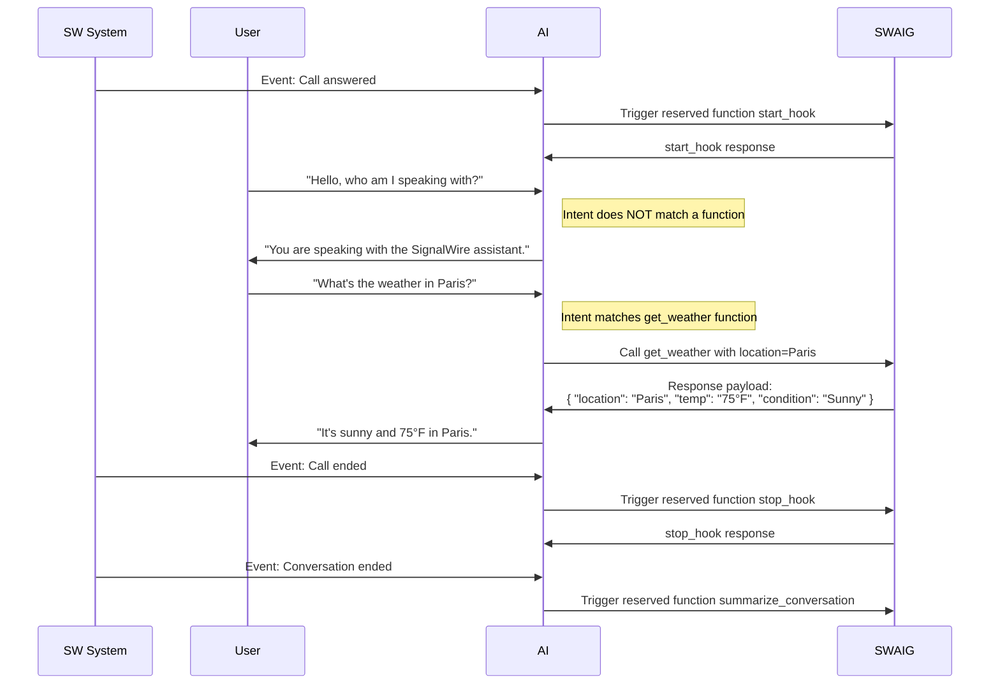

[reserved-functions]: #reserved-functions
[post-prompt]: /docs/swml/reference/calling/amazon-bedrock#post_prompt-properties

An array of JSON objects to define functions that can be executed during the interaction with the Amazon Bedrock agent.

## **Properties**

<ParamField path="SWAIG.functions" type="object[]" toc={true}>
  An array of JSON objects that accept the following properties.
</ParamField>

<Indent>

<ParamField path="functions[].description" type="string" required={true} toc={true}>
  A description of the context and purpose of the function, to explain to the agent when to use it.
</ParamField>


<ParamField path="functions[].function" type="string" required={true} toc={true}>
  A unique name for the function. This can be any user-defined string or can reference a reserved function. Reserved functoins are SignalWire functions that will be executed at certain points in the conversation. To learn more about reserved functions, see [Reserved Functions][reserved-functions].
</ParamField>


<ParamField path="functions[].active" type="boolean" default="true" toc={true}>
  Whether the function is active.
</ParamField>


<ParamField path="functions[].data_map" type="object" toc={true}>
  An object containing properties to process or validate the input, perform actions based on the input, or connect to external APIs or services in a serverless fashion.

  See [`data_map`](/docs/swml/reference/calling/amazon-bedrock/swaig/functions/data-map) for additional details.
</ParamField>


<ParamField path="functions[].parameters" type="object" toc={true}>
  A JSON object that defines the expected user input parameters and their validation rules for the function.

  See [`parameters`](/docs/swml/reference/calling/amazon-bedrock/swaig/functions/parameters) for additional details.
</ParamField>


<ParamField path="functions[].meta_data" type="object" toc={true}>
  A powerful and flexible environmental variable which can accept arbitrary data that is set initially in the SWML script or from the SWML [`set_meta_data` action](/docs/swml/reference/calling/amazon-bedrock/swaig/functions/data-map#actions). This data can be referenced **locally** to the function. All contained information can be accessed and expanded within the prompt - for example, by using a template string.
</ParamField>


<ParamField path="functions[].meta_data_token" type="string" default="Set by SignalWire" toc={true}>
  Scoping token for `meta_data`. If not supplied, metadata will be scoped to function's `web_hook_url`.
</ParamField>


<ParamField path="functions[].web_hook_url" type="string" toc={true}>
  Function-specific URL to send status callbacks and reports to. Takes precedence over a default setting. Authentication can also be set in the url in the format of `username:password@url`.
</ParamField>


</Indent>

## Tool webhook

When the agent calls one of your SWAIG functions, the platform sends an HTTP `POST` to that function's
`web_hook_url` (or the SWAIG `defaults.web_hook_url`). Your endpoint runs the function and returns a JSON
object with a `response` string (the result the agent reads next) and, optionally, an `action` — a single
object or an array — telling the agent what to do.

### Request

<Schema type="Calling.BedrockSwaigToolWebhookPayload" api="signalwire-rest" showDescription />

<Note>
This payload differs from the one an [`ai`](/docs/swml/reference/calling/ai) agent sends. `content_type`
is `text/json` rather than `text/swaig`, `argument` carries no `substituted` value, and there is no
`version`, `description`, or `argument_desc`. The caller's number arrives as `caller_id` (and as
`caller_id_number` when the call has a caller profile) rather than `caller_id_num`.
Write your handler against this list, not the `ai` one.
</Note>

<WebhookPayloadSnippet webhook="bedrockSwaigToolWebhook" />

See the [Amazon Bedrock SWAIG tool webhook](/docs/apis/rest/calls/webhooks/bedrock-swaig-tool-webhook)
webhook page for the full field reference.

### Reply

Return a JSON object with a `response` key and an optional `action` key. The `response` is the text
the agent reads next, and `action` carries SWML-compatible objects that change what the call does next.

<Markdown src="/snippets/swml/_swaig-response-fields.mdx" />

<Indent>

<Markdown src="/snippets/swml/_bedrock-swaig-actions.mdx" />

</Indent>

<Note>
Bedrock agents accept a smaller set of actions than [`ai`](/docs/swml/reference/calling/ai) agents.
The six above are the whole list: there is no `say`, `stop`, `hangup`, `hold`, `toggle_functions`,
`context_switch`, `change_context`, `change_step`, `user_input`, `playback_bg`, or `stop_playback_bg`.
An unrecognized key in `action` is ignored rather than reported as an error, so a payload written for
an `ai` agent fails quietly here.
</Note>

```json
{
  "response": "It's 82°F and sunny in Tulsa, with 38% humidity and a 2.2 mph wind.",
  "action": [
    {
      "set_meta_data": {
        "temperature": 82.0,
        "humidity": 38,
        "wind_speed": 2.2,
        "weather": "Sunny"
      }
    }
  ]
}
```

## **Reserved Functions**

Reserved functions are special SignalWire functions that are automatically triggered at specific points during a conversation.
You define them just like any other SWAIG function, but their names correspond to built-in logic on the SignalWire platform,
allowing them to perform specific actions at the appropriate time.

<Warning title="Function name conflicts">
Do not use reserved function names for your own SWAIG functions unless you want to use the reserved function's built-in behavior.
Otherwise, your function may not work as expected.
</Warning>

### List of Reserved Functions

<ParamField path="start_hook" type="string" toc={true}>
  Triggered when the call is answered. Sends the set properties of the function to the defined `web_hook_url`.
</ParamField>


<ParamField path="stop_hook" type="string" toc={true}>
  Triggered when the call is ended. Sends the set properties of the function to the defined `web_hook_url`.
</ParamField>


<ParamField path="summarize_conversation" type="string" toc={true}>
  Triggered when the call is ended. The [`post_prompt`][post-prompt] must be defined for this function to be triggered. Provides a summary of the conversation and any set properties to the defined `web_hook_url`.
</ParamField>


<Warning title="Where are my function properties?">
If the AI is not returning the properties you set in your SWAIG function, it may be because a reserved function was triggered before
those properties were available. To ensure your function receives all necessary information, make sure the AI has access to the
required property values before the reserved function is called. Any property missing at the time the reserved function runs will
not be included in the data sent back.
</Warning>

## Diagram examples



## SWML **Examples**

### Using SWAIG Functions

<CodeBlocks>
<CodeBlock title="YAML">
```yaml
version: 1.0.0
sections:
  main:
    - amazon_bedrock:
        post_prompt_url: "https://example.com/my-api"
        prompt:
          text: |
            You are a helpful assistant that can provide information to users about a destination.
            At the start of the conversation, always ask the user for their name.
            You can use the appropriate function to get weather information.
        post_prompt:
          text: "Summarize the conversation."
        SWAIG:
          defaults:
            web_hook_url: https://example.com/my-webhook
          functions:
            - function: get_weather
              description: To determine what the current weather is in a provided location.
              parameters:
                properties:
                  location:
                    type: string
                    description: The name of the city to find the weather from.
                type: object
            - function: summarize_conversation
              description: Summarize the conversation.
              parameters:
                type: object
                properties:
                  name:
                    type: string
                    description: The name of the user.
```
</CodeBlock>
<CodeBlock title="JSON">
```json
{
  "version": "1.0.0",
  "sections": {
    "main": [
      {
        "amazon_bedrock": {
          "post_prompt_url": "https://example.com/my-api",
          "prompt": {
            "text": "You are a helpful assistant that can provide information to users about a destination.\nAt the start of the conversation, always ask the user for their name.\nYou can use the appropriate function to get weather information.\n"
          },
          "post_prompt": {
            "text": "Summarize the conversation."
          },
          "SWAIG": {
            "defaults": {
              "web_hook_url": "https://example.com/my-webhook"
            },
            "functions": [
              {
                "function": "get_weather",
                "description": "To determine what the current weather is in a provided location.",
                "parameters": {
                  "properties": {
                    "location": {
                      "type": "string",
                      "description": "The name of the city to find the weather from."
                    }
                  },
                  "type": "object"
                }
              },
              {
                "function": "summarize_conversation",
                "description": "Summarize the conversation.",
                "parameters": {
                  "type": "object",
                  "properties": {
                    "name": {
                      "type": "string",
                      "description": "The name of the user."
                    }
                  }
                }
              }
            ]
          }
        }
      }
    ]
  }
}
```
</CodeBlock>
</CodeBlocks>
