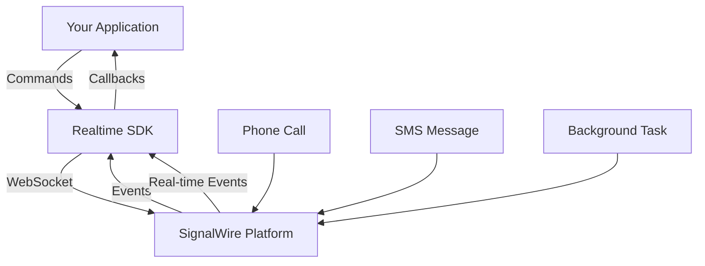

import { Card, CardGroup } from '@site/src/components/Extras/Card';
import { SiNodedotjs, SiGo, SiPhp, SiPython, SiRuby, SiDotnet } from 'react-icons/si';
import Tabs from '@theme/Tabs';
import TabItem from '@theme/TabItem';

# Relay Realtime SDK v2

Welcome to the SignalWire Realtime SDK v2 documentation. This version provides multi-language support for building real-time communication applications with persistent WebSocket connections.

## Available SDKs

The v2 Realtime SDK is available for the following programming languages:

<CardGroup cols={2}>
  <Card 
    title="Node.js" 
    href="./sdks/nodejs"
    icon={<SiNodedotjs />}
  />
  <Card 
    title="C#" 
    href="./sdks/dotnet"
    icon={<SiDotnet />}
  />
  <Card 
    title="Go" 
    href="./sdks/golang"
    icon={<SiGo />}
  />
  <Card 
    title="PHP" 
    href="./sdks/php"
    icon={<SiPhp />}
  />
  <Card 
    title="Python" 
    href="./sdks/python"
    icon={<SiPython />}
  />
  <Card 
    title="Ruby" 
    href="./sdks/ruby"
    icon={<SiRuby />}
  />
</CardGroup>

## Key Features

The Realtime SDK v2 provides comprehensive real-time communication capabilities:

- **Voice**: Make and receive calls, control call flow, play audio, record calls, detect answering machines, and implement complex IVR systems
- **Messaging**: Send and receive SMS/MMS messages with delivery tracking and media support
- **Task**: Queue and process background tasks with reliable delivery and retry mechanisms
- **Event System**: Real-time event handling with persistent WebSocket connections for all communication channels
- **Call Fabric**: Advanced call routing, conferencing, and call control features

## Architecture

<Tabs>
<TabItem value="overview" label="Overview" default>

The Realtime SDK v2 uses persistent WebSocket connections to provide:
- **Real-time Events**: Instant notification of call state changes, message delivery, and system events
- **Bidirectional Communication**: Send commands and receive responses in real-time
- **Connection Management**: Automatic reconnection and connection health monitoring
- **Session Persistence**: Maintain call and message state across connection interruptions

</TabItem>
<TabItem value="websockets" label="WebSocket Architecture">

The SDK maintains a persistent connection to receive real-time notifications about:
- Incoming calls and call state changes
- Message delivery confirmations
- Task queue updates
- System events and errors

</TabItem>
<TabItem value="reliability" label="Reliability Features">

**Connection Management:**
- Automatic reconnection with exponential backoff
- Connection health monitoring with heartbeat
- Graceful handling of network interruptions

**Message Delivery:**
- At-least-once delivery guarantee for critical events
- Message queuing during temporary disconnections
- Duplicate detection and deduplication

**Error Handling:**
- Comprehensive error codes and descriptions
- Retry mechanisms for failed operations
- Circuit breaker pattern for service protection

</TabItem>
</Tabs>
