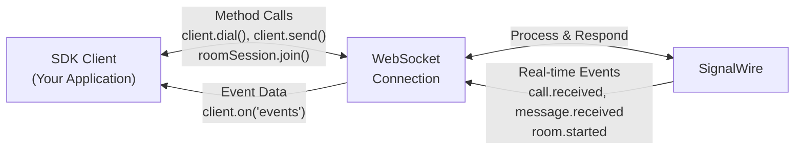

The SignalWire Realtime SDK provides a comprehensive Node.js interface for real-time communication services on the SignalWire platform.

## Core Concepts

### WebSocket Event Architecture

The SDK operates on a bidirectional WebSocket connection between your application and SignalWire's servers. This enables real-time communication through a structured event system:



When you call a method like `client.dial()`, the SDK sends your request over the WebSocket connection and SignalWire processes it and responds immediately. These method calls follow a request-response pattern - the returned promise resolves with the result data, such as a `Call` object containing all the details of your newly created call.

The `.on()` methods handle a different communication pattern: real-time event notifications. These are asynchronous events triggered by external actions - like when someone calls your number (`call.received`), sends you a message (`message.received`), or when something happens in a video room you're monitoring (`member.joined`). Unlike method responses, these events arrive whenever the triggering action occurs, not as a direct response to your code.

### Authentication and Access Control

All SDK clients authenticate using project credentials. Voice, Messaging, and Task namespaces also require topic subscriptions that control event routing:

```javascript
const client = new Voice.Client({
  project: "your-project-id",     // SignalWire project identifier
  token: "your-project-token",    // API token from project settings
  topics: ["support", "sales"]    // Required for Voice, Messaging, Task
});
```

Your `project` ID and `token` are available in the [SignalWire Dashboard](/platform/dashboard/getting-started/your-signalwire-api-space).
These authenticate your WebSocket connection and establish your access permissions.

Topics (formerly contexts) work with [Relay Application resources](/platform/call-fabric/resources/relay-applications) to route events. 
When you assign a phone number or a SIP address to a Relay Application with reference "support", SignalWire routes all calls from that number or SIP address
to SDK clients authenticated with the "support" topic. This creates strict access control - a client subscribed to "support" cannot receive events intended for "sales".

The routing process is straightforward: incoming calls hit a phone number or a SIP address, SignalWire checks the Relay Application's reference, then delivers the event only to
clients with matching topics. This happens automatically based on your authentication.

```javascript
// Topic-based client (receives events only for subscribed topics)
const voice = new Voice.Client({
  project: "project-id",
  token: "token", 
  topics: ["support", "sales"]  // Only receive calls for these topics
});

// Non-topic client (receives all events for the project)
const video = new Video.Client({
  project: "project-id",
  token: "token"  // No topics needed
});
```


## Available Namespaces

<GuidesList />

## Classes

- [RealtimeClient](/sdks/realtime-sdk/v3/realtime-client)

## Functions

### ~~createClient~~

▸ `Const` **createClient**(`userOptions`): `Promise<RealtimeClient>` ⚠️ **Deprecated** — See [RealtimeClient](/sdks/realtime-sdk/v3/realtime-client) for more details.

> ⚠️ **Deprecated**  
> You no longer need to create the client manually. You can use the product constructors, like [Video.Client](/sdks/realtime-sdk/v3/video/room-session), to access the same functionality.

Creates a real-time Client.

#### Parameters

| Name                    | Type                                                                      | Description                                                                                    |
| :---------------------- | :------------------------------------------------------------------------ | :--------------------------------------------------------------------------------------------- |
| `userOptions`           | `Object`                                                                  |                                                                                                |
| `userOptions.logLevel?` | `"debug"` \| `"trace"` \| `"info"` \| `"warn"` \| `"error"` \| `"silent"` | logging level                                                                                  |
| `userOptions.project?`  | `string`                                                                  | SignalWire project id, e.g. `a10d8a9f-2166-4e82-56ff-118bc3a4840f`                          |
| `userOptions.token`     | `string`                                                                  | SignalWire project token, e.g. `PT9e5660c101cd140a1c93a0197640a369cf5f16975a0079c9`         |

#### Returns

`Promise<RealtimeClient>` ⚠️ **Deprecated** — See [RealtimeClient](/sdks/realtime-sdk/v3/realtime-client) for more details.

an instance of a real-time Client.

#### Example

```typescript
const client = await createClient({
  project: "<project-id>",
  token: "<project-token>",
});
```

---

### getConfig

▸ `Const` **getConfig**(): `GlobalConfig`

#### Returns

`GlobalConfig`