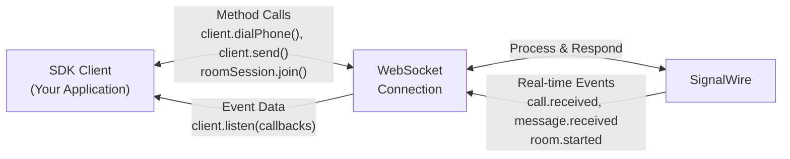

<CardGroup cols={2}>
  <Card title="npm" icon="brands npm" href="https://www.npmjs.com/package/@signalwire/realtime-api">
    @signalwire/realtime-api
  </Card>
  <Card title="GitHub" icon="brands github" href="https://github.com/signalwire/signalwire-js">
    signalwire/signalwire-js
  </Card>
</CardGroup>

```bash
npm install @signalwire/realtime-api
```

The SignalWire Realtime SDK v4 is a Node.js server SDK that enables real-time communication through WebSocket connections. Built on an event-driven architecture, it provides dedicated namespaces for voice, video, messaging, chat, pub/sub, and task management.

## Getting Started

<Steps>

<Step title="Install the SDK">

```bash
npm install @signalwire/realtime-api
```

</Step>

<Step title="Create a RELAY Application">

For Voice, Messaging, and Task namespaces, create a RELAY Application resource in your dashboard:

1. Set a name for your application
2. Choose a reference (e.g., "support", "sales") that matches your client's topics
3. Assign [phone numbers](/docs/platform/phone-numbers) or [SIP addresses](/docs/platform/addresses) to route calls to this application

</Step>

<Step title="Set up authentication">

Get your project credentials from the [SignalWire Dashboard](/docs/platform/your-signalwire-api-space):

```javascript
import { SignalWire } from "@signalwire/realtime-api";

const client = await SignalWire({
  project: "your-project-id",
  token: "your-api-token"
});

// Access namespace clients
const voiceClient = client.voice;
```

</Step>

<Step title="Test your setup">

Create a simple inbound call handler to test your setup:

```javascript
import { SignalWire } from "@signalwire/realtime-api";

const client = await SignalWire({
  project: "your-project-id",
  token: "your-api-token"
});

const voiceClient = client.voice;

// Answer incoming calls and play a greeting
await voiceClient.listen({
  topics: ["support"],  // Must match your RELAY Application reference
  onCallReceived: async (call) => {
    console.log("Incoming call from:", call.from);

    await call.answer();
    await call.playTTS({ text: "Welcome to SignalWire!" });
  }
});

console.log("Waiting for calls...");
```

Now call the SignalWire phone number or SIP address you assigned to your RELAY Application in step 2. Your application will answer and play the greeting!

</Step>

</Steps>

## Core Concepts

### WebSocket Event Architecture

The SDK operates on a bidirectional WebSocket connection between your application and SignalWire's servers. This enables real-time communication through a structured event system:



When you call a method like `client.dialPhone()`, the SDK sends your request over the WebSocket connection and SignalWire processes it and responds immediately. These method calls follow a request-response pattern - the returned promise resolves with the result data, such as a `Call` object containing all the details of your newly created call.

The `listen()` methods handle a different communication pattern: real-time event notifications. These are asynchronous events triggered by external actions - like when someone calls your number (`onCallReceived`), sends you a message (`onMessageReceived`), or when something happens in a video room you're monitoring (`onMemberJoined`). Unlike method responses, these events arrive whenever the triggering action occurs, not as a direct response to your code.

### Authentication and Access Control

All SDK clients authenticate using project credentials. Voice, Messaging, and Task namespaces also require topic subscriptions that control event routing:

```javascript
import { SignalWire } from "@signalwire/realtime-api";

const client = await SignalWire({
  project: "your-project-id",     // SignalWire project identifier
  token: "your-project-token"     // API token from project settings
});

const voiceClient = client.voice;

// Voice, Messaging, and Task require topics for event routing
await voiceClient.listen({
  topics: ["support", "sales"],    // Required for Voice, Messaging, Task
  onCallReceived: (call) => { /* handle call */ }
});
```

Your `project` ID and `token` are available in the [SignalWire Dashboard](/docs/platform/your-signalwire-api-space). These authenticate your WebSocket connection and establish your access permissions.

Topics (formerly contexts) work with RELAY Application resources to route events. When you assign a phone number or a SIP address to a RELAY Application with reference "support", SignalWire routes all calls from that number or SIP address to SDK clients authenticated with the "support" topic. This creates strict access control - a client subscribed to "support" cannot receive events intended for "sales".

The routing process is straightforward: incoming calls hit a phone number or a SIP address, SignalWire checks the RELAY Application's reference, then delivers the event only to clients with matching topics. This happens automatically based on your authentication.

```javascript
// Topic-based client (receives events only for subscribed topics)
await voiceClient.listen({
  topics: ["support", "sales"],  // Only receive calls for these topics
  onCallReceived: (call) => { /* handle call */ }
});

// Non-topic client (receives all events for the project)
await videoClient.listen({
  onRoomStarted: (roomSession) => { /* handle room */ }  // No topics needed
});
```

## Available Namespaces

<CardGroup cols={3}>
  <Card
    title="Voice"
    href="/docs/server-sdk/node/reference/voice/client"
    icon="fa-solid fa-phone"
  >
    Make and receive calls, play audio, record, and build IVRs
  </Card>
  <Card
    title="Video"
    href="/docs/server-sdk/node/reference/video/client"
    icon="fa-solid fa-video"
  >
    Monitor video rooms, members, recordings, and streams
  </Card>
  <Card
    title="PubSub"
    href="/docs/server-sdk/node/reference/pubsub/client"
    icon="fa-solid fa-tower-broadcast"
  >
    Publish and subscribe to real-time message channels
  </Card>
  <Card
    title="Chat"
    href="/docs/server-sdk/node/reference/chat/client"
    icon="fa-solid fa-comments"
  >
    Build chat applications with members and messages
  </Card>
  <Card
    title="Task"
    href="/docs/server-sdk/node/reference/task/client"
    icon="fa-solid fa-list-check"
  >
    Distribute tasks to workers via topic routing
  </Card>
</CardGroup>
