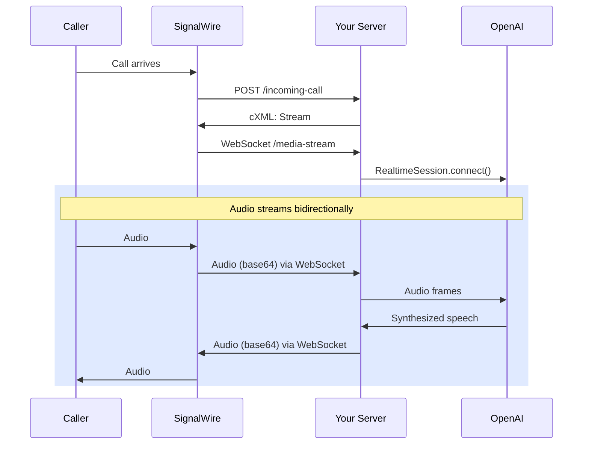

import AddResource from '/docs/main/_common/dashboard/add-resource.mdx';
import ResourcesFyi from '/docs/main/_common/call-fabric/resources-fyi-card.mdx';
import { MdCode, MdDescription, MdLibraryBooks } from "react-icons/md";
import { SiGithub, SiOpenai, SiNpm } from "react-icons/si";

# Stream an OpenAI Realtime API agent with a cXML script

<Subtitle>Put OpenAI Speech-to-Speech models on the phone with cXML `<Stream>`</Subtitle>

In this guide, we will build a Node.js application that serves a 
[cXML Script][cxml]
that initiates a two-way (bidirectional) 
[`<Stream>`][bidir-stream]
to a Speech-to-Speech model on the OpenAI Realtime API.
When a caller initiates a call to the assigned phone number, 
the SignalWire platform requests and runs the cXML script.



## Prerequisites

Before you begin, ensure you have:

- **SignalWire Space** - [Sign up free](https://signalwire.com/signup)
- **OpenAI API Key** - [Get access](https://platform.openai.com/api-keys) (requires paid account)
- **Node.js 20+** - For running the TypeScript server ([Install Node](https://nodejs.org/en/download))
- **ngrok** or other tunneling service - For local development tunneling ([Install ngrok](https://ngrok.com/download))
- **Docker** (optional) - For containerized deployment

## Quickstart

<Steps>

### Clone and install

<div className="row">

<div class="col col--8">

Clone the SignalWire Solutions repository, navigate to this example, and install.

```bash
git clone https://github.com/signalwire/cXML-realtime-agent-stream
cd cXML-realtime-agent-stream
npm install
```

</div>

<div class="col col--4">

<Card 
    title="Project repository" 
    href="https://github.com/signalwire/cXML-realtime-agent-stream"
    icon={<MdCode />}
    >
View the source code on GitHub
</Card>

</div>

</div>

### Add OpenAI credentials

Select the **Local** or **Docker** tab below depending on where you plan to run the application.

<Tabs groupId="deploy">
<TabItem value="local" label="Local">

When running the server on your local machine, store your credentials in a `.env` file.

```bash
cp .env.example .env
```

Edit `.env` and add your OpenAI API key:

```bash
OPENAI_API_KEY=sk-your-actual-api-key-here
```

</TabItem>

<TabItem value="docker" label="Docker">

When running the server in production with the Docker container, store your credentials in a `secrets` folder.

```bash title="Create secrets directory"
mkdir secrets
```

```bash title="Store API key in secrets"
echo "sk-your-actual-api-key-here" > secrets/openai_api_key.txt
```

</TabItem>
</Tabs>

### Run application

<Tabs groupId="deploy">
<TabItem value="local" label="Local">

```bash title="Local - Build and run"
npm run build
npm start
```

</TabItem>

<TabItem value="docker" label="Docker">

```bash title="Docker - Build and run"
docker-compose up --build signalwire-assistant
```

</TabItem>
</Tabs>

Your AI assistant webhook is now running at `http://localhost:5050/incoming-call`.

:::tip Health check
Make sure your server is running and the health check passes:
```bash
curl http://localhost:5050/health
# Should return: {"status":"healthy"}
```
:::

### Create a cXML script

Next, we need to tell SignalWire to request cXML from your server when a call comes in.

<div className="row">

<div className="col col--6">

- Navigate to [My Resources][resources] in your Dashboard.
- Click **Create Resource**, select **Script** as the resource type, and choose `cXML`.
- Under `Handle Using`, select `External Url`.
- Set the `Primary Script URL` to your server's **webhook endpoint**.

Select the **Local** tab below if you ran the application locally, and the **Docker** tab if you're running it with Docker.

</div>

<div className="col col--6">

<ResourcesFyi />

</div>

</div>

<Tabs groupId="deploy">
<TabItem value="local" label="Local">

SignalWire must be able to reach your webhook from the internet. For local development, use [ngrok](https://ngrok.com/) or another [tunneling service](https://github.com/anderspitman/awesome-tunneling) to expose your local server.

Use ngrok to expose port 5050 on your development machine:

```bash
ngrok http 5050
```

The output will look like:
```bash
Forwarding                    https://abc123def456.ngrok.io -> http://localhost:5050
```

Append `/incoming-call` to the HTTPS URL provided by ngrok:
```
https://abc123def456.ngrok.io/incoming-call
```

Use this as the **Primary Script URL** when creating your cXML script in the SignalWire Dashboard.

</TabItem>
<TabItem value="docker" label="Docker">

For production environments, set your server URL + `/incoming-call`:

```
https://your-domain.com/incoming-call
```

</TabItem>
</Tabs>

:::important set routes
For this example, you **must** include `/incoming-call` at the end of your URL. This is the specific webhook endpoint that our application uses to handle incoming calls.
:::

- Give the cXML Script a descriptive name, such as "AI Voice Assistant".
- Save your new Resource.

### Assign phone number or SIP address

To test your AI assistant, create a SIP address or phone number and assign it as a handler for your cXML Script Resource.

- From the [My Resources][resources] tab, select your cXML Script
- Open the **Addresses & Phone Numbers** tab
- Click **Add**, and select either **SIP Address** or **Phone Number**
- Fill out any required details, and save the configuration

### Test application

Dial the SIP address or phone number assigned to your cXML Script.
You should now be speaking to your newly created agent!

</Steps>


---


## How it works

This section walks through the key components of the integration. Start with the system architecture to understand the full picture, then explore each component in detail.

<AccordionGroup>

<Accordion title="System architecture" description="Understand the end-to-end signal path and key components.">

The application consists of four key components:

1. **cXML Server** (Fastify): Receives incoming call webhooks and returns instructions, in the form of a [cXML Script][cxml], to SignalWire
2. **WebSocket Bridge** (SignalWireCompatibilityTransportLayer): Translates between SignalWire's media stream protocol and OpenAI's Realtime API format
3. **OpenAI Connection**: Manages the realtime connection to OpenAI for speech processing and AI responses, using the RealtimeSession class from OpenAI's Realtime SDK
4. **Function Calling**: Server-side tool execution (weather, time, custom functions) during conversations

</Accordion>

<Accordion title="Webhook endpoint" description="Set up your server to handle incoming call webhooks and respond with a cXML Script.">

When SignalWire receives an incoming call, it sends a webhook to your server. 
Your server responds with instructions, in the form of a 
[cXML Script][cxml],
that tell SignalWire to stream the audio to your WebSocket endpoint, which is connected to OpenAI.

```typescript title="src/routes/webhook.ts"
import type { FastifyInstance, FastifyRequest, FastifyReply } from 'fastify';
import { WEBHOOK_MESSAGES, AUDIO_FORMAT, SIGNALWIRE_CODECS } from '../constants.js';
import { AGENT_CONFIG } from '../config.js';

export async function webhookRoute(fastify: FastifyInstance) {
  fastify.all('/incoming-call', async (request: FastifyRequest, reply: FastifyReply) => {
    // Dynamically construct WebSocket URL from request headers
    const host = request.headers.host || 'localhost';
    const protocol = request.headers['x-forwarded-proto'] === 'https' ? 'wss' : 'ws';
    const websocketUrl = `${protocol}://${host}/media-stream`;

    // Get codec attribute based on configured audio format
    const codec = AGENT_CONFIG.audioFormat === AUDIO_FORMAT.PCM16
      ? SIGNALWIRE_CODECS.PCM16
      : SIGNALWIRE_CODECS.G711_ULAW;
    const codecAttribute = codec ? ` codec="${codec}"` : '';

    // Log codec selection for debugging
    console.log(`📞 Incoming call - Audio format: ${AGENT_CONFIG.audioFormat}, SignalWire codec: ${codec || 'default (G.711 μ-law)'}`);

    // Generate cXML response to stream audio to our WebSocket
    const cXMLResponse = `<?xml version="1.0" encoding="UTF-8"?>
    <Response>
      <Say>${WEBHOOK_MESSAGES.CONNECTING}</Say>
      <Connect>
        <Stream url="${websocketUrl}"${codecAttribute} />
      </Connect>
    </Response>`;

    reply.type('text/xml').send(cXMLResponse);
  });
}
```

The webhook automatically sets the correct codec based on your `AUDIO_FORMAT` configuration. See [Configure audio format](#configure-audio-format) for how to set your desired audio quality.

:::tip Webhook URL Format
Your webhook URL must include `/incoming-call` at the end:
- Local: `https://your-ngrok-url.ngrok.io/incoming-call`
- Production: `https://your-domain.com/incoming-call`
:::

</Accordion>

<Accordion title="WebSocket bridge" description="Translate between SignalWire's media stream protocol and OpenAI's Realtime API.">

This is the core of the integration. When a WebSocket connection is established at `/media-stream`, you create a transport layer that bridges SignalWire's audio stream to OpenAI's Realtime API. The transport layer automatically handles protocol translation and audio format conversions, so audio flows bidirectionally without any manual conversion.

In the code below, we handle WebSocket lifecycle events (connection, disconnection, errors), create the transport layer with the configured audio format, connect to OpenAI's Realtime API while logging key events (AI responses, transcriptions, tool calls), and trigger an immediate AI response to greet the caller.

```typescript title="src/routes/streaming.ts"
import type { WebSocket } from 'ws';
import { RealtimeAgent, RealtimeSession } from '@openai/agents/realtime';
import { SignalWireCompatibilityTransportLayer } from '../transports/SignalWireCompatibilityTransportLayer.js';

fastify.get('/media-stream', { websocket: true }, async (connection: WebSocket) => {
  // Handle client disconnection
  connection.on('close', () => {
    console.log('Client disconnected');
  });

  // Handle connection errors
  connection.on('error', (error) => {
    console.error('Connection error:', error);
  });

  try {
    // Create SignalWire transport layer with configured audio format
    const signalWireTransportLayer = new SignalWireCompatibilityTransportLayer({
      signalWireWebSocket: connection,
      audioFormat: AGENT_CONFIG.audioFormat
    });

    // Create session with SignalWire transport
    const session = new RealtimeSession(realtimeAgent, {
      transport: signalWireTransportLayer,
      model: model
    });

    // Listen to raw transport events for debugging
    session.transport.on('*', (event) => {
      switch (event.type) {
        case 'response.done':
          console.log('AI response completed', event);
          break;
        case 'conversation.item.input_audio_transcription.completed':
          console.log('User transcription completed', event);
          break;
        default:
          console.debug('Raw transport event:', event);
      }
    });

    // Listen to session events for tool call lifecycle
    session.on('agent_tool_start', (context, agent, tool, details) => {
      console.log('Tool call started:', details);
    });

    session.on('agent_tool_end', (context, agent, tool, result, details) => {
      console.log('Tool call completed:', details);
    });

    // Handle errors gracefully
    session.on('error', (error) => {
      console.error('Session error:', error);
    });

    // Connect to OpenAI Realtime API via the transport layer
    await session.connect({
      apiKey: process.env.OPENAI_API_KEY
    });

    // Trigger immediate AI response
    try {
      const responseEvent = { type: 'response.create' };
      signalWireTransportLayer.sendEvent(responseEvent);
    } catch (error) {
      // AI-first response trigger failed, but session continues
    }

  } catch (error) {
    console.error('Error initializing session:', error);
  }
});
```

</Accordion>

<Accordion title="Agent configuration" description="Define your AI assistant's behavior, voice, and available tools.">

The agent configuration controls how your assistant behaves during conversations. You define its personality through instructions, select its voice, specify which tools it can use, and configure the audio format:

```typescript title="src/config.ts - Agent configuration"
import type { RealtimeAgentConfiguration } from '@openai/agents/realtime';
import { allTools } from '../tools/index.js';

export const AGENT_CONFIG: RealtimeAgentConfiguration = {
  name: 'SignalWire Voice Assistant',
  voice: 'alloy',
  model: 'gpt-4o-realtime-preview',
  audioFormat: process.env.AUDIO_FORMAT || 'g711_ulaw',
  instructions: `
    You are a helpful and friendly voice assistant integrated with SignalWire.

    IMPORTANT: Always start every conversation by greeting the caller first. Begin with something like "Hello! I'm your AI voice assistant. How can I help you today?"

    You can help with weather information, time queries, and general conversation.
    Be concise and friendly in your responses, remembering you're on a phone call.
    When you first greet someone, briefly mention that you can help with weather, time, and answering questions.
    Always confirm when you're about to use a tool.
  `
};

// The agent is instantiated in the WebSocket handler with: new RealtimeAgent(AGENT_CONFIG)
```

</Accordion>

<Accordion title="Function calling" description="Add server-side tools to your agent.">

Tools are server-side functions that the AI can call during a conversation. In production, extract the implementation logic into separate files as shown in the repository.

<Tabs groupId="tools">
<TabItem value="time" label="Time tool">

Get the current time in Eastern Time. Uses JavaScript's built-in `toLocaleString` method—no external APIs required.

```typescript title="src/tools/time.tool.ts"
import { z } from 'zod';
import { tool as realtimeTool } from '@openai/agents/realtime';
import { ERROR_MESSAGES } from '../constants.js';

export const timeTool = realtimeTool({
  name: 'get_time',
  description: 'Get the current time in Eastern Time',
  parameters: z.object({}), // No parameters needed
  execute: async () => {
    try {
      const now = new Date();

      // Always format for Eastern Time
      const easternTime = now.toLocaleString('en-US', {
        timeZone: 'America/New_York',
        timeZoneName: 'short',
        weekday: 'long',
        year: 'numeric',
        month: 'long',
        day: 'numeric',
        hour: 'numeric',
        minute: '2-digit'
      });

      return `The current time in Eastern Time is ${easternTime}.`;
    } catch (error) {
      // Return fallback message if time formatting fails
      return ERROR_MESSAGES.TIME_UNAVAILABLE;
    }
  },
});
```

1. **User asks**: "What time is it?"
2. **AI recognizes intent**: Needs time information
3. **Function call triggered**: `get_time()`
4. **Server executes**: Gets current Eastern Time
5. **Result returned**: AI incorporates into response
6. **User hears**: "The current time is 3:45 PM Eastern Time."

</TabItem>
<TabItem value="weather" label="Weather tool">

Get current weather information for a specified US location.
Uses the
[OpenStreetMap Nominatim API](https://nominatim.org/)
for geocoding and the
[US National Weather Service API](https://www.weather.gov/documentation/services-web-api)
for forecast data.

```typescript title="src/tools/weather.tool.ts"
import { z } from 'zod';
import { tool as realtimeTool } from '@openai/agents/realtime';
import { ERROR_MESSAGES } from '../constants.js';

/**
 * Fetches weather data using the free US National Weather Service API
 *
 * Flow:
 * 1. Convert city name to coordinates (OpenStreetMap Nominatim)
 * 2. Get weather grid point from coordinates (weather.gov)
 * 3. Fetch detailed forecast for that grid point
 */
async function fetchWeatherData(location: string): Promise<string> {
  try {
    // Step 1: Geocoding - Convert city name to coordinates
    const geocodeUrl = `https://nominatim.openstreetmap.org/search?format=json&q=${encodeURIComponent(location)}&countrycodes=us&limit=1`;

    const geocodeResponse = await fetch(geocodeUrl, {
      headers: {
        'User-Agent': 'SignalWire-OpenAI-Voice-Assistant/1.0.0 (Contact: developer@example.com)'
      }
    });

    if (!geocodeResponse.ok) {
      return ERROR_MESSAGES.WEATHER_UNAVAILABLE;
    }

    const geocodeData = await geocodeResponse.json();

    if (!geocodeData || geocodeData.length === 0) {
      return ERROR_MESSAGES.CITY_NOT_FOUND(location);
    }

    const lat = parseFloat(geocodeData[0].lat);
    const lon = parseFloat(geocodeData[0].lon);

    // Step 2: Get weather grid point from weather.gov
    const pointsUrl = `https://api.weather.gov/points/${lat},${lon}`;

    const pointsResponse = await fetch(pointsUrl);

    if (!pointsResponse.ok) {
      return ERROR_MESSAGES.WEATHER_UNAVAILABLE;
    }

    const pointsData = await pointsResponse.json();

    // Step 3: Get the detailed forecast
    const forecastUrl = pointsData.properties?.forecast;

    if (!forecastUrl) {
      return ERROR_MESSAGES.WEATHER_UNAVAILABLE;
    }

    const forecastResponse = await fetch(forecastUrl);

    if (!forecastResponse.ok) {
      return ERROR_MESSAGES.WEATHER_UNAVAILABLE;
    }

    const forecastData = await forecastResponse.json();

    const currentPeriod = forecastData.properties?.periods?.[0];
    if (!currentPeriod) {
      return ERROR_MESSAGES.WEATHER_UNAVAILABLE;
    }

    // Format the response for voice
    const cityName = geocodeData[0].display_name.split(',')[0];
    const weatherReport = `In ${cityName}, it's currently ${currentPeriod.detailedForecast.toLowerCase()}`;

    return weatherReport;

  } catch (error) {
    return ERROR_MESSAGES.WEATHER_UNAVAILABLE;
  }
}

export const weatherTool = realtimeTool({
  name: 'get_weather',
  description: 'Get current weather information for any US city',
  parameters: z.object({
    location: z.string().describe('The US city or location to get weather for (include state if needed for clarity)'),
  }),
  execute: async ({ location }) => {
    const weatherData = await fetchWeatherData(location);
    return weatherData;
  },
});
```

1. **User asks**: "What's the weather in New York?"
2. **AI recognizes intent**: Needs weather information
3. **Function call triggered**: `get_weather({ location: "New York" })`
4. **Server executes**: Fetches from weather API
5. **Result returned**: AI incorporates into response
6. **User hears**: "The weather in New York is 72°F and sunny."

</TabItem>
</Tabs>

</Accordion>

</AccordionGroup>

## Configuration

### Environment variables

Set up your environment variables for different deployment scenarios:

<Tabs groupId="deploy">
<TabItem value="local" label="Local">

Create a `.env` file in your project root:

```bash
# Required
OPENAI_API_KEY=sk-your-actual-api-key-here

# Optional
PORT=5050
AUDIO_FORMAT=g711_ulaw  # or 'pcm16' for HD audio
```

</TabItem>
<TabItem value="docker" label="Docker">

For production, store your API credentials securely using Docker secrets rather than environment variables. This keeps sensitive data out of version control and environment files.

**Set up secrets:**

```bash
mkdir -p secrets
echo "sk-your-actual-api-key-here" > secrets/openai_api_key.txt
```

**docker-compose.yml configuration:**

The `docker-compose.yml` file references the secret and mounts it into the container:

```yaml title="docker-compose.yml"
services:
  signalwire-assistant:
    # ... other config
    secrets:
      - openai_api_key

secrets:
  openai_api_key:
    file: ./secrets/openai_api_key.txt
```

**Reading secrets in your application:**

Your application reads from the Docker secret at runtime, checking the secret file first and falling back to an environment variable:

```typescript title="src/config.ts - Read Docker secrets"
import * as fs from 'fs';

function getOpenAIApiKey(): string {
  // First try to read from Docker secret (for containerized deployments)
  const secretPath = '/run/secrets/openai_api_key';
  try {
    if (fs.existsSync(secretPath)) {
      const apiKey = fs.readFileSync(secretPath, 'utf8').trim();
      if (apiKey) {
        return apiKey;
      }
    }
  } catch (error) {
    // Fall back to environment variable if secret reading fails
    // (logging omitted for simplicity)
  }

  // Fallback to environment variable
  const envApiKey = process.env.OPENAI_API_KEY;
  if (envApiKey) {
    return envApiKey;
  }

  return '';
}

const OPENAI_API_KEY = getOpenAIApiKey();
```

:::info Configuration Validation
The actual implementation includes startup validation that checks:
- **API Key**: Throws an error if `OPENAI_API_KEY` is missing, with helpful instructions for both local and Docker setups
- **Audio Format**: Validates that `AUDIO_FORMAT` is either `g711_ulaw` or `pcm16`, rejecting invalid values

This means configuration errors are caught immediately at startup, preventing runtime failures later. If you see configuration errors when starting the application, check the error message—it includes specific instructions for fixing the issue.
:::

**Important reminders:**

- Always add `secrets/` to your `.gitignore` to prevent accidental commits
- Docker secrets are mounted at `/run/secrets/` inside the container
- Keep credentials out of `.env` files and version control

</TabItem>
</Tabs>

### Audio codec {#configure-audio-format}

Choose the right audio codec for your use case. The default is G.711 μ-law.

<CardGroup>
  <Card
    title="PCM16 @ 24kHz"
    description="Crystal clear audio for demos and high-quality applications"
  >
	**Sample rate:** `24 kHz`  
	**Bandwidth:** `~384 kbps`  
	**Quality:** `High definition`  
  </Card>
  <Card
    title="G.711 μ-law @ 8kHz"
    description="Standard telephony quality, lower bandwidth usage"
  >
	**Sample rate:** `8 kHz`  
	**Bandwidth:** `~64 kbps`  
	**Quality:** `Standard telephony`  
  </Card>
</CardGroup>

The application automatically sets the correct codec in your cXML response based on the `AUDIO_FORMAT` environment variable. Just configure the environment variable:

```bash
# In your .env file
AUDIO_FORMAT=pcm16  # or g711_ulaw
```

The application will use `pcm16` (24kHz HD audio) when set, or default to `g711_ulaw` (8kHz standard telephony) if not set.

## Troubleshooting

Refer to this table if you encounter issues running the application.

| Issue | Cause | Solution |
|-------|-------|----------|
| No audio from AI | Codec mismatch or incorrect codec configuration | • Check `AUDIO_FORMAT` environment variable<br/>• Verify SignalWire and application codec match |
| Invalid AUDIO_FORMAT error | Invalid environment variable value | • Verify `AUDIO_FORMAT` is either `g711_ulaw` or `pcm16`<br/>• Check for typos or extra whitespace<br/>• Remove the variable to use default (`g711_ulaw`) |
| Server fails to start | Port 5050 already in use | • Check what's running on port 5050: `lsof -i :5050`<br/>• Stop the conflicting application or use a different port with `PORT=5051 npm start` |
| Health check failing | Server crashed or not responding | • Check server logs for error messages<br/>• Verify all configuration is correct<br/>• Try accessing `/health` endpoint directly in browser |
| Missing OPENAI_API_KEY | Configuration error | • Verify `OPENAI_API_KEY` in `.env` file (local)<br/>• Verify Docker secrets are configured (Docker) |
| Calls not connecting after ngrok restart | ngrok URL changed | • ngrok generates a new URL each time you restart<br/>• Update the webhook URL in SignalWire Dashboard with the new ngrok URL<br/>• Restart ngrok and update SignalWire before testing |

## Resources

<CardGroup cols={2}>
  <Card
    title="SignalWire + OpenAI Realtime"
    description="Production-ready implementation with all features"
    icon={<SiGithub />}
    href="https://github.com/signalwire/cXML-realtime-agent-stream"
  >
    Complete working example with weather and time functions, error handling, and production Docker setup
  </Card>
  <Card
    title="OpenAI Realtime API Guide"
    href="https://platform.openai.com/docs/guides/realtime"
    icon={<SiOpenai />}
  >
    Official documentation for the OpenAI Realtime API
  </Card>
  <Card
    title="cXML Reference"
    href="/compatibility-api/cxml"
    icon={<MdDescription />}
  >
    Complete reference for Compatibility XML
  </Card>
  <Card
    title="@openai/agents SDK Documentation"
    href="https://www.npmjs.com/package/@openai/agents"
    icon={<SiNpm />}
  >
    NPM package documentation for the OpenAI Agents SDK
  </Card>
</CardGroup>

<!-- Links -->

[cxml]: /compatibility-api/cxml "Documentation for cXML, or Compatibility XML."
[bidir-stream]: /compatibility-api/cxml/voice/stream#bidirectional-stream "Technical reference for creating a bidirectional Stream in cXML."
[resources]: https://my.signalwire.com?page=resources "The My Resources page of your SignalWire Dashboard."
[repo]: https://github.com/signalwire/cXML-realtime-agent-stream "This project's GitHub repository."
[openai-realtime-api]: https://platform.openai.com/docs/guides/realtime "The OpenAI Realtime API"
