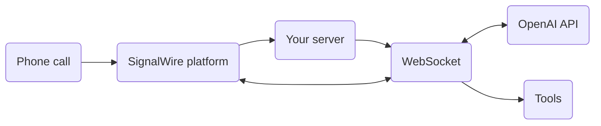
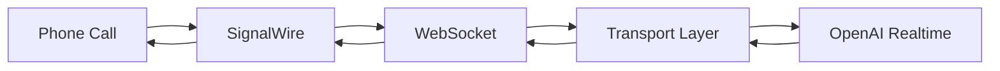

import AddResource from '/docs/main/_common/dashboard/add-resource.mdx';

# Stream to OpenAI Realtime API agent with cXML

<Subtitle>Put OpenAI Speech-to-Speech models on the phone with bidirectional streaming and cXML</Subtitle>

In this guide, we will build a Node.js application that serves a 
[cXML Script][cxml]
that initiates a two-way (bidirectional) 
[`<Stream>`][bidir-stream]
to the OpenAI Realtime API.
When a caller initiates a SIP or 
<Tooltips tip="Public Switched Telephone Network">PSTN</Tooltips>
call to the assigned phone number, the SignalWire platform requests and runs the script.

The key architectural components involved are:

- **cXML server:** Our Fastify server serves dynamic cXML to the SignalWire platform. 
This gives our application the ability to update the call instructions according to each request.
- **WebSocket bridge:** Enables real-time audio streaming between telephony and AI
- **AI integration:** Natural conversations with OpenAI's Realtime API
- **Function Calling:** Server-side tool execution during conversations

Here's what happens when someone calls your application:



1. **Call arrives** at SignalWire
2. **Webhook triggers** your server endpoint
3. **WebSocket streams** audio bidirectionally
4. **AI processes** speech in real-time
5. **Responses flow back** to the caller

## Prerequisites

Before you begin, ensure you have:

- **SignalWire Space** - [Sign up free](https://signalwire.com)
- **OpenAI API Key** - [Get access](https://platform.openai.com/api-keys) (requires paid account)
- **Node.js 20+** - For running the TypeScript server ([Install Node](https://nodejs.org/en/download))
- **ngrok** or other tunneling service - For local development tunneling ([Install ngrok](https://ngrok.com/download))
- **Docker** (optional) - For containerized deployment

---

<Steps>

### Clone and install

Clone the SignalWire Solutions repository, navigate to this example, and install.

```bash
git clone https://github.com/signalwire/solutions-architecture
cd code/cxml-realtime-agent-stream
npm install
```

### Add your API key

Choose **ONE** method based on how you'll run the application.

<Tabs groupId="deploy">
<TabItem value="local" label="Local">

When running the server on your local machine, store your credentials in a `.env` file.

```bash
cp .env.example .env
```

Edit `.env` and add your OpenAI API key:

```bash title=".env"
OPENAI_API_KEY=sk-your-actual-api-key-here
```

</TabItem>

<TabItem value="docker" label="Docker">

When running the server in production with the Docker container, store your credentials in a `secrets` folder.

```bash
mkdir secrets
```

```bash
echo "sk-your-actual-api-key-here" > secrets/openai_api_key.txt
```

</TabItem>
</Tabs>

### Run the application

<Tabs groupId="deploy">
<TabItem value="local" label="Local">

```bash
npm run build
npm start
```

</TabItem>

<TabItem value="prod" label="Docker">

```bash
docker-compose up --build signalwire-assistant
```

</TabItem>
</Tabs>

Your AI assistant webhook is now running at `http://localhost:5050/incoming-call`.

:::important
The `/incoming-call` endpoint is where SignalWire sends call data to trigger your AI assistant. 
This is the URL you'll configure in your SignalWire cXML resource.  
:::

### Create a cXML Script Resource

Next, we need to tell SignalWire to request cXML from your server when a call comes in.

In your SignalWire Dashboard, navigate to [My Resources][resources].
Click **Create Resource**, select **Script** as the resource type, and choose `cXML`.

Under `Handle Using`, select `External Url`.
Set the `Primary Script URL` to your server's **webhook endpoint**:

<Tabs>
<TabItem value="dev" label="Local">
Use ngrok to expose port 5050 on your development machine:

```bash
ngrok http 5050
```

Append `/incoming-call` to the HTTPS URL returned by ngrok.
https://abc123.ngrok.io/incoming-call
</TabItem>
<TabItem value="prod" label="Docker">
For production environments, set your server URL + `/incoming-call`:
      ```
      https://your-domain.com/incoming-call
      ```
</TabItem>
</Tabs>

   > **🚨 Critical:** You MUST include `/incoming-call` at the end of your URL. This is the specific webhook endpoint that handles incoming calls.
6. Give it a descriptive name (e.g., "AI Voice Assistant")
7. Create the resource

> **📖 Learn More:** Follow the [SignalWire Call Fabric Resources Guide](https://developer.signalwire.com/platform/call-fabric/resources) for detailed instructions.


### 3. Create a SIP Address

To test your AI assistant, create a SIP address that connects to your cXML resource:

1. Now from the resource page of the resource you just created, click the `Addresses * Phone NUmbers` tab
2. Click **Add** to create a new address
3. Select **SIP Address** as the address type
5. Fill out the address information
6. Save the configuration

> **📖 Learn More:** Follow the [SignalWire Call Fabric Addresses Guide](https://developer.signalwire.com/platform/call-fabric/addresses) for detailed SIP address creation.


> **💡 Tip:** You can also purchase a regular [phone number](https://developer.signalwire.com/platform/dashboard/get-started/phone-numbers) and link it to your cXML resource if you prefer traditional phone number calling.

### Step 4: Test It!
**Call the SIP address you created in [Step 3](#3-create-a-sip-address) to test your AI assistant:**
1. **Using a SIP Phone or Softphone:**
   - Dial: `sip:your-sip-address@yourproject.dapp.signalwire.com`
   - Replace with the actual SIP address you created in your SignalWire resource
2. **The call flow will be:**
   - Your SIP call → SignalWire → Your webhook endpoint → AI assistant
> **📱 Alternative:** If you purchased a regular phone number and linked it to your cXML resource, you can also call that number directly.
> **🔧 Troubleshooting:** If you haven't set up ngrok yet, go back to [SignalWire Setup](#signalwire-setup) to expose your local server.

</Steps>

---

## Steps

<Steps>

### Create the Webhook Endpoint

Your server needs to handle incoming call webhooks from SignalWire.

**Set Up the HTTP Endpoint**

<Tabs groupId="language">
<TabItem value="typescript" label="TypeScript">

```typescript
import Fastify from 'fastify';

const app = Fastify();

app.post('/incoming-call', async (req, res) => {
    const host = req.headers.host;
    const wsUrl = `wss://${host}/media-stream`;

    // Return cXML instructions to stream audio
    const cxml = `<?xml version="1.0" encoding="UTF-8"?>
    <Response>
        <Stream url="${wsUrl}" />
    </Response>`;

    res.type('text/xml').send(cxml);
});

app.listen({ port: 5050, host: '0.0.0.0' });
```

</TabItem>
<TabItem value="javascript" label="JavaScript">

```javascript
const Fastify = require('fastify');

const app = Fastify();

app.post('/incoming-call', async (req, res) => {
    const host = req.headers.host;
    const wsUrl = `wss://${host}/media-stream`;

    // Return cXML instructions to stream audio
    const cxml = `<?xml version="1.0" encoding="UTF-8"?>
    <Response>
        <Stream url="${wsUrl}" />
    </Response>`;

    res.type('text/xml').send(cxml);
});

app.listen({ port: 5050, host: '0.0.0.0' });
```

</TabItem>
</Tabs>

:::tip Webhook URL Format
Your webhook URL must include `/incoming-call` at the end:
- Local: `https://your-ngrok-url.ngrok.io/incoming-call`
- Production: `https://your-domain.com/incoming-call`
:::

### Build the WebSocket Bridge

Create a WebSocket server to handle bidirectional audio streaming.

**Initialize WebSocket Server**

<Tabs groupId="language">
<TabItem value="typescript" label="TypeScript">

```typescript
import websocket from '@fastify/websocket';
import { SignalWireRealtimeTransportLayer } from '../transports/SignalWireRealtimeTransportLayer.js';
import { RealtimeSession, RealtimeAgent } from '@openai/agents/realtime';
import { AGENT_CONFIG } from '../config.js';

interface SignalWireMessage {
    event: 'start' | 'media' | 'stop' | 'mark';
    media?: {
        payload: string;  // Base64 encoded audio
        track?: 'inbound' | 'outbound';
    };
    start?: {
        streamSid: string;
        callSid: string;
        mediaFormat?: {
            encoding: string;
            sampleRate: number;
            channels: number;
        };
    };
}

app.register(websocket);

app.get('/media-stream', { websocket: true }, async (connection) => {
    console.log('📞 Client connected to WebSocket');

    try {
        // Create SignalWire transport layer with configured audio format
        const signalWireTransportLayer = new SignalWireRealtimeTransportLayer({
            signalWireWebSocket: connection,
            audioFormat: AGENT_CONFIG.audioFormat
        });

        // Create AI agent and session
        const realtimeAgent = new RealtimeAgent(agentConfig);
        const session = new RealtimeSession(realtimeAgent, {
            transport: signalWireTransportLayer,
            model: 'gpt-4o-realtime-preview'
        });

        // Connect to OpenAI Realtime API
        await session.connect({
            apiKey: process.env.OPENAI_API_KEY
        });

        // Handle session events
        session.on('agent_tool_start', (context, agent, tool, details) => {
            console.log('🔧 Tool call started:', details);
        });

    } catch (error) {
        console.error('❌ Transport initialization failed:', error);
    }
});
```

</TabItem>
<TabItem value="javascript" label="JavaScript">

```javascript
const websocket = require('@fastify/websocket');
const { SignalWireRealtimeTransportLayer } = require('../transports/SignalWireRealtimeTransportLayer.js');
const { RealtimeSession, RealtimeAgent } = require('@openai/agents/realtime');
const { AGENT_CONFIG } = require('../config.js');

app.register(websocket);

app.get('/media-stream', { websocket: true }, async (connection) => {
    console.log('📞 Client connected to WebSocket');

    try {
        // Create SignalWire transport layer with configured audio format
        const signalWireTransportLayer = new SignalWireRealtimeTransportLayer({
            signalWireWebSocket: connection,
            audioFormat: AGENT_CONFIG.audioFormat
        });

        // Create AI agent and session
        const realtimeAgent = new RealtimeAgent(agentConfig);
        const session = new RealtimeSession(realtimeAgent, {
            transport: signalWireTransportLayer,
            model: 'gpt-4o-realtime-preview'
        });

        // Connect to OpenAI Realtime API
        await session.connect({
            apiKey: process.env.OPENAI_API_KEY
        });

        // Handle session events
        session.on('agent_tool_start', (context, agent, tool, details) => {
            console.log('🔧 Tool call started:', details);
        });

    } catch (error) {
        console.error('❌ Transport initialization failed:', error);
    }
});
```

</TabItem>
</Tabs>

<Accordion title="Understanding SignalWire Stream Messages">

SignalWire sends several types of messages through the WebSocket:

| Event | Purpose | Key Data | Handled By |
|-------|---------|----------|------------|
| `start` | Connection initialized | `streamSid`, `callSid`, `mediaFormat` | Transport Layer |
| `media` | Audio data packet (~20ms) | Base64 encoded `payload`, `track` | Transport Layer |
| `mark` | Audio playback confirmation | `name` (for timing) | Transport Layer |
| `stop` | Stream ending | None | Transport Layer |

**Key Features of SignalWireRealtimeTransportLayer:**
- **Automatic audio format conversion** between SignalWire and OpenAI
- **Interruption handling** using `clear` events and mark tracking
- **Base64 encoding/decoding** for audio data
- **Session lifecycle management** with proper cleanup
- **Error recovery** and reconnection handling

**Audio Format Support:**
- **Input**: G.711 μ-law (8kHz) or PCM16 (24kHz) from SignalWire
- **Output**: Matches input format automatically
- **OpenAI Integration**: Handles format negotiation transparently

</Accordion>

### Integrate with OpenAI Realtime API

Connect your WebSocket bridge to OpenAI's Realtime API for AI processing.

**Create the AI Session**

<Tabs groupId="language">
<TabItem value="typescript" label="TypeScript">

```typescript
import { RealtimeAgent, RealtimeSession } from '@openai/agents/realtime';
import type { RealtimeAgentConfiguration } from '@openai/agents/realtime';
import { SignalWireRealtimeTransportLayer } from '../transports/SignalWireRealtimeTransportLayer.js';
import { allTools } from '../tools/index.js';

// Configure the AI agent
const agentConfig: RealtimeAgentConfiguration = {
    name: 'SignalWire Voice Assistant',
    instructions: `You are a helpful and friendly voice assistant.
        Always start every conversation by greeting the caller first.
        You can help with weather information, time queries, and general conversation.
        Be concise and friendly in your responses.`,
    tools: allTools, // Weather, time, and other tools
    voice: 'alloy'
};

async function createAISession(signalWireWebSocket: WebSocket): Promise<RealtimeSession> {
    // Create transport layer that bridges SignalWire and OpenAI
    const transport = new SignalWireRealtimeTransportLayer({
        signalWireWebSocket,
        audioFormat: 'g711_ulaw' // or 'pcm16' for HD audio
    });

    // Create agent and session
    const agent = new RealtimeAgent(agentConfig);
    const session = new RealtimeSession(agent, {
        transport,
        model: 'gpt-4o-realtime-preview'
    });

    // Connect to OpenAI
    await session.connect({
        apiKey: process.env.OPENAI_API_KEY
    });

    return session;
}
```

</TabItem>
<TabItem value="javascript" label="JavaScript">

```javascript
const { RealtimeAgent, RealtimeSession } = require('@openai/agents/realtime');
const { SignalWireRealtimeTransportLayer } = require('../transports/SignalWireRealtimeTransportLayer.js');
const { allTools } = require('../tools/index.js');

// Configure the AI agent
const agentConfig = {
    name: 'SignalWire Voice Assistant',
    instructions: `You are a helpful and friendly voice assistant.
        Always start every conversation by greeting the caller first.
        You can help with weather information, time queries, and general conversation.
        Be concise and friendly in your responses.`,
    tools: allTools, // Weather, time, and other tools
    voice: 'alloy'
};

async function createAISession(signalWireWebSocket) {
    // Create transport layer that bridges SignalWire and OpenAI
    const transport = new SignalWireRealtimeTransportLayer({
        signalWireWebSocket,
        audioFormat: 'g711_ulaw' // or 'pcm16' for HD audio
    });

    // Create agent and session
    const agent = new RealtimeAgent(agentConfig);
    const session = new RealtimeSession(agent, {
        transport,
        model: 'gpt-4o-realtime-preview'
    });

    // Connect to OpenAI
    await session.connect({
        apiKey: process.env.OPENAI_API_KEY
    });

    return session;
}
```

</TabItem>
</Tabs>

**Send Audio Back to Caller**

```typescript
// Audio is automatically handled by SignalWireRealtimeTransportLayer
// The transport layer manages:
// 1. Audio format conversion (g711_ulaw ↔ pcm16)
// 2. Base64 encoding/decoding
// 3. Chunk timing and interruption handling
// 4. Mark events for tracking audio playback

// Example of session event handling:
session.on('agent_tool_start', (context, agent, tool, details) => {
    console.log('🔧 Tool call started:', details);
});

session.on('agent_tool_end', (context, agent, tool, result, details) => {
    console.log('✅ Tool call completed:', details);
});

session.on('error', (error) => {
    console.error('❌ Session error:', error);
});
```

**Environment Configuration**

Set up your environment variables for different deployment scenarios:

<Tabs groupId="deploy">
<TabItem value="local" label="Local Development">

Create a `.env` file in your project root:

```bash
# Required
OPENAI_API_KEY=sk-your-actual-api-key-here

# Optional
PORT=5050
AUDIO_FORMAT=g711_ulaw  # or 'pcm16' for HD audio
```

</TabItem>
<TabItem value="docker" label="Docker Deployment">

For production with Docker secrets:

```bash
# Create secrets directory
mkdir -p secrets
echo "sk-your-actual-api-key-here" > secrets/openai_api_key.txt
```

Environment variables in `docker-compose.yml`:
```yaml
environment:
  - PORT=5050
  - AUDIO_FORMAT=pcm16
```

</TabItem>
</Tabs>

:::note Audio Format Options
Choose the right audio format for your use case:
- **g711_ulaw (8kHz)**: Standard telephony quality (default)
- **pcm16 (24kHz)**: High definition audio for demos
:::

### Add Function Calling

Enable your AI to execute server-side tools during conversations.

**Define Tools**

<Tabs groupId="language">
<TabItem value="typescript" label="TypeScript">

```typescript
import { tool as realtimeTool } from '@openai/agents/realtime';
import { z } from 'zod';

// Weather tool using real US National Weather Service API
const weatherTool = realtimeTool({
    name: 'get_weather',
    description: 'Get current weather information for any US city',
    parameters: z.object({
        location: z.string().describe('The US city or location to get weather for (include state if needed for clarity)')
    }),
    execute: async ({ location }) => {
        try {
            // Step 1: Geocoding - Convert city name to coordinates
            const geocodeUrl = `https://nominatim.openstreetmap.org/search?format=json&q=${encodeURIComponent(location)}&countrycodes=us&limit=1`;
            const geocodeResponse = await fetch(geocodeUrl, {
                headers: {
                    'User-Agent': 'SignalWire-OpenAI-Voice-Assistant/1.0.0'
                }
            });

            if (!geocodeResponse.ok) {
                return 'Sorry, weather information is currently unavailable.';
            }

            const geocodeData = await geocodeResponse.json();
            if (!geocodeData || geocodeData.length === 0) {
                return `Sorry, I couldn't find the location "${location}". Please try a different city name.`;
            }

            const lat = parseFloat(geocodeData[0].lat);
            const lon = parseFloat(geocodeData[0].lon);

            // Step 2: Get weather from weather.gov
            const pointsUrl = `https://api.weather.gov/points/${lat},${lon}`;
            const pointsResponse = await fetch(pointsUrl);
            const pointsData = await pointsResponse.json();

            const forecastUrl = pointsData.properties?.forecast;
            if (!forecastUrl) {
                return 'Sorry, weather information is currently unavailable.';
            }

            const forecastResponse = await fetch(forecastUrl);
            const forecastData = await forecastResponse.json();

            const currentPeriod = forecastData.properties?.periods?.[0];
            if (!currentPeriod) {
                return 'Sorry, weather information is currently unavailable.';
            }

            // Format response for voice
            const cityName = geocodeData[0].display_name.split(',')[0];
            return `In ${cityName}, it's currently ${currentPeriod.detailedForecast.toLowerCase()}`;

        } catch (error) {
            return 'Sorry, weather information is currently unavailable.';
        }
    }
});

// Time tool example (no external API required)
const timeTool = realtimeTool({
    name: 'get_time',
    description: 'Get the current time in Eastern Time',
    parameters: z.object({}), // No parameters needed
    execute: async () => {
        try {
            const now = new Date();
            const easternTime = now.toLocaleString('en-US', {
                timeZone: 'America/New_York',
                timeZoneName: 'short',
                weekday: 'long',
                year: 'numeric',
                month: 'long',
                day: 'numeric',
                hour: 'numeric',
                minute: '2-digit'
            });
            return `The current time in Eastern Time is ${easternTime}.`;
        } catch (error) {
            return 'Sorry, time information is currently unavailable.';
        }
    }
});

// Export all tools
export const allTools = [weatherTool, timeTool];

// Add to your AI agent configuration
const agentConfig = {
    name: 'SignalWire Voice Assistant',
    instructions: `You are a helpful and friendly voice assistant.
        Always start every conversation by greeting the caller first.
        You can help with weather information, time queries, and general conversation.
        Be concise and friendly in your responses.`,
    tools: allTools,
    voice: 'alloy'
};
```

</TabItem>
<TabItem value="javascript" label="JavaScript">

```javascript
const { tool: realtimeTool } = require('@openai/agents/realtime');
const { z } = require('zod');

// Weather tool using real US National Weather Service API
const weatherTool = realtimeTool({
    name: 'get_weather',
    description: 'Get current weather information for any US city',
    parameters: z.object({
        location: z.string().describe('The US city or location to get weather for (include state if needed for clarity)')
    }),
    execute: async ({ location }) => {
        try {
            // Step 1: Geocoding - Convert city name to coordinates
            const geocodeUrl = `https://nominatim.openstreetmap.org/search?format=json&q=${encodeURIComponent(location)}&countrycodes=us&limit=1`;
            const geocodeResponse = await fetch(geocodeUrl, {
                headers: {
                    'User-Agent': 'SignalWire-OpenAI-Voice-Assistant/1.0.0'
                }
            });

            if (!geocodeResponse.ok) {
                return 'Sorry, weather information is currently unavailable.';
            }

            const geocodeData = await geocodeResponse.json();
            if (!geocodeData || geocodeData.length === 0) {
                return `Sorry, I couldn't find the location "${location}". Please try a different city name.`;
            }

            const lat = parseFloat(geocodeData[0].lat);
            const lon = parseFloat(geocodeData[0].lon);

            // Step 2: Get weather from weather.gov
            const pointsUrl = `https://api.weather.gov/points/${lat},${lon}`;
            const pointsResponse = await fetch(pointsUrl);
            const pointsData = await pointsResponse.json();

            const forecastUrl = pointsData.properties?.forecast;
            if (!forecastUrl) {
                return 'Sorry, weather information is currently unavailable.';
            }

            const forecastResponse = await fetch(forecastUrl);
            const forecastData = await forecastResponse.json();

            const currentPeriod = forecastData.properties?.periods?.[0];
            if (!currentPeriod) {
                return 'Sorry, weather information is currently unavailable.';
            }

            // Format response for voice
            const cityName = geocodeData[0].display_name.split(',')[0];
            return `In ${cityName}, it's currently ${currentPeriod.detailedForecast.toLowerCase()}`;

        } catch (error) {
            return 'Sorry, weather information is currently unavailable.';
        }
    }
});

// Time tool example (no external API required)
const timeTool = realtimeTool({
    name: 'get_time',
    description: 'Get the current time in Eastern Time',
    parameters: z.object({}), // No parameters needed
    execute: async () => {
        try {
            const now = new Date();
            const easternTime = now.toLocaleString('en-US', {
                timeZone: 'America/New_York',
                timeZoneName: 'short',
                weekday: 'long',
                year: 'numeric',
                month: 'long',
                day: 'numeric',
                hour: 'numeric',
                minute: '2-digit'
            });
            return `The current time in Eastern Time is ${easternTime}.`;
        } catch (error) {
            return 'Sorry, time information is currently unavailable.';
        }
    }
});

// Export all tools
module.exports = { allTools: [weatherTool, timeTool] };

// Add to your AI agent configuration
const agentConfig = {
    name: 'SignalWire Voice Assistant',
    instructions: `You are a helpful and friendly voice assistant.
        Always start every conversation by greeting the caller first.
        You can help with weather information, time queries, and general conversation.
        Be concise and friendly in your responses.`,
    tools: allTools,
    voice: 'alloy'
};
```

</TabItem>
</Tabs>

<Accordion title="How Function Calling Works">

1. **User asks**: "What's the weather in New York?"
2. **AI recognizes intent**: Needs weather information
3. **Function call triggered**: `get_weather({ location: "New York" })`
4. **Server executes**: Fetches from weather API
5. **Result returned**: AI incorporates into response
6. **User hears**: "The weather in New York is 72°F and sunny."

All of this happens in real-time during the conversation.

</Accordion>

</Steps>

---

## Technical Deep Dive

### The SignalWire Transport Layer

The `SignalWireRealtimeTransportLayer` is the critical component that bridges SignalWire's WebSocket protocol with OpenAI's Realtime API:

```typescript
// Key features of the transport layer:
const transport = new SignalWireRealtimeTransportLayer({
    signalWireWebSocket: connection,
    audioFormat: 'g711_ulaw' // or 'pcm16'
});

// Automatic handling of:
// 1. Audio format conversion
// 2. Base64 encoding/decoding
// 3. Interruption detection
// 4. Mark event tracking
// 5. Session cleanup
```

**Session Lifecycle:**
1. **WebSocket Connection** → SignalWire connects to `/media-stream`
2. **Transport Creation** → Bridge between SignalWire and OpenAI
3. **AI Session Start** → RealtimeSession connects to OpenAI
4. **Audio Streaming** → Bidirectional real-time audio
5. **Tool Execution** → Function calls processed server-side
6. **Session Cleanup** → Graceful disconnect and resource cleanup

### Audio Processing Pipeline



**Audio Flow Details:**
- **Inbound**: Phone → SignalWire → Base64 → Transport → ArrayBuffer → OpenAI
- **Outbound**: OpenAI → ArrayBuffer → Transport → Base64 → SignalWire → Phone
- **Latency**: Typically 150-300ms end-to-end
- **Quality**: Depends on codec choice (G.711 vs PCM16)

---

## Audio Processing

### Codec Selection Guide

Choose the right audio codec for your use case:

<CardGroup>
  <Card
    title="PCM16 @ 24kHz"
    description="Crystal clear audio for demos and high-quality applications"
    icon="🎵"
  />
  <Card
    title="G.711 μ-law @ 8kHz"
    description="Standard telephony quality, lower bandwidth usage"
    icon="📞"
  />
</CardGroup>

### Configure Audio Format

<Tabs groupId="deployment">
<TabItem value="signalwire" label="SignalWire cXML">

```xml
<!-- High quality audio -->
<Stream url="wss://your-server.com/media-stream" codec="L16@24000h" />

<!-- Standard telephony -->
<Stream url="wss://your-server.com/media-stream" />
```

</TabItem>
<TabItem value="env" label="Environment Variable">

```bash
# In your .env file
AUDIO_FORMAT=pcm16  # or g711_ulaw
```

</TabItem>
</Tabs>

### Advanced Configuration

<Tabs groupId="advanced">
<TabItem value="interruption" label="Interruption Handling">

The transport layer automatically handles interruptions:

```typescript
// When user interrupts AI speech:
// 1. Transport detects voice activity
// 2. Sends 'clear' event to SignalWire
// 3. Truncates OpenAI audio at last played position
// 4. Resumes with new user input

session.on('interruption', (event) => {
    console.log('🛑 User interrupted AI speech');
});
```

</TabItem>
<TabItem value="timing" label="Audio Timing">

Mark events track audio playback timing:

```typescript
// Transport sends mark events for each audio chunk
{
    "event": "mark",
    "mark": { "name": "item123:45" }, // itemId:chunkNumber
    "streamSid": "..."
}

// Used for precise interruption timing
```

</TabItem>
<TabItem value="error" label="Error Recovery">

Built-in error handling and recovery:

```typescript
session.on('error', (error) => {
    console.error('Session error:', error);
    // Transport automatically attempts reconnection
});

transport.on('*', (event) => {
    if (event.type === 'transport_error') {
        // Handle transport-specific errors
        console.error('Transport error:', event.error);
    }
});
```

</TabItem>
</Tabs>

:::tip Performance Optimization
For production deployments:
- Use **G.711 μ-law** for standard phone calls (lower latency)
- Use **PCM16** for high-fidelity demos (better quality)
- Monitor WebSocket connection stability
- Implement connection pooling for high traffic
- Track audio latency metrics
:::

---

## Deployment

### Local Development

1. **Install dependencies**
   ```bash
   npm install
   ```

2. **Set up environment**
   ```bash
   cp .env.example .env
   # Edit .env with your OpenAI API key
   ```

3. **Start your server**
   ```bash
   npm run build
   npm start

   # Or for development with hot reload:
   npm run dev
   ```

4. **Expose with ngrok**
   ```bash
   npx ngrok http 5050
   # Note the HTTPS URL (e.g., https://abc123.ngrok.io)
   ```

5. **Configure SignalWire webhook**
   - Use the ngrok HTTPS URL + `/incoming-call`
   - Example: `https://abc123.ngrok.io/incoming-call`

6. **Test your setup**
   ```bash
   # Check health endpoint
   curl https://abc123.ngrok.io/health

   # Should return: {"status":"healthy","timestamp":"..."}
   ```

### Production with Docker

<Tabs groupId="deployment">
<TabItem value="dockerfile" label="Dockerfile">

```dockerfile
FROM node:20-alpine

# Install system dependencies
RUN apk add --no-cache dumb-init

WORKDIR /app

# Copy package files
COPY package*.json ./

# Install dependencies
RUN npm ci --only=production && npm cache clean --force

# Copy source code
COPY . .

# Build TypeScript
RUN npm run build

# Create non-root user
RUN addgroup -g 1001 -S nodejs && \
    adduser -S nodeuser -u 1001

# Change ownership and switch to non-root user
RUN chown -R nodeuser:nodejs /app
USER nodeuser

EXPOSE 5050

# Use dumb-init for proper signal handling
ENTRYPOINT ["dumb-init", "--"]
CMD ["node", "dist/index.js"]
```

</TabItem>
<TabItem value="compose" label="docker-compose.yml">

```yaml
services:
  signalwire-assistant:
    build: .
    ports:
      - "${PORT:-5050}:${PORT:-5050}"
    environment:
      - PORT=${PORT:-5050}
      - AUDIO_FORMAT=pcm16
    secrets:
      - openai_api_key
    restart: unless-stopped
    healthcheck:
      test: ["CMD", "wget", "--no-verbose", "--tries=1", "--spider", "http://localhost:5050/health"]
      interval: 30s
      timeout: 10s
      retries: 3
      start_period: 10s
    logging:
      driver: "json-file"
      options:
        max-size: "10m"
        max-file: "3"

secrets:
  openai_api_key:
    file: ./secrets/openai_api_key.txt
```

</TabItem>
</Tabs>

<Accordion title="Production Best Practices">

**Security & Secrets:**
- Use Docker secrets or external secret management (AWS Secrets Manager, Azure Key Vault)
- Never commit API keys to version control
- Use non-root user in Docker containers
- Implement proper CORS and rate limiting

**Monitoring & Observability:**
- Set up health checks (`/health` endpoint included)
- Implement structured logging with correlation IDs
- Monitor WebSocket connection metrics
- Track audio latency and quality metrics
- Set up alerting for failed calls

**Scalability & Performance:**
- Use horizontal scaling with session affinity
- Implement connection pooling for high traffic
- Consider using Redis for session state if needed
- Monitor memory usage (audio buffers can accumulate)

**Error Handling:**
- Graceful degradation when OpenAI API is unavailable
- Retry logic with exponential backoff
- Proper WebSocket reconnection handling
- Fallback responses when tools fail

**Development Workflow:**
```bash
# Local development with hot reload
npm run dev

# Type checking
npm run typecheck

# Production build
npm run build && npm start

# Debug logging
DEBUG=openai-agents:* npm run dev
```

</Accordion>

---

## Testing Your Assistant

:::tip Before Testing
Make sure your server is running and the health check passes:
```bash
curl http://localhost:5050/health
# Should return: {"status":"healthy"}
```
:::

### Quick Test with SIP

1. **Create a SIP address** in your SignalWire project:
   - Go to **Call Fabric** > **Addresses**
   - Click **Create** > **SIP Address**
   - Link it to your cXML resource

2. **Test with a SIP client:**
   ```
   sip:your-sip-address@yourproject.dapp.signalwire.com
   ```

   **Recommended SIP clients:**
   - **Desktop:** [Zoiper](https://www.zoiper.com/) (free)
   - **Mobile:** Zoiper or [Linphone](https://www.linphone.org/)
   - **Web:** Use SignalWire's built-in browser calling

3. **Expected call flow:**
   - Call connects immediately
   - AI greets you with "Hello! I'm your AI voice assistant..."
   - Try saying: "What's the weather in New York?"
   - Try saying: "What time is it?"
   - Test interruptions by talking while AI is speaking

### Alternative: Purchase a Phone Number

1. **Buy a phone number** in SignalWire
2. **Link it** to your cXML resource
3. **Call normally** from any phone

### Testing Checklist

- [ ] **Connection**: Call connects and you hear AI greeting
- [ ] **Audio Quality**: Clear audio both directions
- [ ] **Weather Tool**: Ask "What's the weather in [city]?"
- [ ] **Time Tool**: Ask "What time is it?"
- [ ] **Interruption**: Talk while AI is speaking (should stop gracefully)
- [ ] **Conversation**: Have a natural back-and-forth conversation
- [ ] **Goodbye**: End call normally

### Debugging Your Implementation

<CardGroup>
  <Card
    title="Check Server Logs"
    description="Look for connection messages and errors in console output"
    icon="📋"
  />
  <Card
    title="Test Webhook"
    description="Verify /incoming-call endpoint responds to POST requests"
    icon="🔍"
  />
  <Card
    title="Monitor WebSocket"
    description="Watch for SignalWire connection and audio flow messages"
    icon="📊"
  />
  <Card
    title="Audio Quality"
    description="Test both PCM16 and G.711 formats for your use case"
    icon="🎤"
  />
</CardGroup>

**Console Output to Look For:**
```bash
📡 Server running on http://0.0.0.0:5050
🏥 Health check: http://0.0.0.0:5050/health
🔊 Audio format: g711_ulaw (8kHz telephony)
🎙️  Voice: alloy

# When calls come in:
📞 Incoming call - Audio format: g711_ulaw, SignalWire codec: default
📱 Client connected to WebSocket
🔧 Tool call started: get_weather
✅ Tool call completed: get_weather
```

---

## Common Issues & Solutions

### Troubleshooting Guide

| Issue | Cause | Solution |
|-------|-------|----------|
| No audio from AI | Codec mismatch or transport error | Check `AUDIO_FORMAT` env var, verify SignalWire codec setting |
| High latency | Network or buffering issues | Use `g711_ulaw` for lower latency, check network |
| WebSocket disconnections | Network timeout or server overload | Implement reconnection logic, monitor server resources |
| Function calls fail | Network issues or API errors | Add retry logic, check API quotas and keys |
| "Missing OPENAI_API_KEY" | Configuration error | Verify .env file or Docker secrets setup |
| Calls not connecting | Webhook URL issues | Ensure URL is public and includes `/incoming-call` |
| Audio quality poor | Wrong codec configuration | Match audio format between SignalWire and application |
| Memory leaks | Audio buffer accumulation | Monitor memory usage, implement cleanup |
| Session errors | OpenAI API issues | Check API status, implement fallback responses |

### Debug Checklist

**Basic Setup:**
- [ ] Webhook URL includes `/incoming-call` endpoint
- [ ] ngrok is running and exposing port 5050 (for local dev)
- [ ] OpenAI API key is properly configured
- [ ] Node.js 20+ is installed
- [ ] All npm dependencies installed (`npm install`)

**Configuration:**
- [ ] Audio format matches SignalWire codec setting
- [ ] Environment variables properly set
- [ ] Docker secrets configured (if using Docker)
- [ ] Port 5050 is available and not blocked

**Runtime:**
- [ ] WebSocket connection establishes successfully
- [ ] Function tools are registered and accessible
- [ ] Health check endpoint responds (`/health`)
- [ ] Console logs show proper connection messages
- [ ] No error messages in server logs

**SignalWire Integration:**
- [ ] cXML resource properly configured
- [ ] SIP address or phone number linked to resource
- [ ] Webhook URL is publicly accessible
- [ ] SignalWire project settings correct

**Testing:**
- [ ] Can make test calls to SIP address
- [ ] Audio flows both directions
- [ ] AI responds appropriately
- [ ] Function calls (weather, time) work
- [ ] Interruptions handled gracefully

:::warning Common Mistakes

**Webhook Configuration:**
- Forgetting `/incoming-call` in your webhook URL (most common!)
- Using HTTP instead of HTTPS for webhook URL
- ngrok URL changing and not updating SignalWire configuration

**Environment Setup:**
- Missing `.env` file or incorrect API key format
- Using both `.env` and Docker secrets (use only one method)
- Wrong audio format causing codec mismatches

**Development Issues:**
- Not running `npm run build` after code changes
- Port 5050 already in use by another application
- Network firewall blocking WebSocket connections

:::

---

## Complete Example

Ready to see it all in action?

<Card
  title="SignalWire + OpenAI Voice Assistant"
  description="Production-ready implementation with all features"
  icon="🚀"
  href="https://github.com/signalwire/cxml-realtime-agent-stream"
/>

This reference implementation includes:
- ✅ **Complete bidirectional streaming** - Real-time audio with zero buffering
- ✅ **OpenAI Realtime API integration** - Latest GPT-4 Realtime model
- ✅ **Function calling examples** - Weather and time tools included
- ✅ **Production deployment** - Docker, health checks, logging
- ✅ **Error handling** - Graceful fallbacks and recovery
- ✅ **Audio optimization** - Both HD (24kHz) and telephony (8kHz) support
- ✅ **TypeScript** - Full type safety and development experience

### Key Files to Study

```
src/
├── index.ts                    # Server setup and initialization
├── config.ts                   # Environment and agent configuration
├── constants.ts                # Application constants and messages
├── routes/
│   ├── webhook.ts              # cXML webhook handler (/incoming-call)
│   ├── streaming.ts            # WebSocket bridge (/media-stream)
│   └── health.ts               # Health check endpoint (/health)
├── tools/
│   ├── index.ts                # Tool exports
│   ├── weather.tool.ts         # Weather information tool
│   └── time.tool.ts            # Current time tool
├── transports/
│   └── SignalWireRealtimeTransportLayer.ts  # Audio bridge
├── types/
│   └── index.ts                # TypeScript interfaces
└── utils/
    └── logger.ts               # Logging utilities
```

---

## Next steps

todo

## Resources

### Documentation
- [SignalWire Call Fabric Documentation](/platform/call-fabric)
- [OpenAI Realtime API Guide](https://platform.openai.com/docs/guides/realtime)
- [cXML Reference](/compatibility-api/cxml)
- [@openai/agents SDK Documentation](https://www.npmjs.com/package/@openai/agents)

### Code Repository
- [GitHub Repository](https://github.com/signalwire/cxml-realtime-agent-stream) - **Complete working example**
- [API Reference](https://github.com/signalwire/cxml-realtime-agent-stream/tree/main/src) - **Explore the source code**

### Key Implementation Files
- [`src/index.ts`](https://github.com/signalwire/cxml-realtime-agent-stream/blob/main/src/index.ts) - Server setup
- [`src/routes/streaming.ts`](https://github.com/signalwire/cxml-realtime-agent-stream/blob/main/src/routes/streaming.ts) - WebSocket handler
- [`src/transports/SignalWireRealtimeTransportLayer.ts`](https://github.com/signalwire/cxml-realtime-agent-stream/blob/main/src/transports/SignalWireRealtimeTransportLayer.ts) - Audio bridge
- [`src/tools/weather.tool.ts`](https://github.com/signalwire/cxml-realtime-agent-stream/blob/main/src/tools/weather.tool.ts) - Function calling example

---

*Need help? Join our [Community Slack](https://signalwire.community) or contact [support@signalwire.com](mailto:support@signalwire.com)*

<!-- Links -->

[cxml]: /compatibility-api/cxml "Documentation for cXML, or Compatibility XML."
[bidir-stream]: /compatibility-api/cxml/voice/stream#bidirectional-stream "Technical reference for creating a bidirectional Stream in cXML."
[resources]: https://my.signalwire.com?page=resources "The My Resources page of your SignalWire Dashboard."