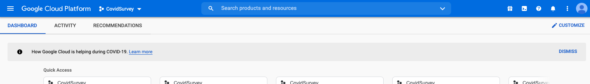

This code will show you how you can use the very simple google sheets API instead of a database to store the results of a phone survey designed in Python. In this demo, we will show how it could be used to create a COVID19 health survey that will gather and append the call SID, from number, to number, and the answers to each question to our google sheet. Before we review and explain the code needed for this task, we first need to set up our Google Sheet as well as the Google Cloud Platform. Don't worry, it's easier than you think!

What do I need to run this code?
--------------------------------

Find the full code on Github [here](https://github.com/signalwire/signalwire-guides/tree/master/code/python_phone_survey)  
You will need the [SignalWire Python SDK](/compatibility-api/sdks) as well as [Flask](https://flask.palletsprojects.com/en/2.0.x/installation/#install-flask) to handle the web framework. [gspread](https://docs.gspread.org/en/latest/), and
[oauth2client](https://pypi.org/project/oauth2client/) are all a part of our google sheets integration.

Additionally you will need a SignalWire account, which you can create [here](https://m.signalwire.com/signups/new?s=1). 
You will also need your SignalWire API credentials.
Find this information on the
[API Credentials page](https://my.signalwire.com?page=credentials)
page of your SignalWire Dashboard.

How to run this application
---------------------------

### Run this application natively

To run the application, execute export FLASK_APP=app.py then run flask run. We recommend using [ngrok](https://ngrok.com/) to expose your local server to the web. 

In your SignalWire space, you can [purchase a new phone number](/platform/phone-numbers/getting-started/buying-a-phone-number) (if you don't already have one). 
Next, create a new Resource from the Resources section from the sidebar, and select a Script. Choose type as cXML, and set the primary script to "External URL".
Input the URL that points to your server. In this case, you'd point to `https://<ngrok-id>.ngrok.app/survey/welcome`, as that's where your Flask server will be running.

<Frame>

</Frame>

Then, open the phone number settings and assign the resource you just created to handle calls. 

<Frame>

</Frame>

import NewLegacy from '/docs/main/_common/dashboard/_ui-accordion.mdx'

<NewLegacy />

<Accordion title="For Legacy UI">

 In your SignalWire Dashboard, you can purchase a phone number and edit its settings to direct calls to the Ngrok URL. The settings for your phone number of choice will look something like this:


</Accordion>

{/* You can use this application as both an inbound or outbound survey. 
To use this script as an inbound survey, expose it to the web (through a server or SSH tunnel) and use it as a webhook for handling incoming calls under phone number settings. 
For this script, you would use the server url and the `/survey/welcome` route, like this `http://myServer.fakeserver.com/survey/welcome`.

<figure>
  
</figure>

You may need to use an SSH tunnel for testing this code if running on your local machine. – we recommend [ngrok](https://ngrok.com/). You can learn more about how to use ngrok [here](/platform/basics/guides/technical-troubleshooting/how-to-test-webhooks-with-ngrok).  */}

Step by Step Walkthrough
------------------------

The github repository found [here](https://github.com/signalwire/signalwire-guides/tree/master/code/python_phone_survey) contains four files. The `readme` which does not impact our app.  
`sheets.py` is where we will configure our google sheets client, and set the sheet which we will write survey results to.  
`config.json.example` is an example file that you will replace with a `creds.json` file provided by google cloud.  
`CovidSurvey` is where our main app will live.

Configuration
-------------

Before running the application we have to get a few things set up.  
First we will set up Google Sheets and Google Cloud, and after we will set up our python script and routes.

### Configuring Google Sheets

The first step is that we will need to create a [google sheet](https://www.google.com/sheets/about/) for our results to be sent to. We will use the example Covid_Survey, but the name doesn't matter **AS LONG** as you make sure that the name you use in the survey matches the name you use in your python code. We need to first create headers for the survey in the google sheet form. Alternatively, you can push the headers to the google sheet form yourself in your code if you would like to. However, we want to show the most straightforward and easy way of accomplishing this goal. If you are following our example exactly, your google sheet should look like this. 


{/* <figure>  </figure> */}

### Configuring Google Cloud Platform

[Google Cloud Platform](https://cloud.google.com/) is next on the list of things to set up before we can use our Python script. Google Cloud Platform (GCP) offers a myriad of cloud computing services, but in this case what we need is the Google Sheets API so that our Python script can connect with the google sheet and send the necessary information. Sign into Google Cloud Platform with your google account and navigate to the home page. We will first begin by clicking the dropdown menu next to the Google Cloud Platform logo on the left side of the toolbar. On the example of my account that I'm sharing below, you can see the spot you need to click is called CovidSurvey. If you have created a project previously, you might see project name there. 



{/* <figure>
    
</figure> */}

Next, click **New Project** in the upper right hand corner of the pop up showing all projects. This will take you to the new project page. In my example, I chose to keep the names synonymous and named mine CovidSurvey. However, you're fully welcome to name this whatever you would like as long as it's something memorable and helpful for you. You can leave the organization as blank as this will not apply to us. Once the project is created, go back to the home page and make sure that your new project is selected in the dropdown that we clicked before. 

Next we need to add Google Drive and the Google Sheets API to this project. You can access all of the potential APIs and tools by clicking the hamburger menu in the upper left corner, hovering over **APIs & Services**, and clicking **Library**. Once you're in the **Library**, you can search for Google Drive in the search-bar. Click **Google Drive API**, which should be the top result returned. You can then click **Enable** in order to install the API within your project. 

Go back to the **Library** and search Google Sheets in the search-bar again. Click **Google Sheets**, which should be the top result returned. You can then click **Enable** in order to install the API within your project.

Once complete, go back to the home page and select the hamburger menu in the upper left hand corner again. This time, we need to hover over **APIs & Services** and click **Credentials** instead. Click the blue + button at the top that says **CREATE CREDENTIALS** next to it and choose the option **Help Me Choose**. 

You will need to answer a few questions, which are stated in bold and answered directly below. 

**What API are you using?**  
Google Drive API

**Where will you be calling the API from?**  
Web server (e.g. node.js, Tomcat) In our case, this will be Flask!

**What data will you be accessing?**  
Application Data

**Are you planning to use this API with App Engine or Compute Engine?**  
No, I'm not using them. 

We are almost at the very last step!

Next, click **What credentials do I need?** 

This will open the **Create a service account** section. Again, the name is completely up to you, but it's best to keep it consistent so that it doesn't get muddled later on. For service account name in this example, I chose **survey**. Enter your chosen name and press **Create**. 

In the next section, scroll down to the **Project** section under **All Roles** which will display some extra options on the right side. Select **Editor** here.  Make sure to select **JSON** as the key type and select continue. This should trigger a JSON file to be downloaded on your browser. 

Open the JSON file in a text editor and copy whatever the value of the `client_email` key is. Now we need to go back to the Google Sheet that was created, click on the **Share** button, paste the copied email address, assign the role of **Editor** to that email address, and click send! 

That's all there is to it, we're now done with the Google Cloud Platform part of this project! 

### Configuring the Code in Python

There are two different parts to this code, the main script for running the survey and the script for handling data. We will take each section one at a time and explain how they all work. 

#### Configuring the script for handling and writing the data to the spreadsheet

The only purpose of this script is to write the data to our spreadsheet. If you decided to name your spreadsheet something other than Covid_Survey like mine, this is where it could cause a problem. Make sure to replace the last line of this code with the identical name of your spreadsheet or the data will not push to Google Sheets. 

Make sure that the creds.json file that was downloaded in earlier steps is in the same folder as sheets.py and the main script. This script uses the creds.json file in order to verify that we have permission to use this API and update the spreadsheet. 

```python
from oauth2client.service_account import ServiceAccountCredentials
import gspread
import os

scope = ["https://spreadsheets.google.com/feeds","https://www.googleapis.com/auth/drive"]
creds = ServiceAccountCredentials.from_json_keyfile_name(os.getcwd() + "/creds.json", scope)
client = gspread.authorize(creds)
sheet = client.open("Covid_Survey").sheet1
```

#### Configuring the main script for running the survey

Before we start on the Flask routes, we need to create a Python dictionary called `answers` that will store each of the calls by using `CallSid` as the key and the array of answers as the value. We also need to define a function that will translate our responses into XML.

```python
answers = dict()

def toXML(resp):
    resp = Response(str(resp))
    resp.headers['Content-Type'] = 'text/xml'
    return resp
```

#### /survey/welcome

The first route that we need to create is our welcome route. This is the first thing that a customer will hear and where we append important data such as the `CallSid`.

We need to start by creating our first entry into our dictionary `answers` with `CallSid` as the key and an empty array as the value. We can then append the actual `CallSid `, `To` number, and `From ` number as our first entries into the array that will be inserted into our spreadsheet at the end of the call. This will make sure that each row of survey responses has some identifying data to distinguish who gave what response. 

We then need to initiate response and execute a `<Gather>` that will use `<Say>` to play a welcome message, accept an input, and move to the next route indicated in the `actionUrl`. You can read more about `<Gather>`  [here](/compatibility-api/cxml/voice/gather) and more about `<Say>` [here](pathname:///compatibility-api/cxml/voice/say).

```python
@app.route('/survey/welcome', methods=['POST'])
def description():
    answers[request.form['CallSid']]=[]
    answers[request.form['CallSid']].append(request.form['CallSid'])
    answers[request.form['CallSid']].append(request.form['To'])
    answers[request.form['CallSid']].append(request.form['From'])

    response = VoiceResponse()
    with response.gather(num_digits=1, action=url_for('question_one'), method='POST') as g:
        g.say(message="Thank you for taking our Covid Health survey before you arrive for your appointment. "
                      "Please press any number to get started.")
        return toXML(response)
```

The corresponding XML for this segment looks like this: 

```xml
<?xml version="1.0" encoding="UTF-8"?><Response><Gather action="/survey/question_one" method="POST" numDigits="1"><Say>Thank you for taking our Covid Health survey before you arrive for your appointment. Please press any number to get started.</Say></Gather></Response>
```

#### /survey/question_one

The next section is very simple! We will again initiate `response`, execute a `<Gather>`, and use `<Say>` to play a message. In this case, we will ask our first question and indicate to the user to press 1 for yes or 2 for no. 

```python
@app.route('/survey/question_one', methods=['POST'])
def question_one():
    response = VoiceResponse()
    with response.gather(num_digits=1, action=url_for('question_two'), method="POST") as g:
        g.say('Question one. In the last 14 days, have you traveled by plane inside or outside of the United States? '
              'Please press 1 for yes or 2 for no.')
        return toXML(response)
```

The corresponding XML for this segment looks like this: 

```xml
<?xml version="1.0" encoding="UTF-8"?><Response><Gather action="/survey/question_two" method="POST" numDigits="1"><Say>Question one. In the last 14 days, have you traveled by plane inside or outside of the United States? Please press 1 for yes or 2 for no.</Say></Gather></Response>
```

#### /survey/question_two

Our `<Gather>` in the previous question expects 1 digit (1 for yes or 2 for no) and sends that to the route indicated in the action URL, which is question two. In this next segment, we use `request.form['Digits']` in order to get the digits pressed and record them in `digit`. This will be happening in each of the following questions so that the previous answer can be recorded in our array. We use simple if else logic to indicate that if the answer is 1, we need to append yes and if the answer is 2, we need to append no. It's important to account for errors, so if the user presses anything else, we will append unclear. We then repeat the format from earlier in order to pose our next question. This route is identical to the other three save for only the question itself, so we will not show all routes here. 

```python
@app.route('/survey/question_two', methods=['POST'])
def question_two():
    digit = request.form['Digits']
    if digit == '1':
        answers[request.form['CallSid']].append('Yes')
    elif digit == '2':
        answers[request.form['CallSid']].append('No')
    else:
        answers[request.form['CallSid']].append('Unclear.')
    response = VoiceResponse()
    with response.gather(num_digits=1, action=url_for('question_three'), method="POST") as g:
        g.say('Question two. In the last 14 days, have you been in close contact with someone who had '
              'COVID or has since contracted COVID? Please press 1 for yes or 2 for no. ')
        return toXML(response)
```

The corresponding XML for the above section looks like this: 

```xml
<?xml version="1.0" encoding="UTF-8"?><Response><Gather action="/survey/question_three" method="POST" numDigits="1"><Say>Question two. In the last 14 days, have you been in close contact with someone who had COVID or has since contracted COVID? Please press 1 for yes or 2 for no. </Say></Gather></Response>
```

#### /survey/end_survey

This last section is **slightly** different, but not by much! We will again request the digits pressed, but since we are asking for age and not a yes or no question, we will simply append the digits pressed to our array. This will constitute the last column of our spreadsheet. After that, we finally use `sheets.py` which we imported as `sheet`. We use `sheet.insert_row(answers[request.form['CallSid']], 2)` in order to insert our dictionary value with key `CallSid` into the spreadsheet. We insert it into the second row because the first row contains our headers. We then use `answers.pop(request.form['CallSid'])` to remove the key value pair from our dictionary. Lastly, we play a thank you message for our recipients to thank them for taking our survey! 

```python
@app.route('/survey/end_survey', methods=['POST'])
def end_survey():
    digit = request.form['Digits']
    answers[request.form['CallSid']].append(digit)
    sheet.insert_row(answers[request.form['CallSid']], 2)
    answers.pop(request.form['CallSid'])
    response = VoiceResponse()
    response.say('Thank you for taking this survey. Your responses will be sent to our office. You may press the # key '
                 'at any time in order to end the call. Have a great day!')
    return toXML(response)
```

#### Outbound survey

To use this script as an outbound survey, call the Create Call API and use the webhook to this script as the Url, like in the cURL example below: 

```bash
curl https://example.signalwire.com/api/laml/2010-04-01/Accounts/{ProjectSid}/Calls.json \
  -X POST \
  --data-urlencode "Url=http://myServer.fakeserver.com/survey/welcome" \
  --data-urlencode "To=+13105678901" \
  --data-urlencode "From=+13103384645" \
  -u "YourProjectID:YourAuthToken"
```

Wrap Up.
--------

This guide will take you through the set-up process for google sheets and google cloud API, as well as how SignalWire's python SDK can be used alongside Flask to create a powerful survey application that can be integrated into an inbound or outbound callflow.

### Resources

[Github](https://github.com/signalwire/signalwire-guides/tree/master/code/python_phone_survey)  
[SignalWire Python SDK](/compatibility-api/sdks)
[Flask](https://flask.palletsprojects.com/en/2.0.x/installation/#install-flask)  
[gspread](https://docs.gspread.org/en/latest/)  
[oauth2client](https://pypi.org/project/oauth2client/)

Sign Up Here
------------

If you would like to test this example out, [create a SignalWire account and Space](https://m.signalwire.com/signups/new?s=1).

Please feel free to reach out to us on our [Community Discord](https://discord.com/invite/F2WNYTNjuF) or create a Support ticket if you need guidance!
