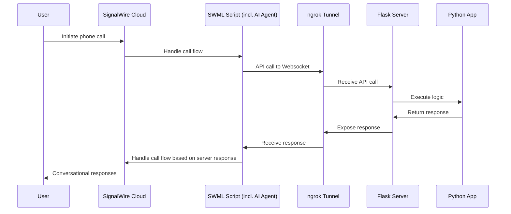
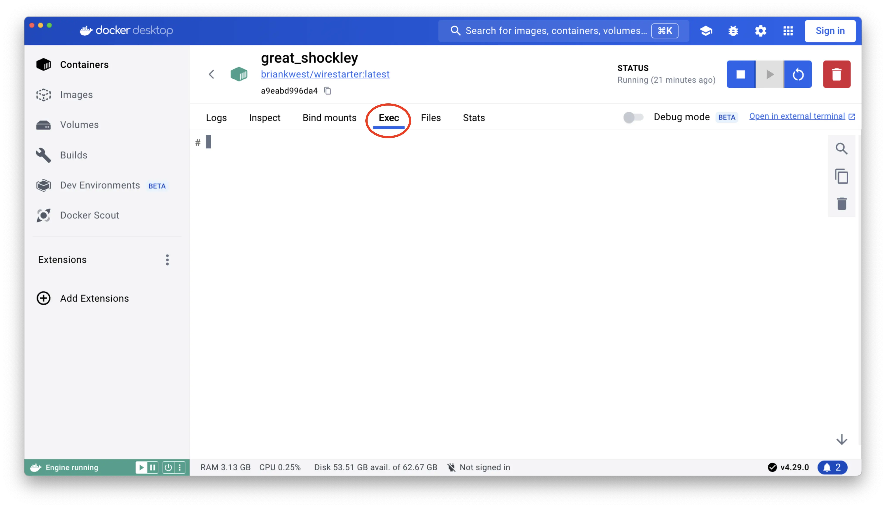
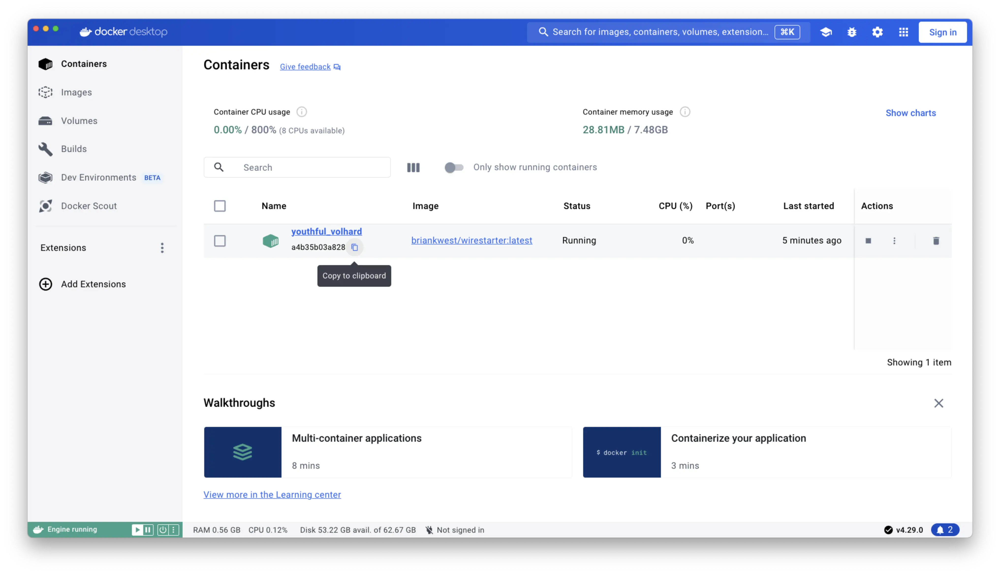

# From Small Biz to Smart Biz with AI

<div class="hero hero--primary">
  <div class="container">
    <h1 class="hero__title">⚡️ LIVEWire Developer Docs</h1>
    <p class="hero__subtitle">Deploy an AI-powered voice agent with server logic to a phone number</p>
    <p>The companion developer guide to the LIVEWire event Wednesday May 8th, 2024 11:00am PT / 2:00pm ET</p>
    <div>
      <a class="button button--secondary button--lg" href="https://signalwire.com/livewire/transforming-from-small-biz-to-smart-biz-using-ai?_gl=1*jqj72j*_up*MQ..&gclid=CjwKCAiAuNGuBhAkEiwAGId4alFpk96mwIHmiyy66MrUQs5sOo9_Vo4R8Y8Y1zxStAfjUGGffipsyxoCklcQAvD_BwE&x-craft-preview=4uEStzxqR4&_gl=1*u51t3b*_up*MQ..&gclid=CjwKCAiAuNGuBhAkEiwAGId4alFpk96mwIHmiyy66MrUQs5sOo9_Vo4R8Y8Y1zxStAfjUGGffipsyxoCklcQAvD_BwE&utm_source=google&utm_medium=ads&utm_campaign=us_search_brand&utm_content=brand&utm_term=signalwire%20ai&gad_source=1&gclid=CjwKCAiAuNGuBhAkEiwAGId4alFpk96mwIHmiyy66MrUQs5sOo9_Vo4R8Y8Y1zxStAfjUGGffipsyxoCklcQAvD_BwE" target="_blank">Event Information</a>
    </div>
  </div>
</div>

<br/>

This demo guides you through installing and setting up the WireStarter Docker container, 
configuring it with SWSH (the SignalWire Interactive Shell), 
and connecting a SWML Script to a Python application running a local server to handle logic. 
The server is Flask and it’s exposed to the SWML Script via an ngrok tunnel.

**At the end of the demo, you'll be able to call your SignalWire phone number 
and speak with an AI agent that communicates back and forth with your new server to make decisions.**


### 📖 Definitions

 - [**WireStarter:**](/tools/wirestarter/) A Docker container that simplifies the setup of SignalWire SDKs and development environments.
 - [**SWSH (SignalWire interactive SHell):**](/tools/swsh/) A command line utility built in to WireStarter that interfaces with SignalWire APIs.
 - [**SWML (SignalWire Markup Language):**](/swml) A hybrid markup and scripting language for writing RELAY applications (realtime interacative communication applications using Websockets) using simple statements in YAML or JSON.
 - [**SWML Script:**](https://my.signalwire.com?page=relay-bins) A cloud execution solution for hosting and running SWML in "bins" on your SignalWire Dashboard.
 - [**Flask:**](https://flask.palletsprojects.com/en/3.0.x/) A Python web application framework for Python, used here for our server.
 - [**ngrok:**](https://ngrok.com) A tunneling service used here to create a secure tunnel from our local Flask server to the SWML Script.

### 🏗️ Application Structure



### 📋 Prerequisites

<div class="row">
    
    <div class="col col--8">

        Before getting started, please make sure you have the following prerequisites.

        - Sign up for a free [SignalWire Space](https://signalwire.com/signup)
        - Install [Docker Desktop](https://www.docker.com/products/docker-desktop/)
        - Buy a [SignalWire Phone Number](/platform/phone-numbers/getting-started/buying-a-phone-number)
        - Create a free [ngrok account](https://ngrok.com/)

        Everything else you need is built into WireStarter.

    </div>

    <div class="col col--4">

:::tip Extra Credit
Ask SignalWire staff for a promo code to elevate your account out of Trial status and add extra credit to your account.
:::

    </div>

</div>

## **1. 🔌 Set up WireStarter** {#wirestarter}

WireStarter is a Docker container which sets up the SignalWire SDKs and builds a development and testing environment for new developers.

:::info Fresh Install
WireStarter has been updated recently. 
If you've used WireStarter before, be sure to delete the previous version and reinstall the latest version of the container.
:::

1. **Open Docker Desktop**

Docker Desktop must be running at the start of the process.

2. **Install and Run WireStarter**

Run the following command from your system terminal to download and install the WireStarter Docker Container.

```bash
docker run -it -d --rm --name wirestarter briankwest/wirestarter:latest
```

If you already have the latest version of WireStarter installed, 
you can also start it from the **Images** window in Docker Desktop.

3. **Start and Configure SWSH**

Now that WireStarter is installed and running, we will start [SWSH (the SignalWire Interactive Shell)](/tools/swsh/) in the Container.

SWSH will ask for your 
SignalWire Space ID, 
SignalWire Project ID, 
SignalWire Project Token, 
ngrok Token, and 
ngrok Args (most users should leave ngrok Args blank).
Make sure you have that information handy by opening the 
SignalWire ['tokens' page](https://my.signalwire.com?page=credentials) 
and the ngrok ['Your Authtoken' page](https://dashboard.ngrok.com/get-started/your-authtoken).

Switch over to Docker Desktop, and open the running WireStarter container.
Click on the `Exec` tab to open the integrated terminal.



In that tab, run the following command to start SWSH:

```bash
exec bash
```

{/*Placeholder for screenshot*/}

After you enter your authentication information, SWSH will automatically open an NGROK Tunnel
and display the NGROK Tunnel URL in the integrated terminal output.
Save this URL - we'll need it in the next step!

<figure>
    
    <figcaption>SWSH running in the integrated terminal of the WireStarter Docker container, with the NGROK Tunnel URL shown highlighted.</figcaption>
</figure>

:::danger Keep WireStarter open
If the WireStarter container is stopped and restarted, NGROK will generate a new tunnel URL.
To avoid reentering this URL in the SWML script (as shown in the following step),
keep the WireStarter container running throughout the demo.
:::

## **2. 📜 Create the SWML Script**

The call flow will be handled by a 
[SWML (SignalWire Markup Language)](/swml) Script, 
which itself seeks logic from the websocket we will host locally using Flask.

To create a SWML Script, navigate to the **Relay / SWML** page of your SignalWire Dashboard.

On that page, select the **SWML Scripts** tab as shown in the below screenshot.

<figure>
    
    <figcaption></figcaption>
</figure>

Click **Create a SWML Script**.
Name the Script "`vicky`", and 
copy and paste the following SWML into the text box labeled `SWML`.

```json
{
   "version" : "1.0.0",
   "sections" : {
      "main" : [
         {
            "ai" : {
               "prompt" : {
                  "top_p" : 0.3,
                  "text" : "Hello, I'm Vickey a virtual assistant.",
                  "temperature" : 0.3
               },
               "post_prompt" : {
                  "text" : "Summarize the conversation"
               },
               "SWAIG" : {
                  "functions" : [
                     {
                        "argument" : {
                           "type" : "object",
                           "properties" : {
                              "phone" : {
                                 "description" : "The users phone number in e164 format",
                                 "type" : "string"
                              },
                           }
                        },
                        "function" : "whats_up",
                        "purpose" : "When users ask what's up brother"
                     },
                     {
                        "argument" : {
                           "type" : "object",
                           "properties" : {
                              "phone" : {
                                 "description" : "The users phone number in e164 format",
                                 "type" : "string"
                              },
                           }
                        },
                        "function" : "whats_day",
                        "purpose" : "When users ask what day it is"
                     }
                  ],
                  "defaults" : {
                     "web_hook_url" : [NGROK_TUNNEL_HOST]/swaig
                  }
               },
               "languages" : [
                  {
                     "voice" : "nova",
                     "name" : "English",
                     "code" : "en-US",
                     "engine" : "openai"
                  }
               ]
            }
         }
      ]
   }
}
```

Replace `[NGROK_TUNNEL_HOST]` with the actual NGROK Tunnel URL generated in the previous step.
Append `/swaig` to the end of the URL.
The complete `web_hook_url" should look like this:

```
...
"defaults" : {
    "web_hook_url" : "https://1234-56-78-901-23.ngrok-free.app/swaig"
}
...
```

After saving the SWML Script, navigate to the **Phone Numbers** page of your SignalWire Dashboard.
Select the number you wish to use for this demo.

Click **Edit Settings**. Set "Handle Calls Using" to "**a SWML Script**",
and select the "vicky" SWML Script using the drop-down menu.

## **3. 🐍 Create project directories and copy in the Python app**

In this step, we will download our server Python application and set it up to run within the WireStarter container.
This app includes logic which our SWML Script will trigger via HTTP requests to its websocket connection.
The Python app uses Flask to create a local server on the WireStarter container,
which WireStarter in turn exposes to the NGROK Tunnel URL.

Copy the below Python code and save it as `app.py` in your Downloads folder.
Alternatively, download `app.py` directly using the button below.

```python
from flask import Flask, jsonify, request
import json
app = Flask(__name__)

@app.route('/swaig', methods=['POST'])
def swaig():
    request_data = request.get_json()
    print("Received request data:\n", json.dumps(request_data, indent=4))

    response_message = {"response": "Tell the user: special teams, special plays, special players" }
    print("Response data:\n", json.dumps(response_message, indent=4))
    return jsonify(response_message)

if __name__ == '__main__':
    app.run(debug=True)
```

<a download href='/attachments/app.py' class="button button--primary">Download app.py</a>

<br/><br/>

Return to the integrated terminal in the running WireStarter Docker Container.

Enter `exit` once to exit SWSH.

Navigate to the root of the container using `cd /`.
Then, run the following command to create a folder named `livewire` within `workdir` in the container:

```bash
mkdir /workdir/livewire
```

Return to your system terminal, and navigate to your Downloads folder.

Copy the container ID from the Containers view in Docker Desktop.



Finally, run the following command **in your system terminal** to copy `app.py` into `/workdir/livewire/` within the WireStarter container.
Replace `[container-id]` with the WireStarter container ID from Docker Desktop.

```bash
docker cp app.py [container-id]:/workdir/livewire/
```

<figure>
    
    <figcaption>Copying `app.py` into `/workdir/livewire/` in the WireStarter container using the Docker CLI.</figcaption>
</figure>


## **4. 🚀 Run and test the application**

1. **Run `app.py`**

Return to the Docker integrated terminal.
From the root of the container filesystem, run the Python application using the below command:

```bash
python3 /workdir/livewire/app.py
```

Alternatively, you can navigate to `/workdir/livewire/` and run `python3 app.py`.

<figure>
    
    <figcaption>`app.py` running inside the WireStarter container. Flask has started and is running on a local address.</figcaption>
</figure>

2. **Dial the phone number**

We did it!

The application should now be ready to test.
Using your cell phone or softphone,
dial the phone number you assigned to the SWML Script back in Step 2.
Vicky will answer.

3. **Test the server logic**

Our demo Python app is set up with very minimal logic - that's where your creativity comes in!

To make sure the SWML Script is correctly contacting our server, ask Vicky "what day is it?" or "what's up, brother?"

If Vicky responds, "special teams, special plays, special players," you know the demo is working.

Congratulations!

## 🧰 Troubleshooting

- **Vicky says something isn't available and nothing shows up in the Docker integrated terminal logs**

This occurs when the SWML Script is unable to reach the websocket.

This often occurs when the NGROK url is incorrect, so first,
check it for typos.
If you have stopped and restarted the WireStarter container,
you'll need to update the `"web_hook_url"` in the SWML Script with the new NGROK Tunnel URL,
as this regenerated on container restart.

- **The Python app sends 404 responses (seen in the Docker logs) when Vicky contacts the Python app**

This occurs when the NGROK tunnel URL is correctly set in the SWML script, but it is missing the `/swaig` path.

---

##### Made with ❤️ by SignalWire's DevEx team {#devex}

*Have feedback on this site? 
Drop us a line at devex@signalwire.com 
or say hi on the [Community Discord](https://discord.com/invite/F2WNYTNjuF).*