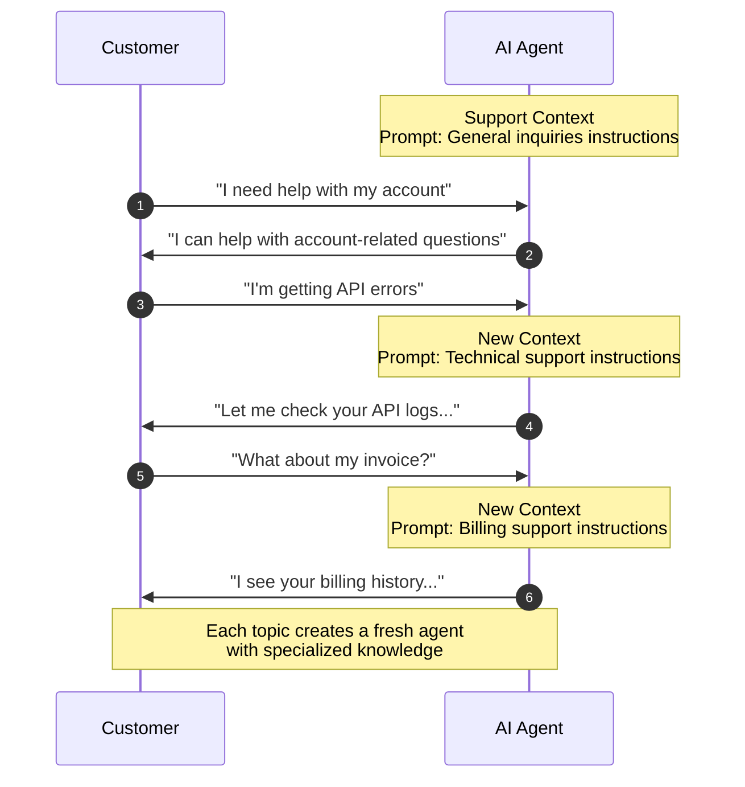

```mermaid
sequenceDiagram
    autonumber
    participant C as Customer
    participant A as AI Agent
    
    Note over A: Support Context<br/>Prompt: General inquiries instructions
    C->>A: "I need help with my account"
    A->>C: "I can help with account-related questions"
    C->>A: "I'm getting API errors"
    Note over A: New Context<br/>Prompt: Technical support instructions
    A->>C: "Let me check your API logs..."
    C->>A: "What about my invoice?"
    Note over A: New Context<br/>Prompt: Billing support instructions
    A->>C: "I see your billing history..."
    Note over C,A: Each topic creates a fresh agent<br/>with specialized knowledge
```