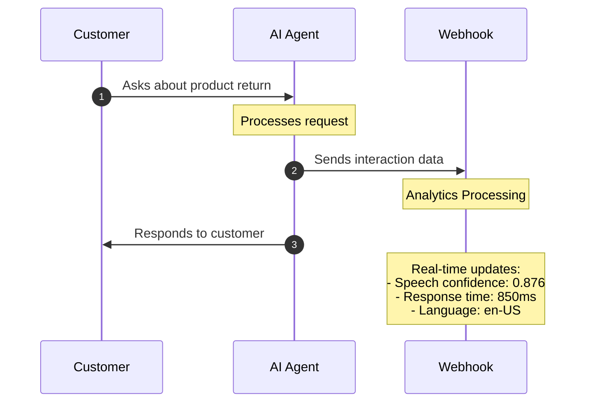
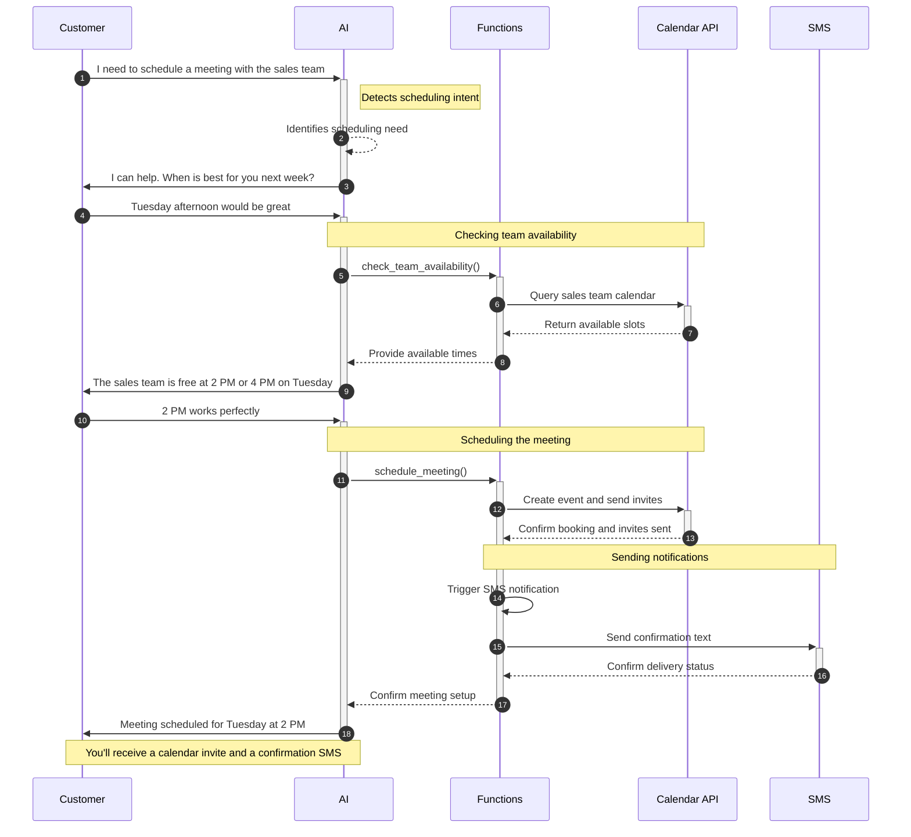
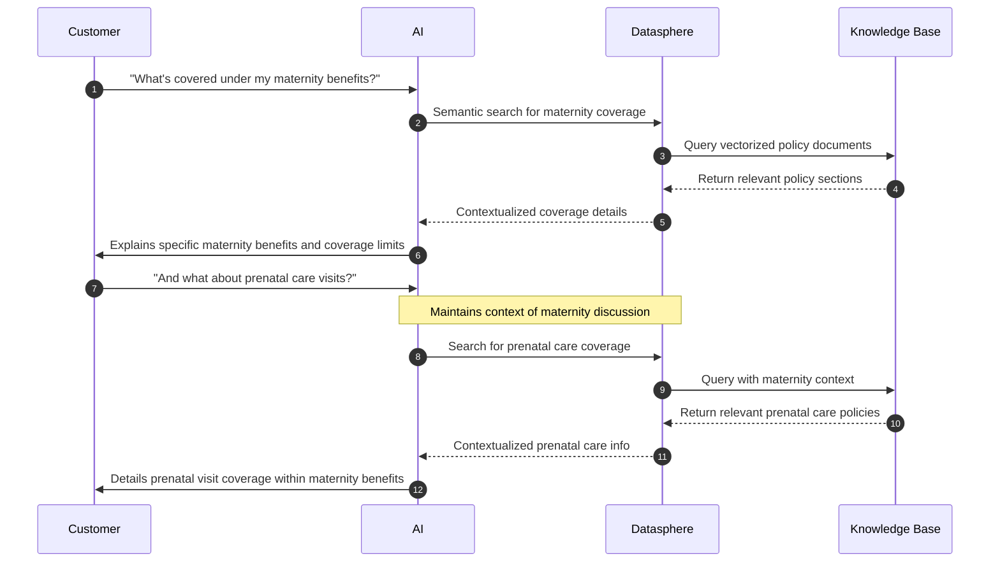

import TraditionalIVRFlow from './_mermaid/traditional-ivr-flow.mdx';
import AIVRFlow from './_mermaid/ai-ivr-flow.mdx';
import TraditionalSupportFlow from './_mermaid/traditional-support-flow.mdx';
import AISupportFlow from './_mermaid/ai-support-flow.mdx';

## Introduction

SignalWire's AI platform is a unified system for building and deploying conversational AI solutions.
The platform delivers a comprehensive suite of capabilities that work together seamlessly. 
At its core, it provides a single platform for orchestrating voice, video, and messaging channels, complemented by native integrations
with leading LLM, Text-to-Speech, and Speech-to-Text providers. The system is built on serverless functions that execute with minimal
latency during live conversations, supported by a multi-threaded architecture for parallel, asynchronous function execution. 
With a global edge network featuring points of presence in every major region and enterprise-grade security, compliance, logging and analytics,
the platform ensures reliable and secure operations worldwide.

---

## Core capabilities

### Voice technology

SignalWire's voice technology provides comprehensive control over how your AI agents sound and understand speech. 
The platform enables you to select from multiple Text-to-Speech providers and fine-tune voice parameters to perfectly match your brand identity.
Natural speech <Tooltips tip="A user can define what words or phrases to say during pauses in the conversation. These pauses can occur from function calls or speech down time.">fillers</Tooltips>
maintain smooth conversation flow during processing pauses, while real-time audio processing handles noise filtering and accent variations
with precision.

### Conversation intelligence

SignalWire AI revolutionizes how agents handle complex conversations. Unlike traditional IVR systems that follow rigid
decision trees, our AI agents operate with natural fluidity. They excel at maintaining their assigned role while juggling multiple
conversation threads, seamlessly interfacing with backend systems without breaking natural dialogue flow. 
Perhaps most importantly, they can handle unexpected topic changes without losing context, ensuring a more human-like interaction.

The below diagrams illustrate how a customer might schedule a medical appointment using a conventional IVR ("interactive voice response", left), compared to using a SignalWire AI Agent (right).


<PreviewCardGroup columns={2}>
  <PreviewCard title="Traditional IVR Flow" description="A detailed diagram of a traditional IVR system.">
    <TraditionalIVRFlow />
  </PreviewCard>
  <PreviewCard title="AI IVR Flow" description="A detailed diagram of an AI-powered IVR system.">
    <AIVRFlow />
  </PreviewCard>
</PreviewCardGroup>


For example, when a caller asks "What about the premium version?", the AI understands this refers to a product discussed
earlier in the conversation. This context awareness extends across different topics and requests within the same interaction, allowing for natural conversation
flows like:

"I'd like to schedule an appointment" → "What time works for you?" → "Actually, before we do that, what's your cancellation policy?"

The AI handles these context switches seamlessly while maintaining the original intent to schedule an appointment.

### Dynamic context switching

One powerful way to structure conversations is through <Tooltips tip="Contexts are specialized topics or roles that an AI agent can handle. Each context has its own specialized prompt, fresh conversation memory, and its own steps to follow through the conversation.">
contexts</Tooltips>. Instead of transferring callers between departments like a traditional system, your AI agent can switch context internally
to handle different topics & requests within the same conversation.

Each context operates as an independent entity with its own specialized prompt, fresh conversation memory, 
and focused expertise in areas such as technical support, billing, or sales. This independence is maintained through strict information
boundaries that ensure clear separation between different roles.

This sophisticated approach enables several key benefits. The system can intelligently route each task to the most appropriate specialized context
while controlling information flow between contexts. It maintains natural conversation flow during role transitions and implements
robust security boundaries for sensitive operations. The result is a system that delivers specialized knowledge within appropriate contexts,
prevents information bleed between different roles, and maintains clear compliance and security boundaries while delivering purpose-built
responses for each domain.

For example, when a customer moves from technical support to billing questions, the AI swaps context to focus solely on financial
matters, leaving technical details in the previous context. This isolation maintains security while ensuring each
interaction benefits from specialized expertise.

Below is an example of a context switch in a customer support scenario for both a traditional IVR and a SignalWire AI Agent.

<PreviewCardGroup columns={2}>
  <PreviewCard title="Traditional Support Flow" description="A detailed diagram of a traditional IVR system.">
    <TraditionalSupportFlow />
  </PreviewCard>
  <PreviewCard title="SignalWire AI Flow" description="A detailed diagram of an AI-powered IVR system.">
    <AISupportFlow />
  </PreviewCard>
</PreviewCardGroup>


### Real-time analytics and monitoring

The platform provides comprehensive analytics to understand and optimize your AI agents' performance. 
It continuously captures vital metrics including conversation flow and role adherence, speech recognition accuracy, response timing and latency,
voice quality metrics, and integration performance. This wealth of data flows through a robust webhook system that enables
real-time conversation monitoring, performance metric tracking, human supervision when needed, and ongoing agent behavior optimization.

Here's how this works in a customer support scenario:



#### Webhook data and metrics

Here's an example of the data you receive during an AI interaction:

```json
{
  "call_info": {
    "project_id": "b08dacad...",
    "content_type": "text/json",
    "call_id": "b3f4e4e1..."
  },
  "conversation_add": {
    "role": "assistant",
    "content": "...",
    "lang": "en-US",
    "tokens": 53,
    "latency": 836,
    "utterance_latency": 934,
    "audio_latency": 1106
  },
  "webhook_reply": {
    "status": "OK",
    "request_id": "341de258...",
    "parameters": {
      "query": "...",
    },
    "data": {...}
  }
}
```


#### Management tools

The real-time data enables powerful management capabilities across three key areas:

- **Live Monitoring and Supervision:**
The platform provides comprehensive real-time monitoring of high-value interactions, with intelligent alerting for critical situations and seamless intervention capabilities when human assistance is required.

- **Performance Optimization:**
Continuous performance improvement is achieved through AI behavior adjustments based on metrics, dynamic routing rule updates, and refined response pattern optimization.

- **Quality Assurance:**
The system maintains high service standards by quickly identifying and resolving issues, ensuring compliance requirements are met, and maintaining consistent service quality metrics.


---

## Integration & architecture

### External service integration

SignalWire AI connects with your business systems through its function framework. When your agent needs to perform an action - like checking inventory or booking an appointment - it can call functions that interact with your databases and services while keeping the conversation natural.

Here's an example of scheduling a meeting:



The process works like this:

1. Your agent recognizes when a request needs external data or actions
2. It calls the appropriate function
3. The function handles the technical work with your systems
4. Your agent incorporates the results naturally into the conversation

This lets you automate complex processes without exposing the technical details to your users.

### SignalWire's RAG stack integration - Datasphere

[Datasphere](/rest/signalwire-rest/endpoints/datasphere/documents) serves as SignalWire's built-in knowledge integration system, providing AI agents with seamless access to your organization's information.
The system excels at finding and utilizing relevant information during conversations, ensuring responses remain accurate and current by drawing from your latest documentation. 
Every answer is backed by official documentation, providing confidence and reliability in every interaction.

Here's an example of how it works in practice:



The system offers several key advantages:

- **Always Current:** Your agents automatically use the latest information as you update your documentation

- **Smart Information Use:** 
  - Combines conversation context with document searches
  - References specific sources
  - Maintains natural dialogue while using detailed info

- **Flexible Organization:**
  - Tag documents for easy finding
  - Choose how to break up information
  - Search using natural language

- **High Accuracy:**
  - Grounds responses in your actual documents
  - Provides sources for information
  - Keeps responses consistent

To learn more about using Datasphere, see our [Use Datasphere with curl](/rest/signalwire-rest/guides/datasphere/curl-usage) guide.


---

## Real-world applications

### Customer service

SignalWire AI transforms the customer service experience by creating intelligent agents that deliver comprehensive support capabilities. These agents are designed to handle complex, multi-step inquiries while maintaining contextual awareness throughout the conversation. They seamlessly integrate with your knowledge base to provide accurate, consistent answers and can connect to your backend systems for real-time problem resolution. When situations require human expertise, the system smoothly facilitates transfers to human agents, ensuring no context is lost in the process.

### Process automation

The platform excels at automating multi-step processes while maintaining natural, fluid interactions. In appointment scheduling scenarios, for example, the AI demonstrates sophisticated capabilities in understanding complex time and date requests, managing multiple calendar systems simultaneously, and handling schedule conflicts with grace. The system proactively sends confirmations and can accommodate changes when needed, all while maintaining a natural conversation flow that feels effortless to the user.

---

## Security and compliance

SignalWire's AI platform incorporates a comprehensive security framework that includes encrypted communications, sophisticated PII detection and protection mechanisms, and dedicated compliance tools for HIPAA and GDPR requirements. The system maintains detailed audit logging capabilities and granular access controls and permissions, enabling you to automate sensitive communications while maintaining strict regulatory compliance.
