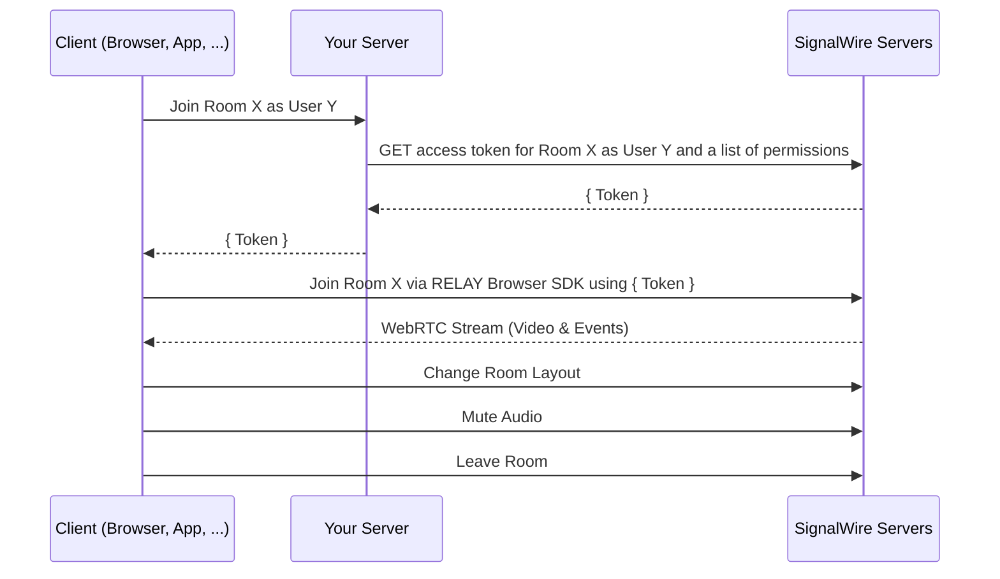

# Making a Zoom Alternative

In this guide, we are going to make a Zoom-like video conferencing system using React, SignalWire APIs, SDKs and other tools.

:::info

The full source code for this project is available on [GitHub](https://github.com/signalwire/browser-videoconf-full-react).

:::

We will use:

1. [The SignalWire Video SDK](/sdks/browser-sdk/video) will run in the client's browser.
   It handles the cameras, the microphones, communication with
   the SignalWire servers, and with other members in the conference. We will also use this SDK to display the video stream in the browser.

2. We will use the [SignalWire REST APIs for Video](/rest/signalwire-rest/endpoints/video/create-room)
   to provision rooms and access tokens for your conference members from the SignalWire server. SignalWire REST
   APIs are only available on your server, as they require your SignalWire API tokens to operate which shouldn't be exposed client-side.

3. We will use [React library from SignalWire Community](https://github.com/signalwire-community/react) to handle the integration between the SDK and React.

We will be using [Next.js](https://nextjs.org/) for convenience and brevity, but you should be able to use any React framework to
write the frontend and any server-side framework to write the backend. We will use the [React Bootstrap](https://react-bootstrap.github.io)
framework to make a neat layout without too much boilerplate.

:::tip

If you are looking for something far simpler to quickly embed on your existing page, please use the [Embeddable Video Room](/video/conference) widget instead.

:::

## Setting Up the project

Our starting point will be the Next.js boilerplate on which we will install the packages discussed above:

```bash
yarn create next-app --typescript
cd <your app name>
yarn add @signalwire-community/react
yarn add bootstrap react-bootstrap react-bootstrap-icons swr axios
```

## Backend

While most of the work with respect to capturing and displaying media in the conference happens client-side, you do still need
a server to securely proxy the SignalWire REST API. The client SDK needs a token be able to access the SignalWire servers
hosting the conference. Your server can query for this token using SignalWire REST API, given that you have the API credentials.

Note that this is not the server where all the video streaming and processing happens. All those complex tasks will be handled
by powerful SignalWire servers elsewhere. The figure below illustrates how all parts fit.

<figure>



  <figcaption>
    Diagram of the interaction between the client, your server, and SignalWire.
  </figcaption>
</figure>

In a production setting, your server should authenticate your users, manage their permissions, get appropriate tokens for members
and relay the tokens from the SignalWire's Video REST APIs to the client's browser.

The following code will create a new endpoint at `/api/token`, which will query SignalWire and serve tokens given at least a valid
`room_name`. It also takes additional `user_name` and `mod` parameters. The `user_name` parameter simply sets the display name
for the user requesting the token. The `mod` parameter (short for "moderator" in this case) selects between the two sets of
permissions defined in `permissions.ts` which can be assigned to the user.

Note that the location of this file ensures that this will run server-side at `api/token` endpoint.
Learn more about Next.js routing [here](https://nextjs.org/docs/routing/introduction).


<Tabs>
<TabItem value='token.ts'>

```tsx title="pages/api/token.ts"
import axios from "axios";
import { FULL_PERMISSIONS, GUEST_PERMISSIONS } from "../../data/permissions";

const AUTH = {
  username: process.env.PROJECT_ID as string,
  password: process.env.API_TOKEN as string,
};
const SPACE_NAME = process.env.SPACE_NAME as string;

export default async function handler(req: any, res: any) {
  const { room_name, user_name, mod } = req.query;

  if (room_name === undefined) return res.status(422).json({ error: true });

  try {
    const tokenResponse = await axios.post(
      `https://${SPACE_NAME}.signalwire.com/api/video/room_tokens`,
      {
        room_name,
        user_name,
        enable_room_previews: true,
        permissions: mod === "true" ? FULL_PERMISSIONS : GUEST_PERMISSIONS,
      },
      { auth: AUTH } // pass {username: project_id, password: api_token} as basic auth
    );
    const token = tokenResponse.data.token;

    if (token !== undefined) res.json({ token, error: false });
    else res.status(400).json({ error: true });
  } catch (e) {
    res.status(400).json({ error: true });
  }
}
```

</TabItem>
<TabItem value='permissions.ts'>

```tsx title="data/permissions.ts"
export const FULL_PERMISSIONS = [
  "room.hide_video_muted",
  "room.show_video_muted",
  "room.list_available_layouts",
  "room.playback",
  "room.recording",
  "room.set_layout",
  "room.set_position",
  //Members
  "room.member.audio_mute",
  "room.member.audio_unmute",
  "room.member.deaf",
  "room.member.undeaf",
  "room.member.remove",
  "room.member.set_input_sensitivity",
  "room.member.set_input_volume",
  "room.member.set_output_volume",
  "room.member.video_mute",
  "room.member.video_unmute",
  "room.member.set_position",
  //Self
  "room.self.additional_source",
  "room.self.audio_mute",
  "room.self.audio_unmute",
  "room.self.deaf",
  "room.self.undeaf",
  "room.self.screenshare",
  "room.self.set_input_sensitivity",
  "room.self.set_input_volume",
  "room.self.set_output_volume",
  "room.self.video_mute",
  "room.self.video_unmute",
  "room.self.set_position",
];

export const GUEST_PERMISSIONS = [
  //Members
  "room.member.remove",
  //Self
  "room.self.additional_source",
  "room.self.audio_mute",
  "room.self.audio_unmute",
  "room.self.deaf",
  "room.self.undeaf",
  "room.self.screenshare",
  "room.self.set_input_sensitivity",
  "room.self.set_input_volume",
  "room.self.set_output_volume",
  "room.self.video_mute",
  "room.self.video_unmute",
  "room.self.set_position",
];
```

</TabItem>
</Tabs>

:::tip

In a production setting, you would want this endpoint to be behind an authentication middleware to make sure only
your intended users can use it. For Next.js, an easy addition would be [next-auth](https://next-auth.js.org/).

You might also want to check if the users requesting mod permissions have the authorization to actually do so in your
system.

:::

To quickly go over various parts of this code:

1. The constants `FULL_PERMISSIONS` and `GUEST_PERMISSIONS` are arrays of strings representing the permissions given to the user. So
   while `FULL_PERMISSIONS` might look like `[..., 'room.member.video.mute', 'room.member.remove', ...]`, `GUEST_PERMISSIONS` would
   look like `[..., 'room.self.video.mute']`, indicating that guest is not allowed to mute or remove any other user.

   SignalWire offers a flexible permission system so you can give users all combination of permissions as required.
   Permissions are described [here](/rest/signalwire-rest/overview/permissions).

2. The constant `AUTH` is a structure that assigns your SignalWire Project ID as the username, and the API token as password.
   You will find the Project ID and API token at your SignalWire Dashboard ([explained here](/video/getting-started/simple-video-demo#obtaining-your-api-key-and-project-id)). We will use this for [basic auth](https://en.wikipedia.org/wiki/Basic_access_authentication) to authenticate with the SignalWire REST API.

   The constant `SPACE_NAME` is your SignalWire username which you also use as the subdomain to access your Dashboard.

3. We perform an HTTP POST request using Axios to the [room_tokens](/rest/signalwire-rest/endpoints/video/create-room-token) endpoint.
   We will send the name of the room, the name of the user, and the array of permissions for the user to this endpoint.
   We will also give axios the Project ID and the API token to be encoded as basic authentication header.

   If all goes well, the SignalWire server will send us a token that we can forward to the client.

<Frame caption="Testing the `/api/token` endpoint with Thunder Client">
  
</Frame>

This simple backend will suffice to be able to conduct video conferences. But we will have one more endpoint to add here
to support room previews.

## Frontend

We will rely heavily on the SignalWire Community React library ([@signalwire-community/react](https://www.npmjs.com/package/@signalwire-community/react)) to write the frontend.

### Basic Video Feed

Consider the following piece of code.

```tsx title="pages/rooms/[roomName]/index.ts"
// other imports
import { Video } from "@signalwire-community/react";

export default function Room() {
  const router = useRouter();
  const { roomName, userName, mod } = router.query;
  const [roomSession, setRoomSession] = useState<any>();

  const { data: token } = useSWRImmutable(
    roomName !== undefined
      ? `/api/token?room_name=${roomName}&user_name=${userName}&mod=${mod}`
      : null
  );

  if (!router.isReady) {
    return <div>Loading</div>;
  }

  if (roomName === undefined || roomName === "undefined") return <div>Error</div>;

  return (
    <Container>
      {token?.token && (
        <Video
          token={token.token}
          onRoomReady={(r) => {
            setRoomSession(r);
          }}
          onRoomLeft={() => router.push("/")}
        />
      )}
    </Container>
  );
}
```

A few things to note about this code are:

1. Next.js router places it at `/rooms/[roomName]` where `roomName` can be any URL-safe string. So `/rooms/guest` should take you
   to the guest room automatically. The dynamic `roomName` parameter is accessible at `useRouter().query.roomName`. The `userName` and
   `mod` parameters should come from the URL query string (`/rooms/guest?userName=user&mod=false`)

2. We are using the immutable variant of the [swr library](https://swr.vercel.app/) to load the token. The React hook `useSWRImmutable`
   sends a GET request to `/api/token` just once after it is instantiated.
   we made `/api/token` in the previous section. We are using swr
   for convenience here, but you are free to use any way to `HTTP GET /api/token`.

3. The `<Video />` component from [`@signalwire-community/react`](https://www.npmjs.com/package/@signalwire-community/react) is supplied the token from the backend.
   It uses the token to connect to the video feed for the room, and it asks for permission to access
   camera and microphone from the user. With this component alone, you should be able to video conference in the room
   by just navigating to `localhost:3000/rooms/guest` in multiple tabs.

### Video Controls

With the tokens received and the video feed showing, all that's left is for us to show controls.
The way we have chosen to go here is to have a separate `<Toolbar/>` component which takes a
[RoomSession](/rest/signalwire-rest/endpoints/video/create-room) object
and renders controls for the room. The RoomSession object is emitted by the `onRoomReady` event from the
[`<Video />`](https://signalwire-community.github.io/docs/react/components/video/) component. For simplicity, each control is written as it's own component (
[`<Participants/>`](https://github.com/signalwire/browser-videoconf-full-react/blob/main/components/Toolbar/Participants/Participants.tsx),
[`<LayoutSelector/>`](https://github.com/signalwire/browser-videoconf-full-react/blob/main/components/Toolbar/LayoutSelector.tsx),
[`<Controls/>`](https://github.com/signalwire/browser-videoconf-full-react/blob/main/components/Toolbar/ControlButtons/Controls.tsx)).
We will go over each of these components briefly as we discuss the code.

<Tabs>
<TabItem value="Toolbar.tsx">

```jsx title="components/Toolbar/Toolbar.tsx"
import { Button, Container, Navbar } from "react-bootstrap";
import { Video } from "@signalwire/js";
import {
  useLayouts,
  useMembers,
  usePermissions,
  useScreenShare,
  useStatus,
} from "@signalwire-community/react";
import Participants from "./Participants/Participants";
import LayoutSelector from "./LayoutSelector";
import Controls from "./ControlButtons/Controls";

export default function Toolbar({
  roomSession,
}: {
  roomSession: Video.RoomSession,
}): JSX.Element {
  const { self, members } = useMembers(roomSession);
  const { toggle, active } = useScreenShare(roomSession);
  const { active: roomActive } = useStatus(roomSession);
  const layoutControls = useLayouts(roomSession);
  const P = usePermissions(roomSession);

  return (
    <>
      <Navbar bg="light" expand="lg" fixed="bottom">
        <Container>
          <Controls control={self} self={true} disabled={!roomActive} />

          <Participants members={members} disabled={!roomActive} P={P} />

          {P?.layout && (
            <LayoutSelector layoutControls={layoutControls} disabled={!roomActive} />
          )}

          {P?.screenshare && (
            <Button
              variant={active ? "danger" : "success"}
              onClick={toggle}
              disabled={!roomActive}
            >
              {active ? "Stop" : "Share Screen"}
            </Button>
          )}

          <Button
            variant="danger"
            onClick={() => {
              self?.remove();
            }}
            disabled={!roomActive}
          >
            Leave
          </Button>
        </Container>
      </Navbar>
    </>
  );
}
```

</TabItem>
<TabItem value='Controls.tsx'>

```tsx title='components/Toolbar/ControlButtons/Controls.tsx'
import { useWebRTC } from "@signalwire-community/react";
import {
  CameraVideoFill,
  CameraVideoOffFill,
  MicFill,
  MicMuteFill,
  VolumeMuteFill,
  VolumeUpFill,
} from "react-bootstrap-icons";
import SingleControlButton from "./SingleControlButton";

export default function Controls({
  control,
  self = false,
  disabled = true,
}: {
  self: boolean;
  disabled: boolean;
  control: any;
}) {
  const { cameras, microphones, speakers } = useWebRTC();
  return (
    <>
      {[
        {
          name: "camera",
          enabledIcon: () => <CameraVideoFill />,
          disabledIcon: () => <CameraVideoOffFill />,
          toggledOn: !control?.video?.muted,
          onClick(e: any) {
            e.stopPropagation();
            control.video.toggle();
          },

          // only for self
          items: self ? cameras : undefined,
          onSelect(x: MediaDeviceInfo) {
            control.video.setDevice(x);
          },
          size: self ? "lg" : ("sm" as "sm" | "lg"),
        },
        {
          name: "microphone",
          enabledIcon: () => <MicFill />,
          disabledIcon: () => <MicMuteFill />,
          toggledOn: !control?.audio?.muted,
          onClick(e: any) {
            e.stopPropagation();
            control.audio.toggle();
          },

          // only for self
          items: self ? microphones : undefined,
          onSelect(x: MediaDeviceInfo) {
            control.audio.setDevice(x);
          },
          size: self ? "lg" : ("sm" as "sm" | "lg"),
        },
        {
          name: "speakers",
          enabledIcon: () => <VolumeUpFill />,
          disabledIcon: () => <VolumeMuteFill />,
          toggledOn: !control?.speaker?.muted,
          onClick(e: any) {
            e.stopPropagation();
            control.speaker.toggle();
          },

          // only for self
          items: self ? speakers : undefined,
          onSelect(x: MediaDeviceInfo) {
            control.speaker.setDevice(x);
          },
          size: self ? "lg" : ("sm" as "sm" | "lg"),
        },
      ].map(({ name, ...props }) => (
        <SingleControlButton {...props} key={name} disabled={disabled} />
      ))}
    </>
  );
}
```

</TabItem>
</Tabs>

There are some interesting things going on in this code.

1. The component `<Toolbar/>` takes only a RoomSession object as prop, because we only need that object to manipulate the room.

2. The **`usePermissions()`** hook is being used to check for permissions allowed to the user and only render the
   controls which are allowed. The `usePermissions` hook maps the permissions given to the user (like `room.member.video_mute`)
   to an object `P?.member?.video_mute`). It also adds some convenience aggregates. For example, `P?.layout` is true if both
   `room.list_available_layouts` and `room.set_layout` is true. Similarly, `P?.member?.video_full` is true if both mute and unmute
   permissions are given to the user.

3. We are passing a `disabled` prop to all controls. It doesn't make sense to have the buttons look active when the room is not connected.
   So we use the [`useStatus`](https://signalwire-community.github.io/docs/react/hooks/#usestatus) hook is used to check if the room is active, and only enable the controls if it is.

4. To the `<Participants/>` component, we are passing the member array from [`useMembers`](https://signalwire-community.github.io/docs/react/hooks/#usemembers). The component simply renders the list of members with a `.map()`.

5. To the `<Controls/>` component, we are passing the `self` object, which is a reference to the current user. It renders the mute/unmute
   buttons for microphone, camera, and speakers. It also allows users to change devices being used (switch from one webcam to another or
   from earphones to speakers) using another hook [`useWebRTC`](https://signalwire-community.github.io/docs/react/hooks/#usewebrtc), which we will discuss further below.

6. The `<LayoutSelector/>` takes `layoutControls` from [`useLayouts`](https://signalwire-community.github.io/docs/react/hooks/#uselayouts) hook, which has a list of all allowed layouts, a way to change layouts
   and the layout currently being used. It renders a selector for layouts.


<Frame caption="A video conference with all controls">
 
</Frame>

## The `useWebRTC()` Hook

The [`useWebRTC`](https://signalwire-community.github.io/docs/react/hooks/#usewebrtc) hook, also provided by [`@signalwire-community/react`](https://www.npmjs.com/package/@signalwire-community/react) package provides a list input and output devices that we can use.
It is used thus:

```jsx
const { cameras, speakers, microphones } = useWebRTC();
```

The `useWebRTC()` hook is the React wrapper for the [`WebRTC`](/sdks/browser-sdk/webrtc) namespace in the SDK.

Now, to change the active webcam, the information from `useWebRTC` can be used in conjunction with `self.video.setDevice()`. For example:

```jsx
const { cameras, speakers, microphones } = useWebRTC();
// ...
self.video.setDevice(cameras[1]); //assuming there are multiple devices each
self.speakers.setDevice(speakers[0]);
self.audio.setDevice(microphones[2]);
```

This would set the video call to use the second camera in the list, the first speaker in the list and the third microphone in the list.
This is assuming the devices exist and the browser can see them. If there was just one microphone, for example, `microphones[2]` would
be undefined and `setDevice` would fail.

## Displaying Room Previews

### Backend

Finally, we want to display the previews of ongoing conferences in the home screen. The preview thumbnails of any
active SignalWire RoomSession can be downloaded from the `preview_url` attribute of the session.

We can query for the list of active room sessions via the REST API at the [room_sessions](/rest/signalwire-rest/endpoints/video/list-room-sessions) endpoint. Sending a GET request to this endpoint with a query parameter `status` set to `in-progress` will get us the list of active room sessions.

Again, since this is a REST API call, this will have to be done in the server and proxied to the client.

```tsx title="pages/api/sessions.ts"
import axios from "axios";
import { AUTH } from "../../data/auth";

export default async function handler(req: any, res: any) {
  try {
    const sessionsResponse = await axios.get(
      `https://${process.env.SPACE_NAME}.signalwire.com/api/video/room_sessions`,
      { auth: AUTH, params: { status: "in-progress" } }
    );
    const sessions = sessionsResponse.data?.data;
    if (Array.isArray(sessions)) {
      return res.send({ sessions, error: false });
    } else {
      console.log(sessions, sessionsResponse.data, sessionsResponse.status);
      return res.status(400).send({ error: true });
    }
  } catch (e) {
    console.log(e);
    res.status(400).json({ error: true });
  }
}
```


<Frame caption="Sending GET request to '/api/sessions'" >
  
</Frame>


Now we have created an endpoint at `/api/sessions` which, when called, sends a GET request to the `room_sessions` endpoint
with the authentication information, and passes that information to the client.

### Frontend

With that bit of backend in place, creating a frontend should be very simple. [`@signalwire-community/react`](https://www.npmjs.com/package/@signalwire-community/react) already comes
with a [`<RoomPreview/>`](https://signalwire-community.github.io/docs/react/components/roompreview) component ([described in detail here](/sdks/browser-sdk/guides/video/get-thumbnails-for-your-video-calls#react)).

```tsx title="components/RoomPreviews.tsx"
import { RoomPreview } from "@signalwire-community/react";
import { useRouter } from "next/router";
import { Card } from "react-bootstrap";
import useSWR from "swr";

export default function RoomPreviews() {
  const router = useRouter();
  const { data: sessions, error } = useSWR("/api/sessions");
  if (error || sessions?.error === true)
    return <div>Error trying to access room sessions in progress</div>;
  if (!sessions?.sessions || sessions?.sessions?.length === 0) {
    return (
      <div className="p-5 bg-light rounded-2 my-3">
        <h4 className="text-muted">No ongoing rooms</h4>
      </div>
    );
  }
  return (
    <>
      <div className={"d-flex flex-wrap justify-content-start gap-5 my-4"}>
        {sessions?.sessions?.map((session: any) => (
          <div key={session.id}>
            <Card onClick={(e) => router.push(`/rooms/${session.name}`)}>
              <RoomPreview
                previewUrl={session.preview_url}
                loadingUrl={"https://swrooms.com/swloading.gif"}
                style={{ height: 150, aspectRatio: "16 / 9" }}
              />
              <Card.Body>
                <Card.Title>{session.display_name ?? session.name}</Card.Title>
              </Card.Body>
            </Card>
          </div>
        ))}
      </div>
    </>
  );
}
```

<Frame caption="Thumbnails of ongoing room sessions being displayed.">  
  
</Frame>

Again, we are using the `useSWR` hook to fetch data from the server, but any way you use
to `GET /api/sessions` should be fine. With `useSWR` however, the data is automatically cached
and refreshed after changing tabs or network loss.

## Conclusion

With that, we have created a zoom-like application for video conferencing with little effort. You can add more
features to it as you go, but this should be a good starting point.

:::info

The full source code for this project is available on [GitHub](https://github.com/signalwire/browser-videoconf-full-react).

:::
