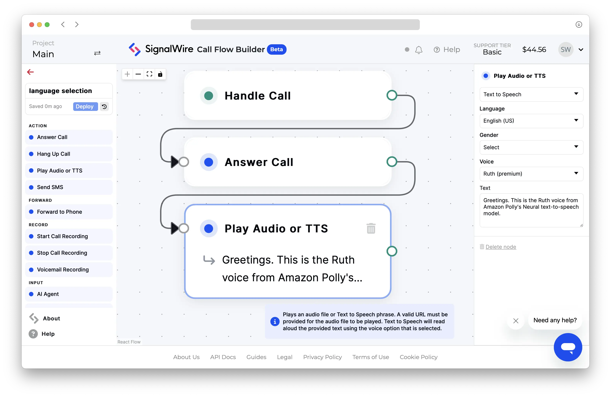

# Amazon Polly

Amazon Web Services' Polly TTS engine includes several models to accommodate different use cases.

## Models

SignalWire supports the following three Amazon models. 

<CardGroup cols="3">

  <Card title="Standard" href="https://docs.aws.amazon.com/polly/latest/dg/standard-voices.html">
    Polly Standard is a traditional, cost-effective, and reliable TTS model.
    
    Example voice ID string: `amazon.Emma:en-GB` or `amazon.Emma:standard:en-GB`
  </Card>

  <Card title="Neural" href="https://docs.aws.amazon.com/polly/latest/dg/neural-voices.html">
    Polly Neural produces more natural, human-like speech than Polly Standard.
    
    Example voice ID string: `amazon.Kendra:neural:en-US`
  </Card>

  <Card title="Generative" href="https://docs.aws.amazon.com/polly/latest/dg/generative-voices.html">
    Polly Generative is Amazon's largest and most realistic model.

    Example voice ID string: `amazon.Danielle:generative:en-US`
  </Card>

</CardGroup>

## Languages

Consult AWS documentation for a comprehensive and up-to-date list of supported voices,
as well as information on accented and fully bilingual voices.

<CardGroup cols="3">

  <Card title="List of supported voices" href="https://docs.aws.amazon.com/polly/latest/dg/available-voices.html">
    Most Amazon Polly voices support a single language.
    Select voices from this list, which includes Standard, Neural, and Generative models.
  </Card>

  <Card title="Bilingual pronunciation" href="https://docs.aws.amazon.com/polly/latest/dg/bilingual-voices.html#accented-bilingual">
    All Amazon Polly voices support accented bilingual pronunciation through the use of the SSML `lang` tag.
  </Card>

  <Card title="Fully bilingual voices" href="https://docs.aws.amazon.com/polly/latest/dg/bilingual-voices.html#true-bilingual">
    Learn more about fully bilingual voices like `Aditi`, `Kajal`, `Hala`, and `Zayd`,
    which are designed to fluently speak two languages.
  </Card>

</CardGroup>

## Voice IDs

Amazon voice IDs are composed of four sections:

| Parameter                                                 | Possible values                                                      | Description                             |
| :-------------------------------------------------------- | :------------------------------------------------------------------- | :-------------------------------------- |
| `engine`<br/><span class="required-arg">required</span>   | <ul><li>`amazon`</li><li>`polly` (will be deprecated soon)</li></ul> | TTS engine                              |
| `voice`<br/><span class="required-arg">required</span>    | Choose from the [**Name/ID** column][polly]                          | Voice ID                                |
| `model`<br/><span class="optional-arg">optional</span>    | `standard`, `neural`, or `generative`                                | Amazon Polly model. Default: `standard` |
| `language`<br/><span class="optional-arg">optional</span> | Choose from the [**Language code** column][polly]                    | Sets model language. Default: `en-US`   |

Create the voice string according to the following pattern:

```
amazon.voice:model:language
```

### Examples

```bash
# The Danielle voice, which supports the default Standard model and en-US language
amazon.Danielle

# Two equivalent strings for the Standard-model Aditi bilingual voice in the Hindi language
amazon.Aditi:standard:hi-IN
amazon.Aditi:hi-IN

# The Amy Generative model in British English
amazon.Amy:generative:en-GB
```

:::note
The `polly` engine code is being deprecated. Use `amazon` instead.
:::

:::warning Character limits
Amazon Polly has a limit of 3000 chargeable characters in a single request.
If your TTS request is longer than 3000 characters, you will experience silence.
:::

---

## Examples

See how to use Amazon Polly voices on the SignalWire platform.

<Tabs>
<TabItem value="swml" label="SWML">
Use the
[**`languages`**](/swml/methods/ai/languages#use-voice-strings)
SWML method to set one or more voices for an [AI agent](/swml/methods/ai).
```yaml
version: 1.0.0
sections:
  main:
  - ai:
      prompt:
        text: Have an open-ended conversation about flowers.
      languages:
        - name: English
          code: en-US
          voice: amazon.Ruth:neural
```
Alternatively, use the [**`say_voice`** parameter](/swml/methods/play#parameters) 
of the [**`play`**](/swml/methods/play)
SWML method to select a voice for basic TTS.
```yaml
version: 1.0.0
sections:
  main:
  - set:
      say_voice: "amazon.Ruth:neural"
  - play: "say:Greetings. This is the Ruth voice from Amazon Polly's Neural text-to-speech model."
```
</TabItem>
<TabItem value="relay" label="RELAY Realtime SDK">
```javascript
// This example uses the Node.js SDK for SignalWire's RELAY Realtime API.
const playback = await call.playTTS({ 
    text: "Greetings. This is the Ruth voice from Amazon Polly's Neural text-to-speech model.",
    voice: "amazon.Ruth:neural",
});
await playback.ended();
```
</TabItem>
<TabItem value="cfb" label="Call Flow Builder">

</TabItem>
<TabItem value="cxml" label="cXML">
```xml
<?xml version="1.0" encoding="UTF-8"?>
<Response>
<Say voice="amazon.Ruth:neural">
    Greetings. This is the Ruth voice from Amazon Polly's Neural text-to-speech model.
</Say>
</Response>
```
</TabItem>
</Tabs>

[polly]: https://docs.aws.amazon.com/polly/latest/dg/available-voices.html "Available Amazon Polly voices"