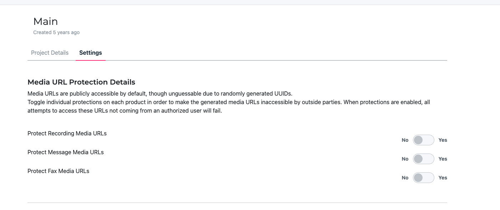

# Media URL Protection

Media URL Protection allows you to control access to media files generated by your SignalWire services. 
By default, media URLs are publicly accessible but unguessable due to randomly generated UUIDs. When protection is enabled, only authorized users can access these URLs.

<Frame caption="Media URL Protection settings in your Project Dashboard">
  
</Frame>

## Understanding Media URL Protection

### Default Behavior

By default, SignalWire generates media URLs that are:
- **Publicly accessible**: Anyone with the URL can access the media file
- **Unguessable**: URLs contain randomly generated UUIDs making them extremely difficult to predict
- **No authentication required**: Direct access without any authorization headers

### When Protection is Enabled

When you enable Media URL Protection for a service:
- **Authentication required**: Only authorized users can access the media URLs
- **Access control**: Unauthorized attempts to access protected URLs will fail
- **Secure by default**: Media files are protected from unauthorized access

:::info Why Enable Media Protection?
Enable Media URL Protection when your media files contain sensitive information such as:
- Recorded calls with personal or confidential information
- Private voicemail messages
- Confidential fax documents
- Sensitive MMS attachments
:::

## Accessing Media Protection Settings

Media URL Protection is configured at the project level, giving you granular control over each project's security settings.

### Navigation Path
1. Log into your SignalWire Dashboard
2. Select your desired project
3. Click on the **Settings** tab
4. Scroll to the **Media URL Protection Details** section

:::tip Project-Level Configuration
Media protection settings are configured per project, not globally. This allows you to have different security levels for different projects based on your needs.
:::

## Configuring Media Protection

The Media URL Protection settings provide three independent toggles, allowing you to protect different types of media based on your specific requirements:

### Protect Recording Media URLs

This setting protects URLs for call recordings generated by your voice services.

**When to enable:**
- Call recordings contain sensitive conversations
- Compliance requirements for recorded calls
- Customer service recordings with personal information

**Impact when enabled:**
- Recording URLs require authentication to access
- Direct URL sharing will not work for unauthorized users
- API access to recordings requires proper authorization

### Protect Message Media URLs

This setting protects media attachments sent via SMS/MMS messages.

**When to enable:**
- MMS attachments contain sensitive images or documents
- Business communications with confidential content
- Healthcare or financial messaging applications

**Impact when enabled:**
- MMS media URLs require authentication to access
- Media attachments in webhooks remain accessible to your application
- Direct media URL sharing becomes restricted

### Protect Fax Media URLs

This setting protects fax documents and attachments.

**When to enable:**
- Fax documents contain confidential information
- Healthcare, legal, or financial fax communications
- Compliance requirements for fax document security

**Impact when enabled:**
- Fax document URLs require authentication to access
- Fax delivery confirmations and metadata remain unaffected
- Direct fax document sharing becomes restricted

## How to Enable Protection

For each media type you want to protect:

1. Navigate to your project's **Settings** tab
2. Find the **Media URL Protection Details** section
3. Locate the specific protection toggle (Recording, Message, or Fax)
4. Toggle the switch from **No** to **Yes**
5. The change takes effect immediately

:::warning Immediate Effect
Changes to Media URL Protection settings take effect immediately. Any existing media URLs will be affected by the new protection status.
:::

## Best Practices

### Security Considerations

**Enable protection when:**
- Media files contain personally identifiable information (PII)
- Regulatory compliance requires access controls
- Your application handles sensitive business communications
- You need to prevent unauthorized media access

**Consider keeping protection disabled when:**
- Media files are already public or non-sensitive
- You need simple direct URL sharing capabilities
- Your integration requires direct media URL access without authentication

### Integration Impact

When Media URL Protection is enabled:

**API Integration:**
- Use proper authentication headers when accessing protected media URLs
- Ensure your application handles authentication for media access
- Test media URL access after enabling protection

**Webhook Handling:**
- Protected media URLs in webhooks still require authentication to access
- Your webhook endpoints should handle authentication when accessing media
- Consider caching or downloading media files if needed for your application

## Troubleshooting

### Common Issues

**Problem: "Access Denied" when accessing media URLs**
- **Cause**: Media protection is enabled but no authentication is provided
- **Solution**: Include proper authentication headers or access media through authenticated API calls

**Problem: Direct media URL sharing not working**
- **Cause**: Media protection is enabled, preventing unauthorized access
- **Solution**: Either disable protection for that media type or provide authorized access methods

**Problem: Integration broken after enabling protection**
- **Cause**: Your application attempts direct URL access without authentication
- **Solution**: Update your integration to handle authentication when accessing protected media

### Verification

To verify Media URL Protection is working:

1. Enable protection for a media type
2. Generate a new media file (recording, message, or fax)
3. Try accessing the media URL without authentication
4. Confirm that access is denied for unauthorized requests

:::tip Testing Protection
Always test your integrations after enabling Media URL Protection to ensure your application properly handles the authentication requirements.
:::

## Additional Resources

- [API Authentication Guide](/rest/overview/authorization) - Learn about proper API authentication
- [Webhook Security](/platform/basics/security-and-compliance/webhook-security) - Secure your webhook endpoints
- [Project Settings](/platform/dashboard/administration/change-settings) - Managing other project-level settings

