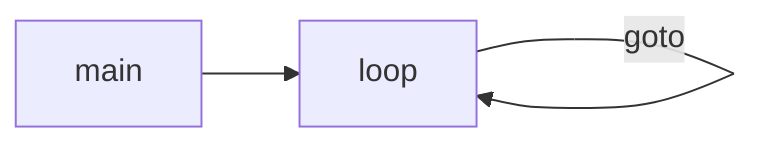
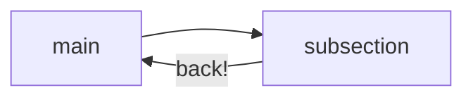
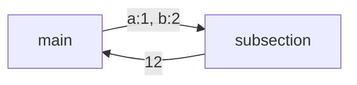
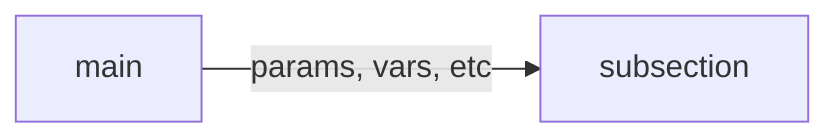

SWML offers a lot of flexibility in how you control program flow with it's control methods.
Of these, [`goto`], [`execute`], and [`transfer`] allow you to unconditionally control program flow.

## goto

The [`goto`] method is designed to allow you to jump to particular labels within a section.
Use this method to simulate more complex loops like `while` and `for` loops.

:::warning you can not jump to sections using goto.

Use [`execute`] described further below to jump sections.

:::

```yaml andJson
version: 1.0.0
sections:
  main:
    - play:
        url: 'say:Entering infinite loop'
    - label: loop
    - play:
        url: 'say:Looping ...'
    - goto:
        label: loop

```



## execute

The [`execute`] method allows you to invoke a subsection as a function. You can pass parameters to the function
and receive a return value.

```yaml andJson
version: 1.0.0
sections:
  main:
    - play:
        url: 'say:Transferring you to another section'
    - execute:
        dest: subsection
    - play:
        url: 'say: %{return_value}'
  subsection:
    - play:
        url: 'say:inside a subsection'
    - return: back!
```

Output transcript:

```
"Transferring you to another section"
"inside a subsection"
"back!"
```



Or in a more complex example:

```yaml andJson
version: 1.0.0
sections:
  main:
    - play:
        url: 'say:Transferring you to another section'
    - execute:
        dest: subsection
        params:
          a: 1
          b: 2
    - play:
        url: 'say: %{return_value}'
  subsection:
    - return: '%{params.a+params.b}'
```



## transfer

```yaml andJson
version: 1.0.0
sections:
  main:
    - play:
        url: 'say:Transferring you to another section'
    - transfer:
        dest: subsection
    - play:
        url: 'say:Back!'
  subsection:
    - play:
        url: 'say:inside a subsection'
```

Output transcript:

```
"Transferring you to another section"
"inside a subsection"
```

:::info
Notice how we aren't going back to the calling section at all.
:::



## Conclusion

|       | [`goto`]                             | [`execute`]                                          | [`transfer`]                                         |
|:------|:-------------------------------------|:-----------------------------------------------------|:-----------------------------------------------------|
| Use   | Jump between labels within a section | Invoke a subsection with params, then return         | Invoke a subsection with params                      |
| Scope | within a section                     | From one section to another, or to another SWML file | From one section to another, or to another SWML file |

[`goto`]: /swml/methods/goto
[`transfer`]: /swml/methods/transfer
[`execute`]: /swml/methods/execute
