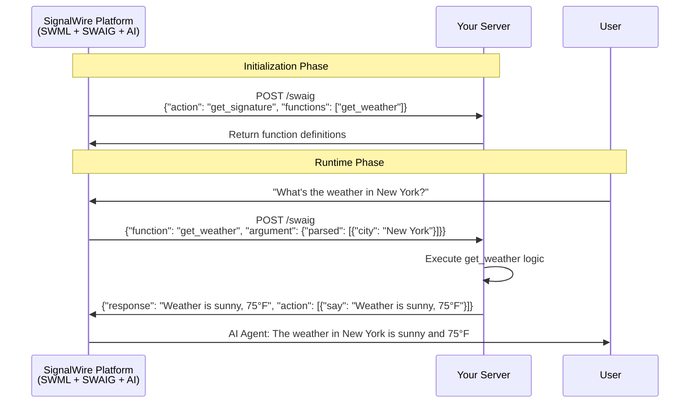

[swaig-functions]: /swml/methods/amazon_bedrock/swaig/functions#parameters
[webhook-response]: /swml/methods/amazon_bedrock/swaig/functions/web_hook_url#webhook-response
[webhook-request]: /swml/methods/amazon_bedrock/swaig/functions/web_hook_url#callback-request-for-web_hook_url
[request-flow]: #request-flow
[includes-parameters]: #includes-parameters

Remote function signatures to include in SWAIG functions. Will allow you to include functions that are defined in a remote location
that can be executed during the interaction with the Amazon Bedrock agent. To learn more about how includes works see the 
[request flow][request-flow] section.

| Name                                                     | Type       | Default | Description                                                                         |
|:---------------------------------------------------------|:-----------|:--------|:------------------------------------------------------------------------------------|
| `includes`<span className="optional-arg">Optional</span> | `object[]` | -       | An array of objects that contain the [`includes parameters`][includes-parameters]. |

## **includes parameters**

| Name                                                      | Type       | Default | Description                                                                                                                     |
|:----------------------------------------------------------|:-----------|:--------|:--------------------------------------------------------------------------------------------------------------------------------|
| `url`<span className="required-arg">Required</span>       | `string`   | -       | URL where the remote functions are defined. Authentication can also be set in the url in the format of `username:password@url`. |
| `function`<span className="required-arg">Required</span>  | `string[]` | -       | An array of the function names to be included.                                                                                  |
| `meta_data`<span className="optional-arg">Optional</span> | `object`   | -       | Metadata to be passed to the remote function. These are key-value pairs defined by the user.                                    |

## **SWML usage**

```yaml andJson
version: 1.0.0
sections:
  main:
    - amazon_bedrock:
        prompt:
          text: "You are a helpful assistant that can check weather."
        SWAIG:
          includes:
            - url: "https://example.com/swaig"
              function: ["get_weather"]
              meta_data:
                user_id: "12345"
```

## **Request flow**

SWAIG includes creates a bridge between AI agents and external functions. When a SWML script initializes, it follows 
this two-phase process:

**Initialization Phase:** SWAIG discovers available functions from configured endpoints and requests their signatures 
to understand what each function can do.

**Runtime Phase:** The AI agent analyzes conversations, determines when functions match user intent, and executes them 
with full context.

---

### **Signature request** 

During SWML script initialization, SWAIG acts as a function discovery service. It examines your `includes` configuration, 
identifies the remote functions you've declared, then systematically contacts each endpoint to gather function definitions.

**How it works:**
Looking at our SWML configuration example, SWAIG sends a targeted request to `https://example.com/swaig` specifically 
asking for the `get_weather` function definition. Along with this request, it forwards any `meta_data` you've 
configured—giving your server the context it needs to respond appropriately.

**The discovery request:**
```json
{
  "action": "get_signature",
  "functions": ["get_weather"]
}
```

**What your server should return:**
Your endpoint must respond with complete function definitions that tell SWAIG everything it needs to know. Each function 
signature follows the [SWAIG functions structure][swaig-functions] and describes the function's purpose and required 
parameters:

```json
[
  {
    "function": "function_name1",
    "description": "Description of what this function does",
    "parameters": {
      "type": "object",
      "properties": {
        "param1": {
          "type": "string",
          "description": "Parameter description"
        }
      },
      "required": ["param1"]
    },
    "web_hook_url": "https://example.com/swaig"
  }
]
```

---

### **Function execution request**

When the AI agent determines that a function call matches user intent—such as when a user requests weather information 
SWAIG packages the required information and sends it to the configured endpoint. The full details of the request can be 
found in the [web_hook_url][webhook-request] documentation.

**Example request format:**
```json
{
  "content_type": "text/swaig",
  "function": "function_name1",
  "argument": {
    "parsed": [{"city": "New York"}],
    "raw": "{\"city\":\"New York\"}",
    "substituted": "{\"city\":\"New York\"}"
  },
  "meta_data": {
    "custom_key": "custom_value"
  },
  "meta_data_token": "optional_token",
  "app_name": "swml app",
  "version": "2.0"
}
```

SWAIG provides arguments in multiple formats—`parsed` for direct access, `raw` for the original text, and `substituted` 
with variable replacements applied. This flexibility supports edge cases and complex parsing scenarios.

---

**Response formats:**

When your function completes, it needs to send a response back to SWAIG. You have three main options depending on what you want to accomplish:

<Tabs groupId="response-type">
<TabItem value="standard" label="Simple Response">

**Use this when:** Your function just needs to return information to the AI agent.


```json
{
  "response": "The weather in New York is sunny and 75°F"
}
```

The AI agent will receive this information and incorporate it naturally into the conversation with the user.

</TabItem>
<TabItem value="with-actions" label="Response + Actions">

**Use this when:** You want to return information AND make something happen (like speaking, sending messages, etc.).

```json
{
  "response": "Successfully booked your appointment for 3 PM tomorrow",
  "action": [
    {
      "say": "Your appointment has been confirmed for tomorrow at 3 PM"
    }
  ]
}
```

The `response` goes to the AI agent for conversation context, while `action` triggers immediate behaviors like speaking the confirmation out loud.

:::tip Available actions
Functions can trigger various behaviors: speaking text, sending SMS, playing audio, transferring calls, and more. See the [actions documentation](/swml/methods/amazon_bedrock/swaig/functions/web_hook_url#actions) for all available options.
:::

</TabItem>
<TabItem value="error" label="Error Handling">

**Use this when:** Something goes wrong and you need to inform the AI agent about the failure.

**Important:** Always use HTTP status code `200` even for errors. SWAIG handles errors through the response content, not HTTP status codes.

```json
{
  "response": "Unable to retrieve weather data for the specified location. The weather API returned an error or the city name may be invalid."
}
```

**Write error messages for the AI agent:** The error response goes directly to the AI agent, which will then decide how to communicate the failure to the user. Be descriptive about what went wrong so the AI can provide helpful alternatives or suggestions.

:::important Error handling protocol
- Always return HTTP status `200`
- Write error messages that explain what failed and why
- The AI agent will interpret your error message and respond to the user appropriately
- This keeps conversations flowing instead of breaking
:::

</TabItem>
</Tabs>

More information about the response format can be found in the [web_hook_url][webhook-response] documentation.

---

## **Flow diagram**

The following diagram illustrates the complete SWAIG includes process from initialization to function execution:



---

## **Reference implementation**

The following implementations demonstrate the essential pattern: define functions, map them to actual code, and handle 
both signature requests and function executions.

<Tabs groupId="language">
<TabItem value="python" label="Python/Flask">

```python
from flask import Flask, request, jsonify

app = Flask(__name__)

# Define what SWAIG will see when it asks for signatures
FUNCTIONS = {
    "get_weather": {
        "function": "get_weather",
        "description": "Get current weather for a city",
        "parameters": {
            "type": "object",
            "properties": {
                "city": {"type": "string", "description": "The city name"}
            },
            "required": ["city"]
        },
        "web_hook_url": "https://example.com/swaig"
    }
}

# The actual business logic
def get_weather(city, meta_data=None, **kwargs):
    # Logic to get weather data
    # ...
    temperature = 75
    result = f"The weather in {city} is sunny and {temperature}°F"
    # Return both a response AND an action
    actions = [{"say": result}]
    return result, actions

# Connect function names to actual functions
FUNCTION_MAP = {
    "get_weather": get_weather
}

@app.route('/swaig', methods=['POST'])
def handle_swaig():
    data = request.json
    
    # SWAIG is asking what we can do
    if data.get('action') == 'get_signature':
        requested = data.get('functions', list(FUNCTIONS.keys()))
        return jsonify([FUNCTIONS[name] for name in requested if name in FUNCTIONS])
    
    # SWAIG wants us to actually do something
    function_name = data.get('function')
    if function_name not in FUNCTION_MAP:
        return jsonify({"response": "Function not found"}), 200
    
    params = data.get('argument', {}).get('parsed', [{}])[0]
    meta_data = data.get('meta_data', {})
    
    # Call the function and get results
    result, actions = FUNCTION_MAP[function_name](meta_data=meta_data, **params)
    return jsonify({"response": result, "action": actions})

if __name__ == '__main__':
    app.run(debug=True)
```

</TabItem>
<TabItem value="js" label="JavaScript/Express">

```javascript
const express = require('express');
const app = express();
app.use(express.json());

// Define what SWAIG will see when it asks for signatures
const FUNCTIONS = {
    "get_weather": {
        "function": "get_weather",
        "description": "Get current weather for a city", 
        "parameters": {
            "type": "object",
            "properties": {
                "city": {"type": "string", "description": "The city name"}
            },
            "required": ["city"]
        },
        "web_hook_url": "https://example.com/swaig"
    }
};

// The actual business logic
function get_weather({city, ...additionalParams}, metaData) {
    // Logic to get weather data
    // ...
    const temperature = 75;
    const result = `The weather in ${city} is sunny and ${temperature}°F`;
    // Return both a response AND an action
    const actions = [{"say": result}];
    return [result, actions];
}

// Connect function names to actual functions
const FUNCTION_MAP = {
    "get_weather": get_weather
};

app.post('/swaig', (req, res) => {
    const data = req.body;
    
    // SWAIG is asking what we can do
    if (data.action === 'get_signature') {
        const requested = data.functions || Object.keys(FUNCTIONS);
        const signatures = requested.filter(name => FUNCTIONS[name]).map(name => FUNCTIONS[name]);
        return res.json(signatures);
    }
    
    // SWAIG wants us to actually do something
    const functionName = data.function;
    if (!FUNCTION_MAP[functionName]) {
        return res.status(200).json({"response": "Function not found"});
    }
    
    const params = data.argument?.parsed?.[0] || {};
    const metaData = data.meta_data || {};
    
    // Call the function and get results
    const [result, actions] = FUNCTION_MAP[functionName](params, metaData);
    return res.json({"response": result, "action": actions});
});

app.listen(3000, () => console.log('Server running on port 3000'));
```

</TabItem>
</Tabs>

---

### **Testing the implementation**

To test the implementation, start the server and simulate SWAIG requesting function signatures. This command requests 
signatures from the endpoint:

```bash
curl -X POST http://localhost:5000/swaig \
  -H "Content-Type: application/json" \
  -d '{"action": "get_signature"}'
```

**Expected response:**
A successful response returns function definitions in this format:

```json
[
  {
    "description": "Get current weather for a city",
    "function": "get_weather",
    "parameters": {
      "properties": {
        "city": {
          "description": "The city name",
          "type": "string"
        }
      },
      "required": [
        "city"
      ],
      "type": "object"
    },
    "web_hook_url": "https://example.com/swaig"
  }
]
```
