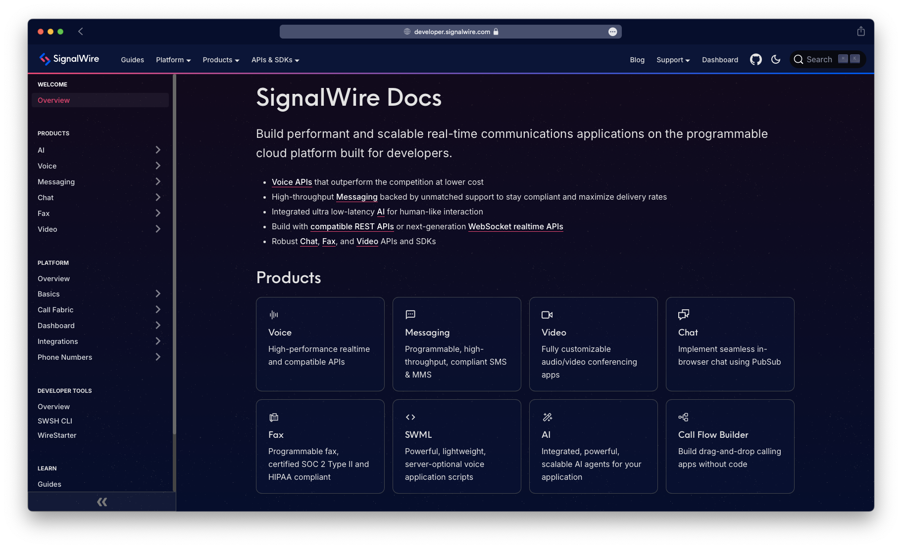

import Steps from "@site/src/components/Steps"
import Subtitle from "@site/src/components/typography/Subtitle"

# The Steps component

---

## Usage

Put stepped content between opening and closing `<Steps>` tags. Normal Markdown headers will be converted to numbered Steps.

```md
<Steps>

### This is step 1 

This is some description for step 1

### This is step 2

This is some description for step 2

### This is step 3

This is some long description for step 3. 

Lorem ipsum dolor sit amet, consectetur adipiscing elit. Phasellus consequat elit lorem, ut consectetur leo faucibus mattis. Integer dictum libero vitae accumsan lobortis. Mauris lacinia imperdiet nibh ac semper. Phasellus ut diam rutrum, commodo nisi sed, bibendum tortor. Fusce vel est at velit interdum sagittis. Maecenas ut dictum dui, sit amet mollis diam. Nulla at leo a dui tincidunt consectetur vel eleifend diam. Mauris maximus non mi vitae maximus. Sed congue a sem sed consequat. Proin in mauris vel mi dignissim dignissim. Nullam ultrices, nisi vel porta tristique, eros tortor aliquet urna, id vestibulum neque nulla faucibus arcu. Aenean facilisis ligula risus, sit amet malesuada nulla elementum ac. Vestibulum non sagittis mauris. Donec a ex at dolor volutpat imperdiet. Proin a dignissim massa. Nulla mattis vulputate fermentum.

### This is step 4

This is some description for step 2

</Steps>
```

The above example uses H3 headings to produce the following result:

<Steps>

### This is step 1 

This is some description for step 1

### This is step 2

This is some description for step 2

### This is step 3

This is some long description for step 3. 

Lorem ipsum dolor sit amet, consectetur adipiscing elit. Phasellus consequat elit lorem, ut consectetur leo faucibus mattis. Integer dictum libero vitae accumsan lobortis. Mauris lacinia imperdiet nibh ac semper. Phasellus ut diam rutrum, commodo nisi sed, bibendum tortor. Fusce vel est at velit interdum sagittis. Maecenas ut dictum dui, sit amet mollis diam. Nulla at leo a dui tincidunt consectetur vel eleifend diam. Mauris maximus non mi vitae maximus. Sed congue a sem sed consequat. Proin in mauris vel mi dignissim dignissim. Nullam ultrices, nisi vel porta tristique, eros tortor aliquet urna, id vestibulum neque nulla faucibus arcu. Aenean facilisis ligula risus, sit amet malesuada nulla elementum ac. Vestibulum non sagittis mauris. Donec a ex at dolor volutpat imperdiet. Proin a dignissim massa. Nulla mattis vulputate fermentum.

### This is step 4

This is some description for step 2

</Steps>

---

## Edge cases

This sample demonstrates the behavior of the Steps component when various other elements are included.
Used for testing and development.

<Steps>

### Admonitions

Admonitions may be used for reminders or warnings within stepped instructions

:::note hot tip
admonition content
:::

### Empty steps - when the step needs no further explanation

### Code blocks

```
// Code blocks are commonly used in instructional content.
```

### `<summary>` drop-downs ("accordions")

<details>
  <summary>Expand content </summary>
  Details<br/>Details<br/>Details<br/>Details<br/>
</details>

### Images



<Card title="Great Link" link="https://www.youtube.com/watch?v=dQw4w9WgXcQ" href="https://www.youtube.com/watch?v=dQw4w9WgXcQ">
This is a great link! I swear you won't regret clicking on it. There's certainly no malware or other nefarious scripts behind the link.
 </Card>

### Tables

Text before

| Column one  | Column two       |
| :---------- | :--------------- |
| Small table | with very little |
| content     | in it! |

| Column one   | Column two        | Column three        | Column four | Column five | Column six |
| :----------- | :---------------- | ------------------- | ----------- | ----------- | ---------- |
| Now here's a | much larger table | with six horizontal | columns.    |             |            |

Text after

</Steps>

---

# Using h1

<Steps>

# This is step 1 

This is some description for step 1

# This is step 2

This is some description for step 2

# This is step 3

This is some long description for step 3. 

Lorem ipsum dolor sit amet, consectetur adipiscing elit. Phasellus consequat elit lorem, ut consectetur leo faucibus mattis. Integer dictum libero vitae accumsan lobortis. Mauris lacinia imperdiet nibh ac semper. Phasellus ut diam rutrum, commodo nisi sed, bibendum tortor. Fusce vel est at velit interdum sagittis. Maecenas ut dictum dui, sit amet mollis diam. Nulla at leo a dui tincidunt consectetur vel eleifend diam. Mauris maximus non mi vitae maximus. Sed congue a sem sed consequat. Proin in mauris vel mi dignissim dignissim. Nullam ultrices, nisi vel porta tristique, eros tortor aliquet urna, id vestibulum neque nulla faucibus arcu. Aenean facilisis ligula risus, sit amet malesuada nulla elementum ac. Vestibulum non sagittis mauris. Donec a ex at dolor volutpat imperdiet. Proin a dignissim massa. Nulla mattis vulputate fermentum.

Phasellus dapibus accumsan laoreet. Quisque sed sapien eget lectus finibus bibendum. Nulla ullamcorper risus consequat nunc posuere, id sagittis mauris efficitur. Integer vulputate fermentum tellus, non auctor mi convallis sed. Vivamus efficitur blandit molestie. Etiam rhoncus ornare odio elementum auctor. Integer id ante ac massa volutpat rhoncus non id nibh. Vivamus nec mi massa. Quisque euismod lacus tellus, a pulvinar nisi volutpat vel. Quisque malesuada tristique semper. Ut ligula est, varius a accumsan malesuada, pulvinar eget nibh. Donec vitae sem sed nisi rhoncus tristique rutrum eget magna. Sed sollicitudin mattis dolor eu posuere. Ut auctor felis sed augue auctor, sed dapibus sapien auctor. Vestibulum iaculis libero eget metus accumsan pellentesque. Proin non ipsum eget dolor rhoncus finibus quis in neque. 


# This is step 4

This is some description for step 2

</Steps>


# Using h2

<Steps>

## This is step 1 

This is some description for step 1

## This is step 2

This is some description for step 2

## This is step 3

This is some long description for step 3. 

Lorem ipsum dolor sit amet, consectetur adipiscing elit. Phasellus consequat elit lorem, ut consectetur leo faucibus mattis. Integer dictum libero vitae accumsan lobortis. Mauris lacinia imperdiet nibh ac semper. Phasellus ut diam rutrum, commodo nisi sed, bibendum tortor. Fusce vel est at velit interdum sagittis. Maecenas ut dictum dui, sit amet mollis diam. Nulla at leo a dui tincidunt consectetur vel eleifend diam. Mauris maximus non mi vitae maximus. Sed congue a sem sed consequat. Proin in mauris vel mi dignissim dignissim. Nullam ultrices, nisi vel porta tristique, eros tortor aliquet urna, id vestibulum neque nulla faucibus arcu. Aenean facilisis ligula risus, sit amet malesuada nulla elementum ac. Vestibulum non sagittis mauris. Donec a ex at dolor volutpat imperdiet. Proin a dignissim massa. Nulla mattis vulputate fermentum.

Phasellus dapibus accumsan laoreet. Quisque sed sapien eget lectus finibus bibendum. Nulla ullamcorper risus consequat nunc posuere, id sagittis mauris efficitur. Integer vulputate fermentum tellus, non auctor mi convallis sed. Vivamus efficitur blandit molestie. Etiam rhoncus ornare odio elementum auctor. Integer id ante ac massa volutpat rhoncus non id nibh. Vivamus nec mi massa. Quisque euismod lacus tellus, a pulvinar nisi volutpat vel. Quisque malesuada tristique semper. Ut ligula est, varius a accumsan malesuada, pulvinar eget nibh. Donec vitae sem sed nisi rhoncus tristique rutrum eget magna. Sed sollicitudin mattis dolor eu posuere. Ut auctor felis sed augue auctor, sed dapibus sapien auctor. Vestibulum iaculis libero eget metus accumsan pellentesque. Proin non ipsum eget dolor rhoncus finibus quis in neque. 


## This is step 4

This is some description for step 2

</Steps>


# Using h4

<Steps>

#### This is step 1 

This is some description for step 1

#### This is step 2

This is some description for step 2

#### This is step 3

This is some long description for step 3. 

Lorem ipsum dolor sit amet, consectetur adipiscing elit. Phasellus consequat elit lorem, ut consectetur leo faucibus mattis. Integer dictum libero vitae accumsan lobortis. Mauris lacinia imperdiet nibh ac semper. Phasellus ut diam rutrum, commodo nisi sed, bibendum tortor. Fusce vel est at velit interdum sagittis. Maecenas ut dictum dui, sit amet mollis diam. Nulla at leo a dui tincidunt consectetur vel eleifend diam. Mauris maximus non mi vitae maximus. Sed congue a sem sed consequat. Proin in mauris vel mi dignissim dignissim. Nullam ultrices, nisi vel porta tristique, eros tortor aliquet urna, id vestibulum neque nulla faucibus arcu. Aenean facilisis ligula risus, sit amet malesuada nulla elementum ac. Vestibulum non sagittis mauris. Donec a ex at dolor volutpat imperdiet. Proin a dignissim massa. Nulla mattis vulputate fermentum.

Phasellus dapibus accumsan laoreet. Quisque sed sapien eget lectus finibus bibendum. Nulla ullamcorper risus consequat nunc posuere, id sagittis mauris efficitur. Integer vulputate fermentum tellus, non auctor mi convallis sed. Vivamus efficitur blandit molestie. Etiam rhoncus ornare odio elementum auctor. Integer id ante ac massa volutpat rhoncus non id nibh. Vivamus nec mi massa. Quisque euismod lacus tellus, a pulvinar nisi volutpat vel. Quisque malesuada tristique semper. Ut ligula est, varius a accumsan malesuada, pulvinar eget nibh. Donec vitae sem sed nisi rhoncus tristique rutrum eget magna. Sed sollicitudin mattis dolor eu posuere. Ut auctor felis sed augue auctor, sed dapibus sapien auctor. Vestibulum iaculis libero eget metus accumsan pellentesque. Proin non ipsum eget dolor rhoncus finibus quis in neque. 


#### This is step 4

This is some description for step 2

</Steps>


# Using h5

<Steps>

##### This is step 1 

This is some description for step 1

##### This is step 2

This is some description for step 2

##### This is step 3

This is some long description for step 3. 

Lorem ipsum dolor sit amet, consectetur adipiscing elit. Phasellus consequat elit lorem, ut consectetur leo faucibus mattis. Integer dictum libero vitae accumsan lobortis. Mauris lacinia imperdiet nibh ac semper. Phasellus ut diam rutrum, commodo nisi sed, bibendum tortor. Fusce vel est at velit interdum sagittis. Maecenas ut dictum dui, sit amet mollis diam. Nulla at leo a dui tincidunt consectetur vel eleifend diam. Mauris maximus non mi vitae maximus. Sed congue a sem sed consequat. Proin in mauris vel mi dignissim dignissim. Nullam ultrices, nisi vel porta tristique, eros tortor aliquet urna, id vestibulum neque nulla faucibus arcu. Aenean facilisis ligula risus, sit amet malesuada nulla elementum ac. Vestibulum non sagittis mauris. Donec a ex at dolor volutpat imperdiet. Proin a dignissim massa. Nulla mattis vulputate fermentum.

Phasellus dapibus accumsan laoreet. Quisque sed sapien eget lectus finibus bibendum. Nulla ullamcorper risus consequat nunc posuere, id sagittis mauris efficitur. Integer vulputate fermentum tellus, non auctor mi convallis sed. Vivamus efficitur blandit molestie. Etiam rhoncus ornare odio elementum auctor. Integer id ante ac massa volutpat rhoncus non id nibh. Vivamus nec mi massa. Quisque euismod lacus tellus, a pulvinar nisi volutpat vel. Quisque malesuada tristique semper. Ut ligula est, varius a accumsan malesuada, pulvinar eget nibh. Donec vitae sem sed nisi rhoncus tristique rutrum eget magna. Sed sollicitudin mattis dolor eu posuere. Ut auctor felis sed augue auctor, sed dapibus sapien auctor. Vestibulum iaculis libero eget metus accumsan pellentesque. Proin non ipsum eget dolor rhoncus finibus quis in neque. 


##### This is step 4

This is some description for step 2

</Steps>