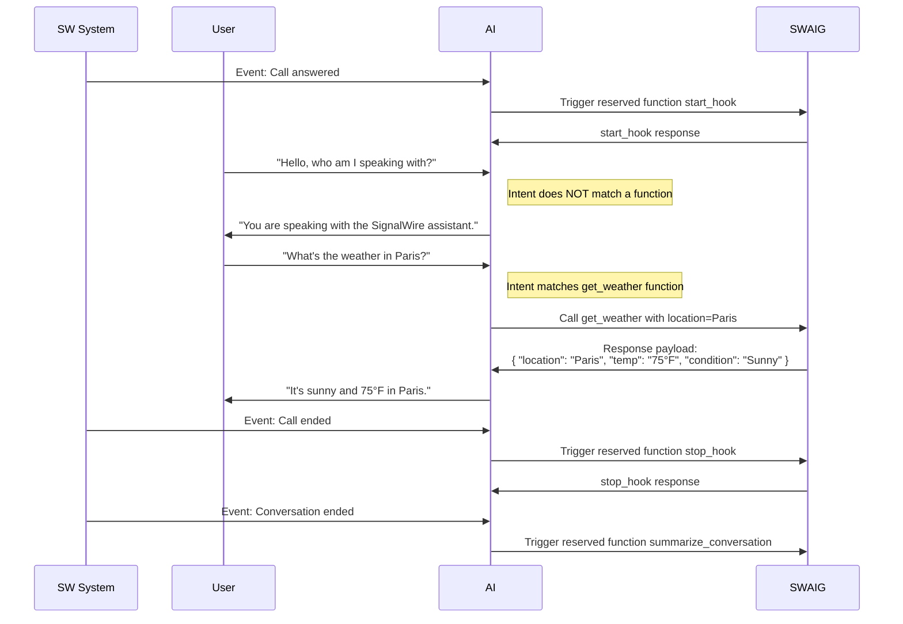
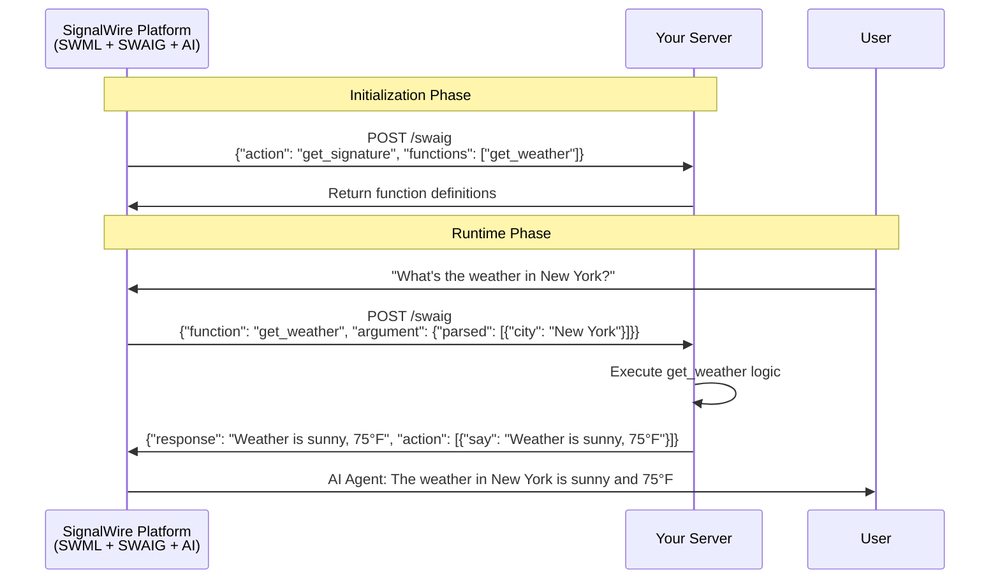
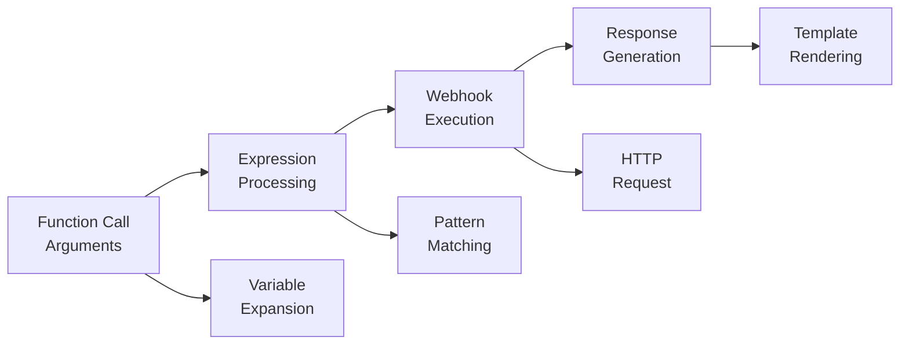
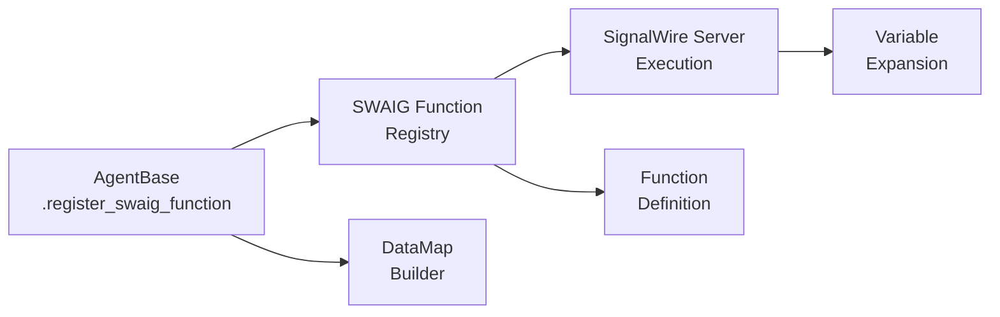
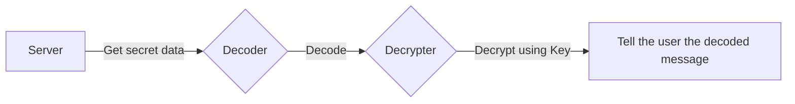
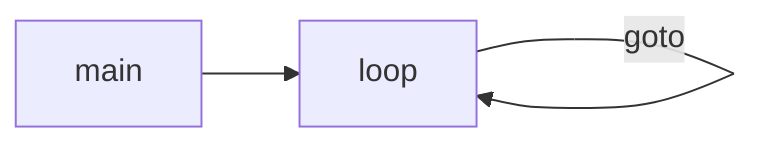
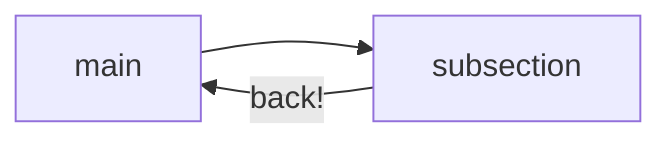
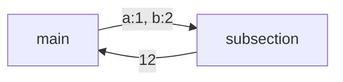
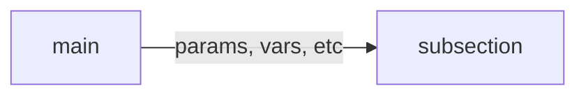

<!-- START OF docs\main\swml\methods\index.mdx -->
Methods in SWML control the program flow and execute functions.
This includes setting and unsetting variables, conditional statements,
making calls, and sending faxes etc.

## **The `AI` method**

The [`ai`](./ai/index.mdx) method is an incredibly powerful tool to instantiate an AI agent
that holds a natural conversation with the caller, and perform actions based on their input.

## **Control-flow methods**

### `execute` and `return`

The [`execute`](./execute.mdx) method is similar to a function call in most languages. It can be sent parameters,
and it can return values using the [`return`](./return.mdx) object. The SWML function to be executed can
exist as a subsection in the same SWML document, but it can also be a separate SWML document hosted on
an internet-accessible web-server.

### `transfer`

The [`transfer`](/swml/methods/transfer) statement transfers the execution to a different section or
a different SWML document. Unlike the `execute` statement, the `transfer` statement doesn't return
back to the calling section.

### `goto` and `label`

The [`goto`](./goto.mdx) statement can jump to a specified [`label`](./label.mdx) either depending on a
given condition or unconditionally, and repeatedly for a specified number of repetitions.

### `cond` and `switch`

The [`cond`](./cond.mdx) statement is a general purpose conditional branching statement that
executes SWML code based on the evaluation of a JavaScript expression.

The [`switch`](./switch.mdx) statement allows switch-case like conditional execution depending on whether a certain variable is
a certain value.

## **Call related methods**

### `answer` and `hangup`

Use these methods to decide when to [`answer`](./answer.mdx) the call
and when to [`hangup`](./hangup.mdx). Some other methods (like [`play`](./play.mdx))
will automatically answer calls, but you can use these methods to be more
specific about when it happens.

### `denoise` and `stop_denoise`

The [`denoise`](./denoise.mdx) method starts the noise reduction filter and the
[`stop_denoise`](./stop_denoise.mdx) method stops it.


### `live_transcribe`

The [`live_transcribe`](./live_transcribe/index.mdx) method starts a live transcription of the call.

### `live_translate`

The [`live_translate`](./live_translate/index.mdx) method starts a live translation of the call.

### `play` and `prompt`

The [`play`](./play.mdx) method can be used to send TTS speech, play audio files, send different rings etc.
The [`prompt`](./prompt.mdx) method also plays TTS or URLs like `play` but it can receive
keypad or speech input in response.

### `connect`

Use the [`connect`](./connect/index.mdx) method to connect the caller to other phone or SIP calls.
You can set it up to dial multiple numbers in series, parallel or a combination of the two.

### `join_room`

The [`join_room`](./join_room.mdx) method seamlessly connects your call to a
[video room](/video/conference), enabling participants to
join from various sources, including mobile apps, web browsers, or phone calls.

### `receive_fax`

The [`receive_fax`](./receive_fax.mdx) method will interpret the call as a fax and process it.

### `record`, `record_call` and `stop_record_call`

The [`record`](./record.mdx) and the [`record_call`](./record_call.mdx) methods will record
the call. The `record` method, however, waits for the recording to terminate before continuing
execution. The [`record_call`](./record_call.mdx) method starts a call recording in the
background, and it stops recording when you call [`stop_record_call`](./stop_record_call.mdx).

### `tap` and `stop_tap`

The [`tap`](./tap.mdx) method starts streaming the call to an RTP or a web socket sink.
The [`stop_tap`](./stop_tap.mdx) method stops it.

### `sip_refer`

The [`sip_refer`](./sip_refer.mdx) method transfer a SIP call by sending a SIP REFER
message.

### `send_sms`

Use [`send_sms`](./send_sms.mdx) to send an SMS to a phone number.

### `send_digits`

Use [`send_digits`](./send_digits.mdx) to send digits as DTMF tones.
<!-- END OF docs\main\swml\methods\index.mdx -->
<!-- START OF docs\main\swml\methods\answer.mdx -->
Answer incoming call and set an optional maximum duration.

| Name                                                   | Type     | Default | Description                                                            |
|:-------------------------------------------------------|:---------|:--------|:-----------------------------------------------------------------------|
| `answer`<span className="optional-arg">Optional</span> | `object` | -       | An object that contains the [`answer parameters`](#answer-parameters). |


## **answer Parameters**

The `answer` method expects the following parameters.

| Name                                                         | Type      | Default                   | Description                                                   |
|:-------------------------------------------------------------|:----------|:--------------------------|:--------------------------------------------------------------|
| `max_duration`<span className="optional-arg">Optional</span> | `integer` | `14400` seconds (4 hours) | Maximum duration in seconds. Can not be less than 15 seconds. |
| `sip_auth_username`<span className="optional-arg">Optional</span> | `string`  | -             | Username to use for SIP authentication.                                                                                               |
| `sip_auth_password`<span className="optional-arg">Optional</span> | `string`  | -             | Password to use for SIP authentication.                                                                                               |

---

## **Examples**

### No parameters

```yaml andJson
version: 1.0.0
sections:
  main:
    - answer: {}
```

---

### Named parameter

```yaml andJson
version: 1.0.0
sections:
  main:
    - answer:
        max_duration: 60
```
<!-- END OF docs\main\swml\methods\answer.mdx -->
<!-- START OF docs\main\swml\methods\cond.mdx -->
Execute a sequence of instructions depending on the value of a JavaScript condition.

The `cond` statement expects an array of conditions. Each condition is an object with a `when` and a `then` property, with the
exception of a single, optional condition with just an `else` property.

| Name                                                 | Type       | Default | Description                                                                     |
|:-----------------------------------------------------|:-----------|:--------|:--------------------------------------------------------------------------------|
| `cond`<span className="required-arg">Required</span> | `object[]` | -       | Array of [`when-then`](#when-then-params) and [`else`](#else-params) conditions |

## **cond Parameters**

Below are the parameters for the `cond` statement.

### **Parameters for `when-then` conditions** {#when-then-params}

| Name                                                 | Type       | Default | Description                                                                                 |
|:-----------------------------------------------------|:-----------|:--------|:--------------------------------------------------------------------------------------------|
| `when`<span className="required-arg">Required</span> | `string`   | -       | The JavaScript condition to act on                                                          |
| `then`<span className="required-arg">Required</span> | `object[]` | -       | Sequence of [`SWML Methods`](./index.mdx) to execute when the condition evaluates to `true` |

### **Parameters for `else` condition** {#else-params}

| Name                                                 | Type       | Default | Description                                                                                               |
|:-----------------------------------------------------|:-----------|:--------|:----------------------------------------------------------------------------------------------------------|
| `else`<span className="optional-arg">Optional</span> | `object[]` | -       | Sequence of [`SWML Methods`](./index.mdx) to execute when none of the other conditions evaluate to `true` |

:::warning

The JavaScript condition string already has access to all the document variables. Using the variable
substitution operator (`%{var}`) inside this string might result in inconsistent behavior.

```
❌ when: "%{call.type.toLowerCase() == 'sip'}"
❌ when: "%{prompt_value} == 1"
✅ when: "call.type.toLowerCase() == 'sip'"
```

:::

## **Examples**

### Tell the caller what he's calling from

```yaml andJson
version: 1.0.0
sections:
  main:
    - cond:
        - when: call.type.toLowerCase() == 'sip'
          then:
            - play:
                url: "say: You're calling from SIP."
        - when: call.type.toLowerCase() == 'phone'
          then:
            - play:
                url: "say: You're calling from phone."
```

### Perform tasks based on user input

```yaml andJson
version: 1.0.0
sections:
  main:
    - prompt:
        play: >-
          say: Press 1 to listen to music; 2 to hear your phone number; and
          anything else to hang up
    - cond:
        - when: '%{prompt_value} == 1'
          then:
            - play:
                url: 'https://cdn.signalwire.com/swml/April_Kisses.mp3'
            - execute:
                dest: main
        - when: call.type.toLowerCase() == 'phone'
          then:
            - transfer:
                dest: say_phone_number
            - execute:
                dest: main
        - else:
            - hangup: {}
  say_phone_number:
    # The `.split('').join(' ')`` adds a space between each digit of the phone number,
    # making sure the TTS spells out each digit one by one
    - play:
        url: "say: %{call.from.split('').join(' ')}"
```
<!-- END OF docs\main\swml\methods\cond.mdx -->
<!-- START OF docs\main\swml\methods\denoise.mdx -->
Start noise reduction. You can stop it at any time using [`stop_denoise`](./stop_denoise.mdx).

| Name                                                    | Type     | Default | Description                                 |
|:--------------------------------------------------------|:---------|:--------|:--------------------------------------------|
| `denoise`<span className="required-arg">Required</span> | `object` | -       | An empty object that accepts no parameters. |


## **Variables**

Set by the method:

- **denoise_result:** (out) `on` | `failed`

## **Examples**

### Start denoise

```yaml andJson
version: 1.0.0
sections:
  main:
    - answer: {}
    - denoise: {}
    - play:
        url: 'say: Denoising %{denoise_result}'
```
<!-- END OF docs\main\swml\methods\denoise.mdx -->
<!-- START OF docs\main\swml\methods\detect_machine.mdx -->
[variables]: #variables
[statuscallbacks]: #statuscallbacks

A detection method that combines AMD (Answering Machine Detection) and fax detection.
Detect whether the user on the other end of the call is a `machine` (fax, voicemail, etc.) or a `human`.
The detection result(s) will be sent to the specified `status_url` as a POST request and will also be saved in the 
`detect_result` [variable][variables].

| Name                                                           | Type     | Default | Description                                                                 |
|:---------------------------------------------------------------|:---------|:--------|:----------------------------------------------------------------------------|
| `detect_machine`<span className="required-arg">Required</span> | `object` | -       | An object that accepts the [`detect_machine parameters`](#detect_machine-parameters). |

## **detect_machine parameters**

| Name                                                                | Type      | Default         | Description                                                                 |
|:--------------------------------------------------------------------|:----------|:----------------|:----------------------------------------------------------------------------|
| `detect_message_end`<span className="optional-arg">Optional</span> | `boolean` | `false`         | If `true`, stops detection on beep / end of voicemail greeting.              |
| `detectors`<span className="optional-arg">Optional</span>          | `string`  | `amd,fax`       | Comma-separated string of detectors to enable. **Valid Values:** `amd`, `fax` |
| `end_silence_timeout`<span className="optional-arg">Optional</span>| `number`  | `1.0`           | How long to wait for voice activity to finish (in seconds).                  |
| `initial_timeout`<span className="optional-arg">Optional</span>    | `number`  | `4.5`           | How long to wait for initial voice activity before giving up (in seconds).   |
| `machine_ready_timeout`<span className="optional-arg">Optional</span>| `number`| The value of `end_silence_timeout` | How long to wait for voice activity to finish before firing the READY event (in seconds). |
| `machine_voice_threshold`<span className="optional-arg">Optional</span>| `number`| `1.25`          | The number of seconds of ongoing voice activity required to classify as MACHINE. |
| `machine_words_threshold`<span className="optional-arg">Optional</span> | `integer` | `6` | The minimum number of words that must be detected in a single utterance before classifying the call as MACHINE. |
| `status_url`<span className="optional-arg">Optional</span>         | `string`  | -               | The HTTP(S) URL to deliver detector events to. Learn more about [status callbacks][statuscallbacks]. |
| `timeout`<span className="optional-arg">Optional</span>            | `number`  | `30.0`          | The maximum time to run the detector (in seconds).                           |
| `tone`<span className="optional-arg">Optional</span>               | `string`  | `CED`           | The tone to detect. Only the remote side tone will be received. (`CED` or `CNG`) Used for fax detection. |
| `wait`<span className="optional-arg">Optional</span>               | `boolean` | `true`          | If `false`, the detector will run asynchronously and `status_url` must be set. If `true`, the detector will wait for detection to complete before moving to the next SMWL instruction. |

---

## **Variables**

The following variables are available after the `detect_machine` method is executed and detection is complete.
You can reference these variables in your SMWL script utilizing the `%{variable}` syntax.

| Variable                  | Direction | Type                                      | Description                                         |
|---------------------------|-----------|-------------------------------------------|-----------------------------------------------------|
| `detect_result`   | out       | `human` \| `machine` \| `fax` \| `unknown`| The result of detection.                            |
| `detect_machine_beep`     | out       | `true` \| `false`                         | Whether a beep was detected. `true` if detected.    |
| `detect_ms`               | out       | `integer`                                 | The number of milliseconds the detection took.      |

---

## **StatusCallbacks**

A POST request will be sent to `status_url` with a JSON payload like the following:

| Field                        | Type     | Description                                                      |
|------------------------------|----------|------------------------------------------------------------------|
| `event_type`                 | string   | The type of event, always `calling.call.detect` for this method. |
| `event_channel`              | string   | The channel for the event, includes the SWML session ID.         |
| `timestamp`                  | number   | Unix timestamp (float) when the event was generated.             |
| `project_id`                 | string   | The project ID associated with the call.                         |
| `space_id`                   | string   | The space ID associated with the call.                           |
| `params.control_id`          | string   | The control ID for this detect operation.                        |
| `params.detect`              | object   | Detection result details (see subfields below).                  |
| `params.detect.type`         | string   | The type of detection. **Valid values:** `machine` or `fax`.     |
| `params.detect.params.event` | string   | The detection result. **Valid values:** `HUMAN`, `MACHINE`, `FAX`, `UNKNOWN`, `finished`. |
| `params.call_id`             | string   | The call ID.                                                     |
| `params.node_id`             | string   | The node handling the call.                                      |
| `params.segment_id`          | string   | The segment ID for this part of the call.                        |

### Raw JSON example

```json
{
  "event_type": "calling.call.detect",
  "event_channel": "swml:be38xxxx-8xxx-4xxxx-9fxx-bxxxxxxxxx",
  "timestamp": 1745332535.668522,
  "project_id": "xxxxx-xxxx-xxxx-xxxx-xxxxxxxxxxxx",
  "space_id": "xxxxx-xxxx-xxxx-xxxx-xxxxxxxxxxxx",
  "params": {
    "control_id": "xxxxx-xxxx-xxxx-xxxx-xxxxxxxxxxxx",
    "detect": {
      "type": "machine",
      "params": {
        "event": "HUMAN"
      }
    },
    "call_id": "xxxxx-xxxx-xxxx-xxxx-xxxxxxxxxxxx",
    "node_id": "xxxxx-xxxx-xxxx-xxxx-xxxxxxxxxxxx",
    "segment_id": "xxxxx-xxxx-xxxx-xxxx-xxxxxxxxxxxx"
  }
}
```

---

## **Examples**

### Play the detection result

```yaml andJson
version: 1.0.0
sections:
  main:
    - detect_machine:
        status_url: 'https://example.com/detect-events'
        timeout: 20
    - play:
        url: 'say:Detection result: %{detect_result}'
```

### Conditional actions based on the detection result

```yaml andJson
version: 1.0.0
sections:
  main:
    - play:
        url: "say: Welcome to the machine detection test."
    - detect_machine:
        status_url: "https://webhook.site/5c8abf82-b8c7-41c8-b5d6-b32a40068109"
        detectors: "amd,fax"
        wait: true
    - cond:
        - when: detect_result == 'machine'
          then:
            - play:
                url: "say: You are a machine, goodbye."
            - hangup: {}
        - when: detect_result == 'human'
          then:
            - play:
                url: "say: You are a human, hello."
            - hangup: {}
        - when: detect_result == 'fax'
          then:
            - play:
                url: "say: You are a fax, goodbye."
            - hangup: {}
        - else:
            - play:
                url: "say: Unable to determine if you are a human, machine, or fax, goodbye. Result was %{detect_result}"
            - hangup: {}
<!-- END OF docs\main\swml\methods\detect_machine.mdx -->
<!-- START OF docs\main\swml\methods\execute.mdx -->
Execute a specified section or URL as a subroutine, and upon completion, return to the current document.
Use the [return](./return.mdx) statement to pass any return values or objects back to the current document.


| Name                                                    | Type     | Default | Description                                                         |
|:--------------------------------------------------------|:---------|:--------|:--------------------------------------------------------------------|
| `execute`<span className="required-arg">Required</span> | `object` | -       | An object that accepts the [`execute params`](#execute-parameters). |

### execute Parameters

| Name                                                      | Type                   | Default | Description                                                                                                                                                                                                                                                                                              |
|:----------------------------------------------------------|:-----------------------|:--------|:---------------------------------------------------------------------------------------------------------------------------------------------------------------------------------------------------------------------------------------------------------------------------------------------------------|
| `dest`<span className="required-arg">Required</span>      | `string`               | -       | Accepts any [`valid destination`](#valid-destinations)                                                                                                                                                                                                                                                   |
| `params`<span className="optional-arg">Optional</span>    | `object`               | -       | Named parameters to send to section or URL                                                                                                                                                                                                                                                               |
| `on_return`<span className="optional-arg">Optional</span> | `object`               | -       | [`SWML`](/swml) to execute after return                                                                                                                                                                                                                                                                  |
| `result`<span className="optional-arg">Optional</span>    | `object` \| `object[]` | -       | Action to take based on the result of the call. This will run once the peer leg of the call has ended.<br/>Will use the [`switch`](./switch#switch-parameters) method when the `return_value` is a object, and will use the [`cond`](./cond#cond-parameters) method when the `return_value` is an array. |


### Valid Destinations

The destination string can be one of:

- `"section_name"` - section in the current document to execute. (For example: `main`)
- `"https://example.com/sub-swml.yaml"` - URL pointing to the document to execute. An HTTP POST request will be sent to the URL. The `params` object is passed, along with the variables and the [`Call`](/swml#the-call-object) object. Authentication can also be set in the url in the format of `username:password@url`.

## **Examples**

### Executing a subroutine

```yaml andJson
version: 1.0.0
sections:
  main:
    - execute:
        dest: subroutine
        params:
          to_play: 'https://cdn.signalwire.com/swml/April_Kisses.mp3'
  subroutine:
    - answer: {}
    - play:
        url: '%{params.to_play}'
```

### Executing a subroutine and branching on return

```yaml andJson
version: 1.0.0
sections:
  main:
    - answer: {}
    - execute:
        dest: my_arithmetic
        params:
          a: 2
          b: 3
        on_return:
          - switch:
              variable: return_value
              case:
                '5':
                  - play:
                      url: 'say: Math works!'
                '23':
                  - play:
                      url: 'say: Wrong'
              default:
                - play:
                    url: 'say: Bad robot! %{return_value}'
  my_arithmetic:
    - return: '%{parseInt(params.a) + parseInt(params.b)}'
```

### Execute a SWML hosted on a server

```yaml andJson
version: 1.0.0
sections:
  main:
    - answer: {}
    - execute:
        dest: 'https://<YOUR_NGROK_UUID>.ngrok-free.app'
        params:
          some_info: 12345
```

A minimal server for this SWML script can be written as follows:


This server (running on `localhost`) can be made accessible to the wider web (and thus this SWML script) using forwarding tools like `ngrok`.
You can follow our [Testing webhooks with ngrok](https://developer.signalwire.com/platform/basics/guides/technical-troubleshooting/how-to-test-webhooks-with-ngrok) guide to learn how.

The server will be sent the following payload:

```json
{
  "call": {
    "call_id": "<call_id>",
    "node_id": "<node_id>",
    "segment_id": "<segment_id>",
    "call_state": "answered",
    "direction": "inbound",
    "type": "phone",
    "from": "<address>",
    "to": "<address>",
    "from_number": "<address>",
    "to_number": "<address>",
    "headers": [],
    "project_id": "<your Project UUID>",
    "space_id": "<your Space UUID>"
  },
  "vars": {
    "answer_result": "success"
  },
  "params": {
    "some_info": "12345"
  }
}
```

The `call` object is described in detail in the [introduction](/swml#the-call-object). All variables created
within the SWML document are passed inside `vars`, and the `params` object contains the parameters defined in the `params`
parameter of `execute`.
<!-- END OF docs\main\swml\methods\execute.mdx -->
<!-- START OF docs\main\swml\methods\goto.mdx -->
Jump to a `label` within the current section, optionally based on a condition.
The `goto` method will only navigate to a label within the same section.

| Name                                                 | Type     | Default | Description                                                       |
|:-----------------------------------------------------|:---------|:--------|:------------------------------------------------------------------|
| `goto`<span className="required-arg">Required</span> | `object` | -       | An object that accepts the [`goto parameters`](#goto-parameters). |


## **goto Parameters**

| Name                                                  | Type      | Default                          | Description                                                                      |
|:------------------------------------------------------|:----------|:---------------------------------|:---------------------------------------------------------------------------------|
| `label`<span className="required-arg">Required</span> | `string`  | -                                | The label in section to jump to.                                                 |
| `when`<span className="optional-arg">Optional</span>  | `string`  | `undefined` (unconditional jump) | JavaScript expression to evaluate.                                               |
| `max`<span className="optional-arg">Optional</span>   | `integer` | `100`                            | The maximum number of times to jump, from the minimum of `1` to max `100` jumps. |

## **Examples**

### Loop with max

```yaml andJson
version: 1.0.0
sections:
  main:
    - label: foo
    - play:
        url: 'say: This speech will be repeated 4 times.'
    - goto:
        label: foo
        max: 3
```

### Loop if a condition is satisfied

```yaml andJson
version: 1.0.0
sections:
  main:
    - label: foo
    - play:
        url: 'say: This is some text that will be repeated 4 times.'
    - set:
        do_loop: true
    - goto:
        label: foo
        when: do_loop === true
        max: 3
```
<!-- END OF docs\main\swml\methods\goto.mdx -->
<!-- START OF docs\main\swml\methods\hangup.mdx -->
End the call with an optional reason.

| Name                                                   | Type     | Default | Description                                                            |
|:-------------------------------------------------------|:---------|:--------|:-----------------------------------------------------------------------|
| `hangup`<span className="required-arg">Required</span> | `object` | -       | An object that contains the [`hangup parameters`](#hangup-parameters). |

## **hangup Parameters**

| Name                                                   | Type                                  | Description   |
|:-------------------------------------------------------|:--------------------------------------|:--------------|
| `reason`<span className="optional-arg">Optional</span> | `"hangup"` \| `"busy"` \| `"decline"` | Hangup reason |

## **Examples**

### No parameters

```yaml andJson
version: 1.0.0
sections:
  main:
    - answer: {}
    - hangup: {}

```

### Set a hangup reason

```yaml andJson
version: 1.0.0
sections:
  main:
    - answer: {}
    - hangup:
        reason: "busy"
```
<!-- END OF docs\main\swml\methods\hangup.mdx -->
<!-- START OF docs\main\swml\methods\join_conference.mdx -->
Join an ad-hoc audio conference with RELAY and CXML calls. This method allows you to connect the current call to a named conference where multiple participants can communicate simultaneously.

| Name                                                              | Type     | Default | Description                                                              |
|:------------------------------------------------------------------|:---------|:--------|:-------------------------------------------------------------------------|
| `join_conference`<span className="required-arg">Required</span>   | `object` | -       | An object that accepts the [`join_conference parameters`](#join_conference-parameters). |

## **join_conference Parameters**

| Name                                                                            | Type      | Default            | Description                                                                                                                                                                                                                                                                  |
|:--------------------------------------------------------------------------------|:----------|:-------------------|:-----------------------------------------------------------------------------------------------------------------------------------------------------------------------------------------------------------------------------------------------------------------------------|
| `name`<span className="required-arg">Required</span>                           | `string`  | -                  | Name of conference.                                                                                                                                                                                                                                                          |
| `muted`<span className="optional-arg">Optional</span>                          | `boolean` | `false`            | Whether to join the conference in a muted state. If set to `true`, the participant will be muted upon joining.                                                                                                                                                             |
| `beep`<span className="optional-arg">Optional</span>                           | `string`  | `true`             | Sets the behavior of the beep sound when joining or leaving the conference.<br />**Possible Values**: `true`, `false`, `onEnter`, `onExit`                                                                                                                                |
| `start_on_enter`<span className="optional-arg">Optional</span>                 | `boolean` | `true`             | Starts the conference when the main participant joins. This means the start action will not wait on more participants to join before starting.                                                                                                                             |
| `end_on_exit`<span className="optional-arg">Optional</span>                    | `boolean` | `false`            | Ends the conference when the main participant leaves. This means the end action will not wait on more participants to leave before ending.                                                                                                                                 |
| `wait_url`<span className="optional-arg">Optional</span>                       | `string`  | -                  | A URL that will play media when the conference is put on hold. Default hold music will be played if not set.                                                                                                                                                               |
| `max_participants`<span className="optional-arg">Optional</span>               | `integer` | `250`              | The maximum number of participants allowed in the conference. If the limit is reached, new participants will not be able to join.                                                                                                                                          |
| `record`<span className="optional-arg">Optional</span>                         | `string`  | `do-not-record`    | Enables or disables recording of the conference.<br />**Possible Values**: `do-not-record`, `record-from-start`                                                                                                                                                           |
| `region`<span className="optional-arg">Optional</span>                         | `string`  | -                  | Specifies the geographical region where the conference will be hosted.                                                                                                                                                                                                      |
| `trim`<span className="optional-arg">Optional</span>                           | `string`  | `trim-silence`     | If set to `trim-silence`, it will remove silence from the start of the recording. If set to `do-not-trim`, it will keep the silence.<br />**Possible Values**: `trim-silence`, `do-not-trim`                                                                          |
| `coach`<span className="optional-arg">Optional</span>                          | `string`  | -                  | Coach accepts a [call SID](/platform/dashboard/guides/what-is-a-sid) of a call that is currently connected to an in-progress conference. Specifying a call SID that does not exist or is no longer connected will result in a failure.                                                                              |
| `status_callback_event`<span className="optional-arg">Optional</span>         | `string`  | -                  | The events to listen for and send to the status callback URL.<br />**Possible Values**: `start`, `end`, `join`, `leave`, `mute`, `hold`, `modify`, `speaker`, `announcement`                                                                                            |
| `status_callback`<span className="optional-arg">Optional</span>                | `string`  | -                  | The URL to which status events will be sent. This URL must be publicly accessible and able to handle HTTP requests.                                                                                                                                                        |
| `status_callback_method`<span className="optional-arg">Optional</span>         | `string`  | `POST`             | The HTTP method to use when sending status events to the status callback URL.<br />**Possible Values**: `GET`, `POST`                                                                                                                                                     |
| `recording_status_callback`<span className="optional-arg">Optional</span>      | `string`  | -                  | The URL to which recording status events will be sent. This URL must be publicly accessible and able to handle HTTP requests.                                                                                                                                              |
| `recording_status_callback_method`<span className="optional-arg">Optional</span> | `string` | `POST`             | The HTTP method to use when sending recording status events to the recording status callback URL.<br />**Possible Values**: `GET`, `POST`                                                                                                                                 |
| `recording_status_callback_event`<span className="optional-arg">Optional</span> | `string` | -                  | The events to listen for and send to the recording status callback URL.<br />**Possible Values**: `in-progress`, `completed`, `absent`                                                                                                                                   |
| `result`<span className="optional-arg">Optional</span>                         | `object`  | -                  | Allows the user to specify a custom action to be executed when the conference result is returned (typically when it has ended). The actions can a `switch` object or a `cond` array. The `switch` object allows for conditional execution based on the result of the conference, while the `cond` array allows for multiple conditions to be checked in sequence. If neither is provided, the default action will be to end the conference. |

## **Variables**

| Variable                  | Direction | Description                                                                                                                                                                                                                           |
|:--------------------------|:----------|:--------------------------------------------------------------------------------------------------------------------------------------------------------------------------------------------------------------------------------------|
| `join_conference_result`  | out       | The result of the conference join attempt. Possible values: `completed` (successfully joined and left the conference), `answered` (successfully joined the conference), `no-answer` (failed to join due to no answer), `failed` (failed to join due to an error), `canceled` (join attempt was canceled). |
| `return_value`            | out       | Contains the same value as `join_conference_result` for use in conditional logic.                                                                                                              |

## **Examples**

### Basic Conference Join

```yaml andJson
version: 1.0.0
sections:
  main:
    - join_conference:
        name: "team_meeting"
```

### Conference with Custom Settings

```yaml andJson
version: 1.0.0
sections:
  main:
    - join_conference:
        name: "team_meeting"
        muted: false
        beep: "onEnter"
        start_on_enter: true
        max_participants: 10
        record: "record-from-start"
```

### Conference with Status Callbacks

```yaml andJson
version: 1.0.0
sections:
  main:
    - join_conference:
        name: "support_call"
        status_callback_event: "join"
        status_callback: "https://example.com/conference-status"
        status_callback_method: "POST"
        recording_status_callback: "https://example.com/recording-status"
        recording_status_callback_event: "completed"
```
<!-- END OF docs\main\swml\methods\join_conference.mdx -->
<!-- START OF docs\main\swml\methods\join_room.mdx -->
Join a RELAY room. If the room doesn't exist, it creates a new room.

| Name                                                      | Type     | Default | Description                                                                 |
|:----------------------------------------------------------|:---------|:--------|:----------------------------------------------------------------------------|
| `join_room`<span className="required-arg">Required</span> | `object` | -       | An object that accepts the [`join_room parameters`](#join_room-parameters). |

## **join_room Parameters**

| Name                                                 | Type     | Description                                                                                                      |
|:-----------------------------------------------------|:---------|:-----------------------------------------------------------------------------------------------------------------|
| `name`<span className="required-arg">Required</span> | `string` | Name of the room to join. Allowed characters: [`A-Za-z0-9_-`](/rest/signalwire-rest/endpoints/video/create-room) |

## **Variables**

Set by the method:

- **join_room_result:** (out) `joined` | `failed`

## **Examples**

### Joining a room

```yaml andJson
version: 1.0.0
sections:
  main:
    - join_room:
        name: my_room
```
<!-- END OF docs\main\swml\methods\join_room.mdx -->
<!-- START OF docs\main\swml\methods\label.mdx -->
Mark any point of the SWML section with a label so that [`goto`](./goto.mdx) can jump to it.


## **label Parameters**

| Name    | Type     | Description                                |
|:--------|:---------|:-------------------------------------------|
| `label` | `string` | an identifier string for the current label |

## **Examples**

```yaml andJson
version: 1.0.0
sections:
  main:
    - label: foo
    - play:
        url: 'say: This speech will be repeated 4 times.'
    - goto:
        label: foo
        max: 3
```
<!-- END OF docs\main\swml\methods\label.mdx -->
<!-- START OF docs\main\swml\methods\play.mdx -->


[answer-method]: /swml/methods/answer


Play file(s), ringtones, speech or silence.

| Name                                                 | Type     | Default | Description                                                  |
|:-----------------------------------------------------|:---------|:--------|:-------------------------------------------------------------|
| `play`<span className="required-arg">Required</span> | `object` | -       | An object that accepts the [`play parameters`](#parameters). |


## **play Parameters** {#parameters}

| Name                                                            | Type                   | Default       | Description                                                                                                                                                                                                                                |
|:----------------------------------------------------------------|:-----------------------|:--------------|:-------------------------------------------------------------------------------------------------------------------------------------------------------------------------------------------------------------------------------------------|
| `auto_answer`<span className="optional-arg">Optional</span>      | `boolean`              | `true`       | If `true`, the call will automatically answer as the sound is playing. If `false`, you will start playing the audio during early media, additionally, you can instruct to answer the call with the [`answer method`][answer-method].                                                                                                                                                              |
| `urls` (or `url`)<span className="required-arg">Required</span> | `string` \| `string[]` | -             | Either a [playable sound](#playable-sounds), or an array of [playable sounds](#playable-sounds)<br/>Cannot pass both `url` and `urls` at the sametime. Authentication can also be set in the url in the format of `username:password@url`. |
| `volume`<span className="optional-arg">Optional</span>          | `number`               | `0`           | Volume gain to apply to played URLs. Allowed values from `-40.0` to `40.0`.                                                                                                                                                                |
| `say_voice`<span className="optional-arg">Optional</span>       | `string`               | `Polly.Salli` | Voice to use with `say:` for text to speech.                                                                                                                                                                                               |
| `say_language`<span className="optional-arg">Optional</span>    | `string`               | `en-US`       | Language to use with `say:` for text to speech.                                                                                                                                                                                            |
| `say_gender`<span className="optional-arg">Optional</span>      | `string`               | `female`      | Gender to use with `say:` for text to speech.                                                                                                                                                                                              |
| `status_url`<span className="optional-arg">Optional</span>     | `string`               | -             | HTTP or HTTPS URL to deliver play status events.                                                                                                                                                                                        |

## **Playable sounds**

1. **Audio file from a URL**<br/>
   To play an audio file from the web, simply list that audio's URL.
   Specified audio file should be accessible with an HTTP GET request.
   `HTTP` and `HTTPS` URLs are supported. Authentication can also be set in the url in the format of `username:password@url`.

    Example: `https://cdn.signalwire.com/swml/audio.mp3`

2. **Ring**<br/>
   To play the standard ringtone of a certain country, use `ring:[duration:]<country code>`.

   The total duration can be specified in seconds as an optional second parameter. When left unspecified,
   it will ring just once. The country code must be specified. It has values like `us` for United States, `it` for Italy.
   For the list of available country codes, refer to the
   [supported ringtones](#supported-ring-tones) section below. For example:

   `ring:us` - ring with the US ringtone once<br/>
   `ring:3.2:uk` - ring with the UK ringtone for 3.2 seconds

3. **Speak using a TTS**<br/>
   To speak using a TTS, use `say:<text to speak>`. When using say, you can optionally set `say_voice`, `say_language` and
   `say_gender` in the [play or prompt params](#parameters). For the list of useable voices and languages,
   refer to the [supported voices and languages](#supported-voices-and-languages) section below.

4. **Silence**<br/>
   To be silent for a certain duration, use `silence:<duration>`. The duration is in seconds.


## **Variables**

Read by the method:

- **`say_voice:`** (in) - Optional voice to use for text to speech.
- **`say_language:`** (in) - Optional language to use for text to speech.
- **`say_gender:`** (in) - Optional gender to use for text to speech.

## **Possible Values for Voice, Language and Ringtone**


### Supported Voices and Languages

To learn more about the supported voices and languages, please visit the [Supported Voices and Languages Documentation](/voice/getting-started/voice-and-languages).

### Supported Ring tones

| Parameter   |                                                                                                                                                                                                                                                                                                                                                                                                                                  |
|:------------|:---------------------------------------------------------------------------------------------------------------------------------------------------------------------------------------------------------------------------------------------------------------------------------------------------------------------------------------------------------------------------------------------------------------------------------|
| `urls.ring` | Available values are the following <br/> ISO 3166-1 alpha-2 country codes: **at**, **au**, **bg**, **br**, <br/> **be**, **ch**, **cl**, **cn**, **cz**, **de**, **dk**, **ee**, **es**, **fi**, **fr**, **gr**, **hu**, **il**, **in**, <br/> **it**, **lt**, **jp**, **mx**, **my**, **nl**, **no**, **nz**, **ph**, **pl**, **pt**, **ru**, **se**, **sg**, **th**, <br/> **uk**, **us**, **us-old**, **tw**, **ve**, **za**. |


## **Examples**

### Playing a single URL

```yaml andJson
version: 1.0.0
sections:
  main:
    - play:
        url: 'https://cdn.signalwire.com/swml/audio.mp3'
```


### Playing multiple URLs

```yaml andJson
version: 1.0.0
sections:
  main:
    - play:
        urls:
          - 'https://cdn.signalwire.com/swml/audio.mp3'
          - 'say: this is something to say'
          - 'silence: 3.0'
          - 'ring:10.0:us'
```

### Playing multiple URLs with volume adjusted

```yaml andJson
version: 1.0.0
sections:
  main:
    - play:
        volume: 20
        urls:
          - 'https://cdn.signalwire.com/swml/audio.mp3'
          - 'say: this is something to say'
          - 'silence: 3.0'
          - 'ring:10.0:us'
```

### Specifying a voice to use for speaking

**Globally**

```yaml andJson
version: 1.0.0
sections:
  main:
    - set:
        say_voice: gcloud.en-US-Neural2-A
    - play:
        url: 'say:Hi, do I sound different?'
    - play:
        url: 'say:I don''t, do I?'
```

**For just one instance**

```yaml andJson
version: 1.0.0
sections:
  main:
    - play:
        url: 'say:Hi, do I sound different?'
        say_voice: gcloud.en-US-Neural2-A
    - play:
        url: 'say:I was down with the flu'
```
<!-- END OF docs\main\swml\methods\play.mdx -->
<!-- START OF docs\main\swml\methods\prompt.mdx -->
Play a prompt and wait for input. The input can be received either as digits from the keypad, or from speech, or both depending on
what [prompt parameters](#parameters) are set.


| Name                                                   | Type     | Default | Description                                                    |
|:-------------------------------------------------------|:---------|:--------|:---------------------------------------------------------------|
| `prompt`<span className="required-arg">Required</span> | `object` | -       | An object that accepts the [`prompt parameters`](#parameters). |


## **prompt Parameters** {#parameters}

| Name                                                               | Type                   | Default       | Description                                                                                  |
|:-------------------------------------------------------------------|:-----------------------|:--------------|:---------------------------------------------------------------------------------------------|
| `play`<span className="required-arg">Required</span>               | `string` \| `string[]` | -             | Either a [playable sound](#playable-sounds), an array of [playable sounds](#playable-sounds) |
| `volume`<span className="optional-arg">Optional</span>             | `number`               | `0`           | Volume gain to apply to played URLs. Allowed values from `-40.0` to `40.0`.                  |
| `say_voice`<span className="optional-arg">Optional</span>          | `string`               | `Polly.Salli` | Voice to use with `say:` for text to speech                                                  |
| `say_language`<span className="optional-arg">Optional</span>       | `string`               | `en-US`       | Language to use with `say:` for text to speech                                               |
| `say_gender`<span className="optional-arg">Optional</span>         | `string`               | `female`      | Gender to use with `say:` for text to speech                                                 |
| `max_digits`<span className="optional-arg">Optional</span>         | `integer`              | `1`           | Number of digits to collect                                                                  |
| `terminators`<span className="optional-arg">Optional</span>        | `string`               | -             | Digits that terminate digit collection                                                       |
| `digit_timeout`<span className="optional-arg">Optional</span>      | `number`               | `5.0` seconds | Time in seconds to wait for next digit                                                       |
| `initial_timeout`<span className="optional-arg">Optional</span>    | `number`               | `5.0` seconds | Time in seconds to wait for start of input                                                   |
| `speech_timeout`<span className="optional-arg">Optional</span>     | `number`               | -             | Max time in seconds to wait for speech result                                                |
| `speech_end_timeout`<span className="optional-arg">Optional</span> | `number`               | -             | Time in seconds to wait for end of speech utterance                                          |
| `speech_language`<span className="optional-arg">Optional</span>    | `string`               | -             | Language to detect speech in                                                                 |
| `speech_hints`<span className="optional-arg">Optional</span>       | `string[]`             | -             | Expected words to match                                                                      |
| `status_url`<span className="optional-arg">Optional</span>         | `string`               | -             | HTTP or HTTPS URL to deliver prompt status events.                                           |

:::note

By default, only digit input via keypad is enabled. When **at least one** speech input based parameter
is set (`speech_timeout`, `speech_end_timeout`, `speech_language` or `speech_hints`), speech input is
enabled and digit input is disabled.

To enable speech and digit based input collection at once, set at least one speech input parameter
and at least one digit input based parameter (`max_digits`, `terminators`, `digit_timeout`, and `initial_timeout`).

:::

## **Playable sounds**


1. **Audio file from a URL**<br/>
   To play an audio file from the web, simply list that audio's URL.
   Specified audio file should be accessible with an HTTP GET request.
   `HTTP` and `HTTPS` URLs are supported. Authentication can also be set in the url in the format of `username:password@url`.

    Example: `https://cdn.signalwire.com/swml/audio.mp3`

2. **Ring**<br/>
   To play the standard ringtone of a certain country, use `ring:[duration:]<country code>`.

   The total duration can be specified in seconds as an optional second parameter. When left unspecified,
   it will ring just once. The country code must be specified. It has values like `us` for United States, `it` for Italy.
   For the list of available country codes, refer to the
   [supported ringtones](#supported-ring-tones) section below. For example:

   `ring:us` - ring with the US ringtone once<br/>
   `ring:3.2:uk` - ring with the UK ringtone for 3.2 seconds

3. **Speak using a TTS**<br/>
   To speak using a TTS, use `say:<text to speak>`. When using say, you can optionally set `say_voice`, `say_language` and
   `say_gender` in the [play or prompt params](#parameters). For the list of useable voices and languages,
   refer to the [supported voices and languages](#supported-voices-and-languages) section below.

4. **Silence**<br/>
   To be silent for a certain duration, use `silence:<duration>`. The duration is in seconds.


## **Variables**

Read by the method:

- **say_voice:** (in) - optional voice to use for text to speech.
- **say_language:** (in) - optional language to use for text to speech.
- **say_gender:** (in) - optional gender to use for text to speech.

## **Possible values for Voice, Language, and Ringtone**


### Supported Voices and Languages

To learn more about the supported voices and languages, please visit the [Supported Voices and Languages Documentation](/voice/getting-started/voice-and-languages).

### Supported Ring tones

| Parameter   |                                                                                                                                                                                                                                                                                                                                                                                                                                  |
|:------------|:---------------------------------------------------------------------------------------------------------------------------------------------------------------------------------------------------------------------------------------------------------------------------------------------------------------------------------------------------------------------------------------------------------------------------------|
| `urls.ring` | Available values are the following <br/> ISO 3166-1 alpha-2 country codes: **at**, **au**, **bg**, **br**, <br/> **be**, **ch**, **cl**, **cn**, **cz**, **de**, **dk**, **ee**, **es**, **fi**, **fr**, **gr**, **hu**, **il**, **in**, <br/> **it**, **lt**, **jp**, **mx**, **my**, **nl**, **no**, **nz**, **ph**, **pl**, **pt**, **ru**, **se**, **sg**, **th**, <br/> **uk**, **us**, **us-old**, **tw**, **ve**, **za**. |


### Set by the method

- **prompt_result:** (out) - `failed`, `no_input`, `match_speech`, `match_digits`, or `no_match`.
- **prompt_value:** (out) - the digits or utterance collected.
- **prompt_digit_terminator:** (out) - digit terminator collected, if any.
- **prompt_speech_confidence:** (out) - speech confidence measured, if any.

## **Examples**

The [`play` method](./play.mdx) also has examples related to playing sounds from URLs. The
interface for playing sounds for `play` and `prompt` is identical.

### Play prompt and wait for digit press

```yaml andJson
version: 1.0.0
sections:
  main:
    - prompt:
        play: 'say:Input a number'
    - switch:
        variable: prompt_value
        default:
          - play:
              url: 'say:You didn''t press one'
          - transfer:
              dest: main
        case:
          '1':
            - play:
                url: 'say:You pressed one'
```

### Using terminators

```yaml andJson
version: 1.0.0
sections:
  main:
    - prompt:
        play: 'say:PIN number please'
        max_digits: 10
        terminators: '*#5'
    - play:
        url: 'say: %{prompt_value} was terminated by %{prompt_digit_terminator}'
```

### Play prompt and wait for digit or speech

```yaml andJson
version: 1.0.0
sections:
  main:
    - prompt:
        play: 'https://example.com/press_or_say_one.wav'
        speech_language: en-US
        max_digits: 1
        speech_hints:
          - one
          - two
          - three
          - four
          - five
          - six
          - seven
          - eight
          - nine
    - switch:
        variable: prompt_value
        default:
          - play:
              url: 'https://example.com/bad_input.wav'
          - transfer:
              dest: main
        case:
          '1':
            - transfer:
                dest: 'https://example.com/sales.swml'
          one:
            - transfer:
                dest: 'https://example.com/sales.swml'
```

### Play prompt and collect digits, then pass the data to an external action

```yaml andJson
version: 1.0.0
sections:
  main:
    - prompt:
        play: 'https://example.com/menu.wav'
    - transfer:
        dest: 'https://example.com/post_next_menu'
```

In this case, the URL listed in transfer will be sent an HTTP POST request
with all the [out variables](#set-by-the-method) (like `prompt_value`) already set. For
more details on this behavior, refer to [`transfer`](/swml/methods/transfer)
statement's documentation.
<!-- END OF docs\main\swml\methods\prompt.mdx -->
<!-- START OF docs\main\swml\methods\receive_fax.mdx -->
Receive a fax being delivered to this call.

| Name                                                        | Type     | Default | Description                                 |
|:------------------------------------------------------------|:---------|:--------|:--------------------------------------------|
| `receive_fax`<span className="required-arg">Required</span> | `object` | -       | An object that accepts [parameters](#parameters). |


## **Parameters**

| Name                                                                | Type      | Default | Description                                                                                                                                         |
|:--------------------------------------------------------------------|:----------|:--------|:----------------------------------------------------------------------------------------------------------------------------------------------------|
| `status_url`<span className="optional-arg">Optional</span>         | `string`  | -       | HTTP or HTTPS URL to deliver receive fax status events.                                                                                               |


## **Variables**

Set by the method:

- **receive_fax_document:** (out) URL of received document.
- **receive_fax_identity:** (out) identity of this fax station.
- **receive_fax_remote_identity:** (out) identity of the sending fax station.
- **receive_fax_pages:** (out) number of pages received.
- **receive_fax_result_code:** (out) fax status code.
- **receive_fax_result_text:** (out) description of fax status code.
- **receive_fax_result:** (out) `success` | `failed`.

## **Examples**

### Receive a fax and post a result to a webhook

```yaml andJson
version: 1.0.0
sections:
  main:
    - receive_fax: {}
    - execute:
        dest: 'https://<NGROK UUID>.ngrok-free.app'
```

In this example, when a fax is received, a POST request will be sent to the URL with all
the fax related variables (like `receive_fax_document`) already set.
Refer to the [`execute`](./execute.mdx) statement's documentation for more details on this behavior.
<!-- END OF docs\main\swml\methods\receive_fax.mdx -->
<!-- START OF docs\main\swml\methods\record_call.mdx -->
Record call in the background. Unlike the [`record` method](./record.mdx), the `record_call` method
will start the recording and continue executing the SWML script while allowing the recording to happen in the background.
To stop call recordings started with `record_call`, use the [`stop_call_record`](./stop_record_call.mdx) method.

| Name                                                        | Type     | Default | Description                                                                     |
|:------------------------------------------------------------|:---------|:--------|:--------------------------------------------------------------------------------|
| `record_call`<span className="required-arg">Required</span> | `object` | -       | An object that accepts the [`record_call parameters`](#record_call-parameters). |

## **record_call Parameters**

| Name                                                                | Type      | Default                                                  | Description                                                                                                                                         |
|:--------------------------------------------------------------------|:----------|:---------------------------------------------------------|:----------------------------------------------------------------------------------------------------------------------------------------------------|
| `control_id`<span className="optional-arg">Optional</span>          | `string`  | Auto-generated and saved to `record_control_id` variable | Identifier for this recording, to use with [`stop_record_call`](./stop_record_call.mdx)                                                             |
| `stereo`<span className="optional-arg">Optional</span>              | `boolean` | `false`                                                  | Whether to record in stereo mode                                                                                                                    |
| `format`<span className="optional-arg">Optional</span>              | `string`  | `wav`                                                    | Format (`"wav"`, `"mp3"`, or `"mp4"`)                                                                                                                         |
| `direction`<span className="optional-arg">Optional</span>           | `string`  | `both`                                                   | Direction of the audio to record: `"speak"` for what party says, `"listen"` for what party hears, `"both"` for what the party hears and says        |
| `terminators`<span className="optional-arg">Optional</span>         | `string`  | -                                                        | String of digits that will stop the recording when pressed                                                                                          |
| `beep`<span className="optional-arg">Optional</span>                | `boolean` | `false`                                                  | Whether to play a beep before recording                                                                                                             |
| `input_sensitivity`<span className="optional-arg">Optional</span>   | `number`  | `44.0`                                                   | How sensitive the recording voice activity detector is to background noise? A larger value is more sensitive. Allowed values from `0.0` to `100.0`. |
| `initial_timeout`<span className="optional-arg">Optional</span>     | `number`  | `0`                                                      | How long, in seconds, to wait for speech to start?                                                                                                  |
| `end_silence_timeout`<span className="optional-arg">Optional</span> | `number`  | `0`                                                      | How much silence, in seconds, will end the recording?                                                                                               |
| `status_url`<span className="optional-arg">Optional</span>         | `string`  | -                                                        | HTTP or HTTPS URL to deliver record status events.                                                                                               |

## **Variables**

Set by the method:

- **record_call_url:** (out) the URL of the newly started recording.
- **record_call_result:** (out) `success` | `failed`.
- **record_control_id:** (out) control ID of this recording.

## **Examples**

### Start an MP3 recording of the call

```yaml andJson
version: 1.0.0
sections:
  main:
    - record_call:
        format: mp3
```

### Record and play back

#### Record both sides of the conversation:

```yaml andJson
version: 1.0.0
sections:
  main:
    - record_call:
        beep: true
        terminators: '#'
    - play:
        urls:
          - 'say:Leave your message now'
          - 'silence:10'
    - stop_record_call: {}
    - play:
        urls:
          - 'say:Playing back'
          - '%{record_call_url}'
```

#### Record only the speaker's side

```yaml andJson
version: 1.0.0
sections:
  main:
    - record_call:
        beep: true
        direction: speak
    - play:
        urls:
          - 'say:Leave your message now'
          - 'silence:10'
    - stop_record_call: {}
    - play:
        urls:
          - 'say:Playing back'
          - '%{record_call_url}'
```
<!-- END OF docs\main\swml\methods\record_call.mdx -->
<!-- START OF docs\main\swml\methods\record.mdx -->
Record the call audio in the foreground pausing further SWML execution until recording ends. Use this, for example, to record voicemails.
To record calls in the background in a non-blocking fashion, use the [`record_call`](./record_call.mdx)

| Name                                                   | Type     | Default | Description                                                           |
|:-------------------------------------------------------|:---------|:--------|:----------------------------------------------------------------------|
| `record`<span className="required-arg">Required</span> | `object` | -       | An object that accepts the [`record parameters`](#record-parameters). |

## **record Parameters**

| Name                                                                | Type      | Default       | Description                                                                                                                                         |
|:--------------------------------------------------------------------|:----------|:--------------|:----------------------------------------------------------------------------------------------------------------------------------------------------|
| `stereo`<span className="optional-arg">Optional</span>              | `boolean` | `false`       | Whether to record in stereo mode                                                                                                                    |
| `format`<span className="optional-arg">Optional</span>              | `string`  | `wav`         | Format (`"wav"` or `"mp3"`)                                                                                                                         |
| `direction`<span className="optional-arg">Optional</span>           | `string`  | `speak`       | Direction of the audio to record: `"speak"` for what party says, `"listen"` for what party hears                                                    |
| `terminators`<span className="optional-arg">Optional</span>         | `string`  | `#`           | String of digits that will stop the recording when pressed                                                                                          |
| `beep`<span className="optional-arg">Optional</span>                | `boolean` | `false`       | Whether to play a beep before recording                                                                                                             |
| `input_sensitivity`<span className="optional-arg">Optional</span>   | `number`  | `44.0`        | How sensitive the recording voice activity detector is to background noise. A larger value is more sensitive. Allowed values from `0.0` to `100.0`. |
| `initial_timeout`<span className="optional-arg">Optional</span>     | `number`  | `4.0` seconds | How long, in seconds, to wait for speech to start?                                                                                                  |
| `end_silence_timeout`<span className="optional-arg">Optional</span> | `number`  | `5.0` seconds | How much silence, in seconds, will end the recording?                                                                                               |
| `status_url`<span className="optional-arg">Optional</span>         | `string`  | -             | HTTP or HTTPS URL to deliver record status events.                                                                                               |

## **Variables**

Set by the method:

- **record_url:** (out) the URL of the newly created recording.
- **record_result:** (out) `success` | `failed`.

## **Examples**

### Record some audio and play it back

```yaml andJson
version: 1.0.0
sections:
  main:
    - play:
        url: 'say:Start speaking after the beep. Press hash to end recording.'
    - record:
        end_silence_timeout: 3
        beep: true
    - play:
        url: 'say:Recording %{record_result}. Playing back recording:'
    - play:
        url: '%{record_url}'
```
<!-- END OF docs\main\swml\methods\record.mdx -->
<!-- START OF docs\main\swml\methods\request.mdx -->
Send a GET, POST, PUT, or DELETE request to a remote URL.

| Name                                                    | Type     | Default | Description                                                          |
|:--------------------------------------------------------|:---------|:--------|:---------------------------------------------------------------------|
| `request`<span className="required-arg">Required</span> | `object` | -       | An object containing the [`request parameters`](#request-parameters) |

## **request Parameters**

| Name                                                            | Type                 | Default       | Description                                                                                                                                                 |
|:----------------------------------------------------------------|:---------------------|:--------------|:------------------------------------------------------------------------------------------------------------------------------------------------------------|
| `url`<span className="required-arg">Required</span>             | `string`             | -             | URL to send the HTTPS request to. Authentication can also be set in the url in the format of `username:password@url`.                                       |
| `method`<span className="required-arg">Required</span>          | `string`             | -             | Request type. `GET`\|`POST`\|`PUT`\|`DELETE`                                                                                                                |
| `headers`<span className="optional-arg">Optional</span>         | `object`             | -             | Object containing HTTP headers to set. Valid header values are `Accept`, `Authorization`, `Content-Type`, `Range`, and custom `X-` headers                  |
| `body`<span className="optional-arg">Optional</span>            | `string` \| `object` | -             | Request body. `Content-Type` header should be explicitly set, but if not set, the most likely type will be set based on the first non-whitespace character. |
| `connect_timeout`<span className="optional-arg">Optional</span> | `number`             | `5.0` seconds | Maximum time in seconds to wait for a connection                                                                                                            |
| `timeout`<span className="optional-arg">Optional</span>         | `number`             | `5.0` seconds | Maximum time in seconds to wait for a response                                                                                                              |
| `save_variables`<span className="optional-arg">Optional</span>  | `boolean`            | `false`       | Store parsed JSON response as variables                                                                                                                     |

## **Variables**

Set by the method:

- **request_url:** (out) URL the request was sent to.
- **request_result:** (out) `success` | `failed`.
- **return_value:** (out) The same value as the `request_result`.
- **request_response_code:** (out) HTTP response code from the request.
- **request_response_headers.`<header name lowercase>`:** (out) HTTP response headers. Header names should be normalized to lowercase and trimmed of whitespace. A maximum of 64 headers are saved. Ex: `%{request_response_headers.content-type}`.
- **request_response_body:** (out) Raw HTTP response body. This is limited to 64KB.
- **request_response.`<object_field>`:** (out) Variables saved from the response if `save_variables` is true and parsed as JSON.

For example, if the server responds with the following JSON:

```JSON
  { "status": "created", "time": "2 seconds ago", "number": { "home": "n/a" } }
```

The variables `request_response.status`, `request_response.time`, and `request_response.number.home` are set.

## **Examples**

### Making a GET Request

```yaml andJson
version: 1.0.0
sections:
  main:
    - answer: {}
    - request:
        url: 'https://jsonplaceholder.typicode.com/todos/1'
        method: GET
        save_variables: true
        timeout: 10
    - play:
        url: 'say: the title is: %{request_response.title}'
```
<!-- END OF docs\main\swml\methods\request.mdx -->
<!-- START OF docs\main\swml\methods\return.mdx -->
Return from [`execute`](./execute.mdx) or exit script.

| Name                                                   | Type  | Default | Description       |
|:-------------------------------------------------------|:------|:--------|:------------------|
| `return`<span className="required-arg">Required</span> | `any` | -       | The return value. |

## **return Parameters**

No specific parameters. The value can be set to `any` type.

## **Variables**

Set by the method:

- **return_value:**(out) Optional return value.

## **Examples**

### Return with optional value

```yaml andJson
version: 1.0.0
sections:
  main:
    - return: 1
```

### Return with multiple values

```yaml andJson
version: 1.0.0
sections:
  main:
    - execute:
        dest: fn_that_returns
    - play:
        url: 'say: returned %{return_value[0].a}'
  fn_that_returns:
    - return:
        - a: 1
        - b: 2
```

### using the `on_return` parameter

```yaml andJson
version: 1.0.0
sections:
  main:
    - execute:
        dest: fn_that_returns
        on_return:
          - play:
              url: 'say: returned %{return_value}'
  fn_that_returns:
    - return: hello

```

### Return with no value

```yaml andJson
version: 1.0.0
sections:
  main:
    - return: {}
```

Additional examples are available in the [introduction](/swml#from-a-web-server).
<!-- END OF docs\main\swml\methods\return.mdx -->
<!-- START OF docs\main\swml\methods\send_digits.mdx -->
Send digit presses as DTMF tones.

| Name                                                        | Type     | Default | Description                                                                     |
|:------------------------------------------------------------|:---------|:--------|:--------------------------------------------------------------------------------|
| `send_digits`<span className="required-arg">Required</span> | `object` | -       | An object that accepts the [`send_digits parameters`](#send_digits-parameters). |

## **send_digits Parameters**

| Name                                                   | Type     | Default | Description                                                                                                              |
|:-------------------------------------------------------|:---------|:--------|:-------------------------------------------------------------------------------------------------------------------------|
| `digits`<span className="required-arg">Required</span> | `string` | -       | The digits to send. Valid values are `0123456789*#ABCDWw`. Character `W` is a 1 second delay, and `w` is a 500 ms delay. |

## **Variables**

Set by the method:

- **send_digits_result:** (out) `success` | `failed`

## **Examples**

### Send digits

```yaml andJson
version: 1.0.0
sections:
  main:
    - answer: {}
    - send_digits:
        digits: '012345'
    - play:
        url: 'say: %{send_digits_result}'
```
<!-- END OF docs\main\swml\methods\send_digits.mdx -->
<!-- START OF docs\main\swml\methods\send_fax.mdx -->
Send a fax.

| Name                                                     | Type     | Default | Description                                                               |
|:---------------------------------------------------------|:---------|:--------|:--------------------------------------------------------------------------|
| `send_fax`<span className="required-arg">Required</span> | `object` | -       | An object that accepts the [`send_fax parameters`](#send_fax-parameters). |

## **send_fax parameters**

| Name                                                        | Type     | Default                          | Description                    |
|:------------------------------------------------------------|:---------|:---------------------------------|:-------------------------------|
| `document`<span className="required-arg">Required</span>    | `string` | -                                | URL to the PDF document to fax |
| `header_info`<span className="optional-arg">Optional</span> | `string` | -                                | Text to add to the fax header  |
| `identity`<span className="optional-arg">Optional</span>    | `string` | Calling party's caller ID number | Station identity to report     |
| `status_url`<span className="optional-arg">Optional</span> | `string` | -                                | HTTP or HTTPS URL to deliver send fax status events. |

## **Variables**

Set by the method:

- **send_fax_document:** (out) URL of sent document.
- **send_fax_identity:** (out) identity of this fax station.
- **send_fax_remote_identity:** (out) identity of the receiving fax station.
- **send_fax_pages:** (out) number of pages sent.
- **send_fax_result_code:** (out) fax status code.
- **send_fax_result_text:** (out) description of fax status code.
- **send_fax_result:** (out) `success` | `failed`.

## **Examples**

### Send a fax and post a result to a webhook

```yaml andJson
version: 1.0.0
sections:
  main:
    - send_fax:
        document: https//example.com/fax_to_send.pdf
    - execute:
        dest: 'https://example.com/handle_outgoing_fax_result'
```
<!-- END OF docs\main\swml\methods\send_fax.mdx -->
<!-- START OF docs\main\swml\methods\send_sms.mdx -->
Send an outbound message to a PSTN phone number.

| Name                                                     | Type     | Default | Description                                                               |
|:---------------------------------------------------------|:---------|:--------|:--------------------------------------------------------------------------|
| `send_sms`<span className="required-arg">Required</span> | `object` | -       | An object that accepts the [`send_sms parameters`](#send_sms-parameters). |

## **send_sms Parameters**


## **Variables**

Set by the method:

- **send_sms_result:** (out) `success` | `failed`.

## **Examples**


<!-- END OF docs\main\swml\methods\send_sms.mdx -->
<!-- START OF docs\main\swml\methods\set.mdx -->
Set script variables to the specified values. Variables set using `set` can be removed
using [`unset`](./unset.mdx).

| Name                                                | Type     | Default | Description                                          |
|:----------------------------------------------------|:---------|:--------|:-----------------------------------------------------|
| `set`<span className="required-arg">Required</span> | `object` | -       | An object that accepts user-defined key-value pairs. |


## **Variables**

Any variable can be set by this method.

## **Examples**

### Setting variables

```yaml andJson
version: 1.0.0
sections:
  main:
    - set:
        num_var: 1
    - play:
        url: 'say: %{num_var}'
    - set:
        num_var: 2
    - play:
        url: 'say: %{num_var}'
```

### Setting multiple variables

```yaml andJson
version: 1.0.0
sections:
  main:
    - set:
        items:
          - drill bit
          - drill
        person: handyman
        systems:
          ventilation:
            - inlet
            - outlet
            - fans
          hr:
            - lucy
            - liam
            - luke
    - play:
        url: 'say: The items %{items} will be used by %{person} to fix %{systems.ventilation}.'
```
<!-- END OF docs\main\swml\methods\set.mdx -->
<!-- START OF docs\main\swml\methods\sip_refer.mdx -->
Send SIP REFER to a SIP call.

| Name                                                       | Type     | Default | Description                                                                 |
|:-----------------------------------------------------------|:---------|:--------|:----------------------------------------------------------------------------|
| `sip_refer` <span className="required-arg">Required</span> | `object` | -       | An object that accepts the [`sip_refer parameters`](#sip_refer-parameters). |


## **sip_refer Parameters**

| Name                                                    | Type     | Default | Description          |
|:--------------------------------------------------------|:---------|:--------|:---------------------|
| `to_uri` <span className="required-arg">Required</span> | `string` | -       | SIP URI to REFER to. |
| `status_url`<span className="optional-arg">Optional</span> | `string`  | -             | HTTP or HTTPS URL to deliver receive fax status events.                                                                                               |
| `sip_auth_username`<span className="optional-arg">Optional</span> | `string`  | -             | Username to use for SIP authentication.                                                                                               |
| `sip_auth_password`<span className="optional-arg">Optional</span> | `string`  | -             | Password to use for SIP authentication.                                                                                               |


## **Variables**

Set by the method:

- **sip_refer_to:** (out) The SIP URI the recipient is to INVITE.
- **sip_refer_result:** (out) Overall SIP REFER result.
- **return_value:** (out) Same value as `sip_refer_result`.
- **sip_refer_response_code:** (out) Recipient response to the REFER request.
- **sip_refer_to_response_code:** (out) INVITE response to the recipient.

## **Examples**

### Send SIP REFER and post result

```yaml andJson
version: 1.0.0
sections:
  main:
    - sip_refer:
        to_uri: 'sip:alice@example.com'
    - play:
        url: 'say: Connected. The SIP refer result is %{sip_refer_result}'
    - execute:
        dest: 'https://example.com/handle_sip_refer_result'
```
<!-- END OF docs\main\swml\methods\sip_refer.mdx -->
<!-- START OF docs\main\swml\methods\sleep.mdx -->
Set the amount of time for the current application to sleep for in milliseconds before
continuing to the next action.

| Name                                                  | Type     | Default | Description                                                         |
|:------------------------------------------------------|:---------|:--------|:--------------------------------------------------------------------|
| `sleep`<span className="required-arg">Required</span> | `object` | -       | An object that accepts the [`sleep parameters`](#sleep-parameters). |

## **sleep Parameters**


| Name                                                     | Type      | Default | Description                                                                                                                                                                                     |
|:---------------------------------------------------------|:----------|:--------|:------------------------------------------------------------------------------------------------------------------------------------------------------------------------------------------------|
| `duration`<span className="required-arg">Required</span> | `integer` | `0`     | The amount of time to sleep in milliseconds. Must be a positive number. Can also be set to a `-1` integer for the sleep to never end.<br />**Possible Values:** [`-1`, `<Any Positive Number>`] |

## **Examples**

### Timed Sleep Example

```yaml andJson
version: 1.0.0
sections:
  main:
    - sleep: 5000
```

### Forever Sleep Example

```yaml andJson
version: 1.0.0
sections:
  main:
    - sleep: -1
```
<!-- END OF docs\main\swml\methods\sleep.mdx -->
<!-- START OF docs\main\swml\methods\stop_denoise.mdx -->
Stop noise reduction (which was started with [`denoise`](./denoise.mdx)).

| Name                                                         | Type     | Default | Description                                 |
|:-------------------------------------------------------------|:---------|:--------|:--------------------------------------------|
| `stop_denoise`<span className="required-arg">Required</span> | `object` | -       | An empty object that accepts no parameters. |

## **Variables**

Set by the method:

- **denoise_result:** (out) `off`

## **Examples**

### Stop denoise

```yaml andJson
version: 1.0.0
sections:
  main:
    - stop_denoise: {}
    - play:
        url: 'say: Denoising %{denoise_result}'
```
<!-- END OF docs\main\swml\methods\stop_denoise.mdx -->
<!-- START OF docs\main\swml\methods\stop_record_call.mdx -->
Stop an active background recording.

| Name                                                             | Type     | Default | Description                                                                               |
|:-----------------------------------------------------------------|:---------|:--------|:------------------------------------------------------------------------------------------|
| `stop_record_call`<span className="required-arg">Required</span> | `object` | -       | An object that accepts the [`stop_record_call parameters`](#stop_record_call-parameters). |

## **stop_record_call Parameters**

| Name                                                       | Type     | Default                                    | Description                          |
|:-----------------------------------------------------------|:---------|:-------------------------------------------|:-------------------------------------|
| `control_id`<span className="optional-arg">Optional</span> | `string` | The last started recording will be stopped | Identifier for the recording to stop |

## **Variables**

Read by the method:

- **record_control_id:** (in) control ID of last recording started.

Set by the method:

- **stop_record_call_result:** (out) `success` | `failed`

## **Examples**

### Stop last call recording

```yaml andJson
version: 1.0.0
sections:
  main:
    - stop_record_call: {}
```

### Stop a specific call recording

```yaml andJson
version: 1.0.0
sections:
  main:
    - stop_record_call:
        control_id: my-recording-id
```
<!-- END OF docs\main\swml\methods\stop_record_call.mdx -->
<!-- START OF docs\main\swml\methods\stop_tap.mdx -->
Stop an active tap stream.

| Name                                                     | Type     | Default | Description                                                               |
|:---------------------------------------------------------|:---------|:--------|:--------------------------------------------------------------------------|
| `stop_tap`<span className="required-arg">Required</span> | `object` | -       | An object that accepts the [`stop_tap parameters`](#stop_tap-parameters). |

## **stop_tap Parameters**

| Name                                                       | Type     | Default                              | Description           |
|:-----------------------------------------------------------|:---------|:-------------------------------------|:----------------------|
| `control_id`<span className="optional-arg">Optional</span> | `string` | The last tap started will be stopped | ID of the tap to stop |

## **Variables**

Read by the method:

- **tap_control_id:** (in) Control ID of last tap stream started.

Set by the method:

- **stop_tap_result:** (out) Success or failed.

## **Examples**

### Stop the last call tap

```yaml andJson
version: 1.0.0
sections:
  main:
    - stop_tap: {}
```

### Stop a specific call tap

```yaml andJson
version: 1.0.0
sections:
  main:
    - stop_tap:
        control_id: my-tap-id
```
<!-- END OF docs\main\swml\methods\stop_tap.mdx -->
<!-- START OF docs\main\swml\methods\switch.mdx -->
Execute different instructions based on a variable's value

| Name                                                   | Type     | Default | Description                                                           |
|:-------------------------------------------------------|:---------|:--------|:----------------------------------------------------------------------|
| `switch`<span className="required-arg">Required</span> | `object` | -       | An object that accepts the [`switch parameters`](#switch-parameters). |


## **switch Parameters**

| Name                                                     | Type     | Default | Description                                                                                                   |
|:---------------------------------------------------------|:---------|:--------|:--------------------------------------------------------------------------------------------------------------|
| `variable`<span className="required-arg">Required</span> | `string` | -       | Name of the variable whose value needs to be compared.                                                        |
| `case`<span className="required-arg">Required</span>     | `object` | -       | [`Case_params`](#case_params) object of key-mapped values to array of [SWML Methods](./index.mdx) to execute. |
| `default`<span className="optional-arg">Optional</span>  | `[]`     | -       | Array of [SWML Methods](./index.mdx) to execute if no cases match.                                            |


### case_params

The `case_params` object serves as a dictionary where each key is a string identifier, and
the associated value is an array of SWML Method objects.

| Name                                                          | Type                                      | Description                                           |
|:--------------------------------------------------------------|:------------------------------------------|:------------------------------------------------------|
| `[key: string]`<span className="required-arg">Required</span> | <code>[SWMLMethods[]](./index.mdx)</code> | Name of the variable whose value needs to be compared |

## **Examples**

```yaml andJson
version: 1.0.0
sections:
  main:
    - switch:
        variable: call.type
        case:
          sip:
            - play:
                url: "say: You're calling from SIP."
          phone:
            - play:
                url: "say: You're calling from phone."
        default:
          - play:
              url: 'say: Unexpected error'
```

```yaml andJson
version: 1.0.0
sections:
  main:
    - set:
        foo: 5
    - execute:
        dest: example_fn
        params:
          foo: '%{foo}'
  example_fn:
    - switch:
        variable: params.foo
        default:
          - play:
              url: 'say: nothing matches'
        case:
          '5':
            - play:
                url: 'say: yup, math works!'
```
<!-- END OF docs\main\swml\methods\switch.mdx -->
<!-- START OF docs\main\swml\methods\tap.mdx -->
Start background call tap. Media is streamed over Websocket or RTP to customer controlled URI.

| Name                                                | Type     | Default | Description                                                     |
|:----------------------------------------------------|:---------|:--------|:----------------------------------------------------------------|
| `tap`<span className="required-arg">Required</span> | `object` | -       | An object that accepts the [`tap parameters`](#tap-parameters). |

## **tap Parameters**

| Name                                                       | Type      | Default                                                | Description                                                                                                                            |
|:-----------------------------------------------------------|:----------|:-------------------------------------------------------|:---------------------------------------------------------------------------------------------------------------------------------------|
| `uri`<span className="required-arg">Required</span>        | `string`  | -                                                      | Destination of the tap media stream: `rtp://IP:port`, `ws://example.com`, or `wss://example.com`                                       |
| `control_id`<span className="optional-arg">Optional</span> | `string`  | Auto-generated and stored in `tap_control_id` variable | Identifier for this tap to use with `stop_tap`                                                                                         |
| `direction`<span className="optional-arg">Optional</span>  | `string`  | `speak`                                                 | Direction of the audio to tap: `speak` for what party says, `listen` for what party hears, `both` for what party hears and says        |
| `codec`<span className="optional-arg">Optional</span>      | `string`  | `PCMU`                                                 | `PCMU` or `PCMA`                                                                                                                       |
| `rtp_ptime`<span className="optional-arg">Optional</span>  | `integer` | `20` ms                                                | If using a `rtp://` URI, this optional parameter can set the packetization time of the media in milliseconds. Optional. Default 20 ms. |
| `status_url`<span className="optional-arg">Optional</span> | `string`  | -                                                      | HTTP or HTTPS URL to deliver tap status events.                                                                                     |

## **Variables**

Set by the method:

- **tap_uri:** (out) The destination URI of the newly started tap.
- **tap_result:** (out) `success` | `failed`.
- **tap_control_id:** (out) Control ID of this tap.
- **tap_rtp_src_addr:** (out) If RTP, source address of the tap stream.
- **tap_rtp_src_port:** (out) If RTP, source port of the tap stream.
- **tap_ptime:** (out) Packetization time of the tap stream.
- **tap_codec:** (out) Codec in the tap stream.
- **tap_rate:** (out) Sample rate in the tap stream.

## **Examples**

### Start WSS tap

```yaml andJson
version: 1.0.0
sections:
  main:
    - tap:
        uri: wss://example.com/tap
```
<!-- END OF docs\main\swml\methods\tap.mdx -->
<!-- START OF docs\main\swml\methods\transfer.mdx -->
Transfer the execution of the script to a different `SWML section`, `URL`, or `Relay application`. Once
the transfer is complete, the script will continue executing SWML from the new location.

| Name                                                      | Type     | Default | Description                                                               |
|:----------------------------------------------------------|:---------|:--------|:--------------------------------------------------------------------------|
| `transfer` <span className="required-arg">Required</span> | `object` | -       | An object that accepts the [`transfer parameters`](#transfer-parameters). |


## **transfer Parameters**

| Name                                                    | Type     | Default | Description                                                                                                                                                                                                                                                                                                                                                                                              |
|:--------------------------------------------------------|:---------|:--------|:---------------------------------------------------------------------------------------------------------------------------------------------------------------------------------------------------------------------------------------------------------------------------------------------------------------------------------------------------------------------------------------------------------|
| `dest` <span className="required-arg">Required</span>   | `string` | -       | Specifies where to transfer to. The value can be one of: <ul><li>`"<section_name>"` - section in the SWML document to jump to</li><li>`"relay:<relay application>"` - relay application to notify (currently not implemented)</li><li>`"https://<URL>"` - URL to fetch next document from. Sends HTTP POST Authentication can also be set in the url in the format of `username:password@url`.</li></ul> |
| `params` <span className="optional-arg">Optional</span> | `object` | -       | Named parameters to send to a section, URL, or application.                                                                                                                                                                                                                                                                                                                                              |

---

## **Valid Destination Values** {#valid-destination-values}

The destination string can be one of:

- `"section_name"` - section in the current document to execute.
(For example: `execute: main`)
- `"relay:<relay application>"` - relay application to notify (currently not implemented)
- `"https://example.com/sub-swml.yaml"` - URL pointing to the document to execute.
An HTTP POST request will be sent to the URL. Authentication can also be set in the url in the format of `username:password@url`.
The `params` object is passed, along with the variables and the [`Call`](/swml#the-call-object) object.

---

## **Examples**

### Basic transfer to a URL

```yaml andJson
version: 1.0.0
sections:
  main:
    - transfer:
        dest: "https://example.com/next"
```

### Basic transfer to a section

```yaml andJson
version: 1.0.0
sections:
  main:
    - play:
        url: 'say:Transferring you to another section'
    - transfer:
        dest: subsection
    - play:
        url: 'say:Back!'
  subsection:
    - play:
        url: 'say:inside a subsection'
```


### Named parameter with sub-parameters

```yaml andJson
version: 1.0.0
sections:
  main:
    - transfer:
        - dest: "https://example.com/next"
        - params:
            - foo: "bar"
```


### Transfer to a SWML script hosted on a server

```yaml andJson
version: 1.0.0
sections:
  main:
    - prompt:
        play: >-
          say: Press 1 to be transfered to the Sales department, 2 for marketing
          department or anything else to listen to some music.
    - switch:
        variable: prompt_value
        case:
          '1':
            - transfer:
                dest: 'https://<YOUR_NGROK_UUID>.ngrok-free.app'
                params:
                  where: sales
          '2':
            - transfer:
                dest: 'https://<YOUR_NGROK_UUID>.ngrok-free.app'
                params:
                  where: marketing
    - play:
        url: 'https://cdn.signalwire.com/swml/April_Kisses.mp3'
```

A minimal server for this SWML script can be written as follows:


This server (running on `localhost`) can be made accessible to the wider web (and thus this SWML script) using forwarding tools like `ngrok`.
You can follow our [Testing webhooks with ngrok](https://developer.signalwire.com/platform/basics/guides/technical-troubleshooting/how-to-test-webhooks-with-ngrok) guide to learn how.

The server will be sent the payload in the following format:

```json
{
  "call": {
    "call_id": "<call_id>",
    "node_id": "<node_id>",
    "segment_id": "<segment_id>",
    "call_state": "answered",
    "direction": "inbound",
    "type": "phone",
    "from": "<address>",
    "to": "<address>",
    "from_number": "<address>",
    "to_number": "<address>",
    "headers": [],
    "project_id": "<your Project UUID>",
    "space_id": "<your Space UUID>"
  },
  "vars": {
    "answer_result": "success",
    "prompt_result": "match_digits",
    "prompt_value_raw": "2",
    "prompt_value": "2"
  },
  "params": { "where": "marketing" }
}
```

The `call` object is described in detail in the [introduction](/swml#the-call-object). 
All variables created within the SWML document are passed inside `vars`, 
and the `params` object contains the parameters defined in the `params` parameter of `transfer`.
<!-- END OF docs\main\swml\methods\transfer.mdx -->
<!-- START OF docs\main\swml\methods\unset.mdx -->
Unset specified variables. The variables have been set either using the [`set`](./set.mdx) command
or as a byproduct of some other statements or methods (like [`record`](/swml/methods/record#variables))

| Name                                                  | Type     | Default | Description                                                          |
|:------------------------------------------------------|:---------|:--------|:---------------------------------------------------------------------|
| `unset`<span className="required-arg">Required</span> | `object` | -       | An object that contains the [`unset parameters`](#unset-parameters). |


## **unset Parameters**

| Name                                                 | Type                   | Default | Description                      |
|:-----------------------------------------------------|:-----------------------|:--------|:---------------------------------|
| `vars`<span className="required-arg">Required</span> | `string` \| `string[]` | -       | Names of the variables to unset. |

## **Variable**

Any variable can be unset by this method.

## **Examples**

### Unset a single variable

```yaml andJson
version: 1.0.0
sections:
  main:
    - set:
        num_var: 1
    - play:
        url: 'say: The value of num_var is: %{num_var}.'
    - unset:
        vars: num_var
    - play:
        url: 'say: The value of num_var is %{num_var}.'
```

### Unset multiple variables

```yaml andJson
version: 1.0.0
sections:
  main:
    - set:
        systems:
          hr:
            - tracy
            - luke
          engineering:
            john: absent
        name: john
    - play:
        url: 'say: %{systems.hr}'
    - unset:
        vars:
          - systems
          - name
    # this play statement emits an error because `systems` is undefined
    # at this point so there's nothing for `play` to say.
    - play:
        url: 'say: %{systems}'
```
<!-- END OF docs\main\swml\methods\unset.mdx -->
<!-- START OF docs\main\swml\methods\user_events.mdx -->
[browser-sdk]: /sdks/browser-sdk/signalwire-client
[params]: #params
[on-method]: /sdks/browser-sdk/video/room-session#on

Allows the user to set and send events to the connected client on the call. This is useful for triggering actions on the client side.
Commonly used with the [browser-sdk][browser-sdk].
Accepts an object mapping event names to values. The event object can be any valid JSON object.

| Name | Type | Default | Description |
|:-----|:-----|:--------|:------------|
| user_event<span className="required-arg">Required</span> | `object` | - | An object that contains the [user_event parameters][params]. |


## **user_event Parameters** {#params}

| Name | Type | Default | Description |
|:-----|:-----|:--------|:------------|
| event<span className="required-arg">Required</span> | `any` | - | An object mapping event names to values. The event object can be any valid JSON object. |

## **Event Object**

The `event` parameter can be any valid JSON object. 
Any key-value pair in the object is sent to the client as an event type called: `user_event`.

The client can listen for these events using the [on-method][on-method].
## **Examples**

### Send a custom event to the client

```yaml andJson
version: 1.0.0
sections:
  main:
    - user_event:
        event:
          myCustomEvent: 'Hello, world!'
    - play:
        url: 'say: Custom event sent.'
```

### Send multiple events with different payloads

```yaml andJson
version: 1.0.0
sections:
  main:
    - user_event:
        event:
          eventA:
            foo: bar
          eventB:
            count: 42
            active: true
    - play:
        url: 'say: Multiple events sent.'
```
<!-- END OF docs\main\swml\methods\user_events.mdx -->
<!-- START OF docs\main\swml\methods\ai\index.mdx -->
[hints]: /swml/methods/ai/hints
[languages]: ./ai_languages.mdx
[params]: ./ai_params/index.mdx
[post_prompt]: /swml/methods/ai/post_prompt
[post_prompt_url]: /swml/methods/ai/post_prompt_url
[pronounce]: /swml/methods/ai/pronounce
[prompt]: /swml/methods/ai/prompt
[SWAIG]: /swml/methods/ai/swaig
[set_global_data action]: ./ai_swaig/functions/ai_swaig.data_map/data_map.output.mdx#actions
[Prompting Best Practices]: /swml/guides/ai/best-practices#crafting-the-initial-prompt-for-the-ai

Create an AI agent with a prompt. Since the text prompt is central to getting great results out of the AI,
it is highly recommended that you also read the [Prompting Best Practices][Prompting Best Practices] guide.

| Name                                               | Type     | Default | Description                                                    |
|:---------------------------------------------------|:---------|:--------|:---------------------------------------------------------------|
| `ai`<span className="required-arg">Required</span> | `object` | -       | An object that contains the [`ai parameters`](#ai-parameters). |


## **ai Parameters**


| Name                                                                                        | Type     | Default | Description                                                                                                                                                                                                                                                                                                                                                                                            |
|---------------------------------------------------------------------------------------------|----------|:--------|--------------------------------------------------------------------------------------------------------------------------------------------------------------------------------------------------------------------------------------------------------------------------------------------------------------------------------------------------------------------------------------------------------|
| `global_data`<span className="optional-arg">Optional</span>                            | `object` | -       | A powerful and flexible environmental variable which can accept arbitrary data that is set initially in the SWML script or from the SWML [`set_global_data` action][set_global_data action]. This data can be referenced **globally**. All contained information can be accessed and expanded within the prompt - for example, by using a template string. |
| [`hints`][hints]<span className="optional-arg">Optional</span>                                       | `string` | -       | Hints help the AI agent understand certain words or phrases better. Words that can commonly be misinterpreted can be added to the hints to help the AI speak more accurately.                                                                                                                                                                                                                                                                                                                                     |
| [`languages`][languages]<span className="optional-arg">Optional</span>             | `object` | -       | An array of JSON objects defining supported languages in the conversation.                                                                                                                                                                                                                                                                                                                             |
| [`params`][params]<span className="optional-arg">Optional</span>             | `object` | -       | A JSON object containing parameters as key-value pairs.                                                                                                                                                                                                                                                                                                                                                |
| [`post_prompt`][post_prompt]<span className="optional-arg">Optional</span>         | `object` | -       | The final set of instructions and configuration settings to send to the agent.                                                                                                                                                                                                                                                                                                                         |
| [`post_prompt_url`][post_prompt_url]<span className="optional-arg">Optional</span> | `string` | -       | The URL to which to send status callbacks and reports. Authentication can also be set in the url in the format of `username:password@url`.                                                                                                                                                                                                                                                             |
| [`pronounce`][pronounce]<span className="optional-arg">Optional</span>             | `object` | -       | An array of JSON objects to clarify the AI's pronunciation of words or expressions.                                                                                                                                                                                                                                                                                                                    |
| [`prompt`][prompt]<span className="required-arg">Required</span>                | `object` | -       | Establishes the initial set of instructions and settings to configure the agent.                                                                                                                                                                                                                                                                                                                       |
| [`SWAIG`][SWAIG]<span className="optional-arg">Optional</span>               | `object` | -       | An array of JSON objects to create user-defined functions/endpoints that can be executed during the dialogue.                                                                                                                                                                                                                                                                                          |
<!-- END OF docs\main\swml\methods\ai\index.mdx -->
<!-- START OF docs\main\swml\methods\ai\ai_hints.mdx -->
## Overview


Hints help the AI agent understand certain words or phrases better.
Words that can commonly be mispronounced can be added to the hints to help the AI speak more accurately.


| Name                                                                                        | Type     | Default | Description                                                                                                                                                                                                                                                                                                                                                                                            |
|---------------------------------------------------------------------------------------------|----------|:--------|--------------------------------------------------------------------------------------------------------------------------------------------------------------------------------------------------------------------------------------------------------------------------------------------------------------------------------------------------------------------------------------------------------|
| `hints`<span className="optional-arg">Optional</span> | `string[]` \| `object[]` | - | Provide an array of strings and/or objects to guide the AI's pronunciation and understanding of specific words or phrases. See [Hints as strings](#hints-as-strings) and [Hints as objects](#hints-as-objects) for usage details. |


## Hints as strings

When passing an array of `strings`, each string in the `hints` array will be used to give the AI context on how to say certain words. So if a user were to say `Toni` and
the hint was `Tony`, the AI would understand that the user said `Tony` and not `Toni`.


## Hints as objects

The `hints` object is an array of objects that contain properties to customize how you want the AI to handle specific words.


### Parameters


| Name                                                                                      | Type      | Default | Description                                                                                                                        |
|-------------------------------------------------------------------------------------------|-----------|---------|------------------------------------------------------------------------------------------------------------------------------------|
| `hint`<span className="required-arg">Required</span>                                      | `string`  | -       | The hint to match. This will match the string exactly as provided.                                                                   |
| `pattern`<span className="required-arg">Required</span>                                   | `string`  | -       | A regular expression to match the hint against. This will ensure that the hint has a valid matching pattern before being replaced. |
| `replace`<span className="required-arg">Required</span>                                   | `string`  | -       | The text to replace the hint with. This will replace the portion of the hint that matches the pattern.                             |
| `ignore_case`<span className="optional-arg">Optional</span>                               | `boolean` | false   | If true, the hint will be matched in a case-insensitive manner. Defaults to false.                                                 |


## Example

The below example showcases using hints as strings and hints as objects.
The AI will now understand when someone says `Tony` to always spell it as `Tony`.
When someone says `swimmel`, the AI will replace it with `SWML`.

```yaml andJson
ai:
  hints:
  - Tony
  - hint: swimmel
    pattern: swimmel
    replace: SWML
```
<!-- END OF docs\main\swml\methods\ai\ai_hints.mdx -->
<!-- START OF docs\main\swml\methods\ai\ai_languages.mdx -->
[tts-providers]: /voice/getting-started/voice-and-languages#providers
[voices-and-languages]: /voice/getting-started/voice-and-languages
[swaig-functions]: /swml/methods/ai/swaig/functions

# ai.languages

Use `ai.languages` to configure the spoken language of your AI Agent, as well as the TTS engine, voice, and fillers.

| Name                                                      | Type     | Default | Description                                                                 |
|:----------------------------------------------------------|:---------|:--------|:----------------------------------------------------------------------------|
| `languages`<span className="optional-arg">Optional</span> | `object` | -       | An object that accepts the [`languages parameters`](#languages-parameters). |

Use `ai.languages` to configure the spoken language of your AI Agent, as well as the TTS engine, voice, and fillers.

## **Parameters for the `languages` object** {#languages-parameters}

| Name                                                                                            | Type                                               | Default                                                                                                                     | Description                                                                                                                                                                                                                                                                                                   |
| :---------------------------------------------------------------------------------------------- | :------------------------------------------------- | :-------------------------------------------------------------------------------------------------------------------------- | :------------------------------------------------------------------------------------------------------------------------------------------------------------------------------------------------------------------------------------------------------------------------------------------------------------ |
| `name`<span className="required-arg">Required</span>                                            | `string`                                           | `English`                                                                                                                   | Name of the language ("French", "English", etc).                                                                                                                                                                                                                                                              |
| `code`<span className="required-arg">Required</span>                                            | `string`                                           | `en-US`                                                                                                                     | The language code for the chosen voice, specified by the selected [TTS provider][tts-providers]. For example, `fr-FR`.                                                                                                                |
| [`voice`](#use-voice-strings)<span className="required-arg">Required</span>                     | `string`                                           | [Standard-tier][voices-and-languages] voice picked by SignalWire | String format: `<engine id>.<voice id>`.<br/>Select engine from `gcloud`, `polly`, `elevenlabs`, or `deepgram`. Select voice from [TTS provider reference][tts-providers].<br/>For example, `"gcloud.fr-FR-Neural2-B"`. |
| `emotion`<span className="optional-arg">Optional</span>                                        | `string`                                           | None                                                                                                                   | Enables emotion for the set TTS engine. This allows the AI to express emotions when speaking. A global emotion or specific emotions for certain topics can be set within the prompt of the AI.<br />*Valid values:** `auto`<br />**IMPORTANT:** Only works with `Cartesia` TTS engine.                                                                                                                            |
| `function_fillers`<span className="optional-arg">Optional</span>                                | `string[]`                                         | None                                                                                                                        | An array of strings to be used as fillers in the conversation when the agent is calling a [`SWAIG function`][swaig-functions]. The filler is played asynchronously during the function call.                                                                                                   |
| `model`<span className="optional-arg">Optional</span>                                            | `string`                                           | None                                                                                                                | The model to use for the specified TTS engine (e.g. `arcana`). Check the [TTS provider reference][tts-providers] for the available models.                                                                                                                          |
| `speech_fillers`<span className="optional-arg">Optional</span>                                  | `string[]`                                         | None                                                                                                                        | An array of strings to be used as fillers in the conversation. This helps the AI break silence between responses.                                                                                                                                                                                             |
| `speed`<span className="optional-arg">Optional</span>                                            | `string`                                           | None                                                                                                                | The speed to use for the specified TTS engine. This allows the AI to speak at a different speed at different points in the conversation. The speed behavior can be defined in the prompt of the AI.<br />*Valid values:** `auto`<br />**IMPORTANT:** Only works with [`Cartesia`](/voice/tts/cartesia) TTS engine.                                                                                                                                                                                                                                                           |
| <span className="deprecated-arg">`fillers`</span><span className="optional-arg">Optional</span> | <span className="deprecated-arg">`string[]`</span> | <span className="deprecated-arg">None</span>                                                                                | <span className="deprecated-arg">An array of strings to be used as fillers in the conversation and when the agent is calling a [`SWAIG function`][swaig-functions].</span><span className="deprecated-desc">**Deprecated**: Use `speech_fillers` and `function_fillers` instead.</span>        |
| <span className="deprecated-arg">`engine`</span><span className="optional-arg">Optional</span>  | <span className="deprecated-arg">`string`</span>   | <span className="deprecated-arg">`gcloud`</span>                                                                            | <span className="deprecated-arg">The engine to use for the language. For example, `"elevenlabs"`.</span><span className="deprecated-desc">**Deprecated.** Set the engine with the [`voice`](#use-voice-strings) parameter.</span>                                                                             |

### Use `voice` strings

Compose the `voice` string using the `<engine id>.<voice id>` syntax.

First, select your engine using the `gcloud`, `polly`, `elevenlabs`, or `deepgram` identifier. 
Append a period (`.`), and then the specific voice ID (for example, `en-US-Casual-K`) from the TTS provider. 
Refer to SignalWire's [Supported Voices and Languages][tts-providers]
for guides on configuring voice IDs strings for each provider.

## **Supported voices and languages**

SignalWire's cloud platform integrates with leading text-to-speech providers.
For a comprehensive list of supported engines, languages, and voices, refer to our documentation on 
[Supported Voices and Languages][voices-and-languages].

## **Examples**

### Set a single language

SWML will automatically assign the language (and other required parameters) to the defaults in the above table if left unset.
This example uses `ai.language` to configure a specific English-speaking voice from ElevenLabs.

```yaml andJson
languages:
  - name: English
    code: en-US
    voice: elevenlabs.rachel
    fillers:
      - one moment please,
      - hmm...
      - let's see,
```

### Set multiple languages

SWML will automatically assign the language (and other required parameters) to the defaults in the above table if left unset.
This example uses `ai.language` to configure multiple languages using different TTS engines.

```yaml andJson
languages:
  - name: Mandarin
    code: cmn-TW
    voice: gcloud.cmn-TW-Standard-A
  - name: English
    code: en-US
    voice: elevenlabs.rachel
```

{/*

This example commented out as the language-switching behavior is a bit inconsistent.

### Full SWML script

The following example is valid SWML which you can copy and paste into a new 
[SWML Script in your SignalWire Space](https://my.signalwire.com?page=relay-bins) 
for testing purposes.

The script includes the minimum required initialization statements, and initializes the 
[ai](../ai/index.mdx)
method with a simple prompt informing the AI Agent of its four available languages.

```yaml andJson
version: 1.0.0
sections:
  main:
   - ai:
       prompt:
         text: |
           You can speak American English, Australian English, Iberian Spanish, and Mandarin Chinese.
           You're a polyglot and enjoy speaking in different languages.
           Switch languages freely whenever the user switches languages.
       languages:
         - name: American English
           code: en-US
           voice: elevenlabs.giovanni
           engine: elevenlabs
         - name: Iberian Spanish
           code: es-ES
           voice: elevenlabs.freya
           engine: elevenlabs
         - name: Australian English
           code: en-AU
           voice: gcloud.en-AU-Neural2-A
           engine: gcloud
         - name: Mandarin Chinese
           code: cmn-TW
           voice: gcloud.cmn-TW-Standard-A
           engine: gcloud
```

*/}
<!-- END OF docs\main\swml\methods\ai\ai_languages.mdx -->
<!-- START OF docs\main\swml\methods\ai\ai_post_prompt_url.mdx -->
The URL that the user defines to which to send status callbacks and reports.

| Name                                                            | Type     | Default | Description                                                                                                                                |
|:----------------------------------------------------------------|:---------|:--------|:-------------------------------------------------------------------------------------------------------------------------------------------|
| `post_prompt_url`<span className="optional-arg">Optional</span> | `string` | -       | The URL to which to send status callbacks and reports. Authentication can also be set in the url in the format of `username:password@url`. |


## **Request Parameters for `post_prompt_url`**

SignalWire will make a request to the `post_prompt_url` with the following parameters:

| Name                           | Type      | Description                                                                                        |
|:-------------------------------|:----------|:---------------------------------------------------------------------------------------------------|
| `action`                       | `string`  | Action that prompted this request. The value will be "post_conversation".                          |
| `ai_end_date`                  | `integer` | Timestamp indicating when the AI session ended.                                                    |
| `ai_session_id`                | `string`  | A unique identifier for the AI session.                                                            |
| `ai_start_date`                | `integer` | Timestamp indicating when the AI session started.                                                  |
| `app_name`                     | `string`  | Name of the application that originated the request.                                               |
| `call_answer_date`             | `integer` | Timestamp indicating when the call was answered.                                                   |
| `call_end_date`                | `integer` | Timestamp indicating when the call ended.                                                          |
| `call_id`                      | `string`  | ID of the call.                                                                                    |
| `call_log`                     | `object`  | The complete log of the call, as a JSON object.                                                    |
| `call_log.content`             | `string`  | Content of the call log entry.                                                                     |
| `call_log.role`                | `string`  | Role associated with the call log entry (e.g., "system", "assistant", "user").                     |
| `call_start_date`              | `integer` | Timestamp indicating when the call started.                                                        |
| `caller_id_name`               | `string`  | Name associated with the caller ID.                                                                |
| `caller_id_number`             | `string`  | Number associated with the caller ID.                                                              |
| `content_disposition`          | `string`  | Disposition of the content.                                                                        |
| `content_type`                 | `string`  | Type of content. The value will be `text/swaig`.                                                   |
| `post_prompt_data`             | `object`  | The answer from the AI agent to the `post_prompt`. The object contains the three following fields. |
| `post_prompt_data.parsed`      | `object`  | If a JSON object is detected within the answer, it is parsed and provided here.                    |
| `post_prompt_data.raw`         | `string`  | The raw data answer from the AI agent.                                                             |
| `post_prompt_data.substituted` | `string`  | The answer from the AI agent, excluding any JSON.                                                  |
| `project_id`                   | `string`  | ID of the Project.                                                                                 |
| `space_id`                     | `string`  | ID of the Space.                                                                                   |
| `SWMLVars`                     | `object`  | A collection of variables related to SWML.                                                         |
| `swaig_log`                    | `object`  | A log related to SWAIG functions.                                                                  |
| `total_input_tokens`           | `integer` | Represents the total number of input tokens.                                                       |
| `total_output_tokens`          | `integer` | Represents the total number of output tokens.                                                      |
| `version`                      | `string`  | Version number.                                                                                    |

### Post Prompt Callback Request Example

Below is a json example of the callback request that is sent to the `post_prompt_url`:

```json
{
  "total_output_tokens": 119,
  "caller_id_name": "[CALLER_NAME]",
  "SWMLVars": {
    "ai_result": "success",
    "answer_result": "success"
  },
  "call_start_date": 1694541295773508,
  "project_id": "[PROJECT_ID]",
  "call_log": [
    {
      "content": "[AI INITIAL PROMPT/INSTRUCTIONS]",
      "role": "system"
    },
    {
      "content": "[AI RESPONSE]",
      "role": "assistant"
    },
    {
      "content": "[USER RESPONSE]",
      "role": "user"
    }
  ],
  "ai_start_date": 1694541297950440,
  "call_answer_date": 1694541296799504,
  "version": "2.0",
  "content_disposition": "Conversation Log",
  "conversation_id": "[CONVERSATION_ID]",
  "space_id": "[SPACE_ID]",
  "app_name": "swml app",
  "swaig_log": [
    {
      "post_data": {
        "content_disposition": "SWAIG Function",
        "conversation_id": "[CONVERSATION_ID]",
        "space_id": "[SPACE_ID]",
        "meta_data_token": "[META_DATA_TOKEN]",
        "app_name": "swml app",
        "meta_data": {},
        "argument": {
          "raw": "{\n  \"target\": \"[TRANSFER_TARGET]\"\n}",
          "substituted": "",
          "parsed": [
            {
              "target": "[TRANSFER_TARGET]"
            }
          ]
        },
        "call_id": "[CALL_ID]",
        "content_type": "text/swaig",
        "ai_session_id": "[AI_SESSION_ID]",
        "caller_id_num": "[CALLER_NUMBER]",
        "caller_id_name": "[CALLER_NAME]",
        "project_id": "[PROJECT_ID]",
        "purpose": "Use to transfer to a target",
        "argument_desc": {
          "type": "object",
          "properties": {
            "target": {
              "description": "the target to transfer to",
              "type": "string"
            }
          }
        },
        "function": "transfer",
        "version": "2.0"
      },
      "command_name": "transfer",
      "epoch_time": 1694541334,
      "command_arg": "{\n  \"target\": \"[TRANSFER_TARGET]\"\n}",
      "url": "https://example.com/here",
      "post_response": {
        "action": [
          {
            "say": "This is a say message!"
          },
          {
            "SWML": {
              "sections": {
                "main": [
                  {
                    "connect": {
                      "to": "+1XXXXXXXXXX"
                    }
                  }
                ]
              },
              "version": "1.0.0"
            }
          },
          {
            "stop": true
          }
        ],
        "response": "transferred to [TRANSFER_TARGET], the call has ended"
      }
    }
  ],
  "total_input_tokens": 5627,
  "caller_id_num": "[CALLER_NUMBER]",
  "call_id": "[CALL_ID]",
  "call_end_date": 1694541335435503,
  "content_type": "text/swaig",
  "action": "post_conversation",
  "post_prompt_data": {
    "substituted": "[SUMMARY_MESSAGE_PLACEHOLDER]",
    "parsed": [],
    "raw": "[SUMMARY_MESSAGE_PLACEHOLDER]"
  },
  "ai_end_date": 1694541335425164,
  "ai_session_id": "[AI_SESSION_ID]"
}
```

### Responding to Post Prompt Requests

The response to the callback request should be a JSON object with the following parameters:

```json
{
  "response": "ok"
}
```
<!-- END OF docs\main\swml\methods\ai\ai_post_prompt_url.mdx -->
<!-- START OF docs\main\swml\methods\ai\ai_post_prompt.mdx -->
The final set of instructions and configuration settings to send to the agent.

| Name                                                        | Type     | Default | Description                                                                     |
|:------------------------------------------------------------|:---------|:--------|:--------------------------------------------------------------------------------|
| `post_prompt`<span className="optional-arg">Optional</span> | `object` | -       | An object that accepts the [`post_prompt parameters`](#post_prompt-parameters). |


## **post_prompt Parameters**

| Name                                                              | Type     | Default | Description                                                                                                                                                                                                 |
|:------------------------------------------------------------------|:---------|:--------|:------------------------------------------------------------------------------------------------------------------------------------------------------------------------------------------------------------|
| `text`<span className="required-arg">Required</span>              | `string` | -       | The instructions to send to the agent.                                                                                                                                                                      |
| `temperature`<span className="optional-arg">Optional</span>       | `number` | 1.0     | Randomness setting. Float value between 0.0 and 1.5. Closer to 0 will make the output less random.                                                                                                          |
| `top_p`<span className="optional-arg">Optional</span>             | `number` | 1.0     | Randomness setting. Alternative to `temperature`. Float value between 0.0 and 1.0. Closer to 0 will make the output less random.                                                                            |
| `confidence`<span className="optional-arg">Optional</span>        | `number` | 0.6     | Threshold to fire a speech-detect event at the end of the utterance. Float value between 0.0 and 1.0. Decreasing this value will reduce the pause after the user speaks, but may introduce false positives. |
| `presence_penalty`<span className="optional-arg">Optional</span>  | `number` | 0       | Aversion to staying on topic. Float value between -2.0 and 2.0. Positive values increase the model's likelihood to talk about new topics.                                                                   |
| `frequency_penalty`<span className="optional-arg">Optional</span> | `number` | 0       | Aversion to repeating lines. Float value between -2.0 and 2.0. Positive values decrease the model's likelihood to repeat the same line verbatim.                                                            |
<!-- END OF docs\main\swml\methods\ai\ai_post_prompt.mdx -->
<!-- START OF docs\main\swml\methods\ai\ai_pronounce.mdx -->
Use this object to clarify AI's pronunciation of certain words or expressions.

| Name                                                      | Type     | Default | Description                                                                  |
|:----------------------------------------------------------|:---------|:--------|:-----------------------------------------------------------------------------|
| `pronounce`<span className="optional-arg">Optional</span> | `object` | -       | An object that contains the [`pronounce parameters`](#pronounce-parameters). |


## **pronounce Parameters**

| Name                                                        | Type      | Default | Description                                               |
|:------------------------------------------------------------|:----------|:--------|:----------------------------------------------------------|
| `replace`<span className="required-arg">Required</span>     | `string`  | -       | The expression to replace.                                |
| `with`<span className="required-arg">Required</span>        | `string`  | -       | The phonetic spelling of the expression.                  |
| `ignore_case`<span className="optional-arg">Optional</span> | `boolean` | `true`  | Whether the pronunciation replacement should ignore case. |

## **Example usage**

```yaml andJson
version: 1.0.0
sections:
  main:
    - ai:
        prompt:
          text: |
            You are an expert in the GIF file format. Tell the user whatever they'd like to know in this
            field.
        pronounce:
          - replace: GIF
            with: jif
```
<!-- END OF docs\main\swml\methods\ai\ai_pronounce.mdx -->
<!-- START OF docs\main\swml\methods\ai\ai_swaig\index.mdx -->
The SignalWire AI Gateway Interface. Allows you to create user-defined functions that can be executed during the dialogue.

| Name                                                  | Type     | Default | Description                                                          |
|:------------------------------------------------------|:---------|:--------|:---------------------------------------------------------------------|
| `SWAIG`<span className="optional-arg">Optional</span> | `object` | -       | An object that contains the [`SWAIG parameters`](#swaig-parameters). |

## **SWAIG Parameters**

| Name                                                                                             | Type       | Default | Description                                                                                                                                                                |
| :----------------------------------------------------------------------------------------------- | :--------- | :------ | :------------------------------------------------------------------------------------------------------------------------------------------------------------------------- |
| [`defaults`](./defaults/index.mdx)<span className="optional-arg">Optional</span>                 | `object`   | -       | Default settings for all SWAIG functions. If `defaults` is not set, settings may be set in each function object. Default is not set.                                       |
| [`functions`](./functions/index.mdx)<span className="optional-arg">Optional</span>               | `object[]` | -       | An array of JSON objects to define functions that can be executed during the interaction with the AI. Default is not set. The fields of this object are the six following. |
| [`includes`](./includes/index.mdx)<span className="optional-arg">Optional</span>                 | `object[]` | -       | An array of objects to include remote function signatures. This allows you to include functions that are defined in a remote location.                                     |
| [`internal_fillers`](./internal_fillers/index.mdx)<span className="optional-arg">Optional</span> | `object`   | -       | An object containing language-specific arrays of filler phrases. Must specify exactly one language code. |
| [`native_functions`](./native_functions/index.mdx)<span className="optional-arg">Optional</span> | `string[]` | -       | Prebuilt functions the AI agent is able to call (from [this list of available native functions](./native_functions/index.mdx#available-functions))                         |
<!-- END OF docs\main\swml\methods\ai\ai_swaig\index.mdx -->
<!-- START OF docs\main\swml\methods\ai\ai_swaig\defaults\index.mdx -->
Default settings for all SWAIG functions. If `defaults` is not set, settings may be set in each [SWAIG function](../functions/index.mdx) object.

| Name                                                     | Type     | Default | Description                                                       |
|:---------------------------------------------------------|:---------|:--------|:------------------------------------------------------------------|
| `defaults`<span className="optional-arg">Optional</span> | `object` | -       | An object that contains the [`defaults Parameters`](#parameters). |

## defaults Parameters {#parameters}

| Name                                                                                        | Type     | Default | Description                                                                                                                                                                                                                      |
|:--------------------------------------------------------------------------------------------|:---------|:--------|:---------------------------------------------------------------------------------------------------------------------------------------------------------------------------------------------------------------------------------|
| [`web_hook_url`](./defaults.web_hook_url.mdx)<span className="optional-arg">Optional</span> | `string` | -       | Default URL to send status callbacks and reports to. Authentication can also be set in the url in the format of `username:password@url`. See [Callback Parameters](./defaults.web_hook_url.mdx) for details on the request body. |
<!-- END OF docs\main\swml\methods\ai\ai_swaig\defaults\index.mdx -->
<!-- START OF docs\main\swml\methods\ai\ai_swaig\defaults\defaults.web_hook_url.mdx -->
import WebHookUrl from '../../../_sharedtables/web_hook_url_.mdx';


The function specific URL that the user defines to which to send status callbacks and reports.

| Name                                                         | Type     | Default | Description                                                                                                                                                                                                                         |
|:-------------------------------------------------------------|:---------|:--------|:------------------------------------------------------------------------------------------------------------------------------------------------------------------------------------------------------------------------------------|
| `web_hook_url`<span className="optional-arg">Optional</span> | `string` | -       | The URL to send status callbacks and reports to. Authentication can also be set in the url in the format of `username:password@url`. See [Callback Parameters](#callback-request-for-web_hook_url) for details on the request body. |


<!-- END OF docs\main\swml\methods\ai\ai_swaig\defaults\defaults.web_hook_url.mdx -->
<!-- START OF docs\main\swml\methods\ai\ai_swaig\functions\index.mdx -->
[reserved-functions]: #reserved-functions
[post-prompt]: /swml/methods/ai/post_prompt

An array of JSON objects to define functions that can be executed during the interaction with the AI.

| Name                                                      | Type       | Default | Description                                                                     |
|:----------------------------------------------------------|:-----------|:--------|:--------------------------------------------------------------------------------|
| `functions`<span className="optional-arg">Optional</span> | `object[]` | -       | An array of JSON objects that accept the [`functions Parameters`](#parameters). |


## **functions Parameters** {#parameters}

| Parameter                                                                                 | Type                    | Default           | Description                                                                                                                                                                                                                                                                                                                                                                                      |
| :---------------------------------------------------------------------------------------- | :---------------------- | :---------------- | :----------------------------------------------------------------------------------------------------------------------------------------------------------------------------------------------------------------------------------------------------------------------------------------------------------------------------------------------------------------------------------------------- |
| `description` <span className="required-arg">Required</span>                              | `string`                | -                 | A description of the context and purpose of the function, to explain to the agent when to use it.                                                                                                                                                                                                                                                                                                |
| `function` <span className="required-arg">Required</span>                                 | `string`                | -                 | A unique name for the function. This can be any user-defined string or can reference a reserved function. Reserved functoins are SignalWire functions that will be executed at certain points in the conversation. To learn more about reserved functions, see [Reserved Functions][reserved-functions].                                                                                                                                                           |
| `active` <span className="optional-arg">Optional</span>                                   | `boolean`               | `true`            | Whether the function is active.                                                                                                                                                                                                                                                                                                                                                                  |
| [`data_map`](./ai_swaig.data_map/index.mdx)<span className="optional-arg">Optional</span> | `object`                | -                 | An object containing properties to process or validate the input, perform actions based on the input, or connect to external APIs or services in a serverless fashion.                                                                                                                                                                                                                           |
| [`parameters`](./parameters/index.mdx) <span className="optional-arg">Optional</span>     | `object`                | -                 | A JSON object that defines the expected user input parameters and their validation rules for the function.                                                                                                                                                                                                                                                             |
| [`fillers`](./fillers.mdx) <span className="optional-arg">Optional</span>                                 | `object`                | -                 | A JSON object defining the fillers that should be played when calling a `swaig function`. This helps the AI break silence between responses. The filler is played asynchronously during the function call.                                                                                                                                                                                                                                                              | 
| `skip_fillers` <span className="optional-arg">Optional</span>                      | `boolean`               | `false`           | Skips the top-level fillers specified in [`ai.languages`](/swml/methods/ai/languages) (which includes `speech_fillers` and `function_fillers`). When set to `true`, only function-specific fillers defined directly on [`SWAIG.functions.fillers`](/swml/methods/ai/swaig/functions/fillers) will play. |
| `meta_data` <span className="optional-arg">Optional</span>                                | `object`                | -                 | A powerful and flexible environmental variable which can accept arbitrary data that is set initially in the SWML script or from the SWML [`set_meta_data` action](./ai_swaig.data_map/data_map.output.mdx#actions). This data can be referenced **locally** to the function. All contained information can be accessed and expanded within the prompt - for example, by using a template string. |
| `meta_data_token` <span className="optional-arg">Optional</span>                          | `string`                | Set by SignalWire | Scoping token for `meta_data`. If not supplied, metadata will be scoped to function's `web_hook_url`.                                                                                                                                                                                                                                                                                            |
| `wait_file` <span className="optional-arg">Optional</span>                                | `string`                | -                 | A file to play while the function is running. `wait_file_loops` can specify the amount of times that files should continously play.                                                                                                                                                                                                                                                              |
| `wait_file_loops` <span className="optional-arg">Optional</span>                          | `string`   \| `integer` | -                 | The amount of times that `wait_file` should continuously play/loop.                                                                                                                                                                                                                                                                                                                              |
| `wait_for_fillers` <span className="optional-arg">Optional</span>                      | `boolean`               | `false`           | Whether to wait for fillers to finish playing before continuing with the function.                                                                                                                                                                                                                                                                                                               |
| `web_hook_url` <span className="optional-arg">Optional</span>                             | `string`                | -                 | Function-specific URL to send status callbacks and reports to. Takes precedence over a default setting. Authentication can also be set in the url in the format of `username:password@url`. See [Callback Parameters](./functions.web_hook_url.mdx) for details on the request body.                                                                                                             |
| <span className="deprecated-arg">`purpose`</span>                                         | `string`                | -                 | <span className="deprecated-desc">Deprecated. Use `description` instead.</span>                                                                                                                                                                                                                                                                                                                  |
| <span className="deprecated-arg">`argument`</span>                                        | `object`                | -                 | <span className="deprecated-desc">Deprecated. Use `parameters` instead.</span>                                                                                                                                                                                                                                                                                                                   |


## **Reserved Functions** {#reserved-functions}

Reserved functions are special SignalWire functions that are automatically triggered at specific points during a conversation.
You define them just like any other SWAIG function, but their names correspond to built-in logic on the SignalWire platform,
allowing them to perform specific actions at the appropriate time.

:::warning Function name conflicts
Do not use reserved function names for your own SWAIG functions unless you want to use the reserved function's built-in behavior.
Otherwise, your function may not work as expected.
:::

### List of Reserved Functions

| Function Name            | Purpose                                                                                                                                                                                                                   |
|:------------------------ |:--------------------------------------------------------------------------------------------------------------------------------------------------------------------------------------------------------------------------|
| `start_hook`             | Triggered when the call is answered. Sends the set properties of the function to the defined `web_hook_url`.                                                                       |
| `stop_hook`              | Triggered when the call is ended. Sends the set properties of the function to the defined `web_hook_url`.                                                                          |
| `summarize_conversation` | Triggered when the call is ended. The [`post_prompt`][post-prompt] must be defined for this function to be triggered. Provides a summary of the conversation and any set properties to the defined `web_hook_url`. |

:::important Where are my function properties?
If the AI is not returning the properties you set in your SWAIG function, it may be because a reserved function was triggered before
those properties were available. To ensure your function receives all necessary information, make sure the AI has access to the
required property values before the reserved function is called. Any property missing at the time the reserved function runs will
not be included in the data sent back.
:::


## Diagram examples {#diagrams}




## SWML **Examples** {#examples}

### Using SWAIG Functions

```yaml andJson
version: 1.0.0
sections:
  main:
    - ai:
        post_prompt_url: "https://example.com/my-api"
        prompt:
          text: |
            You are a helpful assistant that can provide information to users about a destination.
            At the start of the conversation, always ask the user for their name.
            You can use the appropriate function to get the phone number, address,
            or weather information.
        post_prompt:
          text: "Summarize the conversation."
        SWAIG:
          includes:
            - functions:
                - get_phone_number
                - get_address
              url: https://example.com/functions
              user: me
              pass: secret
          defaults:
            web_hook_url: https://example.com/my-webhook
            web_hook_auth_user: me
            web_hook_auth_pass: secret
          functions:
            - function: get_weather
              description: To determine what the current weather is in a provided location.
              parameters:
                properties:
                  location:
                    type: string
                    description: The name of the city to find the weather from.
                type: object
            - function: summarize_conversation
              description: Summarize the conversation.
              parameters:
                type: object
                properties:
                  name:
                    type: string
                    description: The name of the user.
```
<!-- END OF docs\main\swml\methods\ai\ai_swaig\functions\index.mdx -->
<!-- START OF docs\main\swml\methods\ai\ai_swaig\functions\fillers.mdx -->
import SupportedLanguageCodes from '../../../_sharedtables/supported_langauge_codes.mdx';

The `fillers` object is used to define language-specific filler phrases that should be played when calling a `swaig function`. These fillers help break silence between responses and are played asynchronously during the function call.

| Name | Type | Default | Description |
|:-----|:-----|:--------|:------------|
| `fillers` <span className="optional-arg">Optional</span> | `object` | - | An object containing language-specific arrays of filler phrases. Must specify exactly one language code. |

## Language Codes

The fillers object accepts a single language code as a property key, with an array of filler phrases as its value.

| Name | Type | Default | Description |
|:-----|:-----|:--------|:------------|
| `[key: string]` <span className="required-arg">Required</span> | `string[]` | - | An object with language codes as the property, where:<ul><li>**Key:** Must be one of the supported [language codes](#supported-language-codes)</li><li>**Value:** An array of strings containing filler phrases that will be randomly selected during function execution</li></ul> |

### Supported Language Codes {#supported-language-codes}


---

## Example

```yaml andJSON
functions:
  - function: get_weather
    description: Get the current weather for a location
    fillers:
      en-US:
        - "Let me check that for you..."
        - "One moment while I look up the weather..."
        - "Checking the current conditions..."
```
<!-- END OF docs\main\swml\methods\ai\ai_swaig\functions\fillers.mdx -->
<!-- START OF docs\main\swml\methods\ai\ai_swaig\functions\functions.web_hook_url.mdx -->
import WebHookUrl from '../../../_sharedtables/web_hook_url_.mdx';


The function specific URL that the user defines to which to send status callbacks and reports.

| Name                                                         | Type     | Default | Description                                                                                                                                                                                                                         |
|:-------------------------------------------------------------|:---------|:--------|:------------------------------------------------------------------------------------------------------------------------------------------------------------------------------------------------------------------------------------|
| `web_hook_url`<span className="optional-arg">Optional</span> | `string` | -       | The URL to send status callbacks and reports to. Authentication can also be set in the url in the format of `username:password@url`. See [Callback Parameters](#callback-request-for-web_hook_url) for details on the request body. |


<!-- END OF docs\main\swml\methods\ai\ai_swaig\functions\functions.web_hook_url.mdx -->
<!-- START OF docs\main\swml\methods\ai\ai_swaig\functions\ai_swaig.data_map\index.mdx -->
`ai.SWAIG.functions.data_map` defines how a [`SWAIG function`](/swml/methods/ai/swaig/functions) should process and respond to the user's input data.


| Name                                                     | Type     | Default | Description                                                                |
|:---------------------------------------------------------|:---------|:--------|:---------------------------------------------------------------------------|
| `data_map`<span className="optional-arg">Optional</span> | `object` | -       | An object that contains the [`data_map Parameters`](#data_map-parameters). |

## **data_map Parameters**

:::important Processing Order
The components are processed in the following sequence:

1. `expressions` - Processes data using pattern matching (includes its own `output`)
2. `webhooks` - Makes external API calls (includes its own `output` and `expressions`) 
3. `output` - Returns a direct response and actions to perform
:::

Similar to a `return` statement in conventional programming languages, 
when a valid [`output`][output] is encountered within any component, 
it immediately terminates function execution. 
The `output` provides:
1. A `response` object: Contains static text for the AI agent's context
2. An optional `action` object: Defines executable actions to be triggered

If no component produces a valid `output`, the system continues processing in sequence:
- First attempts `expressions`
- If unsuccessful, tries `webhooks`
- If still unsuccessful, attempts top-level `output`
- If all fail, returns a generic fallback error message

| Name                                                                                      | Type       | Default | Description                                                                                                                                                           |
| :---------------------------------------------------------------------------------------- | :--------- | :------ | :-------------------------------------------------------------------------------------------------------------------------------------------------------------------- |
| [`expressions`](./data_map.expressions.mdx)<span className="required-arg">Required</span> | `object[]` | -       | An array of objects that have pattern matching logic to process the user's input data. A user can define multiple expressions to match against the user's input data. |
| [`webhooks`](./data_map.webhooks/index.mdx)<span className="required-arg">Required</span> | `object[]` | -       | An array of objects that define external API webhooks that can be used to make external API calls.                                                                    |
| [`output`][output]<span className="required-arg">Required</span>                          | `object`   | -       | An object that defines the output of the SWAIG function. Behaves like a `return` statement in traditional programming.                                                |

## **Examples:**

1. [Executing SWML from a SWAIG function](../../../../../guides/AI/executing_swml.mdx)


[output]: /swml/methods/ai/swaig/functions/data_map/output
<!-- END OF docs\main\swml\methods\ai\ai_swaig\functions\ai_swaig.data_map\index.mdx -->
<!-- START OF docs\main\swml\methods\ai\ai_swaig\functions\ai_swaig.data_map\data_map.expressions.mdx -->
An array of objects that define plain string or regex patterns
to match against the user's input. When a match is found, the `output` object is returned.

| Name                                                        | Type       | Default | Description                                                                              |
|:------------------------------------------------------------|:-----------|:--------|:-----------------------------------------------------------------------------------------|
| `expressions`<span className="required-arg">Required</span> | `object[]` | -       | An array of objects that accept the [`expressions Parameters`](#expressions-parameters). |


## **expressions Parameters**

| Parameter                                                                       | Type     | Default | Description                                                          |
|:--------------------------------------------------------------------------------|:---------|:--------|:---------------------------------------------------------------------|
| `string`<span className="required-arg">Required</span>                          | `string` | -       | The actual input or value from the user or system.                   |
| `pattern`<span className="required-arg">Required</span>                         | `string` | -       | A regular expression pattern to validate or match the string.        |
| [`output`](./data_map.output.mdx)<span className="required-arg">Required</span> | `object` | -       | Defines the response or action to be taken when the pattern matches. |

## Example

```yaml andJSON
expressions:
  - string: "starwars"
    pattern: "(?i)star\\s*wars"
    output:
      response: "May the Force be with you!"
  - string: "startrek"
    pattern: "(?i)star\\s*trek"
    output:
      response: "Live long and prosper!"
```
<!-- END OF docs\main\swml\methods\ai\ai_swaig\functions\ai_swaig.data_map\data_map.expressions.mdx -->
<!-- START OF docs\main\swml\methods\ai\ai_swaig\functions\ai_swaig.data_map\data_map.output.mdx -->
import Actions from '../../../../_sharedtables/actions.mdx';


Similar to a `return` statement in conventional programming languages, the `data_map.output` object immediately 
terminates function execution and returns control to the caller. When encountered, it returns two values:

1. A `response` object: Contains static text that will be incorporated into the AI agent's context
2. An `action` object: Defines one or more executable [actions](#actions) that are triggered when the SWAIG function successfully completes

Just as a `return` statement prevents any subsequent code from executing in a traditional function, once `data_map.output`
is processed, no further instructions within the SWAIG function will be executed.


| Name                                                   | Type     | Default | Description                                                           |
|:-------------------------------------------------------|:---------|:--------|:----------------------------------------------------------------------|
| `output`<span className="required-arg">Required</span> | `object` | -       | An object that accepts the [`output Parameters`](#output-parameters). |


## **output Parameters**


## Example

```yaml andJSON
sections:
  main:
    - ai:
        prompt:
          text: You are a helpful SignalWire assistant.
        SWAIG:
          functions:
            - function: test_function
              description: This is a test function.
              parameters:
                type: object
                properties:
                  name:
                    type: string
                    description: The name of the person.
                required:
                  - name
              data_map:
                output:
                  response: We are testing the function.
                  action:
                    - SWML:
                        sections:
                          main:
                            - play:
                                url: 'say:We are testing the function.'
```
<!-- END OF docs\main\swml\methods\ai\ai_swaig\functions\ai_swaig.data_map\data_map.output.mdx -->
<!-- START OF docs\main\swml\methods\ai\ai_swaig\functions\ai_swaig.data_map\data_map.webhooks\index.mdx -->
An array of objects that define external API calls.

| Name                                                     | Type       | Default | Description                                                                        |
|:---------------------------------------------------------|:-----------|:--------|:-----------------------------------------------------------------------------------|
| `webhooks`<span className="required-arg">Required</span> | `object[]` | -       | An array of objects that accept the [`webhooks Parameters`](#webhooks-parameters). |


## **webhooks Parameters**

:::important Processing Order
The properties are processed in the following sequence:

1. `foreach`
2. `expressions` 
3. `output`

Only applicable when multiple of these properties are set in your configuration.
:::

| Name                                                                                       | Type                   | Defaults | Description                                                                                                                                                                                                                                                                       |
| :----------------------------------------------------------------------------------------- | :--------------------- | :------- | :-------------------------------------------------------------------------------------------------------------------------------------------------------------------------------------------------------------------------------------------------------------------------------- |
| [`expressions`](../data_map.expressions.mdx)<span className="optional-arg">Optional</span> | `object`               | -        | A list of expressions to be evaluated upon matching.                                                                                                                                                                                                                              |
| `error_keys`<span className="optional-arg">Optional</span>                                 | `string` \| `string[]` | -        | A string or array of strings that represent the keys to be used for error handling.                                                                                                                                                                                               |
| `url`<span className="required-arg">Required</span>                                        | `string`               | -        | The endpoint for the external service or API. Authentication can also be set in the url in the format of `username:password@url`.                                                                                                                                                 |
| [`foreach`](./foreach.mdx)<span className="optional-arg">Optional</span>                   | `object`               | -        | Iterates over an array of objects and processes an output based on each element in the array. Works similarly to JavaScript's [forEach](https://www.w3schools.com/jsref/jsref_foreach.asp) method.<br />This accepts the [`foreach properties`](./foreach.mdx#foreach-properties) |
| `headers`<span className="optional-arg">Optional</span>                                    | `object`               | -        | Any necessary headers for the API call.                                                                                                                                                                                                                                           |
| `method`<span className="required-arg">Required</span>                                     | `string`               | -        | The HTTP method (GET, POST, etc.) for the API call.                                                                                                                                                                                                                               |
| `input_args_as_params` <span className="optional-arg">Optional</span>                      | `boolean`              | `false`  | A boolean to determine if the input [parameters](../../parameters/index.mdx) should be passed as parameters.                                                                                                                                                                      |
| `params`<span className="optional-arg">Optional</span>                                     | `object`               | -        | An object of any necessary parameters for the API call. The key is the parameter name and the value is the parameter value.                                                                                                                                                       |
| `required_args`<span className="optional-arg">Optional</span>                              | `string` \| `string[]` | -        | A string or array of strings that represent the [parameters](../../parameters/index.mdx) that are required to make the webhook request.                                                                                                                                              |
| [`output`](../data_map.output.mdx)<span className="required-arg">Required</span>           | `object`               | -        | Defines the response or action to be taken when the webhook is successfully triggered.                                                                                                                                                                                            |
<!-- END OF docs\main\swml\methods\ai\ai_swaig\functions\ai_swaig.data_map\data_map.webhooks\index.mdx -->
<!-- START OF docs\main\swml\methods\ai\ai_swaig\functions\ai_swaig.data_map\data_map.webhooks\foreach.mdx -->
Iterates over an array of objects and processes an output based on each element in the array.
Works similarly to JavaScript's [forEach](https://www.w3schools.com/jsref/jsref_foreach.asp) method.


| Name                                                    | Type     | Default | Description                                                              |
|:--------------------------------------------------------|:---------|:--------|:-------------------------------------------------------------------------|
| `foreach`<span className="optional-arg">Optional</span> | `object` | -       | An object that contains the [`foreach properties`](#foreach-properties). |


## **foreach Properties**

| Name                                                       | Type     | Default | Description                                                                                                                                                                                                                                                     |
|:-----------------------------------------------------------|:---------|:--------|:----------------------------------------------------------------------------------------------------------------------------------------------------------------------------------------------------------------------------------------------------------------|
| `append`<span className="required-arg">Required</span>     | `string` | -       | The values to append to the `output_key`.<br />Properties from the object can be referenced and added to the `output_key` by using the following syntax: `%{this.property_name}`.<br />The `this` keyword is used to reference the current object in the array. |
| `input_key`<span className="required-arg">Required</span>  | `string` | -       | The key to be used to access the current element in the array.                                                                                                                                                                                                  |
| `max`<span className="optional-arg">Optional</span>        | `number` | -       | The max amount of elements that are iterated over in the array. This will start at the beginning of the array.                                                                                                                                                  |
| `output_key`<span className="required-arg">Required</span> | `string` | -       | The key that can be referenced in the output of the `foreach` iteration. The values that are stored from `append` will be stored in this key.                                                                                                                   |
<!-- END OF docs\main\swml\methods\ai\ai_swaig\functions\ai_swaig.data_map\data_map.webhooks\foreach.mdx -->
<!-- START OF docs\main\swml\methods\ai\ai_swaig\functions\parameters\index.mdx -->
The `parameters` object is used to define the input data that will be passed to the function.

| Name                                                     | Type     | Default | Description                                                                |
|:---------------------------------------------------------|:---------|:--------|:---------------------------------------------------------------------------|
| `parameters`<span className="optional-arg">Optional</span> | `object` | -       | An object that contains the [`parameters`](#parameters) |


## Parameters

The `parameters` object defines the function parameters that will be passed to the AI.

| Name | Type | Default | Description |
|:-----|:-----|:--------|:------------|
| `type` <span className="required-arg">Required</span> | `string` | - | Defines the top-level type of the parameters. Must be set to `"object"` |
| `properties` <span className="required-arg">Required</span> | `object` | - | An object containing the [properties](#properties) definitions to be passed to the function |
| `required` <span className="optional-arg">Optional</span> | `string[]` | - | Array of required property names from the `properties` object |

## Properties

The `properties` object defines the input data that will be passed to the function. It supports different types of parameters, each with their own set of configuration options.
The property name is a key in the `properties` object that is user-defined.

| Name | Type | Default | Description |
|:-----|:-----|:--------|:------------|
| `[key: string]` <span className="required-arg">Required</span> | `object` | - | An object with dynamic property names, where:<ul><li>**Keys:** User-defined strings, that set the property name.</li><li>**Values:** Must be one of the valid [schema types](#schema-types). Learn more about valid schema types from the [JSON Schema documentation](https://json-schema.org/understanding-json-schema/reference)</li></ul> |


### Schema Types


<!-- END OF docs\main\swml\methods\ai\ai_swaig\functions\parameters\index.mdx -->
<!-- START OF docs\main\swml\methods\ai\ai_swaig\native_functions\index.mdx -->
The AI agent is already aware of these functions and can use them creatively based on prompting.
For example, a prompt like, "tell the user what time it is" will automatically use the `check_time`
function internally. Similarly, a prompt like, "ask the question and wait 10 seconds to let the user check",
will automatically invoke the `wait_seconds` function with the appropriate parameters.


| Name                                                             | Return Type | Description                                                                                          |
|:-----------------------------------------------------------------|:------------|:-----------------------------------------------------------------------------------------------------|
| `native_functions`<span className="optional-arg">Optional</span> | `string[]`  | The list of [`prebuilt functions`](#available-functions) that the AI agent needs to be able to call. |

## **Available Functions**

| Name           | Return Type | Description                                                     |
|:---------------|:------------|:----------------------------------------------------------------|
| `check_time`   | `string`    | Returns the current time for the time zone set in `ai.local_tz` |
| `wait_seconds` | `string`    | Waits for the given time                                        |
<!-- END OF docs\main\swml\methods\ai\ai_swaig\native_functions\index.mdx -->
<!-- START OF docs\main\swml\methods\ai\ai_swaig\includes\index.mdx -->
[swaig-functions]: /swml/methods/ai/swaig/functions#parameters
[webhook-response]: /swml/methods/ai/swaig/functions/web_hook_url#webhook-response
[webhook-request]: /swml/methods/ai/swaig/functions/web_hook_url#callback-request-for-web_hook_url
[request-flow]: #request-flow
[includes-parameters]: #includes-parameters

Remote function signatures to include in SWAIG functions. Will allow you to include functions that are defined in a remote location
that can be executed during the interaction with the AI. To learn more about how includes works see the 
[request flow][request-flow] section.

| Name                                                     | Type       | Default | Description                                                                         |
|:---------------------------------------------------------|:-----------|:--------|:------------------------------------------------------------------------------------|
| `includes`<span className="optional-arg">Optional</span> | `object[]` | -       | An array of objects that contain the [`includes parameters`][includes-parameters]. |

## **includes parameters**

| Name                                                      | Type       | Default | Description                                                                                                                     |
|:----------------------------------------------------------|:-----------|:--------|:--------------------------------------------------------------------------------------------------------------------------------|
| `url`<span className="required-arg">Required</span>       | `string`   | -       | URL where the remote functions are defined. Authentication can also be set in the url in the format of `username:password@url`. |
| `function`<span className="required-arg">Required</span>  | `string[]` | -       | An array of the function names to be included.                                                                                  |
| `meta_data`<span className="optional-arg">Optional</span> | `object`   | -       | Metadata to be passed to the remote function. These are key-value pairs defined by the user.                                    |

## **SWML usage**

```yaml andJson
version: 1.0.0
sections:
  main:
    - ai:
        prompt:
          text: "You are a helpful assistant that can check weather."
        SWAIG:
          includes:
            - url: "https://example.com/swaig"
              function: ["get_weather"]
              meta_data:
                user_id: "12345"
```

## **Request flow**

SWAIG includes creates a bridge between AI agents and external functions. When a SWML script initializes, it follows 
this two-phase process:

**Initialization Phase:** SWAIG discovers available functions from configured endpoints and requests their signatures 
to understand what each function can do.

**Runtime Phase:** The AI agent analyzes conversations, determines when functions match user intent, and executes them 
with full context.

---

### **Signature request** 

During SWML script initialization, SWAIG acts as a function discovery service. It examines your `includes` configuration, 
identifies the remote functions you've declared, then systematically contacts each endpoint to gather function definitions.

**How it works:**
Looking at our SWML configuration example, SWAIG sends a targeted request to `https://example.com/swaig` specifically 
asking for the `get_weather` function definition. Along with this request, it forwards any `meta_data` you've 
configured—giving your server the context it needs to respond appropriately.

**The discovery request:**
```json
{
  "action": "get_signature",
  "functions": ["get_weather"]
}
```

**What your server should return:**
Your endpoint must respond with complete function definitions that tell SWAIG everything it needs to know. Each function 
signature follows the [SWAIG functions structure][swaig-functions] and describes the function's purpose and required 
parameters:

```json
[
  {
    "function": "function_name1",
    "description": "Description of what this function does",
    "parameters": {
      "type": "object",
      "properties": {
        "param1": {
          "type": "string",
          "description": "Parameter description"
        }
      },
      "required": ["param1"]
    },
    "web_hook_url": "https://example.com/swaig"
  }
]
```

---

### **Function execution request**

When the AI agent determines that a function call matches user intent—such as when a user requests weather information 
SWAIG packages the required information and sends it to the configured endpoint. The full details of the request can be 
found in the [web_hook_url][webhook-request] documentation.

**Example request format:**
```json
{
  "content_type": "text/swaig",
  "function": "function_name1",
  "argument": {
    "parsed": [{"city": "New York"}],
    "raw": "{\"city\":\"New York\"}",
    "substituted": "{\"city\":\"New York\"}"
  },
  "meta_data": {
    "custom_key": "custom_value"
  },
  "meta_data_token": "optional_token",
  "app_name": "swml app",
  "version": "2.0"
}
```

SWAIG provides arguments in multiple formats—`parsed` for direct access, `raw` for the original text, and `substituted` 
with variable replacements applied. This flexibility supports edge cases and complex parsing scenarios.

---

**Response formats:**

When your function completes, it needs to send a response back to SWAIG. You have three main options depending on what you want to accomplish:


More information about the response format can be found in the [web_hook_url][webhook-response] documentation.

---

## **Flow diagram**

The following diagram illustrates the complete SWAIG includes process from initialization to function execution:



---

## **Reference implementation**

The following implementations demonstrate the essential pattern: define functions, map them to actual code, and handle 
both signature requests and function executions.


---

### **Testing the implementation**

To test the implementation, start the server and simulate SWAIG requesting function signatures. This command requests 
signatures from the endpoint:

```bash
curl -X POST http://localhost:5000/swaig \
  -H "Content-Type: application/json" \
  -d '{"action": "get_signature"}'
```

**Expected response:**
A successful response returns function definitions in this format:

```json
[
  {
    "description": "Get current weather for a city",
    "function": "get_weather",
    "parameters": {
      "properties": {
        "city": {
          "description": "The city name",
          "type": "string"
        }
      },
      "required": [
        "city"
      ],
      "type": "object"
    },
    "web_hook_url": "https://example.com/swaig"
  }
]
```
<!-- END OF docs\main\swml\methods\ai\ai_swaig\includes\index.mdx -->
<!-- START OF docs\main\swml\methods\ai\ai_swaig\internal_fillers\index.mdx -->
import SupportedLanguageCodes from '../../../_sharedtables/supported_langauge_codes.mdx';

[prompt.contexts]: /swml/methods/ai/prompt/contexts
[ai.params]: /swml/methods/ai/params
[parameters]: #internal_fillers-parameters
[filler-object]: #filler-object-structure

An array of objects that define language-specific filler phrases for internal SWAIG functions. These fillers help break silence between responses and are played asynchronously during the function call.

| Name                                                                | Type       | Default | Description                                                                                                                                                                |
|:--------------------------------------------------------------------|:-----------|:---------|:---------------------------------------------------------------------------------------------------------------------------------------------------------------------------|
| `internal_fillers`<span className="optional-arg">Optional</span>    | `object` | -       | An object that contains the [internal_fillers parameters][parameters]   |


## `internal_fillers` parameters

The `internal_fillers` object contains parameters for various internal functions that the AI Agent can use during conversations.
Each function can have language-specific filler phrases to enhance the conversation flow.
All functions accept the same [object structure][filler-object] for defining fillers.

| Name                                                                                             | Type       | Description                                                                                                                                                                |
| :----------------------------------------------------------------------------------------------- | :--------- | :------------------------------------------------------------------------------------------------------------------------------------------------------------------------- |
| `hangup`<span className="optional-arg">Optional</span>      | `object`   | Filler phrases played when the AI Agent is hanging up the call. |
| `check_time`<span className="optional-arg">Optional</span>      | `object`   | Filler phrases played when the AI Agent is checking the time. |
| `wait_for_user`<span className="optional-arg">Optional</span>      | `object`   | Filler phrases played when the AI Agent is waiting for user input. |
| `wait_seconds`<span className="optional-arg">Optional</span>      | `object`   | Filler phrases played during deliberate pauses or wait periods. |
| `adjust_response_latency`<span className="optional-arg">Optional</span>      | `object`   | Filler phrases played when the AI Agent is adjusting response timing. |
| `next_step`<span className="optional-arg">Optional</span>      | `object`   | Filler phrases played when transitioning between conversation steps when utilizing [`prompt.context`][prompt.contexts]. |
| `change_context`<span className="optional-arg">Optional</span>      | `object`   | Filler phrases played when switching between conversation contexts when utilizing [`prompt.context`][prompt.contexts]. |
| `get_visual_input`<span className="optional-arg">Optional</span>      | `object`   | Filler phrases played when the AI Agent is processing visual input. This function is enabled when the `enable_vision` property is set to `true` in the [`ai.params`](/swml/methods/ai/params) method. |
| `get_ideal_strategy`<span className="optional-arg">Optional</span>      | `object`   | Filler phrases played when the AI Agent is thinking or considering options. This is utilized when `enable_thinking` is set to `true` in [ai.params].  |


## Filler Object Structure

Each [`internal_fillers` parameters][parameters] accepts an [object containing language-specific filler phrases](#language-specific-fillers). All functions use the same structure for defining fillers.

### Language-Specific Fillers

| Language Code | Type | Description |
|:--------------|:-----|:------------|
| `[key: string]` | `string[]` | An array of filler phrases that will be played during the function execution. The key is a valid [language code](#supported-language-codes) and the value is an array of filler phrases that are selected from randomly. |


## Supported Language Codes

Internal filler functions accept an object with the key being one of the supported language codes and the value being an array of filler phrases.

The following is the list of supported language codes:


---

## Examples

### Basic Usage

```yaml andJSON
internal_fillers:
  hangup:
    en-US:
      - 'Goodbye!'
      - 'Thank you for calling.'
      - 'Have a great day!'
    es-ES:
      - '¡Adiós!'
      - 'Gracias por llamar.'
      - '¡Que tengas un buen día!'
  check_time:
    default:
      - 'Let me check the time.'
      - 'One moment while I get the time.'
      - 'Just checking the current time.'
```

### Comprehensive Example

```yaml andJSON
internal_fillers:
  hangup:
    en-US:
      - 'Goodbye!'
      - 'Thank you for calling.'
      - 'Have a great day!'
      - 'It was nice talking with you.'
    es-ES:
      - '¡Adiós!'
      - 'Gracias por llamar.'
      - '¡Que tengas un buen día!'
      - 'Fue un placer hablar contigo.'
  check_time:
    en-US:
      - 'Let me check the time.'
      - 'One moment while I get the time.'
      - 'Just checking the current time.'
      - 'Give me a second to look at the time.'
    es-ES:
      - 'Permíteme verificar la hora.'
      - 'Un momento mientras obtengo la hora.'
      - 'Solo verificando la hora actual.'
      - 'Dame un segundo para ver la hora.'
  wait_for_user:
    en-US:
      - 'I\'m listening.'
      - 'Go ahead.'
      - 'I\'m here, please continue.'
      - 'Take your time.'
    es-ES:
      - 'Te escucho.'
      - 'Adelante.'
      - 'Estoy aquí, por favor continúa.'
      - 'Tómate tu tiempo.'
  wait_seconds:
    en-US:
      - 'Just a moment.'
      - 'Please hold.'
      - 'One second please.'
      - 'Bear with me for just a moment.'
    es-ES:
      - 'Solo un momento.'
      - 'Por favor espera.'
      - 'Un segundo por favor.'
      - 'Ten paciencia por un momento.'
  adjust_response_latency:
    en-US:
      - 'Adjusting response time.'
      - 'Optimizing for better conversation flow.'
      - 'Fine-tuning my responses.'
      - 'Just calibrating my timing.'
    es-ES:
      - 'Ajustando el tiempo de respuesta.'
      - 'Optimizando para mejor fluidez de conversación.'
      - 'Afinando mis respuestas.'
      - 'Solo calibrando mi tiempo.'
  next_step:
    en-US:
      - 'Moving on to the next step.'
      - 'Let\'s continue.'
      - 'Now let\'s proceed.'
      - 'Next, we\'ll move forward.'
    es-ES:
      - 'Pasando al siguiente paso.'
      - 'Continuemos.'
      - 'Ahora procedamos.'
      - 'A continuación, avanzaremos.'
  change_context:
    en-US:
      - 'Switching topics now.'
      - 'Let me adjust my focus.'
      - 'Changing gears here.'
      - 'Moving to a different area.'
    es-ES:
      - 'Cambiando de tema ahora.'
      - 'Permíteme ajustar mi enfoque.'
      - 'Cambiando de rumbo aquí.'
      - 'Pasando a un área diferente.'
  get_visual_input:
    en-US:
      - 'Analyzing visual input, please wait.'
      - 'I am scanning my surroundings for data, this won\'t take long.'
      - 'Please wait briefly while I process the data in front of me.'
      - 'I am currently digitizing the data so I can proceed, please hold on.'
    es-ES:
      - 'Analizando entrada visual, por favor espera.'
      - 'Estoy escaneando mi entorno para obtener datos, esto no tardará mucho.'
      - 'Por favor espera un momento mientras proceso los datos frente a mí.'
      - 'Actualmente estoy digitalizando los datos para poder proceder, por favor espera.'
  get_ideal_strategy:
    en-US:
      - 'Let me think about that.'
      - 'Give me a moment to consider the best approach.'
      - 'I\'m considering the options.'
      - 'Let me figure out the best way forward.'
    es-ES:
      - 'Déjame pensar en eso.'
      - 'Dame un momento para considerar el mejor enfoque.'
      - 'Estoy considerando las opciones.'
      - 'Déjame encontrar la mejor manera de proceder.'
```
<!-- END OF docs\main\swml\methods\ai\ai_swaig\internal_fillers\index.mdx -->
<!-- START OF docs\main\swml\methods\ai\ai_params\index.mdx -->
import AvailableAI from './_available_ai_models.mdx'

[functions-fillers]: /swml/methods/ai/swaig/functions/fillers
[conscience]: ./conscience.mdx
[hold-music]: ./hold_music.mdx
[interrupt-prompt]: ./interrupt_prompt.mdx
[ai-languages]: ../ai_languages.mdx
[ai-params]: ./index.mdx
[get-visual-input]: /swml/methods/ai/swaig/internal_fillers#internal_fillers-parameters
[tone-stream]: https://developer.signalwire.com/freeswitch/FreeSWITCH-Explained/Modules/mod-dptools/mod-dptools:-gentones/Tone_stream_6586599/
[iana-tz]: https://en.wikipedia.org/wiki/List_of_tz_database_time_zones

Parameters for AI that can be passed in `ai.params` at the top level of the [`ai` Method][ai-params].

| Name                                                   | Type     | Default | Description                                                           |
|:-------------------------------------------------------|:---------|:--------|:----------------------------------------------------------------------|
| `params`<span className="optional-arg">Optional</span> | `object` | -       | An object that accepts the [`params parameters`](#params-parameters). |


## **params Parameters**

### Core AI Behavior

These parameters control the fundamental behavior and capabilities of the AI agent, including model selection, conversation management, and advanced features like thinking and vision.

| Name | Type | Default | Description |
| :--- | :--- | :--- | :--- |
| `ai_model`<span className="optional-arg">Optional</span> | `string` | `gpt-4o-mini` | The AI model that the AI Agent will use during the conversation.<br /> |
| [`conscience`][conscience]<span className="optional-arg">Optional</span> | `string` | `"Remember to stay in character. You must not do anything outside the scope of your provided role."` | Sets the prompt which binds the agent to its purpose. |
| `thinking_model`<span className="optional-arg">Optional</span> | `string` | Value of `ai_model` | The AI model that the AI Agent will use when utilizing thinking capabilities.<br /> |
| `vision_model`<span className="optional-arg">Optional</span> | `string` | Value of `ai_model` | The AI model that the AI Agent will use when utilizing vision capabilities.<br /> |
| `enable_thinking`<span className="optional-arg">Optional</span> | `boolean` | `false` | Enables thinking output for the AI Agent. When set to `true`, the AI Agent will be able to utilize thinking capabilities.<br />**Important**: This may introduce a little bit of latency as the AI will use an additional turn in the conversation to think about the query. |
| `enable_vision`<span className="optional-arg">Optional</span> | `boolean` | `false` | Enables visual input processing for the AI Agent. The image that will be used for visual processing will be gathered from the users camera if video is available on the call.<br/>When set to `true`, the AI Agent will be able to utilize visual processing capabilities, while leveraging the [`get_visual_input`][get-visual-input] function. |
| `wait_for_user`<span className="optional-arg">Optional</span> | `boolean` | `false` | When false, AI agent will initialize dialogue after call is setup. When true, agent will wait for the user to speak first. |
| `direction`<span className="optional-arg">Optional</span> | `string` | the natural direction of the call | Forces the direction of the call to the assistant. Valid values are `inbound` and `outbound`. |
| `conversation_id`<span className="optional-arg">Optional</span> | `string` | - | Used by `check_for_input` and `save_conversation` to identify an individual conversation. |
| `local_tz`<span className="optional-arg">Optional</span> | `string` | `GMT` | The local timezone setting for the AI. Value should use [IANA TZ ID][iana-tz] |
| `save_conversation`<span className="optional-arg">Optional</span> | `boolean` | `false` | Send a summary of the conversation after the call ends. This requires a `post_url` to be set in the [`ai parameters`][ai-params] and the `conversation_id` defined below. This eliminates the need for a `post_prompt` in the `ai` parameters. |
| `transfer_summary`<span className="optional-arg">Optional</span> | `boolean` | `false` | Pass a summary of a conversation from one AI agent to another. For example, transfer a call summary between support agents in two departments. |
| `languages_enabled`<span className="optional-arg">Optional</span> | `boolean` | `false` | Allows multilingualism when `true`. |
| `conversation_sliding_window`<span className="optional-arg">Optional</span> | `integer` | - | Sets the conversation history window size (number of turns to keep in context). |
| `summary_mode`<span className="optional-arg">Optional</span> | `string` | - | Summary generation mode. Valid values: `"string"`, `"original"`. |

### Speech Recognition

Configure how the AI agent processes and understands spoken input, including speaker identification, voice activity detection, and transcription settings.

| Name | Type | Default | Description |
| :--- | :--- | :--- | :--- |
| `asr_diarize`<span className="optional-arg">Optional</span> | `boolean` | `false` | If true, enables speaker diarization in ASR (Automatic Speech Recognition). This will break up the transcript into chunks, with each chunk containing a unique identity (e.g speaker1, speaker2, etc.) and the text they spoke. |
| `asr_speaker_affinity`<span className="optional-arg">Optional</span> | `boolean` | `false` | If true, will force the AI Agent to only respond to the speaker who responds to the AI Agent first. Any other speaker will be ignored. |
| `asr_smart_format`<span className="optional-arg">Optional</span> | `boolean` | `false` | Enables smart formatting for ASR output, improving the readability of transcribed text. |
| `openai_asr_engine`<span className="optional-arg">Optional</span> | `string` | `deepgram:nova-3` | The ASR (Automatic Speech Recognition) engine to use. Common values include `deepgram:nova-2`, `deepgram:nova-3`, and other supported ASR engines. |
| `energy_level`<span className="optional-arg">Optional</span> | `number` | `52` | Amount of energy necessary for bot to hear you (in dB). Allowed values from `0.0`-`100.0`. |
| `llm_diarize_aware`<span className="optional-arg">Optional</span> | `boolean` | `false` | If true, the AI Agent will be involved with the diarization process. Users can state who they are at the start of the conversation and the AI Agent will be able to correctly identify them when they are speaking later in the conversation. |
| `end_of_speech_timeout`<span className="optional-arg">Optional</span> | `integer` | `700` ms | Amount of silence, in ms, at the end of an utterance to detect end of speech. Allowed values from `0`-`10,000`. |
| `first_word_timeout`<span className="optional-arg">Optional</span> | `integer` | `1000` ms | Timeout for detecting the first word of user speech. Allowed values from `0`-`10,000` ms. |

### Speech Synthesis

Customize the AI agent's voice output, including volume control, voice characteristics, emotional range, and video avatars for visual interactions.

| Name | Type | Default | Description |
| :--- | :--- | :--- | :--- |
| `ai_volume`<span className="optional-arg">Optional</span> | `integer` | `0` (the natural volume of the AI) | Adjust the volume of the AI. Allowed values from `-50`-`50`. |
| `tts_number_format`<span className="optional-arg">Optional</span> | `string` | `international` | The format of the number the AI will reference the phone number.<br />**Valid Values**: `international`(e.g. **+12345678901**) or `national`(e.g. **(234) 567-8901**). |
| `eleven_labs_stability`<span className="optional-arg">Optional</span> | `number` | - | The stability slider determines how stable the voice is and the randomness between each generation. Lowering this slider introduces a broader emotional range for the voice. Valid values range from `0.01` to `1.0`.<br /><br />**Important**: This will only works when `elevenlabs` is set in the [`ai.languages.voice`][ai-languages] as the engine id. |
| `eleven_labs_similarity`<span className="optional-arg">Optional</span> | `number` | - | The similarity slider dictates how closely the AI should adhere to the original voice when attempting to replicate it. The higher the similarity, the closer the AI will sound to the original voice. Valid values range from `0.01` to `1.0`.<br /><br />**Important**: This will only works when `elevenlabs` is set in the [`ai.languages.voice`][ai-languages] as the engine id. |
| `video_talking_file`<span className="optional-arg">Optional</span> | `string` | - | URL of a video file to play when AI is talking. Only works for calls that support video. |
| `video_idle_file`<span className="optional-arg">Optional</span> | `string` | - | URL of a video file to play when AI is idle. Only works for calls that support video. |
| `video_listening_file`<span className="optional-arg">Optional</span> | `string` | - | URL of a video file to play when AI is listening to the user speak. Only works for calls that support video. |
| `max_emotion`<span className="optional-arg">Optional</span> | `integer` | `30` | Maximum emotion intensity for text-to-speech. Allowed values from `1`-`30`. |
| `speech_gen_quick_stops`<span className="optional-arg">Optional</span> | `integer` | `3` | Number of quick stops for speech generation. Allowed values from `0`-`10`. |

### Interruption & Barge Control

Manage how the AI agent handles interruptions when users speak over it, including when to stop speaking, acknowledge interruptions, or continue regardless.

| Name | Type | Default | Description |
| :--- | :--- | :--- | :--- |
| `acknowledge_interruptions`<span className="optional-arg">Optional</span> | `boolean` \| `number` | `false` | Instructs the agent to acknowledge crosstalk and confirm user input when the user speaks over the agent. Can be boolean or a positive integer specifying the maximum number of interruptions to acknowledge. |
| `enable_barge`<span className="optional-arg">Optional</span> | `string` | `"complete,partial"` | Controls when user can interrupt the AI. Valid values: `"complete"`, `"partial"`, `"all"`, or boolean. Set to `false` to disable barging. |
| `transparent_barge`<span className="optional-arg">Optional</span> | `boolean` | `true` | When enabled, the AI will not respond to the user's input when the user is speaking over the agent. The agent will wait for the user to finish speaking before responding. Additionally, any attempt the LLM makes to barge will be ignored and scraped from the conversation logs. |
| `barge_match_string`<span className="optional-arg">Optional</span> | `string` | - | Takes a string, including a regular expression, defining barge behavior. For example, this param can direct the AI to stop when the word "hippopotomus" is input. |
| `barge_min_words`<span className="optional-arg">Optional</span> | `integer` | - | Defines the number of words that must be input before triggering barge behavior. Allowed values from `1`-`99`. |
| `interrupt_on_noise`<span className="optional-arg">Optional</span> | `boolean` \| `integer` | `false` | When enabled, barges agent upon any sound interruption longer than 1 second. Can be boolean or a positive integer specifying the threshold. |
| [`interrupt_prompt`][interrupt-prompt]<span className="optional-arg">Optional</span> | `string` | - | Provide a prompt for the agent to handle crosstalk. |
| `barge_functions`<span className="optional-arg">Optional</span> | `boolean` | `true` | Allow functions to be called during barging. When `false`, functions are not executed if the user is speaking. |
| `transparent_barge_max_time`<span className="optional-arg">Optional</span> | `integer` | `3000` ms | Maximum duration for transparent barge mode. Allowed values from `0`-`60,000` ms. |

### Timeouts & Delays

Set various timing parameters that control wait times, response delays, and session limits to optimize the conversation flow and prevent dead air.

| Name | Type | Default | Description |
| :--- | :--- | :--- | :--- |
| `attention_timeout`<span className="optional-arg">Optional</span> | `integer` | `5000` ms | Amount of time, in ms, to wait before prompting the user to respond. Allowed values: `0` (to disable) or `10,000`-`600,000`. |
| `attention_timeout_prompt`<span className="optional-arg">Optional</span> | `string` | `The user has not responded, try to get their attention. Stay in the same language.` | A custom prompt that is fed into the AI when the `attention_timeout` is reached. |
| `inactivity_timeout`<span className="optional-arg">Optional</span> | `integer` | `600000` ms | Amount of time, in ms, to wait before exiting the app due to inactivity. Allowed values: `0` (to disable) or `10,000`-`3,600,000`. |
| `outbound_attention_timeout`<span className="optional-arg">Optional</span> | `integer` | `120000` ms | Sets a time duration for the outbound call recipient to respond to the AI agent before timeout. Allowed values from `10,000`-`600,000` ms. |
| `initial_sleep_ms`<span className="optional-arg">Optional</span> | `integer` | `0` | Amount of time, in ms, to wait before the AI Agent starts processing. Allowed values from `0`-`300,000`. |
| `speech_event_timeout`<span className="optional-arg">Optional</span> | `integer` | `1400` ms | Timeout for speech events processing. Allowed values from `0`-`10,000` ms. |
| `digit_timeout`<span className="optional-arg">Optional</span> | `integer` | `3000` ms | Time, in ms, at the end of digit input to detect end of input. Allowed values from `0`-`30,000`. |
| `hard_stop_time`<span className="optional-arg">Optional</span> | `string` | - | Specifies the maximum duration for the AI Agent to remain active before it exits the session. After the timeout, the AI will stop responding, and will proceed with the next SWML instruction.<br/>**Time Format**<br/><ul><li>Seconds Format: `30s`</li><li>Minutes Format: `2m`</li><li>Hours Format: `1h`</li><li>Combined Format: `1h45m30s`</li></ul> |
| `hard_stop_prompt`<span className="optional-arg">Optional</span> | `string` | `"Explain to the user that the call has reached its maximum duration and you need to end the conversation."` | A final prompt that is fed into the AI when the `hard_stop_time` is reached. |
| `speech_timeout`<span className="optional-arg">Optional</span> | `integer` | `60000` ms | Overall speech timeout (developer mode only). Allowed values from `0`-`600,000` ms. |

### Audio & Media

Control background audio, hold music, and greeting messages to enhance the caller experience during different phases of the conversation.

| Name | Type | Default | Description |
| :--- | :--- | :--- | :--- |
| `background_file`<span className="optional-arg">Optional</span> | `string` | - | URL of audio file to play in the background while AI plays in foreground. |
| `background_file_loops`<span className="optional-arg">Optional</span> | `integer` | `undefined` (loops indefinitely) | Maximum number of times to loop playing the background file. |
| `background_file_volume`<span className="optional-arg">Optional</span> | `integer` | `0` | Defines `background_file` volume. Allowed values from `-50` to `50`. |
| [`hold_music`][hold-music]<span className="optional-arg">Optional</span> | `string` | - | A URL for the hold music to play, accepting WAV, mp3, and [FreeSWITCH tone_stream][tone-stream]. |
| `hold_on_process`<span className="optional-arg">Optional</span> | `boolean` | `false` | Enables hold music during SWAIG processing. |
| `static_greeting`<span className="optional-arg">Optional</span> | `string` | - | A static greeting to play at the start of the call. |
| `static_greeting_no_barge`<span className="optional-arg">Optional</span> | `boolean` | `false` | If `true`, the static greeting will not be interrupted by the user if they speak over the greeting. If `false`, the static greeting can be interrupted by the user if they speak over the greeting. |

### SWAIG Functions

Configure SignalWire AI Gateway (SWAIG) function capabilities, including permissions, execution timing, and data persistence across function calls.

| Name | Type | Default | Description |
| :--- | :--- | :--- | :--- |
| `swaig_allow_swml`<span className="optional-arg">Optional</span> | `boolean` | `true` | Allows your SWAIG to return SWML to be executed. |
| `swaig_allow_settings`<span className="optional-arg">Optional</span> | `boolean` | `true` | Allows tweaking any of the indicated settings, such as barge_match_string, using the returned SWML from the SWAIG function. |
| `swaig_post_conversation`<span className="optional-arg">Optional</span> | `boolean` | `false` | Post entire conversation to any SWAIG call. |
| `function_wait_for_talking`<span className="optional-arg">Optional</span> | `boolean` | `false` | If `true`, the AI will wait for any [`filler`][functions-fillers] to finish playing before executing a function.<br/>If `false`, the AI will asynchronously execute a function while playing a filler. |
| `swaig_set_global_data`<span className="optional-arg">Optional</span> | `boolean` | `true` | Allows SWAIG functions to set global data that persists across function calls. |
| `functions_on_no_response`<span className="optional-arg">Optional</span> | `boolean` | `false` | Execute functions when the user doesn't respond (on attention timeout). |

### Input & DTMF

Handle dual-tone multi-frequency (DTMF) input and configure input polling for integrating external data sources during conversations.

| Name | Type | Default | Description |
| :--- | :--- | :--- | :--- |
| `digit_terminators`<span className="optional-arg">Optional</span> | `string` | - | DTMF digit, as a string, to signal the end of input (ex: "#") |
| `input_poll_freq`<span className="optional-arg">Optional</span> | `integer` | `2000` ms | Check for input function with `check_for_input`. Allowed values from `1,000`-`10,000` ms. Example use case: Feeding an inbound SMS to AI on a voice call, eg., for collecting an email address or other complex information. |

### Debug & Development

Enable debugging tools, logging, and performance monitoring features to help developers troubleshoot and optimize their AI agent implementations.

| Name | Type | Default | Description |
| :--- | :--- | :--- | :--- |
| `debug_webhook_url`<span className="optional-arg">Optional</span> | `string` | - | Each interaction between the AI and end user is posted in real time to the established URL. Authentication can also be set in the url in the format of `username:password@url`. |
| `debug_webhook_level`<span className="optional-arg">Optional</span> | `integer` | `1` | Enables debugging to the set URL. Allowed values from `0`-`2`. Level 0 disables, 1 provides basic info, 2 provides verbose info. |
| `audible_debug`<span className="optional-arg">Optional</span> | `boolean` | `false` | If `true`, the AI will announce the function that is being executed on the call. |
| `verbose_logs`<span className="optional-arg">Optional</span> | `boolean` | `false` | Enable verbose logging (developer mode only). |
| `cache_mode`<span className="optional-arg">Optional</span> | `boolean` | `false` | Enable response caching to improve performance for repeated queries. |
| `enable_accounting`<span className="optional-arg">Optional</span> | `boolean` | `false` | Enable usage accounting and tracking for billing and analytics purposes. |
| `audible_latency`<span className="optional-arg">Optional</span> | `boolean` | `false` | Announce latency information during the call for debugging purposes. |
<!-- END OF docs\main\swml\methods\ai\ai_params\index.mdx -->
<!-- START OF docs\main\swml\methods\ai\ai_params\conscience.mdx -->
A prompt for AI that can be passed in `ai.conscience` at the top level of the [`ai` Method](./index.mdx).

Used to reinforce the AI agent's behavior and guardrails throughout the conversation.

| Name                                                       | Type     | Default                                                                                              | Description                                                                           |
|:-----------------------------------------------------------|:---------|:-----------------------------------------------------------------------------------------------------|:--------------------------------------------------------------------------------------|
| `conscience`<span className="optional-arg">Optional</span> | `string` | `"Remember to stay in character. You must not do anything outside the scope of your provided role."` | A prompt that is used to help reinforce the AI's behavior after SWAIG function calls. |


## **Example**

Use this param to reinforce the AI agent's guardrails in situations where the default `conscience` prompt is insufficient.

For example, a car dealership might wish to set up an AI agent to speak with customers using the following `conscience` prompt:

> "Remember to stay in character. Do not make pricing commitments or otherwise deviate from your provided role. When in doubt, escalate the user and terminate the conversation."
<!-- END OF docs\main\swml\methods\ai\ai_params\conscience.mdx -->
<!-- START OF docs\main\swml\methods\ai\ai_params\hold_music.mdx -->
A parameter for AI that can be passed in `ai.hold_music` at the top level of the [`ai` Method](./index.mdx).

A URL for the hold music to play, accepting WAV, Mp3, and [FreeSWITCH tone_stream](https://developer.signalwire.com/freeswitch/FreeSWITCH-Explained/Modules/mod-dptools/mod-dptools:-gentones/Tone_stream_6586599/).

| Name                                                       | Type     | Default | Description                       |
|:-----------------------------------------------------------|:---------|:--------|:----------------------------------|
| `hold_music`<span className="optional-arg">Optional</span> | `string` | -       | A URL for the hold music to play. |
<!-- END OF docs\main\swml\methods\ai\ai_params\hold_music.mdx -->
<!-- START OF docs\main\swml\methods\ai\ai_params\interrupt_prompt.mdx -->
A prompt for AI that can be passed for when the AI agent is interrupted by the user.

| Name                                                             | Type     | Default                                                                                                                                                                                                                                   | Description                                                          |
|:-----------------------------------------------------------------|:---------|:------------------------------------------------------------------------------------------------------------------------------------------------------------------------------------------------------------------------------------------|:---------------------------------------------------------------------|
| `interrupt_prompt`<span className="optional-arg">Optional</span> | `string` | `"The user didn't wait for you to finish responding and started talking over you. As part of your next response, make a comment about how you were both talking at the same time and verify you properly understand what the user said."` | A prompt that is used to help the AI agent respond to interruptions. |
<!-- END OF docs\main\swml\methods\ai\ai_params\interrupt_prompt.mdx -->
<!-- START OF docs\main\swml\methods\ai\prompt\index.mdx -->
import SharedPromptParams  from './_shared/shared_prompt_params.mdx';
import RegularPrompt from './_shared/regular_prompt.mdx';
import PomPrompts from './_shared/pom_promt.mdx';


[contexts]: /swml/methods/ai/prompt/contexts
[pom]: /swml/methods/ai/prompt/pom
[prompt-parameters]: #prompt-parameters


| Name                                                   | Type     | Default | Description                                                           |
|:-------------------------------------------------------|:---------|:--------|:----------------------------------------------------------------------|
| `prompt`<span className="required-arg">Required</span> | `object` | -       | An object that accepts the [`prompt parameters`][prompt-parameters]. |


## **prompt Parameters**

The `prompt` property accepts one of the following objects:


## **Variable Expansion**

Use the following syntax to expand variables into your prompt.

| Variable                 | Description                    |
|:-------------------------|:-------------------------------|
| `%{call_direction}`      | Inbound or outbound.           |
| `%{caller_id_number}`    | The caller ID number.          |
| `%{local_date}`          | The local date.                |
| `%{spoken_date}`         | The spoken date.               |
| `%{local_time}`          | The local time.                |
| `%{time_of_day}`         | The time of day.               |
| `%{supported_languages}` | A list of supported languages. |
| `%{default_language}`    | The default language.          |
<!-- END OF docs\main\swml\methods\ai\prompt\index.mdx -->
<!-- START OF docs\main\swml\methods\ai\prompt\contexts\index.mdx -->
import SupportedLanguageCodes from '../../../_sharedtables/supported_langauge_codes.mdx';

[steps_object]: /swml/methods/ai/prompt/contexts/steps
[contexts_parameters]: #contexts-parameters
[context_object]: #context-object

Contexts allow you to create structured conversation flows with multiple specialized paths. Each context represents a distinct conversation mode with its own steps, memory settings, and transition logic.

Every contexts object requires a `default` key, which serves as the entry point for the conversation. You can define additional contexts as custom keys alongside `default`.

| Name                                                     | Type     | Default | Description                                                             |
|:---------------------------------------------------------|:---------|:--------|:------------------------------------------------------------------------|
| `contexts`<span className="optional-arg">Optional</span> | `object` | -       | An object that accepts the [`contexts parameters`][contexts_parameters]. |

## contexts Parameters

| Name                                                          | Type     | Default | Description                                                                                                                                                                                                                                                                                                             |
|:--------------------------------------------------------------|:---------|:--------|:------------------------------------------------------------------------------------------------------------------------------------------------------------------------------------------------------------------------------------------------------------------------------------------------------------------------|
| `default`<span className="required-arg">Required</span>       | `object` | -       | The default context to use at the beginning of the conversation. This object accepts the [`context object`][context_object].                                                                                                                                                                                           |
| `[key: string]`<span className="optional-arg">Optional</span> | `object` | -       | Additional contexts to define specialized conversation flows. The key is user-defined and can be any string (e.g., `support`, `sales`, `billing`).<br/> These contexts can be accessed from the `default` context or any other user-defined context.<br/> Each value is a [`context object`][context_object]. |

## context object

Each context (both `default` and custom contexts) is configured using a context object with the following properties:

| Name                                                     | Type        | Default   | Description                                                                                                                         |
|:---------------------------------------------------------|:------------|:----------|:------------------------------------------------------------------------------------------------------------------------------------|
| [`steps`][steps_object] <span className="required-arg">Required</span>                                                  | `object[]`  | -         | An array of [step objects][steps_object] that define the conversation flow for this context. Steps execute sequentially unless otherwise specified.                                                 |
| `isolated`<span className="optional-arg">Optional</span> | `boolean`   | `false`   | When `true`, resets conversation history to only the system prompt when entering this context. Useful for focused tasks that shouldn't be influenced by previous conversation.                    |
| `enter_fillers`<span className="optional-arg">Optional</span> | `object[]` | -         | Language-specific filler phrases played when transitioning into this context. Helps provide smooth context switches.                                  |
| `exit_fillers`<span className="optional-arg">Optional</span>  | `object[]` | -         | Language-specific filler phrases played when leaving this context. Ensures natural transitions out of specialized modes.                                   |

### Context Transition Fillers

The `enter_fillers` and `exit_fillers` properties enhance user experience by providing natural language transitions between contexts. These fillers play automatically during context transitions, support multiple languages, and are randomly selected from provided options to help maintain conversational flow.

#### Filler Structure

| Language Code | Type | Description |
|:--------------|:-----|:------------|
| `[key: string]` | `string[]` | An array of filler phrases for the specified language. The key must be a valid [language code](#supported-language-codes). One phrase is randomly selected during transitions. |

#### Supported Language Codes


## Examples

### Basic Context Structure

Here's a simple example showing the context structure with transition fillers:

```yaml andJson
version: 1.0.0
sections:
  main:
    - ai:
        prompt:
          text: You are a helpful assistant that can switch between different expertise areas.
          contexts:
            default:
              steps:
                - name: greeting
                  text: Greet the user and ask what they need help with. If they need technical support, transfer them to the support context.
                  valid_contexts:
                    - support
            support:
              isolated: true  # Reset conversation history when entering support mode
              enter_fillers:
                - en-US: ["Switching to technical support", "Let me connect you with support"]
                  es-ES: ["Cambiando a soporte técnico", "Permítame conectarlo con soporte"]
              exit_fillers:
                - en-US: ["Leaving support mode", "Returning to main menu"]
                  es-ES: ["Saliendo del modo de soporte", "Volviendo al menú principal"]
              steps:
                - name: troubleshoot
                  text: Help the user troubleshoot their technical issue. When finished, ask if they need anything else or want to return to the main menu.
                  valid_contexts:
                    - default
```

### Advanced Multi-Context Example

This comprehensive example demonstrates multiple contexts with different AI personalities, voice settings, and specialized knowledge domains:


```yaml andJson
sections:
  main:
    - ai:
        hints:
          - StarWars
          - StarTrek
        languages:
          - name: Ryan-English
            voice: elevenlabs.patrick
            code: en-US
          - name: Luke-English
            voice: elevenlabs.fin
            code: en-US
          - name: Spock-English
            voice: elevenlabs.charlie
            code: en-US
        prompt:
          text: Help the user transfer to the Star Wars or Star Trek expert.
          contexts:
            default:
              steps:
                - name: start
                  text: |+
                    Your name is Ryan. You are a receptionist. Your only purpose is to change the context to starwars or startrek.
                  step_criteria: |+
                    Introduce yourself as Ryan.
                    Ask the user if he would like to talk to a star wars or star trek expert until they provide an adequate answer.
                - name: transfer
                  text: You will now successfully transfer the user to the Star Wars or Star Trek expert.
                  step_criteria: If the user has chosen a valid context, transfer them to the appropriate expert.
                  valid_contexts:
                    - starwars
                    - startrek
            starwars:
              steps:
                - name: start
                  text: |+
                    The user has been transferred to the Star Wars expert.
                    Until told otherwise, your name is Luke. Change the language to Luke-English.
                    Your current goal is to get the user to tell you their name.
                    Unless told otherwise, refer to the user as 'Padawan {users_name}'.
                  step_criteria: |+
                    Introduce yourself as Luke, the Star Wars expert.
                    The user must tell you their name if they only say one word assume that is their name.
                - name: question
                  text: |+
                    Your goal is to get the user to choose one of the following options.
                    - Jedi Order (advance to jedi_order step)
                    - The ways of the Force (advance to force step)
                    - Talk to the star trek expert. (change context to startrek)
                  step_criteria: +|
                    The user must provide a valid answer to continue.
                    Refer to the user as 'Padawan {users_name}' for the rest of the conversation.
                  valid_steps:
                    - jedi_order
                    - force
                  valid_contexts:
                    - startrek
                - name: jedi_order
                  text: |+
                    Limit the topic to the Jedi Order.
                    Inform the user they can say they want to change the topic at any time, if they do move to the question step.
                  step_criteria: The user says they want to change the topic.
                  valid_steps:
                    - question
                - name: force
                  text: |+
                    Limit the topic to the force.
                    Inform the user they can say they want to change the topic at any time, if they do move to the question step.
                  step_criteria: The user says they want to change the topic.
                  valid_steps:
                    - question
            startrek:
              steps:
                - name: start
                  text: |+
                    The user has been transferred to the Star Trek expert.
                    Until told otherwise, your name is Spok. Change the language to Spok-English.
                    Your current goal is to get the user to tell you their name.
                    Unless told otherwise, refer to the user as 'Ensign {users_name}'.
                  step_criteria: |+
                    Introduce yourself as Spok, the Star Trek expert.
                    The user must tell you their name if they only say one word assume that is their name.
                - name: question
                  text: |+
                    Your goal is to get the user to choose one of the following options.
                    - Vulcan Culture (advance to vulcan_culture step)
                    - Federation (advance to federation step)
                    - Talk to the star wars expert. (change context to starwars)
                  step_criteria: +|
                    The user must provide a valid answer to continue.
                    Refer to the user as 'Ensign {users_name}' for the rest of the conversation.
                  valid_steps:
                    - vulcan_culture
                    - federation
                  valid_contexts:
                    - starwars
                - name: vulcan_culture
                  text: |+
                    Limit the topic to Vulcan Culture.
                    Inform the user they can say they want to change the topic at any time, if they do move to the question step.
                  step_criteria: The user says they want to change the topic.
                  valid_steps:
                    - question
                - name: federation
                  text: |+
                    Limit the topic to the Federation of Planets.
                    Inform the user they can say they want to change the topic at any time, if they do move to the question step.
                  step_criteria: The user says they want to change the topic.
                  valid_steps:
                    - question
```
<!-- END OF docs\main\swml\methods\ai\prompt\contexts\index.mdx -->
<!-- START OF docs\main\swml\methods\ai\prompt\contexts\steps\index.mdx -->
import StepTable from './_shared/step_table.mdx';

[swaig.functions]: /swml/methods/ai/swaig/functions

An array of objects that define the steps in the context.
These steps are used to define the flow of the conversation.

| Name                                                  | Type       | Default | Description                                                                  |
|:------------------------------------------------------|:-----------|:--------|:-----------------------------------------------------------------------------|
| `steps`<span className="required-arg">Required</span> | `object[]` | -       | An array of objects that accept the [`steps parameters`](#steps-parameters). |


## steps Parameters

The `steps` property accepts one of the following step types:


<!-- END OF docs\main\swml\methods\ai\prompt\contexts\steps\index.mdx -->
<!-- START OF docs\main\swml\methods\ai\prompt\pom\index.mdx -->
[pom-ref]: /ai/pom
[section]: #section

## Prompt Object Model (POM)


The prompt object model (POM) is a structured data format designed for composing, organizing, and rendering prompt instructions for AI agents.
POM helps users create prompts that are clearly structured and easy to understand.
It allows for efficient editing, management, and maintenance of prompts. 
By breaking prompts into sections, users can manage each section independently and then combine them into a single cohesive prompt.

SignalWire will render the prompt into a markdown document.

If the `text` parameter is present while using `pom`, the `pom` prompt will be used instead of `text`.

:::important Want a library for working with the POM?
SignalWire provides a Python library for working with the POM. 
More information can be found in the [POM reference][pom-ref].
:::

| Name                                                   | Type     | Default | Description                                                           |
| :----------------------------------------------------- | :------- | :------ | :-------------------------------------------------------------------- |
| `pom`<span className="optional-arg">Optional</span> | `object[]` | -       | An array of objects that defines the prompt object model (POM) for the AI. Each object represents a [`section`][section] in the POM.  |


## Section parameters {#section}

Each section can contain one of the two valid objects. One of `body` or `bullets` or pass both is required.


| Name                                                   | Type     | Default | Description                                                           |
| :----------------------------------------------------- | :------- | :------ | :-------------------------------------------------------------------- |
| `title`<span className="optional-arg">Optional</span> | `string` | -       | The title of the section. Will be a heading in the rendered prompt.   |
| `body`<span className="conditional-arg">Conditionally Required</span> | `string` | -       | The body of the section. This will be a paragraph in the rendered prompt. This parameter is required if `bullets` is not present.  |
| `bullets`<span className="conditional-arg">Conditionally Required</span> | `string[]` | -       | An array of strings that represent the bullets of the section. This will be a list of short statements/rules in the rendered prompt. This parameter is `optional` if `body` is present.  |
| `subsections`<span className="optional-arg">Optional</span> | `object[]` | -       | An array of objects that defines the prompt object model (POM) for the AI. Each object represents a `section` in the POM allowing the users to nest sections within sections.  |
| `numbered`<span className="optional-arg">Optional</span> | `boolean` | `false`       | If `true`, the section will be numbered in the rendered prompt.  |
| `numberedBullets`<span className="optional-arg">Optional</span> | `boolean` | `false`       | If `true`, the bullets will be numbered in the rendered prompt.  |


## Example

Below is an example of using the POM to create a prompt.

```yaml andJson
version: 1.0.0
sections:
  main:
    - ai:
        prompt:
          text: "Prompt is defined in pom"
          pom:
            - title: "Agent Personality"
              body: "You are a friendly and engaging assistant. Keep the conversation light and fun."
              subsections: 
                - title: "Personal Information"
                  numberedBullets: true
                  bullets:
                    - "You are a AI Agent"
                    - "Your name is Frank"
                    - "You work at SignalWire"
            - title: "Task"
              body: "You are to ask the user a series of questions to gather information."
              bullets: 
                - "Ask the user to provide their name"
                - "Ask the user to provide their favorite color"
                - "Ask the user to provide their favorite food"
                - "Ask the user to provide their favorite movie"
                - "Ask the user to provide their favorite TV show"
                - "Ask the user to provide their favorite music"
                - "Ask the user to provide their favorite sport"
                - "Ask the user to provide their favorite animal"
```


### Rendered Prompt

The above example will render the following prompt:

```markdown
## Agent Personality

You are a friendly and engaging assistant. Keep the conversation light and fun.

### Personal Information

1. You are a AI Agent
2. Your name is Frank
3. You work at SignalWire

## Task

You are to ask the user a series of questions to gather information.

- Ask the user to provide their name
- Ask the user to provide their favorite color
- Ask the user to provide their favorite food
- Ask the user to provide their favorite movie
- Ask the user to provide their favorite TV show
- Ask the user to provide their favorite music
- Ask the user to provide their favorite sport
- Ask the user to provide their favorite animal
```
<!-- END OF docs\main\swml\methods\ai\prompt\pom\index.mdx -->
<!-- START OF docs\main\swml\methods\connect\index.mdx -->
Dial a SIP URI or phone number.

| Name                                                    | Type     | Default | Description                                                              |
|:--------------------------------------------------------|:---------|:--------|:-------------------------------------------------------------------------|
| `connect`<span className="required-arg">Required</span> | `object` | -       | An object that contains the [`connect parameters`](#connect-parameters). |


## **connect Parameters**

| Name                                                                     | Type                   | Default                          | Description                                                                                                                                                                                                                                                                                                                                                                    |
|:-------------------------------------------------------------------------|:-----------------------|:---------------------------------|:-------------------------------------------------------------------------------------------------------------------------------------------------------------------------------------------------------------------------------------------------------------------------------------------------------------------------------------------------------------------------------|
| `answer_on_bridge`<span className="optional-arg">Optional</span>         | `boolean`              | `false`                          | Delay answer until the B-leg answers.                                                                                                                                                                                                                                                                                                                                          |
| `call_state_events`<span className="optional-arg">Optional</span>        | `string[]`             | `['ended']`                      | An array of call state event names to be notified about. Allowed event names are `created`, `ringing`, `answered`, and `ended`. Can be overwritten on each [destination](#parameters-for-destination).                                                                                                                                                                         |
| `call_state_url`<span className="optional-arg">Optional</span>           | `string`               | -                                | Webhook url to send call state change notifications to for all legs. Can be overwritten on each [destination](#parameters-for-destination). Authentication can also be set in the url in the format of `username:password@url`.                                                                                                                                                |
| `codecs`<span className="optional-arg">Optional</span>                   | `string`               | Based on SignalWire settings     | Comma-separated string of codecs to offer. Has no effect on calls to phone numbers.                                                                                                                                                                                                                                                                                            |
| `confirm`<span className="optional-arg">Optional</span>                  | `string`               | -                                | A URL that returns [SWML](/swml) to execute when the call is connected.                                                                                                                                                                                                                                                                                                        |
| `confirm_timeout`<span className="optional-arg">Optional</span>          | `integer`              | `60` seconds                     | The amount of time, in seconds, to wait for the `confirm` URL to return a response.                                                                                                                                                                                                                                                                                            |
| `encryption`<span className="optional-arg">Optional</span>               | `string`               | `optional`                       | The encryption method to use for the call.<br/>**Possible values:** `mandatory`, `optional`, `forbidden`.                                                                                                                                                                                                                                                                      |
| `from`<span className="optional-arg">Optional</span>                     | `string`               | Calling party's caller ID number | Caller ID number. Optional. Can be overwritten on each [destination](#parameters-for-destination).                                                                                                                                                                                                                                                                             |
| [`headers`](./headers.mdx)<span className="optional-arg">Optional</span> | `object[]`             | -                                | Custom SIP headers to add to INVITE. Has no effect on calls to phone numbers. The object accepts [headers parameters](./headers.mdx#headers-parameters)                                                                                                                                                                                                                        |
| `max_duration`<span className="optional-arg">Optional</span>             | `integer`              | `14400` seconds (4 hours)        | Maximum duration, in seconds, allowed for the call.                                                                                                                                                                                                                                                                                                                            |
| `result`<span className="optional-arg">Optional</span>                   | `object` \| `object[]` | -                                | Action to take based on the result of the call. This will run once the peer leg of the call has ended. See [Variables](#variables) for details.<br/>Will use the [`switch method parameters`](./switch#switch-parameters) when the `return_value` is a object, and will use the [`cond method parameters`](./cond#cond-parameters) method when the `return_value` is an array. |
| `ringback`<span className="optional-arg">Optional</span>                 | `string[]`             | Plays audio from the provider    | Array of `play` URIs to play as ringback tone.                                                                                                                                                                                                                                                                                                                                 |
| `session_timeout`<span className="optional-arg">Optional</span>          | `integer`              | Based on SignalWire settings     | Time, in seconds, to set the SIP `Session-Expires` header in INVITE. Must be a positive, non-zero number. Has no effect on calls to phone numbers.                                                                                                                                                                                                                             |
| `status_url`<span className="optional-arg">Optional</span>               | `string`               | -                                | HTTP or HTTPS URL to deliver connect status events.                                                                                                                                                                                                                                                                                                                            |
| `timeout`<span className="optional-arg">Optional</span>                  | `integer`              | `60` seconds                     | Maximum time, in seconds, to wait for an answer.                                                                                                                                                                                                                                                                                                                               |
| `username`<span className="optional-arg">Optional</span>                 | `string`               | -                                | SIP username to use for authentication when dialing a SIP URI. Has no effect on calls to phone numbers.                                                                                                                                                                                                                                                                        |
| `password`<span className="optional-arg">Optional</span>                 | `string`               | -                                | SIP password to use for authentication when dialing a SIP URI. Has no effect on calls to phone numbers.                                                                                                                                                                                                                                                                        |
| `webrtc_media`<span className="optional-arg">Optional</span>             | `boolean`              | `false`                          | If true, WebRTC media is offered to the SIP endpoint. Has no effect on calls to phone numbers. Optional. Default is `false`.                                                                                                                                                                                                                                                   |

In addition, you are required to specify **one and only one** of the following dialing parameters:

| Name              | Type         | Default | Description                                                                                                                                                           |
|:------------------|:-------------|:--------|:----------------------------------------------------------------------------------------------------------------------------------------------------------------------|
| `to`              | `string`     | -       | Single destination to dial. Possible values are a phone number (i.e.: "+15552345678") or sip uri (i.e. "sip:alice@example.com").                                      |
| `serial`          | `object[]`   | -       | Array of [`destination`](#parameters-for-destination) objects to dial in order.                                                                                       |
| `parallel`        | `object[]`   | -       | Array of [`destination`](#parameters-for-destination) objects to dial simultaneously.                                                                                 |
| `serial_parallel` | `object[][]` | -       | Array of arrays. Inner arrays contain [`destination`](#parameters-for-destination) objects to dial simultaneously. Outer array attempts each parallel group in order. |

## **Parameters for `destination`**

| Name                                                              | Type       | Default                          | Description                                                                                                                                 |
|:------------------------------------------------------------------|:-----------|:---------------------------------|:--------------------------------------------------------------------------------------------------------------------------------------------|
| `to`<span className="required-arg">Required</span>                | `string`   | -                                | Phone number or SIP URI to dial.                                                                                                            |
| `from`<span className="optional-arg">Optional</span>              | `string`   | Calling party's caller ID number | Caller ID number. Optional.                                                                                                                 |
| `timeout`<span className="optional-arg">Optional</span>           | `integer`  | `60` seconds                     | Maximum time, in seconds, to wait for destination to answer.                                                                                |
| `call_state_url`<span className="optional-arg">Optional</span>    | `string`   | -                                | Webhook url to send call state change notifications to. Authentication can also be set in the url in the format of `username:password@url`. |
| `call_state_events`<span className="optional-arg">Optional</span> | `string[]` | `['ended']`                      | An array of call state event names to be notified about. Allowed event names are `created`, `ringing`, `answered`, and `ended`.             |

## **Variables**

Set by the method:

- **connect_result:** (out) `connected` | `failed`.
- **connect_failed_reason:** (out) Detailed reason for failure.
- **return_value:** (out) Same value as `connect_result`.

## **Examples**

### Use `connect` with Call Fabric {#connect-with-CF}

Use a Call Fabric Resource with the `connect` method by simply including the Resource Address.

Learn more by reading our 
[Introduction to Call Fabric](/platform/call-fabric)
or the guide to
[Managing Resources](/platform/call-fabric/resources).

```yaml andJson
version: 1.0.0
sections:
  main:
    - answer: {}
    - play:
        volume: 10
        urls:
          - 'silence:1.0'
          - 'say:Hello, connecting to a fabric Resource that is a room'
    - connect:
        to: /public/test_room
```

### Dial a single phone number

```yaml andJson
version: 1.0.0
sections:
  main:
    - connect:
        from: "+15553214321"
        to: "+15551231234"
```

{/* This does not actually work - need amd for voicemail to work properly.

### Dial a single phone number and go to voicemail on failure

```yaml andJson
version: 1.0.0
sections:
  main:
    - connect:
        from: '%{call.from}'
        to: '+15551231234'
        result:
          variable: vars.call_state
          case:
            answered:
              - play:
                  url: 'say: We are connected.'
              - hangup: {}
          default:
            - execute:
                dest: voicemail
            - hangup: {}
  voicemail:
    - play:
        urls:
          - 'say:I''m sorry the person you are trying to reach is not available'
          - 'say:Please leave a message after the tone'
    - record:
        beep: true
```
*/}

### Dial numbers in parallel

```yaml andJson
version: 1.0.0
sections:
  main:
    - connect:
        parallel:
          - to: "+15551231234"
          - to: "+15553214321"
```

### Dial SIP serially with a timeout

```yaml andJson
version: 1.0.0
sections:
  main:
    - connect:
        timeout: 20
        serial:
          - from: "sip:chris@example.com"
            to: "sip:alice@example.com"
          - to: "sip:bob@example.com"
            codecs: PCMU
```
<!-- END OF docs\main\swml\methods\connect\index.mdx -->
<!-- START OF docs\main\swml\methods\connect\headers.mdx -->
Custom SIP headers to add to INVITE. Has no effect on calls to phone numbers.

| Name                                                    | Type       | Default | Description                                                                    |
|:--------------------------------------------------------|:-----------|:--------|:-------------------------------------------------------------------------------|
| `headers`<span className="optional-arg">Optional</span> | `object[]` | -       | An array of objects that accept the [headers parameters](#headers-parameters). |


## headers parameters

| Name                                                  | Type     | Default | Description               |
|:------------------------------------------------------|:---------|:--------|:--------------------------|
| `name`<span className="required-arg">Required</span>  | `string` | -       | The name of the header..  |
| `value`<span className="required-arg">Required</span> | `string` | -       | The value of the header.. |


## Example

```yaml andJson
version: 1.0.0
sections:
  main:
    - connect:
        to: "sip:user-a@<domain>.com"
        headers:
          - name: "x-FROM_NUMBER"
            value: "%2B123456789"
```
<!-- END OF docs\main\swml\methods\connect\headers.mdx -->
<!-- START OF docs\main\swml\methods\live_transcribe\index.mdx -->
import StartExample from './_shared/start-example.mdx';
import StopExample from './_shared/stop-example.mdx';
import SummarizeExample from './_shared/summarize-example.mdx';

# live_transcribe

Transcribe a voice interaction in real-time.

| Name                                                            | Type     | Default | Description                                                                             |
|:----------------------------------------------------------------|:---------|:--------|:----------------------------------------------------------------------------------------|
| `live_transcribe`<span className="required-arg">Required</span> | `object` | -       | An object that accepts the [`live_transcribe parameters`](#live_transcribe-parameters). |

## **live_transcribe Parameters**

| Name                                                                                            | Type                 | Default | Description                                                                                                                                                                                                                                                                                                             |
|:------------------------------------------------------------------------------------------------|:---------------------|:--------|:------------------------------------------------------------------------------------------------------------------------------------------------------------------------------------------------------------------------------------------------------------------------------------------------------------------------|
| [`action`](/swml/methods/live_transcribe/action) <span className="required-arg">Required</span> | `string` \| `object` | -       | The action to perform.<br/>An object that contains **one** of the [`live_transcribe actions`](./action/index.mdx).<br/>**Possible Values:** [[`stop`](/swml/methods/live_transcribe/action/stop), [`start`](/swml/methods/live_transcribe/action/start), [`summarize`](/swml/methods/live_transcribe/action/summarize)] |


### **Example**


<!-- END OF docs\main\swml\methods\live_transcribe\index.mdx -->
<!-- START OF docs\main\swml\methods\live_transcribe\action\index.mdx -->
# live_transcribe.action
This page provides an overview of all valid actions for the [`live_transcribe`](../) SWML method.

The `live_transcribe` method requires exactly [`oneOf`](https://json-schema.org/understanding-json-schema/reference/combining#oneOf)
the below `action` items. If more than one (or none) is provided, the `action` will fail.

| Name                                                    | Type                 | Default | Description                                                                                                                                                                                                          |
|:--------------------------------------------------------|:---------------------|:--------|:---------------------------------------------------------------------------------------------------------------------------------------------------------------------------------------------------------------------|
| `action` <span className="required-arg">Required</span> | `string` \| `object` | -       | The action to be performed.<br/>An object that contains **one** of the [`live_translate actions`](#actions)<br />**Possible Values:** [[`stop`](./stop.mdx), [`start`](./start.mdx), [`summarize`](./summarize.mdx)] |


## **Actions**

| Action <br /> `oneOf`                                                         | Type     | Default | Description                          |
|:------------------------------------------------------------------------------|:---------|:--------|:-------------------------------------|
| [`stop`](./stop.mdx) <span className="required-arg">Required</span>           | `string` | -       | Stops the live transcribing session. |
| [`start`](./start.mdx) <span className="required-arg">Required</span>         | `object` | -       | Starts a live transcribing session.  |
| [`summarize`](./summarize.mdx) <span className="required-arg">Required</span> | `object` | -       | Summarizes the conversation.         |
<!-- END OF docs\main\swml\methods\live_transcribe\action\index.mdx -->
<!-- START OF docs\main\swml\methods\live_transcribe\action\start.mdx -->
# action.start

Start a live translation session.

| Name                                                            | Type      | Default        | Description                                                                                                               |
|:----------------------------------------------------------------|:----------|:---------------|:--------------------------------------------------------------------------------------------------------------------------|
| `start` <span className="required-arg">Required</span>          | `object`  | -              | An object that contains the [`start parameters`](#start-parameters).                                                      |

## **start Parameters**

| Name                                                            | Type      | Default        | Description                                                                                                                 |
|:----------------------------------------------------------------|:----------|:---------------|:----------------------------------------------------------------------------------------------------------------------------|
| `webhook` <span className="optional-arg">Optional</span>        | `string`  | -              | The webhook URI to be called. Authentication can also be set in the url in the format of `username:password@url`.           |
| `lang` <span className="required-arg">Required</span>           | `string`  | `en`           | The language to transcribe.<br />Learn more about our supported Voices & Languages [here](/voice/getting-started/voice-and-languages).     |
| `live_events` <span className="optional-arg">Optional</span>    | `boolean` | `false`        | Whether to enable live events.                                                                                              |
| `ai_summary` <span className="optional-arg">Optional</span>     | `boolean` | `false`        | Whether to enable AI summarization.                                                                                         |
| `speech_timeout` <span className="optional-arg">Optional</span> | `integer` | `60000`        | The timeout for speech recognition.<br/>**Possible Values:** [`Minimum value: 1500`, `Maximum Value: None`]                 |
| `vad_silence_ms` <span className="optional-arg">Optional</span> | `integer` | `100`          | Voice activity detection silence time in milliseconds.<br/>**Possible Values:** [`Minimum value: 1`, `Maximum Value: None`] |
| `vad_thresh` <span className="optional-arg">Optional</span>     | `integer` | `400`          | Voice activity detection threshold.<br/>**Possible Values:** [`Minimum value: 0`, `Maximum Value: 1800`]                    |
| `debug_level` <span className="optional-arg">Optional</span>    | `integer` | `0`            | Debug level for logging.                                                                                                    |
| `direction` <span className="required-arg">Required</span>      | `[]`      | `local-caller` | The direction of the call that should be transcribed.<br />**Possible Values:** [`remote-caller`, `local-caller`]           |
| `summary_prompt` <span className="optional-arg">Optional</span> | `string`  | -              | The prompt for summarization.                                                                                               |

## **Example**

```yaml andJson
live_transcribe:
  action:
    start:
      webhook: 'https://example.com/webhook'
      lang: en
      live_events: true
      ai_summary: false
      speech_timeout: 30
      vad_silence_ms: 500
      vad_thresh: 0.6
      debug_level: 2
      direction:
        - remote-caller
        - local-caller
      speech_engine: default
      summary_prompt: Summarize this conversation
```
<!-- END OF docs\main\swml\methods\live_transcribe\action\start.mdx -->
<!-- START OF docs\main\swml\methods\live_transcribe\action\stop.mdx -->
# action.stop

Stop a live translation session.

| Name                                                  | Type     | Default | Description                          |
|:------------------------------------------------------|:---------|:--------|:-------------------------------------|
| `stop` <span className="required-arg">Required</span> | `string` | -       | Stops the live transcribing session. |


---

## **Example**

```yaml andJson
live_transcribe:
  action: stop
```
<!-- END OF docs\main\swml\methods\live_transcribe\action\stop.mdx -->
<!-- START OF docs\main\swml\methods\live_transcribe\action\summarize.mdx -->
# action.summarize

Summarizes the conversation.

| Name                                                       | Type     | Default | Description                                                                  |
|:-----------------------------------------------------------|:---------|:--------|:-----------------------------------------------------------------------------|
| `summarize` <span className="required-arg">Required</span> | `object` | -       | An object that contains the [`summarize parameters`](#summarize-parameters). |


## **summarize Parameters**

| Name                                                     | Type     | Default | Description                                                                                                       |
|:---------------------------------------------------------|:---------|:--------|-------------------------------------------------------------------------------------------------------------------|
| `webhook` <span className="optional-arg">Optional</span> | `string` | -       | The webhook URI to be called. Authentication can also be set in the url in the format of `username:password@url`. |
| `prompt` <span className="optional-arg">Optional</span>  | `string` | -       | The prompt for summarization.                                                                                     |

---

## **Object Example**

```yaml andJson
live_transcribe:
  action:
    summarize:
      webhook: 'https://example.com/webhook'
      prompt: Summarize the key points of this conversation.
```

## **Default Summarization**

If the `summarize` action is called with a empty object, the default summarization prompt and webhook will be used.

```yaml andJson
live_transcribe:
  action:
    summarize: {}
```
<!-- END OF docs\main\swml\methods\live_transcribe\action\summarize.mdx -->
<!-- START OF docs\main\swml\methods\live_translate\index.mdx -->
import StartExample from './_shared/start-example.mdx';
import StopExample from './_shared/stop-example.mdx';
import SummarizeExample from './_shared/summarize-example.mdx';
import InjectExample from './_shared/inject-example.mdx';

# live_translate

Translate a voice interaction in real-time.


| Name                                                           | Type     | Default | Description                                                                           |
|:---------------------------------------------------------------|:---------|:--------|:--------------------------------------------------------------------------------------|
| `live_translate`<span className="required-arg">Required</span> | `object` | -       | An object that accepts the [`live_translate parameters`](#live_translate-parameters). |

## **live_translate Parameters**

| Name                                                                                           | Type                 | Default | Description                                                                                                                                                                                                                                                                                                                                                                       |
|:-----------------------------------------------------------------------------------------------|:---------------------|:--------|:----------------------------------------------------------------------------------------------------------------------------------------------------------------------------------------------------------------------------------------------------------------------------------------------------------------------------------------------------------------------------------|
| [`action`](/swml/methods/live_translate/action) <span className="required-arg">Required</span> | `string` \| `object` | -       | The action to be performed.<br/>An object that contains **one** of the [`live_translate actions`](./action/index.mdx)<br />**Possible Values:** [[`stop`](/swml/methods/live_translate/action/stop), [`start`](/swml/methods/live_translate/action/start), [`summarize`](/swml/methods/live_translate/action/summarize), [`inject`](/swml/methods/live_translate/action/inject) ] |


### **Example**


<!-- END OF docs\main\swml\methods\live_translate\index.mdx -->
<!-- START OF docs\main\swml\methods\live_translate\action\index.mdx -->
# live_translate.action
This page provides an overview of all valid actions for the [`live_translate`](../) SWML method.

The `live_translate` method requires exactly [`oneOf`](https://json-schema.org/understanding-json-schema/reference/combining)
the below `action` items. If more than one (or none) is provided, the `action` will fail.

| Name                                                    | Type                 | Default | Description                                                                                                                                                                                                                                     |
|:--------------------------------------------------------|:---------------------|:--------|:------------------------------------------------------------------------------------------------------------------------------------------------------------------------------------------------------------------------------------------------|
| `action` <span className="required-arg">Required</span> | `string` \| `object` | -       | The action to be performed.<br/>An object that contains **one** of the [`live_translate actions`](#actions)<br />**Possible Values:** [[`stop`](./stop.mdx), [`start`](./start.mdx), [`summarize`](./summarize.mdx), [`inject`](./inject.mdx) ] |


## **Actions**

| Action <br />`oneOf`                                                          | Type     | Default | Description                              |
|:------------------------------------------------------------------------------|:---------|:--------|:-----------------------------------------|
| [`stop`](./stop.mdx) <span className="required-arg">Required</span>           | `stop`   | -       | Stops the live translation session.      |
| [`start`](./start.mdx) <span className="required-arg">Required</span>         | `object` | -       | Starts a live translation session.       |
| [`summarize`](./summarize.mdx) <span className="required-arg">Required</span> | `object` | -       | Summarizes the conversation.             |
| [`inject`](./inject.mdx) <span className="required-arg">Required</span>       | `object` | -       | Injects a message into the conversation. |
<!-- END OF docs\main\swml\methods\live_translate\action\index.mdx -->
<!-- START OF docs\main\swml\methods\live_translate\action\inject.mdx -->
# action.inject

Inject a message into the conversation.

| Name                                                    | Type     | Default | Description                                                            |
|:--------------------------------------------------------|:---------|:--------|:-----------------------------------------------------------------------|
| `inject` <span className="required-arg">Required</span> | `object` | -       | An object that contains the [`inject parameters`](#inject-parameters). |

## **inject Parameters**

| Name                                                       | Type     | Default        | Description                                                                                 |
|:-----------------------------------------------------------|:---------|:---------------|:--------------------------------------------------------------------------------------------|
| `message` <span className="required-arg">Required</span>   | `string` | -              | The message to be injected.                                                                 |
| `direction` <span className="required-arg">Required</span> | `string` | `local-caller` | The direction of the message.<br />**Possible Values**: `"remote-caller"`, `"local-caller"` |

## **Example**

```yaml andJson
live_translate:
  action:
    inject:
      message: This is an injected message.
      direction: remote-caller
```
<!-- END OF docs\main\swml\methods\live_translate\action\inject.mdx -->
<!-- START OF docs\main\swml\methods\live_translate\action\start.mdx -->
# action.start

Start a live translation session.

| Name                                                  | Type     | Default | Description                                                                |
|:------------------------------------------------------|:---------|:--------|:---------------------------------------------------------------------------|
| `start`<span className="required-arg">Required</span> | `object` | -       | An object that accepts the [`start parameters`](#start-parameters).        |

## **start Parameters**

| Name                                                            | Type      | Default           | Description                                                                                                                                        |
|:----------------------------------------------------------------|:----------|:------------------|:---------------------------------------------------------------------------------------------------------------------------------------------------|
| `webhook` <span className="optional-arg">Optional</span>        | `string`  | -                 | The webhook URI to be called. Authentication can also be set in the url in the format of `username:password@url`.                                                                                                                      |
| `from_lang` <span className="required-arg">Required</span>      | `string`  | `en`              | The language to translate from.<br />Learn more about our supported Voices & Languages [here](/voice/getting-started/voice-and-languages).                        |
| `to_lang` <span className="required-arg">Required</span>        | `string`  | `en`              | The language to translate to.<br />Learn more about our supported Voices & Languages [here](/voice/getting-started/voice-and-languages).                          |
| `from_voice` <span className="optional-arg">Optional</span>     | `string`  | `elevenlabs.josh` | The TTS voice you want to use for the source language.<br />Learn more about our supported Voices & Languages [here](/voice/getting-started/voice-and-languages). |
| `to_voice` <span className="optional-arg">Optional</span>       | `string`  | `elevenlabs.josh` | The TTS voice you want to use for the target language.<br />Learn more about our supported Voices & Languages [here](/voice/getting-started/voice-and-languages). |
| `live_events` <span className="optional-arg">Optional</span>    | `boolean` | `false`           | Whether to enable live events.                                                                                                                     |
| `ai_summary` <span className="optional-arg">Optional</span>     | `boolean` | `false`           | Whether to enable AI summarization.                                                                                                                |
| `speech_timeout` <span className="optional-arg">Optional</span> | `integer` | `60000`           | The timeout for speech recognition.<br/>**Possible Values:** [`Minimum value: 1500`, `Maximum Value: None`]                                        |
| `vad_silence_ms` <span className="optional-arg">Optional</span> | `integer` | `100`             | Voice activity detection silence time in milliseconds.<br/>**Possible Values:** [`Minimum value: 1`, `Maximum Value: None`]                        |
| `vad_thresh` <span className="optional-arg">Optional</span>     | `integer` | `400`             | Voice activity detection threshold.<br/>**Possible Values:** [`Minimum value: 0`, `Maximum Value: 1800`]                                           |
| `debug_level` <span className="optional-arg">Optional</span>    | `integer` | `0`               | Debug level for logging.                                                                                                                           |
| `direction` <span className="required-arg">Required</span>      | `[]`      | `local-caller`    | The direction of the call that should be translated.<br />**Possible Values:** [`remote-caller`, `local-caller`]                                   |
| `summary_prompt` <span className="optional-arg">Optional</span> | `string`  | -                 | The prompt for summarization.                                                                                                                      |

## **Example**

```yaml andJson
live_translate:
  action:
    start:
      webhook: 'https://example.com/webhook'
      from_lang: en
      to_lang: es
      from_voice: en-US
      to_voice: es-ES
      live_events: true
      ai_summary: false
      speech_timeout: 30
      vad_silence_ms: 500
      vad_thresh: 0.6
      debug_level: 2
      direction:
        - remote-caller
        - local-caller
      speech_engine: default
      summary_prompt: Summarize this conversation
```
<!-- END OF docs\main\swml\methods\live_translate\action\start.mdx -->
<!-- START OF docs\main\swml\methods\live_translate\action\stop.mdx -->
# action.stop

Stop a live translation session.

| Name                                                  | Type     | Default | Description                         |
|:------------------------------------------------------|:---------|:--------|:------------------------------------|
| `stop` <span className="required-arg">Required</span> | `string` | -       | Stops the live translating session. |

---

## **Example**

```yaml andJson
live_translate:
  action: stop
```
<!-- END OF docs\main\swml\methods\live_translate\action\stop.mdx -->
<!-- START OF docs\main\swml\methods\live_translate\action\summarize.mdx -->
# action.summarize

Summarizes the conversation.

| Name                                                       | Type     | Default | Description                                                                  |
|:-----------------------------------------------------------|:---------|:--------|:-----------------------------------------------------------------------------|
| `summarize` <span className="required-arg">Required</span> | `object` | -       | An object that contains the [`summarize parameters`](#summarize-parameters). |

## **summarize Parameters**

| Name                                                     | Type     | Default | Description                   |
|:---------------------------------------------------------|:---------|:--------|:------------------------------|
| `webhook` <span className="optional-arg">Optional</span> | `string` | -       | The webhook URI to be called. Authentication can also be set in the url in the format of `username:password@url`. |
| `prompt` <span className="optional-arg">Optional</span>  | `string` | -       | The prompt for summarization. |

---

## **Object Example**

```yaml andJson
live_translate:
  action:
    summarize:
      webhook: 'https://example.com/webhook'
      prompt: Summarize the key points of this conversation.
```

## **Default Summarization**

If the `summarize` action is called with a empty object, the default summarization prompt and webhook will be used.

```yaml andJson
live_translate:
  action:
    summarize: {}
```
<!-- END OF docs\main\swml\methods\live_translate\action\summarize.mdx -->
<!-- START OF docs\main\swml\methods\pay\index.mdx -->
[prompt-object]: /swml/methods/pay/prompts
[parameters-object]: /swml/methods/pay/parameters
[supported-languages-voice]: /voice/getting-started/voice-and-languages
[payment_connector_url]: /swml/methods/pay/payment_connector_url
[currency-code]: https://en.wikipedia.org/wiki/ISO_4217

Enable secure payment processing during voice calls. When implemented in your voice application, it manages the entire payment flow, including data collection, validation, and processing, through your configured payment gateway.

| Name                                                | Type     | Default | Description                                                 |
|:----------------------------------------------------|:---------|:--------|:------------------------------------------------------------|
| `pay`<span className="required-arg">Required</span> | `object` | -       | An object that accepts the [`pay parameters`](#parameters). |


## **Transaction Types**

The `pay` method supports two primary transaction types: `charges` and `tokenization`.

### Charges

When you need to process a payment right away, use a charge transaction. 
This collects the payment details and processes the transaction in real-time.

```yaml andJson
version: 1.0.0
sections:
  main:
    - pay:
        charge_amount: 25.00
        payment_connector_url: "https://example.com/process"
```
Setting any positive value for `charge_amount` initiates a charge transaction.

### Tokenization

Tokenization allows you to securely store payment information for future use. Instead of processing a payment immediately, it generates a secure token that represents the payment method.
To initiate a tokenization transaction, either pass `charge_amount` as `0` or omit the `charge_amount` attribute entirely.

:::note
The token is provided and stored by your payment processor and can be used for future transactions without requiring customers
to re-enter their payment details. Note that this behavior may vary depending on the payment processor you are using.
:::

```yaml andJson
version: 1.0.0
sections:
  main:
    - pay:
        charge_amount: 0
        payment_connector_url: "https://example.com/process"
```


## **Parameters** {#parameters}

| Name                                                           | Type                | Default           | Description                                                                                                                                                                                                                                      |
|:---------------------------------------------------------------|:-------------------|:------------------|:-------------------------------------------------------------------------------------------------------------------------------------------------------------------------------------------------------------------------------------------------|
| [`payment_connector_url`][payment_connector_url]<span className="required-arg">Required</span> | `string`    | -                | The URL to make `POST` requests with all the gathered payment details. This URL is used to process the final payment transaction and return the results through the response. Visit the [payment_connector_url][payment_connector_url] page for more **important** details.                                                                                                                                                                                           |
| `charge_amount`<span className="optional-arg">Optional</span>  | `string`          | -                | The amount to charge against payment method passed in the request. `Float` value with no currency prefix passed as string.                                                                                                                                                     |
| `currency`<span className="optional-arg">Optional</span>       | `string`           | `usd`            | Uses the [ISO 4217 currency code][currency-code] of the charge amount.                                                                                                           |
| `description`<span className="optional-arg">Optional</span>    | `string`           | -                | Custom description of the payment provided in the request.                                                                                                                                                            |
| `input`<span className="optional-arg">Optional</span>           | `string`           | `dtmf`           | The method of how to collect the payment details. Currently only `dtmf` mode is supported.                                                                          |
| `language`<span className="optional-arg">Optional</span>       | `string`           | `en-US`          | Language to use for prompts being played to the caller by the `pay` method. Supported languages are listed in the [Voice and Languages][supported-languages-voice] page.                                                                                                                                                  |
| `max_attempts`<span className="optional-arg">Optional</span>   | `integer`          | `1`              | Number of times the `pay` method will retry to collect payment details.                                                                |
| `min_postal_code_length`<span className="optional-arg">Optional</span> | `integer` | `0`              | The minimum length of the postal code the user must enter.                                                                                                                                                                      |
| `parameters`<span className="optional-arg">Optional</span>     | `object[]`         | -                | Array of [parameter objects][parameters-object] to pass to your payment processor.                                                                                                                               |
| `payment_method`<span className="optional-arg">Optional</span>  | `string`           | -                | Indicates the payment method which is going to be used in this payment request. Currently only `credit-card` is supported.                                                                                                                           |
| `postal_code`<span className="optional-arg">Optional</span>    | `boolean\|string`  | `true`           | Takes true, false or real postcode (if it's known beforehand) to let pay method know whether to prompt for postal code.                                                                |
| `prompts`<span className="optional-arg">Optional</span>        | `object[]`         | -                | Array of [prompt objects][prompt-object] for customizing the audio prompts during different stages of the payment process.                                                                                                                |
| `security_code`<span className="optional-arg">Optional</span>  | `boolean`          | `true`           | Takes true or false to let pay method know whether to prompt for security code.                                                         |
| `status_url`<span className="optional-arg">Optional</span>      | `string`           | -                | The URL to send requests for each status change during the payment process. See the [status_url request body](#status_url_request_body) section for more details.                                                       |
| `timeout`<span className="optional-arg">Optional</span>        | `integer`          | `5`              | Limit in seconds that pay method waits for the caller to press another digit before moving on to validate the digits captured.                                                                                                    |
| `token_type`<span className="optional-arg">Optional</span>     | `string`           | `reusable`       | Whether the payment is a one off payment or re-occurring.<br/>**Allowed values:** `one-time`, `reusable`.                                                                   |
| `valid_card_types`<span className="optional-arg">Optional</span> | `string`         | `visa mastercard amex` | List of payment cards allowed to use in the requested payment process separated by space.<br/>**Allowed values:** `visa`, `mastercard`, `amex`, `maestro`, `discover`, `jcb`, `diners-club`.                                                                                                             |
| `voice`<span className="optional-arg">Optional</span>          | `string`           | `woman`          | Text-to-speech voice to use. Supported voices are listed in the [Voice and Languages][supported-languages-voice] page.                                                                                                               |


### `status_url` request body {#status_url_request_body}

The `status_url` parameter is used to send requests for each status change during the payment process.


| Name | Type | Description |
|:-----|:-----|:------------|
| `event_type` | `string` | The type of event that is being reported. Will always be `calling.call.pay`. |
| `event_channel` | `string` | The channel that the event is being reported from. |
| `timestamp` | `number` | The timestamp of the event in the format of unix timestamp. |
| `project_id` | `string` | The project ID the event is being reported from. |
| `space_id` | `string` | The space ID the event is being reported from. |
| `params` | `object` | An object containing the parameters of the event. |
| `params.status_url` | `string` | The URL to send requests to for each status change during the payment process. |
| `params.status_url_method` | `string` | The method to use for the requests to the `status_url`. |
| `params.for` | `string` | The status of the payment process. |
| `params.error_type` | `string` | The error type of the payment process. |
| `params.payment_method` | `string` | The payment method of the payment process. |
| `params.payment_card_number` | `string` | The payment card number of the payment process. |
| `params.payment_card_type` | `string` | The payment card type of the payment process. |
| `params.security_code` | `string` | The security code of the payment process. |
| `params.expiration_date` | `string` | The expiration date of the payment process. |
| `params.payment_card_postal_code` | `string` | The payment card postal code of the payment process. |
| `params.control_id` | `string` | The control ID of the payment process. |
| `params.call_id` | `string` | The call ID of the payment process. |
| `params.node_id` | `string` | The node ID of the payment process. |


#### Request format

Below is an example of the request body that will be sent to the `status_url`.


```json
{
  "event_type": "calling.call.pay",
  "event_channel": "swml:XXXX-XXXX-XXXX-XXXX-XXXX",
  "timestamp": 1743707517.12267,
  "project_id": "XXXX-XXXX-XXXX-XXXX-XXXX", 
  "space_id": "XXXX-XXXX-XXXX-XXXX-XXXX",
  "params": {
    "status_url": "https://example.com/status",
    "status_url_method": "POST",
    "for": "payment-completed",
    "error_type": "",
    "payment_method": "credit-card",
    "payment_card_number": "************1234",
    "payment_card_type": "visa",
    "security_code": "***",
    "expiration_date": "1225",
    "payment_card_postal_code": "23112",
    "control_id": "XXXX-XXXX-XXXX-XXXX-XXXX",
    "call_id": "XXXX-XXXX-XXXX-XXXX-XXXX",
    "node_id": "XXXX-XXXX-XXXX-XXXX-XXXX"
  }
}
```


## **Variables**

The following variables are available after the payment process completes:

| Name | Type | Description |
|:-----|:-----|:------------|
| [`pay_payment_results`](#pay_payment_results) | `object` | An object containing the payment results of the payment process. Please refer to the [pay_payment_results](#pay_payment_results) section for more details. |
| [`pay_result`](#pay_result) | `string` | The result of the payment process. Please refer to the [pay_result](#pay_result) section for possible values. |


### pay_payment_results

| Name | Type | Description |
|:-----|:-----|:------------|
| `payment_token` | `string` | Payment token from processor |
| `payment_confirmation_code` | `string` | Confirmation code for the transaction |
| `payment_card_number` | `string` | Redacted card number |
| `payment_card_type` | `string` | Type of card used |
| `payment_card_expiration_date` | `string` | Card expiration date |
| `payment_card_security_code` | `string` | Redacted security code |
| `payment_card_postal_code` | `string` | Postal code used |
| `payment_error` | `string` | Error description if payment failed |
| `payment_error_code` | `string` | Error code if payment failed |
| `connector_error` | `object` | Connector-specific error object |
| `connector_error.code` | `string` | Connector-specific error code |
| `connector_error.message` | `string` | Connector-specific error message |

#### Example

```json
{
  "payment_token": "1234567890",
  "payment_confirmation_code": "1234567890",
  "payment_card_number": "1234567890",
  "payment_card_type": "visa",
  "payment_card_expiration_date": "12/2025",
  "payment_card_security_code": "123",
  "payment_card_postal_code": "12345",
  "payment_error": "Invalid card number",
  "payment_error_code": "invalid-card-number",
  "connector_error": {
    "code": "invalid-card-number",
    "message": "Invalid card number"
  }
}
```


### pay_result

| Name | Type | Description |
|:-----|:-----|:------------|
| `success` | `string` | The payment was successful. |
| `too-many-failed-attempts` | `string` | The payment failed because the caller entered too many failed attempts. |
| `payment-connector-error` | `string` | The payment failed because of an error from the payment connector. |
| `caller-interrupted-with-star` | `string` | The payment failed because the caller interrupted the payment process with a `*` key. |
| `relay-pay-stop` | `string` | The payment failed because the caller stopped the payment process with the `STOP` command. |
| `caller-hung-up` | `string` | The payment failed because the caller hung up. |
| `validation-error` | `string` | The payment failed because of a validation error. |
| `internal-error` | `string` | The payment failed because of an internal error. |


## **Examples**

### Simple payment collection

```yaml andJson
version: 1.0.0
sections:
  main:
    - pay:
        charge_amount: '20.45'
        payment_connector_url: "https://example.com/process"
        status_url: "https://example.com/status"

```


### Basic tokenization

```yaml andJson
version: 1.0.0
sections:
  main:
    - pay:
        token_type: "reusable"
        charge_amount: '0'
        payment_connector_url: "https://example.com/tokenize"
```

### Retry logic

```yaml andJson
version: 1.0.0
sections:
  main:
    - pay:
        charge_amount: '75.00'
        payment_connector_url: "https://example.com/process"
        max_attempts: 3
        timeout: 10
```

### International payment with custom prompts

```yaml andJson
version: 1.0.0
sections:
  main:
    - pay:
        charge_amount: '100.00'
        payment_connector_url: "https://example.com/process"
        currency: "pln"
        language: "pl-PL"
        description: "Polish zloty transaction"
        prompts:
          - for: "payment-card-number"
            actions:
              - type: "Say"
                phrase: "Witamy w telefonicznym systemie płatności"
              - type: "Say"
                phrase: "Proszę wprowadzić numer karty płatniczej"
          - for: "payment-card-number"
            error_type: "invalid-card-number timeout invalid-card-type"
            actions:
              - type: "Say"
                phrase: "Wprowadziłeś błędny numer karty płatniczej. Proszę spróbować ponownie"
          - for: "payment-completed"
            actions:
              - type: "Say"
                phrase: "Płatność zakończona powodzeniem"
```
<!-- END OF docs\main\swml\methods\pay\index.mdx -->
<!-- START OF docs\main\swml\methods\pay\payment_connector_url.mdx -->
[pay-method]: /swml/methods/pay
[pay-parameters]: /swml/methods/pay/parameters
[payment-step]: /swml/methods/pay/prompts#payment-steps

The `payment_connector_url` is a required URL that processes payment requests during the payment flow. It receives payment details once all required information has been gathered from the user, and it processes the final payment transaction, returning the results in the response.


| Name | Type | Description |
|:-----|:-----|:------------|
| `payment_connector_url` | `string` | The URL to which payment requests are sent after all required payment details have been provided. |


## Payment connector URL request

SignalWire sends a `POST` request to the URL specified in the `payment_connector_url` parameter. 
The connector URL receives these details once all required payment information has been collected from the user.

| Name | Type | Description |
|:-----|:-----|:------------|
| `transaction_id` | `string` | The unique identifier for the transaction. |
| `method` | `string` | The payment method. |
| `cardnumber` | `string` | The card number. |
| `cvv` | `string` | The CVV. |
| `postal_code` | `string` | The postal code. |
| `description` | `string` | The description. |
| `chargeAmount` | `string` | The charge amount. |
| `token_type` | `string` | The token type. |
| `expiry_month` | `string` | The expiry month. |
| `expiry_year` | `string` | The expiry year. |
| `currency_code` | `string` | The currency code. |


### Request format

The request body is a JSON object containing the payment details.


```json title="Request Body Example"
{
  "transaction_id": "8c9d14d5-52ae-4e2e-b880-a14e6e1cda7d",
  "method": "credit-card",
  "cardnumber": "************1234",
  "cvv": "***",
  "postal_code": "123456",
  "description": "Payment description",
  "chargeAmount": "10.55",
  "token_type": "reusable",
  "expiry_month": "12",
  "expiry_year": "99",
  "currency_code": "usd"
}
```


## Response format

Your payment connector endpoint should respond with specific formats for both successful and failed transactions. 
The response format varies depending on whether you are processing a charge transaction or generating a token.

### Successful response


### Error response

:::note
The error response will trigger the corresponding [`payment-failed`][payment-step] prompt in your SWML application.
:::


<!-- END OF docs\main\swml\methods\pay\payment_connector_url.mdx -->
<!-- START OF docs\main\swml\methods\pay\parameters\index.mdx -->
The `parameters` object within the `pay` method enables you to:
- Pass custom parameters to your payment processor
- Include additional payment details not covered by the standard `pay` attributes

| Name                                               | Type     | Description                               |
|:---------------------------------------------------|:---------|:------------------------------------------|
| `parameters`<span className="optional-arg">Optional</span>     | `object[]`         | -                | Array of [parameter objects](#parameter-object) to pass to your payment processor.                                                                                                                               |

## Parameter object

| Name                                               | Type     | Description                               |
|:---------------------------------------------------|:---------|:------------------------------------------|
| `name`<span className="required-arg">Required</span> | `string` | The identifier for your custom parameter. This will be the key in the `parameters` object. |
| `value`<span className="required-arg">Required</span> | `string` | The value associated with the parameter. This will be the value in the `parameters` object.  |

## Examples

### Adding custom parameters for generic transaction

```yaml andJSON
version: 1.0.0
sections:
  main:
    - pay:
        charge_amount: "10.00"
        payment_connector_url: "https://example/signalwire/parameter/pay"
        parameters:
          - name: "my_custom_parameter_1"
            value: "my_custom_value_1"
```
<!-- END OF docs\main\swml\methods\pay\parameters\index.mdx -->
<!-- START OF docs\main\swml\methods\pay\prompts\index.mdx -->
[actions-object]: /swml/methods/pay/prompts/actions
[pay-method]: /swml/methods/pay

The prompts object allows you to customize the audio prompts played during different stages of the payment process. 
If no custom prompts are provided, default prompts will be used. If custom prompts are provided but certain payment steps are omitted, the system will fall back to the default prompts for those steps.

## Properties

| Name                                             | Type       | Description                                                                                                                |
|:--------------------------------------------------|:-----------|:---------------------------------------------------------------------------------------------------------------------------|
| [`actions`][actions-object]<span className="required-arg">Required</span> | `object[]`   | Array of [action objects][actions-object] to execute for this prompt. These actions can either play an audio file or speak a phrase. |
| `for`<span className="required-arg">Required</span> | `string`   | The payment step this prompt is for. See [Payment Steps](#payment-steps) for a list of available steps.                                                     |
| `attempts`<span className="optional-arg">Optional</span> | `string` | Specifies which payment attempt(s) this prompt applies to. The value increments when a payment fails. Use a single number (e.g., "1") or space-separated numbers (e.g., "2 3") to target the specific attempts. |
| `card_type`<span className="optional-arg">Optional</span> | `string` | Space-separated list of card types this prompt applies to.<br/>**Allowed Values:** <ul><li>`visa`</li><li>`mastercard`</li><li>`amex`</li><li>`maestro`</li><li>`discover`</li><li>`optima`</li><li>`jcb`</li><li>`diners-club`</li></ul>                                                                  |
| `error_type`<span className="optional-arg">Optional</span> | `string` | Space-separated list of error types this prompt applies to. See [Error Types](#error-types).                              |


## Payment steps {#payment-steps}

The `for` property indicates which payment step the prompt is for. 
None of these steps are required in your custom prompts - any omitted steps will use default prompts.

:::note
For example, if [`security-code`][pay-method] is set to `false`, then the security code step will be skipped.
:::


| Step                 | Description                         | Default Prompt                    |
|:---------------------|:------------------------------------|:-----------------------------------------|
| `payment-card-number`<span className="optional-arg">Optional</span>  | Collect the payment card number.              | "Please enter your credit card number"   |
| `expiration-date`<span className="optional-arg">Optional</span>      | Collect the payment card expiration date.          | "Please enter your credit card's expiration date. 2 digits for the month and 2 digits for the year" |
| `security-code`<span className="optional-arg">Optional</span>        | Collect the payment card security code.        | "Please enter your credit card's security code. It's the 3 digits located on the back of your card" |
| `postal-code`<span className="optional-arg">Optional</span>          | Collect the payment card postal code.              | "Please enter your billing postal code"   |
| `payment-processing`<span className="optional-arg">Optional</span>   | The step used during the payment processing.           | "Payment processing. Please wait"         |
| `payment-completed`<span className="optional-arg">Optional</span>    | The step used when the payment is completed.              | "Payment completed. Thank you"            |
| `payment-failed`<span className="optional-arg">Optional</span>       | The step used when the payment fails.                  | "Payment failed"                          |
| `payment-canceled`<span className="optional-arg">Optional</span>     | The step used when the payment is cancelled.            | "Payment canceled"                        |


## Error types {#error-types}

The `error_type` property can include any of these values:

| Error Type                 | Description                |
|:---------------------------|:---------------------------|
| `timeout`                    | User input timeout         |
| `invalid-card-number`        | Failed card validation     |
| `invalid-card-type`          | Unsupported card type      |
| `invalid-date`               | Invalid expiration date    |
| `invalid-security-code`      | Invalid CVV format         |
| `invalid-postal-code`        | Invalid postal code format |
| `session-in-progress`        | Concurrent session attempt |
| `card-declined`              | Payment declined           |

## Example

```yaml andJSON
version: 1.0.0
sections:
  main:
    - pay:
        payment_connector_url: "https://example.com/process"
        prompts:
          - for: "payment-card-number"
            actions:
              - type: "Say"
                phrase: "Welcome to SignalWire telephony payment gateway!"
              - type: "Say"
                phrase: "You are going to pay your monthly subscription fee"
              - type: "Say"
                phrase: "Please enter your credit card number"
          - for: "payment-card-number"
            error_type: "invalid-card-number timeout invalid-card-type"
            actions:
              - type: "Say"
                phrase: "You entered an invalid credit card number. Please try again."
          - for: "payment-completed"
            actions:
              - type: "Say"
                phrase: "Payment completed. You can continue to use our services."
```
<!-- END OF docs\main\swml\methods\pay\prompts\index.mdx -->
<!-- START OF docs\main\swml\methods\pay\prompts\actions\index.mdx -->
The `actions` array within a prompt object specifies the audio output or text-to-speech messages to be played at different stages of the payment process.

| Name                                             | Type       | Description                                                                                                                |
|:--------------------------------------------------|:-----------|:---------------------------------------------------------------------------------------------------------------------------|
| `actions`<span className="required-arg">Required</span> | `object[]` | Array of [action objects](#action-object).                                                                                   |

## Action Object

| Name                                             | Type       | Description                                                                                                                |
|:--------------------------------------------------|:-----------|:---------------------------------------------------------------------------------------------------------------------------|
| `phrase`<span className="required-arg">Required</span> | `string`   | When the action `type` is `Say`, this value is the text to be spoken; when the type is `Play`, it should be a URL to the audio file. |
| `type`<span className="required-arg">Required</span> | `string`   | Specifies the action to perform. **Allowed Values:** <ul><li>`Say` – For text-to-speech.</li><li>`Play` – For playing an audio file.</li></ul> |

## Examples

### Example: Text-to-Speech

```yaml andJSON
version: 1.0.0
sections:
  main:
    - pay:
        payment_connector_url: "https://example.com/process"
        prompts:
          - for: "payment-card-number"
            actions:
              - type: "Say"
                phrase: "Please enter your credit card number"
              - type: "Say"
                phrase: "Enter the digits followed by the pound key"
```

### Example: Audio File

```yaml andJSON
version: 1.0.0
sections:
  main:
    - pay:
        payment_connector_url: "https://example.com/process"
        prompts:
          - for: "payment-completed"
            actions:
              - type: "Play"
                phrase: "https://example.com/audio/payment-success.wav"
```

### Example: Mixed Actions

```yaml andJSON
version: 1.0.0
sections:
  main:
    - pay:
        payment_connector_url: "https://example.com/process"
        prompts:
          - for: "payment-processing"
            actions:
              - type: "Play"
                phrase: "https://example.com/audio/processing-sound.wav"
              - type: "Say"
                phrase: "Please wait while we process your payment"
              - type: "Play"
                phrase: "https://example.com/audio/hold-music.wav"
```
<!-- END OF docs\main\swml\methods\pay\prompts\actions\index.mdx -->
<!-- START OF docs\main\swml\agents-sdk\api\cli-testing.md -->
# Test CLI

A comprehensive command-line tool for testing SignalWire AI Agents SWAIG functions and SWML generation locally with complete environment simulation and real API execution.

## Overview

The `swaig-test` CLI tool provides a complete testing environment for:
- **SWAIG Functions**: Both webhook and DataMap functions with automatic type detection
- **SWML Generation**: Static and dynamic agent SWML document testing with realistic fake data
- **Mock Requests**: Complete FastAPI Request simulation for dynamic agent testing

The tool automatically detects function types, provides appropriate execution environments, and simulates the SignalWire platform locally while making real HTTP requests for DataMap functions.

## Key Features

- **`--exec` Syntax**: Modern CLI-style function arguments
- **Auto-Detection**: Automatically detects webhook vs DataMap functions - no manual flags needed
- **Complete DataMap Simulation**: Full processing including URL templates, responses, and fallbacks
- **SWML Testing**: Generate and test SWML documents with realistic fake call data
- **Dynamic Agent Support**: Test request-dependent SWML generation with mock request objects
- **Real HTTP Execution**: DataMap functions make actual HTTP requests to real APIs
- **Comprehensive Simulation**: Generate realistic post_data with all SignalWire metadata
- **Advanced Template Engine**: Supports all DataMap variable syntax (`${args.param}`, `${response.field}`, `${array[0].property}`)
- **Flexible CLI Syntax**: Support both `--exec` and JSON argument styles
- **Override System**: Precise control over test data with dot notation paths
- **Mock Request Objects**: Complete FastAPI Request simulation for dynamic agents
- **Verbose Debugging**: Detailed execution tracing for both function types
- **Flexible Data Modes**: Choose between minimal, comprehensive, or custom post_data
- **Serverless Environment Simulation**: Complete platform simulation for Lambda, CGI, Cloud Functions, and Azure Functions with environment variable management
- **Multi-agent support**: Target specific agents with `--route` and `--agent-class` selection
- **Automatic log suppression**: Logs are suppressed by default (use `--verbose` to enable logs)
- **Enhanced parameter display**: Shows all JSON Schema constraints including enum values, min/max, patterns

## Quick Start

### Agent Discovery

The tool can automatically discover agents in Python files:

```bash
# Discover all agents in a file (auto-runs when no other args provided)
swaig-test examples/joke_skill_demo.py

# Explicitly list available agents
swaig-test matti_and_sigmond/dual_agent_app.py --list-agents

# List agents with details
swaig-test matti_and_sigmond/dual_agent_app.py --list-agents --verbose
```

**Example Output:**
```
Available agents in matti_and_sigmond/dual_agent_app.py:

  MattiAgent
    Type: Ready instance
    Name: Matti
    Route: /matti-agent
    Description: Advanced agent with custom tools and weather integration

  SigmondAgent
    Type: Ready instance  
    Name: Sigmond
    Route: /sigmond-agent
    Description: Advanced conversational agent with data access

To use a specific agent with this tool:
  swaig-test matti_and_sigmond/dual_agent_app.py [tool_name] [args] --agent-class <AgentClassName>
  swaig-test matti_and_sigmond/dual_agent_app.py [tool_name] [args] --route <route_path>

Examples:
  swaig-test matti_and_sigmond/dual_agent_app.py --list-tools --agent-class MattiAgent
  swaig-test matti_and_sigmond/dual_agent_app.py --dump-swml --agent-class SigmondAgent
  swaig-test matti_and_sigmond/dual_agent_app.py --list-tools --route /matti-agent
  swaig-test matti_and_sigmond/dual_agent_app.py --dump-swml --route /sigmond-agent
```

### List Available Functions

```bash
# List functions in single-agent file (auto-selected)
swaig-test examples/joke_skill_demo.py --list-tools

# List functions for specific agent in multi-agent file
swaig-test matti_and_sigmond/dual_agent_app.py --agent-class MattiAgent --list-tools

# List functions using route selection
swaig-test matti_and_sigmond/dual_agent_app.py --route /matti-agent --list-tools

# Detailed function listing with schemas
swaig-test examples/joke_skill_demo.py --list-tools --verbose
```

**Example Output:**
```
Available SWAIG functions:
  get_joke - Get a random joke from API Ninjas (DataMap function - serverless)
    Parameters:
      type (string [options: jokes, dadjokes]) (required): Type of joke to get
    Config: {"data_map": {...}, "parameters": {...}}
      
  calculate - Perform mathematical calculations and return the result (LOCAL webhook)
    Parameters:
      expression (string) (required): Mathematical expression to evaluate
      precision (integer [min: 0, max: 10]): Number of decimal places (default: 2)
```

### Test SWML Generation

```bash
# Basic SWML generation with fake call data
swaig-test examples/my_agent.py --dump-swml

# Raw SWML JSON output for piping
swaig-test examples/my_agent.py --dump-swml --raw | jq '.'

# Verbose SWML testing with detailed fake data
swaig-test examples/my_agent.py --dump-swml --verbose

# Custom call types and scenarios
swaig-test examples/my_agent.py --dump-swml --call-type sip --call-direction outbound

# Test SWML in serverless environments
swaig-test examples/my_agent.py --simulate-serverless lambda --dump-swml
swaig-test examples/my_agent.py --simulate-serverless cgi --cgi-host example.com --dump-swml
```

## Logging and output control

By default, `swaig-test` suppresses agent logs to keep output clean. Use these options to control logging:

```bash
# Default behavior - logs are suppressed
swaig-test examples/my_agent.py --exec my_function --param value

# Enable logs with --verbose flag  
swaig-test examples/my_agent.py --verbose --exec my_function --param value

# Clean SWML output (logs always suppressed)
swaig-test examples/my_agent.py --dump-swml --raw
```

The tool automatically:
- Suppresses logs by default for cleaner output
- Shows logs when `--verbose` is specified
- Always suppresses output when using `--dump-swml` to ensure valid JSON

## Serverless Environment Simulation

The CLI tool provides comprehensive serverless platform simulation, allowing you to test your agents in Lambda, CGI, Cloud Functions, and Azure Functions environments locally without deployment.

### Quick Start with Serverless Simulation

```bash
# Test agent in Lambda environment
swaig-test examples/my_agent.py --simulate-serverless lambda --dump-swml

# Test function execution in Lambda context
swaig-test examples/my_agent.py --simulate-serverless lambda --exec my_function --param value

# Test with custom Lambda configuration
swaig-test examples/my_agent.py --simulate-serverless lambda --aws-function-name my-func --aws-region us-west-2 --exec my_function

# Test CGI environment with custom host
swaig-test examples/my_agent.py --simulate-serverless cgi --cgi-host example.com --dump-swml

# Test with environment variables
swaig-test examples/my_agent.py --simulate-serverless lambda --env DEBUG=1 --env TEST_MODE=cli --exec my_function
```

### Supported Serverless Platforms

| Platform | Simulation Flag | Key Features |
|----------|-----------------|--------------|
| **AWS Lambda** | `--simulate-serverless lambda` | Function URLs, API Gateway, environment detection |
| **CGI** | `--simulate-serverless cgi` | HTTP host, script paths, HTTPS simulation |
| **Google Cloud Functions** | `--simulate-serverless cloud_function` | Function URLs, project configuration |
| **Azure Functions** | `--simulate-serverless azure_function` | Function URLs, environment settings |

### Platform-Specific Configuration

#### AWS Lambda Simulation

```bash
# Default Lambda simulation with auto-generated URLs
swaig-test examples/my_agent.py --simulate-serverless lambda --dump-swml

# Custom Lambda function configuration
swaig-test examples/my_agent.py --simulate-serverless lambda \
  --aws-function-name my-custom-function \
  --aws-function-url https://abc123.lambda-url.us-west-2.on.aws/ \
  --aws-region us-west-2 \
  --dump-swml

# API Gateway configuration
swaig-test examples/my_agent.py --simulate-serverless lambda \
  --aws-api-gateway-id abc123def \
  --aws-region us-east-1 \
  --aws-stage prod \
  --exec my_function --param value

# Test function execution in Lambda context
swaig-test examples/my_agent.py --simulate-serverless lambda \
  --exec get_weather --location "San Francisco" \
  --full-request
```

**Lambda Environment Variables Set:**
- `AWS_LAMBDA_FUNCTION_NAME`
- `AWS_LAMBDA_FUNCTION_URL` (if using Function URLs)
- `AWS_API_GATEWAY_ID` (if using API Gateway)
- `AWS_REGION`
- `_HANDLER`

#### CGI Simulation

```bash
# Basic CGI simulation
swaig-test examples/my_agent.py --simulate-serverless cgi --cgi-host example.com --dump-swml

# Custom CGI configuration
swaig-test examples/my_agent.py --simulate-serverless cgi \
  --cgi-host my-server.com \
  --cgi-script-name /cgi-bin/my-agent.cgi \
  --cgi-https \
  --cgi-path-info /custom/path \
  --exec my_function --param value

# Test CGI with specific environment
swaig-test examples/my_agent.py --simulate-serverless cgi \
  --cgi-host production.example.com \
  --cgi-https \
  --env REMOTE_USER=admin \
  --dump-swml
```

**CGI Environment Variables Set:**
- `GATEWAY_INTERFACE=CGI/1.1`
- `HTTP_HOST` (from --cgi-host)
- `SCRIPT_NAME` (from --cgi-script-name)
- `HTTPS=on` (if --cgi-https)
- `PATH_INFO` (from --cgi-path-info)

#### Google Cloud Functions Simulation

```bash
# Basic Cloud Function simulation
swaig-test examples/my_agent.py --simulate-serverless cloud_function --dump-swml

# Custom GCP configuration
swaig-test examples/my_agent.py --simulate-serverless cloud_function \
  --gcp-project my-project \
  --gcp-function-url https://my-function-abc123.cloudfunctions.net \
  --gcp-region us-central1 \
  --gcp-service my-service \
  --exec my_function --param value
```

**Cloud Function Environment Variables Set:**
- `GOOGLE_CLOUD_PROJECT`
- `FUNCTION_URL` (if provided)
- `GOOGLE_CLOUD_REGION`
- `K_SERVICE` (Knative service name)

#### Azure Functions Simulation

```bash
# Basic Azure Functions simulation
swaig-test examples/my_agent.py --simulate-serverless azure_function --dump-swml

# Custom Azure configuration
swaig-test examples/my_agent.py --simulate-serverless azure_function \
  --azure-env production \
  --azure-function-url https://my-function.azurewebsites.net \
  --exec my_function --param value
```

**Azure Functions Environment Variables Set:**
- `AZURE_FUNCTIONS_ENVIRONMENT`
- `WEBSITE_SITE_NAME`
- Custom function URL (if provided)

### Environment Variable Management

#### Manual Environment Variables

```bash
# Set custom environment variables
swaig-test examples/my_agent.py --simulate-serverless lambda \
  --env API_KEY=secret123 \
  --env DEBUG=true \
  --env TIMEOUT=30 \
  --exec my_function

# Multiple environment variables
swaig-test examples/my_agent.py --simulate-serverless cgi \
  --env DB_HOST=localhost \
  --env DB_PORT=5432 \
  --env LOG_LEVEL=info \
  --cgi-host example.com \
  --dump-swml
```

#### Environment Files

Create environment files for reusable configurations:

```bash
# Create environment file
cat > lambda.env << EOF
AWS_LAMBDA_FUNCTION_NAME=my-production-function
AWS_REGION=us-west-2
API_KEY=prod_key_123
DEBUG=false
TIMEOUT=60
EOF

# Use environment file
swaig-test examples/my_agent.py --simulate-serverless lambda \
  --env-file lambda.env \
  --exec my_function --param value

# Override specific variables from file
swaig-test examples/my_agent.py --simulate-serverless lambda \
  --env-file lambda.env \
  --env DEBUG=true \
  --env AWS_REGION=us-east-1 \
  --dump-swml
```

### Webhook URL Generation

The serverless simulation automatically generates appropriate webhook URLs for each platform:

#### Platform-Specific URLs

| Platform | Example Webhook URL |
|----------|-------------------|
| **Lambda (Function URL)** | `https://abc123.lambda-url.us-east-1.on.aws/swaig/` |
| **Lambda (API Gateway)** | `https://api123.execute-api.us-east-1.amazonaws.com/prod/swaig/` |
| **CGI** | `https://example.com/cgi-bin/agent.cgi/swaig/` |
| **Cloud Functions** | `https://my-function-abc123.cloudfunctions.net/swaig/` |
| **Azure Functions** | `https://my-function.azurewebsites.net/swaig/` |

#### URL Generation Examples

```bash
# Lambda Function URL
swaig-test examples/my_agent.py --simulate-serverless lambda \
  --aws-function-url https://custom123.lambda-url.us-west-2.on.aws/ \
  --dump-swml --format-json | jq '.sections.main[1].ai.SWAIG.defaults.web_hook_url'

# CGI with custom host
swaig-test examples/my_agent.py --simulate-serverless cgi \
  --cgi-host my-production-server.com \
  --cgi-https \
  --dump-swml --format-json | jq '.sections.main[1].ai.SWAIG.defaults.web_hook_url'

# Cloud Functions with custom URL
swaig-test examples/my_agent.py --simulate-serverless cloud_function \
  --gcp-function-url https://my-custom-function.cloudfunctions.net \
  --dump-swml --format-json | jq '.sections.main[1].ai.SWAIG.defaults.web_hook_url'
```

### Function Execution in Serverless Context

Test function execution with platform-specific request/response formats:

#### Lambda Function Execution

```bash
# Test function in Lambda context
swaig-test examples/my_agent.py --simulate-serverless lambda \
  --exec get_weather --location "Miami" \
  --full-request

# Example output shows Lambda event format
swaig-test examples/my_agent.py --simulate-serverless lambda \
  --exec calculate --expression "2+2" \
  --full-request --format-json
```

**Lambda Response Format:**
```json
{
  "statusCode": 200,
  "headers": {
    "Content-Type": "application/json"
  },
  "body": "{\"result\": 4, \"expression\": \"2+2\"}"
}
```

#### CGI Function Execution

```bash
# Test function in CGI context
swaig-test examples/my_agent.py --simulate-serverless cgi \
  --cgi-host example.com \
  --exec my_function --param value
```

### Advanced Serverless Features

#### Environment Presets

The tool includes built-in environment presets for each platform:

```bash
# Use default Lambda preset
swaig-test examples/my_agent.py --simulate-serverless lambda --dump-swml

# Override preset values
swaig-test examples/my_agent.py --simulate-serverless lambda \
  --aws-function-name custom-name \
  --env CUSTOM_VAR=value \
  --dump-swml
```

#### Environment Conflict Resolution

The tool automatically clears conflicting environment variables between platforms:

```bash
# Switching platforms clears previous environment
export AWS_LAMBDA_FUNCTION_NAME=old-function

# This will clear AWS variables and set GCP variables
swaig-test examples/my_agent.py --simulate-serverless cloud_function \
  --gcp-project new-project \
  --dump-swml
```

#### Testing Multiple Platforms

```bash
# Test the same agent across multiple platforms
for platform in lambda cgi cloud_function azure_function; do
  echo "Testing $platform..."
  swaig-test examples/my_agent.py --simulate-serverless $platform \
    --exec my_function --param value
done

# Compare SWML generation across platforms
swaig-test examples/my_agent.py --simulate-serverless lambda --dump-swml > lambda.swml
swaig-test examples/my_agent.py --simulate-serverless cgi --cgi-host example.com --dump-swml > cgi.swml
diff lambda.swml cgi.swml
```

### Debugging Serverless Simulation

#### Verbose Mode

```bash
# See detailed environment setup
swaig-test examples/my_agent.py --simulate-serverless lambda \
  --verbose \
  --dump-swml

# Debug function execution
swaig-test examples/my_agent.py --simulate-serverless lambda \
  --verbose \
  --exec my_function --param value \
  --full-request
```

#### Environment Inspection

```bash
# Show environment variables being set
swaig-test examples/my_agent.py --simulate-serverless lambda \
  --env DEBUG=1 \
  --exec get_status  # Use a function that returns environment info
```

#### Format Options

```bash
# Pretty-print JSON output
swaig-test examples/my_agent.py --simulate-serverless lambda \
  --dump-swml --format-json

# Raw JSON for piping
swaig-test examples/my_agent.py --simulate-serverless lambda \
  --dump-swml --format-json | jq '.sections.main[1].ai.SWAIG.functions[0]'
```

### Serverless Best Practices

#### Development Workflow

1. **Start with local testing**: Test your agent normally first
2. **Test each platform**: Use serverless simulation for target platforms
3. **Verify webhook URLs**: Check that URLs are generated correctly for your platform
4. **Test environment variables**: Ensure your agent works with platform-specific variables
5. **Test function execution**: Verify functions work in serverless context

#### Platform-Specific Testing

```bash
# Lambda development workflow
swaig-test examples/my_agent.py --list-tools  # First test locally
swaig-test examples/my_agent.py --simulate-serverless lambda --dump-swml  # Check SWML
swaig-test examples/my_agent.py --simulate-serverless lambda --exec my_function --param value  # Test functions

# Production-like testing
swaig-test examples/my_agent.py --simulate-serverless lambda \
  --env-file production.env \
  --aws-function-name prod-my-agent \
  --aws-region us-east-1 \
  --exec critical_function --input "test"
```

#### Environment Management

```bash
# Development environment
cat > dev.env << EOF
DEBUG=true
LOG_LEVEL=debug
API_TIMEOUT=10
EOF

# Production environment  
cat > prod.env << EOF
DEBUG=false
LOG_LEVEL=info
API_TIMEOUT=30
EOF

# Test both environments
swaig-test examples/my_agent.py --simulate-serverless lambda --env-file dev.env --exec my_function
swaig-test examples/my_agent.py --simulate-serverless lambda --env-file prod.env --exec my_function
```

### Legacy Compatibility

The tool maintains backward compatibility with existing serverless parameters:

```bash
# Legacy syntax (still supported)
swaig-test examples/my_agent.py --serverless-mode lambda --function my_function --args '{"param":"value"}'

# New syntax (recommended)
swaig-test examples/my_agent.py --simulate-serverless lambda --exec my_function --param value
```

### CLI Syntax with --exec

The `--exec` syntax provides an intuitive way to test functions:

```bash
# --exec syntax (recommended) - CLI flags BEFORE --exec
swaig-test examples/joke_skill_demo.py --verbose --exec get_joke --type dadjokes
swaig-test examples/web_search_agent.py --exec web_search --query "AI agents" --limit 5
swaig-test matti_and_sigmond/dual_agent_app.py --agent-class MattiAgent --exec get_weather --location "New York"

# Multiple agents - specify which one to use
swaig-test matti_and_sigmond/dual_agent_app.py --verbose --agent-class SigmondAgent --exec search_knowledge --query "SignalWire"

# Auto-agent selection (when only one agent in file)
swaig-test examples/joke_skill_demo.py --exec get_joke --type jokes

# All CLI flags must come BEFORE --exec
swaig-test examples/agent.py --verbose --custom-data '{"test":"data"}' --exec my_function --param value
```

### JSON Syntax (Alternative)

```bash
# JSON syntax (alternative approach)
swaig-test examples/joke_skill_demo.py get_joke '{"type":"dadjokes"}'
swaig-test examples/web_search_agent.py web_search '{"query":"AI agents","limit":5}'
```

## CLI Argument Syntax

### Using --exec (Recommended)

The `--exec` syntax separates CLI flags from function arguments:

```bash
# Basic usage
swaig-test <file> [--cli-flags] --exec <function> [--function-args]

# All CLI flags must come BEFORE --exec
swaig-test examples/agent.py --verbose --agent-class MyAgent --exec search --query "test" --limit 10

# Function arguments come AFTER --exec function-name
swaig-test examples/joke_skill_demo.py --exec get_joke --type dadjokes
#                                      ^^^^                            ^^^^^^^^
#                                      Wrong place!                    Wrong place!

# Correct usage - CLI flags before --exec
swaig-test examples/joke_skill_demo.py --verbose --exec get_joke --type dadjokes
#                                      ^^^^^^^^         ^^^^^^^^ ^^^^^^^^^^^^^^
#                                      CLI flag         Function Function args
```

### Argument Type Handling

The tool automatically converts arguments based on function schema:

| Schema Type | CLI Input | Converted Value |
|-------------|-----------|-----------------|
| `string` | `--name "value"` | `"value"` |
| `integer` | `--count 42` | `42` |
| `number` | `--price 19.99` | `19.99` |
| `boolean` | `--verbose` or `--verbose true` | `true` |
| `array` | `--tags "tag1,tag2,tag3"` | `["tag1","tag2","tag3"]` |

### CLI Syntax Examples

```bash
# String parameters
swaig-test examples/agent.py --exec greet --name "Alice"

# Multiple parameters with type conversion
swaig-test examples/agent.py --exec search --query "AI" --limit 5 --include-metadata

# Boolean flags
swaig-test examples/agent.py --exec process --input "data" --verify --async false

# Array parameters (comma-separated)
swaig-test examples/agent.py --exec filter --categories "tech,science,health" --max-results 20

# Complex example with multiple agent support
swaig-test matti_and_sigmond/dual_agent_app.py --verbose --agent-class SigmondAgent --exec get_trivia --category science
```

## Multi-Agent Support

### Agent Auto-Selection

When a file contains only one agent, it's automatically selected:

```bash
# Auto-selects the single agent
swaig-test examples/joke_skill_demo.py --exec get_joke --type jokes
```

### Multi-Agent Files

For files with multiple agents, specify which one to use:

```bash
# Discover available agents
swaig-test matti_and_sigmond/dual_agent_app.py

# Use specific agent
swaig-test matti_and_sigmond/dual_agent_app.py --agent-class MattiAgent --exec get_weather --location "San Francisco"
swaig-test matti_and_sigmond/dual_agent_app.py --agent-class SigmondAgent --exec search_knowledge --query "AI"

# Different operations with different agents
swaig-test matti_and_sigmond/dual_agent_app.py --agent-class MattiAgent --list-tools
swaig-test matti_and_sigmond/dual_agent_app.py --agent-class SigmondAgent --dump-swml
```

## DataMap Function Testing

### Automatic DataMap Detection

DataMap functions are automatically detected and properly simulated:

```bash
# DataMap function - automatically detected and simulated
swaig-test examples/joke_skill_demo.py --verbose --exec get_joke --type dadjokes
```

**Complete DataMap Processing Pipeline:**
1. **URL Template Expansion**: `${args.type}` → `dadjokes`
2. **HTTP Request**: GET to `https://api.api-ninjas.com/v1/dadjokes`
3. **Response Processing**: Extract joke from API response array
4. **Output Template**: `${array[0].joke}` → actual joke text
5. **Fallback Handling**: If API fails, use fallback message

**Example Output:**
```
Executing DataMap function: get_joke
Arguments: {"type": "dadjokes"}
------------------------------------------------------------
Simple DataMap structure with 1 webhook(s)
Processing 1 webhook(s)...
  Webhook 1: GET https://api.api-ninjas.com/v1/${args.type}
    Original URL: https://api.api-ninjas.com/v1/${args.type}
    Template context: {'args': {'type': 'dadjokes'}, 'array': [], 'type': 'dadjokes'}
    Expanded URL: https://api.api-ninjas.com/v1/dadjokes
  ✓ Webhook succeeded: 200
    Response: [{"joke": "Why don't scientists trust atoms? Because they make up everything!"}]
    Processed output: {'response': "Here's a joke: Why don't scientists trust atoms? Because they make up everything!"}

RESULT:
Response: Here's a joke: Why don't scientists trust atoms? Because they make up everything!
```

### DataMap Template Expansion

The tool properly handles all DataMap template syntax:

- **Function Arguments**: `${args.type}`, `${args.location}`
- **Array Access**: `${array[0].joke}`, `${array[0].weather.temp}`
- **Nested Objects**: `${response.data.results[0].title}`
- **Fallback Values**: `${args.units || "metric"}`

### DataMap Error Handling

When APIs fail, DataMap functions gracefully fall back:

```bash
# Test with invalid parameters to see fallback
swaig-test examples/joke_skill_demo.py --verbose --exec get_joke --type invalid
```

**Fallback Output:**
```
  ✗ Webhook failed: 404
All webhooks failed, using fallback output...
Fallback result = {'response': 'Sorry, there is a problem with the joke service right now. Please try again later.'}

RESULT:
Response: Sorry, there is a problem with the joke service right now. Please try again later.
```

### Test Functions (Auto-Detection)

The tool automatically detects whether a function is a local webhook, external webhook, or DataMap function:

```bash
# Test local webhook function - auto-detected
swaig-test examples/datasphere_webhook_env_demo.py search_knowledge '{"query":"SignalWire"}'

# Test DataMap function - auto-detected  
swaig-test examples/datasphere_serverless_env_demo.py search_knowledge '{"query":"SignalWire"}'

# Test external webhook function - auto-detected
swaig-test examples/external_webhook_weather_agent.py getWeather '{"location":"New York"}' --verbose

# Test math skill function - auto-detected
swaig-test examples/datasphere_serverless_env_demo.py calculate '{"expression":"25 * 47"}'
```

#### External Webhook Function Testing

External webhook functions are automatically detected and tested by making HTTP requests to the external service URL:

```bash
# Test external webhook with verbose output
swaig-test examples/external_webhook_weather_agent.py getWeather '{"location":"San Francisco"}' --verbose

# List functions with their types (local vs external)
swaig-test examples/external_webhook_weather_agent.py --list-tools
```

**Example Output for External Webhook:**
```
Available SWAIG functions:
  getHelp - Get help information about using the weather service (LOCAL webhook)
  getWeather - Get current weather information for a specific location (EXTERNAL webhook)
    External URL: https://api.example-weather-service.com/webhook

Calling EXTERNAL webhook: getWeather
URL: https://api.example-weather-service.com/webhook
Arguments: {"location": "San Francisco"}

Sending payload: {
  "function": "getWeather",
  "argument": {
    "parsed": [{"location": "San Francisco"}],
    "raw": "{\"location\": \"San Francisco\"}"
  },
  "call_id": "test-call-123"
}
Making POST request to: https://api.example-weather-service.com/webhook
Response status: 200
✓ External webhook succeeded
```

**How External Webhook Testing Works:**

1. **Detection**: The CLI tool detects functions with `webhook_url` parameters as external webhooks
2. **HTTP Request**: Instead of calling the local function, it makes an HTTP POST to the external URL
3. **Payload Format**: Sends the same JSON payload that SignalWire would send:
   ```json
   {
     "function": "function_name",
     "argument": {
       "parsed": [{"param": "value"}],
       "raw": "{\"param\": \"value\"}"
     },
     "call_id": "generated-call-id",
     "call": { /* call information */ },
     "vars": { /* call variables */ }
   }
   ```
4. **Response Handling**: Processes the HTTP response and displays the result
5. **Error Handling**: Shows connection errors, timeouts, and HTTP error responses

**Testing Mixed Function Types:**

You can test agents that have both local and external webhook functions:

```bash
# Test local function
swaig-test examples/external_webhook_weather_agent.py getHelp '{}'

# Test external function  
swaig-test examples/external_webhook_weather_agent.py getWeather '{"location":"Tokyo"}'

# Show all function types
swaig-test examples/external_webhook_weather_agent.py --list-tools
```

## SWML Generation and Testing

### Realistic SWML Post Data

The tool automatically generates realistic fake SWML post_data that matches SignalWire's structure:

```bash
# Generate SWML with fake call data
swaig-test examples/my_agent.py --dump-swml --verbose
```

**Generated fake post_data structure:**
```json
{
  "call": {
    "call_id": "550e8400-e29b-41d4-a716-446655440000",
    "node_id": "test-node-a1b2c3d4",
    "segment_id": "550e8400-e29b-41d4-a716-446655440001", 
    "call_session_id": "550e8400-e29b-41d4-a716-446655440002",
    "tag": "550e8400-e29b-41d4-a716-446655440000",
    "state": "created",
    "direction": "inbound",
    "type": "webrtc",
    "from": "user-a1b2c3d4@test.domain",
    "to": "agent-e5f6g7h8@test.domain",
    "project_id": "550e8400-e29b-41d4-a716-446655440003",
    "space_id": "550e8400-e29b-41d4-a716-446655440004"
  },
  "vars": {
    "userVariables": {}
  },
  "envs": {}
}
```

### Call Type Simulation

Support for different call types with appropriate metadata:

```bash
# WebRTC call (default)
swaig-test examples/agent.py --dump-swml --call-type webrtc

# SIP call with phone numbers
swaig-test examples/agent.py --dump-swml --call-type sip
```

**SIP vs WebRTC differences:**
- **SIP**: Uses phone numbers (+15551234567), includes SIP headers
- **WebRTC**: Uses domain addresses (user@domain), includes WebRTC headers

### SWML Testing Options

| Option | Description | Example |
|--------|-------------|---------|
| `--dump-swml` | Generate SWML document with fake call data | `--dump-swml` |
| `--raw` | Output raw JSON only (pipeable) | `--dump-swml --raw \| jq '.'` |
| `--call-type` | SIP or WebRTC call simulation | `--call-type sip` |
| `--call-direction` | Inbound or outbound call | `--call-direction outbound` |
| `--call-state` | Call state (created, answered, etc.) | `--call-state answered` |
| `--call-id` | Override call_id | `--call-id my-test-call` |
| `--project-id` | Override project_id | `--project-id my-project` |
| `--space-id` | Override space_id | `--space-id my-space` |
| `--from-number` | Override from address | `--from-number +15551234567` |
| `--to-extension` | Override to address | `--to-extension +15559876543` |

### Data Override System

Precise control over fake data using dot notation paths:

```bash
# Simple value overrides
swaig-test examples/agent.py --dump-swml --override call.state=answered --override call.timeout=60

# JSON overrides for complex data
swaig-test examples/agent.py --dump-swml --override-json vars.userVariables='{"vip":true,"tier":"gold"}'

# User variables and environment variables
swaig-test examples/agent.py --dump-swml --user-vars '{"customer_id":"12345","tier":"premium"}'

# Query parameters (merged into userVariables)
swaig-test examples/agent.py --dump-swml --query-params '{"source":"api","debug":"true"}'
```

**Override Examples:**
```bash
# Multiple overrides
swaig-test examples/agent.py --dump-swml \
  --override call.project_id=my-project \
  --override call.direction=outbound \
  --override call.state=answered \
  --user-vars '{"vip_customer":true}'

# Complex JSON overrides
swaig-test examples/agent.py --dump-swml \
  --override-json call.headers='{"X-Custom":"value"}' \
  --override-json vars.userVariables='{"settings":{"theme":"dark","lang":"en"}}'
```

### Dynamic Agent Testing

Test dynamic agents that generate request-dependent SWML:

```bash
# Basic dynamic agent testing
swaig-test examples/dynamic_agent.py --dump-swml --header "Authorization=Bearer token"

# Custom request simulation
swaig-test examples/dynamic_agent.py --dump-swml \
  --method GET \
  --header "X-Source=api" \
  --header "Content-Type=application/json" \
  --query-params '{"source":"test","version":"v2"}' \
  --body '{"custom_data":"test"}'

# Combined dynamic testing
swaig-test examples/dynamic_agent.py --dump-swml \
  --call-type sip \
  --call-direction outbound \
  --header "X-Call-Source=external" \
  --user-vars '{"priority":"high"}' \
  --verbose
```

**Mock Request Features:**
- **Headers**: Case-insensitive HTTP headers
- **Query Parameters**: Case-sensitive query parameters  
- **Request Body**: JSON request body
- **HTTP Method**: GET, POST, PUT, etc.
- **URL**: Full URL with query string
- **Async Methods**: Compatible with FastAPI Request interface

### SWML Output Formats

```bash
# Standard output with headers
swaig-test examples/agent.py --dump-swml
# Output: Headers + formatted SWML + footers

# Raw JSON for automation
swaig-test examples/agent.py --dump-swml --raw
# Output: Raw JSON only

# Pipe to jq for processing
swaig-test examples/agent.py --dump-swml --raw | jq '.sections.main[1].ai.SWAIG.functions'

# Verbose with fake data details
swaig-test examples/agent.py --dump-swml --verbose
# Output: Fake data details + agent info + SWML
```

## Alternative CLI Argument Syntax

### Using --args Separator

Instead of JSON strings, use CLI-style arguments:

```bash
# Traditional JSON syntax
swaig-test examples/agent.py search_function '{"query":"test","limit":10,"verbose":true}'

# Alternative CLI syntax  
swaig-test examples/agent.py search_function --args --query "test" --limit 10 --verbose

# Schema-based type conversion
swaig-test examples/agent.py calculate --args --expression "25 * 47" --precision 2
```

### Argument Type Handling

The tool automatically converts arguments based on function schema:

| Schema Type | CLI Input | Converted Value |
|-------------|-----------|-----------------|
| `string` | `--name "value"` | `"value"` |
| `integer` | `--count 42` | `42` |
| `number` | `--price 19.99` | `19.99` |
| `boolean` | `--verbose` or `--verbose true` | `true` |
| `array` | `--tags "tag1,tag2,tag3"` | `["tag1","tag2","tag3"]` |

### CLI Syntax Examples

```bash
# Simple string parameter
swaig-test examples/agent.py greet --args --name "Alice"

# Multiple parameters with type conversion
swaig-test examples/agent.py search --args --query "AI" --limit 5 --include-metadata

# Boolean flags
swaig-test examples/agent.py process --args --input "data" --verify --async false

# Array parameters (comma-separated)
swaig-test examples/agent.py filter --args --categories "tech,science,health" --max-results 20
```

## DataMap Function Execution

### Complete Processing Pipeline

DataMap functions follow the SignalWire server-side processing pipeline:

1. **Expression Processing**: Pattern matching against function arguments
2. **Webhook Execution**: Sequential HTTP requests until one succeeds  
3. **Foreach Processing**: Array iteration with template expansion
4. **Output Generation**: Final result formatting using templates
5. **Fallback Handling**: Error recovery with fallback outputs

### Real API Execution Example

```bash
# Test DataSphere serverless search with verbose output
swaig-test examples/datasphere_serverless_env_demo.py search_knowledge '{"query":"SignalWire"}' --verbose
```

**Example Execution Flow:**
```
=== DataMap Function Execution ===
Config: { ... complete datamap configuration ... }

--- Processing Webhooks ---
=== Webhook 1/1 ===
Making POST request to: https://tony.signalwire.com/api/datasphere/documents/search
Headers: {
  "Content-Type": "application/json",
  "Authorization": "Basic ODQ2NTlmMjE..."
}
Request data: {
  "document_id": "b888a1cc-1707-4902-9573-aa201a0c1086", 
  "query_string": "SignalWire",
  "distance": "4.0",
  "count": "1"
}
Response status: 200
Webhook 1 succeeded!

--- Processing Webhook Foreach ---
Found array data in response.chunks: 1 items
Processed 1 items
Foreach result (formatted_results): === RESULT ===
SignalWire's competitive advantage comes from...

--- Processing Webhook Output ---
Set response = I found results for "SignalWire":

=== RESULT ===
SignalWire's competitive advantage comes from...

RESULT:
Response: I found results for "SignalWire": ...
```

### Template Expansion Support

The tool supports all DataMap template syntax with both `${}` and `%{}` variations:

| Syntax | Description | Example |
|--------|-------------|---------|
| `${args.param}` / `%{args.param}` | Function arguments | `${args.query}`, `%{args.type}` |
| `${response.field}` / `%{response.field}` | API response object | `${response.temperature}` |
| `${array[0].field}` / `%{array[0].field}` | API response array | `${array[0].joke}`, `%{array[0].text}` |
| `${this.property}` / `%{this.property}` | Current foreach item | `${this.title}`, `%{this.content}` |
| `${global_data.key}` / `%{global_data.key}` | Call-wide data store | `${global_data.customer_name}` |

**Array Response Handling**: When a webhook returns a nameless array (like `[{"joke": "..."}]`), it's automatically stored as the `array` key, making it accessible via `${array[0].property}` syntax.

**Template Expansion Examples:**
```json
{
  "url": "https://api.example.com/v1/%{args.type}",
  "output": {
    "response": "Here's a joke: ${array[0].joke}"
  }
}
```

### Foreach Processing

DataMap foreach loops concatenate strings from array elements:

```json
{
  "foreach": {
    "input_key": "chunks",
    "output_key": "formatted_results", 
    "max": 3,
    "append": "=== RESULT ===\n${this.text}\n====================\n\n"
  }
}
```

This processes each item in `response.chunks` and builds a single concatenated string in `formatted_results`.

## Webhook Function Testing

The CLI tool supports testing three types of webhook functions:

1. **Local Webhook Functions**: Traditional SWAIG functions handled by your local agent
2. **External Webhook Functions**: Functions that delegate to external HTTP services  
3. **DataMap Functions**: Server-side functions that don't require local webhook infrastructure

### External Webhook Functions

External webhook functions are automatically detected when a function has a `webhook_url` parameter and are tested by making HTTP requests to the external service:

```python
@AgentBase.tool(
    name="get_weather",
    description="Get weather from external service",
    parameters={"location": {"type": "string"}},
    webhook_url="https://weather-api.example.com/current"
)
def get_weather_external(self, args, raw_data):
    # This function body is never called for external webhooks
    pass
```

**Testing External Webhooks:**

```bash
# Test external webhook function
swaig-test examples/external_webhook_weather_agent.py getWeather '{"location":"Paris"}' --verbose

# Compare with local function  
swaig-test examples/external_webhook_weather_agent.py getHelp '{}' --verbose
```

**External Webhook Request Format:**

The CLI tool sends the same payload format that SignalWire uses:

```json
{
  "function": "getWeather",
  "argument": {
    "parsed": [{"location": "Paris"}],
    "raw": "{\"location\": \"Paris\"}"
  },
  "call_id": "test-call-uuid",
  "call": {
    "call_id": "test-call-uuid",
    "project_id": "project-uuid",
    "space_id": "space-uuid"
  },
  "vars": {
    "userVariables": {}
  }
}
```

**External Webhook Error Handling:**

```bash
# Test with unreachable external service
swaig-test examples/external_webhook_weather_agent.py testBrokenWebhook '{"message":"test"}' --verbose
```

Output shows connection errors and HTTP status codes:
```
✗ Could not connect to external webhook: HTTPSConnectionPool(host='nonexistent.example.com', port=443)
RESULT:
Dict: {
  "error": "Could not connect to external webhook: ...",
  "status_code": null
}
```

### Post Data Simulation Modes

#### 1. Default Mode (Minimal Data)
```bash
swaig-test my_agent.py my_function '{"param":"value"}'
```
**Includes**: `function`, `argument`, `call_id`, `meta_data`, `global_data`

#### 2. Comprehensive Mode (Full SignalWire Environment)
```bash
swaig-test my_agent.py my_function '{"param":"value"}' --fake-full-data
```

**Includes complete post_data with all SignalWire keys:**
- **Core identification**: `function`, `argument`, `call_id`, `call_session_id`, `node_id`
- **Metadata**: `meta_data_token`, `meta_data` (function-level shared data)
- **Global data**: `global_data` (agent configuration and state)
- **Conversation context**: `call_log`, `raw_call_log` (OpenAI conversation format)
- **SWML variables**: `prompt_vars` (includes SWML vars + global_data keys)
- **Permissions**: `swaig_allow_swml`, `swaig_post_conversation`, `swaig_post_swml_vars`
- **HTTP context**: `http_method`, `webhook_url`, `user_agent`, `request_headers`

#### 3. Custom Data Mode
```bash
swaig-test my_agent.py my_function '{"param":"value"}' --custom-data '{"call_id":"test-123","global_data":{"environment":"production"}}'
```

### Comprehensive Post Data Example

```json
{
  "function": "search_knowledge",
  "argument": {"query": "SignalWire"},
  "call_id": "a1b2c3d4-e5f6-7890-abcd-ef1234567890",
  "call_session_id": "session-uuid",
  "node_id": "test-node-001",
  "meta_data_token": "func_hash_token",
  "meta_data": {
    "test_mode": true,
    "function_name": "search_knowledge"
  },
  "global_data": {
    "app_name": "test_application",
    "environment": "test",
    "user_preferences": {"language": "en"}
  },
  "call_log": [
    {
      "role": "system",
      "content": "You are a helpful AI assistant..."
    },
    {
      "role": "user",
      "content": "Please call the search_knowledge function"
    },
    {
      "role": "assistant",
      "content": "I'll call the search_knowledge function for you.",
      "tool_calls": [
        {
          "id": "call_12345678",
          "type": "function",
          "function": {
            "name": "search_knowledge",
            "arguments": "{\"query\":\"SignalWire\"}"
          }
        }
      ]
    }
  ],
  "raw_call_log": "... complete conversation history ...",
  "prompt_vars": {
    "ai_instructions": "You are a helpful assistant",
    "temperature": 0.7,
    "app_name": "test_application",
    "current_timestamp": "2024-01-15T10:30:00Z"
  },
  "swaig_allow_swml": true,
  "swaig_post_conversation": true,
  "swaig_post_swml_vars": true
}
```

### DataSphere Knowledge Search

```bash
# Test DataSphere serverless function
swaig-test examples/datasphere_serverless_env_demo.py search_knowledge '{"query":"AI agents"}' --verbose
```

**Expected Output:**
```
Executing DataMap function: search_knowledge
=== DataMap Function Execution ===

--- Processing Webhooks ---
Making POST request to: https://tony.signalwire.com/api/datasphere/documents/search
Response status: 200
Webhook 1 succeeded!

--- Processing Webhook Foreach ---
Found array data in response.chunks: 1 items
Processed 1 items

--- Processing Webhook Output ---
Set response = I found results for "AI agents":

=== RESULT ===
[Actual knowledge base content about AI agents...]

RESULT:
Response: I found results for "AI agents": ...
```

### Math Skill Function

```bash
# Test webhook-style math function
swaig-test examples/datasphere_serverless_env_demo.py calculate '{"expression":"25 * 47"}' --verbose
```

**Expected Output:**
```
Calling webhook function: calculate
Arguments: {"expression": "25 * 47"}
Function description: Perform mathematical calculations and return the result

RESULT:
SwaigFunctionResult: The result of 25 * 47 is 1175.
```

### DateTime Skill Function

```bash
# Test datetime function with comprehensive data
swaig-test examples/datasphere_serverless_env_demo.py get_datetime '{}' --fake-full-data
```

## Function Type Detection

The tool automatically detects function types:

- **DataMap Functions**: Stored as `dict` objects with `data_map` configuration
- **Webhook Functions**: Stored as `SWAIGFunction` objects with description and handler
- **Skill Functions**: Detected from loaded skills

**Detection Example:**
```bash
swaig-test my_agent.py --list-tools --verbose

Available SWAIG functions:
  search_knowledge - DataMap function (serverless)
    Config: {"webhooks": [...], "output": {...}}
  calculate - Perform mathematical calculations and return the result
    Function: <SWAIGFunction object>
```

## Command Line Options

### Core Options

| Option | Description |
|--------|-------------|
| `--exec FUNCTION` | Execute function with CLI-style arguments (recommended) |
| `--agent-class CLASS` | Specify agent class for multi-agent files |
| `--list-agents` | List all available agents in the file |
| `--list-tools` | List all available SWAIG functions and their types |
| `--verbose`, `-v` | Enable detailed execution tracing and debugging |
| `--fake-full-data` | Generate comprehensive post_data with all SignalWire metadata |
| `--minimal` | Use minimal post_data (essential keys only) |
| `--custom-data` | JSON string with custom post_data overrides |

### SWML Testing Options

| Option | Description |
|--------|-------------|
| `--dump-swml` | Generate SWML document with fake call data |
| `--raw` | Output raw JSON only (no headers, pipeable) |
| `--call-type` | Call type: `sip` or `webrtc` (default: webrtc) |
| `--call-direction` | Call direction: `inbound` or `outbound` (default: inbound) |
| `--call-state` | Call state (default: created) |
| `--call-id` | Override call_id |
| `--project-id` | Override project_id |
| `--space-id` | Override space_id |
| `--from-number` | Override from address |
| `--to-extension` | Override to address |

### Data Override Options

| Option | Description |
|--------|-------------|
| `--user-vars` | JSON for vars.userVariables |
| `--query-params` | JSON for query parameters (merged into userVariables) |
| `--override` | Override values using dot notation (repeatable) |
| `--override-json` | Override with JSON values using dot notation (repeatable) |

### Mock Request Options

| Option | Description |
|--------|-------------|
| `--header` | Add HTTP headers for mock request (repeatable) |
| `--method` | HTTP method for mock request (default: POST) |
| `--body` | JSON string for mock request body |

### Alternative Syntax

| Option | Description |
|--------|-------------|
| `--args` | Separator for CLI-style function arguments |

## Real-World Examples

### Testing Joke Skill (DataMap)

```bash
# Test dad jokes with verbose output
swaig-test examples/joke_skill_demo.py --verbose --exec get_joke --type dadjokes

# Test regular jokes  
swaig-test examples/joke_skill_demo.py --exec get_joke --type jokes

# Test error handling with invalid type
swaig-test examples/joke_skill_demo.py --verbose --exec get_joke --type invalid
```

### Testing Multi-Agent Applications

```bash
# Discover available agents
swaig-test matti_and_sigmond/dual_agent_app.py

# Test MattiAgent functions
swaig-test matti_and_sigmond/dual_agent_app.py --agent-class MattiAgent --list-tools
swaig-test matti_and_sigmond/dual_agent_app.py --agent-class MattiAgent --exec get_weather --location "Tokyo"
swaig-test matti_and_sigmond/dual_agent_app.py --agent-class MattiAgent --exec transfer --name "support"

# Test SigmondAgent functions  
swaig-test matti_and_sigmond/dual_agent_app.py --agent-class SigmondAgent --list-tools
swaig-test matti_and_sigmond/dual_agent_app.py --agent-class SigmondAgent --exec search_knowledge --query "SignalWire"
swaig-test matti_and_sigmond/dual_agent_app.py --agent-class SigmondAgent --exec get_joke --type dadjokes

# Generate SWML for different agents
swaig-test matti_and_sigmond/dual_agent_app.py --agent-class MattiAgent --dump-swml
swaig-test matti_and_sigmond/dual_agent_app.py --agent-class SigmondAgent --dump-swml --raw | jq '.'
```

### Testing External Webhook Functions

```bash
# Test external webhook with verbose output
swaig-test examples/external_webhook_weather_agent.py --verbose --exec getWeather --location "San Francisco"

# List functions with their types (local vs external)
swaig-test examples/external_webhook_weather_agent.py --list-tools
```

### Advanced SWML Testing

```bash
# Test dynamic agent with custom headers and data
swaig-test examples/dynamic_agent.py --dump-swml \
  --header "Authorization=Bearer test-token" \
  --header "X-User-ID=12345" \
  --method POST \
  --body '{"source":"api","environment":"test"}' \
  --user-vars '{"customer_tier":"premium"}' \
  --verbose

# Test SIP vs WebRTC calls
swaig-test examples/agent.py --dump-swml --call-type sip --from-number "+15551234567"
swaig-test examples/agent.py --dump-swml --call-type webrtc --from-number "user@domain.com"

# Test with multi-agent file
swaig-test matti_and_sigmond/dual_agent_app.py --agent-class MattiAgent --dump-swml --call-type sip --verbose
```

### SWML Generation Examples

#### Basic Static Agent SWML

```bash
# Generate SWML for static agent
swaig-test examples/simple_agent.py --dump-swml
```

**Expected Output:**
```
Generating SWML document...
Agent: Simple Agent
Route: /swml

SWML Document:
==================================================
{"version":"1.0","sections":{"main":[{"ai":{"SWAIG":{"functions":[...]}}}]}}
==================================================
```

#### Dynamic Agent with Mock Request

```bash
# Test dynamic agent with custom headers and data
swaig-test examples/dynamic_agent.py --dump-swml \
  --header "Authorization=Bearer test-token" \
  --header "X-User-ID=12345" \
  --method POST \
  --body '{"source":"api","environment":"test"}' \
  --user-vars '{"customer_tier":"premium"}' \
  --verbose
```

**Expected Output:**
```
Generating SWML document...
Agent: Dynamic Agent
Route: /swml

Using fake SWML post_data:
{
  "call": {
    "call_id": "550e8400-e29b-41d4-a716-446655440000",
    ...
  },
  "vars": {
    "userVariables": {"customer_tier": "premium"}
  }
}

Mock request headers: {"authorization": "Bearer test-token", "x-user-id": "12345"}
Mock request method: POST
Dynamic agent modifications: {"ai_instructions": "Custom instructions for premium user"}

SWML Document:
==================================================
{"version":"1.0","sections":{"main":[{"ai":{"SWAIG":{"functions":[...]},"params":{"ai_instructions":"Custom instructions for premium user"}}}]}}
==================================================
```

#### Call Type Differentiation

```bash
# SIP call scenario
swaig-test examples/agent.py --dump-swml \
  --call-type sip \
  --call-direction outbound \
  --from-number "+15551234567" \
  --to-extension "+15559876543" \
  --verbose

# WebRTC call scenario  
swaig-test examples/agent.py --dump-swml \
  --call-type webrtc \
  --call-direction inbound \
  --from-number "customer@company.com" \
  --to-extension "support@myagent.com" \
  --header "Origin=https://company.com" \
  --verbose
```

#### Advanced Override Scenarios

```bash
# Complex call state testing
swaig-test examples/agent.py --dump-swml \
  --call-state answered \
  --override call.timeout=120 \
  --override call.max_duration=7200 \
  --override-json call.record='{"enabled":true,"format":"mp3"}' \
  --user-vars '{"call_reason":"support","priority":"high","customer_id":"CUST-12345"}' \
  --verbose

# Multi-environment testing
swaig-test examples/agent.py --dump-swml \
  --override call.project_id=prod-project-123 \
  --override call.space_id=prod-space-456 \
  --override-json vars.userVariables='{"environment":"production","region":"us-east-1","feature_flags":{"new_ui":true,"beta_features":false}}' \
  --override-json envs='{"DATABASE_URL":"prod-db","API_KEY":"prod-key"}'
```

### CLI Syntax Examples

#### DataMap Function with CLI Arguments

```bash
# Traditional JSON approach
swaig-test examples/datasphere_agent.py search_knowledge '{"query":"SignalWire features","count":"3","distance":"0.5"}'

# CLI syntax approach
swaig-test examples/datasphere_agent.py search_knowledge --args \
  --query "SignalWire features" \
  --count 3 \
  --distance 0.5
```

#### Math Function with Type Conversion

```bash
# CLI syntax with automatic type conversion
swaig-test examples/math_agent.py calculate --args \
  --expression "sqrt(144) + log(100)" \
  --precision 4 \
  --scientific-notation false
```

#### Complex Function with Mixed Types

```bash
# Function with string, number, boolean, and array parameters
swaig-test examples/complex_agent.py process_data --args \
  --input-text "Process this data" \
  --max-items 50 \
  --include-metadata \
  --categories "urgent,customer,support" \
  --confidence-threshold 0.85 \
  --async-processing false
```

## Advanced Usage

### SWML Testing Workflows

#### Testing Call Flow Scenarios

```bash
# Test inbound call flow
swaig-test examples/ivr_agent.py --dump-swml \
  --call-type sip \
  --call-direction inbound \
  --call-state created \
  --from-number "+15551234567" \
  --user-vars '{"caller_history":"first_time","language":"en"}' \
  --verbose

# Test transfer scenario
swaig-test examples/ivr_agent.py --dump-swml \
  --call-state answered \
  --override call.timeout=30 \
  --user-vars '{"transfer_reason":"escalation","agent_type":"supervisor"}' \
  --verbose

# Test callback scenario
swaig-test examples/callback_agent.py --dump-swml \
  --call-direction outbound \
  --override call.state=created \
  --user-vars '{"callback_scheduled":"2024-01-15T14:30:00Z","customer_id":"CUST-789"}' \
  --verbose
```

#### Testing Agent Variations

```bash
# Test with different project configurations
for project in test-proj staging-proj prod-proj; do
  echo "Testing project: $project"
  swaig-test examples/multi_tenant_agent.py --dump-swml \
    --project-id $project \
    --user-vars "{\"tenant\":\"$project\"}" \
    --raw | jq '.sections.main[0].ai.params.ai_instructions'
done

# Test with different user types
for tier in basic premium enterprise; do
  echo "Testing tier: $tier"
  swaig-test examples/tiered_agent.py --dump-swml \
    --user-vars "{\"customer_tier\":\"$tier\"}" \
    --verbose
done
```

#### Pipeline Testing with jq

```bash
# Extract specific SWML components
swaig-test examples/agent.py --dump-swml --raw | jq '.sections.main[0].ai.SWAIG.functions[].function'

# Test multiple agents and compare
for agent in examples/agent*.py; do
  echo "Agent: $agent"
  swaig-test $agent --dump-swml --raw | jq '.sections.main[0].ai.params.ai_instructions' 
done

# Validate SWML structure
swaig-test examples/agent.py --dump-swml --raw | jq 'has("version") and has("sections")'
```

### Mock Request Testing

#### Testing Request-Dependent Logic

```bash
# Test API key validation
swaig-test examples/api_agent.py --dump-swml \
  --header "Authorization=Bearer valid-token" \
  --body '{"api_version":"v2"}' \
  --verbose

# Test user authentication
swaig-test examples/auth_agent.py --dump-swml \
  --header "X-User-ID=user123" \
  --header "X-Session-Token=session456" \
  --query-params '{"authenticated":"true"}' \
  --verbose

# Test webhook validation
swaig-test examples/webhook_agent.py --dump-swml \
  --method POST \
  --header "X-Webhook-Signature=sha256=..." \
  --body '{"event":"call.created","data":{"call_id":"test"}}' \
  --verbose
```

#### Testing Different Request Patterns

```bash
# Test GET request handling
swaig-test examples/rest_agent.py --dump-swml \
  --method GET \
  --query-params '{"action":"get_config","format":"json"}' \
  --header "Accept=application/json"

# Test form data handling
swaig-test examples/form_agent.py --dump-swml \
  --method POST \
  --header "Content-Type=application/x-www-form-urlencoded" \
  --body '{"form_field":"value","submit":"true"}'

# Test file upload simulation
swaig-test examples/upload_agent.py --dump-swml \
  --method POST \
  --header "Content-Type=multipart/form-data" \
  --body '{"filename":"test.txt","content_type":"text/plain"}'
```

## Troubleshooting

### Common Issues

| Issue | Symptoms | Solution |
|-------|----------|----------|
| **Agent Loading** | "No AgentBase instance found" | Ensure file has `agent` variable or AgentBase subclass |
| **Function Missing** | "Function 'X' not found" | Use `--list-tools` to verify function registration |
| **DataMap HTTP Error** | "Webhook request failed" | Check network connectivity and API credentials |
| **Template Expansion** | "MISSING:variable" in output | Verify template variable names match data structure |
| **JSON Parsing** | "Invalid JSON in args" | Check JSON syntax in function arguments |
| **SWML Generation** | "Error generating SWML" | Check agent initialization and SWML template syntax |
| **Dynamic Agent** | "Dynamic agent callback failed" | Verify on_swml_request method signature and mock request handling |
| **Override Syntax** | "Override path not found" | Use `--verbose` to see generated data structure and verify paths |
| **Wrong Argument Order** | CLI flags not working | Put all CLI flags BEFORE `--exec` |
| **Template Expansion** | "MISSING:variable" in output | Verify template variable names match data structure |
| **JSON Parsing** | "Invalid JSON in args" | Check JSON syntax or use `--exec` syntax |
| **Serverless URL Issues** | Wrong webhook URLs in SWML | Verify platform-specific configuration and environment variables |
| **Environment Conflicts** | Unexpected behavior in serverless mode | Clear conflicting environment variables or restart shell |
| **Platform Detection** | Wrong platform detected | Use `--simulate-serverless` explicitly instead of relying on auto-detection |

### Debug Strategies

1. **Use `--verbose`**: Shows complete execution flow including fake data generation
2. **Check function list**: Use `--list-tools --verbose` to see configurations  
3. **Test connectivity**: For DataMap functions, ensure API endpoints are reachable
4. **Validate JSON**: Use online JSON validators for complex arguments
5. **Check logs**: Agent initialization logs show skill loading status
6. **Test SWML incrementally**: Start with `--dump-swml` then add overrides gradually
7. **Verify mock requests**: Use `--verbose` to see mock request object details
8. **Pipeline with jq**: Use `--raw | jq '.'` to validate JSON structure

### SWML-Specific Debugging

For SWML generation issues:

```bash
# Check basic SWML generation
swaig-test my_agent.py --dump-swml --verbose

# Test with minimal overrides
swaig-test my_agent.py --dump-swml --override call.state=test --verbose

# Validate JSON structure
swaig-test my_agent.py --dump-swml --raw | python -m json.tool

# Check dynamic agent callback
swaig-test my_agent.py --dump-swml --header "test=value" --verbose
```

Look for:
- Fake post_data generation details
- Mock request object creation
- Dynamic agent callback execution  
- Override application order
- Final SWML document structure

### CLI Syntax Debugging

For `--args` parsing issues:

```bash
# Verify function schema
swaig-test my_agent.py --list-tools --verbose | grep -A 10 my_function

# Test with simple parameters first
swaig-test my_agent.py my_function --args --simple-param "value"

# Check type conversion
swaig-test my_agent.py my_function --args --number-param 42 --bool-param --verbose
```

Look for:
- Parameter schema definitions
- Type conversion results  
- Required vs optional parameters
- Parsed argument values

### Testing DataMap Error Handling

Test how DataMap functions handle API failures:

```bash
# Test with verbose output to see fallback processing
swaig-test my_agent.py my_datamap_func '{"input":"test"}' --verbose
```

If the primary webhook fails, you'll see:
```
Webhook 1 request failed: Connection timeout
--- Using DataMap Fallback Output ---
Fallback result = Sorry, the service is temporarily unavailable.
```

### Custom Environment Testing

Simulate different environments with custom data:

```bash
# Simulate production environment
swaig-test my_agent.py my_function '{"input":"test"}' --fake-full-data --custom-data '{
  "global_data": {
    "environment": "production", 
    "api_tier": "premium",
    "user_id": "prod-user-123"
  },
  "prompt_vars": {
    "ai_instructions": "You are a premium production assistant",
    "temperature": 0.3
  }
}'
```

### Testing Complex DataMap Configurations

For DataMap functions with multiple webhooks and complex foreach processing:

```bash
swaig-test my_agent.py complex_search '{"query":"test","filters":["type1","type2"]}' --verbose
```

This shows the complete processing pipeline:
- Template expansion in URLs and parameters
- Multiple webhook attempts with fallback
- Foreach processing of array responses
- Final output template expansion

### DataMap-Specific Debugging

For DataMap function issues:

```bash
# Enable verbose to see HTTP details
swaig-test my_agent.py --verbose --exec my_datamap_func --input test

# Check the complete configuration
swaig-test my_agent.py --list-tools --verbose | grep -A 20 my_datamap
```

Look for:
- Template expansion in request data
- HTTP response status and content
- Foreach processing details
- Output template expansion

## Integration with Development

### Pre-Deployment Testing

```bash
# Test all functions systematically
functions=$(swaig-test my_agent.py --list-tools | grep "  " | cut -d' ' -f3)
for func in $functions; do
    echo "Testing $func..."
    swaig-test my_agent.py $func '{"test":"data"}' --fake-full-data
done
```

### CI/CD Integration

The tool returns appropriate exit codes:
- `0`: Success
- `1`: Error (function failed, invalid arguments, network issues, etc.)

```yaml
# GitHub Actions example
- name: Test SWAIG Functions
  run: |
    swaig-test my_agent.py critical_function '{"input":"test"}' --fake-full-data
    if [ $? -ne 0 ]; then
      echo "Critical function test failed"
      exit 1
    fi
```

## Performance and Limitations

### Performance Considerations

- **DataMap HTTP Requests**: Real network latency applies
- **Large Responses**: Processing large API responses takes time
- **Verbose Output**: Can generate substantial debugging information
- **Memory Usage**: Comprehensive post_data mode uses more memory

### Current Limitations

1. **SignalWire Infrastructure**: Cannot perfectly replicate the serverless environment
2. **Network Dependencies**: DataMap testing requires internet connectivity
3. **Authentication**: Uses real API credentials (ensure proper security)
4. **State Isolation**: No persistence between separate test runs
5. **Concurrency**: Single-threaded execution only

### Best Practices

1. **Use minimal data mode** for basic function validation
2. **Enable verbose mode** when debugging issues
3. **Test DataMap functions** with real API credentials in secure environments
4. **Validate JSON arguments** before testing
5. **Check network connectivity** before testing DataMap functions

### Webhook Failure Detection

DataMap webhooks are considered failed when any of these conditions occur:

1. **HTTP Status Codes**: Status outside 200-299 range
2. **Explicit Error Keys**: `parse_error` or `protocol_error` in response
3. **Custom Error Keys**: Any keys specified in webhook `error_keys` configuration
4. **Network Errors**: Connection timeouts, DNS failures, etc.

When a webhook fails, the tool:
- Tries the next webhook in sequence (if any)
- Uses fallback output if all webhooks fail
- Provides detailed error information in verbose mode

## Troubleshooting

### Common Issues

| Issue | Symptoms | Solution |
|-------|----------|----------|
| **Multiple Agents** | "Multiple agents found" | Use `--agent-class ClassName` to specify which agent |
| **Agent Loading** | "No AgentBase instance found" | Ensure file has agent instance or AgentBase subclass |
| **Function Missing** | "Function 'X' not found" | Use `--list-tools` to verify function registration |
| **DataMap HTTP Error** | "Webhook request failed" | Check network connectivity and API credentials |
| **Wrong Argument Order** | CLI flags not working | Put all CLI flags BEFORE `--exec` |
| **Template Expansion** | "MISSING:variable" in output | Verify template variable names match data structure |
| **JSON Parsing** | "Invalid JSON in args" | Check JSON syntax or use `--exec` syntax |
| **Serverless URL Issues** | Wrong webhook URLs in SWML | Verify platform-specific configuration and environment variables |
| **Environment Conflicts** | Unexpected behavior in serverless mode | Clear conflicting environment variables or restart shell |
| **Platform Detection** | Wrong platform detected | Use `--simulate-serverless` explicitly instead of relying on auto-detection |

### Debug Strategies

1. **Use `--verbose`**: Shows complete execution flow including agent selection and fake data generation
2. **Check agent discovery**: Use `--list-agents` to see available agents
3. **Check function list**: Use `--list-tools --verbose` to see configurations
4. **Test connectivity**: For DataMap functions, ensure API endpoints are reachable
5. **Check argument order**: CLI flags before `--exec`, function args after function name
6. **Validate syntax**: Use `--exec` syntax to avoid JSON parsing issues

### Serverless Debugging

#### Environment Variable Issues

```bash
# Debug environment variable setup
swaig-test my_agent.py --simulate-serverless lambda --verbose --exec get_status

# Check what environment variables are set
swaig-test my_agent.py --simulate-serverless lambda --env DEBUG=1 --exec debug_env

# Test environment file loading
swaig-test my_agent.py --simulate-serverless lambda --env-file my.env --verbose --dump-swml

# Clear conflicting variables
unset AWS_LAMBDA_FUNCTION_NAME GOOGLE_CLOUD_PROJECT
swaig-test my_agent.py --simulate-serverless cloud_function --verbose --dump-swml
```

#### Platform-Specific Debugging

```bash
# Debug Lambda configuration
swaig-test my_agent.py --simulate-serverless lambda \
  --aws-function-name my-function \
  --aws-region us-west-2 \
  --verbose --dump-swml

# Debug CGI configuration  
swaig-test my_agent.py --simulate-serverless cgi \
  --cgi-host example.com \
  --cgi-https \
  --verbose --dump-swml

# Debug webhook URL generation
swaig-test my_agent.py --simulate-serverless lambda \
  --dump-swml --format-json | jq '.sections.main[1].ai.SWAIG.defaults.web_hook_url'
```

#### Function Execution Debugging

```bash
# Debug function execution in serverless context
swaig-test my_agent.py --simulate-serverless lambda \
  --verbose \
  --exec my_function --param value \
  --full-request

# Compare responses across platforms
swaig-test my_agent.py --exec my_function --param value > local.json
swaig-test my_agent.py --simulate-serverless lambda --exec my_function --param value > lambda.json
diff local.json lambda.json
```

### Agent Discovery Debugging

```bash
# Debug agent discovery
swaig-test my_file.py --list-agents --verbose

# Check if agent is auto-selected
swaig-test my_file.py --verbose --exec my_function --param value

# Explicitly specify agent
swaig-test my_file.py --agent-class MyAgent --verbose --exec my_function --param value
```

### DataMap Debugging

```bash
# Enable verbose to see complete DataMap processing
swaig-test my_agent.py --verbose --exec my_datamap_func --input test

# Check URL template expansion
swaig-test my_agent.py --verbose --exec my_func --location "New York"
```

Look for:
- URL template expansion details
- HTTP request/response information
- Fallback processing when APIs fail
- Output template processing

### Joke Agent Examples

#### Working Joke API (Success Case)

```bash
# Test with valid API key - shows successful DataMap processing
API_NINJAS_KEY=your_api_key swaig-test examples/joke_skill_demo.py get_joke '{"type": "jokes"}' --verbose
```

**Expected Output:**
```
=== DataMap Function Execution ===
--- Processing Webhooks ---
Making GET request to: https://api.api-ninjas.com/v1/jokes
Response status: 200
Webhook 1 succeeded!
Array response: 1 items

--- Processing Webhook Output ---
Set response = Here's a joke: What do you call a bear with no teeth? A gummy bear!

RESULT:
Response: Here's a joke: What do you call a bear with no teeth? A gummy bear!
```

#### Invalid API Key (Failure Case)

```bash
# Test with invalid API key - shows fallback output processing
swaig-test examples/joke_agent.py get_joke '{"type": "jokes"}' --verbose
```

**Expected Output (when API key is invalid):**
```
=== DataMap Function Execution ===
--- Processing Webhooks ---
Making GET request to: https://api.api-ninjas.com/v1/jokes
Response status: 400
Response data: {"error": "Invalid API Key."}
Webhook failed: HTTP status 400 outside 200-299 range
Webhook 1 failed, trying next webhook...

--- Using DataMap Fallback Output ---
Fallback result = Tell the user that the joke service is not working right now and just make up a joke on your own

RESULT:
Response: Tell the user that the joke service is not working right now and just make up a joke on your own
```

This demonstrates both:
- **Successful webhook processing** with array response handling
- **Failure detection and fallback** when APIs return errors 

## Best Practices

### Development Workflow

1. **Start with discovery**: `swaig-test my_agent.py` to see available agents
2. **List functions**: `swaig-test my_agent.py --list-tools` to see available functions
3. **Test functions**: Use `--exec` syntax for cleaner testing
4. **Test SWML**: Use `--dump-swml` to verify agent configuration
5. **Use verbose mode**: Enable `--verbose` when debugging issues

### Multi-Agent Files

1. **Always use `--list-agents` first** to see what's available
2. **Use `--agent-class` consistently** for multi-agent files
3. **Test each agent separately** to isolate issues
4. **Use descriptive agent names** to make selection easier

### DataMap Functions

1. **Test with verbose mode** to see complete processing pipeline
2. **Verify API credentials** before testing DataMap functions
3. **Test error handling** with invalid parameters
4. **Check network connectivity** for external APIs

### CLI Syntax

1. **Prefer `--exec` syntax** for development
2. **Put CLI flags before `--exec`** for correct parsing
3. **Use `--verbose`** to see argument parsing results
4. **Use JSON syntax** when needed for complex argument structures

### Serverless Testing

1. **Test locally first** before using serverless simulation
2. **Use environment files** for consistent platform configuration
3. **Test all target platforms** to ensure compatibility
4. **Verify webhook URLs** are generated correctly for each platform
5. **Clear environment variables** between platform tests to avoid conflicts
6. **Use `--verbose`** to debug environment setup and URL generation

## Conclusion

The `swaig-test` tool provides a comprehensive testing experience with:

- **Automatic agent discovery** and selection
- **Intuitive `--exec` CLI syntax** for easier function testing
- **Complete DataMap simulation** with real API execution
- **Multi-agent support** with simple selection
- **Comprehensive SWML testing** with realistic fake data

The tool provides flexible interfaces for development and testing of SignalWire AI Agents.

## Related guides

- **[Configuration guide](/sdks/agents-sdk/configuration)**: Set up JSON configuration files for your agents
- **[Security guide](/sdks/agents-sdk/security)**: Configure HTTPS, authentication, and production security
- **[Agent guide](/sdks/agents-sdk/guides/agent-guide)**: Build and customize SignalWire AI agents
<!-- END OF docs\main\swml\agents-sdk\api\cli-testing.md -->
<!-- START OF docs\main\swml\agents-sdk\api\function-results.md -->
# SwaigFunctionResult Methods Reference

This document provides a complete reference for all methods available in the `SwaigFunctionResult` class. These methods provide convenient abstractions for SWAIG actions, eliminating the need to manually construct action JSON objects.

## Core Methods

### Basic Construction & Control

#### `__init__(response=None, post_process=False)`
Creates a new result object with optional response text and post-processing behavior.

```python
result = SwaigFunctionResult("Hello, I'll help you with that")
result = SwaigFunctionResult("Processing request...", post_process=True)
```

#### `set_response(response)`
Sets or updates the response text that the AI will speak.

```python
result.set_response("I've updated your information")
```

#### `set_post_process(post_process)`
Controls whether AI gets one more turn before executing actions.

```python
result.set_post_process(True)  # AI speaks response before executing actions
result.set_post_process(False)  # Actions execute immediately
```

---

## Action Methods

### Call Control Actions

#### `execute_swml(swml_content, transfer=False)`
Execute SWML content with flexible input support and optional transfer behavior.

```python
# Raw SWML string
result.execute_swml('{"version":"1.0.0","sections":{"main":[{"say":"Hello"}]}}')

# SWML dictionary
swml_dict = {"version": "1.0.0", "sections": {"main": [{"say": "Hello"}]}}
result.execute_swml(swml_dict, transfer=True)

# SWML SDK object
from signalwire.swml import SWML
swml_doc = SWML()
swml_doc.add_application("main", "say", {"text": "Connecting now"})
result.execute_swml(swml_doc)
```

#### **[IMPLEMENTED]** - Transfer/connect call to another destination using SWML.

```python
result.connect("+15551234567", final=True)  # Permanent transfer
result.connect("support@company.com", final=False, from_addr="+15559876543")  # Temporary transfer
```

#### `send_sms(to_number, from_number, body=None, media=None, tags=None, region=None)`
**[HELPER METHOD]** - Send SMS message to PSTN phone number using SWML.

```python
# Simple text message
result.send_sms(
    to_number="+15551234567",
    from_number="+15559876543", 
    body="Your order has been confirmed!"
)

# Media message with images
result.send_sms(
    to_number="+15551234567",
    from_number="+15559876543",
    media=["https://example.com/receipt.jpg", "https://example.com/map.png"]
)

# Full featured message with tags and region
result.send_sms(
    to_number="+15551234567",
    from_number="+15559876543",
    body="Order update with receipt attached",
    media=["https://example.com/receipt.pdf"],
    tags=["order", "confirmation", "customer"],
    region="us"
)
```

**Parameters:**
- `to_number` (required): Phone number in E.164 format to send to
- `from_number` (required): Phone number in E.164 format to send from
- `body` (optional): Message text (required if no media)
- `media` (optional): Array of URLs to send (required if no body)
- `tags` (optional): Array of tags for UI searching
- `region` (optional): Region to originate message from

**Variables Set:**
- `send_sms_result`: "success" or "failed"

#### `pay(payment_connector_url, **options)`
**[HELPER METHOD]** - Process payments using SWML pay action with extensive customization.

```python
# Simple payment setup
result.pay(
    payment_connector_url="https://api.example.com/accept-payment",
    charge_amount="10.99",
    description="Monthly subscription"
)

# Advanced payment with custom prompts
from signalwire_agents.core.function_result import SwaigFunctionResult

# Create custom prompts
welcome_actions = [
    SwaigFunctionResult.create_payment_action("Say", "Welcome to our payment system"),
    SwaigFunctionResult.create_payment_action("Say", "Please enter your credit card number")
]
card_prompt = SwaigFunctionResult.create_payment_prompt("payment-card-number", welcome_actions)

error_actions = [
    SwaigFunctionResult.create_payment_action("Say", "Invalid card number, please try again")
]
error_prompt = SwaigFunctionResult.create_payment_prompt(
    "payment-card-number", 
    error_actions, 
    error_type="invalid-card-number timeout"
)

# Create payment parameters
params = [
    SwaigFunctionResult.create_payment_parameter("customer_id", "12345"),
    SwaigFunctionResult.create_payment_parameter("order_id", "ORD-789")
]

# Full payment configuration
result.pay(
    payment_connector_url="https://api.example.com/accept-payment",
    status_url="https://api.example.com/payment-status",
    timeout=10,
    max_attempts=3,
    security_code=True,
    postal_code=False,
    token_type="one-time",
    charge_amount="25.50",
    currency="usd",
    language="en-US",
    voice="polly.Sally",
    description="Premium service upgrade",
    valid_card_types="visa mastercard amex",
    parameters=params,
    prompts=[card_prompt, error_prompt]
)
```

**Core Parameters:**
- `payment_connector_url` (required): URL to process payment requests
- `input_method`: "dtmf" or "voice" (default: "dtmf")
- `payment_method`: "credit-card" (default: "credit-card")
- `timeout`: Seconds to wait for input (default: 5)
- `max_attempts`: Number of retry attempts (default: 1)

**Security & Validation:**
- `security_code`: Prompt for CVV (default: True)
- `postal_code`: Prompt for postal code or provide known code (default: True)
- `min_postal_code_length`: Minimum postal code digits (default: 0)
- `valid_card_types`: Space-separated card types (default: "visa mastercard amex")

**Payment Configuration:**
- `token_type`: "one-time" or "reusable" (default: "reusable")
- `charge_amount`: Amount as decimal string
- `currency`: Currency code (default: "usd")
- `description`: Payment description

**Customization:**
- `language`: Prompt language (default: "en-US")
- `voice`: TTS voice (default: "woman")
- `status_url`: URL for status notifications
- `parameters`: Additional name/value pairs for connector
- `prompts`: Custom prompt configurations

**Helper Methods for Payment Setup:**
```python
# Create payment action
action = SwaigFunctionResult.create_payment_action("Say", "Enter card number")

# Create payment prompt
prompt = SwaigFunctionResult.create_payment_prompt(
    "payment-card-number", 
    [action], 
    error_type="invalid-card-number"
)

# Create payment parameter
param = SwaigFunctionResult.create_payment_parameter("customer_id", "12345")
```

**Variables Set:**
- `pay_result`: "success", "too-many-failed-attempts", "payment-connector-error", etc.
- `pay_payment_results`: JSON with payment details including tokens and card info

#### `record_call(control_id=None, stereo=False, format="wav", direction="both", **options)`
**[HELPER METHOD]** - Start background call recording using SWML.

Unlike foreground recording, the script continues executing while recording happens in the background.

```python
# Simple background recording
result.record_call()

# Recording with custom settings
result.record_call(
    control_id="support_call_001",
    stereo=True,
    format="mp3",
    direction="both",
    max_length=300  # 5 minutes max
)

# Recording with terminator and status webhook
result.record_call(
    control_id="customer_voicemail", 
    format="wav",
    direction="speak",           # Only record customer voice
    terminators="#",             # Stop on '#' press
    beep=True,                   # Play beep before recording
    initial_timeout=4.0,         # Wait 4 seconds for speech
    end_silence_timeout=3.0,     # Stop after 3 seconds of silence
    status_url="https://api.example.com/recording-status"
)
```

**Core Parameters:**
- `control_id` (optional): Identifier for this recording (for use with stop_record_call)
- `stereo`: Record in stereo (default: False)
- `format`: "wav" or "mp3" (default: "wav")
- `direction`: "speak", "listen", or "both" (default: "both")

**Control Options:**
- `terminators`: Digits that stop recording when pressed
- `beep`: Play beep before recording (default: False)
- `max_length`: Maximum recording length in seconds

**Timing Options:**
- `input_sensitivity`: Input sensitivity (default: 44.0)
- `initial_timeout`: Time to wait for speech start (default: 0.0)
- `end_silence_timeout`: Time to wait in silence before ending (default: 0.0)

**Webhook Options:**
- `status_url`: URL to send recording status events to

**Variables Set:**
- `record_call_result`: "success" or "failed"
- `record_call_url`: URL of recorded file (when recording completes)

#### `stop_record_call(control_id=None)`
**[HELPER METHOD]** - Stop an active background call recording using SWML.

```python
# Stop the most recent recording
result.stop_record_call()

# Stop specific recording by ID
result.stop_record_call("support_call_001")

# Chain to stop recording and provide feedback
result.stop_record_call("customer_voicemail") \
      .say("Thank you, your message has been recorded")
```

**Parameters:**
- `control_id` (optional): Identifier for recording to stop. If not provided, stops the most recent recording.

**Variables Set:**
- `stop_record_call_result`: "success" or "failed"

#### `join_room(name)`
**[HELPER METHOD]** - Join a RELAY room using SWML.

RELAY rooms enable multi-party communication and collaboration features.

```python
# Join a conference room
result.join_room("support_team_room")

# Join customer meeting room
result.join_room("customer_meeting_001") \
      .say("Welcome to the customer meeting room")

# Join room and set metadata
result.join_room("sales_conference") \
      .set_metadata({"participant_role": "moderator", "join_time": "2024-01-01T12:00:00Z"})
```

**Parameters:**
- `name` (required): The name of the room to join

**Variables Set:**
- `join_room_result`: "success" or "failed"

#### `sip_refer(to_uri)`
**[HELPER METHOD]** - Send SIP REFER for call transfer using SWML.

SIP REFER is used for call transfer in SIP environments, allowing one endpoint to request another to initiate a new connection.

```python
# Basic SIP refer to transfer call
result.sip_refer("sip:support@company.com")

# Transfer to specific SIP address with domain
result.sip_refer("sip:agent123@pbx.company.com:5060")

# Chain with announcement
result.say("Transferring your call to our specialist") \
      .sip_refer("sip:specialist@company.com")
```

**Parameters:**
- `to_uri` (required): The SIP URI to send the REFER to

**Variables Set:**
- `sip_refer_result`: "success" or "failed"

#### `join_conference(name, **options)`
**[HELPER METHOD]** - Join an ad-hoc audio conference with RELAY and CXML calls using SWML.

Provides extensive configuration options for conference call management and recording.

```python
# Simple conference join
result.join_conference("my_conference")

# Basic conference with recording
result.join_conference(
    name="daily_standup",
    record="record-from-start",
    max_participants=10
)

# Advanced conference with callbacks and coaching
result.join_conference(
    name="customer_support_conf", 
    muted=False,
    beep="onEnter",
    start_on_enter=True,
    end_on_exit=False,
    max_participants=50,
    record="record-from-start",
    region="us-east",
    trim="trim-silence",
    status_callback="https://api.company.com/conference-events",
    status_callback_event="start end join leave",
    recording_status_callback="https://api.company.com/recording-events"
)

# Chain with other actions
result.say("Joining you to the team conference") \
      .join_conference("team_meeting") \
      .set_metadata({"meeting_type": "team_sync", "participant_role": "attendee"})
```

**Core Parameters:**
- `name` (required): Name of conference to join
- `muted`: Join muted (default: False)
- `beep`: Beep configuration - "true", "false", "onEnter", "onExit" (default: "true")
- `start_on_enter`: Conference starts when this participant enters (default: True)
- `end_on_exit`: Conference ends when this participant exits (default: False)

**Capacity & Region:**
- `max_participants`: Maximum participants `<=` 250 (default: 250)
- `region`: Conference region for optimization
- `wait_url`: SWML URL for custom hold music

**Recording Options:**
- `record`: "do-not-record" or "record-from-start" (default: "do-not-record")
- `trim`: "trim-silence" or "do-not-trim" (default: "trim-silence")
- `recording_status_callback`: URL for recording status events
- `recording_status_callback_method`: "GET" or "POST" (default: "POST")
- `recording_status_callback_event`: "in-progress completed absent" (default: "completed")

**Status & Coaching:**
- `coach`: SWML Call ID or CXML CallSid for coaching features
- `status_callback`: URL for conference status events
- `status_callback_method`: "GET" or "POST" (default: "POST")
- `status_callback_event`: Events to report - "start end join leave mute hold modify speaker announcement"

**Control Flow:**
- `result`: Switch on return_value (object {} or array [] for conditional logic)

**Variables Set:**
- `join_conference_result`: "completed", "answered", "no-answer", "failed", or "canceled"
- `return_value`: Same as `join_conference_result`

#### `tap(uri, **options)`
**[HELPER METHOD]** - Start background call tap using SWML.

Media is streamed over Websocket or RTP to customer controlled URI for real-time monitoring and analysis.

```python
# Simple WebSocket tap
result.tap("wss://example.com/tap")

# RTP tap with custom settings
result.tap(
    uri="rtp://192.168.1.100:5004",
    control_id="monitoring_tap_001",
    direction="both",
    codec="PCMA",
    rtp_ptime=30
)

# Advanced tap with status callbacks
result.tap(
    uri="wss://monitoring.company.com/audio-stream",
    control_id="compliance_tap",
    direction="speak",  # Only what the party says
    status_url="https://api.company.com/tap-status"
) \
.set_metadata({"tap_purpose": "compliance", "session_id": "sess_123"})
```

**Core Parameters:**
- `uri` (required): Destination of tap media stream
  - WebSocket: `ws://example.com` or `wss://example.com`
  - RTP: `rtp://IP:port`
- `control_id`: Identifier for this tap to use with stop_tap (optional, auto-generated if not provided)

**Audio Configuration:**
- `direction`: Audio direction to tap (default: "both")
  - `"speak"`: What party says
  - `"hear"`: What party hears
  - `"both"`: What party hears and says
- `codec`: Codec for tap stream - "PCMU" or "PCMA" (default: "PCMU")
- `rtp_ptime`: RTP packetization time in milliseconds (default: 20)

**Status & Monitoring:**
- `status_url`: URL for tap status change requests

**Variables Set:**
- `tap_uri`: Destination URI of the newly started tap
- `tap_result`: "success" or "failed"
- `tap_control_id`: Control ID of this tap
- `tap_rtp_src_addr`: If RTP, source address of the tap stream
- `tap_rtp_src_port`: If RTP, source port of the tap stream
- `tap_ptime`: Packetization time of the tap stream
- `tap_codec`: Codec in the tap stream
- `tap_rate`: Sample rate in the tap stream

#### `stop_tap(control_id=None)`
**[HELPER METHOD]** - Stop an active tap stream using SWML.

```python
# Stop the most recent tap
result.stop_tap()

# Stop specific tap by ID
result.stop_tap("monitoring_tap_001")

# Chain to stop tap and provide feedback
result.stop_tap("compliance_tap") \
      .say("Audio monitoring has been stopped") \
      .update_global_data({"tap_active": False})
```

**Parameters:**
- `control_id` (optional): ID of the tap to stop. If not set, the last tap started will be stopped.

**Variables Set:**
- `stop_tap_result`: "success" or "failed"

#### `hangup()`
Terminate the call immediately.

```python
result.hangup()
```

---

### Call Flow Control

#### `hold(timeout=300)`
Put call on hold with timeout (max 900 seconds).

```python
result.hold(60)    # Hold for 1 minute
result.hold(600)   # Hold for 10 minutes
```

#### `wait_for_user(enabled=None, timeout=None, answer_first=False)`
Control how agent waits for user input with flexible parameters.

```python
result.wait_for_user(True)                    # Wait indefinitely
result.wait_for_user(timeout=30)              # Wait 30 seconds
result.wait_for_user(answer_first=True)       # Special answer_first mode
result.wait_for_user(False)                   # Disable waiting
```

#### `stop()`
Stop agent execution completely.

```python
result.stop()
```

---

### Speech & Audio Control

#### `say(text)`
Make the agent speak specific text immediately.

```python
result.say("Please hold while I look that up for you")
```

#### `play_background_audio(filename, wait=False)`
Play audio file in background with attention control.

```python
result.play_background_audio("hold_music.wav")                    # AI tries to get attention
result.play_background_audio("announcement.mp3", wait=True)       # AI suppresses attention
```

#### `stop_background_audio()`
Stop currently playing background audio.

```python
result.stop_background_audio()
```

---

### Speech Recognition Settings

#### `set_end_of_speech_timeout(milliseconds)`
Set silence timeout after speech detection for finalizing recognition.

```python
result.set_end_of_speech_timeout(2000)  # 2 seconds of silence
```

#### `set_speech_event_timeout(milliseconds)`
Set timeout since last speech event - better for noisy environments.

```python
result.set_speech_event_timeout(3000)  # 3 seconds since last speech event
```

---

### Data Management

#### `update_global_data(data)`
**[IMPLEMENTED]** - Update global agent data variables.

```python
result.update_global_data({"user_name": "John", "step": 2})
```

#### `remove_global_data(keys)`
Remove global data variables by key(s).

```python
result.remove_global_data("temporary_data")           # Single key
result.remove_global_data(["step", "temp_value"])     # Multiple keys
```

#### `set_metadata(data)`
Set metadata scoped to current function's meta_data_token.

```python
result.set_metadata({"session_id": "abc123", "user_tier": "premium"})
```

#### `remove_metadata(keys)`
Remove metadata from current function's scope.

```python
result.remove_metadata("temp_session_data")           # Single key  
result.remove_metadata(["cache_key", "temp_flag"])    # Multiple keys
```

---

### Function & Behavior Control

#### `toggle_functions(function_toggles)`
Enable/disable specific SWAIG functions dynamically.

```python
result.toggle_functions([
    {"function": "transfer_call", "active": False},
    {"function": "lookup_info", "active": True}
])
```

#### `enable_functions_on_timeout(enabled=True)`
Control whether functions can be called on speaker timeout.

```python
result.enable_functions_on_timeout(True)
result.enable_functions_on_timeout(False)
```

#### `enable_extensive_data(enabled=True)`
Send full data to LLM for this turn only, then use smaller replacement.

```python
result.enable_extensive_data(True)   # Send extensive data this turn
result.enable_extensive_data(False)  # Use normal data
```

---

### Agent Settings & Configuration

#### `update_settings(settings)`
Update agent runtime settings with validation.

```python
# AI model settings
result.update_settings({
    "temperature": 0.7,
    "max-tokens": 2048,
    "frequency-penalty": -0.5
})

# Speech recognition settings  
result.update_settings({
    "confidence": 0.8,
    "barge-confidence": 0.7
})
```

**Supported Settings:**
- `frequency-penalty`: Float (-2.0 to 2.0)
- `presence-penalty`: Float (-2.0 to 2.0) 
- `max-tokens`: Integer (0 to 4096)
- `top-p`: Float (0.0 to 1.0)
- `confidence`: Float (0.0 to 1.0)
- `barge-confidence`: Float (0.0 to 1.0)
- `temperature`: Float (0.0 to 2.0, clamped to 1.5)

#### `switch_context(system_prompt=None, user_prompt=None, consolidate=False, full_reset=False)`
Change agent context/prompt during conversation.

```python
# Simple context switch
result.switch_context("You are now a technical support agent")

# Advanced context switch
result.switch_context(
    system_prompt="You are a billing specialist",
    user_prompt="The user needs help with their invoice",
    consolidate=True
)
```

#### `simulate_user_input(text)`
Queue simulated user input for testing or flow control.

```python
result.simulate_user_input("Yes, I'd like to speak to billing")
```

---

## Low-Level Methods

### Manual Action Construction

#### `add_action(name, data)`
Add a single action manually (for custom actions not covered by helper methods).

```python
result.add_action("custom_action", {"param": "value"})
```

#### `add_actions(actions)`
Add multiple actions at once.

```python
result.add_actions([
    {"say": "Hello"},
    {"hold": 300}
])
```

### Output Generation

#### `to_dict()`
Convert result to dictionary format for JSON serialization.

```python
result_dict = result.to_dict()
# Returns: {"response": "...", "action": [...], "post_process": true/false}
```

---

## Method Chaining

All methods return `self` to enable fluent method chaining:

```python
result = SwaigFunctionResult("Processing your request", post_process=True) \
    .update_global_data({"status": "processing"}) \
    .play_background_audio("processing.wav", wait=True) \
    .set_end_of_speech_timeout(2500)

# Complex chaining example
result = SwaigFunctionResult("Let me transfer you to billing") \
    .set_metadata({"transfer_reason": "billing_inquiry"}) \
    .update_global_data({"last_action": "transfer_to_billing"}) \
    .connect("+15551234567", final=True)
```

---

## Implementation Status

- **[IMPLEMENTED]**: `connect()`, `update_global_data()`, and all methods listed above
- **[HELPER METHODS]**: `send_sms()`, `pay()`, `record_call()`, `stop_record_call()`, `join_room()`, `sip_refer()`, `join_conference()`, `tap()`, `stop_tap()` - Additional convenience methods that generate SWML
- **[UTILITY METHODS]**: `create_payment_prompt()`, `create_payment_action()`, `create_payment_parameter()`
- **[EXTENSIBLE]**: Additional convenience methods for common SWML patterns

## Best Practices

1. **Use post_process=True** when you want the AI to speak before executing actions
2. **Chain methods** for cleaner, more readable code
3. **Use specific methods** instead of manual action construction when available
4. **Handle errors gracefully** - methods may raise TypeError for invalid inputs
5. **Validate settings** - update_settings() relies on server-side validation 

### Final State
The framework now includes **10 virtual helpers total**:
1. connect() - Call transfer/connect
2. send_sms() - SMS messaging  
3. pay() - Payment processing
4. record_call() - Start background recording
5. stop_record_call() - Stop background recording
6. join_room() - Join RELAY room
7. sip_refer() - SIP REFER transfer
8. join_conference() - Join audio conference with extensive options
9. tap() - Start background call tap for monitoring
10. stop_tap() - Stop background call tap
<!-- END OF docs\main\swml\agents-sdk\api\function-results.md -->
<!-- START OF docs\main\swml\agents-sdk\api\overview.mdx -->
# SignalWire AI Agents SDK - Complete API Reference

This document provides a comprehensive reference for all public APIs in the SignalWire AI Agents SDK.

---

## AgentBase Class

The `AgentBase` class is the foundation for creating AI agents. It extends `SWMLService` and provides comprehensive functionality for building conversational AI agents.

### Constructor

```python
AgentBase(
    name: str,
    route: str = "/",
    host: str = "0.0.0.0",
    port: int = 3000,
    basic_auth: Optional[Tuple[str, str]] = None,
    use_pom: bool = True,
    enable_state_tracking: bool = False,
    token_expiry_secs: int = 3600,
    auto_answer: bool = True,
    record_call: bool = False,
    record_format: str = "mp4",
    record_stereo: bool = True,
    state_manager: Optional[StateManager] = None,
    default_webhook_url: Optional[str] = None,
    agent_id: Optional[str] = None,
    native_functions: Optional[List[str]] = None,
    schema_path: Optional[str] = None,
    suppress_logs: bool = False,
    enable_post_prompt_override: bool = False,
    check_for_input_override: bool = False
)
```

**Parameters:**
- `name` (str): Human-readable name for the agent
- `route` (str): HTTP route path for the agent (default: "/")
- `host` (str): Host address to bind to (default: "0.0.0.0")
- `port` (int): Port number to listen on (default: 3000)
- `basic_auth` (Optional[Tuple[str, str]]): Username/password for HTTP basic auth
- `use_pom` (bool): Whether to use Prompt Object Model (default: True)
- `enable_state_tracking` (bool): Enable persistent state management (default: False)
- `token_expiry_secs` (int): Security token expiration time (default: 3600)
- `auto_answer` (bool): Automatically answer incoming calls (default: True)
- `record_call` (bool): Record calls by default (default: False)
- `record_format` (str): Recording format: "mp4", "wav", "mp3" (default: "mp4")
- `record_stereo` (bool): Record in stereo (default: True)
- `state_manager` (Optional[StateManager]): Custom state manager instance
- `default_webhook_url` (Optional[str]): Default webhook URL for functions
- `agent_id` (Optional[str]): Unique identifier for the agent
- `native_functions` (Optional[List[str]]): List of native function names to enable
- `schema_path` (Optional[str]): Path to custom SWML schema file
- `suppress_logs` (bool): Suppress logging output (default: False)
- `enable_post_prompt_override` (bool): Allow post-prompt URL override (default: False)
- `check_for_input_override` (bool): Allow check-for-input URL override (default: False)

### Core Methods

#### Deployment and Execution

##### `run(event=None, context=None, force_mode=None, host=None, port=None)`
Auto-detects deployment environment and runs the agent appropriately.

**Parameters:**
- `event`: Event object for serverless environments
- `context`: Context object for serverless environments  
- `force_mode` (str): Force specific mode: "server", "lambda", "cgi", "cloud_function"
- `host` (Optional[str]): Override host address
- `port` (Optional[int]): Override port number

**Usage:**
```python
# Auto-detect environment
agent.run()

# Force server mode
agent.run(force_mode="server", host="localhost", port=8080)

# Lambda handler
def lambda_handler(event, context):
    return agent.run(event, context)
```

##### `serve(host=None, port=None)`
Explicitly run as HTTP server using FastAPI/Uvicorn.

**Parameters:**
- `host` (Optional[str]): Host address to bind to
- `port` (Optional[int]): Port number to listen on

**Usage:**
```python
agent.serve()  # Use constructor defaults
agent.serve(host="0.0.0.0", port=3000)
```

### Prompt Configuration

#### Text-Based Prompts

##### `set_prompt_text(text: str) -> AgentBase`
Set the agent's prompt as raw text.

**Parameters:**
- `text` (str): The complete prompt text

**Usage:**
```python
agent.set_prompt_text("You are a helpful customer service agent.")
```

##### `set_post_prompt(text: str) -> AgentBase`
Set additional text to append after the main prompt.

**Parameters:**
- `text` (str): Text to append after main prompt

**Usage:**
```python
agent.set_post_prompt("Always be polite and professional.")
```

#### Structured Prompts (POM)

##### `prompt_add_section`

```python
def prompt_add_section(
    title: str, 
    body: str = "", 
    bullets: Optional[List[str]] = None, 
    numbered: bool = False, 
    numbered_bullets: bool = False, 
    subsections: Optional[List[Dict[str, Any]]] = None
) -> AgentBase
```
Add a structured section to the prompt using Prompt Object Model.

**Parameters:**
- `title` (str): Section title/heading
- `body` (str): Main section content (default: "")
- `bullets` (Optional[List[str]]): List of bullet points
- `numbered` (bool): Use numbered sections (default: False)
- `numbered_bullets` (bool): Use numbered bullet points (default: False)
- `subsections` (Optional[List[Dict]]): Nested subsections

**Usage:**
```python
# Simple section
agent.prompt_add_section("Role", "You are a customer service representative.")

# Section with bullets
agent.prompt_add_section(
    "Guidelines", 
    "Follow these principles:",
    bullets=["Be helpful", "Stay professional", "Listen carefully"]
)

# Numbered bullets
agent.prompt_add_section(
    "Process",
    "Follow these steps:",
    bullets=["Greet the customer", "Identify their need", "Provide solution"],
    numbered_bullets=True
)
```

##### `prompt_add_to_section`

```python
def prompt_add_to_section(
    title: str, 
    body: Optional[str] = None, 
    bullet: Optional[str] = None, 
    bullets: Optional[List[str]] = None
) -> AgentBase
```
Add content to an existing prompt section.

**Parameters:**
- `title` (str): Title of existing section to modify
- `body` (Optional[str]): Additional body text to append
- `bullet` (Optional[str]): Single bullet point to add
- `bullets` (Optional[List[str]]): Multiple bullet points to add

**Usage:**
```python
# Add body text to existing section
agent.prompt_add_to_section("Guidelines", "Remember to always verify customer identity.")

# Add single bullet
agent.prompt_add_to_section("Process", bullet="Document the interaction")

# Add multiple bullets
agent.prompt_add_to_section("Process", bullets=["Follow up", "Close ticket"])
```

##### `prompt_add_subsection`

```python
def prompt_add_subsection(
    parent_title: str, 
    title: str, 
    body: str = "", 
    bullets: Optional[List[str]] = None
) -> AgentBase
```
Add a subsection to an existing prompt section.

**Parameters:**
- `parent_title` (str): Title of parent section
- `title` (str): Subsection title
- `body` (str): Subsection content (default: "")
- `bullets` (Optional[List[str]]): Subsection bullet points

**Usage:**
```python
agent.prompt_add_subsection(
    "Guidelines",
    "Escalation Rules", 
    "Escalate when:",
    bullets=["Customer is angry", "Technical issue beyond scope"]
)
```

### Voice and Language Configuration

##### `add_language`

```python
def add_language(
    name: str, 
    code: str, 
    voice: str, 
    speech_fillers: Optional[List[str]] = None, 
    function_fillers: Optional[List[str]] = None, 
    engine: Optional[str] = None, 
    model: Optional[str] = None
) -> AgentBase
```
Configure voice and language settings for the agent.

**Parameters:**
- `name` (str): Human-readable language name
- `code` (str): Language code (e.g., "en-US", "es-ES")
- `voice` (str): Voice identifier (e.g., "rime.spore", "nova.luna")
- `speech_fillers` (Optional[List[str]]): Filler phrases during speech processing
- `function_fillers` (Optional[List[str]]): Filler phrases during function execution
- `engine` (Optional[str]): TTS engine to use
- `model` (Optional[str]): AI model to use

**Usage:**
```python
# Basic language setup
agent.add_language("English", "en-US", "rime.spore")

# With custom fillers
agent.add_language(
    "English", 
    "en-US", 
    "nova.luna",
    speech_fillers=["Let me think...", "One moment..."],
    function_fillers=["Processing...", "Looking that up..."]
)
```

##### `set_languages(languages: List[Dict[str, Any]]) -> AgentBase`
Set multiple language configurations at once.

**Parameters:**
- `languages` (List[Dict]): List of language configuration dictionaries

**Usage:**
```python
agent.set_languages([
    {"name": "English", "code": "en-US", "voice": "rime.spore"},
    {"name": "Spanish", "code": "es-ES", "voice": "nova.luna"}
])
```

### Speech Recognition Configuration

##### `add_hint(hint: str) -> AgentBase`
Add a single speech recognition hint.

**Parameters:**
- `hint` (str): Word or phrase to improve recognition accuracy

**Usage:**
```python
agent.add_hint("SignalWire")
```

##### `add_hints(hints: List[str]) -> AgentBase`
Add multiple speech recognition hints.

**Parameters:**
- `hints` (List[str]): List of words/phrases for better recognition

**Usage:**
```python
agent.add_hints(["SignalWire", "SWML", "API", "webhook", "SIP"])
```

##### `add_pattern_hint`

```python
def add_pattern_hint(
    hint: str, 
    pattern: str, 
    replace: str, 
    ignore_case: bool = False
) -> AgentBase
```
Add a pattern-based hint for speech recognition.

**Parameters:**
- `hint` (str): The hint phrase
- `pattern` (str): Regex pattern to match
- `replace` (str): Replacement text
- `ignore_case` (bool): Case-insensitive matching (default: False)

**Usage:**
```python
agent.add_pattern_hint(
    "phone number",
    r"(\d{3})-(\d{3})-(\d{4})",
    r"(\1) \2-\3"
)
```

##### `add_pronunciation`

```python
def add_pronunciation(
    replace: str, 
    with_text: str, 
    ignore_case: bool = False
) -> AgentBase
```
Add pronunciation rules for text-to-speech.

**Parameters:**
- `replace` (str): Text to replace
- `with_text` (str): Replacement pronunciation
- `ignore_case` (bool): Case-insensitive replacement (default: False)

**Usage:**
```python
agent.add_pronunciation("API", "A P I")
agent.add_pronunciation("SWML", "swim-el")
```

##### `set_pronunciations`

```python
def set_pronunciations(
    pronunciations: List[Dict[str, Any]]
) -> AgentBase
```
Set multiple pronunciation rules at once.

**Parameters:**
- `pronunciations` (List[Dict]): List of pronunciation rule dictionaries

**Usage:**
```python
agent.set_pronunciations([
    {"replace": "API", "with": "A P I"},
    {"replace": "SWML", "with": "swim-el", "ignore_case": True}
])
```

### AI Parameters Configuration

##### `set_param(key: str, value: Any) -> AgentBase`
Set a single AI parameter.

**Parameters:**
- `key` (str): Parameter name
- `value` (Any): Parameter value

**Usage:**
```python
agent.set_param("ai_model", "gpt-4.1-nano")
agent.set_param("end_of_speech_timeout", 500)
```

##### `set_params(params: Dict[str, Any]) -> AgentBase`
Set multiple AI parameters at once.

**Parameters:**
- `params` (Dict[str, Any]): Dictionary of parameter key-value pairs

**Common Parameters:**
- `ai_model`: AI model to use ("gpt-4.1-nano", "gpt-4.1-mini", etc.)
- `end_of_speech_timeout`: Milliseconds to wait for speech end (default: 1000)
- `attention_timeout`: Milliseconds before attention timeout (default: 30000)
- `background_file_volume`: Volume for background audio (-60 to 0 dB)
- `temperature`: AI creativity/randomness (0.0 to 2.0)
- `max_tokens`: Maximum response length
- `top_p`: Nucleus sampling parameter (0.0 to 1.0)

**Usage:**
```python
agent.set_params({
    "ai_model": "gpt-4.1-nano",
    "end_of_speech_timeout": 500,
    "attention_timeout": 15000,
    "background_file_volume": -20,
    "temperature": 0.7
})
```

### Global Data Management

##### `set_global_data(data: Dict[str, Any]) -> AgentBase`
Set global data available to the AI and functions.

**Parameters:**
- `data` (Dict[str, Any]): Global data dictionary

**Usage:**
```python
agent.set_global_data({
    "company_name": "Acme Corp",
    "support_hours": "9 AM - 5 PM EST",
    "escalation_number": "+1-555-0123"
})
```

##### `update_global_data(data: Dict[str, Any]) -> AgentBase`
Update existing global data (merge with existing).

**Parameters:**
- `data` (Dict[str, Any]): Data to merge with existing global data

**Usage:**
```python
agent.update_global_data({
    "current_promotion": "20% off all services",
    "promotion_expires": "2024-12-31"
})
```

### Function Definition

##### `define_tool`

```python
def define_tool(
    name: str, 
    description: str, 
    parameters: Dict[str, Any], 
    handler: Callable, 
    secure: bool = True, 
    fillers: Optional[Dict[str, List[str]]] = None, 
    webhook_url: Optional[str] = None, 
    **swaig_fields
) -> AgentBase
```
Define a custom SWAIG function/tool.

**Parameters:**
- `name` (str): Function name
- `description` (str): Function description for AI
- `parameters` (Dict[str, Any]): JSON schema for function parameters
- `handler` (Callable): Function to execute when called
- `secure` (bool): Require security token (default: True)
- `fillers` (Optional[Dict[str, List[str]]]): Language-specific filler phrases
- `webhook_url` (Optional[str]): Custom webhook URL
- `**swaig_fields`: Additional SWAIG function properties

**Usage:**
```python
def get_weather(args, raw_data):
    location = args.get("location", "Unknown")
    return SwaigFunctionResult(f"The weather in {location} is sunny and 75°F")

agent.define_tool(
    name="get_weather",
    description="Get current weather for a location",
    parameters={
        "type": "object",
        "properties": {
            "location": {
                "type": "string",
                "description": "City name"
            }
        },
        "required": ["location"]
    },
    handler=get_weather,
    fillers={"en-US": ["Checking weather...", "Looking up forecast..."]}
)
```

##### `@AgentBase.tool(name=None, **kwargs)` (Class Decorator)
Decorator for defining tools as class methods.

**Parameters:**
- `name` (Optional[str]): Function name (defaults to method name)
- `**kwargs`: Same parameters as `define_tool()`

**Usage:**
```python
class MyAgent(AgentBase):
    @AgentBase.tool(
        description="Get current time",
        parameters={"type": "object", "properties": {}}
    )
    def get_time(self, args, raw_data):
        import datetime
        return SwaigFunctionResult(f"Current time: {datetime.datetime.now()}")
```

##### `register_swaig_function`

```python
def register_swaig_function(
    function_dict: Dict[str, Any]
) -> AgentBase
```
Register a pre-built SWAIG function dictionary.

**Parameters:**
- `function_dict` (Dict[str, Any]): Complete SWAIG function definition

**Usage:**
```python
# Register a DataMap tool
weather_tool = DataMap('get_weather').webhook('GET', 'https://api.weather.com/...')
agent.register_swaig_function(weather_tool.to_swaig_function())
```

### Skills System

##### `add_skill`

```python
def add_skill(
    skill_name: str, 
    params: Optional[Dict[str, Any]] = None
) -> AgentBase
```
Add a modular skill to the agent.

**Parameters:**
- `skill_name` (str): Name of the skill to add
- `params` (Optional[Dict[str, Any]]): Skill configuration parameters

**Available Skills:**
- `datetime`: Current date/time information
- `math`: Mathematical calculations
- `web_search`: Google Custom Search integration
- `datasphere`: SignalWire DataSphere search
- `native_vector_search`: Local document search

**Usage:**
```python
# Simple skill
agent.add_skill("datetime")
agent.add_skill("math")

# Skill with configuration
agent.add_skill("web_search", {
    "api_key": "your-google-api-key",
    "search_engine_id": "your-search-engine-id",
    "num_results": 3
})

# Multiple instances with different names
agent.add_skill("web_search", {
    "api_key": "your-api-key",
    "search_engine_id": "general-engine",
    "tool_name": "search_general"
})

agent.add_skill("web_search", {
    "api_key": "your-api-key", 
    "search_engine_id": "news-engine",
    "tool_name": "search_news"
})
```

##### `remove_skill(skill_name: str) -> AgentBase`
Remove a skill from the agent.

**Parameters:**
- `skill_name` (str): Name of skill to remove

**Usage:**
```python
agent.remove_skill("web_search")
```

##### `list_skills() -> List[str]`
Get list of currently added skills.

**Returns:**
- List[str]: Names of active skills

**Usage:**
```python
active_skills = agent.list_skills()
print(f"Active skills: {active_skills}")
```

##### `has_skill(skill_name: str) -> bool`
Check if a skill is currently added.

**Parameters:**
- `skill_name` (str): Name of skill to check

**Returns:**
- bool: True if skill is active

**Usage:**
```python
if agent.has_skill("web_search"):
    print("Web search is available")
```

### Native Functions

##### `set_native_functions`

```python
def set_native_functions(
    function_names: List[str]
) -> AgentBase
```
Enable specific native SWML functions.

**Parameters:**
- `function_names` (List[str]): List of native function names to enable

**Available Native Functions:**
- `transfer`: Transfer calls
- `hangup`: End calls
- `play`: Play audio files
- `record`: Record audio
- `send_sms`: Send SMS messages

**Usage:**
```python
agent.set_native_functions(["transfer", "hangup", "send_sms"])
```

##### `set_internal_fillers`

```python
def set_internal_fillers(
    internal_fillers: Dict[str, Dict[str, List[str]]]
) -> AgentBase
```
Set custom filler phrases for internal/native SWAIG functions.

**Parameters:**
- `internal_fillers` (Dict[str, Dict[str, List[str]]]): Function name → language code → filler phrases

**Available Internal Functions:**
- `next_step`: Moving between workflow steps (contexts system)
- `change_context`: Switching contexts in workflows  
- `check_time`: Getting current time
- `wait_for_user`: Waiting for user input
- `wait_seconds`: Pausing for specified duration
- `get_visual_input`: Processing visual data

**Usage:**
```python
agent.set_internal_fillers({
    "next_step": {
        "en-US": ["Moving to the next step...", "Let's continue..."],
        "es": ["Pasando al siguiente paso...", "Continuemos..."]
    },
    "check_time": {
        "en-US": ["Let me check the time...", "Getting current time..."]
    }
})
```

##### `add_internal_filler`

```python
def add_internal_filler(
    function_name: str, 
    language_code: str, 
    fillers: List[str]
) -> AgentBase
```
Add internal fillers for a specific function and language.

**Parameters:**
- `function_name` (str): Name of the internal function
- `language_code` (str): Language code (e.g., "en-US", "es", "fr")
- `fillers` (List[str]): List of filler phrases

**Usage:**
```python
agent.add_internal_filler("next_step", "en-US", [
    "Great! Let's move to the next step...",
    "Perfect! Moving forward..."
])
```

### Function Includes

##### `add_function_include`

```python
def add_function_include(
    url: str, 
    functions: List[str], 
    meta_data: Optional[Dict[str, Any]] = None
) -> AgentBase
```
Include external SWAIG functions from another service.

**Parameters:**
- `url` (str): URL of external SWAIG service
- `functions` (List[str]): List of function names to include
- `meta_data` (Optional[Dict[str, Any]]): Additional metadata

**Usage:**
```python
agent.add_function_include(
    "https://external-service.com/swaig",
    ["external_function1", "external_function2"],
    meta_data={"service": "external", "version": "1.0"}
)
```

##### `set_function_includes`

```python
def set_function_includes(
    includes: List[Dict[str, Any]]
) -> AgentBase
```
Set multiple function includes at once.

**Parameters:**
- `includes` (List[Dict[str, Any]]): List of function include configurations

**Usage:**
```python
agent.set_function_includes([
    {
        "url": "https://service1.com/swaig",
        "functions": ["func1", "func2"]
    },
    {
        "url": "https://service2.com/swaig", 
        "functions": ["func3"],
        "meta_data": {"priority": "high"}
    }
])
```

### Webhook Configuration

##### `set_web_hook_url(url: str) -> AgentBase`
Set default webhook URL for SWAIG functions.

**Parameters:**
- `url` (str): Default webhook URL

**Usage:**
```python
agent.set_web_hook_url("https://myserver.com/webhook")
```

##### `set_post_prompt_url(url: str) -> AgentBase`
Set URL for post-prompt processing.

**Parameters:**
- `url` (str): Post-prompt webhook URL

**Usage:**
```python
agent.set_post_prompt_url("https://myserver.com/post-prompt")
```

### Dynamic Configuration

##### `set_dynamic_config_callback`

```python
def set_dynamic_config_callback(
    callback: Callable[[dict, dict, dict, EphemeralAgentConfig], None]
) -> AgentBase
```
Set callback for per-request dynamic configuration.

**Parameters:**
- `callback` (Callable): Function that receives (query_params, headers, body, config)

**Usage:**
```python
def configure_agent(query_params, headers, body, config):
    # Configure based on request
    if query_params.get("language") == "spanish":
        config.add_language("Spanish", "es-ES", "nova.luna")
    
    # Set customer-specific data
    customer_id = headers.get("X-Customer-ID")
    if customer_id:
        config.set_global_data({"customer_id": customer_id})

agent.set_dynamic_config_callback(configure_agent)
```

### SIP Integration

##### `enable_sip_routing`

```python
def enable_sip_routing(
    auto_map: bool = True, 
    path: str = "/sip"
) -> AgentBase
```
Enable SIP-based routing for voice calls.

**Parameters:**
- `auto_map` (bool): Automatically map SIP usernames (default: True)
- `path` (str): SIP routing endpoint path (default: "/sip")

**Usage:**
```python
agent.enable_sip_routing()
```

##### `register_sip_username(sip_username: str) -> AgentBase`
Register a specific SIP username for this agent.

**Parameters:**
- `sip_username` (str): SIP username to register

**Usage:**
```python
agent.register_sip_username("support")
agent.register_sip_username("sales")
```

##### `register_routing_callback`

```python
def register_routing_callback(
    callback_fn: Callable[[Request, Dict[str, Any]], Optional[str]], 
    path: str = "/sip"
) -> None
```
Register custom routing logic for SIP calls.

**Parameters:**
- `callback_fn` (Callable): Function that returns agent route based on request
- `path` (str): Routing endpoint path (default: "/sip")

**Usage:**
```python
def route_call(request, body):
    sip_username = body.get("sip_username")
    if sip_username == "support":
        return "/support-agent"
    elif sip_username == "sales":
        return "/sales-agent"
    return None

agent.register_routing_callback(route_call)
```

### Utility Methods

##### `get_name() -> str`
Get the agent's name.

**Returns:**
- str: Agent name

##### `get_app()`
Get the FastAPI application instance.

**Returns:**
- FastAPI: The underlying FastAPI app

##### `as_router() -> APIRouter`
Get the agent as a FastAPI router for embedding in larger applications.

**Returns:**
- APIRouter: FastAPI router instance

**Usage:**
```python
# Embed agent in larger FastAPI app
main_app = FastAPI()
agent_router = agent.as_router()
main_app.include_router(agent_router, prefix="/agent")
```

### Event Handlers

##### `on_summary`

```python
def on_summary(
    summary: Optional[Dict[str, Any]], 
    raw_data: Optional[Dict[str, Any]] = None
) -> None
```
Override to handle conversation summaries.

**Parameters:**
- `summary` (Optional[Dict[str, Any]]): Summary data
- `raw_data` (Optional[Dict[str, Any]]): Raw request data

**Usage:**
```python
class MyAgent(AgentBase):
    def on_summary(self, summary, raw_data):
        print(f"Conversation summary: {summary}")
        # Save to database, send notification, etc.
```

##### `on_function_call`

```python
def on_function_call(
    name: str, 
    args: Dict[str, Any], 
    raw_data: Optional[Dict[str, Any]] = None
) -> Any
```
Override to handle function calls with custom logic.

**Parameters:**
- `name` (str): Function name being called
- `args` (Dict[str, Any]): Function arguments
- `raw_data` (Optional[Dict[str, Any]]): Raw request data

**Returns:**
- Any: Function result (typically SwaigFunctionResult)

**Usage:**
```python
class MyAgent(AgentBase):
    def on_function_call(self, name, args, raw_data):
        if name == "get_weather":
            location = args.get("location")
            # Custom weather logic
            return SwaigFunctionResult(f"Weather in {location}: Sunny")
        return super().on_function_call(name, args, raw_data)
```

##### `on_request`

```python
def on_request(
    request_data: Optional[dict] = None, 
    callback_path: Optional[str] = None
) -> Optional[dict]
```
Override to handle general requests.

**Parameters:**
- `request_data` (Optional[dict]): Request data
- `callback_path` (Optional[str]): Callback path

**Returns:**
- Optional[dict]: Response modifications

##### `on_swml_request`

```python
def on_swml_request(
    request_data: Optional[dict] = None, 
    callback_path: Optional[str] = None, 
    request: Optional[Request] = None
) -> Optional[dict]
```
Override to handle SWML generation requests.

**Parameters:**
- `request_data` (Optional[dict]): Request data
- `callback_path` (Optional[str]): Callback path  
- `request` (Optional[Request]): FastAPI request object

**Returns:**
- Optional[dict]: SWML modifications

### Authentication

##### `validate_basic_auth(username: str, password: str) -> bool`
Override to implement custom basic authentication logic.

**Parameters:**
- `username` (str): Username from basic auth
- `password` (str): Password from basic auth

**Returns:**
- bool: True if credentials are valid

**Usage:**
```python
class MyAgent(AgentBase):
    def validate_basic_auth(self, username, password):
        # Custom auth logic
        return username == "admin" and password == "secret"
```

##### `get_basic_auth_credentials`

```python
def get_basic_auth_credentials(
    include_source: bool = False
) -> Union[Tuple[str, str], Tuple[str, str, str]]
```
Get basic auth credentials from environment or constructor.

**Parameters:**
- `include_source` (bool): Include source information (default: False)

**Returns:**
- Tuple: (username, password) or (username, password, source)

### Context System

##### `define_contexts() -> ContextBuilder`
Define structured workflow contexts for the agent.

**Returns:**
- ContextBuilder: Builder for creating contexts and steps

**Usage:**
```python
contexts = agent.define_contexts()
contexts.add_context("greeting") \
    .add_step("welcome", "Welcome! How can I help?") \
    .on_completion_go_to("main_menu")

contexts.add_context("main_menu") \
    .add_step("menu", "Choose: 1) Support 2) Sales 3) Billing") \
    .allow_functions(["transfer_to_support", "transfer_to_sales"])
```

This concludes Part 1 of the API reference covering the AgentBase class. The document will continue with SwaigFunctionResult, DataMap, and other components in subsequent parts.

---

## SwaigFunctionResult Class

The `SwaigFunctionResult` class is used to create structured responses from SWAIG functions. It handles both natural language responses and structured actions that the agent should execute.

### Constructor

```python
SwaigFunctionResult(
    response: Optional[str] = None, 
    post_process: bool = False
)
```

**Parameters:**
- `response` (Optional[str]): Natural language response text for the AI to speak
- `post_process` (bool): Whether to let AI take another turn before executing actions (default: False)

**Post-processing Behavior:**
- `post_process=False` (default): Execute actions immediately after AI response
- `post_process=True`: Let AI respond to user one more time, then execute actions

**Usage:**
```python
# Simple response
result = SwaigFunctionResult("The weather is sunny and 75°F")

# Response with post-processing enabled
result = SwaigFunctionResult("I'll transfer you now", post_process=True)

# Empty response (actions only)
result = SwaigFunctionResult()
```

### Core Methods

#### Response Configuration

##### `set_response(response: str) -> SwaigFunctionResult`
Set or update the natural language response text.

**Parameters:**
- `response` (str): The text the AI should speak

**Usage:**
```python
result = SwaigFunctionResult()
result.set_response("I found your order information")
```

##### `set_post_process(post_process: bool) -> SwaigFunctionResult`
Enable or disable post-processing for this result.

**Parameters:**
- `post_process` (bool): True to let AI respond once more before executing actions

**Usage:**
```python
result = SwaigFunctionResult("I'll help you with that")
result.set_post_process(True)  # Let AI handle follow-up questions first
```

#### Action Management

##### `add_action(name: str, data: Any) -> SwaigFunctionResult`
Add a structured action to execute.

**Parameters:**
- `name` (str): Action name/type (e.g., "play", "transfer", "set_global_data")
- `data` (Any): Action data - can be string, boolean, object, or array

**Usage:**
```python
# Simple action with boolean
result.add_action("hangup", True)

# Action with string data
result.add_action("play", "welcome.mp3")

# Action with object data
result.add_action("set_global_data", {"customer_id": "12345", "status": "verified"})

# Action with array data
result.add_action("send_sms", ["+15551234567", "Your order is ready!"])
```

##### `add_actions(actions: List[Dict[str, Any]]) -> SwaigFunctionResult`
Add multiple actions at once.

**Parameters:**
- `actions` (List[Dict[str, Any]]): List of action dictionaries

**Usage:**
```python
result.add_actions([
    {"play": "hold_music.mp3"},
    {"set_global_data": {"status": "on_hold"}},
    {"wait": 5000}
])
```

### Call Control Actions

#### Call Transfer and Connection

##### `connect(destination: str, final: bool = True, from_addr: Optional[str] = None) -> SwaigFunctionResult`
Transfer or connect the call to another destination.

**Parameters:**
- `destination` (str): Phone number, SIP address, or other destination
- `final` (bool): Permanent transfer (True) vs temporary transfer (False) (default: True)
- `from_addr` (Optional[str]): Override caller ID

**Transfer Types:**
- `final=True`: Permanent transfer - call exits agent completely
- `final=False`: Temporary transfer - call returns to agent if far end hangs up

**Usage:**
```python
# Permanent transfer to phone number
result.connect("+15551234567", final=True)

# Temporary transfer to SIP address with custom caller ID
result.connect("support@company.com", final=False, from_addr="+15559876543")

# Transfer with response
result = SwaigFunctionResult("Transferring you to our sales team")
result.connect("sales@company.com")
```

##### `swml_transfer(dest: str, ai_response: str) -> SwaigFunctionResult`
Create a SWML-based transfer with AI response setup.

**Parameters:**
- `dest` (str): Transfer destination
- `ai_response` (str): AI response when transfer completes

**Usage:**
```python
result.swml_transfer(
    "+15551234567", 
    "You've been transferred back to me. How else can I help?"
)
```

##### `sip_refer(to_uri: str) -> SwaigFunctionResult`
Perform a SIP REFER transfer.

**Parameters:**
- `to_uri` (str): SIP URI to transfer to

**Usage:**
```python
result.sip_refer("sip:support@company.com")
```

#### Call Management

##### `hangup() -> SwaigFunctionResult`
End the call immediately.

**Usage:**
```python
result = SwaigFunctionResult("Thank you for calling. Goodbye!")
result.hangup()
```

##### `hold(timeout: int = 300) -> SwaigFunctionResult`
Put the call on hold.

**Parameters:**
- `timeout` (int): Hold timeout in seconds (default: 300)

**Usage:**
```python
result = SwaigFunctionResult("Please hold while I look that up")
result.hold(timeout=60)
```

##### `stop() -> SwaigFunctionResult`
Stop current audio playback or recording.

**Usage:**
```python
result.stop()
```

#### Audio Control

##### `say(text: str) -> SwaigFunctionResult`
Add text for the AI to speak.

**Parameters:**
- `text` (str): Text to speak

**Usage:**
```python
result.say("Please wait while I process your request")
```

##### `play_background_file(filename: str, wait: bool = False) -> SwaigFunctionResult`
Play an audio file in the background.

**Parameters:**
- `filename` (str): Audio file path or URL
- `wait` (bool): Wait for file to finish before continuing (default: False)

**Usage:**
```python
# Play hold music in background
result.play_background_file("hold_music.mp3")

# Play announcement and wait for completion
result.play_background_file("important_announcement.wav", wait=True)
```

##### `stop_background_file() -> SwaigFunctionResult`
Stop background audio playback.

**Usage:**
```python
result.stop_background_file()
```

### Data Management Actions

##### `set_global_data(data: Dict[str, Any]) -> SwaigFunctionResult`
Set global data for the conversation.

**Parameters:**
- `data` (Dict[str, Any]): Global data to set

**Usage:**
```python
result.set_global_data({
    "customer_id": "12345",
    "order_status": "shipped",
    "tracking_number": "1Z999AA1234567890"
})
```

##### `update_global_data(data: Dict[str, Any]) -> SwaigFunctionResult`
Update existing global data (merge with existing).

**Parameters:**
- `data` (Dict[str, Any]): Data to merge

**Usage:**
```python
result.update_global_data({
    "last_interaction": "2024-01-15T10:30:00Z",
    "agent_notes": "Customer satisfied with resolution"
})
```

##### `remove_global_data(keys: Union[str, List[str]]) -> SwaigFunctionResult`
Remove specific keys from global data.

**Parameters:**
- `keys` (Union[str, List[str]]): Key name or list of key names to remove

**Usage:**
```python
# Remove single key
result.remove_global_data("temporary_data")

# Remove multiple keys
result.remove_global_data(["temp1", "temp2", "cache_data"])
```

##### `set_metadata(data: Dict[str, Any]) -> SwaigFunctionResult`
Set metadata for the conversation.

**Parameters:**
- `data` (Dict[str, Any]): Metadata to set

**Usage:**
```python
result.set_metadata({
    "call_type": "support",
    "priority": "high",
    "department": "technical"
})
```

##### `remove_metadata(keys: Union[str, List[str]]) -> SwaigFunctionResult`
Remove specific metadata keys.

**Parameters:**
- `keys` (Union[str, List[str]]): Key name or list of key names to remove

**Usage:**
```python
result.remove_metadata(["temporary_flag", "debug_info"])
```

### AI Behavior Control

##### `set_end_of_speech_timeout(milliseconds: int) -> SwaigFunctionResult`
Adjust how long to wait for speech to end.

**Parameters:**
- `milliseconds` (int): Timeout in milliseconds

**Usage:**
```python
# Shorter timeout for quick responses
result.set_end_of_speech_timeout(300)

# Longer timeout for thoughtful responses
result.set_end_of_speech_timeout(2000)
```

##### `set_speech_event_timeout(milliseconds: int) -> SwaigFunctionResult`
Set timeout for speech events.

**Parameters:**
- `milliseconds` (int): Timeout in milliseconds

**Usage:**
```python
result.set_speech_event_timeout(5000)
```

##### `wait_for_user(enabled: Optional[bool] = None, timeout: Optional[int] = None, answer_first: bool = False) -> SwaigFunctionResult`
Control whether to wait for user input.

**Parameters:**
- `enabled` (Optional[bool]): Enable/disable waiting for user
- `timeout` (Optional[int]): Timeout in milliseconds
- `answer_first` (bool): Answer call before waiting (default: False)

**Usage:**
```python
# Wait for user input with 10 second timeout
result.wait_for_user(enabled=True, timeout=10000)

# Don't wait for user (immediate response)
result.wait_for_user(enabled=False)
```

##### `toggle_functions(function_toggles: List[Dict[str, Any]]) -> SwaigFunctionResult`
Enable or disable specific functions.

**Parameters:**
- `function_toggles` (List[Dict[str, Any]]): List of function toggle configurations

**Usage:**
```python
result.toggle_functions([
    {"name": "transfer_to_sales", "enabled": True},
    {"name": "end_call", "enabled": False},
    {"name": "escalate", "enabled": True, "timeout": 30000}
])
```

##### `enable_functions_on_timeout(enabled: bool = True) -> SwaigFunctionResult`
Control whether functions are enabled when timeout occurs.

**Parameters:**
- `enabled` (bool): Enable functions on timeout (default: True)

**Usage:**
```python
result.enable_functions_on_timeout(False)  # Disable functions on timeout
```

##### `enable_extensive_data(enabled: bool = True) -> SwaigFunctionResult`
Enable extensive data collection.

**Parameters:**
- `enabled` (bool): Enable extensive data (default: True)

**Usage:**
```python
result.enable_extensive_data(True)
```

##### `update_settings(settings: Dict[str, Any]) -> SwaigFunctionResult`
Update various AI settings.

**Parameters:**
- `settings` (Dict[str, Any]): Settings to update

**Usage:**
```python
result.update_settings({
    "temperature": 0.8,
    "max_tokens": 150,
    "end_of_speech_timeout": 800
})
```

### Context and Conversation Control

##### `switch_context(system_prompt: Optional[str] = None, user_prompt: Optional[str] = None, consolidate: bool = False, full_reset: bool = False) -> SwaigFunctionResult`
Switch conversation context or reset the conversation.

**Parameters:**
- `system_prompt` (Optional[str]): New system prompt
- `user_prompt` (Optional[str]): New user prompt
- `consolidate` (bool): Consolidate conversation history (default: False)
- `full_reset` (bool): Completely reset conversation (default: False)

**Usage:**
```python
# Switch to technical support context
result.switch_context(
    system_prompt="You are now a technical support specialist",
    user_prompt="The customer needs technical help"
)

# Reset conversation completely
result.switch_context(full_reset=True)

# Consolidate conversation history
result.switch_context(consolidate=True)
```

##### `simulate_user_input(text: str) -> SwaigFunctionResult`
Simulate user input for testing or automation.

**Parameters:**
- `text` (str): Text to simulate as user input

**Usage:**
```python
result.simulate_user_input("I need help with my order")
```

### Communication Actions

##### `send_sms(to_number: str, from_number: str, body: Optional[str] = None, media: Optional[List[str]] = None, tags: Optional[List[str]] = None, region: Optional[str] = None) -> SwaigFunctionResult`
Send an SMS message.

**Parameters:**
- `to_number` (str): Recipient phone number
- `from_number` (str): Sender phone number
- `body` (Optional[str]): SMS message text
- `media` (Optional[List[str]]): List of media URLs
- `tags` (Optional[List[str]]): Message tags
- `region` (Optional[str]): SignalWire region

**Usage:**
```python
# Simple text message
result.send_sms(
    to_number="+15551234567",
    from_number="+15559876543", 
    body="Your order #12345 has shipped!"
)

# Message with media and tags
result.send_sms(
    to_number="+15551234567",
    from_number="+15559876543",
    body="Here's your receipt",
    media=["https://example.com/receipt.pdf"],
    tags=["receipt", "order_12345"]
)
```

### Recording and Media

##### `record_call(control_id: Optional[str] = None, stereo: bool = False, format: str = "wav", direction: str = "both", terminators: Optional[str] = None, beep: bool = False, input_sensitivity: float = 44.0, initial_timeout: float = 0.0, end_silence_timeout: float = 0.0, max_length: Optional[float] = None, status_url: Optional[str] = None) -> SwaigFunctionResult`
Start call recording.

**Parameters:**
- `control_id` (Optional[str]): Unique identifier for this recording
- `stereo` (bool): Record in stereo (default: False)
- `format` (str): Recording format: "wav", "mp3", "mp4" (default: "wav")
- `direction` (str): Recording direction: "both", "inbound", "outbound" (default: "both")
- `terminators` (Optional[str]): DTMF keys to stop recording
- `beep` (bool): Play beep before recording (default: False)
- `input_sensitivity` (float): Input sensitivity level (default: 44.0)
- `initial_timeout` (float): Initial timeout in seconds (default: 0.0)
- `end_silence_timeout` (float): End silence timeout in seconds (default: 0.0)
- `max_length` (Optional[float]): Maximum recording length in seconds
- `status_url` (Optional[str]): Webhook URL for recording status

**Usage:**
```python
# Basic recording
result.record_call(format="mp3", direction="both")

# Recording with control ID and settings
result.record_call(
    control_id="customer_call_001",
    stereo=True,
    format="wav",
    beep=True,
    max_length=300.0,
    terminators="#*"
)
```

##### `stop_record_call(control_id: Optional[str] = None) -> SwaigFunctionResult`
Stop call recording.

**Parameters:**
- `control_id` (Optional[str]): Control ID of recording to stop

**Usage:**
```python
result.stop_record_call()
result.stop_record_call(control_id="customer_call_001")
```

### Conference and Room Management

##### `join_room(name: str) -> SwaigFunctionResult`
Join a SignalWire room.

**Parameters:**
- `name` (str): Room name to join

**Usage:**
```python
result.join_room("support_room_1")
```

##### `join_conference(name: str, muted: bool = False, beep: str = "true", start_on_enter: bool = True, end_on_exit: bool = False, wait_url: Optional[str] = None, max_participants: int = 250, record: str = "do-not-record", region: Optional[str] = None, trim: str = "trim-silence", coach: Optional[str] = None, status_callback_event: Optional[str] = None, status_callback: Optional[str] = None, status_callback_method: str = "POST", recording_status_callback: Optional[str] = None, recording_status_callback_method: str = "POST", recording_status_callback_event: str = "completed", result: Optional[Any] = None) -> SwaigFunctionResult`
Join a conference call.

**Parameters:**
- `name` (str): Conference name
- `muted` (bool): Join muted (default: False)
- `beep` (str): Beep setting: "true", "false", "onEnter", "onExit" (default: "true")
- `start_on_enter` (bool): Start conference when this participant enters (default: True)
- `end_on_exit` (bool): End conference when this participant exits (default: False)
- `wait_url` (Optional[str]): URL for hold music/content
- `max_participants` (int): Maximum participants (default: 250)
- `record` (str): Recording setting (default: "do-not-record")
- `region` (Optional[str]): SignalWire region
- `trim` (str): Trim setting for recordings (default: "trim-silence")
- `coach` (Optional[str]): Coach participant identifier
- `status_callback_event` (Optional[str]): Status callback events
- `status_callback` (Optional[str]): Status callback URL
- `status_callback_method` (str): Status callback HTTP method (default: "POST")
- `recording_status_callback` (Optional[str]): Recording status callback URL
- `recording_status_callback_method` (str): Recording status callback method (default: "POST")
- `recording_status_callback_event` (str): Recording status callback events (default: "completed")

**Usage:**
```python
# Basic conference join
result.join_conference("sales_meeting")

# Conference with recording and settings
result.join_conference(
    name="support_conference",
    muted=False,
    beep="onEnter",
    record="record-from-start",
    max_participants=10
)
```

### Payment Processing

##### `pay(payment_connector_url: str, input_method: str = "dtmf", status_url: Optional[str] = None, payment_method: str = "credit-card", timeout: int = 5, max_attempts: int = 1, security_code: bool = True, postal_code: Union[bool, str] = True, min_postal_code_length: int = 0, token_type: str = "reusable", charge_amount: Optional[str] = None, currency: str = "usd", language: str = "en-US", voice: str = "woman", description: Optional[str] = None, valid_card_types: str = "visa mastercard amex", parameters: Optional[List[Dict[str, str]]] = None, prompts: Optional[List[Dict[str, Any]]] = None) -> SwaigFunctionResult`
Process a payment through the call.

**Parameters:**
- `payment_connector_url` (str): Payment processor webhook URL
- `input_method` (str): Input method: "dtmf", "speech" (default: "dtmf")
- `status_url` (Optional[str]): Payment status webhook URL
- `payment_method` (str): Payment method: "credit-card" (default: "credit-card")
- `timeout` (int): Input timeout in seconds (default: 5)
- `max_attempts` (int): Maximum retry attempts (default: 1)
- `security_code` (bool): Require security code (default: True)
- `postal_code` (Union[bool, str]): Require postal code (default: True)
- `min_postal_code_length` (int): Minimum postal code length (default: 0)
- `token_type` (str): Token type: "reusable", "one-time" (default: "reusable")
- `charge_amount` (Optional[str]): Amount to charge
- `currency` (str): Currency code (default: "usd")
- `language` (str): Language for prompts (default: "en-US")
- `voice` (str): Voice for prompts (default: "woman")
- `description` (Optional[str]): Payment description
- `valid_card_types` (str): Accepted card types (default: "visa mastercard amex")
- `parameters` (Optional[List[Dict[str, str]]]): Additional parameters
- `prompts` (Optional[List[Dict[str, Any]]]): Custom prompts

**Usage:**
```python
# Basic payment processing
result.pay(
    payment_connector_url="https://payment-processor.com/webhook",
    charge_amount="29.99",
    description="Monthly subscription"
)

# Payment with custom settings
result.pay(
    payment_connector_url="https://payment-processor.com/webhook",
    input_method="speech",
    timeout=10,
    max_attempts=3,
    security_code=True,
    postal_code=True,
    charge_amount="149.99",
    currency="usd",
    description="Premium service upgrade"
)
```

### Call Monitoring

##### `tap(uri: str, control_id: Optional[str] = None, direction: str = "both", codec: str = "PCMU", rtp_ptime: int = 20, status_url: Optional[str] = None) -> SwaigFunctionResult`
Start call tapping/monitoring.

**Parameters:**
- `uri` (str): URI to send tapped audio to
- `control_id` (Optional[str]): Unique identifier for this tap
- `direction` (str): Tap direction: "both", "inbound", "outbound" (default: "both")
- `codec` (str): Audio codec: "PCMU", "PCMA", "G722" (default: "PCMU")
- `rtp_ptime` (int): RTP packet time in milliseconds (default: 20)
- `status_url` (Optional[str]): Status webhook URL

**Usage:**
```python
# Basic call tapping
result.tap("sip:monitor@company.com")

# Tap with specific settings
result.tap(
    uri="sip:quality@company.com",
    control_id="quality_monitor_001",
    direction="both",
    codec="G722"
)
```

##### `stop_tap(control_id: Optional[str] = None) -> SwaigFunctionResult`
Stop call tapping.

**Parameters:**
- `control_id` (Optional[str]): Control ID of tap to stop

**Usage:**
```python
result.stop_tap()
result.stop_tap(control_id="quality_monitor_001")
```

### Advanced SWML Execution

##### `execute_swml(swml_content, transfer: bool = False) -> SwaigFunctionResult`
Execute custom SWML content.

**Parameters:**
- `swml_content`: SWML document or content to execute
- `transfer` (bool): Whether this is a transfer operation (default: False)

**Usage:**
```python
# Execute custom SWML
custom_swml = {
    "version": "1.0.0",
    "sections": {
        "main": [
            {"play": {"url": "https://example.com/custom.mp3"}},
            {"say": {"text": "Custom SWML execution"}}
        ]
    }
}
result.execute_swml(custom_swml)
```

### Utility Methods

##### `to_dict() -> Dict[str, Any]`
Convert the result to a dictionary for serialization.

**Returns:**
- Dict[str, Any]: Dictionary representation of the result

**Usage:**
```python
result = SwaigFunctionResult("Hello world")
result.add_action("play", "music.mp3")
result_dict = result.to_dict()
print(result_dict)
# Output: {"response": "Hello world", "action": [{"play": "music.mp3"}]}
```

### Static Helper Methods

##### `create_payment_prompt(for_situation: str, actions: List[Dict[str, str]], card_type: Optional[str] = None, error_type: Optional[str] = None) -> Dict[str, Any]`
Create a payment prompt configuration.

**Parameters:**
- `for_situation` (str): Situation identifier
- `actions` (List[Dict[str, str]]): List of action configurations
- `card_type` (Optional[str]): Card type for prompts
- `error_type` (Optional[str]): Error type for error prompts

**Usage:**
```python
prompt = SwaigFunctionResult.create_payment_prompt(
    for_situation="card_number",
    actions=[
        SwaigFunctionResult.create_payment_action("say", "Please enter your card number")
    ]
)
```

##### `create_payment_action(action_type: str, phrase: str) -> Dict[str, str]`
Create a payment action configuration.

**Parameters:**
- `action_type` (str): Action type
- `phrase` (str): Action phrase

**Usage:**
```python
action = SwaigFunctionResult.create_payment_action("say", "Enter your card number")
```

##### `create_payment_parameter(name: str, value: str) -> Dict[str, str]`
Create a payment parameter configuration.

**Parameters:**
- `name` (str): Parameter name
- `value` (str): Parameter value

**Usage:**
```python
param = SwaigFunctionResult.create_payment_parameter("merchant_id", "12345")
```

### Method Chaining

All methods return `self`, enabling fluent method chaining:

```python
result = (SwaigFunctionResult("I'll help you with that")
    .set_post_process(True)
    .update_global_data({"status": "helping"})
    .set_end_of_speech_timeout(800)
    .add_action("play", "thinking.mp3"))

# Complex workflow
result = (SwaigFunctionResult("Processing your payment")
    .set_post_process(True)
    .update_global_data({"payment_status": "processing"})
    .pay(
        payment_connector_url="https://payments.com/webhook",
        charge_amount="99.99",
        description="Service payment"
    )
    .send_sms(
        to_number="+15551234567",
        from_number="+15559876543",
        body="Payment confirmation will be sent shortly"
    ))
```

This concludes Part 2 of the API reference covering the SwaigFunctionResult class. The document will continue with DataMap and other components in subsequent parts.

---

## DataMap Class

The `DataMap` class provides a declarative approach to creating SWAIG tools that integrate with REST APIs without requiring webhook infrastructure. DataMap tools execute on SignalWire's server infrastructure, eliminating the need to expose webhook endpoints.

### Constructor

```python
DataMap(function_name: str)
```

**Parameters:**
- `function_name` (str): Name of the SWAIG function this DataMap will create

**Usage:**
```python
# Create a new DataMap tool
weather_map = DataMap('get_weather')
search_map = DataMap('search_docs')
```

### Core Configuration Methods

#### Function Metadata

##### `purpose(description: str) -> DataMap`
Set the function description/purpose.

**Parameters:**
- `description` (str): Human-readable description of what this function does

**Usage:**
```python
data_map = DataMap('get_weather').purpose('Get current weather information for any city')
```

##### `description(description: str) -> DataMap`
Alias for `purpose()` - set the function description.

**Parameters:**
- `description` (str): Function description

**Usage:**
```python
data_map = DataMap('search_api').description('Search our knowledge base for information')
```

#### Parameter Definition

##### `parameter(name: str, param_type: str, description: str, required: bool = False, enum: Optional[List[str]] = None) -> DataMap`
Add a function parameter with JSON schema validation.

**Parameters:**
- `name` (str): Parameter name
- `param_type` (str): JSON schema type: "string", "number", "boolean", "array", "object"
- `description` (str): Parameter description for the AI
- `required` (bool): Whether parameter is required (default: False)
- `enum` (Optional[List[str]]): List of allowed values for validation

**Usage:**
```python
# Required string parameter
data_map.parameter('location', 'string', 'City name or ZIP code', required=True)

# Optional number parameter
data_map.parameter('days', 'number', 'Number of forecast days', required=False)

# Enum parameter with allowed values
data_map.parameter('units', 'string', 'Temperature units', 
                  enum=['celsius', 'fahrenheit'], required=False)

# Boolean parameter
data_map.parameter('include_alerts', 'boolean', 'Include weather alerts', required=False)

# Array parameter
data_map.parameter('categories', 'array', 'Search categories to include')
```

### API Integration Methods

#### HTTP Webhook Configuration

##### `webhook(method: str, url: str, headers: Optional[Dict[str, str]] = None, form_param: Optional[str] = None, input_args_as_params: bool = False, require_args: Optional[List[str]] = None) -> DataMap`
Configure an HTTP API call.

**Parameters:**
- `method` (str): HTTP method: "GET", "POST", "PUT", "DELETE", "PATCH"
- `url` (str): API endpoint URL (supports `${variable}` substitution)
- `headers` (Optional[Dict[str, str]]): HTTP headers to send
- `form_param` (Optional[str]): Send JSON body as single form parameter with this name
- `input_args_as_params` (bool): Merge function arguments into URL parameters (default: False)
- `require_args` (Optional[List[str]]): Only execute if these arguments are present

**Variable Substitution in URLs:**
- `${args.parameter_name}`: Function argument values
- `${global_data.key}`: Call-wide data store (user info, call state - NOT credentials)
- `${meta_data.call_id}`: Call and function metadata

**Usage:**
```python
# Simple GET request with parameter substitution
data_map.webhook('GET', 'https://api.weather.com/v1/current?key=API_KEY&q=${args.location}')

# POST request with authentication headers
data_map.webhook(
    'POST', 
    'https://api.company.com/search',
    headers={
        'Authorization': 'Bearer YOUR_TOKEN',
        'Content-Type': 'application/json'
    }
)

# Webhook that requires specific arguments
data_map.webhook(
    'GET',
    'https://api.service.com/data?id=${args.customer_id}',
    require_args=['customer_id']
)

# Use global data for call-related info (NOT credentials)
data_map.webhook(
    'GET',
    'https://api.service.com/customer/${global_data.customer_id}/orders',
    headers={'Authorization': 'Bearer YOUR_API_TOKEN'}  # Use static credentials
)
```

##### `body(data: Dict[str, Any]) -> DataMap`
Set the JSON body for POST/PUT requests.

**Parameters:**
- `data` (Dict[str, Any]): JSON body data (supports `${variable}` substitution)

**Usage:**
```python
# Static body with parameter substitution
data_map.body({
    'query': '${args.search_term}',
    'limit': 5,
    'filters': {
        'category': '${args.category}',
        'active': True
    }
})

# Body with call-related data (NOT sensitive info)
data_map.body({
    'customer_id': '${global_data.customer_id}',
    'request_id': '${meta_data.call_id}',
    'search': '${args.query}'
})
```

##### `params(data: Dict[str, Any]) -> DataMap`
Set URL query parameters.

**Parameters:**
- `data` (Dict[str, Any]): Query parameters (supports `${variable}` substitution)

**Usage:**
```python
# URL parameters with substitution
data_map.params({
    'api_key': 'YOUR_API_KEY',
    'q': '${args.location}',
    'units': '${args.units}',
    'lang': 'en'
})
```

#### Multiple Webhooks and Fallbacks

DataMap supports multiple webhook configurations for fallback scenarios:

```python
# Primary API with fallback
data_map = (DataMap('search_with_fallback')
    .purpose('Search with multiple API fallbacks')
    .parameter('query', 'string', 'Search query', required=True)
    
    # Primary API
    .webhook('GET', 'https://api.primary.com/search?q=${args.query}')
    .output(SwaigFunctionResult('Primary result: ${response.title}'))
    
    # Fallback API
    .webhook('GET', 'https://api.fallback.com/search?q=${args.query}')
    .output(SwaigFunctionResult('Fallback result: ${response.title}'))
    
    # Final fallback if all APIs fail
    .fallback_output(SwaigFunctionResult('Sorry, all search services are currently unavailable'))
)
```

### Response Processing

#### Basic Output

##### `output(result: SwaigFunctionResult) -> DataMap`
Set the response template for successful API calls.

**Parameters:**
- `result` (SwaigFunctionResult): Response template with variable substitution

**Variable Substitution in Outputs:**
- `${response.field}`: API response fields
- `${response.nested.field}`: Nested response fields
- `${response.array[0].field}`: Array element fields
- `${args.parameter}`: Original function arguments
- `${global_data.key}`: Call-wide data store (user info, call state)

**Usage:**
```python
# Simple response template
data_map.output(SwaigFunctionResult('Weather in ${args.location}: ${response.current.condition.text}, ${response.current.temp_f}°F'))

# Response with actions
data_map.output(
    SwaigFunctionResult('Found ${response.total_results} results')
    .update_global_data({'last_search': '${args.query}'})
    .add_action('play', 'search_complete.mp3')
)

# Complex response with nested data
data_map.output(
    SwaigFunctionResult('Order ${response.order.id} status: ${response.order.status}. Estimated delivery: ${response.order.delivery.estimated_date}')
)
```

##### `fallback_output(result: SwaigFunctionResult) -> DataMap`
Set the response when all webhooks fail.

**Parameters:**
- `result` (SwaigFunctionResult): Fallback response

**Usage:**
```python
data_map.fallback_output(
    SwaigFunctionResult('Sorry, the service is temporarily unavailable. Please try again later.')
    .add_action('play', 'service_unavailable.mp3')
)
```

#### Array Processing

##### `foreach(foreach_config: Union[str, Dict[str, Any]]) -> DataMap`
Process array responses by iterating over elements.

**Parameters:**
- `foreach_config` (Union[str, Dict]): Array path or configuration object

**Simple Array Processing:**
```python
# Process array of search results
data_map = (DataMap('search_docs')
    .webhook('GET', 'https://api.docs.com/search?q=${args.query}')
    .foreach('${response.results}')  # Iterate over results array
    .output(SwaigFunctionResult('Found: ${foreach.title} - ${foreach.summary}'))
)
```

**Advanced Array Processing:**
```python
# Complex foreach configuration
data_map.foreach({
    'array': '${response.items}',
    'limit': 3,  # Process only first 3 items
    'filter': {
        'field': 'status',
        'value': 'active'
    }
})
```

**Foreach Variable Access:**
- `${foreach.field}`: Current array element field
- `${foreach.nested.field}`: Nested fields in current element
- `${foreach_index}`: Current iteration index (0-based)
- `${foreach_count}`: Total number of items being processed

### Pattern-Based Processing

#### Expression Matching

##### `expression(test_value: str, pattern: Union[str, Pattern], output: SwaigFunctionResult, nomatch_output: Optional[SwaigFunctionResult] = None) -> DataMap`
Add pattern-based responses without API calls.

**Parameters:**
- `test_value` (str): Template string to test against pattern
- `pattern` (Union[str, Pattern]): Regex pattern or compiled Pattern object
- `output` (SwaigFunctionResult): Response when pattern matches
- `nomatch_output` (Optional[SwaigFunctionResult]): Response when pattern doesn't match

**Usage:**
```python
# Command-based responses
control_map = (DataMap('file_control')
    .purpose('Control file playback')
    .parameter('command', 'string', 'Playback command', required=True)
    .parameter('filename', 'string', 'File to control')
    
    # Start commands
    .expression(
        '${args.command}', 
        r'start|play|begin',
        SwaigFunctionResult('Starting playback')
        .add_action('start_playback', {'file': '${args.filename}'})
    )
    
    # Stop commands
    .expression(
        '${args.command}',
        r'stop|pause|halt',
        SwaigFunctionResult('Stopping playback')
        .add_action('stop_playback', True)
    )
    
    # Volume commands
    .expression(
        '${args.command}',
        r'volume (\d+)',
        SwaigFunctionResult('Setting volume to ${match.1}')
        .add_action('set_volume', '${match.1}')
    )
)
```

**Pattern Matching Variables:**
- `${match.0}`: Full match
- `${match.1}`, `${match.2}`, etc.: Capture groups
- `${match.group_name}`: Named capture groups

### Error Handling

##### `error_keys(keys: List[str]) -> DataMap`
Specify response fields that indicate errors.

**Parameters:**
- `keys` (List[str]): List of field names that indicate API errors

**Usage:**
```python
# Treat these response fields as errors
data_map.error_keys(['error', 'error_message', 'status_code'])

# If API returns {"error": "Not found"}, DataMap will treat this as an error
```

##### `global_error_keys(keys: List[str]) -> DataMap`
Set global error keys for all webhooks in this DataMap.

**Parameters:**
- `keys` (List[str]): Global error field names

**Usage:**
```python
data_map.global_error_keys(['error', 'message', 'code'])
```

### Advanced Configuration

##### `webhook_expressions(expressions: List[Dict[str, Any]]) -> DataMap`
Add expression-based webhook selection.

**Parameters:**
- `expressions` (List[Dict[str, Any]]): List of expression configurations

**Usage:**
```python
# Different APIs based on input
data_map.webhook_expressions([
    {
        'test': '${args.type}',
        'pattern': 'weather',
        'webhook': {
            'method': 'GET',
            'url': 'https://weather-api.com/current?q=${args.location}'
        }
    },
    {
        'test': '${args.type}',
        'pattern': 'news',
        'webhook': {
            'method': 'GET', 
            'url': 'https://news-api.com/search?q=${args.query}'
        }
    }
])
```

### Complete DataMap Examples

#### Simple Weather API

```python
weather_tool = (DataMap('get_weather')
    .purpose('Get current weather information')
    .parameter('location', 'string', 'City name or ZIP code', required=True)
    .parameter('units', 'string', 'Temperature units', enum=['celsius', 'fahrenheit'])
    .webhook('GET', 'https://api.weather.com/v1/current?key=API_KEY&q=${args.location}&units=${args.units}')
    .output(SwaigFunctionResult('Weather in ${args.location}: ${response.current.condition.text}, ${response.current.temp_f}°F'))
    .error_keys(['error'])
)

# Register with agent
agent.register_swaig_function(weather_tool.to_swaig_function())
```

#### Search with Array Processing

```python
search_tool = (DataMap('search_knowledge')
    .purpose('Search company knowledge base')
    .parameter('query', 'string', 'Search query', required=True)
    .parameter('category', 'string', 'Search category', enum=['docs', 'faq', 'policies'])
    .webhook(
        'POST', 
        'https://api.company.com/search',
        headers={'Authorization': 'Bearer TOKEN'}
    )
    .body({
        'query': '${args.query}',
        'category': '${args.category}',
        'limit': 5
    })
    .foreach('${response.results}')
    .output(SwaigFunctionResult('Found: ${foreach.title} - ${foreach.summary}'))
    .fallback_output(SwaigFunctionResult('Search service is temporarily unavailable'))
)
```

#### Command Processing (No API)

```python
control_tool = (DataMap('system_control')
    .purpose('Control system functions')
    .parameter('action', 'string', 'Action to perform', required=True)
    .parameter('target', 'string', 'Target for the action')
    
    # Restart commands
    .expression(
        '${args.action}',
        r'restart|reboot',
        SwaigFunctionResult('Restarting ${args.target}')
        .add_action('restart_service', {'service': '${args.target}'})
    )
    
    # Status commands
    .expression(
        '${args.action}',
        r'status|check',
        SwaigFunctionResult('Checking status of ${args.target}')
        .add_action('check_status', {'service': '${args.target}'})
    )
    
    # Default for unrecognized commands
    .expression(
        '${args.action}',
        r'.*',
        SwaigFunctionResult('Unknown command: ${args.action}'),
        nomatch_output=SwaigFunctionResult('Please specify a valid action')
    )
)
```

### Conversion and Registration

##### `to_swaig_function() -> Dict[str, Any]`
Convert the DataMap to a SWAIG function dictionary for registration.

**Returns:**
- Dict[str, Any]: Complete SWAIG function definition

**Usage:**
```python
# Build DataMap
weather_map = DataMap('get_weather').purpose('Get weather').parameter('location', 'string', 'City', required=True)

# Convert to SWAIG function and register
swaig_function = weather_map.to_swaig_function()
agent.register_swaig_function(swaig_function)
```

### Convenience Functions

The SDK provides helper functions for common DataMap patterns:

##### `create_simple_api_tool(name: str, url: str, response_template: str, parameters: Optional[Dict[str, Dict]] = None, method: str = "GET", headers: Optional[Dict[str, str]] = None, body: Optional[Dict[str, Any]] = None, error_keys: Optional[List[str]] = None) -> DataMap`

Create a simple API integration tool.

**Parameters:**
- `name` (str): Function name
- `url` (str): API endpoint URL
- `response_template` (str): Response template string
- `parameters` (Optional[Dict[str, Dict]]): Parameter definitions
- `method` (str): HTTP method (default: "GET")
- `headers` (Optional[Dict[str, str]]): HTTP headers
- `body` (Optional[Dict[str, Any]]): Request body
- `error_keys` (Optional[List[str]]): Error field names

**Usage:**
```python
from signalwire_agents.core.data_map import create_simple_api_tool

weather = create_simple_api_tool(
    name='get_weather',
    url='https://api.weather.com/v1/current?key=API_KEY&q=${location}',
    response_template='Weather in ${location}: ${response.current.condition.text}',
    parameters={
        'location': {
            'type': 'string', 
            'description': 'City name', 
            'required': True
        }
    }
)

agent.register_swaig_function(weather.to_swaig_function())
```

##### `create_expression_tool(name: str, patterns: Dict[str, Tuple[str, SwaigFunctionResult]], parameters: Optional[Dict[str, Dict]] = None) -> DataMap`

Create a pattern-based tool without API calls.

**Parameters:**
- `name` (str): Function name
- `patterns` (Dict[str, Tuple[str, SwaigFunctionResult]]): Pattern mappings
- `parameters` (Optional[Dict[str, Dict]]): Parameter definitions

**Usage:**
```python
from signalwire_agents.core.data_map import create_expression_tool

file_control = create_expression_tool(
    name='file_control',
    patterns={
        r'start.*': ('${args.command}', SwaigFunctionResult().add_action('start_playback', True)),
        r'stop.*': ('${args.command}', SwaigFunctionResult().add_action('stop_playback', True))
    },
    parameters={
        'command': {
            'type': 'string',
            'description': 'Playback command',
            'required': True
        }
    }
)

agent.register_swaig_function(file_control.to_swaig_function())
```

### Method Chaining

All DataMap methods return `self`, enabling fluent method chaining:

```python
complete_tool = (DataMap('comprehensive_search')
    .purpose('Comprehensive search with fallbacks')
    .parameter('query', 'string', 'Search query', required=True)
    .parameter('category', 'string', 'Search category', enum=['all', 'docs', 'faq'])
    .webhook('GET', 'https://primary-api.com/search?q=${args.query}&cat=${args.category}')
    .output(SwaigFunctionResult('Primary: ${response.title}'))
    .webhook('GET', 'https://backup-api.com/search?q=${args.query}')
    .output(SwaigFunctionResult('Backup: ${response.title}'))
    .fallback_output(SwaigFunctionResult('All search services unavailable'))
    .error_keys(['error', 'message'])
)
```

This concludes Part 3 of the API reference covering the DataMap class. The document will continue with Context System and other components in subsequent parts. 

---

## Context System

The Context System enhances traditional prompt-based agents by adding structured workflows with sequential steps on top of a base prompt. Each step contains its own guidance, completion criteria, and function restrictions while building upon the agent's foundational prompt.

### ContextBuilder Class

The `ContextBuilder` is accessed via `agent.define_contexts()` and provides the main interface for creating structured workflows.

#### Getting Started

```python
# Access the context builder
contexts = agent.define_contexts()

# Create contexts and steps
contexts.add_context("greeting") \
    .add_step("welcome") \
    .set_text("Welcome! How can I help you today?") \
    .set_step_criteria("User has stated their need") \
    .set_valid_steps(["next"])
```

##### `add_context(name: str) -> Context`
Create a new context in the workflow.

**Parameters:**
- `name` (str): Unique context name

**Returns:**
- Context: Context object for method chaining

**Usage:**
```python
# Create multiple contexts
greeting_context = contexts.add_context("greeting")
main_menu_context = contexts.add_context("main_menu")
support_context = contexts.add_context("support")
```

### Context Class

The Context class represents a conversation context containing multiple steps with enhanced features:

```python
class Context:
    def add_step(self, name: str) -> Step
        """Create a new step in this context"""
    
    def set_valid_contexts(self, contexts: List[str]) -> Context
        """Set which contexts can be accessed from this context"""
        
    # Context entry parameters (for context switching behavior)
    def set_post_prompt(self, post_prompt: str) -> Context
        """Override agent's post prompt when this context is active"""
    
    def set_system_prompt(self, system_prompt: str) -> Context
        """Trigger context switch with new system instructions (makes this a Context Switch Context)"""
        
    def set_consolidate(self, consolidate: bool) -> Context
        """Whether to consolidate conversation history when entering this context"""
        
    def set_full_reset(self, full_reset: bool) -> Context
        """Whether to do complete system prompt replacement vs injection"""
        
    def set_user_prompt(self, user_prompt: str) -> Context
        """User message to inject when entering this context for AI context"""
    
    # Context prompts (guidance for all steps in context)
    def set_prompt(self, prompt: str) -> Context
        """Set simple string prompt that applies to all steps in this context"""
        
    def add_section(self, title: str, body: str) -> Context
        """Add POM-style section to context prompt"""
        
    def add_bullets(self, title: str, bullets: List[str]) -> Context
        """Add POM-style bullet section to context prompt"""
```

**Context Types:**

1. **Workflow Container Context** (no `system_prompt`): Organizes steps without conversation state changes
2. **Context Switch Context** (has `system_prompt`): Triggers conversation state changes when entered, processing entry parameters like a `context_switch` SWAIG action

**Prompt Hierarchy:** Base Agent Prompt → Context Prompt → Step Prompt

#### Usage Examples

```python
# Workflow container context (just organizes steps)
main_context = contexts.add_context("main")
main_context.set_prompt("Follow standard customer service protocols")

# Context switch context (changes AI behavior)  
billing_context = contexts.add_context("billing")
billing_context.set_system_prompt("You are now a billing specialist") \
    .set_consolidate(True) \
    .set_user_prompt("Customer needs billing assistance") \
    .add_section("Department", "Billing Department") \
    .add_bullets("Services", ["Account inquiries", "Payments", "Refunds"])

# Full reset context (complete conversation reset)
manager_context = contexts.add_context("manager") 
manager_context.set_system_prompt("You are a senior manager") \
    .set_full_reset(True) \
    .set_consolidate(True)
```

---

## State Management

The State Management system provides persistent storage for conversation data across calls and sessions.

### StateManager (Abstract Base Class)

The base interface that all state managers must implement.

#### Core Methods

##### `store(call_id: str, data: Dict[str, Any]) -> bool`
Store state data for a call.

**Parameters:**
- `call_id` (str): Unique identifier for the call
- `data` (Dict[str, Any]): State data to store

**Returns:**
- bool: True if successful, False otherwise

##### `retrieve(call_id: str) -> Optional[Dict[str, Any]]`
Retrieve state data for a call.

**Parameters:**
- `call_id` (str): Unique identifier for the call

**Returns:**
- Optional[Dict[str, Any]]: State data or None if not found

##### `update(call_id: str, data: Dict[str, Any]) -> bool`
Update existing state data (merges with existing).

**Parameters:**
- `call_id` (str): Unique identifier for the call
- `data` (Dict[str, Any]): Data to merge with existing state

**Returns:**
- bool: True if successful, False otherwise

##### `delete(call_id: str) -> bool`
Delete state data for a call.

**Parameters:**
- `call_id` (str): Unique identifier for the call

**Returns:**
- bool: True if successful, False otherwise

##### `cleanup_expired() -> int`
Clean up expired state data.

**Returns:**
- int: Number of expired items cleaned up

##### `exists(call_id: str) -> bool`
Check if state exists for a call.

**Parameters:**
- `call_id` (str): Unique identifier for the call

**Returns:**
- bool: True if state exists, False otherwise

### FileStateManager

File-based state manager implementation that stores state data in JSON files.

#### Constructor

```python
FileStateManager(
    storage_dir: str = "./agent_state",
    expiry_hours: int = 24,
    auto_cleanup: bool = True
)
```

**Parameters:**
- `storage_dir` (str): Directory to store state files (default: "./agent_state")
- `expiry_hours` (int): Hours after which state expires (default: 24)
- `auto_cleanup` (bool): Automatically clean up expired files (default: True)

#### Usage

```python
from signalwire_agents.core.state import FileStateManager

# Create file-based state manager
state_manager = FileStateManager(
    storage_dir="/var/agent_state",
    expiry_hours=48,  # 2 days
    auto_cleanup=True
)

# Use with agent
agent = AgentBase(
    name="Stateful Agent",
    enable_state_tracking=True,
    state_manager=state_manager
)

# Manual state operations
state_manager.store("call_123", {
    "customer_id": "12345",
    "issue_type": "billing",
    "status": "in_progress"
})

# Retrieve state
state = state_manager.retrieve("call_123")
if state:
    print(f"Customer: {state['customer_id']}")

# Update state
state_manager.update("call_123", {
    "status": "resolved",
    "resolution": "Account credited"
})

# Clean up expired state
cleaned = state_manager.cleanup_expired()
print(f"Cleaned up {cleaned} expired state files")
```

### Custom State Manager

You can implement custom state managers for databases, Redis, etc.:

```python
from signalwire_agents.core.state import StateManager
import redis

class RedisStateManager(StateManager):
    def __init__(self, redis_url: str, expiry_seconds: int = 86400):
        self.redis = redis.from_url(redis_url)
        self.expiry = expiry_seconds
    
    def store(self, call_id: str, data: Dict[str, Any]) -> bool:
        try:
            import json
            self.redis.setex(
                f"agent_state:{call_id}",
                self.expiry,
                json.dumps(data)
            )
            return True
        except Exception:
            return False
    
    def retrieve(self, call_id: str) -> Optional[Dict[str, Any]]:
        try:
            import json
            data = self.redis.get(f"agent_state:{call_id}")
            return json.loads(data) if data else None
        except Exception:
            return None
    
    def update(self, call_id: str, data: Dict[str, Any]) -> bool:
        existing = self.retrieve(call_id)
        if existing:
            existing.update(data)
            return self.store(call_id, existing)
        return self.store(call_id, data)
    
    def delete(self, call_id: str) -> bool:
        try:
            self.redis.delete(f"agent_state:{call_id}")
            return True
        except Exception:
            return False
    
    def cleanup_expired(self) -> int:
        # Redis handles expiry automatically
        return 0

# Use custom state manager
redis_state = RedisStateManager("redis://localhost:6379")
agent = AgentBase(
    name="Redis Agent",
    enable_state_tracking=True,
    state_manager=redis_state
)
```

---

## Skills System

The Skills System provides modular, reusable capabilities that can be easily added to any agent.

### Available Built-in Skills

#### `datetime` Skill
Provides current date and time information.

**Parameters:**
- `timezone` (Optional[str]): Timezone for date/time (default: system timezone)
- `format` (Optional[str]): Custom date/time format string

**Usage:**
```python
# Basic datetime skill
agent.add_skill("datetime")

# With timezone
agent.add_skill("datetime", {"timezone": "America/New_York"})

# With custom format
agent.add_skill("datetime", {
    "timezone": "UTC",
    "format": "%Y-%m-%d %H:%M:%S %Z"
})
```

#### `math` Skill
Safe mathematical expression evaluation.

**Parameters:**
- `precision` (Optional[int]): Decimal precision for results (default: 2)
- `max_expression_length` (Optional[int]): Maximum expression length (default: 100)

**Usage:**
```python
# Basic math skill
agent.add_skill("math")

# With custom precision
agent.add_skill("math", {"precision": 4})
```

#### `web_search` Skill
Google Custom Search API integration with web scraping.

**Parameters:**
- `api_key` (str): Google Custom Search API key (required)
- `search_engine_id` (str): Google Custom Search Engine ID (required)
- `num_results` (Optional[int]): Number of results to return (default: 3)
- `tool_name` (Optional[str]): Custom tool name for multiple instances
- `delay` (Optional[float]): Delay between requests in seconds
- `no_results_message` (Optional[str]): Custom message when no results found

**Usage:**
```python
# Basic web search
agent.add_skill("web_search", {
    "api_key": "your-google-api-key",
    "search_engine_id": "your-search-engine-id"
})

# Multiple search instances
agent.add_skill("web_search", {
    "api_key": "your-api-key",
    "search_engine_id": "general-engine-id",
    "tool_name": "search_general",
    "num_results": 5
})

agent.add_skill("web_search", {
    "api_key": "your-api-key",
    "search_engine_id": "news-engine-id",
    "tool_name": "search_news",
    "num_results": 3,
    "delay": 0.5
})
```

#### `datasphere` Skill
SignalWire DataSphere knowledge search integration.

**Parameters:**
- `space_name` (str): DataSphere space name (required)
- `project_id` (str): DataSphere project ID (required)
- `token` (str): DataSphere access token (required)
- `document_id` (Optional[str]): Specific document to search
- `tool_name` (Optional[str]): Custom tool name for multiple instances
- `count` (Optional[int]): Number of results to return (default: 3)
- `tags` (Optional[List[str]]): Filter by document tags

**Usage:**
```python
# Basic DataSphere search
agent.add_skill("datasphere", {
    "space_name": "my-space",
    "project_id": "my-project",
    "token": "my-token"
})

# Multiple DataSphere instances
agent.add_skill("datasphere", {
    "space_name": "my-space",
    "project_id": "my-project",
    "token": "my-token",
    "document_id": "drinks-menu",
    "tool_name": "search_drinks",
    "count": 5
})

agent.add_skill("datasphere", {
    "space_name": "my-space",
    "project_id": "my-project", 
    "token": "my-token",
    "tool_name": "search_policies",
    "tags": ["HR", "Policies"]
})
```

#### `native_vector_search` Skill
Local document search with vector similarity and keyword search.

**Parameters:**
- `index_path` (str): Path to search index file (required)
- `tool_name` (Optional[str]): Custom tool name (default: "search_documents")
- `max_results` (Optional[int]): Maximum results to return (default: 5)
- `similarity_threshold` (Optional[float]): Minimum similarity score (default: 0.1)

**Usage:**
```python
# Basic local search
agent.add_skill("native_vector_search", {
    "index_path": "./knowledge.swsearch"
})

# With custom settings
agent.add_skill("native_vector_search", {
    "index_path": "./docs.swsearch",
    "tool_name": "search_docs",
    "max_results": 10,
    "similarity_threshold": 0.3
})
```

### Creating Custom Skills

#### Skill Structure

Create a new skill by extending `SkillBase`:

```python
from signalwire_agents.core.skill_base import SkillBase
from signalwire_agents.core.data_map import DataMap
from signalwire_agents.core.function_result import SwaigFunctionResult

class CustomSkill(SkillBase):
    SKILL_NAME = "custom_skill"
    SKILL_DESCRIPTION = "Description of what this skill does"
    SKILL_VERSION = "1.0.0"
    REQUIRED_PACKAGES = ["requests"]  # Python packages needed
    REQUIRED_ENV_VARS = ["API_KEY"]   # Environment variables needed
    
    def setup(self) -> bool:
        """Validate and store configuration"""
        if not self.params.get("api_key"):
            self.logger.error("api_key parameter is required")
            return False
        
        self.api_key = self.params["api_key"]
        return True
    
    def register_tools(self) -> None:
        """Register skill functions"""
        # DataMap-based tool
        tool = (DataMap("custom_function")
            .description("Custom API integration")
            .parameter("query", "string", "Search query", required=True)
            .webhook("GET", f"https://api.example.com/search?key={self.api_key}&q=${{args.query}}")
            .output(SwaigFunctionResult("Found: ${{response.title}}"))
        )
        
        self.agent.register_swaig_function(tool.to_swaig_function())
    
    def get_hints(self) -> List[str]:
        """Speech recognition hints"""
        return ["custom search", "find information"]
    
    def get_global_data(self) -> Dict[str, Any]:
        """Global data for DataMap"""
        return {"skill_version": self.SKILL_VERSION}
    
    def get_prompt_sections(self) -> List[Dict[str, Any]]:
        """Prompt sections to add"""
        return [{
            "title": "Custom Search Capability",
            "body": "You can search our custom database for information.",
            "bullets": ["Use the custom_function to search", "Results are real-time"]
        }]
```

#### Skill Registration

Skills are automatically discovered from the `signalwire_agents/skills/` directory. To register a custom skill:

1. Create directory: `signalwire_agents/skills/your_skill/`
2. Add `__init__.py`, `skill.py`, and `README.md`
3. Implement your skill class in `skill.py`
4. The skill will be automatically available

---

## Utility Classes

### SWAIGFunction Class

Represents a SWAIG function definition with metadata and validation.

#### Constructor

```python
SWAIGFunction(
    function: str,
    description: str,
    parameters: Dict[str, Any],
    **kwargs
)
```

**Parameters:**
- `function` (str): Function name
- `description` (str): Function description
- `parameters` (Dict[str, Any]): JSON schema for parameters
- `**kwargs`: Additional SWAIG properties

#### Usage

```python
from signalwire_agents.core.swaig_function import SWAIGFunction

# Create SWAIG function
swaig_func = SWAIGFunction(
    function="get_weather",
    description="Get current weather",
    parameters={
        "type": "object",
        "properties": {
            "location": {"type": "string", "description": "City name"}
        },
        "required": ["location"]
    },
    secure=True,
    fillers={"en-US": ["Checking weather..."]}
)

# Register with agent
agent.register_swaig_function(swaig_func.to_dict())
```

### SWMLService Class

Base class providing SWML document generation and HTTP service capabilities. `AgentBase` extends this class.

#### Key Methods

##### `get_swml_document() -> Dict[str, Any]`
Generate the complete SWML document for the service.

##### `handle_request(request_data: Dict[str, Any]) -> Dict[str, Any]`
Handle incoming HTTP requests and generate appropriate responses.

### EphemeralAgentConfig Class

Used in dynamic configuration callbacks to modify agent settings per-request.

#### Available Methods

All the same configuration methods as `AgentBase`:
- `add_language()`, `add_hint()`, `set_params()`
- `prompt_add_section()`, `set_global_data()`
- `add_function_include()`, `set_native_functions()`

**Usage:**
```python
def dynamic_config(query_params, headers, body, config):
    # Configure based on request
    if query_params.get("lang") == "es":
        config.add_language("Spanish", "es-ES", "nova.luna")
    
    # Customer-specific configuration
    customer_id = headers.get("X-Customer-ID")
    if customer_id:
        config.set_global_data({"customer_id": customer_id})
        config.prompt_add_section("Customer Context", f"You are helping customer {customer_id}")

agent.set_dynamic_config_callback(dynamic_config)
```

---

## Environment Variables

The SDK supports various environment variables for configuration:

### Authentication
- `SWML_BASIC_AUTH_USER`: Basic auth username
- `SWML_BASIC_AUTH_PASSWORD`: Basic auth password

### SSL/HTTPS
- `SWML_SSL_ENABLED`: Enable SSL (true/false)
- `SWML_SSL_CERT_PATH`: Path to SSL certificate
- `SWML_SSL_KEY_PATH`: Path to SSL private key
- `SWML_DOMAIN`: Domain name for SSL

### Proxy Support
- `SWML_PROXY_URL_BASE`: Base URL for proxy server

### Skills Configuration
- `GOOGLE_SEARCH_API_KEY`: Google Custom Search API key
- `GOOGLE_SEARCH_ENGINE_ID`: Google Custom Search Engine ID
- `DATASPHERE_SPACE_NAME`: DataSphere space name
- `DATASPHERE_PROJECT_ID`: DataSphere project ID
- `DATASPHERE_TOKEN`: DataSphere access token

### Usage

```python
import os

# Set environment variables
os.environ["SWML_BASIC_AUTH_USER"] = "admin"
os.environ["SWML_BASIC_AUTH_PASSWORD"] = "secret"
os.environ["GOOGLE_SEARCH_API_KEY"] = "your-api-key"

# Agent will automatically use these
agent = AgentBase("My Agent")
agent.add_skill("web_search", {
    "search_engine_id": "your-engine-id"
    # api_key will be read from environment
})
```

---

## Complete Example

Here's a comprehensive example using multiple SDK components:

```python
from signalwire_agents import AgentBase, SwaigFunctionResult, DataMap
from signalwire_agents.core.state import FileStateManager

class ComprehensiveAgent(AgentBase):
    def __init__(self):
        # Initialize with state management
        state_manager = FileStateManager(
            storage_dir="./agent_state",
            expiry_hours=48
        )
        
        super().__init__(
            name="Comprehensive Agent",
            enable_state_tracking=True,
            state_manager=state_manager,
            auto_answer=True,
            record_call=True
        )
        
        # Configure voice and language
        self.add_language("English", "en-US", "rime.spore",
                         speech_fillers=["Let me check...", "One moment..."])
        
        # Add speech recognition hints
        self.add_hints(["SignalWire", "customer service", "technical support"])
        
        # Configure AI parameters
        self.set_params({
            "ai_model": "gpt-4.1-nano",
            "end_of_speech_timeout": 800,
            "temperature": 0.7
        })
        
        # Add skills
        self.add_skill("datetime")
        self.add_skill("math")
        self.add_skill("web_search", {
            "api_key": "your-google-api-key",
            "search_engine_id": "your-engine-id",
            "num_results": 3
        })
        
        # Set up structured workflow
        self._setup_contexts()
        
        # Add custom tools
        self._register_custom_tools()
        
        # Set global data
        self.set_global_data({
            "company_name": "Acme Corp",
            "support_hours": "9 AM - 5 PM EST",
            "version": "2.0"
        })
    
    def _setup_contexts(self):
        """Set up structured workflow contexts"""
        contexts = self.define_contexts()
        
        # Greeting context
        greeting = contexts.add_context("greeting")
        greeting.add_step("welcome") \
            .set_text("Hello! Welcome to Acme Corp support. How can I help you today?") \
            .set_step_criteria("Customer has explained their issue") \
            .set_valid_steps(["next"])
        
        greeting.add_step("categorize") \
            .add_section("Current Task", "Categorize the customer's request") \
            .add_bullets("Categories", [
                "Technical issue - use diagnostic tools",
                "Billing question - transfer to billing",
                "General inquiry - handle directly"
            ]) \
            .set_functions(["transfer_to_billing", "run_diagnostics"]) \
            .set_step_criteria("Request categorized and action taken")
        
        # Technical support context
        tech = contexts.add_context("technical_support")
        tech.add_step("diagnose") \
            .set_text("Let me run some diagnostics to identify the issue.") \
            .set_functions(["run_diagnostics", "check_system_status"]) \
            .set_step_criteria("Diagnostics completed") \
            .set_valid_steps(["resolve"])
        
        tech.add_step("resolve") \
            .set_text("Based on the diagnostics, here's how we'll fix this.") \
            .set_functions(["apply_fix", "schedule_technician"]) \
            .set_step_criteria("Issue resolved or escalated")
    
    def _register_custom_tools(self):
        """Register custom DataMap tools"""
        
        # Customer lookup tool
        lookup_tool = (DataMap("lookup_customer")
            .description("Look up customer information")
            .parameter("customer_id", "string", "Customer ID", required=True)
            .webhook("GET", "https://api.company.com/customers/${args.customer_id}",
                    headers={"Authorization": "Bearer YOUR_TOKEN"})
            .output(SwaigFunctionResult("Customer: ${response.name}, Status: ${response.status}"))
            .error_keys(["error"])
        )
        
        self.register_swaig_function(lookup_tool.to_swaig_function())
        
        # System control tool
        control_tool = (DataMap("system_control")
            .description("Control system functions")
            .parameter("action", "string", "Action to perform", required=True)
            .parameter("target", "string", "Target system")
            .expression("${args.action}", r"restart|reboot",
                       SwaigFunctionResult("Restarting ${args.target}")
                       .add_action("restart_system", {"target": "${args.target}"}))
            .expression("${args.action}", r"status|check",
                       SwaigFunctionResult("Checking ${args.target} status")
                       .add_action("check_status", {"target": "${args.target}"}))
        )
        
        self.register_swaig_function(control_tool.to_swaig_function())
    
    @AgentBase.tool(
        description="Transfer call to billing department",
        parameters={"type": "object", "properties": {}}
    )
    def transfer_to_billing(self, args, raw_data):
        """Transfer to billing with state tracking"""
        return (SwaigFunctionResult("Transferring you to our billing department")
                .update_global_data({"last_action": "transfer_to_billing"})
                .connect("billing@company.com", final=False))
    
    def on_summary(self, summary, raw_data):
        """Handle conversation summaries"""
        print(f"Conversation completed: {summary}")
        # Could save to database, send notifications, etc.

# Run the agent
if __name__ == "__main__":
    agent = ComprehensiveAgent()
    agent.run()
```

This concludes the complete API reference for the SignalWire AI Agents SDK. The SDK provides a comprehensive framework for building sophisticated AI agents with modular capabilities, structured workflows, persistent state, and seamless deployment across multiple environments.
<!-- END OF docs\main\swml\agents-sdk\api\overview.mdx -->
<!-- START OF docs\main\swml\agents-sdk\api\post-data.md -->
# SignalWire SWAIG post_data Complete Reference

This document comprehensively details all possible keys that can be present in the `post_data` JSON object sent to SWAIG functions, based on analysis of the `execute_user_function` implementation in `server_code/mod_openai.c`.

## Overview

The `post_data` object is constructed differently depending on whether it's:
- **Webhook SWAIG Functions**: Traditional HTTP-based functions with Python handlers
- **DataMap Functions**: Serverless functions that execute on SignalWire servers

## Base post_data Keys (All Functions)

These keys are always present in `post_data` for both webhook and DataMap functions:

### Core Identification
| Key | Type | Description | Example |
|-----|------|-------------|---------|
| `app_name` | string | Name of the AI application | `"my_ai_agent"` |
| `function` | string | Name of the SWAIG function being called | `"search_knowledge"` |
| `call_id` | string | Unique UUID of the current call session | `"12345678-1234-5678-9012-123456789abc"` |
| `ai_session_id` | string | Unique UUID of the AI session | `"87654321-4321-8765-2109-cba987654321"` |

### Call Context
| Key | Type | Description | Example |
|-----|------|-------------|---------|
| `caller_id_name` | string | Caller ID name (if available) | `"John Doe"` |
| `caller_id_num` | string | Caller ID number (if available) | `"+15551234567"` |
| `channel_active` | boolean | Whether the channel is currently up | `true` |
| `channel_offhook` | boolean | Whether the channel is off-hook | `true` |
| `channel_ready` | boolean | Whether the AI session is ready | `true` |

### Function Details
| Key | Type | Description | Example |
|-----|------|-------------|---------|
| `argument` | object | Parsed function arguments | `{"query": "test search"}` |
| `argument_desc` | object | Function argument schema/description | `{"type": "object", "properties": {...}}` |
| `purpose` | string | Description of what the function does | `"Search knowledge base"` |

### Protocol Information
| Key | Type | Description | Example |
|-----|------|-------------|---------|
| `content_type` | string | Always "text/swaig" | `"text/swaig"` |
| `version` | string | SWAIG protocol version | `"1.0"` |
| `content_disposition` | string | Always "SWAIG Function" | `"SWAIG Function"` |

### Optional Context Data
| Key | Type | Description | Present When |
|-----|------|-------------|--------------|
| `global_data` | object | Application-level global data | App has global data set |
| `conversation_id` | string | Conversation identifier | App has conversation tracking |
| `project_id` | string | SignalWire project ID | Available in channel vars |
| `space_id` | string | SignalWire space ID | Available in channel vars |

## Conditional Keys (Webhook Functions Only)

These keys are only added for traditional webhook SWAIG functions (not DataMap):

### Metadata
| Key | Type | Description | Present When |
|-----|------|-------------|--------------|
| `meta_data_token` | string | Token for metadata access | Function has metadata token |
| `meta_data` | object | Function-level metadata object | Function has metadata token |

**Metadata Details:**
- `meta_data_token`: Either specified in function definition or auto-generated (hash of function name + webhook URL)
- `meta_data`: Function-level key/value store, similar to `global_data` but scoped per function
- Functions sharing the same token share access to the same metadata
- Can be manipulated via SWAIG actions in responses
- Persists across function calls for the same token

### SWML Integration
| Key | Type | Description | Present When |
|-----|------|-------------|--------------|
| `SWMLVars` | object | SWML variables | `swaig_post_swml_vars` parameter set |
| `SWMLCall` | object | SWML call state | `swaig_post_swml_vars` parameter set |

**SWML Variable Filtering:**
- `swaig_post_swml_vars=true`: Includes all SWML variables
- `swaig_post_swml_vars=[array]`: Includes only specified variables from the array
- Variables may come from other SWML verbs executed before the AI verb
- Part of SWML's variable system for cross-verb communication

### Conversation Data
| Key | Type | Description | Present When |
|-----|------|-------------|--------------|
| `call_log` | array | Processed conversation history | `swaig_post_conversation` parameter true |
| `raw_call_log` | array | Raw conversation history | `swaig_post_conversation` parameter true |

**Conversation History Structure:**
Both arrays use OpenAI conversation format with additional SignalWire fields:

```json
{
  "role": "assistant",
  "content": "Response text",
  "latency": 438,
  "utterance_latency": 445,
  "audio_latency": 599
}
```

**Key Differences:**
- `call_log`: May shrink after conversation resets (consolidation)
- `raw_call_log`: Preserves full history from beginning regardless of resets
- Both include timing data (latency, utterance_latency, audio_latency)
- User messages include confidence scores when available

## DataMap-Specific Additions

For DataMap functions, additional keys are merged into `post_data`:

### Enhanced Context Data
| Key | Type | Description | Source |
|-----|------|-------------|--------|
| `prompt_vars` | object | Template variables for AI prompts | Built from call context, SWML vars, and global_data |
| `global_data` | object | Application global data (same as base) | From SWML global_data section |

### Parsed Arguments
| Key | Type | Description | Processing |
|-----|------|-------------|-----------|
| `args` | object | First parsed argument object | Extracted from `argument.parsed[0]` |

**Argument Processing Details:**
- Each function has unique argument structure based on its JSON schema definition
- AI converts the schema to JSON string, engine parses and provides for expansion
- `args` contains the first parsed argument object for easy access in templates

### Processing Context
| Key | Type | Description | Purpose |
|-----|------|-------------|---------|
| `input` | object | Copy of entire post_data | Variable expansion context |

## prompt_vars Detailed Contents

The `prompt_vars` object contains template variables built from multiple sources:

### Call Information
| Key | Source | Description | Example |
|-----|--------|-------------|---------|
| `call_direction` | Call direction | "inbound" or "outbound" | `"inbound"` |
| `caller_id_name` | Channel variable | Caller's name | `"John Doe"` |
| `caller_id_number` | Channel variable | Caller's number | `"+15551234567"` |
| `local_date` | System time | Current date in local timezone | `"Friday, January 15, 2024"` |
| `spoken_date` | System time | Same as local_date | `"Friday, January 15, 2024"` |
| `local_time` | System time | Current time with timezone | `"02:30:15 PM -0500"` |
| `time_of_day` | Derived from hour | "morning", "afternoon", or "evening" | `"afternoon"` |
| `supported_languages` | App config | Available languages | `"English, Spanish, or French"` |
| `default_language` | App config | Primary language | `"English"` |

### SWML State Variables
| Key | Source | Description | Present When |
|-----|--------|-------------|--------------|
| `vars` | SWML serialized state | All SWML variables (excluding system vars) | SWML vars exist |
| `call` | SWML serialized state | SWML call object | SWML state exists |

### Global Data Overlay
All keys from the `global_data` object are merged into `prompt_vars`, with global_data taking precedence over built-in values.

## global_data Evolution

The `global_data` object has dynamic behavior:

### Initial State
- Populated from SWML `global_data` section at call start
- Contains caller ID information automatically
- Available to both webhook and DataMap functions

### Runtime Updates
- Can be modified by SWAIG actions during the call
- Changes persist for subsequent function calls
- Refreshed only when context switches occur
- Used as overlay for `prompt_vars` in DataMap functions

## DataMap Processing Enhancements

During DataMap processing, additional data may be added based on the processing path:

### Webhook Processing Path
When DataMap uses webhooks, additional keys are added to the webhook response data:

| Key | Type | Description | Added When |
|-----|------|-------------|-----------|
| `prompt_vars` | object | Prompt variables for expansion | Webhook processing |
| `global_data` | object | Global data for expansion | Webhook processing |
| `input` | object | Original input for context | Webhook processing |

### Foreach Processing
During `foreach` operations, a temporary key is added:

| Key | Type | Description | Scope |
|-----|------|-------------|-------|
| `this` | object | Current iteration item | During foreach loop only |

### Expression Processing
For expression evaluation, data is enriched with context variables for template expansion.

## Variable Expansion Context

All DataMap processing uses variable expansion for template processing with access to:

- All keys in the current data object
- Nested object access via dot notation: `${user.name}`
- Array access: `${items[0].value}`
- Encoding functions: `${enc:url:variable}`
- Built-in functions: `@{strftime %Y-%m-%d}`, `@{expr 2+2}`, etc.

**Template Functions:** For a complete list of available `@{}` template functions, see the DataMap processing guide and `expand_jsonvars` implementation in `swaig.c`.

## Error Handling

### DataMap Webhook Errors
When DataMap webhook processing fails, special error keys may be added:

| Key | Type | Description | When Present |
|-----|------|-------------|--------------|
| `parse_error` | boolean | JSON parsing failed | Webhook response not valid JSON |
| `protocol_error` | boolean | HTTP request failed | Network/connection issues |
| `http_code` | number | HTTP response code | Always present with errors |

These errors are only set when the webhook didn't fetch properly, allowing alternate error responses to be provided to users.

## Security and Permissions

Several keys are only included based on SWML application parameters:

### SWML Variables Permission
- **Parameter**: `swaig_post_swml_vars` (boolean or array)
- **Adds**: `SWMLVars`, `SWMLCall`
- **Behavior**: If true, includes all SWML vars; if array, includes only specified variables

### Conversation Permission
- **Parameter**: `swaig_post_conversation` (boolean)
- **Adds**: `call_log`, `raw_call_log`
- **Default**: false (not included unless explicitly enabled)

### SWML Execution Permission
- **Parameter**: `swaig_allow_swml` (boolean)
- **Controls**: Whether functions can execute SWML actions
- **Default**: true (enabled by default)

### Global Data Modification Permission
- **Parameter**: `swaig_set_global_data` (boolean)
- **Controls**: Whether functions can modify global_data
- **Default**: true (enabled by default)

## Implementation Notes

1. **DataMap vs Webhook**: The key difference is DataMap functions merge prompt_vars and create an `input` copy for variable expansion
2. **Variable Expansion**: DataMap functions process templates using the entire post_data as context
3. **Memory Management**: post_data is created fresh for each function call and cleaned up afterward
4. **Error Handling**: Missing or invalid data results in empty objects rather than missing keys
5. **Dynamic Content**: prompt_vars and global_data can vary between function calls based on call state
6. **Metadata Scope**: Function metadata is isolated per token, enabling function-specific data storage

## Example post_data Objects

### Webhook Function Example
```json
{
  "app_name": "customer_service_agent",
  "function": "search_knowledge",
  "call_id": "12345678-1234-5678-9012-123456789abc",
  "ai_session_id": "87654321-4321-8765-2109-cba987654321",
  "caller_id_name": "John Doe",
  "caller_id_num": "+15551234567",
  "channel_active": true,
  "channel_offhook": true,
  "channel_ready": true,
  "argument": {"query": "billing question"},
  "argument_desc": {"type": "object", "properties": {"query": {"type": "string"}}},
  "purpose": "Search the knowledge base for relevant information",
  "content_type": "text/swaig",
  "version": "1.0",
  "content_disposition": "SWAIG Function",
  "global_data": {"customer_tier": "premium"},
  "conversation_id": "conv_123",
  "project_id": "proj_abc",
  "space_id": "space_xyz",
  "meta_data_token": "func_abc123",
  "meta_data": {"search_count": 5, "last_query": "previous search"},
  "call_log": [
    {
      "role": "user",
      "content": "I have a billing question",
      "confidence": 0.95
    },
    {
      "role": "assistant", 
      "content": "I'd be happy to help with billing",
      "latency": 250,
      "utterance_latency": 300,
      "audio_latency": 450
    }
  ]
}
```

### DataMap Function Example
```json
{
  "app_name": "data_processor",
  "function": "process_data",
  "call_id": "12345678-1234-5678-9012-123456789abc",
  "ai_session_id": "87654321-4321-8765-2109-cba987654321",
  "channel_active": true,
  "channel_offhook": true,
  "channel_ready": true,
  "argument": {"data": [{"name": "item1"}, {"name": "item2"}]},
  "argument_desc": {"type": "object", "properties": {"data": {"type": "array"}}},
  "purpose": "Process array data with template expansion",
  "content_type": "text/swaig",
  "version": "1.0",
  "content_disposition": "SWAIG Function",
  "global_data": {"prefix": "processed_", "customer_tier": "premium"},
  "prompt_vars": {
    "call_direction": "inbound",
    "caller_id_name": "John Doe", 
    "caller_id_number": "+15551234567",
    "local_date": "Friday, January 15, 2024",
    "local_time": "02:30:15 PM -0500",
    "time_of_day": "afternoon",
    "supported_languages": "English",
    "default_language": "English",
    "customer_tier": "premium",
    "prefix": "processed_"
  },
  "args": {"data": [{"name": "item1"}, {"name": "item2"}]},
  "input": { /* copy of entire post_data */ }
}
```

## SWML Parameter Reference

The following SWML parameters control what data is included in post_data:

| Parameter | Type | Default | Purpose |
|-----------|------|---------|---------|
| `swaig_allow_swml` | boolean | true | Allow functions to execute SWML actions |
| `swaig_allow_settings` | boolean | true | Allow functions to modify AI settings |
| `swaig_post_conversation` | boolean | false | Include conversation history in post_data |
| `swaig_set_global_data` | boolean | true | Allow functions to modify global_data |
| `swaig_post_swml_vars` | boolean/array | false | Include SWML variables in post_data |

This reference covers all the keys that can appear in post_data based on the server implementation and configuration parameters.
<!-- END OF docs\main\swml\agents-sdk\api\post-data.md -->
<!-- START OF docs\main\swml\agents-sdk\api\swaig-actions.md -->
# SWAIG Actions Reference

This document describes all supported SWAIG actions that can be returned from function calls, their expected JSON parameters, and proposed Python helper methods for the `SwaigFunctionResult` class.

## Core Call Control Actions

### 1. SWML Execution
**Purpose**: Execute a SWML document or transfer to SWML

**JSON Structure**:
```json
{
  "SWML": "<swml_content>",
  "transfer": "true|false"  // optional
}
```

**Parameters**:
- `SWML` (required): String (raw SWML JSON) or Object (structured SWML data)
- `transfer` (optional): String "true"/"false" or Boolean - controls if call exits agent

**Proposed Python Method**:
```python
result.execute_swml(swml_content, transfer=False)
```

**Method Parameters**:
- `swml_content` (required): Flexible input supporting:
  - **String**: Raw SWML JSON text
  - **Dict**: SWML data structure (Python dictionary)
  - **SWML Object**: SignalWire SWML SDK object with `.to_dict()` method
- `transfer` (optional): Boolean - whether call should exit agent after execution (default: False)

**Usage Examples**:
```python
from signalwire.swml import SWML

# 1. Raw SWML string (simple cases)
result.execute_swml('{"version":"1.0.0","sections":{"main":[{"say":"Hello World"}]}}')

# 2. SWML dictionary (programmatic construction)
swml_dict = {
    "version": "1.0.0",
    "sections": {
        "main": [
            {"say": "Please hold while I transfer you"},
            {"connect": {"to": "+15551234567"}}
        ]
    }
}
result.execute_swml(swml_dict, transfer=True)

# 3. SWML SDK object (best developer experience with IDE support)
swml_doc = SWML()
swml_doc.add_application("main", "say", {"text": "Connecting you now"})
swml_doc.add_application("main", "connect", {"to": "support@company.com"})
result.execute_swml(swml_doc, transfer=True)

# 4. Complex SWML with multiple sections
swml_doc = SWML()
swml_doc.add_application("main", "say", {"text": "Please choose an option"})
swml_doc.add_application("main", "gather", {
    "input": {"speech": {"timeout": 5}},
    "action_url": "/handle_choice"
})
result.execute_swml(swml_doc)  # No transfer, return to agent after execution
```

---

### 2. Call Hangup
**Purpose**: Terminate the call

**JSON Structure**:
```json
{
  "hangup": true
}
```

**Parameters**:
- `hangup` (required): Boolean - must be true to hangup

**Proposed Python Method**:
```python
result.hangup()
```

**Usage Examples**:
```python
result.hangup()
```

---

## Call Hold & Flow Control Actions

### 3. Hold Call
**Purpose**: Put the call on hold with optional timeout

**JSON Structure**:
```json
// Simple timeout
{
  "hold": 300
}

// String timeout (parsed)
{
  "hold": "5m"
}

// Object with timeout
{
  "hold": {
    "timeout": 300
  }
}
```

**Parameters**:
- `hold` (required): Number (seconds), String (time format), or Object
  - `timeout` (required if object): Number - timeout in seconds (max 900)

**Proposed Python Method**:
```python
result.hold(timeout=300)
```

**Usage Examples**:
```python
result.hold(60)      # 60 seconds
result.hold("5m")    # 5 minutes (if string parsing supported)
```

---

### 4. Wait for User Input
**Purpose**: Control how agent waits for user input

**JSON Structure**:
```json
{
  "wait_for_user": true|false|<number>|"answer_first"
}
```

**Parameters**:
- `wait_for_user` (required): Boolean, Number (timeout), or String ("answer_first")

**Proposed Python Method**:
```python
result.wait_for_user(enabled=True, timeout=None, answer_first=False)
```

**Usage Examples**:
```python
result.wait_for_user(True)                    # Wait indefinitely
result.wait_for_user(timeout=30)              # Wait 30 seconds
result.wait_for_user(answer_first=True)       # Special "answer_first" mode
```

---

### 5. Stop Agent
**Purpose**: Stop the agent execution

**JSON Structure**:
```json
{
  "stop": true
}
```

**Parameters**:
- `stop` (required): Boolean - must be true to stop

**Proposed Python Method**:
```python
result.stop()
```

**Usage Examples**:
```python
result.stop()
```

---

## Speech & Audio Control Actions

### 6. Say Text
**Purpose**: Make the agent speak specific text

**JSON Structure**:
```json
{
  "say": "<text_to_speak>"
}
```

**Parameters**:
- `say` (required): String - text for agent to speak

**Proposed Python Method**:
```python
result.say(text)
```

**Usage Examples**:
```python
result.say("Hello, how can I help you today?")
```

---

### 7. Play Background Audio
**Purpose**: Play audio file in background

**JSON Structure**:
```json
// Simple filename
{
  "playback_bg": "<filename>"
}

// With options
{
  "playback_bg": {
    "file": "<filename>",
    "wait": true|false  // optional
  }
}
```

**Parameters**:
- `playback_bg` (required): String (filename) or Object
  - `file` (required if object): String - audio filename/path
  - `wait` (optional): Boolean - whether to suppress attention-getting behavior during playback

**Proposed Python Method**:
```python
result.play_background_audio(filename, wait=False)
```

**Usage Examples**:
```python
# Play background audio, AI will try to get user attention per attention timeout
result.play_background_audio("hold_music.wav")

# Play background audio, AI won't try to get user attention while playing
result.play_background_audio("announcement.mp3", wait=True)
```

**Behavior Notes**:
- Audio plays in background while AI can still hear and respond to user
- `wait=False` (default): AI will attempt to get user's attention according to attention timeout
- `wait=True`: AI suppresses attention-getting behavior during playback

---

### 8. Stop Background Audio
**Purpose**: Stop currently playing background audio

**JSON Structure**:
```json
{
  "stop_playback_bg": true
}
```

**Parameters**:
- `stop_playback_bg` (required): Boolean - must be true to stop playback

**Proposed Python Method**:
```python
result.stop_background_audio()
```

**Usage Examples**:
```python
result.stop_background_audio()
```

---

## Speech Recognition Settings

### 9. End of Speech Timeout
**Purpose**: Adjust speech detection timeout - milliseconds of silence after speaking has been detected to finalize speech recognition

**JSON Structure**:
```json
{
  "end_of_speech_timeout": 1500
}
```

**Parameters**:
- `end_of_speech_timeout` (required): Number or String - timeout in milliseconds of silence after speech detection to finalize recognition

**Proposed Python Method**:
```python
result.set_end_of_speech_timeout(milliseconds)
```

**Usage Examples**:
```python
result.set_end_of_speech_timeout(2000)  # Wait 2 seconds of silence to finalize speech
```

**Behavior Notes**:
- Mirrors the agent startup parameter of the same name
- Controls how long to wait for silence after speech is detected before finalizing recognition
- Higher values = more patient waiting for user to finish speaking
- Lower values = faster response but may cut off slow speakers

---

### 10. Speech Event Timeout
**Purpose**: Adjust speech event timeout - milliseconds since last speech detection event to finalize recognition

**JSON Structure**:
```json
{
  "speech_event_timeout": 5000
}
```

**Parameters**:
- `speech_event_timeout` (required): Number or String - timeout in milliseconds since last speech detection event

**Proposed Python Method**:
```python
result.set_speech_event_timeout(milliseconds)
```

**Usage Examples**:
```python
result.set_speech_event_timeout(3000)  # Finalize after 3 seconds since last speech event
```

**Behavior Notes**:
- Mirrors the agent startup parameter of the same name  
- Works better in noisy environments than `end_of_speech_timeout`
- Doesn't require silence - just lack of new speech detection events
- Useful when background noise prevents true silence detection
- More robust for real-world call environments

---

## Data Management Actions

### 11. Set Global Data
**Purpose**: Update global agent data variables

**JSON Structure**:
```json
{
  "set_global_data": {
    "key1": "value1",
    "key2": "value2"
  }
}
```

**Parameters**:
- `set_global_data` (required): Object - key-value pairs to set/update

**Proposed Python Method**:
```python
result.update_global_data(data_dict)  # Already implemented
```

**Usage Examples**:
```python
result.update_global_data({"user_name": "John", "step": 2})
```

---

### 12. Unset Global Data
**Purpose**: Remove global agent data variables

**JSON Structure**:
```json
// Single key
{
  "unset_global_data": "key_name"
}

// Multiple keys
{
  "unset_global_data": ["key1", "key2"]
}
```

**Parameters**:
- `unset_global_data` (required): String (single key) or Array (multiple keys)

**Proposed Python Method**:
```python
result.remove_global_data(keys)
```

**Usage Examples**:
```python
result.remove_global_data("temporary_data")
result.remove_global_data(["step", "temp_value"])
```

---

### 13. Set Metadata
**Purpose**: Set metadata scoped to current function's meta_data_token

**JSON Structure**:
```json
{
  "set_meta_data": {
    "key1": "value1",
    "key2": "value2"
  }
}
```

**Parameters**:
- `set_meta_data` (required): Object - key-value pairs for metadata

**Proposed Python Method**:
```python
result.set_metadata(data_dict)
```

**Usage Examples**:
```python
result.set_metadata({"session_id": "abc123", "user_tier": "premium"})
```

**Scoping Behavior**:
- Metadata is scoped based on the `meta_data_token` parameter in the SWAIG function prototype
- If no `meta_data_token` is provided: scope defaults to function name/URL
- If `meta_data_token` is provided: functions with the same token share metadata scope
- This allows grouping related functions to share metadata

---

### 14. Unset Metadata
**Purpose**: Remove metadata from current function's meta_data_token scope

**JSON Structure**:
```json
// Single key
{
  "unset_meta_data": "key_name"
}

// Multiple keys
{
  "unset_meta_data": ["key1", "key2"]
}
```

**Parameters**:
- `unset_meta_data` (required): String (single key) or Array (multiple keys)

**Proposed Python Method**:
```python
result.remove_metadata(keys)
```

**Usage Examples**:
```python
result.remove_metadata("temp_session_data")
result.remove_metadata(["cache_key", "temp_flag"])
```

**Scoping Behavior**:
- Removes metadata from the same scope as determined by `meta_data_token` in function prototype
- Scope follows same rules as `set_meta_data` action

---

## Function & Behavior Control Actions

### 15. Toggle Functions
**Purpose**: Enable/disable specific SWAIG functions

**JSON Structure**:
```json
{
  "toggle_functions": [
    {
      "function": "function_name",
      "active": true|false
    }
  ]
}
```

**Parameters**:
- `toggle_functions` (required): Array of objects
  - `function` (required): String - function name to toggle
  - `active` (required): Boolean - whether function should be active

**Proposed Python Method**:
```python
result.toggle_functions(function_toggles)
```

**Usage Examples**:
```python
result.toggle_functions([
    {"function": "transfer_call", "active": False},
    {"function": "lookup_info", "active": True}
])
```

---

### 16. Functions on Timeout
**Purpose**: Enable function calls on speaker timeout

**JSON Structure**:
```json
{
  "functions_on_speaker_timeout": true|false
}
```

**Parameters**:
- `functions_on_speaker_timeout` (required): Boolean

**Proposed Python Method**:
```python
result.enable_functions_on_timeout(enabled=True)
```

**Usage Examples**:
```python
result.enable_functions_on_timeout(True)
```

---

### 17. Extensive Data
**Purpose**: Send full data to LLM for this turn only, then use smaller replacement in subsequent turns

**JSON Structure**:
```json
{
  "extensive_data": true|false
}
```

**Parameters**:
- `extensive_data` (required): Boolean - whether to send extensive data this turn only

**Proposed Python Method**:
```python
result.enable_extensive_data(enabled=True)
```

**Usage Examples**:
```python
result.enable_extensive_data(True)
```

**Behavior Notes**:
- When `true`: Sends full/detailed data to LLM for current response only
- After this turn: System automatically replaces extensive data with smaller version  
- Useful for providing rich context without ongoing cost/latency impact
- Helps optimize token usage while maintaining context quality when needed

---

## Agent Settings & Configuration Actions

### 18. Update Settings
**Purpose**: Update agent runtime settings

**JSON Structure**:
```json
{
  "settings": {
    "frequency-penalty": -1.5,
    "presence-penalty": 0.5,
    "max-tokens": 1024,
    "top-p": 0.9,
    "confidence": 0.8,
    "barge-confidence": 0.7,
    "temperature": 0.7
  }
}
```

**Parameters**:
- `settings` (required): Object - settings key-value pairs with the following supported options:
  - `frequency-penalty` (optional): Float (-2.0 to 2.0) - Penalizes repeated tokens
  - `presence-penalty` (optional): Float (-2.0 to 2.0) - Penalizes tokens based on presence
  - `max-tokens` (optional): Integer (0 to 4096) - Maximum tokens in response
  - `top-p` (optional): Float (0.0 to 1.0) - Nucleus sampling parameter
  - `confidence` (optional): Float (0.0 to 1.0) - Speech recognition confidence threshold
  - `barge-confidence` (optional): Float (0.0 to 1.0) - Confidence threshold for barge-in
  - `temperature` (optional): Float (0.0 to 2.0, clamped to 1.5) - Randomness in responses

**Proposed Python Method**:
```python
result.update_settings(settings_dict)
```

**Usage Examples**:
```python
# Update AI model parameters
result.update_settings({
    "temperature": 0.7,
    "max-tokens": 2048,
    "frequency-penalty": -0.5
})

# Update speech recognition settings
result.update_settings({
    "confidence": 0.8,
    "barge-confidence": 0.7
})

# Update all supported settings
result.update_settings({
    "frequency-penalty": 1.0,
    "presence-penalty": 0.5,
    "max-tokens": 1024,
    "top-p": 0.9,
    "confidence": 0.75,
    "barge-confidence": 0.6,
    "temperature": 0.8
})
```

---

### 19. Context Switch
**Purpose**: Change agent context/prompt during conversation

**JSON Structure**:
```json
// Simple prompt change
{
  "context_switch": "<new_system_prompt>"
}

// Advanced context switching
{
  "context_switch": {
    "system_prompt": "<new_system_prompt>",
    "user_prompt": "<user_message>",
    "system_pom": "<pom_content>",
    "user_pom": "<user_pom_content>",
    "consolidate": true|false,
    "full_reset": true|false
  }
}
```

**Parameters**:
- `context_switch` (required): String (simple prompt) or Object (advanced)
  - `system_prompt` (optional): String - new system prompt
  - `user_prompt` (optional): String - user message to add
  - `system_pom` (optional): String - POM-based system prompt
  - `user_pom` (optional): String - POM-based user prompt  
  - `consolidate` (optional): Boolean - summarize existing conversation
  - `full_reset` (optional): Boolean - complete context reset

**Proposed Python Method**:
```python
result.switch_context(system_prompt=None, user_prompt=None, consolidate=False, full_reset=False)
```

**Usage Examples**:
```python
# Simple context switch
result.switch_context("You are now a technical support agent")

# Advanced context switch
result.switch_context(
    system_prompt="You are a billing specialist",
    user_prompt="The user needs help with their invoice",
    consolidate=True
)
```

---

### 20. User Input Simulation
**Purpose**: Queue simulated user input

**JSON Structure**:
```json
{
  "user_input": "<simulated_input_text>"
}
```

**Parameters**:
- `user_input` (required): String - text to simulate as user input

**Proposed Python Method**:
```python
result.simulate_user_input(text)
```

**Usage Examples**:
```python
result.simulate_user_input("Yes, I'd like to speak to billing")
```

---

## Notes

- **Permissions**: Some actions require specific permissions (e.g., `swaig_allow_swml`, `swaig_allow_settings`, `swaig_set_global_data`)
- **Method Chaining**: All proposed methods should return `self` to enable method chaining
- **Type Safety**: Consider using type hints and validation for all parameters
- **Backward Compatibility**: Keep existing `add_action()` and `add_actions()` methods for custom use cases
<!-- END OF docs\main\swml\agents-sdk\api\swaig-actions.md -->
<!-- START OF docs\main\swml\agents-sdk\composition\overview.md -->
# Compose your agent

The SignalWire AI Agents SDK is built on a modular architecture that combines AI capabilities with web service functionality. 
Each agent is a standalone microservice that can handle requests, maintain state, and interact with external services.

## Core Components

- **Agents**: Self-contained AI personas with web service capabilities
- **SWAIG Functions**: AI-powered tools and functions
- **DataMap System**: Declarative API integration
- **Skills System**: Modular capabilities
- **State Management**: Conversation tracking and persistence

## Architecture Overview

The SignalWire AI Agents SDK provides a Python framework for building, deploying, and managing AI agents as microservices. These agents are self-contained web applications that expose HTTP endpoints to interact with the SignalWire platform. The SDK simplifies the creation of custom AI agents by handling common functionality like HTTP routing, prompt management, and tool execution.

## Core Components

### Class Hierarchy

The SDK is built around a clear class hierarchy:

- **SWMLService**: The foundation class providing SWML document creation and HTTP service capabilities
  - **AgentBase**: Extends SWMLService with AI agent-specific functionality
    - **Custom Agent Classes**: User implementations like SimpleAgent
    - **Prefab Agents**: Ready-to-use agent types for common scenarios

### Key Components

1. **SWML Document Management**
   - Schema validation for SWML documents
   - Dynamic SWML verb creation and validation
   - Document rendering and serving

2. **Prompt Object Model (POM)**
   - Structured format for defining AI prompts
   - Section-based organization (Personality, Goal, Instructions, etc.)
   - Programmatic prompt construction and manipulation

3. **SWAIG Function Framework**
   - Tool definition and registration system
   - Parameter validation using JSON schema
   - Security tokens for function execution
   - Handler registry for function execution

4. **HTTP Routing**
   - FastAPI-based web service
   - Endpoint routing for SWML, SWAIG, and other services
   - Custom routing callbacks for dynamic endpoint handling
   - SIP request routing for voice applications
   - Basic authentication

5. **State Management**
   - Session-based state tracking
   - Persistence options (file system, memory)
   - State lifecycle hooks (startup, hangup)

6. **Prefab Agents**
   - Ready-to-use agent implementations
   - Customizable configurations
   - Extensible designs for common use cases

7. **Skills System**
   - Modular skill architecture for extending agent capabilities
   - Automatic skill discovery from directory structure
   - Parameter-configurable skills for customization
   - Dependency validation (packages and environment variables)
   - Built-in skills (web_search, datetime, math)
<!-- END OF docs\main\swml\agents-sdk\composition\overview.md -->
<!-- START OF docs\main\swml\agents-sdk\composition\create\index.mdx -->
# Initialize

## Create an Agent

To create an agent, extend the `AgentBase` class and define your agent's behavior:

```python
from signalwire_agents import AgentBase

class MyAgent(AgentBase):
    def __init__(self):
        super().__init__(
            name="my-agent",
            route="/agent",
            host="0.0.0.0",
            port=3000,
            use_pom=True  # Enable Prompt Object Model
        )
        
        # Define agent personality and behavior
        self.prompt_add_section("Personality", body="You are a helpful and friendly assistant.")
        self.prompt_add_section("Goal", body="Help users with their questions and tasks.")
        self.prompt_add_section("Instructions", bullets=[
            "Answer questions clearly and concisely",
            "If you don't know, say so",
            "Use the provided tools when appropriate"
        ])
        
        # Add a post-prompt for summary
        self.set_post_prompt("Please summarize the key points of this conversation.")
```

## Run Agent

The SignalWire AI Agent SDK provides a `run()` method that automatically detects the execution environment and configures the agent appropriately. 
This method works across all deployment modes:

### Deployment with `run()`

```python
def main():
    agent = MyAgent()
    
    print("Starting agent server...")
    print("Note: Works in any deployment mode (server/CGI/Lambda)")
    agent.run()  # Auto-detects environment

if __name__ == "__main__":
    main()
```

The `run()` method automatically detects and configures for:

- **HTTP Server**: When run directly, starts an HTTP server
- **CGI**: When CGI environment variables are detected, operates in CGI mode  
- **AWS Lambda**: When Lambda environment is detected, configures for serverless execution

### Deployment Modes

#### HTTP Server Mode
When run directly (e.g., `python my_agent.py`), the agent starts an HTTP server:

```python
# Automatically starts HTTP server when run directly
agent.run()
```

#### CGI Mode  
When CGI environment variables are present, operates in CGI mode with clean HTTP output:

```python
# Same code - automatically detects CGI environment
agent.run()
```

#### AWS Lambda Mode
When AWS Lambda environment is detected, configures for serverless execution:

```python
# Same code - automatically detects Lambda environment  
agent.run()
```

### Environment Detection

The SDK automatically detects the execution environment:

| Environment | Detection Method | Behavior |
|-------------|------------------|----------|
| **HTTP Server** | Default when no serverless environment detected | Starts FastAPI server on specified host/port |
| **CGI** | `GATEWAY_INTERFACE` environment variable present | Processes single CGI request and exits |
| **AWS Lambda** | `AWS_LAMBDA_FUNCTION_NAME` environment variable | Handles Lambda event/context |
| **Google Cloud** | `FUNCTION_NAME` or `K_SERVICE` variables | Processes Cloud Function request |
| **Azure Functions** | `AZURE_FUNCTIONS_*` variables | Handles Azure Function request |

### Logging Configuration

The SDK includes a central logging system that automatically configures based on the deployment environment:

```python
# Logging is automatically configured based on environment
# No manual setup required in most cases

# Optional: Override logging mode via environment variable
# SIGNALWIRE_LOG_MODE=off      # Disable all logging
# SIGNALWIRE_LOG_MODE=stderr   # Log to stderr
# SIGNALWIRE_LOG_MODE=default  # Use default logging
# SIGNALWIRE_LOG_MODE=auto     # Auto-detect (default)
```

The logging system automatically:
- **CGI Mode**: Sets logging to 'off' to avoid interfering with HTTP headers
- **Lambda Mode**: Configures appropriate logging for serverless environment
- **Server Mode**: Uses structured logging with timestamps and levels
- **Debug Mode**: Enhanced logging when debug flags are set
<!-- END OF docs\main\swml\agents-sdk\composition\create\index.mdx -->
<!-- START OF docs\main\swml\agents-sdk\composition\prompt\index.mdx -->
# Prompt Building

There are several ways to build prompts for your agent:

## 1. Using Prompt Sections (POM)

The Prompt Object Model (POM) provides a structured way to build prompts:

```python
# Add a section with just body text
self.prompt_add_section("Personality", body="You are a friendly assistant.")

# Add a section with bullet points
self.prompt_add_section("Instructions", bullets=[
    "Answer questions clearly",
    "Be helpful and polite",
    "Use functions when appropriate"
])

# Add a section with both body and bullets
self.prompt_add_section("Context", 
                       body="The user is calling about technical support.",
                       bullets=["They may need help with their account", 
                               "Check for existing tickets"])
```

For convenience, the SDK also provides wrapper methods that some users may prefer:

```python
# Convenience methods
self.setPersonality("You are a friendly assistant.") 
self.setGoal("Help users with their questions.")
self.setInstructions([
    "Answer questions clearly",
    "Be helpful and polite"
])
```

These convenience methods call `prompt_add_section()` internally with the appropriate section titles.

## 2. Using Raw Text Prompts

For simpler agents, you can set the prompt directly as text:

```python
self.set_prompt_text("""
You are a helpful assistant. Your goal is to provide clear and concise information
to the user. Answer their questions to the best of your ability.
""")
```

## 3. Setting a Post-Prompt

The post-prompt is sent to the AI after the conversation for summary or analysis:

```python
self.set_post_prompt("""
Analyze the conversation and extract:
1. Main topics discussed
2. Action items or follow-ups needed
3. Whether the user's questions were answered satisfactorily
""")
```
<!-- END OF docs\main\swml\agents-sdk\composition\prompt\index.mdx -->
<!-- START OF docs\main\swml\agents-sdk\composition\languages-voices\index.mdx -->
# Languages and voices

## Multilingual Support

Agents can support multiple languages:

```python
# Add English language
self.add_language(
    name="English",
    code="en-US",
    voice="en-US-Neural2-F",
    speech_fillers=["Let me think...", "One moment please..."],
    function_fillers=["I'm looking that up...", "Let me check that..."]
)

# Add Spanish language
self.add_language(
    name="Spanish",
    code="es",
    voice="rime.spore:multilingual",
    speech_fillers=["Un momento por favor...", "Estoy pensando..."]
)
```

### Voice formats

There are different ways to specify voices:

```python
# Simple format
self.add_language(name="English", code="en-US", voice="en-US-Neural2-F")

# Explicit parameters with engine and model
self.add_language(
    name="British English",
    code="en-GB",
    voice="spore",
    engine="rime",
    model="multilingual"
)

# Combined string format
self.add_language(
    name="Spanish",
    code="es",
    voice="rime.spore:multilingual"
)
```

## Hints

Hints help the AI understand certain terms better:

```python
# Simple hints (list of words)
self.add_hints(["SignalWire", "SWML", "SWAIG"])

# Pattern hint with replacement
self.add_pattern_hint(
    hint="AI Agent", 
    pattern="AI\\s+Agent", 
    replace="A.I. Agent", 
    ignore_case=True
)
```

## Pronunciation rules

Pronunciation rules help the AI speak certain terms correctly:

```python
# Add pronunciation rule
self.add_pronunciation("API", "A P I", ignore_case=False)
self.add_pronunciation("SIP", "sip", ignore_case=True)
```

## AI speech behavior

Configure various AI behavior parameters:

```python
# Set AI parameters
self.set_params({
    "wait_for_user": False,
    "end_of_speech_timeout": 1000,
    "ai_volume": 5,
    "languages_enabled": True,
    "local_tz": "America/Los_Angeles"
})
```

## Global data

Provide global data for the AI to reference:

```python
# Set global data
self.set_global_data({
    "company_name": "SignalWire",
    "product": "AI Agent SDK",
    "supported_features": [
        "Voice AI",
        "Telephone integration",
        "SWAIG functions"
    ]
})
```
<!-- END OF docs\main\swml\agents-sdk\composition\languages-voices\index.mdx -->
<!-- START OF docs\main\swml\agents-sdk\composition\contexts\index.md -->
# Contexts and Steps Guide

## Overview

The **Contexts and Steps** system enhances traditional Prompt Object Model (POM) prompts in SignalWire AI agents by adding structured workflows on top of your base prompt. Instead of just defining a single prompt, you create workflows with explicit steps, navigation rules, and completion criteria.

### Key Benefits

- **Structured Workflows**: Define clear, step-by-step processes
- **Explicit Navigation**: Control exactly where users can go next
- **Function Restrictions**: Limit AI tool access per step
- **Completion Criteria**: Define clear progression requirements
- **Context Isolation**: Separate different conversation flows
- **Debugging**: Easier to trace and debug complex interactions

### When to Use Contexts vs Traditional Prompts

**Use Contexts and Steps when:**
- Building multi-step workflows (onboarding, support tickets, applications)
- Need explicit navigation control between conversation states
- Want to restrict function access based on conversation stage
- Building complex customer service or troubleshooting flows
- Creating guided experiences with clear progression

**Use Traditional Prompts when:**
- Building simple, freeform conversational agents
- Want maximum flexibility in conversation flow
- Creating general-purpose assistants
- Prototyping or building simple proof-of-concepts

## Core Concepts

### Contexts

A **Context** represents a conversation state or workflow area. Contexts can be:

- **Workflow Container**: Simple step organization without state changes
- **Context Switch**: Triggers conversation state changes when entered

Each context can define:

- **Steps**: Individual workflow stages within the context
- **Context Prompts**: Guidance that applies to all steps in the context  
- **Entry Parameters**: Control conversation state when context is entered
- **Navigation Rules**: Which other contexts can be accessed

### Context Entry Parameters

When entering a context, these parameters control conversation behavior:

- **`post_prompt`**: Override the agent's post prompt for this context
- **`system_prompt`**: Trigger conversation reset with new instructions
- **`consolidate`**: Summarize previous conversation in new prompt
- **`full_reset`**: Complete system prompt replacement vs injection
- **`user_prompt`**: Inject user message for context establishment

**Important**: If `system_prompt` is present, the context becomes a "Context Switch Context" that processes entry parameters like a `context_switch` SWAIG action. Without `system_prompt`, it's a "Workflow Container Context" that only organizes steps.

### Context Prompts

Contexts can have their own prompts (separate from entry parameters):

```python
# Simple string prompt
context.set_prompt("Context-specific guidance")

# POM-style sections  
context.add_section("Department", "Billing Department")
context.add_bullets("Services", ["Payments", "Refunds", "Account inquiries"])
```

Context prompts provide guidance that applies to all steps within that context, creating a prompt hierarchy: Base Agent Prompt → Context Prompt → Step Prompt.

### Steps

A **Step** is a specific stage within a context. Each step defines:

- **Prompt Content**: What the AI says/does (text or POM sections)
- **Completion Criteria**: When the step is considered complete
- **Navigation Rules**: Where the user can go next
- **Function Access**: Which AI tools are available

### Navigation Control

The system provides fine-grained control over conversation flow:

- **Valid Steps**: Control movement within a context
- **Valid Contexts**: Control switching between contexts  
- **Implicit Navigation**: Automatic "next" step progression
- **Explicit Navigation**: User must explicitly choose next step

## Getting Started

### Basic Single-Context Workflow

```python
from signalwire_agents import AgentBase

class OnboardingAgent(AgentBase):
    def __init__(self):
        super().__init__(name="Onboarding Assistant", route="/onboarding")
        
        # Define contexts (replaces traditional prompt setup)
        contexts = self.define_contexts()
        
        # Single context must be named "default"
        workflow = contexts.add_context("default")
        
        # Step 1: Welcome
        workflow.add_step("welcome") \
            .set_text("Welcome to our service! Let's get you set up. What's your name?") \
            .set_step_criteria("User has provided their name") \
            .set_valid_steps(["collect_email"])
        
        # Step 2: Collect Email
        workflow.add_step("collect_email") \
            .set_text("Thanks! Now I need your email address to create your account.") \
            .set_step_criteria("Valid email address has been provided") \
            .set_valid_steps(["confirm_details"])
        
        # Step 3: Confirmation
        workflow.add_step("confirm_details") \
            .set_text("Perfect! Let me confirm your details before we proceed.") \
            .set_step_criteria("User has confirmed their information") \
            .set_valid_steps(["complete"])
        
        # Step 4: Completion
        workflow.add_step("complete") \
            .set_text("All set! Your account has been created successfully.")
            # No valid_steps = end of workflow

agent = OnboardingAgent()
agent.run()

if __name__ == "__main__":
    main()
```

### Multi-Context Workflow

```python
class CustomerServiceAgent(AgentBase):
    def __init__(self):
        super().__init__(name="Customer Service", route="/service")
        
        # Add skills for enhanced capabilities
        self.add_skill("datetime")
        self.add_skill("web_search", {
            "api_key": "your-api-key",
            "search_engine_id": "your-engine-id"
        })
        
        contexts = self.define_contexts()
        
        # Main triage context
        triage = contexts.add_context("triage")
        triage.add_step("greeting") \
            .add_section("Current Task", "Understand the customer's need and route appropriately") \
            .add_bullets("Required Information", [
                "Type of issue they're experiencing",
                "Urgency level of the problem", 
                "Previous troubleshooting attempts"
            ]) \
            .set_step_criteria("Customer's need has been identified") \
            .set_valid_contexts(["technical", "billing", "general"])
        
        # Technical support context
        tech = contexts.add_context("technical")
        tech.add_step("technical_help") \
            .add_section("Current Task", "Help diagnose and resolve technical issues") \
            .add_section("Available Tools", "Use web search and datetime functions for technical solutions") \
            .set_functions(["web_search", "datetime"]) \
            .set_step_criteria("Issue is resolved or escalated") \
            .set_valid_contexts(["triage"])
        
        # Billing context (restricted functions for security)
        billing = contexts.add_context("billing")
        billing.add_step("billing_help") \
            .set_text("I'll help with your billing question. For security, please provide your account verification.") \
            .set_functions("none") \
            .set_step_criteria("Billing issue is addressed") \
            .set_valid_contexts(["triage"])
        
        # General inquiries context
        general = contexts.add_context("general")
        general.add_step("general_help") \
            .set_text("I'm here to help with general questions. What can I assist you with?") \
            .set_functions(["web_search", "datetime"]) \
            .set_step_criteria("Question has been answered") \
            .set_valid_contexts(["triage"])

agent = CustomerServiceAgent()
agent.run()

if __name__ == "__main__":
    main()
```

## API Reference

### ContextBuilder

The main entry point for defining contexts and steps.

```python
# Get the builder
contexts = self.define_contexts()

# Create contexts
context = contexts.add_context(name: str) -> Context
```

### Context

Represents a conversation context or workflow state.

```python
class Context:
    def add_step(self, name: str) -> Step
        """Create a new step in this context"""
    
    def set_valid_contexts(self, contexts: List[str]) -> Context
        """Set which contexts can be accessed from this context"""
        
    # Context entry parameters
    def set_post_prompt(self, post_prompt: str) -> Context
        """Override post prompt for this context"""
    
    def set_system_prompt(self, system_prompt: str) -> Context
        """Trigger context switch with new system prompt"""
        
    def set_consolidate(self, consolidate: bool) -> Context
        """Consolidate conversation history when entering"""
        
    def set_full_reset(self, full_reset: bool) -> Context
        """Full system prompt replacement vs injection"""
        
    def set_user_prompt(self, user_prompt: str) -> Context
        """Inject user message for context"""
    
    # Context prompts
    def set_prompt(self, prompt: str) -> Context
        """Set simple string prompt for context"""
        
    def add_section(self, title: str, body: str) -> Context
        """Add POM section to context prompt"""
        
    def add_bullets(self, title: str, bullets: List[str]) -> Context
        """Add POM bullet section to context prompt"""
```

#### Methods

- `add_step(name)`: Create and return a new Step
- `set_valid_contexts(contexts)`: Allow navigation to specified contexts
- `set_post_prompt(prompt)`: Override agent's post prompt for this context
- `set_system_prompt(prompt)`: Trigger context switch behavior (makes this a Context Switch Context)
- `set_consolidate(bool)`: Whether to consolidate conversation when entering
- `set_full_reset(bool)`: Complete vs partial context reset
- `set_user_prompt(prompt)`: User message to inject when entering context
- `set_prompt(text)`: Simple string prompt for context
- `add_section(title, body)`: Add POM section to context prompt
- `add_bullets(title, list)`: Add POM bullet section to context prompt

### Step

Represents a single step within a context workflow.

```python
class Step:
    # Content definition (choose one approach)
    def set_text(self, text: str) -> Step
        """Set direct text prompt (mutually exclusive with POM sections)"""
    
    def add_section(self, title: str, body: str = "") -> Step
        """Add a POM-style section (mutually exclusive with set_text)"""
    
    def add_bullets(self, bullets: List[str], numbered: bool = False) -> Step
        """Add bullets to the current or most recent section"""
    
    # Flow control
    def set_step_criteria(self, criteria: str) -> Step
        """Define completion criteria for this step"""
    
    def set_valid_steps(self, steps: List[str]) -> Step
        """Set which steps can be accessed next in same context"""
    
    def set_valid_contexts(self, contexts: List[str]) -> Step
        """Set which contexts can be accessed from this step"""
    
    # Function restrictions
    def set_functions(self, functions: Union[List[str], str]) -> Step
        """Restrict available functions ('none' or list of function names)"""
```

#### Content Methods

**Option 1: Direct Text**
```python
step.set_text("Direct prompt text for the AI")
```

**Option 2: POM-Style Sections**
```python
step.add_section("Role", "You are a helpful assistant") \
    .add_section("Instructions", "Help users with their questions") \
    .add_bullets(["Be friendly", "Ask clarifying questions"])
```

**Note**: You cannot mix `set_text()` with `add_section()` in the same step.

#### Navigation Methods

```python
# Control step progression within context
step.set_valid_steps(["step1", "step2"])  # Can go to step1 or step2
step.set_valid_steps([])                   # Cannot progress (dead end)
# No set_valid_steps() call = implicit "next" step

# Control context switching
step.set_valid_contexts(["context1", "context2"])  # Can switch contexts
step.set_valid_contexts([])                         # Trapped in current context
# No set_valid_contexts() call = inherit from context level
```

#### Function Restriction Methods

```python
# Allow specific functions only
step.set_functions(["datetime", "math"])

# Block all functions
step.set_functions("none")

# No restriction (default - all agent functions available)
# step.set_functions()  # Don't call this method
```

## Navigation and Flow Control

### Step Navigation Rules

The `set_valid_steps()` method controls movement within a context:

```python
# Explicit step list - can only go to these steps
step.set_valid_steps(["review", "edit", "cancel"])

# Empty list - dead end, cannot progress
step.set_valid_steps([])

# Not called - implicit "next" step progression
# (will go to the next step defined in the context)
```

### Context Navigation Rules

The `set_valid_contexts()` method controls switching between contexts:

```python
# Can switch to these contexts
step.set_valid_contexts(["billing", "technical", "general"])

# Trapped in current context
step.set_valid_contexts([])

# Not called - inherit from context-level settings
```

### Navigation Inheritance

Context-level navigation settings are inherited by steps:

```python
# Set at context level
context.set_valid_contexts(["main", "help"])

# All steps in this context can access main and help contexts
# unless overridden at step level
step.set_valid_contexts(["main"])  # Override - only main allowed
```

### Complete Navigation Example

```python
contexts = self.define_contexts()

# Main context
main = contexts.add_context("main")
main.set_valid_contexts(["help", "settings"])  # Context-level setting

main.add_step("welcome") \
    .set_text("Welcome! How can I help you?") \
    .set_valid_steps(["menu"])  # Must go to menu
    # Inherits context-level valid_contexts

main.add_step("menu") \
    .set_text("Choose an option: 1) Help 2) Settings 3) Continue") \
    .set_valid_contexts(["help", "settings", "main"])  # Override context setting
    # No valid_steps = this is a branching point

# Help context  
help_ctx = contexts.add_context("help")
help_ctx.add_step("help_info") \
    .set_text("Here's how to use the system...") \
    .set_valid_contexts(["main"])  # Can return to main

# Settings context
settings = contexts.add_context("settings")
settings.add_step("settings_menu") \
    .set_text("Choose a setting to modify...") \
    .set_valid_contexts(["main"])  # Can return to main
```

## Function Restrictions

Control which AI tools/functions are available in each step for enhanced security and user experience.

### Function Restriction Levels

```python
# No restrictions (default) - all agent functions available
step  # Don't call set_functions()

# Allow specific functions only
step.set_functions(["datetime", "math", "web_search"])

# Block all functions
step.set_functions("none")
```

### Security-Focused Example

```python
class SecureBankingAgent(AgentBase):
    def __init__(self):
        super().__init__(name="Banking Assistant", route="/banking")
        
        # Add potentially sensitive functions
        self.add_skill("web_search", {"api_key": "key", "search_engine_id": "id"})
        self.add_skill("datetime")
        
        contexts = self.define_contexts()
        
        # Public context - full access
        public = contexts.add_context("public")
        public.add_step("welcome") \
            .set_text("Welcome to banking support. Are you an existing customer?") \
            .set_functions(["datetime", "web_search"])  # Safe functions only \
            .set_valid_contexts(["authenticated", "public"])
        
        # Authenticated context - restricted for security
        auth = contexts.add_context("authenticated")
        auth.add_step("account_access") \
            .set_text("I can help with your account. What do you need assistance with?") \
            .set_functions("none")  # No external functions for account data \
            .set_valid_contexts(["public"])  # Can log out
```

### Function Access Patterns

```python
# Progressive function access based on trust level
contexts = self.define_contexts()

# Low trust - limited functions
public = contexts.add_context("public")
public.add_step("initial_contact") \
    .set_functions(["datetime"])  # Only safe functions

# Medium trust - more functions  
verified = contexts.add_context("verified")
verified.add_step("verified_user") \
    .set_functions(["datetime", "web_search"])  # Add search capability

# High trust - full access
authenticated = contexts.add_context("authenticated")
authenticated.add_step("full_access") \
    # No set_functions() call = all functions available
```

## Real-World Examples

### Example 1: Technical Support Troubleshooting

```python
class TechnicalSupportAgent(AgentBase):
    def __init__(self):
        super().__init__(name="Tech Support", route="/tech-support")
        
        # Add diagnostic tools
        self.add_skill("web_search", {"api_key": "key", "search_engine_id": "id"})
        self.add_skill("datetime")
        
        contexts = self.define_contexts()
        
        # Initial triage
        triage = contexts.add_context("triage")
        triage.add_step("problem_identification") \
            .add_section("Current Task", "Identify the type of technical issue") \
            .add_bullets("Information to Gather", [
                "Description of the specific problem",
                "When did the issue start occurring?",
                "What steps has the customer already tried?",
                "Rate the severity level (critical/high/medium/low)"
            ]) \
            .set_step_criteria("Issue type and severity determined") \
            .set_valid_contexts(["hardware", "software", "network"])
        
        # Hardware troubleshooting
        hardware = contexts.add_context("hardware")
        hardware.add_step("hardware_diagnosis") \
            .add_section("Current Task", "Guide user through hardware diagnostics") \
            .add_section("Available Tools", "Use web search to find hardware specifications and troubleshooting guides") \
            .set_functions(["web_search"])  # Can search for hardware info \
            .set_step_criteria("Hardware issue diagnosed") \
            .set_valid_steps(["hardware_solution"])
        
        hardware.add_step("hardware_solution") \
            .set_text("Based on the diagnosis, here's how to resolve the hardware issue...") \
            .set_step_criteria("Solution provided and tested") \
            .set_valid_contexts(["triage"])  # Can start over if needed
        
        # Software troubleshooting
        software = contexts.add_context("software")
        software.add_step("software_diagnosis") \
            .add_section("Current Task", "Diagnose software-related issues") \
            .add_section("Available Tools", "Use web search for software updates and datetime to check for recent changes") \
            .set_functions(["web_search", "datetime"])  # Can check for updates \
            .set_step_criteria("Software issue identified") \
            .set_valid_steps(["software_fix", "escalation"])
        
        software.add_step("software_fix") \
            .set_text("Let's try these software troubleshooting steps...") \
            .set_step_criteria("Fix attempted and result confirmed") \
            .set_valid_steps(["escalation", "resolution"])
        
        software.add_step("escalation") \
            .set_text("I'll escalate this to our specialist team.") \
            .set_functions("none")  # No tools needed for escalation \
            .set_step_criteria("Escalation ticket created")
        
        software.add_step("resolution") \
            .set_text("Great! The issue has been resolved.") \
            .set_step_criteria("Customer confirms resolution") \
            .set_valid_contexts(["triage"])
        
        # Network troubleshooting
        network = contexts.add_context("network")
        network.add_step("network_diagnosis") \
            .add_section("Current Task", "Diagnose network and connectivity issues") \
            .add_section("Available Tools", "Use web search to check service status and datetime for outage windows") \
            .set_functions(["web_search", "datetime"])  # Check service status \
            .set_step_criteria("Network issue diagnosed") \
            .set_valid_steps(["network_fix"])
        
        network.add_step("network_fix") \
            .set_text("Let's resolve your connectivity issue with these steps...") \
            .set_step_criteria("Network connectivity restored") \
            .set_valid_contexts(["triage"])

agent = TechnicalSupportAgent()
agent.run()

if __name__ == "__main__":
    main()
```

### Example 2: Multi-Step Application Process

```python
class LoanApplicationAgent(AgentBase):
    def __init__(self):
        super().__init__(name="Loan Application", route="/loan-app")
        
        # Add verification tools
        self.add_skill("datetime")  # For date validation
        
        contexts = self.define_contexts()
        
        # Single workflow context
        application = contexts.add_context("default")
        
        # Step 1: Introduction and eligibility
        application.add_step("introduction") \
            .add_section("Current Task", "Guide customers through the loan application process") \
            .add_bullets("Information to Provide", [
                "Explain the process clearly",
                "Outline what information will be needed",
                "Set expectations for timeline and next steps"
            ]) \
            .set_step_criteria("Customer understands process and wants to continue") \
            .set_valid_steps(["personal_info"])
        
        # Step 2: Personal information
        application.add_step("personal_info") \
            .add_section("Instructions", "Collect personal information") \
            .add_bullets([
                "Full legal name",
                "Date of birth",
                "Social Security Number",
                "Phone number and email"
            ]) \
            .set_functions(["datetime"])  # Can validate dates \
            .set_step_criteria("All personal information collected and verified") \
            .set_valid_steps(["employment_info", "personal_info"])  # Can review/edit
        
        # Step 3: Employment information  
        application.add_step("employment_info") \
            .set_text("Now I need information about your employment and income.") \
            .set_step_criteria("Employment and income information complete") \
            .set_valid_steps(["financial_info", "personal_info"])  # Can go back
        
        # Step 4: Financial information
        application.add_step("financial_info") \
            .set_text("Let's review your financial situation including assets and debts.") \
            .set_step_criteria("Financial information complete") \
            .set_valid_steps(["review", "employment_info"])  # Can go back
        
        # Step 5: Review all information
        application.add_step("review") \
            .add_section("Instructions", "Review all collected information") \
            .add_bullets([
                "Confirm personal details",
                "Verify employment information", 
                "Review financial data",
                "Ensure accuracy before submission"
            ]) \
            .set_step_criteria("Customer has reviewed and confirmed all information") \
            .set_valid_steps(["submit", "personal_info", "employment_info", "financial_info"])
        
        # Step 6: Submission
        application.add_step("submit") \
            .set_text("Thank you! Your loan application has been submitted successfully. You'll receive a decision within 2-3 business days.") \
            .set_functions("none")  # No tools needed for final message \
            .set_step_criteria("Application submitted and confirmation provided")
            # No valid_steps = end of process

agent = LoanApplicationAgent()
agent.run()

if __name__ == "__main__":
    main()
```

### Example 3: E-commerce Customer Service

```python
class EcommerceServiceAgent(AgentBase):
    def __init__(self):
        super().__init__(name="E-commerce Support", route="/ecommerce")
        
        # Add tools for order management
        self.add_skill("web_search", {"api_key": "key", "search_engine_id": "id"})
        self.add_skill("datetime")
        
        contexts = self.define_contexts()
        
        # Main service menu
        main = contexts.add_context("main")
        main.add_step("service_menu") \
            .add_section("Current Task", "Help customers with their orders and questions") \
            .add_bullets("Service Areas Available", [
                "Order status, modifications, and tracking",
                "Returns and refunds",
                "Product information and specifications",
                "Account-related questions"
            ]) \
            .set_step_criteria("Customer's need has been identified") \
            .set_valid_contexts(["orders", "returns", "products", "account"])
        
        # Order management context
        orders = contexts.add_context("orders")
        orders.add_step("order_assistance") \
            .add_section("Current Task", "Help with order status, modifications, and tracking") \
            .add_section("Available Tools", "Use datetime to check delivery dates and processing times") \
            .set_functions(["datetime"])  # Can check delivery dates \
            .set_step_criteria("Order issue resolved or escalated") \
            .set_valid_contexts(["main"])
        
        # Returns and refunds context
        returns = contexts.add_context("returns")
        returns.add_step("return_process") \
            .add_section("Current Task", "Guide customers through return process") \
            .add_bullets("Return Process Steps", [
                "Verify return eligibility",
                "Explain return policy", 
                "Provide return instructions",
                "Process refund if applicable"
            ]) \
            .set_functions("none")  # Sensitive financial operations \
            .set_step_criteria("Return request processed") \
            .set_valid_contexts(["main"])
        
        # Product information context
        products = contexts.add_context("products")
        products.add_step("product_help") \
            .add_section("Current Task", "Help customers with product questions") \
            .add_section("Available Tools", "Use web search to find detailed product information and specifications") \
            .set_functions(["web_search"])  # Can search for product info \
            .set_step_criteria("Product question answered") \
            .set_valid_contexts(["main"])
        
        # Account management context
        account = contexts.add_context("account")
        account.add_step("account_help") \
            .set_text("I can help with account-related questions. Please verify your identity first.") \
            .set_functions("none")  # Security-sensitive context \
            .set_step_criteria("Account issue resolved") \
            .set_valid_contexts(["main"])

agent = EcommerceServiceAgent()
agent.run()

if __name__ == "__main__":
    main()
```

## Best Practices

### 1. Clear Step Naming

Use descriptive step names that indicate purpose:

```python
# Good
.add_step("collect_shipping_address")
.add_step("verify_payment_method")
.add_step("confirm_order_details")

# Avoid
.add_step("step1")
.add_step("next")
.add_step("continue")
```

### 2. Meaningful Completion Criteria

Define clear, testable completion criteria:

```python
# Good - specific and measurable
.set_step_criteria("User has provided valid email address and confirmed subscription preferences")
.set_step_criteria("All required fields completed and payment method verified")

# Avoid - vague or subjective
.set_step_criteria("User is ready")
.set_step_criteria("Everything is good")
```

### 3. Logical Navigation Flow

Design intuitive navigation that matches user expectations:

```python
# Allow users to go back and review
.set_valid_steps(["review_info", "edit_details", "confirm_submission"])

# Provide escape routes
.set_valid_contexts(["main_menu", "help"])

# Consider dead ends carefully
.set_valid_steps([])  # Only if this is truly the end
```

### 4. Progressive Function Access

Restrict functions based on security and context needs:

```python
# Public areas - limited functions
public_step.set_functions(["datetime", "web_search"])

# Authenticated areas - more functions allowed
auth_step.set_functions(["datetime", "web_search", "user_profile"])

# Sensitive operations - minimal functions
billing_step.set_functions("none")
```

### 5. Context Organization

Organize contexts by functional area or user journey:

```python
# By functional area
contexts = ["triage", "technical_support", "billing", "account_management"]

# By user journey stage  
contexts = ["onboarding", "verification", "configuration", "completion"]

# By security level
contexts = ["public", "authenticated", "admin"]
```

### 6. Error Handling and Recovery

Provide recovery paths for common issues:

```python
# Allow users to retry failed steps
.set_valid_steps(["retry_payment", "choose_different_method", "contact_support"])

# Provide help context access
.set_valid_contexts(["help", "main"])

# Include validation steps
verification_step.add_step("validation") \
    .set_step_criteria("Data validation passed") \
    .set_valid_steps(["proceed", "edit_data"])
```

### 7. Content Strategy

Choose the right content approach for each step:

```python
# Use set_text() for simple, direct instructions
step.set_text("Please provide your email address")

# Use POM sections for complex, structured content
step.add_section("Role", "You are a technical specialist") \
    .add_section("Context", "Customer is experiencing network issues") \
    .add_section("Instructions", "Follow diagnostic protocol") \
    .add_bullets(["Check connectivity", "Test speed", "Verify settings"])
```

## Troubleshooting

### Common Issues

#### 1. "Single context must be named 'default'"

**Error**: When using a single context with a name other than "default"

```python
# Wrong
context = contexts.add_context("main")  # Error!

# Correct
context = contexts.add_context("default")
```

#### 2. "Cannot mix set_text with add_section"

**Error**: Using both direct text and POM sections in the same step

```python
# Wrong
step.set_text("Welcome!") \
    .add_section("Role", "Assistant")  # Error!

# Correct - choose one approach
step.set_text("Welcome! I'm your assistant.")
# OR
step.add_section("Role", "Assistant") \
    .add_section("Message", "Welcome!")
```

#### 3. Navigation Issues

**Problem**: Users getting stuck or unable to navigate

```python
# Check your navigation rules
step.set_valid_steps([])  # Dead end - is this intended?
step.set_valid_contexts([])  # Trapped in context - is this intended?

# Add appropriate navigation
step.set_valid_steps(["next_step", "previous_step"])
step.set_valid_contexts(["main", "help"])
```

#### 4. Function Access Problems

**Problem**: Functions not available when expected

```python
# Check function restrictions
step.set_functions("none")  # All functions blocked
step.set_functions(["datetime"])  # Only datetime allowed

# Verify function names match your agent's functions
self.add_skill("web_search")  # Function name is "web_search"
step.set_functions(["web_search"])  # Must match exactly
```

### Debugging Tips

#### 1. Trace Navigation Flow

Add logging to understand flow:

```python
def create_step_with_logging(self, name):
    step = context.add_step(name)
    print(f"Created step: {name}")
    return step
```

#### 2. Validate Navigation Rules

Check that all referenced steps/contexts exist:

```python
# Ensure referenced steps exist
.set_valid_steps(["review", "edit"])  # Both "review" and "edit" steps must exist

# Ensure referenced contexts exist  
.set_valid_contexts(["main", "help"])  # Both "main" and "help" contexts must exist
```

#### 3. Test Function Restrictions

Verify functions are properly restricted:

```python
# Test with all functions
# step  # No set_functions() call

# Test with restrictions
step.set_functions(["datetime"])

# Test with no functions
step.set_functions("none")
```

## Migration from POM

### Converting Traditional Prompts

**Before (Traditional POM):**
```python
class TraditionalAgent(AgentBase):
    def __init__(self):
        super().__init__(name="assistant", route="/assistant")
        
        self.prompt_add_section("Role", "You are a helpful assistant")
        self.prompt_add_section("Instructions", "Help users with questions")
        self.prompt_add_section("Guidelines", bullets=[
            "Be friendly",
            "Ask clarifying questions",
            "Provide accurate information"
        ])
```

**After (Contexts and Steps):**
```python
class ContextsAgent(AgentBase):
    def __init__(self):
        super().__init__(name="assistant", route="/assistant")
        
        contexts = self.define_contexts()
        main = contexts.add_context("default")
        
        main.add_step("assistance") \
            .add_section("Role", "You are a helpful assistant") \
            .add_section("Instructions", "Help users with questions") \
            .add_section("Guidelines", bullets=[
                "Be friendly",
                "Ask clarifying questions", 
                "Provide accurate information"
            ]) \
            .set_step_criteria("User's question has been answered")
```

### Hybrid Approach

You can use both traditional prompts and contexts in the same agent:

```python
class HybridAgent(AgentBase):
    def __init__(self):
        super().__init__(name="hybrid", route="/hybrid")
        
        # Traditional prompt sections (from skills, global settings, etc.)
        # These will coexist with contexts
        
        # Define contexts for structured workflows
        contexts = self.define_contexts()
        workflow = contexts.add_context("default")
        
        workflow.add_step("structured_process") \
            .set_text("Following the structured workflow...") \
            .set_step_criteria("Workflow complete")
```

### Migration Strategy

1. **Start Simple**: Convert one workflow at a time
2. **Preserve Existing**: Keep traditional prompts for simple interactions
3. **Add Structure**: Use contexts for complex, multi-step processes
4. **Test Thoroughly**: Verify navigation and function access work as expected
5. **Iterate**: Refine step criteria and navigation based on testing

---

## Conclusion

The Contexts and Steps system provides powerful workflow control for building sophisticated AI agents. By combining structured navigation, function restrictions, and clear completion criteria, you can create predictable, user-friendly agent experiences that guide users through complex processes while maintaining security and control.

Start with simple single-context workflows and gradually build more complex multi-context systems as your requirements grow. The system is designed to be flexible and scalable, supporting both simple linear workflows and complex branching conversation trees. 

### Context Inheritance

Contexts can inherit from other contexts to create hierarchical structures:

```python
from signalwire_agents import AgentBase
from signalwire_agents.core.context import Context

class CustomerServiceAgent(AgentBase):
    def __init__(self):
        super().__init__(name="customer-service", route="/support")
        
        # Base context for all customer interactions
        base_context = Context(
            name="customer_base",
            description="Base context for all customer interactions",
            instructions=[
                "Always be polite and professional",
                "Verify customer identity before accessing account information",
                "Document all interactions in the customer record"
            ]
        )
        
        # Billing context inherits from base
        billing_context = Context(
            name="billing_support",
            description="Handle billing inquiries and payment issues",
            parent=base_context,  # Inherits from base_context
            instructions=[
                "Check payment history before suggesting solutions",
                "Offer payment plan options for overdue accounts",
                "Escalate disputes over $500 to billing manager"
            ]
        )
        
        # Technical support context also inherits from base
        tech_context = Context(
            name="technical_support", 
            description="Provide technical assistance and troubleshooting",
            parent=base_context,  # Also inherits from base_context
            instructions=[
                "Start with basic troubleshooting steps",
                "Document error messages and symptoms",
                "Create support tickets for unresolved issues"
            ]
        )
        
        self.add_context(base_context)
        self.add_context(billing_context)
        self.add_context(tech_context)

def main():
    agent = CustomerServiceAgent()
    agent.run()

if __name__ == "__main__":
    main()
```

## Dynamic Context Switching

Contexts can be switched dynamically during conversations based on user input or business logic:

```python
from signalwire_agents import AgentBase
from signalwire_agents.core.context import Context
from signalwire_agents.core.function_result import SwaigFunctionResult

class AdaptiveAgent(AgentBase):
    def __init__(self):
        super().__init__(name="adaptive", route="/adaptive")
        
        # Define multiple contexts
        self.setup_contexts()
        
        # Start with general context
        self.set_active_context("general")
    
    def setup_contexts(self):
        general = Context(
            name="general",
            description="General conversation and routing",
            instructions=[
                "Determine what the user needs help with",
                "Route to appropriate specialized context",
                "Be helpful and friendly"
            ]
        )
        
        sales = Context(
            name="sales",
            description="Sales and product information",
            instructions=[
                "Focus on product benefits and features",
                "Understand customer needs and budget",
                "Provide pricing and availability information"
            ]
        )
        
        support = Context(
            name="support", 
            description="Technical support and troubleshooting",
            instructions=[
                "Diagnose technical issues systematically",
                "Provide step-by-step solutions",
                "Escalate complex problems to specialists"
            ]
        )
        
        self.add_context(general)
        self.add_context(sales)
        self.add_context(support)
    
    @AgentBase.tool(
        name="switch_to_sales",
        description="Switch to sales context for product inquiries",
        parameters={}
    )
    def switch_to_sales(self, args, raw_data):
        self.set_active_context("sales")
        return SwaigFunctionResult("Switching to sales mode. How can I help you with our products?")
    
    @AgentBase.tool(
        name="switch_to_support", 
        description="Switch to technical support context",
        parameters={}
    )
    def switch_to_support(self, args, raw_data):
        self.set_active_context("support")
        return SwaigFunctionResult("Switching to technical support. What issue are you experiencing?")

def main():
    agent = AdaptiveAgent()
    agent.run()

if __name__ == "__main__":
    main()
```

## Context-Aware Function Behavior

Functions can behave differently based on the active context:

```python
from signalwire_agents import AgentBase
from signalwire_agents.core.context import Context
from signalwire_agents.core.function_result import SwaigFunctionResult

class ContextAwareAgent(AgentBase):
    def __init__(self):
        super().__init__(name="context-aware", route="/context")
        
        # Setup contexts
        self.setup_contexts()
        self.set_active_context("customer")
    
    def setup_contexts(self):
        customer = Context(
            name="customer",
            description="Customer-facing interactions",
            instructions=["Be friendly and helpful", "Use simple language"]
        )
        
        internal = Context(
            name="internal", 
            description="Internal staff interactions",
            instructions=["Be direct and technical", "Include detailed information"]
        )
        
        self.add_context(customer)
        self.add_context(internal)
    
    @AgentBase.tool(
        name="get_account_info",
        description="Get account information",
        parameters={
            "account_id": {
                "type": "string",
                "description": "Account identifier"
            }
        }
    )
    def get_account_info(self, args, raw_data):
        account_id = args.get("account_id")
        
        # Get the current context
        current_context = self.get_active_context()
        
        if current_context.name == "customer":
            # Customer-friendly response
            return SwaigFunctionResult(
                f"Your account {account_id} is in good standing. "
                "Your next billing date is March 15th."
            )
        elif current_context.name == "internal":
            # Detailed internal response
            return SwaigFunctionResult(
                f"Account {account_id}: Status=ACTIVE, Balance=$125.50, "
                "Last_Payment=2024-02-15, Next_Bill=2024-03-15, "
                "Plan=Premium, Usage=85% of limit"
            )
        else:
            return SwaigFunctionResult("Account information retrieved.")

def main():
    agent = ContextAwareAgent()
    agent.run()

if __name__ == "__main__":
    main()
<!-- END OF docs\main\swml\agents-sdk\composition\contexts\index.md -->
<!-- START OF docs\main\swml\agents-sdk\composition\datamap\index.md -->
# DataMap

The DataMap system provides a declarative approach to creating SWAIG tools that integrate with REST APIs without requiring custom webhook infrastructure. DataMap tools execute on SignalWire's server infrastructure, simplifying deployment and eliminating the need to expose webhook endpoints.

## Architecture Overview

DataMap tools follow a pipeline execution model on the SignalWire server:



## Core Components

1. **Builder Pattern**: Fluent interface for constructing data_map configurations
   ```python
   tool = (DataMap('function_name')
       .description('Function purpose')
       .parameter('param', 'string', 'Description', required=True)
       .webhook('GET', 'https://api.example.com/endpoint')
       .output(SwaigFunctionResult('Response template'))
   )
   ```

2. **Processing Pipeline**: Ordered execution with early termination
   - **Expressions**: Pattern matching against arguments
   - **Webhooks**: HTTP API calls with variable substitution
   - **Foreach**: Array iteration for response processing
   - **Output**: Final response generation using SwaigFunctionResult

3. **Variable Expansion**: Dynamic substitution using `${variable}` syntax
   - Function arguments: `${args.parameter_name}`
   - API responses: `${response.field.nested_field}`
   - Array elements: `${foreach.item_field}`
   - Global data: `${global_data.key}`
   - Metadata: `${meta_data.call_id}`

## Tool Types

The system supports different tool patterns:

1. **API Integration Tools**: Direct REST API calls
   ```python
   weather_tool = (DataMap('get_weather')
       .webhook('GET', 'https://api.weather.com/v1/current?q=${location}')
       .output(SwaigFunctionResult('Weather: ${response.current.condition}'))
   )
   ```

2. **Expression-Based Tools**: Pattern matching without API calls
   ```python
   control_tool = (DataMap('file_control')
       .expression(r'start.*', SwaigFunctionResult().add_action('start', True))
       .expression(r'stop.*', SwaigFunctionResult().add_action('stop', True))
   )
   ```

3. **Array Processing Tools**: Handle list responses
   ```python
   search_tool = (DataMap('search_docs')
       .webhook('GET', 'https://api.docs.com/search')
       .foreach('${response.results}')
       .output(SwaigFunctionResult('Found: ${foreach.title}'))
   )
   ```

## Integration with Agent Architecture

DataMap tools integrate seamlessly with the existing agent architecture:



1. **Registration**: DataMap tools are registered as SWAIG functions
2. **Execution**: Tools run on SignalWire infrastructure, not agent servers
3. **Response**: Results are returned to the agent as function responses

## Configuration Architecture

DataMap configurations use a hierarchical structure:

```json
{
  "function": "tool_name",
  "description": "Tool description", 
  "parameters": {
    "type": "object",
    "properties": {},
    "required": []
  },
  "data_map": {
    "expressions": [],
    "webhooks": [], 
    "foreach": "path",
    "output": {},
    "error_keys": []
  }
}
```

This structure separates:
- **Function Metadata**: Name, description, parameters
- **Processing Logic**: Expressions, webhooks, array handling
- **Output Definition**: Response templates and actions

## Benefits and Trade-offs

**Benefits:**
- No webhook infrastructure required
- Simplified deployment model
- Built-in authentication and error handling
- Server-side execution (no agent load)
- Automatic variable expansion

**Trade-offs:**
- Limited to REST API patterns
- No complex processing logic
<!-- END OF docs\main\swml\agents-sdk\composition\datamap\index.md -->
<!-- START OF docs\main\swml\agents-sdk\composition\dynamic-config\index.mdx -->
# Dynamic configuration

Dynamic agent configuration allows you to configure agents per-request based on parameters from the HTTP request (query parameters, body data, headers). This enables powerful patterns like multi-tenant applications, A/B testing, personalization, and localization.

## Overview

There are two main approaches to agent configuration:

## Static Configuration (Traditional)
```python
class StaticAgent(AgentBase):
    def __init__(self):
        super().__init__(name="static-agent")
        
        # Configuration happens once at startup
        self.add_language("English", "en-US", "rime.spore:mistv2")
        self.set_params({"end_of_speech_timeout": 500})
        self.prompt_add_section("Role", "You are a customer service agent.")
        self.set_global_data({"service_level": "standard"})
```

**Pros**: Simple, fast, predictable
**Cons**: Same behavior for all users, requires separate agents for different configurations

## Dynamic Configuration
```python
class DynamicAgent(AgentBase):
    def __init__(self):
        super().__init__(name="dynamic-agent")
        
        # No static configuration - set up dynamic callback instead
        self.set_dynamic_config_callback(self.configure_per_request)
    
    def configure_per_request(self, query_params, body_params, headers, agent):
        # Configuration happens fresh for each request
        tier = query_params.get('tier', 'standard')
        
        if tier == 'premium':
            agent.add_language("English", "en-US", "rime.spore:mistv2")
            agent.set_params({"end_of_speech_timeout": 300})  # Faster
            agent.prompt_add_section("Role", "You are a premium customer service agent.")
            agent.set_global_data({"service_level": "premium"})
        else:
            agent.add_language("English", "en-US", "rime.spore:mistv2")
            agent.set_params({"end_of_speech_timeout": 500})  # Standard
            agent.prompt_add_section("Role", "You are a customer service agent.")
            agent.set_global_data({"service_level": "standard"})
```

**Pros**: Highly flexible, single agent serves multiple configurations, enables advanced use cases
**Cons**: Slightly more complex, configuration overhead per request

## Setting Up Dynamic Configuration

Use the `set_dynamic_config_callback()` method to register a callback function that will be called for each request:

```python
class MyDynamicAgent(AgentBase):
    def __init__(self):
        super().__init__(name="my-agent", route="/agent")
        
        # Register the dynamic configuration callback
        self.set_dynamic_config_callback(self.configure_agent_dynamically)
    
    def configure_agent_dynamically(self, query_params, body_params, headers, agent):
        """
        This method is called for every request to configure the agent
        
        Args:
            query_params (dict): Query string parameters from the URL
            body_params (dict): Parsed JSON body from POST requests
            headers (dict): HTTP headers from the request
            agent (EphemeralAgentConfig): Configuration object with familiar methods
        """
        # Your dynamic configuration logic here
        pass
```

The callback function receives four parameters:
- **query_params**: Dictionary of URL query parameters
- **body_params**: Dictionary of parsed JSON body (empty for GET requests)
- **headers**: Dictionary of HTTP headers
- **agent**: EphemeralAgentConfig object for configuration

## EphemeralAgentConfig

The `agent` parameter in your callback is an `EphemeralAgentConfig` object that provides the same familiar methods as `AgentBase`, but applies them per-request:

## Language Configuration
```python
# Add languages with voice configuration
agent.add_language("English", "en-US", "rime.spore:mistv2")
agent.add_language("Spanish", "es-ES", "rime.spore:mistv2")
```

## Prompt Building
```python
# Add prompt sections
agent.prompt_add_section("Role", "You are a helpful assistant.")
agent.prompt_add_section("Guidelines", bullets=[
    "Be professional and courteous",
    "Provide accurate information",
    "Ask clarifying questions when needed"
])

# Set raw prompt text
agent.set_prompt_text("You are a specialized AI assistant...")

# Set post-prompt for summary
agent.set_post_prompt("Summarize the key points of this conversation.")
```

## AI Parameters
```python
# Configure AI behavior
agent.set_params({
    "end_of_speech_timeout": 300,
    "attention_timeout": 20000,
    "background_file_volume": -30
})
```

## Global Data
```python
# Set data available to the AI
agent.set_global_data({
    "customer_tier": "premium",
    "features_enabled": ["advanced_support", "priority_queue"],
    "session_info": {"start_time": "2024-01-01T00:00:00Z"}
})

# Update existing global data
agent.update_global_data({"additional_info": "value"})
```

## Speech Recognition Hints
```python
# Add hints for better speech recognition
agent.add_hints(["SignalWire", "SWML", "API", "technical"])
agent.add_pronunciation("API", "A P I")
```

## Function Configuration
```python
# Set native functions
agent.set_native_functions(["transfer", "hangup"])

# Add function includes
agent.add_function_include(
    url="https://api.example.com/functions",
    functions=["get_account_info", "update_profile"]
)
```

## Request Data Access

Your callback function receives detailed information about the incoming request:

## Query Parameters
```python
def configure_agent_dynamically(self, query_params, body_params, headers, agent):
    # Extract query parameters
    tier = query_params.get('tier', 'standard')
    language = query_params.get('language', 'en')
    customer_id = query_params.get('customer_id')
    debug = query_params.get('debug', '').lower() == 'true'
    
    # Use parameters for configuration
    if tier == 'premium':
        agent.set_params({"end_of_speech_timeout": 300})
    
    if customer_id:
        agent.set_global_data({"customer_id": customer_id})

# Request: GET /agent?tier=premium&language=es&customer_id=12345&debug=true
```

## POST Body Parameters
```python
def configure_agent_dynamically(self, query_params, body_params, headers, agent):
    # Extract from POST body
    user_profile = body_params.get('user_profile', {})
    preferences = body_params.get('preferences', {})
    
    # Configure based on profile
    if user_profile.get('language') == 'es':
        agent.add_language("Spanish", "es-ES", "rime.spore:mistv2")
    
    if preferences.get('voice_speed') == 'fast':
        agent.set_params({"end_of_speech_timeout": 200})

# Request: POST /agent with JSON body:
# {
#   "user_profile": {"language": "es", "region": "mx"},
#   "preferences": {"voice_speed": "fast", "tone": "formal"}
# }
```

## HTTP Headers
```python
def configure_agent_dynamically(self, query_params, body_params, headers, agent):
    # Extract headers
    user_agent = headers.get('user-agent', '')
    auth_token = headers.get('authorization', '')
    locale = headers.get('accept-language', 'en-US')
    
    # Configure based on headers
    if 'mobile' in user_agent.lower():
        agent.set_params({"end_of_speech_timeout": 400})  # Longer for mobile
    
    if locale.startswith('es'):
        agent.add_language("Spanish", "es-ES", "rime.spore:mistv2")
```

## Configuration Examples

## Simple Multi-Tenant Configuration
```python
def configure_agent_dynamically(self, query_params, body_params, headers, agent):
    tenant = query_params.get('tenant', 'default')
    
    # Tenant-specific configuration
    if tenant == 'healthcare':
        agent.add_language("English", "en-US", "rime.spore:mistv2")
        agent.prompt_add_section("Compliance", 
            "Follow HIPAA guidelines and maintain patient confidentiality.")
        agent.set_global_data({
            "industry": "healthcare",
            "compliance_level": "hipaa"
        })
    elif tenant == 'finance':
        agent.add_language("English", "en-US", "rime.spore:mistv2")
        agent.prompt_add_section("Compliance",
            "Follow financial regulations and protect sensitive data.")
        agent.set_global_data({
            "industry": "finance", 
            "compliance_level": "pci"
        })
```

## Language and Localization
```python
def configure_agent_dynamically(self, query_params, body_params, headers, agent):
    language = query_params.get('language', 'en')
    region = query_params.get('region', 'us')
    
    # Configure language and voice
    if language == 'es':
        if region == 'mx':
            agent.add_language("Spanish (Mexico)", "es-MX", "rime.spore:mistv2")
        else:
            agent.add_language("Spanish", "es-ES", "rime.spore:mistv2")
        
        agent.prompt_add_section("Language", "Respond in Spanish.")
    elif language == 'fr':
        agent.add_language("French", "fr-FR", "rime.alois")
        agent.prompt_add_section("Language", "Respond in French.")
    else:
        agent.add_language("English", "en-US", "rime.spore:mistv2")
    
    # Regional customization
    agent.set_global_data({
        "language": language,
        "region": region,
        "currency": "USD" if region == "us" else "EUR" if region == "eu" else "MXN"
    })
```

## A/B Testing Configuration
```python
def configure_agent_dynamically(self, query_params, body_params, headers, agent):
    # Determine test group (could be from query param, user ID hash, etc.)
    test_group = query_params.get('test_group', 'A')
    
    if test_group == 'A':
        # Control group - standard configuration
        agent.set_params({"end_of_speech_timeout": 500})
        agent.prompt_add_section("Style", "Use a standard conversational approach.")
        agent.set_global_data({"test_group": "A", "features": ["basic"]})
    else:
        # Test group B - experimental features
        agent.set_params({"end_of_speech_timeout": 300})
        agent.prompt_add_section("Style", 
            "Use an enhanced, more interactive conversational approach.")
        agent.set_global_data({"test_group": "B", "features": ["basic", "enhanced"]})
```

## Customer Tier-Based Configuration
```python
def configure_agent_dynamically(self, query_params, body_params, headers, agent):
    customer_id = query_params.get('customer_id')
    tier = query_params.get('tier', 'standard')
    
    # Base configuration
    agent.add_language("English", "en-US", "rime.spore:mistv2")
    
    # Tier-specific configuration
    if tier == 'enterprise':
        agent.set_params({
            "end_of_speech_timeout": 200,  # Fastest response
            "attention_timeout": 30000     # Longest attention span
        })
        agent.prompt_add_section("Service Level",
            "You provide white-glove enterprise support with priority handling.")
        features = ["all_features", "dedicated_support", "custom_integration"]
    elif tier == 'premium':
        agent.set_params({
            "end_of_speech_timeout": 300,
            "attention_timeout": 20000
        })
        agent.prompt_add_section("Service Level",
            "You provide premium support with enhanced features.")
        features = ["premium_features", "priority_support"]
    else:
        agent.set_params({
            "end_of_speech_timeout": 500,
            "attention_timeout": 15000
        })
        agent.prompt_add_section("Service Level",
            "You provide standard customer support.")
        features = ["basic_features"]
    
    # Set global data
    global_data = {"tier": tier, "features": features}
    if customer_id:
        global_data["customer_id"] = customer_id
    agent.set_global_data(global_data)
```

## Use Cases

## Multi-Tenant SaaS Applications
Perfect for SaaS platforms where each customer needs different agent behavior:

```python
# Different tenants get different capabilities
# /agent?tenant=acme&industry=healthcare
# /agent?tenant=globex&industry=finance
```

Benefits:
- Single agent deployment serves all customers
- Tenant-specific branding and behavior
- Industry-specific compliance and terminology
- Custom feature sets per subscription level

## A/B Testing and Experimentation
Test different agent configurations with real users:

```python
# Split traffic between different configurations
# /agent?test_group=A  (control)
# /agent?test_group=B  (experimental)
```

Benefits:
- Compare agent performance metrics
- Test new features with subset of users
- Gradual rollout of improvements
- Data-driven optimization

## Personalization and User Preferences
Adapt agent behavior to individual user preferences:

```python
# Personalized based on user profile
# /agent?user_id=123&voice_speed=fast&formality=casual
```

Benefits:
- Improved user experience
- Accessibility support (voice speed, etc.)
- Cultural and linguistic adaptation
- Learning from user interactions

## Geographic and Cultural Localization
Adapt to different regions and cultures:

```python
# Location-based configuration
# /agent?country=mx&language=es&timezone=America/Mexico_City
```

Benefits:
- Local language and dialect support
- Cultural appropriateness
- Regional business practices
- Time zone aware responses

## Migration Guide

## Converting Static Agents to Dynamic

**Step 1: Move Configuration to Callback**

Before (Static):
```python
class MyAgent(AgentBase):
    def __init__(self):
        super().__init__(name="my-agent")
        
        # Static configuration
        self.add_language("English", "en-US", "rime.spore:mistv2")
        self.set_params({"end_of_speech_timeout": 500})
        self.prompt_add_section("Role", "You are a helpful assistant.")
        self.set_global_data({"version": "1.0"})
```

After (Dynamic):
```python
class MyAgent(AgentBase):
    def __init__(self):
        super().__init__(name="my-agent")
        
        # Set up dynamic configuration
        self.set_dynamic_config_callback(self.configure_agent)
    
    def configure_agent(self, query_params, body_params, headers, agent):
        # Same configuration, but now dynamic
        agent.add_language("English", "en-US", "rime.spore:mistv2")
        agent.set_params({"end_of_speech_timeout": 500})
        agent.prompt_add_section("Role", "You are a helpful assistant.")
        agent.set_global_data({"version": "1.0"})
```

**Step 2: Add Parameter-Based Logic**

```python
def configure_agent(self, query_params, body_params, headers, agent):
    # Start with base configuration
    agent.add_language("English", "en-US", "rime.spore:mistv2")
    agent.prompt_add_section("Role", "You are a helpful assistant.")
    
    # Add parameter-based customization
    timeout = int(query_params.get('timeout', '500'))
    agent.set_params({"end_of_speech_timeout": timeout})
    
    version = query_params.get('version', '1.0')
    agent.set_global_data({"version": version})
```

**Step 3: Test Both Approaches**

You can support both static and dynamic patterns during migration:

```python
class MyAgent(AgentBase):
    def __init__(self, use_dynamic=False):
        super().__init__(name="my-agent")
        
        if use_dynamic:
            self.set_dynamic_config_callback(self.configure_agent)
        else:
            # Keep static configuration for backward compatibility
            self._setup_static_config()
    
    def _setup_static_config(self):
        # Original static configuration
        self.add_language("English", "en-US", "rime.spore:mistv2")
        # ... rest of static config
    
    def configure_agent(self, query_params, body_params, headers, agent):
        # New dynamic configuration
        # ... dynamic config logic
```

## Best Practices

## Performance Considerations

1. **Keep Callbacks Lightweight**
```python
def configure_agent(self, query_params, body_params, headers, agent):
    # Good: Simple parameter extraction and configuration
    tier = query_params.get('tier', 'standard')
    agent.set_params(TIER_CONFIGS[tier])
    
    # Avoid: Heavy computation or external API calls
    # customer_data = expensive_api_call(customer_id)  # Don't do this
```

2. **Cache Configuration Data**
```python
class MyAgent(AgentBase):
    def __init__(self):
        super().__init__(name="my-agent")
        
        # Pre-compute configuration templates
        self.tier_configs = {
            'basic': {'end_of_speech_timeout': 500},
            'premium': {'end_of_speech_timeout': 300},
            'enterprise': {'end_of_speech_timeout': 200}
        }
        
        self.set_dynamic_config_callback(self.configure_agent)
    
    def configure_agent(self, query_params, body_params, headers, agent):
        tier = query_params.get('tier', 'basic')
        agent.set_params(self.tier_configs[tier])
```

3. **Use Default Values**
```python
def configure_agent(self, query_params, body_params, headers, agent):
    # Always provide defaults
    language = query_params.get('language', 'en')
    tier = query_params.get('tier', 'standard')
    
    # Handle invalid values gracefully
    if language not in ['en', 'es', 'fr']:
        language = 'en'
```

## Security Considerations

1. **Validate Input Parameters**
```python
def configure_agent(self, query_params, body_params, headers, agent):
    # Validate and sanitize inputs
    tier = query_params.get('tier', 'standard')
    if tier not in ['basic', 'premium', 'enterprise']:
        tier = 'basic'  # Safe default
    
    # Validate numeric parameters
    try:
        timeout = int(query_params.get('timeout', '500'))
        timeout = max(100, min(timeout, 2000))  # Clamp to reasonable range
    except ValueError:
        timeout = 500  # Safe default
```

2. **Protect Sensitive Configuration**
```python
def configure_agent(self, query_params, body_params, headers, agent):
    # Don't expose internal configuration via parameters
    # Bad: agent.set_global_data({"api_key": query_params.get('api_key')})
    
    # Good: Use internal mapping for call-related data only
    customer_id = query_params.get('customer_id')
    if customer_id and self.is_valid_customer(customer_id):
        # Store call-related customer info, NOT sensitive credentials
        agent.set_global_data({
            "customer_id": customer_id,
            "customer_tier": self.get_customer_tier(customer_id),
            "account_type": "premium"
        })
```

3. **Rate Limiting for Complex Configurations**
```python
from functools import lru_cache

class MyAgent(AgentBase):
    @lru_cache(maxsize=100)
    def get_customer_config(self, customer_id):
        # Cache expensive lookups
        return self.database.get_customer_settings(customer_id)
    
    def configure_agent(self, query_params, body_params, headers, agent):
        customer_id = query_params.get('customer_id')
        if customer_id:
            config = self.get_customer_config(customer_id)
            agent.set_global_data(config)
```

## Error Handling

1. **Graceful Degradation**
```python
def configure_agent(self, query_params, body_params, headers, agent):
    try:
        # Try custom configuration
        self.apply_custom_config(query_params, agent)
    except Exception as e:
        # Log error but don't fail the request
        self.log.error("config_error", error=str(e))
        
        # Fall back to default configuration
        self.apply_default_config(agent)
```

2. **Configuration Validation**
```python
def configure_agent(self, query_params, body_params, headers, agent):
    # Validate required parameters
    if not query_params.get('tenant'):
        agent.set_global_data({"error": "Missing tenant parameter"})
        return
    
    # Validate configuration makes sense
    language = query_params.get('language', 'en')
    region = query_params.get('region', 'us')
    
    if language == 'es' and region == 'us':
        # Adjust for Spanish speakers in US
        agent.add_language("Spanish (US)", "es-US", "rime.spore:mistv2")
```

Dynamic agent configuration is a powerful feature that enables sophisticated, multi-tenant AI applications while maintaining the familiar AgentBase API. Start with simple parameter-based configuration and gradually add more complex logic as your use cases evolve.

### Examples

For working examples of dynamic agent configuration, see these files in the `examples` directory:

- **`simple_static_agent.py`**: Traditional static configuration approach
- **`simple_dynamic_agent.py`**: Same agent but using dynamic configuration
- **`simple_dynamic_enhanced.py`**: Enhanced version that actually uses request parameters
- **`comprehensive_dynamic_agent.py`**: Advanced multi-tier, multi-industry dynamic agent
- **`custom_path_agent.py`**: Dynamic agent with custom routing path
- **`multi_agent_server.py`**: Multiple specialized dynamic agents on one server

These examples demonstrate the progression from static to dynamic configuration and show real-world use cases like multi-tenant applications, A/B testing, and personalization.

For more examples, see the `examples` directory in the SignalWire AI Agent SDK repository.
<!-- END OF docs\main\swml\agents-sdk\composition\dynamic-config\index.mdx -->
<!-- START OF docs\main\swml\agents-sdk\composition\prefabs\index.mdx -->
# Prefabs

Prefab agents are pre-configured agent implementations designed for specific use cases. They provide ready-to-use functionality with customization options, saving development time and ensuring consistent patterns.

## Built-in Prefabs

The SDK includes several built-in prefab agents:

### InfoGathererAgent

Collects structured information from users:

```python
from signalwire_agents.prefabs import InfoGathererAgent

agent = InfoGathererAgent(
    fields=[
        {"name": "full_name", "prompt": "What is your full name?"},
        {"name": "email", "prompt": "What is your email address?", 
         "validation": r"^[a-zA-Z0-9_.+-]+@[a-zA-Z0-9-]+\.[a-zA-Z0-9-.]+$"},
        {"name": "reason", "prompt": "How can I help you today?"}
    ],
    confirmation_template="Thanks {full_name}, I'll help you with {reason}. I'll send a confirmation to {email}.",
    name="info-gatherer",
    route="/info-gatherer"
)

agent.serve(host="0.0.0.0", port=8000)
```

### FAQBotAgent

Answers questions based on a knowledge base:

```python
from signalwire_agents.prefabs import FAQBotAgent

agent = FAQBotAgent(
    knowledge_base_path="./docs",
    personality="I'm a product documentation assistant.",
    citation_style="inline",
    name="knowledge-base",
    route="/knowledge-base"
)

agent.serve(host="0.0.0.0", port=8000)
```

### ConciergeAgent

Routes users to specialized agents:

```python
from signalwire_agents.prefabs import ConciergeAgent

agent = ConciergeAgent(
    routing_map={
        "technical_support": {
            "url": "http://tech-support-agent:8001",
            "criteria": ["error", "broken", "not working"]
        },
        "sales": {
            "url": "http://sales-agent:8002",
            "criteria": ["pricing", "purchase", "subscribe"]
        }
    },
    greeting="Welcome to SignalWire. How can I help you today?",
    name="concierge",
    route="/concierge"
)

agent.serve(host="0.0.0.0", port=8000)
```

### SurveyAgent

Conducts structured surveys with different question types:

```python
from signalwire_agents.prefabs import SurveyAgent

agent = SurveyAgent(
    survey_name="Customer Satisfaction",
    introduction="We'd like to know about your recent experience with our product.",
    questions=[
        {
            "id": "satisfaction",
            "text": "How satisfied are you with our product?",
            "type": "rating",
            "scale": 5,
            "labels": {
                "1": "Very dissatisfied",
                "5": "Very satisfied"
            }
        },
        {
            "id": "feedback",
            "text": "Do you have any specific feedback about how we can improve?",
            "type": "text"
        }
    ],
    name="satisfaction-survey",
    route="/survey"
)

agent.serve(host="0.0.0.0", port=8000)
```

### ReceptionistAgent

Handles call routing and department transfers:

```python
from signalwire_agents.prefabs import ReceptionistAgent

agent = ReceptionistAgent(
    departments=[
        {"name": "sales", "description": "For product inquiries and pricing", "number": "+15551235555"},
        {"name": "support", "description": "For technical assistance", "number": "+15551236666"},
        {"name": "billing", "description": "For payment and invoice questions", "number": "+15551237777"}
    ],
    greeting="Thank you for calling ACME Corp. How may I direct your call?",
    voice="rime.spore:mistv2",
    name="acme-receptionist",
    route="/reception"
)

agent.serve(host="0.0.0.0", port=8000)
```
<!-- END OF docs\main\swml\agents-sdk\composition\prefabs\index.mdx -->
<!-- START OF docs\main\swml\agents-sdk\composition\prefabs\custom.mdx -->
# Custom Prefabs

You can create your own prefab agents by extending `AgentBase` or any existing prefab. Custom prefabs can be created directly within your project or packaged as reusable libraries.

## Basic Prefab Structure

A well-designed prefab should:

1. Extend `AgentBase` or another prefab
2. Take configuration parameters in the constructor
3. Apply configuration to set up the agent
4. Provide appropriate default values
5. Include domain-specific tools

Example of a custom support agent prefab:

```python
from signalwire_agents import AgentBase
from signalwire_agents.core.function_result import SwaigFunctionResult

class CustomerSupportAgent(AgentBase):
    def __init__(
        self,
        product_name,
        knowledge_base_path=None,
        support_email=None,
        escalation_path=None,
        **kwargs
    ):
        # Pass standard params to parent
        super().__init__(**kwargs)
        
        # Store custom configuration
        self._product_name = product_name
        self._knowledge_base_path = knowledge_base_path
        self._support_email = support_email
        self._escalation_path = escalation_path
        
        # Configure prompt
        self.prompt_add_section("Personality", 
                               body=f"I am a customer support agent for {product_name}.")
        self.prompt_add_section("Goal", 
                               body="Help customers solve their problems effectively.")
        
        # Add standard instructions
        self._configure_instructions()
        
        # Register default tools
        self._register_default_tools()
    
    def _configure_instructions(self):
        """Configure standard instructions based on settings"""
        instructions = [
            "Be professional but friendly.",
            "Verify the customer's identity before sharing account details."
        ]
        
        if self._escalation_path:
            instructions.append(
                f"For complex issues, offer to escalate to {self._escalation_path}."
            )
            
        self.prompt_add_section("Instructions", bullets=instructions)
    
    def _register_default_tools(self):
        """Register default tools if appropriate paths are configured"""
        if self._knowledge_base_path:
            self.register_knowledge_base_tool()
    
    def register_knowledge_base_tool(self):
        """Register the knowledge base search tool if configured"""
        # Implementation...
        pass
    
    @AgentBase.tool(
        name="escalate_issue",
        description="Escalate a customer issue to a human agent",
        parameters={
            "issue_summary": {"type": "string", "description": "Brief summary of the issue"},
            "customer_email": {"type": "string", "description": "Customer's email address"}
        }
    )
    def escalate_issue(self, args, raw_data):
        # Implementation...
        return SwaigFunctionResult("Issue escalated successfully.")
    
    @AgentBase.tool(
        name="send_support_email",
        description="Send a follow-up email to the customer",
        parameters={
            "customer_email": {"type": "string"},
            "issue_summary": {"type": "string"},
            "resolution_steps": {"type": "string"}
        }
    )
    def send_support_email(self, args, raw_data):
        # Implementation...
        return SwaigFunctionResult("Follow-up email sent successfully.")
```

## Using the Custom Prefab

```python
# Create an instance of the custom prefab
support_agent = CustomerSupportAgent(
    product_name="SignalWire Voice API",
    knowledge_base_path="./product_docs",
    support_email="support@example.com",
    escalation_path="tier 2 support",
    name="voice-support",
    route="/voice-support"
)

# Start the agent
support_agent.serve(host="0.0.0.0", port=8000)
```

## Customizing Existing Prefabs

You can also extend and customize the built-in prefabs:

```python
from signalwire_agents.prefabs import InfoGathererAgent

class EnhancedGatherer(InfoGathererAgent):
    def __init__(self, fields, **kwargs):
        super().__init__(fields=fields, **kwargs)
        
        # Add an additional instruction
        self.prompt_add_section("Instructions", bullets=[
            "Verify all information carefully."
        ])
        
        # Add an additional custom tool
        
    @AgentBase.tool(
        name="check_customer", 
        description="Check customer status in database",
        parameters={"email": {"type": "string"}}
    )
    def check_customer(self, args, raw_data):
        # Implementation...
        return SwaigFunctionResult("Customer status: Active")
```

# Best Practices for Prefab Design

1. **Clear Documentation**: Document the purpose, parameters, and extension points
2. **Sensible Defaults**: Provide working defaults that make sense for the use case
3. **Error Handling**: Implement robust error handling with helpful messages
4. **Modular Design**: Keep prefabs focused on a specific use case
5. **Consistent Interface**: Maintain consistent patterns across related prefabs
6. **Extension Points**: Provide clear ways for others to extend your prefab
7. **Configuration Options**: Make all key behaviors configurable

# Making Prefabs Distributable

To create distributable prefabs that can be used across multiple projects:

1. **Package Structure**: Create a proper Python package
2. **Documentation**: Include clear usage examples 
3. **Configuration**: Support both code and file-based configuration
4. **Testing**: Include tests for your prefab
5. **Publishing**: Publish to PyPI or share via GitHub

Example package structure:

```
my-prefab-agents/
├── README.md
├── setup.py
├── examples/
│   └── support_agent_example.py
└── my_prefab_agents/
    ├── __init__.py
    ├── support.py
    ├── retail.py
    └── utils/
        ├── __init__.py
        └── knowledge_base.py
```
<!-- END OF docs\main\swml\agents-sdk\composition\prefabs\custom.mdx -->
<!-- START OF docs\main\swml\agents-sdk\composition\skills\custom-skills.mdx -->
# Custom Skills

Create a new skill by extending `SkillBase` with parameter support:

```python
# signalwire_agents/skills/my_skill/skill.py
from signalwire_agents.core.skill_base import SkillBase
from signalwire_agents.core.function_result import SwaigFunctionResult

class MyCustomSkill(SkillBase):
    SKILL_NAME = "my_skill"
    SKILL_DESCRIPTION = "Does something awesome with configurable parameters"
    SKILL_VERSION = "1.0.0"
    REQUIRED_PACKAGES = ["requests"]  # Optional
    REQUIRED_ENV_VARS = ["API_KEY"]   # Optional
    
    def setup(self) -> bool:
        """Initialize the skill with parameters"""
        if not self.validate_env_vars() or not self.validate_packages():
            return False
            
        # Use parameters with defaults
        self.max_items = self.params.get('max_items', 10)
        self.timeout = self.params.get('timeout', 30)
        self.retry_count = self.params.get('retry_count', 3)
        
        return True
        
    def register_tools(self) -> None:
        """Register SWAIG tools with the agent"""
        self.agent.define_tool(
            name="my_function",
            description=f"Does something cool (max {self.max_items} items)",
            parameters={
                "input": {
                    "type": "string",
                    "description": "Input parameter"
                }
            },
            handler=self._my_handler
        )
    
    def _my_handler(self, args, raw_data):
        """Handle the tool call using configured parameters"""
        # Use self.max_items, self.timeout, self.retry_count in your logic
        return SwaigFunctionResult(f"Processed with max_items={self.max_items}")
        
    def get_hints(self):
        """Speech recognition hints"""
        return ["custom", "skill", "awesome"]
        
    def get_prompt_sections(self):
        """Prompt sections to add to agent"""
        return [{
            "title": "Custom Capability",
            "body": f"You can do custom things with my_skill (configured for {self.max_items} items)."
        }]
```

The skill will be automatically discovered and available as:
```python
# Use defaults
agent.add_skill("my_skill")

# Use custom parameters
agent.add_skill("my_skill", {
    "max_items": 20,
    "timeout": 60,
    "retry_count": 5
})
```
<!-- END OF docs\main\swml\agents-sdk\composition\skills\custom-skills.mdx -->
<!-- START OF docs\main\swml\agents-sdk\composition\skills\date-time.mdx -->
# Date and time

Use the `datetime` skill to access current date and time information.

**Requirements:**
- Packages: `pytz`

**Parameters:** None (no configurable parameters)

**Tools provided:**
- `get_current_time(timezone)` - Current time in any timezone
- `get_current_date(timezone)` - Current date in any timezone
<!-- END OF docs\main\swml\agents-sdk\composition\skills\date-time.mdx -->
<!-- START OF docs\main\swml\agents-sdk\composition\skills\index.md -->
# Skills

The Agents SDK includes a powerful, modular skills system that allows you to add capabilities to your agents with simple one-liner calls and configurable parameters.

The skills system provides one-liner integration with `agent.add_skill("skill_name")` and configurable parameters via `agent.add_skill("skill_name", {"param": "value"})`. 
Skills are automatically discovered when dropped in the directory, with built-in dependency validation for packages and environment variables. The modular architecture ensures skills are self-contained and reusable, while the extensible design makes it easy to create custom skills with parameters. You can also tune performance by configuring skills for speed versus comprehensiveness.

---

## Skills System

The Skills System allows you to extend your agents with powerful capabilities using simple one-liner calls. Skills are modular, reusable components that can be easily added to any agent and configured with parameters.

### Quick Start

```python
from signalwire_agents import AgentBase

class SkillfulAgent(AgentBase):
    def __init__(self):
        super().__init__(name="skillful-agent", route="/skillful")
        
        # Add skills with one-liners
        self.add_skill("web_search")    # Web search capability
        self.add_skill("datetime")      # Current date/time info
        self.add_skill("math")          # Mathematical calculations
        
        # Configure skills with parameters
        self.add_skill("web_search", {
            "num_results": 3,  # Get 3 search results instead of default 1
            "delay": 0.5       # Add delay between requests
        })
```

### Available Built-in Skills

#### Web Search Skill (`web_search`)
Provides web search capabilities using Google Custom Search API with web scraping.

**Requirements:**
- Packages: `beautifulsoup4`, `requests`

**Parameters:**
- `api_key` (required): Google Custom Search API key
- `search_engine_id` (required): Google Custom Search Engine ID
- `num_results` (default: 1): Number of search results to return
- `delay` (default: 0): Delay in seconds between requests
- `tool_name` (default: "web_search"): Custom name for the search tool
- `no_results_message` (default: "I couldn't find any results for '\{query}'. This might be due to a very specific query or temporary issues. Try rephrasing your search or asking about a different topic."): Custom message to return when no search results are found. Use `\{query}` as a placeholder for the search query.

**Multiple Instance Support:**
The web_search skill supports multiple instances with different search engines and tool names, allowing you to search different data sources:

**Example:**
```python
# Basic single instance
agent.add_skill("web_search", {
    "api_key": "your-google-api-key",
    "search_engine_id": "your-search-engine-id"
})
# Creates tool: web_search

# Fast single result (previous default)
agent.add_skill("web_search", {
    "api_key": "your-google-api-key",
    "search_engine_id": "your-search-engine-id",
    "num_results": 1,
    "delay": 0
})

# Multiple results with delay
agent.add_skill("web_search", {
    "api_key": "your-google-api-key",
    "search_engine_id": "your-search-engine-id",
    "num_results": 5,
    "delay": 1.0
})

# Multiple instances with different search engines
agent.add_skill("web_search", {
    "api_key": "your-google-api-key",
    "search_engine_id": "general-search-engine-id",
    "tool_name": "search_general",
    "num_results": 1
})
# Creates tool: search_general

agent.add_skill("web_search", {
    "api_key": "your-google-api-key",
    "search_engine_id": "news-search-engine-id",
    "tool_name": "search_news",
    "num_results": 3,
    "delay": 0.5
})
# Creates tool: search_news

# Custom no results message
agent.add_skill("web_search", {
    "api_key": "your-google-api-key",
    "search_engine_id": "your-search-engine-id",
    "no_results_message": "Sorry, I couldn't find information about '\{query}'. Please try a different search term."
})
```

#### DateTime Skill (`datetime`)
Provides current date and time information with timezone support.

**Requirements:**
- Packages: `pytz`

**Tools Added:**
- `get_current_time`: Get current time with optional timezone
- `get_current_date`: Get current date with optional timezone

**Example:**
```python
agent.add_skill("datetime")
# Agent can now tell users the current time and date
```

#### Math Skill (`math`)
Provides safe mathematical expression evaluation.

**Requirements:**
- None (uses built-in Python functionality)

**Tools Added:**
- `calculate`: Evaluate mathematical expressions safely

**Example:**
```python
agent.add_skill("math")
# Agent can now perform calculations like "2 + 3 * 4"
```

#### DataSphere Skill (`datasphere`)
Provides knowledge search capabilities using SignalWire DataSphere RAG stack.

**Requirements:**
- Packages: `requests`

**Parameters:**
- `space_name` (required): SignalWire space name
- `project_id` (required): SignalWire project ID 
- `token` (required): SignalWire authentication token
- `document_id` (required): DataSphere document ID to search
- `count` (default: 1): Number of search results to return
- `distance` (default: 3.0): Distance threshold for search matching
- `tags` (optional): List of tags to filter search results
- `language` (optional): Language code to limit search
- `pos_to_expand` (optional): List of parts of speech for synonym expansion (e.g., ["NOUN", "VERB"])
- `max_synonyms` (optional): Maximum number of synonyms to use for each word
- `tool_name` (default: "search_knowledge"): Custom name for the search tool
- `no_results_message` (default: "I couldn't find any relevant information for '\{query}' in the knowledge base. Try rephrasing your question or asking about a different topic."): Custom message when no results found

**Multiple Instance Support:**
The DataSphere skill supports multiple instances with different tool names, allowing you to search multiple knowledge bases:

**Example:**
```python
# Basic single instance
agent.add_skill("datasphere", {
    "space_name": "my-space",
    "project_id": "my-project",
    "token": "my-token",
    "document_id": "general-knowledge"
})
# Creates tool: search_knowledge

# Multiple instances for different knowledge bases
agent.add_skill("datasphere", {
    "space_name": "my-space",
    "project_id": "my-project", 
    "token": "my-token",
    "document_id": "product-docs",
    "tool_name": "search_products",
    "tags": ["Products", "Features"],
    "count": 3
})
# Creates tool: search_products

agent.add_skill("datasphere", {
    "space_name": "my-space",
    "project_id": "my-project",
    "token": "my-token", 
    "document_id": "support-kb",
    "tool_name": "search_support",
    "no_results_message": "I couldn't find support information about '\{query}'. Try contacting our support team.",
    "distance": 5.0
})
# Creates tool: search_support
```

#### Native Vector Search Skill (`native_vector_search`)
Provides local document search capabilities using vector similarity and keyword search. This skill works entirely offline with local `.swsearch` index files or can connect to remote search servers.

**Requirements:**
- Packages: `sentence-transformers`, `scikit-learn`, `numpy` (install with `pip install signalwire-agents[search]`)

**Parameters:**
- `tool_name` (default: "search_knowledge"): Custom name for the search tool
- `description` (default: "Search the local knowledge base for information"): Tool description
- `index_file` (optional): Path to local `.swsearch` index file
- `remote_url` (optional): URL of remote search server (e.g., `http://localhost:8001`)
- `index_name` (default: "default"): Index name on remote server (for remote mode)
- `build_index` (default: False): Auto-build index if missing
- `source_dir` (optional): Source directory for auto-building index
- `file_types` (default: ["md", "txt"]): File types to include when building index
- `count` (default: 3): Number of search results to return
- `distance_threshold` (default: 0.0): Minimum similarity score for results
- `tags` (optional): List of tags to filter search results
- `response_prefix` (optional): Text to prepend to all search responses
- `response_postfix` (optional): Text to append to all search responses
- `no_results_message` (default: "No information found for '\{query}'"): Custom message when no results found

**Multiple Instance Support:**
The native vector search skill supports multiple instances with different indexes and tool names:

**Example:**
```python
# Local mode with auto-build
agent.add_skill("native_vector_search", {
    "tool_name": "search_docs",
    "description": "Search SDK concepts guide",
    "build_index": True,
    "source_dir": "./docs",
    "index_file": "concepts.swsearch",
    "count": 5
})
# Creates tool: search_docs

# Remote mode connecting to search server
agent.add_skill("native_vector_search", {
    "tool_name": "search_knowledge",
    "description": "Search the knowledge base",
    "remote_url": "http://localhost:8001",
    "index_name": "concepts",
    "count": 3
})
# Creates tool: search_knowledge

# Multiple local indexes
agent.add_skill("native_vector_search", {
    "tool_name": "search_examples",
    "description": "Search code examples",
    "index_file": "examples.swsearch",
    "response_prefix": "From the examples:"
})
# Creates tool: search_examples

# Voice-optimized responses using concepts guide
agent.add_skill("native_vector_search", {
    "tool_name": "search_docs",
    "index_file": "concepts.swsearch",
    "response_prefix": "Based on the comprehensive SDK guide:",
    "response_postfix": "Would you like more specific information?",
    "no_results_message": "I couldn't find information about '\{query}' in the concepts guide."
})
```

**Building Search Indexes:**
Before using local mode, you need to build search indexes:

```bash
# Build index from documentation
python -m signalwire_agents.cli.build_search docs --output docs.swsearch

# Build with custom settings
python -m signalwire_agents.cli.build_search ./knowledge \
    --output knowledge.swsearch \
    --file-types md,txt,pdf \
    --chunk-size 500 \
    --verbose
```

For complete documentation on the search system, see [Local Search System](/sdks/agents-sdk/skills/vector-search).

### Skill Management

```python
# Check what skills are loaded
loaded_skills = agent.list_skills()
print(f"Loaded skills: {', '.join(loaded_skills)}")

# Check if a specific skill is loaded
if agent.has_skill("web_search"):
    print("Web search is available")

# Remove a skill (if needed)
agent.remove_skill("math")
```

### Advanced Skill Configuration with swaig_fields

Skills support a special `swaig_fields` parameter that allows you to customize how SWAIG functions are registered. This parameter gets merged into the function decorator object, enabling the skill loader to add additional configuration to the tools.

```python
# Add a skill with swaig_fields to customize SWAIG function properties
agent.add_skill("math", {
    "precision": 2,  # Regular skill parameter
    "swaig_fields": {  # Special fields merged into SWAIG function
        "secure": False,  # Override default security requirement
        "fillers": {
            "en-US": ["Let me calculate that...", "Computing the result..."],
            "es-ES": ["Déjame calcular eso...", "Calculando el resultado..."]
        }
    }
})

# Add web search with custom security and fillers
agent.add_skill("web_search", {
    "num_results": 3,
    "delay": 0.5,
    "swaig_fields": {
        "secure": True,  # Require authentication
        "fillers": {
            "en-US": ["Searching the web...", "Looking that up...", "Finding information..."]
        }
    }
})
```

The `swaig_fields` can include any parameter accepted by `AgentBase.define_tool()`:
- `secure`: Boolean indicating if the function requires authentication
- `fillers`: Dictionary mapping language codes to arrays of filler phrases
- Any other fields supported by the SWAIG function system

This feature enables advanced customization of how skills integrate with the agent's SWAIG system.

### Error Handling

The skills system provides detailed error messages for common issues:

```python
try:
    agent.add_skill("web_search")
except ValueError as e:
    print(f"Failed to load skill: {e}")
    # Output: "Failed to load skill 'web_search': Missing required environment variables: ['GOOGLE_SEARCH_API_KEY']"
```

### Creating Custom Skills

You can create your own skills by extending the `SkillBase` class:

```python
from signalwire_agents.core.skill_base import SkillBase
from signalwire_agents.core.function_result import SwaigFunctionResult

class WeatherSkill(SkillBase):
    """A custom skill for weather information"""
    
    SKILL_NAME = "weather"
    SKILL_DESCRIPTION = "Get weather information for locations"
    SKILL_VERSION = "1.0.0"
    REQUIRED_PACKAGES = ["requests"]
    REQUIRED_ENV_VARS = ["WEATHER_API_KEY"]
    
    def setup(self) -> bool:
        """Setup the skill - validate dependencies and initialize"""
        if not self.validate_env_vars() or not self.validate_packages():
            return False
        
        # Get configuration parameters
        self.default_units = self.params.get('units', 'fahrenheit')
        self.timeout = self.params.get('timeout', 10)
        
        return True
    
    def register_tools(self) -> None:
        """Register tools with the agent"""
        self.define_tool_with_swaig_fields(
            name="get_weather",
            description="Get current weather for a location",
            parameters={
                "location": {
                    "type": "string",
                    "description": "City or location name"
                },
                "units": {
                    "type": "string",
                    "description": "Temperature units (fahrenheit or celsius)",
                    "enum": ["fahrenheit", "celsius"]
                }
            },
            handler=self._get_weather_handler
        )
    
    def _get_weather_handler(self, args, raw_data):
        """Handle weather requests"""
        location = args.get("location", "")
        units = args.get("units", self.default_units)
        
        if not location:
            return SwaigFunctionResult("Please provide a location")
        
        # Your weather API integration here
        weather_data = f"Weather for {location}: 72°F and sunny"
        return SwaigFunctionResult(weather_data)
    
    def get_hints(self) -> List[str]:
        """Return speech recognition hints"""
        return ["weather", "temperature", "forecast", "conditions"]
    
    def get_prompt_sections(self) -> List[Dict[str, Any]]:
        """Return prompt sections to add to agent"""
        return [
            {
                "title": "Weather Information",
                "body": "You can provide current weather information for any location.",
                "bullets": [
                    "Use get_weather tool when users ask about weather",
                    "Always specify the location clearly",
                    "Include temperature and conditions in your response"
                ]
            }
        ]
```

**Using the custom skill:**
```python
# Place the skill in signalwire_agents/skills/weather/skill.py
# Then use it in your agent:

agent.add_skill("weather", {
    "units": "celsius",
    "timeout": 15
})
```

### Skills with Dynamic Configuration

Skills work seamlessly with dynamic configuration:

```python
class DynamicSkillAgent(AgentBase):
    def __init__(self):
        super().__init__(name="dynamic-skill-agent")
        self.set_dynamic_config_callback(self.configure_per_request)
    
    def configure_per_request(self, query_params, body_params, headers, agent):
        # Add different skills based on request parameters
        tier = query_params.get('tier', 'basic')
        
        # Basic skills for all users
        agent.add_skill("datetime")
        agent.add_skill("math")
        
        # Premium skills for premium users
        if tier == 'premium':
            agent.add_skill("web_search", {
                "num_results": 5,
                "delay": 0.5
            })
        elif tier == 'basic':
            agent.add_skill("web_search", {
                "num_results": 1,
                "delay": 0
            })
```

### Best Practices

1. **Choose appropriate parameters**: Configure skills for your use case
   ```python
   # For speed (customer service)
   agent.add_skill("web_search", {"num_results": 1, "delay": 0})
   
   # For research (detailed analysis)
   agent.add_skill("web_search", {"num_results": 5, "delay": 1.0})
   ```

2. **Handle missing dependencies gracefully**:
   ```python
   try:
       agent.add_skill("web_search")
   except ValueError as e:
       self.logger.warning(f"Web search unavailable: {e}")
       # Continue without web search capability
   ```

3. **Document your custom skills**: Include clear descriptions and parameter documentation

4. **Test skills in isolation**: Create simple test scripts to verify skill functionality

For more detailed information about the skills system architecture and advanced customization, see the [Skills System Overview](/sdks/agents-sdk/skills).


---

## Quickstart

Integrate skills to your agent in a single line!

```python
from signalwire_agents import AgentBase

# Create an agent
agent = AgentBase("My Assistant")

# Add skills with one-liners:
agent.add_skill("web_search")   # Web search capability with default settings
agent.add_skill("datetime")     # Current date/time info  
agent.add_skill("math")         # Mathematical calculations

# Add skills with custom parameters:
agent.add_skill("web_search", {
    "num_results": 3,  # Get 3 search results instead of default 1
    "delay": 0.5       # Add 0.5s delay between requests instead of default 0
})

# Your agent now has all these capabilities automatically
```

## Architecture

The skills system consists of:

### Core Infrastructure
- **`SkillBase`** - Abstract base class for all skills with parameter support
- **`SkillManager`** - Handles loading/unloading and lifecycle management with parameters
- **`AgentBase.add_skill()`** - Simple method to add skills to agents with optional parameters

### Discovery & Registry  
- **`SkillRegistry`** - Auto-discovers skills from the `skills/` directory
- **Auto-discovery** - Skills are found automatically on import
- **Validation** - Checks dependencies and environment variables

### Built-in Skills
- **`web_search`** - Google Custom Search API integration with web scraping
- **`datetime`** - Current date/time information with timezone support
- **`math`** - Basic mathematical calculations

## Examples

### Basic usage
```python
from signalwire_agents import AgentBase

# Create agent and add skills
agent = AgentBase("Assistant", route="/assistant")
agent.add_skill("datetime")
agent.add_skill("math") 
agent.add_skill("web_search")  # Uses defaults: 1 result, no delay

# Start the agent
agent.run()
```

### Skills with custom parameters
```python
from signalwire_agents import AgentBase

# Create agent
agent = AgentBase("Research Assistant", route="/research")

# Add web search optimized for research (more results)
agent.add_skill("web_search", {
    "num_results": 5,   # Get more comprehensive results
    "delay": 1.0        # Be respectful to websites
})

# Add other skills without parameters
agent.add_skill("datetime")
agent.add_skill("math")

# Start the agent
agent.run()
```

### Different parameter configurations
```python
# Speed-optimized for quick responses
agent.add_skill("web_search", {
    "num_results": 1,
    "delay": 0
})

# Comprehensive research mode
agent.add_skill("web_search", {
    "num_results": 5,
    "delay": 1.0
})

# Balanced approach
agent.add_skill("web_search", {
    "num_results": 3,
    "delay": 0.5
})
```

### Check available skills
```python
from signalwire_agents.skills.registry import skill_registry

# List all discovered skills
for skill in skill_registry.list_skills():
    print(f"- {skill['name']}: {skill['description']}")
    if skill['required_env_vars']:
        print(f"  Requires: {', '.join(skill['required_env_vars'])}")
```

### Runtime skill management
```python
agent = AgentBase("Dynamic Agent")

# Add skills with different configurations
agent.add_skill("math")
agent.add_skill("datetime")
agent.add_skill("web_search", {"num_results": 2, "delay": 0.3})

# Check what's loaded
print("Loaded skills:", agent.list_skills())

# Remove a skill
agent.remove_skill("math")

# Check if specific skill is loaded
if agent.has_skill("datetime"):
    print("Date/time capabilities available")
```

## Quickstart

1. **Install dependencies:**
   ```bash
   pip install pytz beautifulsoup4 requests
   ```

2. **Run the demo:**
   ```bash
   python examples/skills_demo.py
   ```

3. **For web search, set environment variables:**
   ```bash
   export GOOGLE_SEARCH_API_KEY="your_api_key"
   export GOOGLE_SEARCH_ENGINE_ID="your_engine_id"
   ```

## Testing

Test the skills system with parameters:

```bash
python3 -c "
from signalwire_agents import AgentBase
from signalwire_agents.skills.registry import skill_registry

# Show discovered skills
print('Available skills:', [s['name'] for s in skill_registry.list_skills()])

# Create agent and load skills with parameters
agent = AgentBase('Test', route='/test')
agent.add_skill('datetime')
agent.add_skill('math')
agent.add_skill('web_search', {'num_results': 2, 'delay': 0.5})

print('Loaded skills:', agent.list_skills())
print('Skills system with parameters working!')
"
```
<!-- END OF docs\main\swml\agents-sdk\composition\skills\index.md -->
<!-- START OF docs\main\swml\agents-sdk\composition\skills\math.mdx -->
# Math

Use the `math` skill to perform mathematical calculations.

**Requirements:** None

**Parameters:** None (no configurable parameters)

**Tools provided:**
- `calculate(expression)` - Evaluate mathematical expressions safely
<!-- END OF docs\main\swml\agents-sdk\composition\skills\math.mdx -->
<!-- START OF docs\main\swml\agents-sdk\composition\skills\web-search.mdx -->
# Web search

Search the internet and extract content from web pages with the `web_search` skill.

**Requirements:**
- Environment variables: `GOOGLE_SEARCH_API_KEY`, `GOOGLE_SEARCH_ENGINE_ID`
- Packages: `beautifulsoup4`, `requests`

**Parameters:**
- `num_results` (default: 1) - Number of search results to retrieve (1-10)
- `delay` (default: 0) - Delay in seconds between web requests

**Tools provided:**
- `web_search(query, num_results)` - Search and scrape web content

**Usage examples:**
```python
# Default: fast single result
agent.add_skill("web_search")

# Custom: multiple results with delay
agent.add_skill("web_search", {
    "num_results": 3,
    "delay": 0.5
})

# Speed optimized: single result, no delay
agent.add_skill("web_search", {
    "num_results": 1,
    "delay": 0
})
```
<!-- END OF docs\main\swml\agents-sdk\composition\skills\web-search.mdx -->
<!-- START OF docs\main\swml\agents-sdk\composition\skills\vector-search\index.mdx -->
# Vector search

Use the `native_vector_search` skill to search local document collections using vector similarity and keyword search.

**Requirements:**
- Packages: `sentence-transformers`, `scikit-learn`, `numpy`
- Install with: `pip install signalwire-agents[search]`

**Parameters:**
- `tool_name` (default: "search_knowledge") - Custom name for the search tool
- `index_file` (optional) - Path to local `.swsearch` index file
- `remote_url` (optional) - URL of remote search server
- `index_name` (default: "default") - Index name on remote server
- `build_index` (default: False) - Auto-build index if missing
- `source_dir` (optional) - Source directory for auto-building
- `count` (default: 3) - Number of search results to return
- `distance_threshold` (default: 0.0) - Minimum similarity score
- `response_prefix` (optional) - Text to prepend to responses
- `response_postfix` (optional) - Text to append to responses

**Tools provided:**
- `search_knowledge(query, count)` - Search documents with hybrid vector/keyword search

**Usage examples:**
```python
# Local mode with auto-build from concepts guide
agent.add_skill("native_vector_search", {
    "tool_name": "search_docs",
    "build_index": True,
    "source_dir": "./docs",  # Will build from directory
    "index_file": "concepts.swsearch"
})

# Or build from specific concepts guide file
agent.add_skill("native_vector_search", {
    "tool_name": "search_concepts",
    "index_file": "concepts.swsearch"  # Pre-built from concepts guide
})

# Remote mode
agent.add_skill("native_vector_search", {
    "remote_url": "http://localhost:8001",
    "index_name": "knowledge"
})

# Multiple instances for different document collections
agent.add_skill("native_vector_search", {
    "tool_name": "search_examples",
    "index_file": "examples.swsearch"
})
```

For complete documentation, see [Local Search System](/sdks/agents-sdk/skills/vector-search).
<!-- END OF docs\main\swml\agents-sdk\composition\skills\vector-search\index.mdx -->
<!-- START OF docs\main\swml\agents-sdk\composition\skills\vector-search\guide.md -->
# Local Search System

The SignalWire Agents SDK includes a powerful local search system that provides 
[DataSphere](/rest/signalwire-rest/guides/datasphere/curl-usage/)-compatible search functionality without external dependencies. 
This system uses advanced query preprocessing, local embeddings, and hybrid search techniques to enable agents to search through document collections offline.

## Overview

The local search system provides:

- **Offline Search**: No external API calls or internet required
- **Hybrid Search**: Combines vector similarity and keyword search
- **Document Processing**: Supports multiple file formats (Markdown, PDF, DOCX, etc.)
- **Smart Chunking**: Intelligent document segmentation with context preservation
- **Advanced Query Processing**: NLP-enhanced query understanding
- **Flexible Deployment**: Local embedded mode or remote server mode
- **SQLite Storage**: Portable `.swsearch` index files

### Architecture

```
┌─────────────────┐    ┌──────────────────┐    ┌─────────────────┐
│   Documents     │───▶│   Index Builder  │───▶│  .swsearch DB   │
│ (MD, PDF, etc.) │    │                  │    │                 │
└─────────────────┘    └──────────────────┘    └─────────────────┘
                                                         │
                                                         ▼
┌─────────────────┐    ┌──────────────────┐    ┌─────────────────┐
│     Agent       │───▶│  Search Skill    │───▶│  Search Engine  │
│                 │    │                  │    │                 │
└─────────────────┘    └──────────────────┘    └─────────────────┘
```

## Installation Options

The search system uses optional dependencies to keep the base SDK lightweight. Choose the installation option that fits your needs:

### Basic Search (~500MB)
```bash
pip install signalwire-agents[search]
```
**Includes:**
- Core search functionality
- Sentence transformers for embeddings
- SQLite FTS5 for keyword search
- Basic document processing (text, markdown)

### Full Document Processing (~600MB)
```bash
pip install signalwire-agents[search-full]
```
**Adds:**
- PDF processing (PyPDF2)
- DOCX processing (python-docx)
- HTML processing (BeautifulSoup4)
- Additional file format support

### Advanced NLP Features (~700MB)
```bash
pip install signalwire-agents[search-nlp]
```
**Adds:**
- spaCy for advanced text processing
- NLTK for linguistic analysis
- Enhanced query preprocessing
- Language detection

**⚠️ Additional Setup Required:**
```bash
python -m spacy download en_core_web_sm
```

**Performance Note:** Advanced NLP features provide significantly better query understanding, synonym expansion, and search relevance, but are 2-3x slower than basic search. Only recommended if you have sufficient CPU power and can tolerate longer response times.

**NLP Backend Control:** You can choose which NLP backend to use:
- **NLTK (default)**: Fast processing, good for most use cases
- **spaCy**: Better quality but slower, requires model download

Configure via the `nlp_backend` parameter in your search skill.

### All Search Features (~700MB)
```bash
pip install signalwire-agents[search-all]
```
**Includes everything above**

**⚠️ Additional Setup Required:**
```bash
python -m spacy download en_core_web_sm
```

**Performance Note:** This includes advanced NLP features which improve search quality but increase response times.

### Minimal Installation (Base SDK only)
```bash
pip install signalwire-agents
```
Search functionality will show helpful error messages when dependencies are missing.

## Quick Start

### 1. Install Dependencies
```bash
pip install signalwire-agents[search-full]
```

### 2. Build a Search Index
```bash
# Build from the comprehensive concepts guide
sw-search docs/signalwire_agents_concepts_guide.md --output concepts.swsearch

# Build from multiple individual files
sw-search README.md docs/agent_guide.md docs/architecture.md --output knowledge.swsearch

# Build from mixed sources (files and directories)
sw-search docs/signalwire_agents_concepts_guide.md examples --file-types md,py --output comprehensive.swsearch

# Build from a directory (traditional approach)
sw-search docs --output docs.swsearch

# Include specific file types
sw-search docs --file-types md,txt,py

# Exclude patterns
sw-search docs --exclude "**/test/**,**/__pycache__/**"
```

### 3. Use in Your Agent
```python
from signalwire_agents import AgentBase

class MyAgent(AgentBase):
    def __init__(self):
        super().__init__()
        
        # Add search capability using the concepts guide
        self.add_skill("native_vector_search", {
            "tool_name": "search_docs",
            "description": "Search the comprehensive SDK concepts guide for information",
            "index_file": "concepts.swsearch",
            "count": 5
        })

agent = MyAgent()
agent.serve()
```

### 4. Test the Search
Ask your agent: *"How do I create a new agent?"* and it will search the comprehensive concepts guide to provide detailed answers.

## Building Search Indexes

Search indexes are SQLite databases with the `.swsearch` extension that contain processed documents, embeddings, and search metadata.

### Basic Index Building

```bash
# Build index from the comprehensive concepts guide
sw-search docs/signalwire_agents_concepts_guide.md --output concepts.swsearch

# Build from multiple individual files
sw-search README.md docs/agent_guide.md docs/architecture.md --output knowledge.swsearch

# Build from mixed sources (files and directories)
sw-search docs/signalwire_agents_concepts_guide.md examples --file-types md,py --output comprehensive.swsearch

# Build from a directory (traditional approach)
sw-search docs --output docs.swsearch

# Include specific file types
sw-search docs --file-types md,txt,py

# Exclude patterns
sw-search docs --exclude "**/test/**,**/__pycache__/**"
```

### Advanced Index Building

```bash
# Full configuration example with multiple sources
sw-search docs/signalwire_agents_concepts_guide.md ./examples README.md \
    --output ./knowledge.swsearch \
    --chunking-strategy sentence \
    --max-sentences-per-chunk 8 \
    --file-types md,txt,rst,py \
    --exclude "**/test/**,**/__pycache__/**" \
    --model sentence-transformers/all-mpnet-base-v2 \
    --tags documentation,api \
    --verbose
```

### Supported File Types

| Format | Extension | Requirements |
|--------|-----------|--------------|
| Markdown | `.md` | Built-in |
| Text | `.txt` | Built-in |
| Python | `.py` | Built-in |
| reStructuredText | `.rst` | Built-in |
| PDF | `.pdf` | `search-full` |
| Word Documents | `.docx` | `search-full` |
| HTML | `.html` | `search-full` |
| JSON | `.json` | Built-in |

### Index Structure

Each `.swsearch` file contains:

- **Document chunks** with embeddings and metadata
- **Full-text search index** (SQLite FTS5)
- **Configuration** and model information
- **Synonym cache** for query expansion

## Using the Search Skill

The `native_vector_search` skill provides search functionality to your agents.

### Basic Configuration

```python
self.add_skill("native_vector_search", {
    "tool_name": "search_knowledge",
    "description": "Search the knowledge base",
    "index_file": "knowledge.swsearch"
})
```

### Advanced Configuration

### NLP Backend Selection

Choose between NLTK (fast) and spaCy (better quality) for query processing:

```python
# Fast NLTK processing (default)
self.add_skill("native_vector_search", {
    "tool_name": "search_docs",
    "index_file": "docs.swsearch",
    "nlp_backend": "nltk"  # Fast, good for most use cases
})

# Better quality spaCy processing
self.add_skill("native_vector_search", {
    "tool_name": "search_docs", 
    "index_file": "docs.swsearch",
    "nlp_backend": "spacy"  # Slower but better quality, requires model download
})
```

**Performance Comparison:**
- **NLTK**: ~50-100ms query processing, good synonym expansion
- **spaCy**: ~150-300ms query processing, better POS tagging and entity recognition

### Custom Embedding Models

```python
# Use a different embedding model
self.add_skill("native_vector_search", {
    "tool_name": "search_docs",
    "index_file": "docs.swsearch",
    "model": "sentence-transformers/all-MiniLM-L6-v2"  # Smaller, faster model
})
```

### Query Enhancement

The system automatically enhances queries using:
- **Language detection**
- **POS tagging** (with NLP dependencies)
- **Synonym expansion** using WordNet
- **Keyword extraction**
- **Vector embeddings**

### Response Customization

```python
self.add_skill("native_vector_search", {
    "tool_name": "search_docs",
    "index_file": "docs.swsearch",
    
    # Customize responses for voice calls
    "response_prefix": "Based on the documentation, here's what I found:",
    "response_postfix": "Would you like me to search for more specific information?",
    
    # Custom no-results message
    "no_results_message": "I couldn't find information about '{query}'. Try rephrasing your question.",
    
    # SWAIG function fillers for natural conversation
    "swaig_fields": {
        "fillers": {
            "en-US": [
                "Let me search the documentation",
                "Checking our knowledge base",
                "Looking that up for you"
            ]
        }
    }
})
```

### Tag-Based Filtering

```python
# Only search documents tagged with specific categories
self.add_skill("native_vector_search", {
    "tool_name": "search_api_docs",
    "index_file": "docs.swsearch", 
    "tags": ["api", "reference"],  # Only search API docs
    "description": "Search API reference documentation"
})
```

### Complete Configuration Example

```python
self.add_skill("native_vector_search", {
    # Tool configuration
    "tool_name": "search_docs",
    "description": "Search SDK documentation for detailed information",
    
    # Index configuration
    "index_file": "docs.swsearch",
    "build_index": True,  # Auto-build if missing
    "source_dir": "./docs",  # Source for auto-build
    "file_types": ["md", "txt"],
    
    # Search parameters
    "count": 5,  # Number of results
    "distance_threshold": 0.1,  # Similarity threshold
    "tags": ["documentation"],  # Filter by tags
    
    # NLP backend selection
    "nlp_backend": "nltk",  # or "spacy" for better quality
    
    # Response formatting
    "response_prefix": "Based on the documentation:",
    "response_postfix": "Would you like more details?",
    "no_results_message": "No information found for '{query}'",
    
    # SWAIG configuration
    "swaig_fields": {
        "fillers": {
            "en-US": ["Let me search for that", "Checking the docs"]
        }
    }
})
```

### Multiple Search Instances

You can add multiple search instances for different document collections:

```python
# Documentation search with spaCy for better quality
self.add_skill("native_vector_search", {
    "tool_name": "search_docs",
    "index_file": "docs.swsearch",
    "nlp_backend": "spacy",
    "description": "Search SDK documentation"
})

# Code examples search with NLTK for speed
self.add_skill("native_vector_search", {
    "tool_name": "search_examples", 
    "index_file": "examples.swsearch",
    "nlp_backend": "nltk",
    "description": "Search code examples"
})
```

## Local vs Remote Modes

The search skill supports both local and remote operation modes.

### Local Mode (Default)

**Pros:**
- Faster (no network latency)
- Works offline
- Simple deployment
- Lower operational complexity

**Cons:**
- Higher memory usage per agent
- Index files must be distributed with each agent
- Updates require redeploying agents

**Configuration:**
```python
self.add_skill("native_vector_search", {
    "tool_name": "search_docs",
    "index_file": "docs.swsearch",  # Local file
    "nlp_backend": "nltk"  # Choose NLP backend
})
```

### Remote Mode

**Pros:**
- Lower memory usage per agent
- Centralized index management
- Easy updates without redeploying agents
- Better scalability for multiple agents
- Shared resources

**Cons:**
- Network dependency
- Additional infrastructure complexity
- Potential latency

**Configuration:**
```python
self.add_skill("native_vector_search", {
    "tool_name": "search_docs",
    "remote_url": "http://localhost:8001",  # Search server
    "index_name": "docs",  # Index name on server
    "nlp_backend": "nltk"  # NLP backend for query preprocessing
})
```

### Running a Remote Search Server

1. **Start the search server:**
```bash
python examples/search_server_standalone.py
```

2. **The server provides HTTP API:**
- `POST /search` - Search the indexes
- `GET /health` - Health check and available indexes  
- `POST /reload_index` - Add or reload an index

3. **Test the API:**
```bash
curl -X POST "http://localhost:8001/search" \
     -H "Content-Type: application/json" \
     -d '{"query": "how to create an agent", "index_name": "docs", "count": 3}'
```

### Automatic Mode Detection

The skill automatically detects which mode to use:
- If `remote_url` is provided → Remote mode
- If `index_file` is provided → Local mode
- Remote mode takes priority if both are specified

## Advanced Configuration

### Custom Embedding Models

## CLI Reference

### sw-search Command

```bash
sw-search <source_dir> [options]
```

**Arguments:**
- `source_dir` - Directory containing documents to index

**Options:**
- `--output FILE` - Output .swsearch file (default: `<source_dir>.swsearch`)
- `--chunk-size SIZE` - Chunk size in characters (default: 500)
- `--chunk-overlap SIZE` - Overlap between chunks (default: 50)
- `--file-types TYPES` - Comma-separated file extensions (default: md,txt,rst)
- `--exclude PATTERNS` - Comma-separated glob patterns to exclude
- `--languages LANGS` - Comma-separated language codes (default: en)
- `--model MODEL` - Embedding model name (default: sentence-transformers/all-mpnet-base-v2)
- `--tags TAGS` - Comma-separated tags to add to all chunks
- `--verbose` - Show detailed progress information
- `--validate` - Validate the created index after building

**Subcommands:**

#### validate - Validate Search Index

```bash
sw-search validate <index_file> [--verbose]
```

Validates an existing .swsearch index file and shows statistics.

#### search - Search Within Index

```bash
sw-search search <index_file> <query> [options]
```

Search within an existing .swsearch index file. This is useful for:
- Testing search quality and relevance
- Exploring index contents
- Debugging search results
- Scripting and automation

**Search Options:**
- `--count COUNT` - Number of results to return (default: 5)
- `--distance-threshold FLOAT` - Minimum similarity score (default: 0.0)
- `--tags TAGS` - Comma-separated tags to filter by
- `--nlp-backend {nltk,spacy}` - NLP backend to use (default: nltk)
- `--verbose` - Show detailed information including index stats
- `--json` - Output results as JSON for scripting
- `--no-content` - Hide content in results (show only metadata)

**Examples:**

```bash
# Build from the comprehensive concepts guide
sw-search docs/signalwire_agents_concepts_guide.md --output concepts.swsearch

# Build from multiple sources (files and directories)
sw-search docs/signalwire_agents_concepts_guide.md examples README.md \
    --output comprehensive.swsearch \
    --file-types md,py,txt \
    --verbose

# Traditional directory-based approach
sw-search ./documentation \
    --output knowledge.swsearch \
    --chunking-strategy sentence \
    --max-sentences-per-chunk 8 \
    --file-types md,rst,txt \
    --exclude "**/drafts/**" \
    --tags documentation,help \
    --verbose

# Validate an existing index
sw-search validate concepts.swsearch --verbose

# Search within an index
sw-search search concepts.swsearch "how to create an agent"
sw-search search concepts.swsearch "API reference" --count 3 --verbose
sw-search search concepts.swsearch "configuration" --tags documentation --json

# Use different NLP backends
sw-search search concepts.swsearch "deployment options" --nlp-backend nltk  # Fast
sw-search search concepts.swsearch "deployment options" --nlp-backend spacy  # Better quality

# Advanced search with filtering
sw-search search concepts.swsearch "deployment options" \
    --count 10 \
    --distance-threshold 0.1 \
    --tags "deployment,production" \
    --nlp-backend spacy \
    --verbose

# JSON output for scripting
sw-search search concepts.swsearch "error handling" --json | jq '.results[0].content'

# Build multiple specialized indexes
sw-search docs/signalwire_agents_concepts_guide.md --output concepts.swsearch
sw-search examples --output examples.swsearch --file-types py,md
```

### Index Validation

```bash
# Validate an existing index
python -c "
from signalwire_agents.search import SearchEngine
engine = SearchEngine('docs.swsearch')
print(f'Index stats: {engine.get_stats()}')
"
```

## API Reference

### SearchEngine Class

```python
from signalwire_agents.search import SearchEngine

# Load an index
engine = SearchEngine("docs.swsearch")

# Perform search
results = engine.search(
    query_vector=[...],  # Optional: pre-computed query vector
    enhanced_text="search query",  # Enhanced query text
    count=5,  # Number of results
    distance_threshold=0.0,  # Minimum similarity score
    tags=["documentation"]  # Filter by tags
)

# Get index statistics
stats = engine.get_stats()
print(f"Total chunks: {stats['total_chunks']}")
print(f"Total files: {stats['total_files']}")
```

### IndexBuilder Class

```python
from signalwire_agents.search import IndexBuilder

# Create index builder
builder = IndexBuilder(
    model_name="sentence-transformers/all-mpnet-base-v2",
    chunk_size=500,
    chunk_overlap=50,
    verbose=True
)

# Build index
builder.build_index(
    source_dir="./docs",
    output_file="docs.swsearch",
    file_types=["md", "txt"],
    exclude_patterns=["**/test/**"],
    tags=["documentation"]
)
```
<!-- END OF docs\main\swml\agents-sdk\composition\skills\vector-search\guide.md -->
<!-- START OF docs\main\swml\agents-sdk\composition\skills\vector-search\install.md -->
# SignalWire Agents Search Installation Guide

The SignalWire Agents SDK includes optional local search capabilities that can be installed separately to avoid adding large dependencies to the base installation.

## Which Installation Should I Choose?

### For Development and Testing
- **`search`** - Fast, lightweight, good for development and testing
- No additional setup required
- Best for: Local development, CI/CD, resource-constrained environments

### For Production with Document Processing
- **`search-full`** - Comprehensive document support without NLP overhead
- Handles PDF, DOCX, Excel, PowerPoint files
- Best for: Production systems that need document processing but prioritize speed

### For Advanced Search Quality
- **`search-nlp`** - Better search relevance with advanced query processing
- Requires spaCy model download: `python -m spacy download en_core_web_sm`
- 2-3x slower than basic search
- Best for: Applications where search quality is more important than speed

### For Everything
- **`search-all`** - Complete feature set
- Requires spaCy model download: `python -m spacy download en_core_web_sm`
- Largest installation, slowest performance
- Best for: Full-featured applications with powerful hardware

## Installation Options

### Basic Search
For vector embeddings and keyword search with minimal dependencies:

```bash
pip install signalwire-agents[search]
```

**Size:** ~500MB  
**Includes:** sentence-transformers, scikit-learn, nltk, numpy

### Full Document Processing
For comprehensive document processing including PDF, DOCX, Excel, PowerPoint:

```bash
pip install signalwire-agents[search-full]
```

**Size:** ~600MB  
**Includes:** Basic search + pdfplumber, python-docx, openpyxl, python-pptx, markdown, striprtf, python-magic

### Advanced NLP
For advanced natural language processing with spaCy:

```bash
pip install signalwire-agents[search-nlp]
```

**Size:** ~600MB  
**Includes:** Basic search + spaCy

**⚠️ Additional Setup Required:**
After installation, you must download the spaCy language model:

```bash
python -m spacy download en_core_web_sm
```

**Performance Note:** Advanced NLP features provide better query understanding and synonym expansion, but are significantly slower than basic search. You can control which NLP backend to use:

- **NLTK (default)**: Fast processing, good for most use cases
- **spaCy**: Better quality but 2-3x slower, requires model download

Use the `nlp_backend` parameter to choose:
```python
# Fast NLTK processing (default)
self.add_skill("native_vector_search", {
    "nlp_backend": "nltk"  # or omit for default
})

# Better quality spaCy processing
self.add_skill("native_vector_search", {
    "nlp_backend": "spacy"  # requires spaCy model download
})
```

### All Features
For complete search functionality:

```bash
pip install signalwire-agents[search-all]
```

**Size:** ~700MB  
**Includes:** All search features combined

**⚠️ Additional Setup Required:**
After installation, you must download the spaCy language model:

```bash
python -m spacy download en_core_web_sm
```

**Performance Note:** This includes advanced NLP features which are slower but provide better search quality.

You can control which NLP backend to use with the `nlp_backend` parameter:
- `"nltk"` (default): Fast processing
- `"spacy"`: Better quality but slower, requires model download

## Feature Comparison

| Feature | Basic | Full | NLP | All |
|---------|-------|------|-----|-----|
| Vector embeddings | ✅ | ✅ | ✅ | ✅ |
| Keyword search | ✅ | ✅ | ✅ | ✅ |
| Text files (txt, md) | ✅ | ✅ | ✅ | ✅ |
| PDF processing | ❌ | ✅ | ❌ | ✅ |
| DOCX processing | ❌ | ✅ | ❌ | ✅ |
| Excel/PowerPoint | ❌ | ✅ | ❌ | ✅ |
| Advanced NLP | ❌ | ❌ | ✅ | ✅ |
| POS tagging | ❌ | ❌ | ✅ | ✅ |
| Named entity recognition | ❌ | ❌ | ✅ | ✅ |

## Checking Installation

You can check if search functionality is available in your code:

```python
try:
    from signalwire_agents.search import IndexBuilder, SearchEngine
    print("✅ Search functionality is available")
except ImportError as e:
    print(f"❌ Search not available: {e}")
    print("Install with: pip install signalwire-agents[search]")
```

## Quick Start

Once installed, you can start using search functionality:

### 1. Build a Search Index

```bash
# Using the CLI tool with the comprehensive concepts guide
sw-search docs/signalwire_agents_concepts_guide.md --output concepts.swsearch

# Build from multiple sources (files and directories)
sw-search docs/signalwire_agents_concepts_guide.md examples README.md --file-types md,py,txt --output comprehensive.swsearch

# Traditional directory approach
sw-search ./docs --output knowledge.swsearch --file-types md,txt,pdf

# Or in Python
from signalwire_agents.search import IndexBuilder
from pathlib import Path

builder = IndexBuilder()
# Build from specific file
builder.build_index_from_sources(
    sources=[Path("docs/signalwire_agents_concepts_guide.md")],
    output_file="concepts.swsearch",
    file_types=['md']
)

# Build from multiple sources
builder.build_index_from_sources(
    sources=[Path("docs/signalwire_agents_concepts_guide.md"), Path("examples"), Path("README.md")],
    output_file="comprehensive.swsearch",
    file_types=['md', 'py', 'txt']
)
```

### 2. Search Documents

```python
from signalwire_agents.search import SearchEngine
from signalwire_agents.search.query_processor import preprocess_query

# Load search engine with concepts guide
engine = SearchEngine("concepts.swsearch")

# Preprocess query
enhanced = preprocess_query("How do I build agents?", vector=True)

# Search
results = engine.search(
    query_vector=enhanced['vector'],
    enhanced_text=enhanced['enhanced_text'],
    count=5
)

for result in results:
    print(f"Score: {result['score']:.2f}")
    print(f"File: {result['metadata']['filename']}")
    print(f"Content: {result['content'][:200]}...")
    print("---")
```

### 3. Use in an Agent

```python
from signalwire_agents import AgentBase
from signalwire_agents.core.function_result import SwaigFunctionResult

class SearchAgent(AgentBase):
    def __init__(self):
        super().__init__(name="search-agent")
        
        # Check if search is available
        try:
            from signalwire_agents.search import SearchEngine
            self.search_engine = SearchEngine("concepts.swsearch")
            self.search_available = True
        except ImportError:
            self.search_available = False
    
    @AgentBase.tool(
        name="search_knowledge",
        description="Search the knowledge base",
        parameters={
            "query": {"type": "string", "description": "Search query"}
        }
    )
    def search_knowledge(self, args, raw_data):
        if not self.search_available:
            return SwaigFunctionResult(
                "Search not available. Install with: pip install signalwire-agents[search]"
            )
        
        # Perform search...
        return SwaigFunctionResult("Search results...")
```

## Troubleshooting

### Common Issues

1. **ImportError: No module named 'sentence_transformers'**
   ```bash
   pip install signalwire-agents[search]
   ```

2. **ImportError: No module named 'pdfplumber'**
   ```bash
   pip install signalwire-agents[search-full]
   ```

3. **NLTK data not found**
   ```python
   import nltk
   nltk.download('punkt')
   nltk.download('averaged_perceptron_tagger')
   ```

4. **spaCy model not found**
   ```bash
   python -m spacy download en_core_web_sm
   ```
   
   If you see "spaCy model 'en_core_web_sm' not found. Falling back to NLTK", this means the spaCy language model wasn't installed. This is required for `search-nlp` and `search-all` installations.

5. **Large download sizes**
   - The sentence-transformers library downloads pre-trained models (~400MB)
   - This happens on first use and is cached locally
   - Use `search` instead of `search-all` if you don't need document processing

### Performance Tips

1. **Model Selection**: Use smaller models for faster inference:
   ```python
   builder = IndexBuilder(model_name='sentence-transformers/all-MiniLM-L6-v2')
   ```

2. **Chunk Size**: Adjust chunk size based on your documents:
   ```python
   builder = IndexBuilder(chunk_size=300, chunk_overlap=30)  # Smaller chunks
   ```

3. **File Filtering**: Only index relevant file types:
   ```python
   builder.build_index(
       source_dir="./docs",
       file_types=['md', 'txt'],  # Skip heavy formats like PDF
       exclude_patterns=['**/test/**', '**/__pycache__/**']
   )
   ```

## Uninstalling

To remove search dependencies:

```bash
pip uninstall sentence-transformers scikit-learn nltk
# Add other packages as needed
```

The core SignalWire Agents SDK will continue to work without search functionality.

## Support

For issues with search functionality:

1. Check the [GitHub Issues](https://github.com/signalwire/signalwire-ai-agents/issues)
2. Verify your Python version (3.7+ required)
3. Try reinstalling with `--force-reinstall`
4. Check available disk space (models require ~1GB total)
<!-- END OF docs\main\swml\agents-sdk\composition\skills\vector-search\install.md -->
<!-- START OF docs\main\swml\agents-sdk\composition\swaig\swaig.mdx -->
# SWAIG Functions

SWAIG functions allow the AI agent to perform actions and access external systems. There are two types of SWAIG functions you can define:

## Local Webhook Functions (Standard)

These are the traditional SWAIG functions that are handled locally by your agent:

```python
from signalwire_agents.core.function_result import SwaigFunctionResult

@AgentBase.tool(
    name="get_weather",
    description="Get the current weather for a location",
    parameters={
        "location": {
            "type": "string",
            "description": "The city or location to get weather for"
        }
    },
    secure=True  # Optional, defaults to True
)
def get_weather(self, args, raw_data):
    # Extract the location parameter
    location = args.get("location", "Unknown location")
    
    # Here you would typically call a weather API
    # For this example, we'll return mock data
    weather_data = f"It's sunny and 72°F in {location}."
    
    # Return a SwaigFunctionResult
    return SwaigFunctionResult(weather_data)
```

## External Webhook Functions

External webhook functions allow you to delegate function execution to external services instead of handling them locally. This is useful when you want to:
- Use existing web services or APIs directly
- Distribute function processing across multiple servers
- Integrate with third-party systems that provide their own endpoints

To create an external webhook function, add a `webhook_url` parameter to the decorator:

```python
@AgentBase.tool(
    name="get_weather_external",
    description="Get weather from external service",
    parameters={
        "location": {
            "type": "string",
            "description": "The city or location to get weather for"
        }
    },
    webhook_url="https://your-service.com/weather-endpoint"
)
def get_weather_external(self, args, raw_data):
    # This function will never be called locally when webhook_url is provided
    # The external service at webhook_url will receive the function call instead
    return SwaigFunctionResult("This should not be reached for external webhooks")
```

### How External Webhooks Work

When you specify a `webhook_url`:

1. **Function Registration**: The function is registered with your agent as usual
2. **SWML Generation**: The generated SWML includes the external webhook URL instead of your local endpoint
3. **SignalWire Processing**: When the AI calls the function, SignalWire makes an HTTP POST request directly to your external URL
4. **Payload Format**: The external service receives a JSON payload with the function call data:

```json
{
    "function": "get_weather_external",
    "argument": {
        "parsed": [{"location": "New York"}],
        "raw": "{\"location\": \"New York\"}"
    },
    "call_id": "abc123-def456-ghi789",
    "call": { /* call information */ },
    "vars": { /* call variables */ }
}
```

5. **Response Handling**: Your external service should return a JSON response that SignalWire will process.

### Mixing Local and External Functions

You can mix both types of functions in the same agent:

```python
class HybridAgent(AgentBase):
    def __init__(self):
        super().__init__(name="hybrid-agent", route="/hybrid")
    
    # Local function - handled by this agent
    @AgentBase.tool(
        name="get_help",
        description="Get help information",
        parameters={}
    )
    def get_help(self, args, raw_data):
        return SwaigFunctionResult("I can help you with weather and news!")
    
    # External function - handled by external service
    @AgentBase.tool(
        name="get_weather",
        description="Get current weather",
        parameters={
            "location": {"type": "string", "description": "City name"}
        },
        webhook_url="https://weather-service.com/api/weather"
    )
    def get_weather_external(self, args, raw_data):
        # This won't be called for external webhooks
        pass
    
    # Another external function - different service
    @AgentBase.tool(
        name="get_news",
        description="Get latest news",
        parameters={
            "topic": {"type": "string", "description": "News topic"}
        },
        webhook_url="https://news-service.com/api/news"
    )
    def get_news_external(self, args, raw_data):
        # This won't be called for external webhooks
        pass
```

### Testing External Webhooks

You can test external webhook functions using the CLI tool:

```bash
# Test local function
swaig-test examples/my_agent.py --exec get_help

# Test external webhook function
swaig-test examples/my_agent.py --verbose --exec get_weather --location "New York"

# List all functions with their types
swaig-test examples/my_agent.py --list-tools
```

The CLI tool will automatically detect external webhook functions and make HTTP requests to the external services, simulating what SignalWire does in production.

## Function Parameters

The parameters for a SWAIG function are defined using JSON Schema:

```python
parameters={
    "parameter_name": {
        "type": "string", # Can be string, number, integer, boolean, array, object
        "description": "Description of the parameter",
        # Optional attributes:
        "enum": ["option1", "option2"],  # For enumerated values
        "minimum": 0,  # For numeric types
        "maximum": 100,  # For numeric types
        "pattern": "^[A-Z]+$"  # For string validation
    }
}
```

## Function Results

To return results from a SWAIG function, use the `SwaigFunctionResult` class:

```python
# Basic result with just text
return SwaigFunctionResult("Here's the result")

# Result with a single action
return SwaigFunctionResult("Here's the result with an action")
       .add_action("say", "I found the information you requested.")

# Result with multiple actions using add_actions
return SwaigFunctionResult("Multiple actions example")
       .add_actions([
           {"playback_bg": {"file": "https://example.com/music.mp3"}},
           {"set_global_data": {"key": "value"}}
       ])

# Alternative way to add multiple actions sequentially
return (
    SwaigFunctionResult("Sequential actions example")
    .add_action("say", "I found the information you requested.")
    .add_action("playback_bg", {"file": "https://example.com/music.mp3"})
)
```

In the examples above:
- `add_action(name, data)` adds a single action with the given name and data
- `add_actions(actions)` adds multiple actions at once from a list of action objects

## Native Functions

The agent can use SignalWire's built-in functions:

```python
# Enable native functions
self.set_native_functions([
    "check_time",
    "wait_seconds"
])
```

## Function Includes

You can include functions from remote sources:

```python
# Include remote functions
self.add_function_include(
    url="https://api.example.com/functions",
    functions=["get_weather", "get_news"],
    meta_data={"session_id": "unique-session-123"}  # Use for session tracking, NOT credentials
)
```

## SWAIG Function Security

The SDK implements an automated security mechanism for SWAIG functions to ensure that only authorized calls can be made to your functions. This is important because SWAIG functions often provide access to sensitive operations or data.

### Token-Based Security

By default, all SWAIG functions are marked as `secure=True`, which enables token-based security:

```python
@agent.tool(
    name="get_account_details",
    description="Get customer account details",
    parameters={"account_id": {"type": "string"}},
    secure=True  # This is the default, can be omitted
)
def get_account_details(self, args, raw_data):
    # Implementation
```

When a function is marked as secure:

1. The SDK automatically generates a secure token for each function when rendering the SWML document
2. The token is added to the function's URL as a query parameter: `?token=X2FiY2RlZmcuZ2V0X3RpbWUuMTcxOTMxNDI1...`
3. When the function is called, the token is validated before executing the function

These security tokens have important properties:
- **Completely stateless**: The system doesn't need to store tokens or track sessions
- **Self-contained**: Each token contains all information needed for validation
- **Function-specific**: A token for one function can't be used for another
- **Session-bound**: Tokens are tied to a specific call/session ID
- **Time-limited**: Tokens expire after a configurable duration (default: 60 minutes)
- **Cryptographically signed**: Tokens can't be tampered with or forged

This stateless design provides several benefits:
- **Server resilience**: Tokens remain valid even if the server restarts
- **No memory consumption**: No need to track sessions or store tokens in memory
- **High scalability**: Multiple servers can validate tokens without shared state
- **Load balancing**: Requests can be distributed across multiple servers freely

The token system secures both SWAIG functions and post-prompt endpoints:
- SWAIG function calls for interactive AI capabilities
- Post-prompt requests for receiving conversation summaries

You can disable token security for specific functions when appropriate:

```python
@agent.tool(
    name="get_public_information",
    description="Get public information that doesn't require security",
    parameters={},
    secure=False  # Disable token security for this function
)
def get_public_information(self, args, raw_data):
    # Implementation
```

### Token Expiration

The default token expiration is 60 minutes (3600 seconds), but you can configure this when initializing your agent:

```python
agent = MyAgent(
    name="my_agent",
    token_expiry_secs=1800  # Set token expiration to 30 minutes
)
```

The expiration timer resets each time a function is successfully called, so as long as there is activity at least once within the expiration period, the tokens will remain valid throughout the entire conversation.

### Custom Token Validation

You can override the default token validation by implementing your own `validate_tool_token` method in your custom agent class.
<!-- END OF docs\main\swml\agents-sdk\composition\swaig\swaig.mdx -->
<!-- START OF docs\main\swml\agents-sdk\composition\advanced\advanced.mdx -->
# Advanced features

## State Management

Enable state tracking to persist information across interactions:

```python
# Enable state tracking in the constructor
super().__init__(
    name="stateful-agent",
    enable_state_tracking=True,  # Automatically registers startup_hook and hangup_hook
    state_manager=FileStateManager(storage_dir="./state")  # Optional custom state manager
)

# Access and update state
@AgentBase.tool(
    name="save_preference",
    description="Save a user preference",
    parameters={
        "key": {
            "type": "string",
            "description": "The preference key"
        },
        "value": {
            "type": "string",
            "description": "The preference value"
        }
    }
)
def save_preference(self, args, raw_data):
    # Get the call ID from the raw data
    call_id = raw_data.get("call_id")
    
    if call_id:
        # Get current state or empty dict if none exists
        state = self.get_state(call_id) or {}
        
        # Update the state
        preferences = state.get("preferences", {})
        preferences[args.get("key")] = args.get("value")
        state["preferences"] = preferences
        
        # Save the updated state
        self.update_state(call_id, state)
        
        return SwaigFunctionResult("Preference saved")
    else:
        return SwaigFunctionResult("Could not save preference: No call ID")
```

## SIP Routing

SIP routing allows your agents to receive voice calls via SIP addresses. The SDK supports both individual agent-level routing and centralized server-level routing.

### Individual Agent SIP Routing

Enable SIP routing on a single agent:

```python
# Enable SIP routing with automatic username mapping based on agent name
agent.enable_sip_routing(auto_map=True)

# Register additional SIP usernames for this agent
agent.register_sip_username("support_agent")
agent.register_sip_username("help_desk")
```

When `auto_map=True`, the agent automatically registers SIP usernames based on:
- The agent's name (e.g., `support@domain`)
- The agent's route path (e.g., `/support` becomes `support@domain`)
- Common variations (e.g., removing vowels for shorter dialing)

### Server-Level SIP Routing (Multi-Agent)

For multi-agent setups, centralized routing is more efficient:

```python
# Create an AgentServer
server = AgentServer(host="0.0.0.0", port=3000)

# Register multiple agents
server.register(registration_agent)  # Route: /register
server.register(support_agent)       # Route: /support

# Set up central SIP routing
server.setup_sip_routing(route="/sip", auto_map=True)

# Register additional SIP username mappings
server.register_sip_username("signup", "/register")    # signup@domain → registration agent
server.register_sip_username("help", "/support")       # help@domain → support agent
```

With server-level routing:
- Each agent is reachable via its name (when `auto_map=True`)
- Additional SIP usernames can be mapped to specific agent routes
- All SIP routing is handled at a single endpoint (`/sip` by default)

### How SIP Routing Works

1. A SIP call comes in with a username (e.g., `support@yourdomain`)
2. The SDK extracts the username part (`support`)
3. The system checks if this username is registered:
   - In individual routing: The current agent checks its own username list
   - In server routing: The server checks its central mapping table
4. If a match is found, the call is routed to the appropriate agent

## Custom Routing

You can dynamically handle requests to different paths using routing callbacks:

```python
# Enable custom routing in the constructor or anytime after initialization
self.register_routing_callback(self.handle_customer_route, path="/customer")
self.register_routing_callback(self.handle_product_route, path="/product")

# Define the routing handlers
def handle_customer_route(self, request, body):
    """
    Process customer-related requests
    
    Args:
        request: FastAPI Request object
        body: Parsed JSON body as dictionary
        
    Returns:
        Optional[str]: A URL to redirect to, or None to process normally
    """
    # Extract any relevant data
    customer_id = body.get("customer_id")
    
    # You can redirect to another agent/service if needed
    if customer_id and customer_id.startswith("vip-"):
        return f"/vip-handler/{customer_id}"
        
    # Or return None to process the request with on_swml_request
    return None
    
# Customize SWML based on the route in on_swml_request
def on_swml_request(self, request_data=None, callback_path=None):
    """
    Customize SWML based on the request and path
    
    Args:
        request_data: The request body data
        callback_path: The path that triggered the routing callback
    """
    if callback_path == "/customer":
        # Serve customer-specific content
        return {
            "sections": {
                "main": [
                    {"answer": {}},
                    {"play": {"url": "say:Welcome to customer service!"}}
                ]
            }
        }
    # Other path handling...
    return None
```

## Customizing SWML Requests

You can modify the SWML document based on request data by overriding the `on_swml_request` method:

```python
def on_swml_request(self, request_data=None, callback_path=None):
    """
    Customize the SWML document based on request data
    
    Args:
        request_data: The request data (body for POST or query params for GET)
        callback_path: The path that triggered the routing callback
        
    Returns:
        Optional dict with modifications to apply to the document
    """
    if request_data and "caller_type" in request_data:
        # Example: Return modifications to change the AI behavior based on caller type
        if request_data["caller_type"] == "vip":
            return {
                "sections": {
                    "main": [
                        # Keep the first verb (answer)
                        # Modify the AI verb parameters
                        {
                            "ai": {
                                "params": {
                                    "wait_for_user": False,
                                    "end_of_speech_timeout": 500  # More responsive
                                }
                            }
                        }
                    ]
                }
            }
            
    # You can also use the callback_path to serve different content based on the route
    if callback_path == "/customer":
        return {
            "sections": {
                "main": [
                    {"answer": {}},
                    {"play": {"url": "say:Welcome to our customer service line."}}
                ]
            }
        }
    
    # Return None to use the default document
    return None
```

## Conversation Summary Handling

Process conversation summaries:

```python
def on_summary(self, summary, raw_data=None):
    """
    Handle the conversation summary
    
    Args:
        summary: The summary object or None if no summary was found
        raw_data: The complete raw POST data from the request
    """
    if summary:
        # Log the summary
        self.log.info("conversation_summary", summary=summary)
        
        # Save the summary to a database, send notifications, etc.
        # ...
```

## Custom Webhook URLs

You can override the default webhook URLs for SWAIG functions and post-prompt delivery:

```python
# In your agent initialization or setup code:

# Override the webhook URL for all SWAIG functions
agent.set_web_hook_url("https://external-service.example.com/handle-swaig")

# Override the post-prompt delivery URL
agent.set_post_prompt_url("https://analytics.example.com/conversation-summaries")

# These methods allow you to:
# 1. Send function calls to external services instead of handling them locally
# 2. Send conversation summaries to analytics services or other systems
# 3. Use special URLs with pre-configured authentication
```

## External Input Checking

The SDK provides a check-for-input endpoint that allows agents to check for new input from external systems:

```python
# Example client code that checks for new input
import requests
import json

def check_for_new_input(agent_url, conversation_id, auth):
    """
    Check if there's any new input for a conversation
    
    Args:
        agent_url: Base URL for the agent
        conversation_id: ID of the conversation to check
        auth: (username, password) tuple for basic auth
    
    Returns:
        New messages if any, None otherwise
    """
    url = f"{agent_url}/check_for_input"
    response = requests.post(
        url,
        json={"conversation_id": conversation_id},
        auth=auth
    )
    
    if response.status_code == 200:
        data = response.json()
        if data.get("new_input", False):
            return data.get("messages", [])
    
    return None
```

By default, the check_for_input endpoint returns an empty response. To implement custom behavior, override the `_handle_check_for_input_request` method in your agent:

```python
async def _handle_check_for_input_request(self, request):
    # First do basic authentication check
    if not self._check_basic_auth(request):
        return Response(
            content=json.dumps({"error": "Unauthorized"}),
            status_code=401,
            headers={"WWW-Authenticate": "Basic"},
            media_type="application/json"
        )
    
    # Get conversation_id from request
    conversation_id = None
    if request.method == "POST":
        body = await request.json()
        conversation_id = body.get("conversation_id")
    else:
        conversation_id = request.query_params.get("conversation_id")
    
    if not conversation_id:
        return Response(
            content=json.dumps({"error": "Missing conversation_id"}),
            status_code=400,
            media_type="application/json"
        )
    
    # Custom logic to check for new input
    # For example, checking a database or external API
    messages = self._get_new_messages(conversation_id)
    
    return {
        "status": "success",
        "conversation_id": conversation_id,
        "new_input": len(messages) > 0,
        "messages": messages
    }
```

This endpoint is useful for implementing asynchronous conversations where users might send messages through different channels that need to be incorporated into the agent conversation.
<!-- END OF docs\main\swml\agents-sdk\composition\advanced\advanced.mdx -->
<!-- START OF docs\main\swml\agents-sdk\get-started\introduction.mdx -->
import InstallHero from '@site/src/components/InstallHero';
import { Card, CardGroup } from '@site/src/components/Extras/Card';
import { MdCode, MdSchemaValidation, MdGroup, MdExtension, MdArchitecture, MdStorage, MdBugReport } from 'react-icons/md';

<InstallHero
  title="Agents SDK"
  installCommand="pip install signalwire-agents"
  docsUrl="/sdks/agents-sdk/api"
  status="beta"
  packages={[
    {
      githubUrl: "https://github.com/signalwire/signalwire-agents",
      type: "pypi",
      packageName: "signalwire-agents",
    }
  ]}
>
</InstallHero>

The SignalWire Agents SDK provides a comprehensive framework for building intelligent conversational agents that can handle voice and text interactions seamlessly.

## Features

<CardGroup cols={3}>

}
    href="/sdks/agents-sdk/prompt"
>
Structured prompt composition for consistent AI interactions
</Card>

}
    href="/sdks/agents-sdk/cli"
>
Built-in validation to ensure data integrity and type safety
</Card>

}
    href="/sdks/agents-sdk/prefabs"
>
Host multiple specialized agents on a single server
</Card>

}
    href="/sdks/agents-sdk/skills"
>
Modular capabilities that can be added with simple one-liner calls
</Card>

}
    href="/sdks/agents-sdk/prefabs"
>
Ready-to-use agent archetypes for common scenarios
</Card>

}
    href="/sdks/agents-sdk/api#state-management"
>
Persistent conversation state with automatic tracking
</Card>

}
    href="/sdks/agents-sdk/cli"
>
Comprehensive testing framework for agent validation
</Card>

</CardGroup>

---

{/*
## Frequently asked questions

<AccordionGroup>

<Accordion title="Does my application need to authenticate with the SignalWire platform?">
    In most cases, no! It's actually the other way around.

    At run time, your application built with the Agents SDK stands up a server hosting your generated
    [SWML Script](/swml).
    
    When a SignalWire phone number is addressed (assigned) to your server's webhook, 
    the SignalWire platform makes a request to _your_ server to retrieve the SWML Script.

    The only time your application needs to authenticate with the platform is to perform actions in your Space on your behalf,
    such as when using the Datasphere skill.

    If you want your application to control mappings and configure hosted Resources on your SignalWire Space,
    refer to our REST API, its SDKs, or the SWSH CLI.
</Accordion>
<Accordion title="What prerequisites do I need to start building?">

    For development purposes, you can expose the local server using a free tunneling service like Ngrok or Zrok,
    which will allow the SignalWire platform to contact your server.

</Accordion>

</AccordionGroup>

---

*/}

## Installation

```bash
pip install signalwire-agents
```

<Accordion title="Install with optional local search system" description="The SDK includes optional local search capabilities that can be installed separately to avoid adding large dependencies to the base installation.">

### Options

```bash
# Query existing .swsearch files only (smallest footprint)
pip install signalwire-agents[search-queryonly]

# Basic search (vector search + keyword search + building indexes)
pip install signalwire-agents[search]

# Full search with document processing (PDF, DOCX, etc.)
pip install signalwire-agents[search-full]

# Advanced NLP features (includes spaCy)
pip install signalwire-agents[search-nlp]

# All search features
pip install signalwire-agents[search-all]
```

### What Each Option Includes

| Option | Size | Features |
|--------|------|----------|
| `search-queryonly` | ~200MB | Query existing .swsearch files only |
| `search` | ~500MB | Vector embeddings, keyword search, basic text processing |
| `search-full` | ~600MB | + PDF, DOCX, Excel, PowerPoint, HTML, Markdown processing |
| `search-nlp` | ~600MB | + Advanced spaCy NLP features |
| `search-all` | ~700MB | All search features combined |

### Search Features

- **Local/Offline Search**: No external API dependencies
- **Hybrid Search**: Vector similarity + keyword search
- **Smart Document Processing**: Markdown, Python, PDF, DOCX, etc.
- **Multiple Languages**: English, Spanish, with extensible framework
- **CLI Tools**: Build search indexes from document directories
- **HTTP API**: Standalone or embedded search service

### Usage Example

```python
# Only available with search extras installed
from signalwire_agents.search import IndexBuilder, SearchEngine

# Build search index
builder = IndexBuilder()
builder.build_index(
    source_dir="./docs",
    output_file="knowledge.swsearch",
    file_types=['md', 'txt', 'pdf']
)

# Search documents
engine = SearchEngine("knowledge.swsearch")
results = engine.search(
    query_vector=embeddings,
    enhanced_text="search query",
    count=5
)
```

</Accordion>

## Next steps

<CardGroup cols={2}>

<Card 
    title="Configuration guide"
    href="/sdks/agents-sdk/configuration"
>
Learn about the unified configuration system with JSON files and environment variable substitution
</Card>

<Card 
    title="Security guide"
    href="/sdks/agents-sdk/security"
>
Set up HTTPS, authentication, and production security best practices
</Card>

</CardGroup>

<style>{`.theme-doc-breadcrumbs{display:none};`}</style>
<style>{`.theme-doc-footer-edit-meta-row{display:none}`}</style>
<!-- END OF docs\main\swml\agents-sdk\get-started\introduction.mdx -->
<!-- START OF docs\main\swml\agents-sdk\get-started\configuration.mdx -->
# Configuration guide

This guide explains the unified configuration system available in SignalWire AI Agents SDK.

## Overview

All SignalWire services (SWML, Search, MCP Gateway) now support optional JSON configuration files with environment variable substitution. Services continue to work without any configuration file, maintaining full backward compatibility.

## Quick start

### Zero configuration (default)
```python
# Works exactly as before - no config needed
agent = MyAgent()
agent.run()
```

### With configuration file
```python
# Automatically detects config.json if present
agent = MyAgent()

# Or specify a config file
agent = MyAgent(config_file="production_config.json")
```

## Configuration files

### File locations

Services look for configuration files in this order:
1. Service-specific: `{service_name}_config.json` (e.g., `search_config.json`)
2. Generic: `config.json`
3. Hidden: `.swml/config.json`
4. User home: `~/.swml/config.json`
5. System: `/etc/swml/config.json`

### Configuration structure

```json
{
  "service": {
    "name": "my-service",
    "host": "${HOST|0.0.0.0}",
    "port": "${PORT|3000}"
  },
  "security": {
    "ssl_enabled": "${SSL_ENABLED|false}",
    "ssl_cert_path": "${SSL_CERT|/etc/ssl/cert.pem}",
    "ssl_key_path": "${SSL_KEY|/etc/ssl/key.pem}",
    "auth": {
      "basic": {
        "enabled": true,
        "user": "${AUTH_USER|signalwire}",
        "password": "${AUTH_PASSWORD}"
      },
      "bearer": {
        "enabled": "${BEARER_ENABLED|false}",
        "token": "${BEARER_TOKEN}"
      }
    },
    "allowed_hosts": ["${PRIMARY_HOST}", "${SECONDARY_HOST|localhost}"],
    "cors_origins": "${CORS_ORIGINS|*}",
    "rate_limit": "${RATE_LIMIT|60}"
  }
}
```

## Environment variable substitution

The configuration system supports `${VAR|default}` syntax:

- `${VAR}` - Use environment variable VAR (error if not set)
- `${VAR|default}` - Use VAR or "default" if not set
- `${VAR|}` - Use VAR or empty string if not set

### Examples

```json
{
  "database": {
    "host": "${DB_HOST|localhost}",
    "port": "${DB_PORT|5432}",
    "password": "${DB_PASSWORD}"
  }
}
```

## Priority order

Configuration values are applied in this order (highest to lowest):

1. **Constructor parameters** - Explicitly passed to service
2. **Config file values** - From JSON configuration
3. **Environment variables** - Direct env vars (backward compatibility)
4. **Defaults** - Hard-coded defaults

## Service-specific configuration

### SWML/Agent configuration

```json
{
  "service": {
    "name": "my-agent",
    "route": "/agent",
    "port": "${AGENT_PORT|3000}"
  },
  "security": {
    "ssl_enabled": "${SSL_ENABLED|false}",
    "auth": {
      "basic": {
        "user": "${AGENT_USER|agent}",
        "password": "${AGENT_PASSWORD}"
      }
    }
  }
}
```

### Search service configuration

```json
{
  "service": {
    "port": "${SEARCH_PORT|8001}",
    "indexes": {
      "docs": "${DOCS_INDEX|./docs.swsearch}",
      "api": "${API_INDEX|./api.swsearch}"
    }
  },
  "security": {
    "ssl_enabled": "${SEARCH_SSL|false}",
    "auth": {
      "basic": {
        "enabled": true,
        "user": "${SEARCH_USER|search}",
        "password": "${SEARCH_PASSWORD}"
      }
    }
  }
}
```

### MCP Gateway configuration

```json
{
  "server": {
    "host": "${MCP_HOST|0.0.0.0}",
    "port": "${MCP_PORT|8080}",
    "auth_user": "${MCP_USER|admin}",
    "auth_password": "${MCP_PASSWORD}",
    "auth_token": "${MCP_TOKEN}"
  },
  "services": {
    "example": {
      "command": ["python", "${SERVICE_PATH|./service.py}"],
      "enabled": "${SERVICE_ENABLED|true}"
    }
  },
  "session": {
    "default_timeout": "${SESSION_TIMEOUT|300}",
    "max_sessions_per_service": "${MAX_SESSIONS|100}"
  }
}
```

## Security configuration

All services share the same security configuration options:

```json
{
  "security": {
    "ssl_enabled": true,
    "ssl_cert_path": "/etc/ssl/cert.pem",
    "ssl_key_path": "/etc/ssl/key.pem",
    "domain": "api.example.com",
    
    "allowed_hosts": ["api.example.com", "app.example.com"],
    "cors_origins": ["https://app.example.com"],
    
    "max_request_size": 5242880,
    "rate_limit": 30,
    "request_timeout": 60,
    
    "use_hsts": true,
    "hsts_max_age": 31536000
  }
}
```

## Migration guide

### From environment variables only

Before:
```bash
export SWML_SSL_ENABLED=true
export SWML_SSL_CERT_PATH=/path/to/cert.pem
export SWML_BASIC_AUTH_USER=myuser
```

After:
```json
{
  "security": {
    "ssl_enabled": "${SWML_SSL_ENABLED|false}",
    "ssl_cert_path": "${SWML_SSL_CERT_PATH}",
    "auth": {
      "basic": {
        "user": "${SWML_BASIC_AUTH_USER|signalwire}"
      }
    }
  }
}
```

### Benefits of configuration files

- **Environment isolation**: Different configs for dev/staging/prod
- **Documentation**: Self-documenting configuration structure
- **Validation**: JSON schema validation available
- **Reusability**: Share configurations across deployments
- **Security**: Separate sensitive values using environment substitution

## Configuration examples

### Development setup
```json
{
  "service": {
    "host": "localhost",
    "port": 3000
  },
  "security": {
    "ssl_enabled": false,
    "auth": {
      "basic": {
        "user": "dev",
        "password": "devpass123"
      }
    }
  }
}
```

### Production setup
```json
{
  "service": {
    "host": "${HOST|0.0.0.0}",
    "port": "${PORT|443}"
  },
  "security": {
    "ssl_enabled": true,
    "ssl_cert_path": "${SSL_CERT_PATH}",
    "ssl_key_path": "${SSL_KEY_PATH}",
    "domain": "${DOMAIN}",
    "auth": {
      "basic": {
        "user": "${AUTH_USER}",
        "password": "${AUTH_PASSWORD}"
      }
    },
    "allowed_hosts": ["${DOMAIN}"],
    "use_hsts": true
  }
}
```

## Best practices

1. **Use environment substitution** for sensitive values
2. **Validate configurations** before deploying to production
3. **Document custom configurations** for your team
4. **Test configurations** in staging environments first
5. **Version control** non-sensitive configuration templates
6. **Monitor configuration loading** in application logs

For detailed security configuration options, see the [Security guide](./security).
<!-- END OF docs\main\swml\agents-sdk\get-started\configuration.mdx -->
<!-- START OF docs\main\swml\agents-sdk\get-started\quickstart.mdx -->
import VenvScript from '/docs/main/_common/python-venv.mdx';
import Admonition from '@theme/Admonition';

# Quickstart

<Subtitle>Agents SDK</Subtitle><br/><br/>

Get up and running quickly with the SignalWire AI Agents SDK. 
This section covers installation, basic setup, and your first AI agent implementation.

<div className="row">

<div className="col col--6">

## Prerequisites

- Python 3+
- A SignalWire account
- Ngrok (or other tunneling service)
- `jq` (Optional but recommended)

</div>

<div className="col col--6">

<Admonition type="tip" icon="😎" title="You don't need:">
    - **A credit card**: New SignalWire Spaces come with a $5 starter credit
    - **Extensive Python or telecom knowledge**: This guide is beginner-friendly
</Admonition>

</div>
</div>

<Steps>

### Set up a virtual environment

Run this command in your desired project location.

```bash
python -m venv .venv

# On macOS and some other Unix systems, use python3 for this step.
# With a venv active, "python" alone can be used.
```

Next, run the activation script corresponding to your shell:


### Install the SDK

With a virtual environment activated, 
install the latest release of the Agents SDK and its dependencies.

```bash
pip install signalwire-agents
```

### Create your first agent

Create `dev-agent.py` and copy in the boilerplate below.

```python title="dev-agent.py"
from signalwire_agents import AgentBase

# Create an agent and assign a route
agent = AgentBase("My Assistant", route="/assistant")

# Add some basic capabilities
agent.add_skill("datetime")     # Current date/time info
agent.add_skill("math")         # Mathematical calculations

# Start the agent
agent.serve()
```

Done! It's literally that simple.
We've created and named an agent, given it a route on our server,
and taught it the `datetime` and `math` skills.

### Serve the agent

Our boilerplate script above creates a new agent and assigns it a route on your server.
To verify everything is working as it should,
let's run the server locally.

```bash
python dev-agent.py
```

### Test the server

Great! The server should now be running on port 3000.
Next, let's make an authenticated request to see the SWML generated by our boilerplate application.
For now, we'll use the basic auth generated by the server.
By default, the username is `signalwire`.
Copy the generated password from the terminal on the line starting with `Basic Auth`.

```bash
curl signalwire:password@0.0.0.0:3000/assistant
```

You'll get back a payload of unstructured JSON.
That's right, SWML is JSON!

To read it more easily, pipe the result into `jq`, or open 
`0.0.0.0:3000/assistant`
in the pretty print view available in most browsers.

This basic SWML script is how the SignalWire cloud platform interacts with your application.
When you configure a SignalWire phone number to call the application,
SignalWire requests and processes SWML from your server.

### Expose development server via tunnel

To let SignalWire make requests to your server running locally,
we'll use Ngrok (or your tunneling service of choice) to expose port 3000.

```bash
ngrok http 3000
```

Verify that the tunneling is working with the same command as before.
Replace `0.0.0.0` with your temporary hosted URL.
You should get the same JSON response.

```bash
curl https://signalwire:{{password}}@{{generated-url}}.ngrok-free.app:3000/assistant
```

### Assign a phone number

We're almost done!
The final step is to purchase and assign a phone number in your SignalWire Dashboard.
In the Assign Resource menu, select **SWML Script**.
Under **Primary Script**, set **Handle Calls Using** and select **External URL**.
Here, paste the URL you just tested.

```bash
https://signalwire:{{password}}@{{generated-url}}.ngrok-free.app:3000/assistant
```

Lastly, click **Save**.

### Try it out

With your application created, server running, tunnel live, and phone number configured,
you can now call and talk to your brand-new Agent at its phone number. 🎉

</Steps>

## What's next?

Now that you have a basic agent running, explore these advanced topics:

- **[Configuration guide](/sdks/agents-sdk/configuration)**: Set up JSON configuration files and environment variable substitution
- **[Security guide](/sdks/agents-sdk/security)**: Configure HTTPS, authentication, and production security
- **[CLI tools](/sdks/agents-sdk/cli)**: Test and debug your agents with the command-line interface
<!-- END OF docs\main\swml\agents-sdk\get-started\quickstart.mdx -->
<!-- START OF docs\main\swml\agents-sdk\get-started\recipes.mdx -->
import { MdSmartToy, MdLocalHotel, MdLocalHospital, MdRestaurant, MdPhone, MdSecurity, MdMovie, MdCalendarToday, MdCloud, MdSettings, MdHeadset, MdThermostat, MdSupportAgent, MdSchedule, MdLeaderboard, MdSearch, MdBuild, MdMic, MdTranslate, MdCallSplit, MdSupport } from "react-icons/md";
import { FaWifi, FaRobot, FaCalendarAlt } from "react-icons/fa";
import { PiWaveform } from "react-icons/pi";
import { LiaFaxSolid } from "react-icons/lia";

# Recipes

Explore ready-to-use AI agent recipes and examples for common business scenarios. These recipes demonstrate how to build digital employees that can handle customer interactions, integrations, and automated workflows.

<CardGroup cols={3}>
  }
  >
    A voice AI agent that answers common customer questions, triages requests, and transfers complex issues to human agents. 
    
    Skills: `intent detection`, `knowledge base lookup`, `SIP transfer`
  </Card>
  
  }
  >
    An agent that schedules, updates, or cancels appointments by integrating with a calendar system during live calls. Skills used: date/time capture, backend API call, real-time confirmation
  </Card>
  
  }
  >
    An inbound agent that captures contact info, asks qualification questions, and routes hot leads directly to sales. Skills used: structured data capture, scoring logic, CRM integration
  </Card>
  
  }
  >
    A retrieval-augmented agent that answers questions using your internal docs or knowledge base. Skills used: RAG search, LLM answer formatting, fallback escalation
  </Card>
  
  }
  >
    Demonstrates interoperability by using existing Model Context Protocol (MCP) tools with no code changes. Skills used: MCP-SWAIG gateway, tool execution, real-time response
  </Card>
  
  }
  >
    Captures and streams live call transcripts for coaching, QA, or compliance. Skills used: transcription, storage callback, real-time publishing
  </Card>
  
  }
  >
    Translates between two languages during a call, preserving tone and intent. Skills used: real-time translation, language auto-detect, TTS
  </Card>
  
  }
  >
    A natural language-powered IVR that routes calls based on what the caller says instead of number menus. Skills used: intent detection, routing map, SIP bridging
  </Card>
  
  }
  >
    A hotel or office front-desk agent that greets callers, provides directions, and handles basic requests. Skills used: persona config, context tracking, voice handoff
  </Card>
</CardGroup>

---

<CardGroup cols={3}>
  }
    href="https://github.com/signalwire/digital_employees/"
  >
    Friendly C-3PO-inspired assistant for SignalWire support and platform demonstrations
  </Card>
  
  }
    href="https://github.com/signalwire/digital_employees/"
  >
    Holiday marketing campaign with gift selection and festive interactions
  </Card>
  
  }
    href="https://github.com/signalwire/digital_employees/"
  >
    Medical appointment confirmation with parallel endpoint dialing
  </Card>
  
  }
    href="https://github.com/signalwire/digital_employees/"
  >
    SMS e-card service with flower selection and custom messages
  </Card>
  
  }
    href="https://github.com/signalwire/digital_employees/"
  >
    Weather information using OpenStreetMap and Weather.gov APIs
  </Card>
  
  }
    href="https://github.com/signalwire/digital_employees/"
  >
    After-hours message service for HVAC companies
  </Card>
  
  }
    href="https://github.com/signalwire/digital_employees/"
  >
    ESP8266 and DHT11 temperature sensor integration with ThingSpeak API
  </Card>
  
  }
    href="https://github.com/signalwire/digital_employees/"
  >
    Personal bartender using vectorized PDF drink recipes
  </Card>
  
  }
    href="https://github.com/signalwire/digital_employees/"
  >
    Movie information agent with SignalWire AI Gateway integration
  </Card>
  
  }
    href="https://github.com/signalwire/digital_employees/"
  >
    Click-to-call with web calendar, MFA, and appointment management
  </Card>
  
  }
    href="https://github.com/signalwire/digital_employees/"
  >
    Enhanced flower e-card service with any flower type support
  </Card>
  
  }
    href="https://github.com/signalwire/digital_employees/"
  >
    Hotel and hospital room service assistant with menu inventory
  </Card>
  
  }
    href="https://github.com/signalwire/digital_employees/"
  >
    Google Calendar integration with OAuth2 authentication
  </Card>
  
  }
    href="https://github.com/signalwire/digital_employees/"
  >
    Tier 1 cable modem support with customer authentication
  </Card>
  
  }
    href="https://github.com/signalwire/digital_employees/"
  >
    Restaurant reservation management with MFA verification
  </Card>
  
  }
    href="https://github.com/signalwire/digital_employees/"
  >
    Six-digit SMS code verification using SignalWire MFA API
  </Card>
  
  }
    href="https://github.com/signalwire/digital_employees/"
  >
    Real-time Transport Protocol audio stream monitoring tool
  </Card>
  
  }
    href="https://github.com/signalwire/digital_employees/"
  >
    Handle multiple RTP audio streams simultaneously
  </Card>
</CardGroup>

## Getting started

These recipes demonstrate core capabilities including:

- **Natural language processing** for conversational interactions
- **API integrations** with external services and databases  
- **Multi-factor authentication** for secure transactions
- **Real-time workflows** with parallel processing
- **Database operations** for persistent data management
- **Calendar and scheduling** functionality
- **SMS and voice communications** across multiple channels

Each recipe includes complete source code and can be customized for your specific business requirements. Visit the [SignalWire Digital Employees repository](https://github.com/signalwire/digital_employees/) to explore the full implementation details.
<!-- END OF docs\main\swml\agents-sdk\get-started\recipes.mdx -->
<!-- START OF docs\main\swml\agents-sdk\guides\agent-guide.md -->
# SignalWire AI Agent Guide

## Introduction

The `AgentBase` class provides the foundation for creating AI-powered agents using the SignalWire AI Agent SDK. It extends the `SWMLService` class, inheriting all its SWML document creation and serving capabilities, while adding AI-specific functionality.

Key features of `AgentBase` include:

- Structured prompt building with POM (Prompt Object Model)
- SWAIG function definitions for AI tool access
- Multilingual support
- Agent configuration (hint handling, pronunciation rules, etc.)
- State management for conversations

This guide explains how to create and customize your own AI agents, with examples based on the SDK's sample implementations.

## Architecture Overview

The Agent SDK architecture consists of several layers:

1. **SWMLService**: The base layer for SWML document creation and serving
2. **AgentBase**: Extends SWMLService with AI agent functionality
3. **Custom Agents**: Your specific agent implementations that extend AgentBase

Here's how these components relate to each other:

```
┌─────────────┐
│ Your Agent  │ (Extends AgentBase with your specific functionality)
└─────▲───────┘
      │
┌─────┴───────┐
│  AgentBase  │ (Adds AI functionality to SWMLService)
└─────▲───────┘
      │
┌─────┴───────┐
│ SWMLService │ (Provides SWML document creation and web service)
└─────────────┘
```

## API Reference

### Constructor Parameters

- `name`: Agent name/identifier (required)
- `route`: HTTP route path (default: "/")
- `host`: Host to bind to (default: "0.0.0.0")
- `port`: Port to bind to (default: 3000)
- `basic_auth`: Optional (username, password) tuple
- `use_pom`: Whether to use POM for prompts (default: True)
- `enable_state_tracking`: Enable conversation state (default: False)
- `token_expiry_secs`: State token expiry time (default: 3600)
- `auto_answer`: Auto-answer calls (default: True)
- `record_call`: Record calls (default: False)
- `state_manager`: Custom state manager (default: None)
- `schema_path`: Optional path to schema.json file
- `suppress_logs`: Whether to suppress structured logs (default: False)

### Prompt Methods

- `prompt_add_section(title, body=None, bullets=None, numbered=False, numbered_bullets=False)`
- `prompt_add_subsection(parent_title, title, body=None, bullets=None)`
- `prompt_add_to_section(title, body=None, bullet=None, bullets=None)`
- `set_prompt_text(prompt_text)` or `set_prompt(prompt_text)`
- `set_post_prompt(prompt_text)`
- `setPersonality(text)` - Convenience method that calls prompt_add_section
- `setGoal(text)` - Convenience method that calls prompt_add_section
- `setInstructions(bullets)` - Convenience method that calls prompt_add_section

### SWAIG Methods

- `@AgentBase.tool(name, description, parameters={}, secure=True, fillers=None)`
- `define_tool(name, description, parameters, handler, secure=True, fillers=None)`
- `set_native_functions(function_names)`
- `add_native_function(function_name)`
- `remove_native_function(function_name)`
- `add_function_include(url, functions, meta_data=None)`

### Configuration Methods

- `add_hint(hint)` and `add_hints(hints)`
- `add_pattern_hint(hint, pattern, replace, ignore_case=False)`
- `add_pronunciation(replace, with_text, ignore_case=False)`
- `add_language(name, code, voice, speech_fillers=None, function_fillers=None, engine=None, model=None)`
- `set_param(key, value)` and `set_params(params_dict)`
- `set_global_data(data_dict)` and `update_global_data(data_dict)`

### State Methods

- `get_state(call_id)`
- `set_state(call_id, data)` 
- `update_state(call_id, data)`
- `clear_state(call_id)`
- `cleanup_expired_state()`

### SIP Routing Methods

- `enable_sip_routing(auto_map=True, path="/sip")`: Enable SIP routing for an agent
- `register_sip_username(sip_username)`: Register a SIP username for an agent
- `auto_map_sip_usernames()`: Automatically register SIP usernames based on agent attributes

#### AgentServer SIP Methods

- `setup_sip_routing(route="/sip", auto_map=True)`: Set up central SIP routing for a server
- `register_sip_username(username, route)`: Map a SIP username to an agent route

### Service Methods

- `serve(host=None, port=None)`: Start the web server
- `as_router()`: Return a FastAPI router for this agent
- `on_swml_request(request_data=None, callback_path=None)`: Customize SWML based on request data and path
- `on_summary(summary, raw_data=None)`: Handle post-prompt summaries
- `on_function_call(name, args, raw_data=None)`: Process SWAIG function calls
- `register_routing_callback(callback_fn, path="/sip")`: Register a callback for custom path routing
- `set_web_hook_url(url)`: Override the default web_hook_url with a supplied URL string
- `set_post_prompt_url(url)`: Override the default post_prompt_url with a supplied URL string

### Endpoint Methods

The SDK provides several endpoints for different purposes:

- Root endpoint (`/`): Serves the main SWML document
- SWAIG endpoint (`/swaig`): Handles SWAIG function calls
- Post-prompt endpoint (`/post_prompt`): Processes conversation summaries
- Check-for-input endpoint (`/check_for_input`): Supports checking for new input from external systems
- Debug endpoint (`/debug`): Serves the SWML document with debug headers
- SIP routing endpoint (configurable, default `/sip`): Handles SIP routing requests

## Testing

The SignalWire AI Agent SDK provides comprehensive testing capabilities through the `swaig-test` CLI tool, which allows you to test agents locally and simulate serverless environments without deployment.

### Local Agent Testing

Test your agents locally before deployment:

```bash
# Discover agents in a file
swaig-test examples/my_agent.py

# List available functions
swaig-test examples/my_agent.py --list-tools

# Test SWAIG functions
swaig-test examples/my_agent.py --exec get_weather --location "New York"

# Generate SWML documents
swaig-test examples/my_agent.py --dump-swml
```

### Serverless Environment Simulation

Test your agents in simulated serverless environments to ensure they work correctly when deployed:

#### AWS Lambda Testing

```bash
# Basic Lambda environment simulation
swaig-test examples/my_agent.py --simulate-serverless lambda --dump-swml

# Test with custom Lambda configuration
swaig-test examples/my_agent.py --simulate-serverless lambda \
  --aws-function-name my-production-function \
  --aws-region us-west-2 \
  --exec my_function --param value

# Test function execution in Lambda context
swaig-test examples/my_agent.py --simulate-serverless lambda \
  --exec get_weather --location "Miami" \
  --full-request
```

#### CGI Environment Testing

```bash
# Test CGI environment
swaig-test examples/my_agent.py --simulate-serverless cgi \
  --cgi-host my-server.com \
  --cgi-https \
  --dump-swml

# Test function in CGI context
swaig-test examples/my_agent.py --simulate-serverless cgi \
  --cgi-host example.com \
  --exec my_function --param value
```

#### Google Cloud Functions Testing

```bash
# Test Cloud Functions environment
swaig-test examples/my_agent.py --simulate-serverless cloud_function \
  --gcp-project my-project \
  --gcp-function-url https://my-function.cloudfunctions.net \
  --dump-swml
```

#### Azure Functions Testing

```bash
# Test Azure Functions environment
swaig-test examples/my_agent.py --simulate-serverless azure_function \
  --azure-env production \
  --azure-function-url https://my-function.azurewebsites.net \
  --exec my_function
```

### Environment Variable Management

Use environment files for consistent testing across different platforms:

```bash
# Create environment file for production testing
cat > production.env << EOF
AWS_LAMBDA_FUNCTION_NAME=prod-my-agent
AWS_REGION=us-east-1
API_KEY=prod_api_key_123
DEBUG=false
TIMEOUT=60
EOF

# Test with environment file
swaig-test examples/my_agent.py --simulate-serverless lambda \
  --env-file production.env \
  --exec critical_function --input "test"

# Override specific variables
swaig-test examples/my_agent.py --simulate-serverless lambda \
  --env-file production.env \
  --env DEBUG=true \
  --dump-swml
```

### Cross-Platform Testing

Test the same agent across multiple platforms to ensure compatibility:

```bash
# Test across all platforms
for platform in lambda cgi cloud_function azure_function; do
  echo "Testing $platform..."
  swaig-test examples/my_agent.py --simulate-serverless $platform \
    --exec my_function --param value
done

# Compare SWML generation across platforms
swaig-test examples/my_agent.py --simulate-serverless lambda --dump-swml > lambda.swml
swaig-test examples/my_agent.py --simulate-serverless cgi --cgi-host example.com --dump-swml > cgi.swml
diff lambda.swml cgi.swml
```

### Webhook URL Verification

The serverless simulation automatically generates platform-appropriate webhook URLs:

| Platform | Example Webhook URL |
|----------|-------------------|
| Lambda (Function URL) | `https://abc123.lambda-url.us-east-1.on.aws/swaig/` |
| Lambda (API Gateway) | `https://api123.execute-api.us-east-1.amazonaws.com/prod/swaig/` |
| CGI | `https://example.com/cgi-bin/agent.cgi/swaig/` |
| Cloud Functions | `https://my-function-abc123.cloudfunctions.net/swaig/` |
| Azure Functions | `https://my-function.azurewebsites.net/swaig/` |

Verify webhook URLs are generated correctly:

```bash
# Check Lambda webhook URL
swaig-test examples/my_agent.py --simulate-serverless lambda \
  --dump-swml --format-json | jq '.sections.main[1].ai.SWAIG.defaults.web_hook_url'

# Check CGI webhook URL
swaig-test examples/my_agent.py --simulate-serverless cgi \
  --cgi-host my-production-server.com \
  --dump-swml --format-json | jq '.sections.main[1].ai.SWAIG.defaults.web_hook_url'
```

### Testing Best Practices

1. **Test locally first**: Always test your agent in local mode before serverless simulation
2. **Test target platforms**: Test on all platforms where you plan to deploy
3. **Use environment files**: Create reusable environment configurations for different stages
4. **Verify webhook URLs**: Ensure URLs are generated correctly for your target platform
5. **Test function execution**: Verify that functions work correctly in serverless context
6. **Use verbose mode**: Enable `--verbose` for debugging environment setup and execution

### Multi-Agent Testing

For files with multiple agents, specify which agent to test:

```bash
# Discover available agents
swaig-test multi_agent_file.py --list-agents

# Test specific agent
swaig-test multi_agent_file.py --agent-class MyAgent --simulate-serverless lambda --dump-swml

# Test different agents across platforms
swaig-test multi_agent_file.py --agent-class AgentA --simulate-serverless lambda --exec function1
swaig-test multi_agent_file.py --agent-class AgentB --simulate-serverless cgi --cgi-host example.com --exec function2
```

For more detailed testing documentation, see the [CLI Testing Guide](/sdks/agents-sdk/cli).

## Examples

### Simple Question-Answering Agent

```python
from signalwire_agents import AgentBase
from signalwire_agents.core.function_result import SwaigFunctionResult
from datetime import datetime

class SimpleAgent(AgentBase):
    def __init__(self):
        super().__init__(
            name="simple",
            route="/simple",
            use_pom=True
        )
        
        # Configure agent personality
        self.prompt_add_section("Personality", body="You are a friendly and helpful assistant.")
        self.prompt_add_section("Goal", body="Help users with basic tasks and answer questions.")
        self.prompt_add_section("Instructions", bullets=[
            "Be concise and direct in your responses.",
            "If you don't know something, say so clearly.",
            "Use the get_time function when asked about the current time."
        ])
        
    @AgentBase.tool(
        name="get_time",
        description="Get the current time",
        parameters={}
    )
    def get_time(self, args, raw_data):
        """Get the current time"""
        now = datetime.now()
        formatted_time = now.strftime("%H:%M:%S")
        return SwaigFunctionResult(f"The current time is {formatted_time}")

def main():
    agent = SimpleAgent()
    print("Starting agent server...")
    print("Note: Works in any deployment mode (server/CGI/Lambda)")
    agent.run()

if __name__ == "__main__":
    main()
```

### Multi-Language Customer Service Agent

```python
class CustomerServiceAgent(AgentBase):
    def __init__(self):
        super().__init__(
            name="customer-service",
            route="/support",
            use_pom=True
        )
        
        # Configure agent personality
        self.prompt_add_section("Personality", 
                               body="You are a helpful customer service representative for SignalWire.")
        self.prompt_add_section("Knowledge", 
                               body="You can answer questions about SignalWire products and services.")
        self.prompt_add_section("Instructions", bullets=[
            "Greet customers politely",
            "Answer questions about SignalWire products",
            "Use check_account_status when customer asks about their account",
            "Use create_support_ticket for unresolved issues"
        ])
        
        # Add language support
        self.add_language(
            name="English",
            code="en-US",
            voice="en-US-Neural2-F",
            speech_fillers=["Let me think...", "One moment please..."],
            function_fillers=["I'm looking that up...", "Let me check that..."]
        )
        
        self.add_language(
            name="Spanish",
            code="es",
            voice="rime.spore:multilingual",
            speech_fillers=["Un momento por favor...", "Estoy pensando..."]
        )
        
        # Enable languages
        self.set_params({"languages_enabled": True})
        
        # Add company information
        self.set_global_data({
            "company_name": "SignalWire",
            "support_hours": "9am-5pm ET, Monday through Friday",
            "support_email": "support@signalwire.com"
        })
    
    @AgentBase.tool(
        name="check_account_status",
        description="Check the status of a customer's account",
        parameters={
            "account_id": {
                "type": "string",
                "description": "The customer's account ID"
            }
        }
    )
    def check_account_status(self, args, raw_data):
        account_id = args.get("account_id")
        # In a real implementation, this would query a database
        return SwaigFunctionResult(f"Account {account_id} is in good standing.")
    
    @AgentBase.tool(
        name="create_support_ticket",
        description="Create a support ticket for an unresolved issue",
        parameters={
            "issue": {
                "type": "string",
                "description": "Brief description of the issue"
            },
            "priority": {
                "type": "string",
                "description": "Ticket priority",
                "enum": ["low", "medium", "high", "critical"]
            }
        }
    )
    def create_support_ticket(self, args, raw_data):
        issue = args.get("issue", "")
        priority = args.get("priority", "medium")
        
        # Generate a ticket ID (in a real system, this would create a database entry)
        ticket_id = f"TICKET-{hash(issue) % 10000:04d}"
        
        return SwaigFunctionResult(
            f"Support ticket {ticket_id} has been created with {priority} priority. " +
            "A support representative will contact you shortly."
        )

def main():
    agent = CustomerServiceAgent()
    print("Starting customer service agent...")
    print("Note: Works in any deployment mode (server/CGI/Lambda)")
    agent.run()

if __name__ == "__main__":
    main()
```

{/*

# Build index from the comprehensive concepts guide
sw-search docs/signalwire_agents_concepts_guide.md --output concepts.swsearch

# Build from multiple sources
sw-search docs/signalwire_agents_concepts_guide.md examples README.md --output comprehensive.swsearch

# Traditional directory approach with custom settings
sw-search ./knowledge \
    --output knowledge.swsearch \
    --file-types md,txt,pdf \
    --chunking-strategy sentence \
    --max-sentences-per-chunk 8 \
    --verbose

*/}
<!-- END OF docs\main\swml\agents-sdk\guides\agent-guide.md -->
<!-- START OF docs\main\swml\agents-sdk\guides\cloud-functions.md -->
# SignalWire AI Agents - Cloud Functions Deployment Guide

This guide covers deploying SignalWire AI Agents to Google Cloud Functions and Azure Functions.

## Overview

SignalWire AI Agents now support deployment to major cloud function platforms:

- **Google Cloud Functions** - Serverless compute platform on Google Cloud
- **Azure Functions** - Serverless compute service on Microsoft Azure
- **AWS Lambda** - Already supported (see existing documentation)

## Google Cloud Functions

### Environment Detection

The agent automatically detects Google Cloud Functions environment using these variables:
- `FUNCTION_TARGET` - The function entry point
- `K_SERVICE` - Knative service name (Cloud Run/Functions)
- `GOOGLE_CLOUD_PROJECT` - Google Cloud project ID

### Deployment Steps

1. **Create your agent file** (`main.py`):
```python
import functions_framework
from your_agent_module import YourAgent

# Create agent instance
agent = YourAgent(
    name="my-agent",
    # Configure your agent parameters
)

@functions_framework.http
def agent_handler(request):
    """HTTP Cloud Function entry point"""
    return agent.handle_serverless_request(event=request)
```

2. **Create requirements.txt**:
```
functions-framework==3.*
signalwire-agents
# Add your other dependencies
```

3. **Deploy using gcloud**:
```bash
gcloud functions deploy my-agent \
    --runtime python39 \
    --trigger-http \
    --entry-point agent_handler \
    --allow-unauthenticated
```

### Environment Variables

Set these environment variables for your function:

```bash
# SignalWire credentials
export SIGNALWIRE_PROJECT_ID="your-project-id"
export SIGNALWIRE_TOKEN="your-token"

# Agent configuration
export AGENT_USERNAME="your-username"
export AGENT_PASSWORD="your-password"

# Optional: Custom region/project settings
export FUNCTION_REGION="us-central1"
export GOOGLE_CLOUD_PROJECT="your-project-id"
```

### URL Format

Google Cloud Functions URLs follow this pattern:
```
https://{region}-{project-id}.cloudfunctions.net/{function-name}
```

With authentication:
```
https://username:password@{region}-{project-id}.cloudfunctions.net/{function-name}
```

## Azure Functions

### Environment Detection

The agent automatically detects Azure Functions environment using these variables:
- `AZURE_FUNCTIONS_ENVIRONMENT` - Azure Functions runtime environment
- `FUNCTIONS_WORKER_RUNTIME` - Runtime language (python, node, etc.)
- `AzureWebJobsStorage` - Azure storage connection string

### Deployment Steps

1. **Create your function app structure**:
```
my-agent-function/
├── __init__.py
├── function.json
└── requirements.txt
```

2. **Create `__init__.py`**:
```python
import azure.functions as func
from your_agent_module import YourAgent

# Create agent instance
agent = YourAgent(
    name="my-agent",
    # Configure your agent parameters
)

def main(req: func.HttpRequest) -> func.HttpResponse:
    """Azure Function entry point"""
    return agent.handle_serverless_request(event=req)
```

3. **Create `function.json`**:
```json
{
  "scriptFile": "__init__.py",
  "bindings": [
    {
      "authLevel": "anonymous",
      "type": "httpTrigger",
      "direction": "in",
      "name": "req",
      "methods": ["get", "post"]
    },
    {
      "type": "http",
      "direction": "out",
      "name": "$return"
    }
  ]
}
```

4. **Create `requirements.txt`**:
```
azure-functions
signalwire-agents
# Add your other dependencies
```

5. **Deploy using Azure CLI**:
```bash
# Create function app
az functionapp create \
    --resource-group myResourceGroup \
    --consumption-plan-location westus \
    --runtime python \
    --runtime-version 3.9 \
    --functions-version 4 \
    --name my-agent-function \
    --storage-account mystorageaccount

# Deploy code
func azure functionapp publish my-agent-function
```

### Environment Variables

Set these in your Azure Function App settings:

```bash
# SignalWire credentials
SIGNALWIRE_PROJECT_ID="your-project-id"
SIGNALWIRE_TOKEN="your-token"

# Agent configuration
AGENT_USERNAME="your-username"
AGENT_PASSWORD="your-password"

# Azure-specific (usually auto-set)
AZURE_FUNCTIONS_ENVIRONMENT="Development"
WEBSITE_SITE_NAME="my-agent-function"
```

### URL Format

Azure Functions URLs follow this pattern:
```
https://{function-app-name}.azurewebsites.net/api/{function-name}
```

With authentication:
```
https://username:password@{function-app-name}.azurewebsites.net/api/{function-name}
```

## Authentication

Both platforms support HTTP Basic Authentication:

### Automatic Authentication
The agent automatically validates credentials in cloud function environments:

```python
agent = YourAgent(
    name="my-agent",
    username="your-username",
    password="your-password"
)
```

### Authentication Flow
1. Client sends request with `Authorization: Basic <credentials>` header
2. Agent validates credentials against configured username/password
3. If invalid, returns 401 with `WWW-Authenticate` header
4. If valid, processes the request normally

## Testing

### SignalWire Agent Testing Tool

The SignalWire AI Agents SDK includes a powerful testing tool (`swaig-test`) that can simulate cloud function environments for comprehensive testing before deployment.

#### Cloud Function Environment Simulation

**Google Cloud Functions:**
```bash
# Test SWML generation in GCP environment
swaig-test examples/my_agent.py --simulate-serverless cloud_function --gcp-project my-project --dump-swml

# Test function execution
swaig-test examples/my_agent.py --simulate-serverless cloud_function --gcp-project my-project --exec my_function --param value

# With custom region and service
swaig-test examples/my_agent.py --simulate-serverless cloud_function \
  --gcp-project my-project \
  --gcp-region us-west1 \
  --gcp-service my-service \
  --dump-swml
```

**Azure Functions:**
```bash
# Test SWML generation in Azure environment
swaig-test examples/my_agent.py --simulate-serverless azure_function --dump-swml

# Test function execution
swaig-test examples/my_agent.py --simulate-serverless azure_function --exec my_function --param value

# With custom environment and URL
swaig-test examples/my_agent.py --simulate-serverless azure_function \
  --azure-env Production \
  --azure-function-url https://myapp.azurewebsites.net/api/myfunction \
  --dump-swml
```

#### Environment Variable Testing

Test with custom environment variables:
```bash
# Set individual environment variables
swaig-test examples/my_agent.py --simulate-serverless cloud_function \
  --env GOOGLE_CLOUD_PROJECT=my-project \
  --env DEBUG=1 \
  --exec my_function

# Load from environment file
swaig-test examples/my_agent.py --simulate-serverless azure_function \
  --env-file production.env \
  --dump-swml
```

#### Authentication Testing

Test authentication in cloud function environments:
```bash
# Test with authentication (uses agent's configured credentials)
swaig-test examples/my_agent.py --simulate-serverless cloud_function \
  --gcp-project my-project \
  --dump-swml --verbose

# The tool automatically tests:
# - Basic auth credential embedding in URLs
# - Authentication challenge responses
# - Platform-specific auth handling
```

#### URL Generation Testing

Verify that URLs are generated correctly for each platform:
```bash
# Check URL generation with verbose output
swaig-test examples/my_agent.py --simulate-serverless cloud_function \
  --gcp-project my-project \
  --dump-swml --verbose

# Extract webhook URLs from SWML
swaig-test examples/my_agent.py --simulate-serverless azure_function \
  --dump-swml --raw | jq '.sections.main[1].ai.SWAIG.functions[].web_hook_url'
```

#### Available Testing Options

**Platform Selection:**
- `--simulate-serverless cloud_function` - Google Cloud Functions
- `--simulate-serverless azure_function` - Azure Functions  
- `--simulate-serverless lambda` - AWS Lambda
- `--simulate-serverless cgi` - CGI environment

**Google Cloud Platform Options:**
- `--gcp-project PROJECT_ID` - Set Google Cloud project ID
- `--gcp-region REGION` - Set Google Cloud region (default: us-central1)
- `--gcp-service SERVICE` - Set service name
- `--gcp-function-url URL` - Override function URL

**Azure Functions Options:**
- `--azure-env ENVIRONMENT` - Set Azure environment (default: Development)
- `--azure-function-url URL` - Override Azure Function URL

**Environment Variables:**
- `--env KEY=value` - Set individual environment variables
- `--env-file FILE` - Load environment variables from file

**Output Options:**
- `--dump-swml` - Generate and display SWML document
- `--verbose` - Show detailed information
- `--raw` - Output raw JSON (useful for piping to jq)

#### Complete Testing Workflow

```bash
# 1. List available agents and tools
swaig-test examples/my_agent.py --list-agents
swaig-test examples/my_agent.py --list-tools

# 2. Test SWML generation for each platform
swaig-test examples/my_agent.py --simulate-serverless cloud_function --gcp-project test-project --dump-swml
swaig-test examples/my_agent.py --simulate-serverless azure_function --dump-swml

# 3. Test specific function execution
swaig-test examples/my_agent.py --simulate-serverless cloud_function --gcp-project test-project --exec search_knowledge --query "test"

# 4. Test with production-like environment
swaig-test examples/my_agent.py --simulate-serverless azure_function --env-file production.env --exec my_function --param value

# 5. Verify authentication and URL generation
swaig-test examples/my_agent.py --simulate-serverless cloud_function --gcp-project prod-project --dump-swml --verbose
```

### Local Testing

**Google Cloud Functions:**
```bash
# Install Functions Framework
pip install functions-framework

# Run locally
functions-framework --target=agent_handler --debug
```

**Azure Functions:**
```bash
# Install Azure Functions Core Tools
npm install -g azure-functions-core-tools@4

# Run locally
func start
```

### Testing Authentication

```bash
# Test without auth (should return 401)
curl https://your-function-url/

# Test with valid auth
curl -u username:password https://your-function-url/

# Test SWAIG function call
curl -u username:password \
  -H "Content-Type: application/json" \
  -d '{"call_id": "test", "argument": {"parsed": [{"param": "value"}]}}' \
  https://your-function-url/your_function_name
```

## Best Practices

### Performance
- Use connection pooling for database connections
- Implement proper caching strategies
- Minimize cold start times with smaller deployment packages

### Security
- Always use HTTPS endpoints
- Implement proper authentication
- Use environment variables for sensitive data
- Consider using cloud-native secret management

### Monitoring
- Enable cloud platform logging
- Monitor function execution times
- Set up alerts for errors and timeouts
- Use distributed tracing for complex workflows

### Cost Optimization
- Right-size memory allocation
- Implement proper timeout settings
- Use reserved capacity for predictable workloads
- Monitor and optimize function execution patterns

## Troubleshooting

### Common Issues

**Environment Detection:**
```python
# Check detected mode
from signalwire_agents.core.logging_config import get_execution_mode
print(f"Detected mode: {get_execution_mode()}")
```

**URL Generation:**
```python
# Check generated URLs
agent = YourAgent(name="test")
print(f"Base URL: {agent.get_full_url()}")
print(f"Auth URL: {agent.get_full_url(include_auth=True)}")
```

**Authentication Issues:**
- Verify username/password are set correctly
- Check that Authorization header is being sent
- Ensure credentials match exactly (case-sensitive)

### Debugging

Enable debug logging:
```python
import logging
logging.basicConfig(level=logging.DEBUG)
```

Check environment variables:
```python
import os
for key, value in os.environ.items():
    if 'FUNCTION' in key or 'AZURE' in key or 'GOOGLE' in key:
        print(f"{key}: {value}")
```

## Migration from Other Platforms

### From AWS Lambda
- Update environment variable names
- Modify request/response handling if needed
- Update deployment scripts

### From Traditional Servers
- Add cloud function entry point
- Configure environment variables
- Update URL generation logic
- Test authentication flow

## Examples

See the `examples/cloud_functions/` directory for complete working examples:
- `google_cloud_function_example/` - Complete Google Cloud Functions deployment
- `azure_function_example/` - Complete Azure Functions deployment
- `multi_platform_agent/` - Agent that works across all platforms

## Support

For issues specific to cloud function deployment:
1. Check the troubleshooting section above
2. Verify environment variables are set correctly
3. Test authentication flow manually
4. Check cloud platform logs for detailed error messages
5. Refer to platform-specific documentation for deployment issues
<!-- END OF docs\main\swml\agents-sdk\guides\cloud-functions.md -->
<!-- START OF docs\main\swml\agents-sdk\guides\datamap.md -->
# DataMap Guide

The DataMap system allows you to create SWAIG tools that integrate directly with REST APIs without requiring custom webhook endpoints. DataMap tools execute on the SignalWire server, making them simpler to deploy and manage than traditional webhook-based tools.

## Overview

DataMap tools provide a declarative way to define API integrations that run on SignalWire's infrastructure. Instead of creating webhook endpoints, you describe the API call and response processing using JSON configuration that gets executed serverlessly.

### Key Benefits

- **No webhook infrastructure**: Tools run on SignalWire servers
- **Simplified deployment**: No need to expose endpoints  
- **Built-in authentication**: Support for API keys, Bearer tokens, Basic auth
- **Response processing**: Built-in JSON path traversal and array processing
- **Error handling**: Automatic error detection with `error_keys`
- **Pattern matching**: Expression-based responses without API calls

### When to Use DataMap vs Skills vs Custom Tools

- **DataMap**: Simple REST API integrations, no complex processing needed
- **Skills**: Reusable capabilities with complex logic or dependencies
- **Custom Tools**: Full control over webhook handling and processing

## Basic Usage

```python
from signalwire_agents.core.data_map import DataMap
from signalwire_agents.core.function_result import SwaigFunctionResult

class MyAgent(AgentBase):
    def setup_tools(self):
        # Simple weather API integration
        weather_tool = (DataMap('get_weather')
            .description('Get current weather information')
            .parameter('location', 'string', 'City name', required=True)
            .webhook('GET', 'https://api.weather.com/v1/current?key=YOUR_API_KEY&q=${args.location}')
            .output(SwaigFunctionResult('Weather in ${args.location}: ${response.current.condition.text}, ${response.current.temp_f}°F'))
            .error_keys(['error'])
        )
        
        # Register with agent
        self.register_swaig_function(weather_tool.to_swaig_function())
```

## DataMap Builder Pattern

DataMap uses a fluent interface where methods can be chained together:

```python
tool = (DataMap('function_name')
    .description('Tool description')
    .parameter('param', 'string', 'Parameter description', required=True)
    .webhook('POST', 'https://api.example.com/endpoint')
    .body({'data': '${args.param}'})
    .output(SwaigFunctionResult('Result: ${response.value}'))
)
```

## Processing Pipeline

DataMap tools follow this execution order:

1. **Expressions**: Pattern matching against arguments (if defined)
2. **Webhooks**: API calls (if expressions don't match or aren't defined)
3. **Foreach**: Array processing (if webhook returns array and foreach is configured)
4. **Output**: Final response generation

The pipeline stops at the first successful step.

### Webhook Output Structure

**Important**: Outputs are attached to individual webhooks, not at the top level. This allows for:

- **Per-webhook responses**: Each API can have its own output template
- **Sequential fallback**: Try multiple APIs until one succeeds
- **Error handling**: Per-webhook error detection

```python
# Correct: Output inside webhook
tool = (DataMap('get_data')
    .webhook('GET', 'https://api.primary.com/data')
    .output(SwaigFunctionResult('Primary: ${response.value}'))
    .error_keys(['error'])
)

# Multiple webhooks with fallback
tool = (DataMap('search_with_fallback')
    .webhook('GET', 'https://api.fast.com/search?q=${args.query}')
    .output(SwaigFunctionResult('Fast result: ${response.title}'))
    .webhook('GET', 'https://api.comprehensive.com/search?q=${args.query}')
    .output(SwaigFunctionResult('Comprehensive result: ${response.title}'))
    .fallback_output(SwaigFunctionResult('Sorry, all search services are unavailable'))
)
```

### Execution Flow

1. **Try first webhook**: If successful, use its output
2. **Try subsequent webhooks**: If first fails, try next webhook
3. **Fallback output**: If all webhooks fail, use top-level fallback (if defined)
4. **Generic error**: If no fallback defined, return generic error message

## Variable Expansion

DataMap supports powerful variable substitution using `${variable}` syntax:

### Data Store Usage

**global_data** - Call-wide data store that persists throughout the entire call:
- **Purpose**: Store user information, call state, preferences collected during conversation
- **Examples**: `${global_data.customer_name}`, `${global_data.account_type}`, `${global_data.preferred_language}`
- **Seeded by**: Initial SWML configuration, SWAIG actions during the call
- **Shared by**: All functions in the same call
- **NEVER use for**: API keys, passwords, secrets, or sensitive configuration

**meta_data** - Function-scoped data store:
- **Purpose**: Function-specific state and metadata
- **Examples**: `${meta_data.call_id}`, `${meta_data.session_id}`, `${meta_data.retry_count}`
- **Seeded by**: Function definition, SWAIG actions
- **Shared by**: Functions with the same meta_data_token
- **NEVER use for**: Credentials, API keys, or sensitive data

### Available Variables

| Variable | Description | Example |
|----------|-------------|---------|
| `${args.param_name}` | Function arguments | `${args.location}` |
| `${array[0].field}` | API response data (array) | `${array[0].joke}` |
| `${response.field}` | API response data (object) | `${response.status}` |
| `${this.field}` | Current item in foreach | `${this.title}` |
| `${output_key}` | Built string from foreach | `${formatted_results}` |
| `${global_data.key}` | Agent global data | `${global_data.user_id}` |
| `${meta_data.call_id}` | Call metadata | `${meta_data.call_id}` |

### JSON Path Traversal

Variables support nested object access and array indexing:

```python
# Nested objects
'${response.current.condition.text}'

# Array indexing  
'${response.results[0].title}'

# Complex paths
'${response.data.users[2].profile.name}'
```

### Variable Scoping Rules

Understanding when to use different variable types:

| Context | Variable Type | Example | When to Use |
|---------|---------------|---------|-------------|
| **Array APIs** | `${array[0].field}` | `${array[0].joke}` | API returns JSON array `[{...}]` |
| **Object APIs** | `${response.field}` | `${response.temperature}` | API returns JSON object `{...}` |
| **Foreach processing** | `${this.field}` | `${this.title}` | Inside foreach append template |
| **Function args** | `${args.field}` | `${args.location}` | User-provided parameters |
| **Agent data** | `${global_data.field}` | `${global_data.api_key}` | Agent configuration |

```python
# Example: Weather API returns object
{
  "current": {"temp_f": 72, "condition": {"text": "Sunny"}},
  "location": {"name": "New York"}
}
# Use: ${response.current.temp_f}

# Example: Jokes API returns array  
[
  {"joke": "Why did the chicken cross the road?", "category": "classic"}
]
# Use: ${array[0].joke}

# Example: Search API with foreach
{
  "results": [
    {"title": "Result 1", "snippet": "..."},
    {"title": "Result 2", "snippet": "..."}
  ]
}
# Configure foreach and use: ${this.title} in append template
```

### Examples

```python
# URL parameter substitution
.webhook('GET', 'https://api.weather.com/v1/current?key=${global_data.api_key}&q=${args.location}')

# Request body templating
.body({
    'query': '${args.search_term}',
    'user_id': '${global_data.user_id}',
    'limit': 10
})

# Response formatting
.output(SwaigFunctionResult('Found ${response.total_results} results for "${args.query}"'))
```

## Webhook Configuration

### HTTP Methods

```python
# GET request
.webhook('GET', 'https://api.example.com/data?param=${args.value}')

# POST request with JSON body
.webhook('POST', 'https://api.example.com/create')
.body({'name': '${args.name}', 'value': '${args.value}'})

# PUT request with authentication
.webhook('PUT', 'https://api.example.com/update/${args.id}', 
         headers={'Authorization': 'Bearer ${global_data.token}'})
.body({'status': '${args.status}'})
```

### Authentication

```python
# API key in URL
.webhook('GET', 'https://api.service.com/data?key=${global_data.api_key}&q=${args.query}')

# Bearer token
.webhook('POST', 'https://api.service.com/search',
         headers={'Authorization': 'Bearer ${global_data.token}'})

# Basic auth
.webhook('GET', 'https://api.service.com/data',
         headers={'Authorization': 'Basic ${global_data.credentials}'})

# Custom headers
.webhook('GET', 'https://api.service.com/data',
         headers={
             'X-API-Key': '${global_data.api_key}',
             'X-Client-ID': '${global_data.client_id}',
             'Content-Type': 'application/json'
         })
```

## Array Processing with Foreach

The `foreach` mechanism processes arrays by building a concatenated string. It does **not** iterate like JavaScript forEach - instead it builds a single output string from array elements.

### How Foreach Works

1. **input_key**: Specifies which key in the API response contains the array
2. **output_key**: Names the string variable that gets built up  
3. **max**: Limits how many array items to process
4. **append**: Template string that gets evaluated for each item and concatenated

```python
search_tool = (DataMap('search_docs')
    .description('Search documentation')
    .parameter('query', 'string', 'Search query', required=True)
    .webhook('GET', 'https://api.docs.com/search?q=${args.query}')
    .foreach({
        "input_key": "results",           # API response key containing array
        "output_key": "formatted_results", # Name for the built string
        "max": 3,                         # Process max 3 items
        "append": "Document: ${this.title} - ${this.summary}\n"  # Template for each item
    })
    .output(SwaigFunctionResult('Search results for "${args.query}":\n\n${formatted_results}'))
)
```

### Array Response Example

If the API returns:
```json
{
  "results": [
    {"title": "Getting Started", "summary": "Basic setup"},
    {"title": "Advanced Features", "summary": "Complex workflows"}
  ]
}
```

The foreach will build a string in `formatted_results`:
```
Document: Getting Started - Basic setup
Document: Advanced Features - Complex workflows
```

### Foreach vs Direct Array Access

| Approach | Use Case | Example |
|----------|----------|---------|
| **Direct access** | Single array item | `${array[0].joke}` |
| **Foreach** | Multiple items formatted as string | `${formatted_results}` after foreach |

```python
# Direct access - single item from array response
joke_tool = (DataMap('get_joke')
    .webhook('GET', 'https://api.jokes.com/random')
    .output(SwaigFunctionResult('${array[0].joke}'))  # Just first joke
)

# Foreach - multiple items formatted
search_tool = (DataMap('search_all')
    .webhook('GET', 'https://api.search.com/query')
    .foreach({
        "input_key": "results",
        "output_key": "all_results", 
        "max": 5,
        "append": "- ${this.title}: ${this.description}\n"
    })
    .output(SwaigFunctionResult('Found multiple results:\n${all_results}'))
)
```

## Expression-Based Tools

For simple pattern matching without API calls, use expressions:

```python
file_control = (DataMap('file_control')
    .description('Control file playback')
    .parameter('command', 'string', 'Playback command')
    .parameter('filename', 'string', 'File to control', required=False)
    .expression(r'start.*', SwaigFunctionResult().add_action('start_playback', {'file': '${args.filename}'}))
    .expression(r'stop.*', SwaigFunctionResult().add_action('stop_playback', True))
    .expression(r'pause.*', SwaigFunctionResult().add_action('pause_playback', True))
)
```

### Expression Patterns

```python
# Exact match
.expression('hello', SwaigFunctionResult('Hello response'))

# Case-insensitive regex
.expression(r'(?i)weather.*', SwaigFunctionResult('Weather info'))

# Multiple patterns
.expression(r'start|begin|play', SwaigFunctionResult().add_action('start', True))
.expression(r'stop|end|pause', SwaigFunctionResult().add_action('stop', True))
```

## Error Handling

Use `error_keys` to detect API errors:

```python
api_tool = (DataMap('check_status')
    .webhook('GET', 'https://api.service.com/status')
    .error_keys(['error', 'message', 'errors'])  # Check for these keys
    .output(SwaigFunctionResult('Status: ${response.status}'))
)
```

If the response contains any of the error keys, the tool will fail gracefully.

## Helper Functions

For common patterns, use convenience functions:

### Simple API Tool

```python
from signalwire_agents.core.data_map import create_simple_api_tool

weather = create_simple_api_tool(
    name='get_weather',
    url='https://api.weather.com/v1/current?key=API_KEY&q=${location}',
    response_template='Weather: ${response.current.condition.text}, ${response.current.temp_f}°F',
    parameters={
        'location': {
            'type': 'string', 
            'description': 'City name', 
            'required': True
        }
    },
    headers={'X-API-Key': 'your-api-key'},
    error_keys=['error']
)
```

### Expression Tool

```python
from signalwire_agents.core.data_map import create_expression_tool

control = create_expression_tool(
    name='media_control',
    patterns={
        r'start|play|begin': SwaigFunctionResult().add_action('start', True),
        r'stop|end|pause': SwaigFunctionResult().add_action('stop', True),
        r'next|skip': SwaigFunctionResult().add_action('next', True)
    },
    parameters={
        'command': {'type': 'string', 'description': 'Control command'}
    }
)
```

## Real-World Examples

### Weather Service

```python
weather_tool = (DataMap('get_weather')
    .description('Get current weather conditions')
    .parameter('location', 'string', 'City and state/country', required=True)
    .parameter('units', 'string', 'Temperature units', enum=['fahrenheit', 'celsius'])
    .webhook('GET', 'https://api.openweathermap.org/data/2.5/weather?q=${args.location}&appid=${global_data.api_key}&units=${"imperial" if args.units == "fahrenheit" else "metric"}')
    .error_keys(['cod', 'message'])
    .output(SwaigFunctionResult('Weather in ${args.location}: ${response.weather[0].description}, ${response.main.temp}°${"F" if args.units == "fahrenheit" else "C"}. Feels like ${response.main.feels_like}°.'))
)
```

### Knowledge Search with Foreach

```python
knowledge_tool = (DataMap('search_knowledge')
    .description('Search company knowledge base')
    .parameter('query', 'string', 'Search query', required=True)
    .parameter('category', 'string', 'Knowledge category', enum=['support', 'sales', 'technical'])
    .webhook('POST', 'https://api.company.com/knowledge/search',
             headers={'Authorization': 'Bearer ${global_data.knowledge_token}'})
    .body({
        'query': '${args.query}',
        'category': '${args.category}',
        'max_results': 5
    })
    .foreach({
        "input_key": "articles",
        "output_key": "article_summaries",
        "max": 3,
        "append": "Article: ${this.title}\nSummary: ${this.summary}\nRelevance: ${this.score}\n\n"
    })
    .output(SwaigFunctionResult('Found articles for "${args.query}":\n\n${article_summaries}'))
)
```

### Joke Service

```python
joke_tool = (DataMap('get_joke')
    .description('Get a random joke')
    .parameter('category', 'string', 'Joke category', 
               enum=['programming', 'dad', 'pun', 'random'])
    .webhook('GET', 'https://api.jokes.com/v1/joke?category=${args.category}&format=json')
    .output(SwaigFunctionResult('Here\'s a ${args.category} joke: ${response.setup} ... ${response.punchline}'))
    .error_keys(['error'])
    .fallback_output(SwaigFunctionResult('Sorry, the joke service is currently unavailable. Please try again later.'))
)
```

### API with Array Response

```python
# For APIs that return arrays, use ${array[0].field} syntax for single items
joke_ninja_tool = (DataMap('get_joke')
    .description('Get a random joke from API Ninjas')
    .parameter('type', 'string', 'Type of joke', enum=['jokes', 'dadjokes'])
    .webhook('GET', 'https://api.api-ninjas.com/v1/${args.type}',
             headers={'X-Api-Key': '${global_data.api_key}'})
    .output(SwaigFunctionResult('Here\'s a joke: ${array[0].joke}'))
    .error_keys(['error'])
    .fallback_output(SwaigFunctionResult('Sorry, there is a problem with the joke service right now. Please try again later.'))
)
```

### Multi-Step Fallback

```python
# Try multiple APIs with fallback
search_tool = (DataMap('web_search')
    .description('Search the web')
    .parameter('query', 'string', 'Search query', required=True)
    # Primary API
    .webhook('GET', 'https://api.primary.com/search?q=${args.query}&key=${global_data.primary_key}')
    # Fallback API
    .webhook('GET', 'https://api.fallback.com/search?query=${args.query}&token=${global_data.fallback_token}')
    .output(SwaigFunctionResult('Search results for "${args.query}": ${response.results[0].title} - ${response.results[0].snippet}'))
)
```

## Best Practices

### 1. Keep It Simple

DataMap is best for straightforward API integrations. For complex logic, use Skills or custom tools:

```python
# Good: Simple API call
.webhook('GET', 'https://api.service.com/data?id=${args.id}')

# Consider alternatives: Complex multi-step processing
# (Better handled by Skills or custom tools)
```

### 2. Use Global Data for Secrets

Store API keys and tokens in global data, not hardcoded:

```python
# Good
.webhook('GET', 'https://api.service.com/data?key=${global_data.api_key}')

# Bad
.webhook('GET', 'https://api.service.com/data?key=hardcoded-key')
```

### 3. Provide Clear Parameter Descriptions

```python
# Good
.parameter('location', 'string', 'City name or ZIP code (e.g., "New York" or "10001")', required=True)

# Bad  
.parameter('location', 'string', 'location', required=True)
```

### 4. Handle Errors Gracefully

```python
# Always include error handling
.error_keys(['error', 'message', 'status'])
.fallback_output(SwaigFunctionResult('Service temporarily unavailable'))
```

### 5. Use Foreach for Multiple Items

```python
# Good: Use foreach for multiple formatted results
.foreach({
    "input_key": "results",
    "output_key": "formatted_list", 
    "append": "- ${this.title}: ${this.summary}\n"
})

# Less optimal: Only showing first result
.output(SwaigFunctionResult('First result: ${response.results[0].title}'))
```

## Troubleshooting

### Common Issues

#### 1. Variable Not Expanding

**Problem**: Variables like `${args.location}` showing up as literal text.

**Solutions**:
- Check variable name matches parameter name exactly
- Ensure proper `${variable}` syntax 
- Verify the variable is in scope for that context

#### 2. Array Access Not Working

**Problem**: `${array[0].field}` returns undefined.

**Solutions**:
- Verify API actually returns an array `[{...}]`
- Check if API returns object with array property: use `${response.arrayfield[0].field}`
- For multiple items, consider using foreach instead

#### 3. Foreach Not Processing Arrays

**Problem**: Foreach output is empty or not working.

**Solutions**:
- Check `input_key` matches the actual API response structure
- Verify array exists and has items: `"input_key": "results"` for `{"results": [...]}`
- Ensure `append` template uses `${this.property}` syntax
- Check `max` value isn't zero

#### 4. Authentication Failures  

**Problem**: API returns 401/403 errors.

**Solutions**:
- Verify API key/token is correct in global_data
- Check header format matches API requirements
- Test API credentials outside of DataMap first

#### 5. Error Keys Not Working

**Problem**: Tool doesn't detect API errors properly.

**Solutions**:
- Check actual API error response structure
- Add all possible error field names to `error_keys`
- Use `fallback_output` for generic error handling

### Debug Tools

Enable debug mode to see variable expansion:

```python
debug_tool = (DataMap('debug_echo')
    .parameter('test', 'string', 'Test parameter')
    .output(SwaigFunctionResult('Input: ${args.test}, All args: ${args}'))
)

# Test variable expansion
test_variables = (DataMap('test_vars')
    .parameter('location', 'string', 'Location')
    .webhook('GET', 'https://httpbin.org/get?location=${args.location}')
    .output(SwaigFunctionResult('URL was: ${response.url}, Args: ${response.args}'))
)
```

This comprehensive guide should help you understand and effectively use the DataMap system for creating REST API integrations in your SignalWire agents.
<!-- END OF docs\main\swml\agents-sdk\guides\datamap.md -->
<!-- START OF docs\main\swml\agents-sdk\guides\security.mdx -->
# Security

This guide covers the security features and configuration options available in SignalWire AI Agents SDK for both SWML-based services (including AgentBase) and the standalone Search Service.

## Overview

The SDK provides a unified security configuration system that ensures consistent security behavior across all services. 
All security settings are controlled through environment variables, with secure defaults that can be overridden as needed.

## Quick start

### Basic HTTPS setup

To enable HTTPS for any service:

```bash
export SWML_SSL_ENABLED=true
export SWML_SSL_CERT_PATH=/path/to/cert.pem
export SWML_SSL_KEY_PATH=/path/to/key.pem
export SWML_DOMAIN=yourdomain.com
```

### Basic authentication

Basic authentication is enabled by default with auto-generated credentials. To set custom credentials:

```bash
export SWML_BASIC_AUTH_USER=myusername
export SWML_BASIC_AUTH_PASSWORD=mysecurepassword
```

## Environment variables

### SSL/TLS configuration

| Variable | Default | Description |
|----------|---------|-------------|
| `SWML_SSL_ENABLED` | `false` | Enable HTTPS (`true`, `1`, `yes` to enable) |
| `SWML_SSL_CERT_PATH` | - | Path to SSL certificate file |
| `SWML_SSL_KEY_PATH` | - | Path to SSL private key file |
| `SWML_DOMAIN` | - | Domain name for SSL (used for URL generation) |
| `SWML_SSL_VERIFY_MODE` | `CERT_REQUIRED` | SSL verification mode |

### Authentication

| Variable | Default | Description |
|----------|---------|-------------|
| `SWML_BASIC_AUTH_USER` | `signalwire` | Basic auth username |
| `SWML_BASIC_AUTH_PASSWORD` | *auto-generated* | Basic auth password (32-char token if not set) |

### Security headers and policies

| Variable | Default | Description |
|----------|---------|-------------|
| `SWML_USE_HSTS` | `true` | Enable HSTS when HTTPS is active |
| `SWML_HSTS_MAX_AGE` | `31536000` | HSTS max-age in seconds (1 year) |
| `SWML_ALLOWED_HOSTS` | `*` | Comma-separated list of allowed hosts |
| `SWML_CORS_ORIGINS` | `*` | Comma-separated list of allowed CORS origins |

### Request limits

| Variable | Default | Description |
|----------|---------|-------------|
| `SWML_MAX_REQUEST_SIZE` | `10485760` | Maximum request size in bytes (10MB) |
| `SWML_RATE_LIMIT` | `60` | Requests per minute limit |
| `SWML_REQUEST_TIMEOUT` | `30` | Request timeout in seconds |

## Service-specific usage

### SWML services (AgentBase)

SWML-based services automatically use the unified security configuration:

```python
from signalwire_agents import AgentBase

class MyAgent(AgentBase):
    def __init__(self):
        super().__init__(name="secure-agent", route="/agent")
        # Security is automatically configured from environment

# The agent will use HTTPS if SWML_SSL_ENABLED=true
agent = MyAgent()
agent.run()
```

### Search service

The standalone search service also supports the same security configuration:

```python
from signalwire_agents.search import SearchService

# Basic usage - security configured from environment
service = SearchService(port=8001, indexes={"docs": "index.swsearch"})
service.start()

# Override SSL settings programmatically
service.start(
    host="0.0.0.0",
    port=8001,
    ssl_cert="/path/to/cert.pem",
    ssl_key="/path/to/key.pem"
)
```

## Security headers

When HTTPS is enabled, the following security headers are automatically added to responses:

- `Strict-Transport-Security`: Forces HTTPS connections (when `SWML_USE_HSTS=true`)
- `X-Content-Type-Options: nosniff`: Prevents MIME type sniffing
- `X-Frame-Options: DENY`: Prevents clickjacking
- `X-XSS-Protection: 1; mode=block`: Enables XSS filtering
- `Referrer-Policy: strict-origin-when-cross-origin`: Controls referrer information

## CORS configuration

Cross-Origin Resource Sharing (CORS) is configured to:
- Allow credentials
- Allow all methods by default
- Allow all headers by default
- Origins controlled by `SWML_CORS_ORIGINS`

To restrict CORS to specific domains:

```bash
export SWML_CORS_ORIGINS="https://app1.example.com,https://app2.example.com"
```

## Host validation

By default, all hosts are allowed (`SWML_ALLOWED_HOSTS=*`). To restrict to specific hosts:

```bash
export SWML_ALLOWED_HOSTS="example.com,api.example.com"
```

## Best practices

### 1. Production HTTPS setup

For production environments, always enable HTTPS:

```bash
# Production configuration
export SWML_SSL_ENABLED=true
export SWML_SSL_CERT_PATH=/etc/ssl/certs/server.crt
export SWML_SSL_KEY_PATH=/etc/ssl/private/server.key
export SWML_DOMAIN=api.yourdomain.com
export SWML_ALLOWED_HOSTS=api.yourdomain.com
export SWML_CORS_ORIGINS=https://app.yourdomain.com
```

### 2. Strong authentication

Always set strong credentials in production:

```bash
export SWML_BASIC_AUTH_USER=api_user
export SWML_BASIC_AUTH_PASSWORD=$(openssl rand -base64 32)
```

### 3. Certificate management

- Use certificates from a trusted CA in production
- For development, you can generate self-signed certificates:

```bash
# Generate self-signed certificate for development
openssl req -x509 -newkey rsa:4096 -keyout key.pem -out cert.pem -days 365 -nodes
```

### 4. Rate limiting

Adjust rate limits based on your usage patterns:

```bash
# Higher rate limit for internal services
export SWML_RATE_LIMIT=300

# Lower rate limit for public APIs
export SWML_RATE_LIMIT=20
```

### 5. Monitoring

Monitor security-related logs:

```python
# Security events are logged with structured data
# Look for log entries with:
# - "security_config_loaded" - Configuration details
# - "ssl_config_invalid" - SSL configuration errors
# - "starting_search_service" / "starting_server" - Service startup with security info
```

## Migration guide

### From previous versions

If you were using environment variables directly before:

**Old approach:**
```bash
export SWML_SSL_ENABLED=true
export SWML_SSL_CERT_PATH=/path/to/cert.pem
```

**New approach (still supported):**
```bash
# Environment variables continue to work exactly as before
export SWML_SSL_ENABLED=true
export SWML_SSL_CERT_PATH=/path/to/cert.pem
```

**Enhanced with configuration files:**
```json
{
  "security": {
    "ssl_enabled": "${SWML_SSL_ENABLED|false}",
    "ssl_cert_path": "${SWML_SSL_CERT_PATH}",
    "ssl_key_path": "${SWML_SSL_KEY_PATH}"
  }
}
```

## Common security scenarios

### Development environment

```bash
# Minimal security for local development
export SWML_SSL_ENABLED=false
export SWML_BASIC_AUTH_USER=dev
export SWML_BASIC_AUTH_PASSWORD=devpass123
export SWML_ALLOWED_HOSTS=localhost,127.0.0.1
```

### Staging environment

```bash
# HTTPS with self-signed certificate
export SWML_SSL_ENABLED=true
export SWML_SSL_CERT_PATH=/etc/ssl/staging-cert.pem
export SWML_SSL_KEY_PATH=/etc/ssl/staging-key.pem
export SWML_DOMAIN=staging.yourdomain.com
export SWML_BASIC_AUTH_USER=staging_user
export SWML_BASIC_AUTH_PASSWORD=staging_secure_password
```

### Production environment

```bash
# Full security configuration
export SWML_SSL_ENABLED=true
export SWML_SSL_CERT_PATH=/etc/ssl/certs/prod-cert.pem
export SWML_SSL_KEY_PATH=/etc/ssl/private/prod-key.pem
export SWML_DOMAIN=api.yourdomain.com
export SWML_ALLOWED_HOSTS=api.yourdomain.com
export SWML_CORS_ORIGINS=https://app.yourdomain.com
export SWML_BASIC_AUTH_USER=prod_api_user
export SWML_BASIC_AUTH_PASSWORD=$(openssl rand -base64 32)
export SWML_RATE_LIMIT=60
export SWML_USE_HSTS=true
```

## Security checklist

### Before deployment

- [ ] HTTPS enabled with valid certificates
- [ ] Strong authentication credentials set
- [ ] Allowed hosts configured (not using `*` in production)
- [ ] CORS origins restricted to known domains
- [ ] Rate limiting configured appropriately
- [ ] Security headers enabled
- [ ] Request size limits set appropriately
- [ ] Monitoring and logging configured

### Ongoing maintenance

- [ ] Regularly rotate authentication credentials
- [ ] Monitor for certificate expiration
- [ ] Review security logs for anomalies
- [ ] Update rate limits based on usage patterns
- [ ] Test security configuration in staging
- [ ] Keep SSL/TLS configuration current

## Troubleshooting

### Common issues

**SSL Certificate errors:**
- Verify certificate and key file paths
- Check certificate validity and expiration
- Ensure proper file permissions

**Authentication failures:**
- Verify username and password are set correctly
- Check for special characters in credentials
- Ensure credentials match client configuration

**CORS issues:**
- Verify CORS origins are properly formatted
- Check for trailing slashes in URLs
- Ensure protocol (http/https) matches

For additional configuration options, see the [Configuration guide](./configuration).
<!-- END OF docs\main\swml\agents-sdk\guides\security.mdx -->
<!-- START OF docs\main\swml\agents-sdk\guides\swml-service.md -->
# SignalWire SWML Service Guide


## Introduction

The `SWMLService` class provides a foundation for creating and serving SignalWire Markup Language (SWML) documents. It serves as the base class for all SignalWire services, including AI Agents, and handles common tasks such as:

- SWML document creation and manipulation
- Schema validation
- Web service functionality
- Authentication
- Centralized logging

The class is designed to be extended for specific use cases, while providing powerful capabilities out of the box.

## Installation

The `SWMLService` class is part of the SignalWire AI Agent SDK. Install it using pip:

```bash
pip install signalwire-agents
```

## Basic Usage

Here's a simple example of creating an SWML service:

```python
from signalwire_agents.core.swml_service import SWMLService

class SimpleVoiceService(SWMLService):
    def __init__(self, host="0.0.0.0", port=3000):
        super().__init__(
            name="voice-service",
            route="/voice",
            host=host,
            port=port
        )
        
        # Build the SWML document
        self.build_document()
    
    def build_document(self):
        # Reset the document to start fresh
        self.reset_document()
        
        # Add answer verb
        self.add_answer_verb()
        
        # Add play verb for greeting
        self.add_verb("play", {
            "url": "say:Hello, thank you for calling our service."
        })
        
        # Add hangup verb
        self.add_hangup_verb()

# Create and start the service
service = SimpleVoiceService()
service.run()
```

## Centralized Logging System

The `SWMLService` class includes a centralized logging system based on `structlog` that provides structured, JSON-formatted logs. This logging system is automatically set up when you import the module, so you don't need to configure it in each service or example.

### How It Works

1. When `swml_service.py` is imported, it configures `structlog` (if not already configured)
2. Each `SWMLService` instance gets a logger bound to its service name
3. All logs include contextual information like service name, timestamp, and log level
4. Logs are formatted as JSON for easy parsing and analysis

### Using the Logger

Every `SWMLService` instance has a `log` attribute that can be used for logging:

```python
# Basic logging
self.log.info("service_started")

# Logging with context
self.log.debug("document_created", size=len(document))

# Error logging
try:
    # Some operation
    pass
except Exception as e:
    self.log.error("operation_failed", error=str(e))
```

### Log Levels

The following log levels are available (in increasing order of severity):
- `debug`: Detailed information for debugging
- `info`: General information about operation
- `warning`: Warning about potential issues
- `error`: Error information when operations fail
- `critical`: Critical error that might cause the application to terminate

### Suppressing Logs

To suppress logs when running a service, you can set the log level:

```python
import logging
logging.getLogger().setLevel(logging.WARNING)  # Only show warnings and above
```

You can also pass `suppress_logs=True` when initializing an agent or service:

```python
service = SWMLService(
    name="my-service",
    suppress_logs=True
)
```

## SWML Document Creation

The `SWMLService` class provides methods for creating and manipulating SWML documents.

### Document Structure

SWML documents have the following basic structure:

```json
{
  "version": "1.0.0",
  "sections": {
    "main": [
      { "verb1": { /* configuration */ } },
      { "verb2": { /* configuration */ } }
    ],
    "section1": [
      { "verb3": { /* configuration */ } }
    ]
  }
}
```

### Document Methods

- `reset_document()`: Reset the document to an empty state
- `add_verb(verb_name, config)`: Add a verb to the main section
- `add_section(section_name)`: Add a new section
- `add_verb_to_section(section_name, verb_name, config)`: Add a verb to a specific section
- `get_document()`: Get the current document as a dictionary
- `render_document()`: Get the current document as a JSON string

### Common Verb Shortcuts

- `add_answer_verb(max_duration=None, codecs=None)`: Add an answer verb
- `add_hangup_verb(reason=None)`: Add a hangup verb
- `add_ai_verb(prompt_text=None, prompt_pom=None, post_prompt=None, post_prompt_url=None, swaig=None, params=None)`: Add an AI verb

## Verb Handling

The `SWMLService` class provides validation for SWML verbs using the SignalWire schema.

### Verb Validation

When adding a verb, the service validates it against the schema to ensure it has the correct structure and parameters.

```python
# This will validate the configuration against the schema
self.add_verb("play", {
    "url": "say:Hello, world!",
    "volume": 5
})

# This would fail validation (invalid parameter)
self.add_verb("play", {
    "invalid_param": "value"
})
```

### Custom Verb Handlers

You can register custom verb handlers for specialized verb processing:

```python
from signalwire_agents.core.swml_handler import SWMLVerbHandler

class CustomPlayHandler(SWMLVerbHandler):
    def __init__(self):
        super().__init__("play")
    
    def validate_config(self, config):
        # Custom validation logic
        return True, []
    
    def build_config(self, **kwargs):
        # Custom configuration building
        return kwargs

service.register_verb_handler(CustomPlayHandler())
```

## Web Service Features

The `SWMLService` class includes built-in web service capabilities for serving SWML documents.

### Endpoints

By default, a service provides the following endpoints:

- `GET /route`: Return the SWML document
- `POST /route`: Process request data and return the SWML document
- `GET /route/`: Same as above but with trailing slash
- `POST /route/`: Same as above but with trailing slash

Where `route` is the route path specified when creating the service.

### Authentication

Basic authentication is automatically set up for all endpoints. Credentials are generated if not provided, or can be specified:

```python
service = SWMLService(
    name="my-service",
    basic_auth=("username", "password")
)
```

You can also set credentials using environment variables:
- `SWML_BASIC_AUTH_USER`
- `SWML_BASIC_AUTH_PASSWORD`

### Dynamic SWML Generation

You can override the `on_swml_request` method to customize SWML documents based on request data:

```python
def on_swml_request(self, request_data=None):
    if not request_data:
        return None
        
    # Customize document based on request_data
    self.reset_document()
    self.add_answer_verb()
    
    # Add custom verbs based on request_data
    if request_data.get("caller_type") == "vip":
        self.add_verb("play", {
            "url": "say:Welcome VIP caller!"
        })
    else:
        self.add_verb("play", {
            "url": "say:Welcome caller!"
        })
    
    # Return modifications to the document
    # or None to use the document we've built without modifications
    return None
```

## Custom Routing Callbacks

The `SWMLService` class allows you to register custom routing callbacks that can examine incoming requests and determine where they should be routed.

### Registering a Routing Callback

You can use the `register_routing_callback` method to register a function that will be called to process requests to a specific path:

```python
def my_routing_callback(request, body):
    """
    Process incoming requests and determine routing
    
    Args:
        request: FastAPI Request object
        body: Parsed JSON body as a dictionary
        
    Returns:
        Optional[str]: If a string is returned, the request will be redirected to that URL.
                      If None is returned, the request will be processed normally.
    """
    # Example: Route based on a field in the request body
    if "customer_id" in body:
        customer_id = body["customer_id"]
        return f"/customer/{customer_id}"
    
    # Process request normally
    return None

# Register the callback for a specific path
service.register_routing_callback(my_routing_callback, path="/customer")
```

### How Routing Works

1. When a request is received at the registered path, the routing callback is executed
2. The callback inspects the request and can decide whether to redirect it
3. If the callback returns a URL string, the request is redirected with HTTP 307 (temporary redirect)
4. If the callback returns `None`, the request is processed normally by the `on_request` method

### Serving Different Content for Different Paths

You can use the `callback_path` parameter passed to `on_request` to serve different content for different paths:

```python
def on_request(self, request_data=None, callback_path=None):
    """
    Called when SWML is requested
    
    Args:
        request_data: Optional dictionary containing the parsed POST body
        callback_path: Optional callback path from the request
        
    Returns:
        Optional dict to modify/augment the SWML document
    """
    # Serve different content based on the callback path
    if callback_path == "/customer":
        return {
            "sections": {
                "main": [
                    {"answer": {}},
                    {"play": {"url": "say:Welcome to customer service!"}}
                ]
            }
        }
    elif callback_path == "/product":
        return {
            "sections": {
                "main": [
                    {"answer": {}},
                    {"play": {"url": "say:Welcome to product support!"}}
                ]
            }
        }
    
    # Default content
    return None
```

### Example: Multi-Section Service

Here's an example of a service that uses routing callbacks to handle different types of requests:

```python
from signalwire_agents.core.swml_service import SWMLService
from fastapi import Request
from typing import Dict, Any, Optional

class MultiSectionService(SWMLService):
    def __init__(self):
        super().__init__(
            name="multi-section",
            route="/main"
        )
        
        # Create the main document
        self.reset_document()
        self.add_answer_verb()
        self.add_verb("play", {"url": "say:Hello from the main service!"})
        self.add_verb("hangup", {})
        
        # Register customer and product routes
        self.register_customer_route()
        self.register_product_route()
    
    def register_customer_route(self):
        def customer_callback(request: Request, body: Dict[str, Any]) -> Optional[str]:
            # Check if we need to route to a specific customer ID
            if "customer_id" in body:
                customer_id = body["customer_id"]
                # In a real implementation, you might redirect to another service
                # Here we just log it and process normally
                print(f"Processing request for customer ID: {customer_id}")
            return None
            
        # Register the callback at the /customer path
        self.register_routing_callback(customer_callback, path="/customer")
        
        # Create the customer SWML section
        self.add_section("customer_section")
        self.add_verb_to_section("customer_section", "answer", {})
        self.add_verb_to_section("customer_section", "play", 
                                {"url": "say:Welcome to customer service!"})
        self.add_verb_to_section("customer_section", "hangup", {})
    
    def register_product_route(self):
        def product_callback(request: Request, body: Dict[str, Any]) -> Optional[str]:
            # Check if we need to route to a specific product ID
            if "product_id" in body:
                product_id = body["product_id"]
                print(f"Processing request for product ID: {product_id}")
            return None
            
        # Register the callback at the /product path
        self.register_routing_callback(product_callback, path="/product")
        
        # Create the product SWML section
        self.add_section("product_section")
        self.add_verb_to_section("product_section", "answer", {})
        self.add_verb_to_section("product_section", "play", 
                               {"url": "say:Welcome to product support!"})
        self.add_verb_to_section("product_section", "hangup", {})
    
    def on_request(self, request_data=None, callback_path=None):
        # Serve different content based on the callback path
        if callback_path == "/customer":
            return {
                "sections": {
                    "main": self.get_document()["sections"]["customer_section"]
                }
            }
        elif callback_path == "/product":
            return {
                "sections": {
                    "main": self.get_document()["sections"]["product_section"]
                }
            }
        return None
```

In this example:
1. The service registers two custom route paths: `/customer` and `/product`
2. Each path has its own callback function to handle routing decisions
3. The `on_request` method uses the `callback_path` to determine which content to serve
4. Different SWML sections are served for different paths

## Advanced Usage

### Creating a FastAPI Router

You can get a FastAPI router for the service to include in a larger application:

```python
from fastapi import FastAPI

app = FastAPI()
service = SWMLService(name="my-service")
router = service.as_router()
app.include_router(router, prefix="/voice")
```

### Schema Path Customization

You can specify a custom path to the schema file:

```python
service = SWMLService(
    name="my-service",
    schema_path="/path/to/schema.json"
)
```

## API Reference

### Constructor Parameters

- `name`: Service name/identifier (required)
- `route`: HTTP route path (default: "/")
- `host`: Host to bind to (default: "0.0.0.0")
- `port`: Port to bind to (default: 3000)
- `basic_auth`: Optional tuple of (username, password)
- `schema_path`: Optional path to schema.json
- `suppress_logs`: Whether to suppress structured logs (default: False)

### Document Methods

- `reset_document()`
- `add_verb(verb_name, config)`
- `add_section(section_name)`
- `add_verb_to_section(section_name, verb_name, config)`
- `get_document()`
- `render_document()`

### Service Methods

- `as_router()`: Get a FastAPI router for the service
- `run()`: Start the service
- `stop()`: Stop the service
- `get_basic_auth_credentials(include_source=False)`: Get the basic auth credentials
- `on_swml_request(request_data=None)`: Called when SWML is requested
- `register_routing_callback(callback_fn, path="/sip")`: Register a callback for request routing

### Verb Helper Methods

- `add_answer_verb(max_duration=None, codecs=None)`
- `add_hangup_verb(reason=None)`
- `add_ai_verb(prompt_text=None, prompt_pom=None, post_prompt=None, post_prompt_url=None, swaig=None, params=None)`

## Examples

### Basic Voicemail Service

```python
from signalwire_agents.core.swml_service import SWMLService

class VoicemailService(SWMLService):
    def __init__(self, host="0.0.0.0", port=3000):
        super().__init__(
            name="voicemail",
            route="/voicemail",
            host=host,
            port=port
        )
        
        # Build the SWML document
        self.build_voicemail_document()
    
    def build_voicemail_document(self):
        """Build the voicemail SWML document"""
        # Reset the document
        self.reset_document()
        
        # Add answer verb
        self.add_answer_verb()
        
        # Add play verb for greeting
        self.add_verb("play", {
            "url": "say:Hello, you've reached the voicemail service. Please leave a message after the beep."
        })
        
        # Play a beep
        self.add_verb("play", {
            "url": "https://example.com/beep.wav"
        })
        
        # Record the message
        self.add_verb("record", {
            "format": "mp3",
            "stereo": False,
            "max_length": 120,  # 2 minutes max
            "terminators": "#"
        })
        
        # Thank the caller
        self.add_verb("play", {
            "url": "say:Thank you for your message. Goodbye!"
        })
        
        # Hang up
        self.add_hangup_verb()
        
        self.log.debug("voicemail_document_built")
```

### Dynamic Call Routing Service

```python
class CallRouterService(SWMLService):
    def on_swml_request(self, request_data=None):
        # If there's no request data, use default routing
        if not request_data:
            self.log.debug("no_request_data_using_default")
            return None
        
        # Create a new document
        self.reset_document()
        self.add_answer_verb()
        
        # Get routing parameters
        department = request_data.get("department", "").lower()
        
        # Add play verb for greeting
        self.add_verb("play", {
            "url": f"say:Thank you for calling our {department} department. Please hold."
        })
        
        # Route based on department
        phone_numbers = {
            "sales": "+15551112222",
            "support": "+15553334444",
            "billing": "+15555556666"
        }
        
        # Get the appropriate number or use default
        to_number = phone_numbers.get(department, "+15559990000")
        
        # Connect to the department
        self.add_verb("connect", {
            "to": to_number,
            "timeout": 30,
            "answer_on_bridge": True
        })
        
        # Add fallback message and hangup
        self.add_verb("play", {
            "url": "say:We're sorry, but all of our agents are currently busy. Please try again later."
        })
        self.add_hangup_verb()
        
        return None  # Use the document we've built
```

For more examples, see the `examples` directory in the SignalWire AI Agent SDK repository.
<!-- END OF docs\main\swml\agents-sdk\guides\swml-service.md -->
<!-- START OF docs\main\swml\get-started\index.mdx -->
import UiAccordion from '/docs/main/_common/dashboard/_ui-accordion.mdx'
import AddResource from '/docs/main/_common/dashboard/add-resource-legacy-warning.mdx'

# SWML

<Subtitle>SignalWire Markup Language</Subtitle><br/>

## Introduction

SignalWire Markup Language (SWML) lets you write Relay applications using simple statements in a YAML or a JSON document.
[Relay applications](/sdks/overview/what-is-relay)
are programs connected to the SignalWire network through a real-time WebSocket connection.
They can dynamically and interactively use the services offered by SignalWire, including
[**voice calls**](/voice),
[**video conferences**](/video),
[**messaging**](/messaging) and
[**chat**](/chat).

SWML also allows you to instantiate
[**AI agents**](/ai/get-started).
AI Agents hold natural conversations with the caller, and perform actions intuitively based on the resources you have specified
(like REST API endpoints or SWAIG functions).

On your SignalWire Dashboard, you can configure SMWL scripts to be executed in response to a phone call,
through a Relay script, or when a subscriber calls a SWML resource.
You can write and store SWML on the SignalWire Dashboard, but you can also serve SWML scripts directly from a web server.
You can even respond with dynamically generated SWML scripts.

## SWML and Resource Addresses

SWML is the best-supported way to use the new Call Fabric paradigm.
To access a Resource, simply reference its Address using this syntax:

```text
space_name.signalwire.com/context/address
```

Each **Resource Address** has two components:

- **Context**: A identifier that indicates the container in which a Resource is located.
- **Name**: The name is the unique identifier for the resource.

For example, the address for a `Subscribers` resource named `Alice` in the `public` context would be `/public/Alice`.

Learn more by reading our
[Introduction to Call Fabric](/platform/call-fabric)
or the guide to
[Managing Resources](/platform/call-fabric/resources).

## Writing SWML

SWML documents are written in YAML or its equivalent JSON.
The following SWML script will answer a call, play some music, then hang up:

```yaml andJson
version: 1.0.0
sections:
  main:
    - answer: {}
    - execute:
        dest: play_music
        params:
          to_play: 'https://cdn.signalwire.com/swml/April_Kisses.mp3'
  play_music:
    - play:
        url: '%{params.to_play}'
```


Let us walk through the components of this script.

### `version`

Every SWML script starts with a version string.
Version `1.0.0` is the latest, and the only supported version.

### `sections`

Each SWML script is divided into sections, which are arrays of statements and methods to execute.
Methods that don't expect parameters are be mentioned as strings (like [`answer`](/swml/methods/answer)).
Methods with parameters are invoked as objects
(like [`execute`](/swml/methods/execute) and [`play`](/swml/methods/play)).

Every SWML script must have the `main` section, which is where execution starts.
You can switch to other sections by using either the [`execute`](/swml/methods/execute) method
or the [`transfer`](/swml/methods/transfer) method.
Sections behave like functions when you invoke them with the [`execute`](/swml/methods/execute) method,
but when you invoke a section using [`transfer`](/swml/methods/transfer),
control is transferred to the new section and doesn't return.

In the example above, we have two sections: `main` and `play_music`.
The `main` section first answers the call.
Then it executes the `play_music` section which calls the [`play`](/swml/methods/play) method.

### Variable substitution and expression evaluation

Anything inside a `%{ }` bracket is considered a JavaScript expression.
This can be used to insert variables in SWML.
In the example, params passed through the [`execute`](/swml/methods/execute) method are accessed by`%{params.to_play}`.
If we wanted to lowercase the URL, we could have written `%{params.to_play.toLowerCase()}`.

### AI in SWML

You can use the [AI methods](/swml/methods/ai) to very quickly create flexible
AI agents.

```yaml andJson
version: 1.0.0
sections:
  main:
    - ai:
        post_prompt_url: https://example.com/my-api
        prompt:
          text: |
            You are Franklin's assistant, and your job is to collect messages for him over the phone.
            You can reassure that Franklin will get in touch as soon as possible.
            Collect the user's name and number if you do not already know it from the caller id.
            Start by presenting yourself, then let the contact know that Franklin is not available, then offer to collect a message.
            After collecting the message, do not wait for the user to end the conversation: say good bye and hang up the call.
        post_prompt:
          text: |
            Summarize the message as a valid anonymous json object by filling the upper case placeholders in this template:
            { "contact_info": { "name": "CONTACT_NAME", "number": "CONTACT_PHONE" }, "message": "MESSAGE" }
```

In this example, we instantiate an AI agent with instructions to get messages from the caller.
Once the call ends, the `post_prompt` text will summarize the conversation and HTTP POST it to the `post_prompt_url`.
Check out our [AI Santa](/swml/guides/ai/holiday_special_santa_ai) guide for a complete example.

## Serving SWML

### From the Dashboard

:::tip

This use case is described in detail in the 
[Making and Receiving Phone Calls](/voice/getting-started/making-and-receiving-phone-calls) guide.

:::

<Steps>

#### Open the Resources tab


#### Create a new SWML Script

From within the Resources tab, click **Add New** and select **SWML Script**.

#### Save the SWML Script

Input your SWML and save.

</Steps>

##### In the Legacy Dashboard {#legacy-dashboard}

<AccordionGroup>

<Accordion 
  title="In the Legacy Dashboard"
  description="Follow these instructions if your SignalWire Space is on the Legacy Dashboard"
>

You can write and save new SWML scripts from the "Relay/SWML" section of your Dashboard.
In that section, switch to the tab named [SWML Scripts](https://my.signalwire.com/relay-bins).
Once there, you can create a new SWML script:

<figure>
  
</figure>

After you save the SWML, navigate to the [Phone Numbers](https://my.signalwire.com/phone_numbers) page.
Open the settings for a phone number you own (you may have to buy a new one),
and configure it to handle incoming calls using the SWML script you just saved.

<figure>
  
</figure>

</Accordion>


</AccordionGroup>

### From a web server

:::tip

This use case is described in detail in the [Handling Incoming Calls from Code](/swml/guides/remote_server) guide.

:::

In the phone number settings, when you check the "Use External URL for SWML Script handler?" option,
you can set a Web URL that will serve the SWML script.
Every time a call comes in (or some other designated event occurs),
you'll get a HTTP POST request to the URL with the following JSON parameters:

| Parameter | Type                              | Description                                                                                                |
| --------: | --------------------------------- | ---------------------------------------------------------------------------------------------------------- |
|    `call` | [`Call`](#the-call-object) object | Contains properties describing the call.                                                                   |
|    `vars` | `any` object                      | Contains the list of variables set in the calling SWML. Empty when invoked as a direct response to a call. |
|  `params` | `any` object                      | Contains the list of params set by the calling SWML. Empty when invoked as a direct response to a call.    |

The following is an example JSON that you might receive as a POST request on your server when a SWML is requested.

```json
{
  "call": {
    "call_id": "<CALL_UUID>",
    "node_id": "<NODE_ID>",
    "segment_id": "<SEGMENT_ID>",
    "call_state": "created",
    "direction": "inbound",
    "type": "phone",
    "from": "<CALLING PHONE NUMBER>",
    "to": "<THE NUMBER ATTACHED TO THE SWML>",
    "from_number": "<CALLING PHONE NUMBER>",
    "to_number": "<NUMBER ATTACHED TO THE SWML>",
    "headers": [],
    "project_id": "<YOUR PROJECT ID>",
    "space_id": "<YOUR SPACE ID>"
  },
  "vars": {}
}
```

#### The Call Object

The `call` object is a description of the received call.
It will have the following properties:

|       Parameter | Type       | Description                                                             |
|----------------:|------------|-------------------------------------------------------------------------|
|       `call_id` | `string`   | A unique identifier for the call.                                       |
|       `node_id` | `string`   | A unique identifier for the node handling the call.                     |
|    `segment_id` | `string`   | A unique identifier for the segment.                                    |
|    `call_state` | `string`   | The current state of the call.                                          |
|     `direction` | `string`   | The direction of this call. <br/>Possible values: `inbound`, `outbound` |
|          `type` | `string`   | The type of call. <br/>Possible values: `sip`, `phone`                  |
|          `from` | `string`   | The number/URI that initiated this call.                                |
|            `to` | `string`   | The number/URI of the destination of this call.                         |
|       `headers` | `object[]` | The headers associated with this call.                                  |
|  `headers.name` | `string`   | The name of the header.                                                 |
| `headers.value` | `string`   | The value of the header.                                                |
|    `project_id` | `string`   | The Project ID this call belongs to.                                    |
|      `space_id` | `string`   | The Space ID this call belongs to.                                      |

The `vars` object and the `params` object will be empty for a new call.
If you're executing a remote SWML script using the [`execute`](/swml/methods/execute) or [`transfer`](/swml/methods/execute) methods,
the `vars` parameter has a list of the variables declared in the script so far.
And the `params` object has the list of parameters explicitly set by the [`execute`](/swml/methods/execute) or [`transfer`](/swml/methods/execute) methods.

You can also reference the properties of `call` and `params` objects during the script execution using the variable subtitution bracket like so:

```yaml andJson
version: 1.0.0
sections:
  main:
    - play:
        url: 'say:%{call.from}'
```

Further, consider the following SWML script:

```yaml andJson
# hosted on https://example.com/swml.yaml
version: 1.0.0
sections:
  main:
    - play:
        url: '%{params.file}'
    - return: 1

```

It references `params.file` in it's [`play`](/swml/methods/play) method.
If this SWML was invoked as a response to a phone call, it would cause an error as the `params` object is empty.
But if it was hosted on a server and called with the [`execute`](/swml/methods/execute) or the [`transfer`](/swml/methods/transfer) method,
the `params` object is passed into the SWML.

The SWML above can be invoked as follows:

```yaml andJson
version: 1.0.0
sections:
  main:
    execute:
      dest: https://example.com/swml.yaml
      params:
        file: https://cdn.signalwire.com/swml/audio.mp3
```

### From a Relay application

You can also execute SWML from a Relay application.
The following is an snippet using the [RealTime API](/sdks/realtime-sdk).

```javascript
const { Voice } = require("@signalwire/realtime-api");
const script = `
version: 1.0.0
sections:
  main:
    - answer: {}
    - execute:
        dest: play_music
        params:
          to_play: 'https://cdn.signalwire.com/swml/April_Kisses.mp3'
  play_music:
    - play:
        url: '%{params.to_play}'
`;

const client = new Voice.Client({
  project: "<your project token>",
  token: "<your project API key>",
  topics: ["swml"],
});

client.on("call.received", async (call) => {
  try {
    await client.execute({
      method: "calling.transfer",
      params: {
        node_id: call.nodeId,
        call_id: call.callId,
        dest: script,
      },
    });
  } catch (error) {}
});
```

In this snippet, we are registering an event for every time a call is received to any phone number in your project with the topic "swml".
You can set the topics a number is subscribed to from the phone number settings page in the SignalWire Dashboard.
Every time a call is received, the SWML script is executed using the `client.execute` method.
<!-- END OF docs\main\swml\get-started\index.mdx -->
<!-- START OF docs\main\swml\guides\index.mdx -->
import { GuidesList } from "@site/src/components/GuidesList"


<!-- END OF docs\main\swml\guides\index.mdx -->
<!-- START OF docs\main\swml\guides\swml_remote_server.mdx -->
import ResourceAdmonition from '/docs/main/_common/dashboard/_resource-admonition.mdx';
import UiAccordion from '/docs/main/_common/dashboard/_ui-accordion.mdx'

# Handling SWML From Code

In [Making and Receiving Phone Calls](/voice/getting-started/making-and-receiving-phone-calls) we
learned how to use SWML Scripts to handle incoming calls serverlessly.

Handling calls from code gives us more flexibility. Instead of serving a
static SWML Script, we can use a custom web server to decide the content of the YAML/JSON
depending on the incoming call.

In this guide, we will show how to recreate the same setup so you can leverage your preferred programming language to create SWML dynamically.

## **Setting up the environment**

If your preferred language allows you to write YAML/JSON (it probably does), then all you really need is to use your preferred library to spin up a web server:

```shell
npm install express
```

## **Serving SWML**

We'd like to set up an endpoint (our own "dynamic" SWML Script) which emits a valid SWML document, like this one:

```yaml andJson
version: 1.0.0
sections:
  main:
    - play:
        url: 'say:Hello from SignalWire!'
```

We prefer YAML for its readability, so we're going to use it instead of JSON in this example. The YAML will be sent back to the client as a response to their request. Let's see how to set up a web server to serve valid SWML.

### Setting up a web server

How you set up the web server is mostly specific to the language and framework
of your choosing. A basic skeleton might be the following:

```javascript title="index.js"
const express = require("express");
const bodyParser = require("body-parser");

const app = express();
app.use(bodyParser.json());
app.use(bodyParser.urlencoded({ extended: true }));

app.post("/start", async (req, res) => {
  let instructions = `
    sections:
      main:
        - play:
            url: 'say:Hello from SignalWire!'
    `;

  res.send(instructions);
});

app.listen(3000);
```

Try running the application, which will listen on port 3000:

```bash
node index.js
```

Since you are likely behind a NAT, to test this application on your local machine you need a public IP address that SignalWire can reach. We suggest using [ngrok](https://ngrok.com/): refer to our [guide on ngrok](/platform/basics/guides/technical-troubleshooting/how-to-test-webhooks-with-ngrok) for more information.

In short, while the application is up and listening on port 3000, run ngrok from a new terminal like this:

```bash
ngrok http 3000
```

You'll get a public random URL (such as `https://983f-93-41-16-193.ngrok.io/`) that you can use to access your local application.

### Configuring the number

Now that the code is ready and the HTTP endpoint is reachable from the web, 
we need to configure our SignalWire number to access it.

If you don't have a phone number yet, make sure to [buy one](/platform/phone-numbers/getting-started/buying-a-phone-number). 
You will need at least one number to receive calls.

Next, create a new Resource by navigating to the Resources section in the SignalWire Dashboard. 
Select a Script, and choose type as SWML.
For the primary script, make sure it's set to "External URL" and not "Hosted Script". 
Input the URL you've hosted your application on. 
As a quick test, you can use ngrok to tunnel your local application to a public URL.


<Frame>
  
</Frame>

#### In the Legacy Dashboard {#legacy-dashboard}

<AccordionGroup>

  <Accordion title="In the Legacy UI">

  Open the settings for your number. Under "Voice Settings", choose to
  handle messages using "a SWML Script". Set "Handle calls using" to "a SWML Script", then check the "Use External URL for SWML Script handler?" checkbox. 
  Finally, paste the public ngrok URL which connects to your application.

  </Accordion>

  

</AccordionGroup>

:::warning

If you're using the exact express web server application we've provided above, make sure the SWML External URL points to the `/start` endpoint of your application. Your path 
might look like this: `https://<UUID>.ngrok.io/start`.

:::

Try calling the phone number: SignalWire will ask your server for the instructions to run and say "Hello from SignalWire!", but you can make SignalWire say/do whatever you like.

### Accessing call information from the server

SignalWire will send certain information to your server in the POST request every time it is requesting a SWML script.

This gives your server a chance to customize the SWML script it sends based on the call information or the supplied parameters.

#### Case 1: SWML is being requested to service a phone call

In cases when you have configured a number to automatically invoke a SWML script (as we have done above),
a `Call` JSON object will be passed.

#### Case 2: SWML is being executed from another SWML script

You can [`execute`] or [`transfer`] the control flow out of one SWML to another. In such case, in addition to the `Call` object,
extra context from the calling SWML is sent to the new SWML being invoked.

This includes the variables that were set in the executing SWML script (`vars`), and the
parameters deliberately passed to the new SWML (`params`).

```javascript title="index.js"
const express = require("express");
const bodyParser = require("body-parser");

const app = express();
app.use(bodyParser.json());
app.use(bodyParser.urlencoded({ extended: true }));

app.post("/start", async (req, res) => {
  const { call } = req.body;
  console.log(call.from);
  let instructions = `
    sections:
      main:
        - play:
            url: 'say:Hello from SignalWire!'
    `;

  res.send(instructions);
});

app.listen(3000);
```

## **Conclusion**

We have shown how to handle incoming calls from code, by emitting SWML instructions that say something on a call, but it can do so much more! For more advanced applications, you'll want to check out [SWML's Technical Reference](/swml).

[`execute`]: /swml/methods/execute
[`transfer`]: /swml/methods/transfer
[`request`]: /swml/methods/request
[`answer`]: /swml/methods/answer
[`play`]: /swml/methods/play
[`accept`]: https://developer.mozilla.org/en-US/docs/Web/HTTP/Headers/Accept
<!-- END OF docs\main\swml\guides\swml_remote_server.mdx -->
<!-- START OF docs\main\swml\guides\AI\index.mdx -->
import { GuidesList } from "@site/src/components/GuidesList"


<!-- END OF docs\main\swml\guides\AI\index.mdx -->
<!-- START OF docs\main\swml\guides\AI\ai_agent_with_background_audio.mdx -->
# AI Agent with audio playing in the background

```yaml andJson
version: 1.0.0
sections:
  main:
    - ai:
        post_prompt_url: "https://example.com/my-api"
        prompt:
          text: |
            You are Franklin's assistant, and your job is to collect messages for him over the phone.
            You can reassure that Franklin will get in touch as soon as possible.
            Collect the user's name and number if you do not already know it from the caller id.
            Start by presenting yourself, then let the contact know that Franklin is not available, then offer to collect a message.
            After collecting the message, do not wait for the user to end the conversation: say good bye and hang up the call.
        params:
          background_file: "https://path/to/file.mp3"
          background_file_volume: -20
          save_conversation: true
          conversation_id: "80afbb06-f0f1-11ed-a285-62c3bdb19a89"
```
<!-- END OF docs\main\swml\guides\AI\ai_agent_with_background_audio.mdx -->
<!-- START OF docs\main\swml\guides\AI\back_to_back_functions.mdx -->
{/*

This is a really excellent example. 
`back_to_back_functions` has been soft deprecated, 
but this guide should be kept and adapted to a general-purpose example
of using multiple SWAIG functions.

See https://github.com/signalwire/signalwire-docs/issues/943

*/}

# Using `back_to_back_functions`

The `back_to_back_functions` property of a SWAIG function, when set to `true`, tells the AI that
it is allowed to invoke another function directly after a function has finished executing. It is
`false` by default.

Being able to explicitly tell the AI to invoke another function with the results of the current function
is very useful in certain situations. It makes composing multiple SWAIG functions extremely simple.
The AI is usually smart enough to decide what function to use, and whether to use it or not, based on
the intermediate results it gets.

## Usage

Whether you're using a SWAIG data map's expression or a webhook, the `back_to_back_functions` feature
can be enabled inside the `action` block of the function.

```yaml andJson
functions:
  - function: getIntermediateValue
    purpose: Get some information from server
    data_map:
      webhooks:
        - url: example.com/intermediate
          method: GET
          output:
            response: 'process the intermediate `%{value}` using the `finalStep` function.'
            action:
              - back_to_back_functions: true
```

With `back_to_back_functions` set to `true`, AI will automatically invoke the `finalStep` function with required arguments.

## Example

Consider the following pipeline, where you are querying for a piece of data from a certain server,
decoding it, then decrypting it with a separate SWAIG function.



This pipeline can be realised with the following SWML:

```yaml andJson
version: 1.0.0
sections:
  main:
    - answer
    - ai:
        prompt:
          text: Say "Hi".
            1. Get the secret message using the `getSecretMessage` function.
            2. Decode it using the `decode` function.
            3. Decrypt it using the `decrypt` function. The key is 'blue'.
            4. Say the decrypted message, then hang up.

        params:
          swaig_allow_swml: true
        SWAIG:
          functions:
            - function: getSecretMessage
              purpose: Get the secret message from the server
              data_map:
                webhooks:
                  - url: https://<NGROK UUID>.ngrok-free.app/secret_information
                    method: GET
                    output:
                      response:
                        'The secret data was acquired. It is `%{b64}`. Decode it using the
                        `decode` function.'
                      action:
                        - back_to_back_functions: true

            - function: decode
              purpose: Decode the given message
              argument:
                type: object
                properties:
                  encoded_message:
                    type: string
                    description: The encoded message to decode
              data_map:
                webhooks:
                  - url: 'https://<NGROK UUID>.ngrok-free.app/decode?enc=%{args.encoded_message}'
                    method: GET
                    output:
                      response: 'The decoded message is `%{decoded_message}`. Use the `decrypt` function to decrypt it.'
                      action:
                        - toggle_functions:
                            - active: true
                              function: decrypt
                        - back_to_back_functions: true

            - function: decrypt
              active: false
              purpose: Decrypt the given message
              argument:
                type: object
                properties:
                  encrypted_message:
                    type: string
                    description: The encrypted message to decrypt
                  key:
                    type: string
                    description: The key used for decoding
              data_map:
                webhooks:
                  - url: 'https://<NGROK UUID>.ngrok-free.app/decrypt?enc=%{args.encrypted_message}&key=%{args.key}'
                    method: GET
                    output:
                      response: 'The decrypted message is %{original}'
```

There are a few things to note in the example above:

1. Only the functions `getSecretMessage` and `decode` have the `back_to_back_functions` flag set to `true`.
   We only intend those two functions to call the next function in the pipeline. The `decrypt` function is
   the end of the chain.

2. We use the [`toggle_functions`](./toggle_functions.mdx) mechanism to keep the `decrypt` function
   disabled unless the `decode` function has been called. This is to make sure that the AI doesn't ever
   jump straight from fetching the secret data to attempting to decrypt it without decoding it.

A minimal server for this SWML script can be written as follows:

```javascript
const express = require("express");
const app = express();
const crypto = require("crypto");

app.use(express.json());

// Function to decrypt text with AES using a key
function decrypt(encryptedText, key) {
  const decipher = crypto.createDecipher("aes-256-cbc", key);
  let decrypted = decipher.update(encryptedText, "hex", "utf8");
  decrypted += decipher.final("utf8");
  return decrypted;
}

app.get("/secret_information", (req, res) => {
  res.json({
    b64: "MDIwMTUyMWNjZWRiMmJmY2JmNDllOTFkMTI5NzQyMzYwYTA5YWU1NmZhNDFiYTljZGUzNDU5NTBiNzQ1YjExYQ==",
  });
});

app.get("/decode", (req, res) => {
  const { enc } = req.query;
  const decoded_message = Buffer.from(enc, "base64").toString("utf-8");
  res.json({ decoded_message });
});

app.get("/decrypt", (req, res) => {
  const { key, enc } = req.query;
  const original = decrypt(enc, key);
  res.json({ original });
});

const port = 6000;
app.listen(port, () => {
  console.log(`Server is running on port ${port}`);
});
```

This server (running on `localhost`) can be made accessible to the wider web (and thus this SWML script) using forwarding tools like `ngrok`.
You can follow our [Testing webhooks with ngrok](https://developer.signalwire.com/platform/basics/guides/technical-troubleshooting/how-to-test-webhooks-with-ngrok) guide to learn how.

## Conclusion

You can use the `back_to_back_functions` mechanism to create very complex interactions all managed by an intelligent agent.
If you're looking for more examples, the [`set_meta_data`](./set_meta_data.mdx) tutorial also
demonstrates the use of `back_to_back_functions`.
<!-- END OF docs\main\swml\guides\AI\back_to_back_functions.mdx -->
<!-- START OF docs\main\swml\guides\AI\context_switch.mdx -->
# Using `context_switch`

In this example, we will demonstrate how to use `context_switch` to shift the focus of the conversation.
The AI agent will switch between a `StarWars` and `StarTrek` context. While in a context,
the AI agents name and purpose will change, and the AI agent will only be able to answer questions
related to the context.

## **Initial Prompt**

:::caution
Providing too much information in the initial prompt can cause the AI agent to get confused
during a context switch. It is recommended to keep the initial prompt short and simple. Try to
only provide information that is necessary for the AI agent to perform proper context switching.
:::

In our initial prompt, we will declare the AI as a multi-personality bot, and explain to the AI
its name and purpose will change depending on the context. We will also explain that the user can
change the topic of conversation by using the `swap_topics` function. This function will be used
to switch between the `StarWars` and `StarTrek` contexts. Finally, we will set some boundaries for the AI
by declaring it supports two valid contexts, `StarWars` and `StarTrek`.

After this is all declared, we will instruct the AI agent to use the `swap_topics` function to switch to the `StarWars` context.
This will cause the AI agent to start the call in the `StarWars` context.

```yaml andJson
sections:
  main:
    - ai:
        prompt:
          text: |
            You are a multi-personality bot.
            You support two valid contexts. 'Star Wars' and 'Star Trek.'
            The context dictates your name and purpose.
            If the user asks about changing topics, use the `swap_topics` function.

            To begin, use the 'swap_topics` function to switch to 'Star Wars'.
```

## **Context Switching**

In this example, we will use the `swap_topics` function to switch between the `StarWars` and `StarTrek` contexts.
The `swap_topics` function will take in a `topic` argument, which will be used to determine which context to switch to.
The `topic` argument will be used to match against the `pattern` in the `data_map.expressions` array. If a match is found,
the `output.action` will be executed. If no match is found, we will fall back to the `".*"` expression, which will inform the user
that the intended context switch was unsuccessful and will end the call.

**Example Function**:

```yaml andJson
- function: swap_topics
  purpose: To change topics.
  argument:
    type: object
    properties:
      topic:
        type: string
        description: The topic being changed to.
  data_map:
    expressions:
      - string: '%{lc:args.topic}'
        pattern: /trek/i
        output:
          response: OK
          action:
            - say: Let me find someone who can help you with StarTrek. Please
                hold.
            - context_switch: ...
      - string: '%{lc:args.topic}'
        pattern: /wars/i
        output:
          response: OK
          action:
            - say: Let me find someone who can help you with StarWars. Please
                hold.
            - context_switch: ...
      - string: .*
        pattern: .*
        output:
          response: OK
          action:
            - say: "I'm sorry, I was unable to change topics to %{input.args.topic}. End call."
            - stop: true
```

### Context Switching Options

In the `data_map.expressions.output.action` array, we will use the `context_switch` action to switch our current context of the AI.
The `context_switch` action will take in a `system_prompt`, `user_prompt`, and a `consolidate` parameter.

- **`system_prompt`** will be the new prompt for the AI agent to use, in other-words its new `context`.
- **`user_prompt`** will be used as user input. It will tell the AI agent that it wants to talk about the new context.
- **`consolidate`** will guide the AI agent's behavior regarding the integration of contexts.
  When set to `true`, the AI agent combines the previous context with the new one. If false, only the new context is considered.

## **StarWars Context**

In the `StarWars` context, the AI agent will be named `Luke`. The AI agent will only be able to answer questions related to `StarWars`.
The `user_prompt` argument is set to `I want to talk about StarWars`. This will be used as user input.
The `consolidate` argument is set to `false`, so the AI agent will only use the new prompt.

### Example

```yaml andJson
- context_switch:
    system_prompt: |
      Your name is Luke. You are a bot that knows only about StarWars.
      ## Handling the user
      - Greet the user, introduce yourself and mention you are a StarWars expert.
      - Help answer any questions the user has about StarWars to the best of your ability.
    user_prompt: I want to talk about StarWars.
    consolidate: false
```

## **StarTrek Context**

In the `StarTrek` context, the AI agent will be named `Leonard`. The AI agent will only be able to answer questions related to `StarTrek`.
The `user_prompt` argument is set to `I want to talk about StarTrek`. This will be used as user input.
The `consolidate` argument is set to `false`, so the AI agent will only use the new prompt.

### Example

```yaml andJson
- context_switch:
    system_prompt: |
      Your name is Leonard. You are a bot that knows only about StarTrek.
      ## Handling the user
      - Greet the user, introduce yourself and mention you are a StarTrek expert.
      - Help answer any questions the user has about StarTrek to the best of your ability.
    user_prompt: I want to talk about StarTrek.
    consolidate: false
```

## **Final Example**

:::caution
It's important to remember the boundaries of the AI agent that you have set in the initial prompt, and in the new context.
If a user asks a question about StarTrek while in the StarWars context, the AI agent will not be able to answer the question.
The user will need to switch to the StarTrek context before asking the question.
:::

```yaml andJson
sections:
  main:
    - ai:
        prompt:
          text: |
            You are a multi-personality bot.
            You support two valid contexts. 'Star Wars' and 'Star Trek.'
            The context dictates your name and purpose.
            If the user asks about changing topics, use the `swap_topics` function.

            To begin, use the 'swap_topics` function to switch to 'Star Wars'.
        post_prompt_url: https://example.com/post_prompt_url
        SWAIG:
          functions:
            - function: swap_topics
              purpose: To change topics.
              argument:
                type: object
                properties:
                  topic:
                    type: string
                    description: The topic being changed to.
              data_map:
                expressions:
                  - string: '%{lc:args.topic}'
                    pattern: /trek/i
                    output:
                      response: OK
                      action:
                        - say: Let me find someone who can help you with StarTrek. Please
                            hold.
                        - context_switch:
                            system_prompt: |
                              Your name is Leonard. You are a bot that knows only about StarTrek.
                              ## Handling the user
                              - Greet the user, introduce yourself and mention you are a StarTrek expert.
                              - Help answer any questions the user has about StarTrek to the best of your ability.
                            user_prompt: I want to talk about StarTrek.
                            consolidate: false
                  - string: '%{lc:args.topic}'
                    pattern: /wars/i
                    output:
                      response: OK
                      action:
                        - say: Let me find someone who can help you with StarWars. Please
                            hold.
                        - context_switch:
                            system_prompt: |
                              Your name is Luke. You are a bot that knows only about StarWars.
                              ## Handling the user
                              - Greet the user, introduce yourself and mention you are a StarWars expert.
                              - Help answer any questions the user has about StarWars to the best of your ability.
                            user_prompt: I want to talk about StarWars.
                            consolidate: false
                  - string: '%{lc:args.topic}'
                    pattern: .*
                    output:
                      response: OK
                      action:
                        - say:
                            "I'm sorry, I don't know anything about %{args.topic}. Ending
                            call."
                        - stop: true
        hints:
          - StarWars
          - StarTrek
          - topic
```
<!-- END OF docs\main\swml\guides\AI\context_switch.mdx -->
<!-- START OF docs\main\swml\guides\AI\executing_swml.mdx -->
# Executing SWML from a SWAIG function

`SWAIG` functions allow you to execute `SWML` from within itself.
This allows you to create a function that can be used to execute a specific SWML block, that lives outside the
AI language model. The benefit of this is you can get more granular control over the execution of what happens next after the function
is triggered while also getting the additional benefits of SignalWire's APIs.

For this example, we will create an AI and who will help assist with transferring the call.
The AI will ask the user for a destination to transfer to, and then execute a function to
send an SMS to notify the destination that they have a call coming in, and then transfer the call.

## **Enabling SWML Execution**

The first important step is to make sure our AI is capable of executing SWML in its functions.
In the [`ai.params`](/swml/methods/ai/params), you will need to set the parameter `swaig_allow_swml` to `true`, to allow SWML execution:

```yaml andJson
params:
  swaig_allow_swml: true
```

## **Data Map Example**

In this example, we are using the `data_map` to execute SWML in the `data_map.expressions.output.action`.

### Creating the Function

We will create a function that will send an SMS to the destination number, and then transfer the call to the destination number.

```yaml andJson
SWAIG:
  functions:
    - function: transfer
      purpose: Get input from user and transfer to a destination department
      argument:
        type: object
        properties:
          destination:
            type: string
            description: The destination to transfer to
      data_map:
        expressions:
          - string: "%{args.destination}"
            pattern: .*
            output:
              response: Transferring call.
              action:
                - SWML:
                    sections:
                      main:
                        - send_sms:
                            to_number: "+1XXXXXXXXXX"
                            from_number: "+1YYYYYYYYYY"
                            body: "Call coming from %{caller_id_num}"
                        - connect:
                            to: "+1XXXXXXXXXX"
                - stop: true
```

### SWML Execution

We are using the `SWML` action to execute the SWML block that will send the SMS using the 
[`send_sms`](/swml/methods/send_sms) method 
and then connect the call to the destination number using the 
[`connect`](/swml/methods/connect) method.

```yaml andJson
action:
  - SWML:
      sections:
        main:
          - send_sms:
              to_number: "+1XXXXXXXXXX"
              from_number: "+1YYYYYYYYYY"
              body: 'Call coming from %{caller_id_num}'
          - connect:
              to: "+1XXXXXXXXXX"
```

### Full Example

```yaml andJson
sections:
  main:
    - ai:
        prompt:
          text: |-
            Your name is Frank. You help the user with transferring calls.
            ## Handling The User
            - You are asked to transfer a call.
            - You ask for the destination.
            - You use the 'transfer' function to transfer the call.
        post_prompt_url: https://example.com/post_prompt_url
        params:
          swaig_allow_swml: true
        SWAIG:
          functions:
            - function: transfer
              purpose: Get input from user and transfer to a destination department
              argument:
                type: object
                properties:
                  destination:
                    type: string
                    description: The destination to transfer to
              data_map:
                expressions:
                  - string: '%{args.destination}'
                    pattern: .*
                    output:
                      response: Transferring call.
                      action:
                        - SWML:
                            sections:
                              main:
                                - send_sms:
                                    to_number: "+1XXXXXXXXXX"
                                    from_number: "+1YYYYYYYYYY"
                                    body: 'Call coming from %{caller_id_num}'
                                - connect:
                                    to: "+1XXXXXXXXXX"
                        - stop: true
        hints:
          - transfer
```

## **Webhook Example**

In this example, we are using the `function.web_hook_url` to execute SWML.

### Creating the Function

We will create a function that will take the input from the user as an argument (_destination_) and then make a request
to the `function.web_hook_url`.

```yaml andJson
SWAIG:
  functions:
    - function: transfer
      web_hook_url: "https://example.com/transfer"
      purpose: Get input from user and transfer to a destination department
      argument:
        type: object
        properties:
          destination:
            type: string
            description: The destination to transfer to
```

### SWML Execution

When executing `SWML` while utilizing a `function.web_hook_url`, you will need to provide a response
from the `function.web_hook_url` that contains the `action` key. In this `action` key
you will need to provide the `SWML` block that you want to execute.

**Format**:

```json
{
  "response": "The response to the AI",
  "action": ["The SWML block to execute"]
}
```

**Webhook Response Example**:

We are using the `SWML` action to execute the SWML block that will send the SMS using the 
[`send_sms`](/swml/methods/send_sms) method 
and then connect the call to the destination number using the 
[`connect`](/swml/methods/connect) method.

```yaml andJson
response: Transferring call.
action:
  - SWML:
      sections:
        main:
          - send_sms:
              to_number: "+1XXXXXXXXXX"
              from_number: "+1YYYYYYYYYY"
              body: 'Call coming from %{caller_id_num}'
          - connect:
              to: "+1XXXXXXXXXX"
```

### Full Example

```yaml andJson
sections:
  main:
    - ai:
        prompt:
          text: |-
            Your name is Frank. You help the user with transferring calls.
            ## Handling The User
            - You are asked to transfer a call.
            - You ask for the destination.
            - You use the 'transfer' function to transfer the call.
        post_prompt_url: https://example.com/post_prompt_url
        params:
          swaig_allow_swml: true
        SWAIG:
          functions:
            - function: transfer
              web_hook_url: https://example.com/transfer
              purpose: Get input from user and transfer to a destination department
              argument:
                type: object
                properties:
                  destination:
                    type: string
                    description: The destination to transfer to
        hints:
          - transfer
```
<!-- END OF docs\main\swml\guides\AI\executing_swml.mdx -->
<!-- START OF docs\main\swml\guides\AI\set_meta_data.mdx -->
# Use `set_meta_data`

In this example, we demonstrate how to use `set_meta_data` to store metadata to reference later.
The AI agent, will store a user's name and then look up any additional stored information.

The benefit of storing information in `meta_data` is that the information it can be referenced from any function with the same `meta_data_token`, while also
never being exposing the information to the language model. This allows for the AI agent to store sensitive information without
the risk of it being exposed to the AI agent.

## **1. Storing User Information**

The `store_user` function is used to store the user's name. The user's name and a secret associated with them are stored as `meta_data`.

```yaml andJson
- function: store_user
  purpose: Store the user information
  argument:
    type: object
    properties:
      name:
        type: string
        description: The name of the user
  data_map:
    webhooks:
      - url: 'https://example.com/name_bank?name=%{lc:args.name}'
        method: GET
        output:
          response: The user information was stored. User information can now be looked up with the "get_user_info" function.
          action:
            - set_meta_data:
                '%{lc:input.args.name}: %{Records[0].secret}'
            - toggle_functions:
                - active: true
                  function: get_user_info
            - say: Your info was stored.
  meta_data_token: example_token
```

This will send a request to `data_map.webhooks.url` with the user's name as a query parameter.
In this example, we have our server responding with a `Records` array in the response. This will contain information on the user.

**Server Response**:

```json
{
  "response": "The user information was stored.",
  "Records": [{ "secret": ["Info about user here"] }]
}
```

Once the response has returned from the webhook, the `meta_data` will be set using `set_meta_data` in the `data_map.webhooks.output.action` of the function, the
`get_user_info` function will be toggled on using `toggle_functions`, and the user will be notified that their information was stored.

The `meta_data` key is set to the users name and the value is set to the first value in the `Records` array.

```yaml andJson
- set_meta_data:
    '%{lc:input.args.name}: %{Records[0].secret}'
```

## **2. Looking up User Information**

After storing the user information in `meta_data`, we can now look up the user information with the `get_user_info` function.

```yaml andJson
- function: get_user_info
  purpose: lookup user information
  argument:
    type: object
    properties:
      name:
        type: string
        description: The name of the user
  data_map:
    expressions:
      - string: '%{lc:args.name}'
        pattern: /\\w+/i
        output:
          response: The meta_data is valid.
          action:
            - say: 'Your info is %{meta_data.%{lc:args.name}}'
            - stop: true
      - string: .*
        pattern: .*
        output:
          response: The meta_data is invalid. User has not been told their information.
  active: false
  meta_data_token: example_token
```

This function will check if the `meta_data` is valid by checking if the user's name is a key in the `meta_data` object.
If the `meta_data` is valid, the user will be told their information. If the `meta_data` is invalid, the user will be told that their information has not been stored.

## **Full Example**

```yaml andJson
sections:
  main:
    - ai:
        prompt:
          text: >-
            Your name is Mr. Blabbermouth. You help the user.
            ## Handling The User
            - You are asked to store a user's information.
              - You ask for their name.
            - You use the 'store_user' function to store the users name.
            ### Looking up user information
            - You can only look up a users information after storing it.
        post_prompt:
          text: Summarize the call in JSON format.
          temperature: 0.1
          top_p: 0.1
        post_prompt_url: https://example.com/post_prompt_url
        params:
          swaig_allow_swml: true
        SWAIG:
          functions:
            - function: store_user
              purpose: Store the user information
              argument:
                type: object
                properties:
                  name:
                    type: string
                    description: The name of the user
              data_map:
                webhooks:
                  - url: 'https://example/name_bank?name=%{lc:args.name}'
                    method: GET
                    output:
                      response: The user information was stored. User information can now
                        be looked up with the "get_user_info" function.
                      action:
                        - set_meta_data:
                            '%{lc:input.args.name}: %{Records[0].secret}'
                        - toggle_functions:
                            - active: true
                              function: get_user_info
                        - say: Your info was stored.
              meta_data_token: example_token
            - function: get_user_info
              purpose: lookup user information
              argument:
                type: object
                properties:
                  name:
                    type: string
                    description: The name of the user
              data_map:
                expressions:
                  - string: '%{lc:args.name}'
                    pattern: /\w+/i
                    output:
                      response: The meta_data is valid. User has already been told their
                        information. Do no repeat it.
                      action:
                        - say: 'Your info is %{meta_data.%{lc:args.name}}'
                        - stop: true
                  - string: /.*/
                    pattern: /.*/
                    output:
                      response: The meta_data is invalid. User has not been told their information.
              active: "false"
              meta_data_token: example_token
```
<!-- END OF docs\main\swml\guides\AI\set_meta_data.mdx -->
<!-- START OF docs\main\swml\guides\AI\toggle_functions.mdx -->
# Using `toggle_functions`

In this example, the `transfer` function is toggled off from the start. The AI agent will toggle this
function on after the `get_joke` function is called and will also toggle the `get_joke` function off. This creates a scenario where a user can only
be transferred after hearing a joke from the AI, and can only request one joke. The AI agent will then match the transfer destination
based on the user's input, with the `meta_data` table serving as a directory for the transfer destinations.
If no match is found, the AI agent will fall back to the `".*"` expression, which will inform the user
that the transfer was unsuccessful and requires a valid input.

## **`transfer` Function**

```yaml andJson
SWAIG:
  functions:
    - function: transfer
      active: "false"
      purpose: use to transfer to a target
      argument:
        type: object
        properties:
          target:
            description: the target to transfer to
            type: string
      data_map:
        expressions:
          - pattern: "\\w+"
            string: "%{meta_data.table.%{lc:args.target}}"
            output:
              action:
                - say: Please stand by while I connect your call.
                - SWML:
                    version: 1.0.0
                    sections:
                      main:
                        - connect:
                            to: "%{meta_data.table.%{lc:args.target}}"
                - stop: "true"
              response: transferred, the call has ended.
          - string: "%{args.target}"
            pattern: ".*"
            output:
              response: "I'm sorry, I was unable to transfer your call to %{input.args.target}."
      meta_data:
        table:
          support: "+1XXXXXXXXXX"
          sales: "+1YYYYYYYYYY"
```

We set the function to being toggled off with the following line:

```yaml
active: "false"
```
---

## **`get_joke` Function**

```yaml andJson
- function: get_joke
  purpose: use to get a joke
  data_map:
    webhooks:
      - url: 'https://example.com/v1/%{args.type}'
        headers:
          X-Api-Key: api-token-here
        method: GET
        output:
          response: "Tell the user: %{array[0].joke}." # array[0] is the first joke in the array
          action:
            - toggle_functions:
                - active: true
                  function: transfer
                - active: false
                  function: get_joke
```

In the above function, we set the `transfer` function to be toggled on.
Now when a user asks to be transferred, the AI agent will now be able to do so because the `transfer` function is toggled on.
Additionally, the `get_joke` function is toggled off, so the user will not be able to request another joke.

```yaml andJson
- toggle_functions:
    - active: true
      function: transfer
    - active: false
      function: get_joke
```

## **Full example**

```yaml andJson
sections:
  main:
    - ai:
        prompt:
          text: >-
            Your name is Frank. You help transfer to the right department. Use
            the 'get_joke' function to get a joke.

            # Greetings Greet the user, and inform them that your name is Frank
            and you can help assist them in transferring the call to Support or
            Sales. However, let them know the only way to be transferred is to
            hear a joke.

            # Rules  A user cannot be transferred until they have asked for at
            least one joke throughout the call.  When a user is able to be
            transferred, use the 'transfer' function. Only provide one joke to
            the user, if the user asks for more jokes after the first one, tell
            them you are no longer giving out jokes, but can help with
            transferring the call to a different department.

        post_prompt: Summarize the call as a json object
        post_prompt_url: 'https://example.com/post_prompt'
        SWAIG:
          functions:
            - function: transfer
              active: 'false'
              purpose: use to transfer to a target
              argument:
                type: object
                properties:
                  target:
                    description: the target to transfer to
                    type: string
              data_map:
                expressions:
                  - pattern: \w+
                    string: '%{meta_data.table.%{lc:args.target}}'
                    output:
                      action:
                        - say: Please stand by while I connect your call.
                        - SWML:
                            version: 1.0.0
                            sections:
                              main:
                                - connect:
                                    to: '%{meta_data.table.%{lc:args.target}}'
                        - stop: 'true'
                      response: 'transferred, the call has ended.'
                  - string: '%{args.target}'
                    pattern: .*
                    output:
                      response: >-
                        I'm sorry, I was unable to transfer your call to
                        %{input.args.target}.
              meta_data:
                table:
                  support: '+1XXXXXXXXXX'
                  sales: '+1YYYYYYYYY'
            - function: get_joke
              purpose: used to get a joke
              argument:
                type: object
                properties:
                  type:
                    type: string
                    description: must either be 'jokes' or 'dadjokes'
              data_map:
                webhooks:
                  - url: >-
                      https://example.com/secret_bank?name=%{lc:args.type}
                    method: GET
                    output:
                      response: 'Tell the user: %{array[0].joke}.'
                      action:
                        - toggle_functions:
                            - active: true
                              function: transfer
                            - active: false
                              function: get_joke
```
<!-- END OF docs\main\swml\guides\AI\toggle_functions.mdx -->
<!-- START OF docs\main\swml\guides\AI\voicemail_bot_example.mdx -->
```yaml andJson
version: 1.0.0
sections:
  main:
    - ai:
        post_prompt_url: https://example.com/my-api
        prompt:
          confidence: 0.6
          temperature: 0.2
          text: |
            You are Franklin's assistant, and your job is to collect messages for him over the phone.
            You can reassure that Franklin will get in touch as soon as possible.
            Collect the user's name and number if you do not already know it from the caller id.
            Start by presenting yourself, then let the contact know that Franklin is not available, then offer to collect a message.
            After collecting the message, do not wait for the user to end the conversation: say good bye and hang up the call.
        post_prompt:
          text: |
            Summarize the message as a valid anonymous json object by filling the upper case placeholders in this template:
            { "contact_info": { "name": "CONTACT_NAME", "number": "CONTACT_PHONE" }, "message": "MESSAGE" }
```
<!-- END OF docs\main\swml\guides\AI\voicemail_bot_example.mdx -->
<!-- START OF docs\main\swml\guides\AI\holiday-special-santa-ai\index.mdx -->
# Creating a Santa AI with SWML: Engaging in the Spirit of Christmas

## **Prerequisites**
* A SignalWire account ([sign up](https://signalwire.com/signup) for free!)
* A SignalWire phone number ([buy a number](/platform/phone-numbers/getting-started/buying-a-phone-number) if you don't have one)
* Real-Time Amazon Data API ([subscribe](https://rapidapi.com/letscrape-6bRBa3QguO5/api/real-time-amazon-data/) to the API)

## **Overview**
Join SignalWire in getting into the spirit of Christmas with an innovative, serverless, and seasonal application of our new AI Agents!
Today we'll build a Santa AI designed to interact with users on the phone and inquire about their Christmas wishes using the powerful
and flexible [SignalWire Markup Language (SWML)](/swml).


The Santa AI we'll build together communicates with users over the phone in spoken natural language, powered by OpenAI and Eleven Labs'
Text-To-Speech engine, to determine what they want for Christmas. Santa then uses the Real-Time Amazon Data API to search for the
top three gifts based on their wishes. Once the user chooses their favorite gift, the Santa AI sends an SMS to the user
with a link to the chosen gift.

This helps to create a magical and interactive experience for children, allowing them to communicate their Christmas
wishes in a fun and engaging way. It also helps to ease the gift-buying process for parents, as they can get a better
idea of what their child wants for Christmas, and then purchase the gift directly from Amazon.

## **Setup**

To get our AI Santa set up, we will take the following steps:

1. Sign into your SignalWire Space and navigate to your Dashboard.
2. Create a new Relay (SWML) Script using the sample script and provided instructions.
3. Assign a phone number to the Relay (SWML) Script.

We'll explain each of these steps in detail throughout the article. Follow along, and don't
hesitate to reach out if you have questions or run into issues!

## **The Santa AI SWML Breakdown**

### The AI Section
The heart of our Santa AI lies in its AI section. Here, specific parameters like `prompt`, `post_prompt_url`
`params`, `languages`, and `SWAIG` (SignalWire AI Gateway) are defined. These parameters are critical to the Santa AI experience, as they
define the AI's personality, languages, and capabilities.


```yaml andJson
version: 1.0.0
sections:
  main:
  - ai:
      prompt:
        ...
      post_prompt_url: Put Your Personal Post Prompt Webhook Here
      params:
        ...
      languages:
        ...
      SWAIG:
        ...
```

---

### Prompt and Post Prompt

The `prompt` parameter is used to define the AI's purpose and his personality traits.
Within `prompt` also define the AI's `top_p`, `temperature` and `text` parameters, which are used to control the
AI's response.

The `top_p` parameter defines the probability of the AI's response, while the `temperature` parameter
defines the randomness of the AI's response.

The prompts `text` parameter uses [Markdown](https://www.markdownguide.org/) to format the text.
This allows us to break down the conversation into steps using Markdown headers, making it easier for the Santa AI to follow and understand
the conversation flow. Here, we are using the `###` header to define the steps of the conversation.
We include a brief description of each step, as well as the function that will be used during that step.
In each step, we include specific instructions for the AI to following while on that current step, such as
letting the user they can only choose one gift after already choosing a gift.

The `post_prompt_url` parameter is used to define the webhook that will be called after the AI's conversation is complete.
This webhook will be sent the logs of the conversation which will contain a transcript of the conversation
and `SWAIG` function calls. For testing purposes, it is recommended
to use [Webhook.site](https://webhook.site/) to view the post prompt logs. This site will provide a unique URL that can
be used as the `post_prompt_url`.


```yaml andJson
version: 1.0.0
sections:
  main:
  - ai:
      prompt:
        top_p: 0.3
        temperature: 0.6
        text: |-
          Greet the user in a festive manner.
          Engage with a child as Santa Claus, spreading Christmas joy.
          In a jolly Santa voice, ask one cute, festive question at a time to discover what the children want for Christmas.
          ### Step 1 Ask them what they want for christmas.
          ### Step 2 Use the present_lookup function to search for the requested gift and provide a summary.
          If the presents summary is empty, explain there's an issue with the elves at Amazon and suggest trying later and then hangup.
          ### Step 3 Ask the child to pick one out of the top three presents listed in the presents summary.
          If the user wants a different present, acknowledge they want a different present and go back to Step 1.
          ### Step 4 Ensure the chosen present is from the present summary.
          If multiple presents are selected, request the child to choose only one.
          ### Step 5 Once confirmed, use the send_present function to finalize the gift choice.
          ### Step 6 Continue the conversation, keeping it playful and entertaining.
          If another present is requested, gently remind them that only one gift can be chosen.
      post_prompt_url: Post Prompt Webhook Here
```

---

### Languages and Voices
This section covers how we are using the `elevenlabs` engine to use Santa's voice as the default voice.

Santa's voice is defined in the `voice` parameter, which is set to `gvU4yEv29ZpMc9IXoZcd` for both languages. We use the
`code` parameter to define the language code, which is `en-US` for English. The `fillers` parameter
is used to define the filler words Santa uses to make his speech more natural. These fillers are
randomly selected and inserted into Santa's speech, making it more realistic.

```yaml andJson
languages:
  - name: English
    code: en-US
    voice: gvU4yEv29ZpMc9IXoZcd
    engine: elevenlabs
    fillers:
      - one moment please,
      - uhh ha,
      - aah ha,
      - hmm...
      - let's see,
```

---

### Params

The `params` parameter is used to define the AI's `eleven_labs_stability` and `eleven_labs_similarity` parameters.

The `eleven_labs_stability` parameter is used to define the stability of the AI's voice, while the `eleven_labs_similarity`
parameter is used to define the similarity of the AI's voice to the voice that is defined in the `voice` parameter.
This allows us to control the AI's voice and make it more realistic and as close to Santa's voice as possible.

You can learn more about these settings here: [Eleven Labs Documentation](https://elevenlabs.io/docs/speech-synthesis/voice-settings#stability).

```yaml andJson
params:
  eleven_labs_stability: 0.1
  eleven_labs_similarity: 0.25
```

---

### SWAIG: SignalWire AI Gateway

SWAIG is an essential component of our Santa AI, housing the critical functions that make the magic happen. The two
functions we will be focusing on are `present_lookup` and `send_present`. These functions are responsible for searching
Amazon for the top three gifts based on a user's input and sending an SMS to the users phone with a link to the chosen
gift, respectively. Additionally, the AI will also be using `native_functions` which are functions that are built into the
AI and do not require any setup.

#### `native_functions`

- `check_time` - Checks the time of day and returns a string of the time of day to the AI to refer to during the conversation.

```yaml andJson
SWAIG:
  native_functions:
  - check_time
```

---


#### `present_lookup` Function

The `present_lookup` function plays a crucial role in the Santa AI experience. It enables Santa to search and
provide three gifts as options for the user to choose from.
based on a user's input. When the `present_lookup` function is called, it will make a GET request to the [Real-Time Amazon Data API](https://rapidapi.com/letscrape-6bRBa3QguO5/api/real-time-amazon-data/)
to search for gifts based on the user's input. The API will return a payload containing the
search results, which will be used to generate a summary of the top three gifts.

This function adds an element of realism to the interaction, as it
mimics Santa's ability to know all the best gifts and where to find them.


```yaml andJson
SWAIG:
  functions:
  - function: present_lookup
  meta_data_token: summary
  purpose: To look for presents on Amazon, getting top 3 results.
  argument:
    type: object
    properties:
      query:
        type: string
        description: the present to look up
  data_map:
    webhooks:
    - require_args: query
      error_keys: error
      url: https://real-time-amazon-data.p.rapidapi.com/search?query=%{lc:enc:args.query}&page=1&country=US&category_id=aps
      method: GET
      headers:
        X-RapidAPI-Key: Rapid API Token Here
        X-RapidAPI-Host: real-time-amazon-data.p.rapidapi.com
      foreach:
        input_key: data.products
        output_key: summary
        max: 3
        append: 'title: %{this.product_title} photo: %{this.product_photo}
          url: %{this.product_url}'
      output:
        response: |
          If the present summary is not empty, repeat the titles of the top 3 presents from the summary to the user.
          ### Present Summary:
          %{summary}
        action:
        - toggle_functions:
          - active: true
            function: send_present
```

**Explanation of the `present_lookup` function:**

- **`purpose`** - This parameter is used to describe the purpose of the function.

- **`argument`** - This parameter is used to define the arguments that the function requires.

- **`properties`** - This parameter is used to define the properties of the argument. In this case, the `query` argument is a
  string, which represents the present that the user wants to look up.

- **`data_map`** - This parameter is used to define how the function will process the data it receives during the function
  call.

- **`webhooks`** - This parameter is used to define the webhook that will be called during the function call, and its method,
  headers, and the data that will be sent to the webhook. In this case, we are using the [Real-Time Amazon Data API](https://rapidapi.com/letscrape-6bRBa3QguO5/api/real-time-amazon-data/)
  to search Amazon for the top three gifts based on the user's input.

- **`require_args`** - This parameter is used to define the arguments that are required for the webhook to be called. In this
  case, the `query` argument is required for the webhook to be called.

- **`error_keys`** - This parameter is used to define the error keys that will be returned from the webhook. In this case, the
  `error` key will be returned if the webhook is not called successfully.

- **`method`** - This parameter is used to define the method that will be used to call the webhook. In this case, we are using
  the `GET` method to call the webhook.

- **`url`** - This parameter is used to define the URL of the webhook. In this case, we are calling the [Real-Time Amazon Data API](https://rapidapi.com/letscrape-6bRBa3QguO5/api/real-time-amazon-data/)
  to search Amazon for the top three gifts based on the user's input, in a serverless manner.
  When the request is made, the following parameters will be passed to the API as query strings:
  - `query` - The search query to look up on Amazon. This will be the present that the user wants to look up.
  - `country` - The country code of the Amazon domain to search on.
  - `category_id` - The category ID of the Amazon category to search in.
  - `page` - The page number of the search results to return.

  The `lc:enc:` prefix is used to lowercase and encode the argument, which is required for the webhook to be called properly.


- **`headers`** - This parameter is used to define the headers that will be sent to the webhook. The `X-RapidAPI-Key` header is used to
  authenticate the webhook using the Rapid API token, while the `X-RapidAPI-Host` header is used to define the host of the
  webhook. Make sure to replace the `X-RapidAPI-Key` header with your Rapid API token and the `X-RapidAPI-Host` header with
  the host of the webhook which can be found on the [Real-Time Amazon Data API](https://rapidapi.com/letscrape-6bRBa3QguO5/api/real-time-amazon-data/) page.

- **`foreach`** - This parameter is used to iterate through the data that is returned from the webhook. In this case, we are
  iterating through the `data.products` array that is returned from [Real-Time Amazon Data API](https://rapidapi.com/letscrape-6bRBa3QguO5/api/real-time-amazon-data/)
  and then using `append` to add the `title`, `photo`, and `url` of the first three products to the `summary` variable.

- **`response`** - This parameter is used to define the response that will be sent to the AI after the function is complete.
  In this case, we are letting the AI know that we are repeating the top three presents that are stored in the `summary`
  variable. If the `summary` variable is empty, we will let the AI know that there was an issue with the elves at Amazon,
  and suggest trying again later. This will prevent the Santa AI from sending the user an SMS with a link to a gift that
  does not exist. This usually happens the [Real-Time Amazon Data API](https://rapidapi.com/letscrape-6bRBa3QguO5/api/real-time-amazon-data/) fails.

- **`output`** - This parameter is used to define the output of the function. In this case, we are feeding the `summary`
  variable to the `response` parameter, which will be used to summarize the results of the search.
  This will allow the Santa AI to repeat the top three gifts to the user.

- **`action`** - This parameter is used to define the action that will be taken after the function is complete. In this case,
  we are using the `toggle_functions` action to toggle the `send_present` function `active` state to `true`, which will allow the Santa AI to
  send the chosen gift to the user.


##### Response Example from `present_lookup` Function

```json
{
  "status": "OK",
  "request_id": "4f79fec8-b6d9-4721-b9d6-0d4819ed9786",
  "data": {
    "total_products": 3,
    "country": "US",
    "domain": "www.amazon.com",
    "products": [
      {
        "asin": "B010RWDJOY",
        "product_title": "Nike Performance Cushion Crew Socks with Band (6 Pairs)",
        "product_price": "$25.00",
        "unit_price": "$4.17",
        "unit_count": 6,
        "product_original_price": "$29.90",
        "currency": "USD",
        "product_star_rating": "4.6",
        "product_num_ratings": 15788,
        "product_url": "https://www.amazon.com/dp/B010RWDJOY",
        "product_photo": "https://m.media-amazon.com/images/I/81XwDw-bXpL._AC_SR525,789_FMwebp_QL65_.jpg",
        "product_num_offers": null,
        "product_minimum_offer_price": "$25.00",
        "is_best_seller": false,
        "is_amazon_choice": false,
        "is_prime": true,
        "climate_pledge_friendly": false,
        "sales_volume": "10K+ bought in past month",
        "delivery": "FREE delivery Mon, Feb 5 on $35 of items shipped by AmazonOr fastest delivery Thu, Feb 1"
      },
      {
        "asin": "B07FKDZPZW",
        "product_title": "Nike Unisex Everyday Cushion Crew 3 Pair",
        "product_price": "$14.00",
        "unit_price": "$4.67",
        "unit_count": 3,
        "product_original_price": "$18.99",
        "currency": "USD",
        "product_star_rating": "4.6",
        "product_num_ratings": 24998,
        "product_url": "https://www.amazon.com/dp/B07FKDZPZW",
        "product_photo": "https://m.media-amazon.com/images/I/61LBNRTTxqL._AC_SR525,789_FMwebp_QL65_.jpg",
        "product_num_offers": null,
        "product_minimum_offer_price": "$14.00",
        "is_best_seller": false,
        "is_amazon_choice": false,
        "is_prime": true,
        "climate_pledge_friendly": false,
        "sales_volume": "8K+ bought in past month",
        "delivery": "FREE delivery Sun, Feb 4 on $35 of items shipped by AmazonOr fastest delivery Thu, Feb 1"
      },
      {
        "asin": "B08NMWT76M",
        "product_title": "Nike Womens Club Fleece Jogger Sweatpants",
        "product_price": "$50.00",
        "product_original_price": "$56.24",
        "currency": "USD",
        "product_star_rating": "4.3",
        "product_num_ratings": 1361,
        "product_url": "https://www.amazon.com/dp/B08NMWT76M",
        "product_photo": "https://m.media-amazon.com/images/I/51gvdUQ2I6L._AC_SR525,789_FMwebp_QL65_.jpg",
        "product_num_offers": null,
        "product_minimum_offer_price": "$50.00",
        "is_best_seller": false,
        "is_amazon_choice": false,
        "is_prime": true,
        "climate_pledge_friendly": false,
        "sales_volume": "400+ bought in past month",
        "delivery": "FREE delivery Mon, Feb 5 Or fastest delivery Thu, Feb 1 Prime Try Before You Buy"
      }
    ]
  }
}
```

---

#### `send_present` Function

Following the `present_lookup` function, the child will be asked to choose their preferred gift from the top three gifts that
were returned from the `present_lookup` function. The `send_present` function will then send an SMS to the user with a link
to the chosen gift.


```yaml andJson
SWAIG:
    function: send_present
    meta_data_token: summary
    purpose: To send an SMS of an Amazon present to the user.
    active: 'false'
    argument:
      type: object
      properties:
        present_title:
          type: string
          description: The title of the present to send to the user.
        present_url:
          type: string
          description: The url of the present to send to the user.
        present_photo:
          type: string
          description: The photo of the present to send to the user.
    data_map:
      expressions:
      - pattern: ".*"
        string: ".*"
        output:
          response: Let the user know that the present will be delivered on
            Christmas.
          action:
          - toggle_functions:
              - active: false
                function: present_lookup
              - active: false
                function: send_present
          - SWML:
              version: 1.0.0
              sections:
                main:
                - send_sms:
                    to_number: "%{caller_id_num}"
                    body: |-
                      Hey there, its Santa Claus!
                      As we discussed, here's the link for the %{args.present_title} you wanted for Christmas: %{args.present_url}
                      Have a Merry Christmas!
                    from_number: "Your SignalWire Number Here"
                    media:
                      - "%{args.present_photo}"
```

**Explanation of the `send_present` function:**

- **`purpose`** - This parameter is used to describe the purpose of the function.

- **`active`** - This parameter is used to define whether the function is active or not. In this case, the function is set to
  `false` by default, as it will be toggled on by the `present_lookup` function. This will prevent Santa Ai from sending
  the user an SMS before they have chosen their preferred gift.

- **`argument`** - This parameter is used to define the arguments that the function requires.

- **`properties`** - This parameter is used to define the properties of the argument. In this case, we have a
`present_title`, `present_url`, and `present_photo` argument, which represent the title, url, and photo of the present
that the user wants to send to the user.

- **`data_map`** - This parameter is used to define how the function will process the data it receives during the function
  call.

- **`expressions`** - This parameter is used to define the expressions that will be used to process the data that is received
  during the function call. In this case, we are using the `.*` expression to match any string that is received during the
  function call and feeding it to the `response` parameter. The `string` the expression is being fed to is the `present`
  argument, which is the present url that the user will receive as a sms.

- **`response`** - This parameter is used to define the response that will be sent to the AI after the function is complete.
  In this case, we are letting the AI know that we are sending the present to the user's phone as a text message.

- **`action`** - This parameter is used to define the action that will be taken after the function is complete. In this case,
  we are using the `toggle_functions` action to turn the `active` state of both the `send_present` and `present_lookup` function to `false`.
  This will prevent the AI from sending the user additional SMS messages after the gift has been sent, as well as prevent
  the AI from looking up additional gifts. The `SWML` action is also action used to embed a separate `SWML` script into the current `SWML` script.
  This will allow us to call the `send_sms` method, which will send the chosen gift url to the user's phone as an SMS.
  We are using the `caller_id_num` variable to define the `to_number` parameter, which will send the SMS to the current callee's phone number.

---


### Final SWML Script

:::caution
If you are finding that the SMS is not being sent to your phone, even after replacing the `from_number`
parameter with your own SignalWire phone number, it may be due to the fact that you have not registered your phone numbers messaging.
Depending on if the phone number is a 10DLC or Toll-Free number, you will need to register or verify your phone number for messaging.

More information on 10DLC Message Campaign Registration can be found [here](/messaging/get-started/campaign-registry).

More information on Toll-Free Number Verification can be found [here](/messaging/guides/general/toll-free-number-overview#get-verified).

If you do not wish to register or verify your phone number, you can check the logs in the `post_prompt_url`
to see if the SMS was sent successfully in the `SWAIG logs` section.
:::


**Replace the following values:**
- `post_prompt_url` - Replace with your own post prompt webhook URL. Use [Webhook.site](https://webhook.site/) for testing purposes.
- `X-RapidAPI-Key` - Replace with your own Rapid API token which can be found on the [Real-Time Amazon Data API](https://rapidapi.com/letscrape-6bRBa3QguO5/api/real-time-amazon-data/) page.
- `X-RapidAPI-Host` - Replace with the host of the webhook which can be found on the [Real-Time Amazon Data API](https://rapidapi.com/letscrape-6bRBa3QguO5/api/real-time-amazon-data/) page.
- `from_number` - Replace with your own SignalWire phone number.


```yaml andJson
---
version: 1.0.0
sections:
  main:
  - ai:
      prompt:
        top_p: 0.3
        temperature: 0.6
        text: |-
          You can speak in English.
          Greet the user in a festive manner.
          Engage with a child as Santa Claus, spreading Christmas joy.
          In a jolly Santa voice, ask one cute, festive question at a time to discover what the children want for Christmas.
          ### Step 1 Ask them what they want for Christmas.
          ### Step 2 Use the present_lookup function to search for the requested gift and provide a summary.
          If the present summary is empty, explain there's an issue with the elves at Amazon and suggest trying later and then hang up.
          ### Step 3 Ask the child to pick one out of the top three presents listed in the presents summary.
          If the user wants a different present, acknowledge they want a different present and go back to Step 1.
          ### Step 4 Ensure the chosen present is from the present summary.
          If multiple presents are selected, request the child to choose only one.
          ### Step 5 Once confirmed, use the send_present function to finalize the gift choice.
          ### Step 6 Continue the conversation, keeping it playful and entertaining.
          If another present is requested, gently remind them that only one gift can be chosen.
      post_prompt_url: Post Prompt Webhook Here
      params:
        eleven_labs_stability: 0.1
        eleven_labs_similarity: 0.25
      languages:
      - name: English
        code: en-US
        voice: gvU4yEv29ZpMc9IXoZcd
        engine: elevenlabs
        fillers:
        - one moment please,
        - uhh ha,
        - aah ha,
        - hmm...
        - let's see,
      SWAIG:
        native_functions:
        - check_time
        functions:
        - function: present_lookup
          meta_data_token: summary
          purpose: To look for presents on Amazon, getting top 3 results.
          argument:
            type: object
            properties:
              query:
                type: string
                description: the present to look up
          data_map:
            webhooks:
            - require_args: query
              error_keys: error
              url: https://real-time-amazon-data.p.rapidapi.com/search?query=%{lc:enc:args.query}&page=1&country=US&category_id=aps
              method: GET
              headers:
                X-RapidAPI-Key: "Your Rapid API Token Here"
                X-RapidAPI-Host: real-time-amazon-data.p.rapidapi.com
              foreach:
                input_key: data.products
                output_key: summary
                max: 3
                append: 'title: %{this.product_title} photo: %{this.product_photo}
                  url: %{this.product_url}'
              output:
                response: |
                  If the present summary is not empty, repeat the titles of the top 3 presents from the summary to the user.
                  ### Present Summary:
                  %{summary}
                action:
                - toggle_functions:
                  - active: true
                    function: send_present
        - function: send_present
          meta_data_token: summary
          purpose: To send an SMS of an Amazon present to the user.
          active: 'false'
          argument:
            type: object
            properties:
              present_title:
                type: string
                description: The title of the present to send to the user.
              present_url:
                type: string
                description: The URL of the present to send to the user.
              present_photo:
                type: string
                description: The photo of the present to send to the user.
          data_map:
            expressions:
            - pattern: ".*"
              string: ".*"
              output:
                response: Let the user know that the present will be delivered on
                  Christmas.
                action:
                - toggle_functions:
                    - active: false
                      function: present_lookup
                    - active: false
                      function: send_present
                - SWML:
                    version: 1.0.0
                    sections:
                      main:
                      - send_sms:
                          to_number: "%{caller_id_num}"
                          body: |-
                            Hey there, it's Santa Claus!
                            As we discussed, here's the link for the %{args.present_title} you wanted for Christmas: %{args.present_url}
                            Have a Merry Christmas!
                          from_number: "Your SignalWire Number Here"
                          media:
                            - "%{args.present_photo}"
```

---

## **Santa AI Live Demo**

**Testing SignalWire's Santa AI**

To test a live demo of the Santa AI, call the SignalWire phone number below! Make sure to call from a phone number that
has messaging services enabled, as the Santa AI will send you an SMS with a link to the chosen gift.

**Santa AI Phone Number:** [+12019714214](tel:+12019714214)

---

**Hosting your own Santa AI**

To host your own Santa AI, simply copy and paste the `SWML` script [above](#final-swml-script) into a new relay script then assign it in your phone number settings, located
on your [SignalWire Dashboard](https://my.signalwire.com).
Don't forget to replace the sample values with your active `post prompt webhook URL`,
`Rapid API token`, `webhook host`, and `From number`, as described above the sample script.
Once assigned, call your SignalWire phone number and enjoy the magic of Christmas!


## **Conclusion**
In conclusion, this Santa AI, built with `SWML`, offers a magical and interactive way for children to communicate their Christmas wishes.
It also helps to ease the gift-buying process for parents, as they can get a better idea of what their child wants for Christmas, and then purchase the gift directly from Amazon.
<!-- END OF docs\main\swml\guides\AI\holiday-special-santa-ai\index.mdx -->
<!-- START OF docs\main\swml\guides\AI\swaig\index.mdx -->
import SwaigFunction from './_sample-function.mdx'
import SwaigRequest from './_sample-request.mdx'
import SwaigResponse from './_sample-response.mdx'

# SWAIG 

<Subtitle>The SignalWire AI Gateway</Subtitle><br/><br/>

SWAIG (SignalWire AI Gateway) allows AI Agents to delegate tasks to your backend via HTTP POST. 
Think of it like CGI (Common Gateway Interface) - where a web server hands off execution to an external program using raw query strings or form-encoded data  - but for AI Agents.
With SWAIG, instead of messy query strings requiring tedious parsing and validation, you receive clean, structured JSON with context, arguments, and intent.

SWAIG requests include rich context:
* The function name (e.g., `"search_movie"`),
* Parsed arguments in the structured `argument.parsed` field,
* The full argument schema (`argument_desc`) to describe expected inputs
* Session, caller, and project context so you can make smart decisions without additional lookups

## Remote functions

<Steps>

### Accept a POST request

When a SWAIG function is invoked by the AI Agent, your server receives a JSON payload containing:
* The `function` name to be executed.
* The structured arguments in `argument.parsed`.
* Contextual metadata (caller ID, project ID, session ID, etc.).

From this request, extract the function name and `argument.parsed`.

<AccordionGroup>

<Accordion title="Example SWAIG function" description="Expand this item to view the full SWAIG function for this example.">

The following sample SWML creates the SWAIG function `search_movie`:


</Accordion>

<Accordion title="Example request sent to server" description="When your SWAIG function executes, SignalWire sends a request like the following to your server." defaultOpen={true}>

When your SWAIG function executes, SignalWire sends a request like the following to your server.


</Accordion>

</AccordionGroup>

### Execute business logic

On your server, perform the actions needed to generate the desired response using the extracted function name and arguments.

In this case, our application retrieves information about a selected movie from an external API.

### Return a `response` message

The response can directly shape the AI Agent’s next moves using natural language and SWML instructions.

In reply, your server should return a JSON object with the following:
* **`response`** (string): A message in Markdown format used by the LLM in its reply.
* **`action`** (array): Optional list of SWML-compatible objects that can execute commands, play media, set metadata, or return inline SWML.

For example:

<Accordion title="Response to SWAIG request" defaultOpen={true}>

Note that this response includes both **response** and **action** sections.
This means that our server has both updated the LLM's context with the requested information from an external API,
***and*** handed off new call flow instructions in the form of valid SWML.


</Accordion>

</Steps>

---

## Learn more


[ai-swaig]: /swml/methods/ai/swaig
<!-- END OF docs\main\swml\guides\AI\swaig\index.mdx -->
<!-- START OF docs\main\swml\guides\AI\swaig\functions\index.mdx -->
[swaig-function]: /swml/methods/ai/swaig/functions

This section contains guides for using [SWAIG.Function][swaig-function] with SignalWire.


<!-- END OF docs\main\swml\guides\AI\swaig\functions\index.mdx -->
<!-- START OF docs\main\swml\guides\AI\swaig\functions\data_map\index.mdx -->
# In-Depth Guide to `data_map`

## **Overview**

The [`data_map`](/swml/guides/ai/swaig/functions/data_map) object is a crucial component of
[SWAIG Functions](/swml/methods/ai/swaig/functions) in the
[`ai`](/swml/methods/ai) SWML method.
Data Maps are used to request, process, and transform incoming data, and trigger specific actions or responses, directly within the serverless context of your SWML Script.

:::tip no server required
Data Maps enable some of the most powerful serverless capabilities of SWML Scripts.
A `data_map` transforms the static JSON document in your SWML Script into a highly capable, dynamic application,
removing the need to host a separate script to integrate with REST APIs to query, transform, and post data.
:::

In particular, the `data_map` object facilitates a full range of input processing, interfacing with external APIs, and state management.
The capabilities and use cases described in this guide include:

- **Expressions:** Evaluate user input with powerful pattern matching
- **Webhooks:** Integrate with external APIs to fetch data or push updates
- **Outputs:**
  - Feed information back to the AI Agent with **Responses**
  - Comprehensively control the SWML Script and SWAIG function with **Actions**

This guide also explains how to utilize stored variables in the context of Data Maps.

---

## **Expressions**

[Expressions](/swml/methods/ai/swaig/functions/data_map/expressions)
in `data_map` are used to match patterns in incoming data. They help identify specific
pieces of data passed from the user while interacting with the AI agent and trigger actions or
responses based on the expression match.

Expressions are particularly useful in scenarios where user inputs need to be dynamically evaluated and processed locally.
By utilizing [Perl Compatible Regular Expressions (PCRE)](https://www.pcre.org/), `data_map` can effectively parse and handle a wide
variety of inputs, enabling flexible and powerful data processing within your SWML scripts.
Multiple expressions can be stated inside the [`data_map.expressions`](/swml/methods/ai/swaig/functions/data_map/expressions) field.
These expressions are evaluated in the order they are stated until one of the expressions has a matching pattern.

Key points to note about expressions:

- **Pattern Matching:** The pattern field uses regular expressions to identify specific data
patterns in the input, allowing for sophisticated and granular control over input data processing.
- **Dynamic Value Assignment:** The string field leverages placeholders to dynamically or statically set
values based on the matched patterns, enabling real-time data processing.
- **Conditional Actions and Responses:** The output section defines the actions and responses
that are conditionally triggered based on the expression match, allowing for highly customized behavior in response to user inputs.
- **Local Processing:** Expressions are capable of processing data locally within the SWML script.
This removes the need to host a server to perform certain actions conditionally, based on user responses.

### Example

```yaml andJson
data_map:
  expressions:
    - pattern: \w+
      string: '%{meta_data.table.%{lc:args.target}}'
      output:
        ...
    - pattern: .*
      string: '%{args.target}'
      output:
        ...
```

- **Pattern Matching:** The `pattern` field contains a [Perl Compatible Regular Expressions (PCRE)](https://www.pcre.org/) to match specific data in the input.
  - In the example we have two expressions with different patterns. The `\w+` pattern matches any word characters, and the
  `.*` pattern matches any character.
    - The `\w+` pattern is used to match a specific target value, while the `.*` pattern is a catch-all for any input.

- **String Field:** The `string` field allows you to dynamically or statically set values based on the matched pattern.
  - In the example, `%{meta_data.table.%{lc:args.target}}` fetches the target from the `SWAIG.functions.<function>.meta_data` field.


    ```yaml andJson
    meta_data:
      table:
        support: '+1XXXXXXXXXX'
        sales: '+1YYYYYYYYY'
    ```

    It parses the `table` object and retrieves the target based on the `args.target` value. The `lc:`
    function is used to convert the target to lowercase for case-insensitive matching.

  - In this scenario, a valid target can be either `support` or `sales`.
  - If the target is found in `meta_data.table`, the call is connected to the respective number.
  - If the target is not found in `meta_data.table`, the `string` field returns empty and does not match the first expression object.
This leads to matching the second expression, which is a catch-all for any `string` that returns any valid character.
Since an empty string is a valid character, this causes a successful match.

- **Output:** Based on the match, specific actions or responses can be triggered.
This allows performing conditional tasks depending on the user's input. Each expression object contains its own output.

---

## **Webhooks**

[Webhooks](/swml/methods/ai/swaig/functions/data_map/webhooks)
extend the capabilities of your SWML scripts by enabling communication with external systems.
This can be essential for integrating with APIs, fetching real-time data, or pushing updates to external services.

Key points to note about webhooks:
- **External Interaction:** Webhooks enable your SWML scripts to make HTTP requests to external endpoints,
facilitating integration with third-party services.
- **Dynamic Requests:** The `url` field can include dynamic values, making it possible to construct
requests based on the current state or input data.
- **Method Specification:** The `method` field allows you to define the HTTP method (GET, POST, etc.)
to be used for the request, providing flexibility in how data is sent or received.
- **Response Handling:** The `output` section specifies how the response from the webhook should be processed,
including actions to be taken and responses to be fed to the AI agent.


### Example

```yaml andJson
data_map:
  webhooks:
    - url: 'https://icanhazdadjoke.com/search?term={lc:args.type}'
      method: GET
      output:
        response: 'Tell the user: %{array[0].results[0].joke}.'
        action:
          ...
```

### Detailed Explanation

- **URL Construction:** The `url` field specifies the endpoint to which the HTTP request should be made.
  - In the example, `https://icanhazdadjoke.com/search?term={lc:args.type}` constructs the URL with a query parameter `term` based on the `args.type` value.
    - The url `https://icanhazdadjoke.com/search` is used to fetch jokes based on the query parameter `term`.
    - `args.target` is a  [`SWAIG.function`](/swml/methods/ai/swaig/functions) argument that contains the target value passed by the user when interacting with the AI agent.
  - The `lc:` function is used to convert the `args.type` value to lowercase for consistency.
- **HTTP Method:** The `method` field defines the HTTP method to be used for the request.
  - In the example, `GET` is used to fetch data from the specified URL.
- **Webhook Response Handling:**  The `output` section specifies how the response from the webhook should be processed and if any actions should be taken.
  - When making a request to the [`icanhazdadjoke`](https://icanhazdadjoke.com/) API, the response
  contains an array of jokes that we can access and play back to the user.
  - In the `output` section, the `response` field is used to tell the AI agent to relay the joke to the user.
    - The `array[0].results[0].joke` syntax is used to access the first joke in the `results` array.

  **Example Response:**
  ```json
  {
    "current_page": 1,
    "limit": 20,
    "next_page": 1,
    "previous_page": 1,
    "results": [
        {
            "id": "qrHJ69M7hFd",
            "joke": "What cheese can never be yours? Nacho cheese."
        },
        {
            "id": "SSCQCdi39Ed",
            "joke": "Did you hear about the cheese factory that exploded in France? There was nothing left but de Brie."
        }
    ],
    "search_term": "Cheese",
    "status": 200,
    "total_jokes": 2,
    "total_pages": 1
  }
  ```

---

## **Outputs**

[Outputs](/swml/methods/ai/swaig/functions/data_map/output) define the responses and actions that should be taken when an expression matches or a webhook request completes.
This can include sending messages, triggering functions, or modifying variables.

Outputs are the mechanisms through which your SWML script communicates and reacts to data.
They enable the script to provide feedback to the user, execute actions, and modify the script's
state based on input data and external interactions.

:::tip output levels
Outputs are most often used within Expressions or Webhooks.
However, they can also be used as a top level object within a Data Map.
:::

**Example:**

```yaml andJson
data_map:
  expressions:
    - pattern: \w+
      string: '%{meta_data.table.%{lc:args.target}}'
      output:
        action:
          - say: Please stand by while I connect your call.
          - SWML:
              version: 1.0.0
              sections:
                main:
                  - connect:
                      to: '%{meta_data.table.%{lc:args.target}}'
          - stop: 'true'
        response: 'transferred, the call has ended.'
```

### Responses

Responses in `data_map` are used to provide feedback to the AI agent based on the user's input or external data.
They can include messages, prompts, or other forms of communication to guide the user through the interaction.

Key points to note about responses:
- **Immediate Feedback:** Responses provide immediate feedback to the user based on the matched patterns or webhook responses,
ensuring a seamless and interactive user experience.
- **Dynamic Content:** Responses can include dynamic content, leveraging placeholders to incorporate real-time data into
the messages sent to the user.


**Example:**

```yaml andJson
data_map:
  expressions:
    - pattern: .*
      string: '%{args.target}'
      output:
        response: >-
          I'm sorry, I was unable to transfer your call to %{args.target} due to being an invalid destination.
```

##### Detailed Explanation

- **Response Message:** The `response` field contains the message to be relayed to AI agent. This message
can be instructive, informative, or conversational, depending on the context.
  - In the example, `I'm sorry, I was unable to transfer your call to %{args.target} due to being an invalid destination.`
  is the message that will be sent to the AI agent if the `args.target` is not found in the `meta_data.table` object.
  This will cause the AI to inform the user that the transfer destination is invalid.
  - The `%{args.target}` placeholder is used to dynamically insert the target value provided by the user into the response message.

### Actions

[Actions](/swml/methods/ai/swaig/functions/data_map/output#actions) in `data_map` define what should happen when the `swaig.function` executes and
a specific expression matches or a webhook request completes.

Actions can include triggering functions, modifying variables, controlling the flow of the
current SWML script or even starting a new SWML script.

Key points to note about actions:
- **Operational Control:** Actions provide fine-grained control over the script's behavior, allowing
for complex and dynamic interactions based on user inputs and external data.
- **State Management:** Actions can be used to manage the state of various components within the SWML script,
including an AI's context, functions, meta_data, playbacks, and more. The action can also


**Example:**

```yaml andJson
data_map:
  webhooks:
    - url: 'https://icanhazdadjoke.com/search?term={lc:args.type}'
      method: GET
      output:
        response: 'Tell the user: %{array[0].results[0].joke}.'
        action:
          - toggle_functions:
              - active: true
                function: transfer
              - active: false
                function: get_joke
```

##### Detailed Explanation

- **Action Definition:** The `action` field specifies the actions to be taken based on the webhook response.
  - In the example, the action is to toggle the `transfer` and `get_joke` functions based on the response from the webhook.
    - The `transfer` function is activated (`active: true`) to enable the user to be transferred to the target department.
    - The `get_joke` function is deactivated (`active: false`) to prevent further joke requests after the first one has been fulfilled.

---

## **Utilizing Stored Values**

When working with `data_map`, there are several ways to utilize stored values, such as `function.argument` (`args`),
`function.meta_data`, and SWML variables (`vars`).

### Function Arguments

[SWAIG function](/swml/methods/ai/swaig/functions) arguments are processed as
`args` and can be accessed within the `data_map` section. These arguments are defined in the
`functions` section of the SWAIG object. Initially, the value of the argument is empty, but
as the user interacts with the AI, the value is updated based on the user's input.

To access the value of a specific argument, use `%{args.<argument_name>}`. For example, if
the argument is named `target`, you can access its value using `%{args.target}`.

### Global Data & Function Meta Data

Both `global_data` and `function.meta_data` are versatile environmental objects that can
store arbitrary data. This data can be set initially in the SWML script or dynamically
through the SWML [`set_global_data`](/swml/methods/ai/swaig/functions/data_map/output)
or [`set_meta_data`](../../../set_meta_data.mdx) actions.

- **`meta_data`**: Stores data specific to a particular function.
- **`global_data`**: Accessible across all functions within the SWML script.

#### Accessing Meta Data

To access the value of a specific `meta_data` key, use `%{meta_data.<key>}`. For example,
if the key is `table`, you can access its value with `%{meta_data.table}`.

For `global_data`, access the value of a specific key using `%{global_data.<key>}`.
For example, if the key is `table`, you can access its value with `%{global_data.table}`.

If your `meta_data` or `global_data` is an object, you can access a specific property using
`%{meta_data.<key>.<property>}` or `%{global_data.<key>.<property>}`. For example, if
the key is `table` and the property is `support`, you can access its value with `%{meta_data.table.support}`
or `%{global_data.table.support}`.

### SWML Variables

SWML variables (`vars`) store data created by a SWML [`request`](/swml/methods/request)
or [`set`](/swml/methods/set) method.

To access the value of a specific SWML variable, use `%{vars.<variable_name>}`. For example,
if the variable is `joke`, you can access its value with `%{vars.joke}`.


This structure helps efficiently manage and retrieve data within your SWML scripts, providing
a clear and consistent way to handle environmental data and variables.

---

## **Comprehensive Example**

Below is a comprehensive example that incorporates all aspects of `data_map` and is ready to be used in a SWML script.

:::tip Replace Placeholders
Replace the following placeholders with actual values for this SWML script to work properly:

- meta_data.table.support: `+1XXXXXXXXXX` - Phone number you want to transfer to for support.
- meta_data.table.sales: `+1YYYYYYYYYY` - Phone number you want to transfer to for sales.
- post_prompt_url: `https://example.site.com/summarize` - URL where the call summary will be sent.

:::

```yaml andJson
sections:
  main:
    - ai:
        prompt:
          text: >-
            Your name is Frank. You help transfer to the right department. Use
            the 'get_joke' function to get a joke.

            ## Greetings
            Greet the user, and inform them that your name is Frank and you can help assist them in transferring the call to Support or Sales. However, let them know the only way to be transferred is to hear a joke.

            ## Rules
            - A user cannot be transferred until they have asked for at least one joke throughout the call.
            - When a user is able to be transferred, use the 'transfer' function. Only provide one joke to the user.
            - If the user asks for more jokes after the first one, tell them you are no longer giving out jokes, but can help with transferring the call to a different department.

            ## Steps to follow
            1. Greet the user.
            2. Tell them they can be transferred to either support or sales, but first they need to hear a joke.
            3. If the user asks for a joke, first ask what kind of joke they want to hear, then use the 'get_joke' function.
              3.1. If the user doesn't want to hear a joke, tell them you can't transfer them until they hear a joke.
              3.2. If the joke returned from the function is empty, tell the user you couldn't find a joke.
              3.3. Do not make up a joke if the function returns empty.
            4. Tell the user the joke.
              4.1. If the user asks for another joke, tell them you can't give them another joke, but you can transfer them to the right department.
            5. If the user asks to be transferred, use the 'transfer' function.

        post_prompt: Summarize the call as a json object
        post_prompt_url: 'https://example.site.com/summarize'
        SWAIG:
          functions:
            - function: transfer
              active: 'false'
              purpose: use to transfer to a target
              argument:
                type: object
                properties:
                  target:
                    description: the target to transfer to
                    type: string
              data_map:
                expressions:
                  - pattern: \w+
                    string: '%{meta_data.table.%{lc:args.target}}'
                    output:
                      action:
                        - say: Please stand by while I connect your call.
                        - SWML:
                            version: 1.0.0
                            sections:
                              main:
                                - connect:
                                    to: '%{meta_data.table.%{lc:args.target}}'
                        - stop: 'true'
                      response: 'transferred, the call has ended.'
                  - pattern: .*
                    string: '%{args.target}'
                    output:
                      response: >-
                        I'm sorry, I was unable to transfer your call to %{args.target} due to being an invalid destination.
              meta_data:
                table:
                  support: '+1XXXXXXXXXX'
                  sales: '+1YYYYYYYYYY'
            - function: get_joke
              purpose: used to get a joke
              argument:
                type: object
                properties:
                  type:
                    type: string
                    description: Type of joke to get
              data_map:
                webhooks:
                  - url: 'https://icanhazdadjoke.com/search?term={lc:args.type}'
                    method: GET
                    output:
                      response: 'Tell the user: %{array[0].results[0].joke}.'
                      action:
                        - toggle_functions:
                            - active: true
                              function: transfer
                            - active: false
                              function: get_joke
```

---

## **Key Points**
- **Expressions** are used to match patterns and trigger actions or responses based on user input.
- **Webhooks** are used to fetch data from external sources and integrate it into the SWML script.
- **Outputs** define the responses and actions based on the matched patterns or fetched data.
- **Stored Values** such as `args`, `meta_data`, and SWML variables can be accessed within the `data_map` section.
<!-- END OF docs\main\swml\guides\AI\swaig\functions\data_map\index.mdx -->
<!-- START OF docs\main\swml\guides\call-whisper\index.mdx -->
# Call Whisper with SWML

Call Whisper is a feature that allows you to play a message to the recipient of a call before connecting them to the caller.
This feature is useful for informing the recipient about the nature of the call before they answer it.
This guide shows you how to perform a Call Whisper using SWML to inform the recipient the number of the caller.


## **Setting up the SWML Scripts**

To perform a Call Whisper using SWML, you need to create two 
[SWML script resources](/platform/call-fabric/resources/swml-scripts).
 One will utilize the [`connect`](/swml/methods/connect)
method to connect the caller to the recipient, while the other will use the [`play`](/swml/methods/play) method to play the Call Whisper message.

### SWML Play Example

This will be the SWML script that is fetched when a call is successfully connected.
In this example, we will play a message that says "You got a call from `<Caller ID>`",
where `<Caller ID>` is the phone number of the caller. This is done by using the `say:` command inside the
[`play`](/swml/methods/play) method and using the `%{call.from}` variable to get the caller's phone number.

**Example**

```yaml andJSON
version: 1.0.0
sections:
  main:
    - play:
        url: 'say:You got a call from %{call.from}'
```

---

### SWML Connect Example {#connect-example}

Inside the [`connect`](/swml/methods/connect) method, you can use the
`confirm` parameter to specify the URL that will return the SWML script to play the Call Whisper message.
The `from` parameter is used to specify the caller's phone number, which will be used in the Call Whisper message.
Here we are using the `%{call.from}` variable to get the caller's phone number from the initial call.
The `to` parameter is used to specify the recipient's phone number. Please replace `+1XXXXXXXXXX` with the recipient's phone number and
the `confirm` parameter with the URL of the SWML script that plays the Call Whisper message.

```yaml andJSON
version: 1.0.0
sections:
  main:
  - connect:
      confirm: "https://your-space.signalwire.com/relay-bins/your-first-bin-url-goes-here"
      from: "%{call.from}"
      to: "+1XXXXXXXXXX"
```

---

## **Conclusion**

After setting up your [SMML](/swml) script resources, you can now use them to perform a Call Whisper.
First assign the [connect example](#connect-example) script to a SignalWire phone number.
Now, when a call is made to that phone number, 
the Call Whisper message will be played to the recipient before connecting them to the caller.
<!-- END OF docs\main\swml\guides\call-whisper\index.mdx -->
<!-- START OF docs\main\swml\guides\creating-ivr-with-swml\index.mdx -->
# Creating an IVR with SWML

In this tutorial, we will demonstrate how to build a Simple IVR (Interactive Voice Response) using SWML (SignalWire Markup Language). 
SWML enables you to create RELAY applications using a descriptive format without the need for additional infrastructure like your own server.

## Getting started

Before proceeding ahead with this tutorial, you should be familiar with the [Making and Receiving Phone Calls](/voice/getting-started/making-and-receiving-phone-calls#swml) guide. 
This resource will offer you step-by-step instructions on how to create a SWML script directly on your [SignalWire SWML Dashboard](https://my.signalwire.com?page=relay-bins).

The first crucial step is to have a SignalWire Space. Begin by [signing up now to get started](https://signalwire.com/signups/new).

In this guide we will create an IVR with SWML that takes a prompt from the user and directs callers to the appropriate resource.

<details>
<summary>See the full script we will build in this guide.</summary>

```yaml andJson
version: 1.0.0
sections:
  main:
    - answer: {}
    - play:
        urls:
          - >-
            say:Welcome to the Vance Refrigerator Corporation. For Quality
            assurance this call maybe recorded
    - record_call:
        stereo: true
        format: wav
    - prompt:
        play: >-
          say:Press 1 to talk to sales, Press 2 to talk to Support, Press 3 to
          talk to a Customer Representative
        say_language: en-US
        max_digits: 1
        speech_hints:
          - one
          - two
          - three
    - switch:
        variable: prompt_value
        case:
          '1':
            - execute:
                dest: sales
          '2':
            - execute:
                dest: support
          '3':
            - execute:
                dest: customer
          one:
            - execute:
                dest: sales
          two:
            - execute:
                dest: support
          three:
            - execute:
                dest: customer
        default:
          - execute:
              dest: sales
  sales:
    - play:
        url: 'say:You have reached sales'
    - connect:
        to: +1XXXXXXXXXX
  support:
    - play:
        url: 'say:You have reached support'
    - connect:
        to: +1YYYYYYYYYY
  customer:
    - play:
        url: 'say:You have reached a Customer representative'
    - connect:
        to: +1ZZZZZZZZZZ
```


</details>


To put this script into action right away, simply copy it into a [new SWML script](https://my.signalwire.com?page=relay-bins/new), 
replace placeholders with your information, and save it with a descriptive name so you can assign a phone number to run it.

Below, we will dissect each section and method of this script to gain a clear understanding of its purpose and functionality.

### Sections

Each SWML script comprises a "sections" field, which serves as a mapping of named sections for execution. 
The initial execution always begins with the "main" section. 
It is essential to include a "main" section in the document at all times.

Firstly, we "answer" the call. 
Then, we proceed by using the [`play`](/swml/methods/play) method to welcome our customer and provide them with a simple menu to choose from. 
Afterward, we initiate the call recording using [`record_call`](/swml/methods/record_call).

```yaml andJson
version: 1.0.0
sections:
  main:
    - answer: {}
    - play:
        urls:
          - >-
            say:Welcome to the Vance Refrigerator Corporation. For Quality
            assurance this call maybe recorded
    - record_call:
        stereo: true
        format: wav
```

### Gather Input

Still in the "main" section, we use the [`prompt`](/swml/methods/prompt) method to collect digits from the end user: 
`1` for Sales, `2` for Support and `3` for a Customer representative.

```yaml andJson
- prompt:
    play: >-
      say:Press 1 to talk to sales, Press 2 to talk to Support, Press 3 to talk
      to a Customer Representative
    say_language: en-US
    max_digits: 1
    speech_hints:
      - one
      - two
      - three
```

### Conditional Handling

SWML provides you with ability to use conditional statements with the result from `prompt`. 
In this final part of the "main" section, we use [`switch`](/swml/methods/switch) to direct a caller to Sales in the case of a response of 1, Support for a response of 2, and a connects to a representative in the case of a response of 3. 
Within each switch case, we use the [`execute`](/swml/methods/execute) method to execute another section of our script.

```yaml andJson
- switch:
    variable: prompt_value
    case:
      '1':
        - execute:
            dest: sales
      '2':
        - execute:
            dest: support
      '3':
        - execute:
            dest: customer
      one:
        - execute:
            dest: sales
      two:
        - execute:
            dest: support
      three:
        - execute:
            dest: customer
    default:
      - execute:
          dest: sales
```

### Connecting Call

After the user makes a selection, they are directed to dedicated sections **sales**, **support**, or **customer**, triggering an outbound call to the corresponding department or agent. 
This seamless integration is achieved through the [`connect`](/swml/methods/connect) method, where the "to" parameter is the department or agent's phone number. 
You will want to either replace these values in your script or add environmental variables.

```yaml andJson
sales:
  - play:
      url: say:You have reached sales
  - connect:
      to: "+1XXXXXXXXXX"
support:
  - play:
      url: say:You have reached support
  - connect:
      to: "+1YYYYYYYYYY"
customer:
  - play:
      url: say:You have reached a Customer representative
  - connect:
      to: "+1ZZZZZZZZZZ"
```

### Testing

To put our creation to the test, make sure your script is saved to your Resource, or your SWML scripts with a recognizable name. 
Then we'll purchase a phone number from our [SignalWire Space](https://my.signalwire.com?page=phone_numbers/new) to run it. 
Follow the [Buying a Phone Number](/platform/phone-numbers/getting-started/buying-a-phone-number) if you need help.
Once you have your phone number, we can assign our newly crafted SWML Script resource to handle incoming calls for that number.


Upon calling the assigned phone number, our script will execute, and you should hear the instructions running as intended. 
This exciting step will allow us to experience firsthand the interactive capabilities of our SWML-based IVR system.

# Conclusion

In just a matter of minutes, we have successfully crafted a basic IVR system using SWML script. 
This powerful yet straightforward solution opens up a world of possibilities for enhancing customer interactions and streamlining communication processes. 
With SWML's versatility, you can now explore more advanced features and build even more sophisticated applications to suit your specific business needs. 
The journey to creating efficient and interactive voice responses has just begun, so explore our options and craft your perfect solution today.

# Reference

- [SWML Technical Reference](/swml)
<!-- END OF docs\main\swml\guides\creating-ivr-with-swml\index.mdx -->
<!-- START OF docs\main\swml\guides\methods\index.mdx -->
This section contains guides for using methods with SWML.


<!-- END OF docs\main\swml\guides\methods\index.mdx -->
<!-- START OF docs\main\swml\guides\methods\goto-execute-transfer-disambiguation\index.mdx -->
SWML offers a lot of flexibility in how you control program flow with it's control methods.
Of these, [`goto`], [`execute`], and [`transfer`] allow you to unconditionally control program flow.

## goto

The [`goto`] method is designed to allow you to jump to particular labels within a section.
Use this method to simulate more complex loops like `while` and `for` loops.

:::warning you can not jump to sections using goto.

Use [`execute`] described further below to jump sections.

:::

```yaml andJson
version: 1.0.0
sections:
  main:
    - play:
        url: 'say:Entering infinite loop'
    - label: loop
    - play:
        url: 'say:Looping ...'
    - goto:
        label: loop

```



## execute

The [`execute`] method allows you to invoke a subsection as a function. You can pass parameters to the function
and receive a return value.

```yaml andJson
version: 1.0.0
sections:
  main:
    - play:
        url: 'say:Transferring you to another section'
    - execute:
        dest: subsection
    - play:
        url: 'say: %{return_value}'
  subsection:
    - play:
        url: 'say:inside a subsection'
    - return: back!
```

Output transcript:

```
"Transferring you to another section"
"inside a subsection"
"back!"
```



Or in a more complex example:

```yaml andJson
version: 1.0.0
sections:
  main:
    - play:
        url: 'say:Transferring you to another section'
    - execute:
        dest: subsection
        params:
          a: 1
          b: 2
    - play:
        url: 'say: %{return_value}'
  subsection:
    - return: '%{params.a+params.b}'
```



## transfer

```yaml andJson
version: 1.0.0
sections:
  main:
    - play:
        url: 'say:Transferring you to another section'
    - transfer:
        dest: subsection
    - play:
        url: 'say:Back!'
  subsection:
    - play:
        url: 'say:inside a subsection'
```

Output transcript:

```
"Transferring you to another section"
"inside a subsection"
```

:::info
Notice how we aren't going back to the calling section at all.
:::



## Conclusion

|       | [`goto`]                             | [`execute`]                                          | [`transfer`]                                         |
|:------|:-------------------------------------|:-----------------------------------------------------|:-----------------------------------------------------|
| Use   | Jump between labels within a section | Invoke a subsection with params, then return         | Invoke a subsection with params                      |
| Scope | within a section                     | From one section to another, or to another SWML file | From one section to another, or to another SWML file |

[`goto`]: /swml/methods/goto
[`transfer`]: /swml/methods/transfer
[`execute`]: /swml/methods/execute
<!-- END OF docs\main\swml\guides\methods\goto-execute-transfer-disambiguation\index.mdx -->
<!-- START OF docs\main\swml\guides\methods\request\index.mdx -->
Let us take a deep dive into the [`request`] method. Using this method, you can send HTTP requests to
a web server open to internet. It is a simple but powerful way to add all kinds of external functionality to
SWML scripts.

:::tip Reference available

This is a guide for the [`request`] method.
The reference for this method can be found in [here][`request`].

:::

We will start by pulling a random dad joke from the internet and reading it out loud to the user.

```yaml andJson
version: 1.0.0
sections:
  main:
    - answer: {}
    - play:
        url: 'say:Hello! I can tell you a random dad joke. Please wait a moment.'
    - request:
        url: 'https://icanhazdadjoke.com/'
        method: GET
        headers:
          Accept: application/json
        save_variables: true
    - play:
        url: 'say:%{request_response.joke}'
    - hangup: {}
```

The following points should be noted:

1.  After [`answer`]ing the phone call and [`play`]ing a short welcome message, we request
    a joke from the website [icanhazdadjoke.com](https://icanhazdadjoke.com/).

2.  We specifically state that we want the response to be in JSON format using the [`Accept`] header.

3.  We have set the `save_variables` option to be `true`. SWML can parse the JSON response for you and save all
    the response objects into a variable named `request_response`.
4.  The server gives back a JSON object in the form:

    ```json
    {
      "id": "HlGlbFdiqjb",
      "joke": "Why don't eggs tell jokes? They'd crack each other up",
      "status": 200
    }
    ```

    We read aloud the `joke` property of the response JSON using the [`play`] method.

## Sending POST request

Let us send some information to the server using a POST request.

```yaml andJson
version: 1.0.0
sections:
  main:
    - answer: {}
    - prompt:
        play: 'say: Enter PIN'
        max_digits: 4
        terminators: '#'
    - request:
        url: 'https://reqres.in/api/users'
        method: POST
        save_variables: true
        body:
          pin: '%{prompt_value}'
    - play:
        url: 'say:Pin set to: %{request_response.pin}'
    - hangup: {}
```

## Using your own server

So far, we have used publicly available test REST API. You can also write your own web server, and
interact with that using the [`request`] method.

An example server in Flask (Python) and Express (Node.js) is presented below:


:::tip

If you need help opening up this web server from your localhost to the wider internet where SWML
execution system can find it, please follow this [ngrok guide].

:::

Once this web server is up, you can write SWML to access this service.

```yaml andJson
version: 1.0.0
sections:
  main:
    - answer: {}
    - prompt:
        play: 'say: Enter PIN'
        max_digits: 4
        terminators: '#'
    - request:
        url: 'https://<uuid>.ngrok-free.dev'
        method: POST
        save_variables: true
        body:
          pin: '%{prompt_value}'
    - play:
        url: 'say:Pin set to: %{request_response.pin}'
    - hangup: {}
```

[`request`]: /swml/methods/request
[`answer`]: /swml/methods/answer
[`play`]: /swml/methods/play
[`accept`]: https://developer.mozilla.org/en-US/docs/Web/HTTP/Headers/Accept
[ngrok guide]: /platform/basics/guides/technical-troubleshooting/how-to-test-webhooks-with-ngrok
<!-- END OF docs\main\swml\guides\methods\request\index.mdx -->
